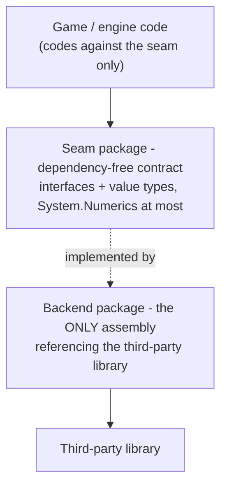

# Dependency seams: how third-party libraries stay swappable

KhaozEngine wraps almost every third-party dependency behind a **seam**: a dependency-free contract
(interfaces + value types) that the rest of the engine codes against, with the real library contained in a
separate, opt-in backend that nobody else references. [RENDER-PIPELINE.md](RENDER-PIPELINE.md) and
[PHYSICS-PIPELINE.md](PHYSICS-PIPELINE.md) are the two worked examples; this doc is the convention they share
and the map of every place it is applied.

## The rule



Three properties fall out of it:

- **Headless-testable.** The seam has no native or GPU dependency, so behaviour is tested against the contract
  (or a fake/loopback/in-memory impl) with no real device. New behaviour ships with a headless test.
- **Swappable.** A second backend is a new `KhaozEngine.<Area>.<X>` package; upstream code is untouched.
- **Pay-for-what-you-use.** Backends that pull a heavy or platform-specific dependency are **opt-in** (not in
  any umbrella metapackage) and added by id, so a consumer that does not need them does not drag them in.

### Mechanically enforced

These graph rules are not just prose. Headless architecture tests in `KhaozEngine.Tests` read the real
`*.csproj` files and fail CI when an edit breaks them:

- `ArchitectureTests.cs` - third-party containment (every third-party PackageReference stays in its allowlisted
  seam/backend home, and any new one must be added to the allowlist deliberately), the layering invariants
  (`Primitives` is the zero-dependency leaf, `Simulation` may reference `Determinism` and nothing else, the
  Foundation umbrella stays GPU-free, `App` never references `Gui`), the locked ProjectReference membership of the four umbrellas, opt-in backends staying out of
  every umbrella's transitive closure, `Render3D` staying seams-only, and the native Direct3D 11 backend
  declaring no `Veldrid` package of its own.
- `GpuPublicApiTests.cs` - reflection guards that walk the public and protected surface of `KhaozEngine.Gpu` and
  fail if any Veldrid type leaks through it, proving the GPU seam keeps Veldrid contained. The same walk runs
  over `KhaozEngine.Gpu.D3D11` for `Veldrid`, `Vortice` and `SharpGen`, since a Direct3D type in a public
  signature would load a Windows-only assembly on a platform that has none. A third guard reads that assembly's
  own references and fails on any `Veldrid` one, which is the only way to catch a Veldrid type crossing through
  an INTERNAL API that no surface scan looks at.

Changing a documented edge therefore means changing the matching expectation in these tests, so the graph and
this doc cannot silently drift apart.

## Every seam in the engine

| Area | Seam (dependency-free) | Backend(s) | Third-party library |
|---|---|---|---|
| GPU / rendering | `KhaozEngine.Gpu` (`GpuDeviceContext` + `GpuInterfaces`, `GpuBackendSelector`, and `GpuBackendProviders` / `IGpuBackendProvider` for a backend that ships outside this package) | (in-package) `Internal/VeldridGpuDevice`, plus `KhaozEngine.Gpu.D3D11` (the engine-owned native Direct3D 11 backend, opt-in and in no umbrella, registered by `KhaozEngineD3D11.Register()`) and any other registered out-of-package provider | Veldrid (+ Veldrid.SPIRV, Vortice.Direct3D11) in the seam. Vortice.Direct3D11 + Vortice.D3DCompiler in the native backend, which declares no Veldrid package of its own |
| 3D physics | `KhaozEngine.Physics` (`IPhysicsWorld`, value-type shapes/poses/queries, and since the floating-origin release also the default-method `Origin` / `CanRebase` / `Rebase(newOrigin)`, so an existing implementer keeps compiling and correctly reports that it cannot rebase - the seam learns a plain `Vector3`, never a frame type, and keeps its zero project references) | `KhaozEngine.Physics.Bepu` (`BepuPhysicsWorld`, which overrides all three: bulk direct pose writes plus broadphase refits over every allocated body set and the statics, so sleeping bodies, contacts and constraints all survive a shift) | BepuPhysics v2 |
| Netcode transport | `KhaozEngine.Netcode` (`INetTransport` incl. the default-method `Stats` -> `NetTransportStats`, `LoopbackTransport`) + `Netcode.Abstractions` | `KhaozEngine.Netcode.LiteNetLib` (fills `Stats` via `EnableStatistics`) | LiteNetLib |
| Persistence | `KhaozEngine.WorldStore` (`IWorldStore`, `InMemoryWorldStore`) | `WorldStore.Sqlite`, `WorldStore.SqlServer` | Microsoft.Data.Sqlite / SqlClient |
| Commerce wallet | `KhaozEngine.Commerce` (`IWalletStore`, `IGrantScheduleStore`, `IEntitlementValidator`, `InMemoryWalletStore`) | `Commerce.Sqlite` (`SqliteWalletStore`), `Commerce.SqlServer` (`SqlServerWalletStore`) | Microsoft.Data.Sqlite / SqlClient |
| Persistence enumeration | `KhaozEngine.WorldStore` (`IEnumerableWorldStore`, `WorldStoreEntry`) | `InMemoryWorldStore`, `SqliteWorldStore`, `SqlServerWorldStore` (all three implement it) | (no extra dep; streaming `EnumerateAsync(keyPrefix?)`) |
| Server ban list | `KhaozEngine.NetWorld` (`IBanStore`, `InMemoryBanStore`) | `WorldStoreBanStore` (persists over any `IWorldStore` keyspace `ban:{accountId}`) | (no extra dep; sync `IsBanned` via in-memory cache, `LoadAsync()` at startup) |
| Per-cell world persistence | `KhaozEngine.NetWorld` (`ICellPersistenceHost`, the surface `CellPersistence` drives, `ShardedWorldServer` implements it; since 9.33.0 the host also carries `TryRestoreCell` for a non-throwing quarantining restore, a default interface method so existing implementers are unaffected; since 10.0.0 the NetId high-water it carries - `NextNetId` / `EnsureNextNetIdAtLeast` - and the restored-id list are 64-bit `long`) | `CellPersistence` (+ `CellPersistenceConfig` with `RegisterMigration` + engine-provided migrations via `IncludeEngineMigrations`, `WorldMetaRecord`) wires it to any `IWorldStore`, migrating / quarantining / retaining on load and surfacing `CellPersistence.Issue` | Microsoft.Data.Sqlite / SqlClient (via the `IWorldStore` backend already chosen) |
| Cell eviction (unloading idle cells) | `KhaozEngine.NetWorld` (`ICellEvictionHost`, which EXTENDS `ICellPersistenceHost` with `CanEvictCell` / `EvictCell` / `TryReadEvictionSignals`, implemented by `ShardedWorldServer`), plus the policy seam `KhaozEngine.Sharding.ICellEvictionPolicy` over `CellEvictionSignals`, which is the game's to replace | `CellEvictor` (+ `CellEvictionConfig`) persists each candidate through `CellPersistence` and removes it from the `ShardHost` only once the write lands, restoring an evicted coordinate on recreation. The shipped policy is `IdleCellEvictionPolicy` | (no extra dep, it rides whichever `IWorldStore` backend `CellPersistence` already has) |
| World pickups (walk-over collectibles) | `KhaozEngine.NetWorld` (`IWorldPickupHost`, the surface `WorldPickups` drives, implemented by BOTH `WorldServer` and `ShardedWorldServer` - `JoinedSlots` / `TryGetPlayerNetId` / `TryGetPlayerState` / `SpawnEntity` are their pre-existing API verbatim, plus `TryGetEntity` / `DespawnEntity`, the resolve-and-remove halves `SpawnEntity` had been missing, neither of which ever touches a player entity) | `WorldPickups` (+ `WorldPickupsConfig` carrying the `OnCollect` decision hook and `OnRemoved`, the replicated `PickupState` built-in at `MoveProtocol.PickupTypeId`) owns spawn, the owner tag, the time-to-live, the linear proximity scan and the despawn | (no extra dep. The payload is an opaque game-defined `long` the engine never interprets, and the ownership RULE lives in the consumer's `OnCollect`) |
| Audio | `KhaozEngine.Audio` (`IMusicBackend`, `ISfxBackend`, `Null*` no-op defaults) | (in-package) `OpenAlMusicBackend` / `OpenAlSfxBackend` | Silk.NET.OpenAL (+ NLayer mp3 / NVorbis ogg decode, contained) |
| Server-status fetch | `KhaozEngine.ServerStatus` (`IServerStatusSource`, `ServerStatusReport` wire contract, `ServerStatusClient`, `ServerStatusEvaluator`) | (in-package) `HttpServerStatusSource`, a fake source in tests | System.Net.Http (BCL `HttpClient`, contained in `HttpServerStatusSource`) |
| Server heartbeat (liveness) | `KhaozEngine.ServerStatus` (`IServerHeartbeatSink`, `ServerHeartbeat`, `Null`/`InMemory` reference sinks, `ServerHeartbeatService`) | **game-side** (the one-table upsert against the status DB), no engine backend package | Microsoft.Data.SqlClient / any - in the game, never the engine |
| Social / presence | `KhaozEngine.Social` (`ISocialProvider`, value types, `NullSocialProvider` no-op, `SocialPresenceController`) | `KhaozEngine.Social.Discord` (`DiscordSocialProvider`) | none - hand-rolled Discord IPC over `System.IO.Pipes` / `System.Net.Sockets` (no third-party lib) |
| Player identity | `KhaozEngine.Identity` (`IIdentityProvider`, `IIdentityValidator`, `ITokenCache` + `FileTokenCache`, `IBrowserLauncher`, `ILoopbackListener`, `IdentitySession` orchestrator, `SessionToken` HMAC) | `KhaozEngine.Identity.Oidc` (`OidcClientProvider`, `OidcTokenValidator`, `SystemBrowserLauncher`, `HttpLoopbackListener`), `KhaozEngine.Identity.Discord` (`DiscordClientProvider`, `DiscordTokenValidator`) | Microsoft.IdentityModel.Protocols.OpenIdConnect + Microsoft.IdentityModel.JsonWebTokens (Oidc only); Discord backend has no third-party lib (plain HTTP token-introspection call) |
| Windowing / input | `KhaozEngine.Windowing` `AppWindow` is the sole toucher; everyone reads the immutable `InputState` via `InputManager`/`Pointer` (input IN), and drives gamepad rumble OUT through `AppWindow.Rumble` (`IRumble`; pure `RumbleMixer` + Silk `IRumbleOutput` sink; `NoopRumble` headless). GLFW backend exposes no motors, so rumble no-ops there | (containment, not a swap) | Silk.NET / GLFW |
| glTF load | `KhaozEngine.Render3D` `GltfLoader` (returns engine `GltfMesh`/`AnimationClip`/`Skeleton`) | (containment, in loader) | SharpGLTF |
| Image decode | `KhaozEngine.Render2D` `ImageRgba` (`Decode`/`Load` -> engine RGBA8 value type) | (containment, in `ImageRgba`) | StbImageSharp |
| Font rasterization | `KhaozEngine.Render2D` `SpriteFont` (glyphs baked to an engine texture atlas) | (containment, in `SpriteFont`) | StbTrueTypeSharp |
| Content validation | `KhaozEngine.Content` `JsonSchemaValidator` (`Validate` -> engine `ValidationReport`) | (containment, in validator) | JsonSchema.Net |
| MCP server protocol | `KhaozEngine.MapEdit.Tool` (`Program.cs`, the `ke-mapedit` dev tool, not an engine package) is the sole referencer, no engine package references the SDK | (containment, not a swap) | ModelContextProtocol SDK |

`KhaozEngine.Sharding` gained the snapshot/restore primitives the per-cell persistence seam above is built on
(`CellSim.SnapshotOwned`/`RestoreOwned`/`MaxOwnedNetId`, `ShardHost.CellCreated`/`EnsureCell`) with no storage
dependency added: Sharding stays a pure ECS/Replication container and only returns/accepts `byte[]` snapshots.
Storage stays where it already lived, in `NetWorld` (`CellPersistence`) over `IWorldStore`. Cell eviction splits the
same way: the mechanical removal (`ShardHost.RemoveCell`/`CanRemoveCell`/`CellRemoved`) and the policy seam are
Sharding, while the persist-then-evict orchestration that decides a cell's bytes are durable is `NetWorld`
(`CellEvictor`). The inter-cell link seam grew two default-implemented members for it, `ICellLink.HasPending`
(eviction gate, defaults to `true` so a link that cannot answer blocks a lossy unload) and `ICellLink.Forget`
(defaults to a no-op), so an existing implementation is unaffected.

## Admin endpoint package edge

`KhaozEngine.Server.Admin` sits outside the seam/backend pattern: it is not a backend (there is no second
implementation of `IAdminControllable` - the seam is in `NetWorld`), but it is deliberately NOT in the `Server`
umbrella because it is the only package that references ASP.NET Core (via a `FrameworkReference` on
`Microsoft.AspNetCore.App`). Its dependency edge is:

```
KhaozEngine.Server.Admin -> KhaozEngine.NetWorld (IAdminControllable, IBanStore, ServerAdmin)
KhaozEngine.Server.Admin -> KhaozEngine.WorldStore (IEnumerableWorldStore)
KhaozEngine.Server.Admin -> Microsoft.AspNetCore.App [shared framework, FrameworkReference]
```

A server that does not want an admin HTTP endpoint never references `Server.Admin`, so the web stack stays
out of its dependency closure.

The game-registered admin action registry (`ServerAdmin.RegisterAction`/`ActionNames`/`TryGetAction`, since
10.131.0) lives on `ServerAdmin` itself, on the `NetWorld` side of this edge, not in `Server.Admin`. The
`/actions` HTTP routes in `Server.Admin` are a thin dispatch shell over that registry, so this edge is
unchanged: `Server.Admin` still only references `NetWorld`, `WorldStore`, and `Microsoft.AspNetCore.App`.

## Commerce wallet seams

`KhaozEngine.Commerce` splits into three seams, not one, because the wallet has three independent axes a
game can swap:

- **`IWalletStore`** - the durable, transactional wallet backing store. Credit/Debit are atomic and
  idempotent by an `idempotencyKey`, scoped per `(account, currency)`; `GetBalanceAsync`/`GetLedgerAsync`
  read it back. `InMemoryWalletStore` (in the core package) is the reference/test backend; `Commerce.Sqlite`
  and `Commerce.SqlServer` are the durable opt-in backends, same contract, same idempotency semantics.
- **`IGrantScheduleStore`** - persists the next-available instant per `(account, rewardId)` for
  `PeriodicGrant`. Last-write-wins is safe here because the wallet's credit idempotency key is the real
  double-grant guard, not this store. The first-ever (bootstrap) claim keys on a fixed sentinel retained
  in the wallet ledger, so it is a permanent one-shot: clearing this store while retaining the wallet
  ledger denies the re-grant. `InMemoryWalletStore` implements both `IWalletStore` and
  `IGrantScheduleStore`, and so do the two SQL backends.
- **`IEntitlementValidator`** - turns an untrusted external proof (`EntitlementProof`: a webhook body, a
  store receipt) into a `VerifiedEntitlement`, or null if invalid. No default implementation ships: the
  proof format and the trust decision are consumer-specific (a webhook signature, a platform receipt
  verification API), so this seam has no `InMemory*` reference impl, unlike the two store seams above.

Dependency edges:

```
KhaozEngine.Commerce -> KhaozEngine.Progression (PeriodicGrant is built on WallClockRewardSchedule)
KhaozEngine.Commerce.Sqlite -> KhaozEngine.Commerce, Microsoft.Data.Sqlite
KhaozEngine.Commerce.SqlServer -> KhaozEngine.Commerce, Microsoft.Data.SqlClient
```

Same shape as the `WorldStore` persistence seam above (dependency-free contract + opt-in SQL backends,
neither backend bundled in the `Server` umbrella), but a distinct seam: `IWorldStore` is opaque-bytes
last-write-wins and cannot express atomic increments or idempotency, which a currency ledger needs.

## Localization package edges

Compile-time localization enforcement adds two edges, both acyclic:

```
KhaozEngine.Gui -> KhaozEngine.App           (the LocalizedText sink type + StringId + LocalizationContext)
KhaozEngine.Game2D/Game3D -> KhaozEngine.Localization.Analyzers   (packed dependency, include="All", so the
                                                                   analyzer is applied in the consumer's build)
```

`App` is a pure-BCL foundation package (it references only `Diagnostics` and `Platform`, both GPU-free leaves)
and never references `Gui`, so the new `Gui -> App` edge introduces no cycle. `KhaozEngine.Localization.Analyzers` is a `netstandard2.0` Roslyn
analyzer with no runtime dependency; it ships its assembly under `analyzers/dotnet/cs` and flows to a game only
through the `Game2D`/`Game3D` umbrellas (a project that references neither never sees it). The marker attributes
it reads (`LocalizationExemptAttribute`, `LocalizationStringSinkAttribute`) live in `App`, so the analyzer keys
off fully-qualified names, not a hard reference.

A third edge is test-only:

```
KhaozEngine.Localization.TestKit -> KhaozEngine.App   (reads StringId.Key to extract keys from a game's key class)
```

`KhaozEngine.Localization.TestKit` is a coverage-test helper a game references from its **test project**. It is in
no umbrella (a runtime build never pulls it) and references `App` only to read `StringId`, so the edge is acyclic
and carries no weight into shipped game code.

The file-size ratchet adds one more analyzer edge, from every umbrella:

```
KhaozEngine.Game2D/Game3D/Server/Foundation -> KhaozEngine.CodeHealth.Analyzers   (packed dependency,
                                                    PrivateAssets="none", so the analyzer runs in the consumer's build)
```

`KhaozEngine.CodeHealth.Analyzers` is a `netstandard2.0` Roslyn analyzer with no runtime dependency. It ships its
assembly under `analyzers/dotnet/cs` and its `buildTransitive` props auto-discover the consumer's `.filesize-baseline`
and hand it to the analyzer as an `AdditionalFile`, so the edge is analyzer-only and drags nothing into shipped game
code. All four umbrellas carry it (a file-size ratchet is not renderer- or server-specific), so any project that
references an umbrella gets the ratchet.

## Self-relaunch seam: process control

Cooperative self-restart (`KhaozEngine.App.AppRelaunch`) adds one edge, acyclic:

```
KhaozEngine.App -> KhaozEngine.Platform   (IProcessControl: resolve the running exe/pid/args/managed entry,
                                           spawn a detached instance, wait for a pid to exit)
```

`IProcessControl` gained one member in 17.23.0, `CurrentManagedEntryPath`, so the seam can name the app under
`dotnet <app>.dll` where `CurrentExecutablePath` resolves to the shared dotnet muxer instead. It has a DEFAULT
implementation returning null, which keeps an existing external implementation of a shipped public interface
compiling, and null simply means that shape is not repaired. No new edge: it reads `Environment` like the members
beside it.

`Platform` is a zero-ProjectReference leaf (pure BCL P/Invoke), so `App -> Platform` cannot cycle and keeps
`App` GPU-free. The process operations are behind `IProcessControl` (the seam) so the relaunch orchestration
is headless-testable against a fake; `ProcessControl.System` is the real one.

This is the generalized form of the desktop auto-updater's parent-pid-wait relaunch. The updater
(`KhaozEngine.Updates`) keeps its own `IUpdaterEnvironment` with tuned, updater-specific behaviour (antivirus /
torn-image retry, elevation, relocation, and a deliberately non-truthful `IsProcessAlive` on POSIX), so it was
NOT retrofitted onto `IProcessControl` - the two share the *pattern* (start a successor, have it wait on the
predecessor's pid so it never races the file the predecessor writes during shutdown), not the code. Collapsing
part of the updater's env onto the new primitive would split its process ops across two homes for no real gain,
so they stay separate.

## Single-instance guard seam: foreground signaling

`KhaozEngine.App.SingleInstanceGuard` adds one testability seam, no new package edge into the umbrella
closures (the packages it touches were already reachable):

```
KhaozEngine.App -> (BCL only: System.Threading.Mutex, System.IO)   (ISingleInstanceLock / SystemSingleInstanceLock)
KhaozEngine.Game -> KhaozEngine.App           (was already transitive via Gui -> App; made direct because
                                               GameApp calls SingleInstanceGuard.TryAcquire directly)
KhaozEngine.Game -> KhaozEngine.Diagnostics   (was already transitive via Gui -> App -> Diagnostics; made
                                               direct because GameApp logs the conflict path via Log.Info
                                               directly)
```

`ISingleInstanceLock` splits into two independent OS operations: ownership (claim-and-hold a key) and a
foreground-request signal (a losing second launch telling the current owner "come forward"). Ownership is a
named `Mutex` - confirmed the one named synchronization primitive .NET actually implements off Windows. The
foreground signal is deliberately **not** a named `EventWaitHandle` or `Semaphore`: both throw
`PlatformNotSupportedException` on macOS/Linux (confirmed against the .NET 10 runtime directly, not assumed
from docs - an early implementation using a named `EventWaitHandle` passed on Windows-shaped assumptions but
silently never signaled cross-instance off Windows, since the constructor call was wrapped in a swallow-all
try/catch). `SystemSingleInstanceLock` instead touches a small polled marker file under the OS temp
directory, which works identically on every platform this engine targets. The seam is what makes this
headless-testable: `KhaozEngine.Tests.App.SingleInstanceGuardTests` covers the guard's orchestration against
a fake `ISingleInstanceLock`, plus a couple of real-primitive integration tests (mutex contention across
threads, the marker-file signal) against `SystemSingleInstanceLock` itself.

This is deliberately a sibling of `AppRelaunch`'s `IProcessControl` seam, not a member of it - same
"headless-testable OS operation behind an interface" pattern, but ownership-and-signaling is a different
contract from process spawn-and-wait, so it gets its own seam rather than growing `IProcessControl` a second
unrelated responsibility.

## Design-viewport seam: device-pixel snapping

`IDesignViewport` (`KhaozEngine.Primitives`) is the design-viewport seam. Its implementers all live in
`KhaozEngine.Windowing`: `DesignViewport`, `AdaptiveViewport`, and `UiViewport` (the point-space viewport for
DPI-aware UI). The seam gained a `SnapsToDevicePixels` member, a default-interface-member defaulting
to `false`: `DesignViewport` / `AdaptiveViewport` inherit `false`, and `UiViewport` returns `true`. `SpriteBatch`
reads the flag through the seam to confine device-pixel snapping to the point-space path, so no new dependency
edge is introduced (`Render2D` already depends on `Primitives`).

The seam also carries `WindowBounds` (10.38.0), a default-interface-member giving the whole window mapped into
design space (`DesignBounds` plus the letterbox bars). It is derived from the existing scale + offset, so it needs
no new seam data and every implementer - including consumer test stubs - gets it for free; the three engine
viewports override it concretely (`DesignViewport` with the letterbox formula, `AdaptiveViewport` / `UiViewport`
returning `DesignBounds` since they never letterbox). `KhaozEngine.Gui` reads it to fill full-window scrims /
backgrounds through the same seam, no new edge.

## Server-status seams

`KhaozEngine.ServerStatus` carries two independent seams, both dependency-free (BCL + `KhaozEngine.Diagnostics`
+ `KhaozEngine.Primitives` only), so a game client and a headless server can both reference the package
without dragging in a web stack or a database driver.

- **`IServerStatusSource`** - the client-side fetch seam. The default `HttpServerStatusSource` contains a BCL
  `HttpClient` (HTTPS enforced, response size-capped, every transport/parse error swallowed to null), the same
  containment pattern as `HttpUpdateSource`. Tests inject a fake, so the poller and the state evaluator run
  headless with no sockets. There is no second HTTP backend planned, the seam exists for testability.
- **`IServerHeartbeatSink`** - the server-side liveness-write seam. Unlike the `WorldStore` / `Commerce`
  persistence seams, the durable SQL implementation is **not** an engine opt-in package: it lives in the game
  (or the game-template infra recipe). The status DB's schema and the one-row upsert are per-game cloud infra,
  and the game server already owns SQL access, so the engine ships only the contract plus `Null` / `InMemory`
  reference sinks and the `ServerHeartbeatService` cadence driver. Keeping the SQL out of the engine is what
  lets a game *client* reference `ServerStatus` for the poller without ever pulling a database driver.

```
KhaozEngine.ServerStatus -> KhaozEngine.Diagnostics   (logging only, no GPU, no DB, no web stack)
KhaozEngine.ServerStatus -> KhaozEngine.Primitives    (VersionComparer: shared numeric x.y.z compare)
```

The design authority split (CI/CD writes deploy facts, the game server heartbeats liveness, the endpoint
derives health, the client polls + evaluates) is documented in the package README and `USING-KHAOZENGINE.md`.
The public status endpoint itself (an Azure Function) is game infra and is NOT an engine artifact.

## Client job-scheduler seam: Game references Simulation

Turn-key client-side multi-core ECS scaling adds one edge, acyclic:

```
KhaozEngine.Game -> KhaozEngine.Simulation   (IJobScheduler / ThreadPoolJobScheduler / SingleThreadedJobScheduler)
```

`GameApp.JobScheduler` hands a game a shared worker-pool scheduler it wires into a world once
(`world.DefaultScheduler = App.JobScheduler`), so the type it returns (`IJobScheduler`, built as a
`ThreadPoolJobScheduler`) has to be visible from `KhaozEngine.Game`. `KhaozEngine.Simulation` sits at the bottom
of the server/netcode stack and owns the scheduler abstraction (the same one `ShardHost.Scheduler` uses on the
server),
so the new `Game -> Simulation` edge introduces no cycle: `Simulation` never references `Game`, `Windowing`, or
any renderer. The edge was already reachable transitively (`Game` pulls `Ecs` via the umbrellas, and
`Ecs -> Simulation`), but is made direct so `KhaozEngine.Game` alone, with no `Ecs`/`Foundation` reference, still
exposes the property. `World.DefaultScheduler` itself is the per-world seam in `KhaozEngine.Ecs`: it defaults to a
`SingleThreadedJobScheduler`, so a world stays byte-identical until a game opts in, and an explicit per-call
scheduler still wins over it.

## Determinism at the scheduling boundary: Simulation references Determinism

The floating-origin major added one edge, acyclic, and it cost `KhaozEngine.Simulation` its zero-dependency-leaf
status:

```
KhaozEngine.Simulation -> KhaozEngine.Determinism   (DeterministicFpScope, around each ThreadPoolJobScheduler body)
```

`DeterministicFp` pins the floating-point control register (rounding mode, FTZ/DAZ, trap masks) on the CALLING
THREAD only, by its own contract. `ThreadPoolJobScheduler.For` hands its body to arbitrary BCL thread-pool workers,
which are neither the calling thread nor a dedicated sim thread, so their register is whatever the pool last left
it at - which is the exact class of bug the scope exists to remove, reintroduced one layer up at the
job-scheduling boundary (issue #197). Applying the scope there rather than at each call site means a consumer's own
`For()` is covered too. `ShardHost.Tick` installs the same scope around each cell's step, so the guarantee holds
whichever scheduler is in use. Entering twice is harmless, since the inner scope restores exactly what the outer
one had already made canonical.

`Determinism` references only `Diagnostics` (for one startup warning), so the transitive closure stays headless
and GPU-free and every umbrella-purity guard is unaffected. The architecture test is narrowed rather than deleted:
`Simulation` may reference `Determinism` and nothing else.

## Cell islands: Sharding references Physics

A frame is a property of a SPACE, and a physics world IS a space, so a shard cell owns both or neither:

```
KhaozEngine.Sharding -> KhaozEngine.Physics   (CellSim.Physics, the cell's own IPhysicsWorld)
```

`KhaozEngine.Physics` is itself a zero-project-reference seam package (it declares only `System.Numerics`), so the
edge adds nothing to the closure but the seam types. `CellSim` holds the world, disposes it with the cell, and
never touches its contents: the consumer builds and populates it through
`ShardedWorldServerConfig.PhysicsWorldFactory`, and the engine never adds a static to a cell world.

The conversion of an entity ARRIVING in a cell is the other half, and it does NOT add an edge. `Sharding` knows
nothing about `ReplicatedPosition` (that type is one layer up, in `NetWorld`, which references `Sharding`), so the
cell calls out through `ICellFrameAdapter` at each door an entity can arrive by and the layer that owns the
component supplies the conversion.

## Version comparison: one shared leaf, two thin wrappers

`KhaozEngine.Primitives.VersionComparer` is the single numeric, dot-separated `x.y.z` version-compare rule
in the engine. `KhaozEngine.Updates.UpdateVersion.IsNewer` and `KhaozEngine.ServerStatus.VersionOrder`
(`Compare`/`IsBelow`) both delegate to it instead of carrying their own copy:

```
KhaozEngine.Updates -> KhaozEngine.Primitives        (VersionComparer: IsNewer delegates)
KhaozEngine.ServerStatus -> KhaozEngine.Primitives   (VersionComparer: Compare/IsBelow delegate)
```

Before this, `VersionOrder` deliberately mirrored `UpdateVersion`'s segment-compare code rather than
referencing `KhaozEngine.Updates` directly, to avoid pulling the whole delta-update pipeline (+ `Platform`)
into a package a status-poller-only client would reference. `Primitives` being the zero-dependency leaf both
packages already sit above removes that trade-off: a shared home with no new heavy edge. Both public types
keep their existing signatures, so no caller-visible change. The one behavioural difference between the two
originals was null handling: `VersionOrder` already treated a null/blank version as the empty, all-zero
version, while `UpdateVersion.IsNewer`'s non-nullable parameters meant a null argument fell through to an
incidental `NullReferenceException` from an unguarded `Split` call. Since `VersionComparer` is null-tolerant
(needed for `VersionOrder`), `UpdateVersion.IsNewer` now guards explicitly with
`ArgumentNullException.ThrowIfNull` before delegating, so a null argument still fails loudly with a
documented, more precise exception type instead of silently comparing as `0.0.0`.

## Pathfinding seam: IPathPlanner

`KhaozEngine.Navigation` adds five edges, all acyclic:

```
KhaozEngine.Navigation -> KhaozEngine.Primitives   (System.Numerics only)
KhaozEngine.Navigation -> KhaozEngine.Collision     (WorldColliders footprints, NavGridBaker.BakeOverworld)
KhaozEngine.Navigation -> KhaozEngine.Terrain       (TerrainCollision slope, NavGridBaker.BakeOverworld)
KhaozEngine.Dungeon -> KhaozEngine.Navigation       (DungeonNav.Bake turns a DungeonLayout into a NavSpace)
KhaozEngine.Foundation -> KhaozEngine.Navigation    (umbrella ProjectReference, like every other Foundation package)
```

`IPathPlanner` (`FindPath(start, goal, agentRadius, budget) -> NavPath`) is the seam callers code against.
`GridPathPlanner` is the one shipped implementation, grid A* over a `NavSpace`. Unlike the seams in the table
above, there is no third-party library on the other side of this one: the point of the interface is not
containment but swappability of the *algorithm* itself, so a future planner (a navmesh, a flow field, a
hierarchical search) can replace or sit alongside `GridPathPlanner` without touching `PathFollower` or any
other call site. `PathFollower` and `PathPlannerExtensions.FindPath` (the default-budget convenience
overload) depend on the interface only, never on `GridPathPlanner` directly.

`Dungeon -> Navigation` is a forward edge onto a package that itself sits earlier in the dependency graph:
`Navigation` depends only on `Primitives`/`Collision`/`Terrain`, all of which `Dungeon` already reached
transitively through `MapDoc` (`MapDoc -> Terrain`, and `Terrain` itself depends on both `Primitives` and
`Collision`), so the new edge introduces no cycle. `DungeonNav.Bake` lives in `KhaozEngine.Dungeon` and
returns a `KhaozEngine.Navigation.NavSpace`, but nothing in `Navigation` references `Dungeon` back.

## Surface-source seam: INavSurfaceProvider (a deliberate non-edge)

The step-aware overworld bake (`NavGridBaker.BakeOverworldSteps`) needs a per-cell walkable surface
height. The obvious source for a game with real physics is a downward probe against its `IPhysicsWorld`
(`PhysicsGroundProbe` or similar), which would suggest a `KhaozEngine.Navigation -> KhaozEngine.Physics`
edge. That edge was deliberately NOT added:

```
KhaozEngine.Navigation -> KhaozEngine.Primitives   (unchanged)
KhaozEngine.Navigation -> KhaozEngine.Collision     (unchanged)
KhaozEngine.Navigation -> KhaozEngine.Terrain       (unchanged)
KhaozEngine.Navigation -x KhaozEngine.Physics       (no edge - INavSurfaceProvider is the seam instead)
```

`INavSurfaceProvider` (`TrySample(x, z, out height, out headroom) -> bool`) is the surface-source seam:
`KhaozEngine.Navigation` codes against the interface only. `TerrainSurfaceProvider`, the shipped default,
implements it over `KhaozEngine.Terrain`/`KhaozEngine.Collision`, both dependencies the package already
has. A game that wants a physics-probe surface instead implements `INavSurfaceProvider` itself (or wraps a
delegate in `DelegateSurfaceProvider`) in its own code, over its own `IPhysicsWorld`, and hands the
provider to `BakeOverworldSteps`. The hop bake (`NavGridBaker.BakeOverworldHops`) reads its heights
through the same provider seam as `BakeOverworldSteps`, so hop-link generation adds no dependency
either. `KhaozEngine.Navigation`'s dependencies stay exactly `Primitives`,
`Collision`, `Terrain`, matching the package-global rule that a nav bake never re-touches a physics world
at query time (it already does not re-touch `TerrainCollision`/`WorldColliders` either, per
`NavGridBaker.BakeOverworld`). This is the same shape as the pathfinding seam above: an interface exists
not to contain a third-party library, but to keep an optional data source out of a package's dependency
graph while still letting a consumer plug one in.

**Phase 2 widens the same seam to many surfaces per column, the same non-edge.** The layered overworld
bake (`NavLayerBaker.BakeOverworldLayered`, vertical worlds phase 2, issue #30) needs more than one
walkable surface per XZ column, since a bridge deck over a path or a roofed interior under its roof puts
two standable surfaces at the same point, and `INavSurfaceProvider.TrySample` can only ever report one.
`INavColumnProvider` (`SampleColumn(x, z, Span<NavSurfaceSample>) -> int`) is that widening: every
standable surface in the column, bottom-up, each with its own headroom. It inverts exactly like
`INavSurfaceProvider` did, so the dependency graph does not change:

```
KhaozEngine.Navigation -> KhaozEngine.Primitives   (unchanged)
KhaozEngine.Navigation -> KhaozEngine.Collision     (unchanged)
KhaozEngine.Navigation -> KhaozEngine.Terrain       (unchanged)
KhaozEngine.Navigation -x KhaozEngine.Physics       (still no edge - INavColumnProvider is the seam)
```

`SurfaceColumnAdapter` wraps an `INavSurfaceProvider` so a phase-1, single-surface world can run through
the layered bake unchanged (degenerating to one layer), and `DelegateColumnProvider` mirrors
`DelegateSurfaceProvider` for a provider supplied as a plain delegate. The physics-side counterpart is
`PhysicsColumnProbe` in `KhaozEngine.Physics`: a repeated downward raycast sweep that reports every
standable surface in a column with its headroom to the hit above it, the same STATICS-ONLY stance as
`PhysicsGroundProbe`. Physics cannot reference Navigation any more than Navigation can reference Physics
(the layering forbids the reverse edge too), so the game glues `PhysicsColumnProbe.Sample` to
`INavColumnProvider.SampleColumn` with a one-line delegate. No new package, no new dependency edge either
direction.

## GPU backend-selection provenance: one new edge, `Gpu -> Diagnostics`

Since 17.21.0 `KhaozEngine.Gpu` references `KhaozEngine.Diagnostics`, so `GpuDeviceContext` can log which
backend it selected and where that decision came from:

```
KhaozEngine.Gpu -> KhaozEngine.Diagnostics   (logging only: one INFO line per created device naming the
                                              backend and its origin, plus a WARN when KE_GRAPHICS_BACKEND
                                              was set to something unparseable)
```

The edge is legitimate rather than a layering break. `Diagnostics` is a dependency-free leaf (its own catalog
row is "Pure .NET") and is already referenced by GPU-stack peers `Audio`, `Gui`, and `Terrain`, so it adds
nothing to any closure and changes no umbrella membership. It cannot reintroduce GPU into the GPU-free
`Foundation` / `Server` closures either, because the edge runs FROM `Gpu`, not INTO it. `ArchitectureTests`
needed no rule change: it constrains third-party `PackageReference` homes and umbrella membership, and this is
an engine-internal `ProjectReference` that alters neither.

Why it is worth an edge at all: without it, a mistyped `KE_GRAPHICS_BACKEND` is indistinguishable from the OS
default. The selector falls back to the probe, the run produces a perfectly ordinary trace, and the result reads
as "the requested backend did not help" when that backend never ran. `GpuBackendSelection` records the
provenance and the raw override value, and this edge is what lets the engine say so out loud.

The edge has since carried more per-device traffic without changing shape: the 17.22.0 Direct3D11 driver-threading
line and its WARN, and 17.24.0's adapter line, its Windows overlay-injector line and WARN, and the INFO line for
the `KE_D3D11_PREVENT_THREADING_OPTIMIZATIONS` flag. All of it is logging out of `Gpu` into `Diagnostics`, so the
reasoning above is unchanged and no new reference was needed. The 17.24.0 module scan uses `System.Diagnostics.Process`
from the BCL, not a new package.

### 17.25.0 puts a `Diagnostics` TYPE in a `Gpu` signature for the first time

`GpuTelemetry.WithGpu` fills a `KhaozEngine.Diagnostics.TelemetrySessionInfo` from a device, so the edge now
carries an API surface and not only log calls. Still no new reference and still the same direction, but it is
worth naming because it decided where the bridge lives. `Diagnostics` cannot map the GPU enums itself: it sits
UNDER `Gpu` on this edge, and naming `GpuBackendKind` there would be a cycle. So the header's GPU fields are
plain strings and nullable bools, and the mapping onto them is an extension method in the package that owns the
enums. A consumer holding only an `AppWindow` calls the value overload, which is why `AppWindow` needs no new
member and `Windowing` needs no new edge.

### 17.32.0 adds a second `Diagnostics`-typed `Gpu` surface, and one more seam member

`GpuTelemetryChannels` projects a `GpuDeviceCounters` onto `KhaozEngine.Diagnostics.TelemetryChannel` rows, which
is the same edge in the same direction as `GpuTelemetry.WithGpu` above and needs no new reference either. It is a
SEPARATE type rather than more methods on `GpuTelemetry`, because the two do different jobs: that one fills the
header's creation-time identity once, this one appends numbers that move to every sample row.

The seam member is `IGpuDevice.Counters`, default-implemented like `IGpuDevice.Diagnostics` beside it, so it was
appended without breaking any implementer and every backend that counts nothing answers honestly
(`GpuDeviceCounters.HasValue` false, which is a different fact from counting and finding zero). `GpuDeviceContext`
and `AppWindow` forward it, both reading THROUGH to the device on every access, because unlike everything else the
header carries these numbers change on every frame. Only `KhaozEngine.Gpu.D3D11` fills it.

### The stored backend preference deliberately adds NO edge (17.23.0)

Letting a player pick the backend in game is naturally read as "`Gpu` needs to load a setting", which would mean
a settings or persistence reference and would invert the layering: `KhaozEngine.Gpu` sits at the bottom with
only `Diagnostics` + `Primitives`, and the persistence stack sits above it. So the preference is DATA, a
`GpuBackendKind?` passed down (`GameAppOptions` to `AppWindow` to `GpuDeviceContext`), and the engine does no
file IO for it. The same rule is why the creation fallback only REPORTS
(`GpuBackendSource.FallbackAfterFailure` plus `RequestedBackend`) and never clears the offending setting: the
game owns that write. Direction of flow is what keeps the closure intact, not the size of the dependency.

## D3D11 driver-threading probe: a declared package, not a new seam

Since 17.22.0 `KhaozEngine.Gpu` declares a `PackageReference` to `Vortice.Direct3D11`, and
`ArchitectureTests` maps it to the same `Gpu` home as `Veldrid`:

```
KhaozEngine.Gpu -> Vortice.Direct3D11   (diagnostics only: ID3D11Device::CheckFeatureSupport with
                                         D3D11_FEATURE_THREADING, read once at device creation on
                                         Windows on the Direct3D11 backend, and nowhere else)
```

This adds no dependency the engine did not already have. `Vortice.Direct3D11` IS Veldrid's own D3D11 binding and
has been a transitive dependency of `Veldrid` 4.9.0 the whole time. What changed is that it is now DECLARED,
because `ArchitectureTests.EveryThirdPartyPackage_IsDeliberatelyMapped` requires every third-party reference a
packable library uses to be a deliberate edit rather than something inherited by accident. `Gpu` is the correct
home for THIS use: it is the same seam Veldrid is confined to, reached through the raw `ID3D11Device` pointer
Veldrid itself publishes on `BackendInfoD3D11.Device`, and nothing outside `Internal/D3D11ThreadingProbe` names a
Vortice type inside this package.

`Vortice.Direct3D11` now has a SECOND home, `KhaozEngine.Gpu.D3D11`, and that is a different use rather than a
widening of this one: that package IS the Direct3D 11 interop, so the binding is its subject matter and not a
diagnostic borrowed from a neighbour. Both homes pin the same Vortice 2.3.0 line, which is what Veldrid depends
on, so there is exactly one D3D11 binding and one `SharpGen.Runtime` in the graph. The native backend adds
`Vortice.D3DCompiler` on the same line for its own FXC call, and that one is its alone.

It also does not widen what loads at runtime anywhere else. The probe's guard returns before any Vortice type is
named, so on macOS and Linux, and on any non-Direct3D11 backend, that assembly is never loaded at all. The
containment is therefore stronger than "confined to one package": it is confined to one method, on one OS, on one
backend. Why it is worth having at all is in [USING-KHAOZENGINE.md](USING-KHAOZENGINE.md): a driver that cannot
build command lists makes Windows emulate them in software, and until 17.22.0 nothing could tell that machine
apart from one that was simply slow.

## Out-of-package graphics backends: an INVERTED edge, `GpuBackendProviders`

Every backend before this one lived inside `KhaozEngine.Gpu`, so the seam and its implementation shared an
assembly and the selector could just construct one. A backend that ships in its own opt-in package (the native
Direct3D11 backend is the first) cannot work that way: `Gpu` referencing it would be a cycle, and folding it back
into `Gpu` would make its interop non-optional for every consumer including the Linux server heads.

So the edge is inverted. `KhaozEngine.Gpu` declares `IGpuBackendProvider` and a `GpuBackendProviders` registry
keyed by `GpuBackendKind`, the backend package implements the interface, and the CONSUMING APP joins the two with
one explicit call at startup:

```
KhaozEngine.Gpu.D3D11 -> KhaozEngine.Gpu      (the only direction. Gpu never references a backend package)
consumer              -> both                 (and calls KhaozEngineD3D11.Register() once)
```

Two properties are load-bearing, and both are decisions rather than conveniences. Registration is EXPLICIT, not a
`[ModuleInitializer]` and not reflection by assembly name: the CLR loads an assembly lazily on first type
reference, so a package reference with no static type use does not guarantee an initializer runs, and a silent,
machine-dependent failure is the worst shape for a switch whose purpose is attributing measurements to a backend.
And a MISSING registration throws rather than falling back, which keeps it distinguishable from the genuinely
different fact that a machine cannot run the backend (that one is answered by the provider's own functional probe
and reported through the existing `FallbackAfterFailure` path). Full reasoning in
[design/D3D11-NATIVE-BACKEND-DESIGN-2026-08-02.md](design/D3D11-NATIVE-BACKEND-DESIGN-2026-08-02.md), section 4.1
and decisions P4 and I2.

### The second instance: `KhaozEngine.Gpu.Vulkan`

The pattern above is now used twice, which is what turns it from a one-off into the shape an out-of-package
graphics backend has here. `KhaozEngine.Gpu.Vulkan` is phase 3 of the same program and takes the same inverted
edge. As of `17.34.0` it registers a real provider through `KhaozEngineVulkan.Register()`, answers a real
functional machine probe, and creates a real HEADLESS device
([#514](https://github.com/APKiwiOrg/KhaozEngine/issues/514)) that hands out command lists and submits them
([#517](https://github.com/APKiwiOrg/KhaozEngine/issues/517)), with a real resource factory behind it
([#519](https://github.com/APKiwiOrg/KhaozEngine/issues/519)) and real descriptors
([#520](https://github.com/APKiwiOrg/KhaozEngine/issues/520)). The recording members those lists can serve are
`UpdateBuffer`, which routes to the uniform ring or the per-list staging arena
([#518](https://github.com/APKiwiOrg/KhaozEngine/issues/518)), all four resource-set binds, which record into
a per-slot array and flush as contiguous-run `vkCmdBindDescriptorSets`
([#521](https://github.com/APKiwiOrg/KhaozEngine/issues/521)), and the whole rendering half: the framebuffer
bind, both clears and both scissor members, over a `vkCmdBeginRendering` deferred to the first draw with no
`VkRenderPass` and no `VkFramebuffer` behind it at all
([#522](https://github.com/APKiwiOrg/KhaozEngine/issues/522)). Nothing can be DRAWN yet and nothing can be
presented: the remaining recording members are
[#524](https://github.com/APKiwiOrg/KhaozEngine/issues/524) and
[#525](https://github.com/APKiwiOrg/KhaozEngine/issues/525), pipelines are
[#523](https://github.com/APKiwiOrg/KhaozEngine/issues/523), and the windowed swapchain is
[#527](https://github.com/APKiwiOrg/KhaozEngine/issues/527), which is what the windowed entry point still
refuses by name. It registers under `GpuBackendKind.VulkanNative`, which landed in `17.32.0`, so the
backend is selectable by name (`KE_GRAPHICS_BACKEND=vulkan-native`) and the windowed refusal arrives through the
reported fallback. Nothing selects it by default.

```
KhaozEngine.Gpu.Vulkan -> KhaozEngine.Gpu      (the only direction, again)
KhaozEngine.Gpu.Vulkan -> KhaozEngine.Diagnostics   (the probe's one log line, same as the D3D11 instance)
KhaozEngine.Gpu.Vulkan -> Silk.NET.Vulkan(+.Extensions.KHR/.EXT)
```

Two things differ from the Direct3D 11 instance, and both are worth knowing before reading one package as a
template for the other.

**No platform guards, and their absence is the decision** (V-P1 of
[design/VULKAN-NATIVE-BACKEND-DESIGN-2026-08-05.md](design/VULKAN-NATIVE-BACKEND-DESIGN-2026-08-05.md)). The
D3D11 package targets `net10.0` and then spends a whole `[SupportedOSPlatformGuard]`-over-`NoInlining`
apparatus keeping the Vortice interop off the load path on macOS and Linux, because Direct3D is a Windows API
in an assembly that must load everywhere. Vulkan is not: the same managed code runs on Windows and Linux, the
loader resolves at runtime, and a machine without one fails the functional probe and routes through the
existing fallback. So the Vulkan package has no OS-suffixed TFM, no guard attributes and no `NoInlining`
bodies, and adding them back by analogy would create a boundary the backend does not have.

**The binding is contained the same way the Veldrid one is.** `Silk.NET.Vulkan` and its two extension packages
are mapped to `Gpu.Vulkan` alone in `ArchitectureTests.ThirdPartyHomes`, and no `Silk` type may appear on the
package's externally visible surface (`GpuPublicApiTests.GpuVulkanPublicApi_DoesNotLeakBackendTypes`). The
reason is the seam rather than the load path: a `Silk.NET.Vulkan` type in a public signature makes a consumer
that merely reads it compile against the Vulkan binding, which turns an opt-in backend into a second GPU
vocabulary the engine would owe stability to. Both packages also have their surface pinned member by member
(`GpuD3D11PublicSurface_IsExactlyTheApprovedMembers` and `GpuVulkanPublicSurface_IsExactlyTheApprovedMembers`),
which is what catches a new member that leaks no forbidden type and is therefore invisible to every scan above.

**Both packages grant `InternalsVisibleTo` to `KhaozEngine.TestSupport.Gpu`, and that is the whole cost of one
decision.** Section 2.2 of the Vulkan design declined to extract either backend's uniform ring into a shared
PRODUCTION home, on the rule of three and on the observation that the policy is identical where the mechanism is
not. What is shared instead is the ring's SEMANTIC tests, run against both rings through one internal test-only
interface plus one adapter per backend, all of which live in `KhaozEngine.TestSupport.Gpu`. That project is
`IsPackable=false` and `IsTestProject=false`, so it ships nothing and no shared production home exists, and it
already references both backend packages for the `[GpuFact]` registration seats. So the visibility this costs is
one csproj line each, beside the `KhaozEngine.Render.Tests` grant both already carried. The edge direction is
unchanged: `TestSupport.Gpu -> Gpu.D3D11` and `TestSupport.Gpu -> Gpu.Vulkan`, never the reverse.

The no-Veldrid rule below applies to BOTH packages, and both assertions are theories over the two of them.

### What the backend package may reference, and the one edge it may NOT

`KhaozEngine.Gpu.D3D11` references `KhaozEngine.Gpu`, `KhaozEngine.Diagnostics` (so the support probe can say
WHY a machine is unsupported instead of answering a bare false), `Vortice.Direct3D11` and `Vortice.D3DCompiler`.
It declares NO `Veldrid` package, and that is decision P2 rather than an accident of ordering.

The shader path needs SPIRV-Cross, which arrives as `Veldrid.SPIRV`. Referencing it from the backend would be
the obvious shortcut and is rejected twice over: blessing a Veldrid package inside a backend whose entire premise
is being Veldrid-free is a bad signal no guard would catch, and it would scatter the eventual SPIRV-Cross
replacement across three packages instead of one. The edge stays in `KhaozEngine.Gpu` behind the internal
`Internal/SpirvCrossCompile` helper plus `InternalsVisibleTo`, which is where it already belongs: this package
owns `ShaderValidation`, which uses precisely that static API with no device in existence.

```
KhaozEngine.Gpu.D3D11 -> Vortice.Direct3D11, Vortice.D3DCompiler   (its subject matter)
KhaozEngine.Gpu.D3D11 -> Veldrid*                                  (never, asserted two ways)
```

`Vortice.D3DCompiler` is CALLED from exactly ONE type, `Internal/D3D11Fxc`, which compiles emitted HLSL to DXBC
and reflects a vertex module's input signature. One further type names it without calling it:
`Internal/D3D11ShaderDebug` takes its two FXC flag values from `Vortice.D3DCompiler.ShaderFlags` in `const uint`
initializers, so the compiler folds them to literals and the built assembly carries the numbers rather than the
type. Both shapes are covered by the same load-path guard, `D3D11InteropLoad.AssertNotLoaded`, which asserts the
interop is absent from the process rather than reasoning about which reference survived compilation. Everything
else in the shader path (the target profiles, the cache key, the disk cache and the holed-signature rule) names
no Direct3D type at all, and all of it is tested headlessly on macOS and Linux. One FXC call site is also what lets
`KhaozEngineD3D11.ValidateShaderPair` be a genuine check rather than a second implementation: it compiles under
the same profile, the same flags and the same pinned cross-compile options as the shipped path, so it cannot
drift into validating a shader nobody ships.

Two ways, because one of them alone would not bind. `ArchitectureTests.NativeGpuBackend_DeclaresNoVeldridPackage`
reads the project file, which catches the deliberate edit. It cannot catch the subtler failure: Veldrid is in a
backend's transitive closure through `KhaozEngine.Gpu` whatever the project file says, so an INTERNAL helper
signature mentioning a Veldrid type would compile, would put a Veldrid assembly reference in the backend's IL,
and would be invisible to every public-surface scan there is.
`GpuPublicApiTests.NativeGpuBackend_ReferencesNoVeldridAssembly`
reflects over the built assembly's references and closes exactly that gap, which is why the helper's whole
contract is expressed in engine mirrors (`CrossCompiledPair` / `ShaderReflection` over `GpuVertexElement` and
`GpuResourceLayoutDescription`). Both are theories over `KhaozEngine.Gpu.D3D11` and `KhaozEngine.Gpu.Vulkan`,
so a third native backend joins them by adding one row each.

The same `InternalsVisibleTo` carries the other internal the backend needs, `IGpuDeviceLifecycle`: a natively
created device implements it to get the same disposal latch the Veldrid wrapper has, so a resource wrapper
disposed after the device no-ops instead of calling into freed driver objects.

## Three flavours of the same idea

The pattern is applied at the granularity the dependency warrants:

1. **Separate opt-in backend package** (the strongest split): GPU, physics, netcode transport, persistence,
   the commerce wallet. The third-party reference lives in its own package so consumers pick it explicitly.
   Physics, worldstore, commerce SQL and the native Direct3D 11 GPU backends are genuinely opt-in (excluded
   from umbrellas). The Veldrid binding still ships inside `KhaozEngine.Gpu` because rendering is not optional
   for a windowed game and every consumer needs SOME device out of the box, and the LiteNetLib transport
   backend is deliberately bundled into the `Server` umbrella because a server needs a real transport out of
   the box. `KhaozEngine.Gpu.D3D11` is the first GPU backend to leave the seam package, which it can because it
   is an ALTERNATIVE implementation of a backend that already works rather than the only way to get a device.
2. **Seam + default + null, one package** (audio): the contract, the real OpenAL backend, and a no-op
   `Null*` backend live together. The null backend keeps audio headless-testable and lets a server run with
   no device, while still being one `add` for a game that wants sound.
3. **Containment** (windowing/input, glTF load, image + font decode, content validation): a single class or loader owns the raw dependency and hands
   the rest of the engine an immutable snapshot or an engine-native type. There is no second backend planned,
   but the dependency is still corralled to one place so it cannot leak across the codebase. The input rule
   ("only `AppWindow` touches Silk.NET/GLFW input statics") is enforced as a hard rule in
   [USING-KHAOZENGINE.md](USING-KHAOZENGINE.md) and `../AGENTS.md`. Since 14.25.0 the containment is split in
   two: `AppWindow` owns the Silk/GLFW binding and the platform reads, and `InputAccumulator` owns the pure
   raw-event to `InputState` state machine with those reads passed in as arguments. The rule is unchanged
   (`AppWindow` is still the sole toucher), but the half that has no platform dependency is now on the testable
   side of the line, which is what the rule was always for. Two bugs, focus-loss release semantics and
   first-frame cursor priming, had no headless test purely because that half sat inside the GLFW-bound class.

## GPU-backend invariant: ONE uniform buffer per pipeline (Metal via Veldrid/SPIRV-Cross)

Veldrid/SPIRV-Cross on Metal mis-binds any pipeline that reads more than ONE uniform buffer - full stop.
The failure surfaced first as a vertex-stage bug (a vertex reading a second UBO, or a storage buffer
alongside a UBO, gets the wrong bytes: only the first buffer, or its first element, survives). But
shipping GPU skinning proved the constraint is the whole PIPELINE, not just the vertex stage: a
SECOND uniform buffer read only by the FRAGMENT - whether placed in the same set (a second binding) or in
a separate set 1 - ALSO reads all-zero. TEXTURES and samplers in a second set map fine (measured), only
uniform buffers past the first mis-bind. The read is silent rather than an error, so it surfaces as
garbage geometry or unlit/black shading, not a validation failure. It holds offscreen as well as windowed.

The engine-wide rule for any new render path: the pipeline reads exactly ONE uniform buffer, at set 0
binding 0. Fold everything any stage needs from a UBO - the vertex's ViewProj / bone palette / per-instance
transforms AND the fragment's frame/lighting/shadow uniforms - into that single buffer, declared
identically in both stages (each stage uses its slice). Keep per-mesh TEXTURES at set 1 and up (fragment).

The model and splat-terrain passes follow this: the shadow-map matrix and the per-material splat params
ride in the SAME frame UBO after the point-light arrays, so each pass binds exactly one uniform buffer
(see the splat-params note in `../KhaozEngine.Render3D/Rendering/ModelRenderer.cs` and the `SplatVert`
comment in `../KhaozEngine.Render3D/Internal/ShaderSources.cs`). The modern particle pass follows it too: its
single set-0 frame UBO carries the clip-corrected ViewProj, the raw InvViewProj, the camera basis + eye, the
effect time, and the soft-fade / quality params, while every per-sprite value rides an instanced
vertex-attribute stream and the textures sit at set 0 bindings 1..5, sampled statically in binding order (the
Metal rule): the scene depth texture + sampler at 1 and 2, then the flipbook motion sheet, atlas sheet, and
atlas sampler at 3, 4, and 5 (motion precedes atlas so the static sample order supplies the warp vectors before
the atlas taps that consume them). Procedural sprites bind 1x1 dummy atlas + neutral motion textures for the
same static sample, so a procedural-only frame is byte-identical. Textures past the first UBO map fine. See
`../KhaozEngine.Render3D/Rendering/ParticleRenderer.cs`. The sibling screen-space distortion pass follows the
identical contract: one set-0 frame UBO (the same clip-corrected ViewProj + raw InvViewProj + camera basis +
params block, with a half-to-full texel ratio folded in), every per-sprite value on an instanced vertex-attribute
stream, and the scene depth texture + point sampler at set 0 bindings 1 and 2, writing a signed offset field that
the post chain's fullscreen apply pass re-samples the resolved colour through as its FIRST pass (see
`../KhaozEngine.Render3D/Rendering/DistortionRenderer.cs`). The vertex half of the fault plus the
fold-into-one fix are proven offscreen by `GpuSkinningReproGpuTests` variant 3
(`FoldMatrixIntoBoneBuffer_VertexReadsOneResource_ReadsEveryBone`). The SHIPPED GPU-skinning pass
(`Scene3D.UseGpuSkinning`, `SkinnedModelVert`/`SkinnedModelFrag`) is the full instance: one combined
per-draw UBO holding `{ Mvp; Model; P; <frame block>; bones[128] }` read by both stages (vertex =
matrices+bones, fragment = the frame block for lighting), with material maps at set 1. An earlier attempt
that kept the frame UBO fragment-only in a second binding/set rendered every skinned mesh black - the
second-UBO tell - and is the reason this note now says "per pipeline", not "per vertex stage".

## Adding a new backend

To swap or add a backend for a seam that already has the separate-package split:

1. New project `KhaozEngine.<Area>.<Backend>` referencing the seam project and the third-party package.
2. Implement the seam interface (`IPhysicsWorld`, `INetTransport`, `IWorldStore`, ...). Keep it the **only**
   assembly that references the library.
3. Leave it out of the umbrella metapackages (`Foundation`/`Game2D`/`Game3D`/`Server`) unless it is
   non-optional, so it stays opt-in like `Physics.Bepu` / `Netcode.LiteNetLib` / `WorldStore.Sqlite`.
4. Headless test against the contract; for backends with a real device, gate device tests as the existing
   ones are.
5. Run the full doc sweep (this table, the package catalog in `../README.md` and `../AGENTS.md`) so the
   new package is listed everywhere it should be.

## Where to look in the code

| Seam | Contract | Backend |
|---|---|---|
| GPU | `../KhaozEngine.Gpu/GpuDeviceContext.cs`, `GpuInterfaces.cs`, `GpuBackendSelector.cs` | `../KhaozEngine.Gpu/Internal/VeldridGpuDevice.cs` |
| Physics | `../KhaozEngine.Physics/IPhysicsWorld.cs` | `../KhaozEngine.Physics.Bepu/BepuPhysicsWorld.cs` |
| Netcode | `../KhaozEngine.Netcode/` (`INetTransport`, `LoopbackTransport`) | `../KhaozEngine.Netcode.LiteNetLib/` |
| Persistence | `../KhaozEngine.WorldStore/IWorldStore.cs`, `InMemoryWorldStore.cs` | `../KhaozEngine.WorldStore.Sqlite/`, `../KhaozEngine.WorldStore.SqlServer/` |
| Commerce wallet | `../KhaozEngine.Commerce/IWalletStore.cs`, `IGrantScheduleStore.cs`, `Entitlements.cs` (`IEntitlementValidator`), `InMemoryWalletStore.cs` | `../KhaozEngine.Commerce.Sqlite/SqliteWalletStore.cs`, `../KhaozEngine.Commerce.SqlServer/SqlServerWalletStore.cs` |
| Persistence enumeration | `../KhaozEngine.WorldStore/IEnumerableWorldStore.cs` | `InMemoryWorldStore.cs`, `SqliteWorldStore.cs`, `SqlServerWorldStore.cs` |
| Server ban list | `../KhaozEngine.NetWorld/IBanStore.cs`, `InMemoryBanStore.cs` | `WorldStoreBanStore.cs` |
| Admin HTTP endpoint | `../KhaozEngine.NetWorld/IAdminControllable.cs` (seam) | `../KhaozEngine.Server.Admin/` (Kestrel, ASP.NET Core) |
| Audio | `../KhaozEngine.Audio/IMusicBackend.cs`, `ISfxBackend.cs`, `Null*Backend.cs` | `../KhaozEngine.Audio/OpenAl*Backend.cs` |
| Server-status fetch | `../KhaozEngine.ServerStatus/IServerStatusSource.cs`, `ServerStatusReport.cs`, `ServerStatusClient.cs`, `ServerStatusEvaluator.cs` | `../KhaozEngine.ServerStatus/HttpServerStatusSource.cs` (contains `HttpClient`) |
| Server heartbeat | `../KhaozEngine.ServerStatus/ServerHeartbeat.cs` (`IServerHeartbeatSink`, `Null`/`InMemory` sinks), `ServerHeartbeatService.cs` | game-side SQL upsert (not in the engine) |
| Social / presence | `../KhaozEngine.Social/ISocialProvider.cs`, `NullSocialProvider.cs`, `SocialPresenceController.cs` | `../KhaozEngine.Social.Discord/DiscordSocialProvider.cs` (+ `Internal/DiscordIpcClient.cs`, `NamedPipeDiscordTransport.cs`) |
| Player identity | `../KhaozEngine.Identity/IIdentityProvider.cs`, `IIdentityValidator.cs`, `ITokenCache.cs`, `IBrowserLauncher.cs`, `ILoopbackListener.cs`, `IdentitySession.cs`, `SessionToken.cs`, `FileTokenCache.cs` | `../KhaozEngine.Identity.Oidc/OidcClientProvider.cs`, `OidcTokenValidator.cs`, `SystemBrowserLauncher.cs`, `HttpLoopbackListener.cs`; `../KhaozEngine.Identity.Discord/DiscordClientProvider.cs`, `DiscordTokenValidator.cs` |
| Windowing/input | `../KhaozEngine.Windowing/AppWindow.cs` (sole toucher; the pure event-to-snapshot half is `InputAccumulator.cs`) | Silk.NET/GLFW, contained |
| glTF load | `../KhaozEngine.Render3D/Models/GltfLoader.cs` (contains SharpGLTF) | (containment) |
| Image decode | `../KhaozEngine.Render2D/ImageRgba.cs` (contains StbImageSharp) | (containment) |
| Font rasterization | `../KhaozEngine.Render2D/SpriteFont.cs` (contains StbTrueTypeSharp) | (containment) |
| Content validation | `../KhaozEngine.Content/JsonSchemaValidator.cs` (contains JsonSchema.Net) | (containment) |
| MCP server protocol | `../KhaozEngine.MapEdit.Tool/Program.cs` (sole referencer, dev tool) | (containment) |
