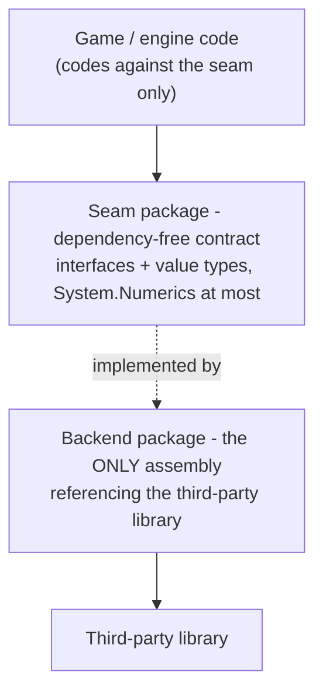

# Dependency seams: how third-party libraries stay swappable

KhaozEngine wraps almost every third-party dependency behind a **seam**: a dependency-free contract
(interfaces + value types) that the rest of the engine codes against, with the real library contained in a
separate, opt-in backend that nobody else references. [RENDER-PIPELINE.md](RENDER-PIPELINE.md) and
[PHYSICS-PIPELINE.md](PHYSICS-PIPELINE.md) are the two worked examples; this doc is the convention they share
and the map of every place it is applied.

## The rule

Three properties fall out of it:

- **Headless-testable.** The seam has no native or GPU dependency, so behaviour is tested against the contract
  (or a fake/loopback/in-memory impl) with no real device. New behaviour ships with a headless test.
- **Swappable.** A second backend is a new `KhaozEngine.<Area>.<X>` package; upstream code is untouched.
- **Pay-for-what-you-use.** Backends that pull a heavy or platform-specific dependency are **opt-in** (not in
  any umbrella metapackage) and added by id, so a consumer that does not need them does not drag them in.

## Every seam in the engine

| Area | Seam (dependency-free) | Backend(s) | Third-party library |
|---|---|---|---|
| GPU / rendering | `KhaozEngine.Gpu` (`GpuDeviceContext` + `GpuInterfaces`, `GpuBackendSelector`) | (in-package) `Internal/VeldridGpuDevice` | Veldrid (+ Veldrid.SPIRV) |
| 3D physics | `KhaozEngine.Physics` (`IPhysicsWorld`, value-type shapes/poses/queries) | `KhaozEngine.Physics.Bepu` (`BepuPhysicsWorld`) | BepuPhysics v2 |
| Netcode transport | `KhaozEngine.Netcode` (`INetTransport` incl. the default-method `Stats` -> `NetTransportStats`, `LoopbackTransport`) + `Netcode.Abstractions` | `KhaozEngine.Netcode.LiteNetLib` (fills `Stats` via `EnableStatistics`) | LiteNetLib |
| Persistence | `KhaozEngine.WorldStore` (`IWorldStore`, `InMemoryWorldStore`) | `WorldStore.Sqlite`, `WorldStore.SqlServer` | Microsoft.Data.Sqlite / SqlClient |
| Audio | `KhaozEngine.Audio` (`IMusicBackend`, `ISfxBackend`, `Null*` no-op defaults) | (in-package) `OpenAlMusicBackend` / `OpenAlSfxBackend` | Silk.NET.OpenAL |
| Windowing / input | `KhaozEngine.Windowing` `AppWindow` is the sole toucher; everyone reads the immutable `InputState` via `InputManager`/`Pointer` | (containment, not a swap) | Silk.NET / GLFW |
| glTF load | `KhaozEngine.Render3D` `GltfLoader` (returns engine `GltfMesh`/`AnimationClip`/`Skeleton`) | (containment, in loader) | SharpGLTF |

## Three flavours of the same idea

The pattern is applied at the granularity the dependency warrants:

1. **Separate opt-in backend package** (the strongest split): GPU, physics, netcode transport, persistence.
   The third-party reference lives in its own package so consumers pick it explicitly. Physics and netcode
   and worldstore backends are genuinely opt-in (excluded from umbrellas); the Veldrid binding ships inside
   `KhaozEngine.Gpu` because rendering is not optional for a windowed game.
2. **Seam + default + null, one package** (audio): the contract, the real OpenAL backend, and a no-op
   `Null*` backend live together. The null backend keeps audio headless-testable and lets a server run with
   no device, while still being one `add` for a game that wants sound.
3. **Containment** (windowing/input, glTF load): a single class or loader owns the raw dependency and hands
   the rest of the engine an immutable snapshot or an engine-native type. There is no second backend planned,
   but the dependency is still corralled to one place so it cannot leak across the codebase. The input rule
   ("only `AppWindow` touches Silk.NET/GLFW input statics") is enforced as a hard rule in
   [USING-KHAOZENGINE.md](USING-KHAOZENGINE.md) and `../CLAUDE.md`.

## Adding a new backend

To swap or add a backend for a seam that already has the separate-package split:

1. New project `KhaozEngine.<Area>.<Backend>` referencing the seam project and the third-party package.
2. Implement the seam interface (`IPhysicsWorld`, `INetTransport`, `IWorldStore`, ...). Keep it the **only**
   assembly that references the library.
3. Leave it out of the umbrella metapackages (`Foundation`/`Game2D`/`Game3D`/`Server`) unless it is
   non-optional, so it stays opt-in like `Physics.Bepu` / `Netcode.LiteNetLib` / `WorldStore.Sqlite`.
4. Headless test against the contract; for backends with a real device, gate device tests as the existing
   ones are.
5. Run the full doc sweep (this table, the package catalog in `../README.md` and `../CLAUDE.md`, and
   `CONSUMERS.md`) so the new package is listed everywhere it should be.

## Where to look in the code

| Seam | Contract | Backend |
|---|---|---|
| GPU | `../KhaozEngine.Gpu/GpuDeviceContext.cs`, `GpuInterfaces.cs`, `GpuBackendSelector.cs` | `../KhaozEngine.Gpu/Internal/VeldridGpuDevice.cs` |
| Physics | `../KhaozEngine.Physics/IPhysicsWorld.cs` | `../KhaozEngine.Physics.Bepu/BepuPhysicsWorld.cs` |
| Netcode | `../KhaozEngine.Netcode/` (`INetTransport`, `LoopbackTransport`) | `../KhaozEngine.Netcode.LiteNetLib/` |
| Persistence | `../KhaozEngine.WorldStore/IWorldStore.cs`, `InMemoryWorldStore.cs` | `../KhaozEngine.WorldStore.Sqlite/`, `../KhaozEngine.WorldStore.SqlServer/` |
| Audio | `../KhaozEngine.Audio/IMusicBackend.cs`, `ISfxBackend.cs`, `Null*Backend.cs` | `../KhaozEngine.Audio/OpenAl*Backend.cs` |
| Windowing/input | `../KhaozEngine.Windowing/AppWindow.cs` (sole toucher) | Silk.NET/GLFW, contained |
