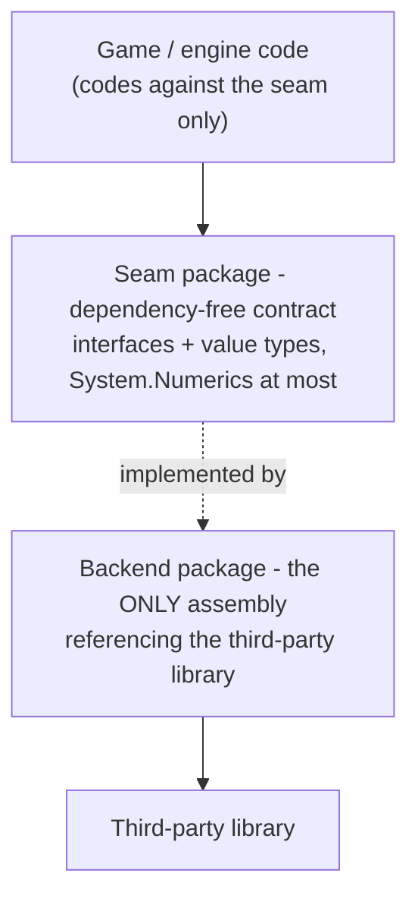

# Dependency seams: how third-party libraries stay swappable

KhaozEngine wraps almost every third-party dependency behind a **seam**: a dependency-free contract
(interfaces + value types) that the rest of the engine codes against, with the real library contained in a
separate, opt-in backend that nobody else references. [RENDER-PIPELINE.md](RENDER-PIPELINE.md) and
[PHYSICS-PIPELINE.md](PHYSICS-PIPELINE.md) are the two worked examples; this doc is the convention they share
and the map of every place it is applied.

## The rule



Three properties fall out of it:

- **Headless-testable.** The seam has no native or GPU dependency, so behaviour is tested against the contract
  (or a fake/loopback/in-memory impl) with no real device. New behaviour ships with a headless test.
- **Swappable.** A second backend is a new `KhaozEngine.<Area>.<X>` package; upstream code is untouched.
- **Pay-for-what-you-use.** Backends that pull a heavy or platform-specific dependency are **opt-in** (not in
  any umbrella metapackage) and added by id, so a consumer that does not need them does not drag them in.

### Mechanically enforced

These graph rules are not just prose. Headless architecture tests in `KhaozEngine.Tests` read the real
`*.csproj` files and fail CI when an edit breaks them:

- `ArchitectureTests.cs` - third-party containment (every third-party PackageReference stays in its allowlisted
  seam/backend home, and any new one must be added to the allowlist deliberately), the layering invariants
  (`Primitives` / `Simulation` are zero-dependency leaves, the Foundation umbrella stays GPU-free, `App` never
  references `Gui`), the locked ProjectReference membership of the four umbrellas, opt-in backends staying out of
  every umbrella's transitive closure, and `Render3D` staying seams-only.
- `GpuPublicApiTests.cs` - a reflection guard that walks the public and protected surface of `KhaozEngine.Gpu`
  and fails if any Veldrid type leaks through it, proving the GPU seam keeps Veldrid contained.

Changing a documented edge therefore means changing the matching expectation in these tests, so the graph and
this doc cannot silently drift apart.

## Every seam in the engine

| Area | Seam (dependency-free) | Backend(s) | Third-party library |
|---|---|---|---|
| GPU / rendering | `KhaozEngine.Gpu` (`GpuDeviceContext` + `GpuInterfaces`, `GpuBackendSelector`) | (in-package) `Internal/VeldridGpuDevice` | Veldrid (+ Veldrid.SPIRV) |
| 3D physics | `KhaozEngine.Physics` (`IPhysicsWorld`, value-type shapes/poses/queries) | `KhaozEngine.Physics.Bepu` (`BepuPhysicsWorld`) | BepuPhysics v2 |
| Netcode transport | `KhaozEngine.Netcode` (`INetTransport` incl. the default-method `Stats` -> `NetTransportStats`, `LoopbackTransport`) + `Netcode.Abstractions` | `KhaozEngine.Netcode.LiteNetLib` (fills `Stats` via `EnableStatistics`) | LiteNetLib |
| Persistence | `KhaozEngine.WorldStore` (`IWorldStore`, `InMemoryWorldStore`) | `WorldStore.Sqlite`, `WorldStore.SqlServer` | Microsoft.Data.Sqlite / SqlClient |
| Commerce wallet | `KhaozEngine.Commerce` (`IWalletStore`, `IGrantScheduleStore`, `IEntitlementValidator`, `InMemoryWalletStore`) | `Commerce.Sqlite` (`SqliteWalletStore`), `Commerce.SqlServer` (`SqlServerWalletStore`) | Microsoft.Data.Sqlite / SqlClient |
| Persistence enumeration | `KhaozEngine.WorldStore` (`IEnumerableWorldStore`, `WorldStoreEntry`) | `InMemoryWorldStore`, `SqliteWorldStore`, `SqlServerWorldStore` (all three implement it) | (no extra dep; streaming `EnumerateAsync(keyPrefix?)`) |
| Server ban list | `KhaozEngine.NetWorld` (`IBanStore`, `InMemoryBanStore`) | `WorldStoreBanStore` (persists over any `IWorldStore` keyspace `ban:{accountId}`) | (no extra dep; sync `IsBanned` via in-memory cache, `LoadAsync()` at startup) |
| Per-cell world persistence | `KhaozEngine.NetWorld` (`ICellPersistenceHost`, the surface `CellPersistence` drives, `ShardedWorldServer` implements it; since 9.33.0 the host also carries `TryRestoreCell` for a non-throwing quarantining restore, a default interface method so existing implementers are unaffected; since 10.0.0 the NetId high-water it carries - `NextNetId` / `EnsureNextNetIdAtLeast` - and the restored-id list are 64-bit `long`) | `CellPersistence` (+ `CellPersistenceConfig` with `RegisterMigration` + engine-provided migrations via `IncludeEngineMigrations`, `WorldMetaRecord`) wires it to any `IWorldStore`, migrating / quarantining / retaining on load and surfacing `CellPersistence.Issue` | Microsoft.Data.Sqlite / SqlClient (via the `IWorldStore` backend already chosen) |
| Audio | `KhaozEngine.Audio` (`IMusicBackend`, `ISfxBackend`, `Null*` no-op defaults) | (in-package) `OpenAlMusicBackend` / `OpenAlSfxBackend` | Silk.NET.OpenAL (+ NLayer mp3 / NVorbis ogg decode, contained) |
| Social / presence | `KhaozEngine.Social` (`ISocialProvider`, value types, `NullSocialProvider` no-op, `SocialPresenceController`) | `KhaozEngine.Social.Discord` (`DiscordSocialProvider`) | none - hand-rolled Discord IPC over `System.IO.Pipes` / `System.Net.Sockets` (no third-party lib) |
| Player identity | `KhaozEngine.Identity` (`IIdentityProvider`, `IIdentityValidator`, `ITokenCache` + `FileTokenCache`, `IBrowserLauncher`, `ILoopbackListener`, `IdentitySession` orchestrator, `SessionToken` HMAC) | `KhaozEngine.Identity.Oidc` (`OidcClientProvider`, `OidcTokenValidator`, `SystemBrowserLauncher`, `HttpLoopbackListener`), `KhaozEngine.Identity.Discord` (`DiscordClientProvider`, `DiscordTokenValidator`) | Microsoft.IdentityModel.Protocols.OpenIdConnect + Microsoft.IdentityModel.JsonWebTokens (Oidc only); Discord backend has no third-party lib (plain HTTP userinfo call) |
| Windowing / input | `KhaozEngine.Windowing` `AppWindow` is the sole toucher; everyone reads the immutable `InputState` via `InputManager`/`Pointer` (input IN), and drives gamepad rumble OUT through `AppWindow.Rumble` (`IRumble`; pure `RumbleMixer` + Silk `IRumbleOutput` sink; `NoopRumble` headless). GLFW backend exposes no motors, so rumble no-ops there | (containment, not a swap) | Silk.NET / GLFW |
| glTF load | `KhaozEngine.Render3D` `GltfLoader` (returns engine `GltfMesh`/`AnimationClip`/`Skeleton`) | (containment, in loader) | SharpGLTF |
| Image decode | `KhaozEngine.Render2D` `ImageRgba` (`Decode`/`Load` -> engine RGBA8 value type) | (containment, in `ImageRgba`) | StbImageSharp |
| Font rasterization | `KhaozEngine.Render2D` `SpriteFont` (glyphs baked to an engine texture atlas) | (containment, in `SpriteFont`) | StbTrueTypeSharp |
| Content validation | `KhaozEngine.Content` `JsonSchemaValidator` (`Validate` -> engine `ValidationReport`) | (containment, in validator) | JsonSchema.Net |
| MCP server protocol | `KhaozEngine.MapEdit.Tool` (`Program.cs`, the `ke-mapedit` dev tool, not an engine package) is the sole referencer, no engine package references the SDK | (containment, not a swap) | ModelContextProtocol SDK |

`KhaozEngine.Sharding` gained the snapshot/restore primitives the per-cell persistence seam above is built on
(`CellSim.SnapshotOwned`/`RestoreOwned`/`MaxOwnedNetId`, `ShardHost.CellCreated`/`EnsureCell`) with no storage
dependency added: Sharding stays a pure ECS/Replication container and only returns/accepts `byte[]` snapshots.
Storage stays where it already lived, in `NetWorld` (`CellPersistence`) over `IWorldStore`.

## Admin endpoint package edge

`KhaozEngine.Server.Admin` sits outside the seam/backend pattern: it is not a backend (there is no second
implementation of `IAdminControllable` - the seam is in `NetWorld`), but it is deliberately NOT in the `Server`
umbrella because it is the only package that references ASP.NET Core (via a `FrameworkReference` on
`Microsoft.AspNetCore.App`). Its dependency edge is:

```
KhaozEngine.Server.Admin -> KhaozEngine.NetWorld (IAdminControllable, IBanStore, ServerAdmin)
KhaozEngine.Server.Admin -> KhaozEngine.WorldStore (IEnumerableWorldStore)
KhaozEngine.Server.Admin -> Microsoft.AspNetCore.App [shared framework, FrameworkReference]
```

A server that does not want an admin HTTP endpoint never references `Server.Admin`, so the web stack stays
out of its dependency closure.

## Commerce wallet seams

`KhaozEngine.Commerce` splits into three seams, not one, because the wallet has three independent axes a
game can swap:

- **`IWalletStore`** - the durable, transactional wallet backing store. Credit/Debit are atomic and
  idempotent by an `idempotencyKey`, scoped per `(account, currency)`; `GetBalanceAsync`/`GetLedgerAsync`
  read it back. `InMemoryWalletStore` (in the core package) is the reference/test backend; `Commerce.Sqlite`
  and `Commerce.SqlServer` are the durable opt-in backends, same contract, same idempotency semantics.
- **`IGrantScheduleStore`** - persists the next-available instant per `(account, rewardId)` for
  `PeriodicGrant`. Last-write-wins is safe here because the wallet's credit idempotency key is the real
  double-grant guard, not this store. `InMemoryWalletStore` implements both `IWalletStore` and
  `IGrantScheduleStore`; so do the two SQL backends.
- **`IEntitlementValidator`** - turns an untrusted external proof (`EntitlementProof`: a webhook body, a
  store receipt) into a `VerifiedEntitlement`, or null if invalid. No default implementation ships: the
  proof format and the trust decision are consumer-specific (a webhook signature, a platform receipt
  verification API), so this seam has no `InMemory*` reference impl, unlike the two store seams above.

Dependency edges:

```
KhaozEngine.Commerce -> KhaozEngine.Progression (PeriodicGrant is built on WallClockRewardSchedule)
KhaozEngine.Commerce.Sqlite -> KhaozEngine.Commerce, Microsoft.Data.Sqlite
KhaozEngine.Commerce.SqlServer -> KhaozEngine.Commerce, Microsoft.Data.SqlClient
```

Same shape as the `WorldStore` persistence seam above (dependency-free contract + opt-in SQL backends,
neither backend bundled in the `Server` umbrella), but a distinct seam: `IWorldStore` is opaque-bytes
last-write-wins and cannot express atomic increments or idempotency, which a currency ledger needs.

## Localization package edges

Compile-time localization enforcement adds two edges, both acyclic:

```
KhaozEngine.Gui -> KhaozEngine.App           (the LocalizedText sink type + StringId + LocalizationContext)
KhaozEngine.Game2D/Game3D -> KhaozEngine.Localization.Analyzers   (packed dependency, include="All", so the
                                                                   analyzer is applied in the consumer's build)
```

`App` is a pure-BCL foundation package (it references only `Diagnostics` and `Platform`, both GPU-free leaves)
and never references `Gui`, so the new `Gui -> App` edge introduces no cycle. `KhaozEngine.Localization.Analyzers` is a `netstandard2.0` Roslyn
analyzer with no runtime dependency; it ships its assembly under `analyzers/dotnet/cs` and flows to a game only
through the `Game2D`/`Game3D` umbrellas (a project that references neither never sees it). The marker attributes
it reads (`LocalizationExemptAttribute`, `LocalizationStringSinkAttribute`) live in `App`, so the analyzer keys
off fully-qualified names, not a hard reference.

A third edge is test-only:

```
KhaozEngine.Localization.TestKit -> KhaozEngine.App   (reads StringId.Key to extract keys from a game's key class)
```

`KhaozEngine.Localization.TestKit` is a coverage-test helper a game references from its **test project**. It is in
no umbrella (a runtime build never pulls it) and references `App` only to read `StringId`, so the edge is acyclic
and carries no weight into shipped game code.

## Self-relaunch seam: process control

Cooperative self-restart (`KhaozEngine.App.AppRelaunch`) adds one edge, acyclic:

```
KhaozEngine.App -> KhaozEngine.Platform   (IProcessControl: resolve the running exe/pid/args, spawn a
                                           detached instance, wait for a pid to exit)
```

`Platform` is a zero-ProjectReference leaf (pure BCL P/Invoke), so `App -> Platform` cannot cycle and keeps
`App` GPU-free. The process operations are behind `IProcessControl` (the seam) so the relaunch orchestration
is headless-testable against a fake; `ProcessControl.System` is the real one.

This is the generalized form of the desktop auto-updater's parent-pid-wait relaunch. The updater
(`KhaozEngine.Updates`) keeps its own `IUpdaterEnvironment` with tuned, updater-specific behaviour (antivirus /
torn-image retry, elevation, relocation, and a deliberately non-truthful `IsProcessAlive` on POSIX), so it was
NOT retrofitted onto `IProcessControl` - the two share the *pattern* (start a successor, have it wait on the
predecessor's pid so it never races the file the predecessor writes during shutdown), not the code. Collapsing
part of the updater's env onto the new primitive would split its process ops across two homes for no real gain,
so they stay separate.

## Design-viewport seam: device-pixel snapping

`IDesignViewport` (`KhaozEngine.Primitives`) is the design-viewport seam. Its implementers all live in
`KhaozEngine.Windowing`: `DesignViewport`, `AdaptiveViewport`, and `UiViewport` (the point-space viewport for
DPI-aware UI). The seam gained a `SnapsToDevicePixels` member, a default-interface-member defaulting
to `false`: `DesignViewport` / `AdaptiveViewport` inherit `false`, and `UiViewport` returns `true`. `SpriteBatch`
reads the flag through the seam to confine device-pixel snapping to the point-space path, so no new dependency
edge is introduced (`Render2D` already depends on `Primitives`).

The seam also carries `WindowBounds` (10.38.0), a default-interface-member giving the whole window mapped into
design space (`DesignBounds` plus the letterbox bars). It is derived from the existing scale + offset, so it needs
no new seam data and every implementer - including consumer test stubs - gets it for free; the three engine
viewports override it concretely (`DesignViewport` with the letterbox formula, `AdaptiveViewport` / `UiViewport`
returning `DesignBounds` since they never letterbox). `KhaozEngine.Gui` reads it to fill full-window scrims /
backgrounds through the same seam, no new edge.

## Three flavours of the same idea

The pattern is applied at the granularity the dependency warrants:

1. **Separate opt-in backend package** (the strongest split): GPU, physics, netcode transport, persistence,
   the commerce wallet. The third-party reference lives in its own package so consumers pick it explicitly.
   Physics, worldstore, and commerce SQL backends are genuinely opt-in (excluded from umbrellas); the Veldrid
   binding ships inside `KhaozEngine.Gpu` because rendering is not optional for a windowed game, and the
   LiteNetLib transport backend is deliberately bundled into the `Server` umbrella because a server needs a
   real transport out of the box.
2. **Seam + default + null, one package** (audio): the contract, the real OpenAL backend, and a no-op
   `Null*` backend live together. The null backend keeps audio headless-testable and lets a server run with
   no device, while still being one `add` for a game that wants sound.
3. **Containment** (windowing/input, glTF load, image + font decode, content validation): a single class or loader owns the raw dependency and hands
   the rest of the engine an immutable snapshot or an engine-native type. There is no second backend planned,
   but the dependency is still corralled to one place so it cannot leak across the codebase. The input rule
   ("only `AppWindow` touches Silk.NET/GLFW input statics") is enforced as a hard rule in
   [USING-KHAOZENGINE.md](USING-KHAOZENGINE.md) and `../AGENTS.md`.

## Adding a new backend

To swap or add a backend for a seam that already has the separate-package split:

1. New project `KhaozEngine.<Area>.<Backend>` referencing the seam project and the third-party package.
2. Implement the seam interface (`IPhysicsWorld`, `INetTransport`, `IWorldStore`, ...). Keep it the **only**
   assembly that references the library.
3. Leave it out of the umbrella metapackages (`Foundation`/`Game2D`/`Game3D`/`Server`) unless it is
   non-optional, so it stays opt-in like `Physics.Bepu` / `Netcode.LiteNetLib` / `WorldStore.Sqlite`.
4. Headless test against the contract; for backends with a real device, gate device tests as the existing
   ones are.
5. Run the full doc sweep (this table, the package catalog in `../README.md` and `../AGENTS.md`) so the
   new package is listed everywhere it should be.

## Where to look in the code

| Seam | Contract | Backend |
|---|---|---|
| GPU | `../KhaozEngine.Gpu/GpuDeviceContext.cs`, `GpuInterfaces.cs`, `GpuBackendSelector.cs` | `../KhaozEngine.Gpu/Internal/VeldridGpuDevice.cs` |
| Physics | `../KhaozEngine.Physics/IPhysicsWorld.cs` | `../KhaozEngine.Physics.Bepu/BepuPhysicsWorld.cs` |
| Netcode | `../KhaozEngine.Netcode/` (`INetTransport`, `LoopbackTransport`) | `../KhaozEngine.Netcode.LiteNetLib/` |
| Persistence | `../KhaozEngine.WorldStore/IWorldStore.cs`, `InMemoryWorldStore.cs` | `../KhaozEngine.WorldStore.Sqlite/`, `../KhaozEngine.WorldStore.SqlServer/` |
| Commerce wallet | `../KhaozEngine.Commerce/IWalletStore.cs`, `IGrantScheduleStore.cs`, `Entitlements.cs` (`IEntitlementValidator`), `InMemoryWalletStore.cs` | `../KhaozEngine.Commerce.Sqlite/SqliteWalletStore.cs`, `../KhaozEngine.Commerce.SqlServer/SqlServerWalletStore.cs` |
| Persistence enumeration | `../KhaozEngine.WorldStore/IEnumerableWorldStore.cs` | `InMemoryWorldStore.cs`, `SqliteWorldStore.cs`, `SqlServerWorldStore.cs` |
| Server ban list | `../KhaozEngine.NetWorld/IBanStore.cs`, `InMemoryBanStore.cs` | `WorldStoreBanStore.cs` |
| Admin HTTP endpoint | `../KhaozEngine.NetWorld/IAdminControllable.cs` (seam) | `../KhaozEngine.Server.Admin/` (Kestrel, ASP.NET Core) |
| Audio | `../KhaozEngine.Audio/IMusicBackend.cs`, `ISfxBackend.cs`, `Null*Backend.cs` | `../KhaozEngine.Audio/OpenAl*Backend.cs` |
| Social / presence | `../KhaozEngine.Social/ISocialProvider.cs`, `NullSocialProvider.cs`, `SocialPresenceController.cs` | `../KhaozEngine.Social.Discord/DiscordSocialProvider.cs` (+ `Internal/DiscordIpcClient.cs`, `NamedPipeDiscordTransport.cs`) |
| Player identity | `../KhaozEngine.Identity/IIdentityProvider.cs`, `IIdentityValidator.cs`, `ITokenCache.cs`, `IBrowserLauncher.cs`, `ILoopbackListener.cs`, `IdentitySession.cs`, `SessionToken.cs`, `FileTokenCache.cs` | `../KhaozEngine.Identity.Oidc/OidcClientProvider.cs`, `OidcTokenValidator.cs`, `SystemBrowserLauncher.cs`, `HttpLoopbackListener.cs`; `../KhaozEngine.Identity.Discord/DiscordClientProvider.cs`, `DiscordTokenValidator.cs` |
| Windowing/input | `../KhaozEngine.Windowing/AppWindow.cs` (sole toucher) | Silk.NET/GLFW, contained |
| glTF load | `../KhaozEngine.Render3D/Models/GltfLoader.cs` (contains SharpGLTF) | (containment) |
| Image decode | `../KhaozEngine.Render2D/ImageRgba.cs` (contains StbImageSharp) | (containment) |
| Font rasterization | `../KhaozEngine.Render2D/SpriteFont.cs` (contains StbTrueTypeSharp) | (containment) |
| Content validation | `../KhaozEngine.Content/JsonSchemaValidator.cs` (contains JsonSchema.Net) | (containment) |
| MCP server protocol | `../KhaozEngine.MapEdit.Tool/Program.cs` (sole referencer, dev tool) | (containment) |
