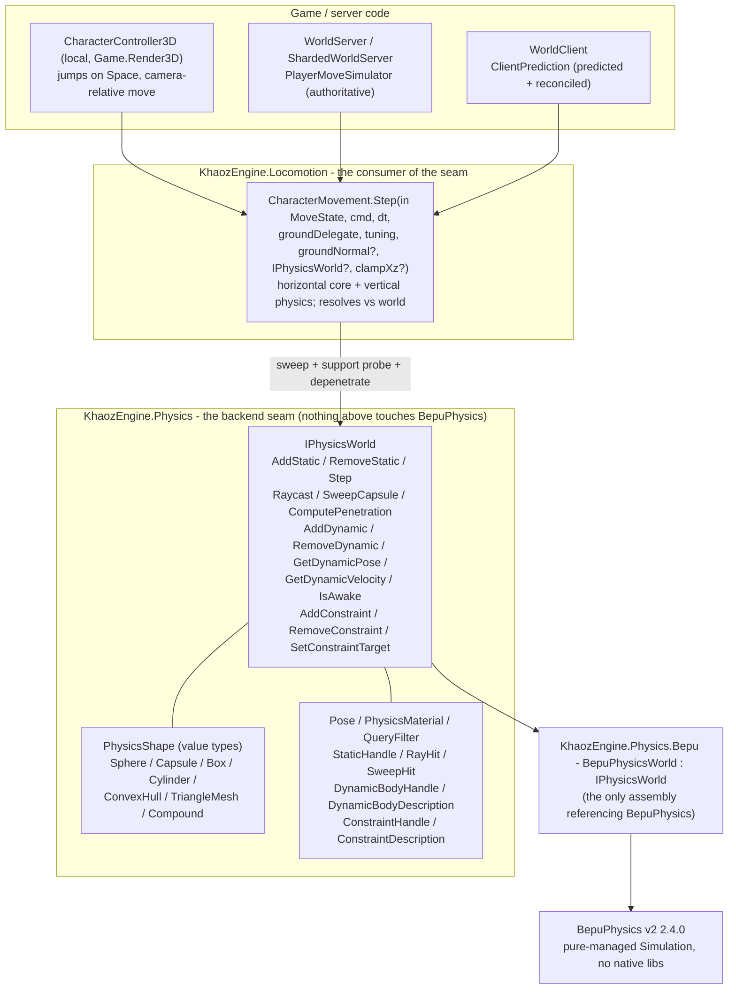
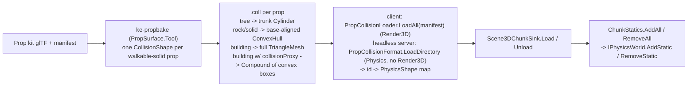
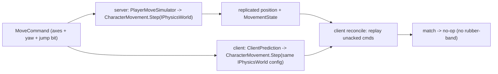
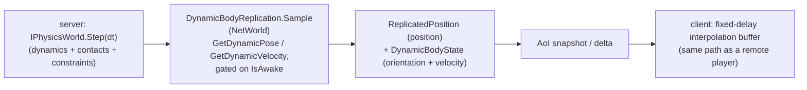

# Physics pipeline: how a move becomes a collision-resolved position

A high-level (container / "Level 2") map of the path from a character move command to a position that has
been resolved against the static world. The physics counterpart to [RENDER-PIPELINE.md](RENDER-PIPELINE.md):
the boxes name real types so you can jump into the code, but detail stops at the layer boundaries. For the
shared "seam + opt-in backend" rule this is one instance of, see [DEPENDENCY-SEAMS.md](DEPENDENCY-SEAMS.md).

The one idea, same as the GPU seam: **nothing above `KhaozEngine.Physics` touches BepuPhysics.** The seam is
`IPhysicsWorld` plus value-type shapes/poses/queries (only `System.Numerics`); the backend
(`KhaozEngine.Physics.Bepu`) is the sole assembly that references BepuPhysics, added explicitly like
`Netcode.LiteNetLib` or `WorldStore.Sqlite`.

## The flow

Note how `Raycast`/`SweepCapsule`/`ComputePenetration` live on the seam, not the backend: ledge detection,
jump targeting, line-of-sight, ground probes, and move-and-slide are all expressed in seam types, so a
different backend (a native Jolt/PhysX wrapper, say) is a new `KhaozEngine.Physics.<X>` package with **zero**
changes upstream. Unlike the GPU seam there is no auto-selector yet: a consumer constructs the backend
directly (`new BepuPhysicsWorld()`) and hands the `IPhysicsWorld` down.

Beyond static bodies, the seam also carries dynamic rigid bodies and joints. `AddDynamic` takes a
`PhysicsShape` (the same box/sphere/capsule/cylinder/hull/compound descriptors as statics) plus a
`DynamicBodyDescription` (mass, initial linear/angular velocity, a sleep threshold, where mass <= 0 is an
infinite-mass kinematic body), and returns a `DynamicBodyHandle` for `GetDynamicPose`/`GetDynamicVelocity`/
`SetDynamicVelocity`/`IsAwake` queries and `RemoveDynamic`. Joints connect two dynamic bodies, or one dynamic
body to a fixed world-space anchor (`ConstraintAttachment.OnBody`/`AtWorld`), via `AddConstraint(in
ConstraintDescription)`: the discriminated `ConstraintKind` selects ball-socket, hinge, slider, distance, or
weld, and a factory method (`BallSocketJoint`/`HingeJoint`/`SliderJoint`/`DistanceJoint`/`WeldJoint`) fills
only the fields that kind reads. A world-space anchor end is pinned by the backend as an infinite-mass point
that is not itself a collidable, so a character walks through a world-anchored pivot cleanly. Motors and
servos layer onto a joint (`WithHingeMotor`/`WithHingeServo`/`WithSliderMotor`/`WithSliderServo`/`WithWinch`):
a motor chases a target velocity, a servo chases a target angle/offset/length and holds it there, and
`SetConstraintTarget` retargets a live drive every frame, allocation-free. `Step` advances dynamics,
contacts, and constraints together under gravity, deterministic under a fixed `dt`.

## Two side-flows that feed it

**Static bodies (CPU collision shapes -> the physics world), baked offline, loaded as chunks stream:**

Per-prop scale is applied to the shape geometry at add time (the public `PhysicsShapeScale.Uniform` helper, which
covers every shape kind incl. Box and Compound); each static's Y is the placement's baked terrain height. By
default terrain height stays **analytic** (the `TerrainField`, not a physics body): the seam resolves
props/buildings, the field resolves ground. (Bepu recenters `ConvexHull` and `Cylinder` on their centroid, so a
base-placed prop is wrapped in a centroid-offset compound to avoid sinking; `TriangleMesh` is not recentered.)

A game may instead **opt in** to terrain-as-physics-geometry (`Scene3DChunkSink(collideTerrain: true)`):
`TerrainChunkCollision` extracts each streamed chunk's SURFACE (skirts dropped, winding flipped so the top face
is collidable, `TriangleMesh` not recentered so it registers at `Pose.Identity`) and `ChunkTerrainCollision`
adds/removes it as a static body alongside the props, so terrain, props, and buildings share one query path. The
character then drives off `PhysicsGroundProbe` (a downward raycast) instead of the analytic delegates. This is
additive - the analytic-delegate path is unchanged for games that leave it off. The Bepu mesh owns its
`BufferPool` triangle buffer and `RemoveStatic` disposes it, so streaming churn keeps the pool flat.

A building may instead bake a simplified **collision proxy** (`PropCollisionBake.BakeProxy`, opt-in via a
`collisionProxy` manifest field): an authored `<id>_collision.glb` of separate convex blocks (solid body, stairs,
standable props, thin overhangs dropped) becomes a `CompoundShape` of convex hulls, one per object. Every collision
solid is convex (unique shortest exit), which structurally removes the wedge/pin class that a building's full
one-sided render mesh creates - the clean alternative to accumulating resolver invariants. The Bepu factory
flattens a compound's convex children to leaves so the broadphase sweep handles them. See
`tools/proxy-authoring/` for the authoring workflow.

**The same move resolved twice (authoritative + predicted), against the same seam:**

Because client prediction resolves against the same `IPhysicsWorld` (and same optional `WorldBounds`) as the
server, it predicts around solid props and clamps at the wall, so reconciliation stays a no-op instead of
snapping the player back.

**A dynamic body replicated to clients (server-authoritative, no client-side prediction of the body):**

`DynamicBodyReplication.Sample` runs once per server tick AFTER `Step`, so the fresh pose lands in that
tick's snapshot: it writes each tracked body's position into `ReplicatedPosition` (driving area-of-interest,
same as a player) and its orientation + linear/angular velocity into `DynamicBodyState`. A body Bepu has put
to sleep (`IsAwake` false) is not re-sampled, so a resting crate stops generating snapshot churn. The client
never simulates a dynamic body: it interpolates the replicated pose on the same fixed-delay buffer a remote
player uses, orientation slerped between snapshots.

## The same path in words

1. A `MoveCommand` (move axes, yaw, jump bit) reaches `CharacterMovement.Step` from the local
   `CharacterController3D`, the server's `PlayerMoveSimulator`, or the client's `ClientPrediction`.
2. `Step` runs the horizontal core (camera-relative move, slope gate via the `groundNormal` delegate) and the
   vertical physics (gravity terminal-clamp, jump with coyote/buffer, air control), then resolves against the
   world: a capsule **sweep** along the move, a downward **support probe** so the character stands on prop
   tops, and a **depenetration** push-out (`ComputePenetration`, iterated) to collide-and-slide. A `null`
   world means terrain-only (the analytic field still clamps Y).
3. Everything in step 2 is expressed in `KhaozEngine.Physics` seam types (`IPhysicsWorld`, `CapsuleShape`,
   `Pose`, `RayHit`/`SweepHit`). Nothing in `Locomotion`, `NetWorld`, or the game references BepuPhysics.
4. `BepuPhysicsWorld` (the backend) answers those queries over a single-threaded deterministic BepuPhysics
   `Simulation`. It is the only assembly that pulls the `BepuPhysics` package; consumers add it explicitly,
   exactly like a netcode transport or a WorldStore backend.
5. Static bodies got into that simulation from the bake side-flow: `ke-propbake` wrote a `.coll` shape per
   prop, `PropCollisionLoader` read them into an id -> `PhysicsShape` map, and `Scene3DChunkSink` (via
   `ChunkStatics`) called `AddStatic`/`RemoveStatic` as chunks streamed in and out. The `.coll` decode itself is
   the render-free `PropCollisionFormat` in `KhaozEngine.Physics`, so a headless authoritative server (no
   Render3D/Gpu/Windowing) loads the same shapes via `PropCollisionFormat.LoadDirectory`/`Load` and builds an
   identical `BepuPhysicsWorld` to predict against; the client's `PropCollisionLoader.LoadAll(manifest)` decodes
   through the same code, so the shapes - and therefore the queries - are byte-identical.

## Where to look in the code

| Box | Type / file |
|---|---|
| The backend seam | [`KhaozEngine.Physics/IPhysicsWorld.cs`](../KhaozEngine.Physics/IPhysicsWorld.cs), `PhysicsShape.cs`, `Pose.cs`, `Queries.cs`, `Handles.cs` |
| Dynamic bodies | [`KhaozEngine.Physics/DynamicBodyDescription.cs`](../KhaozEngine.Physics/DynamicBodyDescription.cs) |
| Joints / motors / servos | [`KhaozEngine.Physics/ConstraintDescription.cs`](../KhaozEngine.Physics/ConstraintDescription.cs) (`ConstraintKind`, `ConstraintMotor`, `ConstraintAttachment`, the joint factory methods), `ConstraintHandle.cs` |
| BepuPhysics binding | [`KhaozEngine.Physics.Bepu/BepuPhysicsWorld.cs`](../KhaozEngine.Physics.Bepu/BepuPhysicsWorld.cs), `ShapeFactory.cs`, `HitHandlers.cs` |
| Movement that resolves vs the seam | [`KhaozEngine.Locomotion/CharacterMovement.cs`](../KhaozEngine.Locomotion/CharacterMovement.cs) (`Step`) |
| Local controller / server sim / client prediction | `KhaozEngine.Game.Render3D/CharacterController3D.cs`, `KhaozEngine.NetWorld/PlayerMoveSimulator.cs`, `WorldClient.cs` |
| Shape bake (offline) | [`KhaozEngine.PropSurface.Tool/Program.cs`](../KhaozEngine.PropSurface.Tool/Program.cs) (`ke-propbake`), `KhaozEngine.Render3D/Models/PropCollisionBake.cs` |
| Shape load + chunk statics | `KhaozEngine.Render3D/Models/PropCollisionLoader.cs` (client/manifest), [`KhaozEngine.Physics/PropCollisionFormat.cs`](../KhaozEngine.Physics/PropCollisionFormat.cs) (render-free format + headless loaders), [`KhaozEngine.Terrain.Render3D/ChunkStatics.cs`](../KhaozEngine.Terrain.Render3D/ChunkStatics.cs) |
| Terrain-as-physics (opt-in) | [`KhaozEngine.Terrain.Render3D/TerrainChunkCollision.cs`](../KhaozEngine.Terrain.Render3D/TerrainChunkCollision.cs) (surface extraction), `ChunkTerrainCollision.cs` (chunk lifecycle), [`KhaozEngine.Physics/PhysicsGroundProbe.cs`](../KhaozEngine.Physics/PhysicsGroundProbe.cs) (raycast ground delegates) |
| Dynamic-body replication | [`KhaozEngine.NetWorld/DynamicBodyReplication.cs`](../KhaozEngine.NetWorld/DynamicBodyReplication.cs) (server-side sampler), `DynamicBodyState.cs` (the replicated component) |
