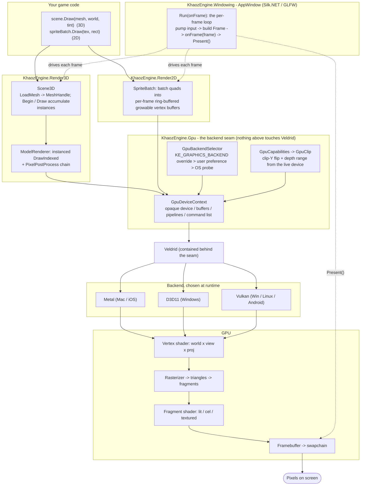
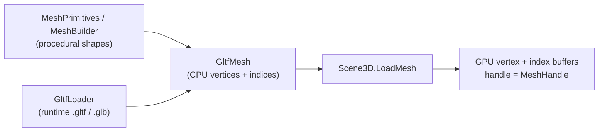
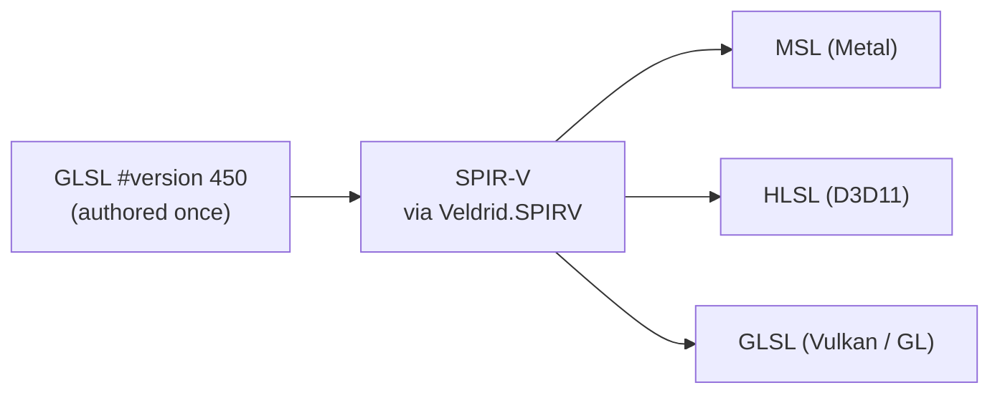

# Render pipeline: how C# becomes rendered triangles

A high-level (container / "Level 2") map of the path from a C# draw call to pixels on screen. Not line-by-line:
the boxes name the real types so you can jump into the code, but the detail stops at the layer boundaries. For
the GPU strategy rationale (Veldrid, author-once GLSL) see [CROSS-PLATFORM.md](CROSS-PLATFORM.md).

## The flow

## Two side-flows that feed it

**Geometry upload (CPU mesh -> GPU buffers), done once at load, not per frame:**

**Shaders are authored once in GLSL and cross-compiled at load** (the reason there is no per-platform shader
build step). Source lives inline in `Render3D/Internal/ShaderSources.cs` and `Render2D/SpriteBatch.cs`:

## The same path in words

1. Your game calls `Scene3D.Draw(...)` (3D) or `SpriteBatch.Draw(...)` (2D) inside the `Frame` callback that
   `AppWindow.Run` invokes once per frame.
2. `Scene3D` accumulates draws as instances keyed by `MeshHandle` (geometry was uploaded once via `LoadMesh`);
   `SpriteBatch` packs quads into per-frame ring-buffered vertex buffers (rotated so a frame's write never races
   the GPU still reading an earlier, in-flight frame's copy). Nothing here references Veldrid.
3. At frame end, `Render3DSurface` / `Render2DSurface` flush through `ModelRenderer` / the sprite shader, which
   record commands on `GpuDeviceContext` - the opaque seam (device, buffers, pipelines, command list).
4. `GpuBackendSelector` picked the backend at startup (`KE_GRAPHICS_BACKEND` override, then the game's stored
   user preference, then the OS probe, with a fallback if that backend cannot create a device), and `GpuCapabilities`
   /`GpuClip` fold per-backend clip-Y and depth-range differences in so the renderers stay backend-agnostic.
5. The seam drives **Veldrid**, which targets the chosen native backend (Metal / D3D11 / Vulkan). Shaders were
   cross-compiled from one SPIR-V blob at load, so the same GLSL runs everywhere.
6. The GPU runs the vertex shader (world x view x proj), rasterizes to triangles + fragments, runs the fragment
   shader (lit / cel / textured), and writes the framebuffer. `AppWindow` calls `Present()` to put the
   swapchain image on screen.

## Terrain splat pipeline (second model-pass pipeline)

Terrain chunks rendered with a `TerrainLayeredMaterial` take a separate pipeline path inside `ModelRenderer`:
the `SplatFrag` shader samples two `texture2DArray`s (albedo + normal, 5 layers) and blends them per-fragment
using the splat weights baked into `ModelVertex.Color` (4 packed channels; the 5th is `1 - sum`). World-space
triplanar projection (`SplatProjection`) tiles each layer without seams across chunk borders. The two arrays
are created once per `TerrainLayeredMaterial` and shared by every chunk that uses it; a per-layer-scalar-roughness
params UBO provides roughness per layer. By default anisotropic filtering (16x) plus a `+1` mip
LOD bias (`GpuSamplerDescription.MipLodBias`) are applied where the device supports them - anisotropy covers
grazing angles, the bias biases distant ground to a blurrier mip so a high-frequency tiling albedo stops
shimmering as the camera moves. Anisotropy falls back to trilinear, and the LOD bias to 0, where the backend
lacks them (Metal has no sampler LOD bias). A material can override this per-material via
`TerrainLayeredMaterial.Sampler` / the `sampler` argument on `LoadSplatMaterial` (a `TerrainSamplerConfig`:
filter, max anisotropy, mip bias) - e.g. lower the anisotropy or switch to trilinear to blur the grazing floor
more where a noisy albedo aliases; null uses the shared default sampler and is byte-identical. Mipmaps are
generated at load time via
`IGpuCommandList.GenerateMipmaps`. A mesh with no splat material (`SplatMaterial == -1`) skips
the splat pass entirely and renders through the standard model pipeline, unchanged.

The per-layer blend runs in a loop with a `if (weight <= 0.001) continue;` early-out, which is data-dependent
(non-uniform) control flow across a fragment quad. Implicit-LOD `texture()` derivatives are undefined under such a
branch, so `SplatFrag` instead hoists `dFdx`/`dFdy` of the world position to uniform flow once before the loop and
samples with `textureGrad`, passing each triplanar plane's gradient (the world derivative scaled by that layer's
tile rate). This keeps the mip/anisotropic LOD well-defined regardless of the branch (an undefined LOD can collapse
toward mip 0 and alias the minified, high-frequency ground into distance "fuzz" on backends that do not gracefully
define it, e.g. D3D11), and lets the anisotropy + LOD bias act on a real gradient. `SplatTerrainDistanceGoldenTests`
guards this per backend at a grazing distance (the older `SplatTerrainGoldenTests` frames the ground top-down with
the orthographic iso camera and cannot exhibit distance minification).

`SplatVert`/`SplatFrag` keep their pixel-input interpolants contiguous from location 0 on purpose: a gap (a
fragment-unused interpolant declared below a used one) miscompiles on D3D11/WARP and rendered the terrain flat
white until a later fix. The cross-backend shader-authoring rules are in `docs/CROSS-PLATFORM.md` ("Authoring shaders
that pass on all three backends").

## Where to look in the code

| Box | Type / file |
|---|---|
| Frame loop + window + swapchain | `KhaozEngine.Windowing/AppWindow.cs` (`Run`, `GpuDeviceContext.CreateForWindow`, `Present`) |
| 3D submission API | `KhaozEngine.Render3D/Scene3D.cs` (`LoadMesh`, `Begin`, `Draw`) + `Render3DSurface.cs` |
| 3D instanced draws + post | `KhaozEngine.Render3D/Rendering/` (`ModelRenderer`), `PixelPostProcessSettings.cs` |
| Terrain splat pipeline | `KhaozEngine.Render3D/Internal/ShaderSources.cs` (`SplatFrag`), `Scene3D.cs` (`LoadSplatMaterial`), `KhaozEngine.Terrain.Render3D/TerrainScene3D.cs` (`LoadTerrainMaterial`) |
| 2D batching | `KhaozEngine.Render2D/SpriteBatch.cs` + `Render2DSurface.cs` |
| The backend seam | `KhaozEngine.Gpu/GpuDeviceContext.cs`, `GpuBackendSelector.cs`, `GpuCapabilities.cs`, `GpuClip.cs` |
| Veldrid binding | `KhaozEngine.Gpu/Internal/VeldridGpuDevice.cs` |
| Shader source | `KhaozEngine.Render3D/Internal/ShaderSources.cs`, `KhaozEngine.Render2D/SpriteBatch.cs` |
| Geometry sources | `KhaozEngine.Render3D/MeshPrimitives.cs`, `MeshBuilder.cs`, `GltfLoader` |
