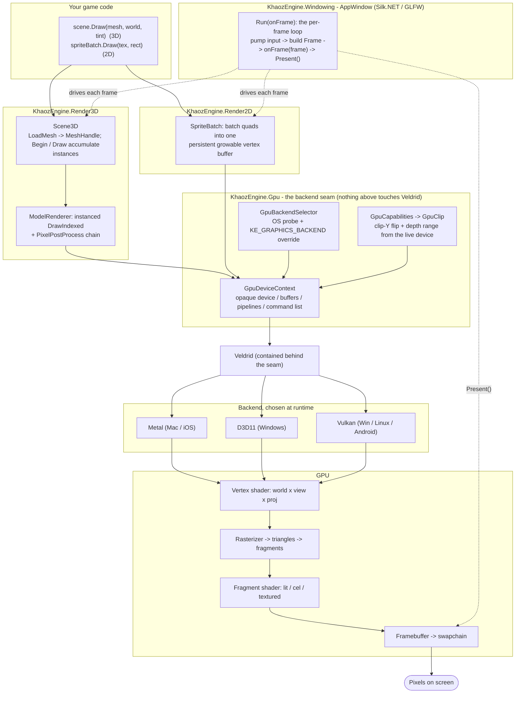
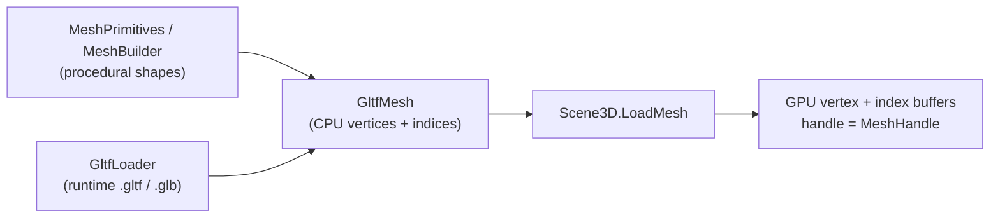
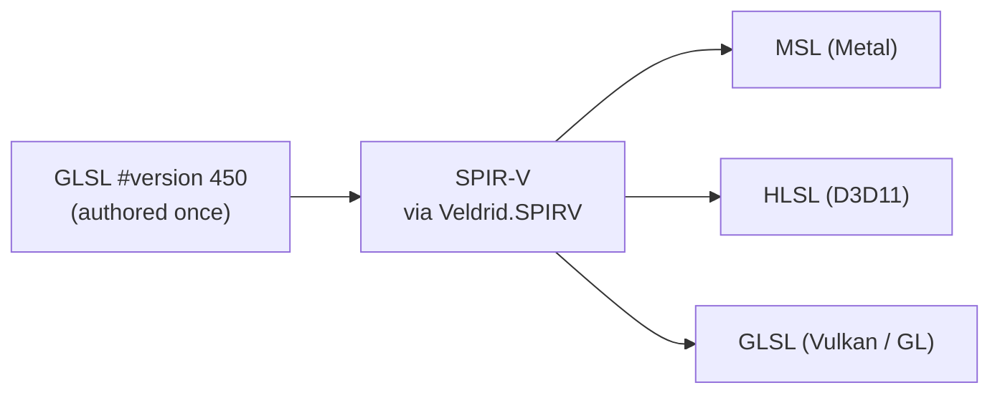

# Render pipeline: how C# becomes rendered triangles

A high-level (container / "Level 2") map of the path from a C# draw call to pixels on screen. Not line-by-line:
the boxes name the real types so you can jump into the code, but the detail stops at the layer boundaries. For
the GPU strategy rationale (Veldrid, author-once GLSL) see [ROADMAP.md](ROADMAP.md) "The post-MonoGame pivot"
and [CROSS-PLATFORM.md](CROSS-PLATFORM.md).

## The flow

## Two side-flows that feed it

**Geometry upload (CPU mesh -> GPU buffers), done once at load, not per frame:**

**Shaders are authored once in GLSL and cross-compiled at load** (the reason there is no per-platform shader
build step). Source lives inline in `Render3D/Internal/ShaderSources.cs` and `Render2D/SpriteBatch.cs`:

## The same path in words

1. Your game calls `Scene3D.Draw(...)` (3D) or `SpriteBatch.Draw(...)` (2D) inside the `Frame` callback that
   `AppWindow.Run` invokes once per frame.
2. `Scene3D` accumulates draws as instances keyed by `MeshHandle` (geometry was uploaded once via `LoadMesh`);
   `SpriteBatch` packs quads into one persistent vertex buffer. Nothing here references Veldrid.
3. At frame end, `Render3DSurface` / `Render2DSurface` flush through `ModelRenderer` / the sprite shader, which
   record commands on `GpuDeviceContext` - the opaque seam (device, buffers, pipelines, command list).
4. `GpuBackendSelector` picked the backend at startup (OS probe + `KE_GRAPHICS_BACKEND`), and `GpuCapabilities`
   /`GpuClip` fold per-backend clip-Y and depth-range differences in so the renderers stay backend-agnostic.
5. The seam drives **Veldrid**, which targets the chosen native backend (Metal / D3D11 / Vulkan). Shaders were
   cross-compiled from one SPIR-V blob at load, so the same GLSL runs everywhere.
6. The GPU runs the vertex shader (world x view x proj), rasterizes to triangles + fragments, runs the fragment
   shader (lit / cel / textured), and writes the framebuffer. `AppWindow` calls `Present()` to put the
   swapchain image on screen.

## Where to look in the code

| Box | Type / file |
|---|---|
| Frame loop + window + swapchain | `KhaozEngine.Windowing/AppWindow.cs` (`Run`, `GpuDeviceContext.CreateForWindow`, `Present`) |
| 3D submission API | `KhaozEngine.Render3D/Scene3D.cs` (`LoadMesh`, `Begin`, `Draw`) + `Render3DSurface.cs` |
| 3D instanced draws + post | `KhaozEngine.Render3D/Internal/` (`ModelRenderer`), `PixelPostProcessSettings.cs` |
| 2D batching | `KhaozEngine.Render2D/SpriteBatch.cs` + `Render2DSurface.cs` |
| The backend seam | `KhaozEngine.Gpu/GpuDeviceContext.cs`, `GpuBackendSelector.cs`, `GpuCapabilities.cs`, `GpuClip.cs` |
| Veldrid binding | `KhaozEngine.Gpu/Internal/VeldridGpuDevice.cs` |
| Shader source | `KhaozEngine.Render3D/Internal/ShaderSources.cs`, `KhaozEngine.Render2D/SpriteBatch.cs` |
| Geometry sources | `KhaozEngine.Render3D/MeshPrimitives.cs`, `MeshBuilder.cs`, `GltfLoader` |
