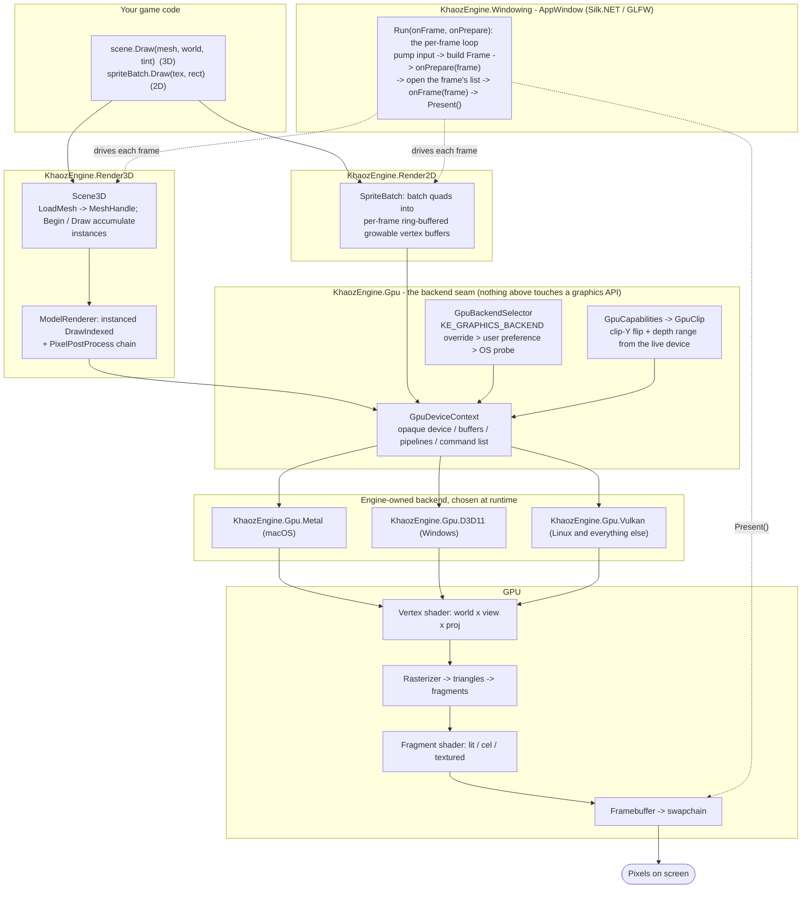
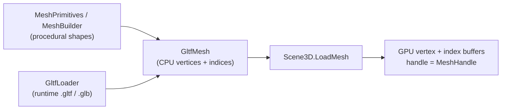
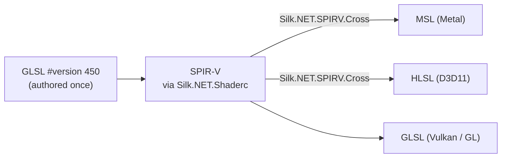
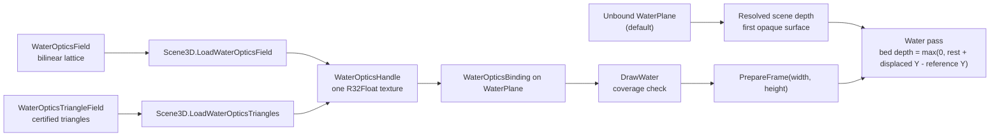

# Render pipeline: how C# becomes rendered triangles

A high-level (container / "Level 2") map of the path from a C# draw call to pixels on screen. Not line-by-line:
the boxes name the real types so you can jump into the code, but the detail stops at the layer boundaries. For
the GPU strategy rationale (the engine-owned backends, author-once GLSL) see
[CROSS-PLATFORM.md](CROSS-PLATFORM.md).

## The flow

```mermaid
flowchart TD
    subgraph game["Your game code"]
        GC["scene.Draw(mesh, world, tint)  (3D)<br/>spriteBatch.Draw(tex, rect)  (2D)"]
    end

    subgraph win["KhaozEngine.Windowing - AppWindow (Silk.NET / GLFW)"]
        LOOP["Run(onFrame, onPrepare): the per-frame loop<br/>pump input -> build Frame -> onPrepare(frame)<br/>-> open the frame's list -> onFrame(frame) -> Present()"]
    end

    subgraph r3["KhaozEngine.Render3D"]
        S3["Scene3D<br/>LoadMesh -> MeshHandle;  Begin / Draw accumulate instances"]
        MR["ModelRenderer: instanced DrawIndexed<br/>+ PixelPostProcess chain"]
    end
    subgraph r2["KhaozEngine.Render2D"]
        SB["SpriteBatch: batch quads into<br/>per-frame ring-buffered growable vertex buffers"]
    end

    subgraph gpu["KhaozEngine.Gpu - the backend seam (nothing above touches a graphics API)"]
        DEV["GpuDeviceContext<br/>opaque device / buffers / pipelines / command list"]
        SEL["GpuBackendSelector<br/>KE_GRAPHICS_BACKEND override > user preference > OS probe"]
        CAP["GpuCapabilities -> GpuClip<br/>clip-Y flip + depth range from the live device"]
    end


    subgraph back["Engine-owned backend, chosen at runtime"]
        MTL["KhaozEngine.Gpu.Metal (macOS)"]
        D3D["KhaozEngine.Gpu.D3D11 (Windows)"]
        VK["KhaozEngine.Gpu.Vulkan (Linux and everything else)"]
    end

    subgraph hw["GPU"]
        VS["Vertex shader: world x view x proj"]
        RAS["Rasterizer -> triangles -> fragments"]
        FS["Fragment shader: lit / cel / textured"]
        FB["Framebuffer -> swapchain"]
    end

    SCREEN(["Pixels on screen"])

    GC --> S3
    GC --> SB
    S3 --> MR
    LOOP -. drives each frame .-> S3
    LOOP -. drives each frame .-> SB
    MR --> DEV
    SB --> DEV
    SEL --> DEV
    CAP --> DEV
    DEV --> MTL & D3D & VK
    MTL & D3D & VK --> VS
    VS --> RAS --> FS --> FB --> SCREEN
    LOOP -. Present() .-> FB
```

## Two side-flows that feed it

**Geometry upload (CPU mesh -> GPU buffers), done once at load, not per frame:**

```mermaid
flowchart LR
    PRIM["MeshPrimitives / MeshBuilder<br/>(procedural shapes)"] --> GM["GltfMesh<br/>(CPU vertices + indices)"]
    GLTF["GltfLoader<br/>(runtime .gltf / .glb)"] --> GM
    GM --> LM["Scene3D.LoadMesh"] --> VB["GPU vertex + index buffers<br/>handle = MeshHandle"]
```

**Shaders are authored once in GLSL and cross-compiled at load** (the reason there is no per-platform shader
build step). Source lives inline in `Render3D/Internal/ShaderSources.cs` and `Render2D/SpriteBatch.cs`:

```mermaid
flowchart LR
    GLSL["GLSL #version 450<br/>(authored once)"] --> SPV["SPIR-V<br/>via Silk.NET.Shaderc"]
    SPV -->|Silk.NET.SPIRV.Cross| MSL["MSL (Metal)"]
    SPV -->|Silk.NET.SPIRV.Cross| HLSL["HLSL (D3D11)"]
    SPV --> GLO["GLSL (Vulkan / GL)"]
```

## The same path in words

1. Your game calls `Scene3D.Draw(...)` (3D) or `SpriteBatch.Draw(...)` (2D) inside a `Frame` callback that
   `AppWindow.Run` invokes once per frame. The loop runs TWO callbacks per frame, in this order: `onPrepare`
   with no command list open, then `onFrame` with the frame's list open and cleared by default. The explicit
   `AppWindow.RendererInitializesSwapchain` opt-in omits the initial output bind and clear, so the renderer must
   initialize the full output before 2D draws and capture taps. Final 3D composition still binds, clears and
   overwrites the entire output. `GameAppOptions` forwards the same opt-in, default false. `GameApp` splits its own
   body across them (`OnUpdate` + `OnPrepareWorld` in the first, `OnRenderWorld` + the 2D passes in the second),
   so a 3D game's `OnDraw3D` runs in the prepare phase and its recording in the record phase.
2. `Scene3D` accumulates draws as instances keyed by `MeshHandle` (geometry was uploaded once via `LoadMesh`);
   `SpriteBatch` packs quads into per-frame ring-buffered vertex buffers (rotated so a frame's write never races
   the GPU still reading an earlier, in-flight frame's copy). Nothing here references a graphics API.
3. Before anything is recorded, `Scene3D.PrepareFrame(width, height)` runs the frame's pre-recording phase: the
   subsystems whose per-frame GPU work needs a command list of their OWN (the FFT ocean's priming dispatch, which
   is a compute read-after-write and so needs a submit plus a device wait) do it here, where no frame list is
   open. The viewport-aware form also fixes the frame's render targets and builds the resource sets for bound
   optical water. The legacy no-argument `PrepareFrame()` throws when bound water is queued. `GameApp3D` prepares
   with its frame size in the loop's prepare phase. `Render3DPreview.Capture` and every `Render3DSnapshot`
   capture entry point call `Begin` themselves and prepare with their own target size, so a draw callback needs
   no preparation and one that also prepares at that size is a latched no-op. `CaptureWithBackend` returns the
   backend from that same render alongside the pixels. `CaptureSequence` retains one scene and target, renders
   warm-up without readback, then delivers each frame's pixels and backend synchronously. `Render3DSurface.Render`
   records inside the frame's open list and keeps a no-argument safety net, which is a no-op after `GameApp3D`'s
   call (issue #429), so bound water must already be prepared at the frame's size. A custom host calls
   `PrepareFrame(width, height)` after queueing and before recording. Opening a second command list while the
   frame's is recording is refused by the seam's open-recording register on every backend, which is why the
   phase exists and why it stayed when the backend that used to corrupt the frame instead of refusing was
   deleted (issues #423 and #690).
4. At frame end, `Render3DSurface` / `Render2DSurface` flush through `ModelRenderer` / the sprite shader, which
   record commands on `GpuDeviceContext` - the opaque seam (device, buffers, pipelines, command list).
5. `GpuBackendSelector` picked the backend at startup (`KE_GRAPHICS_BACKEND` override, then the game's stored
   user preference, then the OS probe, with a fallback if that backend cannot create a device), and `GpuCapabilities`
   /`GpuClip` fold per-backend clip-Y and depth-range differences in so the renderers stay backend-agnostic.
6. The seam drives the chosen engine-owned backend (`KhaozEngine.Gpu.Metal` / `.D3D11` / `.Vulkan`). Shaders were
   cross-compiled from one SPIR-V blob at load, so the same GLSL runs everywhere.
7. The GPU runs the vertex shader (world x view x proj), rasterizes to triangles + fragments, runs the fragment
   shader (lit / cel / textured), and writes the framebuffer. `AppWindow` calls `Present()` to put the
   swapchain image on screen.

## Point-shadow caster layers

`RigidInstanceDraw.ShadowMobility` classifies point-shadow participation independently of motion identity.
Static rigid draws enter keyed static lights' cached bases. Dynamic rigid draws share current-frame transient
rows with skinned poses. Dynamic lights redraw all relevant casters into their base rows. Both hard and soft
receiver filters compare the nearer depth from the two layers at each tap, before deciding visibility.

Transient allocation and rebinding happen at `Scene3D.Begin`, outside recording. Until a moving rigid caster
has transient storage, its light receives a complete current base redraw. Recovery clears that base back to
static content before sampling separate current depth. Mobility changes and removal clean stale depth when
needed. Mandatory fallback and transition rows bypass the ordinary static refresh budget, each owned base
rendering at most once per frame. Their row counters and caster draws remain visible in
`ShadowPassDiagnostics`. See [point-shadow caster layers](design/POINT-SHADOW-CASTERS.md) for ownership,
resource refusal and lifecycle details.

## Terrain splat pipeline (second model-pass pipeline)

Terrain chunks rendered with a `TerrainLayeredMaterial` take a separate pipeline path inside `ModelRenderer`:
the `SplatFrag` shader samples two `texture2DArray`s (albedo + normal, 5 layers) and blends them per-fragment
using the splat weights baked into `ModelVertex.Color` (4 packed channels; the 5th is `1 - sum`). World-space
triplanar projection (`SplatProjection`) tiles each layer without seams across chunk borders. The two arrays
are created once per `TerrainLayeredMaterial` and shared by every chunk that uses it; a per-layer-scalar-roughness
params UBO provides roughness per layer. By default anisotropic filtering (16x) plus a `+1` mip
LOD bias (`GpuSamplerDescription.MipLodBias`) are applied where the device supports them - anisotropy covers
grazing angles, the bias biases distant ground to a blurrier mip so a high-frequency tiling albedo stops
shimmering as the camera moves. Anisotropy falls back to trilinear, and the LOD bias to 0, where the backend
lacks them (Metal has no sampler LOD bias). A material can override this per-material via
`TerrainLayeredMaterial.Sampler` / the `sampler` argument on `LoadSplatMaterial` (a `TerrainSamplerConfig`:
filter, max anisotropy, mip bias) - e.g. lower the anisotropy or switch to trilinear to blur the grazing floor
more where a noisy albedo aliases; null uses the shared default sampler and is byte-identical. Mipmaps are
generated at load time via
`IGpuCommandList.GenerateMipmaps`. A mesh with no splat material (`SplatMaterial == -1`) skips
the splat pass entirely and renders through the standard model pipeline, unchanged.

The per-layer blend runs in a loop with a `if (weight <= 0.001) continue;` early-out, which is data-dependent
(non-uniform) control flow across a fragment quad. Implicit-LOD `texture()` derivatives are undefined under such a
branch, so `SplatFrag` instead hoists `dFdx`/`dFdy` of the world position to uniform flow once before the loop and
samples with `textureGrad`, passing each triplanar plane's gradient (the world derivative scaled by that layer's
tile rate). This keeps the mip/anisotropic LOD well-defined regardless of the branch (an undefined LOD can collapse
toward mip 0 and alias the minified, high-frequency ground into distance "fuzz" on backends that do not gracefully
define it, e.g. D3D11), and lets the anisotropy + LOD bias act on a real gradient. `SplatTerrainDistanceGoldenTests`
guards this per backend at a grazing distance (the older `SplatTerrainGoldenTests` frames the ground top-down with
the orthographic iso camera and cannot exhibit distance minification).

`SplatVert`/`SplatFrag` keep their pixel-input interpolants contiguous from location 0 on purpose: a gap (a
fragment-unused interpolant declared below a used one) miscompiles on D3D11/WARP and rendered the terrain flat
white until a later fix. The cross-backend shader-authoring rules are in `docs/CROSS-PLATFORM.md` ("Authoring shaders
that pass on all three backends").

## Water depth sources

The water pass needs a depth below each water fragment for its colour grading, ordinary shore foam and shore
fade. Each `WaterPlane` selects its own source:

```mermaid
flowchart LR
    UNB["Unbound WaterPlane<br/>(default)"] --> SD["Resolved scene depth<br/>first opaque surface"]
    BIL["WaterOpticsField<br/>bilinear lattice"] --> LF["Scene3D.LoadWaterOpticsField"]
    TRI["WaterOpticsTriangleField<br/>certified triangles"] --> LT["Scene3D.LoadWaterOpticsTriangles"]
    LF & LT --> H["WaterOpticsHandle<br/>one R32Float texture"]
    H --> B["WaterOpticsBinding on WaterPlane"] --> DW["DrawWater<br/>coverage check"] --> PF["PrepareFrame(width, height)"]
    SD & PF --> WP["Water pass<br/>bed depth = max(0, rest + displaced Y - reference Y)"]
```

- **Unbound** planes reconstruct the first opaque surface from the resolved scene depth, which may be a creature or
  a prop. This is the unchanged legacy path, with no optical upload.
- **Bilinear fields** read four bounded texel fetches over an authored lattice. A vertical step softens across one
  lattice cell.
- **Triangle fields** read one bounded atlas: a bin of at most 32 candidate triangles, exact integer containment,
  then barycentric depth. TileWorld builds them from its actual ground meshes under
  `TileWaterDepthMode.AuthoredBed`.

Coverage is checked when the plane is queued, never per fragment. A bound fragment never falls back to scene depth,
and bound FFT water is refused until FFT has a certified displacement envelope. Scene depth still depth-tests every
plane, so geometry above the surface occludes it. The FFT shoaling and surf bathymetry is a separate scene-wide
input. API detail lives in the [Render3D package reference](../KhaozEngine.Render3D/README.md).

## Water surface shadows

An underwater bed shadow is correctly displaced below a floater and cannot by itself tie shade to the
waterline. The opted-in column supplies that attached shadow, fading with the same clarity as the bed.

Shadow cascades fit from the frame's unjittered render-relative camera frustum and eye. Near and far
depths, slice spheres and light-hold radii therefore avoid large absolute float coordinates for both
perspective and orthographic cameras. Each light matrix is fitted and texel-snapped once in render space.
Submission queues and caster bounds stay absolute. Rigid, skinned and foliage caster tests subtract the
render origin before evaluating the relative cascade, preserving the atlas's local precision. Composing
`T(-RenderOrigin) * relativeCascade` would restore large translation terms and can reject in-cascade casters
through cancellation. Absolute matrices remain diagnostic views only. Origin zero bypasses the subtraction
and preserves the original fitted bits and cull decisions.

Water appends fragment bindings `12=ColumnShadowAtlas`, `13=ColumnShadowSampler` and `14=WaterLitFrame` after
the optical bed resources. Scene water borrows the existing cascade atlas, its point-clamp sampler and the
complete model frame buffer. The `WaterLitFrame` declaration preserves the 688-byte prefix with `LitPrefix[43]`,
then four matrices (256 bytes) and three vectors at offsets 944, 960 and 976. Ambient is `LitPrefix[6].rgb`
at offset 96. Water makes no additional frame-buffer uploads for any number of planes, and its per-plane
slot remains 1280 bytes. Standalone water owns a neutral R32F texel containing 1 and a zero-strength 1024-byte
frame buffer, initialized once. The padded range contains the complete 992-byte shader prefix.

Water and lit receivers share parameter-only cascade projection, blend weights and coverage fade. Selection
uses each lookup point's matrix coverage, both depth bounds, a two-texel margin and the existing normal,
constant and slope biases. A surface lookup uses the existing bilinear comparison PCF. Column entry lookups
use one point comparison, with one neighbouring-cascade comparison inside a blend band. The column march
budget is four stratified samples, so the worst case is eight point comparisons plus the surface PCF lookup
at `S`. Column entries use the refracted surface point rather than the below-surface receiver march. Casters
wholly below the water do not shadow the column, while underwater receiver lighting can still darken the bed.
Both paths share the refractive index `1.333`. Water adds no storage buffers, and the device minimum remains
three fragment storage buffers.

Only planes with `WaterColumnLight` enabled shadow glint and the sun-lit foam term. Foam uses
`FoamColor.rgb * (ambient + LightColor.rgb * max(dot(N, Lsun), 0) * surfaceVisibility)`, leaving ambient
unshadowed. Disabled columns retain the original glint and foam arithmetic. Disabled scene shadows return
visibility 1. A committed shadow layout replacement invalidates and retires every bound and unbound water
set before retiring the old atlas graph. Failed replacements preserve the current sets. Preparation borrows
the current resources again, and atlas, sampler and frame-buffer identity independently invalidate stale sets.

## Water column scene colour

When any queued plane effectively enables `WaterColumnLight`, the scene captures colour after sky and ground
decals and before every water draw, including legacy water in the same queue. This source includes opaque
geometry, textured billboards, beams, trails, translucent overlays, silhouettes, sky and ground decals.
It contains no water. A water surface seen through another column-lit surface therefore shows the scene
behind it with the farther water omitted.

MSAA frames resolve the actual `MsColor` attachment into the existing single-sample `ColorTex` before water
with `preserveSource: true`. Every multisample survives for water to load and continue writing `MsColor`.
Metal uses `StoreAndMultisampleResolve` for this early snapshot. The existing final colour resolve still runs
after water and particles with its original store action.
Single-sample frames copy only `ColorTex` mip zero into a separate, same-format, single-mip, single-sample
texture. The earlier temporal opaque-only copy keeps its existing position and contents.

Frames without effective opt-ins perform neither transfer and allocate no full-size column target. They expose
a stable initialized 1x1 placeholder. Source identity, target generation, dimensions, format and sample count
invalidate cached colour sources, including same-size HDR and MSAA changes. Replaced owned copies retire
through the scene's completion queue. The source borrows MSAA resolve targets without owning them.

`Scene3D.WaterColumnLightDiagnostics` reports `WaterColumnDiagnostics(OptedInPlanes, CopyRan, CopyPath)` for the
latest rendered frame. `OptedInPlanes` counts queued effective opt-ins, including culled planes. `CopyPath` is
`None`, `MsaaResolve` or `SingleSampleCopy`. An empty or disabled rendered frame resets all three fields.
`Begin` and preparation alone preserve the previous rendered result.

## Water column composite

Enabled columns append fragment bindings `15=ColumnSceneColor` and `16=ColumnColorSampler`, with a point-clamp
sampler and an initialized placeholder when off. Every water set carries both bindings. Source texture identity
and source generation independently invalidate prepared sets, including bound optical beds.
Scene water borrows the model's shadow atlas, sampler and frame uniforms at construction, without allocating
or retiring standalone shadow fallbacks. Standalone water owns initialized neutral shadow and colour resources.
Scene colour fallbacks and their sampler wait until the first water set needs them. The pre-water colour source is
created only for the first opted-in column frame, so scenes and frames without water create or upload no column
resources. Later replacements retain deferred retirement. The colour source is released in the existing water
disposal stage, after its water sets, preserving the later scene disposal stages.

Cascade projection, coverage and blend policy share C# GLSL text fragments with lit receivers. The refraction
constant is shared separately from water's sun-travel function. Lit composition is pinned as fully composed GLSL, alongside the HLSL, MSL and SPIR-V emission
pins. `NonWaterShaderSourceEqualityTests` covers all 256 non-water stages. Intentional source changes are
rebaked with `KE_UPDATE_GLSL_HASHES=1`, `KE_UPDATE_HLSL_HASHES=1`, `KE_UPDATE_MSL_HASHES=1` and
`KE_UPDATE_SPIRV_HASHES=1`, using the matching equality tests through `build-slot`. Read each table diff.
The point-shadow exact-zero banded-NdotL gate deliberately changes the lit fragments' source while preserving
every contributing term. GPU comparisons against the ungated arithmetic hold the atlas and all main
attachments byte for byte. Native Metal's [frame submission](METAL-FRAME-SUBMISSION.md) also defines the
CPU write boundary and per-attachment store intent.

The first landing reads the copy at the original pixel with mip-zero `texelFetch`. It unprojects two depths
through `InvViewProj` to recover the incident direction for perspective and orthographic cameras, then refracts
through the upward surface normal with the shared index `1.333`. Vertical `opticalBedDepth` gives the path
`d = h / mu`, where `mu` is the downward refracted view cosine. The virtual endpoint is `S + v*d`.
Invalid homogeneous coordinates are rejected before division. Missing depth uses a finite far reconstruction,
with its path capped at `8 * Clarity / max(mu, 0.0001)` as an asymptotic numerical limit, retaining the copied colour.
Valid optical beds retain their exact depth-derived path.
The colour and scene-depth lookups stay unoffset. Bent image lookup and foreground rejection remain
unbuilt in Landing 2 of the `water-optics` program design. The copy permits per-channel extinction and
shadowed in-scatter in one physical composite. A scalar alpha blend could not carry those channel weights
or support the later bent lookup. The [coefficient reference](../KhaozEngine.Render3D/README.md#water-column-coefficients)
defines reference-light calibration, extinction spread and energy conservation. Column opt-in also supplies
those extinction coefficients to M2, so the copied bed already includes its direct sunlight's light path.

Four samples share scalar-mean equal-integral strata while each RGB stratum integrates its own exponential
weight exactly. Light depths use `h(s) = max(0, stillSurfaceY - S.y + mu*s)`, split exactly where a crest crosses
the still-water plane. The CDF uses those same two segments. Entries have `E.y = max(X.y, stillSurfaceY)`,
so an above-plane crest sample is its own entry. Small exponential integrals use a quadratic series.
Sun single scattering and analytic, unshadowed sky single scattering use `sigma_s / 4` in engine light units.
Four entries preserve spatial shadow support along the view path in clear and murky water, where a single
weighted-mean lookup would place the whole shadow at one depth.
The H-function estimate adds only multiple scattering, scaled by the four entries' mean visibility.
Its finite-depth extension for each source is
`exp(-sigma_t*h(0)/mu0) * (1-exp(-sigma_t*(d+(h(d)-h(0))/mu0)))`, with `mu0=1` for sky.
This displaced-surface extension and the effective zenith sky source are approximations.
Sun below the horizon contributes no sun scattering or glint. Ambient scattering remains.

Interleaved gradient noise uses the latched `FrameView.FrameIndex % 64` only on the render that runs temporal
anti-aliasing's resolve. Other renders use phase zero. The temporal reactive policy is unchanged.
Reactive water weakens temporal history wherever its weighted luminance differs from the opaque copy.
Convergence is therefore verified rather than assumed. `WaterColumnTemporalGpuTests` pins still-frame
noise with temporal anti-aliasing on and off. Without temporal resolve, the noise stays screen-fixed.

The copy already includes atmosphere fog and underwater sunlight's light-path extinction. With foam coverage
`q = foam * clamp(FoamColor.a, 0, 1)`, the copied share is `W = (1-q)*(1-fresnel)*exp(-sigma_t*d)`.
Water's own radiance includes in-scatter, reflection, shadowed glint and lit foam after Fresnel and coverage.
The inside colour is `copiedBed*W + ownRadiance*fogT + fogColor*(1-fogT)*(1-W)`, mixed toward the copy by
shore fade and written with alpha 1. The completed colour never passes through atmosphere fog again.
Disabled columns retain the legacy body, opacity, alpha blend and fog arithmetic.
As `d` tends to zero, transmission tends to one and in-scatter tends to zero, preserving the dry-bed
waterline. Fogged-space composition is exact there. Its distance approximation is bounded by the fog
change across the in-water path. Diagnostics and the absolute `WaterColumnGpuTests` cover copy demand,
legacy parity, AA paths, transport, shadow attachment, shallow beds and reference colour without rebaking
existing water goldens. Landing 1 awaits the owner's measured-cost ruling in
the `water-optics` program in the owner's program store before release.

## Underwater lit receivers

Underwater key lighting runs in every lit opaque receiver, independently of the water pass's depth sources.
`WaterSettings.UnderwaterSunlight` defaults to false, with nullable `WaterLook` overrides for each procedural
or FFT plane, bound or unbound. A plane also opts in when its resolved `WaterColumnLight` is true, or when
`UnderwaterCaustics` has positive strength and effective procedural waves, without changing its
`UnderwaterSunlight` setting. The query uses a render-relative slab bounded by the rectangle,
still surface and optional `WaterPlane.FloorY`, with an unbounded floor when null. Rectangle minima and the floor are
inclusive, maxima and the surface exclusive. Overlapping slabs choose the lowest surface above the receiver,
keeping submission order on ties. A slab can conservatively include dry space beneath a locally higher bed.
Only the key path changes there, and the bed's shadow keeps a cave dark. Exact local containment would need a
bed-field read in every lit receiver.

Before the opaque pass, water slabs are binned into the shared `16 x 9 x 24` point-light camera grid. This keeps
rectangle edges and stacked bodies exact without a finite map radius. A top-down level map would quantize edges
and collapse stacked surfaces. Relighting inside the water pass would require a separate sun term the forward
renderer does not retain, fail in fully dry-shadowed pixels and miss receivers seen from below or the side.
The shared froxel geometry supports both boxes and point-light spheres, with separate primitive tests. Each
fragment computes one cluster index for water and point lights, including orthographic cameras. Water-only
frames prepare the grid. Failed point-light assignment flags light headers for full-list fallback without
changing the camera-grid uniforms water reads. Point-light-only frames preserve their legacy uniform bytes.

One storage buffer holds 3456 uint headers, 32 fixed uint index slots per cluster, then up to 4096 records in
submission order. Each record is 48 bytes (three `uvec4`), holding rectangle min/max XZ, surface/floor Y,
attenuation RGB, penumbra per metre, caustic layer plus one and caustic slice depth, all positions render-relative.
The last two words are float bits and remain exactly zero without a planned caustic layer.
The retained `AbsorptionPerMetre` member
and its buffer offsets carry legacy absorption or derived extinction for a column body. Excess records are
dropped from the tail. A cluster overflow scans all retained records, preserving correctness at greater query cost. Only the used
buffer prefix uploads. The buffer is 652816 bytes, including a final `uvec4` at vector 40800 (byte 652800)
for render-relative window minimum XZ, inverse extent `1 / 64` and the atlas layer capacity, packed as float bits.
The capacity is not the layers this frame used, because the read addresses the atlas by its width.
That block uploads separately only on a participating frame, with a positive capacity, after a record prefix upload.
The frame builds the caustic plan before this upload, so a body holding a layer carries its words on that frame. See
[Water caustics](#water-caustics).
Caustics-only bodies still contribute sunlight records when their effective waves are procedural and their
resolved strength is positive. FFT bodies gain no record from that opt-in alone.
`ClusterCamera.w` carries the record count independently of point lights. Empty and
opted-out frames skip building and upload. A zero count skips shader buffer reads, leaving stale contents
unreachable and the old dry frame unchanged.

Set 0 appends `WaterVolumes` at binding 15 for rigid, foliage and CPU-skinned receivers, 7 for GPU-skinned,
and 6 for splat and tile ground, with `CausticMap` and `CausticSampler` on the next two bindings. The opaque foliage
subset closes its gaps, placing the three at 10, 11 and 12. Appending preserves existing binding numbers.
Direct3D 11 numbers registers across sets, so later sets' texture and sampler registers each move up by one.
The shared lighting block is read by all six base fragments
(`ModelFrag`, `ModelDissolveFrag`, `SkinnedModelFrag`, `SkinnedModelDissolveFrag`, `SplatFrag`, `TileGroundFrag`),
including their motion and key-visibility variants. The `sampleKeyShadow(...)` call statements remain unchanged
because generated key-visibility exports splice immediately after them. A binding joins a layout with its first
shader reader. The optimizer removes unread declarations and would shift Direct3D11 material registers away
from C# layouts. Shaderc preserve-bindings stays unchanged. Scene and standalone lit renderer construction
require `GpuCapabilities.MaxFragmentStorageBuffers >= 3` before GPU allocation, even without opted-in water.
Lower reports throw `LitReceiverNotSupportedException` with
`LitReceiverRefusal.FragmentStorageBufferLimitInsufficient`, `RequiredCount`, `AvailableCount` and
`CapabilityName` (`maxPerStageDescriptorStorageBuffers`). The three
buffers are point-light records, point-light clusters and water volumes.

For a submerged receiver `P` at depth `h`, Snell refraction uses the still-water surface and constant index
`n = 1.333`. With refracted travel direction `t`, the path is `L = h / cos(theta_water) = h / -t.y`, and entry
`E = P - t * L`. Refraction models the receiver's own body only. Its entry uses the infinite still-water plane,
without wave-displaced normals, and may lie beyond the rectangle where a bank can shadow it. The entry chooses
its own cascade with `P`'s geometric normal offset and slope bias. Refraction reduces the in-water part of a
floater's bed-shadow displacement from `h * tan(theta_air)` to `h * tan(theta_water)`. Key diffuse and specular multiply by
`exp(-attenuation * L)`, including with shadows disabled. For legacy bodies, attenuation is the resolved
`AbsorptionPerMetre`. For `WaterColumnLight` bodies it is the extinction derived from resolved `WaterColor`
and `Clarity`, with mean extinction `3 / Clarity`, ignoring legacy absorption. Ambient, indirect, fill,
point lights, emissive and fog retain their values. Underwater sunlight models the direct sun path. The
surface handles the view path through legacy vertical-depth tint or the opted-in column composite.
Key-only attenuation lowers shadow contrast with depth against unchanged ambient.

A winning record with a caustic layer multiplies that transmittance by one dimensionless term, read with one
bilinear `textureLod` at the entry's XZ. The map's four channels are slices at `D/8, D/4, D/2, D` below the
surface. The term interpolates linearly from 1 at depth 0 across the slices and holds the last below `D`, softens by
`1 / (1 + (L * penumbraPerMetre / 0.25)^2)`, fades over 4 m at the window edge and clamps at zero.
`computeLighting` and shadow visibility stay unchanged, so only key diffuse and specular move. A zero record count
returns before any of this, and a dry pixel or a winning record without a layer adds no texture read.

Every lit set binds a 1x1 `R16G16B16A16Float` placeholder holding 1 and a linear-clamp sampler until
`ModelRenderer.SetCausticMap` replaces the map. That transaction waits for idle, builds every rigid, splat, tile-ground
and skinned-main frame set, then commits them together, and a failed build keeps the current sets. The caller owns the
map. The opaque foliage subset rebuilds on its next draw and retires the set naming the previous map, so a replaced
map goes through the retire queue. The scene replaces the placeholder at the first participating body.

The opaque atlas retains the sun-facing near face of outward CCW meshes with orientation-preserving transforms
on every backend, with clockwise fronts culled. The glTF loader preserves triangle order. A straddling floater's
above-water face already shadows the entry lookup. Reversed winding can retain the opposite face instead,
which the same depth bands also test. Fully submerged rocks and cave roofs instead need a march
from `E` to `P`: four jittered depth slices, one point-depth comparison per slice before cascade blending.
A single lookup at `P` would follow the dry direction through the whole depth and restore the dry shadow offset.
Each texel reconstructs its stored caster's height on its own snapped light ray, counting it only below the
surface and in the slice's height band. Non-horizontal slices share unbiased heights `surfaceY - fraction * h`
along `E` to `P`. Both cascade-specific normal offsets and widened rays affect only each tap's reconstruction,
because shifting internal boundaries with either can open gaps through a thin roof at a far-to-near cascade
transition. Reconstruction divides by the orthographic basis rows' squared lengths,
which stay nonzero at every light elevation. Internal height-band endpoints are inclusive so horizontal rays
can occlude. A separate light-depth comparison excludes casters past horizontal endpoints.
The last slice ends on the receiver's geometric plane with its normal offset and depth bias.
For a ray parallel to that plane, the light-depth endpoint test still applies. The signed comparison divides
by neither elevation nor plane slope, so the march stays finite at horizontal light and tilted receivers avoid
self-shadow. Shared per-pixel interleaved-gradient-noise jitter moves internal
boundaries by up to half a slice, without gaps. The final end stays on the biased receiver and the widest end
band is at most `1.5 * h / 4` deep. TAA resolves the jitter.

Slices select and blend their own cascades. The outer coverage fade applies once at the real receiver,
preventing virtual points near the atlas border from brightening a covered cave floor. The entry coverage fade
applies only to the above-surface term. Within a slice, displacement error is bounded by its vertical depth
span times `tan(theta_air) - tan(theta_water)`, apart from atlas quantization and receiver bias. The atlas stores
one caster per texel. A submerged caster behind a nearer above-water caster in the same light texel is hidden
from the march, and resolving that needs depth layers.

The entry kernel uses exactly 16 point comparisons at every radius before cascade blending. It starts with
the dry bilinear 3x3 filter's weighted 4x4 footprint, using
`radiusTexels = min(8, 1 + L * UnderwaterPenumbraPerMetre / texelWorld)` in each selected cascade. Over the first
texel of widening, tap positions and weights morph into a centred, stratified equal-weight disc pattern.
This keeps all 16 comparisons useful. Rotating the dry filter instead leaves nine effective taps whose
phase-dependent variance can expose an otherwise shadowed hull edge.
The fully widened pattern stays inside its nominal radius rather than stretching the folded dry fringe beyond it.
Noise-driven rotation and positional jitter grow from zero. TAA jitters the receiver against this screen-fixed
pattern. Taps clamp within their cascade's atlas column, compare stored point depths first and weight afterward.
Entry taps compare the stored caster's height with the original biased dry tap's height on the horizontal
entry plane, evaluated at the actual snapped and clamped texel. The inverse orthographic basis's Y coefficients
have squared basis lengths as denominators, with no reciprocal of light elevation. This avoids an unbounded
depth gradient near horizontal light. Exactly horizontal rays use the downward-light height limit. Equal
heights keep the ordinary depth comparison, including when a tiny height coefficient underflows. The original
bias and zero-widening result are preserved. Without this entry-plane comparison, outer rays can pass above
shallow casters and erase their shadows. This is one kernel family. Blending separate dry and disc results
would double the cost over shallow water, where most submerged pixels are. The four march rays spread with the same radius, converted
per cascade, and keep one comparison per slice. Submerged fragments therefore pay one kernel plus four slice
comparisons before cascade blending. This comparison count is not a native timing result.

As `h` tends to zero, `E` tends to `P` with the same bias, transmittance tends to one, the march tends to fully
lit and the kernel matches the dry filter exactly. The waterline has no shading seam. Entry visibility and
submerged visibility multiply before the existing strength, fade and blend policy. The scalar R8 key-visibility
export remains valid, including exactly one for non-positive strength. Caustics reach the receiver as the
transmittance term above, produced by [Water caustics](#water-caustics). Underwater camera fog
and light shafts are separate effects. Receiver lighting does not change the surface pass. Its opted-in
refracted view path is described in [Water column composite](#water-column-composite).

## Water caustics

A body participates when its effective waves are procedural, its resolved `UnderwaterCaustics` is true and its
resolved `CausticStrength` is above zero. A frame with no participant builds nothing: no renderer object, program,
atlas or buffer, no draw, and no window block. The pass reports `water.caustics` as skipped.
`Scene3D.WaterCausticDiagnostics` reports `OptedInPlanes`, `DrawnPlanes`, `FftPlanes`, `OverflowPlanes` and `Layers`
for the latest rendered frame, and `Begin` and preparation preserve it.

`WaterCausticRenderer` owns a surface field atlas of `512N x 512` and a map atlas of `1024N x 1024`, both
`R16G16B16A16Float` with no depth, with N of 1, 2 or 4. That is about 10.5 MB per layer. Preparation sizes them beside
`EnsurePointLightCapacity` from every queued participant, ignoring the window, which can only over-allocate. Render
repeats the sizing, a no-op unless settings changed after preparation made another body participate, so a planned layer
always has a column. A larger atlas replaces the lit sets through `ModelRenderer.SetCausticMap`. A failed replacement
keeps the current sets, keeps the map they name alive and retries on the next frame. Replaced atlases leave through the
scene's retire queue. They never shrink, including after every body opts out, and go in the water disposal stage. Sizing
ignores the window, so the frame can use fewer layers than the atlas holds. The window block and `CausticAtlas.y` carry
the capacity, because both address the atlas by its width.

The frame plans immediately before `opaque.light-clusters` on the unjittered view, because the records read each
plane's layer. `WaterSurfaceWindow` is one 64 m square of 512 cells of 12.5 cm, anchored in absolute world and snapped
to whole cells so the pattern never swims. It follows where the view meets the water rather than the eye. The reference
plane is the `SurfaceY` of the participating body nearest the eye. An orthographic camera centres on the forward ray's
hit. A perspective camera centres on the lower screen edge's hit plus up to 28 m along its heading, so the near field
stays inside. Bodies take the first of four layers holding no conflicting body. Two conflict when their rectangles
overlap, or when rectangles grown by one cell overlap and their `WaterPlane.Look` references differ. The same reference
resolves to the same waves, so every rectangle of a tile river shares one layer. Bodies are not frustum culled, because
an offscreen surface still lights onscreen receivers. A sun at or below the horizon skips the pass.

`Record` uploads one uniform image and one instance buffer before its first framebuffer, so a staging backend never
reopens a target for them. Each body takes one 256-byte `CausticBody` slot through a dynamic offset. Its wave vectors
come from `WaterWaveUniforms`, the helper the water pass packs through, so the bands track the visible ripple phase. It
clears the field to zero and the map to 1 once per frame, as whole targets, and draws each rectangle into its layer's
column with a scissor. It ends by restoring the full scissor. The blend on the map is one plus one on colour and alpha,
because the stock additive preset scales by source alpha, which would weight each slice by the deepest slice's value.

The field fragment evaluates `gerstnerEvaluate` at the texel's absolute still-water XZ and `waterSlope` at that XZ plus
the swell's horizontal offset, at `EffectTimeSeconds`, the same two positions the water pass uses. It writes
`(entryOffset.xz, slope.xz)`, with `entryOffset = offset.xz + t0.xz * offset.y / -t0.y` carrying the crest to the still
plane. The field is world space, so detail is 1, the footprint is the lattice cell and the swell shading attenuation
does not apply. The clipped rectangle grows by one cell here, because sheets read bilinearly at an edge that need not
sit on the lattice.

Each map channel is one depth slice, at `D/8, D/4, D/2, D` below the surface. `D = clamp(3 / meanAttenuation, 1, 32)`
metres, or 32 at zero attenuation, so slices sit where direct sun survives. `D` comes from the look and never `FloorY`,
because rectangles of one river have different floors and would seam. The map starts at 1. Each rectangle draws one flat
quad that adds -1 to all channels, then one instanced draw over its 4 m patches, with the slice in the instance data. The
sheets draw without an index buffer: each 12.5 cm cell is six vertices, two triangles split along the same diagonal, and
a vertex knows its cell and corner from its vertex index. A corner reads the field at its lattice point, with the texel
clamped to `[0.5, 511.5] / 512`, because the window has 513 lattice points and 512 texels and an unclamped read at the +X
edge would land in the next layer. It refracts the sun through the surface normal and lands at
`S + entryOffset + strength * D_i * (t.xz / -t.y - t0.xz / -t0.y)`, with `-t.y` held at 0.1 or more. The still-water
position `S` is clamped to the rectangle. Every vertex lands all three corners of its triangle in the same order, so the
triangle's still-water area over its landed area, clamped at 16, is bit-identical at its three vertices. That ratio goes to
the fragment as a flat value and is added to its slice's channel. A landing collapsed to a line or a point reads exactly
16, and an overhanging patch whose still-water area clamps to zero adds nothing. The ratio is computed per triangle
because screen derivatives are not: on Metal a fragment's `dFdx` can take its neighbour from another triangle of the draw,
depending on how the draw is composed, so `abs(determinant(dFdx(S), dFdy(S)))` moved texels by up to 10% at the 1 m slice
when one body was cut into two rectangles. The vertex stage pays three field reads and refractions per vertex for it. No
culling or depth lets folded triangles add, so each sheet carries its still-water area exactly and the term's mean over
the map is 1 below the clamp. Strength `s` at depth `d` is exactly strength 1 at depth `s * d`, because strength scales
how far the ray lands and nothing extrapolates the ray.
Starting from 1 and subtracting matters because a receiver's entry can lie beyond its rectangle, and a map that only adds
would read black there.

Known limits. FFT bodies have no caustics, gain no record from the opt-in and are counted in `FftPlanes`. A body past
four layers renders without caustics and is counted in `OverflowPlanes`. The outer 4 m of the window fades the term to
1, and receivers outside it read 1. Deflected light can land a short way past a rectangle, which is physical, and bodies
sharing a layer can exchange it across a gap narrower than that deflection. The clamp discards what a fold exceeds, a
few percent of a slice past focus. Past focus a landed triangle is smaller than a map texel and counts only where it
covers a texel centre, so a deep slice's mean holds 1 only on average over the ripple's phase against the texel grid.
A ripple aligned with the grid measured 0.68 to 1.16 across phases at 8 m, and the moving phase can make deep bands
shimmer from frame to frame. The bands a river shows sit short of focus, where the mean measured within 0.4% of 1.

## Where to look in the code

| Box | Type / file |
|---|---|
| Frame loop + window + swapchain | `KhaozEngine.Windowing/AppWindow.cs` (`Run`, `GpuDeviceContext.CreateForWindow`, `Present`) |
| 3D submission API | `KhaozEngine.Render3D/Scene3D.cs` (`LoadMesh`, `Begin`, `Draw`) + `Render3DSurface.cs` |
| Water optical beds | `KhaozEngine.Render3D/Scene3D.WaterOptics.cs`, `WaterOpticsField.cs`, `WaterOpticsTriangleField.cs`, `Internal/ShaderSources.WaterOptics.cs` |
| Underwater key lighting | `KhaozEngine.Render3D/Scene3D.WaterVolumes.cs`, `Rendering/ModelRenderer.WaterVolumes.cs`, `Internal/WaterVolumeClusterBuilder.cs`, `Internal/ShaderSources.Underwater.cs` |
| 3D instanced draws + post | `KhaozEngine.Render3D/Rendering/` (`ModelRenderer`), `PixelPostProcessSettings.cs` |
| Terrain splat pipeline | `KhaozEngine.Render3D/Internal/ShaderSources.cs` (`SplatFrag`), `Scene3D.cs` (`LoadSplatMaterial`), `KhaozEngine.Terrain.Render3D/TerrainScene3D.cs` (`LoadTerrainMaterial`) |
| 2D batching | `KhaozEngine.Render2D/SpriteBatch.cs` + `Render2DSurface.cs` |
| The backend seam | `KhaozEngine.Gpu/GpuDeviceContext.cs`, `GpuBackendSelector.cs`, `GpuCapabilities.cs`, `GpuClip.cs` |
| Backend implementations | `KhaozEngine.Gpu.Metal/`, `KhaozEngine.Gpu.D3D11/`, `KhaozEngine.Gpu.Vulkan/` |
| Shader source | `KhaozEngine.Render3D/Internal/ShaderSources.cs`, `KhaozEngine.Render2D/SpriteBatch.cs` |
| Geometry sources | `KhaozEngine.Render3D/MeshPrimitives.cs`, `MeshBuilder.cs`, `GltfLoader` |
