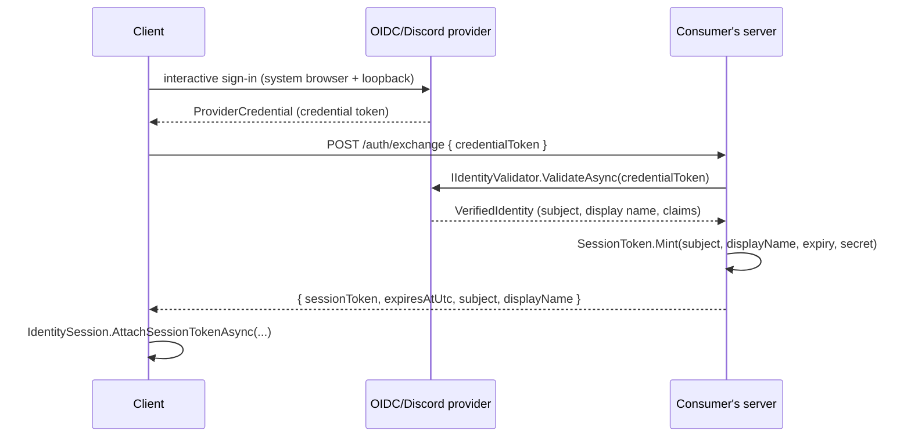

# Using KhaozEngine - the consumer contract

This is the authoritative guide to what KhaozEngine does and **how it must be used** by the games that depend
on it. The engine is **MonoGame-free**: Silk.NET windowing/input, the engine's own Metal / Direct3D 11 / Vulkan
backends behind `KhaozEngine.Gpu` for the GPU,
Silk.NET.OpenAL for audio, `System.Numerics` math throughout. Read the [Hard rules](#hard-rules) first. The rest
is reference.

This file is large (about 540 KB) and is a reference, not a read-through. Jump via the contents below,
or grep it: every section is an `##` heading named after the package or feature it covers.

## Contents

- [Mental model: one data flow](#mental-model-one-data-flow)
- [Hard rules](#hard-rules)
- [Game head build settings (CETCompat)](#game-head-build-settings-cetcompat)
- [Wiring a game (`KhaozEngine.Game` + `KhaozEngine.Game.Render3D`)](#wiring-a-game-khaozenginegame-khaozenginegamerender3d)
- [Input (`KhaozEngine.Windowing`)](#input-khaozenginewindowing)
- [Gui (`KhaozEngine.Gui`)](#gui-khaozenginegui)
- [Drag and drop across widgets (`GuiDragContext` / `DragPayload`)](#drag-and-drop-across-widgets-guidragcontext--dragpayload-1790)
- [Toast notifications (`ToastStack` / `ToastView` / `ToastTheme`)](#toast-notifications-toaststack-toastview-toasttheme)
- [Action-bar icons and cooldowns (SlotContent + CooldownOverlay)](#action-bar-icons-and-cooldowns-slotcontent-cooldownoverlay)
- [Number + duration formatting (`NumberFormatter` / `TimeFormatter`)](#number-duration-formatting-numberformatter-timeformatter)
- [Version comparison (`VersionComparer`)](#version-comparison-versioncomparer)
- [Compile-time localization enforcement (`StringId` / `LocalizedText`)](#compile-time-localization-enforcement-stringid-localizedtext)
- [File-size ratchet (KESIZE analyzer)](#file-size-ratchet-kesize-analyzer)
- [In-game patch notes (`PatchNotesLoader` / `PatchNotesView` / `PatchNotesScreen`, 10.45.0)](#in-game-patch-notes-patchnotesloader-patchnotesview-patchnotesscreen-10450)
- [Reconnect / connection-outage screen (`ConnectionStatusController` / `ReconnectScreen`, 13.2.0)](#reconnect-connection-outage-screen-connectionstatuscontroller-reconnectscreen-1320)
- [Render2D (`KhaozEngine.Render2D`)](#render2d-khaozenginerender2d)
- [DPI-aware / crisp UI (the point-space path)](#dpi-aware-crisp-ui-the-point-space-path)
- [Render3D (`KhaozEngine.Render3D`)](#render3d-khaozenginerender3d)
- [Skinned / deformable meshes (runtime bone control)](#skinned-deformable-meshes-runtime-bone-control)
- [Animated characters (glTF clip playback + locomotion blend)](#animated-characters-gltf-clip-playback-locomotion-blend)
- [Attack telegraphs / danger zones](#attack-telegraphs-danger-zones)
- [Modern particle VFX](#modern-particle-vfx)
- [Particle attractors (`ParticleAttractor` / absorb-on-arrival, 14.7.0)](#particle-attractors-particleattractor-absorb-on-arrival-1470)
- [Screen-space distortion](#screen-space-distortion)
- [Terrain (`KhaozEngine.Terrain` / `KhaozEngine.Terrain.Render3D`)](#terrain-khaozengineterrain-khaozengineterrainrender3d)
- [Third-person follow camera + character controller (`FollowCamera3D` / `CharacterController3D`)](#third-person-follow-camera-character-controller-followcamera3d-charactercontroller3d)
- [Prop scatter + asset pipeline (`AssetManifest` / `PropScatter` / `Scene3D.DrawProps`)](#prop-scatter-asset-pipeline-assetmanifest-propscatter-scene3ddrawprops)
- [Procedural dungeons (`KhaozEngine.Dungeon`)](#procedural-dungeons-khaozenginedungeon)
- [NPC navigation (`KhaozEngine.Navigation`)](#npc-navigation-khaozenginenavigation)
- [Bounded zones (`RimFeature` + `WorldBounds` + steep terrain)](#bounded-zones-rimfeature-worldbounds-steep-terrain)
- [3D physics (`KhaozEngine.Physics` / `KhaozEngine.Physics.Bepu`)](#3d-physics-khaozenginephysics-khaozenginephysicsbepu)
- [Baking prop collision (`ke-propbake`)](#baking-prop-collision-ke-propbake)
- [Static world collision (`WorldColliders` / `WorldSurfaces`) - legacy](#static-world-collision-worldcolliders-worldsurfaces---legacy)
- [Social / Discord presence (`KhaozEngine.Social` / `KhaozEngine.Social.Discord`)](#social-discord-presence-khaozenginesocial-khaozenginesocialdiscord)
- [World streaming (`TerrainStreamer` / `Scene3DChunkSink`)](#world-streaming-terrainstreamer-scene3dchunksink)
- [Textured terrain (PBR splat)](#textured-terrain-pbr-splat)
- [Textured props](#textured-props)
- [Ground-cover scatter and understory companions](#ground-cover-scatter-and-understory-companions)
- [Map documents (`KhaozEngine.MapDoc`)](#map-documents-khaozenginemapdoc)
- [Tile world (`KhaozEngine.TileWorld`)](#tile-world-khaozenginetileworld)
- [Tile world rendering (`KhaozEngine.TileWorld.Render3D`)](#tile-world-rendering-khaozenginetileworldrender3d)
- [Tile world editing (`KhaozEngine.TileWorld.Editing`)](#tile-world-editing-khaozenginetileworldediting)
- [ke-tileedit (`KhaozEngine.TileEdit.Tool`)](#ke-tileedit-khaozenginetileedittool)
- [Editor building blocks (`NumberField` / `TreeView` / `PropertyGrid` / `FlyCamera3D` / `RayMath` / `TerrainRaycast`)](#editor-building-blocks-numberfield-treeview-propertygrid-flycamera3d-raymath-terrainraycast)
- [Map editor (`KhaozEngine.MapEditor`)](#map-editor-khaozenginemapeditor)
- [ke-mapedit (`KhaozEngine.MapEdit.Tool`)](#ke-mapedit-khaozenginemapedittool)
- [Networked overworld (`KhaozEngine.Locomotion` + `KhaozEngine.NetWorld`)](#networked-overworld-khaozenginelocomotion-khaozenginenetworld)
- [Tile-world netcode (`KhaozEngine.TileWorld.Netcode`)](#tile-world-netcode-khaozenginetileworldnetcode)
- [Server status (`KhaozEngine.ServerStatus`)](#server-status-khaozengineserverstatus)
- [HTTP retry (`KhaozEngine.Http`)](#http-retry-khaozenginehttp)
- [ECS (`KhaozEngine.Ecs`)](#ecs-khaozengineecs)
- [Audio (`KhaozEngine.Audio`)](#audio-khaozengineaudio)
- [Diagnostics / logging (`KhaozEngine.Diagnostics`)](#diagnostics-logging-khaozenginediagnostics)
- [Seeing where the frame goes (turn-key HUD + frame counters)](#seeing-where-the-frame-goes-turn-key-hud-frame-counters)
- [Diagnostics overlay + telemetry recording (`DiagnosticsOverlay` / `FrameStats` / `TelemetryRecorder` / `WorldClient.NetStats`)](#diagnostics-overlay-telemetry-recording-diagnosticsoverlay-framestats-telemetryrecorder-worldclientnetstats)
- [Per-pass frame timing (`Scene3D.EnableTiming` / `PassTimings`)](#per-pass-frame-timing-scene3denabletiming-passtimings)
- [Which graphics backend actually ran (`GpuBackendSelection`, 17.21.0)](#which-graphics-backend-actually-ran-gpubackendselection-17210)
- [Letting the player choose the graphics backend (17.23.0)](#letting-the-player-choose-the-graphics-backend-17230)
- [Is the D3D11 driver emulating command lists (`GpuThreadingCaps`, 17.22.0)](#is-the-d3d11-driver-emulating-command-lists-gputhreadingcaps-17220)
- [Which card ran, and what was hooked into the process (`AdapterDescription` / `GpuInjectedModules`, 17.24.0)](#which-card-ran-and-what-was-hooked-into-the-process-adapterdescription-gpuinjectedmodules-17240)
- [Collision-shape debug overlay (`CollisionShapeOverlay` / `OverlayLegend`)](#collision-shape-debug-overlay-collisionshapeoverlay-overlaylegend)
- [Install / update stamp (`KhaozEngine.App.AppInstallStamp`)](#install-update-stamp-khaozengineappappinstallstamp)
- [Clean self-restart (`KhaozEngine.App.AppRelaunch`)](#clean-self-restart-khaozengineappapprelaunch)
- [Single-instance guard (`KhaozEngine.App.SingleInstanceGuard`, 10.110.0)](#single-instance-guard-khaozengineappsingleinstanceguard-101100)
- [Foundation packages (brief)](#foundation-packages-brief)
- [Wall-clock periodic rewards (`KhaozEngine.Progression`)](#wall-clock-periodic-rewards-khaozengineprogression)
- [Objective / goal tracking (`KhaozEngine.Objectives`)](#objective-goal-tracking-khaozengineobjectives)
- [Stat channels (`KhaozEngine.Stats`)](#stat-channels-khaozenginestats)
- [Commerce / wallet (`KhaozEngine.Commerce`)](#commerce-wallet-khaozenginecommerce)
- [Identity / sign-in (`KhaozEngine.Identity`)](#identity-sign-in-khaozengineidentity)
- [Save data (`GameStorage`)](#save-data-gamestorage)
- [Versioned save migrations (`MigrationChain<T>`)](#versioned-save-migrations-migrationchaint)
- [Batched async writes (`BatchedWriter<T>`)](#batched-async-writes-batchedwritert)
- [Deterministic floating point (`KhaozEngine.Determinism`)](#deterministic-floating-point-khaozenginedeterminism)
- [Testing your game headlessly](#testing-your-game-headlessly)
- [Device-free shader validation (`KhaozEngine.Gpu.ShaderValidation`)](#device-free-shader-validation-khaozenginegpushadervalidation)
- [GPU compute shaders (`KhaozEngine.Gpu`, 15.2.0)](#gpu-compute-shaders-khaozenginegpu-1520)
- [Deferred GPU resource disposal (`IGpuDevice.WaitForIdle` and completion fences)](#deferred-gpu-resource-disposal-igpudevicewaitforidle-and-completion-fences)
- [Headless snapshots / screenshots (`KhaozEngine.Snapshot`)](#headless-snapshots-screenshots-khaozenginesnapshot)
- [Multiplayer: transport seam + fixed-tick host (`KhaozEngine.Netcode` / `KhaozEngine.Simulation`)](#multiplayer-transport-seam-fixed-tick-host-khaozenginenetcode-khaozenginesimulation)
- [Versioning & change process](#versioning-change-process)

---

## Mental model: one data flow

A game subclasses `GameApp` (2D) or `GameApp3D` (3D). The base owns the window and the per-frame loop. The game
fills in seams.

```
hardware ──► AppWindow (the only Silk.NET/GLFW toucher) ──► InputState (immutable per-frame snapshot)
                                                                  │
                              GameApp.Run() drives, each frame, in order:
                            ── pre-record phase (the frame's command list is not open) ──
                                  Clock.Update(dt) → Viewport.Update(w,h) → OnResize? →
                                  Pointer.Update(Input, Viewport) → OnResume? → OnUpdate(dt) →
                                  OnPrepareWorld(frame)  [3D queue fill + Scene3D.PrepareFrame]
                            ── record phase (the frame's command list is open + cleared) ──
                                  OnRenderWorld(frame)  [3D pass]  →  Batch.Begin(Viewport) → OnDraw2D → End
                                                                  │
                 ┌────────────────────────────────────────────────┼─────────────────────────────┐
                 ▼                              ▼                                                 ▼
        SceneManager (scene stack)      Gui (GuiSurface / ScreenStack)                   your game logic
        routes input top-to-bottom      read Pointer / InputManager                      reads InputState / Pointer
```

Renderers compose into the same window: `Render2DSurface` (the 2D batch) and, for 3D, `Render3DSurface` + a
`Scene3D` drawn behind the 2D HUD.

---

## Hard rules

These are not style preferences. Breaking them re-introduces the exact bugs this library was built to remove.

1. **Only `AppWindow` touches the Silk.NET/GLFW input.** No game code reads Silk input devices directly. Each
   frame the window produces an immutable `InputState`; games read it through `GameApp.Input` /
   `InputManager` / `Pointer`. If you need a new piece of raw state, add it to `InputState` and populate it in
   `AppWindow` - never reach around the seam.
2. **Drive input through the loop, not by hand.** `GameApp.Run()` already calls `Pointer.Update(Input, Viewport)`
   once per frame before `OnUpdate`. If you use an `InputManager` directly (e.g. for menu nav), call
   `Update(input, viewport)` once per frame, before you query it.
3. **Hit-test with the bounds helpers, never with raw position + button.** Use `IsTapIn`, `IsPressingIn`,
   `IsHoveringIn`, `IsDraggingIn`, etc. `IsTapIn` enforces the press-origin invariant. A hand-rolled
   `IsPointerDown && rect.Contains(pos)` does not, and it leaks clicks.
4. **An overlay above a still-updating layer must reserve its footprint** with `BlockInputRegion(rect)` every
   frame, and the layer beneath must guard its actions with `IsInputBlocked(point)`. This is half of the
   click-through fix. The other half is `IsTapIn`.
5. **Pass the design viewport to `Pointer.Update` / `InputManager.Update`** so hit-testing lines up with what's
   drawn. `GameApp` does this for you. If you build your own loop, do it yourself.
6. **`System.Numerics` only** - `Vector2/3/4`, `Matrix4x4`. No XNA / MonoGame types anywhere. (An RGBA color
   is `KhaozEngine.Primitives.Color`, not a bare `Vector4`. GPU-layout structs still use `Vector4`.) To dim
   or brighten a color for a tint, use `color.ScaleRgb(factor)`: it scales RGB and keeps alpha. `color *
   factor` scales alpha too, which under the 2D batch's straight-alpha blend turns a dim into translucency
   (content beneath bleeds through) or, at low factors, invisibility - use it only when you mean to fade.
   `ScaleRgb` is unclamped, so a brighten factor over an already-bright color can overshoot 1.0 per channel.
   Use `color.ScaleRgbClamped(factor)` (same contract, each scaled channel clamped to 0..1) whenever the
   factor can push a channel out of range, e.g. a UI "selected" highlight tint.
7. **Don't fork the packages.** Need an API that isn't there? Add it to KhaozEngine, ship a headless test, bump
   the version, and consume the new version. Pinned versions are how games stay green during each other's
   migrations.

---

## Game head build settings (CETCompat)

Referencing any KhaozEngine umbrella (`Game2D`/`Game3D`/`Server`, or `Foundation` directly) makes your game
head inherit two build-property defaults from `KhaozEngine.Foundation`:

```xml
<CETCompat>false</CETCompat>                            <!-- inherited; you don't write this -->
<IncludeNativeLibrariesForSelfExtract>false</IncludeNativeLibrariesForSelfExtract>  <!-- inherited -->
```

.NET 9+ marks the x64 apphost CET / shadow-stack compatible by default. On Windows 10 builds with only partial
CET support (e.g. 20H2) that hard-aborts at boot: *"Your Windows doesn't fully support CET."* `CETCompat` is an
apphost (game-head) MSBuild property, and the engine ships libraries, not an apphost, so it cannot be set from
engine code. Foundation ships it as a `buildTransitive` props default instead, which every head inherits whether
Foundation is a direct reference or pulled in through `Game2D`/`Game3D`. A `normal`-importance build message
announces it (visible at `-v normal` and in IDE build output; the default minimal `dotnet build` stays quiet).

**This is the standard for all KhaozEngine games: leave it inherited.** CET is a hardware ROP mitigation over the
small native surface; KhaozEngine games are overwhelmingly managed (memory-safe), and DEP/ASLR plus the signed
auto-updater remain, so disabling it buys broad old-Windows compatibility for a narrow, reversible tradeoff. To
opt back in for a specific head, set `<CETCompat>true</CETCompat>` in that head's `Directory.Build.props` or
`.csproj` (your value wins, and the inherited default plus its build message step aside).

### Windows: ship the head as `WinExe` (no console window)

Build every desktop **game head** as a Windows-subsystem exe:

```xml
<OutputType>WinExe</OutputType>   <!-- in the Desktop head's .csproj -->
```

A console-subsystem exe (`<OutputType>Exe</OutputType>`) opens a console window behind the game on Windows.
`WinExe` suppresses it. Unlike `CETCompat` this is **not** inherited from `Foundation` and must be set per head,
because `OutputType` is project-specific: a **headless server** head and the CLI tools (`SnapshotTool`,
`ke-updater`, ...) stay `Exe`. `WinExe` is a no-op off Windows (it builds a normal executable), so the same head
still builds and runs on macOS/Linux and in CI.

The catch a WinExe normally brings is that a Windows-subsystem process has **no console**, so `Console.Write*`
vanishes when a developer launches the game from a terminal (`dotnet run`, cmd, PowerShell). The engine removes
that catch: `GameApp` calls `AppWindow.TryAttachParentConsole()` as the very first thing it does, attaching the
process to the launching terminal's console (if there is one) and rewiring `Console.Out`/`Console.Error` to it, so
terminal launches keep full engine + game stdout/stderr. It is a no-op - silently - for a normal Explorer/Start
launch (no parent console), off Windows, for a console-subsystem exe, and when output is redirected (a pipe, a
`> out.txt`, or a CI/test-runner capture is respected and left untouched); it never throws. A bare `AppWindow`
host (no `GameApp`) gets the same attach from the `AppWindow` constructor. **Opt out** by setting
`GameAppOptions.SuppressParentConsoleAttach = true` (default is off, i.e. the attach is on).

**Crash visibility with no console.** A fatal *startup* crash on a WinExe launched from Explorer (no window yet,
no console) would otherwise be silent, and so would one on a terminal launch once that terminal is closed.
`GameApp` therefore arms a last-chance net for every head, which writes the unhandled exception to a file in the
OS crash location (`%LOCALAPPDATA%\KhaozEngine\crash\` on Windows, `~/Library/Logs/KhaozEngine/` on macOS). This
is the floor: see [the crash file](#the-crash-file-when-there-is-no-log-to-read-crashreport-17360) below for what
it contains and how to add your own facts to it. The recommended richer path is still to wire
`KhaozEngine.Diagnostics.CrashHandler.Install()` with a `FileSink` (see the Diagnostics / logging section below),
which routes every fatal to your game's `game.log` regardless of console. `KhaozEngine.Showcase` is the reference
desktop head and ships as `WinExe`, and it runs the `SessionLog.Configure` bootstrap at its entry point before
the window opens, so the richer path is wired in the reference head too.

### Publishing (self-contained, single-file)

Publish each game **self-contained** for its RID (`dotnet publish -c Release -r <rid> --self-contained`): the
game ships its own pinned .NET runtime plus the native libs (GLFW, the platform's own graphics loader, the
`libshaderc_shared` and `libspirv-cross` shader toolchain, OpenAL) so a runtime or
native-lib CVE is patched by re-publishing, not by waiting on an engine package bump. See
[SECURITY-BASELINE.md](SECURITY-BASELINE.md).

If you also single-file publish (`PublishSingleFile=true`), the native libs **must stay loose** next to the
exe. KhaozEngine reaches GLFW, the graphics loaders, `libshaderc_shared`, `libspirv-cross` and OpenAL through
native libraries the runtime locates by probing the apphost
directory. .NET's default for single-file is `IncludeNativeLibrariesForSelfExtract=true`, which packs them into
the self-extracting exe where Silk.NET's loader can't find them, so the game dies at boot with *"Couldn't find a
suitable window platform (GlfwPlatform - not applicable)"*. Foundation therefore defaults
`IncludeNativeLibrariesForSelfExtract=false` (inherited, overridable the same way as `CETCompat`); leave it
inherited. The default is a no-op unless you set `PublishSingleFile=true`.

### Linux: the natives land next to your assemblies (18.0.0)

Nothing to do, but worth knowing why your Linux `bin/` has a few `.so` files loose in it. Silk.NET does not
reach GLFW, OpenAL Soft, `libshaderc_shared` or `libspirv-cross` through `[DllImport]`, so the .NET host's own
`deps.json` native resolution never runs for them. `Silk.NET.Core` probes `runtimes/<rid>/native` itself, and on
Linux the rid it asks for is the DISTRO one (`ubuntu.24.04-x64`), never the portable `linux-x64` the packages
ship under. Both bridges are gone: `deps.json` has carried no rid fallback graph since .NET 8, and Silk's own
fallback guess only understands rids beginning `osx` or `win`. So a Linux app built the ordinary way finds
none of them, and dies at the first shader compile with `Could not load from any of the possible library names`
out of `SpirvFrontEnd`'s static constructor
([#722](https://github.com/APKiwiOrg/KhaozEngine/issues/722)).

`KhaozEngine.Foundation` ships a targets file that copies the host rid's native assets flat into your output
directory, which is the first place Silk's resolver looks. It rides in on `Game2D`, `Game3D`, `Server` or a
direct `Foundation` reference, it runs on `build` and on a rid-agnostic `publish`, and it is a no-op on Windows
and macOS (both resolve out of `runtimes/` fine) and on `publish -r <rid>` (the SDK already lays those flat).
A project that references no native package copies nothing. Set
`<KhaozEngineFlattenHostNatives>false</KhaozEngineFlattenHostNatives>` if you lay the natives out yourself.

**And the three packages that carry the natives ship the same rule themselves**, so a project that takes one of
them on its own and no umbrella is covered too
([#723](https://github.com/APKiwiOrg/KhaozEngine/issues/723)). `KhaozEngine.Gpu`, `KhaozEngine.Windowing` and
`KhaozEngine.Audio` each pack the one physical rule file under their own package name, which NuGet auto-imports.
That is the case a Linux shader tool on `Gpu` alone, or a headless audio tool on `Audio` alone, used to miss:
`Foundation` is not in any of their dependency closures. Taking both a package and an umbrella lands two copies
of identical targets, which MSBuild treats as a redefinition rather than an error.

**New game head checklist:** set `<OutputType>WinExe</OutputType>` on the Desktop head (no stray console window;
the engine attaches the parent console for terminal launches). `CETCompat` and
`IncludeNativeLibrariesForSelfExtract` are the engine-imposed build-property defaults. Pin your umbrella package
version, publish self-contained for your RID, and leave both defaults inherited unless you have a specific reason
to re-enable either.

---

## Wiring a game (`KhaozEngine.Game` + `KhaozEngine.Game.Render3D`)

`GameApp` is the abstract 2D game-loop facade. It owns the `AppWindow`, `GameClock`, an `IDesignViewport`, the
`Pointer`, a `Render2DSurface` (`Surface2D`) and its `SpriteBatch` (`Batch`). You configure it with a
`GameAppOptions` and override the seams you need.

```csharp
using System.Numerics;
using KhaozEngine.Game;
using KhaozEngine.Render2D;
using KhaozEngine.Windowing;

public sealed class MyGame : GameApp
{
    public MyGame() : base(GameAppOptions.For("My Game", 1280, 720)) { }

    protected override void OnLoad()              { /* load textures/fonts via Surface2D */ }
    protected override void OnUpdate(float dt)
    {
        if (Input.WasPressed(Key.Escape)) Quit();
        if (Pointer.IsTapIn(new Rect(300, 200, 200, 40))) { /* button hit, click-through-safe */ }
    }
    protected override void OnDraw2D(SpriteBatch batch) { /* batch.Draw(...) / font.DrawString(...) */ }
    protected override void OnResize(int w, int h)      { }
}

// Program.cs
using var game = new MyGame();
game.Run();
```

`GameAppOptions` (a struct): `Title`, `Width`/`Height`, `DesignWidth`/`DesignHeight`, `ScaleMode`, `ClearColor`,
`ResumeGapThresholdSeconds` (see the resume hook below), `PresentMode` + `FrameCapHz` + `WindowMode` (see below), and optional
`WindowFactory` / `ViewportFactory` (e.g. `AppWindow.Scaled` for a display-fitted window, or an `AdaptiveViewport`
for responsive layout), `AppUserModelId` (Windows taskbar identity), `SuppressParentConsoleAttach` (opt out of
the WinExe parent-console attach - see [Game head build settings](#game-head-build-settings-cetcompat)), and
`SuppressCrashReportFile` (opt out of the last-chance crash file). Use
`GameAppOptions.For(title, w, h)` for the common case.

**Present mode + frame cap.** `GameAppOptions.PresentMode` (`Vsync` default / `Immediate`) selects the swapchain's
vertical-blank sync. `GameAppOptions.FrameCapHz` (a positive Hz) is an EXPLICIT cap that paces the loop to that rate
with a monotonic-clock `FrameLimiter`, independent of vsync. Pin it to an integer multiple of a fixed
simulation/network tick (e.g. 60 or 120 for a 30 Hz tick) so presentation stays phase-aligned - the cheapest way to
remove any residual render:tick beat, and the deterministic cap where vsync does not throttle. The cap also applies to
a custom `WindowFactory` window. `PresentMode` is set at swapchain creation, so a custom factory must forward it (or
pass it to `new AppWindow(...)` / `AppWindow.Scaled(...)`). `GameAppOptions.WindowMode` (default `Windowed`) sets the
initial window mode (also applied on a custom factory window).

**Backend-aware auto cap (the default) + background throttle (since 10.96.0).** The engine now paces the loop sensibly
by default, so a client no longer free-runs a whole core plus the GPU out of the box.

- **`FrameCap.Auto` is the default cap** (`GameAppOptions.FrameCap`, and the plain `new AppWindow(title, w, h)` ctor).
  **Since 18.0.0 it resolves to uncapped on every live backend**, and that is a measurement rather than a
  simplification. The question the arm asks is whether the backend's present throttles the CPU from vsync alone,
  and the only backend that ever answered no was the Veldrid Metal incumbent, deleted in 18.0.0. `D3D11Native`
  and `VulkanNative` throttle, and (measured 2026-08-11) so does the engine's own **`MetalNative`**, whose
  present blocks the CPU in the drawable acquire for the whole vertical-blank wait. With `PresentMode.Immediate`
  (any backend) it stays uncapped, respecting the lowest-latency intent. A
  consumer-set value always wins: `FrameCap.Uncapped` is an intentional free-run (the pre-10.96 default) and
  `FrameCap.Hz(n)` / a positive `FrameCapHz` is a fixed cap. A positive `GameAppOptions.FrameCapHz` overrides
  `FrameCap`. `FrameCap.Resolve(backend, present, displayRefreshHz)` is the pure, headless-tested resolver.
- **`BackgroundThrottlePolicy` throttles a backgrounded window** (`GameAppOptions.BackgroundThrottle`, default ON when
  left `null`). **Minimized:** skip render + present entirely and idle the loop at `MinimizedHz` (default 10) - update
  still runs each idle tick so simulation / netcode / timers keep advancing, and events keep pumping so the window can
  be restored. **Unfocused but visible:** keep rendering, capped to `UnfocusedHz` (default 15, or lower if the base cap
  is already lower). Set `BackgroundThrottlePolicy.Disabled` to keep rendering full-rate in the background (a live
  wallpaper / capture source), or a custom policy with the `init` setters. On a minimized frame `Frame.RenderSuppressed`
  is set. `GameApp` honours it (runs `OnUpdate` only, skips the draw passes), and a raw `AppWindow.Run` callback must
  check it before drawing. The per-frame decision is the pure, headless-tested `BackgroundThrottlePolicy.Plan`.
- **`PauseOnFocusLoss` stops the SIMULATION while the window is backgrounded** (`GameAppOptions.PauseOnFocusLoss`,
  default `false` = the historic behaviour, physics and timers and AI carry on full tilt behind whatever the player
  alt-tabbed to). Set it and the frame loop drives `Clock.Pause()` / `Clock.Resume()` off the frame snapshot's
  `Input.WindowFocused` bit, so an unfocused frame reports a zero `Dt` and the clock's `Paused` / `Resumed` events
  fire on the transitions. It only lifts a pause it took itself: a game already paused when focus is lost (its own
  pause menu, or a zero `TimeScale`) is still paused when the window comes back, so the switch composes with a
  game's own pause instead of fighting it. Real time keeps running either way, which is what `OnResume` and the
  clock's unscaled members are for. Orthogonal to `BackgroundThrottle`, which throttles RENDERING and leaves the
  simulation alone.

```csharp
var o = GameAppOptions.For("My Game", 1280, 720);   // FrameCap.Auto + background throttle ON by default
o.FrameCap = FrameCap.Uncapped;                       // opt back into a free-run (the old default)
o.FrameCapHz = 120;                                   // or an explicit fixed cap (wins over FrameCap)
o.BackgroundThrottle = BackgroundThrottlePolicy.Disabled;                       // render full-rate when backgrounded
o.BackgroundThrottle = BackgroundThrottlePolicy.Default with { UnfocusedHz = 30 }; // or tune it
o.PauseOnFocusLoss = true;                            // and freeze the sim while the window is backgrounded
```

**Runtime display settings (since 9.24.0).** Present mode, frame cap, window mode, and resolution are all changeable
live mid-session - safe to call from a settings screen at any time, with no crash and no leaked swapchain. The whole
surface is `GameApp.Display` (an `IDisplaySettings`), or use the individual `GameApp.PresentMode` / `FrameCapHz` /
`WindowMode` pass-throughs:

```csharp
app.PresentMode = PresentMode.Immediate;             // flip vsync live (reconfigures the swapchain in place)
app.FrameCapHz  = 120;                                // change the software cap; takes effect next frame
app.WindowMode  = WindowMode.BorderlessFullscreen;    // Windowed / BorderlessFullscreen / ExclusiveFullscreen
app.Display.Resize(1600, 900);                        // windowed size in logical points; the swapchain follows

// Or apply a whole snapshot at once (window mode -> resolution -> placement -> frame cap -> present mode):
DisplaySettings s = app.Display.CurrentDisplay with { PresentMode = PresentMode.Vsync, FrameCapHz = 60 };
app.Display.ApplyDisplay(s);
```

`PresentMode` reconfigures the live swapchain's `SyncToVerticalBlank` in place (no recreate). `WindowMode` /
`Resize` drive the window and the swapchain follows the new framebuffer via the resize hook, so the HiDPI
framebuffer semantics are unchanged (the backbuffer always tracks the physical drawable). **Mac/Metal caveat,
now history:** setting vsync engages `CAMetalLayer.displaySyncEnabled`, and the Veldrid Metal present did not
throttle the CPU from vsync alone. That was measured on `GpuBackendKind.Metal` and applied to it alone. The
engine's own `MetalNative` was measured on 2026-08-11 and its present DOES throttle: the drawable acquire blocks
once per frame for 15.175 ms of a 16.669 ms frame, a display pinned to 120 Hz paces it at 120 fps, and turning
vsync off mid-session free-runs past 700 fps with visible tearing. The incumbent was deleted in 18.0.0, so vsync
with no software cap is a healthy configuration on every live backend and `FrameCap.Auto` resolves to uncapped
everywhere. Nothing branches on `GameApp.Backend` to set a cap. The one-time `Console.Error` warning is GONE at 18.0.0:
`AppWindow.WarnIfMetalVsyncUncapped` and its one-shot latch were deleted with the backend that tripped them, so
nothing on the frame-cap path writes to `Console.Error` any more. The pure predicate
`DisplaySettings.RequiresFrameCapWarning(backend, presentMode, frameCapHz)` STAYS, now a constant `false`, as
the QUESTION an appended backend has to answer: it is row 10 of the `GpuBackendKind` append audit and it pairs
with `FrameCap.Resolve`'s `Auto` arm, so a backend whose present free-runs under vsync puts an arm back in both
in the same commit rather than changing public API. Its only in-repo readers are those audits and the
`DisplaySettings` / `FrameCap` unit tests. The window-mode policy is the pure `WindowModePlanner.Compute`, and
the auto-cap resolver is the pure `FrameCap.Resolve` - all headless-unit-tested.

**Runtime window placement (since 9.26.0).** `IDisplaySettings` also exposes the window position + monitor, so a
consumer can persist and restore the full placement (which monitor + position + size) across launches. Position
accessors mirror the size convention (`WindowX` / `WindowY` getters + `MoveTo`, matching `WindowWidth` /
`WindowHeight` + `Resize`):

```csharp
app.Display.MoveTo(200, 150);                     // window top-left in virtual-desktop coordinates
int mi = app.Display.CurrentMonitorIndex;         // monitor holding the window (-1 if unknown)
foreach (MonitorInfo m in app.Display.Monitors)   // drive a monitor dropdown (index / name / bounds)
    Console.WriteLine($"{m.Index}: {m.Name} {m.Width}x{m.Height}");
app.Display.MoveToMonitor(1);                      // centre on / cover monitor 1

// Persist on exit: CurrentDisplay carries position (X/Y) alongside size + mode + present.
DisplaySettings saved = app.Display.CurrentDisplay;   // serialize saved to settings.json

// Restore on boot: ApplyDisplay clamps a stale position on-screen before moving, so a saved
// position whose monitor is now gone (unplugged / different layout) self-corrects.
app.Display.ApplyDisplay(saved);
// (or call app.Display.EnsureVisible() after any restore to re-clamp explicitly.)
```

A hand-built `DisplaySettings` without a position (`X`/`Y` default to `DisplaySettings.PositionUnspecified`) leaves
the window where it is. All placement math is pure and headless-tested in `WindowPlacement` (`MonitorIndexFor` /
`CenterOn` / `ClampVisible`) with the `MonitorInfo` record; only `AppWindow` touches the Silk monitor statics.

**Networked-movement presentation (NetWorld).** `WorldClient` renders remotes on a fixed interpolation delay
(`WorldClientConfig.InterpolationDelayTicks`, default 2) - a timestamped snapshot buffer lerped by true timestamps,
so remotes glide with no holds or catch-up snaps at any render:tick ratio - and the local predicted avatar is
C1-continuous across reconciliation, including across velocity transitions (10.7.0 removed the decel-to-stop shake
where a backward-dipping authority basis dragged the render back). The reconciliation render offset is
critically-damped on BOTH the planar and the vertical axes (vertical since 10.33.0), so the surface-swim buoyancy
spring's continuous stream of small vertical corrections eases with inertia instead of jerking the camera bob.
For debugging movement smoothness set `WorldClientConfig.PresentationTraceEnabled`
and dump `WorldClient.PresentationTrace.WriteCsv(path)` (render time, delay, seconds-since-snapshot, per-remote hold
flag, snapshot arrivals, local reconcile-error, rendered positions).

**Runtime window/taskbar icon.** Set `WindowIconPath` to a PNG (the simple case) or `WindowIcons` to an explicit
list of decoded `ImageRgba` (16/32/48 px so GLFW picks per DPI; `WindowIcons` wins over `WindowIconPath`). `GameApp`
applies it during construction while the window is still hidden, then shows the window, so on Windows the taskbar
button is created with the icon already set. This sets the title-bar + taskbar icon at runtime. On Windows those are
two different slots: the title bar + Alt-Tab come from `WM_SETICON` (what `glfwSetWindowIcon` sets), while the
**taskbar button** reads the window *class* icon - which GLFW leaves at its generic default (a .NET
`<ApplicationIcon>` is not the `GLFW_ICON` resource GLFW looks for). `SetIcon` closes that gap by also copying the
icon onto the class icon (via `Platform.WindowsWindowIcon`), which is what actually fixes the taskbar button. The
Windows `.exe` icon shown when the app is not running is a separate per-game `<ApplicationIcon>` in the desktop
csproj, independent of this API. Under the hood `GameApp` decodes the PNG via `Render2D.ImageRgba` and hands
already-decoded `WindowIcon`s to `AppWindow.SetIcon(...)`, which a non-`GameApp` host can also call directly (then
call `AppWindow.Show()` once the icon is set); the `KhaozEngine.Windowing` package itself stays decode-free (no
Render2D dependency).

**Windows taskbar identity (AppUserModelID).** On Windows 10/11 the taskbar groups and pins a running app's button
by the process's explicit AppUserModelID; a .NET apphost that never sets one gets an unstable process-derived
identity. Set `GameAppOptions.AppUserModelId` (e.g. `"APKiwi.Nullwake"`, a dotted `CompanyName.ProductName`) and
`GameApp` sets it (via `AppWindow.TrySetProcessAppUserModelId`, which forwards to `Platform.WindowsAppId`) before
creating the window, stabilising grouping/pinning. This is taskbar *identity*, not the button's icon - the icon is
fixed by the class-icon sync above; set both. A non-`GameApp` host calls `AppWindow.TrySetProcessAppUserModelId("...")`
itself before constructing the window. Null (the default) keeps the current behaviour; a no-op that never throws off
Windows.

**macOS Dock icon.** GLFW cannot set the Cocoa Dock icon, so `SetIcon` is a no-op on macOS, and an app launched via
`dotnet run` has no `.app` bundle `.icns` - so without help it shows the generic document icon in the Dock and
Cmd-Tab. `GameApp` fixes this automatically: when `WindowIconPath` is set, on macOS it also feeds that PNG to
`AppWindow.SetMacDockIcon(pngBytes)`, which sets the Dock icon at runtime via
`Platform.ApplicationIcon.TrySetMacDockIcon` (`NSApplication.setApplicationIconImage:`). A `WindowIcons`-only config
(no PNG path) leaves the Dock icon untouched, since `NSImage` decodes from the PNG. A non-`GameApp` host can call
`AppWindow.SetMacDockIcon(...)` directly. It returns `false` (never throws) off macOS or on empty input. A packaged
`.app` bundle with its own `.icns` still owns the Dock icon the normal way; this is for the unbundled dev/run case.

`GameApp` seams: `OnLoad()`, `OnUpdate(float dt)`, `OnPrepareWorld(Frame)` + `OnRenderWorld(Frame)` (the world
pass, in two phases, both empty in 2D), `OnDraw2D(SpriteBatch)`, `OnResize(int, int)`, `OnResume(TimeSpan)` (see
below), `OnDispose()`. Properties you read: `Window`, `Clock`, `Viewport`, `Pointer`, `Input` (the frame's
`InputState`), `Surface2D`, `Batch`, `FrameWidth`/`FrameHeight`/`Dt`, `ClearColor`. Call `Quit()` to exit.

### The frame's pre-record phase (`AppWindow.Run(onFrame, onPrepare)`, `GameApp.OnPrepareWorld`)

The windowed loop runs **two** callbacks per frame. `onPrepare` runs first, after the frame's `Dt` / `Input` /
size are latched and **before** the frame's command list is opened. `onFrame` runs second, with that list open,
bound to the swapchain and cleared. `Run(onFrame)` is exactly `Run(onFrame, null)`, so a host that wants one
callback keeps writing one.

```csharp
window.Run(
    onFrame: frame =>
    {
        if (frame.RenderSuppressed) return;                 // minimized: no list was opened, so record nothing
        surface3D.Render(frame);                            // records into frame.Commands
    },
    onPrepare: frame =>
    {
        if (frame.RenderSuppressed) return;                 // update-only frame, nothing to queue or prepare
        scene.Begin(); DrawTheWorld(scene); scene.PrepareFrame();
    });
```

Name the arguments. Both are `Action<Frame>`, so swapping them compiles and silently moves every draw outside
the frame's command list.

**Why it exists.** Some per-frame GPU work cannot be recorded into the frame's list at all: a compute dispatch
whose output another dispatch reads in the same frame has no dispatch-to-dispatch barrier at the GPU seam, so its
only ordering is a submit plus a device wait, which means a command list of its own. Opening one while the
frame's list is recording is the nested recording the seam refuses by name, on every backend, so that work has
nowhere to go inside the record phase. The headless hosts (`Render3DSnapshot.Capture`,
`Render3DPreview.Capture`) open the frame's list themselves and could already honour that ordering. The windowed
loop opened it before calling back, so no host running on a window could (issue #429). This phase is the fix.

**It was built for a backend that no longer exists, and it is KEPT anyway (18.0.0, issue #690).** The urgency
came from the vendored Veldrid Direct3D11 leg, where a command list WAS the device's immediate context and a
second `Begin` called `ClearState` on it, so the nesting was a silent one-frame corruption rather than a refusal
(issue #423). That leg was deleted in 18.0.0, and the plan of record had been to retire this phase with it. It
was not, because neither reason it rests on was that leg's: the seam still offers no dispatch-to-dispatch
barrier, so a dependent compute chain still pays `End` + `Submit` + a device wait and still needs a list of its
own, and the one-open-recording rule is still enforced for every recording the engine opens, on every backend.
Nothing about `AppWindow.Run(onFrame, onPrepare)`, `GameApp.OnPrepareWorld` or `Scene3D.PrepareFrame` changed in
18.0.0, and no game needs to do anything.

**What belongs where.** `onPrepare` is for update-side work and for filling the frame's queues, which is what
puts a producer's own command list before the frame's. Do **not** record into `Frame.Commands` there: the list is
not open yet, and on a render-suppressed (minimized) frame it is never opened at all. Draws belong in `onFrame`.
Both callbacks run on a render-suppressed frame, so simulation keeps advancing while iconified.

**On `GameApp` / `GameApp3D` this is already wired**, and a game needs no change. `GameApp` splits its own body at
the same seam: everything through `OnUpdate` and the diagnostics-HUD tick runs in the prepare phase and ends on
`OnPrepareWorld(Frame)`. `OnRenderWorld(Frame)` and the 2D / UI / overlay passes run in the record phase. The
order a game sees is unchanged (`OnUpdate` still precedes `OnDraw3D`, which still precedes the 2D passes).
`GameApp3D` runs `Scene.Begin()` -> `OnDraw3D(Scene)` -> `Scene.PrepareFrame()` in `OnPrepareWorld`, leaving
`Surface3D.Render(frame)` in `OnRenderWorld` - so `Render3DSurface.Render`'s own `PrepareFrame` call finds the
frame already prepared and no-ops, which is exactly what its documented idempotency is for. Override
`OnPrepareWorld` yourself only if you have per-frame GPU work of your own that needs its own command list.

**Resume after OS sleep/suspend (`OnResume`).** The frame `dt` is clamped to 0.1s (a spiral-of-death guard) and
comes from a `Stopwatch`-style timer that does not reliably advance across an OS sleep/S3/hibernate, so a game
that leaves the process running while the machine suspends gets no signal that hours of real time just passed.
`GameClock` also samples a UTC wall clock each frame and reports `RealWallGapSeconds` (the wall gap to the
previous frame, clamped to `>= 0`; `LastRealTimestamp` is the sample). When that gap exceeds
`GameAppOptions.ResumeGapThresholdSeconds` (default 30s; 0 or negative disables), `GameApp` calls
`OnResume(TimeSpan wallGap)` once, before `OnUpdate` on that frame and never on the first frame. Override it to run
offline/AFK catch-up (e.g. a one-shot `TimeSkip.Advance`), re-sync timers, or pause. This is a separate signal
from the sim delta: the 0.1s clamp and `Dt` are unchanged.

### Scenes (`SceneManager` / `GameScene`)

For multi-screen games, push `GameScene`s onto a `SceneManager` (full-frame scene stack, distinct from the
2D-only `Gui.ScreenStack`). `Push`/`Pop`/`Replace`/`SwitchTo`/`Clear`; a scene overrides `OnEnter`/`OnExit`,
`OnUpdate(dt)`, `OnDraw2D(batch)`, `OnResize`. Set `DrawBelow` / `UpdateBelow` for an overlay scene (e.g. a pause
menu over a still-rendered match). Feed the manager its frame context each frame, then `Update(dt)` and
`Draw2D(batch)`:

```csharp
_scenes.SetFrameContext(Input, Pointer, Viewport, Ui, UiPointer, FrameWidth, FrameHeight);
_scenes.Update(dt);
```

Use `SetFrameContext` rather than assigning the seven properties one at a time. They are all individually
settable, so a host that wires six and forgets the seventh compiles and runs, with that one left at its
default and nothing thrown or logged. A forgotten argument, by contrast, does not build. Two of those
defaults are the ones that bite: an unset `Input` stays `InputState.Empty` and an unset `UiPointer` stays
null, which is exactly what disables `BootScreen`'s own retry/quit UI (see below) on the day a real boot
failure needs it.

### Boot / startup screen (`BootScreen` / `BootPipeline` / `IBootStep`)

Give the game an instant-on startup: push `BootScreen` as the FIRST scene and the window shows a progress bar in
the first frames, then a staged pipeline runs while the bar advances (update check + apply, server-status
min-version gate, then the game's own asset warm-up), and hands off to the game's first scene on success. The
heavy work is deferred into the pipeline, so no game asset loading precedes the bar (process start + window
creation still precede it - the honest floor). The screen renders with only the engine-internal default font +
a 1x1 white texture, so it needs zero game assets.

Create the two cheap resources on the app's `Surface2D` (a `GameScene` cannot reach the device), then build the
screen from a `BootOptions`. Use `LoadDefaultDpiFont(pointSize, cacheSlots: 4)` for the font: the boot screen is a
DPI-aware `OnDrawUi` scene, so it bakes each label at its exact device-pixel size and the text stays texel-crisp on
HiDPI (a fixed `SpriteFont` is accepted too, via an overload, but is bilinear-resampled by the theme scales - use
the `DpiFont` for crisp text). Each built-in step is individually optional: leave `UpdateService` null to skip the
update step, leave `ServerStatusClient` null to skip the server-status step (it is off unless a status endpoint
is configured). The game's own steps go in `GameSteps` via `BootStep.Create`. A step reports a determinate
fraction with `progress.Report(0..1)` or marks its slice indeterminate with `progress.ReportIndeterminate()`.

```csharp
readonly SceneManager _scenes = new();

protected override void OnLoad()
{
    var white = Surface2D.CreateTexture(new byte[] { 255, 255, 255, 255 }, 1, 1);
    var font = Surface2D.LoadDefaultDpiFont(28f, cacheSlots: 4);   // DPI-aware engine font, no game asset

    var options = new BootOptions
    {
        UpdateService = _updates,                                   // optional, null skips the update step
        ServerStatusClient = _status, LocalClientVersion = "1.4.0", // optional, null skips server status
        GameSteps = new[]
        {
            BootStep.Create(MyStrings.LoadTextures, weight: 3f, async (progress, ct) =>
            {
                for (int i = 0; i <= count; i++) { LoadTexture(i); progress.Report(i / (float)count); await Task.Yield(); }
            }),
        },
        // AllowRetryOnFailure / AllowQuitOnFailure default true. Theme = BootScreenTheme.Default.
    };

    _scenes.Push(BootScreen.Create(white, font, options,
        firstScene: () => new MainMenuScene(...),   // built + shown when the pipeline completes
        onQuit: Quit));                             // wired to the quit affordance in the failure state
}
```

Then drive the manager as usual: `_scenes.SetFrameContext(Input, Pointer, Viewport, Ui, UiPointer, FrameWidth,
FrameHeight)` and `_scenes.Update(dt)` in `OnUpdate`, and `_scenes.DrawUi(batch)` in `OnDrawUi` (the boot screen
draws through the DPI-aware `OnDrawUi` pass). Wire it through that one call, not the seven properties: this
screen is the one that reads `Input` for its Enter/Escape retry-quit and `UiPointer` for its Retry/Quit button
clicks, so a host that misses either leaves the failure screen looking correct and doing nothing. A step signals failure by throwing `BootStepException(localizedMessage)` (the
screen shows it with retry / quit affordances). The server-status min-version gate does this automatically for
`ServerStatusState.UpdateRequired`. A required update applied by `UpdateBootStep` restarts the app by design
(not a failure). Restyle without forking via `BootScreenTheme` (colours, bar geometry, optional logo + a custom
`DrawBackground` hook). A step that reports no measurable fraction draws the sweeping marquee over a bare track,
never a fraction fill underneath it, and `MarqueeColor` resolves to a lightened `BarFill` unless it is assigned, so
restyling the fill carries the marquee with it. Assign `MarqueeColor` only for a deliberately contrasting marquee,
and note it now draws at its own alpha rather than a fixed fraction of it. All player-facing copy lives in
`BootStrings` (`boot.*` keys) with a built-in English fallback, so add those keys to your catalog to localize.

### Verify and repair a damaged install (`UpdateService.VerifyAndRepairAsync`)

The launch check cannot see a corrupted install: it short-circuits at the version gate when the installed
version already matches the feed, and even past that gate its local picture is the cached manifest, which
records the hash each file is *supposed* to have. So a file damaged after an update leaves the client
reporting the right version forever while a content handshake rejects it.
`await updates.VerifyAndRepairAsync()` is the explicit way out: it hashes the install for real, diffs it
against the signed manifest, and re-downloads plus re-applies the difference through the ordinary pipeline.
Wire it to a "Verify game files" action, never to launch (hashing an install is expensive). Branch on
`UpdateRepairResult.Outcome` (`Verified` / `Repairing` / `RepairStaged` / `FeedUnreachable` / `Failed`) and
show `FilesChecked` / `FilesNeedingRepair`; pass an `IProgress<UpdateRepairProgress>` for a progress screen,
and `applyRepair: false` to stage the fix and apply it yourself later. Extraneous files are reported, never
deleted. Full mechanics in [UPDATER.md](UPDATER.md).

### In-session update recheck + post-update relaunch (`UpdateService`)

Two opt-in `UpdateService` conveniences for a long-running game, both driven from the game loop. Full
mechanics live in [UPDATER.md](UPDATER.md).

- **Periodic recheck.** A launch-time check misses a release that lands mid-session. Set
  `UpdateServiceOptions.RecheckInterval` (a `TimeSpan?`, null by default = off) and call
  `updates.Tick(dt)` once per frame next to `UpdateOverlayActions.AutoAdvanceRequired(updates)`. `Tick`
  accrues time only while the service is `Idle` (any active flow zeroes it), fires one offline-safe
  `CheckForUpdateAsync` on reaching the interval, and no-ops when the interval is null. Call `Tick` and
  `CheckForUpdateAsync` from the same thread (a manual check resets the clock).
- **Post-update relaunch marker.** After the shim applies an update and relaunches, the boot's
  `UpdateService` exposes a non-null `PostUpdateRelaunch` (`PostUpdateRelaunchInfo`, with `Version` and
  `AppliedAtUtc`), read once from an `update-applied.json` marker and then deleted, so it is null on every
  ordinary launch. Check it at startup to suppress a "welcome back" / "what's new" prompt on a boot the
  game restarted itself into.

### Dismissing the update overlay, and the apply cap (`UpdateOverlayView`, `UpdateService`)

The overlay's visibility used to be a pure function of `UpdateState`, so once the flow left `Idle` the panel
stayed on screen and a persistently failing apply left the player cycling retry, download, failed apply with
no way out but quitting. Two mechanisms, both on by default and neither needing new wiring. Full mechanics in
[UPDATER.md](UPDATER.md).

- **A dismiss key.** `UpdateOverlayTheme.DismissKey` (default `Escape`, with `DismissButton` default gamepad
  `B`) hides the panel for a state the player may decline: `UpdateAvailable`, `ReadyToApply`, `Failed`
  (`UpdateOverlayView.IsDismissible`). Never the in-flight `Downloading`/`Applying`, and never a required
  update. The dismissal is remembered per state, so a periodic recheck landing back on the same offer stays
  hidden, and the panel returns only at a state that was not declined. `View.ResetDismissed()` clears it, for
  a game whose own UI re-engages with the updater. The default theme draws a third line advertising the key
  (`update.overlay.dismiss.hint`), and the dismiss frame is consumed so the press does not also reach the game.
- **A per-session apply cap.** `UpdateService.FailedApplyAttempts` counts failed applies and
  `ApplyAttemptsExhausted` goes true at `UpdateServiceOptions.MaxApplyAttemptsPerSession` (default 2,
  non-positive turns it off). `UpdateOverlayActions.ResolveAction(IUpdateStatus)` then maps `Failed` to `None`
  instead of `Retry`, and the default theme swaps in `update.overlay.failed.body.exhausted`. The service warns
  once when the budget goes. A failed download is not an apply attempt, and the cap never blocks a direct
  `ApplyUpdate` (the startup gate and a staged repair are unaffected).

### 3D (`GameApp3D`, `IGameScene3D`, `SceneManager.Draw3D`)

`GameApp3D : GameApp` adds a `Render3DSurface` (`Surface3D`) and a `Scene3D` (`Scene`), and a new seam
`OnDraw3D(Scene3D scene)`. It overrides both world seams to run the 3D pass behind the 2D HUD: `OnPrepareWorld`
does `Scene.Begin()` -> `OnDraw3D(Scene)` -> `Scene.PrepareFrame()` in the frame's pre-record phase, and
`OnRenderWorld` records it with `Surface3D.Render(frame)` (see "The frame's pre-record phase" above). A scene that
draws 3D implements `IGameScene3D` (`void OnDraw3D(Scene3D scene)`), and the app's `OnDraw3D` calls the
`SceneManager.Draw3D(scene)` extension to render the visible scene set.

```csharp
public sealed class MyGame3D : GameApp3D
{
    public MyGame3D() : base(GameAppOptions.For("My 3D Game", 1280, 720)) { }
    protected override void OnDraw3D(Scene3D scene) { _scenes.Draw3D(scene); }   // 3D world
    protected override void OnDraw2D(SpriteBatch batch) { /* HUD over the 3D */ }
}
```

---

## Input (`KhaozEngine.Windowing`)

### InputState - the immutable snapshot

`AppWindow` produces one `InputState` per frame (delivered as `Frame.Input`, surfaced as `GameApp.Input`). All
engine-native, `System.Numerics`:

```csharp
public sealed class InputState   // immutable per-frame snapshot; InputState.Empty is a blank one
{
    // read-only properties; the constructor takes them in this order:
    IReadOnlySet<Key> KeysDown, KeysPressed, KeysReleased;
    IReadOnlySet<MouseButton> MouseDown, MousePressed;
    Vector2 MousePosition, MouseDelta;  float ScrollDelta;  int Width, Height;
    IReadOnlyList<GamepadState> Gamepads, Touches;  // ctor args optional, default empty
    bool WindowFocused;                             // optional trailing ctor arg, default true (Empty = false)
    IReadOnlySet<Key> KeysRepeated;                 // optional trailing ctor arg, default empty
    IReadOnlySet<MouseButton> MouseReleased;        // optional trailing ctor arg, default empty
}

bool IsDown(Key) / WasPressed(Key) / WasReleased(Key);
bool WasRepeated(Key) / WasTyped(Key);   // OS auto-repeat tick / press-or-repeat
bool IsDown(MouseButton) / WasPressed(MouseButton) / WasReleased(MouseButton);
GamepadState Gamepad(int i = 0);  GamepadState PrimaryGamepad { get; }
```

`Key` and `MouseButton` are engine enums; `GamepadState` exposes `ButtonsDown/Pressed/Released`,
`LeftStick`/`RightStick` (+ `LeftStickDeadzoned(...)`), triggers, and `IsDown/WasPressed/WasReleased`.

`WasRepeated(Key)` is `true` on a frame the key fired an OS auto-repeat tick (held past the user's OS repeat delay,
then recurring at the OS repeat rate); `AppWindow` fills `KeysRepeated` from GLFW's `REPEAT` key action. `WasPressed`
stays the press edge only (auto-repeat excluded), so existing callers are unchanged; `WasTyped(Key)` is the union
(`WasPressed || WasRepeated`) - the "a character was typed this frame" signal hold-to-repeat text entry wants.
`TextEntry`/`TextInput` use it, so a held Backspace or character key repeats with no game code.

`MouseReleased` (since 14.25.0) is the mouse counterpart to `KeysReleased`, read via `WasReleased(MouseButton)`.
Before it existed the mouse had a press edge but no release edge, so a rebindable action bound to a mouse button
via `InputSource.FromMouseButton(...)` reported a permanently-false release and any consumer wanting one had to
re-derive it by hand against the previous frame. It is an optional trailing constructor argument, so hand-built
snapshots that omit it simply carry an empty set.

`WindowFocused` is `true` while the window owning this snapshot is the frontmost (OS-focused) window. The render
loop keeps running and the cursor stays live while the window is in the background, so gate input that should stop
when unfocused on it (e.g. `if (Input.WindowFocused) { /* world clicks, scroll-zoom, hotkeys */ }`). The Gui hover
and capture gates already honour it for free (below), so the common "don't trigger UI hover while in the
background" case needs no game code. Defaults to `true` (windows open focused); `InputState.Empty` is `false`.

### InputManager + Pointer - the higher-level read

`Pointer` (the unified pointer) and `InputManager` (pointer + keyboard/gamepad/menu-nav) derive per-frame state
from an `InputState`. `GameApp` owns a `Pointer` and updates it for you; construct an `InputManager` yourself if
you want edge detection or menu navigation.

```csharp
var im = new InputManager();
im.Update(input, viewport);   // once per frame, BEFORE you query
```

**Unified pointer:** `PointerPosition`, `PressOrigin`, `PointerDelta`, `IsPointerDown`, `IsPointerJustPressed`,
`IsPointerJustReleased` (+ middle/right variants).

**Bounds helpers (use these):**
- `IsTapIn(Rect)` - true on release **only if press-origin and release are both inside the rect**. The
  click-through invariant. A tap whose press and release both land inside ONE frame counts: the button is
  already up by the time `Update` runs, so the down transition sees nothing, and the pointer completes the
  gesture from the snapshot's `MousePressed` edge instead (press-origin at the cursor, reported as a release
  that frame). That is what keeps a tap alive across a frame hitch and at the background-throttle rates
  (15 Hz unfocused, 10 Hz minimized). A producer that never fills `MousePressed` (a replay, a synthesized
  headless frame) is read exactly as before, it just cannot express a same-frame tap. The one thing a
  same-frame tap cannot know is where the press WAS: the snapshot carries one cursor position, so the synthetic
  press-origin is the end-of-frame cursor, and a flick that presses outside a rect and releases inside it
  within one frame counts as a tap in that rect.
- `IsTapFromTo(originRect, releaseRect)` - press in one rect, release in another (tap-scrim-to-dismiss).
- `IsPressingIn(Rect)` - held, press began inside, still inside ("pressed" visual).
- `IsHoveringIn(Rect)` - inside and not pressed (desktop hover). Also false while the window is unfocused (a
  background window reports no hover; `Pointer.WindowFocused` carries the bit). The press-origin / tap queries
  above are deliberately NOT focus-gated, so the click-through invariant is unchanged.
- `IsPointerIn(Rect)`, `IsReleasedOutside(Rect)`, `IsDraggingIn(Rect)`, `GetDragDelta(Rect)`.

**Gesture consumption (cross-layer click-through):** `IsTapIn` is purely geometric, so a release that swaps the
layout mid-gesture (push an overlay, open a popup) would let a widget that appears under the press-origin act on a
gesture that began before it existed. Call `ConsumeGesture()` to spend the current press/release: `IsTapIn`/
`IsTapFromTo` then report false until the next fresh press (`IsConsumed` exposes the flag; drag/hover/press
queries are left intact, so a slider grab survives). `SceneManager` already calls this on every push/pop, so a
scene transition can't double-fire a tap on a freshly-drawn widget; call it yourself if you change the
interactive layout mid-gesture without a scene transition.

**Region blocking (the other half of click-through):** `BlockInputRegion(Rect)` from the higher overlay each
frame; `IsInputBlocked(Vector2)` from the layer beneath before acting. Cleared at the start of every `Update`.

**Scroll:** `ScrollDelta`, `IsMouseWheelScrolledUp/Down`.

**Keyboard / gamepad / menu navigation:** `IsKeyDown`, `IsKeyJustPressed`, `IsNewKeyPress(key, PlayerIndex?, out
who)`, `IsNewButtonPress(button, PlayerIndex?, out who)`, `IsMenuUp/Down(PlayerIndex?)`, `IsMenuSelect/Cancel
(PlayerIndex?, out who)`, `IsSelectNext/Previous(PlayerIndex?)`, `IsPauseGame(PlayerIndex?, Rect?)`. Pass `null`
for the player to accept "any connected controller".

**Feeding the text-entry core:** `State` returns this frame's `InputState` snapshot (the value last passed to
`Update`), so a retained, custom-rendered widget that holds an `InputManager` can drive the headless
`TextEntry.Apply(text, input, maxLength, filter, allowPaste)` editing core - the full printable map, hold-to-repeat,
and Ctrl/Cmd+V clipboard paste - without reaching for the raw window input. There is an `InputManager` overload of
`Apply` that reads `State` for you, so the call is one line; pass `allowPaste: false` to suppress paste. Paste
appends `Clipboard.TryGetClipboardText()` through the same `filter` + `maxLength` path as typed chars (so a digits
filter strips letters out of pasted text too), firing on the V press edge only. `filter` is a
`Func<string, char, bool>` receiving the buffer as it accumulates THIS call (not a pre-call snapshot) alongside the
candidate char, so a stateful filter (e.g. `NumberField`'s "at most one dot") sees every char already admitted
earlier in the same multi-key frame or paste.

### Action maps + rebinding (`KhaozEngine.Windowing.Actions`)

Stop hardcoding key/button checks. A game declares NAMED actions, binds defaults, reads action state, lets players
rebind at runtime, and persists bindings through its own settings store. It is snapshot-driven and pure (state in,
values out), so it is fully headless-testable and never touches Silk.NET.

**Localization boundary:** an action id (`"gameplay.jump"`) is an opaque engine IDENTIFIER (the persistence key,
greppable, stable across releases), never a player-facing display string. Turn an id or a captured `InputSource`
into a localized label on the GAME side via your `StringId` catalog. The engine layer never localizes.

Three action kinds: `Button` (down/pressed/released), `Axis1D` (a float, e.g. throttle), `Axis2D` (a vector, e.g.
move/look). Sources (`InputSource`) are extensible-by-design: a key, a mouse button, a gamepad button, a gamepad
trigger, a WHOLE gamepad stick (`WholeStick`, the 2D form for move/look), a single stick component (`StickAxis`
with `X`/`Y`, a 1D axis), a two-key 1D axis, or a four-key WASD 2D composite. Sticks/triggers take `invert`/`scale`
modifiers. For a whole stick, `invertY` flips ONLY the Y axis (the look-invert convention); a component `StickAxis`
read in a 2D action is projected onto its own axis (an X source contributes only X, a Y source only Y).

```csharp
using KhaozEngine.Windowing.Actions;

// 1. declare actions + default bindings (multiple bindings per action = "any of these")
var map = new ActionMap(PlayerIndex.One);
map.AddAction(InputAction.Button("jump"), InputSource.FromKey(Key.Space), InputSource.FromGamepadButton(GamepadButton.A));
map.AddAction(InputAction.Axis2D("move"),  InputSource.WasdDefault, InputSource.WholeStick(GamepadStick.Left));
map.AddAction(InputAction.Axis2D("look"),  InputSource.WholeStick(GamepadStick.Right, invertY: true)); // Y-only look invert

// 2. load persisted overrides (string the game read from its settings store; null on first run)
//    then wrap in the turn-key controller with a save sink that writes back to the game's store.
string? persisted = settings.LoadInputBindings();               // your ISettingsStorage, game-side
var input = new ActionMapController(map, persisted, save: json => settings.SaveInputBindings(json));

// 3. evaluate per frame, read by id
input.Update(frame.Input);                                      // once per frame, before OnUpdate
if (input.WasPressed("jump")) Jump();
Vector2 move = input.GetAxis2D("move");                         // WASD diagonal is unit length (see below)

// 4. rebind at runtime; the controller auto-saves through the sink on capture
var op = input.BeginRebind("jump", slot: 0);                    // Escape cancels by default
// ...keep calling input.Update(frame.Input) each frame; when op.Status == Captured the new source is applied + saved
```

**Combining semantics (documented + tested):**
- **Button** bindings OR together: down if any is down; pressed = down-now/up-last-frame (never double-fires when
  two bindings overlap); released is the symmetric edge. Edge detection is against the previous snapshot, the same
  way `InputManager` does it.
- **Axis1D** bindings SUM then clamp to `[-1, 1]` (a stick at 0.3 plus a key at 1 saturates to 1).
- **Axis2D** per-component SUM, then normalize: a WASD **diagonal is normalized to unit length** (so diagonal
  movement is not `~1.414` faster than cardinal); a whole-stick (`WholeStick`) source keeps its analog magnitude
  (only clamped down if over-unit); a component `StickAxis` source is PROJECTED onto its own axis (X-only or Y-only),
  so an X source and a Y source can be bound together to compose a whole stick; the combined vector is clamped to
  length 1. `invertY` on a whole stick flips Y only.

**Rebind capture** (`RebindOperation`, or via `controller.BeginRebind`): fed successive snapshots, it captures the
first eligible source on its PRESS edge (a key held from before the rebind is ignored until re-pressed), captures a
gamepad stick/trigger only at full tilt, and honours an exclusion list (default: `Key.Escape` cancels). Pure and
headless.

**Serialization** (`ActionMapSerializer`): `Serialize(map)` -> a versioned JSON string; `Load(map, json)` applies
persisted overrides onto a map that already declares its actions with defaults. Only per-action binding OVERRIDES
are stored (keyed by action id), so renaming/removing an action in code just ignores the stale entry. Degradation is
**per binding**, not per file: a source whose `kind` is a name this build does not recognize (a future kind) drops
individually while every other binding in the file survives; if that leaves an action with zero valid bindings the
action keeps its code default (never unbound). Only a top-level JSON *syntax* error discards the whole file (defaults
stand). `Load`/`Apply` return an `ApplyResult` (implicitly an `int` overridden-action count) exposing
`AppliedCount`, `DroppedBindings`, and `FromFutureVersion` - the last is set when the file's `version` is newer than
`CurrentVersion`, which is still applied through the same tolerant path so a game can warn the player that some newer
bindings may have been dropped. Call `map.Update` exactly once per frame (edge detection is frame-vs-frame; a double
Update can swallow a press/release edge).

**Dependency note:** this lives in `KhaozEngine.Windowing` and deals in plain strings only. The engine deliberately
has NO `Windowing -> Persistence` dependency, so YOU hand the serialized string to your `ISettingsStorage` (the
`ActionMapController` save sink is where that wiring goes). Per-player maps read that player's gamepad
(`input.Gamepad((int)PlayerIndex)`); keyboard/mouse are global (one keyboard).

### Gamepad rumble (`KhaozEngine.Windowing.Rumble`)

Rumble is the engine's one gamepad OUTPUT seam and it mirrors the input rule: input flows IN through the immutable
`InputState` snapshot, rumble flows OUT through `IRumble`. ONLY `AppWindow` touches the Silk.NET vibration motors;
games reach rumble the same way they reach input, off `GameApp.Rumble` (or `AppWindow.Rumble` on the raw loop). A
headless `NoopRumble` backs servers and tests.

Two layers, both per `PlayerIndex` and per motor (low-frequency = heavy/left motor, high-frequency = light/right,
each in `[0,1]`):

- `SetRumble(player, low, high)` - a SUSTAINED level you own; it holds until you change it (set both to 0 to stop).
- `Pulse(player, intensity, duration, highFrequencyScale = 1, shape = Linear)` - a fire-and-forget envelope that
  decays to zero over `duration` and auto-stops. `RumbleDecay` is `Constant` (square), `Linear` (default), or
  `EaseOut` (a sharp hit that falls off fast early).

The frame loop calls `Tick(dt)` for you (only if the game touched `Rumble` at all), so pulses decay and auto-stop
without any per-frame code. **Stacking policy (documented + tested): the effective level per motor is the MAX of the
sustained level and every live pulse** - MAX not sum, so overlapping effects never clip past 1 and a weaker effect
ending never drops a stronger one still going. `StopAll()` / `Stop(player)` cut everything immediately; the window
also stops all motors on dispose.

```csharp
protected override void OnUpdate(float dt)
{
    if (WasHit)                                  // one-shot hit feedback
        Rumble.Pulse(PlayerIndex.One, 0.8f, TimeSpan.FromMilliseconds(250), shape: RumbleDecay.EaseOut);

    Rumble.SetRumble(PlayerIndex.One, engineLoad, 0f); // sustained low-motor engine rumble
    // no Tick() call needed: GameApp ticks rumble each frame.
}
```

The pure envelope + stacking logic is `RumbleMixer` (device-free, headless-tested against a recording `IRumbleOutput`
sink). `RumbleDriver` is the concrete `IRumble` = mixer + an `IRumbleOutput`; `AppWindow` supplies the Silk sink,
tests/servers supply `NoopRumbleOutput`.

**On-device caveat (be honest):** the seam is compile-verified and headless-tested, but whether a pulse is FELT is
not verifiable in CI or on the dev machine. It needs a physical-controller smoke test. **The current GLFW input
backend enumerates ZERO vibration motors (GLFW has no haptics API), so all rumble is a graceful no-op there today.**
The wiring is correct: a future SDL-backed window would light up through this exact seam with no game-code change.
Because a motor-less pad no-ops silently, a game can call rumble unconditionally.

**Localization note:** rumble deals in `PlayerIndex` + numeric intensities only, no player-facing text, so nothing
here localizes.

### Rect, viewport, clock

- `Rect(X, Y, Width, Height)` is the engine's rectangle (`Right`/`Bottom`/`Contains(Vector2)`).
- `IDesignViewport` (impls: `DesignViewport` letterbox/fill/stretch, `AdaptiveViewport` responsive) maps between
  design space and screen pixels (`DesignToScreen`/`ScreenToDesign`, `GetClipProjection`). `GameApp` owns one
  and passes it into `Pointer.Update`, so design-space coordinates and hit-tests line up. Rects: `DesignBounds`
  (the design rect), `ContentBounds` (the on-screen content rect, excludes bars), and `WindowBounds` (10.38.0:
  the whole window in design space = design rect + letterbox bars). Fill `WindowBounds`, not `Width`/`Height`,
  for a full-window scrim or opaque `Screen` background so the letterbox bars are covered instead of showing the
  screen below (it reduces to `DesignBounds` when unletterboxed).
- `GameClock`: `TimeScale`, `Pause()`/`Resume()`, `RealDeltaSeconds`/`ScaledDeltaSeconds`,
  `RealWallGapSeconds`/`LastRealTimestamp` (the suspend-robust wall-clock gap that drives `GameApp.OnResume`),
  `Paused`/`Resumed` events. `GameApp.Clock` is updated for you each frame.

---

## Gui (`KhaozEngine.Gui`)

Two styles, both built on Windowing + Render2D. Player-facing text sinks take a `LocalizedText`, not a raw
`string` (see "Compile-time localization enforcement" below); `Strings.*` in the snippets are `StringId`
constants.

**Immediate-mode `GuiSurface`** - the common case for HUDs and simple menus. `Begin(batch?, pointer)` then call
widgets each frame; `Button(...)` returns `bool` (true the frame it's clicked). Widgets are click-through-safe by
construction (they hit-test via the `Pointer`).

```csharp
var gui = new GuiSurface(whitePixel);            // a 1x1 white Texture2D
gui.Begin(batch, pointer);
gui.Panel(new Rect(40, 40, 240, 120), bgColor);
gui.Label(font, new Rect(40, 40, 240, 24), Strings.Pause, textColor, GuiAlign.Center);
if (gui.Button(font, new Rect(60, 90, 200, 36), Strings.Resume)) Resume();
```

`GuiSurface` also exposes hover state (`IsHovering`/`HoverEntered`/`HoveredRect`) and a `Slider`. The
`PointerCaptured` gate lets a game suppress world clicks when the pointer is over UI. While the window is
unfocused, hover (`IsHovering`/`HoverEntered`) and both capture gates (`PointerCaptured`/`HoverCaptured`) report
false automatically (via `Pointer.WindowFocused`), so a background window fires no UI hover SFX or highlights
without any game code.

**Scaling Gui text.** The text sinks (`GuiSurface.Label`/`Button`/`StatChip`, and the retained `Label.Scale`)
take an optional trailing `float scale = 1f` that forwards to the scale-capable `SpriteBatch.DrawString`, so a
game can draw one shared font at many sizes (pixel-parity HUDs) without baking a font per size. The measured text
scales with it, so alignment and vertical centring stay correct; the widget rect and the button's press-origin
hit-test are unchanged (only the label scales). Every parameter defaults to `1f`, so unscaled callers are byte-identical.

```csharp
gui.Label(font, hudRect, Strings.Score, textColor, GuiAlign.Left, scale: 2f);   // one font, drawn 2x
if (gui.Button(font, btnRect, Strings.Resume, style, scale: 1.5f)) Resume();     // label 1.5x, rect unchanged
```

The retained widgets that draw text follow the same idiom, one scale field per widget defaulting to `1f`
(label-only: the widget's rect, hit-test, and chrome never change with scale): `Button.LabelScale`,
`TabBar.TextScale` (each tab label), `Dropdown.TextScale` (the trigger label and every option row),
`TextInput.TextScale` (the text and the placeholder), `TreeView.TextScale` (the node labels),
`ProgressBar.OverlayTextScale` (the centred caption), and `Tooltip`'s per-line `TooltipLine.Scale` plus
`Tooltip.TitleScale` for the title row, so a single shared font can render a whole size hierarchy.
`TextInput` carries its scale through every width term the draw derives, so the caret still trails the last
glyph and the overflow clip engages where the drawn text actually reaches the border.

```csharp
var compact = new Button(btnRect, Strings.Resume, font) { LabelScale = 0.56f };   // small label, same fixed rect
var dense   = new TreeView(outlineRect) { TextScale = 0.8f };                     // more label per row, same RowHeight
var readout = new ProgressBar(barRect, 0.4f) { OverlayTextScale = 0.7f };         // small caption on a thin bar

var tip = new Tooltip(font, font);   // one shared font, the title and body scale independently
tip.TitleScale = 1f;
tip.Show(Strings.ItemName, new[]
{
    TooltipLine.Of(Strings.ItemRarity, accentColor, scale: 0.84f),
    TooltipLine.Of(Strings.ItemFlavorText, mutedColor, scale: 0.42f),
}, anchor);
```

**Retained `ScreenStack`** - a routed stack of `Screen`s (top-to-bottom input, bottom-to-top draw, transitions),
for menu-heavy games. `Add`/`Remove`, `Update(dt, input[, viewport])`, `Draw(batch)`. A `Screen` reads input via
`Manager.Pointer` (pointer/hit-test) and `Manager.InputManager` (menu nav + keyboard/gamepad; its pointer IS
`Manager.Pointer`, so both share one click-through gate), and returns whether it consumed (to block screens
below); set a screen non-pass-through for a modal.

**Gating a world pick behind the UI (`PressBeganOverUi`).** The stack drives its OWN composed `Pointer`, so a
`BlockRegion` a screen makes is invisible to the pointer a game uses to pick in its 3D world, and there is no
rect the game can hand `IsTapIn` that means "the whole screen stack" (its rect is the window, so it contains
every tap anywhere). `ScreenStack.PressBeganOverUi` answers that question directly: true while the CURRENT
gesture began over a region the screens had reserved, latched at the press and held until the next fresh press.

```csharp
stack.Update(dt, input, viewport);                 // screens reserve their regions here
if (!stack.PressBeganOverUi && worldPointer.IsTapIn(worldBounds)) PickInWorld();
```

It is evaluated after the screens have reserved for the frame, and only when the press origin is fresh, which is
the whole point. Recomputing it on the release reads the layout as it stands THEN, and by then the modal that was
in the way has usually closed, so the release that dismisses a login screen also walks the player. Left button
only, since that is the gesture a world pick rides. Underneath it is `Pointer.IsPressOriginFresh`, true on the one
frame the press origin was latched (a real press edge or a same-frame tap), which is the hook to use for any other
per-gesture state a host keeps of its own.

**The dormant-overlay trap.** `Screen.Update`'s bool return means "did THIS screen consume input THIS frame", not
"did this screen receive input" - the two are different questions, and `receivesInput` already tells you the
latter. A screen that stays in the stack all the time but is only sometimes showing/doing something (an
always-mounted overlay, a toast, a hotkey-triggered panel) must return `false` while dormant. Returning `true`
whenever it merely received input - a common shortcut - silently blocks every screen below it for as long as it
sits in the stack, even while it is drawing nothing: every menu underneath stops responding to clicks and
keypresses with no visible cause. Pair this with keeping `PassUpdateThrough` true while dormant and flipping it
false only for the frames something is actually visible/interactive, so a modal moment blocks lower screens and
an idle moment does not. `UpdateOverlayScreen` (`KhaozEngine.Gui`) is the reference implementation: each frame it
recomputes `PassUpdateThrough` from whether it must be modal (a required update or the apply step, not mere
visibility) and returns consumed only when modal or when its trigger or its dismiss fired, never a bare `true`,
so an optional "update available" prompt keeps the game below both simulating and receiving its own input. (There used to be a
`Screen.InputConsumption` enum gesturing at this contract without `ScreenStack` ever
reading it; it was removed in 10.111.0 as dead API - the bool-return contract above, sharpened in the `Screen.Update`
XML doc, is the actual mechanism. See `CHANGELOG.md`.)

**`IScreenComponent` + `ScreenComponentList` (13.7.0)** - the composition unit BELOW `Screen`, which is to `Screen`
what `Ecs.ISystem` is to `World`. Reach for it when a screen has grown many collaborators: without it the screen
must hand-wire each one into every lifecycle moment, so its size becomes a function of how many it has (an N
collaborators by M moments cross product). A component is one HUD element, overlay, input controller or presenter:

```csharp
sealed class HealthBarComponent : IScreenComponent   // resources in the ctor, as every engine screen already does
{
    readonly SpriteFont _font;
    readonly Texture2D _white;
    public HealthBarComponent(SpriteFont font, Texture2D white) { _font = font; _white = white; }

    public bool Update(float dt, bool receivesInput, Rect bounds, InputManager input) => false;  // consumes nothing
    public void Draw(SpriteBatch batch, Rect bounds) { /* Layout.Resolve against bounds, then draw */ }
    // LoadContent / UnloadContent are DEFAULT interface members: omit them when you own no assets.
}
```

The host composes a list as a FIELD and forwards from its own overrides. `Screen` is deliberately unmodified, so
this works just as well inside a `GameScene`, a non-`Screen` host, or a test with no stack at all:

```csharp
sealed class HudScreen : Screen
{
    readonly ScreenComponentList _components = new();
    readonly IDesignViewport _viewport;
    readonly SpriteFont _font;
    readonly Texture2D _white;

    public HudScreen(IDesignViewport viewport, SpriteFont font, Texture2D white)
    {
        _viewport = viewport; _font = font; _white = white;
    }

    public override void LoadContent()
    {
        _components.Add(new HealthBarComponent(_font, _white));
        _components.Add(new MinimapComponent(_white));
        _components.Add(new ChatComponent(_font, _white));   // added last, so on top and offered input first
    }

    public override void UnloadContent() => _components.Clear();

    public override bool Update(float dt, bool receivesInput) =>
        _components.Update(dt, receivesInput, _viewport.WindowBounds, Manager.InputManager);

    public override void Draw(SpriteBatch batch) =>
        _components.Draw(batch, _viewport.WindowBounds);
}
```

Four lines of wiring for N components, and none of them grows when N does. Points worth knowing:

- **The bool is CONSUMED INPUT, not "am I visible".** It is the dormant-overlay trap above, one level down and
  with a wider blast radius: a component returning a bare `true` starves every component below it AND then every
  screen below its screen. `receivesInput` and the return value carry exactly the `Screen.Update` contract, so a
  component still updates every frame regardless, and must return false whenever `receivesInput` is false.
- **Registration order IS z order.** First added draws underneath and is offered input last, matching `ISystem`'s
  registration-order rule. There is no `DrawOrder` sort key: `ScreenStack` needs one because screens are pushed
  from unrelated places, whereas a screen builds its own components in one place, in the order it wants.
- **`bounds` is per-call, never a property.** Re-read the viewport each frame and pass what you read, and a resize
  or letterbox change is picked up with no `OnResize` hook to forget.
- **It is an interface, so it does not take your base-class slot.** A consumer with an existing local base keeps
  it and adds the contract on top: the consumer's abstract base carries domain lifecycle ABOVE the interface.
  `KhaozEngine.Showcase`'s `ToolkitPage` is the worked example (five implementations, its own `Activated`/
  `Deactivated` tab lifecycle, plus `IScreenComponent`).
- **Not a widget layer and not a UI framework.** The retained widgets and `GuiSurface` are still the leaf level,
  and a component typically owns several of them. No tree, no layout pass (use `Layout.Resolve` against
  `bounds`), no data binding, no modal flag (something needing to be modal should be a `Screen`), and no context
  or services object. A component that wants children holds its own `ScreenComponentList` and forwards, which
  composes recursively at zero API cost.

**Theming: `GuiTheme` + `GuiStyle` (crisp default, 10.11.0)** - the default widget look is crisp: a neutral-dark
palette with a blue accent, subtle 3px corners, 1px hairline borders, no bloom. `GuiTheme` is the central semantic
palette every retained widget reads at construction. Rebrand the whole UI in one line at startup (before building
widgets):

```csharp
// Global reskin: keep the crisp shape, change the accent to teal.
GuiTheme.Default = GuiTheme.Default with { Accent = new Vector4(0.14f, 0.60f, 0.55f, 1f) };
// ...or keep the pre-10.11.0 flat blue-grey look wholesale:
GuiTheme.Default = GuiTheme.Legacy;
```

`GuiStyle` carries the button palette + modern-affordance knobs, with presets you pass per widget:
`GuiStyle.Default` (crisp, == `Primary`), `Secondary` (muted), `Danger` (red), `Active` (bright-accent selected),
`Modern` (rounded + glow + shadow), and `Legacy` (the exact old flat button). Per-widget colour fields still
override the theme (`toggle.OnColor = ...`). The Showcase "Gui" room shows the crisp look and the semantic button
variants.

**Per-state border and text tints + `Button.Opacity`** - a `GuiStyle` tints its FILL per state
(`Hover`/`Press`/`DisabledFill`/`SelectedFill`) and, alongside the single `Border` and `Text`, can also tint the
outline and the label per state. Each is a `Vector4?` defaulting to `null`, meaning "fall back to `Border` /
`Text`", so a style that sets none renders exactly as it did before.

```csharp
var t = GuiTheme.Default;
var style = GuiStyle.Secondary;
style.HoverBorder = t.BorderHover;          // brighten the outline on hover
style.PressBorder = t.Accent;
style.DisabledBorder = t.BorderDisabled;    // grey the outline when disabled
style.HoverText = t.Text;                   // and brighten the label with it
style.PressText = t.AccentBright;

var btn = new Button(rect, Strings.Confirm, font) { Style = style };
btn.Opacity = panel.TransitionAlpha;        // fade the whole button with its panel (0 paints nothing)
```

`GuiStyle.ResolveBorder(enabled, selected, hover, press)` / `ResolveText(enabled, hover, press)` are the pure
resolvers, so a consumer's own widget can share the precedence instead of re-deriving it: `SelectedBorder` still
wins outright for the border and `DisabledText` for the text, then press, then hover.
`GuiStyle.Faded(opacity)` is the shared fade behind `Button.Opacity` and `TabBar.Opacity` (every colour's alpha
scaled, the optional tints only when set, plus the shadow and glow), callable directly for a bespoke widget.

**Texture skinning: `GuiStyle.Skin` + `GuiSkin` (family-wide, 10.82.0)** - `GuiStyle` has an optional `Skin` (a
`GuiSkin`, default `null` = today's flat GuiDraw primitives, byte-for-byte). Set it and EVERY widget that fills
through `GuiDraw.FillStyled` - Panel, Button, ProgressBar, TextInput/NumberField, ScrollablePanel, Dropdown,
PopupPanel, SlotGrid, TreeView, ... - renders a nine-slice sprite frame instead of the flat fill, so a whole HUD can
wear fantasy-skinned chrome. `GuiSkin` rides the same `Texture2D` + source-UV mechanism as `IconAtlas`: a nine-slice
frame from a whole texture (`GuiSkin.NineSlice(tex, inset)` or per-edge `NineSlice(tex, l, t, r, b, center)`) or one
cell of a shared atlas (`GuiSkin.FromAtlas(tex, source, srcPxW, srcPxH, l, t, r, b, center)`). Insets are in SOURCE
pixels; the four corners keep their source-pixel size (never scaled) while the edges + centre `Stretch` (default) or
`Tile` (`GuiSkinCenter`). The resolved state colour multiplies OVER the skin as a tint, so set the style's `Fill` to
white for the skin's native colours and `Hover`/`Press` as tints (per-state skins are a future extension). A skinned
frame owns the silhouette, so the procedural `CornerRadius`/border is skipped, but `ShadowSize` still draws its drop
shadow. Interior content respects the frame through the shared seam `GuiStyle.ContentInsets(bounds)` /
`ContentRect(bounds)` (skinned = the skin's `GuiSkin.DestinationInsets`, exactly what the nine-slice paints,
unskinned = the uniform `BorderThickness`, unchanged): `ProgressBar.InnerBounds` rides it so a skinned bar's fill
sits inside the frame, `TextInput`/`NumberField` pad their text past a frame thicker than their fixed pad, and
caller-painted content (e.g. `SlotGrid.DrawSlotContent`) can call `ContentRect` on the slot rect to stay inside the
frame. `null` skin = zero change for existing UIs. The Showcase "Gui" room's Widgets screen shows a skinned
button/panel/bar beside the flat ones.

```csharp
// Bake or load a nine-slice frame, then skin any widget. Fill=white shows the sprite's native colours;
// hover/press tint over it.
GuiSkin frame = GuiSkin.NineSlice(frameTexture, inset: 12f);
var skinned = new GuiStyle { Skin = frame, Fill = Vector4.One, Hover = new Vector4(0.85f, 0.9f, 1f, 1f),
    Press = new Vector4(0.6f, 0.65f, 0.8f, 1f), Text = Vector4.One };
var panel = new Panel(bounds) { Style = skinned, Color = Vector4.One };   // Color is the tint
var button = new Button(bounds, label, font) { Style = skinned };
Rect content = skinned.ContentRect(panel.Bounds);   // lay interior content out inside the frame
```

**`FocusNavigator`** - keyboard/gamepad menu focus: `SetCount`, `Focus`, `MoveNext`/`MovePrevious`, `Wrap`, and
`Update(InputManager, PlayerIndex?)` which advances focus from menu-nav edges.

**Keyboard/gamepad on `Toggle`/`Slider`/`Dropdown` (opt-in, additive, 10.9.0)** - each widget has an
`Update(InputManager, bool focused, PlayerIndex? = null)` overload that adds keyboard/gamepad control on top of the
pointer path, but only while `focused` (drive that flag from a `FocusNavigator`). This is what lets a settings row
be fully navigable without wrapping each control in a `MenuEntry`. The pointer-only `Update(Pointer)` overloads are
unchanged, so existing screens keep working; adopt by switching the row's `Update` call. Pure pointer-independent
primitives (headless-testable, matching `Slider.Nudge`) sit under each overload for custom bindings:

- `Toggle`: menu-select (Enter/Space/A/Start) flips; select-next/previous (Left/Right/D-pad) force off/on. Primitives `Flip()` / `Set(bool)`.
- `Slider`: select-next/previous nudge `Value` by `NudgeStep` (default 0.1). Primitive `Nudge(float)`.
- `Dropdown`: closed -> menu-select opens, select-next/previous cycle the selection in place; open -> menu-up/down move `HighlightedIndex`, menu-select commits it, menu-cancel (Escape/B/Back) closes without changing. `Wrap` (default true) wraps at the ends; `FocusColor` fills the highlighted row (the pointer path leaves `HighlightedIndex` at -1, so its overlay is byte-identical). Primitives `Open`/`Close`/`HighlightNext`/`HighlightPrevious`/`CommitHighlight`/`StepSelection`.

```csharp
// A keyboard/gamepad-navigable settings column inside a Screen. In the retained path the InputManager comes
// from the stack (Manager.InputManager); the immediate-mode / Run-loop path holds its own InputManager.
var im = Manager.InputManager;                   // ScreenStack owns + updates it each frame (10.10.0)
nav.SetCount(3);
nav.Update(im);                                  // Up/Down moves focus between rows
volume.Update(im, focused: nav.Focused == 0);    // Left/Right nudges the slider when its row is focused
fullscreen.Update(im, focused: nav.Focused == 1); // Enter flips the toggle; Left/Right force off/on
quality.Update(im, focused: nav.Focused == 2);   // Enter opens the dropdown; Up/Down + Enter pick an option
// Pointer still works on every row regardless of focus (each overload runs the pointer path first).
```

`KhaozEngine.Showcase`'s Settings dialog (`Room2DGui.cs`) is the runnable reference: enter the "2D & GUI" room, open the "Screens & dialogs" tab, launch the Settings dialog, and drive the volume slider + fullscreen toggle with the keyboard/gamepad (Up/Down between rows, Left/Right to adjust, Enter to flip, Esc to back out) or the pointer.

**Overlay chrome on the core widgets (opt-in, 9.21.0)** - `ScrollablePanel`, `Dropdown`, and `Tooltip` carry
opt-in "panel overlay" behaviours for bottom-sheet-style UI. Every knob defaults to a no-op, so a widget you
already use is unchanged until you set one.

```csharp
// A bottom-docked, slide-up list panel with a draggable header and a tap-to-close scrim.
panel.Bounds        = new Rect(0, topBarBottom, viewW, navTop - topBarBottom);  // the full-open, docked rect
panel.HeaderHeight  = 38f;                     // reserve a title band; content scrolls below it
panel.SlideFromBottom = true;
panel.TransitionAlpha = screen.TransitionAlpha; // 0 hidden below the dock edge .. 1 fully shown
panel.Resizable = true; panel.MinHeight = 140f; panel.MaxHeight = navTop - topBarBottom;
panel.Scrim = new Rect(0, topBarBottom, viewW, navTop - topBarBottom);

panel.Update(pointer, input);
if (panel.ScrimDismissed) Close();             // tap outside the panel

panel.DrawScrim(batch, white);
panel.DrawBackground(batch, white);
panel.DrawHeader(batch, white, titleFont, Strings.PanelInventory);   // LocalizedText: a StringId converts
panel.BeginClip(batch);
for (int i = 0; i < panel.ItemCount; i++) DrawRow(panel.ItemBounds(i), i);  // clipped to ContentBounds
panel.EndClip(batch);

// A dropdown that lives inside the clipped panel: trigger in-clip, list in a later overlay pass.
dropdown.ShowChevron = true;                   // caret reflects open/closed
dropdown.Opacity = panel.TransitionAlpha;      // fade with the slide
dropdown.Draw(batch, white, font);             // inside BeginClip/EndClip
// ... after EndClip, in an overlay pass:
dropdown.DrawOverlay(batch, white, font, pointer);

// A tooltip that works on both desktop and touch without a compile-time platform branch.
tip.Dismiss = isTouch ? TooltipDismiss.TapOutside : TooltipDismiss.CallerDriven;
tip.ShowTitleSeparator = true;
tip.MaxWidthFraction = 0.4f;                       // cap at 40% of the viewport: long body lines wrap + grow down
                                                   // (or an absolute tip.MaxWidth = 360f, smaller cap wins)
tip.Opacity = panel.TransitionAlpha;               // fade the whole bubble with the host transition (0 draws nothing)

// Cursor-style placement: the bubble beside the pointer instead of straddling it (default is Centered).
tip.AnchorMode = TooltipAnchorMode.Offset;
tip.Metrics.AnchorOffsetX = 14f;                   // left edge at anchor.X + 14 (negative places it to the left)

tip.Show(Strings.CopperOre, LocalizedText.Raw("x128"), bodyLines, anchor); // left name (localized), right count (raw)
tip.Update(pointer);                               // auto-dismisses on tap-outside in TapOutside mode
tip.Draw(batch, white);
```

Each entry in `bodyLines` carries its own `TooltipLine.Scale` (default `1f`), and `tip.TitleScale` scales
the title row above them, so one shared font can render the whole tooltip's size hierarchy (see "Scaling
Gui text" above).

**`ScrollablePanel` opt-in height glide (10.121.0)** - when a caller recomputes `panel.Bounds`'s height while the
panel stays open (content arriving async, a tab switch changing row count), `EffectiveHeight` snapping instantly
every frame is a visible jump. Set `HeightGlideSeconds` (default 0 = off, byte-identical) and feed dt through the
new overload to smooth it instead:

```csharp
panel.HeightGlideSeconds = 0.15f;               // exponential time constant in seconds
panel.Bounds = panel.Bounds with { Height = ComputeNeededHeight() };  // may change frame to frame
panel.Update(pointer, input, dt);               // dt-fed overload: EffectiveHeight eases toward the new height
```

The glide always snaps (no easing) on the first update and whenever the panel is fully hidden
(`TransitionAlpha <= 0`), so a panel still OPENS directly at its needed height, and it never fights an active
`Resizable` drag. The legacy `Update(pointer, input)` overload never feeds dt, so it never glides regardless of
`HeightGlideSeconds`.

**HUD widgets: `SlotGrid` + `ProgressBar` (10.78.0)** - two additive widgets for inventory / status HUDs. `SlotGrid`
lays out `Count` uniform slots wrapping at `Columns` (`Bounds`.X/Y is the origin, and the footprint is
`ContentSize` / `ContentBounds`, derived from `SlotWidth` / `SlotHeight` / `Spacing`). It hit-tests each slot
through the press-origin invariant and
exposes `HoveredSlot` / `PressedSlot` (-1 = none). A valid tap fires `OnSlotClicked` and `Update` returns the
tapped index. The widget is item-agnostic: empty slots draw a themed frame, and the caller paints icons / counts through the
`DrawSlotContent(index, rect, batch)` hook and optional per-slot `KeybindLabels` (raw input-token glyphs).

A slot is square by default (both axes 48) and `SlotSize` stays the shorthand that writes both, so every existing
grid lays out exactly as before. Set `SlotWidth` and `SlotHeight` apart for a rectangular cell, which is what an
inventory panel drawing item NAMES rather than icons wants. The right button carries the same press-origin
invariant as the left: a valid right tap sets `RightClickedSlot` and fires `OnSlotRightClicked(index)`, so a
per-slot context menu opens only when the right press BEGAN in that slot. The `Update` return stays the left tap.

```csharp
// A two-column inventory of wide text rows, right-click opening a per-slot context menu.
var bag = new SlotGrid(new Rect(panelX, panelY, 0, 0), count: 28, columns: 2)
{
    SlotWidth = 92f, SlotHeight = 34f, Spacing = 4f,
    DrawSlotContent = (i, rect, b) => DrawItemName(b, rect, _bag[i]),
    OnSlotRightClicked = i => OpenItemMenu(i, bag.SlotRect(i)),
};
```
`ProgressBar` is a thin fill bar: `Fraction` clamps 0..1, the accent `FillColor` sits inside the border frame, and an
optional centered `OverlayText` (`LocalizedText`) labels it. `FillDirection` picks the edge the fill grows FROM -
`LeftToRight` (default), `RightToLeft`, `BottomToTop`, `TopToBottom` (the last two are vertical bars). `SegmentCount`
> 1 (default 0/1 = one continuous fill) splits it into equal segments separated by `SegmentSpacing`, painted per
`SegmentFillMode`: `Continuous` clips the proportional fill into each segment (tick-separated xp / cast bars),
`Discrete` lights a whole segment only once fully covered (combo points / ability charges). Segmentation composes
with every `FillDirection`. Both widgets expose pure-geometry helpers for headless tests (`SlotRect(i)` /
`SlotAt(point)`, `FillRect` / `InnerBounds` / `SegmentRects()` / `FilledSegmentCount`) and carry the shared `Opacity`
fade.

```csharp
// A 10-slot hotbar (one row of 10) with keybind glyphs; icons are painted by the caller.
var hotbar = new SlotGrid(new Rect(hudX, hudY, 0, 0), count: 10, columns: 10)
{
    SlotSize = 48f, Spacing = 6f,
    KeybindLabels = new[] { "1", "2", "3", "4", "5", "6", "7", "8", "9", "0" },
    DrawSlotContent = (i, rect, b) => DrawItemIcon(b, rect, _items[i]),   // widget stays item-agnostic
    OnSlotClicked = i => UseSlot(i),
};
hotbar.Update(pointer);
hotbar.Draw(batch, white, keybindFont);

// A thin XP bar with a localized "Level {0}" overlay.
var xp = new ProgressBar(new Rect(hudX, hudY - 16, 240, 8), fraction: xpFrac)
{
    OverlayText = LocalizedText.Of(Strings.Level, playerLevel),
};
xp.Draw(batch, white, smallFont);

// A segmented cast bar (tick separators) and a vertical resource bar filling bottom-up.
var cast = new ProgressBar(new Rect(hudX, hudY, 240, 10), castFrac)
{ SegmentCount = 6, SegmentSpacing = 3f };                       // Continuous is the default
var pips = new ProgressBar(new Rect(hudX, hudY, 240, 12), comboFrac)
{ SegmentCount = 5, SegmentFillMode = SegmentFillMode.Discrete };   // combo points light as whole pips
var mana = new ProgressBar(new Rect(hudX, hudY, 12, 120), manaFrac)
{ FillDirection = FillDirection.BottomToTop };                   // vertical, grows upward
```

---

## Drag and drop across widgets (`GuiDragContext` / `DragPayload`) (17.9.0)

`KhaozEngine.Gui` had exactly one drag-and-drop before this: `TreeView`'s same-widget row reorder. Everything
else that looks like a drag (the slider thumb, `NumberField`'s scrub, `PannableCanvas`'s pan, the scroll
drags) is a single-widget gesture that never leaves the widget it began in. `GuiDragContext` is the primitive
for the other kind: pick a thing up in one widget and put it down in another, or on a bare rect.

It is a standalone object your widgets consult, not members on a widget base class, because a drag is not the
state of a widget: it is the state BETWEEN two of them, and there is exactly one of it at a time. Build one
per screen and thread it through.

**The Gui layer never learns what you are dragging.** A `DragPayload` carries an opaque `object? Token` the
engine only ever hands back to you, plus a `SourceId` (widgets pass `this`, so you can compare by reference)
and a `SourceIndex`. The ghost under the pointer is a `DragGhostPainter` delegate the SOURCE supplies. Same
discipline as `SlotContent` and `SlotGrid.DrawSlotContent`.

**A target refuses before the release, not after it.** Every frame the drag hovers a target, that target calls
`OfferTarget(id, index, accepted)` with its own verdict. A refused drop simply never commits, and
`ShowRejectOverlay` washes the ghost while the button is still down, so the player sees the refusal instead of
watching a drop happen and get undone. When two targets overlap, the first offer of the frame wins (update
your widgets in the same top-to-bottom order you route input), including when the topmost one refuses.

**A refused or cancelled drag flies the ghost home** over `ReturnDuration` (0.12 s, set 0 to disable). That is
a cosmetic tail only: `IsDragging` goes false the instant the gesture ends, `WasDropped`/`WasCancelled` are
reported on that same frame, and only `IsReturning` stays true while the ghost travels.

The per-frame order is fixed, and `EndFrame` is load-bearing: "nothing would take it" is only knowable once
every widget has had its turn.

```csharp
var drag = new GuiDragContext();

var bag = new SlotGrid(bagRect, count: 25, columns: 5)
{
    IconAtlas = icons,
    // Source: null makes a slot non-draggable, which blocks the grab instead of arming a drag
    // the drop side would only refuse later.
    BeginDragPayload = i => _bag[i] is { } stack ? new DragPayload(stack, sourceIndex: i) : null,
    // Target: consulted EVERY frame the drag hovers, so a refusal shows before the player lets go.
    CanAcceptDrop = (i, p) => _bag.CanPlace(i, (ItemStack)p.Token!),
    OnSlotDropped = (i, p) => _bag.Move(p.SourceIndex, i),
};

// --- per frame ---
drag.BeginFrame(pointer, dt);                    // sample the pointer, advance the return, clear last frame
if (input.IsKeyDown(Key.Escape)) drag.Cancel();

bag.Update(pointer, drag);                       // update sources/targets top-to-bottom
equipment.Update(pointer, drag);                 // a second grid shares the one context

// A bare rect is a drop target with no widget at all: this is the "drag it out of the bag to destroy it" zone.
if (drag.OfferTargetIn(destroyRect, "destroy", accepted: true))
    ConfirmDestroy((ItemStack)drag.LastDrop.Payload.Token!);

drag.EndFrame();                                 // a release with no accepting target becomes a cancel

// --- draw ---
bag.Draw(batch, white, font);
equipment.Draw(batch, white, font);
drag.Draw(batch, white, font);                   // LAST: the ghost floats over the UI it crossed
```

**On `SlotGrid`**, the drag pass is the `Update(Pointer, GuiDragContext?)` overload, and passing null is exactly
the old `Update(Pointer)`. `DropTargetSlot` / `DropTargetAccepted` are the drop highlight (tint the slot under
the cursor by whether it will take the payload), `DraggingSlot` is the origin slot for the life of the drag
(dim or blank it while its contents are in the air), and `DroppedSlot` / `DroppedPayload` mirror
`OnSlotDropped` for a polling host. A payload you build without a ghost gets the slot's own `SlotContent`
(icon, cooldown sweep, count) as its ghost for free, so the common case needs no painter at all.

**`PressOriginSlot`** is worth knowing about on its own: it is the slot the held press BEGAN in, and unlike
`PressedSlot` it survives the pointer leaving that slot, because it is the press-origin query
(`Pointer.IsDragStartIn`) rather than a per-frame containment test. `PressedSlot` goes -1 the instant the
cursor crosses the slot edge, which takes a drag's origin with it.

**Do not reach for this to reorder rows inside one widget.** `TreeView` already does that, with insertion-line
geometry and a same-parent constraint this primitive deliberately does not model. Same-widget ordinal reorder
is `TreeView`, cross-widget payload transfer is `GuiDragContext`.

### Right-click hit-testing (17.9.0)

`Pointer` has the right-button twins of the left-button bounds helpers, carrying the same press-origin
invariant off their own `RightPressOrigin`: `IsRightTapIn(bounds)` and `IsRightPressingIn(bounds)`, both
forwarded on `InputManager`. This is what a right-click context menu hangs off, since hit-testing by raw
position plus a button read is against the one hard input rule. `ConsumeRightGesture()` / `IsRightConsumed`
mirror `ConsumeGesture()` / `IsConsumed` and are tracked separately, so consuming a left gesture cannot blind
a right-click and consuming the right-click that opened a menu cannot cancel an unrelated left tap.

```csharp
if (pointer.IsRightTapIn(slotRect))
{
    OpenContextMenu(pointer.Position);
    pointer.ConsumeRightGesture();   // the menu that just appeared must not act on this same release
}
```

### Context menus (`ContextMenu`, 18.2.0)

`KhaozEngine.Gui.ContextMenu` is the right-click option menu those helpers open: a title band over a stack of
selectable rows, anchored at a screen point in design pixels (the OSRS-style option list). Its text is
`LocalizedText` and resolves ONCE, when the menu opens, so the draw path never re-resolves and a runtime locale
switch means rebuilding the entries.

```csharp
var pointer = input.Pointer;
var menu = new ContextMenu(titleFont, bodyFont) { Viewport = new Vector2(viewW, viewH) };

if (pointer.IsRightTapIn(slotRect))
{
    menu.Open(Strings.CopperOre, new[]
    {
        ContextMenuEntry.Of(Strings.Use,     tag: (long)MenuAction.Use),
        ContextMenuEntry.Of(Strings.Examine, tag: (long)MenuAction.Examine),
        // right-aligned detail, and an opaque tag that rides through the selection
        ContextMenuEntry.Of(Strings.Drop, LocalizedText.Raw("x128"), tag: (long)MenuAction.Drop),
        ContextMenuEntry.Of(Strings.Sell,    tag: (long)MenuAction.Sell, enabled: CanSell),
    }, pointer.Position);
}

menu.Update(input);                      // InputManager overload: pointer path + Escape / gamepad B / Back
if (menu.WasSelected) Act((MenuAction)menu.SelectedTag);
menu.Draw(batch, white);                 // last, so it covers what it should
```

`Update` returns `WasSelected`, and that whole result group (`WasSelected`, `SelectedTag`, `SelectedIndex`,
`WasDismissed`, `DismissPress`) is a ONE-FRAME signal cleared at the top of the next `Update`, closed menu
included. Poll it on the frame it fires rather than stashing the menu and reading it later. A row with
`enabled: false` draws at `DisabledColor` whatever the caller tinted it, and refuses both hover and selection,
so `HoverIndex` and what a tap will accept never disagree.

Dismissal comes in two shapes, and the right button is neither of them. A LEFT release OUTSIDE the menu sets
`WasDismissed` with `DismissPress` at the release position, and a menu-cancel sets it with a null
`DismissPress`, since a key has no position. A right press outside an open menu does not touch it. Reopening on
the next right-click is therefore the CALLER's job: keep watching `Pointer.IsRightTapIn` while the menu is open,
and open the next menu at the new point yourself. `Open` on an already-open menu replaces the content, the
anchor and every frame flag in one call, so `Close` is only needed when the new right-click should open no menu
at all.

Call `Update` every frame, and AFTER `Open` in the same iteration. A menu opened later in the frame than its own
`Update` reserves nothing until the next one, so the world under it stays clickable for that frame.

```csharp
if (pointer.IsRightTapIn(otherSlotRect))
{
    menu.Open(target.Name, BuildEntries(target), pointer.Position);   // anchored at the new right-click
    pointer.ConsumeRightGesture();
}

menu.Update(input);                                   // every frame, and after Open
if (menu.WasDismissed) OnMenuClosed(menu.DismissPress);   // left release outside, or menu-cancel (null)
```

An open menu reserves its bounds through `Pointer.BlockRegion`, so the world beneath cannot be clicked through
it, and the gesture that OPENED the menu can neither dismiss it nor select a row in it. Without that, a menu the
edge clamp drops under a held cursor reads the pre-open press as a row tap, and a press-to-open gesture's
release a frame later reads as a dismissal. Menu-cancel is deliberately exempt and works from the very first
frame, because the keyboard was never the opening gesture.

Layout is pure and headless-testable. `ContextMenu.ComputeBounds(titleFont, title, bodyFont, entries, point,
viewport, metrics)` and `ContextMenu.RowBounds(bounds, titleFont, bodyFont, i, metrics)` run off plain
`ITextMeasurer`s. The menu's top-left sits AT the point and opens down-right, flips to put its BOTTOM at the
point when the bottom would overflow, and the viewport clamp runs LAST and WINS over the flip, so a point too
close to an edge yields a menu pinned inside the `ContextMenuMetrics.Margin` box that may cover the point rather
than sit at it. A menu too big for that box pins to the left and top margins and overflows the right and bottom
edges. Assign `Viewport` (the design size) before you update or draw an open menu: `Draw` throws while
it is `Vector2.Zero` rather than quietly pinning the menu into the top-left corner. For a headless test the
measure-only `ContextMenu(ITextMeasurer, ITextMeasurer)` constructor drives `Open` / `Update` with no GPU device
and no baked font, and `Draw` throws on a menu built that way.

---

## Toast notifications (`ToastStack` / `ToastView` / `ToastTheme`)

A headless, retained stack of transient/sticky notification popups (status messages, loot pickups, connection
state) that a `ToastView` draws corner-anchored with tap-to-dismiss. The model (`ToastStack`) and the presenter
(`ToastView`) are separate on purpose, the same split as `DiagnosticsOverlay`/`PatchNotesView`: the model can be
shown from anywhere in your game code with no `Screen` or `GuiSurface` in scope, and the view just renders
whatever is currently active.

```csharp
var toasts = new ToastStack();                                              // model: no rendering/input state
var view = new ToastView(toasts, measurer: font) { Bounds = viewport.DesignBounds };   // presenter, corner-anchored

toasts.Show(Strings.ItemPickedUp, ToastKind.Standard);            // 6s default duration
toasts.Show(Strings.LowHealth, ToastKind.Warning, duration: 3f);
toasts.Show(Strings.ConnectionLost, ToastKind.Danger);
```

**Hosting pattern A: a plain host with a single `Pointer`** (a `GuiSurface` Run-loop game with no `ScreenStack`).
Tick the stack with a raw frame delta, update the view against your one pointer, and draw it last so toasts sit
on top of the rest of the HUD:

```csharp
toasts.Update(dt);              // raw frame dt, see the real-dt contract below
view.Update(pointer);           // tap-dismiss
view.Draw(batch, white, font);  // drawn last so toasts sit on top
```

**Hosting pattern B: a `ScreenStack` host.** Put the `ToastView` inside a permanent overlay `Screen` - a high
`DrawOrder` so it updates first and draws last, `AlwaysReceivesInput = true` so toasts stay tappable under a
modal, and `PassUpdateThrough = true` paired with a dismissal-only `Update` return that keeps the reported
consumption honest and keeps the pattern portable to screens that don't set `AlwaysReceivesInput`. The
`ToastStack` model is NOT owned by that
screen: the room/game ticks it with its own raw frame dt, because a `ScreenStack`'s dt can be sim-scaled while
toasts must keep counting down at real speed regardless. `KhaozEngine.Showcase`'s `ToastOverlayScreen`
(`Room2DGui.cs`) is the reference implementation. Read it before copying this pattern into a game:

```csharp
sealed class ToastOverlayScreen : Screen
{
    readonly ToastView _view;

    public ToastOverlayScreen(ToastStack toasts, IDesignViewport vp, SpriteFont font)
    {
        _view = new ToastView(toasts, font) { Bounds = vp.DesignBounds };
        DrawOrder = 100;              // topmost: updated first, drawn last
        AlwaysReceivesInput = true;   // stays tappable under a modal screen
        PassUpdateThrough = true;     // never blocks the screens below
    }

    public override bool Update(float dt, bool receivesInput) =>
        receivesInput && _view.Update(Manager.Pointer);   // true only on an actual tap-dismiss

    public override void Draw(SpriteBatch batch) => _view.Draw(batch, white, font);
}

// In the room/game:
_toasts = new ToastStack();
_stack.Add(new ToastOverlayScreen(_toasts, viewport, font));   // permanent, topmost

// Every frame, tick the MODEL with the room's own raw dt, never the ScreenStack's:
_toasts.Update(rawFrameDt);
```

**Real-dt contract.** `ToastStack.Update(float realDt)` MUST be fed a raw, unscaled frame delta (`Frame.Dt` or
`GameClock.RealDeltaSeconds`), never a sim-scaled dt. A paused or slow-motion game still needs a "connection
lost" toast to count down and dismiss at real speed, not sim speed.

**Sticky + keyed channels.** A toast with `duration <= 0` (or shown via `ShowSticky`) never expires on its own -
only a tap dismisses it, and it draws no countdown timer bar. A non-null `key` shared between two `Show` calls
replaces the earlier toast in place (same slot, fresh `Remaining`) instead of stacking a second one, which is
how a repeated status line stays pinned. The two combine for a maintenance-banner pattern: show a sticky toast
on a channel, then later replace it on the same key with a timed one:

```csharp
const string ServerStatusKey = "server-status";

// Maintenance starts: a sticky toast that only a tap (or the update below) removes.
toasts.ShowSticky(Strings.ServerUpdating, ToastKind.Warning, key: ServerStatusKey);

// ...maintenance ends: replaces the sticky toast IN PLACE with a timed one on the same key.
toasts.Show(Strings.ServerBackOnline, ToastKind.Standard, duration: 4f, key: ServerStatusKey);
```

**Theme overrides.** `ToastTheme` carries the per-`ToastKind` palette (`ToastPalette`: background/border/
timer-bar/text) and the layout metrics (width, padding, gap, margins, timer bar height, corner anchor). Unlike
`GuiTheme.Default`, `ToastTheme.Default` is not a shared, assignable instance - it hands back a fresh default
`ToastTheme` every time it's read. To reskin every toast in a game, build one `ToastTheme` instance yourself and
pass it into every `ToastView` you construct (or hold a shared reference and mutate its fields), rather than
trying to override a global default:

```csharp
static readonly ToastTheme GameToastTheme = new()
{
    Corner = OverlayCorner.BottomRight,
    Width = 260f,
    Standard = new ToastPalette(Background: darkPanel, Border: accent, TimerBar: accent, Text: Color.White),
};

var view = new ToastView(toasts, font, GameToastTheme);   // pass the shared instance explicitly
```

---

## Action-bar icons and cooldowns (SlotContent + CooldownOverlay)

A hotbar slot can carry a real icon, a radial cooldown sweep, and a stack count. The icon comes from an
`IconAtlas`: either a baked core icon or a game texture you register yourself.

1. Load your ability art and register icon ids (once, at load):

    ```csharp
    Texture2D fireballTex = surface.LoadTexture("assets/ui/fireball.png");
    var icons = IconAtlas.Bake(surface);                       // the core set
    icons.Register("game.fireball", fireballTex, new Vector4(0, 0, 1, 1));   // whole texture as one icon
    ```

2. Point the grid at the atlas and set per-slot content:

    ```csharp
    grid.IconAtlas = icons;
    grid.SetContent(0, new SlotContent("game.fireball", Vector4.One, cooldown: 1f, count: 3));
    ```

3. Each frame, update the cooldown fraction (1 = just triggered / fully covered, 0 = ready) and redraw:

    ```csharp
    float remaining = MathF.Max(0f, cooldownEndTime - now) / cooldownDuration;   // 1 -> 0
    grid.SetContent(0, new SlotContent("game.fireball", Vector4.One, cooldown: remaining, count: charges));
    grid.Draw(batch, white, font);
    ```

The sweep is the MMO-standard "remaining" pie: the dark wedge is bounded by the 12 o'clock line and a
trailing edge that sweeps clockwise as the fraction falls, revealing the icon clockwise from the top, with
the boundary tracking the slot edge. For a one-off overlay outside a `SlotGrid`, `GuiSurface.CooldownOverlay(rect, fraction)`
draws the same sweep over any rect, and `GuiSurface.Image(rect, tex, srcUV, tint)` draws an arbitrary texture
without going through the icon registry.

**Custom count text and a fallback icon.** `SlotContent.Count` is a plain `int`, so the built-in painter draws
a bare `5` by default. Set `CountFormatter` to render something else instead, an `x5` stack marker, a `99+`
cap, or a localized quantity your own `LocalizationManager` already resolved, all without giving up
`SetContent` and hand-rolling the icon and count placement yourself:

```csharp
grid.CountFormatter = (slotIndex, content) => content.Count > 0 ? $"x{content.Count}" : null;
```

The formatter receives the slot index and the whole `SlotContent`, not just the count, so one formatter can
vary its output per slot (stacks in one row, charges in another) or by item kind via `IconId`. It is invoked
for every slot that has content even when `Count` is zero or negative, so a formatter can suppress a count
entirely (return null) or show a zero-charge indicator, decisions the built-in "digits only above zero" gate
cannot make on its own. Leave `CountFormatter` null to keep today's exact behaviour.

`FallbackIconId` covers the other half of a hand-rolled slot painter: an icon id a `SlotContent` names but the
atlas cannot resolve, for example an item roster that arrives over the wire after the build shipped and names
an id the atlas has never seen.

```csharp
grid.FallbackIconId = "item.unknown";   // drawn only when SlotContent.IconId is set but the atlas misses it
```

A null `SlotContent.IconId` still means "no icon" and never falls back to this, only a non-null id that
misses the atlas does.

---

## Number + duration formatting (`NumberFormatter` / `TimeFormatter`)

Two pure display formatters in `KhaozEngine.Primitives` (zero dependency; usable from a renderer, a headless
server, or a balance-sim tool). They produce **value tokens** - digits, suffixes, unit letters - which sit below
the localization layer: format the value here, then compose the result into a localized string (`"{0}"` slot).

`NumberFormatter` renders large numbers in one of three `NumberNotation` modes: `Simple` (short suffixes
`1.23K` / `45.6M` ... up to `1e33` `Dc`, then scientific), `Scientific`, and `Engineering` (exponent a multiple
of 3). A settable process-wide `Notation` is the default a game binds to its "number format" setting once, so
the parameterless overloads pick it up everywhere; pass a `NumberNotation` to override per call. NaN renders
`"0"`, infinity `"Inf"`; output is culture-invariant.

```csharp
NumberFormatter.Notation = NumberNotation.Simple;   // once, from the user setting
NumberFormatter.Format(1_500_000);       // "1.50M"
NumberFormatter.FormatInt(1234);         // "1K"   (0 decimals below 1000)
NumberFormatter.Format(1234, NumberNotation.Scientific);   // "1.23E+003" (explicit override)
NumberFormatter.Format(0.05);            // "0.05" (sub-1 magnitudes stay truthful, never round up to "0.1")
```

Magnitudes below 1 automatically get extra decimal places so a small value never rounds away to a misleading
digit (0.05 would otherwise render "0.1" - twice the real value). This only applies when `decimalsSmall > 0`,
so `FormatInt` (which always asks for 0 small-value decimals) is unaffected and stays a plain integer count.

`TimeFormatter.Format(seconds, style)` renders a duration in two `DurationStyle` shapes: `Clock` (the ticking
colon clock `1:02:34`, rounds up to the next whole second - for timers/countdowns) and `Coarse` (the two-unit
summary `2h 15m`, with a `coarseUnits` knob - for stats and "played for" lines). Non-finite renders `"---"`,
non-positive `"0s"`.

```csharp
TimeFormatter.Format(3754);                          // "1:02:34"   (Clock, default)
TimeFormatter.Format(8100, DurationStyle.Coarse);    // "2h 15m"
TimeFormatter.Format(300, DurationStyle.Coarse, 1);  // "5m"        (one unit)
```

---

## Version comparison (`VersionComparer`)

`KhaozEngine.Primitives.VersionComparer` is the one shared rule for comparing dot-separated `x.y.z` version
strings numerically (a plain string compare gets `"0.7.10"` vs `"0.7.9"` wrong). Each segment parses as an
int, a missing or non-numeric segment counts as 0 (`"1.2"` equals `"1.2.0"`), and a null or blank string is
the empty, all-zero version, so it never throws on a missing value.

```csharp
VersionComparer.Compare("0.7.9", "0.7.10");   // -1 (numeric, not lexicographic)
VersionComparer.Compare("1.2", "1.2.0");      //  0 (missing segment counts as 0)
VersionComparer.Compare(null, "1.0.0");       // -1 (null = empty = all-zero)
```

Don't call it directly for an update or server-status gate: `KhaozEngine.Updates.UpdateVersion.IsNewer`
and `KhaozEngine.ServerStatus.VersionOrder.Compare`/`IsBelow` are thin, package-local wrappers over this
that keep their own existing call sites - they exist so `Updates` and `ServerStatus` don't need to
reference each other just to agree on how versions order.

---

## Compile-time localization enforcement (`StringId` / `LocalizedText`)

The Gui text sinks accept a `LocalizedText` (from `KhaozEngine.App`), not a raw `string`. The only implicit
conversion into `LocalizedText` is from `StringId`, so **a bare string literal at a sink is a compile error** -
you either localize it (a `StringId`) or opt out explicitly (`LocalizedText.Raw`). The `KhaozEngine.Localization.Analyzers`
analyzer (already in the `Game2D`/`Game3D` umbrellas) enforces the rest. Adopting it on a bump:

1. **Author a `.resx` + `StringId` constants.** One satellite `.resx` per culture (the base file is the default
   language), and a constants class of keys (a `.resx` -> `StringId` source generator is on the roadmap):

   ```csharp
   internal static class Strings
   {
       public static readonly StringId Pause  = new("Menu.Pause");
       public static readonly StringId Resume = new("Menu.Resume");
       public static readonly StringId Score  = new("Hud.Score");   // "Score: {0}"
   }
   ```

2. **Wire the catalog once at startup** so every `LocalizedText` resolves against it. `LocalizationContext.WireResx`
   is the one-liner (no per-game bridge class needed - it builds the `ResourceStringCatalog`, installs it as the
   ambient catalog, and returns it):

   ```csharp
   LocalizationContext.WireResx("MyGame.Strings", typeof(MyGameMarker).Assembly);
   // or over a ResourceManager you already have: LocalizationContext.WireResx(rm);
   ```

   Culture is read live at resolve time, so a runtime `LocalizationManager.SetCulture(...)` takes effect on the
   next draw. (Own the culture separately - a settings/language controller drives `SetCulture`; this only wires
   the catalog.)

3. **Pass a `StringId` (or `LocalizedText.Of` with format args) at the sinks:**

   ```csharp
   gui.Button(font, rect, Strings.Resume);                 // StringId -> LocalizedText implicitly
   label.Content = LocalizedText.Of(Strings.Score, score); // format args -> catalog.Format
   ```

   `LocalizedText` re-resolves on every draw, so `LocalizationManager.SetCulture(...)` at runtime updates the UI
   on the next frame with nothing to invalidate.

4. **Use `LocalizedText.Raw("...")` for genuinely non-localizable text** (proper names, numbers, debug), and mark
   the enclosing scope `[LocalizationExempt]` (or put it in `[Conditional("DEBUG")]` / `#if DEBUG` code) so the
   analyzer stays silent. The `Raw` token is greppable, so every escape is auditable.

5. **Raise the analyzer to error when ready.** It ships as warnings; a repo enforces the contract in
   `.editorconfig`:

   ```ini
   dotnet_diagnostic.KELOC001.severity = error   # raw string at a player-facing Gui sink
   dotnet_diagnostic.KELOC002.severity = error   # LocalizedText.Raw outside exempt/debug code
   dotnet_diagnostic.KELOC003.severity = error   # raw string literal drawn via SpriteBatch.DrawString
   ```

The migration is warning-not-break: the old `string` Gui overloads remain `[Obsolete]`, so a game builds (with
warnings) before any text is migrated. `KhaozEngine.Showcase` is the worked example (`ShowcaseStrings.resx` +
`ShowcaseStrings` constants + `LocalizationContext` wiring).

**A widget with no sink is invisible to the analyzer, which is the failure mode to watch for.** KELOC001 and
KELOC003 flag a literal passed into a parameter that is typed or marked as a sink, so a widget holding a plain
`string` member offers nothing to flag and its text ships unlocalizable under a green build. `DropdownOption`
was exactly that: a bare `string Label`, drawn straight to `DrawString`, which let a whole settings selector
(difficulty, display mode, quality, language) be built out of raw literals with no diagnostic anywhere.
`DropdownOption.Content` and `ScrollablePanel.DrawHeader`'s title are `LocalizedText` now:

```csharp
var difficulty = new Dropdown(new[]
{
    new DropdownOption(Strings.DifficultyEasy, 0),     // StringId -> LocalizedText implicitly
    new DropdownOption(Strings.DifficultyHard, 1),
}, triggerRect);

string shown = difficulty.SelectedLabel;               // resolved against the ambient catalog
LocalizedText raw = difficulty.SelectedContent;        // the unresolved value, to forward to another sink
```

The `(string, int)` option ctor and the `DropdownOption.Label` member both remain, `[Obsolete]`, so an existing
caller keeps building. Same for `DrawHeader`'s `string` title overload.

### The low-level `SpriteBatch.DrawString` sink (`KELOC003`)

A game that draws its UI straight through the low-level 2D text primitive
`SpriteBatch.DrawString(font, "text", ...)` instead of Gui widgets is caught the same way. `DrawString` keeps its
`string` parameter (it is far too hot a primitive to retype to `LocalizedText`, and resolving a catalog at draw
time is not its job), so `KELOC003` is a Roslyn diagnostic rather than a compile error. **v1 flags only a bare,
non-interpolated, non-verbatim string literal** passed as the text argument. Interpolated text
(`$"Score {n}"`), variables, numbers, format tokens (`"{0}"`), and single-character glyphs are all left alone, so
`DrawString`'s constant use for numbers, names, and debug output never becomes a false positive. Fix a flagged
literal one of three ways:

```csharp
// 1. Localize it - resolve the key through the ambient catalog.
batch.DrawString(font, ((LocalizedText)Strings.Title).Resolve(), pos, color);   // or catalog.Get(Strings.Title.Key)

// 2. Raw escape hatch - genuinely non-localizable text (names, numbers, versions). Greppable, then governed by KELOC002.
batch.DrawString(font, LocalizedText.Raw("v1.2.3").Resolve(), pos, color);

// 3. Exempt the scope - a debug overlay or demo caption. Mark the method/type, same as the Gui escape hatch.
[LocalizationExempt] void DrawDebugHud(SpriteBatch batch) { batch.DrawString(font, "frame time", pos, color); }
```

`KELOC003` ships as a **warning** (default severity), so it never breaks a build on day one; raise it to error in
`.editorconfig` (`dotnet_diagnostic.KELOC003.severity = error`) once a game has cleaned its `DrawString` literals.
The analyzer covers only the engine primitive `KhaozEngine.Render2D.SpriteBatch.DrawString`; a game's own
`SpriteBatch`-based text helpers (a `DrawHintText(...)` wrapper, say) are its own to guard.

`PopupPanel` follows the same contract. Its title / footer-button text are `LocalizedText` (`TitleContent` /
`DismissContent` / `PrimaryActionContent`), and its `PopupRow` content rows are built with resolve-at-build
factories that snapshot the resolved string now (like `TooltipLine.Of`), so rebuild the rows to reflect a
runtime locale switch:

```csharp
var popup = new PopupPanel
{
    Viewport = viewport,
    TitleContent = Strings.ConfirmTitle,   // StringId -> LocalizedText
    DismissContent = Strings.Cancel,
    PrimaryActionContent = Strings.Start,
    ShowPrimaryAction = true,
};
popup.SetRows(new[]
{
    PopupRow.Header(Strings.Summary),                                   // localized header
    PopupRow.Stat(Strings.PlayerName, LocalizedText.Raw(name), color),  // label localized, typed name raw
});
```

The former `Title` / `DismissText` / `PrimaryActionText` string members and the `PopupRow.Header(string)` /
`Stat(string, ...)` factories remain as `[Obsolete]` shims (the string factories are `[LocalizationStringSink]`,
so the analyzer flags a raw literal passed to them).

Content that overflows the auto-sized panel scrolls: call `popup.Update(pointer, frame.Input.ScrollDelta)` (the
wheel overload) to enable wheel + drag-to-scroll (scissor-clipped; `ScrollOffset` reads back, `ScrollWheelSpeed`
tunes wheel speed). Set `WrapLongLabels = true` to wrap a stat row whose value is empty across the content width,
`PopupRow.Stat(label, value, valueColor, iconColor)` for a colour swatch before the label, and `Opacity` (0..1) to
fade the whole popup with a host screen transition. `Toggle` / `Slider` / `TextInput` carry the same `Opacity` knob;
`TextInput` adds `SetText(value)`, public `Focus()` / `Unfocus()`, and a `LocalizedText` `PlaceholderContent`.

**Tab bar / segmented control (`TabBar`, 10.25.0)** - a horizontal switcher for a panel with sub-views (a
Goals/Tree split, settings sub-pages, inventory categories). Construct it with the localized labels, assign
`Bounds` (the tab strip rect) each frame from your layout, then `Update(pointer)` / `Draw(batch, white)`:

```csharp
var tabs = new TabBar(new[] { (LocalizedText)Str.TabGoals, Str.TabTree }, font);
// per frame, after laying out the panel:
tabs.Bounds = new Rect(panel.X, panel.Y, panel.Width, 32f);
tabs.Update(pointer);                    // reserves Bounds on the pointer (click-through gate)
if (tabs.ChangedThisFrame) SwapBody(tabs.ActiveIndex);   // react only on a real change
tabs.Draw(batch, white);                 // active tab: GuiStyle.Active; others: GuiStyle.Secondary
```

The tabs are evenly split across `Bounds` (`TabRect(i)` is the pure per-tab layout, headless-testable); exactly
one is active. A valid press-origin tap on a non-active tab makes it active, sets `ChangedThisFrame` for that one
frame, and makes `Update` return true; a tap on the already-active tab or outside the bar changes nothing.
`ActiveIndex` is settable to restore or persist the selection without raising the change signal. The strip draws
as a flat segmented control: per-tab fills carry the hover/press/active state (cached in `Update`, drawn from the
cache) and a single shared border grid (one outer frame + one divider per interior seam, the active tab
accent-outlined on top) keeps every seam a crisp single 1px line, uniform even in a design pass that does no
device-pixel snapping (10.32.1). Override `ActiveStyle` / `InactiveStyle` to
re-theme, and `Opacity` (0..1) fades the whole bar with a host transition. Labels are `LocalizedText`, so use a
`StringId` for player-facing copy (`LocalizedText.Raw(...)` only for debug/non-localizable tokens).

## File-size ratchet (KESIZE analyzer)

Every umbrella carries `KhaozEngine.CodeHealth.Analyzers`, the compile-time twin of
`scripts/check-file-size.sh`. If your repo has a `.filesize-baseline` at its root, the build errors
when a baselined file grows past its frozen size (KESIZE001) or an unlisted file exceeds the
800-line cap (KESIZE002). No baseline, no enforcement: adopt with
`scripts/check-file-size.sh --init`. A baselined file may shrink freely. Blessing deliberate growth
is a hand-edit of the baseline. Knobs: `KhaozFileSizeCap` (cap override) and
`KhaozFileSizeBaselineDir` (non-standard baseline location), both MSBuild properties. The shell
hooks and CI check remain in place as an earlier feedback layer, the analyzer is the layer that cannot be
skipped with `--no-verify`.

**Exemptions (14.8.0).** A baseline line of the form `exempt <path>` takes a file out of the ratchet
entirely: no frozen size, no cap, no diagnostic. It exists for files whose size is CONTENT rather
than STRUCTURE, a generated lookup table or an embedded data blob, where freezing the size just
pressures the next contributor into splitting at an arbitrary line. That split is the failure the
ratchet exists to prevent, so the exemption is the honest escape. Put the reason on a `#` line above
the entry (the path is the rest of the line, so a trailing comment would be read as part of the path):

```
# size is content, not structure: regenerated wholesale, one row per ISO country code
exempt MyGame.Content/Generated/CountryCodes.cs
```

An exempt entry wins over a numeric entry for the same path, in either order. `--init` and
`--preview` never emit one and `--update` preserves the ones you wrote, so an exemption is only ever
a deliberate hand-edit. What does NOT qualify: a test fixture that accreted cases, or a screen or
frame-loop class. Those should be split by responsibility, and the ratchet pressing you to do it is
working as intended.

**The test is growth, not syntax (14.8.1).** Ask whether the file grows only when the DATA grows, or
also whenever its subsystem gains a feature, and answer it from `git log` rather than from what the
file looks like. "It is all constants" is not the test. This engine's own `ShaderSources.cs` was the
near-miss that proved it: 2624 lines, 47 `public const string`, zero methods, zero C# control flow,
and still the wrong candidate, because it grew roughly 300 lines in three days as the renderer gained
cascaded shadows, decals and per-instance dissolve. Constants that encode behaviour are structure. It
was split into `ShaderSources.<Domain>.cs` partials instead, which kept all 158 call sites untouched
and gives per-domain growth signal.

Compatibility: a consumer still pinned below 14.8.0 (or running an un-refreshed
`check-file-size.sh`) does not understand `exempt` and will read the file as unlisted, so it reports
a cap violation instead. That is a loud, correctly-shaped failure rather than silent corruption, but
it does mean a repo should adopt exempt lines only once it is on a pin that understands them.

Both diagnostics carry their own remediation in the message text, not just in the IDE-only
description, because MSBuild prints the message and nothing else. If you hit one and the growth is
genuinely legitimate, the answer is to ask the repo owner to bless or exempt it, never to split the
file to make the error go away.

## In-game patch notes (`PatchNotesLoader` / `PatchNotesView` / `PatchNotesScreen`, 10.45.0)

Renders a game's player-facing `docs/PLAY_CHANGELOG.md` (the shared changelog style, `docs/CHANGELOG-STYLE.md`)
as an in-game panel: `---`-separated dated builds grouped under New/Major/Minor/Rebalance/Bug, with
backtick-wrapped upgrade/entity/item names rendered as accented code spans.

```csharp
// At startup (or lazily, the first time the panel is shown):
PatchNotesDocument doc = PatchNotesLoader.Load();   // disk PLAY_CHANGELOG.md next to the app, else embedded, else Empty

// Push it as a modal screen from a menu button:
var screen = new PatchNotesScreen(doc, font, whitePixel, viewport);   // theme defaults to PatchNotesTheme.Default
screens.Add(screen);
```

`PatchNotesLoader.Load()` looks for `PLAY_CHANGELOG.md` on disk next to the running app first (so a shipped
build always shows the exact file that was packaged with it), falls back to an embedded manifest resource of the
same name in the entry assembly (`Load(Assembly, baseDirectory?)` for an explicit assembly/directory), and
returns `PatchNotesDocument.Empty` if neither is found - it never throws, so a missing or malformed changelog
degrades to an empty panel rather than a crash. `PatchNotesParser.Parse(text)` is the pure markdown-to-document
step if you want to load the text yourself (e.g. from a different source).

`PatchNotesView` is the collapsible, scrollable presenter: each build starts collapsed behind a header (tap to
expand/collapse via `Toggle(buildIndex)` / `IsExpanded(buildIndex)`), wheel/drag scrolls the whole panel
(scissor-clipped), and `CloseRequested` latches true the frame the close button is tapped or Escape is pressed.
`PatchNotesScreen` is the drop-in `Screen` wrapper for `ScreenStack` games: always modal (blocks the screen
below), `SettingsScreen`-style 0.18s in/out transitions, and it exits itself the frame `CloseRequested` latches -
so a menu just pushes it and never has to poll for close. Use `PatchNotesView` directly for a `GuiSurface`
Run-loop game with no `ScreenStack`.

`PatchNotesTheme` (a settable `Theme` on the view, `PatchNotesTheme.Default` the crisp built-in palette) supplies
panel/header fills, body/muted text, the code-span accent, and `CategoryColor(PatchNoteCategory)` per-category
badge colors (Rebalance is a warm amber, distinct from the Bug red). `PatchNotesStrings` supplies the chrome text
(title, close, empty-state, the six category labels) as `StringId`s; a built-in English `IStringCatalog`
fallback means the panel renders correctly even before a game wires its own localization catalog.

---

## Reconnect / connection-outage screen (`ConnectionStatusController` / `ReconnectScreen`, 13.2.0)

A reusable connection-outage UI primitive, split the same way as `PatchNotesLoader`/`PatchNotesView`: a headless
model decides what to show, and a separate presenter renders it. `ConnectionStatusController` is the model: feed
it a primitive `ConnectionStatusSignals` (phase, planned-update flag, `EtaUtc`, attempt, seconds-until-retry, an
optional server message key) every frame and it hands back a `ConnectionStatusView` whose `Mode` is `None`,
`Banner`, or `Screen`. It is netcode-free: a consumer maps its own transport/server-status types onto the
signals, so `Gui` gains no dependency on `NetWorld`, `Netcode`, or `ServerStatus`.

```csharp
readonly ConnectionStatusController _connection = new();   // pass ConnectionStatusPolicyOptions to tune the defaults
ConnectionStatusView _connectionView;
ReconnectScreen? _reconnectScreen;

// Every frame: map your transport/status types onto the primitive signals and advance the controller.
_connectionView = _connection.Update(new ConnectionStatusSignals
{
    Phase = client.ConnectionState == WorldConnectionState.Reconnecting
        ? ConnectionPhase.Reconnecting : ConnectionPhase.Connected,
    Attempt = client.ReconnectAttempt,
    SecondsUntilRetry = client.SecondsUntilNextRetry,
}, dt);

// Push/pop the screen by latch, so it keeps rendering through its own exit transition.
bool wantsScreen = _connectionView.Mode == ConnectionUiMode.Screen;
if (wantsScreen && _reconnectScreen is null)
{
    _reconnectScreen = ReconnectScreen.Create(white, font, viewport, () => _connectionView,
        actions: new[] { new ReconnectAction(Strings.QuitToMenu, QuitToMenu) });
    screens.Add(_reconnectScreen);
}
else if (!wantsScreen && _reconnectScreen is { } exiting)
{
    exiting.ExitScreen();   // animates out over TransitionOffDuration, then self-removes
    _reconnectScreen = null;
}

if (_connectionView.Mode == ConnectionUiMode.Banner)
    DrawMyOwnBanner(_connectionView);   // the engine ships no banner, draw your own
```

The policy: a planned update (`PlannedUpdate = true`) escalates straight to `Screen`. A generic drop shows
`Banner` and escalates to `Screen` only once the outage persists past `EscalateAfterSeconds` (default 6s), so a
sub-second blip never flashes the takeover. Once shown, `MinScreenDurationSeconds` (default 1.5s) holds the
screen up even if the connection recovers sooner, so a quick reflap cannot flicker it away and back. Both
tunables live on `ConnectionStatusPolicyOptions`, passed to the `ConnectionStatusController` constructor. No
banner ships: `Mode == Banner` means the consumer draws its own, for example with a `ToastStack` sticky toast.

`ReconnectScreen` is the matching visual, a modal `Screen` for the `ScreenStack` drawn from only a 1x1 white
texture and a `SpriteFont` (no bundled art). Each frame it paints a full-window scrim over the frozen world,
then a title (the planned-update copy only while a live countdown is showing, the reconnecting title otherwise,
so an expired or absent `EtaUtc` never leaves a stale countdown on screen), a large m:ss countdown while that
`EtaUtc` is still in the future, attempt/retry lines once it is not, a reassurance sub-line, an asset-free
dot-ring spinner, and an optional row of `ReconnectAction` buttons for a Cancel/Quit affordance. It sits at
`DrawOrder = 9_000`, below `UpdateOverlayScreen`'s `10_000`, so a required client update still wins over a
connection takeover, and it is modal (`PassUpdateThrough = false`), so world input is suppressed while it is up.
`Create` polls `currentView` every frame rather than gating its own drawing on `Mode`, so visibility is entirely
the caller's push/pop on the `ScreenStack`.

Restyle without forking via `ReconnectScreenTheme` (a settable class, `ReconnectScreenTheme.Default` derived from
`GuiTheme.Default`): the scrim colour and alpha, every text and spinner colour, the titles and reassurance line
as `LocalizedText`, the attempt/retry format templates as `StringId`, an optional `DrawBackground` hook painted
after the scrim and before the content (for custom art or a logo), and the button/layout metrics.
`ReconnectStrings` supplies the engine-owned `reconnect.*` keys (title, planned-update title, reassurance,
attempt, retry) with a built-in English fallback, so the screen renders correctly before a game wires its own
localization catalog.

---

## Render2D (`KhaozEngine.Render2D`)

2D rendering on the custom stack. `Render2DSurface(window)` owns the `SpriteBatch` and the loaders;
`GameApp.Surface2D`/`Batch` give you one already wired.

```csharp
Texture2D logo = Surface2D.LoadTexture("logo.png");                 // PNG via StbImageSharp
SpriteFont font = Surface2D.LoadDefaultFont(32f);                    // engine's embedded font (no system font, no path)

batch.Begin(Viewport, SamplerMode.Point);        // design-viewport space, crisp pixels; or Begin(camera) / Begin()
batch.Draw(logo, new Vector2(100, 100), Color.White);
batch.DrawString(font, "Hello", new Vector2(100, 60), Color.White);  // a bare player-facing literal is flagged by KELOC003 - localize it
batch.End();
```

### Fonts: no system font, no hard-coded path

The engine never depends on a system font and you should never hard-code one (e.g. the macOS-only
`/System/Library/Fonts/Supplemental/Arial.ttf`, which throws `DirectoryNotFoundException` on Windows/Linux).
`Render2DSurface`/`Render2DContext` give you three ways to bake a `SpriteFont`, none of which need a system path:

```csharp
// 1. The engine's embedded default face (Roboto, Apache-2.0) - shipped transitively, nothing to bundle.
SpriteFont ui = Surface2D.LoadDefaultFont(32f);

// 2. Raw TTF bytes you loaded yourself (your own bundled asset, a pak, a download...).
byte[] ttf = File.ReadAllBytes(Path.Combine(AppContext.BaseDirectory, "assets", "fonts", "title.ttf"));
SpriteFont title = Surface2D.LoadFont(ttf, 48f);

// 3. A FontManager key (the SFX-style register/resolve shape). The reserved "default" key is pre-registered
//    to the embedded face; register your own keys from the content dir or from bytes, then bake by key.
var fonts = new FontManager();                       // content dir defaults to {BaseDirectory}/assets/fonts
fonts.RegisterFont("title");                         // probes assets/fonts/title.ttf (then .otf); key == path, no ext
fonts.RegisterFont(FontManager.DefaultKey, ttf);     // override the default with your own face if you like
SpriteFont byKey = Surface2D.LoadFont(fonts, "title", 48f);
```

`LoadFont(string path, ...)` still exists for an explicit absolute path, but games should prefer the byte /
default / `FontManager` overloads so nothing breaks across platforms. `oversample > 1` (2-3) keeps text crisp
when a design-viewport upscales; layout/metrics are reported at the logical size regardless. The same overloads
exist on `Render2DContext` (the `Render2DSnapshot` headless callback), where the capture owns every font and
texture the callback bakes through the context and frees them once its submit has drained. Do not dispose them
inside the callback: the command list it is recording into still names them until that submit.

- `Begin` overloads: `Begin(Camera2D, SamplerMode)` (world space), `Begin(IDesignViewport, SamplerMode)`
  (design space), `Begin(SamplerMode)` (raw screen). `SamplerMode` is `Linear` (default) or `Point`. Each `Begin`
  uploads its clip-corrected view-projection into a per-`Begin` uniform buffer and the vertex shader applies it,
  so quad corners are transformed on the GPU (one multiply per vertex) instead of by four CPU
  `Vector4.Transform`s per quad. No API change - this is a batch-internal performance detail that scales the CPU
  emit cost down at high quad counts.
- Model transform: each `Begin` also has a `Matrix4x4 transform` overload (`Begin(Matrix4x4)`,
  `Begin(Camera2D, Matrix4x4)`, `Begin(IDesignViewport, Matrix4x4)`) applied to every draw before projection, so
  a composed group (panel + icon + text) tilts/scales/translates as one. `DrawString` has no rotation of its
  own, so the model transform is how text tilts with its card. A `SetScissor` during a transformed pass clips by
  the un-rotated (design) bounds, not the rotated quad (the GPU scissor is axis-aligned).
- `Camera2D`: `Position`/`Zoom`/`Rotation`, `WorldToScreen`/`ScreenToWorld`, `CenterOn`, `PanByScreenDelta`,
  `Focus(rect, ...)`, `ClampPosition(...)`. The camera-feel layer (follow, look-ahead, blends, room cameras,
  parallax) lives alongside it in Render2D; screen shake is in `KhaozEngine.Particles`.
  `ScreenToWorld` cannot return NaN: a `Zoom` of exactly 0 collapses the view matrix onto the viewport centre,
  which has no inverse, and the conversion then falls back to `Position` (the one world point every screen pixel
  collapsed onto) instead of handing NaN to whatever was picking or following. Use
  `TryScreenToWorld(screen, viewportWidth, viewportHeight, out world)` when the caller wants to KNOW the camera
  was degenerate rather than absorb it. A negative zoom is a mirror rather than a degeneracy and still converts
  exactly.
- Scissor clipping: `SetScissor(Rect)` / `ClearScissor()` (composes with the design viewport). The pair is a
  STACK: a `SetScissor` called while another clip is active clips to the overlap of the two, and its
  `ClearScissor` restores the outer region instead of resetting to the whole framebuffer, so a clipping widget
  drawn inside another one (a `ScrollablePanel` as a `PopupPanel`'s body, a text field inside either) stays
  bounded by both. `ScissorDepth` reports how many clips are active, and an unpaired `ClearScissor` still
  resets to the full framebuffer. `SpriteBatch.IntersectScissor` is the pure helper behind the nesting, next to
  the existing `ComputeScissor`.
- `ImageRgba` (CPU, no GPU): `ImageRgba.Load(path)` / `Decode(bytes)` / `Surface2D.LoadImageRgba(path)` give a
  tightly-packed RGBA8 image with `AlphaAt` / `IsOpaqueAt(threshold)` for opaque-pixel collision masks. Pass
  `img.Pixels` to `Surface2D.CreateTexture` to also draw it without re-decoding.
- Offscreen capture (headless / tooling): `Surface2D.CaptureToTexture(...)` and `CaptureToRgba(...)`.
- Blend mode: `batch.BlendMode = BlendMode.Additive` switches subsequent draws to additive compositing (glows,
  sparks, beams); it can change mid-batch (per quad) and painter's order is preserved across modes. Each `Begin`
  resets it to `BlendMode.Alpha` (the default, source-over).
- Texture grouping: `batch.GroupByTexture = true` groups queued quads by texture at flush regardless of
  submission order (fewer draw calls when interleaved same-texture draws would otherwise split into separate
  runs), trading away painter's order BETWEEN textures (order stays intact WITHIN one texture's group). Off by
  default and reset by every `Begin`. Only turn it on for a pass whose visual correctness does not depend on
  cross-texture draw order (e.g. not a scene with overlapping alpha-blended sprites of different textures).
- `PrimitiveRenderer` (owns a 1x1 white pixel): filled/outlined rects, lines, circles/rings, filled circles,
  vertical gradients, progress bars, and filled sectors/arc-bands. For a partial ring, `DrawArc(center, radius,
  thickness, startAngleRadians, sweepAngleRadians, color)` strokes a general arc outline, and
  `DrawRadialProgress(center, radius, thickness, fraction, color)` strokes `clamp(fraction,0,1)` of a ring from
  12 o'clock clockwise (0 nothing, 1 a full ring) - a countdown/cooldown dial. Angles are radians, +Y down so a
  positive sweep goes clockwise; segment count scales with the swept fraction so small arcs stay smooth.
- `TextLayout` - device-free word-wrap + alignment over an `ITextMeasurer`, memoized in a bounded LRU cache
  per measurer, held weakly so a font that goes unreachable is collected with its entries.
  `Wrap(font, text, maxWidth, hardBreak = false, preserveSpaceRuns = false)` breaks on spaces; `hardBreak` slices a
  single over-wide token at character boundaries. By default interior space runs COLLAPSE to one space (fine for
  engine-authored labels). For **user-authored content** (a chat log), pass `preserveSpaceRuns: true` (14.9.0) so a
  run stays one break opportunity but is re-emitted verbatim when no break is taken there - collapsing it would
  silently rewrite what the player typed:

  ```csharp
  // Player chat: keep the spacing the sanitizer preserved; wrap only where the width forces it.
  foreach (string line in TextLayout.Wrap(font, chatLine, boxWidth, preserveSpaceRuns: true))
      batch.DrawString(font, line, pen, color);
  // Or in one call: TextLayout.DrawWrapped(batch, font, chatLine, topLeft, boxWidth, align, color,
  //                                        preserveSpaceRuns: true);
  ```

  The mode is part of the memo key (the same string wrapped both ways never returns one poisoning the other), and
  `DrawWrapped` / `MeasureWrappedHeight` forward it.

  A `\n` is an explicit line break in either mode, and a `\r\n` pair is one break rather than two (a lone `\r` is
  not a break, it stays an ordinary character). N breaks give N+1 lines before the width has any say, so
  `"a\n\nb"` is three lines (the blank one between the paragraphs is kept) and `"a\n"` is two (the last one
  empty). Whitespace touching a break is consumed with it, exactly as a width-forced break consumes the space run
  it lands on, so no line comes back carrying leading or trailing space from the break. Height accounting follows
  for free, since `MeasureWrappedHeight` counts the lines `Wrap` returns:

  ```csharp
  // Two authored paragraphs: wrapped to the box AND broken where the author asked, with the blank line between
  // them reserved by the same measurement the draw uses.
  string body = "Line one.\n\nLine two, which is long enough to wrap.";
  float height = TextLayout.MeasureWrappedHeight(font, body, boxWidth);
  TextLayout.DrawWrapped(batch, font, body, topLeft, boxWidth, TextAlign.Left, color);
  ```

### 2D VFX (`KhaozEngine.Render2D.Vfx`)

Glowing sprites, animated energy beams, and rich pooled particles - all additive, no shipped asset. The
convenience entry point is `VfxRenderer`, which bakes the textures it needs at construction:

```csharp
using var vfx = new VfxRenderer(Surface2D);          // bakes a glow, a ring, and a 1x1 white pixel

// Pooled, zero-alloc, deterministic (seeded XorRng) screen-space particles.
var sparks = new Particle2DSystem(capacity: 256, seed: 1);
var cfg = new Particle2DEmitterConfig {
    MinLife = 0.2f, MaxLife = 0.5f, MinSpeed = 60f, MaxSpeed = 140f,
    Emission = Particle2DEmission.Radial, StartSize = 4f, EndSize = 0f,
    Acceleration = new Vector2(0, 300f),             // gravity
    Drag = 1.5f, RotationJitter = 3.14f, MinAngularVelocity = -6f, MaxAngularVelocity = 6f,
    StartColor = new Color(1f, 0.9f, 0.5f, 1f), EndColor = new Color(1f, 0.3f, 0f, 0f),
    Blend = BlendMode.Additive,
};
sparks.Emit(cfg, hitPoint, count: 24);               // burst; call each frame for a continuous stream
// ... each frame:
sparks.Update(dt);
batch.Begin();
sparks.Draw(batch, vfx.GlowTexture);                 // or vfx.WhitePixel for solid squares
vfx.DrawGlow(batch, hitPoint, radius: 20f, new Color(1f, 0.8f, 0.4f, 1f));   // halo / impact flare
vfx.DrawBeam(batch, muzzle, target, BeamParams.Default with { Caps = BeamCap.Round }, timeSeconds);  // capsule ends
vfx.DrawAttentionBeacon(batch, pickup, AttentionBeaconParams.Default, realTimeSeconds);  // sonar rings + glints
batch.End();
```

- `Particle2DSystem`: ring-buffer pool; per particle = velocity, acceleration (gravity), drag, sway, rotation +
  angular velocity, size/colour lerp over life, per-particle blend. `Emit(in cfg, origin, count)` (+ tint
  overload), `Update(dt)`, `Clear()`, `ActiveParticles()` (snapshots for tests), `Draw(batch, texture)` (per-
  particle blend) or `Draw(batch, texture, BlendMode)` (forced). Deterministic per seed.
- **Ambient fields** (persistent dust / embers / snow): `EmitField(in cfg, Rect region, count)` (+ `tint` /
  `exitMargin` overloads) fills a bounds region with particles that RESPAWN at a fresh random in-region position
  when they die or drift past the region (+ `exitMargin` px), so the field holds a stable population with no
  emission pop - the same `Update(dt)` drives it. The initial fill randomizes lives so the field starts already
  populated and mid-envelope. `SetFieldTint(fieldId, tint)` recolours a live field instantly (follow a depth /
  biome palette); size `Capacity` to the field's `count` so it owns its pool. This replaces a hand-rolled dust
  pool: a persistent field can no longer only be built game-side.
- `Particle2DEmitterConfig` is an immutable `record struct` - keep presets in content and derive with `with`. Its
  `FadeInDuration` / `FadeOutDuration` give a trapezoid alpha envelope (fade in, hold, fade out - what an ambient
  field needs so motes appear/disappear softly), and `SizeJitter` adds per-particle +/- size spread. All three
  default to 0 (off), so a burst config is unchanged.
- `EnergyBeam.Draw(batch, white, glow, a, b, in BeamParams, timeSeconds)`: additive A->B beam (glow band + core,
  flowing dashes, pulse, jitter, endpoint flares); time-driven and stateless. `VfxRenderer.DrawBeam` wraps it
  with the owned textures. `BeamParams.Caps = BeamCap.Round` rounds both ends into a capsule: a soft disc cap of
  radius half each band's pulse-adjusted width at every endpoint (glow cap under, core cap over), independent of
  `FlareRadius` and sampled from the `glow` texture (square ends if `glow` is null). Default `BeamCap.None` keeps
  the original square ends.
- **Jagged electric arcs (`BeamParams.JitterShape`).** `JitterAmount`/`JitterSpeed` used to give one shape only, a
  coherent sine wobble, so the beam could be a wavy straight line and nothing else. `BeamJitter.Jagged` displaces
  every segment boundary by its OWN signed noise under a mid-span envelope, and tilts each quad to run between its
  two displaced boundaries, which is the chain-lightning / tesla / shock bolt the wobble cannot express
  ([#239](https://github.com/APKiwiOrg/KhaozEngine/issues/239)). In that mode the two knobs change meaning:
  `JitterAmount` is the peak displacement in pixels at mid-span (both endpoints stay pinned on the axis), and
  `JitterSpeed` is the RE-ROLL RATE in whole new bolts per second, where 0 holds one still bolt rather than
  disabling anything. `JitterSeed` picks which bolt, so give concurrent arcs different seeds or they draw the same
  one. It stays pure and stateless like the rest of `EnergyBeam`: the bolt is a function of seed and time, so every
  client draws the same one. `BeamParams.ElectricArc` is the tuned starting point.

```csharp
vfx.DrawBeam(batch, from, to, BeamParams.ElectricArc with { JitterSeed = arcId }, timeSeconds);
```

  `BeamJitter.Wave` is the default and byte-identical to the old behaviour, so no existing beam changes. The beam
  is still immediate-mode with no spawn/lifetime/pool of its own, so a transient zap that fires, fades and expires
  is still the caller's to drive (scale the two colours' alpha over the arc's lifetime).
- `AttentionBeacon.Draw(batch, ring, glow, center, in AttentionBeaconParams, timeSeconds)`: an additive "look at
  me" pulse (pickups, quest markers, objectives), expanding sonar-ping rings plus a configurable number of
  twinkling glints; time-driven and stateless like `EnergyBeam`, so feed an unscaled real-time accumulator and it
  animates regardless of game time-scale. `VfxRenderer.DrawAttentionBeacon(batch, center, in p, timeSeconds)`
  wraps it with the owned ring (rings) and glow (glints) textures. Tunables on `AttentionBeaconParams`:
  `RingCount`/`RingPeriod`/`InnerRadius`/`MaxRadius`/`RingThickness` (relative band thickness, 1 = texture-native),
  `GlintCount`/`GlintRadius`/`GlintSize`/`TwinkleRate`/`GlintStyle` (`Disc` or `Star`), plus `Color` and
  `Intensity`. `RingCount = 0` and `GlintCount = 0` draw nothing; a null `ring`/`glow` skips that sub-effect.
- `VfxTextures`: `BakeGlowPixels`/`BakeRingPixels` (pure RGBA8, headless) and `BakeGlow`/`BakeRing`/`White`
  (upload to a `Render2DSurface` / `Render2DContext`).
- Screen shake is **not** here - use `KhaozEngine.Particles.ScreenShake` (trauma-based, camera-independent: `Add` /
  `Update(dt)` / `Offset` / `Angle`); compose `Offset`/`Angle` onto your own camera.

---

## DPI-aware / crisp UI (the point-space path)

2D UI authored in a fixed design canvas is `Fit`-scaled to the device framebuffer. On a HiDPI display or a
non-integer window scale that scale is a fractional magnification, so an oversample-1 glyph atlas gets
bilinear-magnified (soft text) and a 1-design-px border straddles a fractional device-pixel phase (uneven,
half-lit edges). The fix is to draw the UI in **logical points at native DPI** instead of stretching a design
canvas, then snap to whole device pixels. The game world stays letterboxed in its `DesignViewport`; only the UI
layer is decoupled.

**`UiViewport` (`KhaozEngine.Windowing`)** is a point-space `IDesignViewport` where 1 logical point = `DpiScale`
device pixels, with no letterbox. Its `Width`/`Height` track the logical window, so the UI reflows on resize
rather than scaling. Drive it once per frame with `uiViewport.Update(frame)`.

**`DpiFont` (`KhaozEngine.Render2D`)** authors at a logical `pixelHeight`, and each frame you call
`font.For(frame.DpiScale)` to get a `SpriteFont` baked for the current DPI, drawn 1:1 in the point-space pass. It
re-bakes the atlas only when the DPI scale changes. Create one via `surface.LoadDpiFont(...)` /
`surface.LoadDefaultDpiFont(...)`. Pass `cacheSlots` &gt; 1 when the same face is drawn at several scales in one
pass and each must be texel-exact (e.g. a boot title + smaller label): each `For(scale * dpiScale)` stays baked
instead of thrashing a single slot.

**Device-pixel snapping.** Inside a point-space `Begin`, `SpriteBatch.SnapRect` / `SnapLength` and the
`DeviceScale` / `DeviceOffset` accessors snap coordinates to whole device pixels (they are inert outside a
point-space pass). The pure math is `ViewportMath.SnapToDevicePixel` / `SnapRectToDevice` / `SnapLengthToDevice`.
Gui widgets and `GuiDraw` snap their rect + border thickness automatically in a point-space pass, and text glyph
origins snap too, so the crisp result needs no per-widget code.

**Anchored cover-fit for backgrounds.** `ViewportMath.CoverAnchored(srcW, srcH, viewport, anchor, anchorU,
anchorV, minHeight, margin)` returns the destination `Rect` to draw an image so it covers a viewport at a
uniform (undistorted) scale, with the image's normalized anchor `(anchorU, anchorV)` pinned to a screen point.
It enlarges the image as far as needed to reach every edge even when the anchor is off-centre, so a
camera-tracked background (a focal point that follows pan/zoom) never stretches and never exposes a gap behind
it. `minHeight` holds a desired resting scale (e.g. couple it to camera zoom), `margin` (~1.02) hides sub-pixel
edge seams. It is the rect form of the scalar `Cover`.

**With `KhaozEngine.Game`.** Override `GameApp.OnDrawUi(SpriteBatch)`, a second pass that runs after `OnDraw2D`
with the batch already in `Begin(Ui)`. Draw crisp UI there with `DpiFont.For(Ui.DpiScale)` and hit-test with
`UiPointer`. `OnDraw2D` stays the design-space game field, so the world layer is unchanged. Scenes get the same
split: `GameScene.OnDrawUi` plus `Manager.UiViewport` / `Manager.UiPointer`.

```csharp
// in a GameApp subclass
DpiFont _title = null!;   // Surface2D.LoadDefaultDpiFont(40f) in OnLoad

protected override void OnDrawUi(SpriteBatch batch)
{
    SpriteFont f = _title.For(Ui.DpiScale);
    batch.DrawString(f, "Menu", new Vector2(40, 40), color);   // crisp at any DPI
}
```

Keep the `DesignViewport` for the letterboxed game world; only the UI layer opts into point space. Design-space
rendering is byte-identical: snapping is active only inside the point-space viewport, so existing 2D passes are
unaffected.

---

## Render3D (`KhaozEngine.Render3D`)

Stylized 3D. `Render3DSurface(window)` owns a `Scene3D`; `GameApp3D.Surface3D`/`Scene` give you one. The GPU
backend never appears in the API.

```csharp
var scene = Surface3D.Scene;
MeshHandle board = scene.LoadMesh(MeshPrimitives.Plane(...));        // glTF via GltfLoader, or procedural
TextureHandle tex = scene.LoadTexture("dirt.png");
MeshHandle tower = scene.LoadMesh(GltfLoader.Load("tower.glb"), tex);

scene.Camera.Azimuth = MathF.PI/4f;  scene.Camera.OrthoSize = 2.7f;       // ortho iso camera
// or auto-fit a bounds: scene.Camera.Frame(center, size, margin: 1.1f);
Vector3 ground = scene.Camera.ScreenToGround(pointer.Position, w, h, 0f); // picking

// per frame, inside OnDraw3D:
scene.Begin();
scene.Draw(board, Matrix4x4.Identity);
scene.Draw(tower, transform, tint, Material.Shiny);
scene.AddLight(muzzlePos, new Color(1f, 0.6f, 0.2f, 1f), radius: 6f, intensity: 3f); // point light
scene.DrawBillboard(pos, size, color, BillboardBlend.Additive);
scene.DebugCircle(center, up, radius, color);                        // immediate-mode debug overlay
```

- `Scene3D`: `LoadMesh`/`LoadTexture`/`UnloadMesh`/`UnloadTexture`, `Begin()`, `PrepareFrame()` (below),
  `Draw(handle, transform[, tint[, material]])`,
  billboards, a debug-draw overlay (`DebugLine/Ray/Box/Grid/Axes/Circle`), and depth-tested debug wire volumes
  (`DebugWireSphere/Dome/Cylinder/Circle`, see below). `LoadTexture` builds and generates a
  full mip chain for each texture (from 9.2.0), so model/prop surfaces stay smooth at distance instead of aliasing
  into "pixely" sparkle as the camera moves. An optional trailing `TextureMipPolicy` picks how much of that chain
  to build (see below). `Post` is the
  `PixelPostProcess` (pixelation / quantize / dither / cel bands / palette for the chunky retro look; the smooth
  look is the default).
- **Keyed loads for a scene that outlives what it draws (`GetOrLoad*`).** `LoadMesh` / `LoadSkinnedMesh` /
  `LoadTexture` upload EVERY time they are called, which is right for a scene built once and torn down once and
  wrong for an app-lifetime scene whose renderer rebuilds its asset set on every run restart. The keyed loads
  dedup that:

```csharp
// Runs the loader the first time this key is seen, returns the cached handle every time after.
Scene3D.TextureHandle hull = scene.GetOrLoadTexture("art/hull.png", () => scene.LoadTexture("art/hull.png"));
MeshHandle ship = scene.GetOrLoadMesh("art/ship.glb", () => scene.LoadMesh(GltfLoader.Load("art/ship.glb")));

// Explicit eviction, by key: unloads the handle and forgets the key, so the next GetOrLoad uploads again.
scene.UnloadSharedTexture("art/hull.png");     // false when nothing was cached under that key
```

  The plain `Load*` calls are unchanged. **Ownership does not change either**: a cached handle is owned by the
  scene exactly as the underlying `Load*` left it, so `Dispose` frees it along with every other handle the scene
  owns and the key tables die with the scene. **Eviction is explicit and by key, with no refcount**:
  `UnloadSharedMesh` / `UnloadSharedSkinnedMesh` / `UnloadSharedTexture` are the only eviction, nothing evicts on
  its own, and nothing counts references (a refcount would need a matching release at every use site, which is the
  bookkeeping this API exists to stop a game from doing). Calling the plain `Unload*` on a cached handle directly
  leaves the key pointing at a freed handle, so pair the two. Keys are ordinal and case-sensitive, each family has
  its own key space, and a loader that throws caches nothing so the next call retries. `SharedAssetCount` is the
  diagnostic: a number that climbs across run restarts is a consumer still re-keying its assets.
- **`PrepareFrame()`, the frame's pre-recording phase.** Runs once per frame, after every `Draw*`
  call for that frame and **before the command list the scene renders into is opened**. Every host the engine
  ships calls it for you - `Render3DSurface.Render` (so `GameApp3D` and any surface you build yourself are both
  covered), `Render3DPreview.Capture`, `Render3DSnapshot.Capture` - so a game needs no change. Every way of
  rendering a `Scene3D` goes through one of those (the record entry point itself is internal), so no
  consumer-reachable path is left having to call it, and calling it by hand is only ever an early no-op. The order
  it enforces, which is what those hosts do internally, is:

```csharp
scene.Begin();
DrawTheWorld(scene);        // every Draw / DrawWater / DrawParticle for the frame
scene.PrepareFrame();       // <- producers submit their own GPU work here, with NO list open
cl.Begin();
// ... record the scene, submit cl
```

  Some per-frame GPU work cannot be recorded into the frame's list at all. The FFT ocean's priming pass is a
  compute dispatch whose output another dispatch reads in the same frame, and the GPU seam has no
  dispatch-to-dispatch barrier, so the only ordering available is a submit plus a device wait - which means a
  command list of its own. Opening one while the frame's list is recording is not harmless: with Direct3D11 in
  immediate-context mode a command list IS the device's immediate context, so opening one resets the state the
  frame's list believes is still bound and the device faults a few draws later (issue #423). A frame that queues no
  water does nothing here, and a host that skips the call gets an exception from the water pass rather than a
  stale ocean. Calling it twice for one `Begin` is harmless: the second call is a no-op, so a host that prepares by
  hand and then hands the scene to `Render3DSurface.Render` does not prepare the frame twice. Queueing a draw AFTER
  preparing is the one thing that is not harmless, and the water pass throws for it.

  **On a windowed host the effective call is the earlier one.** `Render3DSurface.Render` runs inside the frame's
  command list, so its `PrepareFrame` is a safety net, not the pre-recording phase. Queue and prepare the scene in
  the loop's pre-record phase instead (`AppWindow.Run`'s `onPrepare`, or `GameApp.OnPrepareWorld` - see "The
  frame's pre-record phase" above), and the surface's own call then finds the frame prepared and no-ops. `GameApp3D`
  already does this, so a game on it needs no change.

  **A `Scene3D` records ONCE per `Begin`.** Recording consumes the prepared frame, so a host that wants the same
  scene recorded twice (two viewports, a split screen, a preview beside the world) calls `Begin` again and re-queues
  the draws for the second recording. Rendering twice off one `Begin` throws from the water pass, because the second
  `PrepareFrame` sees a frame that is already prepared and no-ops rather than preparing again.

- **Mip policy (`TextureMipPolicy`).** A full chain is right for a tiled albedo and wrong for an image whose
  regions are independent, because every level averages content that should never mix. Both `LoadTexture` overloads
  take an optional trailing policy, defaulting to `TextureMipPolicy.Full`, so an omitted argument is exactly the
  behaviour every caller already had:

```csharp
scene.LoadTexture(sheet, 1024, 512);                                  // Full: the whole chain, as before
scene.LoadTexture(ramp, 256, 1, TextureMipPolicy.None);               // level 0 only (lookup / gradient / UI sheet)
scene.LoadTexture(sheet, 1024, 512, TextureMipPolicy.AtlasGrid(4, 2));// stop where a cell is still 4 texels wide
```

  `AtlasGrid(columns, rows, minCellTexels = 4)` keeps the chain only as deep as a grid cell still has
  `minCellTexels` texels on its shorter side (a 1024x512 sheet packed 4x2 gets 7 levels instead of 11), so a
  bilinear tap never reaches far enough to pull in the neighbouring cell. Particle flipbooks do NOT need this: the
  fragment shader derives the same cap from the packed grid and clamps its own sampling LOD, so a flipbook atlas
  loaded `Full` still samples correctly. Reach for `AtlasGrid` to stop paying memory for levels nothing samples,
  and on the model pipeline, which has no shader-side clamp of its own.
- **Per-instance dissolve (rigid path).** `Draw(handle, transform, tint, material, dissolve, edgeWidth, edgeColor)`
  dissolves one instanced draw, mirroring the skinned `DrawSkinned` dissolve overload but on the rigid path.
  `dissolve` is a 0..1 threshold (0 = solid, 1 = fully gone), with a glowing emissive edge of `edgeColor` and width
  `edgeWidth` (a fraction of the noise range). It discards per-fragment against a world-space noise mask - opaque,
  not alpha-blended - so overlapping fading props raise no transparency-ordering concern, and it folds into the
  shared model pipeline (no pipeline switch, still one instanced draw per mesh). A `dissolve` of 0 draws exactly
  like the plain `material` overload, so it is safe to wire in unconditionally and drive `dissolve` from any
  game-side 0..1 timer (a draw-distance fade, a despawn countdown).

```csharp
scene.Draw(crate, transform, Color.White, Material.None, dissolve: fadeTimer, edgeWidth: 0.1f, edgeColor: Color.White);
```
- Rigid glTF honours node world transforms: `GltfLoader.Load` / `LoadWithMaterial` walk the scene
  graph and bake each mesh node's world matrix into the loaded vertices (POSITION by the world matrix, NORMAL +
  TANGENT.xyz by the normal matrix, correct under non-uniform scale), matching the already-node-aware skinned
  path. So a Blender export or a multi-piece / instanced kit that positions geometry via nodes loads correctly
  with no manual baking; a mesh instanced by several nodes loads one placed copy per node. The kit-ingest
  `transform_apply` step (Blender) is therefore no longer required for placement, only harmless if kept; an
  identity-node or pre-baked asset is byte-identical to before. (`PropLoader.LoadProp` additionally renormalizes
  to the manifest height, so props were already placement-robust; this matters most for `GltfLoader.Load` used
  directly.)
- PBR-lite materials: the rigid lit model pass takes an optional tangent-space NORMAL map and a
  ROUGHNESS map alongside the albedo. Load each map with `LoadTexture`, then bind them with `Scene3D.SurfaceMaps`:
  `scene.LoadMesh(mesh, new Scene3D.SurfaceMaps(albedo, normal, roughness))` - any handle may be `default` to fall
  back to its 1x1 default (white albedo / flat normal / zero roughness). Normal mapping needs per-vertex tangents,
  so it applies to glTF meshes (`GltfLoader.Load` reads the `TANGENT` accessor, or computes one from the UVs) and
  `MeshAssembler` output; `MeshPrimitives` carry no tangent, so a normal map is inert on a primitive (it stays lit
  by its geometric normal). Roughness uses the glTF metallic-roughness `.g` convention (0 = smooth/glossy,
  1 = matte; metallic is ignored) and modulates the Blinn-Phong specular. Meshes with no maps render exactly as
  before. Skinned meshes take normal/roughness too: bind via
  `scene.LoadSkinnedMesh(mesh, new Scene3D.SurfaceMaps(albedo, normal, roughness))`; `GltfLoader.LoadSkinned` and
  `SkinnedMeshBuilder.BuildTube` compute tangents, and the tangent rides the per-frame skin deform so the TBN
  tracks the pose. The pure `SurfaceShading` helper mirrors the shader math (handy for headless tests / tooling).
- Auto-read glTF material textures (opt-in): instead of exporting PNGs and binding them by hand, let
  the loader read the material's textures straight off the glb. `GltfLoader.LoadWithMaterial(path)` returns
  `(GltfMesh Mesh, GltfMaterialMaps Maps)` and `LoadSkinnedWithMaterial(path)` the skinned equivalent; the mesh is
  identical to `Load`/`LoadSkinned`, and `GltfMaterialMaps` carries the decoded baseColor / normal /
  metallicRoughness textures as raw RGBA8 `DecodedImage?` (the loader has no GPU device, so it decodes only -
  metallicRoughness passes through unchanged since the shader reads roughness from `.g`, normal stays
  tangent-space RGB). Upload them with `scene.LoadSurfaceMaps(maps)` → `SurfaceMaps`, or skip a step with the
  one-call overloads `scene.LoadMesh(mesh, maps)` / `scene.LoadSkinnedMesh(mesh, maps)` (both taking a
  `GltfMaterialMaps`). Embedded GLB images and external image files are both read; a material with no textures - or
  a missing/undecodable image - yields an all-absent bundle (`maps.IsEmpty`) and falls back to the renderer
  defaults, never a throw. The default explicit-`SurfaceMaps` path is unchanged, so this is purely a convenience
  on top.
- Alpha cutout (foliage / leaf cards): `GltfMaterialMaps.AlphaCutoff` (and `SurfaceMaps.AlphaCutoff`) carries the
  glTF material's `alphaMode`: `0` for OPAQUE (the default when absent - no clip, byte-identical render), else the
  material's `alphaCutoff` (default 0.5 per spec) for MASK. glTF BLEND is out of scope for the mesh pass and is
  treated as MASK. The auto-read / `LoadPropParts` / `LoadPropAuto` paths all fill it, so a textured foliage kit
  needs nothing extra: the loaded mesh's material state carries the cutoff, and the model fragment discards any
  texel whose baseColor alpha is below it, rendering a leaf-card texture as its silhouette instead of a solid
  quad. To force a mesh opaque (ignore a MASK material's cutout) upload it via an explicit `SurfaceMaps` with
  `alphaCutoff: 0`. Shadow casters do not alpha-test yet, so a cutout prop casts its full-quad silhouette. Kits
  baked with `tools/kit-bake` additionally dilate (alpha-bleed) leaf colour under the transparent texels so mip
  and bilinear averaging stop folding the black-under-leaf RGB into the leaves (no dark fringe, stable colour at
  distance).
- Smooth / realistic look: a realistic material is still quantized + outlined by the FULLSCREEN post passes
  (palette, edge outline, cel bands), so call `scene.Post.UseSmoothPreset()` to turn those off
  (cel bands / quantize / dither / outline / starfield / pixelated) in one call for a smooth look. Lighting and
  colours are left untouched; flip individual `Post` toggles back on as needed.
- Translucent filled overlay (alpha-blended flat shapes, drawn under the debug lines): `DebugFilledQuad`
  (ground tiles / rects), `DebugFilledCircle` (discs / ranges), and `DebugFilledFan(center, rim, color, closed)`
  for an arbitrary, already-ordered boundary polygon - fan an outline out from a centre point to
  fill a star-shaped area (e.g. a turret's line-of-sight footprint) that a quad or disc can't express. Wind the
  rim CCW about the desired facing normal (`Vector3.UnitY` for a ground fan); `closed: true` (the default) seals
  the loop with a wrap triangle, `false` leaves an open arc.
- Debug wire VOLUMES (immediate-mode, depth-tested): closed 3D wire shapes for tuning gameplay volumes in-world -
  an NPC's aggro sphere, an attack dome or cylinder, a trigger radius. Four builders, each `(..., Color color,
  float opacity = 1f, DebugDepthMode depth = DebugDepthMode.DepthTested, int segments = Scene3D.DebugWireSegments)`:
  - `DebugWireSphere(center, radius, color, ...)` - a full UV sphere (meridian arcs + latitude rings, one on the equator).
  - `DebugWireDome(baseCenter, radius, color, ...)` - a hemisphere, flat side down, sitting on the XZ plane at
    `baseCenter` and bulging up `radius` in Y (meridian arcs + latitude rings including the base equator circle).
  - `DebugWireCylinder(center, radius, halfHeight, color, ...)` - a vertical cylinder (axis +Y), two rim circles
    at `center.Y +/- halfHeight` joined by side lines.
  - `DebugWireCircle(center, normal, radius, color, ...)` - a flat ring (the depth-aware sibling of `DebugCircle`,
    `Vector3.UnitY` for a ground ring).

  `opacity` (0..1) scales the colour's alpha, so a game keeps a solid palette colour per volume type and dials a
  global fade. `segments` is the per-circle roundness (default 32, smooth to ~30 m). The structural line counts
  (12 meridians, 5/4 rings, 8 cylinder verticals) are fixed constants so a screenful of overlapping volumes stays
  cheap. `DebugDepthMode.DepthTested` (the default) draws the wire in-world before the post chain, so terrain and
  props occlude the buried parts (and it flows through the post chain like the meshes). `DebugDepthMode.AlwaysOnTop`
  draws it crisp over the finished frame with no depth test, for a fully buried volume you still need to see. All
  four clear each `Begin()` (immediate mode) and carry no player-facing text. The game owns which volumes to draw
  and when (a hotkey, colours per volume type). A Ruinborne-style NPC combat-volume overlay behind an F-key toggle:

  ```csharp
  // Colours per volume type, owned by the game.
  static readonly Color Aggro  = new(1f, 0.3f, 0.2f, 1f);
  static readonly Color Attack = new(0.3f, 0.7f, 1f, 1f);

  // Per frame, inside OnDraw3D, when the overlay is toggled on:
  if (showCombatVolumes)
      foreach (var npc in NearbyNpcs(player.Position, 40f))
      {
          // Aggro radius: a ground dome for a hemispherical leash, or a flat ring for a 2D radius.
          scene.DebugWireDome(npc.Position, npc.AggroRadius, Aggro, opacity: 0.55f);
          // Attack volume: sphere or cylinder depending on how the NPC's reach is authored.
          if (npc.AttackShape == CombatShape.Sphere)
              scene.DebugWireSphere(npc.AttackOrigin, npc.AttackRange, Attack, opacity: 0.7f);
          else
              scene.DebugWireCylinder(npc.AttackOrigin, npc.AttackRange, npc.AttackHalfHeight, Attack, opacity: 0.7f);
      }
  ```
- Dynamic point lights: `scene.AddLight(worldPos, color, radius, intensity)` queues a per-frame
  effect light (muzzle flashes, explosions, thrusters) that adds diffuse + cheap specular to the lit mesh pass,
  on top of the global key+fill+ambient term, with a smooth falloff to zero at `radius`. Cleared each `Begin()`
  like the draw queue. Only the first `Scene3D.MaxPointLights` (16) queued in a frame are uploaded - the host
  picks the N nearest to the action so a dense scene stays within the GPU budget. Zero lights renders
  byte-identical to the key+fill path. Presentation only: never feed a light back into simulation/collision.
- 3D beams: `scene.DrawBeam(a, b, width, color, BeamStyle?)` queues a camera-facing, additive,
  depth-interleaved glowing beam between two world points (lasers, thrusters, tethers): a bright core in a soft
  halo. It draws INTO the model pass with the depth test on (no write), like the textured billboard, so geometry
  occludes it. `color` tints the core; `BeamStyle` (default `BeamStyle.Default`) splits core/glow colour and adds
  `CoreFraction`, `GlowSoftness`, end `Taper`, and time-driven `PulseSpeed`/`PulseAmount` + `ScrollSpeed`.
  Animation reads `scene.EffectTimeSeconds`, a per-frame clock you set in your draw callback (it is NOT cleared by
  `Begin`); leave it at 0 for a static beam. A degenerate beam (`a` ~= `b` or `width <= 0`) is a no-op.

  ```csharp
  scene.EffectTimeSeconds = totalSeconds;                 // once per frame (host clock)
  var style = BeamStyle.Default with { Taper = 0.15f, PulseSpeed = 8f, PulseAmount = 0.2f, ScrollSpeed = 1.5f };
  scene.DrawBeam(muzzle, hit, 0.4f, new Color(1f, 0.3f, 0.9f, 1f), style);
  ```

  Recommended combo for an impactful beam: pair `DrawBeam` with an `AddLight` at each endpoint (so the beam lights
  nearby geometry) and a `ParticleSystem` spark burst at the impact point:

  ```csharp
  scene.DrawBeam(muzzle, hit, 0.4f, beamColor, style);
  scene.AddLight(muzzle, beamColor, radius: 4f, intensity: 2f);
  scene.AddLight(hit,    beamColor, radius: 5f, intensity: 3f);   // brighter flash at the impact
  // sparks at the impact: loop your particle system's Active span and DrawBillboard each (Additive)
  ```

### Motion trails (weapon swings, thruster streaks, tracers)

`scene.DrawTrail(samples, TrailStyle)` queues an immediate-mode tapered ribbon traced through an ordered list of
recent world-space samples (oldest-first, tail -> head). Unlike a beam (a straight two-point strip), a trail follows
a moving point over many samples with per-sample width and alpha, so it fades and narrows down the tail. It draws
INTO the model pass with the depth test on (no write), right after the beams, so geometry occludes it. Each
`TrailSample` is `(Vector3 Position, float HalfWidth, float Alpha)` with an optional `Facing`: leave it zero for a
camera-facing ribbon (always presents its width, like a beam); set it (e.g. the blade's flat normal) to twist the
ribbon onto a fixed plane so it reads as the sweep even edge-on. `TrailStyle` (`TrailStyle.Default with { ... }`)
carries the tint (its alpha multiplies each sample's alpha), `Blend` (`TrailBlend.Additive` for glow/energy - the
default - or `Alpha` for a physical smear), and `SoftEdge` (across-width feather). Fewer than 2 samples is a no-op.

Do the timed-sample bookkeeping with the pure `TrailSampler` (`KhaozEngine.Primitives`): feed it the emitter's world
position each frame, read back the live tail. It bounds the tail by a max age and a max count and evicts the oldest
automatically; `Prune(now)` decays the tail on frames you are not emitting (after the swing ends).

```csharp
// once, per swinging character:
var trail = new TrailSampler(maxAgeSeconds: 0.3f, maxCount: 24);

// during the swing, each frame:
trail.Add(swordTipWorldPos, totalSeconds);           // sword tip from your socket matrix chain
// when not swinging: trail.Prune(totalSeconds);      // let the tail fade out

// build the draw samples from the live tail (taper + fade toward the oldest):
var live = trail.Samples;                             // oldest-first
Span<TrailSample> strip = stackalloc TrailSample[live.Length];
for (int i = 0; i < live.Length; i++)
{
    float head = (float)i / System.Math.Max(1, live.Length - 1);   // 0 tail -> 1 head
    strip[i] = new TrailSample(live[i].Position, halfWidth: 0.02f + 0.06f * head, alpha: head);
}
scene.DrawTrail(strip, TrailStyle.Default with { Color = new Color(0.8f, 0.9f, 1f, 1f) });
```

### Camera-relative rendering (`Scene3D.RenderOrigin`)

A world hundreds of metres or kilometres from the origin used to render badly, and the reason was float32
precision rather than anything about the content: a 100 km world translation meeting a 100 km view translation
inside the matrix concatenation leaves a small difference carrying the rounding error of both large operands, so
geometry swims, shadow edges crawl, and thin geometry vibrates as the camera moves. `Scene3D` now subtracts a
quantized **render origin** from everything on its way to the GPU, so the GPU never sees the large operands.

**Adoption: none.** The whole public surface still takes ABSOLUTE world coordinates and there is nothing to call.

```csharp
scene.Begin();                       // latches this frame's origin
scene.Draw(tower, Matrix4x4.CreateTranslation(100_000f, 0f, 100_000f));   // still absolute, as always
```

- `Scene3D.RenderOrigin` defaults to `WorldFrame.Nearest(camera.Eye).Anchor`: the nearest point on a 128 m grid,
  so it is exactly representable in float32 (the subtraction introduces literally no error) and it does not
  jitter per frame. Set it explicitly to a simulation frame's anchor if you are running one, so render and
  simulation share a space.
- It is **latched at `Begin()`**. A write during a frame takes effect at the next one, and the getter reports the
  frame's value rather than the pending one. Half a frame's geometry against one origin and the other half
  against another would be displaced by the difference.
- `Scene3D.RenderOriginActive` says whether an origin is in force this frame.
- **`RenderOrigin = Vector3.Zero` is the opt-out**, reproducing the pre-16.x output exactly. Use it if you have
  committed goldens you do not want to rebake. Assign `null` to clear an explicit override and restore the
  automatic quantized-eye default.
- **A camera you wrote yourself keeps working unchanged.** The engine cameras (`IsoCamera3D`, `FollowCamera3D`,
  `FlyCamera3D`) implement `IRenderOriginAware`. A consumer `IIsoCamera3D` that does not gets the WHOLE pipeline
  back on the absolute path (never half an origin), which is exactly as precise as it was before, and
  `RenderOriginActive` reports `false`. Implement `IRenderOriginAware` on your camera to opt in: build `View`
  from `Eye - RenderOrigin` and expose the unshifted matrix as `AbsoluteViewProjection`. Keep `Eye` absolute.
- `WorldToScreen` and `ScreenToRay` still take and return ABSOLUTE world points, so nameplates and picking need
  no change.
- **Warning:** `camera.View` and `camera.ViewProjection` return RELATIVE matrices once a render origin has
  latched. For your own CPU spatial math (frustum culling, picking against your own bounds, and similar), use
  the camera's `AbsoluteViewProjection` instead.
- What it does NOT fix: triplanar terrain texturing at range is preserved rather than improved (the shader
  reconstructs the absolute position for it). Depth precision at range is governed by the near-to-far ratio and is
  unrelated. Nothing about simulation changes here - the simulation side is the island frame below. Terrain chunk
  VERTICES were the other half and are fixed separately, by the chunk-local bake (also below).

If you write your own renderer against `Transform3D`, `ToMatrix(Vector3 renderOrigin)` builds the reduced matrix
directly. You do not need it for `Scene3D`, which reduces the absolute matrix you hand it. Calling both
double-subtracts.

### Transparency ordering

Overlapping alpha-blended billboards and overlay meshes composite correctly regardless of submission order:
since 10.18.2 the renderer sorts each batch back-to-front by view-space depth before upload, so a near sprite
queued before a far one behind it no longer blends wrong. Additive effects (beams, additive billboards, additive
trails) are unaffected and order-independent, so they skip the sort. There is nothing to configure. Alpha trails
self-composite correctly within one strip (its samples are tail -> head ordered), but separate overlapping alpha
trails are not depth-sorted against each other - keep alpha trails for cases where that rarely matters.

- Transparent compositing: set `Post.TransparentBackground = true` (default on for `Render3DPreview`) to emit the
  background as alpha 0 so a captured `Texture2D` overlays a 2D scene; the stylized post chain preserves the
  per-pixel alpha (geometry opaque, cleared background clear). Since 11.9.0, set `Post.Background =
  BackgroundMode.Solid` when transparent: a non-`Solid` background (the default `Starfield`, or `Sky`) now paints
  alpha 1 and hides whatever the composite sits over, where the old default used to draw invisible stars at
  alpha 0. See Background below for the full behaviour change.
- Internal render-target sizing: `Post.RenderScale`. The default `FixedInternal` renders into a
  fixed `Post.RenderWidth` x `RenderHeight` target (1600x900) and blit-scales it to the window - the retro path
  (small fixed target + `Pixelated`), but on a window bigger than that target the smooth blit UPscales and
  softens. Set `Post.RenderScale = RenderScale.MatchViewport` to size the target to the actual framebuffer each
  frame instead (1:1, no upscale blur on large / Retina windows; capped at `Post.MaxRenderWidth` x
  `MaxRenderHeight`, default 3840x2160, aspect preserved). Leave it `FixedInternal` for the chunky/`Pixelated`
  look.
  - The flip side of `FixedInternal`: a window SMALLER than the fixed target is a genuine downscale on the final
    blit, and by default that downscale is a single bilinear tap (kept exactly as-is so every existing consumer
    and GPU golden stays byte-identical) - which under-samples the same way an un-mip-filtered `Supersample`
    factor above 2 would (the historical Ruinborne shimmer on a window under 1600x900). Opt into the correct
    mip-filtered blit for THIS case too with `Post.MipFilterFixedInternalDownscale = true` (default `false`). It
    reuses the exact mip-chain + trilinear-blit machinery `MatchViewport`'s `Supersample` downscale already uses,
    at whatever ratio the window ends up smaller by. Prefer `RenderScale.MatchViewport` outright if the small
    window itself is the point (it also removes the upscale blur on large windows). Reach for this flag instead
    when the FixedInternal target's fixed, chunky-but-smooth resolution must be kept.
- Supersampling (SSAA): `Post.Supersample` (default `1`, MatchViewport only). Renders the internal 3D target at
  framebuffer x this factor per axis and downsamples in the final blit, so it anti-aliases BOTH geometry edges
  and shaded texture interiors (unlike MSAA). `2` = 2x per axis (4x pixels), the same effective AA a 2x/Retina
  display gives for free - use it to remove the motion "shimmer/vibration" high-frequency terrain or thin foliage
  throws on a standard-DPI display. Still clamped to `MaxRenderWidth`/`MaxRenderHeight`. The downscale is a correct
  mip-filtered (trilinear) box at ANY factor - the internal target carries a mip chain the final blit samples at
  LOD ~= log2(factor) - so `3` and `4` anti-alias properly, not just `2`. Cost scales ~factor^2 in fragment shading
  (`3` = 9x the pixels), so keep it off by default and measure on the target GPU before going above `2`.
- Anti-aliasing options (the AA dropdown): `Post.Quality.AntiAliasing` picks one technique -
  `AntiAliasing.Off` (default), `.Fxaa` (cheap one-pass edge smoother), `.Msaa(2|4|8)` (hardware multisample,
  geometry edges only), or `.Ssaa(factor)` (supersample the whole image, the strongest, also kills shaded-interior
  shimmer). Build a menu from `AppWindow.Capabilities.MaxMsaaSampleCount` and validate a choice with
  `aa.ResolveFor(caps)` (clamps an unsupported MSAA level down, or falls back to FXAA; never throws). `Ssaa(f)` is
  the high-level equivalent of `RenderScale.MatchViewport` + `Supersample = f`; the raw fields remain and, with AA
  `Off`, still govern (so existing scenes are unchanged). The `Pixelated` retro path forces AA off. Costs: SSAA is
  ~factor^2 fragment shading, MSAA adds a per-frame resolve, FXAA one pass - keep AA off by default and measure.
  `Post.Quality` (a `RenderQuality`) is where the quality knobs live (AA, shadows, and future anisotropy/TAA), so a
  game's options menu binds to it.
- Shadows (the shadow dropdown): `Post.Quality.Shadows` (a `ShadowSettings`) picks the shadow tier via
  `Shadows.Mode`:
  - `ShadowMode.Off` (**default**): no shadows, no cost, existing scenes byte-stable.
  - `ShadowMode.Blob`: a soft dark elliptical ground blob under each caster - cheap grounding for low-end hardware
    (one extra depth-reconstructed ground-decal draw per caster, no shadow map, no second geometry pass). The scene
    layer submits one `ShadowBlob` per caster it wants grounded with `scene.AddShadowBlob(new ShadowBlob(position,
    groundY, radius, strength, heightAboveGround))` (per frame, cleared each `Begin`, like the ground-decal queue).
    Radius follows the caster's footprint; strength fades with `heightAboveGround` so a jumping caster's blob shrinks
    and lightens, vanishing at `Shadows.BlobFadeHeight` (default `4`; set `<= 0` for a constant-strength blob). Tune
    `BlobOpacity`, `BlobColor`, `BlobEdgeSoftness`, and the ground Y-band (`BlobGroundYTolerance`/`BlobGroundMaxStep`).
    Blobs are ground-receiver-only: they draw after the terrain/prop RECEIVER geometry but before the skinned
    character pass, so a caster's own body opaquely occludes its own blob (the Y-band never repaints a character's
    legs/shins), while terrain and rigid props still receive it. So `BlobGroundMaxStep` is free to follow terrain
    slopes without also painting up a caster - no need to clamp it to hide leg-repaint. Which entities cast is the
    game's call - typically each character casts (submit its footprint each frame) and props opt in by size. With
    `Off` the queue is ignored, so submitting blobs unconditionally is safe.
  - `ShadowMode.ShadowMap`: the semi-realistic key-light directional CASCADED shadow map with PCF (the "A"-tier
    target). A depth-only pass renders the instanced casters into an orthographic light-space depth ATLAS -
    `ShadowCascadeCount` cascades (default 3) side by side in one R32F texture, each fitted to the bounding sphere of
    its own slice of the camera's ACTUAL view frustum (frustum-slice CSM: a near caster off to the side of the screen
    still lands in a near cascade, and the fit no longer depends on where the camera looks, so there is no
    gaze-ground-ray jump on a pan), texel-snapped per cascade to kill shimmer under camera pan. The slices run from
    the tight near cascade (`ShadowNearDistance`) out to `ShadowMaxDistance`. The model AND terrain fragments pick
    the TIGHTEST cascade containing each fragment and sample it with 3x3 PCF + slope-scaled bias to shadow the KEY
    light's diffuse+spec only (fill + ambient untouched, so a shadow reads as shade, not blackness), cross-fading
    toward the next cascade inside a `ShadowCascadeBlend` UV border band so a cascade hand-off is invisible instead
    of a visible square seam, and fading the shadow to fully lit toward the outermost cascade's border so the
    coverage limit is invisible (no hard box). Casters shadow the ground and each other. **Terrain receives but by
    default does not cast** (model-only casting - terrain self-shadowing is negligible on flat MMO ground with no
    overhangs). A sculpted world with real hills wants the other setting: see **Terrain casting** below. Caster visibility
    for the shadow pass unions ALL cascade frustums (a caster camera-culled from the main pass but still inside any
    cascade still casts its shadow). Every drawn mesh casts automatically unless the draw opts out (see
    **Caster policy** below). The tier is on
    when `Shadows.Mode == ShadowMap` and the device reports `GpuCapabilities.SupportsShadowMaps` (every current
    backend does). A degenerate camera (e.g. zero-length forward) makes `ComputeShadowCascades()` return `0` and
    disables shadows for that frame rather than throwing. On a device that cannot render+sample the depth target,
    `Shadows.ResolveFor(caps)` **degrades `ShadowMap` down to `Blob`** (never a crash), reporting
    `ShadowResolution.Degraded`/`Reason`. Validate a menu choice with `Shadows.ResolveFor(AppWindow.Capabilities)` and
    read `.Effective` for the tier that will actually run - the same `ResolveFor`-clamps-a-request pattern as AA.
    - **Cascade knobs** (on `ShadowSettings`): `ShadowCascadeCount` (default `3`, clamped `1..4` by `ResolvedCascadeCount`)
      cascades, each fitted to its own camera-frustum slice. Cascade 0 stays `ShadowNearDistance` tight for crisp near
      shadows (so `ShadowCascadeCount == 1` is the pre-cascade single map plus the edge fade). The rest grow to
      `ShadowMaxDistance` (default `130` world units, the far reach, clamped `>= ShadowNearDistance` by
      `ResolvedMaxDistance`) via a log/linear-blended split, so distant shadows exist without softening the near
      ones. `ShadowCascadeBlend` (default `0.15`, a UV-fraction border width, clamped `0..0.49`) cross-fades a
      fragment near its cascade's border toward the next cascade's result, so the texel-density step at a hand-off is
      invisible instead of a hard seam. `0` restores the hard cut. `ShadowMapResolution` is the **per-cascade**
      resolution, so the atlas costs `ShadowCascadeCount * ShadowMapResolution^2 * 4` bytes (~48 MB at the defaults) -
      drop the count or the resolution for a lower-end profile.
    - **Construction-time atlas knobs.** `ShadowMapResolution` (default `2048`, per cascade) and `ShadowCascadeCount`
      size the shadow atlas ONCE as the `Scene3D` allocates it, and its handle is bound into every material set, so they
      must be supplied BEFORE construction rather than set on `Scene.Post` afterwards: pass a `ShadowSettings` to
      `new Render3DSurface(window, shadows)` / `Render3DPreview` / `Render3DSnapshot.Capture(..., shadows)`, or for a
      `GameApp3D` game to the `base(options, shadows)` ctor (e.g. `new ShadowSettings { Mode = ShadowMode.ShadowMap,
      ShadowCascadeCount = 4 }`). Writing `ShadowMapResolution` or `ShadowCascadeCount` on a live scene's `ShadowSettings`
      now throws `InvalidOperationException` instead of silently no-opping. Drop the count or resolution to 1024/512 for a
      low-end profile. Recreate the scene to change atlas sizing at runtime.
    - Other knobs (all on `ShadowSettings`, runtime-mutable): `ShadowNearDistance` (default `16`, the near cascade's view-depth
      reach from the camera - smaller packs texels onto the near action, at the cost of handing off to a coarser
      cascade sooner). `ShadowStrength` (0..1 shadow darkness, default `0.85`).
    - **Caster policy: opting out, and fading casters** (issue #287). Two per-instance behaviours sit on top of the
      pass, both inert by default, so a scene that uses neither renders byte-identically to before.
      - `scene.Draw(handle, transform, tint, material, castsShadows: false)` (and the `castsShadows` argument on the
        dissolve overload) keeps THAT instance out of the depth pass. It still draws and still RECEIVES shadows: this
        is a shadow policy, not a cull. Reach for it on dense decorative geometry - ground cover, understory - where
        hundreds of small cast shadows cost more than they read, and pop on the draw-radius circle as the player
        moves. Prop layers expose the same thing per layer: `PropLayer.ScatterLayer(..., castsShadows: false)` (every
        layer factory takes it, and `WithHlod` keeps it), which `Scene3DChunkSink` threads onto the layer's props AND
        its merged HLOD mesh. `PropRenderer.Queue` / `Scene3D.DrawProps` take the same trailing argument for a
        hand-rolled prop pass.
      - A caster carrying a rigid dissolve (`Draw(..., dissolve, edgeWidth, edgeColor)`, so a prop fading out inside
        a `fadeBandWidth`, or either side of an HLOD crossfade) is drawn through a dissolve-aware depth pipeline, and
        its SHADOW erodes with the same world-space noise mask that erodes the mesh. Before this the depth pass
        ignored the dissolve entirely: a prop at 85 percent dissolve cast a fully solid shadow that then popped at
        the hard cull radius, and across an HLOD crossfade band the individual props and the merged mesh both cast at
        full strength (roughly double shadow density). Nothing to opt into - a positive dissolve is the opt-in - and
        a caster at dissolve 0 still takes the plain pipeline.
      - Both are decided per instance on the CPU, at the same point instances are grouped for upload, so neither adds
        a GPU upload and an all-plain frame issues the same depth draws in the same order as before. The dissolve
        variant does add a depth-pass pipeline switch per contiguous fading span, which is why it is bound only for
        the spans that carry a dissolve.
    - **Terrain casting: `scene.TerrainCastsShadows`** (default `false`, issue #280). Splat-terrain chunks are
      receive-only by default, which is the rule the pass shipped with: terrain self-shadowing is negligible on flat
      MMO ground with no overhangs, so only models, tile ground and characters write into the atlas. At that default
      not one pixel moves, so every existing scene and every baked golden is unaffected. Set it `true` for a
      **sculpted** world, which is the case that premise did not anticipate: with real hills a mountain throws no
      shadow at all while the trees standing on it do, so the ground the mountain should shade reads as fully lit
      and carries individual prop shadows. Turning it on subsumes those prop shadows with no special-casing (a tree
      inside the mountain's shadow just stands on already-shadowed ground). Terrain chunks go through the SAME
      caster path as everything else, so the per-cascade cull applies to them and they can be opted out per
      instance. Measured on a 447-chunk streamed frame at four cascades, the flag adds 447 caster candidates (+13
      percent) but only about 22 drawn chunk instances per cascade after the cull, 87 depth draw calls in total,
      and about 0.22 ms of shadow-pass CPU encode. Watch for terrain self-shadow acne when you turn it on: raise
      `ShadowNormalOffset` first, as with any other receiver (see **Bias tuning** below).
      (Tile-ground meshes are not affected either way: a tile world's ground carries authored height and has always
      cast, so the rule is keyed on the splat material rather than on "draws through a ground pipeline".)
    - **Bias tuning** (`ShadowNormalOffset` default `2.5`, `ShadowConstantBias` default `0.0004`, `ShadowSlopeBias`
      default `0.0015`): together these defeat self-shadow acne without detaching the shadow from the caster's feet
      (**peter-panning**). `ShadowNormalOffset` is the primary defence: it pushes the receiver's sample point off the
      surface along the geometric normal by that many shadow-map TEXELS (world-scaled by the texel size PER CASCADE, so
      each cascade offsets by its own texel width - far cascades more, near ones less, so far cascades do not acne and
      near ones do not detach), grazing-angle-weighted so it is largest where
      acne is worst and zero facing the light. That lets the two DEPTH biases stay tiny, so the shadow keeps contact.
      The depth biases act in light-clip NDC z over the light's full depth range (`4 *` each cascade's fitted
      slice-sphere radius, in world units), so they were world-coupled to the radius - `ShadowConstantBias` dropped
      from `0.004` to `0.0004` (the old value was ~0.25 world units of depth bias at the near cascade's radius, which
      peter-panned thin casters' contact shadows).
      If you still see acne, raise `ShadowNormalOffset` first (say 3-4 texels), then the depth biases. If shadows float
      off their casters, lower the depth biases (the normal offset does not cause peter-panning). Set
      `ShadowNormalOffset = 0` to fall back to depth-bias-only.
    - **Depth-pass dirty-skip** (automatic, presentation-neutral): the cascade atlas persists across frames, so the
      depth pass re-renders only when a shadow-relevant input changed since the last rendered pass - ANY of the fitted
      cascade matrices (which fold in the light direction, the camera-frustum slice, and the light distance, so a
      moving sun past the light-hold threshold below, or a camera pan/turn past a texel, re-renders), the rigid caster
      set + world transforms, the map
      resolution, any animated skinned caster present (a bone pose can change every frame, so any skinned caster
      forces a re-render), or the skinned casters the last rendered pass DREW having all gone this frame (since
      17.37.0, issue #23: the atlas is reused rather than cleared, so the frame a character despawns has to
      re-render once to take its shadow off it, and the frame after that is clean again).
      An unchanged static scene reuses the prior atlas and skips every caster draw, so a
      mostly-static view stops repainting the shadow map each frame. A skipped pass contributes zero shadow draw
      calls to `LastFrameStats`. Read `Scene3D.ShadowPassSkippedLastFrame` (last rendered frame, always `false` when
      the tier is not `ShadowMap`) for a HUD/diagnostics signal. `LastShadowPassDiagnostics` (a
      `ShadowPassDiagnostics`) gives the full decision: whether the pass rendered or skipped, whether a prior atlas
      existed, each dirty reason on its own bit (`AnySkinnedCaster`, `SkinnedCastersCleared`, `ResolutionChanged`,
      `LightMatrixChanged`,
      `CasterDataChanged`), the skinned-caster and cascade counts, AND what the pass recorded this frame:
      `RigidSpanCount(cascade)` / `TotalRigidSpanCount` (the span lists it walked, per cascade, after the cull split
      them) plus the raw `RigidDrawCalls` / `SkinnedDrawCalls` / `TotalDrawCalls` it issued. It is a last-frame
      snapshot in the same shape as `PassTimingsMs` below, always on and allocation-free, so a game can sample it
      into a telemetry line every frame. Two things to know when reading it. The counts describe THIS frame, so a
      skipped frame reports zero of them, while `ShadowCascadeSpanCount` / `ShadowCascadeCasterCount` keep reporting
      the last RENDERED pass across a skip. And `RigidDrawCalls` sits at or below `TotalRigidSpanCount`, because a
      span whose mesh was unloaded between the span build and the draw is walked and then skipped. Reason bits are
      the diagnosis: a stationary scene reporting `AnySkinnedCaster` and nothing else is re-recording the whole
      atlas every frame purely because a skinned caster exists, since bone palettes are not hashed, and a single
      frame reporting `SkinnedCastersCleared` and nothing else is the one-frame pass that lifts a departed
      character's shadow off the atlas. That is the only reason bit that can be set while `AnySkinnedCaster` is
      clear. The receiver
      tail (light matrix + bias/strength) is
      still applied on a skipped frame, so bias/strength tweaks take effect immediately and the receivers sample the
      map with the matrix it was baked against.
    - **Light-movement hold** (`ShadowLightHoldTexels` default `1`, `ShadowLightHoldCasterHeight` default `12`, both
      on `ShadowSettings`, since 17.36.1): the fit texel-snaps its FOCUS, so a camera sliding by less than a texel
      does not move it. This is the same quantization for ROTATION. The cascade fit keeps using the light direction it
      last adopted until the sun has turned far enough to drag a worst-case caster's shadow by
      `ShadowLightHoldTexels` shadow texels, and only then adopts the new one, so a stationary scene under a day/night
      cycle stops repainting the whole atlas every frame for a displacement nobody can see. Under Ruinborne's
      30 minute day (0.00333 deg/frame) a wide outdoor camera re-fits about once every 29 frames instead of every
      frame. Set `ShadowLightHoldTexels = 0` to disable it, which restores the pre-17.36.1 fit byte for byte.
      Three things to know. The threshold is elevation-corrected and recomputed every frame
      (`budget * (2r/res) * sin^2(e) / h` against the tightest active cascade), because a low sun throws shadows far
      and the same rotation moves them much further: it is about 43x tighter at a 5 degree dusk than at a 35 degree
      afternoon, and near the horizon it stops holding at all, because the threshold there is finer than a float
      direction vector can carry. That standdown elevation is derived from the same formula rather than fixed
      (`budget * (2r/res) * sin^2(e) / h = 1e-5`), so it scales as `1/sqrt(r)` with cascade 0's camera-derived
      radius: about 2.6 degrees on a wide outdoor framing (`r` around 60 m), about 5.8 degrees at a 12 m radius.
      Only the SHADOW fit is held, so `Post.LightDirection` still drives diffuse, specular, the sky sun disc and
      the water live, and only the cast shadow lags. And the hold suppresses the LIGHT reason only, so a caster that moves under a held sun still
      re-records via `CasterDataChanged` and cannot leave a ghost. Raise `ShadowLightHoldCasterHeight` for a scene
      with casters taller than 12 m (the hold then releases sooner), and raise `ShadowLightHoldTexels` above 1 only
      with the result in front of you, since it is a visible step at the re-fit boundary that it is trading away.
- Edge outline: `Post.Outline` (off by default, opt-in per consumer) draws a depth/normal toon outline. `OutlineColor`,
  `OutlineDepthThreshold` (depth-discontinuity sensitivity), and `OutlineNormalThreshold` (interior-crease
  sensitivity from the geometric normal) tune it. The outline is perspective-correct: under a
  perspective camera (`FollowCamera3D`) the depth test is linearized to view-space distance and distance-relative,
  so a given threshold is stable on zoom and distance instead of popping (the orthographic `IsoCamera3D` path is
  unchanged). The normal term carries silhouettes + creases; keep the depth threshold conservative on near-grazing
  ground planes (a grazing plane has genuinely high per-pixel depth change, so a low depth threshold lights it up).
  `Post.OutlineDistanceFade` (default off, perspective only) fades the outline out between `OutlineFadeStart` and
  `OutlineFadeEnd` view-space units so far terrain/foliage stops aliasing into mush.
- **Frustum culling** (`Scene3D.FrustumCulling`, **on by default**): the visible mesh pass skips any queued instance
  whose world-space bounding sphere lies entirely outside the camera frustum, so nothing off-screen is rasterized
  (a win for the streamed overworld: distant terrain chunks and scattered props behind/beside the camera cost
  nothing). It is **pixel-neutral by construction** - only geometry the camera cannot see is dropped - so existing
  renders are byte-identical. Set `scene.FrustumCulling = false` to force everything drawn (for profiling or to
  prove the parity). Mesh-local bounds (`MeshBounds`) are computed once at `LoadMesh` from the vertex positions, so
  the cull never rescans vertices and allocates nothing per frame. Terrain chunks (which draw at identity with
  world-space vertices) are culled with the tighter positive-vertex AABB test; props/models use the world-sphere
  test (correct under arbitrary scale/rotation). **The shadow depth pass is never camera-culled**: an off-screen
  caster still writes the light-space shadow map, so its shadow lands on-screen wherever the key light throws it.
  Read the per-frame win from `Scene3D.DrawnInstances` / `Scene3D.CulledInstances` (last rendered frame; `CulledInstances`
  is always `0` when culling is off). The plane math is public and pure: `FrustumPlanes.Extract(camera.ViewProjection)`
  then `IntersectsAabb`/`IntersectsSphere` (use the CPU-authored `ViewProjection`, not a GPU-clip-corrected matrix).
  - **Skinned draws are culled too, before the CPU skin pass runs** (not just their draw call): an off-screen
    character queued via `DrawSkinned` skips the per-vertex `SkinningMath.SkinVertex` loop and its buffer upload
    entirely, the actual cost the audit that motivated this flagged (a character's per-frame skin cost dwarfs one
    draw call). The catch a naive camera cull would get wrong: an off-camera character can still need to THROW a
    shadow. So a camera-culled skinned draw is skipped completely only when it is ALSO outside the active shadow
    map's own light-space ortho volume (tested with the exact same `FrustumPlanes.Extract` against the shadow
    pass's light view-projection, not an approximation) - if it is inside that volume it is still CPU-skinned and
    uploaded (so the shadow depth pass can draw it), just not drawn in the main visible pass. Rest-pose bounds
    (`MeshBounds`, computed once at `LoadSkinnedMesh`) are inflated by `Scene3D.SkinnedCullSafetyFactor` (1.5x)
    before either test, since a pose can carry vertices outside the mesh's static rest-pose box (a swung limb, a
    jump). Read the win from `Scene3D.DrawnSkinnedInstances` / `Scene3D.CulledSkinnedInstances`, the skinned
    counterpart of `DrawnInstances`/`CulledInstances` above.
- **Background** (`Post.Background`, a `BackgroundMode`: `Solid`, `Starfield`, `Sky`, **default `Starfield`**): one
  knob for what fills a pixel no scene geometry drew. It is a DERIVED view over the existing `Post.Starfield` and
  `Post.Sky.Enabled` booleans, not new state, so both keep working exactly as before and nothing is `[Obsolete]`.
  The getter encodes the engine's long-standing precedence, `Sky` over `Starfield` over `Solid`, in one place:
  reading `Background` after setting both booleans tells you which one actually wins. The setter clears the modes
  it did not select, so `Post.Background = BackgroundMode.Sky` also turns `Starfield` off.
  - **Since 11.9.0 the starfield is a real background pass**, not a final-blit trick. `StarfieldRenderer` (a
    `SkyRenderer` sibling) draws a fullscreen triangle at the far plane with a read-only `Equal` depth test, so it
    paints ONLY background pixels (where the stored depth still equals the cleared far plane) and writes
    `alpha = 1`, before the ground decals. Procedural stars are therefore ordinary scene content now: they
    quantize/dither with the retro passes, bloom, warp under screen-space distortion, and tonemap in HDR, instead
    of being pasted on after the whole post chain finished.
  - **`TransparentBackground` interaction.** A non-`Solid` background always paints alpha 1 (opaque), so it hides
    whatever a transparent composite is layered over. A transparent composite (`Post.TransparentBackground = true`)
    needs `Post.Background = BackgroundMode.Solid` set explicitly, see "Transparent compositing" above.
  - **Behaviour change from 11.9.0.** `TransparentBackground = true` with the default `Starfield = true` on a raw
    `Scene3D` used to composite invisibly (stars drew at `alpha = 0`). It now produces an opaque background,
    because the background pass writes `alpha = 1`. `Render3DPreview` and `UseSmoothPreset` already force
    `Starfield` off and are unaffected. A consumer building `Scene3D` directly with `TransparentBackground = true`
    is not, and needs the explicit `Background = BackgroundMode.Solid` above.
- **Sky** (`Post.Sky`, a `SkySettings`, **default off**): an opt-in procedural sky drawn as a background pass behind
  all geometry - a vertical horizon-to-zenith gradient plus an optional sun disc + halo. Default `Sky.Enabled = false`,
  so the background stays the clear colour + starfield and existing scenes are byte-stable; set `Post.Sky.Enabled = true`
  to turn it on. It renders only where no mesh drew (a far-plane pass with a read-only depth test), never touches the
  MRT normal/depth the outline pass reads, and costs nothing when off (the pass is skipped). The cohesive-look pairing
  for the semi-realistic outdoor preset: turn it on with `Post.UseSmoothPreset()` and `Shadows.Mode = ShadowMode.ShadowMap`.
  - Gradient: `Sky.HorizonColor` (bottom of the sky) and `Sky.ZenithColor` (top); the gradient is vertical in screen
    space, so it reads correctly under BOTH the orthographic `IsoCamera3D` (where all view rays are parallel) and the
    perspective `FollowCamera3D`.
  - Sun: `Sky.SunEnabled` (default `true`; `false` = plain overcast gradient), `Sky.SunColor`, `Sky.SunRadius`
    (screen-space, NDC-y units - the vertical half-screen is `1.0`), `Sky.HaloStrength` (0 = disc only) and
    `Sky.HaloFalloff` (halo width). **The sun direction defaults to the key light** (`Post.LightDirection`): the disc
    sits where the light comes from, so the sky and the scene lighting agree and the sun lands on the opposite screen
    axis from the shadows automatically. Override with `Sky.SunDirectionOverride` (a world direction TO the sun) to
    point it elsewhere.
  - **Where the disc is placed** (`Sky.Anchor`, a `SunAnchor`, default `SunAnchor.World`):
    - `SunAnchor.World` (default) anchors the disc to the WORLD-space sun direction with a true point-at-infinity
      projection (rotate the world sun direction into view space, project through the camera projection,
      perspective-divide). Orbiting the camera keeps the disc fixed over the world direction the sun really lies in
      (it stays put over the mountains/features the light agrees with), and a pure camera translation never moves it.
      The disc is drawn only when the sun is in FRONT of the camera. This is the physically-correct placement for the
      perspective `FollowCamera3D`/`FlyCamera3D`. Under the orthographic `IsoCamera3D` a directional sun is a point at
      infinity with no finite screen position (parallel view rays), so `World` suppresses the disc there - use
      `StylizedBackdrop` for the iso look.
    - `SunAnchor.StylizedBackdrop` is the legacy camera-relative placement: the sun's view-space right/up read
      directly as screen NDC, visible whenever the sun is above the view horizon. Not a physical projection, but it
      places the disc under BOTH the ortho iso camera and the perspective camera, which is what a decorative backdrop
      wants. Pick it for a stylized sky, or for the orthographic iso camera where `World` degenerates.
- **Day/night cycle** (`KhaozEngine.Render3D.SunCycle`, a pure mapping, no shader/UBO change): drives the sky and
  lighting above from a caller-supplied normalized time of day.
  ```csharp
  var cycle = new SunCycleSettings();
  scene.Post.Sky.Enabled = true;
  // each frame, timeOfDay in [0,1) comes from YOUR game clock:
  SunCycle.Apply(SunCycle.Evaluate(timeOfDay, cycle), scene.Post);
  ```
  - **The engine owns no clock.** `SunCycle.Evaluate` takes a plain `float timeOfDay` (0 is midnight, 0.5 is solar
    noon, any value wraps) and `SunCycleSettings` (latitude/declination/heading shape the sun arc, plus the
    twilight/night elevation bands). The game owns the clock, ticks it, and decides how it advances, and in an MMO
    the server replicates the time to clients so every player sees the same sky.
  - **Night handling (`NightKeyMode`, on `SunCycleSettings.NightKey`).** How the key light behaves below the
    sun's horizon. `AmbientColor` never reaches pure black in any mode, so night stays playable.
    - `AntiSolarMoon` (**default**, byte-stable): the key switches to a virtual moon placed exactly opposite
      the sun, so `Post.LightDirection` still points somewhere downward instead of flipping to darkness, and
      the key dips to zero across the horizon crossing so the 180-degree azimuth flip is never visible. The
      sun disc hides at night (`Sky.SunEnabled = false`, `Sky.SunColor` faded to black).
    - `None`: keyless nights. Below the horizon the key color is black and the direction stays the sun's true
      direction (no anti-solar flip). For night lit by ambient + fill only.
    - `Moon`: a real, decoupled moon track (`MoonHourOffset` default 12h = opposition, `MoonDeclinationDegrees`,
      `MoonKeyColor`, `MoonDiscColor`, `MoonHorizonKeyDipDegrees`). The key is the sun while the sun is up, else
      the moon while the moon is up, else black; each body fades to black at its own crossing, and the direction is
      continuous within each body (this kills the pre-dawn flip). The
      single disc slot follows the active body, and the moon disc color is independent of its key, so a
      decorative moon can hang a bright disc while casting a black key. `Apply` manages `Sky.SunDirectionOverride`
      (pointed at the moon when the moon owns the disc, cleared for the sun). Read `state.ActiveSource`
      (`KeyLightSource.Sun`/`Moon`/`None`) and `state.MoonElevationDegrees`/`MoonDirection` to drive custom sinks.
      - **The handover is only through black near a 12h day.** That is a property of the configuration, not of
        `Moon` mode: the sun-to-moon switch crosses black only when the two horizon crossings coincide, and the
        default `MoonHourOffset` of 12h lines them up only while both bodies are up for about 12 hours (the
        equator, or a zero declination). At the shipped defaults (latitude 35, declination 15) the day is longer,
        so the moon is already about 17 degrees up when the sun sets, well clear of its 2-degree
        `MoonHorizonKeyDipDegrees` band. The key jumps from black to the moon's full strength in one frame and
        swings more than 90 degrees in azimuth, which reads as a dusk/dawn pop. Until the cross-fade lands
        (tracked by [#223](https://github.com/APKiwiOrg/KhaozEngine/issues/223)), either keep the day near 12
        hours, or set `MoonKeyColor` to black so no key ever hands over (the decorative-moon setup). Widening
        `MoonHorizonKeyDipDegrees` hides the pop but eats a large shadowless band at a long-day latitude.
  - **Palettes are calibrated, not fixed.** `SunCycleSettings.DayPalette`/`DuskPalette`/`NightPalette` (each a
    `SunCyclePalette`) default to the engine's existing look (`DefaultDay()` reproduces the stock `Sky`/`Post`
    defaults exactly), blended by sun elevation rather than time of day so one setup works at any latitude or day
    length. Calibrate `DayPalette` to your own midday lighting rig rather than relying on the defaults for a
    stylized scene.
  - **Re-tie anything you derived from the sky.** `SunCycle.Apply` writes `Post.Sky`'s gradient/sun colors and
    `Post.LightDirection`/`LightColor`/`AmbientColor`/`FillLightColor` every call. If your game reads those values
    to drive something else (for example a water horizon tint sampled from `Sky.HorizonColor`), re-tie it after
    `Apply` runs so it does not read a stale value from before the time of day advanced.
- **Environment presets** (`KhaozEngine.Render3D.EnvironmentPresets` + `EnvironmentPresetKind`, since 17.6.0):
  the fixed-snapshot counterpart to `SunCycle`, for a tool or a settings menu that wants a "pick a look"
  dropdown rather than a live arc.

  ```csharp
  EnvironmentPresets.Apply(EnvironmentPresetKind.Day, scene.Post);   // Day / Sunset / Night / Starfield
  ```

  One call writes the sky palette (`Sky.HorizonColor`/`ZenithColor`/`SunColor`/`SunEnabled`), the background
  mode (`Sky.Enabled` + `Starfield` + `BackgroundColor`), and the five lighting fields (`LightDirection`,
  `LightColor`, `AmbientColor`, `FillLightDirection`, `FillLightColor`) as one coherent bundle.
  - **Do not mix it with `SunCycle` on the same scene.** They own the same fields and mean different things:
    these are snapshots a user picks, `SunCycle` is an arc your clock drives. Pick one per scene.
  - **`Starfield` pulls the sky palette down on purpose.** Water reflects `Sky.HorizonColor`/`ZenithColor`
    whether or not the sky PASS is enabled, so leaving the palette at its bright defaults behind a near-black
    starfield background paints a bright horizon into reflective water that nothing else in the frame matches.
    The preset sets the palette to its own background colour, which is the fix. The same coupling is why the
    engine's default background (starfield on, sky off) reads as a jagged black band across distant water, and
    why the map editor now defaults to `Day`.
  - **Sun angles from a slider pair.** `EnvironmentPresets.SunLightDirection(azimuthDegrees, elevationDegrees)`
    returns the key light's normalized TRAVEL direction for a sun at that compass bearing (clockwise from
    north) and height above the horizon, so an elevation above the horizon gives a downward-pointing vector. It
    is the same Y-up, north = `-Z`, east = `+X` convention `SunCycle.SolarDirection` uses and matches
    `SkySettings.ResolveSunDirection`'s sign convention, so assigning it to `Post.LightDirection` moves the sun
    disc, the key light and the water glint together:

    ```csharp
    scene.Post.LightDirection = EnvironmentPresets.SunLightDirection(azimuthDegrees: 135f, elevationDegrees: 55f);
    ```
- **Ocean presets** (`KhaozEngine.Render3D.OceanPresets` + `OceanPresetKind`, since 17.6.0): the same idea for
  the sea. `OceanPresets.Apply(OceanPresetKind.Moderate, scene.Post.Water)` writes the Gerstner swell, the
  ripple normal strength, the whitecap foam and the sun glint as one bundle (`Calm` / `Moderate` / `Rough`,
  `Moderate` being closest to `WaterSettings`' own defaults). It deliberately leaves `GridMode`, the clipmap
  fields, `Bathymetry` and the surf fields alone: those describe the water body's geometry and shoreline rather
  than its weather, so a preset pick never undoes your clipmap or bathymetry wiring.
- **Bloom** (`Post.Bloom`, a `BloomSettings`, **default off**): an opt-in threshold + separable-blur bloom pass
  so beams, emissive materials, and bright billboards read as a glow instead of flat. Default `Bloom.Enabled = false`,
  so the post chain runs no extra passes and existing scenes are byte-stable; set `Post.Bloom.Enabled = true` to
  turn it on.
  - Mechanism: a bright-pass thresholds the lit colour (a soft smoothstep knee, not a hard cutoff) into a
    HALF-resolution target, blurs it separably (horizontal pass then vertical pass, gaussian-weighted), then adds
    the blurred result back onto the full-resolution image. The half-res pair is allocated lazily - only while
    `Bloom.Enabled` - so bloom off costs zero extra GPU memory, and it is re-derived from the CURRENT internal
    target size on every resize, so it works under both `RenderScale.FixedInternal` and `.MatchViewport`.
  - Knobs: `Bloom.Threshold` (default `0.7` - the luma cutoff above which a pixel starts contributing),
    `Bloom.Knee` (default `0.15` - the smoothstep ramp half-width around `Threshold`; `0` = a hard threshold),
    `Bloom.Intensity` (default `0.6` - the additive strength of the blurred glow), and `Bloom.Radius` (default `4`
    taps per side - the gaussian blur's reach; `0` = a sharp unblurred glow matching the thresholded shape exactly).
    Lower `Threshold` for a softer/more-pervasive glow, raise it so only the brightest highlights bloom; raise
    `Radius` for a wider, softer halo at a roughly linear extra cost.
  - Pass order depends on the mode. In HDR mode (the default) bloom runs FIRST, on the float16 scene BEFORE the
    tonemap, so hot cores over 1.0 halo and then desaturate through the filmic curve, and the tonemap/quantize/
    outline/FXAA passes run on the composited result (so a bloom+quantize combination posterizes the halo, the
    stylized chain sits after tonemap). In legacy mode (`Post.Hdr.Enabled = false`) bloom runs AFTER palette quantize
    and the edge outline (so the glow composites on top of, and is never itself posterized or outlined by, the
    stylized colour) and BEFORE FXAA. In both modes it never touches the MRT normal/depth the outline pass reads
    (bloom only ever reads/writes colour targets), and it respects `TransparentBackground` (the composite preserves
    the source alpha unchanged, so bloom never resurrects an alpha-0 background pixel into an opaque one).
  - **HDR vs legacy threshold** (see "HDR and tonemapping" below): in HDR mode (the default) the internal target is
    float16 (`R16G16B16A16Float`) and the bright-pass reads the PRE-tonemap scene, so `Threshold` sees luma that can
    exceed 1.0. Set it at or above 1.0 so only genuinely over-range content (a `new Color(4f, 2f, 1f)` emissive, a
    hot beam core) blooms and merely well-lit white stays put. In legacy mode the target is `R8G8B8A8UNorm` with no
    over-1.0 headroom, so the bright-pass thresholds the already-clamped-to-[0,1] lit colour and the historical
    threshold feel holds (tune `Threshold` down for a softer cutoff). Either way it reads as a convincing glow on
    beams/emissive materials (`Material.Glowing`)/bright billboards, the motivating cases. The pure math (`BloomMath`:
    the knee curve, gaussian weight generation, half-res sizing) is headless-tested and mirrors the GLSL
    bright-pass/blur shaders exactly.
- **HDR and tonemapping** (`Post.Hdr`, an `HdrSettings`, **on by default**): the internal colour chain renders at
  float16 (`R16G16B16A16Float`) so shading carries values above 1.0, the over-range highlights bloom BEFORE
  tonemapping, then a filmic `TonemapOperator` maps the float scene back to LDR ahead of the retro/AA passes and the
  swapchain blit. Unlike bloom this is ON by default, it is the standard look now. What changed on repin: bright
  content (emissive materials, beams, particles, sun/sky, water glints, telegraph energy lanes) no longer hard-clips
  at the UNorm boundary. Hot cores desaturate toward white and roll off through the filmic S-curve instead of
  flattening to a primary, so every glowing feature reads hotter and more cohesive at once. Because it is a
  default-behaviour change, every consumer's rendered output shifts the frame it repins.
  ```csharp
  scene.Post.Hdr.Enabled  = true;                       // default: the float16 + ACES filmic chain
  scene.Post.Hdr.Operator = TonemapOperator.AcesFilmic; // Reinhard / Clamp are the alternates
  scene.Post.Hdr.Exposure = 1f;                         // linear scene multiplier before the tonemap
  ```
  - **Escape hatch** (`Post.Hdr.Enabled = false`): restores the exact legacy chain (UNorm targets, no tonemap, the
    historical Quantize -> Outline -> Bloom -> FXAA order) BYTE-IDENTICAL to the pre-HDR (10.126.0) output,
    golden-proven (the `scene3d_hdr_off` pin's reference grids are literal copies of the pre-HDR `scene3d` grids).
    This is the one-line revert for a retro/pixel-palette game that depends on the quantized LDR result, or for
    anyone who needs the old look back exactly.
  - **Operator** (`Post.Hdr.Operator`, a `TonemapOperator`, **default `AcesFilmic`**): the curve that maps the float
    scene to LDR. `AcesFilmic` (Krzysztof Narkowicz 2015 fit) is the default, a filmic S-curve where hot cores
    desaturate toward white instead of clipping to a flat primary, no tuning knobs, pure ALU so per-backend goldens
    stay stable. `Reinhard` is a softer, flatter roll-off that never fully reaches white. `Clamp` applies exposure
    then hard-clips (the raw over-range clipping a plain LDR pipeline would show), an A/B reference for what the
    tonemap buys.
  - **Exposure** (`Post.Hdr.Exposure`, a `float`, **default `1.0`**): a linear multiplier on the scene colour BEFORE
    the operator. Above 1 pushes more of the scene into the highlight roll-off (brighter, hotter cores), below 1
    pulls it back. Clamped non-negative at upload. Ignored when `Hdr.Enabled = false`.
  - **Chroma preservation** (`Post.Hdr.ChromaPreservation`, a `float` `0..1`, **default `0.75`**): how much highlight
    hue survives the roll-off. At `0` the operator applies per channel (the pre-11.x look, hot cores desaturate
    toward white). At `1` only luminance is tonemapped and RGB is rescaled to keep hue, so a coloured glow stays
    chromatic into its core, and values between blend. The `0.75` default is the reviewed, user-approved balance: preset
    glow colours stay legible against the filmic roll-off while the hottest cores still read as hot, keeping
    additive telegraphs/decals/auras readable on bright grounds. Escape hatch: set `ChromaPreservation = 0` for the
    pre-11.x look exactly, byte-identical to the pre-chroma per-channel output. Caveat: hue preservation is partial
    where a saturated channel clips at the display ceiling before the rescale, a residual desaturating shift remains
    there even at `1`. Ignored when `Hdr.Enabled = false`. Mirrored headlessly by `Internal.TonemapMath` for tests.
  - **Authoring intensity above 1.0**: there is no separate "emissive intensity" field. The engine's `Color` is
    unclamped float storage and every colour path (materials, particles, beams, trails, sky, water, lights)
    transports values above 1.0 end-to-end, so the over-range authoring surface IS the colour itself. Use
    `new Color(4f, 2f, 1f)` for four units of warm energy, `color.ScaleRgb(3f)` to push an existing colour hot, or
    `Material.Glowing` for a self-lit surface, and give beam/particle/sky/water colours values above 1.0 where you
    want them to bloom and saturate. In legacy mode those same over-1.0 values simply clamp at the UNorm boundary as
    before, so authoring is forward-compatible either way.
  - **Chain order and the retro path**: in HDR mode the order is Bloom (pre-tonemap, over-range input) -> Tonemap ->
    Quantize -> Outline -> FXAA -> Blit. The retro passes (palette quantize, pixelation) and FXAA run AFTER the
    tonemap, on the tonemapped LDR values, so the per-game retro/pixel look survives on top of HDR (it just operates
    on a filmic-mapped image instead of a raw-clamped one). Consequence: with bloom AND quantize both on, the halo is
    quantized too (bloom composites before the palette pass), the historical anti-banding "bloom after quantize" order
    is a property of legacy mode. Everything after the blit (overlay renderers, Gui, 2D) is unchanged in both modes.
  - Formats: HDR mode flips the colour targets (`ColorTex`/`MsColor`/`PingA`/`PingB`/`BloomA`/`BloomB`) to
    `R16G16B16A16Float`. The encoded-normal and linear-depth MRT targets, the swapchain, and everything post-blit
    stay LDR. MSAA resolves the float16 target (the `scene3d_hdr_msaa` golden proves the resolve). The tonemap runs
    on the engine's existing display-referred shading values (no separate scene-linear conversion pass), so the
    current art direction is preserved, just with headroom added.
- **Water** (`Scene3D.DrawWater(in WaterPlane)` + `Post.Water`, a `WaterSettings`, **default off/no-op**): an opt-in
  stylized ocean surface - a Gerstner swell displacing the surface grid, a domain-warped three-layer procedural
  ripple normal on top, a camera-distance detail fade, per-channel Beer-Lambert depth grading of the body colour, a
  fresnel blend toward the analytically reflected sky, a GGX sun glint with distance/footprint roughness widening,
  procedural whitecap and shoreline foam, and a depth-sampled shore fade at the waterline.
  **No refraction, no screen-space reflections, no caustics, no submerged view** - the reflection is the analytic
  sky only (issue #54 records probes/SSR as not planned at the current bar). This is a stylized LDR surface, not a
  physically accurate one.
  - **Request** (per-frame, WHERE to draw): call `scene.DrawWater(new WaterPlane(centerX, surfaceY, centerZ,
    halfExtentX, halfExtentZ))` once per body of water each frame (several lakes/ponds queue one `WaterPlane` each).
    No call this frame means the water pass never runs - existing scenes stay byte-stable, matching the `Sky`/`Bloom`
    opt-in convention. Cleared every `Begin()` like the decal/shadow-blob queues.
  - **Per-plane look** (`WaterPlane.Look`, a `WaterLook`, since 17.7.0, **default `null` = the scene's look, byte-
    identical**): a trailing optional constructor parameter, so every call site written before this existed still
    compiles and still packs from the caller's own `Post.Water` object unchanged. Every field on `WaterLook`
    mirrors a `WaterSettings` field and is itself nullable, `null` inherits the scene and a value overrides it for
    this plane alone, leaving every other queued plane on the scene's look. That is what lets a calm inland lake
    and a rough FFT sea share a frame:
    ```csharp
    scene.DrawWater(new WaterPlane(0f, 9.7f, 0f, 104f, 104f, new WaterLook
    {
        WaveSource = WaterWaveSource.Procedural,
        SwellAmplitude = 0.04f,
        FoamStrength = 0f,
        SurfStrength = 0f,
    }));
    ```
    **33 fields are overridable**: `WaveSource`, the whole swell group, the ripple/detail group, body colour
    (`DeepColor`/`ShallowColor`/`AbsorptionPerMetre`/`ShallowDepth`/`Opacity`), foam, `ShoreFadeDistance`, and the
    two depth-response strengths `ShoalingStrength`/`SurfStrength`. **What stays scene-wide, and cannot be put on
    a look at all**: `SeaState` (one FFT bake - calling the producer twice a frame with two sea states does not
    make two oceans, it makes the one producer rebake on every call for both states and corrupts the persistent
    foam accumulator, whose contract is that one invocation owns each texel), `Bathymetry` (one depth texture),
    the grid group (`GridMode`/`ClipmapCellSize`/`ClipmapRingCells`/`ClipmapLevels`/`ClipmapGeomorphBand`/
    `GridFocusBias` - these select the pass's pipeline, index buffer and vertex layout before the draw loop
    starts, so they are a geometry choice rather than a look), reflection/horizon/glint (read the one sky and the
    one sun, out of scope for now, cheap enough to move later without a structural change), the `Surf*` shape
    knobs (a plane wanting no surf sets `SurfStrength = 0`, which is the whole per-body need), and the sample-
    count quality knobs. Setting `WaveSource = WaterWaveSource.Procedural` on a look is the inland-body case: it
    takes the plane off the shared ocean entirely, so it loses the sea's swell and whitecaps, and (since shoaling
    and breaking surf ride the same gate) its breaking surf too. Costs zero new UBO bytes (the payload stays 672,
    the slot stays 768), zero new GPU resources and zero new pipelines - each plane already owned its own slot in
    the water pass's uniform buffer, so an override is a different set of numbers written into a slot that was
    being written anyway. Per-body sea states, bathymetry and grid modes stay deferred to
    [#275](https://github.com/APKiwiOrg/KhaozEngine/issues/275). Rationale, including why a per-plane sea state
    is refused rather than deferred: `docs/design/WATER-PER-PLANE-LOOK-DESIGN-2026-07-27.md`.
  - **Settings** (`Post.Water`, scene-wide look, lives alongside `Post.Sky` for the same reason - both are
    scene-appearance bags reached off `Post`). Grouped by what they do:
    - *Body colour*: `DeepColor`/`ShallowColor`, graded by `AbsorptionPerMetre` (per-channel 1/metre coefficients;
      all-zero falls back to the legacy two-stop blend over `ShallowDepth`), plus `Opacity`.
    - *Reflection*: `SkyReflectionStrength` (0 = the flat `HorizonColor`, 1 = the sky along the reflected ray) and
      `SkyReflectionSunStrength` (how much of the sky's disc + halo the reflection carries).
    - *Swell*: `SwellAmplitude` (0 = flat plane), `SwellWavelength`, `SwellDirectionDegrees`, `SwellSpreadDegrees`,
      `SwellSteepness`, `SwellSpeed`, `SwellSeed`, `SwellComponents` (1..8), and `GridFocusBias` (surface-grid
      vertex concentration near the camera; 1 = uniform).
    - *Ripple detail*: `WaveScale`/`WaveSpeed`/`NormalStrength`, `WaveWarpStrength` (the tiling-breakup domain
      warp), the spectrum shape (`RippleComponents`/`RippleLacunarity`/`RippleGain`/`RippleSeed`), the footprint
      band-limit (`FootprintSamples`, `VarianceToRoughness`), and `DetailFadeDistance`/`DistantDetailScale`.
    - *Glint*: `GlintStrength`, `GlintRoughness` (0 or less selects the legacy Blinn-Phong lobe on
      `GlintExponent`), `GlintDistantRoughness`.
    - *Foam*: `FoamColor`, `FoamStrength` (0 = off), `FoamCrestCoverage`, `FoamShoreWidth`, `FoamPatternScale`.
    - *Shore*: `ShoreFadeDistance` (world units the alpha softens over at the waterline).
    - *Wave source* (since 16.3.0): `WaveSource` picks where the displacement, normal and whitecaps come from -
      `WaterWaveSource.Procedural` (the default, everything above, unchanged) or `WaterWaveSource.FftOcean` (a
      Tessendorf inverse-FFT ocean on the GPU, see below). The SHADING is identical either way. Overridable per
      plane since 17.7.0, see **Per-plane look** above.
  - **FFT ocean** (`WaveSource = WaterWaveSource.FftOcean`, since 16.3.0). Replaces the Gerstner swell and the
    cosine ripple spectrum with a real directional spectrum evaluated over a full grid - 16384 components per
    cascade at the default resolution, three cascades - inverse-transformed on the GPU every frame into
    displacement, slope and Jacobian-foam maps. It exists because a finite sum of directional components always
    keeps some residual regularity, and three releases of hiding one coherent structure only let the eye find the
    next. Everything else about the surface (absorption, the reflected sky, the glint, the graphic foam, the shore
    fade) is the same code reading the same knobs, so switching modes changes the surface and not the look.
    - **Requires `GpuCapabilities.SupportsCompute`** and degrades to `Procedural` silently without it, so it is
      safe to set unconditionally. There is no failure mode to handle.
    - **The sea state is oceanographic, not a wave table** (`Post.Water.SeaState`, a `WaterSeaState`):
      `WindSpeed`, `WindDirectionDegrees`, `FetchKilometres`, `DepthMetres` fix the TMA spectrum;
      `DirectionalSpread` blends a flat distribution into the Hasselmann lobe and `SwellAmount` /
      `SwellDirectionDegrees` add a long-period swell; `Choppiness` is the horizontal displacement scale;
      `SmallWaveCutoffMetres` suppresses ripple-scale energy; `Seed` decorrelates two oceans. Cascades:
      `CascadeCount` (1..3), `CascadeTileMetres`, `CascadeTileRatio`, `CascadeResolution` (a power of two in
      32..256; 128 and 256 are the intended values). Foam: `FoamGain`, `FoamJacobianBias`,
      `FoamDissipationPerSecond`.
    - **Wave height FOLLOWS from wind and fetch** - it is not a knob, by design. The practical consequence: a
      ten-metre pond can only physically carry centimetre waves, so the FFT ocean at doll-house scale renders as a
      nearly flat sheet, correctly. `Procedural` is the right answer for a pond; `CascadeTileMetres` is the knob
      for what scale of sea is being simulated.
    - **These knobs go FULLY INERT in FFT mode**, because the spectrum supplies what they described: every
      `Swell*` knob, the ripple spectrum (`NormalStrength`, `WaveWarpStrength`, `RippleComponents`,
      `RippleLacunarity`, `RippleGain`, `RippleSeed`), `DistantDetailScale`, and `FoamCrestCoverage`. As of the fix
      for `KhaozEngine#343`, `FoamPatternScale` and `WaveSpeed` join this list too: FFT-mode foam break-up is
      shaped by the wave field's own foam/Jacobian channel (already de-tiled through the sampling frame below)
      instead of the fixed-period world-space pattern those two knobs used to size and drift - that pattern was
      re-tiling the FFT surface's own de-tiled cascades.
    - **Two keep a SECOND job and must not be deleted on adoption**, which is easy to miss because their primary
      job does go away. `WaveScale` still supplies the reference wavelength the glint's footprint-alias ramp
      measures against, and `DetailFadeDistance` still sets the distance over which the lobe widens toward
      `GlintDistantRoughness` - so dropping either retunes the sun glint even though neither shapes the surface
      any more.
    - Everything else stays live - `GridFocusBias`, `FootprintSamples`, `VarianceToRoughness`, the whole
      colour/reflection/glint set, `FoamStrength`, `FoamShoreWidth` and `ShoreFadeDistance`.
    - **Cost.** The cascade update runs AT MOST once per frame inside the water pass, not per `WaterPlane`: there is
      one ocean state and one shared set of cascade maps whatever the plane count. Since 17.7.0 it runs on DEMAND
      rather than off the scene's own default - the producer bakes when any queued plane's effective wave source is
      `FftOcean` (a plane may override its own source via `WaterLook`, above) and stays idle when none do, so a
      scene defaulting to `Procedural` with one ocean plane still gets a real ocean and a scene defaulting to
      `FftOcean` with every plane overridden away from it pays for none. When it runs it costs exactly one GPU
      stall whatever the cascade count and resolution, measured at about 0.3 ms on Metal at the defaults and under
      1 ms at resolution 256. Changing any sea-state field rebuilds the initial spectrum once, on the CPU; the
      per-frame cost does not depend on it.
    - **Deterministic.** The same seed at the same elapsed time produces bitwise-identical maps, so a frozen-time
      frame is reproducible and testable.
    - **The sampling frame** (since 16.5.0) is a second group on the same `WaterSeaState`, all opt-in and all
      defaulting to the exact identity, so a scene that sets none of it renders byte-identically to 16.4.0. It
      changes only WHERE each world position reads the cascade maps, never the spectrum or the maps themselves, so
      it costs no dispatch and no memory. A rotation preserves |k|, so the cascades' disjoint wave-number bands
      and their energies are untouched; what moves is directionality.
      - **Onshore focus.** `OnshoreFocusPoint` (world XZ) plus `OnshoreFocusStrength` (0..1, default 0) turn the
        local wave heading toward a point, so an island gets surf running at it from all round instead of a sea
        running past it on `WindDirectionDegrees`. **Use strength 1.** A partial focus carries one unavoidable
        heading seam - a uniform heading field wraps zero times around the focus point and a converging one wraps
        once, so no continuous blend between them exists - on the ray running from the focus in the direction the
        wind blows. It closes at both ends of the range, and `WindDirectionDegrees` aims it if a partial focus is
        wanted anyway. Aim the point at LAND: the field's angular gradient is unbounded at it.
      - `OnshoreFocusSectors` (4..64, default 12) is the focus's quality knob and NOT a cost knob. The heading
        cannot be carried by rotating the sampling coordinate (that maps the whole plane onto one ray of the map
        and renders a bullseye), so it is carried by sampling the two nearest fixed lattice rotations and mixing
        them. Only those two are ever non-zero, so 64 sectors costs what 4 costs: two cascade samples per stage
        instead of one, and only while the strength is above 0. What the count buys is how far apart the two
        headings are, which reads as directional spread around the wanted one - about 15 degrees either side at
        the default, inside `DirectionalSpread`'s own lobe.
      - **De-tiling.** `CascadeRotationDegrees` (xyz = cascades 0/1/2, default zero) turns each cascade's lattice
        so their repeats stop stacking along the same two world axes; `(0, 19, 37)` is a good set.
        `DomainWarpMetres` (default 0) with `DomainWarpWavelengthMetres` (default 1250) bends the sampling domain
        before the rotations, and it is the ONLY lever that reaches the largest cascade's own period, since
        rotating a lattice does not change how often it repeats. Size it against the tile: 100 to 150 metres at
        the default 250 metre `CascadeTileMetres`, i.e. 40 to 60 per cent of it. Below a third of the tile it does
        nothing useful, and `2 * pi * amplitude / wavelength` (the local stretch it puts into the domain) must
        stay under 1 or the surface tears.
      - `CascadeTileMetres` is still the direct fix for a visible repeat and its default is deliberately unmoved:
        one 250 metre tile spans an eye-height view and lays two and a half copies across a 600 metre one, so the
        right value follows from the camera rather than from the sea. Raising it drags the whole ladder with it.
    - Rationale, including the three Metal-only binding landmines it walked into: `docs/design/FFT-OCEAN-DESIGN-2026-07-26.md`.
      The sampling frame's own rationale, including why the focus is a blend rather than a rotation:
      `docs/design/WATER-SAMPLING-FRAME-DESIGN-2026-07-26.md`.
  - **Swell** (the shape): a stack of Gerstner (trochoidal) components displaced in the VERTEX stage, so crests
    pinch, troughs flatten, and the surface has a real silhouette instead of shading painted on a flat sheet. You
    tune WIND, not a wave table: the whole stack is generated from amplitude + longest wavelength + direction +
    spread + steepness + speed + seed + count, both on the CPU (`GerstnerWaves`, headless-tested) and in the shader
    from the same seven scalars. Wavelengths ladder down geometrically, amplitudes are proportional to wavelength,
    and each component's speed comes from the deep-water dispersion relation, so long rollers genuinely overtake
    the short chop. `SwellSteepness` is capped at 1, the point past which the surface would fold through itself.
  - **Surface grid** (`GridMode`, a `WaterGridMode`) - two layouts, and which one you want depends on whether the
    camera moves much:
    - `WaterGridMode.CameraFocused` (the default): a fixed 97x97 budget (9,409 vertices, 18,432 triangles, one
      draw per plane), spread NON-uniformly by `GridFocusBias` toward the camera. That matters because the plane
      is whatever size the consumer asks for: at a 600-unit half-extent a uniform grid puts vertices 12 units
      apart and cannot carry a 42-unit swell, while a biased grid runs roughly half a unit at the camera through
      10 units at 90 out to 22 at the far edge. The trade is that the mesh is camera-relative, so vertices slide
      through the wave field as the camera moves. On a small water body the camera can see all of, turn the bias
      down or leave it at 1.
    - `WaterGridMode.Clipmap` (since 16.12.0): concentric square rings, each at twice the previous ring's
      world-space cell size, every vertex SNAPPED to its own ring's lattice in world space. For a sub-cell camera
      step nothing moves at all, and a larger step moves a ring by a whole even number of its own cells, which
      maps its lattice onto itself - so the surface is not resampled as the camera travels. **That slide is not a
      cosmetic detail on the FFT ocean**: measured at frozen wave time, a 0.10 m camera step on the camera-focused
      grid changes the rendered height field by about 85 per cent of the sea's own per-frame motion at running
      speed, and 3.7x it at a sprint, which reads as the ocean boiling in place. Sized by `ClipmapCellSize` (0.5,
      the innermost ring's cell), `ClipmapRingCells` (32 cells per side per ring, rounded to a multiple of 4) and
      `ClipmapLevels` (**0, meaning size the ring count from the plane** - the intended setting). Ring boundaries
      are closed by stitch vertices, not skirts, so there is no double-blended geometry and no degenerate
      triangle. `GridFocusBias` goes inert here; the two are alternatives.
      At the defaults on a 600-unit half-extent plane it is 9 rings, 9,801 vertices and 14,336 triangles - fewer
      triangles than the camera-focused grid - with half-metre cells around the camera out to 2048 m of coverage,
      and it only rebuilds and re-uploads when a ring actually snaps rather than every frame.
      Under `WaterWaveSource.FftOcean` it also band-limits each ring to its own Nyquist against the (now mipped)
      cascade maps, tuned by `ClipmapBandLimitSamples` (2 = plain Nyquist).
      It composes with camera-relative rendering (`RenderOrigin`) without a knob: the snap lattice is decided in
      ABSOLUTE world space, so a render-origin rebase leaves every ring exactly where it was and only re-uploads
      the (render-relative) positions, costing one rebuild frame per 128 m travelled. Rationale, and the measured
      before and after: `docs/design/WATER-CLIPMAP-DESIGN-2026-07-27.md`.
      Since 17.3.0 `ClipmapGeomorphBand` (0.5; `0` restores the 16.12.0 grid exactly) removes what that release
      left behind. Vertices within that fraction of a ring's half-width fade toward the NEXT ring out's evaluation
      - sampled displacement and band-limit spacing both - reaching it exactly on the boundary, so a ring snapping
      in or out changes the surface continuously instead of swapping level in a one-cell annulus. It subsumes the
      stitch rather than sitting beside it (a boundary vertex is the fully-morphed case) and its weights are
      static per grid build, so a frame where no ring snapped still uploads nothing. Re-measured on the same
      acceptance metric: the residual falls from 0.00086 m RMS to 0.00047 m, at both a 0.10 m and a 0.50 m camera
      step. Its optimum at 0.5 is structural, not a taste call, and the sweep is in
      `docs/design/WATER-SHORE-DESIGN-2026-07-27.md`.
  - **Bathymetry: shoaling shallows and a breaking-surf band** (since 17.3.0, `Post.Water.Bathymetry`, **null by
    default, and null is the 16.12.0 surface byte for byte**). Needs `WaterWaveSource.FftOcean` - the taper is per
    cascade against each cascade's own mean wave number, and the procedural swell has none, so the whole group is
    inert there.
    - **The seam is a plain CPU array**, not a texture: a `WaterBathymetry` holds water depth in METRES (still
      water minus ground, so positive is water and zero or less is land) over a world-space XZ rectangle, and
      `FillFromGround(groundHeight, surfaceY)` fills it from any height function - a terrain field, a heightmap, a
      collision query. The renderer owns the texture and re-uploads only when the field is REPLACED or its
      `Revision` moves, so a coastline baked once at load costs one upload for the life of the process.
      **Swapping in a different field is supported** and re-uploads whatever the incoming field's `Revision`
      reads, which is what makes streaming a new region or moving between water bodies a plain assignment. Before
      17.37.0 a replacement of the same resolution was silently ignored and the previous field's depths stayed on
      the GPU, so a game that swapped its field kept rendering the old shore (#645). `Revision` counts versions of
      ONE field, not fields: every instance starts at 0, so two separately built fields routinely carry the same
      number, and `MarkChanged` is for mutating `Depths` in place rather than for announcing a replacement.
      **Outside the rectangle the surface reads
      as deep open water**, which is what makes it affordable to bake a coastal strip at a useful resolution
      instead of a whole ocean at a useless one. Resolution wants to resolve the SHAPE of the coast, not its
      texture: a texel every few metres reads well, and what it must not do is miss a feature the surf is meant to
      wrap.
    - **Shoaling** scales each cascade by `tanh(k d)` against its energy-weighted mean wave number, so the long
      swell starts calming in metres of depth while the chop rides in almost untouched, and the shallows go
      glassy-and-rippled rather than uniformly damped. `ShoalingStrength` (1, `0` = off) blends it;
      `ShoalingDepthScale` (1) moves where the calm starts without changing its shape. Note this is deliberately
      the textbook shoaling factor read BACKWARDS: real waves grow as they come in, and a game wants the surface
      to settle down to meet the beach instead of piling up against it.
    - **The surf band** foams where the depth falls below `Hs / SurfBreakerIndex` (0.78, the classic `H/d`
      criterion), and the foam is gated on the incoming wave's CREST PHASE, so it surges up the beach with each
      wave rather than sitting there as a lit strip. `SurfStrength` (1, `0` = off and skips the branch),
      `SurfBandWidth` (1, how gradually the band builds), `SurfCrestBias` (0.25, where on the wave foam starts),
      `SurfTrailWidth` (0.8, the wash that lingers on the seaward face behind the surge) and
      `SurfAmplitudeCollapse` (0.6, how much amplitude the break takes out on top of the taper, flat across every
      cascade). It rides `FoamStrength` like every other foam source.
    - **The surge direction is the depth gradient**, not the wind heading, which is what makes an isolated shallow
      - a rock, a sandbar - break AROUND itself with no extra authoring: the direction wraps it, so every side
      gets its own onshore.
    - Rationale, including the two things the first implementation got wrong and how the probe renders caught
      them: `docs/design/WATER-SHORE-DESIGN-2026-07-27.md`.
  - **Ripple spectrum, and why it is shaped this way**: ten cosine components (`RippleComponents`) generated
    from four scalars, with headings stepping by the GOLDEN ANGLE so no two are parallel and no subset lines up,
    wave numbers laddering by `RippleLacunarity` over about five octaves, and amplitudes renormalized to a fixed
    total slope variance so `NormalStrength` keeps its meaning whatever the other three are set to. Scroll rate
    follows `omega ~ sqrt(k)`, so short ripples travel across long ones. This replaced three fixed cosines in
    14.28.0: three coherent cosines have a slope that is constant along families of parallel lines, so they draw
    ribbons rather than a surface, the domain warp (`WaveWarpStrength`) only bends those ribbons, and at distance
    they beat into moire. They ride ON TOP of the swell, which supplies the shape.
  - **Footprint band-limiting** (`FootprintSamples`, `VarianceToRoughness`): a component fades out of the NORMAL
    once its wavelength drops below `FootprintSamples` pixel footprints, per component, so the long ripples
    survive where the short ones go. The slope variance that removes is transferred into the GGX lobe
    (Toksvig-style), so distant water settles into a smooth fresnel gradient with a believable sheen instead of
    either stripes (no band-limit) or glass (band-limit without transfer). The swell's shading contrast fades on
    the same measure, leaving its crest geometry untouched. This is the physics half of the anti-aliasing and it
    is why distance banding cannot come back through a knob: `DetailFadeDistance` is an artistic extra on top.
  - **Reflection**: the fresnel term blends the body colour toward the sky evaluated along the REFLECTED view ray
    (`SkyMath.ShadeDirection`, the same gradient + disc the background sky pass paints, evaluated per-direction
    rather than per-screen-pixel), using `Post.Sky`'s palette whether or not the sky PASS is enabled. This is what
    removes the two-tone banding a single flat `HorizonColor` produces: every fragment gets the colour of the sky
    it is actually pointing at. `SkyReflectionSunStrength` defaults below 1 because the sharp part of the reflected
    sun is already supplied by the glint lobe, and carrying both at full strength double-counts it.
  - **Glint**: a peak-normalized GGX lobe (so `GlintStrength` means the same brightness as the legacy Blinn-Phong
    one) whose roughness widens toward `GlintDistantRoughness` wherever the surface is under-sampled - by camera
    distance over `DetailFadeDistance`, or by the pixel's world FOOTPRINT against the ripple wavelength, whichever
    is worse. The footprint measure is the one that is actually right (what aliases is a wave narrower than a
    pixel; distance is a proxy that breaks under a wide FOV, under the ortho iso camera, and at a resolution other
    than the one it was tuned at). Widening the lobe keeps sub-pixel detail as variance instead of discarding it,
    so the far field settles into a soft sheen rather than a crawling sparkle.
  - **Depth grading**: the reconstructed ground depth drives per-channel Beer-Lambert transmittance
    (`exp(-AbsorptionPerMetre * depth)`), blending `ShallowColor` down into `DeepColor`. Because red is absorbed
    several times faster than blue, the ramp bends through green-teal instead of running straight down the line
    between two colours, which is what keeps the midtones clean. An all-zero `AbsorptionPerMetre` restores the
    14.22.0 two-stop smoothstep over `ShallowDepth`. Keep both distinct from `ShoreFadeDistance`: the colour band
    reads over metres, the alpha feather at the waterline over centimetres.
  - **Foam**: two procedural sources, no texture assets. Whitecaps come from the determinant of the swell's
    horizontal Jacobian (how much a patch of still water is squeezed by the trochoidal pinch), so foam appears
    where a wave is actually breaking rather than at an arbitrary height threshold, and it is normalized by
    `SwellSteepness` so `FoamCrestCoverage` means the same fraction of the sea at any steepness. The shoreline band
    comes from the depth term - and because that depth is measured under the DISPLACED surface, the swell carries
    the foam line up and down the beach for free. Both are multiplied by a scrolling three-layer pattern
    thresholded into clean graphic lobes (`FoamPatternScale`, drifting at `WaveSpeed`).
  - **Reaching the previous look**: every addition is independently reachable at zero. For 14.24.0:
    `FootprintSamples = 0` (unbounded normal oscillation), `VarianceToRoughness = 0`, `RippleComponents = 3`. The
    exact three-cosine FIELD is deliberately NOT reachable, on the same grounds as the 14.22.0 checkerboard: its
    fixed headings are what draw the ribbons. For 14.22.0 on top of that - `SwellAmplitude = 0`,
    `GridFocusBias = 1`, `SkyReflectionStrength = 0`, `GlintRoughness = 0`, `AbsorptionPerMetre = default`,
    `FoamStrength = 0`, plus `ShallowColor = new(0.14f, 0.34f, 0.38f, 0.80f)` for the old default tint. The
    pre-14.22.0 look then needs `WaveWarpStrength = 0`, `DetailFadeDistance = 0`, `ShallowDepth = 0` on top - which
    restores everything EXCEPT the ripple field itself, since the old two-octave field was axis-separable and
    exactly `2*pi*WaveScale`-periodic, i.e. it WAS the tiling.
  - **Mechanism**: drawn AFTER the sky and the ground decals, BEFORE the MRT resolve, as its own small pass (like
    `SkyRenderer`/`GroundDecalRenderer`) into the lit colour + read-only scene depth. Depth test ON (`Less`, so
    terrain/props above the surface occlude it - the "rock poking out of the lake" case) but depth WRITE OFF (so it
    never touches the resolved normal/linear-depth the outline pass reads - a shore-line water edge is desirable, a
    corrupted outline pass for everything drawn near the water is not). Compositing order is FIXED, not sorted:
    water draws over the sky and over ground decals (a decal on a submerged surface is tinted by the water above
    it, which is the intended look), depth-interleaves with meshes, textured billboards, and beams via the shared
    depth test, and always sits UNDER the post chain and the post-pass overlay stream (coloured alpha billboards,
    debug lines, fills), which draw onto the final image after post with depth disabled. Water is not part of the
    sorted transparent batches. Time is driven by the same
    `Scene3D.EffectTimeSeconds` clock the beam pulse/scroll uses, so freezing it (`EffectTimeSeconds = 0`) gives a
    fully deterministic frame for tests/goldens despite the animated per-pixel wave math.
  - **Shore fade**: samples the resolved scene linear depth (the same `gl_FragCoord` + raw-inverse-view-projection
    reconstruction the ground-decal pass uses) to recover the ground height under each water pixel, then softens
    alpha to 0 as the ground approaches the surface height over `ShoreFadeDistance` world units - so the waterline
    reads as a soft transition instead of a hard clip. A flat, deep lakebed reads fully opaque in open water; a
    shallow shelf near the shore fades progressively.
  - The pure math (`WaterMath`, internal: the three-layer wave normal, the domain warp, the distance detail fade,
    the shallow-blend and shore-fade curves, Schlick fresnel, Blinn-Phong glint, grid tessellation sizing) is
    headless-tested and mirrors the GLSL `WaterFrag`/`WaterVert` exactly.
- `IsoCamera3D`: `Azimuth`/`Elevation`/`Target`/`OrthoSize`/`Zoom`, `Frame(target, azimuth, size)`,
  `ScreenToRay`, `ScreenToGround`, and the `View`/`Projection`/`ViewProjection` matrices.
- `IsoCameraController`: input-agnostic gestures driving an `IsoCamera3D` (pure `System.Numerics`, headless-testable;
  the game wires its own input policy - which button does what). Cursor-anchored `Zoom(wheelDelta, cursorPx, vw, vh)`
  and the grab-pan (`BeginPan`/`UpdatePan(cursorPx, vw, vh)`/`EndPan`, optional `PanMin`/`PanMax` target clamp). Orbit
  gesture: `BeginOrbit(cursorPx)` / `UpdateOrbit(cursorPx)` / `EndOrbit()` swings `Azimuth` by the
  horizontal drag (`OrbitYawSpeed` rad/px) and tilts `Elevation` by the vertical drag (`OrbitPitchSpeed` rad/px,
  dragging up raises elevation), clamped to `[MinElevation, MaxElevation]` (defaults ~15 deg .. ~88 deg, kept off both
  the ground plane and the degenerate top so the view never goes flat/under the board). Orbit keeps `Target` fixed, so
  the camera swings around the board centre for free. Wire each gesture to whatever button the game prefers.

---

## Skinned / deformable meshes (runtime bone control)

Render3D supports bone-palette skinning for organic, code-driven deformation (tentacles,
limbs, cables, soft-body) without authored animation tracks. One skinned draw replaces many
rigid-segment draws. Skinning deforms on the CPU by default, with an opt-in GPU path
(`Scene3D.UseGpuSkinning`, see below).

```csharp
// Procedural: a tube weighted to a bone chain.
SkinnedGltfMesh tube = SkinnedMeshBuilder.BuildTube(radius: 0.4f, length: 5f,
    ringSegments: 12, radialSegments: 8, boneCount: 8, axis: Axis.Z);
SkinnedMeshHandle h = scene.LoadSkinnedMesh(tube, albedoTex);

// PBR-lite on a skinned mesh: bind normal + roughness alongside the albedo.
// SkinnedMeshHandle h = scene.LoadSkinnedMesh(tube, new Scene3D.SurfaceMaps(albedoTex, normalTex, roughTex));

// Or load an authored rig (reads JOINTS_0/WEIGHTS_0 + inverse-bind + TANGENT; embedded images ignored):
// SkinnedMeshHandle h = scene.LoadSkinnedMesh(GltfLoader.LoadSkinned("creature.glb"), albedoTex);

// Each frame: supply one joint world transform per bone (model space). Passing tube.RestPose
// gives no deformation. A chain of points can be turned into frames with PolylineFrames.Build.
scene.Begin();
scene.DrawSkinned(h, boneMatrices, model: Matrix4x4.Identity, tint: Color.White);
```

**Turn-key: `SkinnedLimb`.** Wiring `BuildTube` + the chain solver + `PolylineFrames`
+ `DrawSkinned` by hand every frame is the manual path above. `SkinnedLimb` bundles all of it into one
stateful component so a tentacle / cable / tail stands up in two calls (construct, then per-frame
`Update` + `Draw`), with reusable scratch buffers so the motion path allocates nothing per frame:

```csharp
// Construct once: builds the tube and uploads it (optionally with a texture / SurfaceMaps).
var limb = new SkinnedLimb(scene, radius: 0.4f, length: 5f, ringSegments: 12, radialSegments: 8,
    boneCount: 8, ChainConfig.Writhe, Axis.Z);            // + a TextureHandle / SurfaceMaps overload

// Each frame: writhe only, or writhe + FABRIK reach toward a target.
limb.Update(root, forward: Vector3.UnitZ, up: Vector3.UnitY, clockSeconds: t);
// limb.Update(root, forward, up, t, target: grabPoint, reachWeight: solver.SlamWeight);
scene.Begin();
limb.Draw(scene, model: Matrix4x4.Identity, tint: Color.White);   // + a Material overload
// limb.Config = ChainConfig.Calm;  // retune the writhe at runtime (mutable)
// limb.Dispose();                  // frees the tube's GPU buffers when the limb is retired
```

`limb.Bones` (`ReadOnlySpan<Matrix4x4>`) and `limb.Spine` expose the current pose for game reads
(copy if you keep it past the next `Update`). The whole solve->frames->bones step is headless-testable
with no GPU via `SkinnedLimb.CreateHeadless(boneCount, config, axis)` (a limb with no GPU mesh; its
`Draw` is a no-op). Reach for the manual `BuildTube` + `ProceduralChainSolver` + `PolylineFrames` calls
only when you need to deviate from this orchestration.

The bone matrices are joint **world** transforms (model space); the engine composes them with the
mesh's inverse-bind. Skinning rewrites position and normal only, so the lit colour path
(`albedo = vColor * vTint * texRgb`), tint, and texture semantics are unchanged.

**Bones are independent joints (no implicit hierarchy).** The engine does NOT chain bones
parent-to-child for you: each entry in `boneMatrices` is that bone's full world transform, applied
directly. To bend a tentacle/limb smoothly you supply already-composed world transforms that encode
the chain (each joint inheriting its ancestors' rotation), exactly what `PolylineFrames.Build`
produces from a point chain, or what a consumer's per-segment layout (e.g. an accumulated
base-to-tip transform walk) computes. Rotating a single bone "in place" does not bend the rest of
the mesh - that is by design, since the caller owns the kinematics.

**Limits.** One skinned mesh has at most 128 bones (the per-draw bone window); a mesh with more
throws on `DrawSkinned`. Many skinned meshes per frame are fine: each skinned `DrawSkinned` is its
own draw call (they are not GPU-instanced), so a creature with several tentacles costs one draw per
tentacle, still far below the dozens of rigid-segment draws it replaces.

**CPU skinning (the default) and the opt-in GPU path (`Scene3D.UseGpuSkinning`).** By default `Scene3D`
deforms every skinned vertex on the CPU (`SkinningMath.SkinVertex`) each frame and draws the result
through the same proven rigid, no-bone pipeline `ModelRenderer` uses for instanced meshes. Setting
`scene.UseGpuSkinning = true` switches to GPU skinning: the vertex shader blends the bone palette, the
rest-pose vertex buffer uploads once at load (no per-frame vertex deform), and only the per-draw palette +
matrices upload each frame. It is **pixel-parity** with the CPU path (the shader mirrors
`SkinningMath.SkinVertex` exactly), respects the same frustum culling and shadow pass, and is flippable per
frame. It **ships default-OFF** and should stay off until you have done a windowed A/B (below) - the win is
only at MMO crowd scale, where the CPU skin loop (O(vertices x characters) per frame) dominates.

**How big the win is, measured.** `FrameUploadAttributionGpuTests` runs both paths over the same streamed-world
scene (3,894 rigid instances, 24 characters at 13.6k vertices and 48 bones, four cascades at 2048) on one
device, and the CPU path's per-frame upload is almost entirely the skinned vertex stream:

| path | frame upload | instance stream | CPU-skinned stream | skinning uniforms |
|---|---|---|---|---|
| CPU skinning (default) | 20,934 KB | 471 KB | 20,463 KB | 0 KB |
| GPU skinning | 553 KB | 471 KB | 0 KB | 81 KB |

That is **37.9x** off the frame's upload, and on the harness it is several times off the frame's own
milliseconds too (a machine-dependent number, so run the test rather than quoting one). The reason the upload
gap is that wide is the exponent: CPU skinning re-uploads 64 bytes per vertex per character per frame, GPU
skinning uploads 64 bytes per BONE, and a character has hundreds of times more vertices than bones. The
skinning-uniform column shrank twice on the way here: 394 KB before #604 stopped copying the frame block into
every draw's slot, 369 KB after it, and 81 KB once #407 made a caster's palette one upload the main pass and
every cascade share. If your game draws more than a handful of skinned characters at once, this flag is the single
largest per-frame upload lever the engine has, and the windowed A/B below is the only thing standing between you
and it.

The GPU path used to exist on a specific binding shape because the naive GPU design failed on Metal. **That
rule is retired, and it is worth knowing it existed if you read older Render3D code.** Every pipeline was
required to read exactly ONE uniform buffer at set 0 binding 0, because a second one could read all-zero with
no error anywhere. The cause was measured in 2026-08: it was the Veldrid incumbent's buffer NUMBERING rather
than anything about Metal, and what mis-bound was a stage referencing fewer buffers than the declared layout
array put before them. That backend was deleted in 18.0.0 and the rule was lifted by issue #604, so a
custom pipeline of yours may spread its uniform buffers across bindings and sets however its structure wants.
`docs/DEPENDENCY-SEAMS.md`'s "ONE uniform buffer per pipeline" section is the full history if you meet an old
combined buffer in a dated document and wonder why it was shaped like that. GPU skinning is one of the passes the
issue unfolded: it used to fold EVERYTHING into one combined per-draw UBO,
`{ Mvp; Model; P; <frame lighting block>; bones[128] }`. It reads three buffers now. Set 0 binding 0 is the
SHARED frame block, the same one the model pass binds, read by both stages. Set 0 binding 1 is `VBlock`, the
per-draw `{ Model; P }` at that draw's dynamic offset, read by the vertex alone. Per-mesh material maps stay at
set 1. Set 2 is `Palette`, the caster's `{ bones[128] }` at its own per-caster dynamic offset.

That palette buffer is SHARED with the shadow depth pass, which binds the same layout and the same set at its own
set 1 (issue #407). A caster's bones are packed and uploaded ONCE per frame and read by the main pass and by every
shadow cascade, where each of those used to re-pack the whole palette into a slot of its own. At 24 casters, 48
bones and 4 cascades that takes the frame's skinning-uniform upload from about 369 KB to about 81 KB. If you write
your own skinned pipeline, the reason the palette needs a SET of its own rather than another binding is that
`SetGraphicsResourceSet` carries one dynamic offset per set bind, and the palette is indexed per caster while the
depth pass's light matrix is indexed per caster-cascade. See the offscreen acceptance repro
`GpuSkinningReproGpuTests` variant 3.
Separately, and unaffected by any of this: never have a vertex shader read a separate buffer at an index that
came from a per-instance attribute (route that through a dynamic-offset UBO slot per draw, as GPU skinning
does). Per-instance vertex ATTRIBUTES consumed directly (no indexed second buffer) are fine and used in
production by the rigid instanced draws.

**Windowed A/B (why the flag ships off, and how to verify it).** The offscreen parity proof is necessary
but not sufficient: the historical corruption was a WINDOWED swapchain fault, so turning the flag on for a
game must be gated on a windowed check. The Showcase's 3D room does this - press **F** to flip
`UseGpuSkinning` live on the walking avatar. The HUD shows the active path (`CPU` / `GPU (vertex-shader palette)`) and
the skinned draw/cull counts. Watch for any difference in the character between the two paths (lighting,
silhouette, deformation, shadow). If a windowed run of your game looks identical both ways across your
skinned content, GPU skinning is safe to leave on for that game.

**Determinism: presentation only.** Bone matrices and `DrawSkinned` must never feed simulation,
RNG, or netcode. Skinning is a render-time visual; drive bones from already-computed gameplay
state, not the reverse.

---

## Animated characters (glTF clip playback + locomotion blend)

### Turnkey: `CharacterAvatar` (one `Update`/`Draw`) - Obsolete

**`CharacterAvatar` is Obsolete.** Its `RenderPosition` ease (`RenderHeightSmoothRate`) is a plain toward-physics-
height smoother with no idea WHY the height jumped, so it either lags a paced stair climb or crawls a discrete
riser. Every consumer (`RoomNet`, `RoomDungeon`, and now `Room3D`) has moved onto `ReplicatedCharacterAnimators`
("the character bridge") fed `CharacterController3D.ClimbRate` / `.StepDeltaY` directly - see **"No netcode? Read
the signal straight off `CharacterController3D`"** below for the local (non-networked) wiring both showcase rooms
use. `CharacterAvatar` stays in place (existing pins still exercise it) but is not recommended for new code - the
section below documents the old bundle for reference only.

For a LOCAL third-person player, `CharacterAvatar` (`KhaozEngine.Game.Render3D`) was the one object to build. It
composes `CharacterController3D` (movement + smooth stair climbing + collision) + `AnimatedCharacter` (clip brain) +
`CharacterFacing` (facing) + the skinned draw, so you do NOT hand-wire the facing, the speed-derive, the animation
feed, and the feet-draw matrix (that manual wiring is spelled out under *Under the hood* below, for when you need the
pieces on their own):

```csharp
var controller = new CharacterController3D { CapsuleHalfHeight = 0.9f, CapsuleRadius = 0.4f };
controller.SetXZ(spawnX, spawnZ);
// TryLoadGltf does the rig load (skinned-ingest, map clip names to states, scale to the capsule); null on failure.
CharacterAvatar? avatar = CharacterAvatar.TryLoadGltf(scene, "player.glb", controller,
    onFailure: reason => Console.WriteLine($"rig load failed ({reason}); using a greybox"));

// Per frame - Update mirrors CharacterController3D.Update, then faces the intended dir + animates:
avatar?.Update(input, dt, cameraYaw, terrain.GroundHeight, terrain.GroundNormal, physics);
avatar?.Draw(scene);   // draws the skinned mesh at the capsule's feet with the right facing + scale
```

It faces the player's INTENDED move direction (`CharacterFacing`, input steered by camera yaw), never the
collision-slid velocity, so a wall/prop the capsule scrapes cannot spin the model; it feeds the animator the REAL
collision-clamped horizontal speed plus the controller's grounded / vertical-velocity / swim state; and
`TryLoadGltf` returns `null` (never throws) on a missing/unreadable/skeleton-less/clip-less asset so you can keep a
greybox capsule fallback, and it leaves no GPU resource behind when it does: the skinned mesh is uploaded partway
through the load, so a failure after that point releases the upload before returning null. Only a returned avatar
owns a handle, and you free that one through `avatar.Mesh`. Tune facing turn speed with `avatar.MaxTurnRate`. The composed pieces stay usable alone -
`CharacterController3D` for a movement-only game, `ReplicatedCharacterAnimators` (below) for remote players, the
static `CharacterFacing` for the facing math - the bundle is the convenient default, never a requirement.
Client-cosmetic: pose and facing never feed sim or netcode.

**Point the follow camera at `avatar.RenderPosition`, not `avatar.Position`.** Discrete stair steps snap the physics
height a whole riser per tick (most visible descending), which bumps the model and the camera. The avatar eases its
DRAW height toward the physics height at a bounded rate (`RenderHeightSmoothRate`, default 6 m/s) and exposes the
result as `RenderPosition` (physics X/Z + smoothed height), so both the model and a camera targeting it glide up and
down stairs. Grounded height only (a jump/fall stays crisp), horizontal is never smoothed (no input lag). Use the
crisp `Position` for gameplay, streaming, and queries.

```csharp
avatar?.Draw(scene);
camera.Target = avatar?.RenderPosition ?? fallbackTargetPosition;   // glides on stairs
```

### Under the hood (the pieces `CharacterAvatar` composes)

The skinned path above poses a mesh from bone matrices you supply. To play *authored glTF animation
clips* (idle/walk/run/jump, plus swim/tread in water) and crossfade them off a character's movement, ingest the rig
through the skinned loader (which now also reads the joint hierarchy) and read its clips:

```csharp
// Skinned-ingest a rigged + animated glb (rig + animation channels preserved; NOT the flatten-prop path).
var (mesh, maps) = GltfLoader.LoadSkinnedWithMaterial("player.glb");
SkinnedMeshHandle handle = scene.LoadSkinnedMesh(mesh, maps);
Skeleton skeleton = mesh.Skeleton!;                       // the joint hierarchy LoadSkinned now attaches

// Read every clip and map the ones you want to locomotion states (clip names are whatever your asset uses).
var byName = new Dictionary<string, AnimationClip>();
foreach (AnimationClip c in GltfLoader.LoadAnimations("player.glb")) byName[c.Name] = c;
var clips = new Dictionary<LocomotionState, AnimationClip>
{
    [LocomotionState.Idle] = byName["Idle"],
    [LocomotionState.Walk] = byName["Walk"],
    [LocomotionState.Run]  = byName["Run"],
    [LocomotionState.Jump] = byName["Jump"],
    [LocomotionState.Fall] = byName["Fall"],
    [LocomotionState.SwimIdle] = byName["SwimIdle"],   // tread water (optional - degrades to Idle if unbaked)
    [LocomotionState.Swim]     = byName["Swim"],        // forward stroke (optional - degrades to Idle if unbaked)
};

// AnimatedCharacter (KhaozEngine.Game / Game.Render3D) wraps the skeleton + clips + player + state machine.
var character = new AnimatedCharacter(skeleton, clips, new LocomotionThresholds(0.1f, 9f), crossfade: 0.15f);
```

Each frame, feed it the movement state your controller already computes, then draw with its pose
(the bone palette `DrawSkinned` consumes - it is joint-WORLD, the loader-attached skeleton composes it):

```csharp
// horizontalSpeed e.g. from the XZ position delta over dt; Grounded / VerticalVelocity from the controller.
character.Update(horizontalSpeed, controller.Grounded, controller.VerticalVelocity, dt);
scene.DrawSkinned(handle, character.Pose, model, Color.White);   // model places + faces + scales the character
```

`AnimatedCharacter` picks the clip via `LocomotionStateMachine.Evaluate` (speed picks idle/walk/run;
while airborne the air state wins - rising = `Jump`, otherwise `Fall`; while the **swim flag** is set the
water state wins over both - forward `Swim` above `LocomotionThresholds.SwimForwardThreshold`, else the tread `SwimIdle`)
and crossfades between clips (per-joint TRS blend, composed once). A movement state with no clip in the map
falls back to `Idle` (then to the first clip), so a partial clip set never throws - a consumer that has not
yet baked the water clips degrades to `Idle` while swimming rather than crashing.

**The swim flag comes from movement, never a water query here.** Pass it into
`character.Update(horizontalSpeed, grounded, verticalVelocity, swimming, dt)`. It is the movement-medium swim
decision (`MoveState.Swimming`, replicated via `MovementState.Swimming` - see the surface-swim section), so the
animation state stays perfectly in step with the simulation and never re-derives water depth of its own. The
pre-swim `Update(horizontalSpeed, grounded, verticalVelocity, dt)` overload still exists (swimming defaults
false) and is byte-identical to the old behaviour, so a land-only game is unchanged. Swim/tread transitions
commit immediately (like air states, exempt from the ground-state debounce) because the enter/exit is already
hysteresis-debounced in the movement sim.

**Clip-name contract.** The two water clips a consumer bakes are named `Swim` (forward stroke) and `SwimIdle`
(tread), matching the `LocomotionState.Swim` / `LocomotionState.SwimIdle` enum names - the same name-based
mapping the ground/air clips use. To speed-sync the forward stroke (feet/hands stop gliding) pass the Swim
clip's authored move speed as `swimClipSpeed` to `LocomotionSpeedSync.Enable` (or `CharacterAnimatorTuning.SwimClipSpeed`);
the tread always plays at 1x.

**Local AND remote players.** Drive one `AnimatedCharacter` per visible character: the local player from
its own movement, each remote player from its *replicated* position / `VerticalVelocity` / `Grounded`
(derive horizontal speed from the replicated position delta if no velocity is replicated). It is purely
client-cosmetic - the clip is chosen from already-known state, so there are **no netcode changes** and the
server stays authoritative on position only.

**Driving one per networked player** (`ReplicatedCharacterAnimators`). Rather than wiring a brain
per entity by hand, hand the set a factory (or a shared skeleton + clip map) and feed it one position sample
per visible entity each frame. It creates a brain on a new id, drops one whose id is gone (no leak on
disconnect), derives planar speed / vertical velocity / facing from the position displacement averaged over a
short window (the one signal every netcode surfaces for every entity), and returns draw-ready transforms +
bone palettes:

```csharp
// One brain per entity, off the shared (immutable) skeleton + clip map (applies the tuning's thresholds/crossfade).
var animators = new ReplicatedCharacterAnimators(skeleton, clips, CharacterAnimatorTuning.Default);
// ...or full control per brain: new ReplicatedCharacterAnimators(() => new AnimatedCharacter(skeleton, clips), tuning);

// Each frame: map the netcode's render states to engine-neutral samples (keeps Game.Render3D off NetWorld).
// Feed the EXACT grounded + vertical velocity + swimming flag for EVERY entity (EntityRenderState carries them
// for remotes too - local from prediction, remote from the replicated MovementState). Horizontal speed + facing
// are still derived from the position stream. Do NOT derive air state for remotes from position: a remote's
// vertical motion is mostly terrain-following, so the faster it moves over a slope the more a position delta reads
// "falling". Swim is exact-only: a swimmer glides horizontally like a walker, so position cannot tell them apart.
var samples = new List<CharacterSample>();
foreach (EntityRenderState e in client.Snapshot())
{
    // Anchor the sample at the FEET (capsule centre minus its half-height on Y) so the model's feet sit on the
    // ground rather than its waist - EntityRenderState.Position is the capsule centre. Use your own capsule half-height.
    var feet = new Vector3(e.Position.X, e.Position.Y - capsuleHalfHeight, e.Position.Z);
    samples.Add(e.IsLocal
        // Local player: also pass the EXACT planar speed so idle/walk/run is driven off the clean commanded
        // speed, not finite-differenced from the render position (no walk<->idle flicker on a decel-to-stop).
        // Pass e.ClimbRate so the stair glide drives off the sim's exported climb signal, and e.StepCumulativeY LAST so
        // the discrete-step mesh smoother eases an isolated doorstep/curb the glide renders raw (local-only; 0 on remotes).
        ? new CharacterSample(e.Id.Value, feet, isLocal: true, e.Grounded, e.VerticalVelocity, client.LocalHorizontalSpeed, e.Swimming, e.ClimbRate, e.StepCumulativeY)
        : new CharacterSample(e.Id.Value, feet, e.IsLocal, e.Grounded, e.VerticalVelocity, e.Swimming, e.ClimbRate));
}
animators.Update(samples, dt);

// Draw: World already places + faces + scales the avatar (Scale + FacingYawOffset live on the tuning).
foreach (CharacterPose p in animators.Live)
    scene.DrawSkinned(handle, p.Pose, p.World, p.IsLocal ? Color.White : Color.LightGray);
```

The set is render-free and headless-testable (owns no GPU handle, never calls `Scene3D`). Facing assumes the
asset's rest pose looks down +Z; set `CharacterAnimatorTuning.FacingYawOffset` if yours does not. A
`CharacterPose.Pose` is the brain's own buffer reused each frame - draw it this frame, do not retain it.

`Live` holds exactly ONE pose per entity id, so the draw loop above cannot draw a character twice. The sample list
is expected to carry at most one entry per `CharacterSample.Id` (the netcode's own snapshot does, its samples coming
out of a dictionary keyed by id), and a list assembled another way that repeats one has the repeat DROPPED: the
first entry for an id is the one advanced and posed
([#97](https://github.com/APKiwiOrg/KhaozEngine/issues/97)). Deduplicate upstream if which entry wins matters to
you, since the bridge cannot know which of two is the newer.

**Death / despawn dissolve.** The same skinned dissolve overload behind the teleport screen effect (see the
CharDissolve / teleport section below) works here too - swap the plain `DrawSkinned` call above for the dissolve
overload and drive `dissolve` from any game-side 0..1 timer (a death fade, a despawn countdown) instead of a
`CharDissolve.Cover`:

```csharp
scene.DrawSkinned(handle, p.Pose, p.World, tint, Material.None, dissolve: deathTimer, edgeWidth: 0.08f, edgeColor: Color.White);
```

It discards per-fragment against a world-space noise mask - opaque, not alpha-blended - so overlapping
dying/despawning characters raise no transparency-ordering concern. A `dissolve` of 0 still draws exactly like the
plain overload, so it is safe to wire in unconditionally before the timer starts.

The bridge smooths the drawn FEET HEIGHT on stairs so a climb reads as a glide, not a per-riser bob. A paced
stair-climb produces a deliberate per-riser vertical sawtooth (a ~120-140 mm render-Y bob at 4-9 Hz on a 0.30/0.40
staircase). The glide is SIGNAL-DRIVEN: it engages iff the sample carries a non-zero `CharacterSample.ClimbRate` (the
signed step-climb rate the SIMULATION exports - `MoveState.ClimbRate`, surfaced on `EntityRenderState.ClimbRate`; the
bridge no longer ESTIMATES climb state from position deltas). When climbing it feeds that exact rate forward
(`SmoothedY += ClimbRate * dt`, lag-free) and critically damps toward the true feet-Y at
`CharacterAnimatorTuning.SlopeGlideRate` (rad/s, default 5) to settle onto real treads. The exported ascent rate is the
sim's SMOOTHED ACHIEVED rise (not the commanded rate), so the drawn feet track the true feet with ~0 sustained hover,
and when an ascent signal cuts to 0 at a crest the bridge eases the last sub-perceptual residual onto the top tread (no
one-frame snap) while a mid-stair STOP, a fall, or a descent between-riser tick still hard-cut. A fall, jump, teleport, prop
platform, or elevator is never stamped with a climb rate (`ClimbRate == 0`), so it takes the raw branch BY CONSTRUCTION
- render-Y is the true feet-Y, nothing to carry past the floor at touchdown (a ballistic fall can never bury a landing
character below the floor). The smoothed feet height is baked into `CharacterPose.World` (the DRAW transform) and
surfaced as `CharacterPose.RenderPosition` (`== World.Translation`, the drawn FEET). **Point a follow camera at
`p.CameraTarget(capsuleHalfHeight)`, NOT `p.RenderPosition`.** The sample is feet-anchored (`feet = centre -
capsuleHalfHeight`, above), so `RenderPosition` sits at the feet - targeting it directly parks the camera a full
half-height low, at floor level. `CameraTarget` lifts the glide height back to the capsule CENTRE (the same anchor a
raw-physics follow camera targets, e.g. `WorldClient.LocalRenderState.Position`), keeping the stair glide so the camera
rises/falls smoothly with a climb. It also uses the glide height WITHOUT the isolated-step MESH offset: that step-event
ease is draw-only (it keeps the MODEL from popping on a curb), and letting it move the camera would dip the look-at on
every doorstep - so the camera tracks the continuous centre-glide and only the mesh carries the step ease. Both are the
exact capsule centre on FLAT ground and airborne (glide + step offset are identity there), so target `CameraTarget`
unconditionally. Rendering is raw on a jump, fall, swim, or a LARGE gap over
`CharacterAnimatorTuning.SlopeGlideSnapDistance`, so those stay crisp. On by default. `SlopeGlideRate <= 0` disables the
glide (render-Y is then the raw feet-Y). Feed the sim's `ClimbRate` through your sample loop (see `e.ClimbRate` above).
A position-only sample reads 0 (no glide).

**No netcode? Read the signal straight off `CharacterController3D`.** The bridge is not netcode-only: a single-player
room with no `WorldClient`/`EntityRenderState` can still drive it for the canonical glide instead of the Obsolete
`CharacterAvatar`'s own basic `RenderHeightSmoothRate` ease. `CharacterController3D` exposes the same sim facts
directly - `controller.ClimbRate` (`MoveState.ClimbRate`) and `controller.StepDeltaY` (`MoveState.StepDeltaY`,
accumulate it into a running sum each frame for `CharacterSample.StepCumulativeY` - no reconciliation runs locally, so
a plain accumulator is exactly-once by construction). Build a one-entity `ReplicatedCharacterAnimators` (id 0) and
feed it an exact-movement `CharacterSample` each frame off the controller's own state, `.WithFacingYaw(...)` for the
collision-robust intended-move facing `CharacterAvatar` used to handle. See `KhaozEngine.Showcase`'s "Dungeon (walk)"
room (`RoomDungeon`) and the "3D World" room (`Room3D`) for the full wiring - both drive one local entity this way.

An ISOLATED step (a building doorstep, a curb, the first riser of a run before the continuous signal engages, or an
isolated step-down) is NOT a continuous run, so the sim leaves `ClimbRate == 0` and the glide above renders it RAW - the
sim commits the whole rise/drop in one or a few paced ticks and the drawn feet POP it (a mini-teleport). A dedicated
UE-style MESH-smoothing layer eases those: the sim exports each committed isolated-step impulse (`MoveState.StepDeltaY`,
signed), the local client accumulates it into `ClientPrediction.StepCumulativeY` EXACTLY ONCE per predicted tick (never
re-counted on a reconciliation replay), and the bridge DIFFS that (surfaced on `EntityRenderState.StepCumulativeY` ->
`CharacterSample.StepCumulativeY`) to DETECT each step, FREEZES the mesh at its previous drawn height, and decays that
freeze offset (subtracted from the drawn feet) exponentially to zero at `CharacterAnimatorTuning.StepSmoothingRate` (1/s,
default 30 - a ~0.2 m doorstep eases sub-perceptually in ~120 ms). So the mesh starts at the pre-step height and eases
up/down to the true feet. It FREEZES rather than adding the raw impulse because the sim commits the step at a tick
boundary while the sample feet-Y is the inter-tick-INTERPOLATED render position (only part way through the step just
after the commit); adding the full impulse there would overshoot past the pre-step - the freeze absorbs that phase
mismatch so the mesh never overshoots. It composes with the continuous
glide by construction: the sim stamps EITHER a `ClimbRate` OR a `StepDeltaY` per tick (never both), so a continuous run
leaves the offset untouched (it just decays) and a run's first-riser offset decays out as the glide takes over. It is
LOCAL-only (the impulse rides no wire; a remote's single step is softened by its 2-tick position interpolation, so
`StepCumulativeY` is 0 for remotes), a teleport / `SnapRenderHeight` / a gap over `SlopeGlideSnapDistance` zeroes it, and
`StepSmoothingRate <= 0` disables it (isolated steps render raw). Feed `e.StepCumulativeY` as the last argument of the
local player's `CharacterSample` (see `e.ClimbRate` above); remotes and position-only samples read 0.

A teleport whose vertical gap exceeds `SlopeGlideSnapDistance` (1.5 m) hard-cuts automatically, but a SHORT teleport
under that gap is height-identical to a stair riser - no height heuristic can tell the two apart. For crisp cuts on
those, call **`animators.SnapRenderHeight(id)`** on a teleport-epoch advance: the netcode already raises the signal, so
wire the local player to `WorldClient.LocalTeleportEpoch` (or the `LocalTeleported` event) and remotes to
`WorldClient.RemoteTeleports` (the remote ids that teleported this `Poll`), then warp the follow camera the same frame.
Wired, every teleport is an exact hard cut at any gap; unwired, only gaps over the snap distance cut.

The derived velocity is averaged over a short sliding window (`CharacterAnimatorTuning.VelocityWindowSeconds`,
default 1/30 s = one tick) rather than a single frame's delta. That matters because the position you feed
PLATEAUS between server ticks - `ClientPrediction.RenderedState` clamps the inter-tick fraction at 1, so once
the interpolation saturates the rendered position is constant until the next `Predict`. Whenever render fps >
tick rate that produces zero-delta frames; a single-frame derivation would read speed 0 on them and strobe the
locomotion state Idle&lt;-&gt;moving every frame (restarting the clip and freezing the animation while the avatar
glides). The window holds the last good velocity across the plateau; set it to one tick of your source. A
genuine stop still resolves to Idle within one window; `&lt;= 0` reverts to per-frame derivation.

For the LOCAL player you do not have to derive horizontal speed from the position stream at all: read
`WorldClient.LocalHorizontalSpeed`, the predicted planar speed straight off the prediction tick.
It is immune to reconciliation snaps and does not wobble under lag, so it is the clean drive for a local speed
HUD / footstep audio / locomotion blend. Feed it to the bridge via the exact-speed `CharacterSample` constructor
(the sixth `planarSpeed` argument, as above): the local avatar's idle/walk/run state and clip-speed sync then run
off that clean speed instead of the finite-differenced render position, so the animation does not strobe
walk&lt;-&gt;idle when the player decelerates to a stop (where the render, even after the 10.7.0 smoothing fix,
settles with a tiny residual sag). Facing takes its DIRECTION from the derived heading (the exact speed is
magnitude-only) but gates on the exact speed too (since 10.7.1), so at a real stop the model holds its yaw through
that residual sag instead of spinning to chase the settling delta. Remotes still derive from the (windowed) position
stream above.

**Explicit server-authoritative facing.** By default facing is derived from the position delta, so a STATIONARY
character can never turn in place (below `MinPlanarSpeedForFacing` the yaw holds). When the server owns an entity's
facing every tick, even at rest (a server-owned NPC tracking a target at melee range, a turret, a ranged attacker, a
mount, or a player standing still and turning), replicate that yaw and put it on the sample. It runs through the same
`YawSmoothing` LerpAngle as the derived path (so the turn rate and the `+/-pi` wrap are shared), turns the character in
place while stationary, and WINS over the derived heading while moving (server authority beats derivation).
`FacingYawOffset` still composes for an asset not authored facing +Z.

```csharp
// Position-streamed entity (a turret): the position drives locomotion, the yaw is authoritative.
samples.Add(new CharacterSample(e.Id.Value, feet, facingYaw: replicatedYaw));

// Attach facing to ANY existing sample shape - facing is orthogonal to the movement/speed/swim data:
samples.Add(new CharacterSample(e.Id.Value, feet, e.IsLocal, e.Grounded, e.VerticalVelocity, e.Swimming)
    .WithFacingYaw(replicatedYaw));   // e.g. a server-owned NPC that also carries exact grounded/vertical/swim
```

`CharacterSample.FacingYaw` is a nullable `float?` (world radians about +Y, 0 faces +Z); every existing constructor
leaves it null, so a consumer that never supplies it derives facing exactly as before.

**Reverse locomotion: a backpedal that does not moonwalk.** Once a character holds a facing while it travels (the
paragraph above, or `FaceCamera`), backward travel is genuinely reverse motion relative to that facing, and playing
the walk clip forwards reads as a moonwalk - the body slides back while the feet stride forward. Put the movement's
directional sector on the sample and opt the tuning in, and the clip plays BACKWARDS at the same speed-matched rate:

```csharp
// The sector is orthogonal to everything else on the sample, so WithSector composes with any shape.
samples.Add(new CharacterSample(e.Id.Value, feet, e.IsLocal, e.Grounded, e.VerticalVelocity, e.Swimming)
    .WithFacingYaw(e.FacingYaw)
    .WithSector(sector));   // KhaozEngine.Locomotion.MoveSector

var tuning = CharacterAnimatorTuning.Default;
tuning.SyncLocomotionToSpeed = true;              // reverse rides the speed sync
tuning.WalkClipSpeed = 2.4f;                      // your clips' authored move speeds
tuning.RunClipSpeed = 5.5f;
tuning.ReverseLocomotionOnReverseSector = true;   // opt in, default false
```

Deriving the sector is yours, because only your game knows what the character is facing. On the engine's own
movement the LOCAL player already has it: `CharacterMovement.Sector(cmd)` answers it from the camera-relative move
command, the same predicate the sim charges `MoveTuning.BackpedalSpeedScale` with, so presentation and simulation
cannot disagree. A REMOTE's command axis never crosses the wire, so classify its render-position delta against the
replicated facing instead - the same 135 degree wedge:

```csharp
// dot(velocityXZ, forward(FacingYaw)) < -|velocityXZ| * cos(45deg)  ->  MoveSector.Reverse
```

The sign reaches the PLAYHEAD only. The locomotion state is still picked from the speed magnitude, so a reverse walk
is the walk state and a reverse run is the run state, never Idle. The rate clamp bounds the MAGNITUDE and the sign is
applied after, so `MinLocomotionRate` still floors a crawling backpedal at -0.25x rather than freezing it. Idle, the
tread, and the air states stay at +1x - they have no direction to reverse. A looping clip wraps cleanly through zero
onto its tail, so no clip authoring changes. `Sector` defaults to `MoveSector.Forward` on every constructor and the
tuning flag defaults false, so a consumer that never classifies a sector, or never opts in, plays byte-identically to
before. A character that turns to face wherever it walks is `Forward` by construction and wants none of this.

On a hand-built brain (a `Func<AnimatedCharacter>` factory, which owns its own sync config rather than the tuning's),
the same switch is `LocomotionSpeedSync.ReverseOnReverseSector`, or the trailing `reverseOnReverseSector` argument of
`LocomotionSpeedSync.Enable`, and the sector reaches it through
`AnimatedCharacter.Update(speed, grounded, verticalVelocity, swimming, sector, dt)`.

**Downed / death pose.** When a game marks an entity dead or knocked out, every OTHER client would otherwise keep
drawing that avatar standing in idle. The bridge shows a downed pose instead, and the engine knows NOTHING about HP
or death rules: a networked game DERIVES "downed" client-side from state it already replicates (e.g. an Hp
component) with no wire change, and sets the `CharacterSample.Downed` flag per frame. While it is set the bridge
SUPPRESSES locomotion for that entity (idle/walk/run, air, swim, and stacked action one-shots) and either plays the
entity's baked `Downed` clip once holding its final frame, or - with no such clip - collapses the body procedurally:
it tips the model to prone about its facing-lateral axis over `CharacterAnimatorTuning.DownedCollapseSeconds`
(default 0.5 s, a smoothstep ramp), pivoting at the feet so the body settles flat on the ground rather than floating
at capsule centre, then holds. The `Downed` clip follows the same name-based convention as the locomotion clips
(bake one named `Downed`); a rig without it just collapses procedurally.

```csharp
// In the same per-frame loop that maps render states to samples, derive downed from your own replicated state.
// The flag is orthogonal to movement/facing, so WithDowned composes with ANY sample shape (like WithFacingYaw):
samples.Add(new CharacterSample(e.Id.Value, feet, e.IsLocal, e.Grounded, e.VerticalVelocity, e.Swimming, e.ClimbRate)
    .WithDowned(e.Hp <= 0));   // your game's death rule; the engine only renders the pose
```

Clearing the flag (respawn / revive) returns the entity to normal locomotion. A respawn usually TELEPORTS, so pair
the clear with **`SnapRenderHeight(id)`** (as you already do for any teleport, above): that makes the return crisp -
no glide from the corpse position, no facing spin from the teleport delta, and no prone residual on the respawned
character. `CharacterSample.Downed` defaults false on every constructor, so an entity never marked downed renders
exactly as before. The `Downed` flag is a whole-body POSE OVERRIDE; a future stunned / sitting / emote override
would extend the same seam.

Even windowed, the derived speed ripples a little - the prediction/reconcile render stream is not perfectly
smooth, and a remote's replicated position arrives as a ~30 Hz staircase - enough to occasionally cross a band
threshold and, since `AnimationPlayer.Play` restarts a clip on every state change, reset the walk/run cycle to
frame 0 every few seconds (worst while sprinting, where the ripple straddles the walk/run split). So
`AnimatedCharacter` DEBOUNCES ground-state transitions: a new idle/walk/run takes effect only after it has held
for `stateDebounceSeconds` (ctor param / `CharacterAnimatorTuning.StateDebounceSeconds`, default
`AnimatedCharacter.DefaultStateDebounceSeconds` = 0.08 s), so a one-tick excursion is ignored; air states
(jump/fall) and water states (swim/tread) are exempt and switch instantly so a real jump or a water entry never
lags. Pass 0 to switch immediately.

**Speed-synced playback (stop foot sliding)** (`LocomotionSpeedSync`). A locomotion clip plays at its authored
rate regardless of how fast the character actually moves, so any character whose world speed differs from the
speed the clip was authored to move at slides its feet ("gliding"). Opt in: tell the brain the m/s each MOVE
clip (Walk, Run, and the forward `Swim` stroke) was authored to move at, and it advances that clip in proportion
to the actual `horizontalSpeed` instead. Idle, the tread `SwimIdle`, and the air states (Jump/Fall) always play
at 1x. **Default OFF** - every existing consumer is byte-identical until it opts in.

```csharp
// Per AnimatedCharacter: pass the authored ground speeds of the Walk/Run clips + enable.
var character = new AnimatedCharacter(skeleton, clips, new LocomotionThresholds(0.1f, 9f), crossfade: 0.15f,
    speedSync: LocomotionSpeedSync.Enable(walkClipSpeed: 1.4f, runClipSpeed: 4.0f));

// Or set it ONCE per model on the tuning that ReplicatedCharacterAnimators builds brains from:
var tuning = CharacterAnimatorTuning.Default;
tuning.SyncLocomotionToSpeed = true;   // opt-in flag
tuning.WalkClipSpeed = 1.4f;           // m/s the Walk clip moves at
tuning.RunClipSpeed  = 4.0f;           // m/s the Run clip moves at
var animators = new ReplicatedCharacterAnimators(skeleton, clips, tuning);
```

The clip advances at `clamp(horizontalSpeed / referenceSpeedForState, MinMultiplier, MaxMultiplier)` (default
clamp `[0.25, 3.0]`, tunable via `LocomotionSpeedSync.Enable`'s `minMultiplier`/`maxMultiplier` or the tuning's
`MinLocomotionRate`/`MaxLocomotionRate`), so a near-stationary or teleporting entity never freezes or
fast-forwards the cycle. A reference speed left at 0 plays that state at 1x. **Crossfades are unaffected**: a
blend still takes its authored `crossfade` seconds (the crossfade timer runs at wall-clock `dt`); only the clip
playheads scale, so the feet track speed even mid-blend.

**Lower-level pieces** (if you are not using `AnimatedCharacter`): `AnimationSampler.SampleToBonePalette(clip,
skeleton, time)` is a one-shot pose; `AnimationPlayer` holds a playhead, loops, and crossfades
(`Play(clip, crossfade)` then `Update(dt)` then `GetBonePalette(buffer)`). `AnimationPlayer.Update(dt,
speedMultiplier)` scales the playhead advance (for the speed-sync above) while keeping the crossfade timer on
wall-clock `dt`. The 1-arg `Update(dt)` is exactly `Update(dt, 1f)`. A NEGATIVE multiplier plays the clip
backwards: a looping clip wraps onto its tail, and a one-shot (`PlayOnce`) holds at frame 0 the way the forward
direction holds the final frame. `JointPose` is the TRS unit clips
interpolate; `InterpolationMode` is LINEAR or STEP (CUBICSPLINE is read as its value keys).

### Layered / masked animation (attack while running)

`LayeredAnimator` composites N `AnimationLayer`s into one final skeleton pose: a base locomotion layer below,
masked `Override` / `Additive` action layers above. Each layer is a clip with its own looping playhead, a blend
weight, an optional `BoneMask`, and a `LayerMode`. It produces the same joint-WORLD bone palette
`AnimationPlayer` does, so it drops into the same `Scene3D.DrawSkinned` path.

A `BoneMask` gates a layer per node: `BoneMask.Subtree(skeleton, spineRootNode, weight)` marks that bone and all
its descendants (the torso + arms + head) at `weight`, everything else 0 - the upper-body-action shape.
`BoneMask.Full` / `.Empty` are the constants; a name overload
`BoneMask.Subtree(skeleton, "spine", boneNames, weight)` resolves the root by bone name.

    var anim = new LayeredAnimator(skeleton);
    // Base: full-body locomotion (drive its clip/playhead however you like - e.g. from your own state machine).
    AnimationLayer baseLayer = anim.AddLayer(runClip, LayerMode.Override);   // full weight, no mask
    // Action: an attack on the upper body only, over whatever the base is doing.
    var upperBody = BoneMask.Subtree(skeleton, spineRootNode, 1f);
    AnimationLayer attack = anim.AddLayer(attackClip, LayerMode.Override, mask: upperBody);

    // Each frame:
    anim.Update(dt);                    // advances every layer's playhead (each at its own Speed)
    attack.Weight = fadeInOut;          // ramp 0..1 to fade the action in and out (no pose pop at 0)
    anim.GetBonePalette(pose);          // composite -> reused Matrix4x4[] buffer, allocation-free
    scene.DrawSkinned(mesh, pose, world, tint);

`Override` lerps a masked node from the base toward the layer pose by `weight x mask(node)`. `Additive` applies
the clip's delta from its **first frame** (the reference), scaled by `weight x mask`, so a recoil/lean clip stacks
on top of whatever plays beneath. Rotation blending matches the crossfade (shortest-arc `Quaternion.Slerp` then
re-normalize).

**The additive rotation convention, in full: the delta is both EXTRACTED and APPLIED in the joint's LOCAL frame.**
`delta = inverse(reference) * sample`, applied as `base * delta` (the Unity/Unreal/glTF-additive convention). An
additive clip is authored as a per-joint delta in the joint's own local space, so an aim offset or attack bends the
joint relative to its current local pose rather than swinging it around the parent axis. The invariant that follows,
and the one to test against: **when the base IS the reference, the layer reproduces the clip's authored pose
exactly**, because `reference * inverse(reference) * sample == sample`. Translation and scale deltas are
componentwise (`base + (sample - reference) * w`, scale as an OFFSET so unit scale stays a no-op), so they have no
side to get wrong. Extracting the rotation delta as `sample * inverse(reference)` instead is the PARENT-frame delta
and gives the sample conjugated by the reference, which matches only when the reference is identity. That was the
shipped behaviour through 17.36.1 (fixed in 17.37.0): a clip whose t=0 pose is rotated, which is every glTF humanoid
shoulder and spine, came out wrong.

**Byte-stable:** zero layers is the rest pose and a single full-weight, unmasked `Override`
layer is bit-identical to the single-clip path, so a character that never adds a layer renders exactly as before.
Steady-state `Update`/`GetBonePalette` allocate nothing.

### Combat one-shot actions (turn-key attack while running)

For the common case - "play an attack on the upper body once, over whatever locomotion is doing, then get out
of the way" - use the one-shot action API instead of managing layer weights by hand. It sits on both
`LayeredAnimator` and `AnimatedCharacter` (which drives the locomotion base for you):

    // AnimatedCharacter already runs the locomotion state machine as the BASE layer. Just fire an action:
    var upperBody = BoneMask.Subtree(character.Skeleton, spineRootNode, 1f);
    ActionHandle atk = character.PlayAction(attackClip, upperBody, fadeIn: 0.1f, fadeOut: 0.15f, speed: 1f);
    // ...character.Update(speed, grounded, vVel, dt) each frame drives loco AND steps the action...
    if (interrupted) character.CancelAction(atk);   // clean early fade-out (no pose pop), then auto-retire

`PlayAction` fades the clip in over `fadeIn`, plays it once, fades it out over `fadeOut` **overlapping the clip
tail** (the fade-out ends exactly as the clip finishes), then retires the action and frees its layer slot. Slots
are pooled and reused, so firing action after action allocates nothing in steady state (the pool grows when no
idle slot exists, so an action is never rejected). `fadeIn` / `fadeOut` are wall-clock seconds independent of
`speed`: `speed` sets the play duration (`clip.Duration / speed`) but the fades still ride real time. If two live
actions mask the SAME bone, they composite by layer stack order (higher slot index wins), which after slot reuse
is slot-acquisition order, not play order, so do not rely on play-order precedence for overlapping masks. `Cancel`
fades an in-flight action out early from its current weight (continuity, no pop). While no action is in flight the
character produces a pose **byte-identical** to plain `AnimatedCharacter` (the locomotion crossfade goes straight
to `DrawSkinned`, the action compositor is bypassed), so adopting actions never changes existing locomotion
rendering. `HasActiveActions` tells you whether any action is live.

**Held (persistent) masked poses.** Pass `hold: true` to `PlayAction` to hold an action indefinitely instead of
playing it once: after the fade-in it stays at full weight and loops its clip, so it acts as a persistent masked
pose over locomotion, e.g. a drawn-weapon arm idle held on the upper body while the legs keep walking/running. It
ends only when you `Cancel` / `CancelAction` it (which fades from the current weight, no pop). One-shot actions
layer over a hold: play the hold FIRST (so it sits on a lower slot), then fire one-shot swings normally, each
composites over the held pose during the swing and falls back to it as it retires. Because a held action keeps
`HasActiveActions` true, the compositor stays engaged for as long as the pose is held.

The same API is on `LayeredAnimator` directly if you drive your own base: call `SetBaseLocals(...)` each frame
with your base local poses (e.g. `AnimationPlayer.GetLocalPoses` for a locomotion crossfade), then
`PlayAction` / `Cancel` / `Update(dt)` and `GetBonePalette`.

**Replicating actions across the network.** `AnimatedCharacter` (and the compositor under it) holds no
ownership/authority state, so `PlayAction` is callable on a LOCAL or a REMOTE character's brain alike. To show a
remote's attack: the game receives the action TRIGGER as a game message (an id + which action + when), looks up
that remote's brain via `ReplicatedCharacterAnimators.BrainFor(id)`, and calls `PlayAction` on it - exactly as it
would for the local player. Replicating the trigger itself is a game-message concern (a small `ActionId` + a
tick, sent through your own reliable channel); the engine does not replicate it. Client-cosmetic: the action pose
never feeds back into simulation, RNG, or netcode.

**Out of scope.** Animation events (attack hitframes, footstep sounds), root motion, IK (foot placement), and
full blend trees beyond the locomotion state machine are not provided - drive those from your own gameplay layer.
(Layered / masked override + additive blending IS now provided - see above.)

**Determinism: presentation only.** As with raw skinning, the sampled pose / bone palette is render-time
visual - never feed it back into simulation, RNG, or netcode.

---

## Attack telegraphs / danger zones

`KhaozEngine.Telegraphs` (2D) + `KhaozEngine.Telegraphs.Render3D` (ground plane) draw animated
danger-zone indicators. Presentation only: feed shape + position + a 0..1 progress + a TelegraphStyle
from your own sim each frame; the engine holds no telegraph state (safe under lockstep, never in the
determinism hash).

3D (ground plane), `using KhaozEngine.Telegraphs;`:

    float progress = 1f - emitter.TelegraphSeconds / window;   // 0 at telegraph start, 1 at impact
    scene.GroundCircle(emitter.Target, emitter.Radius, progress, TelegraphStyle.Fire);
    scene.GroundRing(emitter.Target, 0f, emitter.ShockwaveRadius, progress, TelegraphStyle.Generic);

2D:

    tg.Begin(spriteBatch, primitiveRenderer);
    tg.Circle(center, radius, progress, TelegraphStyle.Generic);
    tg.End();

Shapes: Circle, Ring, Beam, Cone, Arc. Styles: seven presets (below), or a TelegraphStyle
(fill/outline color, edge thickness, opacity, FillMode, TelegraphAnim flags, blend, plus the
modern style knobs below). The 3D path paints onto the ground/terrain via the depth buffer and is
occluded by meshes. (EdgeThickness is authored in 2D pixels: the 3D ground path derives its own
world-space edge from the decal size.)

`FillMode` (`Outline` / `Fill` / `OutlineAndFill`) is honored by both renderers: `TelegraphResolve`
zeroes the unwanted alpha before either path draws, so `Fill` also silences the outline-band
effects (`RimGlow`, `OutlineRunner`) and `Outline` silences the fill (which in turn silences the
fill-driven pattern, base fill, and sweep glow). Behavior fix: the 3D ground-decal path used to
draw the outline band unconditionally regardless of `FillMode`, only the 2D renderer honored it.
Both paths now agree.

**Modern style knobs** (fields on `TelegraphStyle`, resolved by `TelegraphResolve` and consumed by
the 3D ground-decal path only, see below):

- `FeatherWidth` - soft-edge band width, as a fraction of the shape's characteristic size (radius
  for Circle/Arc, outer radius for Ring, width for Beam, range for Cone). 0 keeps the legacy hard
  anti-aliased edge. Presets use roughly 0.06 (crisp) to 0.18 (soft).
- `Pattern` (`TelegraphFillPattern`) - interior fill texture. `Solid` (default) is the legacy flat
  tint. `ScrollingNoise` is domain-warped value noise drifting across the shape: the warp bends the
  drift into wispy filaments instead of round scrolling blobs. `RadialNoise` is a Cartesian vortex
  swirl, spiral arms orbiting the shape center over time (Cartesian sampling, so there is no polar
  singularity mushing the center into a blob).
- `PatternSpeed` - pattern animation rate, in cycles per second of `Scene3D.EffectTimeSeconds`.
- `PatternScale` - noise cells across the shape's characteristic size. 0 falls back to 6.
- `EdgeEnergy` - master strength multiplier for the RimGlow / SweepGlow / EdgeSparkle animations
  below. 0 means the default full strength of 1, so leaving it unset is not "off". Set an
  explicit value to scale the glow and sparkle up or down.
- `InteriorDim` - how much the deep fill interior dims relative to the boundary and sweep front
  (0 = legacy uniform fill, 1 = fully hollow). Concentrates the energy at the rim and the moving
  sweep edge instead of pooling flat across the whole shape. Presets use roughly 0.35 (dense) to
  0.6 (hollow). All seven set a nonzero value now, so every preset renders the hollow-rim look
  unless you dial it back to 0 on a custom style.
- `BaseFill` - fraction of the fill alpha painted across the ENTIRE shape from progress 0,
  independent of the sweep (0 = legacy, nothing shows until the sweep reaches it). Lets the full
  danger extent read immediately, the sweep then brightens across it. Presets use 0.3.
- `EdgeWidthWorld` - opt-in world-unit override for the outline / AA edge half-width. 0 (default)
  keeps the derived auto-scaling edge (5% of the shape's characteristic size, clamped to 0.03..0.3
  world units). A positive value pins the stroke at any shape size. The outline band's solid core
  renders about twice this value across the boundary.
- `FeatherWidthWorld` - opt-in world-unit override for the feather band. 0 (default) keeps the
  shape-relative `FeatherWidth` fraction. A positive value pins the feather in world units.
- `VoidFallback` / `VoidDim` (since 12.1.0) - opt-in plane fallback for background and off-ground
  surfaces. 0/false (default) keeps the legacy depth-only behavior. See the dedicated callout
  below.

**Borderless telegraphs**: set `FillMode = FillMode.Fill` (silences the outline band and its rim/
runner effects) and give the style a nonzero `BaseFill` (all seven presets already do) so the full
shape extent still reads before the sweep gets there instead of only the swept fraction being
visible.

`TelegraphAnim` gained four flags alongside the original four (`OutlinePulse`, `FillSweep`,
`ColorRamp`, `ImpactFlash`):

- `RimGlow` - soft glow hugging the shape boundary, pulsing with cast progress.
- `SweepGlow` - bright soft leading edge riding the `FillSweep` front. No-op without `FillSweep`
  also set. Ramps in over the first fifth of the cast, so an early-cast sweep never engulfs the
  whole (still tiny) swept region into a bright ball at the shape center.
- `EdgeSparkle` - sparse animated sparkle cells along the shape boundary.
- `OutlineRunner` - rotating dash segments orbiting the outline band, a rune-ring feel.

**Presets** (`TelegraphStyle.Generic` / `.Fire` / `.Poison` / `.Steel` / `.Frost` / `.Nature` /
`.Arcane`), each a distinct character to reach for by name instead of hand-tuning fields:

- `Generic` - neutral red-orange danger zone, alpha-blended, fill sweep, color ramp, impact
  flash, plus rim and sweep glow (no outline pulse).
- `Fire` - additive warm glow, scrolling noise, edge sparkle.
- `Poison` - toxic green, alpha-blended, pulsing outline, plus rim and sweep glow.
- `Steel` - cool grey, crisp edge, fine brushed-grain noise, outline dash runner, no rim glow or
  sparkle.
- `Frost` - pale ice blue, wide soft feather, slow vortex swirl, rim glow and edge sparkle, no
  sweep glow.
- `Nature` - verdant green, soft organic drift, rim glow and sweep glow, no pulse or flash.
- `Arcane` - violet additive energy, vortex swirl, every animation flag on (full edge energy).

`Scene3D.DecalQuality` (`GroundDecalQuality.Full` by default) is a scene-wide, host-set tier for
the ground-decal pass: `Reduced` drops the second noise octave and the edge sparkle for weak
GPUs, leaving the base fill, feathered edge, rim, and sweep energy unchanged. Set it once when
picking a graphics tier. It is not cleared by `Begin`.

    scene.DecalQuality = GroundDecalQuality.Reduced;   // e.g. behind a low-graphics-settings toggle

The noise scroll, rim shimmer, and edge sparkle all animate off `Scene3D.EffectTimeSeconds`, the
same host-set per-frame clock beams and water already use (see above). Set it once per frame in
your draw callback. Leaving it at 0 (never set) renders a static pattern, same as an unset beam.

**Residue** (`GroundTelegraphs.BuildResidueCircle` / `scene.GroundResidueCircle`, 3D only): a
one-shot fading, slightly expanding scorch/frost mark for the moment after a telegraph resolves.
The builder is pure and immediate-mode like every other telegraph call, so the CONSUMER tracks
`age01` (0 = just resolved, 1 = gone) and stops calling once it reaches 1:

    residueAge += dt;
    float age01 = Math.Clamp(residueAge / ResidueLifetime, 0f, 1f);
    if (age01 < 1f)
        scene.GroundResidueCircle(impactPoint, radius, age01, TelegraphStyle.Fire);

**Thin crisp static ring** (a tower range ring, an ability radius indicator): at large radii the
derived edge auto-scales up (5% of the radius, capped at 0.3 world units) and the preset feather
adds more on top, so a radius-6 ring renders as a fat soft band. Pin both in world units and strip
the animation:

    var ring = TelegraphStyle.Generic;              // any preset for the colors
    ring.FillMode = FillMode.Outline;               // stroke only, no fill
    ring.Animation = TelegraphAnim.None;            // static: no pulse, sweep, or flash
    ring.Pattern = TelegraphFillPattern.Solid;
    ring.FeatherWidth = 0f;                         // kill the shape-relative feather
    ring.EdgeWidthWorld = 0.04f;                    // ~0.08 world units of solid stroke core
    ring.FeatherWidthWorld = 0.02f;                 // a whisper of AA softening
    scene.GroundCircle(towerPos, range, 1f, ring);  // progress is inert with no animation

Both overrides are opt-in: 0 keeps the derived auto-scaling behavior, so existing styles render
identically.

**Void fallback for floating or broken ground** (`VoidFallback` / `VoidDim`, since 12.1.0): opt-in,
the 3D ground decal projects onto its own horizontal plane wherever its usual paint surface is
missing, instead of truncating at the geometry's edge. A range ring overhanging a floating
island's edge keeps reading as a complete ring instead of vanishing past the cliff. The decal
still CONFORMS to any surface that is its ground, exactly as before (inside the Y band and
near-horizontal): the plane is only a fallback for the two cases where that surface is not there,
background and a non-ground surface under the decal. On a non-ground surface the plane is painted
only where a depth comparison says it is genuinely visible, so it paints across a cliff face the
decal overhangs (the plane is in front of the cliff and wins the comparison) and is occluded,
never x-rayed, by a wall standing on the decal's own ground. Default `false` keeps the legacy
depth-only behavior, byte-for-byte, with zero extra draws.

    var ring = TelegraphStyle.Generic;
    ring.VoidFallback = true;
    ring.VoidDim = 0.15f;                            // dim projected pixels so they read as projected
    scene.GroundRing(towerPos, 0f, range, progress, ring);

The same two fields sit directly on a raw decal too:

    scene.DrawGroundDecal(new GroundDecal
    {
        Shape = DecalShape.Circle, Center = center, Size = new Vector4(radius, 0f, 0f, 0f),
        FillColor = color, YTolerance = 0.5f, MaxStep = 1.5f,
        VoidFallback = true, VoidDim = 0.15f,
    });

`VoidDim` scales alpha on plane-projected pixels only (0, the default, means no dim, so a
projected pixel matches a ground pixel, and 1 is fully transparent). ~0.15 is a plausible
starting point, just enough for a projected pixel to read as projected without dimming the shape
toward invisibility.

**Ground decals skip skinned characters** (since 14.0.1, automatic, no opt-in): the main
ground-decal pass conforms to the static world but no longer paints onto skinned geometry, so a
hazard decal with a tall Y-band (a MoltenCracks scar, a wide range ring) never plasters itself
across the shoulders and head of a character standing in it. The model pass tags skinned meshes
(both the CPU- and GPU-skinning paths) in the normal target's alpha and the decal pass rejects
those pixels. The slope/stair conform band is untouched, rigid world geometry (terrain, props,
static meshes) still receives decals exactly as before, and a scene with no skinned geometry
renders byte-for-byte identically. Blob-shadow decals are unaffected: they draw before the skinned
meshes, so there is nothing dynamic in the depth buffer for them to skip.

**Molten cracks + edge erosion** (raw `GroundDecal` fields, since 13.4.0): two opt-in additions
for hazard-aftermath ground effects (a molten slam scar, ice fracture, corruption ground). Both
default off and leave non-opting decals byte-identical.

`DecalFillPattern.MoltenCracks` paints an animated Voronoi/cellular crack web in decal-local XZ:
a thin near-white core at each cell border, an `AccentColor` glow falling off around it, and the
dark `FillColor` field between cells. The field alpha rides `FillColor.A` (sit it near-opaque
near-black for scorch) while the crack alpha rides `AccentColor.A` independently, so the cracks
stay bright and tintable over an opaque field. `PatternScale` is cells per world unit,
`PatternSpeed` drives a slow per-cell breathing (feature-point drift + heat swell, not a scroll),
and `PatternParam` is the crack width in cell units (0 = the default 0.22). The web is
deterministic per position, so every client sees the same cracks at the same effect time.
`FlashAdd` still lifts the whole decal, the hook to pulse on a damage tick. Under
`GroundDecalQuality.Reduced` the exact two-pass Voronoi border distance drops to a cheaper
single-pass approximation (softer, slightly fatter cracks).

`GroundDecal.EdgeErosion` (0..1, default 0) breaks the analytic silhouette into organic
per-pixel fingers, for EVERY shape and pattern: stable value noise (keyed to decal-local
position, no time term, no RNG) thresholds against a margin rising toward the edge, biting
inward by up to ~35% of the shape's half-thickness at 1. Erosion applies first, then
`FeatherWidth` feathers the surviving boundary. The outline band and every boundary-anchored
energy lane follow the eroded edge.

    scene.DrawGroundDecal(new GroundDecal
    {
        Shape = DecalShape.Beam, Center = impactPoint, Rotation = angle,
        Size = new Vector4(3.5f, 1.2f, 0f, 0f),
        FillColor = new Color(0.05f, 0.03f, 0.03f, 0.95f),   // near-opaque scorch field
        AccentColor = new Color(1f, 0.45f, 0.1f, 0.9f),      // the hot crack colour
        Pattern = DecalFillPattern.MoltenCracks,
        PatternScale = 1.2f, PatternSpeed = 0.25f,
        EdgeErosion = 0.6f, FeatherWidth = 0.15f,
        FillFraction = 1f, YTolerance = 0.3f, MaxStep = 0.4f,
    });

`TelegraphStyle` exposes all of it too, so the same look is reachable through `GroundTelegraphs`
with its presets, progress resolve and residue, not only by building the `GroundDecal` by hand:
`TelegraphFillPattern.MoltenCracks`, plus `TelegraphStyle.AccentColor`, `PatternParam` and
`EdgeErosion`. Every one of those passes to the decal verbatim, because `PatternParam` (cell space)
and `EdgeErosion` (a fraction of the shape's own half-thickness) are dimensionless, unlike
`FeatherWidth`, which the 3D path derives in world units from the shape's characteristic size or
takes from the `FeatherWidthWorld` override. So erosion behaves the same whichever feather path a
style is on. `AccentColor`'s alpha rides `TelegraphStyle.Opacity` exactly as the fill's does. The
`MoltenCracksShowcaseGpuTests` PNG dumps are the reference look.

**The 2D `TelegraphRenderer2D` path ignores every knob in this subsection** (FeatherWidth,
Pattern/PatternSpeed/PatternScale/PatternParam, AccentColor, EdgeErosion, EdgeEnergy, InteriorDim,
BaseFill, RimGlow, SweepGlow, EdgeSparkle, OutlineRunner, EdgeWidthWorld, FeatherWidthWorld,
VoidFallback, VoidDim, and residue)
and always renders the flat legacy fill/outline/pulse/flash look, picking primitives by `FillMode`
directly. They are a 3D ground-decal feature.

The ground-decal pass is **batched and footprint-bounded**, so a boss fight with many AoEs (or blob-shadow
mode with many characters, which funnel through the same pass) scales cheaply. Consecutive decals of the same
blend are coalesced into runs and each run is one instanced draw (submission order preserved, so overlapping
decals still composite correctly). Each decal rasterizes a screen-space quad covering only its projected ground
footprint instead of a full-viewport pass, so fill cost scales with decal area rather than viewport area times
decal count. This is a pure efficiency change - the painted pixels are identical - and needs no API change:
just queue decals as before.

---

## Modern particle VFX

`KhaozEngine.Particles` (render-free sim) + `KhaozEngine.Particles.Render3D` (the turn-key adapter) + Render3D's
modern particle pass replace the flat overlay-billboard look with depth-tested, soft-faded, procedurally-shaped
sprites that feed bloom. The sim stays headless and deterministic. Presentation (shape, blend, stretch, trails,
light links) lives in a `ParticleLook`, not in the particle. One `using KhaozEngine.Particles;` brings the sim
types, the `Scene3D` extensions, and the presets into scope together.

**Turn-key: a preset.** Each `VfxPresets` entry is a `VfxPreset` (a `ParticleEffect` schedule paired with one
`ParticleLook` per phase). Play it through a `ParticleEffectPlayer` and draw the whole thing with one `DrawEffect`:

```csharp
using KhaozEngine.Particles;

VfxPreset preset = VfxPresets.FireBurst;                  // fresh instance each get, mutate freely
var player = new ParticleEffectPlayer(preset.Effect, maxInstances: 8, seed: 1);
ParticleLook[] looks = preset.Looks.ToArray();

// on a hit (origin on the ground, aimed along +Y):
player.Play(impactPoint, Vector3.UnitY);

// each frame, inside the 3D pass:
player.Update(dt);
scene.DrawEffect(player, looks);                          // one look per phase, shared light budget
```

Presets: `FireBurst`, `FrostShatter`, `HealMotes`, `EmberDrift`, `SparkShower`, `Shockwave`, `SmokePlume`,
`ArcaneSparkle`, `HeatHaze`, `EssenceMotes`. `looks.Length` must equal `player.PhaseCount`. The showcase's
"Particles & VFX" room (`KhaozEngine.Showcase/RoomVfx.cs`) is the runnable reference, cycling every one of them
live with bloom/HDR toggles (`EssenceMotes` gets an orbiting `ParticleAttractor` target so its drain reads).

**Authoring your own emitter.** `EmitterConfig` grew emission shapes, per-particle variance, life curves, spin, and
turbulence. Every new field zero-defaults to the legacy look:

```csharp
var cfg = new EmitterConfig
{
    LifetimeMin = 0.3f, LifetimeMax = 0.6f,
    SpeedMin = 5f, SpeedMax = 9f,
    Shape = EmissionShape.Sphere, ShapeRadius = 0.2f, ShapeShell = 0.5f,   // spawn in a shell
    VelocityMode = ParticleVelocityMode.Radial,                            // blow outward
    Gravity = new Vector3(0f, -9f, 0f), Drag = 1.5f,
    StartSize = 0.28f, EndSize = 0.05f,
    StartColor = new Color(1f, 0.9f, 0.6f, 1f),
    EndColor = new Color(1f, 0.4f, 0.1f, 0f),
    SizeCurve = ParticleCurve.EaseOut,                                     // remap the size lerp
    AlphaCurve = ParticleCurve.Flash(0.15f),                               // snap bright, then decay
    SizeVariance = 0.3f, SpinMin = -3f, SpinMax = 3f,
    TurbulenceStrength = 0.8f, TurbulenceFrequency = 0.6f,
};
```

Build a multi-phase `ParticleEffect` from `ParticleEffectPhase`s (each a config plus
`Delay`/`Duration`/`RatePerSecond`/`BurstCount`/`PoolCapacity`/`TrailSamples`/`OriginOffset`), or bake bursts
straight into a `ParticleSystem` with `Emit`.

**Pool capacity is per phase, shared by every instance.** `maxInstances` bounds concurrent `Play` calls, but a
phase has ONE pool behind all of them, so two overlapping plays of the same effect draw their bursts from the
same room. A phase sized for a single burst (say `BurstCount = 24` into a `PoolCapacity = 40`) clamps the
second one. `Emit` still clamps rather than throwing, and now reports the cost: `ParticleSystem.DroppedLastEmit`
/ `DroppedTotal` per pool, and `ParticleEffectPlayer.DroppedLastUpdate` / `DroppedTotal` summed over the
phases. A non-zero value means that phase's `PoolCapacity` is too small for the bursts actually in flight:

```csharp
player.Update(dt);
if (player.DroppedLastUpdate > 0)
    hud.Note($"vfx starved: {player.DroppedLastUpdate} particles lost this frame");  // dev overlay
```

**Drawing a raw system.** When you drive one `ParticleSystem` yourself, hand it a `ParticleLook` and let the
adapter map every live particle to a sprite:

```csharp
var look = new ParticleLook
{
    Shape = ParticleShape.Ember, Blend = BillboardBlend.Additive,
    Stretch = 0.3f,                             // elongate along on-screen motion
    LightRadius = 2.5f, LightIntensity = 1.2f,  // link the brightest particles as point lights
};
scene.DrawParticles(system, in look, lightBudget: 4);
```

Or drop to the renderer directly: fill `ParticleSprite`s and call `scene.DrawParticle(in sprite)` /
`scene.DrawParticles(spriteSpan)`.

**Flipbook playback (authored sheets).** Procedural shapes are the default identity and cover the common
glow/ember/streak/smoke/ring/glint vocabulary with no assets. For offline-simmed sheets (EmberGen-class smoke,
fire, explosions) a look can instead play an authored flipbook: a grid of frame cells packed into one texture,
sampled per frame in the same particle pass. It is purely additive, a look that never sets a flipbook stays fully
procedural and costs nothing extra. Load the atlas (and an optional motion-vector sheet on the same grid) with
`Scene3D.LoadTexture`, then hand a `ParticleFlipbook` to the look:

```csharp
Scene3D.TextureHandle atlas  = scene.LoadTexture(sheetRgba, 512, 512);   // an 8x8 grid = 64 frames
Scene3D.TextureHandle motion = scene.LoadTexture(mvRgba, 512, 512);      // optional, same grid

var look = new ParticleLook
{
    Blend = BillboardBlend.Additive,
    Flipbook = new ParticleFlipbook(atlas, Columns: 8, Rows: 8,
                                    MotionTexture: motion, MotionStrength: 1f, Loop: true),
    FlipbookMode = ParticleFlipbookMode.TimeLoop,   // looping fire/smoke
    FlipbookFps = 24f,                              // TimeLoop only, 0 means 12
    // FlipbookRandomStart defaults true: stagger each particle's start frame by its Seed
};
scene.DrawParticles(system, in look);
```

`FlipbookMode` picks how the frame advances. `LifeOneShot` (the default) sweeps the sheet once across a particle's
life and clamps on the last cell, for one-shot explosion and impact sheets where the sheet is the whole life.
`TimeLoop` advances at `FlipbookFps` and wraps at the seam (set `Loop = true` on the spec so the wrap is seamless),
for continuous fire and smoke. `FlipbookRandomStart` (default true, `TimeLoop` only) offsets each particle's start
frame by its `Seed` so a burst of identical looping sprites does not play in lockstep. A motion-vector sheet drives
a two-tap frame warp that reads fluid at low frame counts, and a plain sheet (no `MotionTexture`, or
`MotionStrength = 0`) simply cross-fades between frames, no flag needed.

At the engine level, `ParticleSprite` carries the same `Flipbook` spec plus a continuous `FlipbookFrame` (integer
part = current cell, fractional part = blend toward the next), so a raw `DrawParticle`/`DrawParticles` caller drives
frame timing itself. The adapter's `FlipbookMode` is just the policy that resolves `FlipbookFrame` for you.

**Atlas UV origin (read this if your sheet plays upside down).** A flipbook cell samples with its origin at the
BOTTOM-LEFT, the same convention as the rest of the 3D sprite path (`BillboardGeometry.Triangles` maps `(u0,v0)`
to the bottom-left corner). The 2D `SpriteBatch` path samples the SAME image file top-left. So an atlas packed by
a top-left tool (PIL, and most sprite packers) renders here with EVERY CELL VERTICALLY INVERTED. The fix is one
knob, per spec:

```csharp
Flipbook = new ParticleFlipbook(atlas, Columns: 8, Rows: 8, Loop: true, FlipV: true),
```

**Distant sheets do not bleed between cells.** The fragment shader picks its own sampling LOD and caps it at the
coarsest mip level where a cell still holds 4 texels on its shorter side. Past that point a bilinear tap at a cell
edge reaches into the neighbouring frame, which reads as a distant sprite shimmering between cells (worst on a
static icon, hidden by an animating sheet). The cap comes from the packed grid and `textureSize`, so it needs
nothing from the caller: load the atlas however you like and adopt this by version bump. `TextureMipPolicy.AtlasGrid`
computes the same cap on the upload side if you would rather not allocate the levels at all.

`FlipV` mirrors each cell vertically, `FlipU` mirrors it horizontally, and both together are a 180 degree rotation.
They flip only the coordinate WITHIN a cell, never which cell the frame index selects, so playback order is
untouched. Both default to false, so a bottom-left-authored sheet needs neither. `Columns` and `Rows` cap at 127
(the grid, the motion strength, and the two flip bits share one packed float): a 128-column sheet at even a 64px
cell is 8192px wide, at or past the max texture size on most GPUs, so the cap is unreachable in practice.

**Quality and soft fade** are host knobs, not cleared by `Begin`. Set the quality tier once when picking a graphics
tier, the soft fade per frame:

```csharp
scene.ParticleQuality = ParticleQuality.Reduced;   // weak GPU: drop the 2nd noise octave + flicker
scene.ParticleSoftFade = 0.35f;                    // world units, 0 disables the depth fade entirely
```

`ParticleSoftFade` dims a sprite as it nears geometry so smoke does not slice into the floor. The fade is SKIPPED
for flat-ground sprites: a quad lying in the ground plane is coplanar with the very floor the fade measures
against, so at a grazing camera angle it would erase the near/far arcs of a shockwave ring (`SoftFadeScale` is
ignored for that orientation). Just lift a flat-ground look slightly off the surface so it wins the depth test
against the floor (the `Shockwave` ring uses `OriginOffset` y 0.09 for exactly this).

**Trails.** Give the pool history at construction (`new ParticleSystem(capacity, seed, trailSamples: 12)`, or set
`ParticleEffectPhase.TrailSamples`), then set `Trails = true` on the look. The adapter forwards each particle's
motion history to `DrawTrail` as a tapered ribbon, faintest and thinnest at the tail. `TrailWidthScale` scales the
ribbon half-width against the particle size, `TrailStyle` its tint/blend/feather.

**When to keep the legacy paths.** The modern pass is the default for spell and combat VFX. Two older paths stay:

- `scene.DrawBillboard(worldPos, size, color, blend)` (untextured) is the LEGACY overlay: it draws after post,
  unoccluded and always crisp, with no depth interaction and no bloom. Keep it for on-top markers and world sprites
  you WANT never occluded.
- `scene.DrawBillboard(texture, ...)` (textured) is the artist-texture path: an authored sprite or atlas frame
  drawn into the model pass (depth-tested, no write). Use it when an artist supplies the texture instead of a
  procedural shape.

Both are byte-stable and fully supported. The procedural modern pass just covers the common
glow/ember/streak/smoke/ring/glint vocabulary without an asset pipeline.

---

## Particle attractors (`ParticleAttractor` / absorb-on-arrival, 14.7.0)

A `ParticleAttractor` is a world-space point pull applied to every live particle in a `ParticleSystem`, or
every phase of a `ParticleEffectPlayer` that did not opt out. It is the primitive behind essence/soul-drain
style effects: motes stream off a source and are absorbed into a moving target (a killer, a collector, a
beacon), with a small cue on arrival.

**Worked example: draining motes into a moving killer, spawn rate tied to a dissolve threshold.** A dying
enemy plays `VfxPresets.EssenceMotes` (attracted gold motes + a free ambient haze that ignores the pull) and
drains its essence into whichever player killed it. The killer moves, so the attractor target is re-assigned
every frame. The spawn rate ramps with the corpse's own dissolve threshold instead of running flat from the
first frame. And if the killer disconnects mid-drain, the motes should drift off and fade rather than snap or
freeze:

```csharp
VfxPreset preset = VfxPresets.EssenceMotes;
var drain = new ParticleEffectPlayer(preset.Effect, maxInstances: 1, seed: 11);
ParticleLook[] looks = preset.Looks.ToArray();

drain.OnAbsorbed = _ => killer.EssenceCounter++;   // a small per-mote cue: tick a counter, not a whole event

// on death, start the drain at the corpse:
drain.Play(corpse.Position, Vector3.UnitY);

// each frame while the corpse is dissolving:
drain.RateScale = corpse.DissolveThreshold;        // spawn rate ramps with the same value driving the fade
drain.Attractor = killer.IsConnected
    ? new ParticleAttractor
    {
        Target = killer.Position,                  // re-assigned every frame: the killer is moving
        Strength = 26f,
        StrengthCurve = ParticleCurve.EaseIn,       // a beat of drift before the pull takes over
        KillRadius = 0.18f,
        MaxSpeed = 6f,
    }
    : null;                                         // killer gone: release the motes to drift and fade

drain.Update(dt);
scene.DrawEffect(drain, looks);
```

`Attractor = null` (the killer despawning, disconnecting, or the drain simply ending) is not a special case:
already-live particles keep their current velocity and age out on their own lifetimes, same as any particle
whose effect finished, so there is nothing to clean up on the despawn path beyond clearing the field.
`EmitterConfig.IgnoreAttractor` (set on `EssenceMotes`'s haze phase) is what keeps the ambient shroud drifting
even while the motes are actively draining, so a multi-phase preset can mix an attracted stream with a free
one.

`RateScale` (player-level, a runtime multiplier on every phase's stream rate) and `ParticleEffectPhase.RateCurve`
(authored per phase, an envelope over the phase's own active window) are two different knobs for two different
drivers: `RateScale` is for a value your game computes each frame (a dissolve threshold, a channel-up windup),
`RateCurve` is for a shape baked into the effect's authoring (a phase that tapers off near the end of its own
duration regardless of what the game is doing). They multiply together and both leave bursts untouched.

See `KhaozEngine.Particles/README.md`'s Attractor section for the field-by-field reference
(`Target`/`Strength`/`StrengthCurve`/`KillRadius`/`MaxSpeed`) and the `AbsorbedLastUpdate`/`AbsorbedTotal`
counters.

---

## Screen-space distortion

Distortion sprites warp the pixels behind them instead of drawing over them: heat haze, refractive shockwave
rings, splash lensing. They accumulate a signed screen-space offset field and the resolved scene colour
re-samples through it as the FIRST post-chain pass, so the warp precedes every camera-response pass (bloom halos
follow the warped sources, the tonemap and the retro palette see the warped image). Queue them on `Scene3D`, one
per frame inside the 3D pass:

```csharp
scene.DrawDistortion(new DistortionSprite
{
    Position = impactPoint,
    Size = 1.5f,                                 // half-size in world units
    Shape = DistortionShape.Ripple,             // a shockwave ring
    ShapeParam = 0.15f,                          // ring band thickness (0 tight, 1 fat)
    Strength = 1.5f,                             // offset magnitude, the one authoring dial
    Orientation = ParticleOrientation.FlatGround,  // flat-on-ground: the depth occlusion is skipped for it
});
// or a batch: scene.DrawDistortions(spriteSpan);
```

The three shapes and when to reach for each:

- `Ripple` - a radial ring of outward offsets. Shockwaves and impact rings (usually `FlatGround`). `ShapeParam`
  is the band thickness.
- `Heat` - an upward-scrolling noise wobble over the footprint. Braziers, lava, desert air, exhaust.
  `ShapeParam` is the wobble frequency.
- `Lens` - a smooth radial bulge. Splashes and force bubbles. A positive `Strength` magnifies (pulls pixels
  inward), a negative one pinches. `ShapeParam` softens the falloff shoulder.

`Strength` is the magnitude dial (world-ish units), and for `Lens` its sign chooses magnify vs pinch. The apply
pass converts it to a UV excursion and clamps the total to a small maximum, so stacking many hot sprites can
never smear the whole screen. Camera-facing sprites are depth-occluded against the scene like the modern particle
pass: a wall between the camera and the sprite fades its offsets to zero. `SoftFadeScale` multiplies
`Scene3D.ParticleSoftFade` for that fade (0 means 1). Flat-ground ripples SKIP the occlusion entirely (and ignore
`SoftFadeScale`), because a ring coplanar with the floor would otherwise erase its own near/far arcs.

Quality is a host knob, not cleared by `Begin` (the `ParticleQuality` pattern). Set it once when picking a
graphics tier:

```csharp
scene.DistortionQuality = DistortionQuality.Reduced;   // weak GPU: single heat octave + quarter-res field
```

`Full` (the default) renders the offset field at half resolution with both heat noise octaves. `Reduced` drops to
quarter-res and a single octave.

**Zero cost when unused.** A frame that queues no distortion sprite allocates no offset target, clears nothing,
runs no apply pass, and renders byte-identically to before distortion existed. The half/quarter-res field is
allocated lazily the first frame a sprite is queued and freed on the next resize when it goes unused.

**The adapter path.** `KhaozEngine.Particles.Render3D` drives distortion off a particle emitter: set
`ParticleLook.Distortion` (a `DistortionLook`) with a non-zero `Strength` and that phase emits one distortion
sprite per live particle INSTEAD of a visible sprite, each sprite's strength scaled by the particle's alpha so
the field fades with life. `VfxPresets.Shockwave` already carries a refraction-ring phase, and `VfxPresets.HeatHaze`
is a ready-made shimmering-air preset (a heat column plus a faint warm additive shimmer).

```csharp
var look = new ParticleLook
{
    Orientation = ParticleOrientation.FlatGround,   // flat-on-ground: skips the depth occlusion
    Distortion = new DistortionLook
    {
        Shape = DistortionShape.Ripple, ShapeParam = 0.15f, Strength = 1.5f,
    },
};
scene.DrawParticles(system, in look);   // this phase warps the scene instead of drawing sprites
```

---

## Terrain (`KhaozEngine.Terrain` / `KhaozEngine.Terrain.Render3D`)

The overworld ground is an **analytic field**, not a baked heightmap. `TerrainField.SampleHeight(x, z)` is the
single source of truth for ground height; it depends only on `(x, z, seed)` (never on which neighbour chunks
are loaded), so the authoritative server and the visual client evaluate the same math and streamed chunks line
up. Plain `float` (NOT `DeterministicFp`): the tiny cross-platform float drift is invisible and the replication
layer corrects it. The leaf (`KhaozEngine.Terrain`) is render-free and lives in the `Foundation` umbrella, so a
headless server references it without pulling in `Render3D`.

Build a field (server and client both do this), `using KhaozEngine.Terrain;`:

    var field = new TerrainField(TerrainPresets.Clearing());   // gentle meadow -> mountains + a lake basin
    float h = field.SampleHeight(x, z);                        // ground height (Y up)
    Vector3 n = field.SampleNormal(x, z);                      // finite-difference normal, for lighting/slope
    BiomeId b = field.SampleBiome(x, z);

`TerrainConfig` composes the field: `BiomeBand[]` (designed regions smoothstep-blended along Z, each with a
base height + hill amplitude + `BiomeId`), the base-noise knobs, and an ordered `ITerrainFeature[]` folded in
order: `LakeFeature` (carves a basin), `RidgeFeature` (a gaussian wall pierced by a pass), `FlattenFeature`
(levels a hub). Write your own `ITerrainFeature` (`float Apply(float x, float z, float h)`) for new shapes.

The sim keeps entities on the ground with `TerrainCollision` (render-free, in the leaf):

    var col = new TerrainCollision(field);
    float ground = col.GroundHeight(x, z);                 // = field.SampleHeight
    bool ok = col.IsWalkable(x, z, maxSlopeRadians);       // false on terrain steeper than the budget

**Terrain as physics geometry (opt-in unified path).** The analytic `TerrainCollision` delegate above stays
the default and is untouched. A game that wants terrain, props, and buildings to resolve through ONE physics
world can instead register each streamed chunk's surface as a static triangle mesh and drive the controller
off a `PhysicsGroundProbe` (a downward raycast against that world). Turn it on with the `collideTerrain`
flag on `Scene3DChunkSink` (requires a `physics` world), then swap the ground delegates:

    // Register each chunk's surface as a static Bepu mesh on load, remove on unload (churn-safe: the mesh
    // BufferPool buffer is disposed on RemoveStatic, so thousands of streaming cycles keep the pool flat).
    var sink = new Scene3DChunkSink(scene, field, layers, chunkSize,
                                    physics: world, collideTerrain: true);

    // Drive CharacterMovement.Step off the physics world instead of the analytic TerrainCollision delegates:
    var probe = new PhysicsGroundProbe(world) { ProbeHeight = 1000f, ProbeRange = 2000f };
    state = CharacterMovement.Step(state, cmd, dt, probe.HeightDelegate, tuning,
                                   groundNormal: probe.NormalDelegate, world: world);

`TerrainChunkCollision.Build(chunk)` does the surface extraction (skirts dropped, winding flipped so the top
face is collidable) if you want the shape directly. A Bepu mesh is one-sided and not recentered, so terrain
must present its top face up (the helper handles this) and is registered at `Pose.Identity`.

**Running this behind a framed `WorldServer` (`FrameAnchoring` on)?** Set `WorldServerConfig.SamplerSpace =
SamplerSpace.Frame`, not the default: `probe` reads the island's own rebased `IPhysicsWorld` in its own rebased
space, and the default `SamplerSpace.World` silently misses every ray and flattens the ground (see the
`FrameAnchoring` section above).

**Server-authoritative AI agents move with the player's collision (`CharacterMovement.StepTowards`, 10.64.0).**
A non-player, server-simulated agent (an enemy NPC) needs the SAME collision the player gets - swept
collide-and-slide + `StepHeight` step-up against the `IPhysicsWorld`, the terrain support floor, the wall slide,
and the play-area clamp - but it steers by an actual **world heading** (toward its target), not a camera yaw.
Drive it with `StepTowards`, which takes a world-space XZ direction whose length scales speed in `[0,1]`:

    // In the authoritative server tick, once per agent. enemyTuning carries this creature's capsule
    // radius/half-height and walk/run speed, so different creatures move at different sizes/speeds.
    Vector2 toTarget = new(target.X - agent.Position.X, target.Z - agent.Position.Z);
    if (toTarget.LengthSquared() > 1e-6f) toTarget = Vector2.Normalize(toTarget);   // unit = full speed
    agent = CharacterMovement.StepTowards(agent, toTarget, run: chasing, dt,
                                          probe.HeightDelegate, enemyTuning,
                                          groundNormal: probe.NormalDelegate, world: world,
                                          clampXz: bounds.Clamp);

Internally the camera-relative player `Step` and the world-space `StepTowards` resolve their input to the same
shape (a unit direction + a speed fraction) and share one collision core, so an agent walks into a wall, mounts a
stair, is denied a too-steep slope, and is held inside the bounds **exactly** as a player would - parity by
construction. There is no jump bit (NPCs do not jump in v1) and no client-prediction path (AI is server-only).
Shrink `toTarget` below unit length for a slower saunter (e.g. a patrol), or pass a longer vector (clamped to full
speed).

**Commanded facing without re-deriving the camera basis (`CharacterMovement.CameraRelativeDir`, 14.9.0).** When you
want the local model to face the direction it is COMMANDED to travel (steadier than the direction the measured
render position drifts, which oscillates on a diagonal stair climb), ask the engine for the resolved direction
instead of copying its camera basis by hand:

```csharp
var cmd = new MoveCommand(wasdAxis, run, cameraYaw);
Vector2 dir = CharacterMovement.CameraRelativeDir(cmd);   // unit XZ, Vector2.Zero when idle
if (dir != Vector2.Zero)
{
    float commandedYaw = MathF.Atan2(dir.X, dir.Y);       // world radians about +Y, 0 = +Z
    sample = sample.WithFacingYaw(commandedYaw);          // drive explicit model facing
}
// else idle: leave the last facing (no snap on release)
```

This is the exact direction the authoritative/prediction `Step` resolves the command to before it moves (it shares
the ONE camera basis), so the explicit facing can never drift from what the sim does.

On the client, `KhaozEngine.Terrain.Render3D` (in the `Game3D` umbrella) meshes finite chunks off the field,
`using KhaozEngine.Terrain;`:

    int lod = TerrainLod.PickLod(distanceToCamera);        // 0 dense (near) .. 2 coarse (far)
    var region = new TerrainChunkRegion { OriginX = cx, OriginZ = cz, Size = TerrainChunkRegion.DefaultSize };
    TerrainChunkMesh chunk = TerrainChunkBuilder.Build(field, region, lod);
    var handle = scene.LoadTerrainChunk(chunk);            // cache this; rebuild cadence is streaming's job
    scene.DrawTerrainChunk(handle, region);                // each frame: the region PLACES the chunk

Chunk vertices are **chunk-local** in X/Z (absolute in Y), so the region has to travel with the handle: the draw
turns it into a pure translation, and the same origin is the pose of the chunk's collision static. That is what
keeps terrain geometry and terrain collision as precise 100 km out as at the origin, where baking the placement
into the vertex would have quantized it to that magnitude's 7.8 mm float32 lattice before anything rendered or
collided with it. The parameterless `DrawTerrainChunk(handle)` is obsolete: it is correct only for a region at
(0, 0). `TerrainChunkBounds` is chunk-local for the same reason - offset it by the region origin for a world box.

Each chunk is a Render3D `GltfMesh` with edge skirts to hide cracks where a dense chunk meets a coarse
neighbour, a `TerrainChunkBounds` AABB for frustum culling, and per-vertex splat weights (grass/dirt/rock/sand/snow
in `ModelVertex.Color`).

The skirt depth follows the TIER (18.5.0, issue #100). Two chunks that share an edge sample it at different
spacings, and between the coarse side's samples its surface is a straight chord while the fine side follows the
field, so the vertical slit between them is bounded by how far the field departs from that chord across one COARSE
cell. That cell grows 16x from the default table's near tier to its far one, which is why the flat 0.3 m skirt that
predates the far tiers leaves a wedge of daylight at range (and, on a mountain preset, already at the 64/32 seam).
`Scene3DChunkSink` now meshes every chunk with `TerrainLodConfig.SkirtDepthFor(lod, chunkSize)`: half the coarsest
cell that can meet that chunk's edge, floored at the legacy 0.3 m, so 0.94 m at the near tier up to 7.5 m at the far
ones for 60 m chunks. The coarsest reachable neighbour comes from the tier table itself (a chunk's own reach plus a
chunk width plus the hysteresis), so a table whose thresholds sit closer together than a chunk is wide gets the
deeper skirt its seams actually need. `TerrainChunkBuilder.Build`'s own `skirtDepth` parameter still defaults to the
flat 0.3 m, so a direct caller meshes byte-identically to before, and `SkirtDepthFor` takes a `cellFraction` for a
field rougher than the engine's presets:

```csharp
float depth = TerrainLodConfig.Default.SkirtDepthFor(lod, chunkSize: 60f);        // 0.9375 m at tier 0, 7.5 m at tier 4
var chunk = TerrainChunkBuilder.Build(field, region, lod, TerrainLodConfig.Default, depth);
``` With a `SplatMaterialHandle` supplied the weights drive the PBR splat pipeline (five
tileable PBR layers, triplanar); without one the weights are blended into a height/slope vertex-colour ramp
(the fallback). *Which* chunks exist and *when* they rebuild is the **World streaming** sub-project below
(`TerrainStreamer`). See "Textured terrain (PBR splat)" below for the material API. For water, see
`Scene3D.DrawWater` and `PixelPostProcessSettings.Water` in the Render3D section above.

### Authored sculpt layer (`TerrainSculpt` / map format v2 `terrainOverrides`)

The analytic field shapes topology parametrically (seed, biome bands, lake/ridge/flatten features). To
hand-author topology the parametric pipeline cannot express (a custom cliff line, a canyon), a **sculpt
layer** composites authored height deltas over the analytic base *inside* `TerrainField`, so every consumer
(chunk streamer, physics mesh, nav bakes, ground-snap, editor viewport) inherits it with no code change.

The layer is a sparse map of 32 x 32 (`TerrainSculpt.TileSize`) delta tiles at a fixed sculpt cell size
(default 0.5 m), stored in the map document's `terrainOverrides` block (`KhaozEngine.MapDoc`,
`MapTerrainOverrides`) and authored by global cell coordinate:

```csharp
doc.TerrainOverrides ??= new MapTerrainOverrides(cellSize: 0.5f);   // header cell size, once per document
doc.TerrainOverrides.SetDelta(cellX: 12, cellZ: -4, delta: 2.5f);   // raise a cell 2.5 m above analytic
doc.TerrainOverrides.AddDelta(cellX: 13, cellZ: -4, delta: -1f);    // accumulate onto a cell
float d = doc.TerrainOverrides.GetDelta(12, -4);                    // 2.5, or 0 where no tile covers
// TileCount / IsEmpty / TryGetTile / the ordered Tiles snapshot round out the read side.
```

`MapRuntime.BuildField` builds the runtime `TerrainSculpt` from the block and attaches it, so
`SampleHeight` returns analytic height plus the bilinear delta (`using KhaozEngine.Terrain;`):

```csharp
var field = MapRuntime.BuildField(doc, MapDocRegistry.CreateDefault());
float h = field.SampleHeight(6f, -2f);   // analytic + authored delta
Vector3 n = field.SampleNormal(6f, -2f); // recomputed from the composited surface at the sculpt cell size
```

A global cell `(cellX, cellZ)` sits at world `(cellX * cellSize, cellZ * cellSize)`; deltas are meters,
bilinearly interpolated between cell centers so sculpts stay smooth at any query resolution. When the layer
is absent or empty the field keeps its **exact pure-analytic fast path** (heights and normals byte-identical
to the no-sculpt field), so unsculpted zones pay nothing. Composition is pure data over a pure function, so
the same document always yields the same heights. A v1 document (no sculpt layer) loads unchanged as v2 with
byte-identical terrain via the built-in migration. Build a `TerrainField(config, sculpt)` directly with your
own `TerrainSculpt` if you are not going through a document. The map editor's sculpt brushes author this layer
(see Map editor below); the `sculpt_*` MCP verbs land in T3. See `docs/design/TERRAIN-SCULPT-LAYER-DESIGN.md`.

---

## Third-person follow camera + character controller (`FollowCamera3D` / `CharacterController3D`)

For a walkable 3D world, pair `FollowCamera3D` (`KhaozEngine.Render3D`) with `CharacterController3D`
(`KhaozEngine.Game.Render3D`). The camera is a perspective sibling of `IsoCamera3D`: it orbits behind a `Target`
at a clamped `Pitch`/`Distance` and always looks at the target (same Y-up convention, same `Eye`/`Forward`/
`ScreenToGround`; it implements `IIsoCamera3D`). Drive it from the input snapshot with `FollowCameraController`
(hold the orbit button - right mouse by default, matching the fly camera and leaving left-drag free for
gameplay - and drag to swing yaw/pitch, scroll to zoom; set `FollowCameraController.OrbitButton` to change it).
To render through it, set
`Scene3D.CameraOverride` (null = the built-in iso `Camera`) and feed the override its aspect ratio each frame:

```csharp
var camera = new FollowCamera3D { Target = character.Position, Distance = 9f };
camera.GroundHeight = terrain.GroundHeight;   // keep the eye above the ground in a dip (optional, terrain-agnostic)
var camController = new FollowCameraController(camera);
scene.CameraOverride = camera;   // a sibling camera drives the render path; null = built-in iso Camera

// each frame:
character.Update(input, dt, camera.Yaw, terrain.GroundHeight);   // WASD camera-relative; Space jumps; gravity + landing
camera.Target = character.Position;
camera.AspectRatio = (float)frameWidth / frameHeight;
camController.Update(input, dt);
```

`CharacterController3D` is terrain-agnostic: it takes ground height (and optionally ground normal) as delegates,
so any height source works. Pair it with `TerrainCollision.GroundHeight` for analytic terrain. WASD is
camera-relative on XZ (normalized diagonals, left/right shift to run); `Position` is the capsule centre.

**Jump + gravity (vertical physics).** `Update` reads `Space` (edge-triggered) as a jump and runs the vertical
movement step: while airborne the character falls under `Gravity` (clamped to `MaxFallSpeed`) until it lands back
on the ground; a jump launches at `JumpSpeed` only when grounded (or within `CoyoteTime` of leaving the ground),
and a jump pressed just before landing fires on contact (`JumpBuffer`). `character.Grounded` and
`character.VerticalVelocity` are exposed (e.g. for jump/land animation or SFX). The feel is tunable via public
fields - `Gravity` (25), `JumpSpeed` (9.79796, apex ~1.92 m), `MaxFallSpeed` (50), `CoyoteTime` (0.1), `JumpBuffer`
(0.1), `AirControl` (1, horizontal control while airborne), `GroundedEpsilon` (0.3, the slope skin so a downhill
run does not flicker grounded/airborne) - matching `MoveTuning`. Run off a cliff or the bounded-clearing rim and
you fall.

Since 16.0.0 there are two more, both mirroring `MoveTuning` and both OFF by default: `AirMomentum` (false) opts
the character into airborne horizontal momentum, so a jump travels its whole arc at the speed it launched at and
`AirControl` steers that arc instead of scaling it, and `AirBrakeAccel` (0) bleeds a conserved arc toward a slower
command. At the defaults the jump is exactly what it was before. See "Airborne momentum" in the netcode chapter
below for the full model - it applies identically to a local controller, minus the wire.

Since 17.26.0 there is `FacingTurnSpeed` (rad/s, default `float.PositiveInfinity`), mirroring
`MoveTuning.FacingTurnSpeed`: the maximum rate the character's own heading turns toward the direction it is
commanded to travel, always along the shortest arc. The infinite default snaps in one tick, which is the
presentation feel a local character already had, and a finite value (2 to 10 rad/s is the usual range) leans the
body into its turns. The heading it produces reads back off `character.FacingYaw` (radians, canonical
`[-pi, pi)`, 0 faces world -Z, the same convention as the `cameraYaw` you hand `Update`), and
`character.FaceCamera` (bool, default false) pins the body to the camera instead of to the direction of travel,
so a strafing character keeps facing where the player is looking and a stationary one still turns. Set it each
frame from whatever strafe-lock input the game uses, before `Update`. The knob had neither of those until #436,
which is why a local character got nothing out of it and facing came from `CharacterFacing` or the character
bridge instead. `character.LandingImpactSpeed` (m/s, positive, one tick only) landed with them as the local
equivalent of the server-side fall-damage read, so a single-player game reads its own landings without a wire.
The networked path is unchanged: see "Authoritative facing" in the netcode chapter below. 17.30.0's
`StrafeSpeedScale`, `BackpedalSpeedScale` and `BackpedalAllowsRun` are mirrored here at the same literals and are
consulted only under `FaceCamera`, so they went live with it. A guard pins the defaults literal for literal.

Also since 17.26.0, walking off a steep drop is a real fall on the analytic-terrain path, not a wall, and since
17.28.0 a face too steep to stand on is a surface you SLIDE down rather than one you are refused at. See "Bounded
zones" above, which is a behaviour change for a game that leaned on the old gate to fence players onto a plateau.

**Smooth stair climbing.** A step-up (curb or stair riser under `StepHeight`) is mounted without a jump, but it no
longer snaps a whole riser up in one tick - the per-tick vertical rise onto step/prop support is paced to
`MaxStepClimbSpeed` (m/s, default 3.5 on both `CharacterController3D` and `MoveTuning`), so a dungeon stair run
ascends at a steady walking pace instead of shooting up. A single low curb (rise within one tick's budget) still
mounts in one tick, terrain slopes and jumps are untouched, and `MaxStepClimbSpeed <= 0` restores the instant
snap. As of 10.66.0 the first-riser mount is geometry-robust: it validates the capped advance against the
underfoot support fan instead of a fixed clearance constant, so a slow walk into a deep single riser no longer
stalls vibrating at the bottom step. As of 10.67.0 that fan also rejects an embedded zero-distance hit (the
support must sit genuinely below the feet), so a solid building or doorway riser mounts too, not just a
one-sided tread gap.

Speeds, capsule half-height, max slope, the vertical-feel fields above, the camera distance/pitch limits,
orbit/zoom sensitivity, per-axis drag inversion (`FollowCameraController.InvertX` / `InvertY`, for an "invert axis"
setting), and the camera ground-clamp (`FollowCamera3D.GroundHeight` / `GroundClearance`) are public fields
(feel-tuned later). See the 3D World room (`Room3D`) in `KhaozEngine.Showcase` for the full wiring (Space to jump). It now drives an animated
character off this controller's movement state (see "Animated characters" above) rather than a static capsule.

**Optional target damping (off by default).** Set `FollowCamera3D.EnableTargetDamping = true` (rate
`TargetDampingRate`, default 10/s) to have the camera follow a smoothed `EffectiveTarget` that eases toward
`Target` each frame instead of snapping 1:1 - belt-and-suspenders against residual avatar jitter on a remote
server. `FollowCameraController.Update(input, dt)` drives it (so pass the real frame `dt`); with damping off the
camera reads `Target` directly and is unchanged. Read `EffectiveTarget` for the smoothed look-at point.

**Optional occlusion spring-arm (off by default).** Set `FollowCamera3D.Occlusion` to an `IPhysicsWorld` and the
camera sweeps a sphere probe (radius `OcclusionRadius`, default 0.25) from the target along the boom toward the
geometric eye and pulls the eye in to the first static hit, so the eye never clips through a wall or a ceiling
between the target and the desired eye (the roofed-dungeon case). `OcclusionSkin` (default 0.05) keeps the
pulled-in eye just off the surface, and `MinOcclusionDistance` (default 0.2) floors how far in the boom is ever
pulled so the eye can never collapse onto the target. The sweep hits statics only, and it runs before the
`GroundHeight` clamp, so a ground dip still lifts the already pulled-in eye. Null (the default) leaves the eye
purely geometric, so existing cameras are unchanged.

**The eye is computed once a frame, not once a read (since 17.37.0).** `Eye` is the expensive property here, and
`Forward`, `View`, `ViewProjection`, `AbsoluteViewProjection`, `WorldToScreen`, `ScreenToRay` and `ScreenToGround`
all funnel back through it, so one `Scene3D.Render` reads it over thirty times. It caches, keyed on the inputs the
last computation read, which means writing any knob (`Target`, `Yaw`, `Pitch`, `Distance`, `HeightOffset`, the
occlusion knobs, `GroundHeight`, `GroundClearance`) between two reads recomputes on the next one, as it must.

What the camera cannot see is the world moving underneath it: a wall slides in, terrain deforms, and no camera
field changed. `IIsoCamera3D.BeginFrame()` is the boundary that bounds the cache at one frame.
**`Scene3D.Begin()` calls it on the active camera for you**, so a game that renders through a scene needs no
adoption at all. A consumer that drives a `FollowCamera3D` with no `Scene3D` (a headless projection pass, a tool)
calls `camera.BeginFrame()` once a frame itself, or `camera.InvalidateEye()` at the moment it moves an occluder.
`BeginFrame` is a default interface member with an empty body, so `IsoCamera3D`, `FlyCamera3D` and any camera you
wrote yourself inherit a no-op and are completely unaffected. One ordering to know: `Scene3D.Begin()` runs at
render time, so a gameplay read of `Eye` (or `ScreenToRay`) taken in your update step, BEFORE that frame's `Begin`,
answers from the last computation. With `Occlusion` set and no camera knob changed since, that is the previous
frame's sweep. A follow camera whose target moves every frame recomputes anyway. If yours can stand still while
the world moves around it and you pick from the update step, call `InvalidateEye()` after stepping physics.

Two cumulative counters (never reset, in the same shape as `GpuDeviceCounters`) show the load:
`OcclusionSweepCount` is the sweeps this camera has issued, and `EyeComputeCount` is full eye computations whether
or not the spring-arm is on. A healthy game shows one of each per rendered frame. A sweep count climbing much
faster than the frame count means something is writing a camera knob between reads.

```csharp
scene.CameraOverride = camera;   // set the camera first: Begin latches the ACTIVE one
scene.Begin();                   // the frame's first Eye read recomputes, every read after it is free
// ... queue draws, and read camera.WorldToScreen(...) for nameplates as often as you like ...
scene.Render(cl, framebuffer);
```

---

## Prop scatter + asset pipeline (`AssetManifest` / `PropScatter` / `Scene3D.DrawProps`)

Forest (or rock, or bush) the terrain in three parts: an **asset pipeline** that normalizes kit glTF, a
**render-free scatter** that decides where props go, and an **instanced render helper** that draws the
in-range ones.

**1. Asset pipeline (`KhaozEngine.Render3D`).** A prop kit ships a JSON manifest plus its glTF files:

```json
{ "props": [ { "id": "pine_a", "file": "pine_a.glb", "heightMeters": 12, "source": "Quaternius", "license": "CC0" } ] }
```

`AssetManifest.Load(path)` parses it (relative `file` resolves against the manifest directory; it is also the
provenance record). `PropLoader.LoadProp(entry)` loads the glTF via `GltfLoader`, scales the mesh uniformly to
the declared `heightMeters`, drops the origin to the base (feet on the ground), and re-centres X/Z on the
origin. Validation throws loudly on an implausible declared-vs-actual size (the 1.8 m human-scale guard): a
height outside `PropValidation.MinHeightMeters..MaxHeightMeters`, or an implied raw-to-declared scale outside
`MinScale..MaxScale` (the asset is in the wrong units).

When a source material carries a `baseColorTexture`, `LoadProp` (via `GltfLoader.LoadFlattenedAlbedo`) folds that
texture's alpha-weighted average colour (`GltfLoader.AverageAlbedo`, averaged over texels with alpha >= 0.5,
falling back to a plain average when fully transparent) into the flattened mesh's `baseColorFactor`, so a
textures-ON kit still renders a sensible flat colour through the flat path. The average is computed directly on
the decoded gamma-space (sRGB-encoded) texel bytes - do NOT linearize before averaging, the flat path's output
feeds the same gamma-space `baseColorFactor` a hand-authored flat material would use. A material with no texture
is untouched, so an existing untextured prop stays byte-identical. `using KhaozEngine.Render3D;`:

```csharp
var manifest = AssetManifest.Load(Path.Combine(AppContext.BaseDirectory, "assets/props/props.manifest.json"));
var meshes = new Dictionary<string, MeshHandle>();
foreach (AssetEntry e in manifest.Props)
    meshes[e.Id] = scene.LoadMesh(PropLoader.LoadProp(e));   // one uploaded mesh per id
```

> **Decompress kit glTF offline.** The loader reads **plain glTF 2.0 only** - it has no meshopt decoder, and
> chokes on required extensions (`EXT_meshopt_compression`, `KHR_mesh_quantization`, `EXT_texture_webp`). Bake
> kit assets to plain glTF as an ingest step with [`gltf-transform`](https://gltf-transform.dev), e.g.
> `npx --yes @gltf-transform/cli@latest cp <in>.glb <out>.glb` (drops meshopt), plus `dequantize` and a
> texture-flatten where the kit uses quantization / webp. The committed `KhaozEngine.Showcase` kit was baked this
> way (see its `assets/props/CREDITS.md`); multi-material props are flattened to per-material flat base colours
> so the single-mesh loader colours them correctly. `tools/kit-bake/` is the checked-in, pinned
> [`gltf-transform`](https://gltf-transform.dev) script implementing both the flat and the textures-ON recipe
> byte-reproducibly (see its README.md) - prefer it over an ad hoc CLI invocation for a new kit re-ingest.
>
> **Textures-ON bake (multi-texture-per-primitive).** To keep real textures instead of flattening, bake to plain
> glTF but KEEP the per-material textures: `dequantize` (float POSITION/NORMAL, drops `KHR_mesh_quantization`),
> re-encode webp textures to PNG (`gltf-transform` `webp`/`png` or an image step, drops `EXT_texture_webp`), and
> do NOT flatten baseColor to a factor. The result is plain glTF 2.0 the loader accepts with its textures intact,
> loaded through `PropLoader.LoadPropParts` (one textured `GltfMeshPart` per material) rather than the flat
> single-mesh `LoadProp`. Set `"textured": true` on the manifest entry for a kit baked this way, so a caller
> using `PropLoader.LoadPropAuto` (see "Manifest-driven textured opt-in" below) picks up the textured parts
> automatically. See "Textured props" below.

**2. Scatter (`KhaozEngine.Terrain`, render-free leaf).** `PropScatter.Generate(field, config, area)` returns
deterministic `PropPlacement[]` via the same coordinate hash as the terrain (`TerrainNoise.Hash2`): a jittered
grid, per-biome density + weighted kind mix, exclusions (below `WaterLevel`, inside a clearing radius, above a
height cap), and per-instance scale/yaw/variant. `Y` is `field.SampleHeight`. A placement depends only on
`(cell, seed)`, so `Generate` over an area equals the union over its tiles - **streaming-ready** (generate per
cell as the world streams). `ScatterConfig` is data-driven; `ScatterConfig.ForestRing()` is the greybox-parity
default. `using KhaozEngine.Terrain;`:

```csharp
var placements = PropScatter.Generate(field, ScatterConfig.ForestRing(), new RectArea(-58, -58, 58, 16));
```

**3. Instanced draw (`KhaozEngine.Terrain.Render3D`).** Each frame, `Scene3D.DrawProps` queues the existing
instancing path for placements within a **horizontal** draw radius of a focus point (the player) and
distance-culls the rest, so an N-tree forest batches into a handful of draws (one per kit mesh):

```csharp
scene.DrawProps(placements, meshes, focus: character.Position, drawRadius: 90f);   // each frame
```

`PropRenderer.Queue(SceneInstances, ...)` is the same logic against a raw instance queue (headless-testable).
`DrawProps`/`Queue` also overload on `IReadOnlyDictionary<string, IReadOnlyList<MeshHandle>>` (one-or-many
mesh parts per kit id, from `Scene3D.LoadPropMeshes`) for scattering multi-material textured props - see
"Manifest-driven textured opt-in and multi-part scatter" below. See the 3D World room (`Room3D`) in
`KhaozEngine.Showcase` for the full wiring. Textured prop materials have landed (single-material via
`LoadPropWithMaterial`, multi-material via `LoadPropParts` - see "Textured props" below). Terrain PBR splat
textures are covered in "Textured terrain" below.

**Fade band + far LOD meshes (both opt-in, defaulting to the hard cut / full mesh).** Every `DrawProps`/`Queue`
overload takes a trailing optional `fadeBandWidth` (default 0). When it is positive, props **dissolve** across
the ring `[drawRadius - fadeBandWidth, drawRadius]` instead of popping at the cut - the dissolve ramps
deterministically 0 (solid) to 1 (fully gone) by horizontal distance, reusing the rigid dissolve primitive
(opaque noise discard, so overlapping fades never sort-fight). This closes the long-standing hard-pop at the
draw radius:

```csharp
scene.DrawProps(placements, meshes, focus: character.Position, drawRadius: 90f, fadeBandWidth: 25f);
```

Under `ShadowMode.ShadowMap` a fading prop's SHADOW now fades with it (issue #287), so the band no longer leaves a
solid shadow sitting under an almost-invisible caster. A dense short-radius layer usually wants the stronger knob
instead: a trailing `castsShadows: false` on the same call (or on the `PropLayer` factory) keeps the layer out of
the shadow depth pass entirely, so it draws and receives shadows but casts none. See "Caster policy" under
`ShadowMode.ShadowMap` above.

A kit can also carry an **author-supplied far LOD mesh** that swaps in past a distance. Declare an optional
`"lodFile"` on the manifest entry, load it with `PropLoader.LoadPropLodAuto(entry)` (null when the entry has
none) into a parallel LOD set, and pass it plus a `lodDistance`:

```csharp
var lodMeshes = new Dictionary<string, MeshHandle>();
foreach (AssetEntry e in manifest.Props)
    if (PropLoader.LoadPropLodAuto(e) is { } lodParts)          // null unless the entry declares a lodFile
        lodMeshes[e.Id] = scene.LoadPropMeshes(lodParts)[0];    // one flat part for an untextured LOD mesh
scene.DrawProps(placements, meshes, focus: character.Position, drawRadius: 200f,
                fadeBandWidth: 40f, lodMeshes: lodMeshes, lodDistance: 120f);
```

A kit with no `lodFile` (or `lodDistance: 0`) keeps its full mesh at every distance - the swap is a per-kit
opt-in. The engine ships **no mesh decimator**, so `ke-propbake` does not generate the LOD mesh: author the
low-poly glTF by hand and place it beside the full one. On the streamed path, set `PropLayer.FadeBandWidth`,
`LodMeshes`/`LodPartMeshes`, and `LodDistance` (via the `ScatterLayer`/`CompanionLayer` factory params) and
`Scene3DChunkSink.Draw` threads them through for you. Animated props and cluster impostors (HLOD) are later
sub-projects.

### GLB requirements for the flat kit path

`PropLoader` renders kit props as **flat-coloured single meshes**, so a `.glb` has to match what that path
accepts or the loader rejects it. The rules:

- **Plain glTF 2.0 only.** No draco, no meshopt (`EXT_meshopt_compression`), no quantization
  (`KHR_mesh_quantization`), no `EXT_texture_webp`. Decompress/re-export as an ingest step (see "Decompress
  kit glTF offline" above) before continuing.
- **Indexed triangles carrying `POSITION` + `NORMAL`.**
- **A single flat material** - one `pbrMetallicRoughness.baseColorFactor`, no textures.

**The metallic gotcha that always bites.** A Blender-default glTF export sets the material
`metallicFactor = 1.0` (fully metallic). A mesh exported with no PBR setup then renders **dark / near-black**
in the flat-lit prop path. Fix: set `metallicFactor: 0` and match the kit greys (e.g. the showcase rock kit is
`baseColorFactor [0.331, 0.331, 0.331, 1]`, `metallicFactor 0`, `doubleSided true`).

Inspect a `.glb` header + JSON (extensions, material, vertex count) with no dependency:

```bash
python3 - "my_prop.glb" <<'PY'
import sys, struct, json
d = open(sys.argv[1], 'rb').read(); off = 12
clen, _ = struct.unpack('<I4s', d[off:off+8]); off += 8
j = json.loads(d[off:off+clen])
print("ext:", j.get('extensionsRequired'), j.get('extensionsUsed'))
for m in j.get('materials', []):
    p = m.get('pbrMetallicRoughness', {})
    print("mat:", m.get('name'), "base:", p.get('baseColorFactor'), "metallic:", p.get('metallicFactor'))
for me in j.get('meshes', []):
    for pr in me['primitives']:
        a = j['accessors'][pr['attributes']['POSITION']]
        print("verts:", a['count'], "attrs:", list(pr['attributes']), "min/max:", a.get('min'), a.get('max'))
PY
```

To **recolour in place** without touching the geometry: parse the GLB into its header + chunks, set
`materials[*].pbrMetallicRoughness.baseColorFactor` / `metallicFactor` in the JSON chunk, re-pad the JSON chunk
to a 4-byte boundary with spaces, then rewrite the chunk length + total length. The `POSITION` accessor
`min`/`max` printed above give the raw model size in metres, handy for picking `heightMeters`.

---

## Procedural dungeons (`KhaozEngine.Dungeon`)

A deterministic, render-free procedural dungeon generator: `DungeonGenerator.Generate(config, seed)` grows a
multi-level room graph (rooms, corridors, stairs) on a 3D tile grid, committing every connection with its edge
atomically so the result is completable by construction, then re-proves that via the always-on
`DungeonSolver.Verify` before returning. Same config and seed always produce the same layout
(`DungeonLayout.LayoutHash`). `using KhaozEngine.Dungeon;`:

```csharp
var config = new DungeonConfig { RoomCountTarget = 12, MaxFloors = 2, LockCount = 1 };
DungeonLayout layout = DungeonGenerator.Generate(config, seed: 2026UL);   // throws if DungeonSolver.Verify fails
```

A `DungeonLayout` is just a tile raster plus a room graph, no kit content or world position. Two sinks turn it
into content, both resolving the abstract `DungeonPiece` vocabulary (Floor/Wall/DoorFrame/StairUp/StairDown/Ceiling)
through a `DungeonKitMap` (`DungeonKitMap.Greybox()` for a placeholder kit, or `Map(piece, kitId)` your own) and
a world placement through a `DungeonPlotTransform` (origin, base Y, yaw):

```csharp
var kit = DungeonKitMap.Greybox();
var plot = new DungeonPlotTransform(originX: 120f, originZ: 0f, baseY: 0f, yawRadians: 0f);

// 1. Bake into a MapDoc zone document (KhaozEngine.MapDoc), same load/save path as hand-authored content:
var target = new MapDocument { Id = "dungeon-01", DisplayName = "dungeon-01" };
DungeonMapDocEmitter.Emit(layout, kit, plot, target);   // always appends, never clears the target
MapDocumentFile.Save(target, "dungeon-01.map.json");

// 2. Or stamp straight into runtime content (no MapDoc in between):
DungeonStampResult stamp = DungeonStamp.Build(layout, kit, plot);
// stamp.Props: one DungeonPropInstance (KitId, X, Y, Z, Yaw, Scale) per piece - load through your prop pipeline
// stamp.Statics: merged (PhysicsShape, Pose) pairs (one BoxShape per wall/floor/ceiling run, a run of solid box
// steps per stair) - register each with physicsWorld.AddStatic(shape, pose)
```

Dungeons are open-top by default. Set `config.CeilingMode = DungeonCeilingMode.Roofed` (optionally
`CeilingHeightMeters`, default the floor height) for turnkey roofed interiors: both sinks then roof every
walkable cell - and each stair shaft's `StairVoid` headroom cutout - at that cell's `floorY + ceiling height`,
except where a walkable cell or another `StairVoid` sits directly above (its slab is the roof). The stair shaft
is capped at the UPPER floor's ceiling height (the `StairVoid`s sit on the upper floor above the treads), so it
is roofed overhead, not open to the sky, while the treads stay clear at head height for the climb. It is pure
sink-time geometry - the layout structure and `LayoutHash` are unchanged, so `Open` output is byte-for-byte
identical to before.

Corridors are 1-tile single-file by default. Set `CorridorMinWidth`/`CorridorMaxWidth` above 1 to carve grand
multi-tile halls (growth and loop corridors both widen into a straight rectangular tube with multi-cell door
openings, capped to the narrower room edge). Set `HallChancePercent` above 0 (with `HallMinLengthTiles`/
`HallMaxLengthTiles`) to grow a share of rooms as elongated `DungeonRoomType.Hall` grand connectors whose long
axis runs along the corridor that reached them. Both draw from the `rooms` RNG only when their range is open,
so a default config (1/1 widths, 0% halls) consumes no extra randomness and reproduces existing seeds exactly.

Both sinks share the same cell-to-piece mapping internally, so a bake and a stamp of the same
(layout, kit, plot) place identical props - see `KhaozEngine.Showcase`'s "Dungeon (walk)" room for a
wiring example (generate once, stamp, load the committed greybox kit through `AssetManifest`/`PropLoader`, spawn
the player at the layout's `Entrance` marker, register `stamp.Statics` with a `BepuPhysicsWorld` for wall/floor/stair
collision). It drives `CharacterController3D` directly and presents the climb through the same signal-driven stair
glide described under "Animated characters" above (`CharacterController3D.ClimbRate`/`StepDeltaY` feeding a one-entity
`ReplicatedCharacterAnimators`), not a networked bridge - see that section's "No netcode?" note.

`DungeonJson.SaveConfig`/`LoadConfig` and `SaveLayout`/`LoadLayout` round-trip both types to JSON, matching
what the `ke-dungeon` CLI reads and writes. The JSON matches the embedded schema (`DungeonSchema.GetJson()`,
a `oneOf` over the config and layout shapes), which the package's tests validate against and which is
available for editor/AI tooling. The load path itself enforces its own semantic checks, throwing
`DungeonJsonException` naming the offending field. A hand-authored or generated config looks like:

```jsonc
{
  "roomCountTarget": 12,
  "roomMinTiles": 3,
  "roomMaxTiles": 8,
  "maxFloors": 2,
  "plotWidthTiles": 64,
  "plotDepthTiles": 64,
  "criticalPathTarget": 6,
  "loopEdgeBudget": 2,
  "lockCount": 1,
  "bossRoom": true,
  "spawnMarkersPerRoomMax": 3,
  "lootMarkersPerRoomMax": 1,
  "corridorMinWidth": 1,
  "corridorMaxWidth": 1,
  "hallChancePercent": 0,
  "hallMinLengthTiles": 10,
  "hallMaxLengthTiles": 16
}
```

The `ke-dungeon` dev CLI (`tools/KeDungeon`) wraps the whole flow - `generate`, `preview` (one debug PNG per
floor), `verify` (re-runs `DungeonSolver.Verify`), `bake` (into a `MapDoc` document, accumulating on repeat
runs), and `nav` (bakes a `NavSpace` via `DungeonNav.Bake` and reports its per-floor cell counts and
connected-component count):

```bash
dotnet run --project tools/KeDungeon -- generate --seed 2026 --config dungeon.config.json --out layout.json
dotnet run --project tools/KeDungeon -- preview --layout layout.json --out-dir preview/
dotnet run --project tools/KeDungeon -- verify --layout layout.json
dotnet run --project tools/KeDungeon -- bake --layout layout.json --map zone.map.json \
    --origin-x 120 --origin-z 0 --base-y 0 --yaw 0
dotnet run --project tools/KeDungeon -- nav --layout layout.json \
    --origin-x 120 --origin-z 0 --base-y 0 --agent-height 1.8 --require-connected
```

`nav` refuses a non-zero `--yaw` outright (`DungeonNav.Bake` has no rotation concept, see issue #140) rather
than silently baking a `NavSpace` that does not match a rotated plot, and `--require-connected` turns a
report of more than one connected component into exit code 1, so it doubles as a CI gate. See the
`KhaozEngine.Dungeon` package README's CLI section for the full option list and its connectivity model.

Exit codes: 0 success, 1 a failed `verify` or a `nav --require-connected` check on a disconnected space, 2 an
unknown verb, an unsupported option value, or a missing/invalid option, 3 malformed input JSON. See the
`KhaozEngine.Dungeon` package README for the full kit contract and determinism/completability guarantees.

---

## NPC navigation (`KhaozEngine.Navigation`)

Render-free, deterministic NPC pathfinding: bake a clearance grid once, query it for any agent radius, plan
routes through a swappable `IPathPlanner` seam, then drive per-tick steering through a `PathFollower` that
feeds `CharacterMovement.StepTowards` (`KhaozEngine.Locomotion`). `using KhaozEngine.Navigation;`:

### Bake at boot

Bake once from the same overworld data the game already loads (analytic terrain slope plus static XZ prop
colliders), not per query:

```csharp
NavGrid grid = NavGridBaker.BakeOverworld(
    terrain, colliders,
    minX: -50f, minZ: -50f, maxX: 50f, maxZ: 50f,
    cellSize: 0.5f, maxSlopeRadians: MathF.PI / 4f);
var space = NavSpace.Single(grid);
```

A cell is blocked when the terrain slope at its center exceeds `maxSlopeRadians`, an optional
`extraBlocked(x, z)` gameplay exclusion returns true (a scripted no-go zone), or a nearby `WorldCollider`
overlaps a conservative center-point probe. One bake serves every agent radius: the walkable rasterization
and the clearance transform run once, and the per-query radius check (`NavGrid.IsPassable`) is the only
thing that varies between a rat and a bear querying the same grid.

For a multi-floor dungeon, `DungeonNav.Bake(layout, originX, originZ, baseY, agentHeight)`
(`KhaozEngine.Dungeon`) builds the whole `NavSpace` directly from a generated `DungeonLayout`: one `NavGrid`
layer per floor, joined by directed `NavLink` stair connections a climber crosses between floors, at the same
cell size and world anchor the dungeon's own `MapDoc` bake and runtime stamp use - see "Procedural dungeons"
above. Headroom-aware: in a `DungeonCeilingMode.Roofed` layout, a cell whose ceiling clearance
(`CeilingHeightMeters`) is below `agentHeight` (default `DungeonNav.DefaultAgentHeight`, 1.8, the shipped
character capsule height) bakes blocked even though its cell kind is walkable. An `Open` layout never blocks
on headroom, matching its pre-headroom-awareness behavior exactly.

### Bake ramps, stairs, and standable props

`BakeOverworld` tests a flat band above analytic terrain, so a low rock, a ramp, or a staircase bakes as a
hard wall. `NavGridBaker.BakeOverworldSteps` bakes a per-cell walkable surface height instead, and marks a
step between neighboring cells walkable when the rise is within a step height and the headroom clears an
agent height, so ramps, staircases, and low standable props become walkable without leaving a single
`NavGrid` layer:

```csharp
var provider = new TerrainSurfaceProvider(terrain, maxSlopeRadians: MathF.PI / 4f, surfaces, colliders,
    colliderProbeRadius: 0.5f * 0.70710678f);
NavGrid grid = NavGridBaker.BakeOverworldSteps(
    provider,
    minX: -50f, minZ: -50f, maxX: 50f, maxZ: 50f,
    cellSize: 0.5f, stepHeight: 0.4f, agentHeight: 1.8f);
```

`TerrainSurfaceProvider` is the shipped `INavSurfaceProvider`: analytic terrain height raised to any
`WorldSurfaces` prop top covering the point, so a creature stands on the prop instead of routing around
it. It always reports open-sky headroom, so with the default provider `agentHeight` never blocks a cell.
Real vertical clearance takes effect only with a game-supplied provider that reports actual headroom.
A game that wants a different surface source (a downward physics raycast against its own
`IPhysicsWorld`, for example) implements `INavSurfaceProvider` itself, or wraps a delegate in
`DelegateSurfaceProvider`. Either way `KhaozEngine.Navigation` reads the surface only through the
interface and never takes a dependency on `KhaozEngine.Physics`. The planner and follower below are
unchanged: a step-aware grid is still one `NavGrid` layer, so `GridPathPlanner` and `PathFollower` need no
new code to route across a ramp or a low rock.

### Bake vertical hops

A standable top taller than `stepHeight` bakes as an unreachable island under the step bake alone: the
top is standable, but no walkable step leads onto it. That holds down to a one-cell top, which the step
bake keeps rather than eroding, precisely so a hop can land on it (it gains no walk edge, since every one
of its neighbors is blocked). `NavGridBaker.BakeOverworldHops` closes that gap.
It bakes the step grid exactly as `BakeOverworldSteps` does, then generates same-grid
`NavLinkKind.Hop` links (`NavHopLinks.Generate`) wherever two standable cells face each other across a
blocked rim with a rise above `stepHeight` but within `jumpHeight`, and returns a single-layer `NavSpace`
carrying both:

```csharp
NavSpace space = NavGridBaker.BakeOverworldHops(
    provider,
    minX: -50f, minZ: -50f, maxX: 50f, maxZ: 50f,
    cellSize: 0.5f, stepHeight: 0.4f, agentHeight: 1.8f,
    jumpHeight: 1.2f, maxHopCells: 2);
var planner = new GridPathPlanner(space);   // hopCostCells: 4 by default
```

Opt-in throughout: `BakeOverworldSteps` never generates hop links, and with no hoppable feature in range
the returned space is identical to `NavSpace.Single(BakeOverworldSteps(...))`. The planner charges a hop
the constructor's `hopCostCells` (in cells of the source layer, default 4, kept at or above the longest
hop's octile length so paths stay optimal) and marks each hop landing waypoint `NavWaypointKind.Hop`,
which the follower surfaces as the `Hopping` state below.

### Bake a layered overworld (multi-level worlds)

Even with hops, `BakeOverworldSteps`/`BakeOverworldHops` still bake one `NavGrid` layer, so two walkable
surfaces at the same XZ (a bridge deck over a path, a roofed interior under its roof, an overhang above a
trail) cannot coexist: whichever surface the source reports is the only one navigation ever sees.
`NavLayerBaker.BakeOverworldLayered` reads a per-column stack of surfaces instead of one surface per cell,
decomposes them into separate `NavGrid` layers (the bridge deck and the path beneath it each get their own
layer), and links the layers: a walked `Stair` seam where the rise is within `stepHeight` (the deck meeting
its abutment), or a `Hop` link where the rise is in the jump band (a cliff edge, a rock top).

The surface source is `INavColumnProvider.SampleColumn(x, z, Span<NavSurfaceSample>)`, the many-surfaces
widening of `INavSurfaceProvider`: every standable surface in the column, bottom-up, with its own headroom.
`KhaozEngine.Navigation` never references `KhaozEngine.Physics` (see `docs/DEPENDENCY-SEAMS.md`'s
surface-source seam), so the game glues its own physics probe to the seam. `PhysicsColumnProbe`
(`KhaozEngine.Physics`) is the shipped physics-side source: a repeated downward raycast sweep that reports
every standable surface in a column with its headroom to the hit above it.

```csharp
using KhaozEngine.Navigation;
using KhaozEngine.Physics;

var columnProbe = new PhysicsColumnProbe(physics);
var columns = new DelegateColumnProvider((x, z, surfaces) =>
{
    Span<ColumnSurface> hits = stackalloc ColumnSurface[surfaces.Length];
    int count = columnProbe.Sample(x, z, hits);
    for (int i = 0; i < count; i++)
        surfaces[i] = new NavSurfaceSample(true, hits[i].Height, hits[i].Headroom);
    return count;
});

NavSpace space = NavLayerBaker.BakeOverworldLayered(
    columns,
    minX: -50f, minZ: -50f, maxX: 50f, maxZ: 50f,
    cellSize: 0.5f, stepHeight: 0.4f, agentHeight: 1.8f, jumpHeight: 1.2f);
var planner = new GridPathPlanner(space);
```

Hand the returned `NavSpace` to `GridPathPlanner` exactly as with any other bake: the planner and
`PathFollower` route across the new layers with no new code. A `Stair` crossing is a plain walked waypoint,
no special follower state. A `Hop` crossing surfaces the existing `PathFollowState.Hopping` seam described
below: the follower suspends ground steering and hands back both hop endpoints for the game to drive its
own lunge. Either way, resolve a waypoint's Y from `space.Layers[waypoint.Layer].SurfaceHeightAt`, not from
`terrain.GroundHeight`, since the waypoint may sit on a layer above or below the ground.

A smooth world, where every adjacent rise stays within `stepHeight`, degenerates to a single layer,
walkable exactly as `BakeOverworldSteps` bakes it. A world with a too-tall rise (a cliff, a plateau) does
not: region extraction still splits at that rise, so the tall feature lands on its own layer, joined back
to the ground by a `Hop` link wherever the rise is jumpable, instead of eroding the feature's rim one cell
back the way the single-layer bakes do (their own v1 conservatism above).

See the `KhaozEngine.Navigation` package README for `INavColumnProvider`'s full contract, the region/layer
assignment rules, and `NavLayerLinks`.

### Plan a route

`GridPathPlanner` is the shipped `IPathPlanner`: a same-layer line-of-sight fast path, otherwise an
8-connected A* search with corner-cut prevention and string-pulled waypoints, crossing layers over
`NavSpace.Links` where present:

```csharp
var planner = new GridPathPlanner(space);
NavPath path = planner.FindPath(start, goal, agentRadius: 0.4f);   // PathQueryBudget.Default
// path.Status: Complete (reached the goal), Partial (ran out of budget, waypoints reach as far as it got),
// or Unreachable (no route, or an endpoint failed to snap onto a passable cell within SnapRadius)
```

### Follow it every tick

A game brain rarely wants to call `FindPath` itself: `PathFollower` owns the replan decision (stored path
exhausted, the goal drifted in XZ past `GoalRetargetTolerance` or in Y past
`GoalRetargetVerticalTolerance`, or the agent strayed off the planned corridor, each gated by a cooldown)
and hands back a per-tick world-space direction:

Hand it the `NavSpace` too on a multi-layer world. That third argument is what lets the waypoint advance
compare the layer a waypoint carries against the agent's own (`NavSpace.LayerAt`). Without it the advance is
XZ-only, and a stair link's upper waypoint sits about one cell from its lower partner in XZ, inside
`AcceptRadius`, so the follower consumes it while the agent is still a floor below and skips the climb.

```csharp
var follower = new PathFollower(planner, config: null, space: space);   // one per agent, PathFollowConfig.Default

// every AI tick:
PathFollowOutput output = follower.Tick(agent.Position, goal.Position, agentRadius, dt);
if (output.State == PathFollowState.Following)
{
    agent = CharacterMovement.StepTowards(agent, output.WorldDir, run: false, dt,
        terrain.GroundHeight, tuning, world: physics);
}
else if (output.State == PathFollowState.Hopping)
{
    // A hop link's landing is the active waypoint. Ground steering is suspended (WorldDir is zero):
    // the game drives its own lunge from HopStart to ActiveWaypoint. Both are world XZ, resolve each
    // end's Y from the layer's grid, the follower stores no Y.
    NavGrid layer = space.Layers[0];
    Vector2 from = output.HopStart;
    Vector2 to = output.ActiveWaypoint;
    (int fx, int fz) = layer.CellOf(from.X, from.Y);
    (int tx, int tz) = layer.CellOf(to.X, to.Y);
    float fromY = layer.SurfaceHeightAt(fx, fz) ?? terrain.GroundHeight(from.X, from.Y);
    float toY = layer.SurfaceHeightAt(tx, tz) ?? terrain.GroundHeight(to.X, to.Y);
    agent = PlayLunge(agent, from, fromY, to, toY, dt);   // game-owned jump motion + animation
}
// Arrived: agent.Position is within AcceptRadius of the goal in XZ and within VerticalAcceptTolerance
// of it in Y, output.WorldDir is zero.
// Unreachable: the planner found no route. The follower keeps retrying on the cooldown in case the world changes.
```

The follower owns no hop timer: it re-emits `Hopping` every tick until the agent actually reaches the
landing (within `AcceptRadius`), then resumes `Following` (or `Arrived` when the landing is the goal).

`output.WorldDir` is the raw follow direction only. A dynamic-avoidance pass (steering around other agents
or a late-appearing obstacle) is expected to run after the follower and before `StepTowards`, adjusting
`WorldDir` without touching the follower's own path state.

### Read the committed corridor (debug overlays, logging)

To visualize or log the whole route an agent is following, read the corridor off the follower rather than
re-running `FindPath`, which would risk a route that diverges from the one the follower committed inside its
replan cooldown:

```csharp
if (follower.ActivePath is { } corridor)
{
    // corridor.Waypoints[follower.ActiveWaypointIndex ..] is the corridor still ahead of the agent.
    for (int i = follower.ActiveWaypointIndex; i < corridor.Waypoints.Count; i++)
    {
        Vector2 p = corridor.Waypoints[i].Position;   // world XZ, resolve Y from the layer's grid/terrain
        // ... draw or log p ...
    }
}
```

`ActivePath` (`NavPath?`) is the committed path the planner returned. Its `Waypoints` is a read-only view
that cannot be downcast to mutable storage (guaranteed by the `NavPath` constructor), so this is a genuine
read-only view with no path back into follower state. `ActiveWaypointIndex` (`int`) is the waypoint the
follower is currently steering toward. Both are allocation-free getters over existing state, so `Tick` is
untouched and there is zero cost when unused. `ActivePath` is `null` when the follower is following no
corridor: before the first `Tick`, after `Reset`, once `Arrived`, while `Unreachable`, and for the single
gap tick after a fully consumed `NavPathStatus.Partial` path, where the follower clears the exhausted path
and steers straight at the raw goal (still `Following`) until the next replan picks up a fresh route. While
a replan is due but still gated by `ReplanCooldownSeconds`, it stays the previously committed path, so you
always read the route the agent is steering on, never a mid-cooldown re-plan. When non-null it always
carries at least one waypoint and `ActiveWaypointIndex` is a valid index into its `Waypoints`.

### Budget knobs

`PathQueryBudget` (handed to `IPathPlanner.FindPath`, and to every `PathFollower` replan via
`PathFollowConfig.Budget`) caps search cost: `MaxExpandedNodes` (default 4096) before the search gives up
and returns `Partial`, and `SnapRadius` (default 3 world units) for nudging an endpoint onto a passable
cell. `PathFollowConfig` tunes the follower itself: `AcceptRadius` (default 0.6, arrival distance in XZ),
`VerticalAcceptTolerance` (default 0.8, how far the agent may sit above or below the goal and still count
as arrived, so a goal on the floor above routes through the planner instead of arriving on XZ proximity),
`GoalRetargetTolerance` (default 1.5, how far the goal may drift before a replan is due),
`CorridorTolerance` (default 2.5, how far the agent may stray off the planned corridor before a replan is
due), and `ReplanCooldownSeconds` (default 0.5, minimum time between replans). See the
`KhaozEngine.Navigation` package README for the clearance convention, the planner's documented heuristic
limitations, and the full config surface.

---

## Bounded zones (`RimFeature` + `WorldBounds` + steep terrain)

A designed zone (a start town/lake ringed by impassable mountains with one road out) wants a border that is both
**diegetic** (you see why you can't pass) and **enforced** (the authoritative server won't let you). Three pieces
compose it:

**1. `RimFeature` (the visual wall, `KhaozEngine.Terrain`).** An `ITerrainFeature` that raises terrain into an
enclosing wall around a bounded region: unchanged inside `InnerRadius`, a smoothstep ramp up to `WallHeight` by
`OuterRadius` (and held there beyond - a plateau, so you cannot see/walk past it), modulated by a coordinate-hash
jagged crest (`Ruggedness`) so it reads as mountains not a berm. `RimPass`es cut corridors through the wall on a
heading (the road out). `using KhaozEngine.Terrain;` (+ `System.Numerics` for `Vector2`):

```csharp
var rim = new RimFeature(
    center: Vector2.Zero, innerRadius: 38f, outerRadius: 56f, wallHeight: 30f,
    ruggedness: 0.3f, seed: 5,
    passes: new[] { new RimPass(angleRadians: MathF.PI / 2f /* +Z */, halfWidth: 10f, falloff: 6f) });
// add it to a TerrainConfig.Features list, or just use the ready-made preset:
var field = new TerrainField(TerrainPresets.BoundedClearing());   // meadow ringed by a rim, one +Z pass, a lake
```

**2. Steep terrain (so the wall can't be climbed).** Ground steeper than the tick's traction gate
(`MoveTuning.MaxSlopeRadians`, default 45 deg, widened by a hysteresis band while you already have footing - see
below) grants no footing, and a face you cannot reach over is a wall you slide along - but only when a
`groundNormal` delegate is supplied. Pass `TerrainCollision.GroundNormal` as that delegate everywhere movement
runs, so the steep rim cannot be climbed and the gentle pass corridor stays walkable. Local controller:

```csharp
var terrain = new TerrainCollision(field);
character.Update(input, dt, camera.Yaw, terrain.GroundHeight, terrain.GroundNormal);   // groundNormal = steep terrain
```

**Steep ground is a surface you slide on, not a wall you are denied at** (17.28.0,
[#442](https://github.com/APKiwiOrg/KhaozEngine/issues/442)). Through 17.26.1 this was a GATE that refused a
move outright, which produced a bug at each setting of its own tightness: loose enough and a repeated jump
ratcheted up a sheer face, tight enough to stop that and sideways movement into a face while jumping read as an
invisible wall eating lateral air control. Refusal is not how terrain behaves, so there is no gate any more. Two
rules replace it, both unconditional and neither a knob:

- **Wall slide.** A horizontal move whose destination is BOTH steeper than the tick's traction gate AND above what that
  tick can REACH is a wall contact: the into-face component of the move dies and the along-face component
  survives. So strafing along a cliff mid-jump keeps its lateral travel, and walking head-on into one makes no
  headway. It applies grounded and airborne, on the command path and the momentum path alike. The REACH is your own
  resolved upward motion for that tick and nothing else - zero while you fall, and zero while you walk on the flat
  (17.29.0, 17.31.0). A step is what footing buys, and nobody has bought a step onto ground past the traction
  ceiling, so **no tick may end higher than its own velocity carried it**: altitude on steep ground comes from
  velocity, never from the ground clamp. With a flat `MoveTuning.StepHeight` here it did come from the clamp, and
  walking at a 74 degree cliff climbed it at 2.3 to 2.7 m/s while `VerticalVelocity` reported a 5 to 7 m/s fall.
- **Walking into a cliff base is a WALL, not a seat (17.31.0, [#486](https://github.com/APKiwiOrg/KhaozEngine/issues/486)).**
  The reach above used to be a `StepHeight` on any tick that STARTED with footing, so a walking character was
  admitted onto the toe of a steep face (the rise is small), refused traction there by the same tick's support
  decision, and slid back onto the flat to walk in again - a grounded-airborne oscillation that flickers a game's
  falling pose at every steep-face base (112 footing flips and 539 airborne ticks in 600 at 30 Hz on a 60 degree
  face, and at 120 Hz and up a permanent slide parked against the toe). Now a footed tick takes the wall against any
  destination past its own traction ceiling, however little that destination rises. Nothing about walkable ground
  changes, including the band ground the hysteresis below holds you on: those destinations never reach the height
  test at all. Nor does anything about DESCENT, since a destination below your feet is admitted at any reach - so
  cresting onto a steep face from above still drops you into a slide, and so does falling onto one. The one real
  cost is that a NARROW steep riser inside `StepHeight` is now a fence rather than a scramble on the analytic path,
  which is tracked as [#488](https://github.com/APKiwiOrg/KhaozEngine/issues/488). Stairs, curbs and building steps
  are unaffected: they come through the `IPhysicsWorld` step-up, which is untouched.
- **No traction.** A surface steeper than the tick's TRACTION GATE grants no support: `Grounded` stays false, so no
  jump, no coyote refresh and no landing latch on the face. You are still seated on it (the ground clamp forbids
  penetration) but you slide - gravity decomposes against the surface normal and its tangential component
  accelerates you down the fall line until you reach walkable ground (that landing is where `LandingImpactSpeed`
  fires, from the fall the slide accumulated), open air, or water. Input steers along the CONTOUR (across the fall
  line) at the usual `MoveTuning.AirControl`-scaled speed and has no authority along the fall line at all, in
  either direction. This covers a step DOWN onto such a surface too, which it did not before 17.30.0
  ([#470](https://github.com/APKiwiOrg/KhaozEngine/issues/470)): a drop within `MoveTuning.StepHeight` normally seats
  you grounded in one tick, but not onto ground past the gate, where you go over the edge and slide instead. Walkable
  stair treads are under the gate, so descending a staircase is unchanged.

**The gate has a MEMORY and the slide has FRICTION (17.30.0, [#475](https://github.com/APKiwiOrg/KhaozEngine/issues/475)).**
A bare threshold chatters on real terrain: ground whose columns straddle it flips grip and slide every tick. Measured
on a Ruinborne bank running 40.0 to 41.8 degrees against a 40 degree gate, 43 footing flips in 330 ticks and a stall
2.73 m up a 7.6 m climb - and widening the gate past that bank simply moved the same failure onto the next feature,
because any threshold lands inside some terrain's slope distribution. Two knobs, both **default-on**:

- **`MoveTuning.TractionHysteresisRadians`** (default 3 degrees). Footing is GRANTED at `MaxSlopeRadians` and KEPT
  to `MaxSlopeRadians + TractionHysteresisRadians`. A walk across a bank that straddles the gate therefore holds one
  continuous footing decision, while a body arriving WITHOUT footing (a landing, a slide, an apex graze) is judged
  at the bare gate and slides off. The band can only ever HOLD footing, never hand it out, so **the steepest ground
  a character can stand on is exactly gate plus band, whatever route it took**. The memory is `MoveState.Grounded`,
  which already replicates, so nothing new rides the wire and a reconcile replay reaches the same answer. The
  consequence that IS the mechanism: a uniform face at gate plus two is walkable, indefinitely, by a character that
  walked onto it from adjacent walkable ground, and refuses one that fell onto it.
- **`MoveTuning.SlideFrictionRampRadians`** (default 8 degrees). The fall-line acceleration is scaled by
  `clamp((surface slope - MaxSlopeRadians) / SlideFrictionRampRadians, 0, 1)`, so a marginal face slides gently and a
  sheer one slides hard. At the shipped 45 degree gate a 46 degree face accelerates at 2.25 m/s^2 along the fall
  line against 17.99 unscaled (one second from rest drops 0.836 m rather than 6.684 m), a 49 degree one at 9.43, and
  53 degrees and steeper is untouched. It scales the ACCELERATION, not the speed, so it is not a terminal: a long
  enough marginal face still reaches `MaxFallSpeed`, over a much greater distance. And it never applies to a RISING
  slide - gravity decelerates one at full strength, so the reach of a running jump onto a face is exactly what it
  was before friction existed.

Setting either knob to 0 restores the 17.29.0 behaviour bit for bit, and that is what a bare `default(MoveTuning)`
reads. Ground well under the gate is untouched either way.

**Your HEIGHT field is the geometry, and your NORMAL delegate only classifies (17.29.0).** You hand the step two
descriptions of the same surface, and they do not have to agree - a smoothed or lower-resolution normal field over
a heightmap, which is what an ordinary terrain sampler produces, disagrees with its own heights everywhere. So each
delegate is given one job. The fall-line tangent, the contour, the wall-contact face direction and the reach
admission are all read from a plane sampled off the HEIGHT FIELD, by a central difference at `CapsuleRadius` either
side of the point. The NORMAL delegate answers only "is this too steep to stand on" and "does the ground here fold
back on itself", where smoothing is a stability feature rather than a liability. **What that buys you: the plane
the slide resolves against is the surface the ground clamp seats to, so the clamp cannot hand back altitude the
resolve did not account for.** Before it, the two disagreeing pumped energy every tick: 44 of 360 headings still
climbed a creased 74 degree face at 120 Hz, the worst gaining 389 m in 20 seconds with no jump and no footing
grant. There is nothing to configure. If your normal delegate is exactly your height field's own gradient (an
analytic surface) nothing changes at all, and if it is not, the heights now win.

**A contact deletes the into-surface component and nothing else.** Both in-plane survivors are kept in
full: the CONTOUR speed, so a fast run across a face is not stopped by brushing it, and the FALL-LINE speed, which
is signed, so a jump grazing a face keeps its up-slope motion and gravity takes it back rather than a clamp
deleting it. The steer is a per-tick term and is not folded into the carry, and the collision clip measures its
denial against the COMMANDED velocity that drove the tick rather than against the carry alone, so **input adds
nothing to the carry and takes nothing from it** - holding a direction can neither pump the contour up nor bleed
it (or the fall line) down. Only geometry sheds the carry.

**Riding a face upward is a real, intended payout, and it is big.** Because the contact keeps the run INTO the
face too, the reach up a face is the launch's whole kinetic energy, `v^2 / (2 * Gravity)`, whatever the angle. A
running jump at the shipped tuning launches at 15.5 m/s and is worth 4.8 m of reach against a bare vertical apex
of 1.92 m, so about 2.4x (measured 4.91 m on a near-gate 46 degree face). Players keep none of it: with no footing
up there to re-launch from, the whole rise is handed back on the way down.

**A SWALLOWED DESCENT is supported**, the one exception. A tick that carried a real fall and committed measurably
less descent than that fall demanded is being held up by the world, so it reports support instead: `Grounded`
true, jump enabled, coyote refreshed, and the swallowed fall latched as a landing. Its motivating case is a
concave crease, where a capsule can neither be granted support by its own steep column nor slide out, and that is
where the rule's `SlideWedged` name comes from - but the detector reads one number, the shortfall, not a shape.
**Any concave curvature under one tick's travel can arm it**, so the shortfall alone cannot tell a gully from a
face - and on a face whose NORMAL is smoothed over a wider stencil than its height field's own detail, which is
what a real terrain sampler hands back, it arms steadily rather than occasionally (measured on an authored sea
cliff: five grants inside one climb, each a full launch for a player holding jump). So since 17.29.0 support also
requires the ground under the capsule to FOLD BACK ON ITSELF: the normal is sampled over the capsule's footprint
ring and some pair of horizontal fall lines must oppose by more than 120 degrees, where two of them sum to a
vector no longer than either alone. A gully opposes at about 180 and still escapes. An open face's samples all
fall the same way (measured 1 to 3 degrees apart) and it grants nothing.

Support also arms on the geometry directly: if the plane the HEIGHT FIELD describes across your own capsule's
footprint is standable, you are being held up, whatever the point-sampled normal says about the column under your
centre. That is what a crease floor looks like to a body that spans both its walls, and it is why the escape
survived the 17.29.0 move to height-derived geometry - a slide resolving against the body-scale plane correctly
demands no fall in a crease, so there is no shortfall left there to detect. The fold test above is still required
either way, which is what keeps footing off the toe of a cliff (a capsule a centimetre past one also spans mostly
flat ground, but its fall lines all still point the same way).

Support is per-tick, so a character parked in a crease PULSES grounded - about one tick in two, since a grant
ends the tick grounded, a grounded tick is not a slide contact, and the tick after it is refused by the
point-sampled normal again. Measured at the shipped tuning: 194 grounded ticks in 400 and 1994 in 4000. The pulse
does NOT rattle `LandingImpactSpeed`: one tick of gravity between grants is not a fall worth latching, so the
stream stops once the body settles (measured: 8 latches over 400 ticks and the same 8 over 4000, all during the
arrival, first 7.4 m/s and the loudest after it 1.3 m/s). Gate a landing sound on the impact SPEED anyway, since
that is what makes it robust to the tuning as well as to this.

Climbing therefore self-defeats rather than being fenced: there is no footing on the face to climb from, and the
jump ratchet is dead because landing on a face lands in a slide. The support rule cannot revive it either, since
it needs an accumulated fall to swallow, which is exactly what an apex graze lacks. Nothing can end up under
terrain either - the wall projection plus the ground clamp carry that between them.

Two consequences worth knowing. **Prop support always wins**: only the analytic terrain is traction-less, so a
plank over a ravine, a ledge bolted to a cliff, or a stair against a mountain all still carry a character exactly
as before. And **a `MaxSlopeRadians` you tightened as a guardrail now reads as "this is slippery"** rather than
"this is a fence" - the threshold's meaning is unchanged, but what it buys you is not. Since 17.30.0 the ground a
STANDING character keeps its feet on runs to `MaxSlopeRadians + TractionHysteresisRadians`, so a guardrail you sized
against the bare gate is three degrees looser than you set it by default.

**If your game leaned on any of this as a cliff guardrail, players now fall off, and off a steep face they slide
down it.** That is the fix (#369 then #442), and it is a behaviour change rather than an opt-in. A rim you want
players held inside needs `WorldBounds` below, or terrain that presents no walkable lip. Nothing new to wire: both
rules read the `groundHeight` and `groundNormal` delegates every step already takes.

**3. `WorldBounds` (the authoritative hard stop, `KhaozEngine.NetWorld`).** A play-area shape the server clamps
movement to every tick, so the rim can't be glitched past. `WorldBounds.Clamp(x, z)` returns the nearest in-bounds
point - a no-op inside (idempotent) and a projection onto the boundary outside, which produces **clamp-and-slide**
(the tangential part of a blocked move survives, so movement stays smooth). Two shapes ship: `CircleBounds` and
`RectBounds`. Wire it (nullable - null = today's unbounded behaviour) into the movement step; pass the same bounds
to the client so prediction clamps identically and reconciliation stays clean at the wall:

```csharp
WorldBounds bounds = new CircleBounds(center: Vector2.Zero, radius: 56f);
var server = new WorldServer(transport, cfg, terrain.GroundHeight, MoveTuning.Default,
                             groundNormal: terrain.GroundNormal, bounds: bounds);          // authoritative
var client = new WorldClient(transport, terrain.GroundHeight, MoveTuning.Default,
                             groundNormal: terrain.GroundNormal, bounds: bounds);          // predicts identically
// ShardedWorldServer takes the same (groundNormal, bounds) params - the clamp is authoritative across the cell grid.
```

`RimFeature` makes the edge *look* enclosed, steep terrain gives you nothing to climb it with, and `WorldBounds`
*guarantees* it.
A `RimPass` corresponds to an opening in the play area (or the bounds is simply larger than the walled region until
gate/zone-transition content exists - those are later). The 3D World room in `KhaozEngine.Showcase` uses this bounded preset:
held inside by the mountains, out through the +Z pass. The circular rim is the MVP; a
rect/polygon rim and gravity/jump are named follow-ups (prop/building collision shipped, see below).

### Movement medium + wading (`MovementMedium`, `KhaozEngine.Locomotion`)

The movement step takes an **optional fluid-medium provider** `(x, z, feetY) -> MovementMedium` alongside the
ground delegate. It reports whether a world sample is in water and the water surface height, so wading slows the
character by submersion depth.

**The provider is a PURE, DETERMINISTIC function the GAME supplies on BOTH heads - the authoritative server AND
the client's prediction replay - exactly like the `groundHeight` delegate. The engine never computes water
itself, it only asks.** If the two heads disagree (a non-pure provider, or a provider wired on only one head)
prediction desyncs and the avatar rubber-bands, the same failure mode a mismatched ground delegate causes. A
**null provider means dry land everywhere and is bit-identical to the pre-medium behaviour.**

`MovementMedium` is `{ float WaterSurfaceY; bool InWater; float WadeSpeedScale }`. When a sample is `InWater`,
horizontal speed is scaled by a **depth wade ramp**: full speed at ankle depth (`MoveTuning.WadeStartDepthFraction`,
default 0.15) lerping down to a floor (`MoveTuning.WadeMinSpeedScale`, default 0.45) at chest depth
(`MoveTuning.WadeEndDepthFraction`, default 0.65), where submersion depth is `WaterSurfaceY - feetY` expressed as a
fraction of body height (`2 * CapsuleHalfHeight`). The medium's own `WadeSpeedScale` composes as a further per-sample
multiplier (a swamp zone dial, default 1). Supply the SAME provider on both heads:

```csharp
// The game's pure world read: a flat lake at Y=0 inside a radius (both heads build the identical delegate).
Func<float, float, float, MovementMedium> water = (x, z, feetY) =>
{
    bool inLake = (x - lakeX) * (x - lakeX) + (z - lakeZ) * (z - lakeZ) <= lakeR * lakeR && feetY < lakeSurfaceY;
    return inLake ? new MovementMedium(lakeSurfaceY, inWater: true) : MovementMedium.Dry;
};

var server = new WorldServer(transport, cfg, terrain.GroundHeight, MoveTuning.Default, medium: water);   // authoritative
var client = new WorldClient(transport, terrain.GroundHeight, MoveTuning.Default, medium: water);         // predicts identically
// ShardedWorldServer takes the same medium param; CharacterController3D.Update takes it for local (non-networked) wading.
```

`CharacterMovement.WadeSpeedScale(x, z, feetY, tuning, medium)` exposes the same scale directly for callers that
predict or echo the wade factor (the depth ramp times the sample's own `WadeSpeedScale`, floored at 0 and **uncapped
above** so a current/aid zone scale > 1 lifts the result past 1).

#### Surface swim

Past the wade band the same medium seam drives **surface swim v1**. When submersion (still `WaterSurfaceY - feetY`
as a fraction of body height) reaches `MoveTuning.SwimEnterDepthFraction` (default 0.65, chest - exactly where the
wade ramp bottoms out, so swim begins where wading ends) the vertical `CharacterMovement.Step` flips the character
into swimming. It stays swimming until submersion falls below the LOWER `MoveTuning.SwimExitDepthFraction`
(default 0.55) or it leaves the water: the enter/exit gap is a **hysteresis band** so a character standing at the
chest line does not flicker between wade and swim (the swim flag is carried tick-to-tick on `MoveState.Swimming`).

While swimming:

- **gravity and ground-snap are suspended**; instead the capsule **settles to a buoyancy waterline** so
  `MoveTuning.SwimSurfaceSubmersionFraction` of the body (default 0.6) sits submerged, via an exact analytic
  **critically-damped** approach at `MoveTuning.SwimBuoyancyStiffness` (default 8) - unconditionally stable for any dt
  (no oscillation, at most a single bounded settle dip under adverse entry velocity). The terrain floor still holds
  (no sinking through a shallow lakebed).
- horizontal travel is `MoveTuning.SwimSpeed` (default 2.5 m/s, run has no effect), the medium's `WadeSpeedScale`
  still composing on top (a swamp/current zone drags a swim).
- **jump is a hop-out, near-shore only**: a jump pressed while swimming fires the ordinary jump launch and drops
  swim ONLY when the feet are shallow enough that submersion is within `SwimExitDepthFraction` (the "near-shore
  shallows"); in deeper water the jump bit is ignored (you cannot leap out of open water).

The swim flag replicates through `MovementState.Swimming` (the vertical-axis built-in), so the local owner
reconciles it and remotes read it (the animation source). This added a byte to a built-in codec, a breaking wire
change: `MoveProtocol.WireProtocolVersion` advanced to **3** (was 2 for the 10.0.0 NetId widening). A wire-skewed
peer is rejected at connect by the always-on `WireGenerationAuthenticator`, exactly as the NetId widening was - no
consumer action. `CharacterMovement.ResolveSwimming(wasSwimming, medium, feetY, tuning)` exposes the pure
enter/exit decision for callers that predict or echo it. A **null provider never engages swim** and is bit-identical
to a land character.

**Animation.** The swim flag drives the locomotion state machine (see the skinned-character section): while set,
`AnimatedCharacter` plays the forward `Swim` clip (speed-blended above `LocomotionThresholds.SwimForwardThreshold`) or the
tread `SwimIdle` clip below it, threaded from `MoveState.Swimming` / the replicated `MovementState.Swimming` -
never a water query of the animator's own. Remotes ride the same replicated bit via `EntityRenderState.Swimming`
-> `CharacterSample.Swimming`. Consumers bake two clips named `Swim` and `SwimIdle`; a rig without them degrades
to `Idle` while swimming. Ruinborne's avatar is being rebaked with these two clips from the CC0 Quaternius
Universal Animation Library and maps them on adoption.

---

## 3D physics (`KhaozEngine.Physics` / `KhaozEngine.Physics.Bepu`)

The physics layer is split into a dependency-free seam (`KhaozEngine.Physics`, in `Foundation`) and an opt-in
backend (`KhaozEngine.Physics.Bepu`, NOT in any umbrella, added explicitly like `WorldStore.Sqlite`). This is the
same opt-in-backend pattern the `WorldStore.*` durable backends use.

**Seam (`KhaozEngine.Physics`)** - what every caller sees:
- `IPhysicsWorld` static bodies + queries: `AddStatic(PhysicsShape shape, Pose pose, PhysicsMaterial? material = null) -> StaticHandle`,
  `RemoveStatic(StaticHandle handle)`, `Step(float dt)`,
  `Raycast(Vector3 origin, Vector3 direction, float maxDistance, out RayHit hit, QueryFilter filter = default) -> bool`,
  `SweepCapsule(CapsuleShape capsule, Pose pose, Vector3 direction, float maxDistance, out SweepHit hit, QueryFilter filter = default) -> bool`,
  `ComputePenetration(CapsuleShape capsule, Pose pose, out Vector3 mtv) -> bool` (mtv = minimum translation vector, push-out direction * depth).
- `IPhysicsWorld` dynamic bodies (fall under gravity, collide, stepped by `Step`):
  `AddDynamic(PhysicsShape shape, Pose pose, DynamicBodyDescription body, PhysicsMaterial? material = null) -> DynamicBodyHandle`,
  `RemoveDynamic(DynamicBodyHandle handle)` (safe mid-flight), `GetDynamicPose(handle) -> Pose`,
  `GetDynamicVelocity(handle, out linear, out angular)`, `SetDynamicVelocity(handle, linear, angular)` (wakes the body),
  `IsAwake(handle) -> bool` (a body that has come to rest sleeps and reports false until disturbed).
- Concrete shape classes (all extend `PhysicsShape`): `SphereShape(radius)`, `CapsuleShape(radius, length)`,
  `BoxShape(halfExtents)`, `CylinderShape(radius, length)`, `ConvexHullShape(points)`,
  `TriangleMeshShape(vertices, indices)`, `CompoundShape(children)`. A dynamic body accepts any of these EXCEPT a
  triangle mesh (a mesh has no closed volume, so no mass/inertia); use a convex primitive, hull, or compound of
  convex leaves. Base-aligned shapes (cylinder/hull) rest base-on-ground exactly as statics do (centroid-safe).
- `DynamicBodyDescription(float mass)` / `DynamicBodyDescription.WithMass(mass)`, with optional
  `LinearVelocity`, `AngularVelocity`, `SleepThreshold` (negative = backend default, 0 = never sleep). Mass &lt;= 0
  is an infinite-mass (kinematic) body: gravity and impacts do not move it, but its velocity does.
- `IPhysicsWorld` floating origin (default interface members, so an existing backend or test double keeps
  compiling and reports `CanRebase == false`): `Origin -> Vector3` is the world-space point this world's
  coordinates are expressed against (`Vector3.Zero` = absolute world coordinates, the state of every world until
  something rebases it), `CanRebase -> bool`, and `Rebase(Vector3 newOrigin)` re-expresses the whole world -
  every static, every body awake or asleep, every world-space constraint anchor - and adopts the new origin
  atomically. Velocities, sleep state, contacts and constraints all survive, and nothing inside the world can observe
  it. Call it BETWEEN steps, and check `CanRebase` first (the default throws). **If you pass absolute coordinates
  to a world that may have been rebased, convert at the call site:**

      StaticHandle h = world.AddStatic(shape, new Pose(absolute - world.Origin, rotation));
      if (world.Raycast(from - world.Origin, dir, 50f, out RayHit hit)) { /* hit.Distance is frame-invariant */ }

  The engine's own streaming sinks (`ChunkStatics`, `ChunkDynamics`, terrain chunk collision) and
  `FollowCamera3D`'s occlusion sweep already do this, and `WorldServer` rebases its own island's world for you
  when `FrameAnchoring` is on.
- `Pose(Vector3 position, Quaternion orientation)` / `Pose.At(Vector3 position)` (identity orientation).
- `PhysicsMaterial(float Friction, float Restitution)`. `PhysicsMaterial.Default` = full friction, no bounce.
  A dynamic body's `Restitution` (0..1) drives an approximate, deterministic game-feel bounce that decays
  geometrically with restitution. It is NOT a true coefficient of restitution (a bounded post-solve reflection
  that can over-restitute by up to the contact recovery velocity, with no analytically pinned apex) - dial it
  for feel, not to predict an exact rebound height.
- `QueryFilter(QueryMobility Mobility = All, uint Layers = 0)` - which bodies a raycast/sweep may hit.
  `QueryMobility` is `All` (default), `Statics`, or `Dynamics`. `QueryFilter.All` / default matches every body;
  `QueryFilter.StaticsOnly` / `QueryFilter.DynamicsOnly` restrict by mobility (the Bepu backend applies the gate,
  so e.g. a downward ground probe passing `StaticsOnly` ignores a dynamic crate under the character). The layer
  mask (`0` = all layers) is reserved.
- `IPhysicsWorld` joint constraints (connect two dynamic bodies, or one dynamic body to a fixed world anchor):
  `AddConstraint(in ConstraintDescription description) -> ConstraintHandle`, `RemoveConstraint(ConstraintHandle handle)`
  (safe mid-step; a double-remove or a handle whose body was already removed is a no-op). Removing a constrained
  BODY tears its constraints down automatically, so a joint handle can go stale without an explicit remove.
- `ConstraintDescription` is a discriminated struct (`ConstraintKind` = `BallSocket` / `Hinge` / `Slider` /
  `Distance` / `Weld` + body-local anchors/axes). Build it with the factories and refine with `WithAngularLimit` /
  `WithSpring`:
  - `ConstraintDescription.BallSocketJoint(a, b, anchorA, anchorB)` - point-to-point pin, free rotation.
  - `ConstraintDescription.HingeJoint(a, b, anchorA, anchorB, axisA, axisB)` - revolute about the shared axis;
    `.WithAngularLimit(minRad, maxRad)` clamps the swing (measured from the add-time relative orientation).
  - `ConstraintDescription.SliderJoint(a, b, anchorA, anchorB, axis, minOffset, maxOffset)` - prismatic along one
    axis, all rotation locked, travel clamped.
  - `ConstraintDescription.DistanceJoint(a, b, anchorA, anchorB, minDistance, maxDistance)` - rope (min 0, max =
    length) or rigid rod (min == max).
  - `ConstraintDescription.WeldJoint(a, b, anchorA)` - glue two bodies at their current relative pose.
  - `.WithSpring(stiffnessHz, dampingRatio)` overrides the default spring (30 Hz, critically damped); a
    frictionless hinge/slider with no motor conserves energy and keeps moving (damped settling comes from a
    powered drive below).
- **Motors and servos** (powered joints): layer a drive onto a joint description. A MOTOR chases a target
  velocity (an ever-spinning door-opener, a conveyor); a SERVO chases a target position/angle/length and holds
  there (a door that stops at 90 degrees, a lift that parks, a winch that reels to a length):
  - `.WithHingeMotor(targetAngularVelocity, maxTorque = 0)` - spin a hinge at rad/s (an angular limit clamps it).
  - `.WithHingeServo(targetAngle, maxSpeed = 0, maxTorque = 0)` - drive a hinge to a radian angle and hold.
  - `.WithSliderMotor(targetVelocity, maxForce = 0)` - drive a slider at m/s (travel limits clamp it).
  - `.WithSliderServo(targetOffset, maxSpeed = 0, maxForce = 0)` - drive a slider to a metre offset and hold
    (against gravity); the target clamps to the travel limits.
  - `.WithWinch(targetLength, maxSpeed = 0, maxForce = 0)` - drive a distance joint to a length and hold;
    shrinking the target over frames reels a hanging body up. Keep the joint's `maxDistance` at or above the
    longest length you command (the passive band still applies).
  A `0` cap means the backend default (`DefaultMotorMaxForce` = 2000 N or N-m, `DefaultServoMaxSpeed` = 2 rad/s or
  m/s). Units: motor targets are velocities (rad/s or m/s); servo targets are angles (rad), offsets (m) or lengths
  (m). The motor-target sign is right-handed about the hinge axis with end A as the reference. An add-time servo
  target outside the joint's limits is clamped to them, while a per-frame retarget is not re-clamped and simply
  drives against the physical limit, which holds. A motor drives into a limit and the limit clamps it (a capped
  motor eases into the end-stop, an uncapped one can overshoot the compliant stop by ~0.3 rad).
- `SetConstraintTarget(ConstraintHandle handle, float target)` - update a powered joint's live target every frame,
  allocation-free (it re-describes only the servo/motor via the solver, leaving springs, limits and anchors
  untouched). Throws `ArgumentException` on a stale handle or a joint with no motor. A drive whose kind does not
  match the joint (a hinge servo on a slider) throws at `AddConstraint`.
- **Kinematic-interaction boundary (this batch):** a servo-driven platform MOVES, but a character standing on it
  does NOT inherit its velocity - character-carrying is not solved here. A game can fake it (add the platform's
  per-frame delta to the rider's position while grounded on it) or wait for the follow-up.
- `ConstraintAttachment.OnBody(DynamicBodyHandle)` (a dynamic end) or `ConstraintAttachment.AtWorld(Pose)` /
  `AtWorld(Vector3)` (a fixed world anchor; the backend pins an infinite-mass, shapeless kinematic body there, so
  the anchor point is not a collidable and is never hit by a raycast or sweep - a character walks through a
  world-anchored hinge/rope pivot cleanly). At least one end must be a dynamic body - both-anchor throws
  `ArgumentException`, as does a stale body handle.
- `StaticHandle`, `DynamicBodyHandle`, `ConstraintHandle`, `RayHit(Distance, Point, Normal, Body)`, `SweepHit(Distance, Point, Normal, Body)`.

**Backend (`KhaozEngine.Physics.Bepu`)** - add this package to your game head / server:

```xml
<PackageReference Include="KhaozEngine.Physics.Bepu" Version="18.11.0" />
```

```csharp
using KhaozEngine.Physics;
using KhaozEngine.Physics.Bepu;

// Create a single-threaded deterministic Simulation. Default ctor uses Earth gravity (0, -9.81, 0);
// pass Vector3.Zero for the static-only, non-falling behaviour:
IPhysicsWorld physics = new BepuPhysicsWorld();               // Earth gravity
// IPhysicsWorld physics = new BepuPhysicsWorld(Vector3.Zero); // static-only, no fall

// Add a static mesh (triangle mesh for a building, convex hull for a rock).
// Shapes come from PropCollisionLoader (baked by ke-propbake) or built inline:
StaticHandle rockHandle = physics.AddStatic(
    new ConvexHullShape(rockPoints),
    Pose.At(new Vector3(10f, 0f, 5f)),
    PhysicsMaterial.Default);

// Add a dynamic body: a 10 kg crate dropped in, bouncy (restitution 0.4):
DynamicBodyHandle crate = physics.AddDynamic(
    new BoxShape(new Vector3(0.5f, 0.5f, 0.5f)),
    Pose.At(new Vector3(10f, 8f, 5f)),
    DynamicBodyDescription.WithMass(10f),
    new PhysicsMaterial(1f, 0.4f));

// Step the simulation each tick (usually driven by FixedTickHost in the server loop). Deterministic
// under a fixed dt: two identical worlds stepped identically stay bit-identical.
physics.Step(dt);

// Read the settled pose (server samples this after Step to replicate the body to clients):
Pose cratePose = physics.GetDynamicPose(crate);
if (!physics.IsAwake(crate)) { /* body has come to rest; can stop replicating */ }

// Raycast for line-of-sight / AI queries:
if (physics.Raycast(eye, forward, maxDistance: 50f, out RayHit hit))
    Console.WriteLine($"hit at {hit.Point}, normal {hit.Normal}");

// Remove bodies when a chunk unloads (safe at any time, including mid-flight):
physics.RemoveDynamic(crate);
physics.RemoveStatic(rockHandle);
```

**Joints (`AddConstraint`)** - connect bodies with the core joint set. Anchors and axes are body-local; a fixed
world anchor is `ConstraintAttachment.AtWorld`.

```csharp
using KhaozEngine.Physics;

// A DOOR: a slab hinged to the world frame at its left edge, swinging about Y, limited to a quarter turn.
DynamicBodyHandle door = physics.AddDynamic(
    new BoxShape(new Vector3(0.5f, 1f, 0.05f)),   // half-width 0.5, half-height 1, thin
    Pose.At(new Vector3(0.5f, 2f, 0f)),           // hinge edge at x=0, slab centre at x=0.5
    DynamicBodyDescription.WithMass(20f));
physics.AddConstraint(ConstraintDescription.HingeJoint(
        ConstraintAttachment.OnBody(door),
        ConstraintAttachment.AtWorld(new Vector3(0f, 2f, 0f)),  // world pivot at the hinge edge
        anchorA: new Vector3(-0.5f, 0f, 0f),                    // the slab's left edge, body-local
        anchorB: Vector3.Zero,
        axisA: Vector3.UnitY, axisB: Vector3.UnitY)             // swing about vertical
    .WithAngularLimit(0f, MathF.PI / 2f));                      // closed .. 90 deg open

// A ROPE: a weight hung from a fixed point, free to fall until the rope goes taut at 3 m.
DynamicBodyHandle weight = physics.AddDynamic(
    new SphereShape(0.2f),
    Pose.At(new Vector3(0f, 9.5f, 0f)),
    DynamicBodyDescription.WithMass(5f));
physics.AddConstraint(ConstraintDescription.DistanceJoint(
    ConstraintAttachment.AtWorld(new Vector3(0f, 10f, 0f)),
    ConstraintAttachment.OnBody(weight),
    anchorA: Vector3.Zero, anchorB: Vector3.Zero,
    minDistance: 0f, maxDistance: 3f));

physics.Step(dt);  // the door swings and settles against its limit under gravity; the weight hangs at rope length

// Removing the door body also removes its hinge; removing a joint alone is by its handle.
physics.RemoveDynamic(door);
```

**Motors and servos (`WithHingeServo` etc. + `SetConstraintTarget`)** - power a joint to drive and hold. A servo
chases a target and holds it (a door that stops open, a lift that parks, a winch at a length); a motor chases a
target velocity (a spinner). Update the live target per frame with `SetConstraintTarget` (allocation-free).

```csharp
using KhaozEngine.Physics;

// A POWERED DOOR: the door hinge from above, now with an angle servo that swings it to 90 degrees and holds.
ConstraintHandle doorHinge = physics.AddConstraint(ConstraintDescription.HingeJoint(
        ConstraintAttachment.OnBody(door),
        ConstraintAttachment.AtWorld(new Vector3(0f, 2f, 0f)),
        anchorA: new Vector3(-0.5f, 0f, 0f), anchorB: Vector3.Zero,
        axisA: Vector3.UnitY, axisB: Vector3.UnitY)
    .WithAngularLimit(0f, MathF.PI / 2f)
    .WithHingeServo(MathF.PI / 2f, maxSpeed: 2f));   // open to 90 deg and hold
// Later, close it by retargeting (no re-add, allocation-free):
physics.SetConstraintTarget(doorHinge, 0f);          // swing shut and hold

// A PATROL PLATFORM: a lift on a vertical slider, driven to a floor offset and held against gravity. Flip the
// target between two offsets to patrol. NOTE: a character standing on it does NOT ride along this batch (no
// character-carrying); the platform moves, the rider must be fixed up by the game or wait for the follow-up.
DynamicBodyHandle platform = physics.AddDynamic(
    new BoxShape(new Vector3(1f, 0.1f, 1f)), Pose.At(new Vector3(5f, 0f, 0f)),
    DynamicBodyDescription.WithMass(50f));
ConstraintHandle lift = physics.AddConstraint(ConstraintDescription.SliderJoint(
        ConstraintAttachment.AtWorld(new Vector3(5f, 0f, 0f)),
        ConstraintAttachment.OnBody(platform),
        anchorA: Vector3.Zero, anchorB: Vector3.Zero, axis: Vector3.UnitY,
        minOffset: 0f, maxOffset: 4f)
    .WithSliderServo(4f, maxSpeed: 1.5f, maxForce: 1000f));   // rise to the top floor and hold
physics.SetConstraintTarget(lift, 0f);               // send it back down

// A WINCH: a load hung on a distance servo, reeled up by shrinking the target length each frame.
DynamicBodyHandle load = physics.AddDynamic(
    new SphereShape(0.3f), Pose.At(new Vector3(0f, 6f, 0f)),
    DynamicBodyDescription.WithMass(8f));
ConstraintHandle winch = physics.AddConstraint(ConstraintDescription.DistanceJoint(
        ConstraintAttachment.AtWorld(new Vector3(0f, 10f, 0f)),
        ConstraintAttachment.OnBody(load),
        anchorA: Vector3.Zero, anchorB: Vector3.Zero, minDistance: 0f, maxDistance: 4f)
    .WithWinch(4f, maxSpeed: 2f, maxForce: 400f));
// Each frame while reeling: shrink the target; the load rises at up to maxSpeed.
float length = 4f;
// in your tick: length = MathF.Max(1f, length - 2f * dt); physics.SetConstraintTarget(winch, length);
```

**Wiring into character movement** - pass the physics world as `IPhysicsWorld?` wherever the movement step runs.
The step moves the capsule freely to its desired position, then depenetrates it against all static bodies in
full 3D (`ComputePenetration` push-out, up to 6 iterations), plus a downward sweep probe for vertical support
from prop tops. Terrain height stays analytic; null = terrain-only.

```csharp
using KhaozEngine.Locomotion;
using KhaozEngine.Physics;
using KhaozEngine.Physics.Bepu;

IPhysicsWorld physics = new BepuPhysicsWorld();
// ... add statics from the streamer ...

// Local single-player controller (CharacterController3D takes IPhysicsWorld? as a ctor param):
var character = new CharacterController3D(terrain.GroundHeight, MoveTuning.Default,
                                          groundNormal: terrain.GroundNormal, physics: physics);
character.Update(input, dt, cameraYaw);

// Authoritative server (WorldServer / ShardedWorldServer - IPhysicsWorld? replaces WorldColliders?/WorldSurfaces?):
var server = new WorldServer(transport, config, terrain.GroundHeight, MoveTuning.Default,
                             terrain.GroundNormal, bounds: null, physics: physics);
var sharded = new ShardedWorldServer(transport, shardConfig, terrain.GroundHeight, MoveTuning.Default,
                                     terrain.GroundNormal, bounds: null, physics: physics);

// Prediction client (same physics world, so client predicts around props instead of rubber-banding):
var client = new WorldClient(transport, terrain.GroundHeight, MoveTuning.Default,
                             groundNormal: terrain.GroundNormal, physics: physics);
```

**Wiring into the chunk streamer** - `Scene3DChunkSink` accepts an `IPhysicsWorld?` and calls `AddStatic`/
`RemoveStatic` for each prop in `Load`/`Unload`. Collision shapes come from `PropCollisionLoader`,
which reads the `CollisionShape` baked by `ke-propbake` alongside the `.surf` heightmap:

```csharp
using KhaozEngine.Render3D;
using KhaozEngine.Physics;

AssetManifest manifest = AssetManifest.Load(manifestPath);
// Load baked 3D collision shapes (ke-propbake stamps CollisionShape on each walkable-solid entry):
IReadOnlyDictionary<string, PhysicsShape> collisionShapes = PropCollisionLoader.LoadAll(manifest);

var sink = new Scene3DChunkSink(
    scene, field, manifest, scatterConfig, streamConfig,
    collisionShapes: collisionShapes,     // pass the baked shapes
    physics: physics);                    // the physics world to add/remove statics in

// The streamer drives the sink - props appear in / leave the physics world as chunks load / unload.
```

**Headless server: load baked collision without Render3D.** `PropCollisionLoader.LoadAll` lives in
`KhaozEngine.Render3D` because `AssetManifest` does, and Render3D pulls `Gpu` + `Windowing` (Silk.NET/GLFW). An
authoritative server must not carry those. The render-free KECL `.coll` reader and manifest-free loaders are in
the dependency-free `KhaozEngine.Physics` package as `PropCollisionFormat`, so a server referencing only
`KhaozEngine.Physics` (+ the opt-in `KhaozEngine.Physics.Bepu` backend - both reachable from the `Server`
umbrella) builds the exact same `BepuPhysicsWorld` the client predicts against. The shapes are byte-identical, so
`ComputePenetration` / `SweepCapsule` match and client prediction reconciles.

```csharp
using KhaozEngine.Physics;
using KhaozEngine.Physics.Bepu;

// A flat kit of baked shapes shipped to the server as <id>.coll files (no manifest needed):
IReadOnlyDictionary<string, PhysicsShape> shapes = PropCollisionFormat.LoadDirectory(kitDir);
// ...or explicit (id, path) pairs if the layout differs:
//   PropCollisionFormat.Load(new[] { ("rock_01", "/data/rock_01.coll"), ("oak", "/data/oak.coll") });

IPhysicsWorld physics = new BepuPhysicsWorld();
foreach ((string id, Pose pose) in placements)        // the server's deterministic prop placements
    physics.AddStatic(shapes[id], pose);
physics.Step(dt);                                     // now authoritative against the same shapes the client uses
```

The client still loads via `PropCollisionLoader.LoadAll(manifest)` (Render3D); both decode through
`PropCollisionFormat`, so the bytes - and therefore the queries - are identical. The shape-producing
`PropCollisionBake.Bake(GltfMesh)` (and `ke-propbake`) stay in Render3D: baking is an offline/client concern,
only loading goes headless.

**NativeAOT note:** `BepuPhysicsWorld` requires an `rd.xml` shim for `Dynamic=Required All` on `BepuPhysics`
when publishing under NativeAOT (iOS/AOT reach). Desktop and headless server targets are fine without it.

---

## Baking prop collision (`ke-propbake`)

`ke-propbake` is the offline bake step - run it as the last kit-ingest step (re-ingest = re-bake). For every
prop it writes a render-free `.coll` collision shape (trees get a leaning convex hull of the lower trunk,
other solids get a hull/mesh from their geometry) and stamps the manifest:

```bash
# Bakes a .coll collision shape for EVERY prop (trees get a leaning trunk-hull) and stamps the manifest.
dotnet ke-propbake path/to/props.manifest.json
```

Those `.coll` shapes are what `PropCollisionLoader` (client) and `PropCollisionFormat` (headless server) load
into the `IPhysicsWorld` - see "3D physics" above. The swept capsule-vs-mesh resolver makes a prop both solid
and standable: vertical support comes from a downward sweep probe onto prop tops, so you walk and jump onto a
prop's real top contour directly off its collision mesh (a domed rock is mountable up its flank and standable
across its top). Out of scope: overhangs / interiors / caves, dynamic/moving props, player-vs-player.

`ke-propbake` also writes a `.surf` top-down height map per walkable solid, read only by the legacy
`WorldSurfaces` path below. The `IPhysicsWorld` path does not use it.

---

## Static world collision (`WorldColliders` / `WorldSurfaces`) - legacy

Before the physics layer, props and buildings were made solid with an XZ capsule-vs-static-collider push-out
(plus a height-aware `.surf` walkable surface for standing and jumping onto prop tops), wired into the shared
movement step. The 3D path now uses `IPhysicsWorld` (above), and the `CharacterMovement.Step` / `WorldServer` /
`WorldClient` / `ShardedWorldServer` / `PlayerMoveSimulator` / `PlayerMovementSystem` ctors no longer take a
collider/surface set. The queryable types (`WorldColliders` / `PropColliders` / `WorldCollider`, `WorldSurfaces`
/ `PropSurfaces`, derived from the prop scatter via `PropFootprint` / `PropSurfaceLoader`) still exist for 2D
games and lockstep sims that query them directly - see the `KhaozEngine.Collision` README. This path will be
removed once no consumer needs it.

---

## Social / Discord presence (`KhaozEngine.Social` / `KhaozEngine.Social.Discord`)

`KhaozEngine.Social` is the provider-neutral seam (in `Foundation`): `ISocialProvider` +
`SocialPresenceController`. `KhaozEngine.Social.Discord` is the opt-in Discord backend (add it
explicitly on the client head, like `Physics.Bepu`); a headless server or a game without it uses the
silent `NullSocialProvider`, so the same game code runs everywhere.

```csharp
using KhaozEngine.Social;
using KhaozEngine.Social.Discord;

// Desktop head: real Discord presence.
var provider = new DiscordSocialProvider(new DiscordSocialOptions { ApplicationId = "<discord-app-id>" });
var social = new SocialPresenceController(provider);
social.Initialize();

// Menu / gameplay set high-level presence; the controller dedupes + throttles:
social.SetPresence(new RichPresence { Details = "In Menu", State = "Idle" });
social.SetElapsedPresence(new RichPresence { Details = "In Game", State = "Boss Rush" }, runElapsed);

// One-click "Join Game" from a friend's profile (needs a JoinSecret on the presence):
social.JoinRequested += secret => myNetcode.JoinFromSecret(secret);

// The other direction, a friend ASKING to join you. Answer whenever the player gets to the prompt:
social.JoinRequestReceived += request => myUi.ShowAskToJoin(request);  // request.Accept() / request.Reject()

// Pump once per frame, and dispose at shutdown. Update() also drives the connect retry.
social.Update();
```

A game keeps only its Discord Application id, its presence copy, and its mode->`RichPresence` mapping.
Everything else (connection, retry, throttling, error handling, self-disable on failure) is engine-owned.
The Discord backend talks to the local Discord client over its IPC socket (Windows named pipe, unix domain
socket) with zero native libraries, and while Discord is not running the provider stays disconnected and
every call is a silent no-op. The native Discord Social SDK (friends/lobbies/voice) is out of scope and
would be a separate opt-in backend behind the same `ISocialProvider`.

`JoinRequest.Accept()` / `Reject()` really answer the asking friend: the Discord backend writes
`SEND_ACTIVITY_JOIN_INVITE` or `CLOSE_ACTIVITY_REQUEST` back over the same IPC socket, naming the requester.
Both are idempotent, so only the first call on a given request lands. Both are also best-effort, which is
what makes them safe to wire straight to a UI button: the player answers on their own schedule, and a
request answered after Discord went away (or after the provider was disposed) sends nothing and throws
nothing rather than faulting the game's UI flow.

### Connecting is retried, so launching before Discord does still gets presence

`Initialize()` is one call for the game, not one attempt. Discord takes a few seconds to start and a player
can easily launch the game first, so a connect that fails puts the controller in `Connecting` and it
re-attempts from `Update()` on a doubling backoff: roughly 0s, 3s, 9s, 21s, 45s, 1m33s, 2m33s and 3m33s by
default, then `GivenUp`. A Discord that appears in the first few minutes is caught, and a machine that has
none stops being polled. Tune it on `SocialPresenceOptions` (`ConnectRetryDelay`, `MaxConnectRetryDelay`,
`ConnectRetryBackoff`, `MaxConnectAttempts`), where `MaxConnectAttempts = 1` is the old fail-once shape: at
that setting a drop later in the session gets ONE reconnect attempt, one `ConnectRetryDelay` after the drop
rather than immediately as the cold-start attempt at `Initialize()` goes, and then `GivenUp`. Every wait is
clamped to `[0, 1 day]`, so `TimeSpan.MaxValue` reads as "no cap" and degrades to the day rather than
overflowing the schedule and throwing out of `Update()`.

Presence set while the controller is still connecting is held (latest wins, never a queue) and published
the moment the connect lands, so the menu line a game sets at startup is not lost to the wait. A held
`SetElapsedPresence` keeps its absolute start instant, so the timer reads correctly however long it took.
The hold publishes **before** `StateChanged` reports `Connected`, which is what makes the obvious pattern
(publish the real presence from the `Connected` handler) work: the handler's line lands last and stays.

### A connection that drops comes back too

Quitting Discord mid-session is the commoner half of the same problem, and it runs on the same machinery.
`Update()` reads `provider.IsConnected` once a frame while connected, and a false takes the controller to
`Reconnecting`: the same backoff with a fresh budget and a fresh wait, the provider kept rather than
disposed, and `GivenUp` at the end of it if the platform never returns (`Retry()` re-arms that as usual).
The first attempt waits out `ConnectRetryDelay` rather than firing on the spot, since the platform client
is mid-shutdown at the instant its socket dies. `Reconnecting` exists as a separate state only so a game
can say "lost Discord, reconnecting" rather than "connecting": everything inside the controller treats it
exactly like `Connecting`, and a session that has connected once reports `Reconnecting` for the rest of its
life however many times it drops.

The fresh budget is qualified by `StableConnectionSpan` (default 30s): a drop refills it only if the
connection held for at least that long. A platform client that accepts a connect and loses it again on the
same frame is flapping rather than dropping, and Discord mid-restart really does that, since its handshake
succeeds as soon as the bytes are written into a socket that is already going away. A flap carries its
spent attempts forward instead of resetting them, so it reaches `GivenUp` rather than reconnecting and
re-publishing every few seconds for the whole session. Zero opts out and treats every drop as held.

A CORRUPTED stream reaches the controller as an ordinary drop. The Discord IPC decoder bounds the body length
a frame header may declare (0 to 64 KiB, far above any real presence payload), and treats anything outside
that as a framing error rather than as "the rest has not arrived yet". There is no marker in the framing for
where the next frame starts, so a desync cannot be recovered from in place: the client disconnects, and the
controller reconnects onto a clean stream like any other drop. Without that bound a single bad length parked
the decoder forever on a socket that stayed healthy, so presence stopped updating for the rest of the session
with nothing thrown and `IsConnected` still true.

The presence that was live at the drop is republished once on the way back, so the game does not return
blank, and an elapsed timer keeps its absolute start across an outage of any length. A `SetPresence` during
the outage is held and wins instead (latest wins, as always), and a `ClearPresence` during the outage
cancels the republish. Nothing publishes, and the provider is not pumped, while the session is down. The
dedupe cache goes with the connection and is re-primed by whatever the reconnect publishes, so a line the
game sets after coming back is compared against what is on the platform now rather than against what the
dead client was left showing.

Two failures stay terminal on purpose. A provider that THROWS ends the session and disposes the provider,
because a provider that threw is in a state the seam cannot promise anything about, whereas a clean
`IsConnected == false` is it asserting the opposite. And a game with no backend gets the
`NullSocialProvider`, which the controller reads as a deliberate opt-out and takes straight to `Disabled`
without arming any timer, so opting out costs nothing per frame. Nor does a settled session: `Connected`,
`GivenUp` and `Disabled` all read the clock zero times per `Update()`, since only the backoff needs one.
The drop probe on the connected path is one bool read on the seam, and reaches for the clock only once it
finds a drop.

```csharp
// A status line, and a manual reconnect. Both optional: a game that wants neither writes no new code.
// statusLine is a LocalizedText and Strings.* are the game's own StringId constants, so the status
// resolves through the catalog like every other player-facing label.
social.StateChanged += s => statusLine = s switch
{
    SocialPresenceState.Connecting => Strings.SocialConnecting,
    SocialPresenceState.Connected => Strings.SocialConnected,
    SocialPresenceState.Reconnecting => Strings.SocialReconnecting,
    SocialPresenceState.GivenUp => Strings.SocialUnavailable,
    _ => default,                 // default(LocalizedText) resolves to the empty string
};

social.Retry();   // force an attempt now, and re-arm a controller that gave up
```

A handler wired straight to `Retry()` on `GivenUp` re-enters the controller from inside the event, while the
state is still `GivenUp`. With `MaxConnectAttempts = 1` that is one extra attempt and no second `GivenUp`
event, because the repeat transition is deduped by the equality guard. With a larger budget the forced
attempt re-arms the whole schedule and the controller lands back in `Connecting`, so the handler is a
reconnect loop rather than one extra try.

Writing an `ISocialProvider` of your own: `TryInitialize` has to be re-attemptable on the same instance,
since the controller retries the provider it holds rather than building a new one. Drop whatever a
half-finished attempt left behind rather than carrying it into the next one. And report a transport that
DIED by returning false from `IsConnected` rather than by throwing: false is the recoverable answer (the
controller keeps you and calls `TryInitialize` again, so leave yourself connectable), a throw is the
terminal one. A backend that can tell a plain disconnect from a real failure routes the disconnect to
`IsConnected`.

---

## World streaming (`TerrainStreamer` / `Scene3DChunkSink`)

`TerrainStreamer` (`KhaozEngine.Terrain.Render3D`) makes the world effectively endless: it keeps a ring of
terrain chunks (and their props) loaded around the player and unloads the ones left behind, so you can walk
any direction forever. It is pure bookkeeping (no GPU, no field), so the real mesh/prop/draw work lives behind
an `IChunkSink`; the package ships a production sink (`Scene3DChunkSink`) and the streamer is headless-tested
with a fake one. `using KhaozEngine.Terrain;`:

```csharp
var field = new TerrainField(TerrainPresets.Clearing());
var sink  = new Scene3DChunkSink(scene, field, ScatterConfig.ForestRing(), propMeshes,
                                 chunkSize: TerrainChunkRegion.DefaultSize, propDrawRadius: 90f);
var streamer = new TerrainStreamer(StreamerConfig.Default, sink);   // async build on by default

// at load time (a loading moment, not a frame) - fill the whole first ring before the first frame:
streamer.PrimeAround(playerPos);

// each frame:
streamer.Update(playerPos, dt);   // request builds (off-thread) / unload (hysteresis) / apply up to MaxLoadsPerFrame
// in your 3D draw pass:
sink.Draw(playerPos);             // draws every loaded chunk + its in-range props
```

`Update(playerPos, dt)` each frame: (1) **requests** builds for chunks inside the outer load radius (Euclidean
chunk-distance) that are not yet loaded, (2) **unloads** chunks past `UnloadRadius`, farthest first and at most
`MaxUnloadsPerFrame` of them, (3) **re-LODs**
loaded chunks whose LOD tier (from `PickLod(distance-to-chunk-center)`) OR residency ring changed (the chunk is
rebuilt at the new resolution / ring), and (4) **applies** the completed builds nearest-first, at most
`MaxLoadsPerFrame` per update. `UnloadRadius` greater than the outer load radius is a **hysteresis band** that
stops churn when the player oscillates across a chunk boundary. `StreamerConfig.Default` is LoadRadius 4
(~240 m gameplay disk) / UnloadRadius 6 / MaxLoadsPerFrame 3 / 60 m chunks, with no decor ring (see the far
field below to opt into one).

**Both sides of the churn are budgeted and damped.** Two knobs beyond the radii, both defaulted, both with a
plain opt-out:

- **`MaxUnloadsPerFrame`** (default 8) caps the unloads a single `Update` does, farthest first. A ring shift
  exposes roughly a dozen chunks at the default radii, and freeing them all in one call is a burst of GPU
  buffer destruction on one frame, and spread over two it disappears into the frame budget. The chunks it does
  not reach are not queued anywhere: the next `Update` recomputes the far set from the new position, so a
  chunk that came back into range is simply not picked any more, and is never unloaded-then-reloaded. Set it
  to **0 or less to opt out** and free everything at once (the pre-budget behaviour). `UnloadAll` and
  `Dispose` ignore the budget entirely: a teleport or a world rebuild must free the whole ring on the spot.
- **`LodHysteresis`** (default 10 m, `TerrainLodConfig.DefaultHysteresis`) is a dead zone around every tier
  boundary. A chunk already built at a tier keeps it until the distance clears the boundary it would cross by
  that margin, so a chunk parked near 80 m stops re-tiering on every step (and a re-tier frees a live GPU
  mesh, so that was a mesh rebuild per step). It damps the CHANGE only: a first load and a viewer that has not
  moved pick exactly the stateless tier, and once the margin is cleared the tier tracks distance in full,
  multi-tier jumps included. Set it to **0 to opt out**. `TerrainLodConfig.PickLod(distance, currentLod,
  hysteresis)` is the same rule as a standalone call, with `currentLod = -1` meaning "not built yet".

Neither budget can cut `PrimeAround` short. It pumps until a pass does no work at all (nothing applied,
nothing freed), rather than until the resident count stops moving, so a pass whose budgeted unloads cancel out
its loads does not read as a settled ring. It returns with the ring filled and the stale chunks gone.

**Async build (default).** With `StreamerConfig.Async` set (the default) and an `IAsyncChunkSink` sink (the
production `Scene3DChunkSink` is one), each chunk's CPU mesh build runs on a **background thread** and only the
GPU upload happens on the frame thread, so a streamed chunk is no longer a full CPU-mesh-build hitch bounded
only by the load budget. **`MaxLoadsPerFrame` now caps the APPLIES** (GPU upload + handle swap), not the builds:
the builds are requested unbudgeted and run in parallel off the frame thread, and the frame thread only pays the
bounded upload. The GPU device is touched only on the frame thread (during apply/unload) - the engine has no
threaded-GPU contract. Correctness under churn is a per-chunk generation token: a chunk that leaves the ring
mid-build is cancelled and its result discarded (never applied, no leak), and a re-LOD supersedes an earlier
in-flight build of the same chunk (last request wins). Two escape hatches:

- **`streamer.FlushPendingBuilds()`** forces every outstanding build to complete + apply now (blocking,
  ignores the budget). **`streamer.PrimeAround(playerPos)`** loads the whole ring around a point right away
  (it is `Update` + `FlushPendingBuilds` in a loop) - use it to prime the first ring. Both work in either mode.
- **`StreamerConfig.Default.Synchronous()`** (or `Async = false`) runs the old inline build+upload-on-the-frame
  path, where `MaxLoadsPerFrame` caps build ops as before. Editors/tools that want blocking, deterministic
  loads use this (the map editor viewport does). A sink implementing only `IChunkSink` (not `IAsyncChunkSink`)
  always streams synchronously regardless of the flag.

`ChunkGrid` maps a `ChunkCoord(int X, int Z)` to and from world space for a chunk size (`CoordOf`/`CenterOf`/
`RegionOf`/`AreaOf`); `AreaOf` is half-open so adjacent chunks tile `PropScatter` exactly once. Because
`TerrainField.SampleHeight` and `PropScatter.Generate` are per-area deterministic (and stateless, so a background
build can sample them concurrently), streaming is orthogonal to replication: the **networked client streams
locally with the same code** (nothing about the world is sent over the wire). For a custom mesh/prop pipeline,
implement `IChunkSink` (or `IAsyncChunkSink` for background build) yourself and pass it to `TerrainStreamer`. The
background-build machinery is reusable on its own: **`ChunkBuildScheduler<T>`** (the GPU-free generation-token
core) over an **`IChunkBuildDispatcher`** (`TaskChunkBuildDispatcher` = the thread pool). Multi-cell server
sharding is a separate sub-project.

### Far field: data-driven LOD tiers, the decor ring, and collision LOD

The LOD tiers are data-driven through **`TerrainLodConfig`** (an ordered list of `TerrainLodTier(Resolution,
MaxDistance)`, validated: strictly descending resolutions, strictly ascending distances, the coarsest tier at
`float.PositiveInfinity`). `TerrainLodConfig.Default` reproduces the legacy 64/32/16 tiers at 80 m/200 m
byte-for-byte and adds coarser 8- and 4-segment far tiers, so a chunk at 2 km costs a few hundred triangles
instead of the mid tier's few thousand. Wire the SAME config to both the streamer (`StreamerConfig.LodConfig`)
and the sink (`Scene3DChunkSink`'s `lodConfig`), or a tier index means a different resolution on each side.
Both default to `TerrainLodConfig.Default`, so the default wiring aligns for free; `TerrainLod.PickLod` /
`ResolutionFor` are a thin facade over the default config for callers that never customize it.

To render a real horizon, give the streamer a **decor radius** past the gameplay radius:

```csharp
var lod = TerrainLodConfig.Default;                      // or your own tier table
var cfg = StreamerConfig.Default with
{
    DecorRadius = 20,                                     // load render-only terrain out to ~1.2 km
    UnloadRadius = 22,                                    // must exceed the OUTER (decor) radius
    LodConfig = lod,
};
var sink = new Scene3DChunkSink(scene, field, layers, chunkSize,
                                lodConfig: lod, collideTerrain: true, collisionLod: 0);
var streamer = new TerrainStreamer(cfg, sink);
```

`LoadRadius` is now the **gameplay radius**: chunks within it are full `ChunkRing.Gameplay` chunks (scatter +
prop colliders + optional terrain collision). Chunks between `LoadRadius` and `DecorRadius` are render-only
`ChunkRing.Decor` chunks - the streamer loads out to the larger of the two, but the sink skips scatter,
colliders, dynamics, and terrain collision for a decor chunk (it is scenery the simulation never touches), so
seeing the far field costs the coarse terrain mesh only. A decor chunk **upgrades** to gameplay on approach
(gaining scatter + colliders) and **downgrades** on retreat, through the same re-LOD path a tier change uses.
`DecorRadius` defaults to 0 (no decor ring - every loaded chunk is gameplay, the pre-14.16 behaviour), and
`StreamerConfig.Default` leaves it there, so nothing changes until you opt in. `TerrainStreamer.RingOf(coord)`
reports a loaded chunk's ring.

**Collision LOD is decoupled from render LOD.** With `collideTerrain` on, the terrain surface collider is
registered at a FIXED tier (`collisionLod`, default 0 = the densest, matching the old near-chunk resolution),
independent of the render tier, so a render re-LOD never rebuilds the physics triangle-mesh body. Prop static
bodies are likewise kept across a pure tier re-LOD (placements are LOD-independent); both rebuild only on load,
unload, a ring change, or an editor `Invalidate` (field swap).

### Render distance as one coherent set (`RenderDistanceProfile`)

The decor radius above, the streamed prop cull radius, the camera far clip, and a water plane's extent
only read as a single horizon when chosen together: raise the far clip past terrain residency and the
ground ends in a void with props still drawn over it. Size a water plane past the far clip (or from
world/document bounds instead of the camera) and its rim sits inside the frustum as a visible wall of
water. `RenderDistanceProfile` (`KhaozEngine.Terrain`, GPU-free, in the `Foundation` umbrella) is that
coherent set as one value, and `RenderDistanceTier` (`Near` / `Medium` / `Far` / `Ultra`) is the
player-facing knob a settings menu presents:

```csharp
using KhaozEngine.Terrain;

RenderDistanceProfile profile = RenderDistanceProfile.For(RenderDistanceTier.Far);   // or .Default (= Far)
profile.Validate();   // throws ArgumentOutOfRangeException if a hand-rolled profile is not a coherent set

var streamer = new TerrainStreamer(profile.ToStreamerConfig(), sink);   // or ToStreamerConfig(yourTunedConfig)
var layer = PropLayer.ScatterLayer(scatter, propMeshes, drawRadius: profile.PropDrawRadius);
```

`ToStreamerConfig()` covers the streamed far field and the prop layer's cull radius, but the profile names
no renderer type, so applying its other two radii is on the caller:

- **`FarClip`** onto your own camera's far plane (`FlyCamera3D.FarPlane`, `FollowCamera3D.FarPlane`, or a
  custom projection), so the frustum stops exactly where the coherence rules say it should.
- **`OceanHalfExtent`** onto your own water plane, SIZED to that half-extent and CENTRED on the camera
  (never on world/document bounds), so its rim sits past the far clip while staying within the streamed
  terrain's far field (`DecorRadiusMeters`). `KhaozEngine.MapEditor`'s `ViewportWorld.BuildWaterPlane` is a
  worked example: a camera-centred `WaterPlane(viewPos.X, level, viewPos.Z, halfExtent, halfExtent)` rather
  than one derived from document bounds.

`Validate()` is the coherence check in code: every radius positive, the unload band past both load radii,
the ocean rim past `FarClip` but within `DecorRadiusMeters`, and `PropDrawRadius` at or inside `FarClip`.
Call it once wherever a caller-supplied profile is consumed (options binding, editor or game start),
because a `readonly record struct`'s zero-initialised `default` always exists and is invalid, so no
constructor can enforce this instead. The four built-in tiers all keep the same 4-chunk gameplay ring
(`GameplayLoadRadiusChunks`) and scale only the view radii above it, so stepping a player's setting changes
horizon, not simulation cost. See the `KhaozEngine.Terrain` README for the full type reference, and
`KhaozEngine.MapEditor`'s `MapEditorOptions.RenderDistance` for a turn-key consumer that applies all four
radii together.

`Scaled(multiplier)` (17.6.0) is the other way to move the set, for a UI that offers Base / 2x / 4x on top of
whatever profile the app was configured with, rather than the fixed tier steps:

```csharp
RenderDistanceProfile wide = profile.Scaled(2f);   // Validate() still passes
```

`FarClip`, `OceanHalfExtent` and `PropDrawRadius` scale linearly. `DecorRadiusChunks` and `UnloadRadiusChunks`
scale in whole chunks, rounded UP, since a linear scale of a chunk count is usually fractional and rounding up
only ever grows residency, so it cannot break the rim rules. `GameplayLoadRadiusChunks` does not scale at all,
for the same reason every `For` tier pins it: the gameplay ring is a simulation footprint, not a view
distance. `Scaled(1f)` is the identity, and a multiplier below 1 (or NaN, or infinity) throws
`ArgumentOutOfRangeException` - scale DOWN with a smaller `For` tier instead. Reach for this rather than
multiplying the fields yourself: a blind per-field multiply lands on a set `Validate()` rejects.

### Far props: HLOD merged clusters

The decor ring makes far *terrain* visible for free, but its props still pop in only at the gameplay radius. HLOD
(hierarchical LOD) closes that gap: past a configurable distance a chunk cluster's individual props collapse into
ONE merged coarse mesh drawn as a single instance, so a continent-scale forest horizon renders at a handful of
triangles and one draw per cluster. Opt a layer in with `WithHlod`:

```csharp
// The flat vertex-colour source meshes to merge (one per kit id) - PropLoader.LoadProp's form, whose per-vertex
// colour already carries each material's average albedo, so the merged mesh needs no texture atlas.
var hlodSource = new Dictionary<string, GltfMesh>();
foreach (AssetEntry e in manifest.Props) hlodSource[e.Id] = PropLoader.LoadProp(e);

var treeLayer = PropLayer.ScatterLayer(forest, treeMeshes, drawRadius: 320f, fadeBandWidth: 40f)
    .WithHlod(hlodSource, hlodDistance: 220f, weldCell: 1.5f, crossfadeWidth: 40f);
```

Beyond `hlodDistance` (chunk-centre to focus, in metres) the cluster draws its merged mesh instead of the props.
Across `crossfadeWidth` the two crossfade - the props dissolve out and the merged mesh dissolves in, both through
the 14.5.0 rigid-dissolve primitive, deterministic by distance with no per-frame randomness (a `crossfadeWidth` of
0 is a hard swap). `weldCell` is the vertex-cluster weld size (metres): bigger cells decimate harder (trunks go
blobby, canopy shape and colour hold), 0 keeps the full-detail merge. Decor-ring chunks show the merged mesh too,
so the far field is visible forest rather than bare terrain, while staying render-only for physics (no scatter, no
prop colliders). The bake is a **runtime** merge+weld at chunk load (`PropHlod.BuildMergedMesh`, pure and
deterministic), cached per cluster in the chunk handle and freed on unload - there is no offline artifact to
generate and no manifest field to stamp. Everything defaults off, so a layer without `WithHlod` draws its props at
every distance exactly as before. `PropHlod.Merge` / `Weld` / `CrossfadeAt` are public if you want the pieces
directly (a bake tool, a custom sink).

Under `ShadowMode.ShadowMap`, both halves of the crossfade now cast in proportion to their dissolve (issue #287):
the props' shadow thins out as the merged mesh's thins in, instead of both casting at full strength across the whole
band. `castsShadows: false` on the layer covers both too - the merged mesh follows the layer's policy, so casting
does not switch back on at the HLOD swap.

**Teardown / rebuild.** Both `Scene3DChunkSink` and `TerrainStreamer` are `IDisposable`. Steady-state
walking already frees each chunk as it leaves the ring, but if you tear streaming down and rebuild it while the
**same `Scene3D` survives** (level change, world reload, a teleport that recreates the streamer), the
currently-loaded ring of chunk meshes would otherwise leak until whole-scene `Scene3D.Dispose`. Flush it first:

```csharp
// rebuild streaming, REUSING the same sink + scene (e.g. teleport to a new region):
streamer.UnloadAll();                         // frees every loaded chunk through the sink + discards in-flight builds, sink stays alive
streamer = new TerrainStreamer(StreamerConfig.Default, sink);

// OR full teardown of the ring AND the sink's owned GPU resources:
streamer.Dispose();                           // = UnloadAll() then disposes the sink if it is IDisposable
```

The splat material handed to `Scene3DChunkSink` is **caller-owned by default**: it is shared across chunks and is
never freed per-chunk, so you must `scene.UnloadSplatMaterial(handle)` it yourself (or reuse it for the rebuilt
sink). Pass `ownsMaterial: true` to the ctor to hand it to the sink, whose `Dispose` then frees it too.

### Frozen zones: placement layers

A frozen (placements-only) zone - the terminal `FreezeZone` bake (see Freeze zone below), or any other
author-supplied placement list - streams through the same `Scene3DChunkSink` instead of a game hand-drawing
a whole-zone `DrawProps` list every frame. `PropLayer.PlacementLayer(placements, meshes, drawRadius,
fadeBandWidth = 0, lodMeshes = null, lodDistance = 0, colliders = true)` (issue #286) wraps a plain
`IReadOnlyList<PropPlacement>` as a layer the sink streams, re-LODs, and unloads exactly like a scatter
layer, with no procedural generation at load time. The multi-part overload takes `partMeshes`/`lodPartMeshes`
the same way `ScatterLayer` does.

Ruinborne-shaped: one baked list per source scatter layer, one `PlacementLayer` each, the tree layer keeping
its far HLOD cluster:

```csharp
using KhaozEngine.MapDoc;
using KhaozEngine.Terrain;

// doc was frozen by FreezeZone: ids "baked-<source>-N", tagged "baked" plus the source layer name.
MapDocument doc = MapDocumentFile.Load("assets/maps/valley.map.json");
var registry = MapDocRegistry.CreateDefault();
TerrainField field = MapRuntime.BuildField(doc, registry);

IReadOnlyList<PropPlacement> BakedPlacements(string sourceLayer)
{
    var result = new List<PropPlacement>();
    foreach (MapPlacement p in doc.Placements)
    {
        if (!p.Tags.Contains(sourceLayer)) continue;
        float y = p.Y ?? field.SampleHeight(p.X, p.Z);
        result.Add(new PropPlacement(p.Kind, p.X, y, p.Z, p.Scale, p.Yaw, 0));
    }
    return result;
}

var layers = new PropLayer[]
{
    // trees: HLOD unchanged, physics comes from the sink like any other layer.
    PropLayer.PlacementLayer(BakedPlacements("trees"), treeMeshes, drawRadius: 320f, fadeBandWidth: 40f)
        .WithHlod(hlodSource, hlodDistance: 220f, weldCell: 1.5f, crossfadeWidth: 40f),

    // ferns: render-only - the game already baked the zone's static colliders once outside the sink.
    PropLayer.PlacementLayer(BakedPlacements("ferns"), fernMeshes, drawRadius: 40f, colliders: false),
};

var sink = new Scene3DChunkSink(scene, field, layers, chunkSize: TerrainChunkRegion.DefaultSize);
```

The sink buckets each layer's placements by chunk coord once at construction (`ChunkGrid.CoordOf`, the same
grid the streamer loads with), not per frame, so a frozen zone with tens of thousands of placements costs one
split instead of a repeated scan. The sink keeps its own bucketed copy of every placement for its lifetime, in
addition to the caller's list (which the layer also holds), so a zone's placements are resident twice. Every
knob a scatter layer supports - `fadeBandWidth`, (`lodMeshes`/`lodPartMeshes`, `lodDistance`), `castsShadows`,
`WithHlod` and
its decor-ring merged mesh - behaves identically given the same placements, since the sink streams a placement
layer through the exact same per-chunk path a scatter layer uses. The engine takes a plain placement list:
filtering by tag (or dropping `baked` placements that no longer apply) is the game's job before it hands the
list to `PlacementLayer`, not the sink's.

**Frozen zones do not track the field.** A placement layer is field-independent: its buckets and baked Y are
fixed at construction, so a later `UpdateField` plus `Invalidate` re-meshes the terrain under it but never
moves the props or their static colliders, and a consumer who re-carves terrain under a frozen zone must
re-freeze or re-supply the placements to match. A companion layer hosted off a placement layer does not
inherit that immunity: companion generation resamples the field's height per companion, so after a field
swap a frozen host keeps its stale Y while its companions re-ground to the new surface.

**Colliders default on** (`colliders: true`), registering a static body for every placement at ANY layer
index - unlike a scatter or companion layer, which only ever registers at layer 0 (the long-standing rule,
issue #288). Pass `colliders: false` to keep a layer render-only when the game builds that zone's physics
once outside the sink instead: both heads need the identical body set for client prediction to match server
authority, and a headless server has no `Scene3D` to build a `Scene3DChunkSink` from in the first place, so
building the bodies once from the same frozen list both heads already share is the only path that works
uniformly on either head.

**Edge-bucketing caveat.** A scatter layer assigns a cell to a chunk by its un-jittered CELL CENTRE
(`PropScatter.Generate`), while a placement layer buckets each placement by its own final position. Freezing
a jittered scatter into placements can therefore move a prop whose jitter crossed a chunk boundary into the
neighbouring chunk once replayed as a `PlacementLayer` - it still draws exactly once with an identical
transform, only its chunk (and so its HLOD cluster) membership can differ at the edge.

---

## Textured terrain (PBR splat)

Terrain chunks can render five tileable PBR layers (grass/dirt/rock/sand/snow) blended per-fragment by the splat
weights baked into each vertex, with world-space triplanar tiling, normal maps, mips, and 16x anisotropic
filtering plus a `+1` mip LOD bias (D3D11/Vulkan) that tames distance shimmer from a high-frequency tiling albedo.
Without a material supplied the chunk falls back to the height/slope vertex-colour ramp (byte-identical).

Five layers is the whole point and also the whole limit: four weights ride in `ModelVertex.Color` and the fifth is
the remainder, so this pipeline cannot take a material palette that is content rather than a fixed set. For that
there is a sibling, `Scene3D.LoadTileGroundMaterial` / `LoadMesh(mesh, TileGroundMaterialHandle)`: up to 64 albedo
layers in one texture array, four material SLOTS per triangle instead of five fixed layers, and no normal maps.
It is what a tile world's ground draws through (see "Tile world rendering"), and the two are separate pipelines on
purpose, since widening this one would move Ruinborne's live terrain path and its goldens.

**1. Load the material.** `TerrainMaterialPresets.Procedural()` returns a ready-made `TerrainLayeredMaterial`
built from five `TerrainMaterialLayer`s (one per biome layer). Each layer carries an albedo image, a normal map,
a tiling scale, and a roughness scalar. Call `LoadTerrainMaterial` on the `Scene3D`-backed extension to upload
all layers to the GPU as texture arrays. To trade grazing sharpness for less distance "fuzz" from a high-frequency
albedo, set `material.Sampler = new TerrainSamplerConfig(GpuSamplerFilter.MinLinearMagLinearMipLinear, maximumAnisotropy: 1, mipLodBias: 3)`
(or a lower anisotropy) before loading; leave it null for the tuned default (anisotropic 16x + a +1 bias):

```csharp
using KhaozEngine.Terrain;

// scene is your Scene3D (from GameApp3D.Scene or Render3DSurface.Scene).
TerrainLayeredMaterial mat = TerrainMaterialPresets.Procedural();   // placeholder 1x1 solid-colour layers
Scene3D.SplatMaterialHandle splatHandle = scene.LoadTerrainMaterial(mat);
```

Supply real PBR textures by constructing `TerrainLayeredMaterial` directly with `TerrainMaterialLayer` instances
whose `Albedo`/`Normal` fields are `SplatLayerImage`s loaded from PNG bytes.

**2. Pass the handle to the streamer.** `Scene3DChunkSink` accepts an optional `SplatMaterialHandle`; when set,
every chunk it loads uses the textured splat pipeline instead of the ramp:

```csharp
var sink = new Scene3DChunkSink(scene, field, ScatterConfig.ForestRing(), propMeshes,
                                chunkSize: TerrainChunkRegion.DefaultSize, propDrawRadius: 90f,
                                material: splatHandle);   // optional; omit for the ramp fallback
                                                          // (add ownsMaterial: true to have sink.Dispose() free it)
var streamer = new TerrainStreamer(StreamerConfig.Default, sink);
```

Or load a single chunk directly with the textured overload:

```csharp
int lod = TerrainLod.PickLod(distanceToCamera);
var region = new TerrainChunkRegion { OriginX = cx, OriginZ = cz, Size = TerrainChunkRegion.DefaultSize };
TerrainChunkMesh chunk = TerrainChunkBuilder.Build(field, region, lod);
var handle = scene.LoadTerrainChunk(chunk, splatHandle);   // textured overload
scene.DrawTerrainChunk(handle, region);                   // the region places the chunk-local vertices
```

**3. Unload when done.** Call `scene.UnloadSplatMaterial(splatHandle)` to free the GPU texture arrays (the
two `texture2DArray`s - albedo + normal - are shared by all chunks using this material). The material may be
reloaded; each `LoadTerrainMaterial` call allocates a fresh set of arrays.

**4. Influence the mix with a splat rule (optional).** The weights themselves come from
`TerrainSplatWeights.From`, which derives its sand band from the field's single `WaterLevel`. That is the sea, so
a world with a SECOND body of water (a lake, river, pond, oasis, flooded interior) has a shoreline the engine
cannot see: it bakes as grass running straight into the water. Pass a `splatRule` to `Scene3DChunkSink` (or
`TerrainChunkBuilder.Build`) and each vertex's mix goes through your function first. It is the seam for material
work generally - paths, trampled ground, biome-specific dirt.

The rule is handed a `TerrainSplatContext`: the vertex's `Height`, `Slope01`, `Biome`, its ABSOLUTE `WorldX`/
`WorldZ`, and `Default`, the weights the engine itself baked for that vertex. `Default` is the point of the
context. The common rule is "the engine's mix, adjusted", and a consumer that reimplements the whole mix drifts
from the engine's tuning the first time `From` changes.

```csharp
// lakes is pre-baked immutable data captured when the rule was built - never mutated afterwards.
var sink = new Scene3DChunkSink(scene, field, layers, chunkSize: TerrainChunkRegion.DefaultSize,
    material: splatHandle,
    splatRule: ctx =>
    {
        foreach (Lake lake in lakes)
        {
            if (!lake.NearShore(ctx.WorldX, ctx.WorldZ, ctx.Height)) continue;
            TerrainSplatWeights w = ctx.Default;
            w.Sand += lake.ShoreStrength(ctx.WorldX, ctx.WorldZ);
            return w.Normalized();          // the shader derives snow as 1 - sum, so restore it
        }
        return ctx.Default;                 // no opinion here: defer to the engine
    });
```

Three constraints, all load-bearing:

- **The rule must be PURE.** Same context in, same weights out, forever, on any thread. Chunk meshes are built
  per (region, LOD) and cached until unload, off the frame thread, in whatever order the player walks. A rule
  that reads mutable game state (time of day, a live water level, weather, an RNG) bakes a chunk differently
  depending on WHEN it streamed in, so two neighbours loaded seconds apart disagree at their shared edge and the
  seam does not heal until something re-LODs or invalidates them. Capture immutable data when you build the rule.
  A world whose splat genuinely changes swaps the rule and rebuilds the ring, it does not mutate what a live rule
  reads.
- **It is a HOT PATH.** Called once per vertex of every streamed chunk, on the build thread. No allocation, no
  locking, no IO, no LINQ. Pre-bake the spatial index the rule needs.
- **Splat is PRESENTATION ONLY.** The weights ride in vertex colour and pick which material layers blend. They do
  not feed the `TerrainField`, collision, the map document, or any world-identity hash, so a client can adopt a
  rule against a server that has never heard of it, and a saved world is unchanged. A headless server never
  builds chunk meshes, so it never runs the rule at all.

Leave `splatRule` null (the default) and the builder is byte-identical to the pre-rule engine, asserted per
vertex over a sampled grid rather than by a golden.

**Out of scope.** Runtime layer blending tweaks, streaming of different materials per biome region, and
per-chunk material overrides are not provided - swap the handle on `Scene3DChunkSink` and rebuild the ring
(`streamer.UnloadAll()` then a fresh sink with the new handle) to change the look at stream time. A `splatRule`
is fixed for the sink's lifetime for the same reason: the mesh cache is keyed by (region, LOD), not by the rule.

---

## Textured props

Props (trees, rocks, buildings) can carry the same albedo/normal/roughness surface detail as terrain, instead
of rendering with a single flat base-colour. A prop with no textures still renders exactly as before, so this
is opt-in and backward compatible.

**Real glTF textures.** Set `"textured": true` on the prop's manifest entry, then load it with
`PropLoader.LoadPropWithMaterial` instead of `PropLoader.LoadProp`. It reads the glTF's first textured
material's baseColor/normal/metallicRoughness textures alongside the normalized mesh, and upload both together
with `Scene3D.LoadMesh(GltfMesh, GltfMaterialMaps)`:

```csharp
AssetEntry entry = manifest.Find("mossy_rock");   // manifest entry has "textured": true
(GltfMesh mesh, GltfMaterialMaps maps) = PropLoader.LoadPropWithMaterial(entry);
MeshHandle handle = scene.LoadMesh(mesh, maps);
```

If the glTF turns out to have no textures, `maps.IsEmpty` is true and the mesh renders with its flat
per-material base colour, same as `LoadProp` - no throw, no special-casing needed at the call site.

**Multi-texture-per-primitive props.** `LoadPropWithMaterial` flattens the whole prop into one mesh and reads a
single material, so it can only texture a one-material prop. A prop whose parts are separate materials (a tree
with a bark material + a leaf material, a signpost with a wood post + a painted sign) needs each part textured
independently. `PropLoader.LoadPropParts(entry)` returns one `GltfMeshPart` (`{ GltfMesh Mesh, GltfMaterialMaps
Maps }`) per source material - splitting the primitives by material via `GltfLoader.LoadPartsWithMaterials` -
and normalizes every part by ONE shared transform over the whole prop's combined bounds, so the parts stay
aligned exactly as authored. Upload the parts as one `Scene3D.PropHandle` and draw them as a unit:

```csharp
AssetEntry entry = manifest.Find("signpost");      // "textured": true, two materials in the glb
Scene3D.PropHandle prop = scene.LoadProp(PropLoader.LoadPropParts(entry));
scene.Draw(prop, worldA);                           // each part instances at this transform
scene.Draw(prop, worldB);                           // a second draw batches as instances
// ... scene.UnloadProp(prop) when done.
```

Each part is a normal textured mesh through the same instanced draw path, so distinct textures land on distinct
sub-ranges and multiple draws of the same prop batch as GPU instances. A single-material asset yields one part
(geometry matching `LoadProp`), so `LoadPropParts` is a safe superset of the single-texture path. The 3D World
room in `KhaozEngine.Showcase` places a two-material signpost (wood post + checker sign) near spawn as a live
demo.

**Manifest-driven textured opt-in (`PropLoader.LoadPropAuto`) and multi-part scatter.** A call site rarely wants
to branch on `AssetEntry.Textured` itself - `PropLoader.LoadPropAuto(entry)` does that once: when the entry
declares `"textured": true` it returns `LoadPropParts`' multi-material part list, otherwise it returns the flat
`LoadProp` mesh wrapped as a single part with all-absent `GltfMaterialMaps` (so it renders untextured exactly as
`LoadProp` would). Either way the caller gets a uniform `IReadOnlyList<GltfMeshPart>` it uploads the same way,
so the manifest flag alone chooses textured vs flat:

```csharp
foreach (AssetEntry e in manifest.Props)
    partMeshes[e.Id] = scene.LoadPropMeshes(PropLoader.LoadPropAuto(e));   // IReadOnlyList<MeshHandle> per id
```

`Scene3D.LoadPropMeshes` uploads the parts and returns the raw per-part `MeshHandle` list (rather than bundling
them into one `PropHandle`), which is the shape the scatter path wants: `PropLayer.ScatterLayer` /
`PropLayer.CompanionLayer`, `Scene3DChunkSink`'s multi-layer constructor, and `Scene3D.DrawProps` /
`PropRenderer.Queue` all overload on `IReadOnlyDictionary<string, IReadOnlyList<MeshHandle>>` alongside their
original `IReadOnlyDictionary<string, MeshHandle>` form. Each in-range placement queues every part of its kit
id at the placement's shared transform, so the whole prop instances as a unit. A single-part id (a flat prop)
queues exactly one instance per placement, byte-identical to the original single-handle draw - no new
per-instance shader indexing, both forms ride the same `SceneInstances` path. This is how `KhaozEngine.Showcase`'s
`Room3D` scatters the re-baked textured pine/oak/rock kit (see `tools/kit-bake/`) and how `ke-mapedit`'s editor
viewport renders the same kit with its **Textured props** toggle (see `KhaozEngine.MapEditor/README.md`) and the
`render_topdown`/`render_view` MCP verbs' `textured` parameter (see `KhaozEngine.MapEdit.Tool/README.md`).

**Alpha-cutout foliage.** Leaf-card foliage (the Quaternius pine/oak/bush kits) stores an alpha-cutout mask in
its baseColor texture and declares glTF `alphaMode: MASK`. `LoadPropParts` / `LoadPropAuto` (and the
single-material `LoadPropWithMaterial`) read that mask into `GltfMaterialMaps.AlphaCutoff`, which flows through
`SurfaceMaps.AlphaCutoff` to the loaded mesh, and the model fragment discards texels below the cutoff - so a leaf
card renders as its needle/leaf silhouette, not a solid quad. Nothing extra is needed at the call site: a
`"textured": true` MASK kit picks this up through the normal load path. OPAQUE materials carry cutoff 0 and are
byte-identical to the pre-cutout render. Two gotchas: shadow casters do not alpha-test (a cutout prop casts its
full-quad silhouette into the shadow map), and the cutout alone does not fix the *colour* under the leaves - the
Quaternius textures store black RGB in their transparent texels, so `tools/kit-bake` dilates (alpha-bleeds) leaf
colour into those texels at bake time. Without that bleed, plain box-filter mip generation and bilinear sampling
at the cutout edge fold the black in, giving dark leaf fringes and foliage that darkens with distance. With it,
every mip averages leaf-on-leaf. Re-bake a kit through `tools/kit-bake` (not by hand) so the bleed and the
preserved `alphaMode`/`alphaCutoff` stay correct.

**Asset-free procedural placeholder.** For samples, tests, or prototyping without shipping binary textures,
`PropMaterialPresets.Procedural()` generates a deterministic mossy-stone albedo + normal in memory (mirrors
`TerrainMaterialPresets.Procedural`). Primitive meshes (e.g. `MeshPrimitives.Box`) have UVs but no tangents, so
run them through `MeshOps.WithTangents` first to give normal maps something to map against. Tile the UVs with
`MeshOps.ScaleUv` so the material repeats and reads crisp rather than as one stretched (blurry) copy:

```csharp
MeshHandle prop = scene.LoadMesh(
    MeshOps.WithTangents(MeshOps.ScaleUv(MeshPrimitives.Box(1.5f), 3f)),
    PropMaterialPresets.Procedural());
```

The 3D World room in `KhaozEngine.Showcase` places one of these procedural textured blocks near spawn as a live demo.

---

## Ground-cover scatter and understory companions

`Scene3DChunkSink` now accepts N `PropLayer`s, so a scene can have sparse tall trees at a long draw radius
alongside dense short-radius ground cover, with a companion layer that rings each tree base with foliage, or
a placement layer replaying a frozen, author-supplied list instead of generating one at runtime (see Frozen
zones: placement layers, above). Foliage ids carry no collider - this is render-only. The server, client
prediction, and collision are untouched.

```csharp
using KhaozEngine.Terrain;

// Three layers: trees (scatter), ferns (scatter, short radius), fern ring around each tree (companion).
var layers = new PropLayer[]
{
    PropLayer.ScatterLayer(TreeScatterConfig(),  treeMeshes,  drawRadius: 90f),   // layer 0: trees
    PropLayer.ScatterLayer(FernScatterConfig(),  fernMeshes,  drawRadius: 40f),   // layer 1: ferns
    PropLayer.CompanionLayer(hostLayerIndex: 0,              // companions of layer 0 (trees)
        new CompanionConfig
        {
            HostKinds  = new[] { "oak", "pine" },              // which tree ids get companions
            CountMin   = 4,                                     // foliage instances per host (inclusive range)
            CountMax   = 6,
            RadiusMin  = 0.6f,
            RadiusMax  = 1.2f,
            Kinds      = new[] { new PropKind("fern_small", 1f) },
        },
        fernMeshes, drawRadius: 8f),
};

var sink     = new Scene3DChunkSink(scene, field, layers,
                                    chunkSize: TerrainChunkRegion.DefaultSize);
var streamer = new TerrainStreamer(StreamerConfig.Default, sink);
```

The single-layer ctor (`new Scene3DChunkSink(scene, field, ScatterConfig, meshes, chunkSize, propDrawRadius)`)
is unchanged and byte-identical to the single-layer behaviour.

`PropScatter.GenerateCompanions(field, hosts, config)` is the underlying primitive if you want companions
outside the streamer: it returns a `IReadOnlyList<PropPlacement>` that is tiling-invariant (companions over a host set
equal the union over any chunk tiling), with `Y` resampled from the field and `MaxHeight` filtering out
off-mountain placements.

---

## Map documents (`KhaozEngine.MapDoc`)

Everything above (terrain config, scatter layers, companion layers, authored placements) is normally wired
up in code. `KhaozEngine.MapDoc` (GPU-free, `Foundation` umbrella) is the alternative: one JSON file per
zone (for example `assets/maps/valley.map.json`, human-diffable, git-committed) capturing terrain, scatter
and companion layers, exclusion and scatter-override shapes, authored placements, NPC spawns, player
spawns, and tagged regions. `MapDocumentFile` loads/saves/validates it, and `MapRuntime` turns a loaded
document into the exact objects the sections above already consume, so a game swaps hand-wired
`TerrainConfig`/`ScatterConfig` construction for a document load without touching anything downstream:

```csharp
var doc = MapDocumentFile.Load("assets/maps/valley.map.json");
var registry = MapDocRegistry.CreateDefault();
var field = MapRuntime.BuildField(doc, registry);
var trees = MapRuntime.BuildScatterConfig(doc, "trees");
var placements = MapRuntime.BuildPlacements(doc, field);
// Both heads run exactly this, so client and server agree by construction.
```

`MapRuntime.BuildScatterConfigs(doc)` builds every scatter layer keyed by name in one call, and
`BuildCompanionConfig(doc, name)` builds a companion layer (the host placements still come from
`BuildScatterConfig` + `PropScatter.Generate` for the named `HostLayer`).

**Exclusions and overrides.** A document's `exclusions` and `scatterOverrides` sections feed straight into
the `ScatterConfig.Exclusions`/`.Overrides` covered above: each entry's `layers` list is null (every layer)
or names the layers it scopes to, and `MapRuntime` filters them per scatter layer when it builds that
layer's `ScatterConfig`. The document format has no clearing-radius concept - `MapRuntime` always zeroes
`ScatterConfig.ClearingRadius` for document-built layers, so a document expresses a clearing as an
exclusion shape instead.

**Authored regions at runtime.** `MapRuntime.BuildRegions(doc)` resolves the document's `regions` section
into a `MapRegionSet`, so a game asks which named area a position is in rather than writing its own shape
tests:

```csharp
MapRegionSet regions = MapRuntime.BuildRegions(doc);
string? area = regions.RegionAt(x, z)?.Name;                 // null outside every authored region
MapRegion? safe = regions.RegionAt(x, z, r => r.Tags.Contains("safe"));
```

Shapes convert to their `IArea2D` once at build time, `Regions` keeps document order, and a shapeless entry
is skipped the same way the scatter builder skips one. Where regions overlap, `RegionAt` returns the
containing region whose shape center is nearest the point, and a shape with no derivable center
(`MapShapeGeometry.TryCenter` returning false) scores distance zero. The editor's overlay picking runs on
this same resolver, so an authored region resolves identically at edit time and at run time.

**Ground-snap.** A `placements` entry with no `y` ground-snaps deterministically: `MapRuntime.BuildPlacements`
samples `field.SampleHeight(x, z)` for it, off the same field every other consumer of the document builds,
so client and server (and re-loading the same document later) land on the same Y without either side
carrying an explicit height.

**Custom terrain features.** The built-in features (`lake`/`flatten`/`ridge`/`rim`) resolve through a
`MapDocRegistry`. Register a game-specific one instead of touching the engine:

```csharp
var registry = MapDocRegistry.CreateDefault();
registry.RegisterFeature("crater", typeof(CraterFeatureDoc), f => ((CraterFeatureDoc)f).Build());
var doc = MapDocumentFile.Load(path, new MapDocumentLoadOptions { Registry = registry });
```

`CraterFeatureDoc : MapFeature` returns `"crater"` from `Type` and exposes a `Build()` producing the game's
`ITerrainFeature`. A document referencing an unregistered feature type fails validation instead of
silently dropping it.

**Format migrations.** `MapDocumentLoadOptions.RegisterMigration(fromVersion, step)` registers a pure
`JsonObject -> JsonObject` transform run before deserialization when an old document's `formatVersion` is
behind `MapDocumentFile.CurrentFormatVersion`. Migrations must form a contiguous chain up to the current
version or the load fails. The engine's own steps are pre-registered: v1 to v2 dropped the reserved
`terrainOverrides` placeholder, and v2 to v3 stamps `tileSize` with `MapDocumentFile.DefaultTileSize`
(512 m). A v3 monolithic file is legal and is what `Save` writes: version and layout are independent axes.

### The tiled form: a directory instead of a file

A document is **either a single file or a directory**, and both are first class. The tiled form is what a
world too big to serialize as one string uses:

```
island.map/                        a directory, not a file
  map.json                         the root manifest, and the ONLY file a save ever mutates
  tiles/
    s_0_0/                         shard dir, shard = tile >> 4, a filesystem nicety and never a load unit
      t_0_0.<64 hex>.json          content-addressed: the suffix IS that tile's canonical hash
      t_3_-2.<64 hex>.json
```

The manifest carries the globals (bounds, terrain, scatter and companion layers, exclusions, scatter
overrides, regions, the `tileSize` and `sculptCellSize` grid headers) plus the occupied-tile index. Each
tile file carries exactly four lists: `placements`, `spawns`, `playerSpawns` and `sculpt`. Those are the
lists that scale with authored content. Shapes stay global because `scatterOverrides` is first-match-wins
in document order, which is a global ordering.

**Which form a path holds comes from the path, never from an extension.** `Path.GetExtension("island.map")`
is `".map"`, not empty, so an extension heuristic sends a directory to a file write.

```csharp
MapDocumentForm form = MapDocumentFile.DetectForm(path);   // Tiled | Monolithic | None
MapDocument doc = MapDocumentFile.Load(path);              // dispatches on the form

MapDocumentFile.SaveAuto(doc, path);                       // saves back in the form it opened, None throws
MapDocumentFile.SaveAs(doc, path, MapDocumentForm.Tiled);  // writes the named form, whatever is there
```

**Document tiles.** `MapTileCoord` is a square of world XZ with edge `MapDocument.TileSize`, a distinct type
from `ChunkCoord` so a 60 m chunk coord cannot be passed where a 512 m tile coord is meant.
`MapTileGrid.CoordOf` delegates to `ChunkGrid.CoordOf`, so the floor rule has one implementation, and
`AreaOf` is half-open on both axes: a point exactly on a tile's max edge belongs to the next tile, which is
what makes a partition of rects reproduce the whole document exactly. A sculpt tile is owned by the document
tile containing its **origin corner** (`MapTileGrid.OwnerOfSculptTile`), single-owner for every cell size.

**Region queries, both forms.** `MapSpatialIndex.Build(doc)` buckets a loaded document's point content by
tile once, O(n) to build and O(k) per query, so a whole-document workflow still gets region queries.
`MapRuntime.BuildPlacements` grows a rect overload and two index overloads beside the untouched
whole-document one.

**Windowed loading.** `LoadTiled(directory, window)` reads the manifest plus the tiles in a `MapTileRect`.
Unloaded tiles keep their index entries, so a later `SaveTiled` back to the SAME directory carries them
through untouched. **Every save entry point refuses a partial document** (`MapTileIndex.IsPartial`): a
whole-document write of a window silently drops every unloaded tile and looks like a successful save. The
guard is on the document rather than on one writer, so a save path added later inherits it.

**Saving never materializes the document.** `SaveTo(doc, stream)` serializes straight through a
`Utf8JsonWriter`, and `Save` is reimplemented over it, so the monolithic ceiling is disk rather than the
.NET single-object element count. `SaveTiled` writes one tile at a time and **does not rewrite a tile whose
canonical hash is unchanged**. Its ordering is crash-consistent: changed tiles are written at names nothing
points at yet, then a single `map.json` rename commits, then a best-effort sweep collects what the new
manifest does not name. Crash at any instant and the directory loads as entirely the old version or
entirely the new one. `MapDocumentSaveOptions.Durability` opts into `PowerFail` (per-file flush plus a
directory fsync where the platform has one). The default `Fast` defends against a process kill, which is
what happens on a dev box.

**World identity.** `MapDocumentHash.OfWorld(doc)` is SHA-256 over canonical bytes: per tile, plus the
global half, composed under a `kemap/<SchemeVersion>` domain separator. **The two forms of the same world
produce the same digest**, so a game can convert to the tiled form without a coordinated client and server
release. On a tiled document it reads the stored hashes and never opens a tile file. `displayName` and
`$schema` are excluded (renaming a zone must not desync a live server), and `tileSize` is included, so
re-tiling changes world identity and a converter must PRESERVE `tileSize` rather than re-derive it.
`MapDocumentFile.VerifyTiled(directory)` re-derives every tile hash and reports mismatches, orphans and
stray temp files, and `MapDocumentLoadOptions.VerifyTileHashes` is the per-load opt-in.

**On-demand tile reads.** `MapDocumentSource.OpenTiled(directory)` reads the manifest and nothing else.
`ReadTile(coord)` parses and validates one tile and is free of shared mutable state, so a caller may run it
on a worker thread. `MapDocumentSource.FromDocument(doc)` wraps an in-memory whole document behind the same
API. A tile read runs a per-tile validation subset (ids non-empty and unique within the tile, delta counts,
and that every item actually falls in the tile it was read from), because the whole-document validator needs
globals a tile file does not carry.

**Schemas.** One schema is authored (`mapdoc.schema.json`). `MapDocumentSchema.GetManifestJson()` and
`GetTileJson()` are DERIVED from it at runtime and `WriteAllTo(directory)` materializes all three, so three
schemas describing overlapping content cannot rot apart.

### Document residency: streaming tiles around the player

`MapTileResidency` keeps a square ring of document tiles resident around one or more foci, reading each on
demand and notifying an `IMapTileSink` as they arrive and leave. It is GPU-free and driven from a position,
so the client and a headless server run the same type over the same document.

**It does not own chunks and `TerrainStreamer` does not own tiles.** Residency owns document tile lifetime,
the streamer owns chunk lifetime, the chunk sink reads resident document data, and nothing is tracked twice.
The composition contract is three rules, all of which a consumer wires once:

```csharp
// 1. Validate at wiring time, against the WIDEST render-distance profile rather than the active one: the
//    profile is a runtime setting, and a config that only validates on Low is a hole in the world on Ultra.
var residencyConfig = MapResidencyConfig.Default;      // LoadRadius 2, UnloadRadius 3, 2 applies per update
IReadOnlyList<string> errors = residencyConfig.ValidateAgainst(streamerConfig, doc.TileSize, sculptCellSize);
if (errors.Count > 0) throw new InvalidOperationException(string.Join("\n", errors));

var residency = new MapTileResidency(source, residencyConfig, sink, dispatcher: null, field);

// 2. Gate the streamer, so a chunk whose document data has not landed yet is deferred rather than built
//    against bare analytic terrain. Continuous motion can outrun async residency and no ordering rule fixes
//    that, which is why the gate is needed as well as the ordering.
streamer.BuildGate = residency.GateFor(streamerConfig.ChunkSize, sculptCellSize);

// 3. Residency updates BEFORE the streamer, in the same frame.
void OnFrame(Vector3 playerPos, float dt)
{
    residency.Update(playerPos);
    streamer.Update(playerPos, dt);
}
```

The consumer's sink is where a game turns an arrival into world state. The engine notifies, the consumer
populates, and nothing in the engine registers, owns, or frees a physics body:

```csharp
sealed class WorldTileSink(TerrainField field, TerrainStreamer streamer, IPhysicsWorld physics) : IMapTileSink
{
    TerrainSculpt _sculpt = new(sculptCellSize, Array.Empty<TerrainSculptTile>());
    readonly Dictionary<MapTileCoord, List<StaticHandle>> _bodies = new();

    public void TileLoaded(MapTileCoord coord, MapTileContent content, ChunkRing ring)
    {
        // Sculpt: rebuild the snapshot sharing every unchanged tile's array, publish it, then rebuild only
        // the chunks over this tile's rect.
        _sculpt = _sculpt.With(ToSculptTiles(content.SculptTiles), remove: null);
        field.SetSculpt(_sculpt);
        streamer.Invalidate(MapTileGrid.AreaOf(coord, tileSize));

        if (ring == ChunkRing.Gameplay) _bodies[coord] = AddStaticBodies(physics, content.Placements);
    }

    public void TileRingChanged(MapTileCoord coord, MapTileContent content, ChunkRing ring)
    {
        if (ring == ChunkRing.Decor) RemoveBodies(coord);      // far tile: keep the data, shed the colliders
        else _bodies[coord] = AddStaticBodies(physics, content.Placements);
    }

    public void TileUnloaded(MapTileCoord coord)
    {
        RemoveBodies(coord);
        _sculpt = _sculpt.With(add: null, remove: SculptCoordsOf(coord));
        field.SetSculpt(_sculpt);
        streamer.Invalidate(MapTileGrid.AreaOf(coord, tileSize));
    }
}
```

Callbacks fire on the thread that called `Update`, before it returns, so a consumer adds and frees bodies
with no lock. The file read and parse behind an arrival ran on a worker thread. The handoff did not.

**Streamed placements need the live source, or they never render.** A frozen `PropLayer.Placements` list is
bucketed by chunk once at sink construction, so a placement arriving later would never draw. Wire the layer
to the residency instead and the sink queries it at every chunk build:

```csharp
var decor = PropLayer.PlacementLayer(residency, propMeshes, drawRadius: 220f);
```

**Every teleport, zone change and camera jump runs the teleport contract.** This is the step most likely to
be missed, because without it the world looks right within a few frames and the failure only shows as a
brief fall-through on arrival:

```csharp
residency.PrimeAround(newFocus);   // deterministic blocking fill: a loading moment, not a frame
streamer.UnloadAll();              // discard the pre-teleport ring so no stale chunk lands late
```

**The server form is the same type with a span of foci.** `residency.Update(playerPositions)` makes the
resident set the union of the per-focus rings, recomputed each update with nothing reference counted. A tile
contested between rings takes the strongest any focus assigns it, so the answer is a pure function of the
focus SET rather than its order, which is what stops a tile flapping between rings and a consumer shedding
and re-adding colliders every frame. Cost is O(foci * ring area). Past a few hundred foci, drive one
residency per shard cell rather than one global residency with a thousand foci
([#341](https://github.com/APKiwiOrg/KhaozEngine/issues/341) tracks the two known holes in that guidance).

**Why the radii are Chebyshev and the streamer's are Euclidean.** Document radii are in TILE units at
Chebyshev distance (a square ring), because the focus can sit anywhere in its own tile and a square ring is
the only shape that guarantees `LoadRadius * tileSize` of loaded world in every direction for every radius.
A Euclidean ring guarantees zero at radius 1 (the diagonal neighbour is excluded and the focus can be
arbitrarily close to it). A chunk is a render primitive where a round ring saves builds in the corners, and
a document tile is a data-availability unit where a square ring is the thing that can be reasoned about.
`MapResidencyConfig` is a distinct type from `StreamerConfig` precisely so the two cannot be swapped.
`ValidateAgainst` is what turns that into a checked guarantee: its data rule measures to the streamer's
UNLOAD radius (chunks persist that far, and `Invalidate` rebuilds any loaded chunk a rect touches), its
collider rule keeps every gameplay chunk over Gameplay document tiles, and both subtract one sculpt span,
because a tile's low-X and low-Z edges are covered by sculpt owned by the neighbour on that side.

**Boot fails loud.** Map documents are dev-authored content, not runtime state: a read error, invalid
JSON, a bad or unmigratable `formatVersion`, or any `MapDocumentValidator` failure (a duplicate id, an
unknown scatter layer reference, a `terrainOverrides` tile that leaves the document bounds) throws
`MapDocumentException`, so a game does not boot on a bad document, the opposite of how the engine
quarantines a corrupt runtime cell blob and carries on. See the `KhaozEngine.MapDoc` package README for
the full section list and a complete example document.

---

## Tile world (`KhaozEngine.TileWorld`)

The tile world is the OSRS-shaped alternative to the continuous terrain stack above, and a SIBLING of
`KhaozEngine.MapDoc` rather than an extension of it: a discrete grid of 64x64 tile regions with stacked planes,
a global tile-corner height lattice in centimetre shorts, per-tile ground and overlay materials, tile-anchored
objects and named markers. GPU-free, in the `Foundation` umbrella, so the client, the server and an editor all
read one document through one path.

```csharp
var doc = new TileWorldDocument { Id = "grimhollow", DisplayName = "Grimhollow", PlaneCount = 4 };
doc.GetOrCreateRegion(new RegionCoord(0, 0));            // world tiles (0, 0) to (63, 63)
TileWorldCatalogs catalogs = TileWorldCatalogs.Greybox(); // a game ships its own via TileWorldCatalogs.Load

for (int z = 0; z < TileRegion.Size; z++)
    for (int x = 0; x < TileRegion.Size; x++)
        doc.SetUnderlay(x, z, 0, 1);                     // material 1 = grass. 0 is void, drawn as nothing
doc.SetCornerHeightCm(10, 10, 0, 150);                   // SW corner of tile (10, 10), 1.5 m up
doc.AddObject("tree", 12, 8, plane: 0, rotation: 0);     // Solid in the greybox catalog
doc.SetMarker("spawn", 2, 2, 0);

TileWorldValidator.ValidateOrThrow(doc, catalogs);       // dangling ids, bad planes, off-region footprints
TileCollisionMap map = TileCollisionBaker.Bake(doc, catalogs);
bool canEnterTree = TileCollision.CanStep(map, 12, 7, 0, TileDirection.N);    // false, the tree blocks it
TilePath path = TilePathfinder.FindPath(map, 0, new TileCoord(2, 2, 0), new TileCoord(40, 30, 0));
if (!path.Reached) { /* path.End is the nearest reachable tile, path.Tiles still walks there */ }

TileWorldFile.Save(doc, "assets/worlds/grimhollow");     // world.json + regions/r_0_0.json, manifest LAST
TileWorldDocument reloaded = TileWorldFile.Load("assets/worlds/grimhollow");
string identity = TileWorldHash.OfWorld(reloaded);       // the world alone
// The digest a connect gate compares, catalogs folded in: OfWorld cannot see archetype drift.
string gate = TileWorldHash.OfWorldAndCatalogs(reloaded, catalogs);
```

**Two conventions run through every type.** Coordinates are WORLD tile coordinates everywhere, including
`TileObject.X/Z` and `TileMarker.X/Z`, and the owning region is always `RegionCoord.Of(X, Z)`, which floors, so
a negative coordinate lands in a negative region with a local coordinate in 0..63. Rotation is quarter turns
clockwise from above, 0 west, 1 north, 2 east, 3 south, on objects, on overlay shapes and on prefab stamps.

**Tile space is not render space, and `TileWorldSpace` is the only place that knows it.** The document is x east,
z NORTH, y up, while the engine renders right handed with y up where a camera facing +z has +x on its left, so
world z is MINUS tile z: `TileWorldSpace.WorldX/WorldZ/TileX/TileZ/ToWorld` is the whole seam, and `HeightAt`, the
raycast, the ground mesher and the prop anchors all go through it. See the rendering section below for why that
buys a top-down view with north up and east right at the same time.

**Streaming.** `TileWorldSource.Open(dir)` reads the manifest only and materialises regions on demand through
`EnsureLoaded(coord)` or `EnsureLoaded(rect)`, each hash-checked exactly like an eager load, and `Unload(coord)`
drops a clean region while keeping its hash so a later save carries it through untouched. `TileWorldFile.Load`
is that plus load-everything. A region the manifest knows about but that is not in memory cannot be created
blind: `GetOrCreateRegion` and `RequireRegion` both throw for it, so a save can never blank authored terrain.

`source.FindMarker("spawn")` answers off the manifest's marker index with NO region read, which is what a client
needs before it has streamed anything: `TileWorldDocument.FindMarker` walks LOADED regions only, so asking it
first means materialising regions one at a time until one carries the marker and unloading the ones that did not.
The index is derived from the regions, like the collision map, and a save rebuilds it for the regions it holds
while carrying the rest forward from the previous manifest, so a partial save never drops the markers of regions
it never read. It hands back a COPY, and `source.Markers` is every indexed name. A world saved by an older engine
carries no index and answers null, so fall back to the document lookup once regions are in.

```csharp
TileWorldSource source = TileWorldSource.Open("assets/worlds/grimhollow");
TileMarker? spawn = source.FindMarker("spawn");                  // no region read
if (spawn is TileMarker at) source.EnsureLoaded(RegionCoord.Of(at.X, at.Z));
```

The index rides OUTSIDE the world hash: `TileWorldHash.OfWorld` composes the region hashes and the three header
fields, never the manifest's own rows, so adding it changed no digest. A marker MOVE still moves the world hash,
through the region that carries it.

**Collision is derived, never authored.** `TileCollisionBaker.Bake` builds the whole `TileCollisionMap` from
settings plus object archetypes, `Rebake(map, doc, catalogs, dirtyRect, plane)` re-derives one rect after an
edit, and a wall is one edge shared by two tiles (the baker sets the bit on both), so `CanStep` never looks at
objects. Pass `Rebake` a rect covering the FULL footprint of anything you removed, measured with
`TileFootprint.Of` before the removal, because a rebake can only re-derive the tiles it clears. Branch on
`TilePath.Reached`, never on `Tiles.Count`: a partial walk to the nearest reachable tile carries steps too.

**Picking and prefabs.** `TileRaycast.Pick(doc, plane, origin, direction)` is the GPU-free ray against the
lattice, cutting each tile with `TileTriangulation.Triangulate`, the same shape triangulation the ground mesher
uses over the same `TileLatticePoint` lattice and `SplitSwNe` diagonal choice, so a click lands on the triangle that is
drawn. Every triangle comes back wound the same way, so a pass that culls a face direction keeps or drops all of
them together. `TilePrefabs.Extract`/`Rotate`/`Place` lift a rect of tiles (layers,
relative heights, objects, markers) and stamp it elsewhere at any rotation, with `TilePrefabFile` as the JSON
form. A stamp is additive per layer, so clear the rect first if you want a replace. Full API summary: the
`KhaozEngine.TileWorld` package README. Design rationale: `docs/design/TILE-WORLD-DESIGN-2026-08-15.md`.

**Picking object models.** `TileRaycast` answers the GROUND. For the objects standing on it,
`TileObjectRaycast.Pick(doc, catalogs, plane, origin, direction, maxDistance, bounds, hits)` (in
`KhaozEngine.TileWorld.Render3D`) names every object whose drawn MODEL the ray passes through, nearest first,
exact ties to the lower object id, using the same `TileObjectProps` placement a prop draw uses, so a well's
roof counts as the well. Hand it a `TileObjectBoundsCache` over the view's own `ITileMeshResolver` as the
bounds source (the per-archetype vertex box, measured once), and apply your own clickability gates on the hits
(the archetype id rides on each one): a roof the view is currently hiding (`TileWorldView.IsRoofHidden`), a
non-interactive archetype, or a cut at the ground hit's distance are all the caller's rules, deliberately.

---

## Tile world rendering (`KhaozEngine.TileWorld.Render3D`)

The render arm of the tile world, in the `Game3D` umbrella: a ground mesher that emits each tile's four corner
materials as slots for the tile-ground pipeline, the material set those slots index built straight from the
catalog, water bodies through the engine's own water pass, tile objects through the `Terrain.Render3D` prop path,
a view
that owns a world's meshes and props in a `Scene3D`, region streaming, and headless capture. Kept separate from the document package
so a server or a tool never drags in `Render3D`.

```csharp
var scene = new Scene3DTileWorldScene(scene3d);              // the shipped ITileWorldScene, tests use a fake
var resolver = new GreyboxMeshResolver(doc.TileSize, doc.PlaneHeight);  // a game supplies its own ITileMeshResolver
using var view = new TileWorldView(scene, doc, catalogs, resolver);
var residency = new TileRegionResidency(source, view, TileResidencyConfig.Default);  // TileWorldSource

residency.PrimeAround(playerTile);                           // teleport: fill the ring and settle NOW

// per frame
view.Observer = playerTile;                                  // drives the roof rule
residency.Update(playerTile);                                // budgeted ring move, 2 region loads by default
view.Draw(cameraSubject);                                    // flushes queued rebuilds, then queues the draws

// an editor announces what it wrote, and the view coalesces it into one rebuild per region-plane
view.MarkDirty(editedRect, plane);

// a headless map shot, exactly 4 px per tile, north up and east right
byte[] rgba = TileWorldSnapshot.CaptureTopDown(doc, catalogs, resolver,
    new TileRect(0, 0, 32, 32), plane: 0, pxPerTile: 4);
PngWriter.Save("map.png", rgba, 32 * 4, 32 * 4);
```

**Roofs come off one building at a time.** `Observer` is the tile the roof rule is judged from, and
`ObserverIndoors` says whether it carries `TileSettings.Indoors`. A roof is hidden when the observer is indoors,
the roof sits on a plane ABOVE the observer's own, and its tile footprint touches the observer's own INTERIOR:
the 4-connected flood fill of indoor tiles seeded from the observer's tile. So walking into a house takes that
house's roof off and leaves every other roof in view standing. `IsRoofHidden(footprint, plane)` is the predicate
itself, for a caller gating its own picks or overlays, and `InteriorTileCount` reports how big the interior it
answered from was.

```csharp
view.RoofMode = RoofVisibility.Interior;        // the default: only the building the observer is in
view.RoofMode = RoofVisibility.AlwaysHidden;    // the "roofs off" player setting, every roof on every plane
view.RoofMode = RoofVisibility.AlwaysVisible;   // nothing is ever hidden, the map-authoring view
```

The fill is bounded at `TileWorldView.MaxInteriorTiles` (4096). A world that flags a whole region indoors by
mistake would otherwise walk tens of thousands of tiles on the frame the observer steps into it, so the walk
stops there and the tiles it never reached are outside the interior. The failure direction is a roof left
visible, never a stalled frame and never a throw: `InteriorTruncated` reports it and
`TileWorldViewOptions.Log` gets one line for the view's life. It refills lazily, when the observer's tile
changes, when the indoor flag under a stationary observer flips, or after any `MarkDirty`, which is the only
edit channel the document has, so an editor painting `Indoors` sees the new interior on the next draw.

**Real meshes.** `GreyboxMeshResolver` draws boxes. `GltfMeshResolver` draws a kit: it maps an archetype's
`MeshRef` (relative, forward slashes, `kit/wall.glb`) to a glb under a root directory, loads it once through
`GltfLoader.LoadPartsWithMaterials`, and caches it per archetype id. Chain it over the greybox one so a
half-authored kit still renders:

```csharp
var resolver = new GltfMeshResolver(kitRoot, new GreyboxMeshResolver(doc.TileSize, doc.PlaneHeight), log);
```

A missing file or a loader throw logs ONE line naming the archetype, the resolved path and the reason, then
answers with the fallback, so the boxes stand in exactly where a glb is not there yet. That failure is cached like
any other result, so the same archetype never logs twice or touches the disk twice. An empty `MeshRef` skips
straight to the fallback with no log line at all, an absolute `MeshRef` is used as it stands, and a `MeshRef` no
path API will accept falls back like any other bad ref rather than faulting the view. Nothing about bad content
throws out of `Resolve`, and the parts it hands out are read-only. The cache is keyed by archetype id and has no
eviction, so two archetypes sharing a `MeshRef` parse that glb twice and every cached part's decoded pixels stay
resident for the resolver's life.

Nothing scales, rotates or re-centres a glb, so a kit piece has to be authored to the same contract the greybox
shapes are built to: the origin at the footprint CENTRE on the piece's own floor, x east, minus z north, 1 unit
1 metre, a wall hugging the `-x` face at rotation 0 (a corner wall adding `-z`), and a roof at y 0 on its own
plane. Colours come from the glb's materials or from per-vertex `COLOR_0`, which `GltfLoader` multiplies into the
material base colour, so a palette-painted kit needs no textures. The full contract is in the
`KhaozEngine.TileWorld.Render3D` package README.

**The ground materials are one set per view.** `TileGroundMaterials.Build(catalogs, load?)` gives every catalog
material a layer of the `TileGroundMaterialSet`, in ascending id order, with one reserved magenta layer last for
an id the catalogs do not define. A material with a `Texture` is decoded (`ImageRgba` by default, and a relative
path resolves against the catalog FILE that declared it), a material with none becomes a flat layer of its catalog
colour, and every layer is the same size because the set is one texture array: the first textured material decides
that size and another textured material of a different size throws rather than being resampled. The view builds
one from the catalogs on its own unless `TileWorldViewOptions.GroundMaterials` hands it one, uploads it ONCE,
points the mesher at it (the slots in a vertex only mean anything against the set the mesh is drawn with), and
frees it on `Dispose`. So a colour-only world and a textured one take exactly the same path.

**Texturing a world is two catalog fields.** Give a ground material a `texture` and, optionally, a
`tilesPerMetre` (repeats per world metre, default 0.5, a 2 m repeat):

```jsonc
// catalogs/ground.json, so "ground/grass.png" is catalogs/ground/grass.png
{ "materials": [
  { "id": 1, "name": "grass", "color": "#4c7a3a", "texture": "ground/grass.png", "tilesPerMetre": 0.5 },
  { "id": 2, "name": "dirt",  "color": "#7a5c3a", "texture": "ground/dirt.png"  },
  { "id": 4, "name": "water", "color": "#3a5c7a", "kind": "Water" }
] }
```

```csharp
TileWorldCatalogs catalogs = TileWorldCatalogs.Load(new[] { "catalogs/ground.json", "catalogs/objects.json" });
var options = new TileWorldViewOptions { GroundMaterials = TileGroundMaterials.Build(catalogs) };
using var view = new TileWorldView(scene, doc, catalogs, resolver, options);
```

Three rules the loader enforces. A RELATIVE `texture` resolves against the directory of the catalog FILE that
declared it, through `TileWorldCatalogs.MaterialSource(id)`, so the catalogs have to have come from
`TileWorldCatalogs.Load(paths)`: one built by `LoadJson`, `Merge` or `Greybox` has no directory and a relative
texture on it throws. Every textured file must be the same pixel size, because the set is one texture array, and
the first textured material fixes it. And every layer costs that size whether it carries a texture or not (a flat
colour layer is a full-size fill), so a 1024 texture makes each untextured material in the same catalog a 4 MB
layer. 256 is plenty at this grain. Leave `GroundMaterials` null and the view builds the all-flat set itself,
which is what a colour-only world wants.

**Water is carved, not placed.** A tile is water when its underlay material's `kind` is `Water`, and you sink the
bed by lowering the corner heights, so the material's texture is the river BED and the surface height is computed.
`TileWaterPlanes.Collect(doc, catalogs, region, plane, look?)` groups a region-plane's water tiles into
4-connected bodies, puts each at the maximum corner height over its tiles (the rim it shares with its bank) minus
2 cm, and cuts the body into disjoint maximal rectangles, one `WaterPlane` each. Rectangles rather than a bounding
box because the pass discards only where the ground is at or above the surface, so a box over a bend would flood
the ditch beside it. `TileWorldView.Draw` queues them every frame through the `ITileWorldScene.DrawWater` seam
member, so `TileWorldSnapshot` and the `ke-tileedit` renders get water for free:

```csharp
var options = new TileWorldViewOptions
{
    WaterLook = TileWaterLooks.River,   // the default. Null draws with the scene's own water settings
    DrawWater = true,                   // false when you submit the world's water yourself
};
```

`TileWaterLooks.River` is a shared instance and must not be mutated: copy it, or hand your own `WaterLook` to
`WaterLook`. One surface height per body, so author a descending river as separate bodies with a drop between
them. An overlay in a water material gets no surface (a fraction of a tile has no rim), and `TileRaycast.Pick`
still lands on the bed, which is what an editor click wants.

**Two conventions carry over from the document.** World z is MINUS tile z (`TileWorldSpace`), so a region-local
ground mesh runs from 0 to minus 64 tiles on z and `TileGroundMesher.WorldMatrix` translates it into place, and
an object's yaw is NEGATIVE per quarter turn, which is what makes `Matrix4x4.CreateRotationY` turn clockwise seen
from above with north up. Both are the price of one thing worth having: (east, north, up) = (+x, -z, +y) is a
right-handed triple, so a single top-down view has north UP and east RIGHT instead of trading one for the other.

**The view coalesces, the residency streams.** `MarkDirty` grows a tile rect by a 2-tile margin before turning it
into region marks, because corner heights, central-difference normals and the four-tile corner blend all read
ACROSS region borders, so an edit one tile inside a border changes the neighbour's mesh. `Flush` then rebuilds
oldest first up to `TileWorldViewOptions.MaxRebuildsPerFlush` (16), leaving the rest counted by `PendingRebuilds`,
and `Flush(int.MaxValue)` is the settle-now form. Streaming a region marks its eight neighbours dirty on every
plane in both directions, so a border meshed while its neighbour was absent is not stale forever. A dirty region
is never streamed out (unloading unsaved edits would throw, so it stays resident and logs once), and a torn region
file throws `TileWorldException` straight out of `Update` rather than drawing a hole.

**Capture is the same code path as the goldens.** `TileWorldSnapshot.CaptureTopDown` sizes the image outright at
`pxPerTile` pixels a tile rather than framing it, so the scale is exact, and `CapturePerspective` shoots from an
eye toward a target with the observer defaulting to the tile under the target, so a shot aimed inside a house
hides that house's roof. Both take a `configureScene` callback that runs LAST, so your lighting, post or camera
settings win over everything the helper set. Full API summary: the `KhaozEngine.TileWorld.Render3D` package
README.

---

## Tile world editing (`KhaozEngine.TileWorld.Editing`)

The editing kernel over the document, in the `Foundation` umbrella: every mutation is a reversible command, so
undo and redo behave the same way whoever issued the edit. GPU-free and render-free, which is what lets the
`ke-tileedit` MCP tool and, in a later round, the GUI tile editor share ONE command set instead of drifting
apart on what a single edit is.

```csharp
var editing = new TileEditingDocument(doc, catalogs);    // bakes the collision map once, up front

// a command straight
editing.Execute(new SetTilesCommand(new TileRect(0, 0, 16, 16), plane: 0,
    underlay: 1, overlay: null, shape: null, rotation: null, settings: null));

// or a factory that READS the document and hands back the command that expresses the edit
editing.Execute(TileEditOps.Raise(doc, new TileRect(4, 4, 9, 9), plane: 0, deltaCm: 150, falloff: 1f));
editing.Execute(TileEditOps.Scatter(editing, "tree_oak", new TileRect(20, 20, 24, 24), plane: 0,
    spacing: 3, jitter: 1, seed: 7));                    // deterministic, one undo step

editing.Undo();                                          // collision rebaked over the same rects
editing.Redo();

foreach (TileDirtyRect d in editing.PendingRebuilds)     // hand the renderer what moved
    view.MarkDirty(d.Rect, d.Plane);
editing.AcknowledgeRebuilds();

if (editing.IsDirty) { TileWorldFile.Save(doc, dir); editing.MarkSaved(); }
```

**`TileEditingDocument` is the one mutation path, and that is what makes undo total.** It owns the document,
the `TileEditHistory`, the saved marker and the derived `TileCollisionMap`. `Execute`, `Undo` and `Redo` each
rebake collision over the command's dirty rects before returning, so a query right after an edit sees
consistent collision without a full world rebake, and each raises `CommandApplied` / `CommandUndone` /
`CommandRedone` once the map is up to date. A command reporting a rect on a plane the map does not have is
rejected in one pass BEFORE anything applies. `IsDirty` is tracked by history POSITION against `MarkSaved`, so
undoing back to the saved point clears it.

**Dirty rects are the contract.** A command reports every tile whose layers, corners or collision moved,
including the FULL footprint of anything it removed (measured before the removal, because a rebake cannot
measure what is gone) and, for a corner height, the tiles on both sides of that corner.
`TileEditingDocument.PendingRebuilds` accumulates them in edit order for a renderer to consume through
`AcknowledgeRebuilds`, unmerged: a rebuild is idempotent, while folding rects from unrelated edits into one
bounding rect would cover the whole world after two edits at opposite corners. `TileWorldView.MarkDirty`
already adds its own two-tile seam margin, so pass the rect as reported.

**Gesture coalescing is for drags, and a frontend opts in by not sealing.** `TryMerge` lets a command absorb a
newer one of the same gesture so a hundred mouse-move samples land as one undo step, and the surviving command
takes over the absorbed one's rects (it is the only one left to revert). Any undo or redo raises a merge
barrier, and `SealGesture()` raises the same barrier on a drag release, focus loss or save. The MCP tool seals
after every command, so one verb is one undo step there.

**The commands.** `SetTilesCommand` (a rect fill of any subset of the authored layers, a null layer untouched),
`SetCornerHeightsCommand` (a rect of CORNERS, skipping corners no region holds and reporting `WrittenCount`
against `CornerCount`), `PlaceObjectCommand` / `MoveObjectCommand` / `RotateObjectCommand` /
`RemoveObjectCommand` / `SetObjectTagsCommand`, `SetMarkerCommand` / `RemoveMarkerCommand`,
`CreateRegionCommand` / `DeleteRegionCommand`, `CompositeCommand` (a list of commands as one undo step, rolled
back whole when a child throws) and `SnapshotRectCommand` (an arbitrary mutation made undoable by capturing the
rect's pre-image first). An object placed and then undone comes back with the id it HAD on redo, so anything
referring to it by id keeps resolving.

**`TileEditOps` builds the commands, it does not mutate.** `Raise` (with an edge falloff), `Flatten`, `Smooth`
(an iterated box blur reading its outside neighbours from the document, so a patch blends into the terrain
around it), `SetHeights`, `Line` (Bresenham, one object per tile, one undo step), `Scatter` (a jittered grid
whose offsets come from a hash of the point and the seed, so the same arguments always produce the same world),
`PlacePrefab` and `ImportHeights`. `PgmReader` decodes the binary PGM (netpbm P5, 8 or 16 bit) a heightmap
import takes, PGM rather than PNG because the engine ships no deflate decoder. Write those files with LF line
endings: a CRLF header spends its CR as the single delimiter byte and leaves the LF as sample 0, which shifts
the whole raster.

Two limits are worth knowing before leaning on the general case. A `SnapshotRectCommand` owns what was inside
its rect when it looked and nothing else, so an object anchored outside but overhanging in is not restored, and
a region the mutation created inside the rect is not removed by the revert. And its REDO re-runs the mutation
rather than replaying writes, so a prefab stamp redone lands the same content wearing FRESH object ids and a
different world hash. Full API summary and the rest of the limits: the `KhaozEngine.TileWorld.Editing` package
README.

---

## ke-tileedit (`KhaozEngine.TileEdit.Tool`)

The `ke-tileedit` dotnet tool is an MCP (Model Context Protocol) server over stdio: it opens, queries, mutates,
validates, renders and saves tile worlds, so an AI client can author one before any GUI editor exists. Every
mutation runs through `KhaozEngine.TileWorld.Editing`, the same command layer the later GUI editor drives, so
an MCP edit and a GUI edit are the same undoable operation.

**Wiring into Claude Code.** Register the tool as an MCP server, repo-local for development:

```bash
claude mcp add ke-tileedit -- dotnet run --project /path/to/KhaozEngine.TileEdit.Tool -c Debug
```

Or against the packaged tool, once installed (`dotnet tool install --global KhaozEngine.TileEdit.Tool`):

```bash
claude mcp add ke-tileedit -- ke-tileedit
```

Equivalent `.mcp.json` entry (repo-local form):

```json
{
  "mcpServers": {
    "ke-tileedit": {
      "command": "dotnet",
      "args": ["run", "--project", "/path/to/KhaozEngine.TileEdit.Tool", "-c", "Debug"]
    }
  }
}
```

**Session model.** One world open at a time (`TileEditSession`, all members lock internally): the
`TileEditingDocument`, the directory it came from, and the catalog paths it resolved. The world is
self-describing, so `world_open(path)` is one argument, and there is no dirty guard, since the client's git
diff is the safety net and `world_summary` reports the dirty flag. ONE VERB IS ONE UNDO STEP: the session
seals the gesture after every command, because over MCP each call is a discrete instruction rather than one
sample of a held mouse button, and two `object_move` calls that quietly became one undo step would leave a
client unable to step back through its own edits. Collision is rebaked over each edit's dirty rects before the
next query reads it.

**Catalog paths, and every other path argument, resolve against the WORLD directory**, never the process
working directory, because an MCP server is started by a client whose working directory is its own business.
The two verbs that OPEN a world (`world_open`, `world_create`) are the exception, since there is no world to be
relative to yet: pass them an absolute path.

**Verb families (43 tools).** World lifecycle, catalogs, regions and history (`world_open`, `world_create`,
`world_save`, `world_summary`, `world_validate`, `catalog_list`, `region_create`, `region_delete`,
`region_list`, `undo`, `redo`), tiles (`tile_get`, `tile_set`, `tiles_fill`, `tiles_get_rect`), heights
(`height_set`, `height_raise`, `height_flatten`, `height_smooth`, `height_get_rect`, `height_import`), objects
(`object_place`, `object_move`, `object_rotate`, `object_remove`, `object_set_tags`, `object_get`,
`objects_in_rect`, `object_find`, `objects_line`, `objects_scatter`), markers (`marker_set`, `marker_remove`,
`marker_list`), prefabs (`prefab_save`, `prefab_place`, `prefab_list`), derived collision (`collision_at`,
`is_walkable`, `path`, `walkable_rect`) and renders (`render_topdown`, `render_view`). The per-verb reference,
with every argument and the ASCII map legends, is the
[`KhaozEngine.TileEdit.Tool` README](../KhaozEngine.TileEdit.Tool/README.md).

**Coordinates and row order.** Tile space throughout (x east, z north, plane a storey index from 0), a rect is
`x, z, width, height` with the far edges EXCLUSIVE, heights live on CORNERS so their rects are one wider and
one deeper than the tiles they carry, and rotation is quarter turns clockwise (0 west, 1 north, 2 east, 3
south). Every ASCII map and every height row set runs NORTH FIRST, row 0 being the highest z and each row west
to east, so `height_get_rect` hands its rows straight to `height_set` without flipping the terrain.
`render_view` is the one verb in WORLD metres, where y is up and world z is MINUS tile z: to look at tile
(10, 20) from the south-east, target world (10.5, 0, -20.5) with the eye at (18, 8, -12).

**Renders return the image inline.** `render_topdown` and `render_view` are the only two verbs that need a GPU
(a headless Metal, D3D11 or Vulkan device, through `TileWorldSnapshot`, the same path the render goldens take),
and both hand back a text block naming the framing followed by the PNG itself, with an optional `savePath` that
ALSO writes the file and joins the saved path to that framing line. Everything else runs on a machine with no
display. `height_import` reads binary PGM (P5) rather than PNG, since the engine ships no PNG decoder, so
convert first.

A short authoring run:

```text
world_create("/abs/path/assets/worlds/hollowmere", "hollowmere", "Hollowmere", ["../../catalogs/ground.json"])
tiles_fill(0, 0, 64, 64, 0, underlay: 2)       # grass over the starter region
height_raise(20, 20, 13, 13, 0, 220, 0.8)      # a hill, faded out at its edge ring
height_flatten(8, 8, 7, 7, 0)                  # flat ground for a building
object_place("well", 10, 10, 0)
objects_scatter("tree_oak", 40, 0, 24, 24, 0, spacing: 3, jitter: 1, seed: 7)
marker_set("spawn", 10, 12, 0)
walkable_rect(0, 0, 32, 32, 0)                 # cheap ASCII check before rendering
render_topdown(0, 0, 64, 64, 0, pxPerTile: 6, overlays: "grid,collision,objects")
world_save()
```

---

## Editor building blocks (`NumberField` / `TreeView` / `PropertyGrid` / `FlyCamera3D` / `RayMath` / `TerrainRaycast`)

The primitives an in-engine editor viewport is built from: three inspector widgets (`KhaozEngine.Gui`), a
free-fly camera (`KhaozEngine.Render3D`), and ray-based picking (`KhaozEngine.Primitives` +
`KhaozEngine.Terrain`). Every game gets them, not just an eventual `MapEditor` (see
`docs/design/MAP-EDITOR-DESIGN.md` for the program this building-block set feeds).

**Inspector widgets.** `PropertyGrid` is a vertical stack of `PropertyRow`s split label/editor at
`LabelFraction`, scrolling and scissor-clipped like `ScrollablePanel`. Add typed rows over plain get/set
delegates, no reflection:

```csharp
var grid = new PropertyGrid(inspectorRect);
grid.Rows.Add(new FloatRow(Strings.PosX, () => selected.Position.X,
    v => selected.Position = selected.Position with { X = v }));
grid.Rows.Add(new BoolRow(Strings.Visible, () => selected.Visible, v => selected.Visible = v));
grid.Rows.Add(new ReadOnlyRow(Strings.ObjectId, () => selected.Id.ToString()));
grid.Update(input, dt);   // each row polls its getter, unless the user is mid-edit/scrub on that row
grid.Draw(batch, white, font);
```

`FloatRow` edits through a `NumberField` (drag to scrub `Value` by `DragScale` per pixel, tap under 3 draw
units of travel to type instead, Enter commits clamped and rounded, Escape cancels, typing also accepts
numpad/keypad keys the same as the top-row keys, digits/dot/minus, shift-independent), `BoolRow` through a
`Toggle`, `TextRow` through a `TextInput`, `ChoiceRow` through a `Dropdown` over a fixed set of option
strings (get/set delegates over the selected option, like `TextRow`), and `ReadOnlyRow` just polls and
displays a string. A `ChoiceRow` polls the getter only while its list is closed, so an in-progress pick is
never stomped. The grid draws in two passes (every row's label+editor, then a late overlay pass), so a
`ChoiceRow`'s open list draws ABOVE the rows below the selector instead of being overpainted by them; the list
still draws inside the grid's own scissor, so it clips at the grid bounds (a host wanting it to spill past the
grid calls `Dropdown.DrawOverlay` itself after the grid's `Draw`). A row's label and a `ReadOnlyRow`'s display string truncate to their column via `GuiDraw.TruncateWithEllipsis`
(longest fitting prefix plus three ASCII dots) instead of running under the neighbouring cell or getting
hard-cut by the scissor mid-glyph. `TruncateWithEllipsis(text, maxWidth, measureWidth)` is public, so a host
can fit its own single-line text the same way: pass your own measure
function (e.g. `s => font.Measure(s).X`), and it binary-searches the longest fitting prefix, pure and
headless-testable (the map editor's status strip draws through it).

`GuiDraw` also exposes the three 2D primitives the widgets themselves draw with, so a game rendering its own
chrome in its own pass does not hand-build the shapes: `GuiDraw.Fill(batch, white, rect, color)`,
`GuiDraw.Border(batch, white, rect, thickness, color)` and `GuiDraw.Line(batch, white, a, b, thickness, color)`,
all over a 1x1 white texture (Render2D has no primitive renderer). `Border` strokes the outline just inside the
rect and snaps rect + thickness to whole device pixels in a point-space UI pass, so a consumer border matches
the engine's own. The rest of `GuiDraw` (`FillStyled`, the skin and glow paths, the widget geometry helpers) is
internal widget plumbing and is not part of the consumer contract.

`NumberField` and `TreeView` also stand alone outside a grid, e.g. an
outline panel beside the inspector:

```csharp
var tree = new TreeView(outlineRect);
tree.Roots.Add(sceneRoot);                 // TreeNode: label + children + a caller-owned Tag
tree.OnSelected = node => Select((SceneObject)node.Tag!);
tree.Update(input);
tree.Draw(batch, white, font);
```

A tap in a row's caret zone toggles a parent's `Expanded` flag, a tap elsewhere in the row selects it
(`VisibleRows()` is the public depth-first walk both hit-testing and drawing share). A held press that
clears `DragThreshold` (default 6 pixels) becomes a same-parent drag-and-drop reorder instead of a tap.
Releasing over a valid slot in the dragged row's own sibling list fires `OnReordered(node, oldIndex,
newIndex)` and draws an insertion-line indicator at the target boundary while dragging. Escape aborts the
gesture with no drop, and a cross-parent or off-tree release is rejected. The widget only reports the
move: it never mutates `Roots` or `TreeNode.Children` itself, so the host applies the reorder and rebuilds
the tree. Set `CanReorder` (a `Func<TreeNode, bool>?`) to gate which rows may drag: it is consulted on the
press-origin row before a drag arms, and a row it rejects never grabs, shows no insertion line, and fires no
`OnReordered` (a held-then-released press on it still selects). Null (the default) leaves every row
reorderable. A host uses this when only some node kinds carry list-order semantics, instead of arming a drag
the drop handler would only reject after the fact. `TreeView` node labels and `PropertyRow` labels are `LocalizedText` like every other Gui sink.
`NumberField` is label-free (it renders only the numeric value, so it has no text sink to localize).

**Free-fly editor camera.** `FlyCamera3D` implements `IIsoCamera3D` (a world `Position` plus `Yaw`/`Pitch`, no
orbit target) so it drops into `Scene3D.CameraOverride` exactly like `FollowCamera3D` above, and carries the
same `ScreenToRay`/`ScreenToGround`/`WorldToScreen` picking methods. `FlyCameraController` drives it off the
raw `InputState` snapshot:

```csharp
var camera = new FlyCamera3D { Position = new Vector3(0f, 20f, -10f) };
var flyController = new FlyCameraController(camera);
scene.CameraOverride = camera;

// each frame:
camera.AspectRatio = (float)frameWidth / frameHeight;
flyController.Update(input, dt);      // hold right mouse to look, WASD to fly, E/Q up/down, wheel = speed
```

Hold `LookButton` (default right mouse) to mouselook, drag right looks right and drag up looks up
(`InvertX`/`InvertY` flip either axis). WASD flies along the view direction (true flight, following pitch, not
ground-locked), E/Q rise/sink on world +Y, `Key.LeftShift` sprints (`SprintMultiplier`), and the wheel scales
`MoveSpeed` (clamped `MinMoveSpeed`..`MaxMoveSpeed`). No smoothing, dt-scaled direct integration, and no input
statics touched (the snapshot is handed in), matching every other controller in the engine.

**Picking.** Cast a screen-space ray with the camera's `ScreenToRay(pixel, viewportWidth, viewportHeight)`
(every concrete camera carries it: `IsoCamera3D`, `FollowCamera3D`, `FlyCamera3D`), then test it against
whatever the editor needs to pick:

```csharp
Ray ray = camera.ScreenToRay(mousePixel, viewportWidth, viewportHeight);
Vector3 dir = Vector3.Normalize(ray.Direction);   // so step and tNear read as world units

// Ground / terrain: march-then-bisect against the analytic field, endpoint-inclusive up to maxDistance.
if (TerrainRaycast.Raycast(field, ray.Origin, dir, 200f, out Vector3 groundHit))
    PlaceAt(groundHit);

// A prop's world AABB: allocation-free slab test, tNear the entry distance (0 when the origin starts inside).
if (RayMath.IntersectAabb(ray.Origin, dir, propMin, propMax, out float tNear))
    Select(prop, hitPoint: ray.Origin + dir * tNear);

// A prop that is PLACED and turned: local extents around its world anchor, yawed about Y.
if (RayMath.IntersectObbY(ray.Origin, dir, prop.Position, prop.Yaw, localMin, localMax, out float tProp))
    Select(prop, hitPoint: ray.Origin + dir * tProp);
```

`TerrainRaycast.Raycast` (`KhaozEngine.Terrain`, render-free) marches `step` in units of the direction's
length (t units, so normalize the direction to march in world units) until the ray
crosses `TerrainField.SampleHeight`, then bisects `bisectIterations` times (default 24) for a converged hit.
A ray starting below the surface returns the origin. `RayMath.IntersectAabb` (`KhaozEngine.Primitives`, the
zero-dependency leaf) is the box test any other spatial query can reuse. Neither depends on a renderer or a
window, so both are headless-testable off a constructed `Ray`/`TerrainField`/box, the same standard as the
rest of the engine.

`RayMath.IntersectObbY(origin, direction, center, yaw, min, max, out tNear)` is the oriented sibling, for the
common Y-up case of a box that is axis-aligned in its own frame and turned about world Y: a placed prop, an
actor, a clickbox. `center` is the world anchor and `min`/`max` are the extents in the box's local frame
(relative to the anchor, not world coordinates). It untranslates by the anchor, unrotates by `yaw` and defers
to `IntersectAabb`, so `tNear` still comes back in units of the direction's length and every edge case the
slab test pins holds unchanged. A `yaw` of 0 is the same answer as `IntersectAabb` with the anchor subtracted
out. `TileObjectRaycast` (`KhaozEngine.TileWorld.Render3D`) picks tile objects through it, so a game picking
its own placed bodies gets the same math rather than a copy of it.

A sibling overload takes a bare `Func<float, float, float> heightAt(x, z)` instead of a `TerrainField`, for a
consumer that needs to raycast a height source that is not backed by a concrete `TerrainField` (a closed-form
plane in a headless unit test, or a sampler shared identically by two heads without either depending on
Terrain's concrete type) without hand-rolling its own copy of the march/bisect kernel:

```csharp
// Same kernel as the TerrainField overload, fed a bare height function instead. Useful in tests against a
// closed-form surface, or wherever the caller has a height source that isn't a TerrainField.
static float FlatPlane(float x, float z) => 2f;
if (TerrainRaycast.Raycast(FlatPlane, ray.Origin, dir, 200f, out Vector3 groundHit))
    PlaceAt(groundHit);
```

The `TerrainField` overload is a thin adapter over this one (it calls `Raycast(field.SampleHeight, ...)`), so
the two always agree for the same field: there is exactly one march/bisect code path. Both overloads expose
`step` (default `0.25f`) and `bisectIterations` (default `24`, the engine's long-standing values, unchanged
for existing callers) as optional parameters.

---

## Map editor (`KhaozEngine.MapEditor`)

An opt-in, turn-key `MapEditorScene` over a `MapDoc` document: a streamed viewport (reusing
`TerrainStreamer`/`Scene3DChunkSink`, so the preview is pixel-identical to the game), a fly camera, the
select/place/draw/bake tools from the editor building blocks above, and undo/redo, wrapped in Gui chrome
(toolbar tab bar, tree outline, property-grid inspector, kit palette, status strip). Not bundled in any
umbrella (the `Server.Admin` precedent), so add it explicitly to a game head that wants to edit its zone
documents.

**Wiring.** Fill `MapEditorOptions` and push the scene directly onto your `SceneManager`, the same way
every other room/scene gets pushed:

```csharp
var options = new MapEditorOptions
{
    DocumentPath = Path.Combine(AppContext.BaseDirectory, "assets", "maps", "valley.map.json"),
    ManifestPaths = new List<string> { propsManifestPath, buildingsManifestPath },
    SpawnArchetypes = new List<string> { "wolf", "boar" },   // fills the spawn-tool dropdown
    RequestQuit = () => app.Quit(),   // only needed when the editor is pushed as the app's only scene
};
sceneManager.Push(new MapEditorScene().Init(scene, whiteTexture, dpiFont, options));
```

Push it directly rather than wrapping it in your own `GameScene`. `GameScene.Manager` is set only by
`SceneManager.Push` (an internal setter), so a hand-built wrapper that forwards lifecycle calls to a
`new MapEditorScene()` it never pushes leaves that inner scene's `Manager` permanently null (its first
`Manager!.Input` read throws). Shift+Escape opens a save-aware exit dialog rather than popping the scene
directly (Keys and Exit dialog below), so no wrapper is needed to leave the editor either. If your game
wants extra room-level behavior beyond the built-in keys, put a factory function next to your room list
that builds the options and returns the ready-to-push scene, and handle the extra key in whatever outer
code owns the `Push`/`Pop` call. See `KhaozEngine.Showcase/RoomMapEditor.cs` for a worked example.

**Quit seam.** Leaving the editor (through the exit dialog) goes through `MapEditorOptions.RequestQuit`:
when the editor is the bottom scene on the `SceneManager` stack (nothing to pop back to) and a quit action
is wired, that runs (typically a `GameApp3D` subclass calling its own protected `GameApp.Quit()`, since a
scene never touches window APIs directly), otherwise the scene just pops, returning to whatever sits
beneath it. Null is fine when the editor is always pushed above `MapEditorLandingScene` (below), since
Close then pops back to the menu instead of needing to quit the app. A head that pushes the editor as its
only scene should set `RequestQuit`, or Close leaves an empty stack (a blank screen).

**Landing scene.** `MapEditorLandingScene` is a turn-key entry menu (title, New Map, Open Recent, Open Map,
Quit) a head pushes as the BOTTOM scene on its `SceneManager`, with `MapEditorLandingOptions` wiring
`CreateMap` (name to new document path), `OpenEditor` (path to a built `MapEditorScene`), `Recent`
(`IRecentFilesStore`), `DiscoverMaps` (the head's own map paths, for the Open Map section below), and its own
`RequestQuit`:

```csharp
var landingOptions = new MapEditorLandingOptions
{
    Title = LocalizedText.Raw("My Game Editor"),
    CreateMap = name => CreateMapDocument(name),
    OpenEditor = path => BuildMapEditorScene(path),
    Recent = new EditorRecentFiles("MyStudio", "MyGame"),
    DiscoverMaps = () => Directory.GetFiles(mapsDir, "*.map.json"),
    RequestQuit = () => app.Quit(),
};
sceneManager.Push(new MapEditorLandingScene().Init(whiteTexture, dpiFont, landingOptions));
```

Creating or opening a map pushes the head-built `MapEditorScene` on top and leaves the landing scene at the
stack bottom, so the editor's exit dialog Close/Save-and-Close pops back to the menu instead of quitting the
app. `EditorRecentFiles` is the canonical `IRecentFilesStore`, riding the engine's `GameStorage`/
`ISettingsStorage` seam under its own `editor-recents.json` file (capped at 10 entries, most-recent-first,
ordinal-deduplicated). A head that owns the `(publisher, appName)` overload should call `Flush()` itself
during its own shutdown to drain the coalesced write. A `--map <path>` launch flag (or similar) can still
push `MapEditorScene` directly ABOVE the landing scene instead of going through New Map/Open Recent, so
Close still returns to the menu. `DiscoverMaps` renders a further Open Map section below Open Recent for
paths the head knows about but the recents store does not: deduplicated against `Recent`, deterministically
ordered, and capped with a reported remainder, re-queried on scene enter and on re-exposure rather than every
frame since it is head file IO. See the `KhaozEngine.MapEditor` README's "Landing scene and recent files"
section for the full mechanics.

**Tool modes** (`EditorToolController.Mode`, also the toolbar tab bar): `Select` (pick a placement or spawn
by ray - on a terrain-only hit, falls back to an overlay pick over features/exclusions/scatter
overrides/regions, feature beats exclusion beats scatter override beats region (the override sits between
exclusion and region since it is rarer and larger than an exclusion but more specific than the region it
sits inside), nearest-shape-center tiebreak within a category - then drag the transform gizmo,
whose handle set depends on what's selected: a placement gets the full transform (translate XZ, translate Y,
yaw ring, uniform scale), a spawn only the ground-plane translate (a marker plus visible XZ drag arrows, no
other handles), a rotatable terrain feature adds a yaw ring to translate XZ + uniform scale (a ridge, whose
ring rotates its stored direction, or a rim with at least one pass, whose ring offsets every pass angle
together), and every other feature or a disc/rect shape (exclusion, scatter override, or region) stays
translate XZ + uniform scale with no ring at all (a lake, a flatten, a passless rim, and disc/rect shapes
carry no orientation to show, and none of these draw the placement gizmo's unusable +Y arrow either).
Pressing and holding on the
selected object's own body, away from every handle, drags it in XZ through that same translate path once the
pointer clears a small screen-space threshold, so a plain tap still only selects while a press-and-move
drags. `PlacePlacement` and `PlaceSpawn` both place on the press (ground-snapping the palette-selected
`PlaceKind` or `SpawnArchetype` and selecting the new element immediately), then keep tracking the ground
point under the pointer for as long as it stays held, sealing the whole press-hold-release gesture into one
undo step on release (undoing it removes the placement or spawn outright, not just its last nudge), while a
plain click with no hold behaves exactly as before. `DrawExclusion` / `DrawScatterOverride` / `DrawRegion`
(drag a disc, shift-drag a rect), `EditFeature`
(click-places a default-parameterized feature of the list-selected `PlaceFeatureType` at the terrain hit),
`BakeRegion` (drag a rect, freezes `BakeLayer`'s procedural scatter into authored placements plus a covering
exclusion), `SculptTerrain` (sculpt the document's authored height deltas, `MapDocument.TerrainOverrides`,
with a raise/lower/smooth/flatten/set-height brush - a press-drag-release stroke is one undo step, the brush
op/radius/strength are in the inspector, and it stays armed like `Select`, not one-shot, see the
`KhaozEngine.MapEditor` README's Terrain sculpt section). Five tools are one shot (`DrawExclusion`,
`DrawScatterOverride`, `DrawRegion`, `BakeRegion`, `EditFeature`): a completed
gesture (the release, or the click that places a feature) drops back to `Select` automatically, while an
abandoned or sub-threshold gesture keeps the tool armed. The toolbar tab bar mirrors the live controller mode
every frame, so it re-highlights the `Select` tab on its own when a one-shot tool returns (or Escape
cancels), without a second tap. `EditorToolController.ModeHint` gives a one-line description of the active
tool (folding in `PlaceKind` / `SpawnArchetype` / `PlaceFeatureType`) that the scene renders at the head of
the status strip.

**Kit palette.** The bottom-left panel is tool-scoped, hosting at most one of three pickers. `PlacePlacement`
shows every manifest kit id in a filter box over a collapsible `TreeView`, categorized by
`AssetEntry.Category` when the manifest declares one, else the declaring manifest's own file-name stem
(`ViewportWorld.KindCategories`, first-manifest-wins on a duplicate id across manifests). `PlaceSpawn` swaps
the same region to a flat, filtered spawn-archetype list instead, no categories. `EditFeature` swaps it again
to a flat, unfiltered list of the registry's feature types (`MapDocRegistry.FeatureTypes`, in registration
order). Tapping a leaf sets `PlaceFeatureType`, the type the next click places. Every other tool (`Select`,
the draw tools, `BakeRegion`) shows no panel at all, and the outline reflows to take the whole left column.
Typing in a filter box narrows leaves case-insensitively, and clearing it restores each category's
remembered expand/collapse state. The spawn-archetype list carries one pinned leaf above every archetype,
"player spawn": selecting it arms `PlacingPlayerSpawn` so the next click places a player start instead of an
NPC spawn (see Player spawns below).

**Player spawns.** A player spawn (`MapPlayerSpawn`) is a stable-id, position-plus-yaw start marker with no
archetype: unlike an NPC spawn, which game code interprets by `ArchetypeId`, which start a game actually uses
at runtime is entirely game code's concern, so the editor only authors the marker. It draws as a green marker
disc (enabled) or the same grey a disabled NPC spawn uses (disabled), picks and drags exactly like an NPC
spawn (the same pick box, the same `GizmoAffordance.Marker` translate-XZ gizmo, no rotate/scale), and lives in
its own "Player Spawns" outline category. Placing one through the pinned palette leaf above auto-names it
`player-N` and executes `AddPlayerSpawnCommand`, which absorbs an immediately-following move into the same
undo step (place-then-drag-into-position is one undo). The inspector groups Identity (inline-rename Name,
`RenamePlayerSpawnCommand`), Transform (X/Z through `MovePlayerSpawnCommand`, Yaw in raw radians through
`SetPlayerSpawnYawCommand`, both undoable and merge-coalescing a scrub), and State (Enabled through
`SetPlayerSpawnEnabledCommand`, plus the standard Visible row). Player spawn ids are unique only within the
`playerSpawns` section, so an NPC spawn and a player spawn may share the same id string with no collision.

**Selection sync.** Picking an object in the viewport (or any other selection change: an outline tap, a
select-on-add) highlights and scrolls to the matching row in the outline tree, via `TreeView.FindByTag`
(matching on the outline's kind/id tag) and `TreeView.ScrollTo`. It runs on every selection change and again
after every outline rebuild, since a rebuild replaces every `TreeNode` wholesale and would otherwise orphan
the previous highlight, which is what fixes the highlight dropping on every document edit. The highlight also
stays glued to a row mid-rename, resolving against the pending new key instead of the stale selection id for
the rest of that keystroke's frame.

**Overlays.** Exclusions, scatter overrides, regions, and terrain-feature markers are otherwise-invisible
authoring shapes, so with `MapEditorOptions.ShowOverlays` (default true) the viewport draws them as
translucent ground fills (exclusions red, scatter overrides orange, regions blue, an amber marker disc per
feature center), the selected one brightened. They
go through the `Scene3D` debug-fill pass, which runs depth-disabled after post, so the overlays composite
always-on-top of the terrain for authoring visibility rather than depth-testing against it. Set
`ShowOverlays` false to hide them. `MapEditorOptions.StatusBottomOffset` (default 0) reserves that many
points at the window bottom for a host that draws its own bottom chrome (the Showcase's F7-F10 display
readout), shifting the status strip and editor body up so the editor never stacks on the host's pixels.

**Shape and feature editing.** The exclusion, scatter override, and region inspectors edit the shape
directly instead of showing a read-only summary: a `ChoiceRow` picks the kind (`disc` / `rect`) and one
`FloatRow` per parameter (disc gets CenterX/CenterZ/Radius, rect gets MinX/MinZ/MaxX/MaxZ) scrubs it, each
edit merging into one undo step like any other scrub. Switching the kind converts the shape
center-preservingly (a disc becomes the square of side `2r` around its center, a rect becomes the disc
centered on the rect with half its longer extent as radius) and swaps the row set to match. A polygon shape
stays read-only v1: kind + point count, no conversion in or out, so a polygon exclusion, scatter override,
or region can only be authored through `ke-mapedit`. Dragging the gizmo on a selected feature/exclusion/
scatter-override/region moves its center (translate XZ) and resizes its primary radius (scale: a lake or
flatten's `Radius`, a rim's `InnerRadius`/`OuterRadius` together, a ridge's `Width`) through the same
commands, coalescing the same way. See the `KhaozEngine.MapEditor` README's "Shape and feature editing"
section for the full mechanics.

**Feature apply order.** Terrain features fold in list order (`MapRuntime.BuildField` runs each feature's
height modifier on the height the prior feature produced), so where two features cover the same ground the
LAST one in the list wins the overlap. Ctrl+Up / Ctrl+Down (`MapEditorScene.ReorderSelectedElement`) move
the selected feature through `ReorderFeatureCommand`, clamped at the list ends, and it triggers the same
streamed-world rebuild as any other terrain-feature edit (`AffectsWorld` true). Dragging a feature row in
the outline tree does the same move: the `TreeView` drag-and-drop gesture fires `ReorderFeatureCommand`
through the scene's `OnReordered` handler and the selection follows the dropped row, same as the keyboard
path. Exclusion rows in the outline are also drag-reorderable, through `ReorderExclusionCommand`, though
exclusion order is cosmetic only (exclusions combine as a set union, so it never changes what scatter is
masked). Scatter override rows reorder on both paths too (Ctrl+Up / Ctrl+Down through
`ReorderSelectedElement` and outline drag through `ReorderScatterOverrideCommand`), and unlike exclusions
their order IS significant: the FIRST matching override wins a patch of ground, so a reorder is
`AffectsWorld` and rebuilds the streamed world. The feature inspector's read-only "Apply order N of M (last wins overlap)" row tracks the
feature's live fold position. See the `KhaozEngine.MapEditor` README's "Feature apply order" section for
the undo/redo selection-following caveat.

**Water.** `ViewportWorld.Draw` submits one `Scene3D.DrawWater` plane every frame, sized to the document
bounds and derived live from `Terrain.WaterLevel`, so a level edit shows up immediately, ahead of the
scatter rebuild it also triggers. The terrain root in the outline tree opens an inspector with all seven
terrain scalars editable (WaterLevel, Seed, BiomeBlend, GentleFrequency, GentleAmplitude, DetailFrequency,
DetailOctaves), each routed through the widened `EditTerrainCommand` (nullable per-field, only-set-fields
apply, per-field merge coalesces a scrub), plus a read-only Biomes count. Biome bands are edited from the
`Biomes` outline category, not the terrain inspector, see Procedural setup below.

**Procedural setup.** The outline gains three more categories: `Biomes` (a sibling of `Terrain`), `Scatter
Layers`, and `Companion Layers`, each ending in a `[+ add ...]` action node that appends a default element
and selects it. Biome bands (index-keyed, no reorder) get a Biome `ChoiceRow`, nullable Start/End edges (a
`FloatRow` paired with an "<edge> open" `BoolRow`, mirroring the exclusion All-layers null gate), and
BaseHeight/HillAmplitude scalars. Scatter layers (name-keyed, inline-renamable) get their scalars plus a
per-rule editor: a Biome choice, a Density scalar, and a comma-separated `"id:weight"` Kinds text row per
rule, with add/remove rows. Companion layers (name-keyed) get a HostLayer chooser over the document's live
scatter-layer names, their own scalars, and HostKinds/Kinds text rows. Renaming a scatter layer cascades the
new name into every companion HostLayer and explicit exclusion/override layer filter that names it
(`RenameScatterLayerCommand`). Removing one that is still referenced is rejected before it mutates anything,
surfaced in the status strip. Companion-layer rename and remove need no cascade or reject, since nothing else
references a companion layer by name.

**Behavior change: empty `HostKinds` now means "match every host", not "match none".** A companion layer's
`HostKinds` used to spawn nothing when left empty. It now matches every host placement in the layer instead
(see the `KhaozEngine.Terrain` README's `PropScatter.GenerateCompanions` for the full semantics). This is
behavior-visible: a document that relied on an empty `HostKinds` staying inert now grows companions on every
host in that layer, so re-check any existing companion layer left with an empty `HostKinds` before adopting
this version. Alongside it, changing the `HostLayer` chooser now also clears a `HostKinds` that would
otherwise have zero intersection with the new host's placeable kit ids, in the SAME undo step, leaving a
"host kinds cleared to match all hosts" note in the status strip, and the inspector shows a read-only warning
row under `HostKinds` whenever a non-empty value matches none of the current host's kit ids ("HostKinds match
no kind in the host layer"), live-tracked through edits, host swaps, and undo/redo. See the
`KhaozEngine.MapEditor` README's "Procedural setup editing" section for the full mechanics.

**Visibility.** `EditorVisibility` is editor-session view state, not the document: it gates eight
`VisibilityGroup`s (placements, spawns, water, exclusions, scatter overrides, regions, feature markers, player spawns), named scatter layers,
and individual elements, and toggling any of it never dirties the document or lands an undo step. A per-element
hide follows its element across reorder, delete, and rename (including undo and redo), driven by the
reorder/remove/rename commands' `IVisibilityEffect` through `EditorDocument`'s
`CommandApplied`/`CommandRedone`/`CommandUndone` events. With
nothing selected the inspector is the Layers panel (`MapEditorScene.BuildLayersInspector`): a `BoolRow` per
group, then one per scatter layer in the open document (toggling a scatter layer also rebuilds the streamed
world so its props actually drop out). Every element inspector also gets a per-element "Visible" `BoolRow`.
A hidden element is neither drawn nor pickable from the viewport, but stays selectable from the outline tree
(which reads straight off the document), so hiding something is always reversible. See the
`KhaozEngine.MapEditor` README's "Visibility" section for the full mechanics.

**Keys.** Ctrl+Z undo, Ctrl+Shift+Z or Ctrl+Y redo, Ctrl+S save, Ctrl+D duplicates the current selection
(see Duplicate below), Ctrl+Shift+F freezes the whole zone's procedural scatter into placements (see
Freeze zone below), Delete removes the current selection, R snaps the selected placement to the ground
(undoable, a no-op when already grounded or nothing placement-shaped is selected), Ctrl+Up / Ctrl+Down
reorder the selected terrain feature or scatter override (see Feature apply order above, dragging a
feature, exclusion, or scatter override row in the outline tree reorders it the same way), bare 1..9 recalls a camera bookmark and Shift+1..9 stores one
(see Camera bookmarks below), Escape cancels an in-flight gizmo/draw gesture and returns to `Select`, and
opens the settings menu (below) when there is no gesture to cancel. Every
Ctrl chord above also accepts Cmd (Super) in its place (`InputState.IsCommandDown` treats the two as one
modifier), so the same keys work unmodified on a Mac (Cmd+S and Cmd+D also suppress the fly camera for that
one frame, since both carry a WASD letter). All of the chords, plus the bare R hotkey and the bookmark
digits, are suppressed while an inspector field, the kit-palette filter, or the spawn filter holds keyboard
focus (`MapEditorScene.AnyEditorFocused`), so typing a name or a filter query never leaks into a document
command. Escape carries extra nuance under that gate: a `NumberField` mid-edit cancels only its own typed
value on Escape, and the suppressed tool-cancel fires on the following press once the field releases focus,
while a focused text or choice row (or either filter) has no Escape handling of its own, so Escape is simply
inert there until a pointer action moves focus elsewhere. Shift+Escape is never gated: it opens the exit
dialog (see Exit dialog below) from inside a focused field just as it does anywhere else, and while that
dialog is open every other chord, tool pick, and camera step is suppressed until it is dismissed.

**Exit dialog.** Shift+Escape opens a modal `PopupPanel`-based dialog (`MapEditorScene`'s own, using the
Gui `PopupPanel.FooterButtons` seam) instead of popping the scene directly. A dirty document offers **Save
and Close** (the default action, Enter) / **Save** / **Discard** / **Cancel**, and a clean document offers
just **Close** / **Cancel** (Close is the Enter default). **Save** saves in place and dismisses the dialog,
staying in the editor, only on success, leaving a failure's error in the status strip with the dialog still
open and the work intact. **Save and Close** does the same save, then leaves the editor (through
`MapEditorOptions.RequestQuit`, above) only if that save succeeded, so a save failure never quits. **Discard**
/ **Close** leave without saving. Esc or Cancel dismisses with nothing changed. See the `KhaozEngine.MapEditor`
README's "Exit dialog" section for the full mechanics.

**Settings menu** (since 17.6.0). Bare Escape with no gesture to cancel opens a modal settings menu over the
editor's own view preferences: render distance (Base / 2x / 4x), sky (preset plus sun azimuth and elevation),
lighting (key and ambient intensity multipliers), and ocean (preset, swell amplitude, foam strength, and a
surf toggle). None of it touches the map document, so two operators can prefer different horizons and skies
over the same world. It sits one gate below the exit dialog, so Shift+Escape still wins when both would apply.

- **Render distance** runs `RenderDistanceProfile.Scaled(multiplier)` over `MapEditorOptions.RenderDistance`
  and pushes the result at the viewport world, the camera far clip and the streamed ring, which means a
  rebuild and a brief hitch (the ring's radii are baked when the world builds). A tiled document that opened
  windowed is the one thing it cannot grow live, since re-windowing means reloading and discarding unsaved
  edits, so it says so in the status strip instead of under-loading in silence.
- **Sky and ocean** run through `EnvironmentPresets` / `OceanPresets` (above) plus the sliders on top. This is
  the editor writing to the HOST scene's `Post`, which is new: `MapEditorOptions.DriveEnvironment` (default
  true) is the seam. The default is what gives a freshly opened editor a day sky rather than the engine's
  default starfield background, whose black the far plane used to cut wave-displaced water against as a
  jagged band. Set `DriveEnvironment = false` when the embedding host keeps ownership of the look (its own
  sky, its own `SunCycle`, its own water tuning): the editor then never touches `Post` and those rows go
  inert. Render distance is unaffected either way.
- **Surf** builds a `WaterBathymetry` depth field from the document's own terrain and water level, so waves
  shoal and break along the shoreline. Off by default because the fill costs a pass over the document bounds
  on every world rebuild.

**Settings persistence.** `MapEditorOptions.Settings` takes an `IEditorSettingsStore`. `EditorSettingsStore`
is the canonical one, riding the same `GameStorage`/`ISettingsStorage` seam as `EditorRecentFiles` under its
own `editor-settings.json` (so it never collides with a game's `settings.json` or with the recents file), and
writing through the coalesced persistence queue so a run of slider frames collapses to one write:

```csharp
var options = new MapEditorOptions
{
    // ...
    Settings = new EditorSettingsStore("MyStudio", "MyGame"),
};
```

Leave it null and the menu runs over a session-only `EditorSettings`, so an embedder that wants no files on
disk still gets a working menu that just forgets the choices on exit. A head that owns the
`(publisher, appName)` overload calls `Flush()` during its own shutdown, exactly like `EditorRecentFiles`.
Loading always sanitizes, so a hand-edited or version-skewed file degrades to a duller editor rather than a
crash or a black viewport. See the `KhaozEngine.MapEditor` README's "Settings menu" section for the full row
list and the persistence mechanics.

**Duplicate.** Ctrl+D (Cmd+D on a Mac) clones the current selection across all ten selectable kinds
(placement, spawn, player spawn, feature, exclusion, scatter override, region, biome band, scatter layer, companion layer)
through `EditorToolController.DuplicateSelection()`: a deep clone with a fresh unique identity, added
through that kind's own Add command as one undo step, then selected. A kind that carries a position offsets
its clone by +2/+2 world units on X/Z. A named feature, exclusion, scatter override, scatter layer, or
companion layer gets a
uniquified `<name>-copy` name, an unnamed one or a biome band clones as-is. Terrain (the document singleton)
and a custom feature type the geometry helper cannot offset both no-op with a status-strip note instead of a
mutation. `ke-mapedit`'s `element_duplicate` verb (below) reuses this exact clone logic, so a GUI-driven and
an MCP-driven duplicate can never drift apart. See the `KhaozEngine.MapEditor` README's "Duplicate" section
for the full mechanics.

**Freeze zone.** Ctrl+Shift+F (Cmd+Shift+F on a Mac) runs `EditorToolController.FreezeZone()`, the
terminal whole-zone bake: it freezes every scatter and companion layer across the document bounds into
authored placements (`baked-<source>-N`, explicit Y, tagged `baked` plus the source layer name) and removes
all scatter layers, companion layers, exclusions, and scatter overrides in one undoable
`FreezeZoneCommand`, leaving a placements-only document. See Frozen zones: placement layers, above, for how
a frozen zone streams at runtime. A chord rather than a tool mode, since freezing is
a one-shot document action with no gesture to arm. Unlike `BakeRegion` (above), which freezes one layer over
one rect and leaves the layer alive behind a covering exclusion, this is the terminal form: every layer,
whole document, no exclusions left to add. A document with no scatter or companion layers is a no-op,
landing a status-strip note instead of a phantom undo entry. `ke-mapedit`'s `freeze_zone` verb (below)
reuses the same command, so a GUI-driven and an MCP-driven freeze can never drift apart. See the
`KhaozEngine.MapEditor` README's "Freeze zone" section for the full mechanics.

**Camera bookmarks.** Shift+1..9 stores the fly camera's pose (position, yaw, pitch) into that numbered
slot, and a bare 1..9 recalls it. Session-only (nothing persists across a close/reopen this round), with the
status strip confirming every store/recall or reporting an empty never-stored slot. Camera bookmarks are
interactive viewport state, so they have no MCP equivalent: `ke-mapedit`'s render verbs are stateless,
one-shot calls with nothing to store a camera pose between.

**Save semantics.** Ctrl+S (`MapEditorScene.SaveDocument`) validates through the same load-time
`MapDocumentFile.Save`/`SaveAuto` validator before writing, so an invalid document is never written to
disk. A validation failure lands as a message in the status strip instead of throwing. A successful save
also calls `EditorDocument.MarkSaved()`, clearing the dirty flag (the status strip's leading `*`) and
sealing the current gesture, so a later same-gesture edit can never merge into the just-saved command and
hide itself from `IsDirty`.

**Tiled documents.** `MapEditorOptions.DocumentPath` may name a `.map.json` file OR a tiled document
directory: `CreateDocument` dispatches on `MapDocumentFile.DetectForm` (never `File.Exists`, which is
false for a directory and used to fall through to a blank untitled document, silently discarding whatever
Ctrl+S then overwrote). Below `MapEditorOptions.WholeWorldTileLimit` occupied tiles (default 512) a tiled
document loads whole, exactly like a monolithic one. Above it the editor opens a WINDOW instead (see
`MapDocumentWindowing`), centered on the tile containing the document bounds' midpoint,
`MapEditorOptions.EditorWindowRadius` tiles either side (default 2), and the status strip's `window:
(minX,minZ)-(maxX,maxZ)` segment (`MapEditorScene.Window`, tile coordinates) shows the loaded extent. Ctrl+S
always saves back in the form and directory the document was opened from (`MapDocumentFile.SaveAuto`),
never converting implicitly: a plain `.map.json` load-then-save round-trips as monolithic, a tiled
directory round-trips as tiled, touching only the tiles that actually changed. Moving content into a tile
the loaded window never covered surfaces as an ordinary "Save failed: ..." status message
(`MapDocumentException`, the same guard `SaveTiled` states on the document itself), not a crash. The
viewport's `RenderDistance` ring can reach outside that window, since the base radius and the base profile
are chosen independently: the streamer neither clamps its ring to the window nor throws at its edge, it
meshes the pure analytic base out there, because the authored sculpt tiles that would have modified it live
in document tiles the window never read. Over-reaching therefore costs authored fidelity in the far ring and
nothing worse. Explicit
form conversion (`convert_to_tiled` / `convert_to_single`) and re-tiling (`retile`) are `ke-mapedit` verbs,
below, and there is no GUI affordance for either. A large authored world is expected to convert once, from
the tool, and the GUI editor just opens whatever form is already on disk.

**Renaming.** The placement, spawn, player spawn, and region inspectors lead with an inline-editable Name
row. Committing a new value renames the element through `RenamePlacementCommand`, `RenameSpawnCommand`,
`RenamePlayerSpawnCommand`, or `RenameRegionCommand`, rejecting a blank, unchanged, or colliding target, and
the selection follows the renamed key once the row loses focus. Terrain features, exclusions, and scatter
overrides carry an optional `Name` too (empty means unnamed), but stay selected by list index rather than by
name, so their Name row allows a blank target
and never moves the selection on a rename (`RenameScatterOverrideCommand` for a scatter override, the same
`AffectsWorld` false shape as `RenameExclusionCommand`). An unnamed feature's outline label falls back to
`"[i] type"`, an unnamed exclusion's to `"exclusion[i]"`, an unnamed scatter override's to `"override[i]"`,
and an exclusion's or a scatter override's label always carries a trailing targeting
hint from its `Layers` (`" (all)"` for a null filter, `" (trees, groundcover)"` style for an explicit one).
The exclusion and scatter override inspectors also get layer-targeting rows below their other rows: an "All
layers" `BoolRow` bound
to `Layers == null` (masks or retunes every layer, including future ones) plus one `BoolRow` per document
scatter layer while an explicit list is in effect. Checking All on collapses the list to null, checking it off
materializes the full explicit list, and manually re-checking every layer by hand does NOT auto-collapse
back to null, only the All toggle itself produces the null "applies to everything" filter.

**Look and feel.** Every inspector row now carries a hover tooltip (`PropertyRow.Description`), drawn by a
lazily-built `Tooltip` anchored to the hovered row's label rect, escaping the grid's own scissor the same way
`PatchNotesView` does. Every inspector is grouped into named `HeaderRow` sections instead of one flat row
list: Terrain (Water, Noise, World), a biome band (Range, Shape), a scatter layer (Identity, Placement,
Scale, Rules), a companion layer (Identity, Host, Output, Shape), an exclusion or region (Identity, Shape,
Targeting), a scatter override (Identity, State, Shape, Scatter, Layers), and a placement, spawn, or player
spawn (Identity, Transform, State). The exclusion/scatter-override/region/feature
shape editor's disc/rect selector row is labeled "Kind" (distinct from the "Shape" group header it sits
under). The whole editor now runs `GuiStyle.Modern`: `PropertyGrid.EditorStyle` and every outline/palette
`TreeView.Style` pick up its rounded corners and selection highlight, and the toolbar/outline/inspector/
status-strip panels draw through `SpriteBatch.DrawRounded` against a lifted dark palette. The inspector
column is also wider: `OutlinePanelWidth` (260, unchanged) and `InspectorPanelWidth` (340, up from the old
shared 260) now split independently, giving the grouped companion/scatter-layer rows room to breathe.

**Viewport rebuild performance.** A bounded terrain-feature edit (a lake or flatten drag, for example)
reports a `DirtyRegion`, so `CheckWorldRebuild` re-meshes only the loaded chunks the edit's accumulated
region overlaps (`ViewportWorld.PartialRebuild`) instead of tearing down and rebuilding the whole streamed
world. Only a terrain-HEIGHT edit narrows this way: the partial path swaps the field and re-meshes chunks,
and the chunks re-scatter off the new field from the prop layers built at the last full rebuild. An
exclusion or scatter-override edit (add, remove, shape drag/scrub, layer/value edit, or reorder) changes
what those captured layers SAY rather than the field, and the partial path has no way to rebuild them, so
it reports no region and takes the full rebuild. Doing otherwise re-meshed the chunks and re-scattered
byte-identical props, leaving every tree under a freshly drawn exclusion standing until some later full
rebuild (issue #765). A ridge or rim edit has unbounded
reach and, like a scatter layer, companion layer, or terrain-scalar edit, still takes the full
`ViewportWorld.Rebuild` path (see the `KhaozEngine` `docs/design/MAP-EDITOR-DESIGN.md` deferred-work note for the
one remaining gap: a biome band is bounded only in its world-Z-range slice, not narrowed yet),
throttled to at most once per
`MapEditorOptions.GestureRebuildInterval` seconds (default 0.25, 0 disables the throttle) while a drag or
draw gesture is live, so a fast mid-gesture edit stream does not re-mesh the world every frame. Kit meshes
and the splat material persist across a full rebuild by default, so it no longer re-decodes every prop glTF
from disk; a toggle that changes their cached form (the "Textured props" toggle) calls
`ViewportWorld.InvalidateKitMeshes` first.

See the `KhaozEngine.MapEditor` package README for the command stack and gesture sealing, world-rebuild
semantics (including the partial vs full rebuild dispatch and the gesture-throttled full rebuild), the
feature apply-order and visibility mechanics, the procedural setup editing mechanics, and the bake-region,
freeze-zone, and rename mechanics in full.

---

## ke-mapedit (`KhaozEngine.MapEdit.Tool`)

The `ke-mapedit` dotnet tool is an MCP (Model Context Protocol) server over stdio: it opens, queries,
mutates, validates, renders, and saves `KhaozEngine.MapDoc` documents, so an AI client edits a zone the
same way `KhaozEngine.MapEditor`'s GUI does. Same document model, two frontends, so a git diff of the
`.map.json` is the human review loop for either one.

**Session model.** One document open at a time (`MapEditSession`): the current `MapDocument`, its path,
the manifest paths it was opened with, a dirty flag, and a cached `TerrainField` invalidated by any
world-affecting mutation (terrain features, terrain globals, exclusions, scatter overrides, bake). `map_open` (or
`map_create`) replaces whatever was open, with no dirty guard, since the git diff is the safety net and
`map_summary` reports the dirty flag. Every mutation validates before it lands
(`MapDocumentValidator`, then a schema check on save) and reverts with the validation errors folded
into the thrown message on failure, so the in-session document is never left invalid.

**Tiled documents, whole-load vs windowed.** `map_open` and `map_save` are form-aware, exactly like the GUI
editor: `map_open` dispatches on `MapDocumentFile.DetectForm` (a directory loads tiled, a file loads
monolithic), and a tiled document at or under `MapEditSession.WholeWorldTileLimit` occupied tiles (default
512, matching `MapEditorOptions.WholeWorldTileLimit`) loads WHOLE. Above it, `map_open` windows instead:
the manifest plus only the tiles inside a square centered on the document bounds, radius
`EditorWindowRadius` tiles (default 2). `map_save` always writes back in the form and directory the
document came from (`MapDocumentFile.SaveAuto`), never converting implicitly. `window_status` reports the
loaded window's tile and world rect plus the occupied/loaded tile counts (`Tiled` false for a monolithic
document). `set_window(minX, minZ, maxX, maxZ, discard?)` moves the window: it refuses with unsaved
changes unless `discard` is passed, and on success discards whatever was loaded before (this session keeps
no undo stack across calls, so there is nothing to replay) and reloads fresh from the manifest. Writing
content that moved into a tile the window never loaded throws a precise `MapDocumentException` naming the
item and the target tile rather than silently dropping it, the same guard `SaveTiled` states on the
document itself. `convert_to_tiled(directory)` / `convert_to_single(path)` change the on-disk FORM
explicitly (`MapDocumentFile.SaveAs`, no extension heuristics: `Path.GetExtension("island.map")` is
`".map"`, not empty, so guessing from the path would route a directory-shaped name to the wrong writer) and
always preserve `tileSize` and the world hash exactly. `retile(tileSize)` changes `tileSize` itself and
re-saves: `tileSize` IS part of world identity (`MapDocumentHash.OfWorld`), so this changes the world hash
on purpose, and the result's `Warning` states the before/after digests plainly rather than leaving a caller
to notice a coordinated client/server release is now needed.

**Features and shapes cross the wire as JSON.** Terrain features (`featureJson`) and
exclusion/region/override shapes (`shapeJson`) are registry-open or polymorphic unions, so they cross
the MCP boundary as raw JSON strings parsed with the open document's own serializer options rather than
typed parameters. A lake feature: `{"type": "lake", "centerX": 34, "centerZ": -14, "radius": 22,
"depth": 6}`. A disc shape: `{"type": "disc", "centerX": 0, "centerZ": 0, "radius": 26}`.

**Verb surface (78 tools).**

| Group | Verbs |
|---|---|
| Document | `map_open`, `map_create`, `map_save`, `map_validate`, `map_summary`, `set_window`, `window_status`, `convert_to_tiled`, `convert_to_single`, `retile` |
| Query | `ground_height`, `is_walkable`, `placements_in_rect`, `scatter_preview_in_rect`, `find_flat_area`, `procedural_info`, `exclusions_info`, `scatter_overrides_info`, `sculpt_stats` |
| Placements | `placement_add`, `placement_move`, `placement_rotate`, `placement_scale`, `placement_rename`, `placement_remove` |
| Spawns | `spawn_add`, `spawn_move`, `spawn_set_enabled`, `spawn_rename`, `spawn_remove` |
| Player spawns | `player_spawn_add`, `player_spawn_move`, `player_spawn_set_yaw`, `player_spawn_set_enabled`, `player_spawn_rename`, `player_spawn_remove` |
| Terrain | `terrain_edit`, `feature_add`, `feature_edit`, `feature_remove`, `feature_reorder`, `feature_rename`, `biome_band_add`, `biome_band_edit`, `biome_band_remove` |
| Scatter | `exclusion_add`, `exclusion_edit`, `exclusion_remove`, `exclusion_rename`, `exclusion_set_layers`, `scatter_override_add`, `scatter_override_edit`, `scatter_override_remove`, `scatter_override_rename`, `scatter_override_reorder`, `bake_region`, `freeze_zone`, `scatter_layer_add`, `scatter_layer_edit`, `scatter_layer_remove`, `scatter_layer_rename`, `scatter_rule_add`, `scatter_rule_edit`, `scatter_rule_remove`, `companion_layer_add`, `companion_layer_edit`, `companion_layer_remove`, `companion_layer_rename` |
| Regions | `region_add`, `region_edit_shape`, `region_rename`, `region_remove` |
| Sculpt | `sculpt_apply`, `sculpt_flatten_region`, `sculpt_clear` |
| Duplicate | `element_duplicate` |
| Renders | `render_topdown`, `render_view` |

`sculpt_apply(brush, x, z, radius, strength, dt, targetHeight?)` applies one terrain-sculpt brush dab
(`raise`/`lower`/`smooth`/`flatten`/`set_height`) at a world point as a single `TerrainSculptStrokeCommand`
(one undo step), the same brush core the GUI's sculpt tool mode uses. `strength`/`dt` feed the brush math
directly (meters per stroke-second for raise/lower, a per-second blend rate for smooth/flatten/set_height),
so a call is deterministic regardless of wall-clock time; `targetHeight` is required for `set_height` and
ignored otherwise, while `flatten` captures its target live from the current ground height at `(x, z)`.
`sculpt_flatten_region(minX, minZ, maxX, maxZ, targetHeight)` flattens every sculpt cell whose centre falls
inside the rect to `targetHeight` in one exact, no-falloff command instead of repeated dabs.
`sculpt_clear(minX?, minZ?, maxX?, maxZ?)` removes sculpt tiles, restoring analytic terrain there, in one
undo step: every rect argument null clears the whole layer, all four supplied clears only the intersecting
tiles. All three are clean no-ops when nothing changes (`Applied` false, document and dirty flag untouched).
`sculpt_stats` is the read counterpart: whether a sculpt layer exists, its cell size, tile count,
touched-cell count, and delta min/max; `ground_height`/`is_walkable` already reflect sculpted terrain
(composited into the field), so use those for a point sample instead. Design contract:
`docs/design/TERRAIN-SCULPT-LAYER-DESIGN.md`.

`scatter_override_rename(index, name?)` renames a scatter override, a null or empty name clearing it back
to unnamed. `scatter_override_reorder(fromIndex, toIndex)` moves one between list positions: unlike an
exclusion reorder, order is genuinely significant here (a scatter's override lookup resolves the first
matching override in list order), so it always rebuilds the streamed world. `scatter_override_add`/`edit`/
`remove` route through the same `EditorCommand` types the GUI uses, so an MCP-driven scatter-override edit
is undoable in the same editor session.

A player spawn (`player_spawn_add(x, z, yaw?, enabled?, id?, tags?)`) is a stable-id, position-plus-yaw
start marker with no archetype (which spawn a game uses at runtime is game code's own concern), a null `id`
auto-generates `player-N`, and `player_spawn_set_yaw` is its own verb so yaw and XZ position stay
independently undoable, mirroring the GUI's `SetPlayerSpawnYawCommand`/`MovePlayerSpawnCommand` split.
`map_summary` reports `PlayerSpawnCount`/`PlayerSpawnIds`, and `placements_in_rect` carries a `PlayerSpawns`
entry list alongside `Placements`/`Spawns`.

Biome bands and scatter/companion layers are closed-shape types, so they cross the wire as typed flat
parameters (not json), with `kinds`/`hostKinds` as `"id"` / `"id:weight"` string lists.
`scatter_layer_rename` cascades through every companion HostLayer and explicit layer filter that names
it, and its result detail reports how many references were cascaded. Scatter layer rules (per-biome
density and kinds) are editable through the `scatter_rule_add`/`scatter_rule_edit`/`scatter_rule_remove`
triad, index-addressed against the named layer's rule list. `procedural_info` reads the full
terrain/band/layer setup back at full field fidelity, including rules however they were set, and its
`CompanionLayerInfo` gains a computed `HostKindsMatchHost` bool (true when `HostKinds` is empty, which
matches every host, or when a populated `HostKinds` intersects the host layer's kit ids, false only for the
silent no-op mismatch case). `companion_layer_add`/`companion_layer_edit` detect that same mismatch on the
layer they just wrote and append ", host kinds match no kind in the host layer" to the result's detail when
it applies, mirroring the GUI editor's read-only warning row. `exclusions_info` and
`scatter_overrides_info` are the same read counterpart for the exclusion and scatter-override lists: every
element in document order (first-match-wins order for overrides) with index, optional name, shape kind and
a one-line shape summary, layer targeting, and (for overrides) the density multiplier and `Kinds` in the
same `"id"`/`"id:weight"` convention, round-trippable into `scatter_override_add`/`edit`.

`element_duplicate(kind, id?, index?)` duplicates one document element, mirroring the GUI's own Ctrl+D
duplicate (see Duplicate above) exactly: same `+2/+2` world-unit offset, same `<name>-copy` uniquifying for
a named feature, exclusion, or scatter override, same generated-name scheme for a fresh placement/spawn/player-spawn/region id,
reusing the GUI's own clone helpers so the two can never drift apart. `kind` is one of `placement`, `spawn`,
`player_spawn`, `region`, `scatter_layer`, `companion_layer` (id-addressed via `id`) or `feature`,
`exclusion`, `scatter_override`, `biome_band` (index-addressed via `index`), exactly one of the two per call. Terrain has no
duplicate verb, since it is a document singleton. An unknown kind, a wrong-addressed or unresolved ref, or a
feature type the clone cannot offset all throw a precise error rather than silently no-opping. The GUI's
camera bookmarks (Shift+1..9/1..9 fly-camera pose store/recall) have no MCP verb and no equivalent here:
they are interactive viewport state, and `ke-mapedit`'s render verbs are stateless one-shot calls with
nothing to persist a camera pose between requests.

`render_topdown` and `render_view` are the only two that need a GPU (`Render3DSnapshot.Capture`, the
engine's one public headless render entry), and return a PNG `ImageContentBlock` directly, no files
written. Every other verb runs headless on a machine with no display. `map_open`/`map_create` take
optional asset manifest paths so a render resolves placement kinds the same way the game does, without
them a render is terrain-only.

**Wiring into Claude Code.** Register the tool as an MCP server, repo-local for development:

```bash
claude mcp add ke-mapedit -- dotnet run --project /path/to/KhaozEngine.MapEdit.Tool -c Debug
```

Or against the packaged tool, once installed (`dotnet tool install --global
KhaozEngine.MapEdit.Tool`):

```bash
claude mcp add ke-mapedit -- ke-mapedit
```

Equivalent `.mcp.json` entry (repo-local form):

```json
{
  "mcpServers": {
    "ke-mapedit": {
      "command": "dotnet",
      "args": ["run", "--project", "/path/to/KhaozEngine.MapEdit.Tool", "-c", "Debug"]
    }
  }
}
```

Full verb-by-verb reference, the manifest-path and error-mapping details, and the document format:
the [`KhaozEngine.MapEdit.Tool` README](../KhaozEngine.MapEdit.Tool/README.md) and the
[`KhaozEngine.MapDoc` README](../KhaozEngine.MapDoc/README.md).

---

## Networked overworld (`KhaozEngine.Locomotion` + `KhaozEngine.NetWorld`)

The movement math lives in one render-free place so local feel and networked feel are the same code.
`KhaozEngine.Locomotion` (leaf, `Foundation` umbrella) is `CharacterMovement.Step` (camera-relative move from a
`MoveCommand` (WASD axis + run + camera yaw + jump) over a timestep, normalized diagonals, ground-clamped via a
height delegate + optional ground-normal delegate) and one `MoveTuning`. It has two overloads: the horizontal-only
`Step(Vector3,...) -> Vector3` (Y clamped to the ground each tick), and the vertical-physics
`Step(in MoveState,...) -> MoveState` that adds gravity, jump (coyote-time + jump-buffer), and air control over the
carried `MoveState` (position + vertical velocity + grounded + feel timers). The local `CharacterController3D`
wraps the vertical step; the authoritative server and client prediction run the same `Step`, so the vertical axis
reconciles identically.

**3D collision (swept resolver).** When an `IPhysicsWorld` is supplied, the vertical-physics step resolves
against static props via a **substepped swept collide-and-slide** (`SweepCapsule`): the capsule is advanced in
substeps no larger than a fraction of its radius, so a fast jump / sprint / terminal fall cannot tunnel through a
thin one-sided wall, and the capsule can never be trapped inside a closed building mesh. Walkable contacts (slope
at or below the gate) are followed so the character walks across prop tops and mounts domed surfaces; steep contacts
block and redirect tangentially. A **step-up probe** wires `MoveTuning.StepHeight`: a stair tread or curb below
`StepHeight` (default 0.4 m) is auto-mounted without a jump. Depenetration is retained as a residual settle pass.
Pass `world: null` for terrain-only (byte-identical). Client `WorldClient` and server `WorldServer` /
`ShardedWorldServer` both accept the same optional `IPhysicsWorld?`, so prediction and authority resolve against
the same baked shapes.

```csharp
using KhaozEngine.Locomotion;
// Horizontal-only (top-down / no air):
Vector3 next = CharacterMovement.Step(pos, new MoveCommand(move, run, cameraYaw), dt, terrain.GroundHeight, MoveTuning.Default);

// Vertical physics (gravity + jump + swept 3D collision):
MoveState s = CharacterMovement.Step(s, new MoveCommand(move, run, cameraYaw, jump), dt, terrain.GroundHeight, MoveTuning.Default,
                                     groundNormal: terrain.GroundNormal, world: physicsWorld);
// s.Position, s.VerticalVelocity, s.Grounded
```

`KhaozEngine.NetWorld` (`Server` umbrella; deps Locomotion/Netcode/Replication/Ecs, render-free) wires that
core to the shipped authoritative netcode for a **single authoritative `World`** (multi-cell `Sharding` folds
in with streaming later):

- **`WorldServer`** (headless): a `NetServer` session spawns one player entity per connection, drains that
  client's queued `MoveCommand` each tick via `RemoteCommandQueue`, runs `PlayerMoveSimulator`
  (`ITickSimulator` over `CharacterMovement.Step`, ground-clamped), and serves each client its area of interest
  (over an `InterestGrid`) framed with the receiver's net id + last-acked move seq. By default (since 9.18.0) it
  serves per-client AoI **deltas** - only what changed inside that client's interest since its acknowledged
  baseline (see "Area-of-interest deltas" below) - and a full `SnapshotWriter.WriteFiltered` snapshot for a client
  that hasn't opted in. Drive it on a `FixedTickHost` like `MmoServerSample`. The terrain is injected as a plain
  ground delegate, so NetWorld has no terrain dependency.

```csharp
using KhaozEngine.NetWorld;
var server = new WorldServer(transport, new WorldServerConfig { TickSeconds = 1f/30f, InterestRadius = 200f },
                            terrain.GroundHeight, MoveTuning.Default);
// loop: server.Poll(); clock.Advance(elapsed, _ => server.Tick(1f/30f));
```

- **`WorldClient`** (render-free): wraps `NetClient` + `ClientReplicationView` + `ClientPrediction`. `Poll()`
  ingests AoI snapshots, applies remote entities, and reconciles the local avatar against the authoritative
  basis; `SendInput(cmd)` predicts one tick forward and transmits it (a no-op returning `-1`
  unless `ConnectionState == Connected`, so a per-frame loop builds no stale-input backlog during a reconnect
  outage); `RequestSelfRescue()` asks the
  server to teleport the local player to a server-decided safe spot (an "unstuck" - see below); `Snapshot()` returns
  `IReadOnlyList<EntityRenderState>` (`{ NetId Id; Vector3 Position; bool IsLocal; string? DisplayName; bool
  Grounded; float VerticalVelocity; bool Swimming; }`) for the renderer - the local player is the predicted
  position, remotes the replicated one (smoothly interpolated between snapshots by default - see `InterpolateRemotes`
  below). `Grounded` + `VerticalVelocity` + `Swimming` are the EXACT movement state (local: predicted; remote:
  replicated `MovementState`), surfaced for every entity so an animator bridge reads jump/fall/swim for remotes
  instead of finite-differencing their terrain-following position (swim in particular is impossible to derive from
  position - a swimmer glides horizontally like a walker). Optional trailing ctor params
  `WorldBounds? bounds`, `IPhysicsWorld? physics` (mirroring `WorldServer`) feed the
  internal prediction simulator, so the client predicts around the **same** static
  props/buildings and play-area bound the server is authoritative over (null = terrain only). The local avatar's
  rendered position is smoothed in 3D - the inter-tick interpolation and the reconciliation glide both carry the
  vertical axis, so a jump/fall eases instead of stair-stepping or popping, and a snapshot landing mid inter-tick
  no longer jolts the avatar (the source of the moving/jumping jitter on a remote server). Remotes are smoothed too:
  with `WorldClientConfig.InterpolateRemotes` (default `true`), `AdvancePresentation` interpolates each remote's
  replicated position between its last two snapshots, so a remote glides instead of teleporting one ~tick-rate
  snapshot-step per ingest - at the cost of ~one tick (~33 ms) of remote render latency (it renders ~one snapshot in
  the past, never extrapolating). Set `InterpolateRemotes = false` to read the raw latest position instead. Call
  `AdvancePresentation(dt)` once per render frame to drive both the local smoothing and the remote interpolation.
  A frame time that is not a finite positive number of seconds (negative, zero, infinite, or not a number) is
  treated as zero and advances nothing, on both `WorldClient.AdvancePresentation` and the underlying
  `ClientPrediction.AdvancePresentation`. Both clocks accumulate, so a broken frame clock redraws the previous
  frame instead of poisoning the local avatar and the remote timeline for the rest of the session.
  Read-only local-avatar shorthands: `LocalRenderState` / `LocalGrounded` / `LocalVerticalVelocity`, plus
  `LocalHorizontalSpeed` - the predicted planar speed in m/s straight off
  `ClientPrediction.PredictedHorizontalSpeed`, computed per prediction tick and immune to reconciliation snaps,
  so it stays steady under lag. Use it to drive a speed HUD, footstep audio, or a locomotion blend instead of
  differencing `LocalRenderState.Position`, which carries the decaying reconciliation render offset and wobbles
  during a steady run.

```csharp
var client = new WorldClient(transport, terrain.GroundHeight, MoveTuning.Default, new WorldClientConfig { TickSeconds = 1f/30f });
// per fixed tick: client.SendInput(new MoveCommand(move, run, camera.Yaw));
// per frame:      client.Poll(); client.AdvancePresentation(dt);
foreach (EntityRenderState e in client.Snapshot())
    scene.Draw(capsule, Matrix4x4.CreateTranslation(e.Position - up * halfHeight), e.IsLocal ? localTint : remoteTint);
```

Client and server must build the **same** terrain field (`TerrainPresets.Clearing()`) and use the same
`MoveTuning` so prediction matches authority. Props are **not** replicated - each client scatters them
deterministically from the seed, so only players consume bandwidth. Demo: the **Networked walk** room in
`KhaozEngine.Showcase` runs an authoritative `WorldServer` + a local `WorldClient` + scripted bot clients all
in-process over loopback UDP, so you see replicated players without launching a separate server.

### Player display names / nameplates

A player can carry a replicated **display name** (a cosmetic label like "Daniel", kept distinct from the account
id / verified token subject). Set it server-side - from a `PlayerJoined` handler against your DB, or carry it on the
connect token and let the server auto-apply it:

```csharp
// (a) DB-sourced: set it when the player joins.
server.PlayerJoined += (slot, accountId) => server.SetPlayerDisplayName(slot, LookupName(accountId));

// (b) Token-sourced: mint a v2 SignedToken with a name claim; HmacTokenAuthenticator + the server auto-apply it.
string token = SignedToken.Mint(accountId, "Daniel", DateTimeOffset.UtcNow.AddHours(8), secret);
// client: new WorldClient(transport, ground, tuning, cfg, token: Encoding.UTF8.GetBytes(token));
```

It rides every AoI snapshot (UTF-8, capped at `MoveProtocol.MaxDisplayNameBytes` = 64 bytes) and surfaces on the
client as `EntityRenderState.DisplayName` (`null` when the entity has none). Draw it above the avatar by projecting
the head with the camera and using the `WorldLabel` helper, in your 2D pass after the 3D scene. A HUD label like
this is drawn in a **design-space** pass (`batch.Begin(Viewport, ...)`, `Viewport` being `GameApp`'s
`IDesignViewport`), so use the `IDesignViewport` overload rather than the framebuffer-int one, or the label drifts
on any window whose aspect differs from the design aspect (see
[Design-space vs framebuffer-space projection](#design-space-vs-framebuffer-space-projection-worldtoscreenidesignviewport-14230)
below):

```csharp
batch.Begin(Viewport, SamplerMode.Point);
foreach (EntityRenderState e in client.Snapshot())
    if (e.DisplayName is { } name)
        WorldLabel.Draw(batch, font, camera, e.Position, new Vector3(0, headHeight, 0), name, Color.White, Viewport);
batch.End();
```

`WorldLabel.Draw` composes its anchor from two `IIsoCamera3D.WorldToScreen(world, designViewport, out designPixel)`
calls (the forward inverse of `ScreenToRay`, returning `false` when the head point is behind the camera): the head
point (`worldPos + offset`) drives screen Y and a body column (`worldPos` plus only the lateral part of `offset`)
drives screen X, so the label hangs screen-above the visible body instead of leaning toward it off-centre. It draws
centered `SpriteFont` text at that anchor. If you want to place labels yourself, call `WorldToScreen` directly (the
`IDesignViewport` overload for a design-space pass, or the framebuffer-int overload for a framebuffer-space one).
Labels are screen-space and drawn on top - they are **not**
depth-tested, so a name is not hidden when its owner stands behind terrain or a prop (occluded nameplates are out
of scope).

For a distance cap, pass `maxDistance` (in metres). By default the ring is measured from the camera eye; for a
third-person camera that orbits offset from the player, pass `cullFrom: localPlayerPos` so labels cull on
player-to-target distance and don't pop in/out as the camera rotates around a stationary scene:

```csharp
WorldLabel.Draw(batch, font, camera, e.Position, headOffset, name, Color.White, Viewport,
    maxDistance: 90f, cullFrom: localPlayerPos);
```

The cull predicate is also exposed render-free as `WorldLabel.ShouldCull(worldPos, cullFrom, maxDistance)` if you
want to filter the label set before drawing.

#### Design-space vs framebuffer-space projection (`WorldToScreen(IDesignViewport)`, 14.23.0)

A HUD nameplate or world label normally draws in a **design-space** 2D pass, a `SpriteBatch.Begin(Viewport, ...)`
taken with the game's `IDesignViewport` (`GameApp.Viewport`), so panel size, margins, and text scale stay the same
across every window size. `IIsoCamera3D.WorldToScreen(world, designViewport, out designPixel)` is the design-aware
projection for that pass: it remaps the projected NDC onto `IDesignViewport.WindowBounds` (the whole window mapped
back into design space, letterbox/pillarbox bars included, not just the inset `DesignBounds` rect), which lands
exactly for `Fit`, `Fill`, and `Stretch` scale modes alike.

The older `WorldToScreen(world, viewportWidth, viewportHeight, out screenPixel)` overload remains for a genuine
**framebuffer-space** pass with no `IDesignViewport` at all (a raw post-process overlay sized off the swapchain,
say). Calling it with the design viewport's own `Width`/`Height` instead of real framebuffer pixels only lines up
with the 3D scene when the window happens to be exactly the design aspect: on any other window shape the anchor
drifts by ndc times the letterbox offset on the loose axis, zero at screen centre, flipping side across it, and
reaching entity size on a wide window. `NameplateRenderer.Draw`, `WorldLabel.Draw`, and `NameplateTiers.Resolve`
each carry the same pair of overloads for the same reason, and every example in this section uses the
`IDesignViewport` one.

#### The nameplate widget (name + bars plate)

`WorldLabel` draws text only. For the MMO-style plate - a rounded panel holding the name and one or more bars
(health/resource) - use **`NameplateRenderer`** (also in `KhaozEngine.Render3D`). It is data-driven: a `Nameplate`
carries the title and a `Bars` list, so a game can ship one bar now and add more later without a rewrite. Build a
plate per entity and draw it in the same 2D pass, after the 3D scene:

```csharp
var white = /* a 1x1 white Texture2D, as DiagnosticsOverlay uses */;
batch.Begin(Viewport, SamplerMode.Point);
foreach (EntityRenderState e in client.Snapshot())
    if (e.DisplayName is { } name)
    {
        var plate = new Nameplate
        {
            Title = name,
            TitleColor = Color.White,
            Bars = new[] { new NameplateBar(e.Health / e.MaxHealth, green, darkTrack) },
        };
        NameplateRenderer.Draw(batch, font, white, camera, e.Position, new Vector3(0, headHeight, 0),
            plate, NameplateStyle.Default, Viewport, maxDistance: 90f, cullFrom: localPlayerPos);
    }
batch.End();
```

`NameplateRenderer.Draw` composes its anchor from the head point and a body column exactly like `WorldLabel` (see
above), centres the panel horizontally on the composed anchor's X and bottom-anchors it there (the plate floats
above the visible body). It
returns `false` on the same cull paths (empty plate, behind camera, off-screen, beyond `maxDistance` - the distance
predicate is the shared `NameplateRenderer.ShouldCull`, identical to `WorldLabel.ShouldCull`). Like `WorldLabel` it
is screen-space, not depth-tested. `NameplateBar.Fraction` is clamped to 0..1 at draw; the draw path allocates no
per-frame heap (bar rects are computed in the loop).

`NameplateStyle` is the look, split from the data. `NameplateStyle.Default` is the unified opaque-plate preset
(dark rounded panel, subtle border, one-bar geometry). Tweak it with a `with` expression, or start from
`NameplateStyle.TextOnly` for the panel-less name-only look (zero panel fill alpha, zero border, a black
`TitleShadow` for readability without a panel) - see
[Presentation tiers](#presentation-tiers-nameplatetier-distance-and-look-at-gate-14210) below for when
that preset is the right one.

Set `MaxWidth` (>0) to cap the panel width; the title is ellipsized (ASCII "...") to fit. The panel size math is
exposed render-free as `NameplateLayout.Measure(font, plate, style)` if you want to place or batch plates yourself.

#### Edge-aware placement (`NameplateEdgeBehavior`, 14.19.0)

By default a plate is centred above the anchor with no clamping (`NameplateStyle.EdgeBehavior` is
`NameplateEdgeBehavior.None`, the default). A close-up look-up at a tall or raised target can then project the
anchor near the viewport top and run the plate off-screen. Two opt-in behaviors keep it inside the viewport:

- **`NameplateEdgeBehavior.Clamp`** clamps the plate into the viewport, inset by `NameplateStyle.EdgeMargin`
  pixels on both axes.
- **`NameplateEdgeBehavior.Deflect`** clamps horizontally like `Clamp`, but on top overflow moves the plate
  beside the anchor (vertically centred on it, on whichever side has more room) instead of clamping it down
  over the anchor. Prefer `Deflect` for a character's head anchor: a downward clamp covers the face in exactly
  the case that triggers it, a close-up look-up at a tall target.

`Deflect`'s hysteresis (the sticky side choice and the band that stops the plate flipping between above and
beside as the camera jitters at the threshold) only works when you hold a `NameplatePlacementState` per plate
across frames and call the stateful `Draw` overload. Extending the plate loop above:

```csharp
var placementStates = new Dictionary<NetId, NameplatePlacementState>();   // one per entity, kept across frames
var style = NameplateStyle.Default with { EdgeBehavior = NameplateEdgeBehavior.Deflect };

batch.Begin(Viewport, SamplerMode.Point);
foreach (EntityRenderState e in client.Snapshot())
    if (e.DisplayName is { } name)
    {
        var plate = new Nameplate
        {
            Title = name,
            TitleColor = Color.White,
            Bars = new[] { new NameplateBar(e.Health / e.MaxHealth, green, darkTrack) },
        };
        NameplatePlacementState state = placementStates.TryGetValue(e.Id, out var s) ? s : default;
        NameplateRenderer.Draw(batch, font, white, camera, e.Position, new Vector3(0, headHeight, 0),
            plate, style, Viewport, ref state, maxDistance: 90f, cullFrom: localPlayerPos);
        placementStates[e.Id] = state;
    }
batch.End();
```

Do not share one `NameplatePlacementState` across plates. Doing so lets one plate's deflection leak into
another's placement. The stateless `Draw` overload (the one used earlier in this section, with no `ref`
parameter) re-evaluates from a fresh state every call. A fresh state re-enters deflection on every call
while the top overflow persists, so a plate drawn through the stateless overload does keep sitting beside
the anchor. What it loses is the hysteresis band (the plate snaps back the moment overflow clears, so it
can flicker at the entry threshold) and the sticky side (the side is re-picked from the room split every
call, so it can swap sides as the anchor crosses the midline).

`NameplateStyle.EdgeMargin` is the pixel inset from every viewport edge both `Clamp` and `Deflect` respect
(the `Default` preset carries `4f`). It is inert while `EdgeBehavior` is `None`. `NameplateStyle.EdgeHysteresis`
is `Deflect`-only: the extra headroom in pixels the normal above-anchor position must regain before a
deflected plate returns there. A value `<= 0` means half the plate height, so the exit threshold scales with
plate size instead of needing a per-style tune.

The placement math itself is exposed render-free as `NameplatePlacement.Place(anchor, size, viewportWidth,
viewportHeight, in style, ref state)`, the same pure function `NameplateRenderer.Draw` calls internally, if you
want to place a plate without drawing it.

#### Presentation tiers (`NameplateTier`, distance and look-at gate, 14.21.0)

A crowd of nearby entities inside the cull ring still all draw full plates by default - `NameplateEdgeBehavior`
only decides WHERE a plate sits, not WHETHER it draws at all. **`NameplateTiers.Resolve`** is a pure per-entity
resolver deciding `NameplateTier.Hidden`, `.Text` (name only), or `.Full` (the whole plate) from distance and a
look-at gate, so only the entity the player is near or actually looking at earns the full treatment.

`Resolve` checks, in order: a caller `pinned` override forces `Full` regardless of everything else (a hostile
target the player is fighting, whose health bar must stay trackable no matter where the camera looks), then the
`onScreen` cull resolves `Hidden`, then the look-at gate, then the distance ladder. Every boundary enters at the
raw edge and exits only past edge plus band, the same stability contract `Deflect`'s hysteresis above uses, so a
player standing still at exactly the tier boundary, or looking near the edge of the focus ellipse, never
flickers the plate frame to frame.

`NameplateTierConfig` tunes both gates. `Default` is a readable starting point:

- `FullDistance` (default `15`) - the plate is `Full` at or under this distance.
- `TextDistance` (default `0`) - the plate is at least `Text` out to this distance. `0` means unbounded: text
  stays visible at any distance the caller's own cull ring still lets through.
- `DistanceHysteresis` (default `0`, meaning derived) - extra distance beyond a ladder edge required to leave
  the nearer tier. `<= 0` derives `FullDistance * 0.1`, so the band scales with the tier's own range.
- `FocusRadius` (default `0.6`) - the look-at gate: a normalized centre-ellipse radius the projected focus point
  must fall inside for the plate to be eligible to show at all. `<= 0` disables the gate, so distance alone
  decides the tier.
- `FocusHysteresis` (default `0`, meaning derived) - extra normalized radius beyond `FocusRadius` required to
  hide an already-visible plate. `<= 0` derives `0.15`.

`Resolve`'s `focusPixel` should be the projected BODY of the entity, not the plate anchor used for placement. A
close-up look-up at a tall creature puts the head anchor (the plate's usual anchor point) near the screen edge
in exactly the case where the player IS looking at it, which would fail the focus gate for the wrong reason -
project a body point (chest height, say) separately from the head offset you pass to `NameplateRenderer.Draw`.

`NameplateStyle.TextOnly` is the panel-less name-only look built for the `Text` tier (zero panel fill alpha,
zero border, zero `MinBarWidth`, a black `TitleShadow`). Pair it with a `Nameplate` that carries no `Bars`: the
style hides the panel, the data drops the bar. Hold one `NameplateTierState` per entity across frames (the same
per-entity contract `NameplatePlacementState` already uses), and resolve the tier before building the plate so
`Hidden` can skip the draw entirely. Extending the `Deflect` loop above:

```csharp
var tierStates = new Dictionary<NetId, NameplateTierState>();   // one per entity, alongside placementStates
var tierConfig = NameplateTierConfig.Default;

batch.Begin(Viewport, SamplerMode.Point);
foreach (EntityRenderState e in client.Snapshot())
    if (e.DisplayName is { } name)
    {
        camera.WorldToScreen(e.Position + new Vector3(0, chestHeight, 0), Viewport, out Vector2 focusPixel);
        bool onScreen = camera.WorldToScreen(e.Position + new Vector3(0, headHeight, 0), Viewport, out _);
        float distance = Vector3.Distance(localPlayerPos, e.Position);
        bool pinned = combat.IsEngagedWith(e.Id);   // the game's own combat signal

        NameplateTierState tierState = tierStates.TryGetValue(e.Id, out var t) ? t : default;
        NameplateTier tier = NameplateTiers.Resolve(
            focusPixel, onScreen, distance, Viewport, tierConfig, pinned, ref tierState);
        tierStates[e.Id] = tierState;
        if (tier == NameplateTier.Hidden)
            continue;

        var plate = new Nameplate
        {
            Title = name,
            TitleColor = Color.White,
            Bars = tier == NameplateTier.Full
                ? new[] { new NameplateBar(e.Health / e.MaxHealth, green, darkTrack) }
                : null,
        };
        var tierStyle = tier == NameplateTier.Full ? style : NameplateStyle.TextOnly;

        NameplatePlacementState placementState = placementStates.TryGetValue(e.Id, out var s) ? s : default;
        NameplateRenderer.Draw(batch, font, white, camera, e.Position, new Vector3(0, headHeight, 0),
            plate, tierStyle, Viewport, ref placementState, maxDistance: 90f, cullFrom: localPlayerPos);
        placementStates[e.Id] = placementState;
    }
batch.End();
```

### Simulating far from the world origin (island frames, ON by default)

Camera-relative rendering fixes how a distant world LOOKS. This fixes how it SIMULATES. At 100 km one float32
step is 7.8 mm, and the movement step's carried position accumulates that quantum every tick: measured on
production code, a 20 s run diverges about 1.7 m at 100 km against 0 mm at the origin. The fix is to keep the
magnitude small rather than to widen the type.

A simulation **island** is one `World` plus one `IPhysicsWorld`, and a frame is a property of that SPACE, never
of an entity in it (two entities in one physics world cannot disagree about where its colliders are). The flat
`WorldServer` is exactly one island, so it has one frame and follows one player. `ShardedWorldServer` has one
island per CELL, which is what lets a shard server serve players spread over a whole 100 km map.

```csharp
// Flat head: one island, re-anchoring to follow the player.
var config = new WorldServerConfig
{
    FrameAnchoring = true,                    // the default
    SamplerSpace = SamplerSpace.World,        // the default: your samplers keep taking absolute coordinates
};
var server = new WorldServer(transport, config, groundHeight, tuning, physics: bepuWorld);
server.FrameChanged += (from, to, delta) => myOwnColliderIndex.Translate(delta);   // usually nothing to do

// Sharded head: one island per cell, and one physics world per cell to go with it.
var sharded = new ShardedWorldServerConfig
{
    CellSize = 60f,
    FrameAnchoring = true,                    // the default
    PhysicsWorldFactory = coord => BuildCellWorld(coord),
};

IPhysicsWorld BuildCellWorld(CellCoord coord)
{
    var world = new BepuPhysicsWorld();
    world.Rebase(host.FrameFor(coord).Anchor);        // the space this cell's poses are expressed in
    foreach (var s in MyStaticsNear(coord)) world.AddStatic(s.Shape, new Pose(s.Absolute - world.Origin, s.Rot));
    return world;                                      // disposed with the cell
}
```

- **Positions in and out stay ABSOLUTE.** `TryGetPlayerState`, `PlayerLeaving`, `ListOnline`,
  `ReplicatedPosition.Value`, cell keying, the interest grid, `WorldClient.Snapshot()` and
  `WorldClient.LocalRenderState` are all world metres, whatever frame an island is in. Persisted records are
  unchanged. Read `WorldServer.IslandFrame`, `WorldClient.IslandFrame` or `CellSim.Frame` if you want the frame.
- **The sharded head never re-anchors.** A cell's frame is `WorldFrame.Nearest(cell centre)`, fixed when the cell
  is created, so there is no runtime rebase, no sleeping-body wake risk and no re-anchor ordering to reason about.
  An entity's frame changes only at a cell handoff, which is already a discrete, exactly-once, ordered event. Ask
  for a coordinate's frame ahead of time with `ShardedWorldServer.FrameFor(coord)` / `ShardHost.FrameFor(coord)`.
- **You populate each cell's physics world, and the engine never adds a static to one.** The contract is four points:
  it holds every static within `CellSize / 2 + OverlapMargin` of the cell centre, its poses are relative to an
  `Origin` of `FrameFor(coord).Anchor`, it belongs to that one cell (it is disposed with the cell), and a static
  near a border legitimately exists in both neighbours' worlds - nothing reconciles the copies, because a static
  does not move. Sharing one world between two cells rebuilds the exact failure per-cell worlds exist to prevent.
- **`SamplerSpace.World`** (the default, on both server configs and on `WorldClientConfig`, and it must MATCH
  across them) means your `groundHeight` / `groundNormal` / medium delegates keep taking absolute coordinates and
  the step converts for them. That is zero work and still fixes the accumulating half, because the carried state
  is what compounds. **`SamplerSpace.Frame`** passes frame-local coordinates straight through, the full fix, for a
  game whose ground follow already comes from the island's own physics world. `WorldBounds` is the exception
  neither mode governs: a play area is authored content, so the step always converts for it. **`SamplerSpace.World`
  is wrong, not merely imprecise, once your `groundHeight`/`groundNormal` come from `PhysicsGroundProbe` over the
  island's own `IPhysicsWorld` (the unified-terrain path)**: that world sits in the frame, so it raycasts in
  frame-local space, and `SamplerSpace.World` wraps every call back out to absolute coordinates first. Every ray
  misses, the probe silently falls back to `FallbackHeight` and a +Y normal, and the ground normal (and its slope
  gate) goes flat without an error. Set `SamplerSpace.Frame` whenever the sampler is physics-backed.
- **A physics world must be able to rebase.** Constructing a `WorldServer` with `FrameAnchoring` and an
  `IPhysicsWorld` whose `CanRebase` is false throws, and so does constructing a `WorldClient` with one, because a
  framed step querying an unframed world is a wrong answer rather than an imprecise one. `BepuPhysicsWorld` can.
  A hand-written backend or test double reports false through the seam's default and has to opt in.
- **The frame is reachable from a `World` alone.** Anything the engine hands only a world - the `WorldPickups`
  spawn callback, your `OnBeforeTick` brain, a system reading a cross-border ghost - reads
  `world.GetIslandFrame()` (from `KhaozEngine.Sharding`) and builds positions with
  `ReplicatedPosition.FromWorld(absolute, frame)`. An unframed world reads back `WorldFrame.Origin`, whose anchor
  is exactly zero, so the same code is correct either way.
- **`CellSize` is validated against the divergence ceiling** when frame anchoring is on. A cell's frame sits at its
  centre, so its worst frame-local coordinate is bounded by the cell's own size: `CellSize = 600` puts the planar
  magnitude past `WorldFrame.MaxLocalRadius` and the constructor refuses it with the derivation in the message.
- **Turn it off** (`FrameAnchoring = false`) for byte-identical pre-frame behaviour, at the cost of the precision.
- **What it does not need:** any change to your terrain bake or your collision meshes. Chunk-local terrain
  vertices (see the Terrain section) are unconditional and work on both heads with this flag off.

### Adopting the floating-origin major

The wire and the position component both changed, so client and server must ship together. The compiler finds
almost all of it.

1. **`ReplicatedPosition.Value` is read-only.** Every `new ReplicatedPosition { Value = p }` and every
   `pos.Value = p` is now a build error. The fix at each site is one question - where did this position come
   from? - answered by `ReplicatedPosition.FromWorld(absolute, frame)` for a position arriving from outside the
   simulation (an authored spawn, a persisted record, an admin teleport) or `ReplicatedPosition.InFrame(frame,
   local)` for one coming out of the simulation, or out of a physics world already in that frame. Inside a step,
   `pos = pos.WithLocal(newLocal)` preserves the frame by construction. With no frame in hand,
   `FromWorld(absolute, world.GetIslandFrame())` is right on any head.
2. **Wire generation 9.** Position encodes `[frameX:short][frameZ:short][localX,localY,localZ:float]`. The
   always-on `WireGenerationAuthenticator` rejects a mismatched peer cleanly at connect, so a stale client gets
   `DisconnectReason.IncompatibleVersion` instead of a misparse. Repin both ends.
3. **`ShardedWorldServer` no longer takes an `IPhysicsWorld`.** Supply
   `ShardedWorldServerConfig.PhysicsWorldFactory` instead, and populate each cell's world per the contract above.
   This is the largest item on the list: a consumer whose statics come from terrain chunks on a headless head
   needs its own server-side collider sink.
4. **A non-rebasable `IPhysicsWorld` is refused** by both `WorldServer` (with `FrameAnchoring`) and `WorldClient`.
   Use `BepuPhysicsWorld`, implement `Origin`/`CanRebase`/`Rebase` on your own backend, or turn `FrameAnchoring`
   off and pass no physics world to the client.
5. **Persisted cell blobs come forward on their own.** The cell-blob schema is version 3, and
   `PositionFrameBlobMigration.FrameV2ToV3` is folded into `CellPersistence`'s default chain, so an existing save
   boots into a framed server with no consumer wiring. A config with `IncludeEngineMigrations = false` has to
   register it explicitly.
6. **A custom `IPredictedState<T>`** that opts into `FrameAnchor` must also implement `WithFrameAnchor`. Leaving
   both at their defaults keeps a frameless state working exactly as before.
7. **Optional:** handle `WorldClient.FrameChanged` for colliders you registered yourself outside the engine's
   streaming sink. A consumer that only reads the positions the engine hands it needs no handler.

### Sharded authoritative server (many players / a large world)

For scale, swap `WorldServer` for **`ShardedWorldServer`**: the *same* movement stack run across a
`KhaozEngine.Sharding` `ShardHost` grid of authoritative cells, so the world holds many players / a huge area
without one giant `World`. The **`WorldClient` and `MoveProtocol` are identical** - a client cannot tell it is
talking to a sharded server (a player's `NetId` is stable across cell handoffs, so its replication view +
prediction continue without a respawn; there is no cell concept on the client).

```csharp
using KhaozEngine.NetWorld;
var field = new TerrainField(TerrainPresets.Clearing());
var terrain = new TerrainCollision(field);
var config = new ShardedWorldServerConfig
{
    CellSize = 60f,          // align to the terrain / streaming chunk grid (one chunk per cell here)
    OverlapMargin = 24f,     // border ghost band; MUST be >= InterestRadius
    InterestRadius = 24f,
};
var server = new ShardedWorldServer(transport, config, terrain.GroundHeight, MoveTuning.Default);
server.Scheduler = new ThreadPoolJobScheduler();   // optional: tick cells across cores (deterministic)

// Persistence is identical to the single-World server (player-keyed, cell-agnostic):
var persistence = new WorldPersistence(server, store);

while (running)   // per fixed tick:
{
    server.Poll();                       // join/leave + client input
    server.Tick(config.TickSeconds);     // route input to owning cell -> per-cell movement -> handoff -> ghost sync -> serve home-cell AoI
    persistence.Update(config.TickSeconds);
}
```

Each tick routes every client's `MoveCommand` to the cell that **owns** its player, steps each cell's
`PlayerMovementSystem` (the shared `CharacterMovement.Step`, ground-clamped) via `ShardHost.Tick`, transfers
authority for boundary crossers exactly-once, refreshes border ghosts, then serves each client its single
home-cell area-of-interest (owned + ghosts). Walking across a boundary hands off with no hitch; two players in
adjacent cells see each other via ghosting. `WorldServer` stays the single-`World` option for a modest player
count; both share `WorldPersistence` via `IWorldPersistenceHost`. `MmoServerSample` is a separate reference
dedicated server built directly on the multi-cell `ShardHost` (see "Reference dedicated server" below), not
on `ShardedWorldServer`.

### Server-side anti-cheat / input-hardening

The authoritative movement model already prevents teleport, speedhack, noclip, wall-climb, token forgery, and
replay (the client sends only an 18-byte `MoveCommand`; the server re-simulates). Three additional hardening
layers ship on both `WorldServer` and `ShardedWorldServer`, all **additive and opt-in** (the wire format is
unchanged; defaults are off):

1. **NaN/Inf rejection (always on, no config).** `MoveProtocol.TryDecodeMove` rejects a move axis or camera yaw
   that is NaN or infinite as a malformed packet, so a poisoned value can never reach the sim (a NaN would slip
   past `CircleBounds.Clamp` - every NaN comparison is false - and replicate to every client in range).
   `CharacterMovement.Step` carries a defense-in-depth finite guard (it holds the last good position rather than
   ever returning a non-finite one).
2. **Per-connection message rate limiting** via `AntiCheatConfig.MaxMessagesPerSecond` (+ `MessageBurst`,
   `DisconnectOnRateLimit`). Over-budget messages are dropped; backed by the deterministic `Netcode.RateLimiter`.
3. **An anomaly signal hook** - `OnSuspiciousActivity` - the engine signals, the game decides policy.

```csharp
var config = new WorldServerConfig
{
    AntiCheat = new AntiCheatConfig
    {
        MaxMessagesPerSecond = 90f,     // ~3x the 30 Hz tick; 0 (default) = unlimited
        MessageBurst = 30f,             // allow a short burst
        MaxCorrectionDistance = 0.25f,  // per-tick "intended move denied" distance that counts as a correction
        CorrectionStreak = 30,          // consecutive corrected ticks before the signal fires; 0/default off
    },
};
var server = new WorldServer(transport, config, terrain.GroundHeight, MoveTuning.Default, bounds: bounds);

server.OnSuspiciousActivity += a =>
{
    // a.Slot, a.Reason (MalformedPacket | RateLimited | MovementCorrection), a.Magnitude (correction distance)
    log.Warn($"suspicious: slot {a.Slot} {a.Reason} ({a.Magnitude:0.00})");
    // Your policy: log / kick / ban. Disconnect(slot, reason) carries the reason on the disconnect itself, so the
    // kicked client learns why instead of reading a bare drop as an outage and reconnecting into the same kick.
    // A stable token, not display text: the client matches it and renders its own localized line.
    if (a.Reason == SuspiciousReason.MovementCorrection) server.Disconnect(a.Slot, "ke:movement-anomaly");
};
```

**Bounding a connection flood.** A connection the transport accepted holds no slot until a valid handshake arrives,
and the per-connection rate limiter above does not engage until it does. Set `MaxPendingConnections` on
`WorldServerConfig` / `ShardedWorldServerConfig` (0, the default, is unlimited) to cap how many such connections the
server holds at once, so a flood degrades to refused handshakes rather than unbounded server-side state. Size it
above the concurrent-join burst a launch or a restart produces, not at `MaxPlayers`. Watch
`server.PendingConnectionCount` (in flight right now) and `server.RefusedPendingConnectionCount` (total shed) to
tell a flood being refused from a cap set below your real join burst. This is the one flood mitigation available
without a remote address, which the transport seam deliberately does not expose.

`MovementCorrection` fires when the authoritative sim has to deny a player's *intended* move (a wall slide,
static collision, or play-area bound pulls them back) by more than `MaxCorrectionDistance` for `CorrectionStreak`
consecutive ticks. A cheat hammering a wall trips it, a legitimate player brushing one does not. It is a
server-side proxy: the authoritative model carries no client position to reconcile against, so the engine measures
how far it had to correct the client's intent. Per-IP
connection-attempt limiting is out of scope: the `INetTransport` seam exposes no remote address.

**Calibrating `MaxCorrectionDistance`.** It is an ABSOLUTE per-tick distance, so it is implicitly calibrated to
the fastest speed you expect. "One run tick" (`RunSpeed * TickSeconds`) is the usual starting point, and the
consequence at the other end is that a slow-moving player cannot generate a large enough denial to trip it: a
swimmer at `SwimSpeed` 2.5 on a 30 Hz tick can be denied at most 0.083 m in a tick, so a 0.25 m threshold never
fires while swimming no matter how hard they push. That is the threshold's semantics, not a hole. If you want
constraint-fighting caught at swim speed too, set a threshold scaled to swim speed and raise `CorrectionStreak`
to keep the false-positive rate down.

**Since 14.27.0 the check measures only the denial, whatever speed the step chose.** The intended target is built
from what the sim itself reported rather than rebuilt from `WalkSpeed`/`RunSpeed`.
Before that, every server-side speed term the check did not know about read as a correction on *every* tick: a
swimming player travels at `SwimSpeed` and was measured against `RunSpeed`, which raised the signal after a third
of a second of ordinary swimming, and wading or a `MovementMedium.WadeSpeedScale` zone dial each ate most of a
typical budget the same way. Nothing to configure, and a future speed term cannot desync it again.

**Since 16.0.0 the export is a VELOCITY, so the direction comes from the sim too.** `MoveState.CommandedSpeed` was
a stored `float` field until 16.0.0 and is now a computed property over `MoveState.CommandedVelocity`, a `Vector2`.
The check pairs no part of its intended target with the client's command any more, which it had to stop doing for
`MoveTuning.AirMomentum` (below): under momentum the direction of travel is the conserved velocity, so a player who
releases input mid-flight at 30 m/s keeps flying at 30 m/s while the command direction collapses to zero. The
intended target would sit back at the capsule and the whole legitimate arc would read as a full-speed denial on
every airborne tick. With momentum off the exported velocity is exactly `moveDir * CommandedSpeed`, so the
measurement is arithmetically identical to the pre-16.0.0 one. Again nothing to configure. If you built your own
check on the public helper, `CharacterMovement.IntendedHorizontalTargetAtVelocity(position, velocity, dt)` is the
vector form (`IntendedHorizontalTargetAtSpeed` is unchanged and still correct wherever travel direction is input
direction).

---

## Tile-world netcode (`KhaozEngine.TileWorld.Netcode`)

The SIBLING of the section above, for a world made of tiles rather than of metres. A player IS a `TileCoord`, a
`TileDirection` facing and a `TileMoveMode`, and a step COMMITS every N ticks along a deterministic `TileRoute`.
Click, walk at once, the server is right when the two disagree.

**A step commits its tile when it STARTS.** `TileMoveState.Tile` is the tile the simulation OWNS: it flips on the
tick the step begins, and the remaining ticks glide the DRAWN body into it from `TileMoveState.StepFrom`, the tile
being left. So the rules run a little ahead of the picture, by strictly less than one step, and every question
asked about a player (reach, region, occupancy, what a click resolves against) is answered about the tile they are
committed to rather than the one they are half off. On a 250 ms tick that is the whole difference between a click
that feels immediate and one that feels like a wait. Four things follow for a consumer:

- **Draw bodies from the client's poses, never from the tile.** `client.LocalPose` and
  `client.TryGetRemotePose` carry the glide, so they are already right. Reading `state.Tile` and drawing a BODY
  on it cuts a whole tile at every commit. `IsStepping` (`StepFrom != Tile`) is the question to ask if a head
  needs to know whether a body is between tiles.
- **Draw the true tile too.** The drawn body lags its committed tile, by half a tile on average, and that lag is
  BY DESIGN and is not smoothed away (see the glide section below for the two rounds that tried and why the
  ruling went the other way). The engine's answer is to make it legible rather than small, and that overlay is
  the game's to draw: a marker on `client.Prediction.PredictedState.Tile` and a highlight over the remaining
  `Route`, both placed with `presenter.PoseAt(tile)`. The reads are in the glide section.
- **An interaction resolves as the LAST step starts.** `TileWorldServer.OnInteract` fires while the avatar is
  still drawn walking that tile in, and a same-plane target that cannot be reached at all is refused on the tick
  of the click itself. A handler that wants to wait for the body can, but the tile is the player's from that tick
  and the rules should treat it that way.
- **Animate off `TileRoute.Direction(StepFrom, Tile)`, not off `Facing`.** The two are different questions and
  they come apart on every walked interaction: `Facing` is where the player is LOOKING, and the arrival turn
  writes it toward the target on the tick the last step STARTS, while that step's glide still has its whole run
  ahead of it. A locomotion blend or a footfall direction taken off `Facing` therefore walks the avatar sideways
  for a full step into everything it clicks. Ask `IsStepping` first: `Direction` throws on a pair that is not
  adjacent, and a standing body's pair is the same tile twice.

It is a sibling and not a layer: `KhaozEngine.TileWorld.Netcode` has no path to `KhaozEngine.NetWorld` at all (an
architecture test proves it), so a tile server carries none of the float locomotion stack. What the two share is
the generic middle: `Netcode` (transport, prediction, the connect gate), `Replication`, `Sharding`, `Simulation`
and `WorldStore`.

**Two rules a consumer gets wrong first**, both of them the same rule seen from two sides:

1. **The client's `TickSeconds` and `StepTicks` must equal the server's.** Both heads replay the same commands
   through the same `TileMoveSimulator`, so a step that fills on tick 4 for one and tick 5 for the other commits
   its tile a tick apart and EVERY step of every walk arrives as a correction. `TileMoveOptions` (agent size, path
   radius, `MaxRouteSteps`) is the same contract, and so are `PlaneCount` and `MaxGoalRadius`, which are the
   server's two refusals of a walk goal.
2. **The client must bake its collision map from the SAME world files.** `TileCollisionBaker.Bake` over a
   different document is a different map, which means different steps, and the disagreement shows up as a snap the
   moment a player walks near whatever differs. The connect gate's world hash exists to refuse that client at the
   door rather than let it play and desync.

### The shared pieces

Both heads build the same three things out of the world on disk. On a real deployment the server does this at
boot and the client does it after its download, from the same content.

```csharp
using KhaozEngine.TileWorld;
using KhaozEngine.TileWorld.Netcode;

// 1. Load the world headless. No GPU, no window: this is the document, not the view.
TileWorldCatalogs catalogs = TileWorldCatalogs.Load(catalogPaths);
TileWorldDocument document = TileWorldFile.Load(worldDirectory);

// 2. Bake collision. The DERIVED per-edge map both the pathfinder and the stepper read.
TileCollisionMap map = TileCollisionBaker.Bake(document, catalogs);

// 3. Build the replication registry. ONE factory, so the two heads cannot register different ids.
//    A game's own components register at or above TileProtocol.FirstGameTypeId.
ReplicationRegistry registry = TileProtocol.CreateRegistry(
    r => r.Register<MyComponent>(TileProtocol.FirstGameTypeId, WriteMine, ReadMine));

// The CATALOGS are half the identity too: an archetype that gains a CollisionKind bakes a different collision
// map, and OfWorld composes only the regions and the header. Gate on the composed digest, on both heads at once.
string worldHash = TileWorldHash.OfWorldAndCatalogs(document, catalogs);
```

`TileDocumentTargets(document, catalogs)` is the interaction seam over the same pair: a target id is a
`TileObject.Id`, and only an object whose archetype carries `Interactive` resolves at all. It answers both ways,
and the inverse is what a click needs, because a ray lands on a ground tile rather than on an object:

```csharp
// Click to target, both halves. Pick gives the ground tile under the cursor, TryGetTargetAt gives whatever
// interactive object is standing on it. The whole footprint counts, so the far half of a two-tile booth resolves
// to the same id, and two overlapping targets resolve to the lower id on BOTH heads.
if (TileRaycast.Pick(document, plane, rayOrigin, rayDirection) is TileHit hit
    && targets.TryGetTargetAt(new TileCoord(hit.X, hit.Z, hit.Plane), out long target))
    client.Queue(TileCommand.Interact(target, TileMoveMode.Run));
```

`TileReach` is the rule over what it resolves: the reach set of a footprint is every tile CARDINALLY adjacent to a
footprint tile that the footprint tile could step OUT onto, so a wall between you and the booth denies reach, a diagonal never counts, and
the target itself being solid is not a problem. It reads the document
THROUGH on every call, so an object deleted between the click and the arrival stops resolving, which is the
contract the reach rules need.

### Standing a server up

```csharp
var config = new TileWorldServerConfig
{
    TickSeconds = 0.25f,                                   // the GAME's number. There is no engine default.
    StepTicks   = new TileStepTicks(walk: 4, run: 2),      // ticks per step, per mode
    Spawn       = new TileCoord(64, 64, Plane: 0),
    InterestRadius = 15f,                                  // tiles a player sees other players
    MaxGoalRadius  = 64,                                   // farthest a single click may name
    IsBanned    = bans.IsBanned,
};

var server = new TileWorldServer(
    transport,
    config,
    map,
    new TileDocumentTargets(document, catalogs),
    ConnectionGate.Wrap(tokenAuth, protocolVersion: "grimhollow-1", worldHash: worldHash,
                        log: log.Info, isBanned: bans.IsBanned),
    registry);

var persistence = new TileWorldPersistence(server, store, map, new TileWorldPersistenceConfig
{
    SaveIntervalSeconds = 30f,
    CaptureGameState = (slot, key) => game.Capture(slot),
    ApplyGameState   = (slot, account, blob) => game.Apply(slot, blob),
});

server.OnBeforeTick += dt => game.StepNpcs(dt);            // runs BEFORE movement, ships in the same snapshot
server.OnInteract   += (slot, netId, target) => game.Interact(slot, target);
server.OnGameMessage += (slot, kind, payload) => game.Receive(slot, kind, payload);

while (running)
{
    server.Poll();          // ALWAYS before Tick: a command that arrived this frame is routed by the next tick
    server.Tick(dt);        // the server owns its own accumulator, so any frame clock works
    persistence.Update(dt);
}
```

**The order inside one tick** is fixed and worth knowing, because a game's own systems have to fit into it: the
`OnBeforeTick` hook, then drain ONE command per player into its owning cell, then the ACTOR step (every spawner
ticks and every live actor's decision becomes a command), then step every cell (movement and the arrival facing),
then authority handoff and border ghosting, then the action queue, then COMBAT (roll, apply, die), then serve
every client its plane-filtered area of interest, and last the despawn every actor killed this tick owes.
Commands route before the step so a click lands on the tick it arrived on, the actor step sits between the two
for both halves of that reason (after the drain so both kinds of entity carry the tick's commands, before the step
so an actor's decision moves it on this tick rather than the next), handoff after the step because a step is what
carries a player over a region boundary, combat after all of it so a swing is judged on where both bodies ended
the tick, and the serve last so a client sees a whole tick and never half of one. The one thing that FOLLOWS the
serve is the actor despawn, held back so the corpse is still in the world when each viewer's interest set is
built and the killing blow therefore reaches everyone watching the fight.

**Shutdown is a drain, not a kill.** `BeginDrain(graceSeconds)` broadcasts the `ke:draining` notice at once, so
every client has the whole grace to show a countdown, and the world keeps ticking through it so a player mid walk
finishes it. The countdown is wall clock rather than tick count, so a head that has fallen behind still drains on
time.

```csharp
Console.CancelKeyPress += (_, e) =>
{
    e.Cancel = true;
    server.BeginDrain(TileServerReason.Draining, graceSeconds: 15f);   // or a game's own token
};

// ... in the loop, after Tick:
if (server.IsDrainComplete)                                // grace spent AND every session closed
{
    persistence.SaveDirtyPass();
    await persistence.FlushAsync();
    running = false;
}
```

### Standing a client up

The client owns three clocks and they are not the same clock. `Tick` is the COMMAND clock, one command predicted
and sent per whole `TickSeconds`. `Poll` is the RECEIVE path, once per frame. `AdvancePresentation` is the RENDER
clock, which eases the local player between command ticks and carries the delayed remote timeline. A head calls
all three every frame and the accumulators sort out the rest.

```csharp
var client = new TileWorldClient(
    transport,
    new TileWorldClientConfig
    {
        TickSeconds = 0.25f,                               // the server's value
        StepTicks   = new TileStepTicks(walk: 4, run: 2),  // the server's value
        PlaneCount  = document.PlaneCount,
        MaxGoalRadius = 64,                                // the server's value
    },
    map,                                                   // baked from the SAME world files
    new TileDocumentTargets(document, catalogs),
    TileProtocol.BuildConnectToken("grimhollow-1", worldHash, authToken),
    registry);                                             // the SAME registry the server was given

client.RefusedAtDoor += reason => ShowRefusal(reason);     // a TOKEN, localized by the client
client.NoticeReceived += reason => ShowNotice(reason);
client.Teleported += camera.SnapToPlayer;                  // discontinuous placement, not a mispredicted step

// per frame
client.RunMode = runToggle ? TileMoveMode.Run : TileMoveMode.Walk;
if (clickedTile is TileCoord goal) client.Queue(TileCommand.WalkTo(goal, client.RunMode));
if (clickedObject is long id)      client.Queue(TileCommand.Interact(id, client.RunMode));

client.Poll();
client.Tick(dt);
client.AdvancePresentation(dt);

TilePose me = client.LocalPose;
Draw(playerMesh, me.Position, me.Yaw);
foreach (long netId in client.RemoteNetIds)
    if (client.TryGetRemotePose(netId, out TilePose pose)) Draw(remoteMesh, pose.Position, pose.Yaw);
```

**Both heads take the same `ReplicationRegistry`.** Each constructor takes one and each defaults to
`TileProtocol.CreateRegistry()`, so a game registering its own components at or above
`TileProtocol.FirstGameTypeId` builds ONE registry and passes it to both. It has to pass it to both: extension
ids are length-prefixed, so a client whose registry never heard of a component SKIPS it rather than failing,
which is the forward compatibility the wire wants and also the trap. The components never arrive, movement and
the owner route and the display name all keep working, and nothing anywhere says a thing.

`Presenter` starts as a placeholder and is REPLACED once the document is loaded
(`client.Presenter = new TilePresenter(document)`), so it carries the world's real tile size and plane height.
It is a pure map from a tile point to a world position and carries no tuning of its own, so replacing it cannot
change how anything MOVES. `TilePose.Yaw` is the engine's model-yaw convention, the value
`Matrix4x4.CreateRotationY` wants for a +z-forward mesh, the same one `CharacterFacing.YawOf` and
`TileObjectProps.YawRadians` produce.

**The drawn body GLIDES its whole step, linearly.** Because the step commits its tile at the START, the body
spends the rest of that step walking into a tile the rules already treat as the player's, at a constant speed,
arriving exactly as the next step commits. That is the OSRS model, and it is a RULED behaviour rather than a
tuning default: there is no knob, and there is deliberately none. Two tighter curves were built and shipped
inside this same unreleased version and both were rejected at the owner's hand (a fixed-seconds glide window,
which stutters, and a damped chase, which does not, and still felt wrong). The measured history is in
`docs/design/TILE-WORLD-NETCODE-DESIGN-2026-08-22.md` section 5.2. Do not re-derive it.

```csharp
var config = new TileWorldClientConfig
{
    TickSeconds = 1f / 6f,
    StepTicks = new TileStepTicks(walk: 4, run: 2),   // the step's tick count IS the glide's duration
};
...
client.Presenter = new TilePresenter(document);
TilePose me = client.LocalPose;                                 // the local player
client.TryGetRemotePose(netId, out TilePose them);              // everybody else
```

- **One curve, both paths, no configuration.** The glide runs on `StepTicks / StepTotal`, which the simulator
  stamps on the state and puts on the wire, so the local player and every remote are drawn on the same curve by
  construction and a game with a body of its own draws it the same way (`presenter.Pose(state, extraTicks)`).
- **Frame-rate independent by construction.** The fraction is an integer tick count over an integer total, and
  the local player's inter-tick easing is a plain lerp of it, so nothing accumulates per frame and 30 fps and
  144 fps draw the same body at the same wall-clock instants.
- **Discontinuities cut.** A teleport, a hard snap, the first snapshot, and a remote seen more than one step
  from where it was all place the body outright on the frame the snapshot lands. Nothing slides across the tiles
  in between. For the local player that is entirely `ClientPrediction`'s doing (an epoch advance and a hard snap
  both zero its correction offsets), so there is no second rule here to keep in step with it.
- **It is presentation only.** The simulation, the replay, the reconciliation and the wire read the step's tick
  count, never the drawn position, so two heads replay byte-identically whatever anybody draws.

**THE INVARIANT, and it is the thing to design against: the drawn body LAGS its committed tile by up to one
step.** Half a tile on average, zero at the instant it lands, and never ahead. Combat, reach, occupancy and what
a click resolves against are all answered about the committed tile, so a player reading the avatar alone is
reading something the rules moved on from. **A REMOTE's BODY adds `InterpolationDelayTicks` on top**, a whole
tick per delay tick and two by default: at a 1/6 s tick that is 0.33 s more. Size a design that draws other
players against the SUM. Its committed TILE need not pay that second half: `TryGetLatestRemoteTile` reads the
newest applied snapshot rather than the delayed timeline, so a rule about a remote is behind the transport and
one snapshot interval only. See the two-reads bullet below for which to use where.

**The mitigation is VISIBILITY, and it is yours to draw.** Do not try to shrink the lag: that was tried twice and
the motion is worse both times. Draw the truth instead, so the lead is something the player reads rather than
something they learn. Two overlays, both allocation-free per frame:

```csharp
TileMoveState me = client.Prediction.PredictedState;    // the RULES' answer for the local player

// The true-tile marker: where the next click will actually be resolved from.
TilePose trueTile = client.Presenter.PoseAt(me.Tile);
Draw(markerMesh, trueTile.Position, trueTile.Yaw);

// The route highlight: every tile still to walk, in walk order, ending on the goal that was clicked.
// INDEX it from Route.Index. Tiles is an IReadOnlyList, so a foreach boxes an enumerator every frame.
for (int i = me.Route.Index; i < me.Route.Tiles.Count; i++)
{
    TilePose step = client.Presenter.PoseAt(me.Route.Tiles[i]);
    Draw(routeMesh, step.Position, step.Yaw);
}

// And for another player, the same marker. TWO reads, and which one you want depends on what the
// marker is FOR. See the two bullets below: this is the one place in the tile client where picking
// the wrong read is silent and wrong rather than obviously broken.
if (client.TryGetRemoteTile(netId, out TileCoord theirs))          // agrees with their drawn body
    Draw(markerMesh, client.Presenter.PoseAt(theirs).Position, 0f);
```

- **`PredictedState` is the client's own predicted state, not the last snapshot**, so the marker is never a
  snapshot stale: it moves on the tick the local step commits, which is a tick before the server could tell you.
  `PredictedState` returns the struct by value and `TileRoute` holds the pathfinder's own list by reference, so
  reading either per frame allocates nothing.
- **`Route.Index` is where the walk is up to**, `Route.Remaining` is how many steps are left and `Route.End` is
  the destination. The tile the step in flight is entering is `Tile`, NOT `Route.Next`: a step pops the route as
  it commits, so `Route.Next` is already the step AFTER the one being walked. A route therefore empties as its
  last step commits, and a body still walking that final tile in has `Route.IsIdle` and `IsStepping` both true.
  The true-tile marker covers `Tile` and the route loop covers the rest: drawn together they are a connected
  path from the marker to the goal, and a route loop drawn WITHOUT the marker leaves a hole on exactly the tile
  the body is walking into.
- **`PoseAt(tile)` takes the tile's own plane**, so a marker on an upper floor draws at the right height, and it
  lands on exactly the centre a standing body draws on. Pass a `TileDirection` for a marker that has a facing,
  otherwise the yaw is 0 and costs nothing to ignore.
- **A REMOTE HAS TWO TILE READS, and they answer different questions.** `TryGetRemoteTile` reads the DELAYED
  render timeline, the same one `TryGetRemotePose` draws the body off, so the two agree with each other and both
  sit `InterpolationDelayTicks` behind what the server has committed. `TryGetLatestRemoteTile` reads the newest
  APPLIED snapshot, so it is behind by the transport latency plus at most one snapshot interval and nothing else.
  Pick by what the read is for:

  ```csharp
  // An overlay drawn ON the body: a marker under a walking remote, a nameplate anchor, a debug view of
  // what is on screen. Use the delayed read, because it cannot disagree with the body it sits under.
  if (client.TryGetRemoteTile(netId, out TileCoord drawn))
      Draw(markerMesh, client.Presenter.PoseAt(drawn).Position, 0f);

  // A RULE: is that monster adjacent, what did I just click, is my target still in reach. Use the honest
  // read, and fade or hide the marker when the answer has gone stale rather than drawing a confident ring
  // on a tile the remote left.
  if (client.TryGetLatestRemoteTile(netId, out TileCoord tile, out float ticksOld))
  {
      float confidence = MathF.Max(0f, 1f - ticksOld / 4f);
      if (confidence > 0f) Draw(targetRing, client.Presenter.PoseAt(tile).Position, 0f, confidence);
  }
  ```

  `ticksOld` is client wall clock since that snapshot was applied, in command ticks. It sits under one tick in a
  healthy session and climbs without bound while snapshots are not arriving, which is the case worth drawing
  differently. It does NOT include the one-way latency the snapshot spent in flight, which no client can see
  without an RTT estimate this package does not keep, so it is a LOWER bound and a threshold on it wants headroom
  for the link. Both reads are allocation free, both answer false for an unknown id and for the local player, and
  neither ever extrapolates: a starved read keeps answering the last thing the server said and tells you how old
  that is.
- **A remote's ROUTE is not available, deliberately.** It is owner-only on the wire, so no client can highlight
  another player's path. The two tile reads above give you their committed tile and that is the whole of it.
- **`TilePresenter.Pose(state)` is the BODY**, `TilePresenter.PoseAt(tile)` is the RULES. Mixing them up draws
  the marker on the avatar and makes the lead invisible again, which is the one failure this whole section
  exists to prevent.

**A pose names the tile CENTRE**, half a tile in from the corner on each axis, which is the middle of the tile's
own ground quad and the point `TileObjectProps.AnchorPosition` puts a 1x1 prop on, so an avatar and the thing it
walks up to sit on the same grid. Draw at `pose.Position` directly and do not re-centre it.

**Run rides the tick stream, not the click.** `RunMode` is carried on EVERY command, `TileCommand.Continue`
included, and the simulator applies it at the START of the next step. Holding run halfway through a walking step
never shortens that step, it makes the one after it a run. A client that sent `TileCommand.None` while a route
played out would hold run for exactly one tick and then quietly drop back to a walk, because `None` is `Continue`
at walk.

**The step in progress is never abandoned.** A `WalkTo` or an `Interact` arriving part way through a step keeps
that step's progress, its tick total and its destination, and paths the new route from `Tile`, which IS the tile
the step in flight is entering, so the new walk carries on from where the foot lands. Nothing to do on a head: the
simulator both heads run owns it, so a direction change while moving is predicted without the avatar sliding back
toward the tile it was leaving. The route cap counts the steps still to take from the committed tile, so one click
carries a player at most `MaxRouteSteps` further and re-clicking cannot ratchet that.

**`CorrectionCount` and `SnapCount` are the health readout.** A clean session over a map both heads baked
identically costs ZERO corrections, because both replay the same commands over the same tiles. `SnapCount` counts
the reconciliations that CUT rather than glided, which means the two heads were on different SQUARES.
`DroppedClickCount` counts clicks refused before they were ever sent (another plane, an unloaded region), and
`DroppedSnapshotCount` counts snapshots the decoder refused whole.

### Server-owned actors

An ACTOR is a player minus a connection. It carries `TileMoveState`, `TileRouteState` and `PendingTileCommand`,
so it steps through the SAME `TileMoveSimulator` a player does and can never move in a way a player could not.
Nothing about an actor is predicted: the client sees one as an ordinary remote entity.

Wiring is three lines and a definition per monster.

```csharp
// One spawner per authored spawn point. The definition is what a spawn POINT is authored from, and the smaller
// TileActorSpawn that SpawnActor takes is what ONE entity needs.
var rat = new TileActorDefinition
{
    Id = "rat",                 // required, the game's own key
    MaxHealth = 30,             // required, above zero or the door refuses the spawn
    StepMode = TileMoveMode.Walk,
    AttackTicks = 5,            // the swing cadence seeded onto TileCombatState
    WanderRadius = 4,           // how far from home it picks a destination
    LeashRadius = 10,           // how far from home it gives up and walks back
    RespawnDelayTicks = 40,
    Kind = 1,                   // the game's own discriminator, which the engine never reads
};

server.Actors.Add(rat, new TileCoord(70, 70, 0));          // the home tile, and the spawner's identity
server.Actors.Behaviour = new TileWanderBehaviour(map);    // the default: leash, chase, retaliate, stand, wander
server.Actors.Seed = 20260827;                             // fixes every actor's random stream
```

No constructor installs a behaviour, so an actor with `Behaviour` left null stands exactly where it was put. That
is deliberate: the engine ships a default and never assumes it.

**The seam is one method, and an intent names a TILE or a TARGET and never a route.** Everything about HOW an
actor gets there stays inside the stepper.

```csharp
sealed class GuardBehaviour(ITileActorBehaviour fallback) : ITileActorBehaviour
{
    public TileActorIntent Decide(in TileActorContext context)
    {
        // ONE implementation dispatches on Definition.Kind. The engine must not learn what a goblin is.
        if (context.Definition.Kind != 2) return fallback.Decide(context);

        // Retaliate: LastAttackedBy is written by EVERY swing aimed at this actor, a miss included, because
        // aggression answers the swing. LastDamagedBy is the landed-only record, for threat-shaped logic.
        if (context.LastAttackedBy != 0 && context.Tick - context.LastAttackedTick < 40)
            return TileActorIntent.Attack(context.LastAttackedBy);

        // COPY THE STREAM TO A LOCAL. TileActorRandom is a mutating value type handed over an `in` parameter, so
        // context.Rng.Next(10) called twice takes a DEFENSIVE COPY each time and hands back the identical number,
        // silently and deterministically, because the advance lands on a copy the caller never sees.
        TileActorRandom rng = context.Rng;
        if (context.Walking || rng.Next(12) != 0) return TileActorIntent.Idle;

        return TileActorIntent.WalkTo(new TileCoord(
            context.Home.X + rng.Next(-2, 3),
            context.Home.Z + rng.Next(-2, 3),
            context.Home.Plane));
    }
}
```

Five things about the context are worth knowing before writing one:

- **Every tile on it is a TICK-START tile**, the actor's own and its target's, resolved through the tick's own
  target snapshot. So no actor's decision can depend on another entity having already moved, and the ECS
  iteration order cannot reach a decision.
- **`TargetResolved` is false for a target this tick's snapshot does not answer for**, which is what a dead,
  despawned or mid-handoff entity reads as. That is the same answer the follow inside the stepper acts on, so a
  behaviour that breaks off on it agrees with the stepper rather than fighting it.
- **`Home` is the spawner's authored tile**, not the actor's current one. An actor built without a spawner is
  handed the tile it was BORN on, captured once, because a home re-read from the actor's own tile every tick makes
  the leash unfireable and the wander an unbounded random walk.
- **One behaviour instance is SHARED by every actor**, exactly as a simulator is, so an implementation that keeps
  per-actor state has to key it and prune it itself. `TileActorRandom` exists so the shipped default needs none.
- **`TargetedBy` is who holds THIS actor as a combat target**, out of the same tick-start snapshot, the lowest
  net id when several do, and one tick behind a freshly accepted attack command. It is what lets a behaviour
  react to a fight that is COMING rather than only to one that has landed: the shipped default answers it with
  `Stand`, so a monster a player has clicked stops walking away before the first blow.

`TileActorIntentKind.Break` drops the target, walks home and restores the actor to full health when it ARRIVES,
not when it breaks, and it drops the damage record with the target, because a break that left it set would have a
retaliating behaviour re-acquire the same attacker on the first tick it was back inside its leash.
`TileActorIntentKind.Stand` is the other way to stop: the route dies through the one stepper (a walk to the tile
the actor is on just stands), the step in flight finishes on its own cadence, and the damage record is KEPT,
because a standing actor is waiting for a fight rather than giving one up.

Actors also carry their own pathfinder knobs. `TileWorldServerConfig.ActorMove` defaults to `MaxPathRadius = 12`
against a player's 64, because `TilePathfinder.FindPath` allocates `(2r+1)^2` scratch entries per call, about
83 KB of Gen0 at 64 and about 3 KB at 12, and the chase path is the one an actor runs most often. Size it against
the LEASH, since an actor never legitimately paths further than that. `MaxActorsPerCell` (64 by default) is the
per-REGION budget, since a cell is exactly a region, and `SpawnActor` answers 0 rather than throwing when a spawn
is refused, so a spawner can never take a tick down with it.

### Combat

Combat is a FOLLOWED interaction rather than a system of its own. `TileCommandKind.Attack` names a NET ID,
`TileMoveState.CombatTarget` carries the lock, and the chase therefore runs inside the ONE stepper both heads
predict rather than in a second movement authority the client would pay a round trip on. Melee range is literally
`TileReach.Contains` against a 1x1 rect, so cardinal adjacency, the no-diagonal rule and the wall-denied safespot
all fall out of the reach rule the package already had. The follow turns the attacker toward its target on every
tick it answers in range, not once as it lands, so a combatant faces what it is fighting even after a step-off
walked it away from the target and even as the target circles it. Both heads predict that turn with the chase, so
it is not a facing the client waits a snapshot for.

**Read the player health contract before anything else here.** A spawned PLAYER has no `TileHealth` at all. An
actor gets one from its spawn spec, and nothing writes a player's, because `Max` is a number out of the game's own
skill core and an engine default would be the engine picking a gameplay value. The component is kept ABSENT rather
than zeroed on purpose, since a zero-health player would read as a corpse to every death check in the pass. Until
the game writes one, **that player can neither swing nor be hit**, in silence: nothing is raised, logged or
thrown, the client draws no hitsplat, and the fight simply never starts.

```csharp
server.PlayerJoined += (slot, accountId) =>
{
    // NOT OPTIONAL for a head with combat. On join, on level up, and on respawn.
    if (server.TryGetPlayerNetId(slot, out long netId))
        server.SetHealth(netId, new TileHealth { Current = 10, Max = 10 });
};

// The one reading that says the contract was missed. Zero on a healthy head, and any non-zero value at all names
// exactly one fix. It counts SKIPS in both roles, so a healthless player swinging and being swung at on one tick
// adds two, and a combatant at zero health (an ordinary corpse) is never counted.
if (server.SkippedHealthlessCombatantCount > 0) log.Warn("a combatant has no TileHealth");
```

The rules seam is where the game plugs into the hit pipeline. The engine owns whether a swing is DUE (the
cooldown) and whether it is LEGAL (adjacency). This owns what it DOES.

```csharp
sealed class MeleeRules : ITileCombatRules
{
    readonly Random rng = new(20260827);

    public TileAttackOutcome Roll(in TileAttackContext context)
    {
        // Both tiles are the COMMITTED tiles after this tick's movement, and both healths are as the roll phase
        // found them, BEFORE any of this tick's damage lands, so no roll can see another roll's result.
        if (rng.Next(100) < 40) return TileAttackOutcome.Miss();
        return TileAttackOutcome.Hit((ushort)rng.Next(1, 9), kind: 0);   // kind is the game's splat colour
    }

    // Ticks this attacker waits after a swing, landed or missed. Answering 0 falls back to the cadence the
    // attacker's spawn seeded, and then to one tick, both as degenerate-input guards rather than as tuning.
    public byte AttackTicks(long attackerNetId) => 4;
}

server.CombatRules = new MeleeRules();

// Every combat seam names NET IDS, and a game's per-seat state (a skill book, an inventory, a persistence record)
// is keyed by SLOT, so the seat index is read in both directions. `TryGetPlayerSlot` is the combat direction and
// answers false for an actor's id, which is exactly the "not a player" test a rules implementation needs.
server.OnCombatEvent += e =>
{
    if (server.TryGetPlayerSlot(e.AttackerNetId, out int attackerSlot)) game.AwardExperience(attackerSlot, e.Amount);
};
server.OnDied += (deadNetId, killerNetId, slot) =>
{
    // slot is the dead entity's connection slot, or -1 for anything that is not a player.
    if (slot < 0) return;                        // an ACTOR is despawned at step 5b, and its fights go with it
    // A PLAYER is never despawned, so a killer holding it keeps resolving the body wherever this handler puts it.
    // Both halves of that fight are the game's to end: the LOCK through a latched walk, which is the idiom the
    // engine's own leash break uses, and the DAMAGE RECORD, which nothing else ages and which a retaliating
    // behaviour reads the moment the actor holds no target. Answer it HERE rather than in OnCombatEvent, which
    // fires per swing while the tick is still applying them, so a later swing stamps a dropped record back.
    // The sweep is O(live actors) per player death: the engine holds no reverse index from a target to the
    // entities locked onto it, and a world big enough for that to show up in a tick keeps its own.
    IReadOnlyList<long> actors = server.ActorNetIds;
    for (int i = 0; i < actors.Count; i++)
    {
        long id = actors[i];
        if (!server.TryGetActorState(id, out TileMoveState st) || st.CombatTarget != deadNetId) continue;
        server.Actors.Command(id, TileCommand.WalkTo(st.Tile, st.Mode));
        server.ForgetAttacker(id, deadNetId);    // targeted: a grudge against a third party survives the death
    }
    game.RespawnPlayerInTown(slot);
};
```

Build an outcome through `Hit` or `Miss`. The two fields are read INDEPENDENTLY, so a hand-built
`new TileAttackOutcome(false, 50, 0)` is a miss that takes 50 health, and nothing enforces the pairing because the
enforcement would have to live in a constructor a record struct cannot make private.

Four rules the pipeline runs on:

- **Roll, then apply, then die**, in that order and once per tick. So a mutual kill kills both rather than being
  decided by whoever happened to be resolved first, and death is evaluated after every application.
- **The roll order is fixed**: oldest lock first, net id breaking the tie. An implementation drawing from its own
  RNG gets server-side reproducibility from that, which is all it needs, since the roll is NEVER predicted by a
  client.
- **A MISS is still an event and still draws a hitsplat.** A fight with invisible misses reads as a broken fight.
  Every swing, miss included, names its attacker on the target's SWUNG-AT record (`LastAttackedBy`), which is what
  a retaliating behaviour rides: a splashed miss and a blocked zero draw the same blue splat, so aggression
  answers the swing. Only a hit that LANDED (a connected zero included) moves the damage record
  (`LastDamagedBy`), which is where threat-shaped logic looks.
- **`TileCombatEvent.Amount` is the ROLLED damage**, so an overkill reports more than was actually taken (a 3 hp
  target hit for 50 produces an event of 50). That is the number a player expects on the splat, and it means a
  game awarding experience straight from it over-awards on every killing blow. Read the target's health if what is
  wanted is what was taken.

On the client, an attack is a click like any other, and the swings arrive on their own event.

```csharp
// Attack takes a NET ID, and Interact takes an OBJECT id. They are separate command kinds because the two id
// spaces overlap EXACTLY: object id 7 and the seventh spawned entity are the same 64 bits.
if (clickedRemote is long netId) client.Queue(TileCommand.Attack(netId, client.RunMode));

client.CombatEvent += e => hitsplats.Add(e.TargetNetId, e.Amount, e.Kind, e.Killed);   // Amount is 0 on a miss
client.RemoteEntered += id => nameplates.Add(id);
client.RemoteLeft    += id => { nameplates.Remove(id); hitsplats.Clear(id); };
```

`CombatEvent` carries every swing whose TARGET is in this client's area of interest, misses included. Do not
derive a fight from replicated health instead: two hits on one tick collapse into one delta and a miss moves
health by zero, so a fight drawn from deltas shows fewer, larger, later hitsplats than the fight the server ran.
`Killed` rides the blow that caused the death, so a client never has to notice an absence to know something died,
and `RemoteLeft` follows one tick later when the corpse is reaped.

**A health bar reads the replicated `TileHealth` off the client's own world, in two calls, and there is no
convenience read for it.** That component is on the wire so a bar has something to read, and this is how it is
read: `View` maps a net id to the entity mirroring it on this client, and `World` holds the components replicated
onto that entity. Absent means what it means on the server, that nothing has written a health for that entity.
This is the STATE read and the hitsplats above are the EVENTS, and the two are not interchangeable, for the reason
the paragraph above gives.

```csharp
// The health bar. Its own read, not derived from CombatEvent, which is a per-swing event rather than a total.
if (client.View.TryGetEntity(targetNetId, out Entity mirrored)
    && client.World.TryGet(mirrored, out TileHealth hp))
    DrawHealthBar(hp.Current, hp.Max);
```

**The one thing a consumer gets wrong first: a RULE reads `TryGetLatestRemoteTile`, never `TryGetRemoteTile`, and
a BODY is drawn from the second, never the first.** The delayed read agrees with the body it sits under, which is
exactly what an overlay wants and exactly what a range check must not have. Picking the wrong one is silent.

```csharp
// Is my target still in reach? A RULE, so the honest read, and the age is what a stale answer is faded on.
if (client.TryGetLatestRemoteTile(targetNetId, out TileCoord theirs, out float ticksOld))
{
    TileMoveState me = client.Prediction.PredictedState;
    // The SAME rule the server ran: a 1x1 footprint, and the map both heads baked from the same world files.
    bool inReach = TileReach.Contains(map, new TileRect(theirs.X, theirs.Z, 1, 1), theirs.Plane, me.Tile);
    DrawTargetRing(client.Presenter.PoseAt(theirs), inReach, MathF.Max(0f, 1f - ticksOld / 4f));
}
```

Two more knobs sit on the server config. `CombatLogoutTicks` (zero by default) is how long a player who was in
combat keeps their body in world after the session drops: still stepped, still served, still attackable, and only
then drained through the ordinary leave path, which is what stops a losing fight being escaped by pulling the
plug. A reconnect by the same account inside the window ENDS the lingering body rather than being refused or
seated beside it, so one account never holds two live entities. `Kick` and `BeginDrain` both bypass it, because
neither is the player's decision. It is ONE number with TWO jobs, deliberately: it is the window's length, and it
is also the lookback that decides whether a leaving player counts as being in a fight at all, so raising it widens
both.

### Ground items (drops on tiles, 18.9.0)

The engine owns a drop's LIFECYCLE and stays agnostic about what an item is: `TileGroundItem` carries
`ItemId` and `Count` as meaning-free integers plus the tile it sits on, replicated to every viewer on
that plane. Spawn from your death handler, read back for your own pickup rule, despawn when taking:

```csharp
// Server, in the game's OnDied handler:
long drop = server.SpawnGroundItem(deathTile, itemId: Items.Coins, count: 25,
    ttlTicks: server.Config.TicksFor(TimeSpan.FromMinutes(2)));   // or your own tick count

// Server, in the game's TAKE message handler (your proximity rule, your storage):
if (server.TryGetGroundItem(netId, out TileGroundItem drop)
    && playerTile == drop.Tile                       // your rule: OSRS picks up under your feet
    && server.DespawnGroundItem(netId))              // true exactly once, the race against expiry settled
    inventory.Add(drop.ItemId, drop.Count);          // move the payload ONLY after the true

// Client, per frame (a despawned drop is simply absent next call, no lifecycle to hold):
client.CollectGroundItems(dropsBuffer);
foreach ((long netId, TileGroundItem item) in dropsBuffer) DrawDropMarker(item.Tile, item.ItemId);
```

A full cell refuses countably (`MaxGroundItemsPerCell`, `RefusedGroundItemSpawnCount`), a malformed
placement throws like `SpawnActor`'s, the server's clock despawns expired drops unprompted
(`OnGroundItemExpired`), and drops are `Transient`: a cell capture never persists them. `TicksFor` in
the snippet is illustrative, compute your TTL from your own tick seconds.

---

## Server status (`KhaozEngine.ServerStatus`)

An **out-of-band** health + version channel for a live game, separate from the game connection itself. A small
public HTTP endpoint (hosted per game as cloud infra, e.g. an Azure Function reading a status DB, **not** part
of the game server process) reports whether the server is up, what version it runs, and the client-version
floor. The client polls it to drive accurate reconnect behaviour, forced-update prompts, and a "server is
updating, back soon" waiting screen - decisions it cannot make from a dropped socket alone (a failed connect
looks the same whether the server is deploying, down, or the client is too old).

The design authority split: **CI/CD** writes deploy facts (versions, the expected downtime window) to the
status DB on release, the **game server** heartbeats a liveness row (`IServerHeartbeatSink`, it already has SQL
access), and the **endpoint** derives `health` from the newest heartbeat's age plus the deploy window. The
engine ships the reusable pieces (wire contract, poller, evaluator, heartbeat seam). The Function code and the
CI/CD steps live in the game-template repo, implemented against the contract below.

**Runs on Azure Functions / Linux Consumption.** `KhaozEngine.ServerStatus` (with its `Diagnostics` +
`Primitives` chain) multi-targets `net8.0` alongside the engine-wide `net10.0`, so the endpoint Function can
be hosted on the **Linux Consumption (Y1)** plan on .NET 8, the plan's newest supported LTS (Linux Consumption
does not support .NET 10, so a net10.0-only package would force the Function onto Windows). Target `net8.0` in
the Function project and reference the package normally. Everything else the engine ships stays `net10.0`-only.

### The wire contract (for the endpoint implementer)

`ServerStatusReport` IS the cross-repo interface. It is a **tolerant read**: unknown fields are ignored,
missing optional fields default, and an unrecognized `health` token degrades to `unknown`, so the endpoint can
add fields and evolve ahead of already-shipped clients. The Function serves exactly this shape:

```json
{
  "schemaVersion": 1,
  "health": "healthy",
  "serverVersion": "1.4.2",
  "minClientVersion": "1.4.0",
  "latestClientVersion": "1.4.2",
  "lastHeartbeatUtc": "2026-07-14T09:41:12Z",
  "lastDeployUtc": "2026-07-14T09:30:00Z",
  "expectedBackUtc": null,
  "motd": "Double XP weekend is live."
}
```

`health` is `healthy` | `restarting` | `down` | `unknown`. During a deploy window serve `restarting` with
`expectedBackUtc` set to the ETA. Outside a window with a stale heartbeat serve `down`. Version fields are the
games' `x.y.z` scheme, compared numerically (so `0.7.10` is newer than `0.7.9`). In code, `ServerStatusReport.TryParse(...)`
(never throws, null on garbage) and `report.ToJson()` round-trip it.

### Client wiring (poll + evaluate)

```csharp
using KhaozEngine.ServerStatus;

var source = new HttpServerStatusSource(new HttpServerStatusSourceOptions
{
    StatusUrl = "https://status.mygame.example.com/status",   // https enforced, response size-capped
});
var statusClient = new ServerStatusClient(source);            // default 30 s poll interval (configurable)
_ = statusClient.RunAsync(appLifetime);                       // background loop; or call PollOnceAsync() from your tick

// Before a (re)connect attempt, or each frame on a waiting screen:
ServerStatusView view = ServerStatusEvaluator.Evaluate(
    statusClient.Current, BuildConfig.Version, DateTimeOffset.UtcNow);

switch (view.State)
{
    case ServerStatusState.ServerOk:         /* connect / reconnect normally */                  break;
    case ServerStatusState.ServerRestarting: /* "back soon" screen; countdown to view.ExpectedBackUtc */ break;
    case ServerStatusState.ServerDown:       /* back off + retry, do not hammer connect */       break;
    case ServerStatusState.UpdateRequired:   /* forced-update prompt: client below minClientVersion */ break;
    case ServerStatusState.UpdateAvailable:  /* optional update nudge, still playable */          break;
    case ServerStatusState.StatusUnknown:    /* endpoint unreachable / report stale: fall back to blind retry */ break;
}
```

The poller **never throws**: a failed fetch keeps the last-known report and advances a staleness/failure clock
(`ServerStatusSnapshot`) instead of surfacing an error, so the UI keeps rendering the last state while the
endpoint is briefly unreachable. `ServerStatusEvaluator` is a pure function (no IO, caller passes `nowUtc`), so
the whole state machine is unit-testable. It treats a report older than `MaxStaleness` (default 90 s = three
poll intervals) as `StatusUnknown`, so one dropped poll does not flip the screen but a real outage does.
**Precedence** (first match wins): `StatusUnknown` -> `ServerDown` -> `ServerRestarting` -> `UpdateRequired` ->
`UpdateAvailable` -> `ServerOk`. Transient health beats the version gates on purpose - during a deploy the
"back soon" screen wins, and the update gate applies once the server is healthy again. `view.Motd` and
`view.ExpectedBackUtc` are surfaced in every state that has a report, so a game can show an operator message or
a countdown regardless of the headline state. No display strings ship from the engine - the states are enums,
the game owns and localizes the words.

### Server heartbeat wiring

The engine ships the seam and the cadence driver, and the game owns the SQL. Implement `IServerHeartbeatSink`
against the status DB (a one-row upsert), then drive it:

```csharp
IServerHeartbeatSink sink = new MyStatusDbHeartbeatSink(connectionString); // game-side upsert
var heartbeat = new ServerHeartbeatService(sink, BuildConfig.Version);      // default 15 s interval

// From the server's fixed-tick loop (writes only when an interval has elapsed, else no-ops):
await heartbeat.TickAsync(DateTimeOffset.UtcNow, ct);
// ...or run it on its own loop: _ = heartbeat.RunAsync(() => DateTimeOffset.UtcNow, ct);
```

`ServerHeartbeat` is the whole row the engine defines: `TimestampUtc` + `ServerVersion`. The expected DB row
(keyed by server/shard id) is `{ serverId, lastHeartbeatUtc, serverVersion }` (column names/types are the
game's). A write failure is contained (logged, surfaced via `ConsecutiveFailures` / `LastError`, never rethrown
into the tick loop) and skips at most one beat - a skipped beat is truthful, the endpoint sees a staler
heartbeat and reports `down` accordingly. `NullServerHeartbeatSink` (local runs) and `InMemoryServerHeartbeatSink`
(tests) are the reference sinks.

### Deriving health in the status endpoint (`ServerStatusHealthDeriver`)

The endpoint turns the newest heartbeat plus the deploy window into the `health` field it serves, and that step
is engine code now:

```csharp
ServerHealth health = ServerStatusHealthDeriver.Derive(
    newestHeartbeat,                                   // null when the store has never held one
    new ServerDeployWindow(lastDeployUtc, expectedBackUtc),
    DateTimeOffset.UtcNow,
    new ServerStatusHealthOptions
    {
        HeartbeatStaleAfter = TimeSpan.FromSeconds(60),
        DeployGrace = TimeSpan.FromSeconds(120),
    });
```

Precedence, first match wins: no heartbeat ever written is `Unknown` (never seen, which is not the same as
seen long ago), an active deploy window is `Restarting` (`ExpectedBackUtc` still in the future, or
`LastDeployUtc` inside `DeployGrace`), a heartbeat no older than `HeartbeatStaleAfter` is `Healthy`, and
anything left is `Down`. A declared window wins over a still-beating old process, because CI/CD set it
deliberately.

Pure and clock-free (the caller passes `nowUtc`), so an endpoint unit-tests its own answers with no database.
It is the producing half of what `ServerStatusEvaluator` consumes on the client, which is why it ships here:
two games had written the same deriver four lines apart, each keeping its precedence in step with the
evaluator by hand. The durable sink stays game-side, per the heartbeat section above.

### Status readout (in-game status page)

`ServerStatusReadout.Build(snapshot, view, clientVersion, nowUtc)` turns a poller snapshot + evaluated view
into the pure structure for an Esc-menu "server status" page: an ordered `IReadOnlyList<ServerStatusReadoutRow>`.
GPU-free and Gui-free - this package has no Gui dependency, so the engine ships the row structure as data and
a game supplies the labels and the widgets:

```csharp
IReadOnlyList<ServerStatusReadoutRow> rows = ServerStatusReadout.Build(
    statusClient.Current, view, BuildConfig.Version, DateTimeOffset.UtcNow);

foreach (ServerStatusReadoutRow row in rows)
{
    string label = MyLocalization.Get(row.Key);   // row.Key is one of ServerStatusReadoutKeys
    MyStatusPage.DrawRow(label, row.Value);        // row.Value is preformatted, ready to draw
}
```

Each row is `(string Key, string Value, object? Raw)`. `ServerStatusReadoutKeys` exposes the 11 keys (`Health`,
`ServerVersion`, `MinClientVersion`, `LatestClientVersion`, `ClientVersion`, `LastHeartbeat`, `LastDeploy`,
`ExpectedBack`, `Staleness`, `State`, `Motd`, in that order via `ServerStatusReadoutKeys.All`) publicly, so a
game never string-matches a row key by hand. The row set is stable: a fact with nothing to show (no report
ever, or an optional field left unset) emits an empty `Value` and a null `Raw` rather than dropping the row.
Duration rows are preformatted as compact, invariant-culture, English strings ("12 s ago", "in 5 min") on
purpose (no localization catalog dependency here). A game wanting a fully localized duration formats it from
`Raw` (a `DateTimeOffset?` or `TimeSpan?`, per key) instead of `Value`. `Build` takes no clock of its own
(`nowUtc` is a parameter) and does no IO, so it is fully deterministic.

### Follow-up: reconnect integration

The reconnect loop itself (`WorldClient`, the Netcode/NetWorld connect path) is deliberately **not** wired to
this yet. `ServerStatusEvaluator` is designed so that integration is a small **consumer-side** change: before
`WorldClient` attempts a (re)connect, read `statusClient.Current`, `Evaluate` it, and branch - skip the connect
and show the waiting screen on `ServerRestarting` / `ServerDown`, block on `UpdateRequired`, otherwise proceed.
No engine change to the connect path is required. The state derivation is intentionally standalone so it can be
adopted incrementally without touching the movement/replication code.

### Idle shutdown for a metered server head

`IdleShutdownService` watches a player count and requests a graceful shutdown once the server has been empty
for a chosen window. It is for server heads billed by the second, where an empty world costs the same as a
full one, and a game with infrequent sessions pays all month to serve nobody.

```csharp
var idle = new IdleShutdownService(
    () => world.ConnectedPlayerCount,      // read fresh each tick, not a snapshot
    idleAfter: TimeSpan.FromMinutes(60),
    enabled: !isLocalDevRun);              // a dev server should not vanish while you read its logs

idle.IdleShutdownRequested += () => hostLifetime.StopApplication();
await idle.RunAsync(ct);                   // returns once the window elapses; or drive idle.Tick(now) yourself
```

`Tick` returns true exactly once per empty streak, so a host can act on the return value and ignore the event.
A player arriving clears both the streak and the latch, so the next streak gets a full fresh window rather than
the remainder of an old one. A player-count accessor that throws counts as OCCUPIED, never as empty: an unknown
count must not shut down a live server.

Two things belong to the game, not the engine. **The exit** (this service only asks), and **the wake path**,
because a server that can stop and cannot start is just an outage. On Azure Container Instances specifically,
exit code 0 is what stops the meter: billing runs until the container group reaches a terminal state, the
default `restartPolicy: Always` never gets there, and `OnFailure` lets a clean exit 0 land on `Succeeded` while
still restarting a genuine crash.

---

## HTTP retry (`KhaozEngine.Http`)

A reusable **bounded send-with-retry** helper over a caller-supplied `HttpClient`. It absorbs a cold or
momentarily-stalled backend (a warming-up App Service, a transient 503 behind a load balancer) so the caller
sees a real response instead of a client timeout, without retrying forever or retrying a definitive rejection.

It started as a bounded retry Nullwake added to its sign-in client to absorb a free-tier App Service cold
start, which surfaced client timeouts on roughly half of first-attempt sign-ins. Every game HTTP client wants
the same policy (save, name-check, wallet clients, and more), so it moved here as a reusable helper. Pure
.NET, zero dependencies, in the `Foundation` umbrella.

```csharp
using KhaozEngine.Http;

using var client = new HttpClient();

HttpResponseMessage response = await client.SendWithRetryAsync(
    () => new HttpRequestMessage(HttpMethod.Post, "https://api.example.com/sign-in")
    {
        Content = JsonContent.Create(request),
    },
    ct: cancellationToken);
```

`HttpRetry.SendAsync(client, requestFactory, policy, ct)` is the static form the extension method forwards to.
The request builder is a **factory**, not a shared `HttpRequestMessage`, because a sent request cannot be
resent: each attempt builds and disposes its own message, so build the request body fresh in the lambda
rather than capturing a pre-built one.

`HttpRetryPolicy` is an immutable options record (every property validates on assignment, including through a
`with` expression):

- **`MaxAttempts`** (default 3): the first attempt plus up to `MaxAttempts - 1` retries.
- **`PerAttemptTimeout`** (default 12 seconds): the time budget for a single attempt, via a linked
  `CancellationTokenSource`. Deliberately SHORTER than a typical `HttpClient`-wide timeout, so one stalled
  attempt is abandoned and retried instead of eating the caller's whole request budget on a single hung
  connection. Set to `Timeout.InfiniteTimeSpan` to disable it.
- **`Backoff`** (default 700 ms / 1600 ms / 3000 ms): maps the zero-based attempt index that just failed to
  the delay before the next attempt. The injectable no-sleep seam for tests: pass `_ => TimeSpan.Zero`.
- **`IsRetryableStatus`** (default 408, 500, 502, 503, 504): decides whether a completed response's status is
  worth retrying. Only consulted on a non-final attempt.

Semantics, all field-proven:

- The caller's `ct` is never retried. A cancellation already requested throws before any attempt, and a
  mid-attempt cancellation propagates immediately.
- A per-attempt timeout surfaces as a transport fault and is retried like any other one, distinguished from
  the caller's own cancellation by checking `ct.IsCancellationRequested`.
- A retryable status on a non-final attempt disposes the response and waits `Backoff(attempt)` before
  retrying, but the final attempt returns its response as-is so the caller sees the real status.
- A non-retryable status (401, 400, or anything `IsRetryableStatus` rejects) returns immediately on the first
  attempt.
- A transport fault (`HttpRequestException`, or a cancellation that is not the caller's own) retries with
  backoff and rethrows once the final attempt fails.
- Backoff delays honor the caller's `ct`, via `Task.Delay(delay, ct)`.

**Runs on Azure Functions / Linux Consumption.** `KhaozEngine.Http` multi-targets `net8.0` alongside the
engine-wide `net10.0`, the same 10.90.0 precedent as `ServerStatus` / `Diagnostics` / `Primitives`: it has no
dependencies, so it is exactly what an Azure Functions isolated-worker app on the Linux Consumption (Y1) plan
can also reference (that plan supports .NET 8, its newest LTS, but not .NET 10).

---

## ECS (`KhaozEngine.Ecs`)

Independent of input/rendering. A struct-based archetype ECS: components are **structs** implementing
`IComponent`. `World` exposes `Spawn()` / `Despawn(e)` (with an `EntityCommandBuffer` via `World.Commands` for
deferred structural changes), component access `Add/Set/Has/TryGet/Remove<T>` plus `ref T Get<T>` (by-ref, no
boxing), iteration via `Query()` and `ForEach<T1..T8>(RefAction<…>)` (plus opt-in data-parallel `ParallelForEach`,
see "Parallel `ForEach` + access declarations" below), parent/child hierarchy
(`SetParent`/`DespawnTree`), per-`World` resources (`SetResource/GetResource<T>`), and systems grouped + ordered
(`AddSystem(ISystem, group)`, `SetGroupOrder`, `Update(float dt)`). `CachedQuery` reuses a query across ticks to
avoid per-tick allocation. `DeterministicRng` (a xorshift128+-derived recurrence over splitmix64 seeding,
`CreateDerived(name)` for per-stream sub-RNGs) gives platform-stable RNG for lockstep sims. `WorldSerializer`
round-trips a world as JSON (uses `KhaozEngine.Serialization.JsonDefaults.IncludeFields`).
(`DeterministicRng` lives in `KhaozEngine.Primitives`, and the ECS uses it for lockstep RNG.)

**Structural changes during iteration are forbidden, and since 17.37.0 they are refused (#118).** Iteration walks
each archetype's rows by index. A structural change made DIRECTLY from inside a `ForEach` action, or from the body
of an `Entities()` loop, swap-removes rows underneath that walk, and a change that grows the archetype resizes the
column arrays the in-flight action's `ref` parameters point into. Both used to corrupt the pass in silence. They
now throw `StructuralChangeDuringIterationException`, naming the world call that did it. Structural means the four
things that add or remove an archetype row: `Spawn`, `Despawn`, `Remove<T>`, and a `Set<T>`/`Add<T>` that adds a
component the entity did not already have.

**There are two migrations, and which one is correct depends on whether the change may land a frame late.**

```csharp
// Throws StructuralChangeDuringIterationException at the first despawn:
world.ForEach((Entity e, ref Health h) => { if (h.Value <= 0) world.Despawn(e); });

// (1) Deferred, when a one-frame delay is fine. World.Update flushes Commands after each system:
world.ForEach((Entity e, ref Health h) => { if (h.Value <= 0) world.Commands.Despawn(e); });
world.Commands.Playback(world);

// (2) Materialized, when the change MUST be visible later in the SAME frame. The copy is what ends the
// iteration, so the mutation after it is an ordinary out-of-iteration call:
foreach (Entity e in world.Query().With<Renderable>().Entities().ToList())
    if (!world.Has<Transform3D>(e)) world.Set(e, new Transform3D());   // an add, so it moves the archetype
```

Prefer (1) where it fits: it allocates nothing per frame and it is what most of the engine's own serial callers
do. Reach for (2) when something downstream reads the result before the next playback point, which is the shape a
lazy attach has: a renderer that adds a missing `Transform3D` to each entity it is about to submit cannot defer
that add, because the submit that reads the component happens in the same frame. `ToList()` is the plainest form
and allocates per call, so a per-frame path should collect into a buffer it owns and reuses (`List<Entity>` kept
on the system, or a pooled array) rather than allocating one every frame.

What is NOT affected: writing through the `ref` parameters, and reading or writing components through the world
(`Has` / `Get` / `TryGet`, and a `Set<T>` that overwrites a
component the entity already has). None of those move a row, so none of them trip the guard. The check is one
integer compare per row against a delegate call per row, and unlike `ParallelHazardChecks` it has no off switch:
what it prevents is silent data corruption rather than a diagnosable crash. Its parallel counterpart is
`ParallelAccessViolationException` (see "Parallel `ForEach` + access declarations" below), which is stricter
because a parallel action must also stay off other entities entirely.

**Stateless hashing for procedural content (`StableHash`, 14.9.0, `KhaozEngine.Primitives`).** When you need
reproducible values keyed off ids or coordinates with NO shared RNG stream to thread through - a client deriving
the same scatter pattern from an effect id, terrain detail keyed off a tile coordinate - use `StableHash`: a pure
key-to-value map, not a stream. `Mix(uint)` / `Mix(uint, uint)` / `Mix(uint, uint, uint)` fold their inputs into a
well-distributed `uint` (FNV-1a + a Murmur3-style avalanche), and `ToUnitFloat(uint)` folds bits to a float in
`[0, 1)` - the SAME fold `XorRng.NextFloat` uses, so a hashed value and a stream draw land in `[0, 1)` off the same
bits identically:

```csharp
// Deterministic per-(effect, index) jitter, same on every machine, no RNG state:
float t     = StableHash.ToUnitFloat(StableHash.Mix(effectId, (uint)i));       // [0, 1)
float angle = (StableHash.ToUnitFloat(StableHash.Mix(effectId, (uint)i, 7u)) * 2f - 1f) * spread;
```

It is the uint-keyed 32-bit sibling of `DeterministicRng.StableHash(string) -> ulong` (which derives a seed from a
name). Use the fixed-arity overloads (no `params` array, so no allocation on a hot path).

**Zero-field "tag" components.** A component struct with no fields is stored with no column (presence on the
entity is its whole state). `Get<T>` still throws for a tag (there is no column to ref into), but `TryGet<T>`
copies out `default` for a present tag instead of throwing, so `if (world.TryGet(e, out MyTag _))` is the normal
way to test for one. Tag detection on the generic `Add/Set/Has/TryGet<T>` path is reflection-free (it derives
tag-ness from struct layout, not `Type.GetFields`), so registering a new component type never touches
reflection and stays NativeAOT-safe.

**NativeAOT world save/load.** Register the component set through the generic seam so `WorldSerializer` can rebuild
each component column without reflection: `WorldSerializer.Create().Add<Position>().Add<Health>().Build(options)`. Each
`Add<T>()` records a reflection-free `() => new Column<T>()` factory keyed by `Type` (used by the load path in place of
`Type.MakeGenericType`), and `options` should be JSON options whose `TypeInfoResolver` is a source-generated
`JsonSerializerContext` covering the component structs (the save envelope itself is source-generated by the engine).
The non-generic `Type[]` constructor and `FromAssemblyOf<T>` stay reflection-based and are JIT-only - under NativeAOT
they throw an actionable error rather than pulling reflection. See
[NativeAOT (server tick path)](#nativeaot-server-tick-path).

### `[ComponentId]` and save-format stability (policy)

`WorldSerializer` keys each component in a save by `[ComponentId("...")]` if present, else by `Type.FullName`.
The `FullName` default means renaming or moving a component struct silently breaks every existing save.
`[ComponentId]` pins a stable key so the type can be renamed/moved freely. The dup-key guard rejects two
types resolving to the same key, and `WorldSerializer.RegisterMigration(fromVersion, upgrade)` rewrites older
save documents up to `CurrentFormatVersion` before deserialize.

Rules:

- **New component types SHOULD carry a stable `[ComponentId("...")]` from creation.** It costs nothing up
  front (no saves exist yet) and buys free renames forever. Pick a short, stable string that is not the type
  name (so the key survives a rename), unique within the world's component set.
- **Adding `[ComponentId]` to an already-shipped component is a save-format break, not a free win.** Old saves
  stored that component under its `Type.FullName`; the annotated build looks it up under the new id and the old
  entries vanish. So only annotate a shipped component *together with* a paired migration: bump
  `CurrentFormatVersion` and `RegisterMigration` a hook that renames the old `Type.FullName` key to the new id
  in older documents. Never annotate a shipped component without that migration.
- Practically: annotate freely while a component has no shipped saves; for shipped ones, defer the
  `[ComponentId]` until a rename is actually needed, then land it with its migration in the same change.

---

## Audio (`KhaozEngine.Audio`)

`AudioSystem` over a cross-platform OpenAL (Silk.NET.OpenAL) backend, no MonoGame. Streaming music (WAV/OGG/MP3,
one track via `PlayMode`, `CurrentTrack`/`TrackChanged`), SFX one-shots, and 3D positional audio
(`PlaySfx`/`PlaySfx3D`/`SetListener`, a 16-voice pool, per-channel volume). `LoadContent(directory)` +
`Update()` per frame.

**Threading: main-thread-only, and it throws if you get it wrong.** An `AudioSystem` belongs to the thread that
constructed it, normally the thread pumping the frame loop. Its registries are plain dictionaries, sets and lists
with no locking, so every mutating entry point (`RegisterTrack` / `RegisterSfx` / `LoadContent`, every play and
crossfade call, `Update`, `StopAllSfx`, `SetListener`, `SetRng`, `SetRotationPool`, and the `MasterVolume` /
`MusicVolume` / `SfxVolume` / `MusicEnabled` / `MusicCrossfadeDuration` / `PlayMode` setters plus `DefineBus` /
`SetBusVolume`) compares the calling thread first and throws `InvalidOperationException` naming both threads when
it is the wrong one. The comparison is a thread-local `int` read, so it costs the same in Release as in Debug and
a background job cannot get a pass on a build where `Debug.Assert` has been compiled away. To play a sound in
response to work on a worker thread (an ECS job under `ThreadPoolJobScheduler`, an async content load), record
the request in your own structure and issue the call from the main thread on the next frame. `Dispose` is the one
deliberate exemption: a process-exit handler or host teardown on another thread stays legal, since failing at the
point where the state is about to be dropped buys nothing.

**Music crossfade.** Switching tracks can fade the old one out and the new one in instead of a hard cut. Set
`MusicCrossfadeDuration` (seconds, default `0` = hard cut, today's behavior) to make every track change
(`PlayTrack`, `PlayRandomTrack`, end-of-track auto-advance) crossfade, or call `CrossfadeTo(name, duration)` /
`CrossfadeTo(index, duration)` for a one-off fade of a specific length. To drive the fade you must pump the
new `Update(float dt)` overload each frame (the old no-arg `Update()` still works and is exactly `Update(0f)`;
with no fade in flight the two are identical). The crossfade is single-stream: the `IMusicBackend` seam models
one active track (one source, one decoder), so the old track fades out over the first half of the duration, the
stream switches, then the new track fades in over the second half. The fade factor **multiplies** the
settings-derived `master * music` volume rather than replacing it, so changing `MusicVolume` mid-fade still
takes effect. Retargeting mid-fade (a second `CrossfadeTo`/track change before the first completed) restarts
the fade toward the newest track, which always wins. Duration `0` stays a synchronous hard cut identical to the
pre-crossfade behavior.

```csharp
audio.MusicCrossfadeDuration = 1.5f;   // every track change now crossfades over 1.5s
audio.PlayTrack("boss_theme");          // fades combat music out, boss theme in
// or, one-off:
audio.CrossfadeTo("victory", 0.8f);
// each frame:
audio.Update(dt);                       // dt in seconds; drives the fade (no-arg Update() = Update(0f))
```

`IsSfxLoaded(name)` reports whether a name resolved to a loaded buffer, and the `PlaySfx`/`PlaySfx3D`
overloads taking an `IReadOnlyList<string>` of candidate keys play the first loaded one in priority order
(returning whether any played). The engine stays convention-agnostic: the game builds the candidate list
(e.g. a per-entity variant then a shared fallback like `towers/railgun/fire` -> `towers/default/fire`);
the engine just plays the first that loaded. An all-unloaded list warns once and is a no-op; null/empty is a
silent no-op.

**SFX priority (which voice gets stolen).** The voice pool is small and fixed (16 on the OpenAL backend), so
once every voice is busy a new one-shot can only be heard by taking someone's voice. `PlaySfx` and `PlaySfx3D`
each have an overload with an `SfxPriority` (`Low` / `Normal` / `High`) right after the name, and the backend
then steals the LOWEST-priority voice still playing rather than whatever the round robin landed on:

```csharp
audio.PlaySfx("footstep", SfxPriority.Low);                       // first to lose its voice
audio.PlaySfx3D("boss/slam_telegraph", pos, SfxPriority.High);    // only stolen if nothing lesser is playing
audio.PlaySfx("ui/click");                                        // states nothing, so Normal
```

Equal priorities keep the old oldest-first rotation, so a game that never states one sounds exactly as it did.
A play is never dropped: it takes the least valuable voice rather than going silent, because a silence nothing
reports is harder to diagnose than an audible cut. `ISfxBackend.Play(..., priority)` is a default interface
member forwarding to the priority-free overload, so a game's own backend written before it keeps compiling and
simply ignores the priority.

**Releasing SFX.** `UnregisterSfx(name)` drops a sound from the registry and releases its buffer through
`ISfxBackend.Unload(handle)`, returning whether a loaded buffer was actually freed. `UnregisterSfxes(names)`
does a whole set and returns how many it released, which is the zone-scoped or level-scoped shape: load a
zone's sounds on entry, release them on exit, instead of accumulating every sound the session ever touched.
A released name stops resolving (`IsSfxLoaded` goes false and `PlaySfx` on it is a no-op) and can be
registered again later, which reloads it. On the OpenAL backend the freed handle is reused by the next load.
`Unload` is a default interface member with a no-op body, so a game's own `ISfxBackend` written before it
keeps compiling and simply never frees anything.

**SFX buses.** Group sounds (UI, ambience, combat, and any game-defined others) under one volume without the
game tracking individual voices. `DefineBus(id)` registers a bus (opaque identifier, not player-facing text),
`SetBusVolume(id, v)` and `GetBusVolume(id)` read/write its 0-1 multiplier, and every `PlaySfx` / `PlaySfx3D`
overload takes an optional `bus`. Effective voice gain = `master * sfx * bus * clamp01(volume)`. A play with no
bus (or an unknown bus id) uses the implicit default bus at 1.0, so bus-less plays stay byte-for-byte the
pre-bus `master * sfx * volume`. An unknown bus on a play never throws: it falls back to the default bus with a
one-time debug note (call `DefineBus` first). A newly defined bus starts at 1.0, and re-defining a bus preserves
its current volume. Music is unaffected: it stays on its own `master * music` (+ crossfade factor) path, so
there is no "music bus" here.

Note (a documented limitation): a bus volume change applies to sounds played AFTER the change, not to voices
already playing on that bus. The `ISfxBackend` seam is fire-and-forget (`Play` returns no voice handle and
exposes no per-voice gain setter), so a live per-voice re-gain would need a breaking seam change and is out of
scope. SFX one-shots are short, so lowering a bus is heard on the next sound rather than mid-tail. (A future
seam that returns a voice handle + per-voice gain setter is the upgrade path for live re-gain.)

Bus volumes are game settings, like `MasterVolume` / `SfxVolume`: the game persists them however it persists
its other audio settings (no built-in bus serialization).

```csharp
audio.DefineBus("ui");
audio.DefineBus("ambience");
audio.SetBusVolume("ambience", 0.4f);        // duck ambience to 40%

audio.PlaySfx("click", bus: "ui");            // master * sfx * 1.0  * volume
audio.PlaySfx3D("wind", pos, bus: "ambience"); // master * sfx * 0.4 * volume
audio.PlaySfx("beep");                         // no bus => default bus (1.0), unchanged from before
```

**Authoring SFX assets (`ke-sfxbake`).** The `KhaozEngine.Sfx.Tool` dotnet tool bulk-generates and bakes a
game's sound effects from a `sfx.manifest.jsonc` (prompt -> ElevenLabs sound-effects API -> ffmpeg/oggenc ->
your asset tree). It defaults to the formats this `AudioSystem` wants: mono OGG Vorbis (mono because OpenAL only
spatializes mono sources - a stereo buffer plays flat and skips `PlaySfx3D` positioning), and forces `wav`
output to the 16-bit PCM 44.1 kHz that `WavDecoder` accepts. It is idempotent (a `.sfxmeta` hash sidecar per
output, skip-unchanged + `--force`) and has a `--dry-run` plan-with-credit-estimate. See the README "Dev tools"
section. The tool only produces the audio files; loading and playing them is the normal `AudioSystem` flow
above. Each game owns its manifest and its play-key wiring.

---

## Diagnostics / logging (`KhaozEngine.Diagnostics`)

One logging service for every game. **`SessionLog.Configure` is the one-call bootstrap** - run it once per process
entry point and you get the whole standard shape (per-launch log file, console sink, ambient `Log`, crash capture,
a self-identifying startup line):

```csharp
var paths = new KhaozEngine.App.AppDataPaths("APKiwi", "MyGame");   // publisher-rooted, in KhaozEngine.App
SessionLog.Configure(paths.GetFilePath("logs"), "MyGame", buildVersion: BuildConfig.DisplayVersion);
// server head: SessionLog.Configure(Path.Combine(AppContext.BaseDirectory, "logs"), "MyGame.Server");
```

That prunes old `session-*.log` files down to `MaxRetainedSessions` (default 10), opens one fresh timestamped
`session-{yyyyMMdd-HHmmss}.log` under the directory you own, adds a `ConsoleSink`, adopts the pair as the ambient
`Log`, installs `CrashHandler`, logs one identity line (your build version + the engine version), and returns the
path. Use the `SessionLogOptions` overload to tune the label, retained count, category, or whether to add the
console sink. It is the richer per-launch-file shape (it keeps a tester's crash history, not just the previous
run). Under the hood it is exactly the manual wiring below - reach for that only when you need a non-standard sink
set (e.g. the older single-file `game.log` -> `game.prev.log` rotation, which is just `FileSink` with a
`PreviousPath`):

```csharp
var options = new LoggerOptions { MinimumLevel = LogLevel.Info, DefaultCategory = "Boot" };
options.Sinks.Add(new FileSink(new FileSinkOptions { Path = paths.LogFilePath, PreviousPath = paths.PreviousLogFilePath }));
options.Sinks.Add(new ConsoleSink());
Log.Configure(options);
CrashHandler.Install();
```

`SessionLog` composes cleanly with the last-chance `CrashReport` file `GameApp` arms automatically for every head
(next subsection): that file catches a crash *before* (or without) any logging being configured and goes to an OS
crash location, so the two write to different destinations and never double-handle a crash. `SessionLog`'s
`CrashHandler` is the richer, category-tagged record.

### The crash file, when there is no log to read (`CrashReport`, 17.36.0)

A crash the game did not log is the one that costs the most: the exception text goes to a terminal that is closed
by the time anyone asks what it said, and the operating system's own crash report names only the runtime's
dispatch frames. `GameApp` therefore arms `KhaozEngine.Diagnostics.CrashReport` for every head, which writes the
exception to its own file whether or not the game configured any logging.

**Where to look for it after a crash:**

| Platform | Directory |
|---|---|
| macOS | `~/Library/Logs/KhaozEngine/` (the same tree as the system's `~/Library/Logs/DiagnosticReports/*.ips`) |
| Windows | `%LOCALAPPDATA%\KhaozEngine\crash\` |
| Linux | `$XDG_STATE_HOME/KhaozEngine/crash/`, else `~/.local/state/KhaozEngine/crash/` |

**Two signals, two stems, two retention pools:**

| Signal | File | What it means |
|---|---|---|
| `AppDomain.UnhandledException` | `{window title}-crash-{yyyyMMdd-HHmmss-fff}-{pid}-{counter}.log` | The process is going down. This is "the crash file". |
| `TaskScheduler.UnobservedTaskException` | `{window title}-taskfault-{yyyyMMdd-HHmmss-fff}-{pid}-{counter}.log` | A faulted task nobody awaited, raised from the FINALIZER thread at a garbage collection, so it arrives long after the failure and usually while the game is still running fine. Recorded by default (`CrashReportOptions.IncludeUnobservedTaskExceptions`), because nothing else in the process records it at all. |

One file per event, oldest pruned beyond 20 PER STEM, so a task-fault storm cannot evict the crash. Each file
carries the timestamp, the process, the engine version, the runtime and OS, the graphics backend, then the
exception's type, message and full stack. The process id and the counter are what make one event one file: a
name that stopped at the millisecond lost back-to-back writes to each other silently, and pruning matches the
whole shape rather than the stem, so a head named `show` cannot delete a head named `show-crash`'s reports out of
the shared directory.

Add your own facts to it with `CrashReport.Note(key, value)` (the current scene, a build channel, the connected
server), and opt the whole thing out with `GameAppOptions.SuppressCrashReportFile`. A head that arms its OWN
before constructing its `GameApp` keeps it: `GameApp` arms only when nothing is installed yet (`CrashReport.IsInstalled`),
so your directory, label and retention survive. First wins. A head that is not a `GameApp` (a dedicated server, a
tool) arms it with one call:

```csharp
CrashReport.Install(new CrashReportOptions { ProcessLabel = "MyGame.Server" });
```

Rules for consumers:

- Configure `Log` once per process; call `Log.Shutdown()` on exit.
- **For a logger from the facade, where you configure it in startup does not matter, and neither does what has
  already logged.** A logger from
  `Log.For<T>()` / `Log.Get(...)` is bound to its category and to the facade, not to whichever manager was
  configured when you asked for it, so it reads the current one on every call. Cache it in a
  `static readonly ILogger` field if you like: touching the type before `Log.Configure` runs, or reconfiguring
  afterwards to swap the sink set, leaves that field writing to the live manager either way (17.37.0, #616). The one
  logger this does NOT apply to is `LogManager.GetLogger(...)`, which is bound to the manager you took it from,
  on purpose, so an injected manager and its sink keep meaning what they say.
- **`CrashHandler.Install()` follows the facade too, so install it wherever you like** (17.37.0, #633). It arms
  the process handlers and captures no manager, and resolves the configured one when a crash is actually
  reported, so installing it before `Log.Configure` arms normally and starts reporting the moment configuration
  lands, and a later reconfigure takes the fatal crash line with it. There is no re-install step any more. The
  overload that takes a manager, `CrashHandler.Install(myManager)`, is the injected shape and PINS to that
  manager on purpose, the same split as `LogManager.GetLogger` against `Log.For<T>()`.
- Pick a **category**, then log under it (pass an exception as the optional second argument):
  - A single class's logging → `Log.For<T>()` (category = the type name).
  - A feature/subsystem spanning several classes, or a game-side module with no single owning type → 
    `Log.Get("ModuleName")` with a stable PascalCase name.
  - `Log.Info/Warn/Error(...)` (no category) is the catch-all under `DefaultCategory` - fine for one-off
    boot/shutdown lines, not for a subsystem you'll grep later.
- **Never bake a category-like prefix into the message text.** The formatter renders `[Category] message`, so
  `Log.Info("[CloudSave] uploaded")` double-tags. Put the tag in the category: `Log.Get("CloudSave").Info("uploaded")`.
- The game owns its paths via `KhaozEngine.App.AppDataPaths`; the logging core is path-agnostic.
- Add a game-specific target by implementing `ILogSink` and `Log.Manager.AddSink(...)`. Don't fork the logger.
- Logging never throws and never blocks the loop (async writer; `Flush`/`Shutdown` drain it; `CrashHandler`
  flushes on a crash). `MinimumLevel` is runtime-settable.

---

## Seeing where the frame goes (turn-key HUD + frame counters)

Every `GameApp` / `GameApp3D` game gets a frame-cost HUD **for free, on by default**, toggled with **F1**. No
wiring: the base app builds a `KhaozEngine.Gui.DiagnosticsHud`, samples FPS, drives the toggle, and draws the
panel over the frame. It starts hidden, so the only cost until you press F1 is the always-on counter increments
(a handful of adds per draw, no allocation). Sections shown: **Performance** (fps, frame ms avg/min/max, managed
MB), **Draw stats** (the counters below), and - for a 3D app - **Pass timings** (per-pass CPU encode ms, enabled
only while the panel is visible so it costs nothing when hidden).

Opt out or rebind via `GameAppOptions`:

```csharp
var options = GameAppOptions.For("MyGame", 1280, 720);
options.DiagnosticsToggleKey = Key.F3;        // default is F1
options.DiagnosticsVisibleAtBoot = true;     // start it SHOWN (default false), for a build a tester has to read
// options.DisableDiagnosticsOverlay = true;  // turn the built-in HUD off entirely
```

A subclass can reach the HUD through the protected `Diagnostics` property, e.g. to add a **Network** section
whose source turns on and off with the active screen:

```csharp
Diagnostics?.SetNetStatsSource(() => (_scenes.Active as RoomNet)?.NetStats);   // null result => no Network row
```

**A section of your own.** `AddSection` composes a game section onto the HUD instead of replacing the engine's,
which is what makes one HUD enough. It is polled on the same throttled refresh as the built-ins, renders after
them in registration order, and returning null omits it for that refresh:

```csharp
Diagnostics?.AddSection(() => new OverlaySection("World", new[]
{
    new OverlayRow("tile", $"{_player.TileX}, {_player.TileY}"),
    new OverlayRow("region", _region.Id.ToString()),
}));
```

Do NOT reach past this to `Diagnostics?.Overlay.SetSectionsProvider(...)`. That installs a provider over the
engine's, so Performance, Draw stats and Pass timings all disappear unless the game rebuilds them itself. That
trap is why a game ended up drawing a second always-on readout beside the engine HUD and computing fps twice.
`ClearSections()` drops the added sections again.

**Frame draw counters (`RenderFrameStats`).** Each render surface keeps an always-on, allocation-free per-frame
tally in `KhaozEngine.Primitives.RenderFrameStats`: `DrawCalls`, `Instances`, `Triangles` (estimated from the
indexed-draw sizes), `BufferUpdateBytes` (per-frame streaming), plus the 2D `Quads` / `Flushes` /
`TextureSwitches`. Read them after the frame's draws and sum with `+`:

**The upload split (read this before optimising an upload number).** `BufferUpdateBytes` is a TOTAL over four
unrelated streams, so on its own it cannot tell you which one to go after. Four fields partition it exactly
(they always sum back to it, and the HUD shows them indented under the total):

| field | what streams into it | scales with |
|---|---|---|
| `InstanceUploadBytes` | the rigid instance stream, 124 bytes per queued instance | how many instances a frame submits |
| `SkinnedUploadBytes` | CPU-skinned deformed vertices, 64 bytes each, plus 124 per skinned draw | the VERTEX count of every character skinned |
| `SkinnedUniformUploadBytes` | GPU-skinning per-draw uniform slots (matrices + palette), main pass and one per cascade per skinned caster | bone count, not vertex count |
| `SpriteUploadBytes` | 2D sprite/glyph vertices, 64 bytes each | HUD quads |

The split exists because guessing this wrong is easy and expensive. A live read on a streamed MMO client put
19.3 MB per frame on the total and it was assumed to be the instance stream. Measured
(`FrameUploadAttributionGpuTests`), on a scene built to that client's shape - 447 resident chunk meshes, one
merged HLOD cluster mesh per chunk, 3,000 in-ring props - the rigid instance stream is **471 KB and flat**,
while ONE 13.6k-vertex character costs **853 KB per frame** on the CPU-skinning path. Two dozen characters
account for the whole reading on their own, with the instance stream at 2.3 percent of it. Record uploads
through `AddInstanceUpload` / `AddSkinnedUpload` / `AddSkinnedUniformUpload` / `AddSpriteUpload` rather than
bumping `BufferUpdateBytes` directly, so the partition cannot drift from the total.

```csharp
RenderFrameStats twoD  = Surface2D.Batch.FrameStats;     // KhaozEngine.Render2D
RenderFrameStats threeD = Scene.LastFrameStats;           // KhaozEngine.Render3D (a 3D app)
RenderFrameStats frame = twoD + threeD;                   // whole-frame total
// The built-in HUD does exactly this via GameApp.CollectFrameStats and shows it through:
var section = DiagnosticsOverlay.DrawStatsSection(frame); // KhaozEngine.Gui
```

`Scene3D.LastFrameStats` counts the geometry passes exactly (rigid instanced, terrain splat, CPU-skinned, and
the shadow-caster depth pass carry precise draw-call / instance / triangle numbers) plus one draw-call increment
per effect/overlay submission (decals, water, sky, billboards, beams, trails, debug fills/lines). It is
finalized inside the render pass (like `DrawnInstances` / `PassTimingsMs`), so read it after the scene rendered.
The fullscreen post-process blits are **not** itemized in the draw-call count - their CPU encode time shows in
the Pass-timings **post** row instead.

**The pass-timing caveat (read it).** The per-pass numbers are **CPU encode time** (wall-clock spent recording a
pass's commands), **not** true GPU execution time, and the `KhaozEngine.Gpu` seam exposes no timestamp-query
API to measure the latter. The full explanation, and why a whole-frame GPU-time number was rejected, is in *Per-pass frame
timing* below. The turn-key HUD is the zero-config path. The two sections that follow are the manual building
blocks (custom rows, a recorder, a bespoke overlay) for a game that wants more than the default panel.

---

## Diagnostics overlay + telemetry recording (`DiagnosticsOverlay` / `FrameStats` / `TelemetryRecorder` / `WorldClient.NetStats`)

A reusable in-game telemetry HUD for every game: an F1-toggled corner panel that shows whatever rows the
game hands it, a frame-time meter, a client network-stats snapshot, and a crash-safe session recorder. The
widget is content-agnostic - **the game assembles the rows each frame**, so the metric catalog stays
game-owned. The engine ships populators for the common Performance / Network sections. (For most games the
turn-key HUD above is enough. Reach for this manual path only for custom rows, a recorder, or a bespoke panel.)

The four pieces (`FrameStats`, `TelemetryRecorder`, `ClientNetStats` are in `KhaozEngine.Diagnostics`;
`DiagnosticsOverlay` + `DiagnosticsOverlayTheme` in `KhaozEngine.Gui`; `WorldClient.NetStats` in
`KhaozEngine.NetWorld`). All reachable from a `Game3D` + `NetWorld` consumer.

**OnLoad** - build the meter, recorder, and overlay once:

```csharp
_frameStats = new FrameStats();                                   // KhaozEngine.Diagnostics
_recorder   = new TelemetryRecorder();                            // KhaozEngine.Diagnostics
_overlay    = new DiagnosticsOverlay(new DiagnosticsOverlayTheme  // KhaozEngine.Gui
{
    Corner = OverlayCorner.TopLeft,        // anchor; TopRight/BottomLeft/BottomRight also available
    Scale = 0.5f,                          // text scale
    // ToggleKey defaults to Key.F1; set TriggerButton for an optional gamepad toggle.
});
_overlay.Visible = overlayOnByDefault;     // e.g. true for an alpha build, false on release (F1 still works)
```

**OnUpdate(dt)** - sample, assemble sections, drive the toggle:

```csharp
_frameStats.Sample(dt);

// Reuse a buffer to stay allocation-light; the engine populators cover the common cases.
_sections.Clear();
_sections.Add(DiagnosticsOverlay.PerformanceSection(_frameStats));
_sections.Add(DiagnosticsOverlay.NetworkSection(_client?.NetStats ?? default));  // default => "not connected"
_sections.Add(new OverlaySection("World", _worldRows));   // custom rows are always available
_overlay.SetSections(_sections);
_overlay.Update(Input, dt);                // reads the toggle key, advances the fade, returns Visible
```

**Throttled rebuild (built-in).** Rebuilding sections every frame is wasteful, and per-frame values strobe
unreadably, so register a provider once instead of hand-rolling a timer around `SetSections`. `Update` then
polls it on the interval (immediately on the first `Update`, then every interval seconds; interval `0` = every
frame; a null provider detaches). Use one path or the other - the provider overwrites a manual `SetSections`:

```csharp
// OnLoad, once:
_overlay.SetSectionsProvider(() =>              // polled on the interval, not every frame
{
    _sections.Clear();
    _sections.Add(DiagnosticsOverlay.PerformanceSection(_frameStats));
    return _sections;
}, refreshInterval: 0.5f);

// OnUpdate: just sample + Update; the overlay rebuilds the sections itself on the 0.5s interval.
_frameStats.Sample(dt);
_overlay.Update(Input, dt);
```

**OnDraw2D(batch)** - draw it over the scene (under any modal screen):

```csharp
_overlay.Draw(batch, font, white, viewport);   // no-op when hidden / faded out / empty
```

`WorldClient.NetStats` is a read-only `ClientNetStats` snapshot (RTT, packet loss, in/out byte rates, AoI
snapshot rate, and the prediction-reconciliation correction magnitude - last + rolling average; `Connected`
tracks `Joined`). RTT / loss / bytes come from the transport (the LiteNetLib UDP binding fills them; the
in-memory loopback reports zeros); the snapshot rate and correction come from `WorldClient` itself. The byte
and snapshot rates refresh once per ~1s window as you pump `WorldClient.AdvancePresentation(dt)` each frame.
Reading `NetStats` never mutates state. No `WorldClient` ctor or method signature changed to add it.

**Recording.** `TelemetryRecorder` streams **raw numeric channels** (not the overlay's formatted strings) to
a JSON Lines file, so the output is chartable. It flushes after every line, so a crash leaves a valid partial
file. The arm/confirm UX is the game's to build; the recorder is just the mechanism:

```csharp
_recorder.Start(path);                                   // opens <path>, creating parent dirs
// each frame while recording, from the same source data behind the rows:
_recorder.Sample(elapsedSeconds, new[]
{
    new TelemetryChannel("fps", _frameStats.Fps),
    new TelemetryChannel("rttMs", stats.RttMs),
    new TelemetryChannel("correctionM", stats.LastCorrectionMeters),
});
_recorder.Stop();                                        // flush + close (also via Dispose())
```

Each sample line is one object: `{"t":12.34,"fps":59.7,"rttMs":48,"correctionM":0.02}`. Non-finite values
serialize as JSON `null` so every line stays parseable.

### The session header (`TelemetrySessionHeader` / `TelemetrySessionInfo`, 17.25.0)

**Every recording opens with a session-header line**, so a capture says what produced it instead of being a
column of numbers an analyst has to take on trust. Without it a field report cannot be tied to a build, a
backend, or an adapter, and a tester ends up screenshotting the F1 overlay for values the recording should carry
itself.

```csharp
var session = new TelemetrySessionInfo
{
    AppName    = "Ruinborne",         // handed in: the engine does not know the game's identity
    AppVersion = "0.7.3",             // your <Version>
    BuildName  = "Sundered Ground",   // your <BuildName>, the minor-series codename
}
.WithGpu(Window.BackendSelection, Window.AdapterDescription, Window.InjectedModules, Window.ThreadingCaps)
.AddGameValues(_overlayDurables);     // one call: any IEnumerable<KeyValuePair<string, string>>

_recorder.Start(path, session);       // header first, then Sample() rows as before
```

The line that lands:

```json
{"session":{"v":1,"engine":"17.25.0+3f2a1c9","app":{"name":"Ruinborne","version":"0.7.3","build":"Sundered Ground"},"gpu":{"backend":"Direct3D11","backendSource":"FallbackAfterFailure","requestedBackend":"Vulkan","requestedOverride":"vulkan","adapter":"NVIDIA GeForce RTX 4070","injectedModules":["RTSSHooks64.dll"],"threading":{"driverCommandLists":false,"driverConcurrentCreates":true}},"env":{"KE_GRAPHICS_BACKEND":"vulkan"},"game":{"worldSeed":"8812345","zone":"Ashfall"}}}
```

**Telling the header from a sample row is one key test.** The header has a `session` envelope and no `t`. Every
sample row has a `t` and no `session`. Test for one of those, never for line number. `session.v` is the schema
integer (`TelemetrySessionHeader.SchemaVersion`): fields may be appended inside the envelope without moving it,
and it moves only when an existing field changes meaning or goes away.

**What the engine fills in, and what you hand in.** The engine owns `engine` (the engine assembly's
informational version, SourceLink commit suffix included) and `env`, and resolves both at `Start`. `env` is the
set `KE_`-prefixed variables, name and value, sorted by name. **Only** that prefix is read, so a capture carries
the levers that shaped the run and nothing else off the machine. You hand in the app identity, the GPU block
(via `WithGpu`, below), and the game values. A blank hand-in reads as JSON `null`, since unset and set-to-blank
are the same fact to a reader. `gpu.requestedOverride` is the one exception and is written exactly as it was
read, blank included, for the reason below.

**The GPU block comes from one call.** `GpuTelemetry.WithGpu` (in `KhaozEngine.Gpu`) maps the backend, its
provenance, what was asked for, the adapter, the injected-module scan, and the Direct3D11 threading caps into
the header. Use `info.WithGpu(device)` when you hold a `GpuDeviceContext`, or the four-value overload above when
you hold an `AppWindow`. `injectedModules` keeps null (never scanned) apart from `[]` (scanned, clean), exactly
like `GpuInjectedModules.Describe`, and `threading` is null on every backend but Direct3D11.

**Two more GPU fields arrive in 17.32.0: `softwareAdapter` and `deviceLossReason`.** Both are appended inside
the envelope, so `session.v` does not move and an existing reader keeps working.

- `softwareAdapter` is three-valued. `true` means the session ran on a software rasterizer (on Direct3D11,
  `DXGI_ADAPTER_FLAG_SOFTWARE`, which covers WARP and the Microsoft Basic Render Driver, and on the native
  Vulkan backend a physical device whose type is CPU or whose driver id is Mesa's llvmpipe), `false` means it did
  not, and `null` means nobody answered. Keep those apart when you read them: performance numbers off a software
  rasterizer are not comparable with numbers off a GPU at all, and a capture that cannot say which it was is a
  capture that gets averaged in with the others. It is a separate field from `adapter` rather than something you
  infer from the name, because inferring it means keeping a list of the names software rasterizers use, and that
  list is wrong the first time a new one appears.
- `deviceLossReason` is null on every ordinary session and carries `GetDeviceRemovedReason`'s answer plus the
  call site when the graphics device was LOST, for example `"DXGI_ERROR_DEVICE_HUNG at present"`. The reason is
  read at the first call site that notices the removal, because `DXGI_ERROR_DEVICE_REMOVED` is sticky: every
  later call returns it too, so by the time a crash handler asks, the reason has been overwritten by whatever ran
  next. `DXGI_ERROR_DEVICE_HUNG` is the one that means the fault is in what the engine submitted, and
  `DXGI_ERROR_DEVICE_RESET` means another process hung the GPU.

Both come off the live device through `IGpuDevice.Diagnostics` (a `GpuDeviceDiagnostics`, also on
`GpuDeviceContext.Diagnostics` and, for a windowed game that holds no context, on `AppWindow.Diagnostics`
alongside `AdapterDescription` / `InjectedModules` / `ThreadingCaps`), read at the moment the header is written
rather than captured at creation,
because a device loss happens at an arbitrary moment long after the device was made. `info.WithGpu(device)` fills
them for you. The `AppWindow`-shaped overload gained a five-value sibling that takes the diagnostics as its last
argument, and the original four-value overload is unchanged and leaves both fields `null`. **The native
Direct3D 11 backend is the only thing that reports either fact today.** The Metal and Vulkan backends leave
both `null`, which is the honest answer rather than a gap: neither API hands out a DXGI-style software-adapter
flag or a removal reason, and `MetalNative` reports `SoftwareAdapter` as false rather than null only because
Apple ships no software Metal rasterizer.

**A fallback says what failed, not only that it fell back.** `requestedBackend` is the backend that was asked
for and did not work, set only on a `FallbackAfterFailure` source and null otherwise. It matters most on a
`UserPreference` fallback, where the request came from the player's own in-game graphics setting and is
recoverable nowhere else in the capture. `requestedOverride` is the RAW `KE_GRAPHICS_BACKEND` value exactly as
it was read, written verbatim and never normalized, because a typo (`vulcan`) or stray quoting is precisely what
it exists to make obvious, and it is the whole diagnostic behind an `UnrecognizedOverride` source. Both come
from `GpuBackendSelection`, so `WithGpu` fills them for you and the header carries what the
`GPU backend: <kind> (fallback, <requested> failed)` log line beside it already said.

**The game section is yours.** `AddGameValue(key, value)` / `AddGameValues(pairs)` land under `game`, so nothing
you record can collide with an engine field. `AddGameValues` takes any
`IEnumerable<KeyValuePair<string, string>>`, so a `Dictionary<string, string>` goes straight in, and an F1
overlay's rows project in one line:
`rows.Select(r => new KeyValuePair<string, string>(r.Label, r.Value))`. A repeated key replaces the earlier
value in place, so the object stays well formed. The engine names no game type for any of this.

`Start(path)` without a `TelemetrySessionInfo` still works and still writes a header, holding only what the
engine knows on its own. **If you already parse these files, add one skip**: the header is a new first line.

`DiagnosticsOverlay.Update`, `FrameStats`, and `TelemetryRecorder` are headless-testable (no GPU); only `Draw`
needs a `SpriteBatch`. Like `UpdateOverlayView`, the widget never reads raw input - it consumes the immutable
`InputState` snapshot.

---

## Per-pass frame timing (`Scene3D.EnableTiming` / `PassTimings`)

Attributes a rendered frame's CPU cost to `Scene3D`'s passes (shadow depth, model/terrain, transparents/decals,
post chain), so perf work on a graphics feature is measurable instead of only showing up as a whole-frame FPS
dip. Off by default (`Scene3D.EnableTiming = false`): the brackets around each pass are then a single `bool`
check with no `Stopwatch` call and no allocation, so an untimed scene costs nothing extra and every existing
golden stays byte-stable.

**What this measures, and what it does NOT measure (read this before trusting the numbers).** Each bracket times
CPU wall-clock spent *recording* (encoding) that pass's graphics-API calls into the command list - it is NOT
true GPU execution time. The GPU pipeline runs asynchronously behind the command list the backend records into, so
a cheap-to-encode pass can still be GPU-expensive (or vice versa) and this meter cannot see that. The
`KhaozEngine.Gpu` seam **exposes no timestamp-query API at all** (no query pool, no per-command-list timestamp
write/resolve), so true per-pass GPU timestamps are out of scope until the seam gains one. A whole-frame GPU-time number (Tier 2) was considered and
rejected: the only device-level synchronization the seam exposes is `IGpuDevice.WaitForIdle()` (a full CPU/GPU
stall) and a non-blocking fence poll - inserting a
`WaitForIdle()` every frame to time it would destroy the CPU/GPU pipelining that gives good frame pacing (a
"Heisenberg timer" that changes the very thing it measures), and the fence-poll alternative only yields a noisy
lower bound, not an honest whole-frame GPU duration, so it was not shipped either. Present/blit (swapping the
finished frame to the screen) is not covered by these brackets: that happens in `KhaozEngine.Windowing.AppWindow.Run`,
outside anything `Scene3D` records into.

`Scene3D` (`KhaozEngine.Render3D`) has no dependency on `KhaozEngine.Diagnostics`, so it exposes the raw
per-pass milliseconds itself (`Scene3D.PassTimingsMs`, a `Scene3DPassTimingsMs` with `ShadowDepthMs` /
`ModelMs` / `TransparentsMs` / `PostMs`) rather than owning a `PassTimings` meter directly - the same shape as
the existing `DrawnInstances`/`CulledInstances` per-frame stats. Feed those numbers into a
`KhaozEngine.Diagnostics.PassTimings` (a rolling avg/min/max ring buffer per pass name, same shape as
`FrameStats` but keyed by pass) each frame to get the same avg/min/max presentation `FrameStats` gives you:

```csharp
scene.EnableTiming = true;                                   // KhaozEngine.Render3D; off costs nothing
_passTimings = new PassTimings();                             // KhaozEngine.Diagnostics

// once per frame, after Render3DSurface.Render(frame):
var t = scene.PassTimingsMs;
_passTimings.Sample("shadow", t.ShadowDepthMs);
_passTimings.Sample("model", t.ModelMs);
_passTimings.Sample("transparents", t.TransparentsMs);
_passTimings.Sample("post", t.PostMs);

_sections.Add(DiagnosticsOverlay.PassTimingsSection(_passTimings));   // KhaozEngine.Gui, same panel as Performance/Network
```

`PassTimingsSection` lists one row per pass name in first-sampled order, each showing that pass's rolling
avg/min/max milliseconds. `ShadowDepthMs` legitimately stays 0 whenever the shadow tier isn't
`ShadowMode.ShadowMap` (see `docs/RENDER-PIPELINE.md`) - the pass does not run, so `PassTimings.Sample` (which
ignores non-positive values) never records it and the row is simply absent. `PassTimings` and
`DiagnosticsOverlay.PassTimingsSection` are headless-testable (pure, fed synthetic milliseconds); proving
`Scene3D.PassTimingsMs` actually gets populated needs a live device (`KE_GPU_TESTS=1`), like the other
Scene3D render-path GPU tests.

The window is REAL time: a pass costs a fraction of a frame, so `PassTimings` timestamps each sample and trims
by wall clock rather than by the milliseconds it is being fed (summing those would hold tens of seconds of
samples, and a different span per pass depending on how expensive that pass is). The clock is the
`KhaozEngine.Diagnostics.IClock` seam, so `new PassTimings(windowSeconds, clock)` drives the window from a test
without sleeping.

---

## The engine's own backends are the only backends (default in 17.40.0, sole in 18.0.0)

macOS boots on `MetalNative`, Windows on `Direct3D11Native`, Linux and everything else on `VulkanNative`.
17.40.0 made those three the default and kept the Veldrid incumbents as a one-release opt-out. 18.0.0 deleted
the incumbent backend, so there is nothing to opt out to: the three engine-owned backends are the only
implementations the engine has, and `GpuBackendKind.Metal`, `.Vulkan`, `.Direct3D11` and `.OpenGL` are RETIRED
tokens rather than live choices.

The flip was taken by DECISION on 2026-08-22, ahead of the field-evidence gates the three native rollouts still
had open. Each design's rollout record in `docs/design/` carries a dated addendum naming what remains open.

Four things a game has to know:

- **A repinned game boots with no new call of its own.** The three native packages ship in the
  `KhaozEngine.Game2D` and `KhaozEngine.Game3D` umbrellas since 18.0.0, and `AppWindow` (plus both snapshot
  hosts) calls `GpuBackends.RegisterResolvedIfUnregistered()` at boot, so the platform's own backend is
  registered before the first device. A game that references `KhaozEngine.Gpu` directly, outside the umbrellas,
  registers the one it wants itself (`KhaozEngineMetal.Register()` and its two siblings). A default with no
  registered provider now throws `GpuBackendProviderMissingException` naming the package and the call, because
  there is no incumbent left to fall back to.
- **A settings picker offers three rows, and maps the retired four.** `GpuBackendSelector.SupportedBackends()`
  returns the live kinds only, and `IsBackendSupported` answers false for every retired member. A picker that
  still lists `Metal` / `Vulkan` / `Direct3D11` shows a row that cannot be selected, and a stored preference
  naming one is redirected (see below) rather than honoured.
- **The boot line says `(default)`.** It said `(OS probe)`, which was fine while a native backend could only be
  reached by naming it and every native session therefore read as an override.
- **Each native kind owns the golden family named after itself.** 17.40.0 flipped the default with each native
  kind still a guest in its incumbent's family. Row 2 of the Veldrid removal ended that in 17.41.0, seeding
  `metal-native`, `d3d11-native` and `vulkan-native` as byte-identical copies, so a bare local run reads
  `metal-native` rather than `metal` and may bake it. 18.0.0 deleted the incumbent families with the backend
  that produced them.

`GpuBackendSelector.IncumbentFor(OSPlatformKind)` is GONE in 18.0.0, along with the incumbent it mapped to.
`GpuBackendSelector.ProbeOS` is the single map now, and it is also what a fallback lands on: a failed device
creation and an unrecognized override both end up at the platform's own native backend, as does a stored
`OpenGL`, the one retired member with no native sibling. A stored `Metal`, `Vulkan` or `Direct3D11` resolves to
its OWN API's native backend through `NativeReplacementFor`, the same map the `KE_GRAPHICS_BACKEND` token takes,
and reaches the platform default only if that backend cannot be created here. `GpuBackendSelection.WasPinnedByEnvironment` still says whether `KE_GRAPHICS_BACKEND`
pinned the backend. A stored preference is deliberately not pinned, so a player's saved choice can be
redirected at boot instead of throwing with the setting that caused it unreachable from inside the game.
`GpuBackendSelection.CameFromStoredPreference` (18.0.0) is its mirror and answers the other half: true when a
player's saved choice put this backend here, either honoured as `UserPreference` or already redirected off a
retired member. That is the one provenance for which a MISSING provider falls back instead of throwing, which
is what keeps a settings file written on another machine (or by a build that registered more backends than this
one does) from refusing the boot.

**The four retired members, and what happens to each caller.** `GpuBackendSelector.IsRetired(kind)` answers for
`Metal`, `Vulkan`, `Direct3D11` and `OpenGL`. They are kept forever, because the enum is append-only and games
have persisted them as a player's saved choice.

- A `KE_GRAPHICS_BACKEND` token naming one (`metal`, `vulkan`, `d3d11`, `direct3d11`, `gl`, `opengl`) resolves
  to that API's native backend with a WARN. `GpuBackendSelector.NativeReplacementFor` is the map: Metal to
  `MetalNative`, Vulkan to `VulkanNative`, Direct3D11 to `Direct3D11Native`, and `OpenGL` to the platform's own
  default, because the engine never had an OpenGL implementation and is not gaining one.
- A STORED preference naming one takes the same redirect, and reports
  `GpuBackendSource.FallbackAfterFailure`, which is the signal a game already clears a stored choice on.
- NAMING one in code throws `GpuBackendRetiredException`. Repointing the member at its native sibling was ruled
  out by name in the removal design: it would move every tester's stored choice onto a different implementation
  with no rebuild signal and no player notice.

---

## Which graphics backend actually ran (`GpuBackendSelection`, 17.21.0)

`KE_GRAPHICS_BACKEND` overrides the OS probe (`metal` / `metal-native` / `vulkan` / `vulkan-native` / `d3d11` /
`d3d11-native` / `gl`, case-insensitive, aliases `mtl-native`, `vk-native`, `direct3d11`, `direct3d11-native`
and `opengl`). `d3d11-native`, `vulkan-native` (17.32.0) and `metal-native` (17.35.0) name the engine's own
implementations of those three APIs, and they are the only implementations left since 18.0.0. The unsuffixed
`d3d11`, `vulkan`, `metal` and `gl` named the Veldrid backend, which the same release deleted, so a token
naming one of them RESOLVES to that API's native backend and logs the retirement WARN rather than failing the
run. NAMING a native backend without referencing its package and calling its `Register()` throws
`GpuBackendProviderMissingException` and never falls back, because a run that quietly used a different
implementation would report its measurements under the wrong name. DEFAULTING to one without the package
throws the same exception since 18.0.0, where it used to fall back to the incumbent and report
`GpuBackendSource.DefaultProviderMissing`: there is no second implementation to reach for, and the umbrellas
carry the packages so an ordinary game never meets it.

Because each API had two members, code that cares about the API rather than the implementation asks
`kind.IsDirect3D11()`, `kind.IsVulkan()` or `kind.IsMetal()` (the `GpuBackendKinds` extensions, 17.30.0, 17.32.0
and 17.35.0), which are true for both members of their API. Use them for anything that talks to that API
or reports on its driver. A plain equality against `GpuBackendKind.Direct3D11` / `GpuBackendKind.Vulkan` /
`GpuBackendKind.Metal` now only ever matches a value read back out of an old capture or an old stored setting,
because no live device reports one.

`IsMetal()` has no reader in the engine today, and the reason is worth knowing if you are choosing between it
and an equality. It was written for the software frame-cap pair in `KhaozEngine.Windowing`, `FrameCap.Resolve`
and `DisplaySettings.RequiresFrameCapWarning`, which applied a real cap and warned when a consumer had not set
one.
The only backend that ever needed that cap was the Veldrid Metal present, which did not throttle the CPU from
vsync alone. Whether the engine's own Metal backend needed it too was an open measurement until 2026-08-11,
when rollout gate 5 measured that the native present throttles. With the incumbent deleted in 18.0.0 both sites
resolve to no cap on every live backend, and the parameters stay on the signature so a future backend that
free-runs under vsync puts an arm back rather than changing public API. The lesson generalizes to your own
code. Ask which question you mean. "Is this the Metal API" is the family predicate. "Does this implementation
behave the way I measured" is an equality, however much the two look alike at the call site.

The trap is what happens when the override is wrong. A typo, a variable set in the wrong shell,
or a launcher that drops the environment all fall back to the OS probe, and the run looks completely normal. If
you were comparing backends, the trace then reads as "the backend I asked for did not help" when that backend
never ran at all. This costs the most in exactly the case you can least afford it, a remote tester on a machine
you cannot inspect.

So the choice is reported with its provenance, and the engine logs it. `GpuDeviceContext` writes one INFO line
per created device, plus a WARN when the override was set but is not a recognized backend:

```
GPU backend: Vulkan (KE_GRAPHICS_BACKEND override)
GPU backend: Direct3D11Native (default)
GPU backend: Vulkan (stored user preference)
GPU backend: Direct3D11 (fallback, Direct3D11Native failed)
KE_GRAPHICS_BACKEND='vulcan' is not a recognized backend (metal/metal-native/vulkan/vulkan-native/d3d11/d3d11-native/gl). Using Direct3D11 instead.
```

Read it yourself to put the backend on a game's own debug overlay. `GameApp.Window` is `protected`, so a
`GameApp` subclass reaches it directly:

```csharp
GpuBackendSelection sel = Window.BackendSelection;

string line = sel.Source switch
{
    GpuBackendSource.OsProbe              => $"{sel.Backend} (default)",
    GpuBackendSource.EnvironmentOverride  => $"{sel.Backend} (KE_GRAPHICS_BACKEND={sel.RequestedOverride})",
    GpuBackendSource.UnrecognizedOverride => $"{sel.Backend} (bad override '{sel.RequestedOverride}')",
    GpuBackendSource.UserPreference       => $"{sel.Backend} (your graphics setting)",
    GpuBackendSource.FallbackAfterFailure => $"{sel.Backend} ({sel.RequestedBackend} failed to start)",
    _                                     => sel.Backend.ToString(),
};
```

**Spell every member out and keep a catch-all arm.** `GpuBackendSource` grows by APPENDING (17.23.0 added two
members), and an exhaustive `switch` with a throwing default arm compiles clean against a newer engine and then
throws at runtime the first time the new member appears. The numeric values are stable and safe to persist into
telemetry, but new ones do get added.

`RequestedOverride` is the RAW environment value exactly as read, untrimmed and in its original case, and null
when no non-blank override was present. It is deliberately not normalized: the untouched string is what makes a
typo or stray quoting obvious to whoever reads the log.

Selection itself is unchanged and still available through `GpuBackendSelector.Select()`. `Resolve()` answers the
same question with the provenance attached, and `Select` is implemented on top of it so the two cannot drift:

```csharp
GpuBackendKind      backend   = GpuBackendSelector.Select();    // unchanged
GpuBackendSelection selection = GpuBackendSelector.Resolve();   // same backend, plus Source + RequestedOverride
```

`Resolve(string? envOverride, OSPlatformKind os)` is the pure overload, mirroring
`Select(string?, OSPlatformKind)`, so the logic is headless-testable without touching the real environment. A
null, empty, or whitespace-only override counts as no override at all (`OsProbe`, no raw value recorded), since a
launcher exporting the variable empty has not asked for anything. Only a non-blank value that fails to parse is
`UnrecognizedOverride`, and with no stored preference in play the OS probe still decides the backend in that case.

---

## Letting the player choose the graphics backend (17.23.0)

The backend is not always a detail the engine should decide alone. A Windows machine whose driver emulates D3D11
command lists (the section above) can run many times faster on Vulkan on the same hardware, and
`KE_GRAPHICS_BACKEND` is a developer lever, not something a player can be asked to set. So a game can put the
backend in its own settings screen. The engine supplies selection, a support probe, a fallback, and the restart
primitive; **the settings UI and the stored setting belong to the game.**

### Wiring the preference

Read the saved backend from your own settings store and hand it over as data. The engine never reads it from
disk: `KhaozEngine.Gpu` depends only on `Primitives` and `Diagnostics`, and taking a settings dependency to load
one enum would invert that layering.

```csharp
var options = GameAppOptions.For("My Game", 1280, 720);
options.GraphicsBackendPreference = settings.GraphicsBackend;   // GpuBackendKind?, null = let the engine decide
```

Precedence, highest first: the `KE_GRAPHICS_BACKEND` override, then the preference, then the OS probe. The
override stays on top on purpose, so a developer can force a backend for a repro regardless of what the player
picked. A custom `WindowFactory` must forward the preference itself, exactly like `PresentMode`. The
`AppWindow` constructor and `AppWindow.Scaled` both take it as a trailing optional argument.

### Offer only backends that actually work

```csharp
foreach (GpuBackendKind kind in GpuBackendSelector.SupportedBackends())
    dropdown.Add(kind);        // up to six kinds, whichever this machine can really run
```

`SupportedBackends()` is a FUNCTIONAL probe, not a platform guess: it loads each backend's library, creates an
instance, enumerates physical devices, and for Vulkan checks the required surface extensions. A result is cached
against the provider that produced it, so a settings screen may call it freely and a backend whose provider is
registered again with a DIFFERENT instance is re-probed, including when that registration lands while the
outgoing provider's probe is still running. `IsBackendSupported(kind)` asks about one. `OpenGL` is never
offered, because there is no windowed GL device path.

**Since 18.0.0 the list carries exactly the three native kinds**, in the order `MetalNative`, `VulkanNative`,
`Direct3D11Native`. A kind appears only where its provider is registered, and the retired members are never
offered, because `IsBackendSupported` answers false for every one of them. **Map every kind you can be
handed.** A picker written against the three retired Veldrid kinds renders the machine's DEFAULT as an unknown
or blank row, which reads to a player as a broken settings screen.

### The fallback contract (this is the whole safety story)

Probing is necessary but NOT sufficient. A broken or partial driver can report support and still fail at device
creation. So creation is also wrapped: if the requested backend fails, the engine falls back to the platform's
own default (`GpuBackendSelector.ProbeOS`, the single map since `IncumbentFor` was deleted with the incumbent in
18.0.0), WARNs, and boots anyway rather than leaving the player with a client that will not start and a setting
they cannot reach to fix. When the request already IS that default there is nothing to fall back to, so the
failure comes out exactly as the provider raised it.

**A backend pinned in `KE_GRAPHICS_BACKEND` is exempt, on this path as well as the headless one (#719).** A pin
means measure THIS backend or fail loudly, so a pinned request that cannot be created propagates its provider's
own exception instead of warning and booting on the platform default, and the support probe is not consulted
either. The windowed path did not honour that for two releases, which made the pin mean one thing for a golden
capture and another for the host a soak session actually runs. Every other provenance still falls back, a
stored preference included, which is what the rest of this section is about.

**The engine reports the fallback. It never clears your setting.** Writing a setting is file IO, which
`KhaozEngine.Gpu` does not do. Two obligations on the consuming game, and skipping the first one means the
player retries the same broken choice on every single launch:

```csharp
GpuBackendSelection sel = Window.BackendSelection;
if (sel.Source == GpuBackendSource.FallbackAfterFailure)
{
    // sel.RequestedBackend is what failed; sel.Backend is what actually runs.
    settings.GraphicsBackend = null;     // 1. CLEAR the stored preference, and save.
    settings.Save();
    ShowNotice($"{sel.RequestedBackend} could not start on this machine. Running on {sel.Backend}.");
}
```

1. **Clear the stored preference** when you see `FallbackAfterFailure`, and tell the player what happened.
2. **Only ever offer `SupportedBackends()`** in the UI, so the common case is prevented rather than recovered.

**`GpuBackendSource.DefaultProviderMissing` (17.40.0, ordinal 5) is RETIRED at 18.0.0 and has NO PRODUCER.**
Nothing in the engine reports it any more, and no code path can produce it on an 18.0.0 run. It named the case
the 17.40.0 flip created, a default whose provider was not registered, which fell back to the platform's Veldrid
incumbent and told the app to add a package reference. There is no incumbent, so that case throws
`GpuBackendProviderMissingException` instead, and its pure builder `GpuBackendSelector.AfterMissingDefaultProvider`
was DELETED with the fallback: a consumer that called it must drop the call, since a default with no provider is
now a wiring gap with no second answer. The MEMBER stays, because the enum is append-only and a 17.40.0 capture
that recorded a 5 has to keep reading as what it meant, and `GpuDeviceContext` keeps a spelled-out boot-line arm
for it (`default, {RequestedBackend} has no registered provider`) so a replayed capture reads as itself. A game
switching on `GpuBackendSource` keeps its arm for old captures and will never see it live. In practice an
ordinary game never met the case either way: the `Game2D` and `Game3D` umbrellas carry the three backend
packages, and `AppWindow` plus both snapshot hosts register at boot.

**When the fallback fails too, `GpuNoUsableBackendException` (17.40.0) names BOTH attempts.** There is no device
at that point and the app cannot render, and the exception carries `RequestedBackend`, `FallbackBackend`, the
first failure as its `InnerException` and the fallback's own on `FallbackFailure`, with both reasons in the
message in the order they were tried. The first failure is the inner one deliberately: on a native backend and
its deleted Veldrid twin the two usually shared one underlying cause, and the one worth reading is the first. A backend
named outright never reaches it, because naming one turns fallback off.

`GpuBackendSelector.AfterFallback(selection, fallbackBackend)` is the pure helper that builds that report, for a
consumer driving its own retry through `GpuDeviceContext.CreateForWindow(handle, w, h, sync, backend)` (the
explicit-backend overload: exactly that backend, no resolution and no fallback). Retrying needs no new window,
since `GpuWindowHandle` is a readonly struct of native pointers carrying no device state.

The fallback is skipped when the requested backend already IS the platform default it would fall back to, and
since 18.0.0 that guard is a complete statement rather than a first approximation, because there is exactly one
default per platform. It is skipped for a `KE_GRAPHICS_BACKEND` pin as well, on both paths since #719.
**`CreateHeadless()` falls back too since
17.40.0**, on the same guards and with the same WARN, in both of the ways a default can fail: an
unregistered provider, and a REGISTERED provider that refuses this machine. Without the second one a
`Render2DSnapshot.Capture` or `Render3DSnapshot.Capture` that worked before a repin would throw after it. The
explicitly named `CreateHeadless(GpuBackendKind)` overload below propagates everything as well, because a
headless run that quietly changed backend would file its golden images under a backend that never rendered them.

`GpuDeviceContext.CreateHeadless(backend)` (17.32.0) is the headless twin of that explicit-backend overload:

```csharp
using GpuDeviceContext ctx = GpuDeviceContext.CreateHeadless(GpuBackendKind.Direct3D11Native);
```

Exactly that backend, no environment override, no stored preference, no OS probe and no fallback. A
provider-backed backend with no registered provider throws `GpuBackendProviderMissingException`, and every other
failure propagates. It exists for the case where two backends have to come up in ONE process, which is what a
backend-parity comparison needs and what replacing one implementation with another under the same measurements
needs. Use it rather than pulling the provider out of `GpuBackendProviders` and calling its `CreateHeadless()`
yourself: `GpuDeviceContext` is what serializes device creation process-wide, providers are written on the
promise that it does, and a device built around the outside of that gate races every device built through it.
The resulting `Selection.Source` is `UserPreference`, the same provenance the windowed named-backend overload
reports, since neither the environment nor the probe chose it.

### Applying the change

The backend is chosen once, at device creation, so applying a new one means restarting. Use
`AppRelaunch.Restart` (see "Clean self-restart" below): save the preference first, then relaunch, and the fresh
boot picks it up. `AppRelaunch` starts the successor before the current process shuts down and hands it a
predecessor-pid handshake, so the new instance does not race the settings file the old one is still writing.

---

## Backends that ship in their own package (`GpuBackendProviders`, 17.30.0)

Most backends are built by `KhaozEngine.Gpu` itself. A backend that lives in its own opt-in package cannot be,
because the seam package referencing a backend package would be a dependency cycle. Those backends register
themselves into `GpuBackendProviders` instead, and the consuming app makes that call once at startup:

```csharp
KhaozEngineD3D11.Register();   // one line, at startup, before the first device is created
```

Referencing the package is not enough on its own, and that is deliberate rather than an oversight. The CLR loads
an assembly lazily on first type reference, so a `[ModuleInitializer]` inside the backend package would run on
some machines and not on others, which is the worst possible shape for a switch whose whole job is attributing a
measurement to a backend. One explicit call is compile-time visible, trim-safe and testable.

**Three failure modes, and they are deliberately different.**

- **You forgot the `Register()` call.** Creating a device on that backend throws
  `GpuBackendProviderMissingException`, naming the backend and the call that fixes it. It does NOT fall back. A
  run that quietly used a different backend than the one you asked for would report its frame times, its
  telemetry session header and its golden images under the wrong name.
- **The machine cannot run it.** That is the ordinary story above: the provider's own functional probe answers
  `IsBackendSupported`, and creation falls back to the OS-probe backend, WARNs, and reports
  `GpuBackendSource.FallbackAfterFailure` with `RequestedBackend`. Your two obligations are unchanged.
- **The provider itself is broken.** A creation call that returns an empty `GpuProviderDevice`, or one carrying a
  device whose own `Backend` disagrees with the selection, throws (`InvalidOperationException` and
  `ArgumentException` respectively) and does NOT fall back, even where a fallback was allowed. Falling back would
  answer a provider bug with the report reserved for an incapable machine, and the run would continue on a
  backend nobody chose. Anything the provider already created is disposed on the way out. This is the contract
  behind "throws on failure" in `IGpuBackendProvider`: a provider that cannot create a device throws a reason,
  it does not return nothing.

So `IsBackendSupported(kind)` is false for a provider-backed backend that has no provider registered, because a
settings screen must not offer a backend whose code is not in the process. That answer is not cached, so
registering later still gets a real probe.

Registering a provider yourself is the same one call, with the backend named:

```csharp
GpuBackendProviders.Register(GpuBackendKind.Direct3D11Native, myProvider);   // IGpuBackendProvider
```

`Direct3D11Native` was the first provider-backed kind, and since 18.0.0 every live kind is provider-backed.
Registering a provider under one of the four RETIRED kinds (Metal, Vulkan, Direct3D11, OpenGL) cannot make one
selectable: `IsBackendSupported` answers false for them whatever the registry holds, and a stored preference or
an environment token naming one is redirected onto that API's native backend before creation reads the registry
at all.

`IGpuBackendProvider` has three members: `IsSupported()` (the functional probe, which must never throw),
`CreateForWindow(in GpuWindowedDeviceRequest)` and `CreateHeadless()`. Both creation calls return a
`GpuProviderDevice`, which carries the `IGpuDevice` plus the driver threading caps the provider probed, and both
run inside the engine's process-wide device-creation gate, so a provider needs no lifecycle lock of its own.

### The native Direct3D 11 package (`KhaozEngine.Gpu.D3D11`, 17.30.0)

Carried by the `KhaozEngine.Game2D` and `KhaozEngine.Game3D` umbrellas since 18.0.0, so a game on either one
already has it. Reference it explicitly only where the umbrellas are not used:

```xml
<PackageReference Include="KhaozEngine.Gpu.D3D11" Version="18.11.0" />
```

```csharp
using KhaozEngine.Gpu.D3D11;

KhaozEngineD3D11.Register();   // unconditionally, on every OS
```

**Device creation is real, and since 17.40.0 the OS probe selects this backend on Windows.** Both creation
entry points build a device on Windows, and off Windows they refuse with a `PlatformNotSupportedException`
naming the operating system, which the fallback path turns into a WARN and a boot on `Direct3D11`.
Referencing the package and calling `Register()` is all it takes on Windows, and naming it
(`KE_GRAPHICS_BACKEND=direct3d11-native`, or an explicit `GpuBackendKind.Direct3D11Native`) is still how you
reach it from anywhere else. The `direct3d11-native` CI leg is blocking and verifies the shared `direct3d11`
goldens on a pinned WARP adapter. Its recorded evidence, and gate M1, which the flip did not close, are
https://github.com/APKiwiOrg/KhaozEngine/issues/460. `GpuBackendKind.Direct3D11` stays selectable by
`KE_GRAPHICS_BACKEND=d3d11` for ONE release and is removed in the next.

Call `Register()` unconditionally. It is safe on macOS and Linux and names no Direct3D type: the package targets
`net10.0` rather than `net10.0-windows`, and every body that touches the interop sits behind
`KhaozEngineD3D11.IsPlatformSupported`, a `[SupportedOSPlatformGuard("windows")]` predicate you can read yourself.
Off Windows that guard is the whole answer, so the Windows-only native binding is never loaded there.

Registering is a fact about your app's WIRING. Whether the machine can run it is the separate question
`IsBackendSupported` answers, through this package's own probe: a throwaway feature level 11_0 device (default
hardware adapter, then WARP) and two hard requirements read off it, `ConstantBufferOffsetting` and
`MapNoOverwriteOnDynamicConstantBuffer`. A machine missing either cannot run the backend at all, and answering
that up front is what routes it through the reported fallback instead of a crash on the first frame.

### The native Vulkan package (`KhaozEngine.Gpu.Vulkan`, 17.32.0)

Carried by the `KhaozEngine.Game2D` and `KhaozEngine.Game3D` umbrellas since 18.0.0, so a game on either one
already has it. Reference it explicitly only where the umbrellas are not used:

```xml
<PackageReference Include="KhaozEngine.Gpu.Vulkan" Version="18.11.0" />
```

```csharp
using KhaozEngine.Gpu.Vulkan;

KhaozEngineVulkan.Register();   // unconditionally, on every OS
```

**The backend produces a device that RENDERS, headless or windowed, which is the honest state of it.**
Registration and the machine probe are real, `GpuBackendKind.VulkanNative` exists with the tokens
`KE_GRAPHICS_BACKEND=vulkan-native` and the shorter `vk-native`, and
`GpuDeviceContext.CreateHeadless(GpuBackendKind.VulkanNative)` builds a real `VkDevice` and a graphics queue on
one refcounted process `VkInstance`. That device now hands out real command lists and submits them
(https://github.com/APKiwiOrg/KhaozEngine/issues/517), so `Begin`, `End`, `Submit` and completion fences all
work end to end, and since https://github.com/APKiwiOrg/KhaozEngine/issues/519 it has a real
`IGpuResourceFactory` behind it: buffers, textures, samplers, staging `Map` and `Unmap`, and both
`UpdateTexture` overloads. Since https://github.com/APKiwiOrg/KhaozEngine/issues/520 that factory also builds
resource layouts and resource sets, so a set is a real `VkDescriptorSet` allocated and written once at creation.
Since https://github.com/APKiwiOrg/KhaozEngine/issues/526 it builds SHADER SETS and COMPUTE SHADERS too:
`CreateShadersFromSpirv` compiles each GLSL 450 source to SPIR-V through the same front end the other backends
use and hands the bytes to `vkCreateShaderModule` verbatim, with no cross-compilation anywhere on the path, and
`CreateComputeShaderFromSpirv` reports the workgroup size it read out of the module. Modules are shared by
SPIR-V hash, so disposing an `IGpuShaderSet` releases nothing and the device ends them all at teardown.
Since https://github.com/APKiwiOrg/KhaozEngine/issues/523 it builds both PIPELINES as well, which is the row
that empties its refusal list: every member of `IGpuResourceFactory` is live on this backend now.
Since https://github.com/APKiwiOrg/KhaozEngine/issues/524 its command lists track IMAGE LAYOUTS as well:
every transition is a `vkCmdPipelineBarrier2`, tracking is per subresource range and local to one list against
the resting layout each texture was created with, a render pass transitions its attachments as one batched
barrier before it opens, and `End` puts everything the recording touched back.
Since https://github.com/APKiwiOrg/KhaozEngine/issues/527 `GpuDeviceContext.CreateForWindow` reaches a real
WINDOWED device too, with a platform surface, a swapchain and a present boundary that acquires, resizes,
recreates and presents. And since https://github.com/APKiwiOrg/KhaozEngine/issues/525 it DRAWS: the vertex and
index binds, both `Draw` overloads, `DrawIndexed`, `Dispatch`, both texture copies, the buffer copy,
`GenerateMipmaps` and `ResolveTexture` are all live, so `IGpuCommandList` has no refusing member left and
`GpuCapabilities.MaxMsaaSampleCount` is a real reading rather than a conservative 1. Two behaviours are worth
knowing before you record against it. **Compute rule 1 is satisfied by a real image barrier at the sampled
bind**, so a storage texture a dispatch wrote and a later draw samples needs no help from you beyond what the
rule already says (both in one list, the texture created `Storage | Sampled`). **Compute rule 2 is unchanged and
you must still honour it**: this backend additionally orders a dependent-dispatch chain inside one list, which is
a backend property and not a contract change, and code that drops the `End` plus `Submit` plus `WaitForIdle`
because it works here breaks on Metal. **Since 17.40.0 the Linux default IS `GpuBackendKind.VulkanNative`**, and since 18.0.0 it is the only Vulkan
implementation the engine has. The umbrellas carry the package and `AppWindow` registers it, so a Linux head
boots on it with no call of its own. `KE_GRAPHICS_BACKEND=vulkan` names the retired incumbent and resolves here
with a WARN.

**The `vulkan-native` CI leg exists now and is blocking**, verifying the shared `vulkan` goldens on lavapipe with
`KE_VULKAN_DEVICE=llvmpipe` pinned, and its scheduled full suite runs under `KE_VULKAN_VALIDATION=strict` with a
second job running the golden and compute subset under `sync`. What that leg CANNOT see is the whole of the
presentation path: a headless Vulkan device enables no surface extension at all, which is what lets the golden
suite run on a machine with no display server, so every resize, present-mode change and fullscreen toggle is
validated by a human at a window or not at all. A green Vulkan leg is not evidence about presentation.

Call it unconditionally anyway, and on every OS. Unlike `KhaozEngine.Gpu.D3D11` there is no platform guard to
read first and none to add: Vulkan is not a Windows API, the same managed code runs everywhere, the loader is
resolved at runtime, and a machine without one is answered by the probe rather than by a platform predicate. The
package's whole public surface is that one method.

Whether the machine can run it is the separate question `IsBackendSupported` answers, through this package's own
functional probe: a Vulkan loader, a throwaway instance at the 1.3 floor, then every physical device checked for
apiVersion at or above 1.3, `dynamicRendering`, `synchronization2`, `timelineSemaphore`, a host-visible
`HOST_COHERENT` memory type, `maxDescriptorSetUniformBuffersDynamic` at or above what the engine's pipeline
layouts spend, and a graphics queue family. The instance is destroyed before the answer comes back. The probe
never throws, so a machine with no loader, no ICD or a pre-1.3 driver is a plain false: on macOS, which has no
Vulkan loader, that is the answer you get and it is the correct one.

### Diagnostics and levers on the native Vulkan backend (17.32.0)

Five environment variables are read at device creation, all following the same shape as the `KE_D3D11_*` levers
above: a request that cannot be honoured WARNs and carries on, and never stops the app starting. A sixth,
`KE_VULKAN_REQUIRED`, is a CI lever rather than a device one and is at the end.

**`KE_VULKAN_DEVICE` pins which physical device the backend runs on.** Six forms, all case-insensitive and
whitespace-trimmed:

```
KE_VULKAN_DEVICE=llvmpipe     # the Mesa software rasterizer, by driver id or by name. The value CI pins
KE_VULKAN_DEVICE=discrete     # the first discrete GPU
KE_VULKAN_DEVICE=integrated   # the first integrated GPU
KE_VULKAN_DEVICE=cpu          # the first CPU device
KE_VULKAN_DEVICE=1            # a zero-based index into the vkEnumeratePhysicalDevices order
KE_VULKAN_DEVICE=GeForce      # a case-insensitive substring of a device name
```

Unset takes the first device that meets the backend's requirements, which is `physicalDevices[0]` on every
machine where device zero qualifies. There is no unrecognized VALUE, because anything that is not one of the
four names or an integer is read as a name substring. A device that cannot run the backend is never chosen even
by an explicit index: honouring that pin would trade a warning now for a crash on frame one, so the warning
names the device's own rejection reason instead. When the default has to skip past an ineligible device zero the
INFO line says SUBSTITUTED in as many words, which is the distinction a soak session needs: "this run chose
device 1" and "device 0 cannot run the backend" are different machines from a measurement's point of view.

Pin it if you gate anything on golden images. The Linux Vulkan leg gets lavapipe from a loader-level pin, and
that pin has needed repairing before when a runner image moved the ICD manifest, so a device-level pin is the
belt to that brace.

**`KE_VULKAN_VALIDATION` is a four-rung ladder**, off by default:

```
KE_VULKAN_VALIDATION=1        # VK_LAYER_KHRONOS_validation plus a VK_EXT_debug_utils messenger
KE_VULKAN_VALIDATION=strict   # 1, and an error-severity message throws at a controlled point
KE_VULKAN_VALIDATION=sync     # 1, plus synchronisation validation through VkValidationFeaturesEXT
```

Messages are pumped into the engine log at a rate limit, warning severity at WARN and error severity at ERROR.
The limiter has two caps and a cap that suppresses says so exactly once rather than going quiet: per repeated
message, which is the one that does the real work since validation's characteristic failure is one mistake
reported once per draw call, and per session, which is the soak backstop. Objects the backend creates are named,
so a message names the device or the queue instead of a bare handle. Expect a large performance cost on `1` and
a very large one on `sync`. A machine with no validation layer installed gets a WARN naming what to install
(`vulkan-validationlayers` on Linux, the Vulkan SDK elsewhere) and a device created without it. An unrecognized
value is off plus a warning listing what works, deliberately: reading a typo as a level would give you a clean
run that proved nothing.

`strict` is the rung to reach for when you want a validation error to stop the run rather than scroll past. The
throw happens at a controlled point after the error is latched and logged, never inside the driver callback that
saw it, because unwinding a managed exception through native driver frames destroys the stack the diagnostic was
about. RenderDoc attaches externally and needs nothing from the engine.

**`sync` is NOT `strict` plus synchronisation validation, and the difference is the one thing to know about the
ladder.** The rungs are ordered by cost, not by containment: `sync` is `1` plus `VkValidationFeaturesEXT`, and it
does not latch or throw on an error at all. That is deliberate, because the two rungs want opposite things from
an error. `strict` stops at the first one, while the run that produced it is still the run in front of you.
`sync` finishes the sweep and reports every hazard it found, since a hazard hunt that halts on hazard one hides
the rest and costs a full run per finding. So a `sync` session logs an error-severity message and carries on. If
you want a `sync` run to FAIL on an error, read its log afterwards: that is what the engine's own
`gpu-vulkan-sync` CI job does, scanning the teed suite log and exiting non-zero on any error-severity line
rather than asking the engine to latch.

**The layer has to be INSTALLED, which is the part that trips people up.** `VK_EXT_debug_utils`, which the
messenger rides, is an instance extension and needs nothing. `VK_LAYER_KHRONOS_validation` is a layer, and no
environment variable can conjure one that is not on the machine. On Debian and Ubuntu it is
`vulkan-validationlayers`, and elsewhere it comes with the Vulkan SDK. Without it you get a WARN naming the fix
and a device created without validation, which is the right behaviour on a developer box and a silently vacuous
gate anywhere that was relying on it.

**The messages go to YOUR logging, so a session that configured none sees none.** The pump writes through the
ambient `Log` facade, and that facade discards everything until something calls `Log.Configure`. Set the lever in
an app that never configured logging and the layer runs, the rate limiter counts, `strict` still latches and
throws, and not one message is printed. Configure a `LogManager` with a `ConsoleSink` (or any other sink) before
creating the device if you want to read them. The Khronos layer's own stdout is separate and arrives either way,
which is why a run can look half-instrumented. The engine's own CI hit exactly this and its test host now
configures a sink whenever the lever arms a rung
([#565](https://github.com/APKiwiOrg/KhaozEngine/issues/565)).

**Both tiers are CI gates in the engine's own matrix**, which is what they were built for. The scheduled full
suite on the `vulkan-native` leg runs under `strict`, so an error-severity message fails the leg. A separate job
runs the golden subset plus the compute suite under `sync`, on the schedule and on a manual dispatch. The split
is costed rather than arbitrary: synchronisation validation tracks every access, and it earns its runtime on the
subset where the barrier machinery actually lives. **`sync` is the only instrument that sees the characteristic
failure of a hand-written Vulkan backend**, a missing barrier or a wrong image layout, because a software
rasterizer executes with far stronger implicit ordering than a real GPU. That class of defect passes every
golden in CI and corrupts on real hardware, and core validation does not catch it either. Reach for `sync`
yourself when a render looks right in CI and wrong on a real GPU. See `docs/CROSS-PLATFORM.md` for the leg
layout.

**`KE_VULKAN_FRAMES_IN_FLIGHT=<n>` sets how far ahead of the GPU the CPU may run** (2 to 16, default 3, an
unparseable or out-of-range value warns and keeps 3). One number sizes two things at once on this backend: how
many `VkCommandPool`s each command list cuts, so how many records it can have in flight before a `Begin` has to
wait, and how many per-frame segments each uniform ring is cut into. They are the same statement about pipeline
depth, so there is one lever rather than two to keep in step.

```
KE_VULKAN_FRAMES_IN_FLIGHT=4   # deeper, if a soak reports backpressure stalls at the default
KE_VULKAN_FRAMES_IN_FLIGHT=2   # the shallowest depth that pipelines at all
```

The floor is 2 rather than the Direct3D 11 lever's 1, and the difference is real rather than a copied constant
drifting. There the number sizes constant-buffer rings only, so 1 means one frame of latency. Here 1 would give
every command list one pool, so every `Begin` would wait for that list's own previous record to finish on the
GPU, which is a full round trip per record rather than per frame.

Read `BackpressureStallCount` and `BackpressureStallMs` off `IGpuDevice.Counters` to decide whether to touch it.
On this backend they are ONE accumulator covering both meanings: a command list waiting for its own oldest pool
slot, and a frame boundary waiting for a uniform ring segment. A count of zero across a capture window means the
default is deep enough, and a non-zero count is what the lever answers. Raising it costs one command pool per
list plus one copy of every uniform buffer, per extra frame.

**Past 4 it outruns the 2D batch's deferred retirement.** `SpriteBatch` frees an evicted resource set or a
replaced buffer 4 frame boundaries after retiring it, on the frame count alone with no fence behind it, so a
depth above 4 can destroy a resource the GPU has not finished reading.

**`KE_VULKAN_PIPELINE_CACHE` controls the persisted pipeline cache.** Compiled pipelines are cached on disk under
`<local-app-data>/KhaozEngine/vulkan-pipeline-cache/<engine version>/`, in one blob per device keyed on the
driver's own `pipelineCacheUUID`, its version and the engine version, so only the first start on a given engine
version and driver pays for the compiles. Point the variable at a directory to relocate it (a CI workspace, or a
machine whose local app data is not writable), or set it to any of `off`, `0`, `false`, `no` or `none` to compile
every pipeline fresh, which is what to do when you are chasing a pipeline miscompile and want to be sure of what
ran. Any other value is a directory path, which is why the disable words are a set rather than `off` alone. Every
failure on the path is a colder start and nothing else: a missing file, an unreadable one, a truncated one, one
whose header names another device and a disk that cannot be written all fall back to compiling, and none of them
propagate. The blob's header is validated before the driver is ever handed it, so a corrupt file is discarded
here rather than parsed there. Opening the cache also sweeps the OTHER engine versions' folders beside it, so
the tree holds the running version's folder rather than one per version the machine has ever run. Only the
default location is swept, never a directory you named yourself.

**`KE_VULKAN_ACQUIRE` picks how the present boundary gets the next swapchain image**, and it exists to settle a
measurement rather than to hedge a risk. Two values, unset meaning the first:

```
KE_VULKAN_ACQUIRE=semaphore   # the default and the shipped path, and settable explicitly so a capture can pin it
KE_VULKAN_ACQUIRE=stall       # the incumbent's shape, restored exactly, for the frame-pacing A/B
```

The default acquires with a binary semaphore that the frame's submit waits on, so the GPU does the waiting and
the CPU does not block. `stall` acquires with a fence and blocks the CPU on it, which is what the deleted Veldrid
Vulkan backend did. The index comes back synchronously in both, so only the synchronisation moves, not the timing of
the acquire itself.

Two things to know before using it. **It is not usable with `KE_VULKAN_VALIDATION`**, and that is a documented
limitation rather than a bug: `stall` deliberately presents with no wait semaphore, which is a spec violation the
layer flags, so a run with both on reports the thing the mode was asked to reproduce and buries anything else the
layer found. Setting both WARNs and says which of the two is about to be useless. And **read the result off
`AcquireWaitCount` and `AcquireWaitMs`, not off mean frame time**: on a machine pinned at its refresh rate the
two positions produce the same mean by construction, so the A/B capture is taken with the frame cap and vsync
both off, and the discriminating number is near-zero acquire-wait milliseconds on the semaphore side against a
substantial fraction of the frame interval on the stall side. An unrecognised value warns and leaves the default,
deliberately: a typo that silently kept the default would produce a capture that reads as evidence about the
stall path and was taken on the other one. **This variable is removed at rollout gate 4** with the losing path
deleted, whichever way the measurement goes, so do not build anything on it.

**`KE_VULKAN_REQUIRED=1` is a CI lever, not a device one**, and it is here because it changes what a green test
run means. Tests that need a real native Vulkan device ask the backend's own functional probe and go DORMANT when
it refuses the machine, which is correct on a developer box with no loader and on every CI leg but the one built
to have a device. A dormant row is not a skip: it reports green having asserted nothing, so a zero-skipped gate
cannot see it. With the variable set, the same question THROWS instead and the message names what the probe
objected to. Set it on a machine or a leg that must have a native Vulkan device and leave it unset everywhere
else.

**A device loss reports why, at the site that noticed.** Every `VkResult` this backend reads is checked in every
configuration including Release, and on `VK_ERROR_DEVICE_LOST` the call's name and the result are latched
immediately, the device's liveness token flips so every later resource release is a no-op instead of a call
against freed memory, and the reason reaches you two ways: an ERROR line in the session log naming the site, and
the `deviceLossReason` field of the telemetry session header. Nothing you write has to catch anything, and there
is no recovery path: a lost device stays lost, which is what the liveness token makes safe.

### The native Metal package (`KhaozEngine.Gpu.Metal`, 17.35.0)

Carried by the `KhaozEngine.Game2D` and `KhaozEngine.Game3D` umbrellas since 18.0.0, so a game on either one
already has it. Reference it explicitly only where the umbrellas are not used:

```xml
<PackageReference Include="KhaozEngine.Gpu.Metal" Version="18.11.0" />
```

```csharp
using KhaozEngine.Gpu.Metal;

KhaozEngineMetal.Register();   // unconditionally, on every OS
```

**It creates a device, HEADLESS OR WINDOWED, with RESOURCES that records, DRAWS, submits and PRESENTS.**
Registration, the machine probe and both creation paths are real: a `MetalNative` device
holds an `MTLDevice` and one `MTLCommandQueue`, answers `Backend`, the whole of `Capabilities` and `Counters`,
`Diagnostics`, both `Submit` overloads, `WaitForIdle` and `Dispose`, records and submits a command list, creates
real resources through `Factory` (buffers, textures, samplers, fences and framebuffers), exposes the shared
`PointSampler` and `LinearSampler` pair, takes the device-level `UpdateBuffer` and `UpdateTexture`, answers
`Map` and `Unmap` for staging resources, COMPILES SHADERS through `CreateShadersFromSpirv` and
`CreateComputeShaderFromSpirv`, creates the RESOURCE LAYOUTS and RESOURCE SETS a pipeline binds through, and
builds GRAPHICS AND COMPUTE PIPELINES. A recording can BIND either pipeline, BIND a framebuffer and clear it,
with the clear landing on the attachment it names, and BIND RESOURCE SETS through all four `Set*ResourceSet`
overloads. Every member of the resource FACTORY is now live, and since
[#580](https://github.com/APKiwiOrg/KhaozEngine/issues/580) so is every member of the command list: it DRAWS.
Both `Draw` overloads, `DrawIndexed`, `Dispatch`, the vertex and index binds, `CopyBuffer`, `CopyTexture`, both
`CopyTextureSubresource` overloads, `GenerateMipmaps` and `ResolveTexture` all record, so `IGpuCommandList` has
no refusing member left. And since [#581](https://github.com/APKiwiOrg/KhaozEngine/issues/581) the SWAPCHAIN is
live too: `GpuDeviceContext.CreateForWindow` builds a real one over a Cocoa `NSWindow`, so
`SwapchainFramebuffer`, `SyncToVerticalBlank`, `ResizeSwapchain` and `Present` all work and `IGpuDevice` has no
refusing member left either.

**The swapchain was built to behave like the deleted Veldrid Metal backend's in configuration and unlike it in
four places, all of them visible from your frame loop.** A frame whose drawable came back nil (a minimised or zero-sized window is
the ordinary cause) renders into a device-owned ORPHAN TARGET at the current size and is submitted and completed
like any other frame with only its PRESENT skipped, so it counts into `GpuDeviceCounters.FramesBegun` and the
first skip WARNs once per device. The incumbent instead reports its framebuffer unrenderable and silently
discards every draw in that frame. `SyncToVerticalBlank` always applies, where the incumbent writes
`displaySyncEnabled` only inside three values of an enum deprecated since macOS 10.15 and so does nothing at all
on a machine outside that set. `ResizeSwapchain` and a `SyncToVerticalBlank` write both QUEUE and apply at the
next `Present` after a drain, so they take no lock, make no native call and are safe from any thread, and a
burst of thirty size events between two presents costs one apply. And the drawable acquire is counted and timed
into `AcquireWaitCount` and `AcquireWaitMs`, one entry per boundary, because `-nextDrawable` BLOCKS and Metal
offers no zero-timeout probe. Expect that pair to be non-zero under vsync: a vsync-paced frame SHOULD wait for a
drawable.

**A fifth thing changes, and it is the one that touches resolution.** The layer's initial `drawableSize` is the
content view's frame in POINTS multiplied by the window's backing scale factor, because a drawable size is in
PIXELS ([#605](https://github.com/APKiwiOrg/KhaozEngine/issues/605)). The incumbent's NSView arm writes the
points straight through and its own UIView arm multiplies, so the two arms of one constructor disagree and this
backend follows the one that is right: a Retina window is configured at its real resolution on frame one rather
than at half of it until the first framebuffer-resize callback corrects it. Nothing about the steady state moves,
because a resize already carries pixels. The swapchain framebuffer has no depth attachment
and no MSAA, matching the incumbent as the engine drives it, and its `Outputs` are fixed at construction, so
every pipeline built against the window survives every resize.

**Two recording behaviours are worth knowing before you use it.** `ResolveTexture` ends the render pass you have
open, because it opens a render encoder of its own, so a resolve issued mid-pass costs a full re-activation of
the pipeline state, the argument tables, the viewport, the scissor and every vertex stream on the next draw. And
it does NOT force out a pass that collected clears and saw no draw, so clearing a target and resolving it with
nothing drawn resolves its pre-clear contents. Both reproduce the deleted Veldrid Metal backend's behaviour rather
than smoothing it, and the package README carries the whole of it.

**A resource-set bind RECORDS and the next draw emits it**, which is worth knowing only because of what it
means for a per-draw dynamic offset. Re-binding the same set with the same offset costs nothing at all, so a
renderer that binds its sets on every draw pays for the first one and nothing after it. Moving only the offset
costs one `setBufferOffset:` per stage that actually reads the buffer, which is the cheapest rebind Metal has.
And an element the emitted shader does not reference in a stage is NOT bound for that stage, which is the same
"where the resource actually went" rule the shader section above describes, applied to visibility instead of to
indices: `GpuResourceLayoutElement`'s `Stages` is what you declared and the emission is what the compiler did,
and this backend binds on the second.

**The shader path takes the same GLSL 450 every other backend takes**, so there is nothing to write differently
for it: sources go in, an `MTLLibrary` and an `MTLFunction` per stage come out, and a compute shader reports the
`ThreadGroupSize*` its own module declares. What is worth knowing is where a binding index comes from, because
Metal is the one backend where it is not written in the shader. There is no `register(t3)` and no
`layout(binding = 3)` on the far side: the cross-compiler assigns each resource an index of its own, per stage,
following first reference rather than declaration order. The native backend reads those indices out of the
emitted text and resolves each one back to your declared `(set, binding)` through the shader's own SPIR-V
decorations, so what it binds is where the resource actually went. The deleted Veldrid Metal backend counted declarations
instead, which is why the engine's shaders still sample every texture up front in binding order and why
`ShaderValidation.ValidatePair` and `ValidateCompute` both reject a shader whose emitted index order disagrees
with its binding order (see "It also checks the Metal binding order" under device-free shader validation). Keep
both habits: the shipped shaders were authored under that constraint.

A shader whose emission cannot be read fails at `CreateShadersFromSpirv` with a message naming the program, the
stage and the offending argument, and it fails with no device involved, so it surfaces in a headless test run
rather than as a wrong pixel.

**`KE_METAL_MSL_CACHE` controls the emission cache, and what it caches is not what you might expect.** There is
no compiled-library cache on this backend, because macOS already caches the MSL-to-library compile across
processes and no public API can serialize a source-compiled `MTLLibrary` anyway. What IS cached is the engine's
own half of the work, GLSL to SPIR-V and then SPIR-V to MSL, which nothing else caches and which cost 3,443 ms
across the shipped set of 42 programs when measured. One file per program lands under
`<local-app-data>/KhaozEngine/metal-msl/<engine version>/`, keyed on the shader sources, the pinned compile
options, the engine version, the `Silk.NET.Shaderc` and `Silk.NET.SPIRV.Cross` versions that emitted the MSL
and the module version ids of the two engine assemblies that produce the payload, and holds every stage's
emitted MSL, its entry-point name, which resources each stage's emission carries an argument for and a compute
kernel's workgroup size. A warm start reads all 42 back in 13 ms from 333 KiB. The binding INDICES are not in
the payload: since `18.0.0` the engine authors them, so they are a pure function of the layouts the payload
already holds and are recomputed on every read. Those two module ids are in the key
because several of those fields are read OUT of the emission by engine code the pinned options do not cover, so
within one engine version an edit to any of them would otherwise keep serving the payload the previous build
wrote. It costs an engine DEVELOPER one re-emission of the corpus per rebuild, about 3.4 seconds, and costs a
consumer of a release nothing at all, since a release's assemblies are built once. The `Silk.NET.Shaderc` and
`Silk.NET.SPIRV.Cross` versions are in the key for the neighbouring reason: the pinned options freeze what
SPIRV-Cross is ASKED for and not what it emits, so bumping either package without bumping the engine would
otherwise keep serving the previous emission.
Point the variable at a directory to relocate it, or set it to any of `off`, `0`, `false`, `no` or `none` to emit
fresh every time, which is what to do when you are chasing a binding or shader problem and want to be sure of
what ran. Any other value is a directory path, which is why the disable words are a set rather than `off` alone.
Every failure is a miss and a cache that cannot be read or written is a slower start and nothing else, and an
entry that does not authenticate, does not restate its own key, is not this payload format or describes a binding
table that fails its structural checks is deleted rather than used. Opening the cache also sweeps the OTHER
engine versions' folders beside it, so the tree holds the running version's folder rather than one per version
the machine has ever run. Only the default location is swept, never a directory you named yourself.

**Layouts and sets are the same code you already write**, with one declaration this backend refuses that the
others take: `GpuResourceLayoutElement`'s `dynamic: true` on a texture or a sampler element. The per-draw offset
is applied with Metal's `setBufferOffset:`, which exists only for buffers, so a dynamic offset declared anywhere
else would be silently dropped at every bind and is refused at layout creation instead. On a buffer element of
any kind it is accepted, including both structured kinds, which is the width
`GpuResourceLayoutElement.Dynamic` documents ("a dynamic-offset uniform/structured buffer"). Both native
siblings are NARROWER than that: the native Vulkan and Direct3D 11 backends refuse a dynamic structured element
at layout creation, each for a reason that is real on its own API. So a dynamic structured element works on
`MetalNative` alone today, and reconciling the seam's documented width with those two refusals is
[#597](https://github.com/APKiwiOrg/KhaozEngine/issues/597): treat it as Metal-only until that lands.

**A set is resolved once when you create it, and what it refuses it refuses there.** A resource that is already
disposed, a staging texture (it is a mappable buffer on this backend rather than a texture), and a texture bound
for a direction it was not created for: a `GpuResourceKind.TextureReadWrite` element needs
`GpuTextureUsage.Storage` on the texture and a `TextureReadOnly` element needs `Sampled`, exactly as the native
Vulkan backend requires, because a Metal texture's usage bits are fixed at creation and binding one without the
bit it is read or written through is a validation failure. Disposing a resource AFTER the set is built is not a
refusal and not a dangling pointer either: the binding reads the resource's handle live, so it degrades to an
unbound slot. Disposing the LAYOUT or the SET and then using it throws `ObjectDisposedException`, since neither
owns anything native and the call would otherwise quietly work.

**A pipeline is where this backend checks your layouts against your shader**, and it is the one refusal that can
surprise you. The binding table is keyed on `(set, binding, stage)` against the shader's own reflection, so
`GpuPipelineDescription.ResourceLayouts` has to be the same SHAPE as what the shader reflects: the same number
of sets, the same number of elements in each, and the same `GpuResourceKind` at each position. A disagreement
throws at `CreateGraphicsPipeline` naming the counts, which is the same declaration every other backend already
expects and the first place anything checks it. Two consequences worth knowing. `ResourceLayouts` cannot be
left empty for a shader that references nothing, because such a shader still reflects one empty set
([#599](https://github.com/APKiwiOrg/KhaozEngine/issues/599)), and no shipped engine program is in that shape.
And your vertex layouts have to cover every attribute the vertex function declares, because Metal validates the
pipeline against the compiled function and says which attribute is missing.

**Disposing a shader set or a pipeline and then using it is refused by name on this backend, where the deleted Veldrid
legs were quieter about it.** Creating a pipeline from a disposed `IGpuShaderSet`, or binding a disposed
`IGpuPipeline` or `IGpuComputePipeline` through `SetPipeline` or `SetComputePipeline`, throws
`ObjectDisposedException` rather than proceeding. That is not defensiveness for its own sake: disposal here
releases real Objective-C objects, so the alternative is a later draw setting a released pipeline state on a
live encoder, which surfaces as a process-level failure with no line of yours anywhere near it. Keep a pipeline
alive for as long as any recording that binds it, which is what the engine's own renderers already do.

**Vertex buffer SLOT numbers are unchanged and the indices behind them are not.** You still call
`SetVertexBuffer(slot, ...)` with the slot the pipeline declared. Underneath, this backend pins streams to the
top of Metal's buffer space (slot 0 is `[[buffer(30)]]`, slot 1 is 29) so they cannot collide with the resource
buffers the emission numbers from 0 upward. Nothing about that is visible from the seam, it moves no pixel, and
it is mentioned only because a Metal frame capture shows those indices and they will look wrong if you expect
0 and 1.

**One creation the other backends accept is refused here, deliberately.** A buffer declaring both
`GpuBufferUsage.UniformBuffer` and either structured usage throws at creation on `MetalNative`. The deleted
Veldrid backends accepted the combination and nothing in this engine creates it: a uniform buffer on this backend is
rebased per frame by the uniform ring, and a structured binding of the same buffer would read whichever frame
segment it landed on. Create two buffers.

**And the ring's other consequence holds here exactly as it does on the two native siblings (17.39.0): a uniform
write lands when you make it, not when the list is submitted.** A record-time `IGpuCommandList.UpdateBuffer` to a
uniform buffer on `MetalNative` is a memcpy into that frame's own segment, so two writes to the SAME range inside
one frame leave the second value for every draw of that frame, including the draws you recorded between them.
The deleted `GpuBackendKind.Metal` ordered the write against the draws instead, so this was a real difference
between the two Metal backends rather than a note about Metal, measured on both in one machine and one process
by `RecordTimeUniformRewriteGpuTests` while both shipped. Address per-draw or per-pass uniforms by dynamic offset
(`GpuBufferRange` plus the offset overload of `SetGraphicsResourceSet`), which is what the engine's own renderers
do, or re-upload a whole CPU mirror whose already-recorded slots keep the bytes they had.

WINDOWED creation is real
(https://github.com/APKiwiOrg/KhaozEngine/issues/581), and what a windowed request can still be refused for is
the world rather than the package: this operating system, this machine, or a handle that is not a Cocoa
`NSWindow` with a content view. `GpuBackendKind.MetalNative` and its `metal-native`
and `mtl-native` tokens exist, so the kind is nameable via `KE_GRAPHICS_BACKEND=metal-native`: a registered
process answers the machine probe for it, and an unregistered one that NAMED it throws the provider-missing
exception rather than falling back. **Since 17.40.0 `ProbeOS` answers `MetalNative` on macOS**, and since 18.0.0 it is the only Metal
implementation the engine has. The umbrellas carry the package and `AppWindow` registers it, so a Mac head
boots on it without naming anything. `KE_GRAPHICS_BACKEND=metal` names the retired incumbent and resolves here
with a WARN.

**Four environment variables steer it, and none is on by default.** `KE_METAL_DEVICE` picks which GPU: a
zero-based index into `MTLCopyAllDevices()`, a case-insensitive substring of a device name, or `discrete`,
`integrated` or `low-power`. Unset, it takes `MTLCreateSystemDefaultDevice()`, which was the same device the
incumbent Metal backend took, so the capability comparison between the two was meaningful by construction and an
ordinary run never enumerates at all. Metal has exactly one classification flag (`-isLowPower`) and no discrete
flag, so `discrete` means "not low-power" and `integrated` and `low-power` are the same predicate under two
names. A request nothing matches WARNS with the full enumeration and falls back rather than failing, and the
session log says SELECTION or SUBSTITUTED so a measurement taken under a pin is not mistaken for one taken on
the default.

`KE_METAL_VALIDATION` takes `0`, `1` or `shaders`, and it REPORTS rather than arms. Metal reads
`MTL_DEBUG_LAYER` and `MTL_SHADER_VALIDATION` from the environment before the first device exists and offers no
way to arm validation afterwards, which was measured with a control rather than assumed, so validation goes on
the command line:

```bash
MTL_DEBUG_LAYER=1 dotnet run --project <your game>
MTL_DEBUG_LAYER=1 MTL_SHADER_VALIDATION=1 dotnet run --project <your game>
```

The engine's knob then logs which tier is really armed, checks that against the device's own Objective-C class,
and WARNS with the exact prefix above when a tier was asked for and this process cannot have it. Neither tier is
a synchronisation validator.

**The log line reads the class rather than printing it bare.** `MTL_DEBUG_LAYER=1` gets an `MTLDebugDevice`
whether or not the shader variable is beside it. `MTL_SHADER_VALIDATION=1` ALONE gets a shader-validation
device, which is validated and not unvalidated, and which has two measured spellings: `MTLGPUDebugDevice` on
real Apple silicon and `MTLLegacySVDevice` on a hosted `macos-26` runner. A GPU-trace capture in the same
process gets a `CaptureMTLDevice` and displaces the layer, so that one really is unvalidated. Anything else is
the driver's own class (`AGXG14CDevice` on Apple silicon). The disambiguation WARN fires only when a variable
IS armed and nothing is validating after all, and it names the variable you actually set, which is what
[#628](https://github.com/APKiwiOrg/KhaozEngine/issues/628) fixed after a shader-only run emitted 99 warnings
naming a variable nobody had set.

**Three things about arming it that cost a debugging session to learn, all measured on macOS 26.**

- **A validation error ABORTS the process.** `MTL_DEBUG_LAYER_ERROR_MODE` defaults to `assert`, so the first
  objection kills the run rather than logging. That is usually what you want at a debugger and it is a trap in
  a batch run, where it looks like a crash.
- **`MTL_DEBUG_LAYER_ERROR_MODE=nslog` stops the abort and also stops the reporting.** Nothing reaches stdout
  or stderr, not even the layer's own banner, so a run configured that way validates in silence and tells you
  nothing either way.
- **`MTL_SHADER_VALIDATION=1` and a GPU-trace capture cannot share a process.** With the shader rung armed,
  `MTLCaptureManager` still reports the GPU-trace destination as supported and `startCapture` returns false, so
  `GpuFrameCapture.ArmNext` gets a capture that never starts. Drop the shader rung when you are capturing.

The engine's `metal-native` CI leg arms the API layer on every run and the shader rung on its weekly sweep,
which is where these three facts come from.

**`KE_METAL_FRAMES_IN_FLIGHT=<n>` sets how far ahead of the GPU the CPU may run** (1 to 16, default 3). It
sizes the uniform ring's segments, each command list's staging arena slots, and through the same
number the swapchain's `maximumDrawableCount`. All three are live
(https://github.com/APKiwiOrg/KhaozEngine/issues/581), so raising it costs a 256-aligned segment per uniform
buffer per extra step, plus one more drawable in the layer's queue on a windowed device, and nothing else. A
headless device spends only the first two, because it has no layer. Nothing here is a command-buffer pool: a Metal command buffer
is single-use, the queue owns its memory and hands out a fresh one per `Begin`, so this number never
multiplies command buffers the way the Vulkan variable does, and `GpuDeviceCounters.BackpressureStallCount`
therefore has exactly one source on this backend where it has two on Vulkan.

**It counts RECORDINGS, not frames, and the name is kept for familiarity with the other two backends.** Both
things it sizes rotate at `IGpuCommandList.Begin` rather than at `Present`, so the depth is how many recordings
may be open or in flight before one waits. An engine frame usually opens several command lists (the scene list,
a `Render3DPreview` capture, an ocean prime pass, one per retire barrier), so frames of headroom is this number
divided by the lists your frame opens, and a backpressure reading is only meaningful next to that count. If a
frame opens four lists at the default, it has under one frame of headroom and a stall is telling you about the
list count rather than about the depth.

```bash
KE_METAL_FRAMES_IN_FLIGHT=4   # deeper, if a soak reports backpressure stalls at the default
KE_METAL_FRAMES_IN_FLIGHT=1   # one recording of latency and one stall per recording, for measuring
```

**The floor is 1 here and 2 on Vulkan, and that is not a typo in either place.** The Vulkan floor is 2 because
at 1 every command list there owns one command pool and every `Begin` waits for its own previous record to
finish on the GPU, which is a synchronous round trip per RECORD rather than a frame of latency. That argument
needs a per-list pool ring and this backend has none, so 1 is simply the shallowest honest setting: one
recording of latency, one stall per recording, and a configuration that proves the backpressure counter counts
something real. Ship 3. A value that is set and understood as nothing WARNS and leaves the default, and the
session log names the depth this run actually got, because a capture is only evidence about the number it was
taken at.

**Past 4 it outruns the 2D batch's deferred retirement.** `SpriteBatch` frees an evicted resource set or a
replaced buffer 4 frame boundaries after retiring it, on the frame count alone with no fence behind it, so a
depth above 4 can destroy a resource the GPU has not finished reading.

**One thing behaves differently at 1**, and it is worth knowing before reading a capture taken there: a
device-level `UpdateBuffer` on a uniform buffer BLOCKS at that depth. It never blocks at any other, because it
copies the current segment and defers the segments still in flight, and at a depth of one there are no others,
so an ungated copy would be a CPU write into the one segment the GPU may be reading. Correct but slow is the
right trade at a depth that exists for measuring.

**This backend clears the colour attachment you NAMED, and there is no knob for the other behaviour.** The
deleted Veldrid Metal backend wrote every clear into `colorAttachments[0]`, so a framebuffer with more than one
colour target cleared only its first, and `ModelRenderer.BeginModelPass` reaches exactly that with `ModelFB`'s three
attachments. That is the one deliberate rendering change this backend makes. A `KE_METAL_CLEAR=attachment0`
switch existed to put a run back on the incumbent's behaviour for rollout gate 1's A/B, and it was removed at
that gate along with the losing branch, so nothing you can set changes where a clear lands.

**A Metal command-buffer failure is reported now, which it was not before.** Every command buffer's status and
error are read when it finishes, in every configuration, and the first failure latches its
`MTLCommandBufferError` code and the driver's own description, makes every later release a no-op, and lands in
the telemetry session header's `deviceLossReason` field. The deleted Veldrid Metal path could not do this: it read
`status` in one place and never read `error`, so a device loss there was invisible to the engine and to
telemetry.

**`GpuCapabilities` off a `MetalNative` device was pinned identical to the Veldrid Metal backend's, member for
member, while both shipped.** There were no permitted differences at all, a test compared both devices in one
process, and it carried a reflection check that the comparison covered the whole struct so a member added later
could not slip past it. Seven of the nine members are constants of what the incumbent answered, `MaxMsaaSampleCount` reproduces its walk over
`-supportsTextureSampleCount:` from 32 downward, and `DeviceName` is the device's own `-name` untouched. The
practical consequence for a consumer is that `AntiAliasing.ResolveFor` clamps to the number the incumbent
clamped to, so a scene repinned onto 18.0.0 renders at the sample count it always did.

**`GpuDeviceCounters.HasValue` is true on a `MetalNative` device, where it was false on the deleted Veldrid
Metal path**, which is the difference between a capture that carries GPU columns and one that carries none. Every channel is
cumulative since the device was created, so a window is the difference between two sampled rows.
`BackpressureStallCount` here counts the uniform ring's segment acquire alone, so a non-zero reading is
unambiguously about `KE_METAL_FRAMES_IN_FLIGHT`, where the same field on `VulkanNative` also folds in a command
list waiting on its own oldest buffer slot. `FramesBegun` and the acquire pair belong to the present boundary,
so a headless device reports zero for all three, truthfully rather than as a placeholder.
`GpuDeviceDiagnostics.SoftwareAdapter` is `false` with confidence rather than null, because Apple ships no
software Metal rasterizer, where the deleted Veldrid Metal path correctly reported null because it could not
answer.

**`GpuFrameCapture.ArmNext(path)` works on `MetalNative` too, and it needs no reflection to do it.** The
capture names the `MTLCommandQueue` this backend created, where the deleted Veldrid Metal path had to find a
private queue field by reflection and skipped the capture when it moved. `MTL_CAPTURE_ENABLED=1` must be in the
environment BEFORE the process launches, the same process-launch rule the validation variables have:

```bash
MTL_CAPTURE_ENABLED=1 dotnet run --project <your game>
```

Without it nothing is captured and nothing is logged as an error, because the capture asks Metal whether the
GPU-trace destination is supported and gets no. An arm is consumed at a present, so a headless device consumes
none, and the trace covers one whole frame between two presents rather than a single `Submit`. It works end to
end on a windowed device now that the swapchain presents
([#581](https://github.com/APKiwiOrg/KhaozEngine/issues/581)).

Call it unconditionally and on every OS, exactly as you would the other two, and for the Direct3D 11 package's
reason rather than the Vulkan package's. Metal IS an OS-specific API, so this package carries a
`[SupportedOSPlatformGuard("macos")]` predicate, `KhaozEngineMetal.IsPlatformSupported`, that you can read
yourself. You do not have to: every entry point checks it before any body that names a Metal selector, and
those bodies are `NoInlining`, so registering off macOS loads no Objective-C and the JIT never compiles one.
Registering is a fact about your app's WIRING, and whether this machine can run the backend is the separate
question `IsBackendSupported` answers.

Whether the machine can run it is that separate question, answered through this package's own functional probe:
the device `KE_METAL_DEVICE` names (the system default when it names none), then four reads off it. It asks
about the device the backend would actually USE, so on a dual-GPU Mac with that variable set the probe and the
created device are the same device rather than two that happen to agree. A device that reports a NAME, which is what
`GpuCapabilities.DeviceName` parity depends on. `supportsFamily:` at or above the floor, meaning any
`MTLGPUFamilyApple` generation or `MTLGPUFamilyMac2`, so an Apple silicon Mac clears it on both arms and an
Intel Mac on a supported macOS clears it on the second. A device buffer-offset alignment that divides the
uniform ring's 256-byte stride, which is the one number that would otherwise corrupt every ring bind on a
machine with coarser granularity. And `supportsTextureSampleCount:` for 1, which is where the MSAA limit walk
starts. The device is released before the answer comes back, and the probe never throws, so a machine that
cannot answer at all is a plain false. Off macOS the answer is false with the PLATFORM named rather than the
machine, which is not a fault and is the same shape the Direct3D 11 package gives off Windows.

### How many command lists may be open at once (`IGpuCommandList.Begin` / `End`, 17.30.0)

**The rule to write code against: one open recording per device.** Between a `Begin()` and its `End()`, do not
open a second command list on that device, and do not call an engine API that opens one of its own. Work that
needs its own list goes in the frame's pre-record phase (`AppWindow.Run(onFrame, onPrepare)` /
`GameApp.OnPrepareWorld`), which runs before the frame's list is opened.

This is a real portability rule, not defensive style. Backends disagree about what a second recording means:

- The deleted Veldrid Direct3D11 leg **rejected** it, and before its fork grew a guardrail it **corrupted** on
  it: a command list there was the device's immediate context, and `Begin` called `ClearState` on it, so opening
  a second list wiped the state the first one had already recorded. That is the ocean-pass corruption of 17.26.0,
  and it looked like a rendering bug somewhere else entirely. Both the fork and the leg went in 18.0.0.
- Vulkan and Metal have their own list lifetimes.

**A backend may be more permissive, and that changes nothing above.** The engine's own native Direct3D11 backend
(`KhaozEngine.Gpu.D3D11`) ships two recording drivers, and only the default one is more permissive. It records
into an engine-owned command stream and touches no device state in `Begin`, so N lists may record concurrently
there, the recordings cannot corrupt each other, and the observable order is **submit** order rather than record
order.

The fallback driver behind `KE_D3D11_RECORD=immediate` makes its native calls as the list is recorded, so
`Begin` clears the device state at record time, the observable order is **record** order, and a second
concurrent recording wipes the state the first one already emitted. Concurrent recording is not tolerated there
either. So the permissive shape is a property of one driver rather than of that backend. Neither shape is a
promise of `IGpuCommandList`, code written against either does not port to the other backends, and the
engine's own invariant test still asserts no nested open list in the capture paths.

**The engine's own native Vulkan backend is permissive too, and the reason it holds is worth knowing**, because
it is a design property rather than a second happy accident. N lists there record concurrently and genuinely.
Each list owns its own `VkCommandPool`s, which is the externally-synchronised object Vulkan's threading model
asks a caller to keep per thread, and image-layout tracking is list-local against a canonical resting layout, so
nothing shared is read or written during recording at all. That is the same property the Direct3D 11 command
stream buys by touching no device state, obtained from the API's own threading model plus the barrier design
instead of from an engine-owned buffer. It is still not a promise of the interface: the same code on Metal or on the
immediate Direct3D 11 driver is a half-recorded or corrupted frame, and a
machine that falls back after a failed device creation swaps the backend under your code without telling it.

`End()` seals the list. Submitting one that was never ended is a half-recorded frame, and a backend is free to
refuse it rather than replay it.

**The rule is now enforced for every recording the engine opens (`GpuRecording`, 17.36.0).** It used to be a
paragraph you had to have read. `GpuRecording.Open(device, list, owner)` begins a list and claims the device,
the returned `GpuRecordingScope` ends it and releases, and a second `Open` on the same device throws
`GpuNestedRecordingException`. The message names both sides and the fix, which is the part a stack trace cannot
give you, because the damage this replaces surfaced several draws away from the call that caused it:

```csharp
using (GpuRecording.Open(gd, cl, "my streaming upload"))
{
    cl.GenerateMipmaps(tex);
}                                   // End happens here, and the device is released
gd.Submit(cl);
gd.WaitForIdle();

// Elsewhere, before opening a list of your own:
if (GpuRecording.CanOpen(gd)) { /* safe */ }
else { /* GpuRecording.OpenOwner(gd) says who has it */ }
```

`CanOpen` is advisory rather than a reservation: it answers for the instant it was called, so a concurrent
`Open` on the same device can still win the race between the `true` it returned and the open it encouraged.
Branch on it to avoid an expected refusal, never to make one impossible.

The exception is what you now get for calling one of these mid-frame, on every backend: `Scene3D.LoadTexture`
with mips, `Scene3D.LoadSplatMaterial`, `Scene3D.LoadTileGroundMaterial`, `Scene3D.DebugReadShadowMap`,
`Scene3D.DebugReadSplatAlbedoMip`, any
`GpuReadback` entry point, `Render2DSurface.CaptureToTexture` / `CaptureToRgba`, `Render3DPreview.Capture`,
`Render3DPreview.ReadbackRgba`, and `Scene3D.Begin` on a device with GPU completion fences (its retire barrier
submits). Move the call into the pre-record phase. A one-level `LoadTexture` opens no list and is unaffected.

Two things about recovering from it. The refusal frees whatever the call had already built (the texture, the two
splat arrays, the tile-ground albedo array, the offscreen target, the barrier's fence), so catching it and moving
the call leaks nothing even
if the same call is retried every frame. And **`Scene3D.Begin`'s refusal is data-dependent while the rest are
not**: its retire barrier only runs on a `Begin` that follows a retirement, so a host that begins the scene from
inside the frame's recording boots perfectly clean and throws on the first mesh unload, potentially minutes in.
Do not read a clean boot as proof the phase is right.

Two limits, both deliberate. Calling `IGpuCommandList.Begin` directly is still legal and unwatched, so a
consumer's own list gets whatever its backend does. And the register is per DEVICE, not per thread, because the
contract is: recording on two threads at once is refused here exactly as it is on one, even on a backend whose
own object model would allow it.

**A `Render3DSurface` driven off a raw `AppWindow.Run(onFrame)`, with no `onPrepare`, still nests, and that is
the whole of what happens (18.0.0, issue #690).** `Render3DSurface.Render` calls `Scene3D.PrepareFrame` as a
safety net, but by then the frame's list is open, so a scene with a producer that owns a command list (today: the
FFT ocean, and `Scene3D.Begin`'s retire barrier once a retirement is pending) gets `GpuNestedRecordingException`
naming the fix. There used to be a second layer under that, the vendored Veldrid fork's own guardrail throwing
`VeldridException` on its leg, and it went with the fork in 18.0.0. Nothing replaced it and nothing needs to: the
register refuses before any list is begun, so the message and the behaviour are identical on all three backends.
The fix is unchanged, and it is the one the message names: queue and prepare the scene in `onPrepare`, call
`Render` from `onFrame`, or subclass `GameApp3D`, which does exactly that for you. Note the data-dependence above
applies here too, so a raw-`AppWindow` host with no ocean can run for a long time before the first unload turns
its missing phase into an exception.

### Uniform buffers on the native Direct3D 11 backend (17.32.0)

Three things are worth knowing before that backend becomes selectable, and only the first can make it refuse
something the other backends accept.

**A uniform buffer may not also be something else there.** Creating a buffer as
`GpuBufferUsage.UniformBuffer | GpuBufferUsage.StructuredBufferReadOnly` (or with either read-write structured
bit, or with the vertex, index or indirect bits) is legal on the seam and is accepted by
`GpuBackendKind.Direct3D11`. `GpuBackendKind.Direct3D11Native` REFUSES it at creation, with a message saying so.
The reason is that a uniform buffer there is ring-backed: it holds one copy of itself per frame in flight and the
frame's base offset is added at the constant-buffer bind. No other bind carries that base, so the vertex, index,
indirect or structured read would address the first copy while the uniform read addressed the current one, and one
frame's data would be read as another's with nothing thrown. Create two buffers instead. Nothing in the engine or
in any game does this today, which is why the refusal is safe to have.

**A uniform write lands when you make it, not when the list is submitted.** On that backend a record-time
`IGpuCommandList.UpdateBuffer` to a uniform buffer is a memcpy straight into GPU-visible memory, which is what
removes the per-write stall the other Direct3D 11 backend pays. So two writes to the SAME range inside one frame
leave the second value for every draw of that frame, including draws you recorded between them. Address per-draw
uniforms by dynamic offset (`GpuBufferRange` plus the offset overload of `SetGraphicsResourceSet`), which is what
the engine's own renderers do. Writing off-timeline through `IGpuDevice.UpdateBuffer` and expecting an
already-recorded bind to see the old value was never supported on any backend and is quieter here.

**A one-shot write through `IGpuDevice.UpdateBuffer` IS preserved, the same as on every other backend.** A uniform
buffer there holds one segment per frame in flight, and a device-level write reaches all of them, so a value
written once at load time or when a setting changes persists for the buffer's life. That is what the engine's own
`ModelRenderer` does with a ground material's params, which go up once at load and are never rewritten. Writing
part of a uniform buffer once and the rest per frame is a normal thing to do and needs no special handling
either, and no shipped pass does it any more (#604 and #727 split both ground passes' combined frame-plus-params
buffers in two). The call does not block, ever,
including when an earlier frame is still reading a segment of that buffer: those segments take the write at their
next frame boundary instead, so the value is in place before any of them is bound again. What it is NOT is a
per-frame tool. It writes a whole-buffer-lifetime value, so for anything that changes every frame use the
record-time `IGpuCommandList.UpdateBuffer`, which stays a single memcpy into the frame's own segment.

There is one field lever, `KE_D3D11_FRAMES_IN_FLIGHT=<n>` (default 3, range 1 to 16), which sets how many frames
of uniform data are kept. It exists so a soak can settle whether three is enough, and the count of times a frame
had to wait for a segment to come free is recorded for the session telemetry to carry once a device exists to
report it.

**Past 4 it outruns the 2D batch's deferred retirement.** `SpriteBatch` frees an evicted resource set or a
replaced buffer 4 frame boundaries after retiring it, on the frame count alone with no fence behind it, so a
depth above 4 can destroy a resource the GPU has not finished reading.

### Uniform buffers on the native Vulkan backend (17.32.0)

The same three things are true on `GpuBackendKind.VulkanNative`, for the same reason and with one different
number, and again only the first can make it refuse something the other backends accept.

**A uniform buffer may not also be something else there either.** Creating a buffer as
`GpuBufferUsage.UniformBuffer | GpuBufferUsage.StructuredBufferReadOnly` (or with either read-write structured
bit, or with the vertex, index or indirect bits) is legal on the seam and was accepted by the deleted Veldrid
Vulkan backend. `GpuBackendKind.VulkanNative` REFUSES it at creation, with a message saying so. A uniform buffer there is ring-backed: it holds one copy of itself per frame in flight, and
the frame's base offset is supplied at the bind as the dynamic uniform descriptor's offset. No other binding
carries that base, so the vertex, index, indirect or storage read would address the first copy while the uniform
read addressed the current one, and one frame's data would be read as another's with nothing thrown. Create two
buffers instead. Nothing in the engine or in any game does this today, which is why the refusal is safe to have.

**A uniform write lands when you make it, not when the list is submitted.** A record-time
`IGpuCommandList.UpdateBuffer` to a uniform buffer there is a memcpy straight into GPU-visible memory. On that
backend the write it replaces was not a stall but a render-pass split plus a full pipeline flush plus a global
memory barrier, so the same rule applies with a different cost behind it: two writes to the SAME range inside
one frame leave the second value for every draw of that frame, including draws you recorded between them.
Address per-draw uniforms by dynamic offset, which is what the engine's own renderers do.

**A one-shot write through `IGpuDevice.UpdateBuffer` IS preserved, the same as on every other backend.** It
reaches every segment, so a value written once at load time or when a setting changes persists for the buffer's
life, and the call does not block, ever, including when an earlier frame is still reading a segment: those
segments take the write at their next frame boundary instead. It is not a per-frame tool, for the same reason it
is not one on the other native backend.

The field lever is `KE_VULKAN_FRAMES_IN_FLIGHT=<n>`, default 3, and its range is **2 to 16 rather than 1 to
16**. One frame in flight is honest on Direct3D 11, where the number sizes uniform rings alone. Here it also
sizes each command list's pools, so 1 would make every `Begin` wait for its own previous record to finish on the
GPU, which is a synchronous round trip per recording rather than one frame of latency.

### Textures, staging and readback on the native Vulkan backend (17.32.0)

Four things reach you, and only the last two can make `GpuBackendKind.VulkanNative` refuse something the other
backends accept.

**Creating textures does not submit anything to the queue, so a load no longer costs one submission per
texture.** On the deleted Veldrid Vulkan backend a texture constructor cleared a render target or transitioned a sampled
texture and issued a whole `vkQueueSubmit` for it, which was two hundred submissions to load a scene with two
hundred textures. Here both are appended to one device-owned setup command buffer and flushed at the next
`Submit` or at the next device-level read. Nothing about how you create a texture changes, and you do not have to
flush it yourself: `IGpuDevice.Map`, `IGpuDevice.WaitForIdle` and both `Submit` overloads all flush first, which
is why a render target created and immediately read back still sees its cleared contents.

**`IGpuDevice.Map(staging, GpuMapMode.Read)` blocks until the GPU has finished, and it says so where the other
backends did it silently.** Direct3D 11's `Map(READ)` on the immediate context blocks by definition. Vulkan has
to be explicit, so the native backend waits on the device timeline before returning the pointer and counts that
wait into `GpuDeviceCounters.DrainCount` and `DrainMs`. A `GpuMapMode.Write` map does not wait, matching the
deleted Veldrid leg. `MappedData.RowPitch` and `MappedData.SizeInBytes` mean exactly what they meant there,
because the subresource arithmetic behind them was reproduced from it byte for byte.

**A sample count above the device's `GpuCapabilities.MaxMsaaSampleCount` is REFUSED at texture creation rather
than rounded down to one.** `AntiAliasing.ResolveFor` is the one place a request is meant to be clamped, so a
count arriving at the factory above the maximum came from a caller that skipped it, and a framebuffer that is
quietly not multisampled reads as a rendering bug rather than as a missing clamp. Clamp upstream, which the
engine's own renderers already do.

**`GpuBufferUsage.Dynamic` does NOT make a buffer CPU-mappable there, where it does on `GpuBackendKind.Vulkan`.**
Only `GpuBufferUsage.Staging` buffers and staging textures can be mapped on the native backend. The reason is the
uniform ring: the only dynamic buffers this engine creates are uniform buffers, those are ring-backed and
host-visible for a better reason, and a dynamic VERTEX buffer is better off in device-local memory written
through the staging path than in host memory the GPU reads across the bus every frame. Read a buffer back by
copying into a `GpuBufferUsage.Staging` buffer and mapping that, which is what `GpuReadback.ReadBuffer` already
does for you, and read a texture back through `GpuReadback.ToRgba`. Nothing in the engine or in any game maps a
dynamic buffer today, which is why the divergence is safe to have.

### Shaders on the native Direct3D 11 backend (17.32.0)

GLSL 450 stays the single source. That backend cross-compiles it to HLSL with the same SPIRV-Cross every other
backend uses, then calls FXC itself to `vs_5_0` / `ps_5_0` / `cs_5_0`. Nothing about how you write or hand over
a shader changes. Three things reach you.

**Validate your own shaders through FXC too, not only through `ShaderValidation`.**
`ShaderValidation.ValidatePair` cross-compiles to HLSL, MSL, GLSL and ESSL and stops there: it has never
COMPILED the HLSL it produced. That gap is real rather than theoretical, and this engine fell through it twice on
Direct3D 11 and WARP specifically, once badly enough that a whole scene rendered with no colour in it. If you
reference `KhaozEngine.Gpu.D3D11`, add the second half in your own test suite:

```csharp
[Fact]
public void WaterCompilesEverywhere()
{
    ShaderValidation.ValidatePair(MyShaders.WaterVert, MyShaders.WaterFrag, "Water");
    if (KhaozEngineD3D11.IsPlatformSupported)
        KhaozEngineD3D11.ValidateShaderPair(MyShaders.WaterVert, MyShaders.WaterFrag, "Water");
}
```

`KhaozEngineD3D11.ValidateComputeShader(computeGlsl, label?)` is the compute sibling. Both need no device and no
GPU, both throw `ShaderValidationException` naming the label and what specifically was wrong, and both throw
`PlatformNotSupportedException` off Windows, because FXC is `d3dcompiler` and exists nowhere else. Hence the
`IsPlatformSupported` gate.

What they add over the seam's validator is the FXC compile itself plus one assertion FXC makes possible: the
compiled vertex input signature must have contiguous `TEXCOORD` indices from 0. SPIRV-Cross DROPS a vertex input
your vertex stage never reads, so declaring locations 0 to 11 and reading only 0 and 5 to 8 emits a holed
signature, and FXC plus WARP miscompile a holed signature without saying so. The fixes are in the GLSL and there
are two shapes: read every declared input with a negligible live weight so none is dropped, or order your
interpolants so the fragment-used ones form a gap-free prefix. The same check runs at pipeline creation on that
backend, so a shader that gets past you fails by name rather than by rendering wrongly.

**`KE_D3D11_DEBUG=1` changes how shaders are compiled.** It compiles every shader with debug information and no
optimization, so a RenderDoc or PIX capture's disassembly maps back to the emitted HLSL instead of to optimized
instructions. Expect slower shaders. It is a capture lever, not a setting. **The same variable also switches on
the Direct3D debug layer** (see the diagnostics section below), so one variable gets you both halves of a
diagnostic session rather than two names to remember. Shader compilation is still the only half with an
observable effect today, because nothing creates a native device yet.

**`KE_D3D11_SHADER_CACHE` controls the compiled-shader cache.** Compiled modules are cached on disk under
`<local-app-data>/KhaozEngine/d3d11-dxbc/<engine version>/`, keyed on the shader sources, the compile target, the
compile flags, the `Silk.NET.Shaderc` and `Silk.NET.SPIRV.Cross` versions that cross-compiled them and the
engine version, so only the first start on a given engine version pays for the compile. The toolchain's own
versions are in the key because the pinned options freeze what it is ASKED for and not what it emits, so bumping
either package without bumping the engine would otherwise keep serving the previous cross-compiler's bytes.
Point the variable at a directory to relocate it (a CI workspace, or a machine whose local app data is not
writable), or set it to any of `off`, `0`, `false`, `no` or `none` to compile fresh every time, which is what to
do when you are chasing a shader miscompile and want to be sure of what ran. Any other value is a directory path,
which is why the disable words are a set rather than `off` alone. A cache that cannot be read or written is a slower start and nothing
else: every failure is a miss and nothing propagates. Opening the cache also sweeps the OTHER engine versions'
folders beside it, so the tree holds the running version's folder rather than one per version the machine has
ever run. Only the default location is swept, never a directory you named yourself.

### Diagnostics on the native Direct3D 11 backend (17.32.0)

Capabilities, adapter selection, the debug layer and device-loss reporting. Every lever below is live on a device
created in 17.32.0 or later, and reaching any of it means naming the backend
(`KE_GRAPHICS_BACKEND=direct3d11-native`, or an explicit `GpuBackendKind.Direct3D11Native`) or, since 17.40.0,
simply booting on Windows with the package referenced and registered, because the OS probe selects it there
now.

**Capabilities are at parity with the incumbent, with exactly one deliberate difference.** Field for field,
`GpuCapabilities` reads the same on `GpuBackendKind.Direct3D11Native` as on `GpuBackendKind.Direct3D11`, except
`SupportsCompletionFences`, which is `true` there and `false` on the incumbent. Nothing you write against
capabilities needs a backend check, and in particular `MaxMsaaSampleCount` is asserted identical, because a
different answer would silently change what `AntiAliasing.ResolveFor` picks and therefore what the frame looks
like. `DeviceName` is the DXGI adapter description exactly as the incumbent reports it, character for character,
including any whitespace the vendor padded it with.

**One capability behaves differently on purpose: an out-of-range MSAA request THROWS.** Creating a texture whose
`GpuTextureDescription.SampleCount` is above `GpuCapabilities.MaxMsaaSampleCount` raises an `ArgumentException`
on that backend instead of quietly producing a texture that is not multisampled. Clamp through
`AntiAliasing.ResolveFor`, which is where the engine decides this and what every engine renderer already does.
A count that reaches texture creation above the maximum came from a caller that skipped that clamp.

**`KE_D3D11_ADAPTER` pins which adapter the device is created on.** Four forms, all case-insensitive and
whitespace-trimmed:

```
KE_D3D11_ADAPTER=warp        # the software rasterizer, whatever hardware is present
KE_D3D11_ADAPTER=hardware    # the first adapter DXGI does not flag as software
KE_D3D11_ADAPTER=1           # a zero-based index into the DXGI enumeration order
KE_D3D11_ADAPTER=GeForce     # a case-insensitive substring of an adapter description
```

Unset leaves DXGI to pick, which is what the engine has always done. **A request that cannot be honoured WARNs
and falls back to letting DXGI pick, and never fails the run.** The warning names what was typed AND lists the
adapters that were actually enumerated, which is the half that matters: a name substring is machine-specific by
nature, so a value that is right on one machine is wrong on the next, and "nothing matched" without the list
sends you to check your spelling when the real answer is usually that the machine changed. There is no
unrecognized VALUE, because anything that is not `warp`, `hardware` or an integer is read as a name substring.

The reason this exists is CI integrity rather than convenience. The engine's Windows golden leg runs on WARP only
because `windows-latest` carries no hardware adapter and DXGI falls back, so a runner image that grew a
paravirtual adapter would silently change the rasterizer the committed goldens are compared on. If you gate
anything on golden images, pin the adapter rather than inheriting whatever the machine has.

**`KE_D3D11_DEBUG=1` also switches on the Direct3D debug layer**, alongside the shader-compile half described
above. One variable, two effects, deliberately: a session debugging a Direct3D problem wants both, and
remembering two names to get one answer is how a capture ends up taken with half the instrumentation on. The
layer's messages are pumped into the engine log at a rate limit, with corruption and error severities raised to
WARN so they sit above the informational chatter. The rate limit has three caps, and a cap that suppresses says
so exactly once rather than going quiet: per frame (bounds one bad frame), per repeated message (the one that
does the real work, since the layer's characteristic failure is one mistake reported once per draw call), and per
session (the soak backstop). On a machine without the Windows Graphics Tools feature installed the device is
created WITHOUT the layer and a WARN names what to install, rather than the app refusing to start on someone who
is by definition mid-diagnosis. Expect a large performance cost with the layer on. RenderDoc and PIX attach
externally and need nothing from the engine.

**`KE_D3D11_PREVENT_THREADING_OPTIMIZATIONS` is unchanged**, including its value parsing and its
unrecognised-value warning. It is documented in its own section below.

**A device loss reports why, at the site that noticed.** `DXGI_ERROR_DEVICE_REMOVED` is sticky: once the device
dies, every later call returns it, so the reason is only meaningful at the FIRST site that sees it. That backend
checks the result after `Present`, after every staging `Map` and after replay, and on a removal it calls
`GetDeviceRemovedReason` immediately, records it, and flips the device's liveness token so every later resource
release is a no-op instead of a call against freed memory. The reason then reaches you two ways: an ERROR line in
the session log naming the site and what the reason means, and the `deviceLossReason` field of the telemetry
session header. Nothing you write has to catch anything, and there is no recovery path: a lost device stays lost,
which is what the liveness token makes safe.

**The device counts what it waited for, and a telemetry recording can carry it.** `AppWindow.Counters` (a
`GpuDeviceCounters`, also on `GpuDeviceContext.Counters` and `IGpuDevice.Counters`) reports, cumulative since the
device was created: `FramesBegun`, `DrainCount` / `DrainMs` (time spent waiting for the GPU to go idle),
`BackpressureStallCount` / `BackpressureStallMs` (frame boundaries that blocked on a uniform ring segment the GPU
was still reading), `OffTimelineDeferred` / `OffTimelineOutstanding`, and `AcquireWaitCount` / `AcquireWaitMs`
(present boundaries that blocked waiting for the presentation engine to hand back the next swapchain image). Add
them to a session's sample rows in one line:

```csharp
var row = new List<TelemetryChannel> { new("fps", _stats.Fps), new("frameMs", _stats.FrameMsAvg) };
GpuTelemetryChannels.AppendTo(row, Window.Counters);    // appends nothing at all on a backend with no counters
_recorder.Sample(elapsedSeconds, row);
```

**`HasValue` is false on a backend that keeps no counters, and that is not the same as zero.** All three native
backends answer true: Direct3D 11 since 17.32.0, native Vulkan since 17.34.0 and native Metal since 17.35.0.
The deleted Veldrid paths had neither a fence drain nor a segment ring to count, so they answered the default
and `AppendTo` wrote no columns for them. That matters because ZERO STALLS IS THE GOOD RESULT: a capture full of
zeros from a backend that never looked would read exactly like a clean run.

**The acquire pair is what tells the two acquire models apart, and on a machine at a pinned refresh rate it is
the ONLY thing that does.** `AcquireWaitCount` counts present boundaries that actually BLOCKED waiting for the
next swapchain image, and it is a reading rather than a count of calls: the native Vulkan backend probes with a
zero timeout first and records only the blocking call that follows. A backend that acquires with a semaphore and
lets the GPU do the waiting reports zero here, and one that blocks the CPU reports one per frame, while both
produce the same mean frame time by construction. Zero is a real reading rather than a gap on a backend with no
acquire to wait on and on a headless device with no swapchain, which is exactly what `HasValue` is for.

**The numbers are cumulative on purpose, so your sampling cadence stops mattering.** A row carrying "the frame
that just ended" describes one frame in however many you skipped between rows. Subtract the first row's
`gpuBackpressureStalls` from the last row's and you have the whole window's stalls exactly, and the per-frame
drain cost is the `gpuDrainMs` difference over the `gpuFramesBegun` difference.

**The two backpressure numbers are different questions and are never added together.**
`BackpressureStallCount` is the CPU reaching a ring segment the GPU had not finished with, which is a statement
about pipeline depth, and `KE_D3D11_FRAMES_IN_FLIGHT` is the lever for it. `OffTimelineDeferred` counts a
device-level `UpdateBuffer` that met a segment an earlier frame was still reading and queued its bytes for that
segment's next reopen. That blocks nobody, it usually happens at load time before any frame exists, and a
non-zero reading beside a zero stall count is a specific diagnosis: the segment count is fine and something is
writing off-timeline against work still in flight. `OffTimelineOutstanding` climbing rather than settling means
writes are being queued for a segment nothing ever acquires, which on a running device means frames stopped.

---

## A texture array with ONE layer (`GpuTextureDescription.IsArray`, 17.39.0)

`GpuTextureDescription.Texture2DArray(width, height, format, usage, arrayLayers, mipLevels)` builds a 2D texture
array, and since 17.39.0 it works at `arrayLayers: 1`:

```csharp
// One layer, and still an ARRAY: this binds under a fragment that declares texture2DArray.
IGpuTexture albedo = gd.Factory.CreateTexture(GpuTextureDescription.Texture2DArray(
    w, h, GpuPixelFormat.R8G8B8A8UNorm, GpuTextureUsage.Sampled, arrayLayers: 1, mipLevels: 1));
gd.UpdateTexture(albedo, pixels, 0, 0, w, h, mipLevel: 0, arrayLayer: 0);
```

Before 17.39.0 every backend read array-ness off the layer count alone, so that call produced a plain 2D
texture. Bind one under a shader that declares an array sampler and Metal aborts the process when validation is
armed (`incorrect type of texture (MTLTextureType2D) bound ... (expect MTLTextureType2DArray)`), while lavapipe
renders through it silently, which is the harder failure to find. The engine's own tile-ground pipeline worked
around it by duplicating a single layer into a second slice.

**What to do about it: nothing, if you build arrays through `Texture2DArray`.** That factory sets the new
`GpuTextureDescription.IsArray` for you, and every backend honours it. The old inference is kept as the default,
so `IsArray` is true whenever `ArrayLayers > 1` and code that passes only a layer count behaves exactly as it
did. The raw constructor takes an `isArray` argument for the same purpose.

**One shape it deliberately does not claim, and one it refuses.** A cubemap (`GpuTextureUsage.Cubemap`) keeps
its own rule, since a cube is already six faces and one cube is a `TypeCube` rather than a one-cube cube array.
A MULTISAMPLED ARRAY is refused outright: the constructor throws `ArgumentOutOfRangeException` for
`IsArray && SampleCount > 1`, because no backend agrees on which type such a texture takes (Metal, Vulkan and
Direct3D 11's render-target views derive the multisample type, while Direct3D 11's shader resource view derives
the array type and drops the multisampling). Build the multisampled target as a single-layer texture and resolve
it into an array layer instead. Every multisampled render target the engine makes is already single-layer, so
this refuses a shape nothing was building.

**Nothing emulates it any more.** The three native backends (`KhaozEngine.Gpu.Metal`, `.Vulkan`, `.D3D11`)
create the array type directly, and they are the only backends since 18.0.0. The deleted Veldrid incumbent had
no way to express a one-layer array at all, so it padded one with a second slice that was never uploaded to,
never sampled and never named by a slot, and the two seam paths that name SUBRESOURCES rather than texels had
to know about the padding. Both keep the behaviour the padding forced, because it is the right behaviour
anyway:

- `GpuReadback.ToRgba` narrows a whole-resource copy to the LOGICAL subresources whenever a side pads, so the
  readback is backend-independent.
- `UpdateTexture(..., arrayLayer: 1)` on a one-layer array raises `ArgumentOutOfRangeException` on all three
  natives. 17.39.0 closed the incumbent's silent accept and 17.40.0 closed the same hole on native Direct3D 11
  and native Vulkan, where the API itself never objects: `UpdateSubresource` drops an out-of-range subresource
  index without an `HRESULT` and a recorded `vkCmdCopyBufferToImage` carries no result code at all (#695).
- `UpdateTexture` refuses the other two thirds of the same subresource bound on all three natives too (#697): a
  `mipLevel` past the end of the chain, and a region (`x + width`, `y + height`) that runs past the mip level it
  is aimed at. Only Metal checked either one before. A bad mip level was the same silent drop the phantom layer
  was, while an oversized region is worse than a drop, because `UpdateSubresource` applies the box against the
  subresource it names and lands real texels outside the rectangle the caller asked for. The exception names the
  parameter that carried the bad value (`mipLevel`, `x` or `y`), and the staging-layout refusals now do the same
  rather than reporting `mipLevel` when the array layer was what went out of range.

A STAGING texture is never padded at all, since it has no view and nothing binds it to a shader.

---

## Is the D3D11 driver emulating command lists (`GpuThreadingCaps`, 17.22.0)

A Direct3D11 driver reports whether it can build deferred-context command lists itself. When it cannot
(`DriverCommandLists=FALSE`), the D3D11 runtime emulates them: it records every call into a token stream and
replays it on the immediate context at submit time, so there is a fixed cost on every single recorded command.
The deleted Veldrid incumbent compounded it by issuing an extra `VSUnsetConstantBuffer` before each partial
constant-buffer bind, gated on exactly this flag. Emulation alone can cost an order of magnitude of frame rate
on hardware that is otherwise fine, and from the outside it just reads as "this machine is slow".

`GpuDeviceContext` reads the flag once at device creation and logs it next to the backend line above:

```
D3D11 driver threading: DriverCommandLists=TRUE, DriverConcurrentCreates=TRUE (the driver builds command lists)
D3D11 driver threading: DriverCommandLists=FALSE, DriverConcurrentCreates=TRUE (the D3D11 runtime is EMULATING command lists in software)
```

and raises a WARN on that second case, worded for a tester with no graphics background:

```
This graphics driver reports DriverCommandLists=FALSE, so Windows has to emulate Direct3D11 command lists in
software instead of letting the driver build them. That is a KNOWN SEVERE performance risk: it puts a fixed cost
on every single drawing command the game records, and the same machine can run many times faster on another
backend. If this session feels slow, set KE_GRAPHICS_BACKEND=vulkan and compare before investigating anything else.
```

Read it for a game's own debug overlay, the same way as `BackendSelection`:

```csharp
GpuThreadingCaps? caps = Window.ThreadingCaps;          // GpuDeviceContext.ThreadingCaps behind it
string row = GpuThreadingDiagnostics.Describe(caps);    // the exact wording the engine logs

if (GpuThreadingDiagnostics.ShouldWarn(caps))
    ShowInRed(GpuThreadingDiagnostics.EmulatedCommandListsWarning);
```

**Null means "no answer", and that is three cases on purpose**: the device is not Direct3D11, the host is not
Windows, or the query failed. None of them says anything about the driver, so `Describe` renders all three as
`UnknownDescription` and `ShouldWarn` returns false for all three. An unknown must never raise the alarm that a
measured FALSE does, or the alarm stops meaning anything.

**It is a hard no-op off Windows and off Direct3D11.** The guard returns before touching the device and before
any Vortice type is named, so `Vortice.Direct3D11` never loads on macOS or Linux, and every failure path degrades
to unknown rather than throwing. A diagnostic that can break device creation is worse than the problem it
diagnoses.

---

## Which card ran, and what was hooked into the process (`AdapterDescription` / `GpuInjectedModules`, 17.24.0)

Two more lines logged once per created device, both aimed at the same failure: a Windows performance report that
nobody can act on because it does not say which GPU rendered or what was injected into the process. They are
shown below in the whole Direct3D11 block they land in, so a tester's log can be read against it line for line.

```
D3D11_CREATE_DEVICE_PREVENT_INTERNAL_THREADING_OPTIMIZATIONS is ACTIVE for this device (0x8, from
KE_D3D11_PREVENT_THREADING_OPTIMIZATIONS). The Direct3D11 runtime will not apply its internal threading
optimizations. This is a diagnostic lever and it can cost performance, so unset the variable to go back to the
default.
GPU backend: Direct3D11Native (default)
GPU adapter: NVIDIA GeForce RTX 4070
D3D11 driver threading: DriverCommandLists=TRUE, DriverConcurrentCreates=TRUE (the driver builds command lists)
Graphics overlay software: RTSSHooks64.dll (RivaTuner Statistics Server, as used by MSI Afterburner)
```

That is one real Windows session's block, in the order it is emitted. Only the first line is conditional: it
comes from `KE_D3D11_PREVENT_THREADING_OPTIMIZATIONS` (below) and is absent unless that variable is set. It sits
above the rest because the flag is read while the device is being created, before the context that logs the other
four exists. `D3D11 driver threading` is the 17.22.0 line and is emitted on every Direct3D11 device, so it always
falls between the adapter line and the overlay line. This session's overlay line also draws a WARN, since
`RTSSHooks64.dll` is a match.

**`GPU adapter` is logged on EVERY backend**, unlike the D3D11 threading line above it. On Direct3D11 it is exactly
the DXGI adapter description the backend reads out of `IDXGIAdapter::GetDesc().Description`, and an adapter name
means something on Metal and Vulkan too. `GpuDeviceContext.AdapterDescription` and `AppWindow.AdapterDescription` return it, and it is the
same value as `Capabilities.DeviceName`, which stays the single source. It is named again because "adapter
description" is what a reader chasing a Direct3D11 problem goes looking for.

**The overlay line is Windows-only** and is gated on the scan rather than the backend, because overlays inject
whatever graphics API is in use, so a Windows Vulkan session gets it too. The engine matches the modules loaded
into the live process against a list of known overlay and capture injectors (Nahimic, Sonic Studio, RivaTuner /
MSI Afterburner, NVIDIA GeForce Experience, Discord, OBS game-capture, in both their 32-bit and 64-bit
spellings), and raises a WARN on any match: this software hooks Direct3D and is a known cause of stutter,
corrupted frames, and driver-level crashes that read exactly like engine bugs.

Read both for a game's own debug overlay, the same way as `ThreadingCaps`:

```csharp
string adapter = Window.AdapterDescription;                     // "" when the backend reports no name

IReadOnlyList<string>? hooked = Window.InjectedModules;
string row = GpuInjectedModules.Describe(hooked);               // the exact wording the engine logs

if (GpuInjectedModules.ShouldWarn(hooked))
    ShowInRed(GpuInjectedModules.Warning(hooked));
```

**Null and empty are opposite facts here, so test with `Describe`, not with `Count`.** Null means the scan never
ran (not Windows, or it failed) and renders as `GpuInjectedModules.UnknownDescription`. An empty list means the
scan ran and the process is clean, and renders as `GpuInjectedModules.NoneDescription`. `ShouldWarn` is false for
null, because "we could not look" is not evidence that anything is hooked. `GpuInjectedModules.Match` and
`Describe` are pure and device-free, so a game can screen any module list on any OS, and
`GpuInjectedModules.KnownModuleNames` is the list being screened against, if you would rather show that than an
unexplained verdict.

### `KE_D3D11_PREVENT_THREADING_OPTIMIZATIONS` (a probe, not a setting)

Set it to `1` (or `true` / `yes` / `on`) and Direct3D11 device creation adds
`D3D11_CREATE_DEVICE_PREVENT_INTERNAL_THREADING_OPTIMIZATIONS`, on both the windowed and the headless path, with
an INFO line proving the lever was on:

```
D3D11_CREATE_DEVICE_PREVENT_INTERNAL_THREADING_OPTIMIZATIONS is ACTIVE for this device (0x8, from
KE_D3D11_PREVENT_THREADING_OPTIMIZATIONS). The Direct3D11 runtime will not apply its internal threading
optimizations. This is a diagnostic lever and it can cost performance, so unset the variable to go back to the
default.
```

Off values are `0` / `false` / `no` / `off` (and unset), all case-insensitive and trimmed. Anything else WARNs
rather than silently doing nothing, since a mistyped gate is indistinguishable from the default and can cost a
whole test session. **It exists to test a theory, not to fix anything**: it stops the D3D11 runtime applying its
own threading optimizations, which can cost performance, so it is off by default and should stay off outside a
repro. `GpuD3D11DeviceFlags.Resolve(envValue, out unrecognized)` is the pure parse behind it, testable anywhere.

## Collision-shape debug overlay (`CollisionShapeOverlay` / `OverlayLegend`)

A toggleable translucent, color-coded proxy drawn over each collision static in the live scene, plus a legend
panel naming the colors. Built from two pieces: `CollisionShapeOverlay` (`KhaozEngine.Render3D.Debug`) builds
and draws the proxy meshes, and `OverlayLegend` (`KhaozEngine.Gui`) draws the swatch/label panel. Both are
headless-testable except their `Draw` calls. The 3D World room (`Room3D`) in `KhaozEngine.Showcase` wires this behind an F2 toggle - read
`KhaozEngine.Showcase/Room3D.cs` for the full example.

**The general primitive underneath it: `Scene3D.DrawOverlayMesh(MeshHandle mesh, Matrix4x4 world)`.** Queues a
translucent, unlit, depth-tested-but-not-depth-writing, alpha-blended draw of an already-loaded mesh, colored
by the mesh's per-vertex color. It never writes depth, so it never hides the scene, only sits over it. Nearer
scene geometry still occludes it. Drawn after the meshes/beams and before the pixel post. This is a reusable
overlay pass, not collision-specific: `CollisionShapeOverlay` is the first consumer, and a future nav-mesh or
area-of-interest-bounds overlay is a new type over the same `DrawOverlayMesh` call, not a new render path.

### Entity silhouettes (`DrawMeshSilhouette`, 18.3.0)

The per-entity highlight rim, the RuneLite look: `Scene3D.DrawMeshSilhouette(MeshHandle mesh, Matrix4x4 world,
Color color, float widthMetres)` re-draws an already-loaded mesh as an inverted hull, vertices pushed along
their world normals by the width, front faces culled, in a flat alpha-blending color, depth tested without
writing. Draw the model as usual AND queue its silhouette the same frame, and only the rim outside the model's own
silhouette survives, occluded correctly by nearer geometry. This is not the whole-scene edge post
(`PixelPostProcessSettings.Outline`): a silhouette belongs to ONE entity, per frame, at the caller's color.

For a body the game draws itself (an avatar, a monster), queue one silhouette per part at the body's world
transform (uniform scale only: the shader pushes along the world-rotated normal, so a nonuniform scale bends
the hull, and the fix is baking the scale into the mesh). For an authored tile-world object, the view owns the placement:
`TileWorldView.SetSilhouettedObject(long objectId, Color color, float widthMetres = 0.05f)` silhouettes that
object's parts every frame until `ClearSilhouettedObject()`. An id no loaded region holds draws nothing and
self-corrects when its region streams in, so a click handler may set it optimistically. The seam member
`ITileWorldScene.DrawMeshSilhouette` defaults to a no-op, so custom scene implementations keep compiling and
simply draw no rims.

**Build the static list.** The game collects the shapes it wants outlined as a flat
`IReadOnlyList<CollisionStatic>` (`readonly record struct CollisionStatic(PhysicsShape Shape, Pose Pose)`) -
typically the same `PhysicsShape`/`Pose` pairs already registered with `IPhysicsWorld`, or a hand-placed debug
fixture:

```csharp
var statics = new List<CollisionStatic> { new(buildingProxyShape, buildingProxyPose) };
```

**OnLoad** - build the overlay once against the scene:

```csharp
_overlay = new CollisionShapeOverlay();      // KhaozEngine.Render3D.Debug
_overlay.Build(scene, statics);              // uploads one proxy mesh per static; call again if the set changes
_legend = new OverlayLegend();               // KhaozEngine.Gui
_legend.SetEntries(BuildLegendEntries(_overlay));
```

`CollisionShapeMesh.Build(PhysicsShape, CollisionOverlayPalette) -> GltfMesh` is the headless core `Build` uses
internally to turn a shape into a colored local-space mesh (box/sphere/capsule/cylinder/triangle mesh directly,
`ConvexHullShape` via `ConvexHull3D.Triangulate(IReadOnlyList<Vector3>) -> (Vector3[] Vertices, int[] Indices)`,
a dependency-free 3D convex-hull triangulator). `CompoundShape` recurses into its children so a compound
contributes one proxy per child. You will not normally call these directly - `CollisionShapeOverlay.Build`
does it for you - but they are public because a game may want a one-off proxy mesh outside the overlay flow.

**OnUpdate(dt)** - drive the toggle:

```csharp
if (Input.WasPressed(Key.F2)) _overlay.Enabled = !_overlay.Enabled;
```

**OnDraw3D** / **OnDraw2D(batch)** - draw the proxies with the scene, the legend over the HUD:

```csharp
_overlay.Draw(scene);                                              // no-op unless Enabled; in the 3D pass
_legend.Draw(batch, font, white, Viewport.DesignBounds);            // in the 2D pass; anchors to Theme.Corner; no-op when empty
```

**Placing the legend beside another panel (side by side, not overlapping).** By default the legend anchors to
its `Theme.Corner` (top-left), which is the same corner a `DiagnosticsOverlay` uses - so drawn together they
overlap. To sit the legend *directly right of* the diagnostics panel, style it to match with
`OverlayLegendTheme.FromDiagnostics(diagTheme)` and draw it at the diagnostics panel's right edge via its
`Bounds`, using the explicit-position `Draw(..., Vector2 topLeft)` overload:

```csharp
_legend = new OverlayLegend(OverlayLegendTheme.FromDiagnostics(_diagTheme));  // shares the diag panel's look
...
_diagnostics.Draw(batch, font, white, Viewport.DesignBounds);      // top-left panel
if (_overlay.Enabled)
{
    // right of the diag panel while it is up (Bounds is empty when it is hidden), else top-left.
    Vector2 at = _diagnostics.Bounds.Width > 0f
        ? new Vector2(_diagnostics.Bounds.Right + 8f, _diagnostics.Bounds.Y)
        : new Vector2(Viewport.DesignBounds.X + 12f, Viewport.DesignBounds.Y + 12f);
    _legend.Draw(batch, font, white, at);
}
```

**Palette.** `CollisionOverlayPalette` gives each `CollisionShapeKind` (`Box`/`Sphere`/`Capsule`/`Cylinder`/
`ConvexHull`/`TriangleMesh`) a translucent color and a display name: `For(kind)` reads the color, the `this
[kind]` indexer lets a game override it before calling `Build`, `NameFor(kind)` is the display label, and the
static `KindOf(PhysicsShape) -> CollisionShapeKind` classifies a shape. Assign `_overlay.Palette` before
`Build` to customize. A palette change after `Build` has no effect until the next rebuild.

**Legend.** `OverlayLegend` is domain-agnostic, it just draws whatever `LegendEntry` (`readonly record struct
LegendEntry(Color Swatch, string Label)`) rows it is given, so it is reusable by any future overlay, not just
collision shapes. Build the rows from the overlay's `PresentKinds` (the distinct kinds actually present in the
last-built static set, compound children counted individually) so the legend never lists a color that is not
on screen:

```csharp
static IReadOnlyList<LegendEntry> BuildLegendEntries(CollisionShapeOverlay overlay)
{
    var entries = new List<LegendEntry>();
    foreach (var kind in overlay.PresentKinds)
        entries.Add(new LegendEntry(overlay.Palette.For(kind), overlay.Palette.NameFor(kind)));
    return entries;
}
```

`OverlayLegend.Measure(SpriteFont) -> Rect` returns the panel's size at the origin (empty when there are no
entries, so a caller can skip drawing without touching the font) if you need to lay out other UI around it, and
`OverlayLegend.Bounds` is the panel rect of the last `Draw`. The look + layout are injected via
`OverlayLegendTheme` (fill, border, label colour, thickness, padding, swatch size/gap, row spacing, text scale,
and a `Corner`/`Margin` anchor): `OverlayLegendTheme.Default` is the neutral grey palette it shipped with, and
`OverlayLegendTheme.FromDiagnostics(DiagnosticsOverlayTheme)` derives a matching palette (see the side-by-side
snippet above).

Render-only: the overlay reads existing `PhysicsShape`/`Pose` data and draws it. Nothing here feeds back into
simulation, determinism, or `.coll` bakes.

---

## Install / update stamp (`KhaozEngine.App.AppInstallStamp`)

A local record of when the **current app version** first ran on this machine and when it last changed - the
thing an About screen surfaces as "Installed" / "Updated". It is distinct from the build's release date, which
stays a per-game build property read via `BuildMetadata`.

The core is a pure, storage-free resolver. `utcNow` is injected (no hidden `DateTime.UtcNow`), so it is
deterministic and snapshot/headless replay stays stable:

```csharp
public sealed record AppInstallStamp(string Version, DateTime FirstInstalledAtUtc, DateTime UpdatedAtUtc);
public readonly record struct AppInstallStampResult(AppInstallStamp Stamp, bool Changed);

AppInstallStampResult AppInstallStamp.Resolve(AppInstallStamp? previous, string currentVersion, DateTime utcNow);
```

- **First run** (`previous` is null): both dates are set to `utcNow`; `Changed` is true.
- **Same version**: returns `previous` untouched (same reference); `Changed` is false.
- **Different version** (upgrade *or* downgrade): `FirstInstalledAtUtc` is preserved, `Version` + `UpdatedAtUtc`
  are bumped; `Changed` is true. Versions are compared for ordinal inequality only - no semver ordering - so a
  downgrade is treated exactly like an upgrade. (A null `currentVersion` throws.)

**Recommended pattern.** Don't invent a separate file: store the stamp on the game's existing settings/save DTO,
resolve once at boot, and persist only if it changed.

```csharp
public sealed class GameSettings
{
    public AppInstallStamp? Install { get; set; }
    // ... the rest of the game's settings
}
```

With `KhaozEngine.Persistence` (how games like Hardpoint persist), the `StampInstall` extension wires the
resolver to a `SettingsManager<T>` - it resolves against the live settings and saves only when changed:

```csharp
string version = BuildMetadata.Read("Version", "0.0.0", typeof(MyGame).Assembly);
AppInstallStampResult stamp = settingsManager.StampInstall(
    read:  s => s.Install,
    write: (s, v) => s.Install = v,
    currentVersion: version,
    utcNow: DateTime.UtcNow);   // inject a fixed instant in tests / deterministic capture
```

Then the About screen reads `settings.Install` and renders `UpdatedAtUtc.ToLocalTime()`. Without Persistence,
call `AppInstallStamp.Resolve(...)` directly over whatever the game already persists.

---

## Clean self-restart (`KhaozEngine.App.AppRelaunch`)

Some changes only a fresh boot can pick up: signing out wipes the local save and the app must reboot into a
clean session, a restored cloud save must be loaded from scratch, or a setting only takes effect at startup.
`AppRelaunch` forces that restart cleanly: it starts a fresh instance of the running executable, then asks the
current one to shut down through its **normal** cooperative exit path. It never calls `Environment.Exit`, so the
save/dispose hooks that run when the window closes still run.

The successor is started **before** the current app exits, carrying a predecessor-wait handshake so the fresh
boot blocks until the old process is fully gone. That ordering is the point: when the current app writes its save
during shutdown, the new instance must not read or overwrite that file mid-write. The successor waits on the old
pid, so it never races the file handle.

Two halves. The outgoing restart (wire `RequestShutdown` to your cooperative exit - `AppWindow.Close` or
`GameApp.Quit`):

```csharp
using KhaozEngine.App;

// e.g. from a sign-out handler, after the local save has been wiped:
RelaunchResult result = AppRelaunch.Restart(new RelaunchRequest
{
    RequestShutdown = Quit,   // GameApp.Quit / window.Close - runs save+dispose as the loop unwinds
    // Optional: Arguments (override the successor's args), ExecutablePath, WorkingDirectory.
    // WaitForPredecessorExit defaults to true (append the handshake).
});
// result: Started, or - without shutting the current app down - ExecutableUnresolved / StartFailed.
```

And the incoming boot, at the very top of `Main`, before anything opens the save:

```csharp
static int Main(string[] args)
{
    // No-op on a normal launch; when relaunched, blocks until the predecessor exits (default cap 15s).
    PredecessorWait boot = AppRelaunch.AwaitPredecessor(args);
    // boot.Arguments has the engine handshake token stripped - forward it into your own parsing.
    // boot.PredecessorExited is false only if the wait timed out with the old process still alive.
    using var app = new MyGame(boot.Arguments);
    app.Run();
    return 0;
}
```

`Restart` requests shutdown only when the successor actually started, so `ExecutableUnresolved` (no
`Environment.ProcessPath` and no override) or `StartFailed` (the OS refused the launch) leave the current session
running rather than strand the player. `AwaitPredecessor` is a fast no-op without a handshake, so call it
unconditionally. Process operations go through `KhaozEngine.Platform.IProcessControl`, so the flow is
headless-testable with a fake - pass an `IProcessControl` to either method. This is the generalized form of the
desktop auto-updater's parent-pid-wait relaunch (`KhaozEngine.Updates`); the updater keeps its own tuned
environment (antivirus/image-race retry, elevation, relocation), so the two share the pattern, not the code.

Both shipped deployment shapes resolve correctly (since 17.23.0), and you do not have to do anything for it. A
self-contained apphost is named by `Environment.ProcessPath` directly. Under `dotnet <app>.dll` that path is the
SHARED dotnet muxer instead, and the dll naming the app is element 0 of the command line, which the launch
arguments deliberately exclude, so `Restart` reads `IProcessControl.CurrentManagedEntryPath` and puts the dll
back in front. Without it the successor would be a bare `dotnet` holding your arguments. A custom
`IProcessControl` gets the default implementation (null, meaning the muxer shape is not repaired), so an
existing one keeps compiling.

Applying a graphics-backend change is a typical caller, since the backend is fixed at device creation: save the
new preference, then `Restart`. See "Letting the player choose the graphics backend" above.

## Single-instance guard (`KhaozEngine.App.SingleInstanceGuard`, 10.110.0)

Opt-in: set `GameAppOptions.SingleInstance = true` so only one live instance of the game can run at a time.
`GameApp`'s constructor claims a named OS mutex at the very top - BEFORE any window or GPU device exists -
keyed by `GameAppOptions.SingleInstanceId` (falling back to `AppUserModelId`; setting `SingleInstance` with
neither set throws at construction).

```csharp
var options = GameAppOptions.For("MyGame", 440, 956);
options.AppUserModelId = "Company.MyGame";
options.SingleInstance = true;   // reuses AppUserModelId as the guard key
using var app = new MyGame(options);
app.Run();
```

If another live instance already holds the key, this process asks it to come to the foreground (best-effort),
logs one line via `KhaozEngine.Diagnostics.Log`, and exits cleanly (`Environment.Exit(0)`) without ever
constructing a window - so a double-click on the game's icon while it is already running never opens a second
window, it just brings the first one forward. The winning instance listens for that foreground request on a
background thread and only sets a flag; the actual `AppWindow.RequestForeground()` call happens on the main
thread inside `GameApp.Run`'s frame callback, since GLFW is not thread-safe for a cross-thread focus call.

Two compositions this was built to get right, both load-bearing for a desktop game with an auto-updater:

- **A forced `AppRelaunch.Restart`** launches its successor BEFORE the predecessor shuts down, so a naive
  mutex acquire in the successor would race a key its own dying predecessor has not released yet - and lose.
  `SingleInstanceGuard.TryAcquire`'s predecessor-wait (default `AppRelaunch.DefaultPredecessorTimeout`, the
  same 15s bound `AwaitPredecessor` already uses for the same predecessor) rides out exactly that window.
- **The auto-updater's post-update relaunch** (`KhaozEngine.Updates.UpdateApplier.ResilientRelaunch`) can land
  on top of a surviving sibling instance. With the guard adopted, the freshly-started process just finds it
  already held, asks the survivor to come forward, and exits itself - no special-casing needed in the
  updater, and no stacked third instance. `KhaozEngine.Updates`' own README has the matching sibling-instance
  gate on the apply side (a second barrier that defers the update untouched if the install exe is still held
  by anything after the game that launched the updater has exited - closes the gap where a sibling instance,
  invisible to the plain parent-pid exit barrier, corrupted a rollback).

Use `KhaozEngine.App.SingleInstanceGuard.TryAcquire` directly (outside `GameApp`, e.g. a server or CLI tool)
for the same guarantee without a window - see `KhaozEngine.App`'s README ("SingleInstanceGuard") for the raw
API and the `ISingleInstanceLock` seam (a fake for tests; the real `SystemSingleInstanceLock` uses a named
`Mutex` for ownership and a polled temp-dir marker file, not a named event/semaphore, for the foreground
signal - those throw off Windows).

---

## Foundation packages (brief)

The renderer-free foundation, one line each (all pure .NET / `System.Numerics`, GPU-free):

- **`KhaozEngine.Primitives`**: the zero-dependency leaf: `Color` (`FromHex`/`ToHex`, `* float`, `Lerp`),
  `DeterministicRng`, `XorRng`, `MathUtil`, `ViewportMath`, `Easing`. The bottom of the dependency graph.
- **`KhaozEngine.App`**: app identity / data paths: `AppDataPaths` (publisher-rooted: `<base>/APKiwiOrg/<game>/`),
  `BuildMetadata`, `ServiceLocator`, and `AppInstallStamp` (local first-ran/updated stamp; see "Install / update
  stamp" below).
- **`KhaozEngine.Persistence`**: crash-safe saves: `AtomicJsonWriter`, `PersistenceQueue` (coalesced async
  writes, optional numbered backup-generation rotation), `SettingsManager<T>` + `FileSettingsStorage`,
  `SaveEncoder` (Base64 + HMAC, a versioned envelope carrying tamper-protected `SaveMetadata`), the
  `GameStorage` facade (paths + queue + settings + encoder, default-on encoding, an outcome-reporting
  recovery ladder, generation restore - see "Save data" below), the `SettingsManager<T>.StampInstall(...)`
  convenience, versioned schema migration via `MigrationChain<T>` (see "Versioned save migrations"
  below), and `BatchedWriter<T>` (a bounded async batch-write queue for a server-side append-only log -
  see "Batched async writes" below).
- **`KhaozEngine.Content`**: config loading + JSON-schema validation: `ConfigLoader` (disk-then-embedded),
  `JsonSchemaValidator`, build-time schema enforcement via the bundled `Content.Validator` tool.
- **`KhaozEngine.Serialization`**: shared `System.Text.Json` baselines. **JSONC (JSON with `//` / `/* */`
  comments and trailing commas) is the engine standard for hand-authored config, manifests, settings, and
  saves**: the `Jsonc` class is the single read policy every engine JSON load routes through (`Jsonc.Deserialize`
  / `DeserializeFile` / `ParseDocument` / `ParseNode`, or the raw `Jsonc.Options` / `DocumentOptions` /
  `NodeOptions`). `JsonDefaults.TolerantRead` is the same instance under its old name. JSONC is read-time only -
  `System.Text.Json` cannot emit comments, so generated files (settings/saves) are written as plain indented JSON
  via `JsonDefaults.IndentedWrite`, and signed/wire formats (the `Updates` manifest, AOT apply-config) stay
  strict JSON by design. Consumed by Content/Persistence/Ecs.
- **`KhaozEngine.App`** also carries `LocalizationManager` (discover cultures + set the thread culture, absorbed from the retired `KhaozEngine.Localization` in 9.0.0) and, from 9.14.0, `IStringCatalog`/`ResourceStringCatalog` for resolving UI strings by key against the current UI culture over a `ResourceManager`. `Get(key)` returns the key itself when absent (never throws), `Format`/`TryGet` build on it (`Format` never throws either: a template its arguments cannot satisfy comes back unformatted, via the static `IStringCatalog.SafeFormat` every implementation routes through), and `LocalizationManager.Catalog` hands out a catalog over the same resources the manager was built with.
- **`KhaozEngine.Platform`**: `Clipboard` (cross-platform text + image, best-effort, never throws). Text get/set
  uses the GLFW provider `AppWindow` registers at startup (the working Windows/Linux/macOS path), so a windowed
  game gets a working text clipboard for free; a windowless/headless tool registers none and has text only on
  macOS (via `NSPasteboard`).
- **`KhaozEngine.Primitives`** also carries `ObjectPool<T>` (O(1) rent/return, swap-removal compaction, absorbed from the retired `KhaozEngine.Pooling` in 9.0.0). Rent through `TryRent` and its `PoolRental<T>` handle, not the older `Rent()`/`Return(item)` pair - see "Pooling: rent through the rental handle" below.
- **`KhaozEngine.Collision`**: deterministic `CircleCollision` + `SpatialHashGrid` (bit-identical for lockstep).
- **`KhaozEngine.Determinism`**: `DeterministicFpScope` - forces a canonical CPU floating-point environment
  for fixed-tick / lockstep sims (see "Deterministic floating point" below).
- **`KhaozEngine.Progression`**: `WallClockRewardSchedule` - a pure `readonly struct` for "every N of
  real-world time a reward becomes available and stays available until claimed" (daily-login style), immune
  to game `TimeScale` and offline caps (see "Wall-clock periodic rewards" below).
- **`KhaozEngine.Objectives`**: game-agnostic objective / goal tracking (`ObjectiveTracker`) for achievements /
  challenges / quests / dailies - signals -> counters -> declarative conditions -> completion event. `Report` /
  `Observe` opaque metric keys, `Persistent` + `Session` scopes, `AtLeast` / `Reached` / `AtMost` conditions,
  idempotent `ObjectiveCompleted`, key-indexed re-eval, `Capture` / `Restore` snapshot. Deterministic and
  presentation-free (see "Objective / goal tracking" below).
- **`KhaozEngine.Items`**: the item container kernel (`ItemContainer` + `ItemContainerCodec`), the `Stats`
  split applied to slots: the engine owns stack-first adds, honest overflow answers, ordered removes, swaps
  and the sparse versioned codec, and the game owns item identity entirely, supplying only a stackable
  predicate. See the package README for the full API and the rules stated once.
- **`KhaozEngine.Stats`**: game-agnostic layered stat computation (`StatSet`) for equipment, skills, and
  buffs. A per-channel `Base` plus any number of named `StatSourceId` contributions fold to `Value(channel) =
  (Base + sum(Flat)) * max(1 + sum(Percent), MinimumScale)`. Dense int channels backed by a `float[]`,
  allocation-free bulk reads via `CopyValuesTo`, lazy per-channel recompute, insertion-order fold. The engine
  owns the fold only, never a channel's meaning: no enum, no item, no stacking rule (see "Stat channels"
  below).
- **`KhaozEngine.Commerce`**: server-authoritative currency wallet (`IWalletStore`, `Wallet`, entitlement
  redemption, `PeriodicGrant` built on `Progression`). Not in any umbrella; add explicitly. SQL backends are
  the opt-in `Commerce.Sqlite`/`Commerce.SqlServer` siblings (see "Commerce / wallet" below).
- **`KhaozEngine.Updates`**: delta auto-update pipeline (SHA256 manifests + diffing, resumable staged downloads,
  cross-platform staged-apply). Feeds either a dynamic API or a server-less static blob (no backend - the
  client reads the full `LatestVersionInfo` straight from `latest-{platform}.json`); both have a ready-to-fill
  publish template. See the package README "Publish + feed layout".
- **`KhaozEngine.Netcode` / `.Abstractions` / `.LiteNetLib`**: transport-free netcode primitives
  (`UnitAxisQuantizer`, `ClientPrediction`, `RemoteCommandQueue`, `BoundedEventQueue<T>`), the zero-dependency
  channel-split contract (`IChannelSplittable<TSelf>` + `NetChannelReliability`), and the LiteNetLib transport
  binding. `BoundedEventQueue<T>` is the defensive hard cap (drop-oldest, keep-newest, `DroppedCount` observable)
  the `NetServer` session inbox and the LiteNetLib transport inboxes use so a stalled or flooded host can't grow
  undrained events without bound; tune it with the optional `maxQueuedEvents` ctor arg (default 10,000) and watch
  `DroppedEventCount`, which stays 0 for a host that drains each poll as contracted. `EnqueueTerminal` posts an
  event the cap does NOT apply to and an eviction will never drop, for the ones whose loss corrupts state instead
  of merely losing traffic: a peer's Disconnected releases its player slot and a `Left` frees the host's
  per-player state, and nothing re-announces either, so an evicted one leaks that state permanently. Terminal
  events are rare and self-limiting (at most one per peer, no payload buffer), so `Count` can exceed `Capacity`
  by however many are buffered. Use it for your own terminal events if you queue through this type.

---

## Pooling: rent through the rental handle (`KhaozEngine.Primitives`)

`ObjectPool<T>` has two rent/return pairs. Use the checked one:

```csharp
var pool = new ObjectPool<Bullet>(() => new Bullet(), prewarmCount: 64);

if (pool.TryRent(out PoolRental<Bullet> rental))
{
    Bullet b = rental.Item!;
    // ... use b for as long as the rental lasts ...
    pool.Return(in rental);          // throws StalePoolReturnException if this rental is already over
}

for (int i = 0; i < pool.ActiveCount; i++)
    pool.GetActive(i).Update(dt);
```

`TryRent` is `false` (and writes the empty rental) when the pool is exhausted. `PoolRental<T>` is a
`readonly struct` passed by `in`, so a rent-use-return cycle allocates nothing.

**Why the handle and not the item.** A pool reuses the same object for successive rentals, so after
`Return(b)` and a fresh rent, your stale `b` variable and the pool's newly rented item are the same
reference. Nothing readable off the object separates the finished rental from the live one, so the older
`Rent()` / `Return(item)` pair accepts a stale return and frees the current renter's item out from under it,
then hands the same object to a second owner. The rental handle carries the slot plus a generation the pool
bumps on every rent and release, which is the information that is missing from the object itself
([#149](https://github.com/APKiwiOrg/KhaozEngine/issues/149)).

**Which return to call.** `Return(in rental)` throws `StalePoolReturnException` on a rental that is over,
foreign, or empty, which is what you want for a genuine caller bug. `TryReturn(in rental)` returns `false`
instead, for an idempotent dispose that may return twice and, importantly, inside a `finally`, where a throw
would replace the exception already unwinding:

```csharp
if (!pool.TryRent(out PoolRental<Bullet> rental))
    return;                          // exhausted: nothing was rented, so there is nothing to return

try { Fire(rental.Item!); } finally { pool.TryReturn(in rental); }
```

`Rent()` and `Return(item)` still work and are unchanged. They cannot make the check, so treat them as the
legacy pair and move new code to the handle.

`Clear()` ends every outstanding rental, so returning one afterwards is refused rather than freeing whatever
has since taken its slot.

---

## Angle math (`MathUtil.WrapAngle` / `DeltaAngle` / `MoveTowardsAngle` / `LerpAngle`)

Turret aim, character facing, camera lookat and any other "turn toward a heading" all need the same two
things: keep an accumulated angle bounded, and take the shortest way round. `MathUtil`
(`KhaozEngine.Primitives`) has them, so a game does not hand-roll a `WrapPi`:

```csharp
float yaw = MathUtil.WrapAngle(yaw + spinPerSecond * dt);        // never grows without bound

// Turn toward a target heading at a bounded rate (frame-rate independent).
float desired = MathF.Atan2(toTarget.X, toTarget.Z);
turretYaw = MathUtil.MoveTowardsAngle(turretYaw, desired, maxTurnRate * dt);

float error = MathUtil.DeltaAngle(turretYaw, desired);           // shortest signed error, for a fire gate
if (MathF.Abs(error) < 0.02f) Fire();

float blended = MathUtil.LerpAngle(previousYaw, currentYaw, alpha);   // presentation smoothing
```

Every one of them returns radians in the half-open interval `(-pi, pi]`: exactly `-pi` comes back as `+pi`,
exactly `+pi` stays put. `DeltaAngle(from, to)` is the shortest signed rotation, so 350 degrees to 10 degrees
is `+20`, not `-340`, and two exact opposites resolve to `+pi`. `MoveTowardsAngle` never overshoots, and a
non-positive `maxDelta` is a zero step that HOLDS the current heading (wrapped) rather than snapping to the
target. `LerpAngle` walks the short arc, so halfway between 350 and 10 degrees is 0 rather than 180, and its
`t` is unclamped like `Lerp`.

`CharacterFacing.TurnTowards` / `CharacterFacing.WrapAngle` (`KhaozEngine.Game.Render3D`) stay as they are:
they take a `Vector3` intended direction rather than a target angle, and they live in the Game3D umbrella, so
a 2D game cannot reach them. `MathUtil` is the reachable-from-anywhere version.

---

## Wall-clock periodic rewards (`KhaozEngine.Progression`)

`WallClockRewardSchedule` (a pure `readonly struct`) answers "is a periodic reward available now?" against
**real wall-clock** time - the model for a daily-login reward, an every-6-hours bonus, and the like. It
tracks `DateTimeOffset.UtcNow`, never a sim clock, so it is completely immune to game `TimeScale` and to
offline / time-skip catch-up caps (a "1 per 24h" reward advances by real elapsed time whether the app was
running or closed). It is **non-stacking** (at most one available at a time, no matter how long the player
was away), **clock-step safe** (a backward wall-clock step or a far-future timestamp can't brick or spam
it), and **persistence-agnostic** - the game stores the plain `NextAvailableUtc` instant in its own save
and reconstructs the struct on load.

The engine owns the *scheduling* only; the presentation (a tappable node, its position, rendering) and the
payload (which reward to grant) stay in the game.

```csharp
using KhaozEngine.Progression;

// First run: seed a "1 per 24h real-world" reward. The initialDelay overload is the first-run knob -
// TimeSpan.Zero for an immediate welcome, `interval` for a full period, or a random 0..interval offset so
// the first reward does not always land on the interval boundary (RNG stays in your hands).
var interval = TimeSpan.FromHours(24);
var offset   = TimeSpan.FromSeconds(rng.NextDouble() * interval.TotalSeconds);
var schedule = WallClockRewardSchedule.Start(interval, DateTimeOffset.UtcNow, initialDelay: offset);
gameState.NextRewardUtc = schedule.NextAvailableUtc;   // persist the instant in your own save

// Later (each frame, or when the reward screen opens) - reconstruct from the saved instant + config:
var schedule = new WallClockRewardSchedule { Interval = interval, NextAvailableUtc = gameState.NextRewardUtc };
var now = DateTimeOffset.UtcNow;
if (schedule.IsAvailable(now))
    ShowTappableReward();                              // presentation is the game's job
else
    ShowCountdown(schedule.TimeUntilAvailable(now));   // zero once available, never negative

// When the player collects:
schedule = schedule.Claim(now);                        // non-stacking: next is due one interval after `now`
gameState.NextRewardUtc = schedule.NextAvailableUtc;
GrantReward();                                         // the payload is the game's job
```

For several independent rewards, keep one `WallClockRewardSchedule` per reward id, each with its own
interval. Because the current instant is a plain parameter (no ambient clock), it is trivially unit-testable
with fixed `DateTimeOffset` values.

---

## Objective / goal tracking (`KhaozEngine.Objectives`)

One reusable framework for achievements, challenges, quests, and dailies. The plumbing (tracking, evaluation,
completion, persistence) is identical across games; only the goal content and rewards differ. Do NOT raise a
bespoke event per goal and pattern-match on it - idle / action games emit progress thousands of times a minute
and that does not generalize. Instead: **signals -> counters -> declarative conditions -> completion event.**

The framework never names a domain concept. It knows opaque metric-key strings, numeric targets, and
`MetricScope`s. "depth" / "ore" / "enemies" are your game's words, passed as strings.

```csharp
using KhaozEngine.Objectives;

var objectives = new ObjectiveTracker();
objectives.ObjectiveCompleted += c => Award(c.ObjectiveId, c.Metadata);   // subscribe FIRST

// 1. Register declarative definitions from your own data pipeline (the framework owns no JSON).
objectives.Register(ObjectiveDefinition.Create("copper.master",
    ObjectiveCondition.AtLeast("bars.copper", 500, MetricScope.Persistent)));       // lifetime accumulator

objectives.Register(new ObjectiveDefinition("deep.no.upgrades",
    conditions: new[]
    {
        ObjectiveCondition.Reached("depth.max", 100, MetricScope.Session),          // peak this run
        ObjectiveCondition.AtMost("upgrades.bought", 0, MetricScope.Session),       // ...with no upgrades
    },
    metadata: "tier:hard"));                                                         // echoed back on completion

// 2. Restore the save (after Register). 3. Report / Observe at event sites.
objectives.Restore(savedSnapshot);
objectives.Report("bars.copper", 3);      // accumulator (Sum): feeds AtLeast / AtMost
objectives.Observe("depth.max", 120);     // peak (Max): feeds Reached

// 4. Clear the Session scope at YOUR run boundary (Nullwake calls this in Wake()).
objectives.EvaluateAll();                 // judges the constraint-only objectives, see below
objectives.ResetScope(MetricScope.Session);

// 5. Introspect for a progress log - no bookkeeping of your own.
foreach (var p in objectives.GetAllProgress())
    foreach (var cond in p.Conditions)
        DrawBar(cond.Current, cond.Target, cond.IsSatisfied);

// Save: Capture a plain snapshot and fold it into your own save (you own transport).
var snapshot = objectives.Capture();   // deterministic order; serialize with System.Text.Json etc.
```

Each metric key holds a `Sum` (fed by `Report`) and a `Max` (fed by `Observe`) per scope, so one key can back
both an accumulator goal and a peak goal. Objectives are indexed by the keys their conditions watch, so a
report re-evaluates only the objectives touching the changed key - never a full scan (the perf contract for
thousands of reports/sec against hundreds of objectives). Completion is idempotent: an objective completes
once, stays completed, never re-fires, and survives Capture / Restore. It is deterministic (pure counters +
predicates, no RNG / wall-clock) and single-threaded - route all calls from the sim thread; completion handlers
run synchronously inside the triggering call.

**A constraint is not a goal, so an all-`AtMost` objective waits for `EvaluateAll()`.** "Finish the level
buying no upgrades" holds the moment it registers, because an unreported key reads 0 and `0 <= 0`. Nothing
derives completion for such an objective (not `Register`, not a `Report`, not `Restore`): on empty counters
there is no way to tell "not violated" from "not started", and only the game knows when its run ended. Call
`EvaluateAll()` at that boundary, before `ResetScope` clears the evidence, and every constraint still standing
completes. An objective that mixes a constraint with an `AtLeast` / `Reached` needs none of this, since the
progress condition already gates it.

**What stays game-side (the seam):** rewards / points / trees (read the opaque `ObjectiveCompletion.Metadata`
you attached), save transport (serialize the `ObjectivesSnapshot`), and display text (reference a localized
`Name` / `Description` by `StringId`, never a raw literal). Out of scope in v1: temporal / sequential
conditions ("X then Y within 10s") and any reward / currency / tree logic.

---

## Stat channels (`KhaozEngine.Stats`)

`StatSet` folds equipment, skills, and buffs into final per-channel values without knowing what a channel
means. A channel is just a dense `int` index into a `float[]`: define your own enum (`Attack`, `Defense`,
`MoveSpeed`, ...) and cast it to `int` at the call site. The engine owns the channels, the fold, and the
recompute only. It has no stat identity, no balance constants, no items, no equipment slots, and no
derivation between channels.

The one fold `StatSet` knows: `Value(c) = (Base(c) + sum(Flat)) * max(1 + sum(Percent), MinimumScale)`.

Sources are added and removed as a whole under a `StatSourceId`. Equip a sword and add its `StatModifier`s
under `swordId`. Unequip it with `RemoveSource(swordId)`, and every contribution it made is gone in one call.
Recompute is lazy and per-channel: a channel only refolds when it is actually dirty, and it always refolds
from scratch rather than adjusting a running total, because removing a source is not the exact float inverse
of adding it. The fold order is source insertion order and survives removals, and replacing a source under an
id it already owns keeps that source's original position. A stable summation order is what makes the round
trip exact: add a source, remove it, and `Value` returns to the base value bit for bit.

```csharp
using KhaozEngine.Stats;

enum Channel { Attack, Defense, MoveSpeed }   // your own enum, the engine never sees it

var stats = new StatSet(channelCount: 3, minimumScale: 0.1f);   // mitigation floors at 90% reduction
stats.SetBase((int)Channel.Attack, 10f);
stats.SetBase((int)Channel.Defense, 5f);
stats.SetBase((int)Channel.MoveSpeed, 6f);

// Equip a sword: +4 flat attack, +15% attack. swordId is whatever int identity
// your inventory already uses for this equipped instance.
var swordId = new StatSourceId(swordInstanceId);
stats.AddSource(swordId, stackalloc StatModifier[]
{
    new StatModifier((int)Channel.Attack, Flat: 4f, Percent: 0.15f),
});
float attack = stats.Value((int)Channel.Attack);   // (10 + 4) * 1.15 = 16.1

// Unequip: remove the whole source in one call.
stats.RemoveSource(swordId);
attack = stats.Value((int)Channel.Attack);   // back to exactly 10, bit for bit
```

`GetBase`/`SetBase` read and write the per-channel base directly. `ClearSources` drops every source and
leaves only the base. `CopyValuesTo(Span<float>)` reads every channel in one allocation-free call, for a
stat-sheet screen or a per-frame HUD. **What stays game-side (the seam):** stat identity (the enum), balance
numbers (which modifiers a sword grants), items and equipment slots, and the whole "buff" half (stacking
rules, durations, expiry, diminishing returns), the same split `KhaozEngine.Locomotion` already draws for its
per-entity speed scale: the engine owns the multiplier and its plumbing, the game owns duration, stacking,
and what granted it.

---

## Commerce / wallet (`KhaozEngine.Commerce`)

Server-authoritative currency: a durable `IWalletStore` (atomic idempotent credit/debit + an immutable
ledger) behind `Wallet`, a source-agnostic entitlement pipeline for redeeming purchases, and `PeriodicGrant`
for a server-clock daily reward built on `Progression`'s `WallClockRewardSchedule`. Everything is keyed by a
verified `AccountId` the consumer supplies (the wallet does not authenticate); run it on the server, never
trust a client-reported balance.

```csharp
using KhaozEngine.Commerce;

// A store: InMemoryWalletStore for tests/dev, or a durable backend
// (KhaozEngine.Commerce.Sqlite's SqliteWalletStore / KhaozEngine.Commerce.SqlServer's SqlServerWalletStore).
InMemoryWalletStore store = new();

var catalog = new InMemoryProductCatalog(new[]
{
    new ProductDefinition(ProductId: "shards_100", Currency: new CurrencyId("shard"), AmountPerUnit: 100),
});
var wallet = new Wallet(store, catalog);
var account = new AccountId("player:1234");

// Redeem a purchase already verified by your IEntitlementValidator (webhook signature, store receipt, ...).
var entitlement = new VerifiedEntitlement(account, ProductId: "shards_100", SourceTxnId: "txn_abc123", Quantity: 1);
CreditResult redeemed = await wallet.RedeemAsync(entitlement);
// redeemed.Replayed is true if this SourceTxnId was already credited - safe to call again on a retry.

// A daily grant, routed through the same wallet and store (InMemoryWalletStore also implements IGrantScheduleStore).
var daily = new PeriodicGrant(wallet, store, TimeSpan.FromHours(24),
    rewardId: "daily_login", currency: new CurrencyId("shard"), amount: 50);
PeriodicGrantResult claim = await daily.TryClaimAsync(account, DateTimeOffset.UtcNow);
if (claim.Granted)
    ShowReward(claim.NewBalance);
else
    ShowCountdown(claim.TimeUntilNext);

// Re-open the reward (wiped progress, a rewards reset, a seasonal re-issue on the same reward id). Never clear the
// schedule store to do this: the next claim would take the first-ever path, replay the sentinel the wallet ledger
// still holds, and be denied with no error. ResetAsync WRITES a schedule row, which keeps that path unreachable.
await daily.ResetAsync(account, DateTimeOffset.UtcNow);

long balance = await wallet.BalanceAsync(account, new CurrencyId("shard"));
```

`rewardId` may not contain `':'`, the separator the wallet idempotency key joins its segments with. An account id
still may (the fleet writes them as `"acct:1"`).

`Wallet.SpendAsync` debits (fails with `Insufficient`, no throw, if the balance is too low); `GrantAsync` is
a raw server-authorized credit for anything outside the periodic/purchase paths. See
[SECURITY-BASELINE.md](SECURITY-BASELINE.md) for why the server, not the client, must own the balance.

---

## Identity / sign-in (`KhaozEngine.Identity`)

`KhaozEngine.Identity` is the pluggable player-identity seam (in `Foundation`): client-side provider
sign-in (`IIdentityProvider`), server-side credential verification (`IIdentityValidator`), a persisted
sign-in session (`ITokenCache` + `FileTokenCache`), and a stateless HMAC session token (`SessionToken`).
It is transport-agnostic - no HTTP, no ASP.NET - so the core package stays headless-testable. The provider
backends (`KhaozEngine.Identity.Oidc` for generic OIDC, `KhaozEngine.Identity.Discord` for Discord OAuth2)
and the HTTP exchange with a server are opt-in, wired by the consumer.

### The exchange model

A provider credential (an id_token, a Discord access_token, ...) is not itself a verified identity: only
the server can call the provider's validator and mint a session token. The shape every consumer wires:



### Client: `IdentitySession`

`IdentitySession` drives launch-state restore, interactive sign-in, and the exchange handshake:

```csharp
using KhaozEngine.Identity;
using KhaozEngine.Identity.Oidc; // or KhaozEngine.Identity.Discord

IIdentityProvider provider = new OidcClientProvider(oidcOptions, new SystemBrowserLauncher(),
    port => new HttpLoopbackListener(port));
AppDataPaths paths = new(publisher: "MyStudio", appName: "MyGame");
ITokenCache cache = new FileTokenCache(paths.GetFilePath("session.dat"));
IdentitySession session = new(provider, cache, new IdentitySessionOptions());

// On launch: restore whatever is cached and compute the state machine's verdict.
IdentityState state = await session.RestoreAsync(ct);
// RequiresSignIn -> show the sign-in screen. OfflineGrace -> play offline, session token has expired
// but the last successful sign-in is still within IdentitySessionOptions.OfflineGraceWindow.
// SignedIn -> a valid session token is held; go straight to gameplay.

if (state.Status == IdentityStatus.RequiresSignIn)
{
    state = await session.SignInAsync(ct); // opens the browser, captures the loopback redirect
    // state.Credential is set but state.Subject is still null: the exchange below establishes it.
    // state.Status is IdentityStatus.OfflineGrace right here, not a bug: it flips to SignedIn only
    // once AttachSessionTokenAsync below completes the server exchange.
    ProviderCredential credential = state.Credential!.Value;

    // POST credential.CredentialToken to the consumer's own /auth/exchange endpoint (below),
    // then complete sign-in with the server's verified subject + minted session token.
    ExchangeResponse exchange = await PostToAuthExchangeAsync(credential.CredentialToken, ct);
    state = await session.AttachSessionTokenAsync(
        exchange.Subject, exchange.DisplayName, exchange.SessionToken, exchange.ExpiresAtUtc, ct);
}
```

### Server: validate + mint

The consumer owns the `/auth/exchange` HTTP endpoint (no ASP.NET dependency ships in `KhaozEngine.Identity`
itself); it calls the matching `IIdentityValidator` and mints the session token:

```csharp
using KhaozEngine.Identity;
using KhaozEngine.Identity.Oidc; // or KhaozEngine.Identity.Discord

IIdentityValidator validator = new OidcTokenValidator(oidcOptions);
VerifiedIdentity? verified = await validator.ValidateAsync(credentialTokenFromClient, ct);
if (verified is not VerifiedIdentity identity)
    return Results.Unauthorized();

DateTimeOffset expiry = DateTimeOffset.UtcNow.AddHours(12);
string sessionToken = SessionToken.Mint(identity.Subject, identity.DisplayName, expiry, sessionSecret);
return Results.Ok(new { sessionToken, expiresAtUtc = expiry, identity.Subject, identity.DisplayName });
```

`sessionSecret` is the consumer's own signing key (see [SECURITY-BASELINE.md](SECURITY-BASELINE.md) for
where it should live); every subsequent authenticated request calls `SessionToken.TryVerify` with the same
secret. `SessionToken` is a fixed-time-compared HMAC-SHA256, so it never round-trips to the provider once
minted.

### A provider outage is not a bad credential

`ValidateAsync` answers null for everything that is not a verified identity, so a Discord 500 or a 429 rate
limit is indistinguishable from an expired token. Acting on that reads an outage as a refusal: the client
discards a good credential and re-runs sign-in against a provider that is already down.

`ValidateDetailedAsync` carries the third outcome:

```csharp
IdentityValidation result = await validator.ValidateDetailedAsync(credentialTokenFromClient, ct);
switch (result.Outcome)
{
    case IdentityValidationOutcome.Verified:
        VerifiedIdentity identity = result.Identity!.Value;
        return Results.Ok(Mint(identity));
    case IdentityValidationOutcome.ProviderUnavailable:
        return Results.StatusCode(503);   // keep the credential, back off, retry
    default:
        return Results.Unauthorized();    // Refused: sign in again
}
```

It is a default interface member, so every validator already has it. The default calls `ValidateAsync` and
maps null to `Refused`, which is what null already meant, so nothing that exists today changes meaning.
`DiscordTokenValidator` overrides it and splits on the HTTP status class: any 5xx, a 429, a 408, or a request
that never completed report `ProviderUnavailable`, everything else non-success reports `Refused`.
`OidcTokenValidator` takes the default for now, so an OIDC outage still reads as `Refused`. `result.Detail` is
a developer-facing note (a status code, an exception message), never localized and never shown to a player.

### Offline grace

`IdentitySession.RestoreAsync` implements a small state machine off the cached session's
`LastAuthenticatedUtc` and the session token's expiry: no cached session -> `RequiresSignIn`; an
unexpired session token -> `SignedIn`; an expired token still within `IdentitySessionOptions
.OfflineGraceWindow` (default 14 days) of the last successful authentication -> `OfflineGrace` (play
continues offline); beyond the window -> `RequiresSignIn`. A game reads `IdentityState.Status` once at
launch and again after any sign-in/exchange step; it never needs to poll the network to decide what to show.

### Silent refresh (durable across days)

When a returning player restores into `OfflineGrace`, the game renews the held credential silently rather
than forcing a fresh interactive sign-in. `IdentitySession.RefreshCredentialAsync` is the turn-key path:

```csharp
if (state.Status == IdentityStatus.OfflineGrace)
{
    CredentialRefreshResult result;
    try
    {
        result = await session.RefreshCredentialAsync(ct);
    }
    catch (Exception ex) when (ex is HttpRequestException or IdentitySignInException)
    {
        // Transient (a 5xx or a transport fault): stay in offline grace and retry on the next launch/interval.
        return;
    }

    if (result.Outcome == CredentialRefreshOutcome.Rejected)
    {
        // The refresh chain is dead (revoked or expired). Fall back to interactive sign-in.
        state = await session.SignInAsync(ct);
    }

    // Refreshed: session.Current now carries the rotated credential and the cache already holds it.
    // Exchange it with the server, then complete sign-in via the turn-key attach overload.
    ProviderCredential credential = session.Current.Credential!.Value;
    ExchangeResponse exchange = await PostToAuthExchangeAsync(credential.CredentialToken, ct);
    state = await session.AttachSessionTokenAsync(
        exchange.Subject, exchange.DisplayName, exchange.SessionToken, exchange.ExpiresAtUtc, ct);
}
```

The durability comes from two contracts:

- **Persist before exchange.** Discord (and most OAuth providers) rotate the refresh token on every use and
  invalidate the previous one the instant the refresh succeeds. `RefreshCredentialAsync` writes the rotated
  credential to the `ITokenCache` immediately, before the server exchange, so a crash in between cannot lose
  it and leave the next refresh presenting a dead token. Without this, silent reconnect works at most once.
  The write replaces only the credential slot: the subject, session token, session-token expiry, and
  `LastAuthenticatedUtc` are preserved, so a provider-level refresh never extends the offline-grace window.
  Only a successful `AttachSessionTokenAsync` re-anchors that window.
- **Rejected vs transient.** A `Rejected` outcome (the provider returned null: a 400/401 `invalid_grant` on
  the refresh grant, or an empty stored refresh token) means the chain is dead and interactive sign-in is
  required. A thrown exception (a 5xx or a transport fault) is transient, so the consumer keeps the cached
  session and retries later rather than forcing a sign-in. See each backend's `RefreshAsync` for the status
  mapping.

A consumer that orchestrates its own `IIdentityProvider.RefreshAsync` call (outside `RefreshCredentialAsync`)
persists the rotated credential with the explicit-credential attach overload
`AttachSessionTokenAsync(subject, displayName, credential, sessionToken, expiryUtc, ct)`, passing the fresh
credential so the rotated token is the one saved.

### Choosing a provider backend

- **`KhaozEngine.Identity.Oidc`** - any standards-compliant OIDC provider (Auth0, Okta, Azure AD, ...).
  `OidcClientProvider` drives the authorization-code + PKCE flow via the system browser and a local
  loopback listener; `OidcTokenValidator` verifies the id_token against the issuer's discovery document +
  JWKS. Add `Microsoft.IdentityModel.Protocols.OpenIdConnect` / `Microsoft.IdentityModel.JsonWebTokens`
  weight only if you use this backend.
- **`KhaozEngine.Identity.Discord`** - Discord's OAuth2 flow against its fixed authorize/token endpoints
  (no discovery document). `DiscordClientProvider` is the `IIdentityProvider`; `DiscordTokenValidator`
  verifies the access token via Discord's `/oauth2/@me` token-introspection endpoint and rejects any token
  not minted for the consumer's own client id (a required `expectedClientId` ctor argument, e.g.
  `new DiscordTokenValidator(discordOptions.ClientId)`). Using the plain `/users/@me` userinfo endpoint would
  accept a token minted for a *different* Discord app, so the audience check is what makes the verified
  subject safe to exchange for a session token. Opaque-token OAuth2, not OIDC, so this backend has no
  `Microsoft.IdentityModel` dependency.

Both backends are opt-in siblings (not in any umbrella); add the one your game's sign-in provider needs.
See each package's README for the full API and [DEPENDENCY-SEAMS.md](DEPENDENCY-SEAMS.md) for the seam
edges.

### One catch for every backend

Each backend throws its own `IdentitySignInException`, under its own namespace, so neither provider package
depends on the other. Both derive from `KhaozEngine.Identity.SignInException`, the shared base in the core
package, so a game that offers a choice of providers writes one catch clause against the core package alone:

```csharp
using KhaozEngine.Identity;

try
{
    state = await session.SignInAsync(ct);
}
catch (SignInException ex)
{
    // Recoverable, whichever backend the player picked: show a retryable sign-in error.
    ShowSignInError(ex.Message);
}
```

Catch the provider type instead when the handling differs per backend. The base is named `SignInException`
rather than `IdentitySignInException` deliberately: sign-in code imports `KhaozEngine.Identity` alongside a
provider namespace, and a base sharing the providers' simple name would make every unqualified reference in
those files ambiguous.

---

## Save data (`GameStorage`)

`KhaozEngine.Persistence.GameStorage` is the one-call facade over the save/settings stack: publisher-rooted
`AppDataPaths`, a coalesced atomic `PersistenceQueue`, a `FileSettingsStorage`, and an optional
`SaveEncoder`. See the package README for the full API. This section covers the consumer-facing decisions.

```csharp
using KhaozEngine.Persistence;

var storage = new GameStorage("MyStudio", "MyGame", new GameStorageOptions
{
    Encoder = new SaveEncoder(hmacKey, "MGSV1"),   // configuring an encoder makes encoding the default
    GameVersion = "1.4.2",                         // stamped into every encoded save's SaveMetadata.GameVersion
});

storage.Save("save.json", campaign);                // encoded (Base64 + HMAC) because Encoder is configured
storage.Flush();                                     // writes are queued: flush before reading the same file back
SaveLoadResult<CampaignSaveData> result = storage.LoadWithOutcome<CampaignSaveData>("save.json");
```

**Encoding is default-on, per-call opt-out.** Once `GameStorageOptions.Encoder` is configured, every `Save`
encodes unless a call opts out - the reverse of the old "opt in per call" behavior, so a forgotten flag can
no longer ship an unprotected save. Force plaintext for a deliberately hand-editable file (or force encoding
without changing the facade default) with `SaveWriteOptions`:

```csharp
storage.Save("debug-dump.json", value, new SaveWriteOptions { Encode = false });
storage.Save("save.json", value, new SaveWriteOptions { Summary = "Chapter 3, Level 42" });   // Encode = null follows the default
```

This is still a deterrent, not real security - the HMAC key ships in the game binary. It stops a casual
save editor and detects corruption. It does not stop a player willing to read the source.

**Recovery ladder outcomes.** `Load<T>` never throws on a bad save. It probes the primary file, then each
backup generation in order, and returns the first valid candidate, or a fresh default if none are.
`LoadWithOutcome<T>` reports which path was taken via `SaveLoadOutcome`: `Loaded` (clean primary),
`FreshDefault` (nothing on disk), `LoadedLegacyPlaintext` (a plaintext save read under a configured
encoder - a subsequent default-on save re-encodes it, though a file the game keeps writing with
`Encode = false` stays plaintext deliberately and is never re-encoded this way), `RecoveredFromBackup`
(the primary failed but a backup loaded, and `SaveLoadResult<T>.RecoveredGeneration` names which one), and
`RejectedAndDefaulted` (something was on disk but every candidate was invalid). A save whose HMAC does not
verify is rejected under `GameStorageOptions.TamperPolicy.Strict` (the default) and recovered under
`.Lenient` - the dev escape hatch for hand-editing saves during balancing, which still reports a `Detail`
naming the mismatch rather than accepting it silently. `AcceptLegacyPlaintext` (default true) lets a
shipped game's existing install base upgrade transparently. Set it false once you no longer need to accept
an unenveloped save, but note it rejects ALL plaintext, including a deliberate `Encode = false` file, so a
game hardening its real saves this way should keep hand-editable files out of that storage, or leave the
flag true. `Load`/`LoadWithOutcome` accept the same optional `MigrationChain<T>` as `SettingsManager<T>` -
see "Versioned save migrations" below.

**Generation restore.** `ListGenerations(fileName)` reports the primary plus every backup
(`GameStorageOptions.BackupGenerations`, default 2) as `SaveGenerationInfo` entries - path, last-write
time, and validity (`Valid` / `Tampered` / `Corrupt` / `Missing`) - the surface a "restore backup" menu
reads. `RestoreGeneration(fileName, generation)` promotes a backup to primary. The current primary is
rotated into generation 1 first (a `.bak1`/`.bak2`/... copy, never a move, so nothing on disk is destroyed
by a restore that then also fails).

**Settings.** `FileSettingsStorage` rides the same outcome type: `SettingsManager<T>` exposes
`LastLoadOutcome` after each `Load()`, so a settings screen can surface "recovered from backup" or
"settings reset" instead of silently swallowing it, matching the file settings' own `BackupGenerations`
knob (separate from `GameStorageOptions.BackupGenerations` - set it to match if you want the same recovery
depth). A `PersistenceQueue` built directly rotates 2 generations by default too, so a consumer that skips
`GameStorage` and drives the queue itself still writes the `.bak1`/`.bak2` this ladder reads.

---

## Versioned save migrations (`MigrationChain<T>`)

`SettingsManager<T>` and `GameStorage` take an optional `MigrationChain<T>` that upgrades an old on-disk
schema to the current one on load, before the `sanitizeOnLoad` clamp pass. Register one stepper per version
instead of branching inside a single sanitize callback:

```csharp
// Type carries an int version field; implement ISchemaVersioned for the zero-config factory.
public sealed class CampaignSaveData : ISchemaVersioned
{
    public int SchemaVersion { get; set; } = 3;   // default = current, so a fresh save no-ops
    // ... fields ...
}

var migrations = MigrationChain.For<CampaignSaveData>()      // or For<T>(getVersion, setVersion) for a plain POCO
    .Step(1, d => { /* v1 -> v2 data change */ return d; })
    .Step(2, d => { /* v2 -> v3 data change */ return d; })
    .Build(currentVersion: 3);

// Settings file:
var mgr = storage.CreateSettingsManager<CampaignSaveData>(sanitizeOnLoad: Clamp, migrations: migrations);
// Or a raw save file:
var save = storage.Load<CampaignSaveData>("campaign.json", migrations);
```

Each `Step` does only the data transform; the chain stamps the version after each step. `Build` throws on a
gap, a duplicate `fromVersion`, or a step at/beyond `currentVersion` (caught at startup). `Migrate` never
throws on a bad save: a save at/above current is left untouched, one older than the oldest step is logged and
returned as-is, and a throwing step halts the chain with the partially-migrated value. The opt-in
`For<T>()` factory is reference-type only; use the `For<T>(getVersion, setVersion)` delegate overload for any
other type.

**Fresh values are stamped current, not migrated.** A value with nothing on disk (`GameStorage.Load`'s
`FreshDefault` outcome) or with everything on disk rejected (`RejectedAndDefaulted`) is never run through
`Migrate` - it is stamped straight to `CurrentVersion` via `MigrationChain<T>.StampCurrent(value)`, called
by both `GameStorage.LoadWithOutcome` and `SettingsManager.Load` for those two outcomes. Before this fix, a
brand-new value entered the chain at schema version 0 (a fresh `ISchemaVersioned.SchemaVersion`'s CLR
default), which read as older than every registered step: first boot logged a spurious
corruption-looking "schema version predates the oldest migration step" warning on every launch, and the
fresh value was never actually stamped to `CurrentVersion`. A first boot or a full reset is not a
pre-migration save, so it should never look like one. `StampCurrent` is what makes that true.

## Batched async writes (`BatchedWriter<T>`)

`KhaozEngine.Persistence.BatchedWriter<T>` is a bounded async batch-write queue for a server-side
append-only log: chat transcripts, an economy ledger, admin action logs, and similar record streams
where losing the odd row under load is acceptable but blocking the sim tick on IO is not. Promoted
from Ruinborne, which had run it in production behind three writers since its 0.9.x line.

```csharp
using KhaozEngine.Persistence;

var writer = new BatchedWriter<ChatMessage>(
    sink: (batch, ct) => store.AppendAsync(batch, ct),   // null disables the writer entirely
    label: "chatlog",                                     // prefixes every log line
    logger: Log.For<BatchedWriter<ChatMessage>>(),         // optional, defaults to this
    maxQueue: 4096, maxBatch: 256, flushIntervalSeconds: 5f);

// Hot path (e.g. every chat message): never blocks, never does IO.
writer.Enqueue(message);

// Once per tick, driven by the host - there is no internal timer, so nothing flushes without this:
writer.Update(dt);

// On shutdown: drain everything queued and await every in-flight write.
await writer.FlushAsync();
```

**Enqueue is non-blocking; overflow drops the OLDEST queued record(s).** `Enqueue` only pushes onto an
in-memory `Queue<T>` bounded at `maxQueue`; once full, the oldest entries are evicted to make room and
the running total is exposed via `DroppedCount`. For a forensic log this is the right trade: an old,
unread entry is cheaper to lose than the one just produced.

**`Update` owns cadence; there is no internal timer.** Call it every tick from the host loop (the same
place a fixed-tick sim already calls everything else). It accumulates `dt` and only drains + dispatches
a batched write once `flushIntervalSeconds` has passed, so an idle writer costs nothing between flushes.
The write itself runs off-thread through the injected `sink`, so `Update` never blocks the caller on IO.
A single flush dispatches at most `maxBatch` records; a queue deeper than that drains over several
flushes rather than blocking a tick on an unbounded batch.

**A whole-batch failure salvages individually instead of losing the batch.** When `sink` throws for a
dispatched batch, `BatchedWriter<T>` retries every record in that batch through its own `sink` call. This
assumes a sink that opens a fresh connection/transaction per call, which turns a singleton retry into
"one row, one transaction" and isolates a single poisoned record from the rest. A record that still fails
alone is logged (with its own content, so the bad one is diagnosable) and dropped; everything else in the
batch survives. This is what makes one malformed row cost one row instead of the whole flush.

**`FlushAsync` is the shutdown-drain path.** It ignores the flush interval, drains and dispatches
everything still queued (still respecting `maxBatch` per dispatched write), then awaits every in-flight
write - including one a concurrent `Update` may have just dispatched - before returning. Call it once on
shutdown so a clean exit does not lose the tail of the queue.

**A `null` sink makes the whole writer a no-op.** `Enqueue`, `Update`, and `FlushAsync` all become no-ops
when constructed with `sink: null`, so a host can wire a writer unconditionally (e.g. local dev with no
backing store configured) and let the null-sink instance quietly do nothing rather than branching at every
call site.

## Deterministic floating point (`KhaozEngine.Determinism`)

A fixed-tick host sim that must be bit-reproducible (replays, lockstep multiplayer, a determinism
tripwire) has a hidden input most code forgets: the CPU's per-thread floating-point control register
(ARM64 `FPCR`, x86 `MXCSR`). Its rounding mode and flush-to-zero / denormals-are-zero flags are NOT
guaranteed to match across threads, machines, or even process runs, and a native library on the
thread can change them behind your back. Different flags give different low bits, and over thousands
of ticks that compounds into a visibly different result. (This was a real SpaceGame bug: the same
seed + same input gave two different final states across runs on one machine.)

`DeterministicFpScope` pins that register to the IEEE default - round-to-nearest-even, FTZ/DAZ off,
FP traps masked - for the duration of a tick or a sim thread, and restores the prior state after.
It is allocation-free and cheap enough to wrap every tick.

```csharp
using KhaozEngine.Determinism;

// Per tick (or wrap the whole fixed-step run):
using (DeterministicFpScope.Enter())
{
    sim.Tick(dt);
}

// Or set once on a dedicated sim thread, restore on teardown:
var prior = DeterministicFp.SetCanonical();
try   { RunSimLoop(); }
finally { DeterministicFp.Restore(prior); }
```

It is implemented over the platform C library's `<fenv.h>` (no native build asset; pure-managed
P/Invoke), and works on arm64 and x64 (macOS / Linux / Windows). On an unsupported platform
`IsSupported` is `false` and the scope is a safe no-op (it never corrupts FP state) - assert
`DeterministicFp.IsSupported` in a debug build if your game requires the guarantee. The unsupported
case also logs a one-time `Warn` through `KhaozEngine.Diagnostics` (naming the platform/architecture),
so the drop isn't silent - it shows up in the log instead of only later as an unexplained drift.

**What it does NOT fix.** The scope controls the FP *register* only. It does not remove
non-determinism that comes from JIT *codegen* differences:

- **Fused multiply-add.** `MathF.FusedMultiplyAdd(a, b, c)` (and any op the JIT contracts into one)
  rounds once; `a * b + c` rounds twice. They give different bits. For sim math that must be
  reproducible, pick one form explicitly and use it everywhere - do not mix.
- **Auto-vectorization / reduction order.** A horizontal sum over a `System.Numerics.Vector<T>` can
  add lanes in a different order than a scalar loop, which changes rounding. Keep state that must be
  bit-identical on a fixed, scalar accumulation order.

Rule of thumb: integers and `DeterministicRng` are already bit-stable; for the float math in a
deterministic tick, wrap it in `DeterministicFpScope`, keep operation order fixed, and avoid fused
or vectorized forms for the values you hash or send over the wire.

---

## Testing your game headlessly

Because input is injected, you can test logic and hit-testing without a window: construct `InputState` snapshots
frame-by-frame and feed `InputManager.Update`. `dt` is a plain `float` in seconds - there is no `GameTime`.

```csharp
var im = new InputManager();
im.Update(MouseAt(20, 20, down: true));    // press
im.Update(MouseAt(20, 20, down: false));   // release → IsTapIn(rect over 20,20) fires
Assert.True(im.IsTapIn(new Rect(0, 0, 40, 40)));
```

New behaviour ships with a headless test in its matching per-area project, or the rump `KhaozEngine.Tests`
when genuinely cross-cutting. This is the standard, not a nicety - it's the reason the raw read sits behind
the `AppWindow`/`InputState` seam. See `KhaozEngine.Render.Tests/Windowing` and `KhaozEngine.Gui.Tests/Gui`
for the `InputState` builder patterns.

### Localization coverage (`KhaozEngine.Localization.TestKit`)

If your game ships satellite `.resx` translations, guard them with one assert instead of a hand-rolled reflection
test. Add the test-only `KhaozEngine.Localization.TestKit` package to your **test project** (it is in no umbrella)
and point `LocalizationCoverage.AssertComplete` at your keys class, your `ResourceManager`, and the cultures you
ship:

```csharp
using KhaozEngine.Localization.TestKit;

[Fact]
public void EveryKey_IsTranslatedInEveryShippedCulture()
    => LocalizationCoverage.AssertComplete(
        typeof(MyGameStrings),                             // public const string OR StringId key fields
        new ResourceManager("MyGame.Strings", typeof(MyGameMarker).Assembly),
        "es-ES", "fr-FR");                                 // the satellite cultures you ship
```

It reflects the keys (every `public const string` value plus every `public static readonly StringId`'s `.Key`),
then asserts each key resolves in the neutral resx **and** in each satellite with parent fallback OFF (a missing
translation fails rather than silently reading the neutral language), plus placeholder-index integrity between each
neutral template and its translation. A gap throws `LocalizationCoverageException` listing every miss. Pass no
cultures to check only the neutral resx. `LocalizationCoverage.Keys(typeof(MyGameStrings))` is exposed if you would
rather drive a `[Theory]` off the same key source.

No keys class? If your keys live directly in the neutral resx (referenced through the MSBuild-generated designer
properties, e.g. `Resources.KeyName`), pass just the `ResourceManager`: the neutral resx's own string entries
become the key universe, with identical checking semantics.

```csharp
[Fact]
public void EveryResxKey_IsTranslatedInEveryShippedCulture()
    => LocalizationCoverage.AssertComplete(Resources.ResourceManager, "es-ES", "fr-FR");
```

An unloadable neutral set or one with no string entries throws too, so this can never pass vacuously.
`LocalizationCoverage.NeutralKeys(rm)` exposes that enumeration (ordinally sorted) for a `[Theory]`, and a third
overload `AssertComplete(IEnumerable<string> keys, rm, cultures...)` takes an explicit universe, e.g.
`NeutralKeys(rm)` filtered to exclude intentionally untranslated keys.

---

## Device-free shader validation (`KhaozEngine.Gpu.ShaderValidation`)

A custom GLSL shader that has a syntax error or miscompiles on one backend normally only blows up at first run on
a real device of that backend. `ShaderValidation.ValidatePair` catches it on the CPU, with no `GraphicsDevice`, so
it runs in the fast GPU-free test lane on every push: it compiles a GLSL 450 vertex/fragment pair to SPIR-V and
cross-compiles the pair to every backend target (HLSL, MSL, GLSL, ESSL). A compile failure throws
`ShaderValidationException` naming the label and the failing stage/target.

```csharp
[Fact]
public void MyShaderCompilesEverywhere()
    => ShaderValidation.ValidatePair(MyShaders.WaterVert, MyShaders.WaterFrag, "Water");
```

This is exactly what the engine's own `ShaderSourceValidationTests` do for every embedded production shader.
Validate your game's custom shaders the same way in a plain `[Fact]` (no `[GpuFact]`, no device) and a broken
shader fails CI instead of surfacing only when a player on that backend loads the scene.

`ShaderValidation.ValidateCompute(computeGlsl, label?)` is the single-stage sibling for a compute shader
(see the next section).

### A shader source is compiled to SPIR-V once per process (17.37.0)

Nothing to call and nothing to configure, but worth knowing about if you have ever wondered why standing up a
scene was slow. Every GLSL-to-SPIR-V compile in the engine, whichever backend you are on and whether it comes
through `CreateShadersFromSpirv`, `CreateComputeShaderFromSpirv` or `ShaderValidation`, now goes through a
process-wide memo keyed on the source, the stage and the compile options. A repeat is a dictionary lookup.

That matters because shader sources are constants and the engine compiled them again for every object that wanted
one. `new Scene3D(...)` asks its device for 34 shader sets, which is 68 stage compiles, and on an M-series Mac
those compiles were 2515 ms of a 2560 ms constructor
([#640](https://github.com/APKiwiOrg/KhaozEngine/issues/640)). The constructor is now 21 ms, the first scene in
the process apart. What you get for free:

- **A level reload, a second window, an editor preview or a headless capture stops paying for shaders.** The memo
  is process-wide rather than per device, because SPIR-V is device-free, so a fresh device is as cheap as a warm
  one.
- **Cold start still pays once.** Nothing is cached to disk here (the three native backends have their own disk
  caches for their own emissions, see `KE_METAL_MSL_CACHE` and friends), so the first scene in a process compiles
  the sources it needs.
- **`KE_SPIRV_CACHE=off` turns it off** for the run, taking the same five disable words the disk caches take
  (`off`, `0`, `false`, `no`, `none`). Reach for it if you are chasing a miscompile and need to state that every
  module in the run came out of the compiler rather than out of a dictionary.

**On a native backend, that switch alone does not buy you a fresh compile.** The native Metal and Direct3D 11
backends answer a repeat out of their own shader disk cache BEFORE the front end is reached, so with a warm cache
they compile nothing whether or not this memo is off, and the run is not the fresh one you asked for. Set the
backend's own variable alongside it:

```bash
KE_SPIRV_CACHE=off KE_METAL_MSL_CACHE=off      # native Metal
KE_SPIRV_CACHE=off KE_D3D11_SHADER_CACHE=off   # native Direct3D 11
```

The native Vulkan backend needs only `KE_SPIRV_CACHE=off`, because nothing on that path sits in front of the
compiler (the Vulkan disk cache holds pipelines, which is after it). `cross-platform-gpu.yml`'s
`disableGpuDiskCache` dispatch sets them together for this reason.

The cache holds 512 distinct modules and then stops inserting, which is far above what any engine-owned run
reaches. If your game GENERATES shader sources at runtime rather than shipping them as constants, that bound is
the one to know about: past it, compilation behaves exactly as it did before this existed.

### It also checks the Metal binding order (17.36.0)

This is the half that is not a compile failure anywhere. Metal has no binding decorations: the cross-compiler
assigns each resource an index of its own, per stage, in FIRST-REFERENCE order, while the deleted Veldrid Metal
backend bound a resource set by counting the layout in binding order. Where those two disagree Metal reads the wrong
resource and returns zero rather than failing, with Vulkan and Direct3D 11 perfectly correct, so the symptom is
a wrong picture on one backend and there is nothing in the GLSL that looks wrong. This engine shipped that bug
three times before the guard existed, and found it by image golden or bisect every time.

`ValidatePair` and `ValidateCompute` both run one check per stage over the emitted Metal, and it throws
`ShaderValidationException` naming the offending `layout(set=, binding=)` pairs so the message is greppable in
your GLSL:

- **Index order, per stage, over buffers AND textures AND samplers.** Each emitted argument is joined back to
  the `(set, binding)` you wrote through that stage's own SPIR-V decorations, so a swap between two resources of
  the SAME KIND is caught too. Since 18.0.0 the engine AUTHORS every Metal argument index by walking the
  reflected layout in binding order, and the native Metal backend binds against that same scheme, so this is the
  check that the authored scheme reached the emission rather than a constraint on how you write the shader.

**There was a second, pair-wide check here, and it is gone.** It required every stage's resources
to be a PREFIX of the layout's per index space, which is what the retired Veldrid Metal backend's
one-counter-per-kind-over-the-whole-layout numbering needed: a vertex-only texture placed after a fragment-only
one could not be made to work at any binding number. That backend was deleted in 18.0.0 and the check retired
with the one-uniform-buffer-per-pipeline rule it served
(https://github.com/APKiwiOrg/KhaozEngine/issues/604). A layout whose two stages read disjoint resources
validates clean now, and you can order your `GpuResourceLayoutDescription` however the pipeline reads best.

It degrades rather than false-positives. An index space carrying an argument the join cannot resolve is dropped
silently instead of guessed at, so the guard can miss a swap but will not fail a correct shader.

**It stops at the cross-compile, and that is a real gap on Direct3D 11.** It produces HLSL and never compiles
it, so HLSL that SPIRV-Cross emits happily and FXC rejects sails straight through, as does a vertex input
signature with a hole in it. Both have cost this engine a production incident. If you reference
`KhaozEngine.Gpu.D3D11`, pair each call here with `KhaozEngineD3D11.ValidateShaderPair` behind
`KhaozEngineD3D11.IsPlatformSupported` (see "Shaders on the native Direct3D 11 backend" above), which runs FXC
over the emitted HLSL and asserts the signature.

---

## GPU compute shaders (`KhaozEngine.Gpu`, 15.2.0)

For work that is not one-output-per-pixel: a spectrum bake, an FFT, a prefix sum, a particle sim step, a
histogram. Anything that has to write a buffer, or write a texture at addresses a rasterizer would not visit.

Gate on the capability first. Metal, Vulkan and Direct3D11 all support compute; an OpenGL/GLES device below the
compute-capable version does not, and creating a compute shader or pipeline there throws rather than failing
later at dispatch.

```csharp
if (!gd.Capabilities.SupportsCompute)
    return;   // fall back to a non-compute path
```

A compute pass is a shader, a pipeline, a resource layout + set, and a dispatch:

```csharp
const string Blur = @"#version 450
layout(local_size_x = 8, local_size_y = 8) in;
layout(set = 0, binding = 0, rgba8) uniform writeonly image2D Dst;
layout(set = 0, binding = 1) uniform Params { uint Size; uint Pad0; uint Pad1; uint Pad2; };
void main() {
    ivec2 p = ivec2(gl_GlobalInvocationID.xy);
    if (p.x >= int(Size) || p.y >= int(Size)) { return; }
    imageStore(Dst, p, vec4(float(p.x) / 255.0, float(p.y) / 255.0, 0.0, 1.0));
}";

IGpuResourceFactory f = gd.Factory;
using IGpuComputeShader shader = f.CreateComputeShaderFromSpirv(Blur);
using IGpuResourceLayout layout = f.CreateResourceLayout(new GpuResourceLayoutDescription(
    new GpuResourceLayoutElement("Dst",    GpuResourceKind.TextureReadWrite, GpuShaderStages.Compute),
    new GpuResourceLayoutElement("Params", GpuResourceKind.UniformBuffer,    GpuShaderStages.Compute)));
using IGpuComputePipeline pipeline = f.CreateComputePipeline(
    new GpuComputePipelineDescription(shader, layout));
using IGpuResourceSet set = f.CreateResourceSet(new GpuResourceSetDescription(layout, storageTex, paramsBuf));

uint groups = (size + shader.ThreadGroupSizeX - 1) / shader.ThreadGroupSizeX;
cl.SetComputePipeline(pipeline);
cl.SetComputeResourceSet(0, set);
cl.Dispatch(groups, groups, 1);
```

`Dispatch` takes WORKGROUP counts, not thread counts, so divide by the workgroup size and bounds-check in the
shader (the tail group runs on out-of-range indices). **You never restate the workgroup size in C#**:
`IGpuComputeShader.ThreadGroupSizeX/Y/Z` is read out of the compiled shader's own
`layout(local_size_x = ...)`, and that is what the pipeline is built with. Do declare it, though: omitting the
layout is legal GLSL, and the 1x1x1 default it compiles in dispatches one invocation per group, so the shader
is quietly hundreds of times slower rather than broken. Nothing can flag that for you, since a deliberate 1x1x1
is legal.

Resources. A texture a compute shader writes needs `GpuTextureUsage.Storage`, and one a later graphics pass
samples needs `Sampled` as well. A storage buffer is `GpuBufferUsage.StructuredBufferReadWrite` (or
`...ReadOnly`) bound through the matching `GpuResourceKind`. Read a buffer back with
`GpuReadback.ReadBuffer<T>(gd, buffer, elementCount)`, which wraps the whole staging-copy-map-unmap sequence.
`T`'s layout must match the shader's, so watch the std430 padding rules (a `vec3` member occupies 16 bytes).

**A copy offset is a multiple of four, on every backend (since 17.40.0).** `ReadBuffer<T>`'s optional
`srcOffsetBytes` and both offsets of `IGpuCommandList.CopyBuffer` are refused with an
`ArgumentOutOfRangeException` when they are not, naming the side the bad one came from. macOS requires it of
`copyFromBuffer:sourceOffset:toBuffer:destinationOffset:size:`, so before 17.40.0 the same call was taken on
Vulkan and Direct3D 11 and threw on Metal, which is a difference a game would only meet on a player's
Mac ([#602](https://github.com/APKiwiOrg/KhaozEngine/issues/602)). The seam takes the strictest backend's rule
rather than papering over it, because rounding an offset would hand back a different slice than the one asked
for. The SIZE is unconstrained. If you genuinely need an unaligned start, map the buffer and read from there:

```csharp
uint[] tail = GpuReadback.ReadBuffer<uint>(gd, buffer, 4, srcOffsetBytes: 16);   // fine, 16 % 4 == 0
uint[] bad  = GpuReadback.ReadBuffer<uint>(gd, buffer, 4, srcOffsetBytes: 3);    // throws on every backend
```

**`GpuReadback.ToRgba`'s source must already be single-mip, single-sample `R8G8B8A8UNorm` at the size you ask
for.** It allocates a staging texture of exactly that shape and takes a WHOLE-texture copy into it, and a
whole copy names every subresource on both sides, so anything else is not a copy a backend can narrow. A source that
disagrees is refused with an `ArgumentException` naming the readback and what the texture actually is, before
anything is allocated or submitted. Native Metal and Vulkan already refused the copy themselves, but Direct3D 11's
`CopyResource` is silent about a mismatch, so the same call used to throw on two backends and hand back
channel-swapped or garbage bytes on the third ([#83](https://github.com/APKiwiOrg/KhaozEngine/issues/83)). Resolve a
multisampled target with `IGpuCommandList.ResolveTexture` first, read one level of a mip chain with
`GpuReadback.ToRgbaMip`, and pass the source's own dimensions.

```csharp
byte[] px  = GpuReadback.ToRgba(gd, colourTarget, w, h);        // R8G8B8A8UNorm, 1 mip, 1 sample, w x h
byte[] bad = GpuReadback.ToRgba(gd, swapchainBgra, w, h);       // throws: B8G8R8A8UNorm named in the message
byte[] mip = GpuReadback.ToRgbaMip(gd, mipped, 2, 0, w / 4, h / 4);   // one level of a mip chain
```

### Ordering: two rules, because there is no barrier call

There is no barrier method on this seam, because the backend layer has none. What ordering exists comes from
each backend's implicit handling, and Metal, Vulkan and Direct3D11 do not agree, so the seam guarantees exactly
two patterns. Both are proved by `[GpuFact]` tests on all three backends
(`KhaozEngine.Render.Tests/Gpu/Compute*GpuTests.cs`).

**1. Compute writes a storage texture, then a graphics pass samples it: same command list, `Storage | Sampled`.**

```csharp
using IGpuTexture map = f.CreateTexture(GpuTextureDescription.Texture2D(
    size, size, GpuPixelFormat.R8G8B8A8UNorm, GpuTextureUsage.Storage | GpuTextureUsage.Sampled));
...
cl.Begin();
cl.SetComputePipeline(computePipeline);
cl.SetComputeResourceSet(0, computeSet);
cl.Dispatch(groups, groups, 1);

cl.SetFramebuffer(fb);          // same command list, no re-submit between the two
cl.SetPipeline(graphicsPipeline);
cl.SetGraphicsResourceSet(0, drawSet);   // binds the same texture, this time as TextureReadOnly
cl.Draw(3);
cl.End();
gd.Submit(cl);
```

Vulkan queues a layout restore when the dispatch binds the texture and drains it before the next draw, but that
queue is per-command-list state and is armed only by the `Sampled` usage flag, so a `Storage`-only texture or a
split across two command lists silently skips the barrier. Metal ends the compute encoder as the render encoder
begins. Direct3D11 unbinds the UAV as the SRV is bound. You do not need to unbind the compute set or switch
pipeline first; all three cope.

**2. A dispatch that reads what an earlier dispatch wrote: `End` + `Submit` + `WaitForIdle` between them.**

```csharp
foreach (var stage in stages)      // e.g. the log2(N) stages of an FFT
{
    using IGpuCommandList cl = f.CreateCommandList();
    cl.Begin();
    cl.SetComputePipeline(pipeline);
    cl.SetComputeResourceSet(0, stage.Set);
    cl.Dispatch(groups, 1, 1);
    cl.End();
    gd.Submit(cl);
    gd.WaitForIdle();              // the only cross-dispatch ordering the seam guarantees
}
```

Chaining dependent dispatches inside one command list is NOT safe. On Vulkan no memory barrier is emitted
between them at all (storage buffers are not hazard-tracked, and a storage image stays in the same layout so the
transition is a no-op), and dispatches inside a command buffer may overlap. Independent dispatches that do not
read each other's output can share one command list freely; it is only the read-after-write chain that needs the
boundary. This costs a GPU stall per dependent stage, which is real, and it is the current ceiling on a
multi-pass compute chain. Rationale and the per-backend evidence:
`docs/design/GPU-COMPUTE-DESIGN-2026-07-26.md`.

Validate compute sources device-free in your fast test lane, the same way as a graphics pair:

```csharp
[Fact]
public void MyComputeShaderCompilesEverywhere()
    => ShaderValidation.ValidateCompute(MyShaders.SpectrumBake, "SpectrumBake");
```

That call also runs the Metal binding-order check described under device-free shader validation above, which is
worth more on a compute kernel than anywhere else: a kernel typically binds several storage buffers of the same
kind, and a helper function defined above `main` that touches a later binding first swaps them on Metal alone.

---

## Deferred GPU resource disposal (`IGpuDevice.WaitForIdle` and completion fences)

Disposing a GPU resource (texture, buffer, resource set) while queued GPU work might still reference it
is a use-after-free. Most hardware drivers absorb it silently, but Mesa lavapipe's async queue-submit
thread crashes on it, which is how the engine found this class of bug. Any MID-LIFE disposal (an
unload, a resize, a cache eviction: anything that is not part of full device teardown already guarded
by a drain) must call `IGpuDevice.WaitForIdle()` first, then dispose:

```csharp
IGpuTexture old = _texture;
_texture = gd.Factory.CreateTexture(newDescription);
gd.WaitForIdle();   // a queued upload or draw may still reference the old texture
old.Dispose();
```

Drain once per unload/resize operation, not per resource (draining an already-idle device is
near-free), and run the operation's cheap no-op checks first so nothing drains unless something will
actually be disposed. Teardown order is latched by `GpuDeviceContext.Dispose`: after the device itself
is disposed, `WaitForIdle` is a safe no-op AND disposing any resource the device created is a safe
no-op (device destruction already freed all child objects), so a wrapper that outlives its device at
teardown can neither drain nor destroy against a dead device. The incumbent's deferred-disposal path was
evaluated as a non-stalling alternative and rejected: under Mesa's threaded queue its disposal flush
could lose a wakeup and hang the process, so the engine drains instead. The engine's own renderers follow this rule for resize-driven render target replacement
(`RenderResources`, `Render3DPreview.Resize`), which has no frame boundary left to reach. A custom
renderer or content-streaming system built directly on `KhaozEngine.Gpu` should follow the same rule for
anything it frees outside of full teardown, or hand the resource to a `GpuRetireQueue` (below) and never
drain at all.

**No `Scene3D` unload drains, since 17.38.0.** `UnloadMesh`, `UnloadSkinnedMesh`, `UnloadTexture`,
`UnloadSplatMaterial` and `UnloadTileGroundMaterial` all hand their GPU resources to a `GpuRetireQueue` instead. At the next
`Scene3D.Begin` the queue seals
everything retired during the frame just ended into one batch and marks the submission stream with a
fence, and it destroys that batch on the first later `Begin` whose fence polls signaled. Nothing blocks:
retirement is event-driven, and the frame boundary costs one empty fenced submission on frames that
retired something and nothing at all on frames that did not.

The rule above is not weakened, it is proved rather than assumed. Every command that could reference a
sealed resource lives in a frame whose command list was submitted before that boundary (hosts submit
each frame's work between consecutive `Begin` calls), so the fence sits after all of it in the
submission stream. Vulkan specifies `vkQueueWaitIdle` as equivalent to submitting a fence to the queue
and waiting on it, which makes polling that fence signaled exactly the guarantee the drain gave, taken
at seal time instead of at free time. Metal reaches the same place from the other side: a queue executes
its command buffers in commit order and the fence is signaled from the buffer's completion handler.
Batches are freed strictly oldest-first and the sweep stops at the first unsignaled fence, so no batch
can jump ahead of an older one.

What a streaming world cannot afford is one drain per resource, since walking across a chunk boundary
unloads a dozen meshes at once. The batching alone fixed that. The fence removes what was left: a
measured 1.5 to 1.6 ms on every frame that drained, at the very top of `Scene3D.Begin` where everything
encoded after it ran against a deliberately idled GPU. On a 400 frame load-draw-unload churn the drains
go from 396 to 0 and the frame cost from 1.909 to 0.376 ms.

**On a backend with no GPU-completion fence the old behaviour is kept exactly.** Gate:
`GpuCapabilities.SupportsCompletionFences`, true on all three native backends since 18.0.0. The
retired members answered false on Direct3D11 and OpenGL, because the incumbent signalled their fence
from the CPU as the submit call returned, which is a submit receipt rather than a completion signal.
The native Direct3D 11 backend answers TRUE on a real device-wide completion counter, which was its
one permitted capability difference from the incumbent. Where the flag is false, a batch waits out three frame boundaries and is destroyed behind a
single drain, which is what every backend did before. `Scene3D.RetiredResourceCount` is the observable
either way: a healthy streaming world shows a small number that returns to 0 shortly after a burst.
Expect it to sit HIGHER on the fence path than it used to, because the CPU is no longer being stalled
into lockstep with the GPU and is free to run ahead.

`Scene3D.Dispose` flushes the pool behind the drain it already does, so nothing outlives the scene, and
teardown keeps the drain on purpose (correctness over speed, and a poll would have to spin).

**The three sibling unload paths joined it in 17.38.0**
([#383](https://github.com/APKiwiOrg/KhaozEngine/issues/383)), each having drained the whole device once
per call until then. `UnloadSkinnedMesh` is the one that was costing something in the field: an MMO
client despawns avatars and corpses continuously as they leave interest range, and every despawn was a
pipeline flush on the frame thread. `UnloadTexture` covers an atlas swap or a nameplate texture streaming
out, and it drops the particle renderer's cached atlas resource sets through the same queue, which is
where the drain would otherwise have survived for any scene that draws particles. `UnloadSplatMaterial`
retires the whole material as one resource, so its two texture arrays, its params UBO, its set and any
sampler it owns die together. In every case the slot is released exactly when it always was, and only the
destruction of the GPU object behind it moved. `UnloadTileGroundMaterial` is the youngest of the family and
never drained at all: a tile world's ground material retires as one resource the same way, so a view
rebuilding it on a catalog change costs no stall either.

**The holding has a bound, and it is the only thing that drains on the fence path.** A batch lives until
its fence signals, so a CPU that outruns its GPU used to grow the queue with no limit
([#425](https://github.com/APKiwiOrg/KhaozEngine/issues/425)). Past `GpuRetireQueue.MaxSealedBatches`
sealed batches (default 8) the queue pays one `WaitForIdle` and frees the whole holding behind it, which
costs at most one drain per nine frames of sustained fall-behind. Whether it fires is a property of the
LOOP rather than of the GPU: a windowed loop blocks in its present at the backend's frames-in-flight
depth and never comes near the cap, while an offscreen loop that submits without presenting runs eight or
nine frames ahead even on fast hardware.

**Raising `KE_METAL_FRAMES_IN_FLIGHT` / `KE_VULKAN_FRAMES_IN_FLIGHT` / `KE_D3D11_FRAMES_IN_FLIGHT` costs you
nothing here, and there is nothing for you to do about it**
([#661](https://github.com/APKiwiOrg/KhaozEngine/issues/661)). A deeper pipeline lets the CPU get further ahead,
so a fixed cap of 8 would start firing the valve on a loop that was never behind. `Scene3D` sizes its own cap off
whichever of those variables its backend reads, one extra sealed batch per extra frame of depth and never below
8, so the default is unchanged and a raised knob is absorbed.
`GpuRetireQueue.SealedBatchCapFor(device)` is that rule if you build a queue of your own, and
`SealedBatchCapForDepth(n)` is it with the depth handed in.

`GpuRetireQueue.ValveDrains` counts the firings and
`SealedBatchCount` is the batch-level view of the holding, next to `Scene3D.RetiredResourceCount`.

**2D set eviction does not drain either, since 17.37.0.** `SpriteBatch` keeps one resource set per
`(texture, sampler)` and evicts the ones unused for `600` frames, and that sweep used to take a full
`WaitForIdle` on the frame thread every time anything aged out: a guaranteed hitch roughly every ten
seconds for a game that streams sprites ([#84](https://github.com/APKiwiOrg/KhaozEngine/issues/84)). The
evicted sets, and the buffers a UBO or vertex-buffer grow replaces, go to a `GpuRetireQueue` now. It is a
frame-counted one rather than a fenced one, because `SpriteBatch.NewFrame` is called from inside the
frame's own recording and a fence there would be the nested recording the seam refuses. Nothing about
`SetEvictAfterFrames` changed: a set becomes eligible on exactly the frame it always did, and only the
disposal moved behind the queue's deferral. Pixels are unaffected.

**`GpuRetireQueue`: the whole mechanism, owned by the seam.** Feed it, advance it once per frame, dispose
it at teardown. It is what both engine renderers use, and a renderer of your own gets the same behaviour
without hand-rolling the batching, the fence recycling or the ordering.

```csharp
readonly GpuRetireQueue _retire = GpuRetireQueue.Create(gd);   // fenced where the device can, drains where it cannot

void OnFrameBoundary()  // before the frame's command list is opened
{
    _retire.BeginFrame();      // frees what the GPU has provably finished with
}

void Unload(MyThing thing)
{
    _retire.Retire(thing.VertexBuffer, thing.IndexBuffer, thing.MaterialSet);   // no drain, no destroy
}

public void Dispose() => _retire.Dispose();   // one drain, then the tail
```

`Create` mints its fence by opening a command list of its own, so it must be built and advanced where
NOTHING is recording on the device: the frame's PREPARE phase, not its record phase. Called from inside
the frame's list it raises `GpuNestedRecordingException` naming both sides, which is the seam refusing a
nested recording rather than corrupting your frame.

`FlushAll()` and the `Dispose()` that calls it are the TEARDOWN path on either factory, and the seam holds
them to it: called with something pending while anything is recording on that device they raise
`GpuDrainDuringRecordingException` naming the open recording, and free nothing. The reason is that their
drain waits out work that was SUBMITTED, so it says nothing at all about the draws sitting in an open list,
and freeing behind it is a use-after-free with a drain in front of it. Mid-frame, use `Retire` and let
`BeginFrame` do the freeing. An empty flush is still a no-op there, so a renderer half-built by a capture the
seam refused mid-frame can still be torn down on the way out.

`CreateFrameCounted(gd, frameDelay)` is the answer when your frame boundary is inside the recording and
you cannot move it. It never mints a fence and never drains on the frame path (only at teardown), so a
batch is destroyed purely on the frame count. Pass MORE than the deepest your backend lets the CPU run
ahead of the GPU, which on the engine's own backends is what `KE_METAL_FRAMES_IN_FLIGHT`,
`KE_VULKAN_FRAMES_IN_FLIGHT` and `KE_D3D11_FRAMES_IN_FLIGHT` set (default 3, settable up to 16), not the
swapchain's image count. The count is then the whole safety argument, and getting it wrong frees memory
the GPU is still reading rather than producing an artifact. `SpriteBatch` uses this factory because its
`NewFrame` is called from the record phase by every host it has, and passes 4, which holds at the default
depth and at a depth of 4.

**Or build it yourself.** The fence seam is public. `IGpuResourceFactory.CreateFence()`
returns an unsignaled `IGpuFence` (and throws when the capability is false, rather than hand back one
that lies), `IGpuDevice.Submit(cl, fence)` signals it on GPU completion, `IGpuFence.Signaled` polls
without blocking, and `Reset()` returns it for reuse. There is deliberately no blocking wait on the
seam: `WaitForIdle` already is one.

```csharp
if (!gd.Capabilities.SupportsCompletionFences)
{
    gd.WaitForIdle();          // no fence here: keep whatever you did before
    old.Dispose();
    return;
}

// Mark the stream after the frame whose work referenced `old`, then poll on later frames.
using IGpuFence fence = gd.Factory.CreateFence();
marker.Begin(); marker.End();
gd.Submit(marker, fence);
// ... on a later frame boundary:
if (fence.Signaled) old.Dispose();
```

---

## Headless snapshots / screenshots (`KhaozEngine.Snapshot`)

For an art/UI screenshot tool, you only want to write the *scenes* - not the capture/encode/write/log boilerplate
around each one. `SnapshotRunner` wraps the existing headless capture helpers (`Render2DSnapshot.Capture` /
`Render3DSnapshot.Capture`) with: capture → PNG-encode → write `<outDir>/<name>.png` → log the path, plus a final
`done -> <dir> (N shots)` summary. Deterministic (no timestamps), window-free; the underlying capture still needs
a GPU device, so a snapshot tool runs on a dev box / GPU CI, not the headless unit-test lane.

```csharp
var runner = new SnapshotRunner("/tmp/shots");        // creates the dir; logger defaults to Console.WriteLine

// 2D: you build your own GuiSurface/theme/scene inside the callback (the Render2DSnapshot context).
runner.Shot2D("menu", 1280, 720, clear: new Color(0.08f, 0.09f, 0.12f, 1f), ctx =>
{
    ctx.Batch.Begin();
    /* draw your UI/sprites here */
    ctx.Batch.End();
});

// 3D: setup runs once (load meshes, frame the camera), drawFrame runs per frame.
runner.Shot3D("boss", 1280, 720,
    setup:     scene => { var h = scene.LoadMesh(MeshPrimitives.Box(1f)); scene.Camera.Frame(Vector3.Zero, new Vector3(3,3,3)); /* ... */ },
    drawFrame: scene => scene.Draw(h, Matrix4x4.Identity, Color.White));

runner.Done();                                          // prints "done -> /tmp/shots (2 shots)"
```

The per-shot boilerplate this replaces (x14 in Hardpoint's tool):

```csharp
// before                                            // after
byte[] rgba = Render3DSnapshot.Capture(W, H, setup, drawFrame);
string path = Path.Combine(outDir, name + ".png");   runner.Shot3D(name, W, H, setup, drawFrame);
PngWriter.Save(path, rgba, W, H);                     // (capture + encode + write + log, one call)
Console.WriteLine(path);
```

- **`SnapshotHost`** makes a tool's `Program.cs` one line: `static int Main(string[] a) => SnapshotHost.Main(a, Register);`
  resolves `outDir` from `args[0]` (a deterministic temp default - `SnapshotHost.DefaultOutDir` - otherwise), runs
  your `register` delegate against a fresh runner, prints the summary, returns exit code 0.
- **`SnapshotRunner.Save(name, rgba, w, h)`** is the shared sink (encode + write + log + bump `Count`) if you
  captured a buffer some other way. `OutDir` and `Count` are exposed.
- **PNG encoder**: `KhaozEngine.Imaging.PngWriter.Save(path, rgba, w, h)` / `.Encode(...)` is a dependency-free,
  BCL-only RGBA8 PNG writer (no ImageSharp). `KhaozEngine.Render2D.Png` is a back-compat shim that forwards to it.

**Golden-grid regression: `KhaozEngine.Imaging.GoldenGrid`.** The reusable core behind the engine's golden-image
tests (`GoldenCompare` in the test project delegates to it) and the `SnapshotTool diff`/`score` commands: BCL-only,
no files/backends/xUnit, so a game can golden-test its own scenes the same way. A "grid" is a `float[]`, row-major,
3 floats/cell (R,G,B in 0..1). Defaults `DefaultGridW` 32, `DefaultGridH` 18, `DefaultTolerance` 0.06 match the
committed engine goldens, and `Serialize` is byte-identical to those committed `.txt` files.

```csharp
float[] got  = GoldenGrid.Downsample(capture, 480, 320);            // average RGB per cell (alpha ignored)
float[] want = GoldenGrid.Deserialize(File.ReadAllText(goldenTxt)); // parse a committed golden grid
GoldenGridComparison cmp = GoldenGrid.Compare(got, want);          // tolerance defaults to 0.06
if (!cmp.Passed)                                                    // Offenders sorted worst-first
    foreach (var o in cmp.Offenders) { /* o.Cell, o.Channel, o.Got, o.Want, o.Diff */ }
File.WriteAllText(goldenTxt, GoldenGrid.Serialize(got));            // re-bake in the committed format
byte[] heat = GoldenGrid.DiffHeatMap(got, want, 480, 320);         // per-cell heat map for evidence PNGs
```

- `Downsample(rgba, w, h, gridW=32, gridH=18)` -> `float[]`; `Compare(got, want, tolerance=0.06)` ->
  `GoldenGridComparison` (`Passed`, `WorstDiff`, `Offenders` of `GoldenGridOffender`).
- `Serialize(grid, gridW=32, gridH=18)` / `Deserialize(text)` - the `# KhaozEngine golden grid WxH ...` header plus
  one `r g b` line per cell at four decimals.
- `GridToImage(grid, w, h, ...)` paints a grid as flat blocks; `DiffHeatMap(got, want, w, h, ...)` paints black to
  red at 2x tolerance with over-tolerance cells bordered (the evidence painters the test harness and diff tool use).

**Packaging / which package to reference.** The 2D core (`KhaozEngine.Snapshot`) deliberately does **not** depend
on Render3D, so a Game2D-only game (SpaceGame, Nullwake) can use `Shot2D` without dragging in the 3D renderer. The
`Shot3D` method is an extension in **`KhaozEngine.Snapshot.Render3D`** (which adds the Render3D dependency). These
are tooling packages and are **not** in the `Game2D`/`Game3D` umbrellas, so a snapshot tool project adds the ref(s)
it needs directly: `KhaozEngine.Snapshot` for 2D, plus `KhaozEngine.Snapshot.Render3D` for 3D. A runnable example
lives in `SnapshotTool` (`dotnet run --project SnapshotTool -- /tmp/ke-snapshot-demo`), the canonical shape every
game's `tools/SnapshotTool` mirrors (same `SnapshotHost.Main(args, Register)` entry point and `SnapshotTool` name).

**Comparing renders from the command line: `SnapshotTool diff` / `score`.** Two GPU-free subcommands built on
`GoldenGrid`, so an agent or dev can compare renders without touching xUnit. Both exit `0` within tolerance, `1`
over tolerance, `2` on a usage or IO error (bad args, missing file, dimension mismatch), and print the worst diff,
the offender count, and the top 8 cells in the same style as a golden-test failure. Any other first argument is the
original render form, unchanged.

```bash
# Compare two rendered PNGs (default grid 32x18, tolerance 0.06); --out writes a per-cell heat map PNG.
dotnet run --project SnapshotTool -- diff a.png b.png --tolerance 0.06 --grid 32x18 --out heat.png

# Score a rendered PNG against a committed golden grid txt (dimensions read from its header).
dotnet run --project SnapshotTool -- score render.png KhaozEngine.Render.Tests/Gpu/goldens/scene3d.metal.txt
```

`diff` requires equal dimensions and downsamples both to the grid; `score` deserializes the golden, reads its
`WxH` header, and downsamples the image to match. The command layer (`SnapshotTool.DiffCommands.Diff`/`Score`,
argument-array to exit-code with an injectable log sink) is headless-testable without spawning the process.

---

## Multiplayer: transport seam + fixed-tick host (`KhaozEngine.Netcode` / `KhaozEngine.Simulation`)

Phase 0 of the authoritative-multiplayer stack. Two pieces a game wires together; both are
headless and deterministic.

**`INetTransport`** is the byte-transport seam - the only thing above it that knows about the wire. You drive
it by pumping then draining:

```csharp
transport.Poll();                               // pump the underlying transport
while (transport.TryDequeueEvent(out NetEvent ev))
{
    switch (ev.Type)
    {
        case NetEventType.Connected:    /* ev.Connection joined */          break;
        case NetEventType.Disconnected: /* ev.Connection left */            break;
        case NetEventType.Data:         Handle(ev.Connection, ev.Data, ev.Reliability); break;
    }
}
transport.Send(target, payload, NetChannelReliability.UnreliableSequenced);
```

Implementations:

- **`LoopbackTransport`** (in `KhaozEngine.Netcode`) - a deterministic, socket-free, thread-free in-memory
  pair for headless tests and single-process local play. `var (server, client) = LoopbackTransport.CreatePair();`
  A `Send` on one surfaces as a `Data` event on the other after that other endpoint `Poll`s; both see the peer
  as connection id 1. This is what netcode tests run on - no real sockets needed. A `Disconnect` takes its place in
  that same order, so a plain kick loses nothing already sent. A disconnect carrying a reason (how `NetServer`
  refuses a peer) instead supersedes what the peer has not polled and ends the session with one event, which is
  what the UDP binding does and what keeps a rejected client from seeing a bare drop ahead of the reject.
- **`LiteNetLibServerTransport(port)` / `LiteNetLibClientTransport(host, port)`** (in
  `KhaozEngine.Netcode.LiteNetLib`) - reliable-UDP over LiteNetLib, reusing `ChannelSplitter.ToDeliveryMethod`
  for the reliability mapping. A peer is surfaced as `NetConnectionId` = `peer.Id + 1`.

**`FixedTickHost`** (in `KhaozEngine.Simulation`) decouples the simulation rate from the render/frame rate: feed
it variable elapsed time, it calls your tick callback a whole number of times at a fixed `dt`. Deterministic
(same elapsed-time sequence -> same tick count), with a spiral-of-death guard.

```csharp
var host = new FixedTickHost(tickSeconds: 1f / 30f);   // 30 Hz authoritative tick
// each network pump / frame:
host.Advance(elapsedSeconds, tickIndex =>
{
    var cmd = commandQueue.Dequeue(slot, out _);       // RemoteCommandQueue
    state = simulator.Step(state, cmd, host.TickSeconds);  // ITickSimulator
});
```

This is the server-side spine: drain per-connection commands once per fixed tick and step the sim, with no
window or GPU. When a connection drops, call `commandQueue.Forget(slot)` before that slot is recycled to a new
connection: the queue rejects any seq at or below a slot's high-water mark (anti-replay), and a recycled slot
whose mark is stale would reject the new player's seq-0-onward input and freeze them. (`WorldServer` and
`ShardedWorldServer` do this for you.)

### Parsing the address a player typed (`NetEndpoint`)

Before any of that runs there is a string to turn into a host and a port: an env var, a config field, a text box
on the connect screen. `NetEndpoint.TryParse` (in `KhaozEngine.Netcode`) is that parser.

```csharp
if (!NetEndpoint.TryParse(address, defaultPort: 7777, out string host, out int port))
{
    ShowBadAddress(address);   // one rejection covering every malformed form
    return;
}

transport.Connect(host, port);
```

Accepted forms: a bare host, `host:port`, `[ipv6]`, `[ipv6]:port`, and a bare unbracketed IPv6 literal, which
takes `defaultPort`. Whitespace is trimmed, a null or blank address returns false rather than defaulting, ports
are bounded to `[1, 65535]`, and a `defaultPort` outside that range throws `ArgumentOutOfRangeException`.

The reason it is engine code: the hand-rolled version splits on the last colon, which reads `"::1"` as host `":"`
and port `1`. Every bounds check passes, so the client dials an endpoint nobody asked for rather than reporting a
bad address. Brackets are what tell an address's colons apart from the port separator, so here an unbracketed
literal keeps every colon in the host and never yields a port. `"fe80::1:9000"` is therefore one whole address on
the default port, not a host with a port.

### Worker-pool seam (`IJobScheduler`) + parallel cell ticks

**`IJobScheduler`** (in `KhaozEngine.Simulation`) is the engine's one worker-pool abstraction: `For(int count,
Action<int> body)` runs `count` independent jobs and blocks until all finish. Two implementations ship:
`SingleThreadedJobScheduler` (the default everywhere - runs jobs inline in index order, deterministic and
allocation-free) and `ThreadPoolJobScheduler` (fans them across the BCL thread pool via `Parallel.For`, optional
`maxDegreeOfParallelism`).

A `ShardHost`'s cells are disjoint `World`s, so its `Tick` is embarrassingly parallel. Opt in by assigning a
scheduler; everything else is unchanged, and the parallel result is identical to the single-threaded one:

```csharp
var host = new ShardHost(cellSize: 256f, tickSeconds: 1f / 30f, registry);
host.Scheduler = new ThreadPoolJobScheduler();   // tick cells across cores (default is inline single-threaded)

host.Tick(elapsedSeconds);   // per-cell sim steps now fan across the pool; SyncGhosts/ProcessHandoffs stay sequential
```

Opt-in and default-off: a lockstep / single-player sim simply never sets a scheduler and its single-threaded
determinism is untouched. The cross-cell passes (`SyncGhosts`, `ProcessHandoffs`) mutate neighbouring cells via the
`ICellLink`, so they are not cell-independent and deliberately stay single-threaded. Measure on the headless
`KhaozEngine.Benchmarks` server-tick benchmark (`dotnet run --project KhaozEngine.Benchmarks -c Release`): on a
12-core box it shows ~10x at 1024 cells, and ~1x for a single hot cell (one cell can't be split by the cell axis -
that is the entities axis, parallel `ForEach`, below).

### Parallel `ForEach` + access declarations (`World.ParallelForEach`, `AccessSet`)

The cell axis above can't speed up a single hot cell holding most of the entities. The **entities axis** can:
`World.ParallelForEach<...>` mirrors `ForEach<...>` but partitions each matched archetype's rows across the same
`IJobScheduler`, so one hot system over many entities uses every core. Archetype rows are independent memory, so a
**per-row-pure** action (it touches only the `ref` components handed in for the current entity) is race-free and
order-independent - the result is bit-identical to the sequential `ForEach` no matter how the rows partition. It is
opt-in: the scheduler is a trailing optional arg defaulting to inline, so omitting it is exactly `ForEach`.

```csharp
// Hot integrate over a single big world - fanned across cores. Bit-identical to the ForEach version.
world.ParallelForEach<Position, Velocity>((Entity _, ref Position p, ref Velocity v) =>
{
    p.X += v.X * dt;   // per-row-pure: only THIS entity's components, no cross-entity reads, no structural changes
    p.Y += v.Y * dt;
}, new ThreadPoolJobScheduler());
```

**The per-row-pure contract is enforced (debug guard).** While a parallel section runs, any reentrant world call
from a worker action - a structural change (`Spawn`/`Despawn`/`Set`/`Add`/`Remove`), a component read/write through
the world (`Get`/`TryGet`), or a nested `ForEach`/`ParallelForEach` - throws `ParallelAccessViolationException`,
because it breaks per-row-purity. The guard is on by default (`World.ParallelHazardChecks`, one bool check per world
call); a shipping server may set it `false` for a proven-pure hot loop.

**Need structural changes from a parallel action?** Use the buffered overload: each worker chunk gets its own
`EntityCommandBuffer`, and the buffers replay in row order after the section - thread-safe and deterministic, identical
to a sequential `ForEach` recording into one buffer.

```csharp
world.ParallelForEach<Health>((Entity e, ref Health h, EntityCommandBuffer cmd) =>
{
    if (h.Value <= 0) cmd.Despawn(e);   // recorded now, applied deterministically at the join (never inline)
}, new ThreadPoolJobScheduler());
```

`World.ParallelForEach` (the buffered overload above) rents each worker chunk's `EntityCommandBuffer` from an
internal pool and returns it after playback, so a steady-state buffered pass allocates no buffers. The
lower-level `Query.ParallelForEach(action, scheduler, sink)` overload (you supply your own
`List<EntityCommandBuffer>` sink) is pool-neutral: it hands you freshly allocated, caller-owned buffers instead,
so external sink use never drains the World's internal pool.

**`AccessSet` - the read/write declaration model.** `Access.Read<T>()` / `Access.Write<T>()` build an immutable
declaration of which components a unit of work reads vs writes; `a.ConflictsWith(b)` is true iff one writes a type the
other touches (write-write or read-write; two readers never conflict). `ParallelForEach`'s own safety is the runtime
guard above, but `AccessSet` is the explicit vocabulary a future system scheduler reuses to decide which systems may
run concurrently.

```csharp
AccessSet move = Access.Write<Position>().Read<Velocity>();
AccessSet ai   = Access.Write<Brain>().Read<Position>();
bool canOverlap = !move.ConflictsWith(ai);   // false: ai reads Position, move writes it
```

Benchmark the entities axis on `KhaozEngine.Benchmarks` (the "entities axis" sweep): a fork/join has a fixed cost, so
trivial per-row work is overhead-bound (parallel < 1x) while a realistic hot system scales toward ~P× - the sweep
prints the crossover so the win is only claimed where it's real.

### Client-side parallel ECS (`World.DefaultScheduler`, `GameApp.JobScheduler`)

Everything above reads naturally as server plumbing (`ShardHost`, cells, a `ThreadPoolJobScheduler` you build and
pass by hand), but a client game wants the same entities-axis win with none of that wiring. Two pieces make it
turn-key:

**`World.DefaultScheduler`** - every `ParallelForEach` overload's trailing `scheduler` argument already defaults
to `null`, and what it falls back to used to be hardcoded to an inline scheduler. It now falls back to
`world.DefaultScheduler` instead, a per-world property that itself defaults to the same deterministic
`SingleThreadedJobScheduler` - so nothing changes for existing code that never touches it (server determinism,
lockstep sims, and every prior no-scheduler call are byte-unchanged). Set it once and every subsequent
no-scheduler call for that world fans across cores. An explicit per-call scheduler still always wins over it:

```csharp
world.DefaultScheduler = new ThreadPoolJobScheduler();   // opt this world into parallel-by-default, once

world.ParallelForEach<Position, Velocity>((Entity _, ref Position p, ref Velocity v) =>
{
    p.X += v.X * dt;   // per-row-pure, same contract as always - see "Parallel ForEach" above
    p.Y += v.Y * dt;
}); // no scheduler arg: routes through world.DefaultScheduler
```

**`GameApp.JobScheduler`** - a client game does not want to hand-size and own a `ThreadPoolJobScheduler` per
game, so `GameApp` (`KhaozEngine.Game`) does it for you. `JobScheduler` is built lazily on first read: a shared
`ThreadPoolJobScheduler` sized to `GameAppOptions.JobSchedulerDegreeOfParallelism` (or
`Math.Max(1, Environment.ProcessorCount - 1)` - one core left free for the render/main thread - when that option
is unset), or, when `GameAppOptions.DisableJobScheduler` is set, the deterministic `SingleThreadedJobScheduler`
instead. Either way the property is never null, so it is always safe to assign unconditionally - the one line a
game needs:

```csharp
protected override void OnLoad()
{
    _world.DefaultScheduler = JobScheduler;   // turn-key: every no-scheduler ParallelForEach on _world now
}                                              // fans across cores (or stays single-threaded if opted out)
```

**Determinism note.** `World.DefaultScheduler`'s own default keeps every existing `World` single-threaded and
byte-identical to `ForEach`, exactly like `ShardHost.Scheduler` keeps every existing `ShardHost` single-threaded
- parallelism is opt-in at both layers, never silently turned on. Wiring `GameApp.JobScheduler` in only affects
worlds you explicitly point at it. The per-row-pure contract and the debug hazard guard from "Parallel `ForEach`
+ access declarations" above still apply unchanged - a `ThreadPoolJobScheduler` behind `DefaultScheduler` is no
different from one passed explicitly. Use it for genuinely independent per-entity work (movement integration, AI
sensing, decay/cooldown ticks). A system with cross-entity reads still needs the buffered
`EntityCommandBuffer` overload or a sequential `ForEach`. A server (`ShardHost`, `WorldServer`,
`ShardedWorldServer`) never reads `GameApp` and keeps its own explicit, separately-defaulted `Scheduler` -
setting one world's `DefaultScheduler` on the client has no effect on server-side determinism.

### Sessions (`NetServer` / `NetClient`)

Above the raw transport, the session layer turns connections into authenticated, slotted players. The server
runs a Hello/Welcome/Reject handshake, authenticates via an `IConnectionAuthenticator`, assigns a player slot, and
raises events. The authenticator decides accept/reject **and**, on accept, returns the **verified subject** the
connection is bound to (the stable account/player identity) - that subject rides the `Joined` event as
`ev.Subject`:

```csharp
bool TryAuthenticate(ReadOnlySpan<byte> token, out string subject, out string rejectReason);
```

Ship `AllowAllAuthenticator` for dev (it accepts everyone and uses the connect token, decoded UTF-8, as the
subject; empty token -> empty subject). For an exposed server, gate on a signed bearer token instead:

```csharp
// Issuer (your account service) mints a short-lived token bound to the player's account id:
byte[] secret = LoadSharedSecret();                                  // same secret on issuer + game server
string token = SignedToken.Mint("acct-42", DateTimeOffset.UtcNow.AddHours(1), secret);
// ...hand `token` to the client; it presents it as its connect token (the NetClient `token` arg).

// Game server verifies it (zero-dependency HMAC-SHA256, expiry-checked, fixed-time compare):
var auth = new HmacTokenAuthenticator(secret, () => DateTimeOffset.UtcNow);
var server = new NetServer(serverTransport, maxPlayers: 64, auth);
server.Poll();
while (server.TryDequeueEvent(out ServerSessionEvent ev))
{
    if (ev.Kind == ServerSessionEventKind.Joined)      Bind(ev.Slot, ev.Subject);   // subject = verified "acct-42"
    else if (ev.Kind == ServerSessionEventKind.Left)   commandQueues.Remove(ev.Slot);
    else /* Data */                                     HandleCommand(ev.Slot, ev.Data, ev.Reliability);
}
server.SendTo(slot, snapshotBytes, NetChannelReliability.UnreliableSequenced);

var client = new NetClient(clientTransport, token);
client.Poll();
while (client.TryDequeueEvent(out ClientSessionEvent ce)) { /* Joined(ce.Slot) / Rejected / Data / Disconnected */ }
```

`SignedToken` is `v1.<subject>.<expUnix>.<base64url-HMACSHA256>` (the subject may not contain `.`); a re-issued
token for the same account carries the same subject, so persistence keyed on the subject survives token rotation.
`WorldServer`/`ShardedWorldServer` take the authenticator as an optional last constructor argument (default
`AllowAllAuthenticator`) and use `ev.Subject` as the persisted `accountId`, falling back to `guest:{slot}` when it
is empty. That fallback names a recycled seat rather than a player, so `WorldPersistence` stores nothing under it
unless the game sets `WorldPersistenceConfig.PersistGuests` (see the persistence section). The `guest:` prefix is
reserved for that fallback: a verified subject carrying it is refused at the join gate on both heads, since it
would reach persistence reading as tokenless and lose the session silently.

**Client-side shape pre-filter without the secret (`SignedToken.TryParseUnverified`, 14.9.0).** The HMAC secret
lives only on the server, so a client that wants to sanity-check a pasted or launch-supplied token's SHAPE before
attempting a connect uses the secret-free structural parse. It extracts the subject, expiry, and optional v2 name
but does NOT verify the signature and does NOT check expiry, so it is NOT authentication - only the server's
`TryVerify` is:

```csharp
// e.g. gating a paste-a-token launch screen before dialing the server.
if (SignedToken.TryParseUnverified(pastedToken, out string subject, out long expUnix, out string? displayName))
{
    // Structurally a v1/v2 token: subject + expUnix are populated (displayName is null for v1, "" for a v2 empty
    // name, else the decoded name). Still UNVERIFIED - present it to the server as the connect token and let
    // HmacTokenAuthenticator.TryVerify pass judgement. Optionally warn locally if expUnix is already in the past.
    var client = new NetClient(clientTransport, pastedToken);
}
else
{
    ShowError(StringIds.TokenMalformed);   // reject obviously wrong shapes before wasting a connect
}
```

Slots are the same small-int key `RemoteCommandQueue` uses, so commands and replication line up.

**The send path allocates nothing per call.** `SendTo` and `Broadcast` frame the payload into one buffer the
`NetServer` keeps and grows to the largest payload it has seen, so a fixed-rate authoritative server settles on a
single allocation instead of a fresh frame array per send. `Broadcast` frames once and hands the same span to every
peer. The transport seam is what makes that safe: `INetTransport.Send` BORROWS its payload for the duration of the
call only, so an implementation that needs the bytes afterwards copies them (the loopback stages a copy, the
LiteNetLib binding passes the span to `NetPeer.Send`, which copies into its own packet before returning). A custom
transport must do the same, and must never stash the span or the array behind it.

Games framing their own session payloads can use the same shape directly:

```csharp
// The allocating overload is still there and is right for one-off frames (the handshake uses it):
byte[] frame = SessionFrame.Write(SessionOpcode.Data, payload);

// Per tick, write into a buffer you keep instead:
int length = SessionFrame.FrameLength(payload.Length);
if (scratch.Length < length) scratch = new byte[length];
SessionFrame.Write(SessionOpcode.Data, payload, scratch);      // returns the bytes written
transport.Send(connection, scratch.AsSpan(0, length), NetChannelReliability.UnreliableSequenced);
```

`SessionFrame.Write(opcode, body, destination)` throws `ArgumentException` when the destination is shorter than
`FrameLength(body.Length)`, so a too-small buffer is a hard error rather than a truncated frame on the wire.

### Entity replication (`KhaozEngine.Replication`)

Replicate the authoritative ECS `World` to clients. Register each replicated component once (server and client
must agree on type ids), then snapshot on the server and apply on the client:

```csharp
var registry = new ReplicationRegistry();
registry.Register<Position>(1,
    write: (p, bw) => { bw.Write(p.X); bw.Write(p.Y); },
    read:  br => new Position { X = br.ReadSingle(), Y = br.ReadSingle() },
    lerp:  (a, b, t) => Position.Lerp(a, b, t));     // optional -> interpolatable

// Server: entities carrying a NetId are replicated.
byte[] full = SnapshotWriter.Write(serverWorld, registry);

// Client:
var view = new ClientReplicationView(registry);
view.Apply(clientWorld, full);                        // spawn new, despawn gone, update existing
view.Interpolate(clientWorld, renderAlpha);           // smooth interpolatable components between snapshots
```

For bandwidth, use the delta path: `ServerReplicator` keeps per-client acked whole-world baselines and sends only
what changed; the client applies deltas and acks the seq it received. `ClientReplicationView.ApplyDelta` is
self-healing - a delta whose baseline is at or before `LastAppliedSeq` is a valid idempotent rebuild (the server
builds from the last ACKED baseline, which lags under ack latency/loss), so a dropped delta/ack needs no full
resync. Like every client-serving path it honours `ReplicationChannels` (see below): `Capture` snapshots only
`Replicate` components, and `WriteFor(slot, ownerNetId)` scopes an `OwnerOnly` component to the client whose player
net id is `ownerNetId` (pass the receiving client's own player net id, or omit it for an unowned serve):

```csharp
var replicator = new ServerReplicator(registry);
int seq = replicator.Capture(serverWorld);            // once per tick (captures the Replicate channel)
byte[] delta = replicator.WriteFor(slot, ownerNetId); // only changes since this client's baseline; OwnerOnly scoped to it
// ...client: view.ApplyDelta(clientWorld, delta); then send view.LastAppliedSeq back ->
replicator.Acknowledge(slot, ackedSeq);
```

`ServerReplicator` is the whole-world variant (every client sees every entity). Add per-client area-of-interest
scoping with `AoiDeltaReplicator` below when the world is too big to send whole.

### Area of interest (`InterestGrid`, `AoiDeltaReplicator`)

Send each client only nearby entities. Rebuild the grid each tick from positions and query per client viewpoint.
For the full-snapshot path, write an interest-filtered snapshot; the existing `Apply` spawns entities that entered
the client's view and despawns those that left:

```csharp
grid.Clear();
serverWorld.ForEach<NetId, Position>((e, ref NetId id, ref Position p) => grid.Insert(id.Value, p.X, p.Y));
HashSet<int> interest = grid.Query(viewX, viewY, viewRadius);
byte[] snap = SnapshotWriter.WriteFiltered(serverWorld, registry, interest);
```

For the bandwidth win, fuse the two with **`AoiDeltaReplicator`** - a per-client, `NetId`-keyed, AoI-scoped
baseline+delta encoder (entered->full, stayed+changed->component delta, left->despawn, unchanged->nothing). It is
what `WorldServer` / `ShardedWorldServer` / `MmoServer` serve on the live path by default (via the `DeltaCapable`
handshake); to drive it directly:

```csharp
var aoi = new AoiDeltaReplicator(registry);
aoi.BeginTick();                                      // once per tick, before the per-client pass
byte[] delta = aoi.WriteFor(slot, serverWorld, interest);   // only in-AoI changes since this client's baseline
// ...client: view.ApplyDelta(clientWorld, delta); then send view.LastAppliedSeq back ->
aoi.Acknowledge(slot, ackedSeq);                      // aoi.Forget(slot) on disconnect
```

The wire is byte-identical to `ServerReplicator.WriteFor` (a full snapshot is the `baseline -1` delta), and the
baseline is keyed by `NetId`, so a seamless cell handoff reads as a component delta, never a despawn+respawn.

**Shared per-tick capture (perf).** `WriteFor` builds its whole-world Replicate-channel capture once per `world`
per tick, the first time any client's `WriteFor` runs after `BeginTick`, then every later `WriteFor` on the same
world in that tick reuses it. A sharded server serving several clients from the same home cell therefore scans
that cell once, not once per client. On top of that shared capture the per-client projection is `O(interestSet)`:
`WriteFor` resolves this client's interest set off the capture in `O(1)` per entity (not a walk of the whole
capture), so per-client cost scales with the client's area of interest, not the world population - the wire is
unchanged. The caveat: the capture is a snapshot taken at that first `WriteFor` call, so a world mutation applied
between it and a later `WriteFor` in the same tick is not seen by that later call. Do all world mutation (movement,
handoffs, ghost sync, admin drains) before the per-client serve pass and call `WriteFor` only after, the order
`ShardedWorldServer.Tick` already follows.

**Indexed filtered snapshots (perf).** The full-snapshot AoI path (`SnapshotWriter.WriteFiltered`, the fallback for
non-delta clients, plus ghost mirroring and handoff capture) has an indexed form for a hot per-tick server: build a
`WorldSnapshotIndex` over the world once (`index.Rebuild(world)`), reuse a `SnapshotScratch`, then call
`SnapshotWriter.WriteFiltered(index, scratch, world, registry, interest, channel, ownerNetId)`. It resolves the
interest set off the index in `O(interest)` instead of scanning the whole world, and reuses the scratch stream so
only the returned wire array is allocated. `WriteSingle(scratch, world, registry, netId, entity, ...)` is the
one-entity form when you already hold the handle. Both are byte-identical to the unindexed `WriteFiltered`.
`ShardHost` already wires this into `SnapshotForClient` / `SyncGhosts` / `ProcessHandoffs` with a per-tick shared
index, so consumers on the sharded server get it for free. `WorldServer.Tick` wires it the same way for its own
non-delta fallback clients: one `WorldSnapshotIndex` rebuilt lazily on the first fallback client each tick, shared
with every other fallback client served that tick.

### Server-owned NPCs / consumer components (`ShardedWorldServer.SpawnEntity`, `WorldClient.TryGetComponent`)

Replicate a server-spawned NPC / enemy the client can tell apart from a player, and read your own components off
any entity. Register the component ONCE, above the reserved floor, and build both ends from the same registry:

```csharp
struct NpcKind : IComponent { public int Kind; }

// The SAME call on server and client. Consumer ids start at MoveProtocol.FirstConsumerTypeId (16); the movement
// built-ins keep 1..3. Extension components are length-prefixed on the wire, so a client that never registered
// NpcKind simply skips it (no disconnect) - client and server can deploy independently.
ReplicationRegistry Registry() => MoveProtocol.CreateRegistry(r => r.Register<NpcKind>(
    MoveProtocol.FirstConsumerTypeId,
    write: (n, bw) => bw.Write(n.Kind),
    read:  br => new NpcKind { Kind = br.ReadInt32() }));

var server = new ShardedWorldServer(transport, cfg, groundHeight, tuning, registry: Registry());
var client = new WorldClient(clientTransport, groundHeight, tuning, registry: Registry());

// Spawn a server-owned NPC (non-colliding NetId, placed + persisted in its owning cell) and tag it.
int npcId = server.SpawnEntity(x: 120f, z: 40f, (world, e) => world.Set(e, new NpcKind { Kind = 2 }));

// Drive it each tick BEFORE the snapshot pass, so its move reaches clients the same tick.
server.OnBeforeTick += dt =>
{
    if (server.Host.TryGetOwner(npcId, out CellSim cell, out Entity e))
        cell.World.Set(e, new ReplicatedPosition { Value = BrainStep(cell.World, e, dt) });
};

// Client render loop: pick a model per entity.
foreach (EntityRenderState s in client.Snapshot())
{
    if (client.TryGetComponent(s.Id.Value, out NpcKind kind)) DrawNpc(s, kind.Kind);
    else                                                      DrawPlayer(s);   // a player carries no NpcKind
}
```

`WorldServer` exposes the same `SpawnEntity` / `OnBeforeTick` for a single-world (non-sharded) server, and
`WorldClient.TryGetComponent<T>` returns `false` against an older server that never sends `T` (no handshake, no
disconnect). `MmoServerSample` wires the whole seam with a `Creature` kind component.

The `TryGetOwner(npcId)`-per-NPC-per-tick pattern above is O(1) (since 9.31.0): `ShardHost.TryGetOwner` /
`CellSim.TryGetOwned` resolve the owning cell/entity off a maintained netId -> (cell, entity) index, not a linear
scan, so the per-tick cost stays flat as the NPC population and world grow. If you spawn owned entities directly on
the host rather than through `SpawnEntity`, use `ShardHost.SpawnOwned(x, y, netId, out cell)` (or call
`CellSim.RegisterOwned(netId, entity)` after assigning the `NetId`) so they are eagerly indexed - an unregistered
raw spawn still resolves through a one-time scan fallback, just not for free.

#### Replicated dynamic physics props (`DynamicBodyState` + `DynamicBodyReplication`)

A server-authoritative dynamic rigid body (a crate, a barrel, a physics prop stepped by `KhaozEngine.Physics`)
replicates to clients that **interpolate** it exactly like a remote player - the server owns the sim, the client never
predicts it. Two built-in components carry it: `ReplicatedPosition` (position, drives area-of-interest) and
`DynamicBodyState` (the interpolated **orientation quaternion** + linear/angular velocity, built-in type id
`MoveProtocol.DynamicBodyTypeId`). The orientation **slerps** on the client's fixed-delay buffer - the same machinery
that glides a remote player - so a tumbling crate rotates smoothly between the ~tick-rate snapshots. Sample it with
`DynamicBodyReplication`:

```csharp
var physics = new BepuPhysicsWorld();                          // the server's authoritative physics world
// ... add static ground / terrain, then a dynamic body:
DynamicBodyHandle crate = physics.AddDynamic(
    new BoxShape(new Vector3(0.5f, 0.5f, 0.5f)), Pose.At(new Vector3(0, 8, 0)),
    DynamicBodyDescription.WithMass(10f));

long netId = server.SpawnEntity(0f, 0f);                       // a server-owned entity to replicate the body under
var bodies = new DynamicBodyReplication(server.World, physics);
bodies.Track(netId, crate, /* the entity SpawnEntity created */ ResolveEntity(server, netId));

// Step the physics world, then sample - from OnBeforeTick, so the fresh pose lands in the same tick's snapshot.
server.OnBeforeTick += dt => { physics.Step(dt); bodies.Sample(); };

// Client render: read the interpolated pose. Position is on EntityRenderState; orientation via TryGetComponent.
foreach (EntityRenderState s in client.Snapshot())
    if (client.TryGetComponent(s.Id.Value, out DynamicBodyState body))
        DrawProp(s.Position, body.Orientation);                // interpolated: position glides, orientation slerps
```

`Sample()` writes only **awake** bodies (`IsAwake`): a body Bepu has put to sleep stops generating snapshot churn (like
a still remote player), and its last-written pose IS the rest pose, so the client's interpolation converges to it and
holds. A body woken later (a collision, `SetDynamicVelocity`) resumes sampling. To remove a prop, `Untrack(netId, out
handle)` + `physics.RemoveDynamic(handle)` + despawn the entity server-side; the despawn reaches clients as a normal AoI
removal. The client does **not** need a physics world of its own for replicated bodies (it only interpolates the sampled
pose), so terrain collision on the client is unnecessary for a replicated prop to look correct.

#### Per-registration channels: server-only and owner-only components (`ReplicationChannels`, since 9.28.0)

One registered component's bytes feed four consumers - client area-of-interest serving, border ghosting, cell handoff,
and cell persistence. By default all four see every registered component (`Replicate | Persist | Migrate`), which
means persisted == replicated == migrated and there is no owner-only visibility. Pass a `ReplicationChannels` flag to
`Register<T>` to split them:

```csharp
// A mob's server-only aggro table: kept across a cell handoff and a restart, but NEVER sent to a client.
r.Register<Aggro>(MoveProtocol.FirstConsumerTypeId + 1,
    write: (a, bw) => bw.Write(a.Threat), read: br => new Aggro { Threat = br.ReadInt32() },
    channels: ReplicationChannels.Persist | ReplicationChannels.Migrate);   // no Replicate

// A player's private HP: replicated ONLY to that player's own client (never to another observer in AoI),
// and still persisted + migrated like any owned state.
r.Register<PrivateStats>(MoveProtocol.FirstConsumerTypeId + 2,
    write: (s, bw) => bw.Write(s.Health), read: br => new PrivateStats { Health = br.ReadInt32() },
    channels: ReplicationChannels.Default | ReplicationChannels.OwnerOnly);
```

`WorldServer` / `ShardedWorldServer` / `MmoServer` thread the serving channel and the receiving client's own player
net id automatically, so `OwnerOnly` "just works" (an observer's snapshot and delta both lack another player's
owner-only component, including across a cell handoff). The flags gate the **server (write) side** only - build the
client with the same registry to decode the bytes, but its channel flags are ignored (the read side decodes whatever
is on the wire). Rules enforced at registration: a built-in id (`< FirstConsumerTypeId`) must keep `Default` (its
unframed encoding is the core protocol), and `OwnerOnly` requires `Replicate` - either throws. A registry using only
`Default` writes byte-identically to before channels existed. `MmoServerSample` demonstrates both shapes (`AggroCounter`
+ `PrivateStats`). Every client-serving encoder honours these channels, including the whole-world
`ServerReplicator` (`Capture` takes the `Replicate` channel, `WriteFor(slot, ownerNetId)` scopes `OwnerOnly`).

> **Footgun - `Persist` without `Migrate`.** The four channels are independent, so `Persist` alone (no `Migrate`) is a
> valid but usually-wrong combination: the component is written to the cell's persist blob (survives a **server
> restart**) but is NOT captured on cell handoff, so the moment its entity crosses a cell boundary on a seamless
> sharded world the component silently vanishes - it neither follows the entity nor is re-loaded. Durable state an
> entity carries around (a player's inventory, a mob's aggro table) wants BOTH `Persist | Migrate` (the `Default`
> already has both). Reach for `Persist` without `Migrate` only for state that is genuinely bound to the cell rather
> than to the entity.

#### Cell-blob schema evolution + restore hardening (since 9.33.0)

Changing a component's byte layout or channels changes what future saves write into a cell's persist blob. Since
9.33.0 the cell blob has a real migration path plus a hardened restore, so a layout change no longer forces a choice
between wiping the world (bump `SchemaVersion` so old blobs are skipped) and corrupting it (do not bump), a corrupt
key no longer crash-loops the server, and a registry regression no longer silently strips data at rest.

```csharp
var cfg = new CellPersistenceConfig { SchemaVersion = 2 };
// Bring a v1 blob to v2. Migrations operate on the raw snapshot BODY (post header); walk it with the
// SnapshotBlobReader/Writer helpers rather than hand-parsing. Extension frames (id >= FirstExtensionTypeId) are
// length-prefixed and self-describing; a built-in (unframed) frame needs the old-layout length you supply.
// A built-in whose payload carries its own length (MoveProtocol.IdentityTypeId, which BuiltinBlobLayout reports as
// LengthPrefixed) takes the stream-aware resolver overload instead, since no id-keyed callback can size it:
//   new SnapshotBlobReader(body, (id, br) =>
//   {
//       int length = BuiltinBlobLayout.PayloadLength(id, generation);
//       return length == BuiltinBlobLayout.LengthPrefixed ? 2 + br.ReadUInt16() : length;
//   });
// The resolver is handed the reader at the payload's first byte and returns the frame's TOTAL payload size; the
// stream is rewound before the payload is captured, so the prefix stays in the frame and the re-emit is identical.
cfg.RegisterMigration(1, body =>
{
    var reader = new SnapshotBlobReader(body);        // extension-only blob: no built-in resolver needed
    var writer = new SnapshotBlobWriter();
    foreach (SnapshotBlobEntity e in reader.Entities)
    {
        var comps = new List<SnapshotBlobComponent>();
        foreach (SnapshotBlobComponent c in e.Components)
            comps.Add(c.TypeId == MyOldComponentId ? Upgrade(c) : c);   // rewrite one, pass the rest through
        writer.AddEntity(e.NetId, comps);
    }
    return writer.ToArray();
});

var persistence = new CellPersistence(shardedServer, store, cfg);
persistence.Issue += issue => log.Info(issue.ToString());   // migrated / skipped / quarantined / retained
```

- **Migrations** run in order on load when the stored version is older than `SchemaVersion`, before restore. The
  chain is validated when the `CellPersistence` is constructed (contiguous, no gaps, no step at/beyond
  `SchemaVersion`), the same rules `KhaozEngine.Persistence.MigrationChain` enforces. Engine-owned built-in layout
  changes ship engine-provided migrations; consumer extension changes ship consumer migrations. A migrated cell is
  rewritten once with the current header so a later boot does not re-migrate.
- **The blob header records the wire generation (schema v4, since 17.38.0).** An engine built-in is unframed on the
  wire, so how many bytes its payload occupies in a stored body depends on the `MoveProtocol.WireProtocolVersion` the
  writing build was at, NOT on the blob's schema version. Those two drifted apart for eight generations, so v4 stamps
  the generation into the header (`[magic][schemaVersion][wireGeneration]`, 12 bytes) and `BuiltinBlobLayout` holds
  the per-generation payload table the driver and every engine migration read. **A wire-generation bump therefore no
  longer needs a schema bump**: the driver reads the stored generation and brings the body forward itself, reports it
  as a `Migrated` issue carrying `wire generation N -> M`, and rewrites the blob once. A blob stamped at a generation
  NEWER than the running build is `SkippedTooNew` (quarantined, never misread), which is the downgrade direction that
  used to be a silent misparse.
- **Blobs written before the stamp are inferred, and an inference that is not unique is REFUSED.** The migration
  walks the body at every candidate generation and discards the ones that recovered something no build writes:
  built-in ids ascend within an entity and none follows an extension frame, no id repeats, a movement payload's bool
  bytes are 0 or 1, a display name is UTF-8, and an extension id the live registry never registered retires the
  candidate that read it. One survivor (or several agreeing byte for byte) is the answer. Survivors that disagree
  raise `AmbiguousCellBlobGenerationException`, and the driver quarantines the cell as `QuarantinedAmbiguous` with
  its bytes intact. There is deliberately no tie-break: a scoring rule is wrong in the under-read direction, where a
  candidate OLDER than the truth reads a built-in payload short and the bytes it leaves behind re-sync into frames
  the walk copies, which used to let it beat the truth and restore silently wrong movement fields plus phantom
  components.
- **Two knobs, and both are worth setting on a server with pre-v4 saves.**

  ```csharp
  var persistence = new CellPersistence(host, store, new CellPersistenceConfig
  {
      Registry = registry,            // optional: defaults to the host's own, ICellPersistenceHost.Registry
      AssumedWireGeneration = 8,      // optional: what wrote this save's pre-v4 blobs (see the table below)
  });
  ```

  `Registry` only ever REMOVES candidates (an id nobody registered is not a component), so it cannot promote a wrong
  reading, and it is usually what leaves exactly one candidate standing rather than none. It is taken from the host by
  default (`ICellPersistenceHost.Registry`, which `ShardedWorldServer` exposes), so setting it here overrides that
  rather than switching it on. And supplying it cannot cost you a blob an unsupplied registry would have migrated: a
  body whose only surviving readings were all retired by that one rule is carrying a RETAINED unknown extension frame,
  which is bytes a real build wrote, so the inference is decided again with the rule dropped and the rest kept.
  `AssumedWireGeneration` replaces the inference entirely: the body is walked at that generation and nothing is
  guessed, which is how an ambiguous cell is recovered rather than lost. It names the generation of ONE vintage, and a
  long-lived store holds two (a v2 body is generations 1 to 8, a v3 body 9 and up), so the migration step whose own
  range does not contain it ignores it and goes on inferring. Setting it to 5 to bring this save's v2 blobs in
  therefore costs the v3 blobs beside them nothing. Blobs that carry the v4 stamp ignore both.
  A save's generation is the highest row here whose version is at or below the engine version that wrote it:

  | wire generation | first engine version that wrote it |
  | --- | --- |
  | 1 | pre-10.0.0 |
  | 2 | 10.0.0 |
  | 3 | 10.32.0 |
  | 4 | 10.65.0 |
  | 5 | 10.75.0 |
  | 6 | 14.26.0 |
  | 7 | 16.0.0 |
  | 8 | 16.2.0 |
  | 9 | 17.0.0 |
  | 10 | 17.26.0 |

- **What happens to blobs already on disk.** They are migrated on first load, one way. A v1, v2 or v3 blob is walked
  forward and rewritten once as v4, after which boots do no work. Nothing is destroyed if that fails: the original
  bytes go to `quarantine:cell:{x}:{y}` as always.
- **Rolling BACK past v4 hollows the save out, and the quarantine copy does not save you.** An older build reports
  `SkippedTooNew` for a v4 blob and starts that cell fresh, so the cell is live and empty and its next
  `SaveDirtyPass` writes an EMPTY v3 blob over the main key. Rolling forward again restores nothing, because the only
  surviving copy of that cell is the quarantine key, and the quarantine write overwrites that key unconditionally,
  so a second rolled-back boot over the same coordinate replaces the good copy with the empty one. Copy the
  quarantine keys out before restarting a rolled-back server, or set `CellPersistenceConfig.FailFastOnTooNew`, which
  throws out of the load drain instead of starting the cell fresh so the boot stops rather than the save being
  hollowed out. Once a server has written v4 blobs it should not be downgraded.
- **What the boot came up as.** `CellPersistence` counts its load outcomes (`MigratedCellCount`,
  `SkippedTooOldCellCount`, `SkippedTooNewCellCount`, `QuarantinedCorruptCellCount`,
  `QuarantinedAmbiguousCellCount`) and writes one aggregate line at the end of each flush that changed any of them,
  on top of the per-cell `Issue` event.
- **Quarantine, not crash.** A blob that fails to decode (bad header, corrupt frame, a migration threw, or a blob
  older than the earliest migration / newer than this build) is copied to `quarantine:cell:{x}:{y}` and the cell
  starts fresh. Nothing is destroyed and the server keeps ticking, so a poisoned key can be recovered out of band
  instead of blocking every boot.
- **Retain-and-rewrite.** An extension frame whose id the current registry does not know is retained and
  re-persisted verbatim, so a temporary registry regression (a rollback, a build missing a registration) no longer
  permanently strips those components. Under the full registry the component reappears intact. (A retained frame does
  not follow a cell handoff during a regression, since there is no live component to migrate; retention protects the
  restart load/save cycle.)
- **`CellPersistence.Issue`** surfaces every case (`Migrated`, `SkippedTooOld`, `SkippedTooNew`, `QuarantinedCorrupt`,
  `RetainedUnknownExtensions`) on the server thread, so ops can see schema evolution and corruption that used to be
  silent. A current-`SchemaVersion` blob still restores byte-identically (no migration, no round trip through the
  reader/writer), so a save with no migrations registered behaves exactly as before.

### Durable state (`KhaozEngine.WorldStore` + backends)

Persist authoritative character/world records through `IWorldStore` (async, keyed `byte[]`, DB-shaped). Use
`InMemoryWorldStore` for tests/dev; for real durability pick a backend package (each pulls its own ADO.NET
provider; the dep-free `KhaozEngine.WorldStore` core stays clean). The `KhaozEngine.Server` umbrella carries
**only** the dep-free core - add the backend `<PackageReference>` you want explicitly, so a
server using one backend or none never pulls the other's provider:

- **`KhaozEngine.WorldStore.Sqlite`** - `SqliteWorldStore` over `Microsoft.Data.Sqlite`. Embedded, zero-infra;
  the dev/test + single-node backend (and what keeps persistence headless-testable). Disposing it releases the OS
  handle on the database file, not just the ADO.NET connection, so a server that rotates or deletes a store file
  can do so straight after the dispose (since 17.41.0).
- **`KhaozEngine.WorldStore.SqlServer`** - `SqlServerWorldStore` over `Microsoft.Data.SqlClient`. The production
  backend (Azure SQL).

**Writing your own SQLite store: `KhaozEngine.Sqlite`.** The handle release above is not something to reimplement.
`SqliteConnection.Dispose()` returns the native handle to the provider's pool instead of closing it, which leaves
the file open: Windows then refuses to delete or exclusively open it, and POSIX unlinks it and hands the SAME live
handle to the next store opened on that path, so the new store quietly serves the deleted database. The engine
shipped that leak three times before extracting the fix, so a game writing its own SQLite-backed store (accounts,
telemetry, anything) should sit its schema on `SqliteStoreConnection` rather than opening a connection itself:

```csharp
using KhaozEngine.Sqlite;
using Microsoft.Data.Sqlite;

public sealed class AccountsStore : IDisposable
{
    private readonly SqliteStoreConnection db;

    public AccountsStore(string connectionString) => db = new SqliteStoreConnection(connectionString,
        "CREATE TABLE IF NOT EXISTS accounts (id TEXT PRIMARY KEY, data BLOB NOT NULL);");

    public async Task<byte[]?> LoadAsync(string id, CancellationToken ct = default)
    {
        using SqliteStoreLease _ = await db.EnterAsync(ct);      // exclusive use of the held connection
        using SqliteCommand cmd = db.CreateCommand();
        cmd.CommandText = "SELECT data FROM accounts WHERE id = $id;";
        cmd.Parameters.AddWithValue("$id", id);
        return await cmd.ExecuteScalarAsync(ct) as byte[];
    }

    public void Dispose() => db.Dispose();                       // clears the pool, then closes
}
```

It owns the connection, the bootstrap DDL, the gate and the dispose, and nothing else: the schema, the SQL and the
record shape stay in your store. `BeginTransaction()` is there for a multi-statement operation, taken under a lease
held for the whole transaction. Both engine SQLite backends are built on it, and it is opt-in and in no umbrella,
so reference it directly.

Both bootstrap one `world_store(key, data, updated_at)` table on construction, upsert via dialect SQL (SQLite
`ON CONFLICT`, SQL Server `MERGE WITH (HOLDLOCK)`), raw parameterized async ADO.NET, no EF/ORM. The same
contract, so dev and prod differ only in which line you construct:

```csharp
using KhaozEngine.WorldStore.Sqlite;
IWorldStore store = new SqliteWorldStore("Data Source=world.db");   // dev/test + single-node
await store.SaveAsync($"player:{accountId}", bytes);
byte[]? loaded = await store.LoadAsync($"player:{accountId}");
```

**Batched saves.** `IWorldStore.SaveManyAsync(IReadOnlyList<(string Key, byte[] Data)> items)` saves a whole set of
records in one logical operation instead of one round trip per record. It is a C# default interface member that
loops `SaveAsync`, so a custom `IWorldStore` written before this member existed keeps compiling and behaving
correctly unchanged - it just does not get the batching win until it overrides the member. `SqliteWorldStore`
overrides it with a single-transaction multi-row upsert. `SqlServerWorldStore` overrides it with one pooled
connection and a chunked multi-row `MERGE`. `WorldPersistence` and `CellPersistence` (below) both call it once per
periodic dirty pass instead of once per dirty record - that is the whole point of the member, so prefer it over a
hand-rolled loop of `SaveAsync` calls when you are saving more than one record at a time.

### Persisting players so the world survives a restart (`WorldPersistence`)

`KhaozEngine.NetWorld.WorldPersistence` wires an `IWorldStore` into the `WorldServer` lifecycle so the
authoritative world survives a restart. It is backend-agnostic (only `IWorldStore` + `KhaozEngine.Serialization`):
**load-on-join** (spawn at the saved position, or the default if absent), **save-on-leave**, and a **periodic
snapshot** of players whose state changed since their last save. Players are keyed `player:{accountId}`, where
the `accountId` is the **verified subject** the `IConnectionAuthenticator` bound the connection to (with
`AllowAllAuthenticator` that is the connect token decoded UTF-8; with `HmacTokenAuthenticator` it is the
`SignedToken` subject, stable across token re-issue), or `guest:{slot}` when the subject is empty. The
record is a forward-tolerant JSON `PlayerRecord` (adding fields later never breaks an old save).

**Since 17.40.0 the machinery is `KhaozEngine.WorldStore.StatePersistence<TState>` and `WorldPersistence` is the
FLOAT binding of it.** Nothing below changed: the same config type and defaults, the same keys, the same
`PlayerRecord` JSON, the same cadence, the same events in the same order. What moved down is everything that was
never about a float position (the interval, the dirty pass, the per-session load guard, the per-key write
ordering, quarantine, the guest policy, the rejoin hints), so a second movement model can bind the same core.
`TileWorld.Netcode.TileWorldPersistence` is the second binding. `IWorldPersistenceHost` now derives from
`IPersistenceHost<PlayerMoveState>` and inherits every member it used to declare with identical signatures, so an
ordinary implementer is untouched. The ONE caveat is a host that implemented those members EXPLICITLY
(`void IWorldPersistenceHost.SetPlayerState(...)`), since the member now belongs to the base interface: move that
implementation to the base interface's name. `SetResumePositionProvider` keeps its name and is bridged onto the
generic `SetPositionHintProvider`, and `ResumePositionCache` forwards to `PositionHintCache`.

```csharp
using KhaozEngine.NetWorld;
using KhaozEngine.WorldStore.Sqlite;

var server = new WorldServer(transport, config, groundHeight, MoveTuning.Default);
using var store = new SqliteWorldStore("Data Source=world.db");
var persistence = new WorldPersistence(server, store,
    new WorldPersistenceConfig { SaveIntervalSeconds = 10f });

// per server frame:
server.Poll();
server.Tick(dt);
persistence.Update(dt);     // applies any load-on-join state (on this thread) + runs the periodic snapshot
// on shutdown (e.g. Ctrl+C):
await persistence.FlushAsync();
```

The client must present a **stable** account token for reconnect/restart to restore the same player. With the
dev `AllowAllAuthenticator` the token *is* the account id; with `HmacTokenAuthenticator` the client presents a
minted `SignedToken` whose subject is the account id (`SignedToken.Mint(accountId, expiry, secret)`), and the
server keys on that verified subject either way:

```csharp
var client = new WorldClient(transport, groundHeight, MoveTuning.Default,
    token: System.Text.Encoding.UTF8.GetBytes(accountId));   // dev: raw id; prod: SignedToken.Mint(...) bytes
```

**Azure SQL (Ruinborne).** For production, swap the backend - same `IWorldStore`, so `WorldPersistence` is
unchanged:

```csharp
using KhaozEngine.WorldStore.SqlServer;
using var store = new SqlServerWorldStore(
    "Server=tcp:<srv>.database.windows.net,1433;Database=<db>;Authentication=Active Directory Default;Encrypt=True;");
```

#### Durable per-player game state (XP / inventory / quests)

`WorldPersistence` persists position out of the box. To attach the game's own durable per-player state, set two
hooks on `WorldPersistenceConfig` - the engine folds an **opaque blob** into the same `PlayerRecord` and rides it
on the SAME dirty-tracking, interval save, flush-on-drain and load-on-join thread-marshalling as position. The
engine never deserializes the blob; the game owns its format.

- **`CaptureGameState`** runs on the server thread at every save point (save-on-leave and the periodic dirty
  pass). It is handed a `PlayerPersistenceContext` (`Slot` + `AccountId`), so it can read the live per-player
  object by `Slot`, and returns the serialized bytes (or null / empty for "no game state" - position only).
  `AccountId` is always the key the record is FILED under, never the runtime seat: under `PersistGuests` a tokenless
  connection reaches the hook as its minted `guest:{guid}`, not as the `guest:{slot}` the head derived.
  **Returning null / empty is destructive: it means "no game state", not "keep the existing blob".** After a save
  has written bytes, returning null / empty marks the record dirty and **erases** the stored blob. Never return it
  just because the live object isn't loaded yet - return the last-known bytes, or the player's progression is wiped.
- **`ApplyGameState`** runs on the server thread as the load-on-join position is applied (inside `Update` /
  `FlushAsync`, never a background continuation). It gets the same context plus a `ReadOnlySpan<byte>` of exactly
  what capture returned; copy it (`blob.ToArray()`) to keep it. It is never called for a player with no saved blob.

Both live in the one `player:{accountId}` record, so position and the game blob save atomically and a change to
*either* re-saves. Because the record is account-keyed, the blob is **unaffected by cell handoff** (unlike
registered components, which migrate cell-to-cell with the entity).

**Load-on-join guards the SESSION against a clobbering save.** On a genuinely-async store (Azure SQL / Ruinborne),
a load-on-join runs in the background while the tick loop keeps going. Until the loaded record is applied on the
server thread, `WorldPersistence` guards that account: the periodic dirty pass and save-on-leave both skip it, so a
save firing mid-load can't overwrite the stored record (position **and** the game blob) with the default-spawn state
the player is still holding and erase progression. The guard clears when that session's record applies, or
immediately if there was no saved record (a new player).

It is a session and not a flag because an account that leaves and rejoins inside one store read has TWO loads
outstanding under one key. Every join takes a monotonic token, the guard holds the current session's, and a load
carrying any other token is dropped (below). As a plain flag the first load to land cleared the guard for both,
which reopened the save window while its sibling was still in the air, and then let that sibling apply a record the
live session had already moved past - a yank backwards, and past `QuietRestoreDistance` a teleport (#654). Two
CONCURRENT sessions for one account used to be superseded the same way, and there it was a REGRESSION rather than a
fix: the earlier session was never restored, played from wherever its join built it, and once the winner left the
next dirty pass wrote that pre-restore state over the account's record. That configuration no longer exists. One
account keying one record was never a shape two live players could share, so the fix went in at the join gate:
`NetServer` deduplicates by verified subject and ends the older session before admitting the newer one
(`WorldServerConfig.DuplicateSessions`, below), which reaches this layer as an ordinary leave-then-join (#662).

A load-on-join also WAITS for the account's own outstanding WRITES, which is the other half of that. Store
operations for one key are not ordered against each other, so the save-on-leave and the rejoin's load issued from a
single event drain race, and on any store whose write costs more than its read (a real remote backend) the read
wins: the newcomer was restored onto the record from BEFORE the leave, and the next periodic save wrote that
rollback down as the truth. A kick is exactly that shape every time, so every write this layer issues is published
under its key and a join whose key carries one awaits it before reading. A write that FAILS still releases the join,
which then reads whatever the store still holds (the same outage semantics a failed save already had), so a dead
store can never strand a join. That buys per-key ordering between this layer's own writes and its own reads. It is
not a distributed lock: a store also written by something else, or by a second process running this layer, still
needs that store's own ordering. Use a stable account id. Subscribe to
**`WorldPersistence.OnStoreError`** to log/alert when a background load or save faults (a store outage). The failed
save's state stays dirty and retries on the next pass.

**A completed load belongs to the SESSION that read it, not to the slot or the account alone.** A slot number is a
seat: both heads free it on leave and hand the lowest free one to the next connection, so on a slow store an account
that joins and drops before its record arrives can have a stranger sitting in its seat by the time it does. The drain
re-resolves the seat's current occupant and **drops** a record whose account no longer holds it, rather than
writing one player's position, teleport and durable blob onto another (#646). It drops a record whose join token is
not the account's current one for the same reason: that read was issued for a session that has ended, and its bytes
predate everything the live session has done (#654). Either drop is announced through
**`WorldPersistence.OnLoadApplyDropped`** (`event Action<string, int>`, accountId + slot) and an `Info` log line
under the `WorldPersistence` category naming which of the two it was, and nothing at all is written: the dropped
record is untouched in the store, and the drop never clears a guard itself. A SEAT drop leaves the record guarded
until that account rejoins and its own next read clears it. A SESSION drop leaves the live session's load to answer
for it, either still in flight and still guarding or already applied, which is what cleared the guard.

```csharp
persistence.OnLoadApplyDropped += (accountId, slot) =>
    Log.Info($"{accountId} was not the party slot {slot}'s record was read for, so the restore was dropped");
```

**A tokenless connection is not persisted at all** (default). Both heads key one `guest:{slot}`, and the slot is
recycled, so that key names a seat: the record a guest left behind used to load onto whoever took the seat next and
move them to a stranger's last position (#647). There is no load-on-join, no save-on-leave, no periodic pass and no
guard for one now, and a guest is built on the configured spawn every session. A game that runs tokenless BY DESIGN
sets **`WorldPersistenceConfig.PersistGuests = true`**, which files each guest under a durable `guest:{guid}` minted
for that one session and never under the seat. That buys crash-safety within a session and an audit trail, never a
guest's return: nothing can present the minted id again. Give players a connect token if returning matters.

The `guest:` prefix is RESERVED by that rule, and both heads now ENFORCE it at the join gate: a verified subject
carrying it is refused and the connection dropped, with an error log naming the subject and the fix. Nothing stops a
game minting such a subject (`SignedToken.Mint` accepts any subject with no `.` in it, and `AllowAllAuthenticator`
takes the client's raw bytes), and the join is the last place that can tell a minted `guest:alice` from the
`guest:{slot}` a head derives for a tokenless connection. Before that gate the player joined fine and then lost the
whole session on disconnect, silently. Do not namespace your own account ids under it. It is the PREFIX that
decides, so every other subject format is unaffected, an account genuinely named `guest` included.

```csharp
var persistence = new WorldPersistence(server, store, new WorldPersistenceConfig
{
    // save: hand the engine the game's opaque bytes for this player (server thread)
    CaptureGameState = (in PlayerPersistenceContext ctx) => game.SerializePlayer(ctx.Slot),

    // load-on-join: re-attach them (server thread), migrating if the schema evolved
    ApplyGameState = (in PlayerPersistenceContext ctx, ReadOnlySpan<byte> blob) =>
    {
        PlayerSave save = JsonSerializer.Deserialize<PlayerSave>(blob) ?? new PlayerSave();
        save = playerSaveMigrations.Migrate(save);   // game-side, see below
        game.AttachPlayer(ctx.Slot, ctx.AccountId, save);
    },
});
```

**Schema migration is game-side.** Since the engine keeps the blob opaque, evolve the game's player schema inside
the apply hook with a `KhaozEngine.Persistence.MigrationChain` (the same one used for local saves/settings). Build
it once and reuse it across loads; a bumped schema then never corrupts an old save:

```csharp
MigrationChain<PlayerSave> playerSaveMigrations = MigrationChain
    .For<PlayerSave>(s => s.Version, (s, v) => s.Version = v)
    .Step(1, s => { s.Level = 1 + s.Xp / 100; return s; })   // v1 -> v2: derive Level from Xp
    .Build(2);
```

Out of scope here (later sub-projects): accounts/auth, and migration of the engine's own `PlayerRecord` position
schema (which stays forward-tolerant rather than chained - the game blob is where a chained migration lives).

#### Load validation and quarantine

Two optional hooks on `WorldPersistenceConfig` vet a loaded record on the server thread before it is
applied, so a corrupt store row or a hand-edited one never flows straight into the live world:

- **`Bounds`** (`WorldBounds`, the same type the movement clamp uses) rejects a loaded position outside the
  play area.
- **`ValidateGameState`** (`PlayerGameStateValidate`) is the game's plausibility check on its durable blob -
  schema parse, stat clamps, inventory sanity - handed the same `PlayerPersistenceContext` plus a
  `ReadOnlySpan<byte>` of the raw blob, returning a `PlayerGameStateVerdict` (`Valid()` or
  `Invalid(reason)`). Only invoked when the record actually carries a blob.

```csharp
var persistence = new WorldPersistence(server, store, new WorldPersistenceConfig
{
    CaptureGameState = CapturePlayerBlob,
    ApplyGameState = ApplyPlayerBlob,
    Bounds = new CircleBounds(center: Vector2.Zero, radius: 2000f),
    ValidateGameState = (in PlayerPersistenceContext ctx, ReadOnlySpan<byte> blob) =>
        IsPlausible(blob) ? PlayerGameStateVerdict.Valid() : PlayerGameStateVerdict.Invalid("bad blob"),
});
persistence.OnRecordQuarantined += (accountId, reason) => Log.Warn($"{accountId} quarantined: {reason}");
```

A record that fails either check - or whose stored JSON does not even parse - is quarantined WHOLE rather
than partially applied: its raw, undecoded bytes are copied verbatim to
`{QuarantineKeyPrefix}{KeyPrefix}{accountId}` (default `quarantine:player:{accountId}`) in the same
`IWorldStore`, `OnRecordQuarantined(accountId, reason)` fires, and the player is **reset to the host's
configured spawn** as a teleport, with its resume hint forgotten - never placed from the bad record, and
never left standing on the hint the join seeded it from (see the resume-hint section below: `Bounds` vets
the loaded record, never the hint, so declining to place a rejoiner would leave it on an unvalidated
position). The reset goes through `IWorldPersistenceHost.TryGetConfiguredSpawn`, a default interface method
returning false, so a host that installs no resume provider keeps the old shape and simply keeps the spawn
it built the join at. The dirty-tracking baseline is deliberately not advanced for a quarantined record, so
that fresh spawn state stays dirty and the **next periodic save overwrites the bad primary**, while the
quarantine copy survives untouched as a **forensic copy** for offline inspection (it is never itself
restored automatically). `MmoServerSample` demonstrates the full loop: it captures, validates, and applies
an exact-HP blob (`PrivateStats`) and rejects a wrong-length or out-of-range value.

**An undecodable record is not an outage.** A record whose JSON fails to parse takes the SAME quarantine
path as a failed `Bounds`/`ValidateGameState` check, clearing the load-on-join guard so persistence resumes
for that account on the next dirty pass. A genuine store READ failure is different and is left unresolved
on purpose: the guard stays set so the intact stored record is protected until a later rejoin retries the
load, and the fault surfaces through `OnStoreError` instead of `OnRecordQuarantined`. Before this fix, an
undecodable record was treated like an outage too, which left the guard set forever for a record that could
never succeed on a retry - that player's persistence silently stopped for the rest of the session.

**A rejoin is SEEDED, not only restored** (since 17.37.0). Load-on-join used to be the *only* thing that
put a returning player back: the head built the entity at its configured spawn, the next tick served that
spawn, and the stored position arrived a frame or more later. The client reads the resume SNAPSHOT to
decide whether a rejoin moved the player, so that order reported two teleports for anyone away from the
spawn - the reseed onto the spawn, then the restore's epoch advance - and a consumer answering the signal
with a world-scale reaction paid it twice per reconnect. Every persisted position is now also kept as an
in-process hint and the head builds a known account's entity there:

```csharp
var persistence = new WorldPersistence(server, store, new WorldPersistenceConfig
{
    ResumeHintCapacity = 4096,     // accounts held, least-recently-recorded evicted (default 1024; 0 = off)
    QuietRestoreDistance = 1f,     // a restore landing this close is applied without advancing the epoch
});
// The hints are memory-only, so this is what extends the quiet rejoin across a process restart. At boot,
// on the server thread, before the head starts polling:
int seeded = await persistence.PrewarmResumeHintsAsync();
```

**Pre-warming the hints across a restart.** `PrewarmResumeHintsAsync(int max = 0, CancellationToken)` reads the
stored records back into `ResumeHints` and returns how many accounts it seeded. Without it the first rejoin of
every account after a deploy or a container recycle falls back to the configured spawn and takes the restore
teleport that the seed exists to remove, which is routine rather than rare. It needs an `IEnumerableWorldStore`
(`InMemoryWorldStore`, `SqliteWorldStore` and `SqlServerWorldStore` all are) and is a no-op returning 0 on any
other store, so it is safe to call unconditionally. `max` at or below zero means `ResumeHintCapacity`, which is
also the most worth reading: the cache holds that many and evicts past it. Records are taken newest-first by
`WorldStoreEntry.UpdatedAt` and recorded oldest-first, so the cache's own recency order matches the store's and
the stalest account is the first thing a live save evicts.

It is engine-owned for one reason above the others: **a record the load path would quarantine must not become a
hint.** `WorldPersistenceConfig.Bounds` vets the LOADED record and never the hint, and the join builds the player
ON the hint, so a hand-written pre-warm silently seeds exactly the positions the quarantine exists to reject. This
one applies `Bounds` and the decode guard to every record before recording it, skips guest keys, and skips
quarantine copies. The one load-path check it cannot apply is `ValidateGameState`, which reads the live per-player
object by slot and there is no slot at boot: a record whose blob that hook would reject is seeded and then
quarantined at the join it seeded, which forgets the hint and resets the player, so the outcome is the no-pre-warm
one a join later. Call it on the server thread before polling starts and await it: `ResumePositionCache` is not
thread-safe.

`WorldPersistence` installs the hint on the host itself (`IWorldPersistenceHost.SetResumePositionProvider`,
implemented by both `WorldServer` and `ShardedWorldServer`), so a persistence-backed server needs no
wiring. A game with its own account store can install its own `ResumePositionProvider` instead, after
constructing the persistence layer. The hint is never the authority: the asynchronous load still runs and
still applies the stored record over it, so a position that changed while the player was away is still a
teleport, reported once. `ResumePositionCache` is public (`Record`, `TryGet`, `Forget`, `Clear`, `Count`,
`Capacity`, and the static `IsGuestAccount`) and is not thread-safe - both engine call sites are on the server
thread.

Two things the seed deliberately does not cover. A **tokenless** connection is keyed `guest:{slot}`
(`ResumePositionCache.GuestAccountPrefix`, tested with `ResumePositionCache.IsGuestAccount`) and gets no hint at
all, recorded or read: slots are recycled, so that key names a seat rather than a player and a hint under it would
build a brand-new guest on the last occupant's position with no teleport to signal it. The persistence layer refuses
the same key for the same reason (see `PersistGuests` above). Give players a connect token if returning to where
they left matters. And the **quiet window is measured at drain time**, against where the player stands when the
load lands, so on a high-latency store a rejoiner who is moving can cross `QuietRestoreDistance` before the
restore arrives and take a hard cut. Nothing regressed there (every restore was a teleport before), but the
benefit does degrade with store latency, and widening the distance is the knob for a slow store.

### Per-cell world persistence (`CellPersistence`)

`KhaozEngine.NetWorld.CellPersistence` wires an `IWorldStore` into a `ShardHost`-based server (through
`ICellPersistenceHost`, which `ShardedWorldServer` implements) so a cell's authoritative non-player entities
survive a restart, next to `WorldPersistence` handling players. It is keyed by cell coordinate rather than
account: **lazy load-on-cell-create** (a cell's saved state loads the first time that coordinate is
instantiated), a **periodic dirty save** of cells changed since their last save, and a **NetId high-water
record** so restored entities never collide with a freshly spawned one after a restart. Players are excluded
(they persist separately, player-keyed, through `WorldPersistence`), and so are ghosts and migrating entities -
only a cell's owned, non-player state is saved.

```csharp
using KhaozEngine.NetWorld;
using KhaozEngine.WorldStore.Sqlite;

var server = new ShardedWorldServer(transport, config, terrain.GroundHeight, MoveTuning.Default);
using var store = new SqliteWorldStore("Data Source=world.db");
var cellPersistence = new CellPersistence(server, store,
    new CellPersistenceConfig { SaveIntervalSeconds = 30f });

// at boot, before the first tick:
await cellPersistence.LoadMetaAsync();   // resumes the NetId allocator above the saved high-water mark
await cellPersistence.PreloadAsync();    // instantiates every saved cell so its load path runs; a 9.x (32-bit) cell blob is migrated forward to 64-bit here

// per fixed tick:
server.Poll();
server.Tick(config.TickSeconds);
cellPersistence.Update(config.TickSeconds);   // applies completed cell loads + runs the periodic dirty save

// on shutdown:
await cellPersistence.FlushAsync();   // quiesces in-flight loads/saves, then a final dirty + meta save
```

A game supplies the `ICellPersistenceHost` its server implements: `ShardedWorldServer` already does, so most
consumers wire `CellPersistence` straight onto it. A custom `ShardHost`-based server implements the same seam
over `CellSim.SnapshotOwned`/`RestoreOwned` and `ShardHost.CellCreated`/`EnsureCell` (see
[`KhaozEngine.Sharding`](../KhaozEngine.Sharding)). Cell records are keyed `cell:{x}:{y}`, distinct from the
`player:{accountId}` keyspace `WorldPersistence` uses, so the two coexist on the same `IWorldStore` without
collision.

**Opting one entity out (since 17.38.0).** Not everything a server owns is meant to outlive it. A world pickup, a
timed spawn, a wave of adds, a projectile: caught in an interval save, each comes back on restart as a husk no
subsystem is tracking. `ShardedWorldServer.MarkTransient(netId)` tags such an entity
`KhaozEngine.Sharding.Transient` and `SnapshotOwned` leaves it out of the blob entirely, with `ClearTransient` and
`IsTransient` beside it. It excludes the ENTITY, not a component's bytes, which is why it is not a
`ReplicationChannels` flag: a channel gates one component TYPE, and dropping bytes would still persist the entity,
just as a stripped husk. It reaches no wire (a field-less ECS tag in no `ReplicationRegistry`, so no snapshot grows
and no blob layout moves) and it follows the entity across a cell handoff **inside one `ShardHost`** for any
`ICellLink` shape, whether the link completes the crossing in the same `ProcessHandoffs` call or delivers it a later
one. Across NODES it does not: two `ShardHost` instances exchange a crossing as bytes and the tag has no wire id by
design, so an infra link spanning nodes must carry the mark in its own envelope and re-apply it on arrival.
`WorldPickups` marks everything it spawns, so a game on that seam needs none of this.

**Saying "not across a restart, but yes across an unload" (since 17.39.0, #668).** A cell is captured for two
reasons, and until 17.39.0 one mark decided both: the durable save that outlives the process, and the in-memory
freeze `CellEvictor` holds while a cell is unloaded so a re-entered coordinate restores inside the create call. That
made marking an entity destroy it on an unload too, which an unload is not supposed to do. `Transient` now carries a
`TransientScope`:

```csharp
server.MarkTransient(netId);                                  // TransientScope.Always, exactly as 17.38.0
server.MarkTransient(netId, TransientScope.Always);           // the same thing, spelled out
server.MarkTransient(netId, TransientScope.DurableOnly);      // never saved, kept across an unload

server.TryGetTransientScope(netId, out TransientScope scope); // false = not marked at all
server.IsTransient(netId);                                    // true for either scope
```

`Always` is out of both captures, so the entity evaporates on an unload as surely as on a restart. Reach for it when
the entity's meaning lives in per-process bookkeeping a restore cannot rebuild, which is why `WorldPickups` uses it.
`DurableOnly` is out of the save alone: a restart brings back no husk, and an unload plus a route back hands the SAME
entity under the same `NetId` to whatever was tracking it. Reach for it for authored, whole-zone agent state, a
spawner holding one record per authored creature keyed to a net id, dormant while its cell is unloaded and expecting
its entity back on the restore, but re-spawned from the authored content after a restart.

Two caveats. The route back only reaches as far as the evictor's cache
(`CellEvictionConfig.MaxCachedSnapshots`, 1024 coordinates by default, oldest dropped first): past it the coordinate
falls back to the store-backed load, and the store never held the entity, so keep your spawner able to notice a net
id it no longer owns. And the seam under all this,
`ICellPersistenceHost.SnapshotCell(coord, SnapshotPurpose)` with `ReadTransientMarks` / `ApplyTransientMarks` beside
it, is three default interface methods: a custom host that has not overridden them keeps the 17.38.0 behaviour, so
`DurableOnly` reads as `Always` there until it does. `ShardedWorldServer` overrides all three.

Subscribe to **`CellPersistence.OnStoreError`** (`event Action<Exception>`, mirrors `WorldPersistence.OnStoreError`)
to log/alert on a faulted background cell save, meta write, or quarantine write. The driver prunes the faulted task
each `Update` (so a store outage can't grow the pending list unbounded or make the boot sequence
`LoadMeta -> Preload -> Flush` / the shutdown `FlushAsync` throw), leaves a faulted cell save dirty so the next pass
retries it, and drops a faulted quarantine write (the cell already started fresh).

### Unloading idle cells (`CellEvictor`)

A `ShardHost` creates cells on demand and never removes one, so on a long-running world where players roam, every
cell anyone has ever visited stays alive with its `World`, `ServerReplicator` and `InterestGrid`. `CellEvictor` is
the other half: it persists an idle cell and then unloads it, and restores it again the moment anything routes back
to that coordinate. It sits on top of the `CellPersistence` you already wired, so there is no second store and no
second key space.

```csharp
var cellPersistence = new CellPersistence(server, store);
var evictor = new CellEvictor(server, cellPersistence, new CellEvictionConfig
{
    ScanIntervalSeconds = 10f,      // how often the policy is asked, not how often cells go
    MaxEvictionsPerScan = 8,        // spreads the store writes when a whole region goes quiet at once
    Policy = new IdleCellEvictionPolicy { IdleSeconds = 300f, KeepRadius = 2 },
});

// per fixed tick, next to the persistence update:
cellPersistence.Update(config.TickSeconds);
evictor.Update(config.TickSeconds);
```

**Construct `CellEvictor` before any game-side `CellCreated` subscriber.** Its constructor subscribes to
`CellCreated` to arm the synchronous cache restore, and `Action` subscribers run in registration order: one added
earlier sees the cell before the restore runs, one added later sees it after. A game handler registered ahead of
the evictor observes a blank cell on a recreate (the restore has not run yet), and a spawn-on-create handler
registered ahead of it would then double-populate a cell the evictor goes on to restore right after. Construct
`CellPersistence` and `CellEvictor` first, and let any game-side `CellCreated` handler subscribe after both, so it
always sees the cell in its final, already-restored state.

**Nothing is removed before its bytes are durable.** Each candidate is snapshotted, handed to the store, and only
removed once that write lands. A failed write, a cell that changed while the write was in flight, or a host that
refuses in the meantime all leave the cell exactly where it was, to be retried on a later scan. `CellEvicted` fires
once a cell is actually gone.

**A recreated coordinate restores before it can tick.** `CellEvictor` keeps the evicted snapshot in memory
(`MaxCachedSnapshots`, default 1024 cells) and restores it synchronously from the `CellCreated` hook, which the host
raises inside the create call itself. That is what makes a handoff into an unloaded coordinate seamless: the
destination cell is fully populated before it adopts the crossing entity and before its first tick, never blank.
Past the cache the coordinate falls back to `CellPersistence`'s ordinary asynchronous load, exactly as a cold cell
does after a restart, so the bytes are never at risk either way.

**What survives an unload is what survives a restart**: the `ReplicationChannels.Persist` channel of the cell
snapshot. A component that did not declare `Persist` does not come back. A joined player's entity is excluded from
cell snapshots entirely (it persists on its own record through `WorldPersistence`), which is why a cell holding one
is pinned and never evictable.

**The policy is yours.** `ICellEvictionPolicy.ShouldEvict(in CellEvictionSignals)` is asked once per live cell per
scan, and gets the cell coordinate, its owned entity count, how many clients are homed in it, the Chebyshev cell
distance to the nearest client (`int.MaxValue` when nobody is online), whether the host pins it, and how long it has
gone unattended. The shipped `IdleCellEvictionPolicy` unloads a cell with no client homed in it, none within
`KeepRadius` cells, after `IdleSeconds`. The radius default of 2 keeps a player's own cell and the ring of
neighbours mirroring border ghosts into it loaded, so an unload can never pull entities out from under a client's
area of interest. On an empty server every cell qualifies, so the world unloads itself.

A custom `ShardHost`-based server implements `ICellEvictionHost` (which extends `ICellPersistenceHost`) over
`ShardHost.CanRemoveCell` / `RemoveCell` / `CollectBoundPlayerCells`, the same way it already implements the
persistence seam. `ShardedWorldServer` implements both, so most consumers pass it straight in.

### Reconnect + server notices (`KhaozEngine.NetWorld`)

**Auto-reconnect client.** Use the factory ctor so `WorldClient` owns the transport lifecycle and reconnects automatically on drop:

```csharp
using var client = new WorldClient(
    connect: () => new LiteNetLibClientTransport("127.0.0.1", 9000),
    groundHeight: terrain.SampleHeight,
    tuning: MoveTuning.Default,
    token: myAccountTokenBytes);     // stable identity - used on every reconnect attempt

client.ConnectionStateChanged += state =>
{
    if (state == WorldConnectionState.Reconnecting)
        ShowReconnectingUI(client.ReconnectAttempt, client.SecondsUntilNextRetry);
    else if (state == WorldConnectionState.Connected)
        HideReconnectingUI();
    else if (state == WorldConnectionState.Disconnected)
        ShowDisconnectedUI(client.DisconnectReason, client.DisconnectReasonDetail);
};
```

Pass real frame dt to `Poll` so the timeout and reconnect timers advance:

```csharp
// per frame:
client.Poll(dt);          // dt = 0 pumps the net only (no timeout/reconnect); pass real frame seconds normally
client.AdvancePresentation(dt);
EntityRenderState[] snapshot = client.Snapshot();
```

`ConnectionState` (a `WorldConnectionState`) is one of: `Connecting` (initial handshake), `Connected` (in-session), `Reconnecting` (between drop and re-join), `Disconnected` (terminal - bad token or explicit give-up). `DisconnectReason` values: `None`, `RejectedToken`, `Unreachable`, `ServerShutdown`, `Timeout`, `IncompatibleVersion` (the client is out of date - see "Version skew resilience" below), `SignedInElsewhere` and `AlreadySignedIn` (the duplicate-session gate, below), and `Banned` (the drop after a `ServerNoticeKind.Banned` notice, see "Bans" below). The single-transport ctor `WorldClient(INetTransport, ...)` is unchanged (no reconnect, `IDisposable` is a no-op).

**One account, one live session (17.38.0).** The join gate keys a live session by the SUBJECT the authenticator verified, so two clients presenting one account's connect token cannot become two live sessions. Above the session layer that shape is unrepresentable: `WorldPersistence` keys one record per account, so the two shared it and the later join left the earlier session unrestored, then let its default-spawn state overwrite the record once the winner left (#662). Set the policy on either head:

```csharp
var config = new WorldServerConfig
{
    // The default. The new session wins, the older one is disconnected, and its leave is surfaced BEFORE the new
    // join, so persistence sees leave-then-join in order and never two live sessions on one record.
    DuplicateSessions = DuplicateSessionPolicy.KickOlder,
    // Or: the live session keeps the seat and the second Hello is refused.
    // DuplicateSessions = DuplicateSessionPolicy.RefuseNewer,
};
```

`KickOlder` is the default because it is what a reconnect over a half-dead link needs: the old connection may be a corpse the transport has not buried yet, and refusing the newcomer would lock the player out until it times out. `RefuseNewer` is the safer answer for a server with no session-takeover story, at the cost of that case.

The client is told which one happened. `DisconnectReason.SignedInElsewhere` is the kicked session, `DisconnectReason.AlreadySignedIn` the refused join, so a reconnect screen can say why instead of showing a generic rejection. The wire carries `SessionRejectReason`'s stable tokens, never display text, so show your own localized line for each. They are classified differently: the KICK is terminal (retrying it would displace the session that just displaced this one, and the two clients would trade the seat forever, so offer a manual sign-in), while the REFUSAL is retried on the normal backoff and leaves the state `Reconnecting`. Retrying a refusal displaces nobody, and the seat it is waiting on is usually the player's own half-dead connection, which a `RefuseNewer` server holds until its transport timeout expires (5 s on LiteNetLib's default) - a window the first three backoff attempts sit inside, so a terminal answer there sent a player to a manual sign-in for a one-second blip. Cap the asking with `ReconnectBackoff.MaxAttempts` if a game would rather stop after a few.

A TOKENLESS connection authenticates to an empty subject and is never deduped: it is anonymous rather than an account, and two guests are two people. And the gate is only as strong as the authenticator under it: `KickOlder` ends a live session for whoever presents its subject, and the dev-default `AllowAllAuthenticator` reads the client's raw token bytes AS the subject, so any client on such a server can evict any other by sending someone else's account id. Put a real authenticator under an exposed server.

**Version skew resilience.** Two opt-in backstops so a client running an older build than the server never hard-crashes on a snapshot it cannot decode (and ideally never connects on a stale build at all). They compose with the existing token/auth flow.

1. *Update before connecting (`KhaozEngine.Updates`).* Run the composed startup gate ONCE, before opening the transport, so an out-of-date client self-heals:

```csharp
UpdateGateResult gate = await updates.EnsureUpToDateAsync(
    progress: new Progress<UpdateGateProgress>(p => ShowUpdateScreen(p.Phase, p.BytesDownloaded, p.TotalBytes)),
    checkTimeout: TimeSpan.FromSeconds(10));   // bounded: a down feed won't stall startup

switch (gate.Outcome)
{
    case UpdateGateOutcome.UpToDate:        break;                 // proceed to connect
    case UpdateGateOutcome.Updating:        return;                // applying + relaunching; process is exiting
    case UpdateGateOutcome.FeedUnreachable: break;                 // feed down/slow: proceed, handshake is the backstop
    case UpdateGateOutcome.Failed:          break;                 // couldn't update: proceed, handshake is the backstop
}
```

If a newer signed build exists the gate downloads, verifies, applies, and relaunches into it (the process exits - it does not return). A down/slow feed or a failed apply is non-fatal: the caller continues on the current build and relies on the handshake below.

2. *Connect-time version handshake (`KhaozEngine.NetWorld`).* The backstop for when the gate could not run (feed down, dev build, server upgraded mid-session). The client declares its protocol/build version and the server rejects an incompatible one cleanly, before any snapshot is sent:

```csharp
// client: declare your GAME version, an inner layer over the always-on engine wire gate (null = wire gate only)
var client = new WorldClient(transport, terrain.SampleHeight, MoveTuning.Default,
    new WorldClientConfig { ProtocolVersion = MyGame.ProtocolVersion }, token: myAccountTokenBytes);

// server: gate on a consumer rule BEFORE the real auth check (compose with any IConnectionAuthenticator)
var server = new WorldServer(transport, config, terrain.SampleHeight, MoveTuning.Default,
    authenticator: new VersionCheckingAuthenticator(
        serverVersion: MyGame.ProtocolVersion,
        isCompatible: v => v == MyGame.ProtocolVersion,    // or a min-version / range rule
        inner: new HmacTokenAuthenticator(secret, () => DateTimeOffset.UtcNow)));
```

A mismatch surfaces on the client as `DisconnectReason.IncompatibleVersion` with the server's required version in `DisconnectReasonDetail`; the client never proceeds to receive snapshots. A version-less client (one that did not set `ProtocolVersion`, e.g. an old build) presents version `""`, so the rule can reject it too. On a compatible version the inner token is delegated to the inner authenticator unchanged.

3. *Graceful decode (last resort).* Even if both above are bypassed, an undecodable snapshot (an unregistered BUILT-IN component type id from a newer core protocol) becomes a clean `DisconnectReason.IncompatibleVersion` disconnect plus a `SnapshotDecodeFailed` event - never an unhandled exception in your frame loop. (An unregistered consumer *extension* id, at/above `ReplicationRegistry.FirstExtensionTypeId`, is skipped instead, so a newer server's added component never disconnects an older client - see the server-owned NPCs section above.)

**Engine wire generation (enforced automatically since 10.2.0).** 10.0.0 widened `NetId` to 64-bit on the wire (the snapshot/delta id field and the frame header, `[localNetId:long][ackSeq:int]`, grown 8 -> 12 bytes) with NO dual-format wire, so a 10.0.0 peer and a pre-10.0.0 peer MUST reject each other at connect rather than misparse a 64-bit frame as 32-bit. As of 10.2.0 the engine does this for you, independent of your `ProtocolVersion`: `WorldClient` always folds `MoveProtocol.WireProtocolVersion` (= 10 as of authoritative facing, up from 1 for the pre-10.0.0 32-bit line, with generations 3 to 7 each adding a field to the movement built-in codec, 8 adding the whole new `PickupState` built-in, 9 the floating-origin frame-relative position, and 10 the move frame's flags byte plus `MovementState.FacingYawQ` together) into its Hello even with no `ProtocolVersion`, and `WorldServer` / `ShardedWorldServer` always install a `WireGenerationAuthenticator` that rejects a wire-generation mismatch, or a peer that presents none (a pre-10.2.0 / 9.x client), cleanly as `DisconnectReason.IncompatibleVersion`. You no longer fold `;wire{N}` into your `ProtocolVersion` (the pre-10.2.0 advice is obsolete): the `ProtocolVersion` gate above is now purely your GAME version, checked on top of the automatic wire gate. Both skew directions produce the clean disconnect. Consequences are unchanged from 10.0.0: adopt client and server together across a wire bump (the break is not one-sided), and a server that has written 64-bit cell blobs cannot be downgraded (an old build treats a v2 blob as `SkippedTooNew` and quarantines it). A bare `NetClient` driven straight into a `WorldServer` / `ShardedWorldServer`, bypassing `WorldClient`, must present the wire layer itself via `ProtocolHandshake.BuildClientToken(MoveProtocol.WireProtocolVersion, consumerVersion, innerToken)`.

```csharp
client.SnapshotDecodeFailed += err => ShowOutOfDateUI(err);   // "client out of date, please update"
```

**Server notices.** Broadcast a typed notice to every connected client:

```csharp
// on the server (WorldServer or ShardedWorldServer):
server.BroadcastNotice(new ServerNotice(
    ServerNoticeKind.Maintenance,
    message: "Server restarting in 60 seconds",
    secondsUntil: 60f));

// on the client:
client.NoticeReceived += notice =>
    ShowNotice(notice.Kind, notice.Message, notice.SecondsUntil);
// or poll the latest:
if (client.LastNotice is { } n) ShowBanner(n.Message);
```

`ServerNoticeKind` values: `Custom`, `Maintenance`, `Shutdown`, `Banned`. `Banned` is a typed rejection the server
sends (with an empty message) just before dropping a banned account: it carries no engine-authored text, so the
client maps the kind to its own localized string rather than showing a hardcoded literal. Adding a kind is
wire-additive (the byte is written and read raw), so an older client just treats an unknown kind as opaque.

**Graceful drain (server shutdown).** Call `BeginDrain`, tick until complete, flush persistence, then dispose:

```csharp
// signal all clients (broadcasts the notice, starts the tick-driven countdown):
server.BeginDrain(new ServerNotice(ServerNoticeKind.Shutdown, "Server shutting down", secondsUntil: 5f),
    graceSeconds: 5f);

// in the server loop (or a short spin after the loop):
while (!server.IsDrainComplete)
{
    server.Poll();
    server.Tick(dt);
    persistence.Update(dt);
}
await persistence.FlushAsync();
// dispose server / transport
```

`IsDraining` is true once `BeginDrain` has been called; `IsDrainComplete` flips when the grace period has elapsed and all clients have been disconnected. The drain is tick-driven (no wall-clock sleep); the host controls how fast ticks run.

### Server administration (`ServerAdmin` / `IBanStore` / `IEnumerableWorldStore` / `KhaozEngine.Server.Admin`)

A generic, opt-in admin surface for a live server. Nothing changes for a server that does not use it.

**Live commands.** Both `WorldServer` and `ShardedWorldServer` implement `IAdminControllable`:
`ListOnline()` returns the connected players (slot, account id, display name, position, grounded, vertical velocity,
net id) from a snapshot published once per tick; `Teleport(PlayerRef, Vector3)`, `Kick(PlayerRef, reason)`, and
`Broadcast(text)` are queued and applied on the host thread between ticks, so you can call them safely from another
thread (an HTTP handler). Target a player by `PlayerRef.Slot(n)` or `PlayerRef.Account("...")`.

**Two position levers, and picking the wrong one is expensive.** `Teleport` always advances the teleport epoch,
which is the client's signal to CUT: a camera cut, a chunk-ring prime and rebuild, an avatar render-height snap.
That is right for a portal, an admin yank or an unstuck. It is wrong for a position the server CLAMPS, and a game
holding a body still by re-asserting `Teleport` every tick is claiming a teleport every tick. That was harmless
until a consumer grew a reaction to the epoch, at which point it became a full world reload per tick (#379).

`SetPosition(PlayerRef, Vector3)` is the same placement without the claim: same queue, same thread rules, same
vertical-velocity reset, epoch untouched. Use it for a per-tick clamp, a death lock, a soft boundary push:

```csharp
// a dead player is held where they fell, every tick, and nothing downstream cuts
server.SetPosition(PlayerRef.Slot(slot), deathPosition);
```

It is not a gentler move, only an honest one: a large `SetPosition` is still a server correction and still
rubber-bands a predicting client. What it removes is the false discontinuity, not the distance. It is a default
interface method on `IAdminControllable` that forwards to `Teleport`, so a custom head written before it keeps
compiling and keeps its old behaviour until it overrides it. `ServerAdmin` exposes it alongside `Teleport`.

The tick rebuilds that snapshot into a reused buffer and republishes only when its content actually differs from
what is already readable, so a tick where nobody joined, left or moved allocates nothing for it. What you read is
unchanged (still at most one tick stale, still the same fields), with one detail worth knowing if you compare
results: an unchanged tick hands back the SAME list instance, so identity is not a reliable "this is a new tick"
signal. Read the values.

**Bans.** `IBanStore` is consulted at connect (alongside the authenticator): a banned account is rejected before it
spawns. `InMemoryBanStore` is the default; `WorldStoreBanStore` persists over any `IWorldStore` keyspace
(`ban:{accountId}`) and caches in memory so the connect check stays synchronous (call `LoadAsync()` once at startup
to hydrate from the store). Pass it as the trailing `banStore:` ctor arg on either server. Bans key on the verified
account id; guests are not bannable. A rejected account receives a typed `ServerNoticeKind.Banned` notice (empty
message) just before the drop, which the client maps to its own localized "you are banned" string, so the ban text
never ships from the server as a hardcoded literal. The drop itself attributes as `DisconnectReason.Banned`,
mirroring the way a `Shutdown` notice promotes the following drop to `ServerShutdown`, so a screen that only reads
`client.DisconnectReason` can still tell a ban from a network outage. It stays retried on the reconnect backoff,
deliberately: a ban may carry an expiry, and going terminal would sit out a five-minute ban forever. Read the
reason and set `ReconnectBackoff.MaxAttempts` (or turn `AutoReconnect` off) if your game would rather stop asking.

**Account enumeration.** Stores opt into `IEnumerableWorldStore` (`InMemoryWorldStore`, `SqliteWorldStore`,
`SqlServerWorldStore` all do): `EnumerateAsync(keyPrefix?)` streams `WorldStoreEntry { Key, UpdatedAt, Size? }`.
Feature-detect with `store is IEnumerableWorldStore`.

**Facade.** `ServerAdmin(IAdminControllable server, IBanStore? bans = null, IEnumerableWorldStore? accounts = null)`
composes the three. `BanAsync` persists then kicks if the account is online, `ListAccountsAsync(prefix)` materializes
the enumeration, and unwired capabilities throw `NotSupportedException` (feature-detect via `BansSupported` /
`AccountsSupported`). `BanAsync` refuses a TOKENLESS connection's account id (anything carrying the reserved
`ResumePositionCache.GuestAccountPrefix`) with an `ArgumentException`, which `POST /admin/ban` surfaces as a 400
carrying the reason. That id is `guest:{slot}` and the allocator recycles the slot, so banning it rejects every
future tokenless player seated there while the one who earned it reconnects onto another slot and carries on. Kick
the slot (`Kick(PlayerRef.Slot(...))`) for a player with no durable identity.

**Game-registered admin actions (since 10.131.0).** `ServerAdmin` also carries a name-keyed registry a game
populates at startup: `RegisterAction(string name, Func<JsonElement?, CancellationToken, Task<AdminActionResult>> handler)`,
a synchronous convenience overload `RegisterAction(string name, Func<JsonElement?, AdminActionResult> handler)`,
`ActionNames`, and `TryGetAction`. A name must match `^[a-z0-9][a-z0-9-]{0,63}$`. An invalid or duplicate name
throws `ArgumentException`. The backing store is a `ConcurrentDictionary`, so registering is thread-safe even
though it normally happens once before the endpoint starts.

```csharp
var admin = new ServerAdmin(server, banStore, accountStore);
admin.RegisterAction("set-time", payload =>
{
    float t = payload?.GetProperty("timeOfDay").GetSingle() ?? 0f;
    gameClockQueue.Enqueue(t);
    return AdminActionResult.Accepted();
});
```

`AdminActionResult` is the handler's return type: `Ok(payload = null)` for a query (the payload, if any, is
serialized as the JSON response body), `Accepted()` for a mutation the handler enqueued, or `BadRequest(error)`
to reject the request with a reason. The threading contract matches `IAdminControllable` above: the handler runs
on the caller's thread (an HTTP request thread), so it must never touch simulation state directly, a mutation
enqueues to the host thread, and a read returns a published snapshot.

**HTTPS endpoint (`KhaozEngine.Server.Admin`).** An opt-in package (the only one that pulls ASP.NET Core, via a
`FrameworkReference`; not in the `Server` umbrella - add it explicitly). It hosts a minimal Kestrel REST API over a
`ServerAdmin`, TLS + a single bearer token:

```csharp
var admin = new ServerAdmin(worldServer, new WorldStoreBanStore(store), store);
var endpoint = new AdminHttpServer(admin, new AdminEndpointOptions
{
    Port = 9443,
    BearerToken = "<long-random-secret>",
    Certificate = AdminTlsCertificate.CreateSelfSigned("my-game-admin"),   // pin its thumbprint in your console
});
await endpoint.StartAsync();
// ... run the server loop ...
await endpoint.StopAsync();
```

Routes (all under `/admin`, all require `Authorization: Bearer <token>`): `GET /online`, `POST /teleport`,
`POST /kick`, `POST /broadcast`, `GET /accounts?prefix=`, `GET /bans`, `POST /ban`, `POST /unban`, `GET /actions`
(lists registered action names, sorted ordinal), `GET /actions/{name}` (dispatches with a null payload),
`POST /actions/{name}` (dispatches with an optional JSON body). Mutations return 202. Capabilities not wired
return 501. An unknown action name returns 404. A malformed JSON body returns 400 with `{ "error": "malformed
json body" }`. An absent, empty, whitespace-only, or literal JSON-null request body all reach the handler as a
null payload, so the common `payload?.GetProperty(...)` idiom is safe against a caller that posts nothing. Bind
defaults to loopback. There are no changes to the game client wire protocol.

**Pre-auth exposure.** The TLS handshake completes before the bearer token is read, so an unauthenticated peer can
make the endpoint do RSA work and hold connections open regardless of the token. `AdminEndpointOptions` bounds that
with `MaxConcurrentConnections` (default 64, Kestrel unlimited), `RequestHeadersTimeout` (default 10 s, Kestrel
30 s, and the one that runs before the bearer check, so it is the slowloris bound) and `KeepAliveTimeout` (default
30 s, Kestrel 130 s). Set any to `null` to leave Kestrel's own value. A non-positive value throws from the
`AdminHttpServer` constructor rather than later inside Kestrel's start. Neither knob replaces the two real
mitigations: keep the endpoint on loopback or behind a tunnel, and keep the token long and random.

### Client self-rescue / unstuck

Let a normal game client ask the authoritative server to teleport **itself** to a server-decided safe spot (a
"return to spawn" / "unstuck", e.g. a `T` key). The server is authoritative, so a client-side position overwrite
would reconcile away within ~1 RTT - the move has to happen on the server. Opt-in, off by default, additive (no
wire-protocol break).

```csharp
// Server: hand the feature a destination provider (null = off). A fixed point is just _ => point.
var config = new WorldServerConfig            // same knobs on ShardedWorldServerConfig
{
    TickSeconds = 1f / 30f,
    SelfRescueDestination = _ => new Vector3(spawn.X, collision.GroundHeight(spawn.X, spawn.Z) + 0.9f, spawn.Z),
    SelfRescueCooldownSeconds = 5f,           // per-player; spam inside the window is dropped
};

// Client: fire-and-forget. Returns false (sends nothing) if not connected.
if (Input.WasPressed(Key.T)) client.RequestSelfRescue();
```

The client never names the destination (that would be a teleport-anywhere cheat); the **server** computes it from
the `PlayerRef`. The request reuses the admin `Teleport` apply path (position set, vertical velocity zeroed), so it
reconciles to the client exactly like an admin teleport. Both `WorldServer` and `ShardedWorldServer` handle it
identically (the sharded one teleports across cells). Under the hood it rides a short control frame on the existing
client->server channel (`MoveProtocol.ClientControlKind`), distinct by length from a move, so a server that predates
the feature just ignores it.

### Teleport (hard cut) + screen transitions

A teleport is two problems. (1) The **avatar + camera must cut, not glide**, even when the destination is near.
Client reconciliation decides cut-vs-glide by distance, so a short in-session hop would smooth. The server carries a
monotonic **teleport epoch** on the authoritative movement state and bumps it only at teleport sites (load-on-join
placement that actually moves the player, admin `Teleport`, self-rescue) via `SetPlayerState(..., teleport: true)`.
`ClientPrediction.Reconcile`
force-cuts on an epoch ADVANCE regardless of distance, and `WorldClient` surfaces the signal:

```csharp
// Push: react the frame the local player's position changes discontinuously (join, an in-session server
// teleport, or a reconnect that resumed the session somewhere else).
client.LocalTeleported += () =>
{
    camera.Warp(client.LocalRenderState.Position);   // FollowCamera3D: cut the follow camera, no ease (the whole login-fly fix)
    transition?.Begin();                             // optionally mask the swap (below)
};
// Poll alternative (robust to multiple teleports between frames, needs no clearing):
if (client.LocalTeleportEpoch != _lastSeen) { _lastSeen = client.LocalTeleportEpoch; /* warp + transition */ }
```

**A transport reconnect whose resume snapshot places the player where they were is not a teleport** (#409). This
matters because the reaction is expensive by design: a consumer typically answers it by warping the camera, running a
screen transition, and re-centring everything keyed to the player's position - a terrain streamer's ring above all.
Reporting a reconnect as a teleport made a client on a lossy link rebuild its world on every drop while the player
stood still. Prediction is still reseeded across the reconnect (fresh transport, fresh server slot, fresh net id,
fresh authoritative entity), but the signal is withheld unless the resume snapshot lands at least
`PredictionSettings.HardSnapDistance` from where this client was. Tighten that via `WorldClientConfig.Prediction` for
a shorter leash. Below the threshold the resume also GLIDES rather than cutting, so the avatar stays with the camera
that nothing warped. The epoch cannot decide any of this on its own: a rejoining client is a fresh authoritative
entity whose epoch counts from its own zero. For the same reason the epoch compare is an ADVANCE past a high-water
mark, never any inequality: the epoch reads 0 whenever the movement component is momentarily unreadable, so a real
stream dips and recovers, and both edges used to fire a cut.

**The resume snapshot is what the client measures, so the SERVER decides whether a rejoin is quiet**, and since
17.37.0 the shipped persistence path decides it correctly (#642). A server that spawned the rejoiner at
`WorldServerConfig.SpawnPosition` and restored their stored position afterwards produced TWO teleports: the client
reseeded onto the spawn (a teleport for anyone standing further than `HardSnapDistance` from it) and then took the
restore's epoch advance as a second one. Both heads now resolve a joining slot's spawn through a resume hint keyed
by account id before the entity exists, so the first snapshot already carries the position the player left, and
`WorldPersistence` applies the loaded record without advancing the epoch when the player is already standing on it.
A stationary in-session rejoin is silent end to end. A rejoin that really moved - a record changed while the player
was offline, or a first rejoin after a process restart with no warmed hints - still reports exactly one. See
"A rejoin is SEEDED, not only restored" in the persistence section for the knobs and the pre-warm.

`FollowCamera3D.Warp(target)` forces the smoothed target so `EffectiveTarget == target` that frame with zero
trailing (normal damping resumes next frame); `SnapToTarget()` collapses in-flight damping onto the current `Target`.
This is the whole fix for the follow camera "flying" from spawn to a persisted position on login/reconnect.

(2) The swap + destination pop-in should be **masked**. `ITransition` is a phased
`cover -> swap -> optional streaming hold -> reveal` state machine (pure timing) with a `Swapped` callback (do the
`Warp` + reposition under cover), a `Completed` event, and a per-`Update` "ready" predicate that releases the hold as
soon as the destination has streamed in (bounded by a timeout so it never hangs). Three built-ins:

```csharp
// Screen-space effects: assign one to the scene and drive it each frame.
scene.ScreenTransition = new HardBlink();          // instant reveal-only blink to black (self-rescue: a snappy hard cut)
// scene.ScreenTransition = new CameraDissolve();  // crossfade the frozen origin frame to the live view (login: far/unstreamed)
t.Swapped += () => { camera.Warp(dest); /* reposition */ };
t.Begin();
// per frame:
t.Update(dt, destinationReady: streamer.ChunkReadyAt(dest));   // ready releases the streaming hold early

// World-space effect: the avatar MATERIALIZES IN at the destination (assumes an already-streamed destination, never holds).
var cd = new CharDissolve();
scene.DrawSkinned(mesh, bones, model, tint, material, dissolve: cd.Cover, edgeWidth: cd.EdgeWidth, edgeColor: cd.EdgeColor);

// On session teardown (disconnect / screen swap) clear the overlay so a mid-transition tear-down does not leave it stuck.
scene.ClearScreenTransition();   // detaches the overlay + drops the frozen-frame state; also cd.Reset() a reused effect
```

`HardBlink`/`CameraDissolve` implement `IScreenTransition` and render as a fullscreen pass over the final image. A
teleport is a **server-authoritative hard cut**, so the effects are pure cosmetics on top of an already-correct cut:
`HardBlink` defaults to an instant, reveal-only cover (fully opaque on the cut frame, no fade-IN toward the jump), and
`CameraDissolve` freezes the PREVIOUS frame (the origin view, captured before the cut) and crossfades it to the live
view. `CharDissolve` covers instantly and materializes the avatar IN at the destination (there is no origin
dissolve-out - the avatar has already cut there); it renders through a dedicated skinned pipeline variant, and a
`dissolve` of 0 draws exactly like the plain overload, so it is safe to call unconditionally. For the crossfade to show
the origin, warp the camera onto the post-teleport state BEFORE rendering the frame (warp-first, in the `Swapped` /
`LocalTeleported` handler). **Remote** players that teleport cut for observers automatically (the client flushes their
interpolation on the replicated teleport-epoch advance - no consumer code). All of it is byte-identical when no
transition is active, and a consumer can author its own `ITransition`.

### Per-entity speed scale: haste / slow / root (since 14.26.0)

A speed-boost ability, a snare, a root, a sprint meter: all of them need ONE player to move at a different speed
from every other player on the same server, for a bounded window, with the client predicting it and the server
staying authoritative. That is what `SetSpeedScale` is, on both server heads:

```csharp
// Server, on cast. The engine has no notion of duration - the game keeps the timer and calls again to end it.
server.SetSpeedScale(PlayerRef.Slot(slot), 5f);
// ...later, on expiry:
server.SetSpeedScale(PlayerRef.Slot(slot), 1f);
```

**The engine owns the multiplier and its plumbing, nothing else.** Duration, stacking rules, what granted the
boost, what it costs, what shows in the HUD and how it is balanced are all game content, exactly as
`Teleport(PlayerRef, Vector3)` moves a player without owning any concept of why. If two effects are active at
once, the product is yours to compute before you call.

The call is queued and applied on the host thread at the top of the next tick, so it is safe from any thread (an
ability system, a game-message handler, an expiry timer). Read the applied value back with `TryGetPlayerState`.

What the engine guarantees once you set it:

- **The whole loop agrees.** The authoritative step, the client's prediction, the reconcile replay, and the
  anti-cheat correction check all read the same value. A correction landing mid-boost replays the pending command
  window at the BOOSTED speed, so a hasted player does not rubber-band on every correction.
- **The anti-cheat does not flag it.** `MovementAnomaly` folds the scale into its intended-target calculation.
  This matters more than it sounds: at a typical `MaxCorrectionDistance` of 0.25 m calibrated for ~0.2 m of run
  travel per tick, a 5x boost steps ~1 m/tick, so an anti-cheat blind to the scale would report every legitimately
  hasted player as a speed hacker within a few frames. A boosted client fighting a wall still raises the signal.
- **It composes, it does not replace.** The multiplier stacks with the grounded/`AirControl` term and the medium's
  wade scale. Two consequences worth knowing before you tune a value: a hasted player who jumps travels
  correspondingly further horizontally (jump HEIGHT is unchanged - this is a horizontal scale only), and the boost
  persists into a swim, so diving mid-boost does not silently drop it.
- **A client cannot grant itself one.** It is deliberately not on `MoveCommand`, which is what the client sends.
  It rides the server-authored `MovementState` instead, which is also what makes it survive a reconcile: the
  client rebuilds its basis from the replicated components alone.

Range and precision: the value is clamped to `[0, MovementState.MaxSpeedScale]` (8) and quantized to 1/16 BEFORE
it reaches the sim, so the server never runs a speed it cannot describe to its clients. `0`, `0.5`, `1`, `1.5`,
`2`, `5` and `8` are all exact, and a requested `1.1` resolves to `1.125` on both ends. Wire cost is one byte per
entity per snapshot, and an unmodified player encodes as `0` decoding to exactly `1.0`.

**Compatibility:** this added `MovementState.SpeedScaleQ` to the movement built-in codec, bumping
`MoveProtocol.WireProtocolVersion` to 6. The movement built-in is not length-prefixed, so an old client cannot
skip the byte and is rejected at connect by the always-on `WireGenerationAuthenticator`. **Client and server must
ship together.**

NPCs and single-player get this for free and without any wire involvement: the value lives on
`MoveState.SpeedScale`, so anything stepping through `CharacterMovement` (a server-only creature driven by
`StepTowards`, a local `CharacterController3D`) can just set it. Only what replicates is bound by `MaxSpeedScale`.

### Airborne momentum: a jump that keeps its speed (since 16.0.0, opt-in)

A character in free flight had no inertia. The horizontal was recomputed from the command every tick, so a buff
expiring mid-air collapsed a committed arc to the base speed on that tick, and letting go of the stick stopped
horizontal travel dead. `MoveTuning.AirMomentum` is the opt-in that fixes it, and it is **off by default**, so a
game that does not set it is bit-identical to 15.2.0:

```csharp
var tuning = MoveTuning.Default with { AirMomentum = true };
// optional: bleed a committed arc toward a slower command at 12 m/s^2 (0, the default, conserves it entirely)
var braked = MoveTuning.Default with { AirMomentum = true, AirBrakeAccel = 12f };
```

`CharacterController3D` mirrors both fields (`AirMomentum`, `AirBrakeAccel`) for a local, non-networked character,
with the same defaults.

**What it changes.** Airborne only. A jump at speed S travels its whole arc at S whatever the command does
afterwards, releasing input holds both speed and direction, and pressing into the arc can ACCELERATE it but never
brake it. **Grounded motion is untouched** - it stays instant-to-target with no acceleration and no friction, which
is a separate and later decision because it would change the feel of every game on the stack. Takeoff and landing
need no special case: the tick that leaves the ground computed its horizontal as grounded, and momentum is not
consumed while grounded.

**`AirControl` gains a second meaning, strictly behind the opt-in.** Under momentum it is the STEERING authority
over the direction of travel rather than a speed scale. `1` is still full control (an instant 180 mid-flight, still
at the carried speed), and `0` is now a true ballistic arc rather than "frozen horizontally in mid-air". If your
game runs a partial `AirControl` and opts in, re-check the feel: the value now bends the arc over several ticks
instead of scaling it.

**`AirBrakeAccel`** (m/s^2, default `0`) bleeds a conserved speed down toward a STRICTLY SLOWER commanded speed and
stops there, never below it. `0` is pure conservation. It is for a root or a snare landing mid-flight, and it is
the one knob that dials back toward the pre-16.0.0 feel without turning momentum off. It never accelerates: a game
that set a brake alongside a low `AirControl` would otherwise find a snare speeding up a ballistic arc it is not
even steering.

**The carried state is `MoveState.HorizontalVelocity`** (`Vector2`, XZ, m/s), written on EVERY tick regardless of
the knob and read only when it is on. What is stored is the intended velocity clipped to what the collision resolve
delivered, projected along its own direction and clamped into `[0, |intended|]`, so free flight leaves it exactly
untouched, a head-on wall clips it to ~0, a glancing wall sheds magnitude and keeps direction, and nothing in the
resolve can inject speed into it. Water kills the arc: a flight into a lake drops its momentum at the waterline
rather than skating across the surface.

**Networked play needs nothing extra from you, but it is a wire break.** The velocity replicates as
`MovementState.HorizontalVelocityXQ` / `HorizontalVelocityZQ` (two `short`s at `HorizontalVelocityQuantum` 1/256,
so 0.0039 m/s resolution over a +/-127.996 m/s reach, clamped at `MovementState.MaxHorizontalSpeed` of 127 per
axis). It has to ride the wire because the client rebuilds its reconcile basis from the replicated components
alone: a carried field missing from that seed does not lag behind the server, it resets to zero on every
correction. `MoveProtocol.WireProtocolVersion` therefore bumps to **7** and the always-on
`WireGenerationAuthenticator` rejects a skewed peer at connect. **Client and server must ship together.**

The anti-cheat consequence is above under "Server-side anti-cheat": `MoveState.CommandedSpeed` became a computed property over
the new `CommandedVelocity` so the check reads the sim's direction of travel, or every airborne tick of a
legitimate momentum flight with released input would have been reported as speed hacking.

Full rationale and the per-tick resolve: `docs/design/AIRBORNE-MOMENTUM-DESIGN-2026-07-26.md`.

### Fall damage: reading a landing (`LandingImpactSpeed` / `OnAfterTick`, since 17.26.0)

A character that walks off a cliff now falls, and one on a face too steep to stand on slides down it (see
"Bounded zones" above), which raises the question the engine could not answer before: how hard did it land? The ground contact zeroes
`VerticalVelocity`, so the speed the landing erased was gone before anything downstream could read it, and the
only way to recover it was to finite-difference a position across the very tick the ground clamp moved it.

`MoveState.LandingImpactSpeed` is that speed: metres per second, non-negative, set on exactly the tick a character
transitions airborne to grounded, and 0 on every other tick.
**`WorldServer.OnAfterTick` / `ShardedWorldServer.OnAfterTick`** (`event Action<float>?`, both heads, no-op until
subscribed) is where you read it:

```csharp
const float SafeLandingSpeed = 12f;   // your number: below this, no damage

server.OnAfterTick += dt =>
{
    foreach (int slot in server.JoinedSlots)
    {
        if (!server.TryGetPlayerState(slot, out PlayerMoveState p)) continue;
        float impact = p.Move.LandingImpactSpeed;      // 0 on every tick that was not a landing
        if (impact <= SafeLandingSpeed) continue;
        game.ApplyFallDamage(slot, impact);            // your curve. The engine owns no damage model.
    }
};
```

**Read it from `OnAfterTick`, not `OnBeforeTick`.** The latch is overwritten by the next tick, so the same loop
run at the top of a tick always measures the previous tick's world and misses a landing whenever the tick that
followed it was not itself a landing. `OnAfterTick` fires after movement AND after every client has been served,
which is also its one trade: a write you make there reaches clients on the NEXT snapshot. `OnBeforeTick` remains
the place to author state that must ship in the same frame (an NPC brain), and `OnAfterTick` is for observing a
settled tick.

**Threshold it. A spawn or a teleport reports a tiny impact and that is correct.** `default(MoveState).Grounded`
is false, so a state placed on the ground and stepped is an airborne-to-grounded transition on its very first
tick, and it honestly reports the one tick of gravity it fell: about `Gravity * dt`, so roughly 0.8 m/s at the
shipped 25 m/s^2 and 30 Hz. That is the correct reading of the state it was handed, not a fabrication, and any
sane damage curve is already far above it (a survivable drop lands at several metres per second). The same
threshold that keeps a hop off the damage table covers every spawn and every teleport. A teleport mid-fall resets
the vertical bookkeeping, so the landing after it reports only the post-teleport fall.

**One semantic on both heads, with one qualifier that matters on the sharded one.** `OnAfterTick` fires after
frames in which authoritative movement RAN. `WorldServer` steps unconditionally, so every `Tick` qualifies.
`ShardedWorldServer` drives its cells off a fixed-tick accumulator, so a frame shorter than `TickSeconds` steps
nothing, and the hook stays silent for it. Without that qualifier a short frame would re-deliver the previous
tick's landing, once per short frame, which is a DUPLICATE fall-damage application rather than a missed one.

**The value is capped, and the cap is physical.** `MoveTuning.MaxFallSpeed` (default 50 m/s) is terminal velocity
and the vertical integrate clamps to it before the landing reads it, so a very long fall reports 50 rather than
something larger. A longer fall genuinely does not arrive faster. Two more edges worth knowing: a buffered jump
firing on the landing tick still reports its impact (the tick ends airborne with a nonzero impact, deliberately,
so a bunny-hop cannot cancel fall damage), and swimming never fabricates one (a swim tick is never grounded, so
falling INTO water reports nothing).

**Client-side presentation is a separate, predicted signal.** `EntityRenderState.LandingImpactSpeed` carries the
LOCAL player's predicted landing, so a land effect, camera dip or impact sound fires on the predicted tick instead
of a round trip later. It holds for the frames of that one predicted tick, so edge-detect it if you must fire
exactly once, and remember a correction can retract it. It is always **0 for remotes**: the latch is deliberately
absent from the movement codec, and a remote landing effect is derived from the replicated `Grounded` transition
(false to true) with `VerticalVelocity` for the severity. Authoritative damage stays server-side.

**Sharded internals you only need if you are reading raw components.** `MovementState.LandingImpactSpeed` is the
sharded head's sim-local slot for the value (the `ClimbRateEwma` precedent), because its per-cell step rebuilds a
fresh `MoveState` from the component every tick. It rides no wire and is not in the migrate capture, so a landing
that coincides with a cell handoff drops the one-tick signal. That is accepted: one tick, at a cell border,
against a wire field every client would pay for on every snapshot.

**`MoveState.SupportGranted` (17.29.0) answers the other question a jump erases: did this tick resolve footing at
all?** The jump step launches off the support the tick just found and sets `Grounded` false on its way out, so a
player holding the button reports `Grounded` false on every tick of a hop cycle. `SupportGranted` is `true` on
every supported tick, `false` on a swim tick, rides no wire, and is mirrored server-side onto
`MovementState.SupportGranted` for the sharded head. Read it from the same `OnAfterTick` seam when you want
telemetry or an anomaly check that can see a character finding footing on ground that grants none - which
`Grounded` alone cannot show you, and did not: the climb that motivated it read zero footing grants over 21 m of
cliff while taking a wedge grant every few seconds.

### Authoritative facing: turning on the spot (`FaceCamera` / `FacingYaw`, since 17.26.0)

Holding the orbit button swings the camera. Making the CHARACTER turn to match, so the server agrees and every
other player sees it, was impossible before this: character yaw existed nowhere in the command state or the
replicated state, servers derived facing from position deltas, and a stationary player therefore could not turn
at all.

**Client: set the flag on the command you already send.**

```csharp
bool faceCamera = input.IsDown(MouseButton.Right);   // whatever your binding is
client.SendInput(new MoveCommand(move, run, camera.Yaw, jump, faceCamera));
```

**Presentation: read the heading off the render state.**

```csharp
foreach (EntityRenderState e in client.Snapshot())
{
    // e.FacingYaw is authoritative for every entity: predicted for the local player, replicated for remotes.
    samples.Add(new CharacterSample(e.Id.Value, feet, e.IsLocal, e.Grounded, e.VerticalVelocity, e.Swimming)
        .WithFacingYaw(e.FacingYaw));
}
animators.Update(samples, dt);
```

**The convention, stated once.** `MoveState.FacingYaw`, `EntityRenderState.FacingYaw` and
`MoveCommand.CameraYaw` all share ONE basis: **0 faces world -Z and a positive angle swings toward -X**, which is
the basis `CharacterMovement` already resolves a camera-relative command in (forward is
`(-sin yaw, 0, -cos yaw)`). So a character walking straight forward under camera yaw `y` faces exactly `y`, and
while `FaceCamera` is held with no other input the heading converges to `CameraYaw` exactly. The canonical range
is `[-pi, pi)`, low end inclusive, and every value the step writes is wrapped into it, so a long camera sweep
never accumulates. `CharacterMovement.FacingYawOf(Vector2 dirXz)` converts a world XZ direction into it and
`CharacterMovement.WrapYaw(float)` canonicalises one. A game whose own basis is the opposite converts at its own
boundary, once.

**The character bridge is NOT auto-wired, and its basis differs by half a turn.**
`EntityRenderState.FacingYaw` is exactly the signal `CharacterSample.FacingYaw` /
`ReplicatedCharacterAnimators` want (that seam already exists, takes server authority over the position-derived
heading, and turns a stationary entity in place), but nothing connects them for you: pass it through
`WithFacingYaw` as above. The bridge reads a yaw whose 0 faces **+Z**, so the two bases sit half a turn apart. Add
that half turn once, on `CharacterAnimatorTuning.FacingYawOffset`, which already composes on top of both the
derived and the explicit facing and is where your asset's own rest-pose correction lives:

```csharp
tuning.FacingYawOffset += MathF.PI;   // sim yaw 0 = -Z, bridge yaw 0 = +Z
```

Once facing is authoritative, backward travel becomes a real direction rather than an artefact, and the walk clip
played forwards over it reads as a moonwalk. That is the other half of this wiring: put the movement's
`MoveSector` on the sample with `WithSector` and set `CharacterAnimatorTuning.ReverseLocomotionOnReverseSector` to
play the clip backwards instead. `EntityRenderState.FacingYaw` is also what classifies a REMOTE's sector, since a
remote's command axis never crosses the wire. See "Reverse locomotion" in the character-bridge section above.

**The turn rate is a sim knob, not a presentation smoother.** `MoveTuning.FacingTurnSpeed` (rad/s, default
`float.PositiveInfinity`) rate-limits the turn, always along the shortest arc, landing exactly on the target on
the tick the remaining gap fits inside one step's budget. The infinite default SNAPS, which is deliberately the
default rather than some plausible finite rate: before facing became authoritative state, a consumer pointed its
model straight at `CharacterMovement.CameraRelativeDir` with no smoothing, so an infinite rate is the feel every
existing game already has. Set a finite value (2 to 10 rad/s is the usual range) and every head agrees on the
turn, because it is part of the authoritative step rather than a smoother each end runs its own version of. A
value of 0, which is what a bare `default(MoveTuning)` reads, FREEZES the heading rather than meaning "no limit".
Remotes still receive the heading discrete-sampled (one value per snapshot), so presentation may ease toward the
sampled value, but it should never invent a heading of its own.

**Holding the flag gives the character a front, so movement can cost differently in each direction (17.30.0).**
A character that turns to face wherever it walks has no reverse. One pinned to the camera does, and the usual
third-person feel charges for it: full speed forward, less sideways, much less backwards, and no sprinting
backwards at all. Three `MoveTuning` knobs, consulted ONLY while `FaceCamera` is held:

```csharp
var tuning = MoveTuning.Default with
{
    StrafeSpeedScale = 0.4f,      // sidestep at 40% of the speed, run still honoured
    BackpedalSpeedScale = 0.2f,   // retreat at 20%
    BackpedalAllowsRun = false,   // and the run bit buys nothing while retreating (walk speed is the base)
};
```

The direction is classified off the command's own camera-relative axis, into three sectors: `Forward` within 45
degrees of the facing direction, `Reverse` at 135 degrees or more, `Strafe` in between. Both boundary rays belong
to the wedge nearer their axis, so W+D (exactly 45 degrees) is a full-speed forward diagonal and S+D (exactly 135)
is a retreat, which is what a keyboard player expects from each. `CharacterMovement.Sector(cmd)` returns the same
`MoveSector` the movement used, for picking a locomotion animation without re-deriving the rule.

All three default to neutral (1, 1, `true`), so a game that never sets them is bit-identical. This is sim-side,
which is the point: a scale the client applied to its own input would be both a speed hack and a misprediction.
It composes with `MoveState.SpeedScale`, the wade ramp and `AirControl` by multiplication, applies to airborne
command speed the same way it applies on the ground (a committed momentum arc is NOT scaled, only the steering
is), and the server's anti-cheat correction target shrinks with it, so a backpedalling player reads as denied
nothing. A negative or NaN scale reads as 0 rather than reversing travel.

**NPCs get it for free.** `CharacterMovement.StepTowards` faces its steering direction, so a server-authoritative
creature turns correctly with no camera and no new plumbing. It has no `FaceCamera` and therefore no sectors: an
agent steered backwards relative to nothing keeps its full speed.

**This is a wire break: generation 9 to 10.** One bump covers both halves. `MoveCommand.FaceCamera` rides bit 1 of
the move frame's flags byte (bit 0 is run), which was a bare run bool through generation 9 - packed rather than
appended because the client-to-server demux keys a move on its LENGTH of 18 bytes, so a 19-byte frame would have
been read as a game message. And `MoveState.FacingYaw` replicates as `MovementState.FacingYawQ`, a `short` at
`MovementState.FacingYawQuantum` (`pi / 32768`, one 65536th of a turn, so the whole range is exactly one
revolution at 0.0055 degree resolution). It has to ride the wire because facing is CARRIED state that the next
tick turns FROM: `PlayerMoveState.From` rebuilds the client's reconcile basis from the replicated components
ALONE, so a heading missing from that seed would not lag behind the server, it would reset to 0 on every
correction and restart the turn from due -Z several times a second. The movement built-in is not length-prefixed,
so an old client is rejected at connect by the always-on `WireGenerationAuthenticator`. **Client and server must
ship together.**

Full rationale and the phase plan: `docs/design/PHYSICS-LOCOMOTION-DESIGN-2026-08-02.md`.

### World pickups (walk-over collectibles)

A killed enemy scatters orbs a player walks over. A resource node sits in a clearing until somebody harvests it. A
health pack respawns on a timer. Underneath all of them: a server spawns a world entity, it sits there, a player gets
close enough, the server decides whether that player may take it, and it goes away. **`WorldPickups`** is that seam,
over `WorldServer` or `ShardedWorldServer` (both implement `IWorldPickupHost`).

```csharp
// Server side. Construct it once, drive it from your own tick, exactly like CellPersistence or DynamicBodyReplication.
var pickups = new WorldPickups(server, new WorldPickupsConfig
{
    DefaultRadius = 1.5f,
    OnCollect = c =>
    {
        // c.Slot is the collecting player, c.PayloadId is whatever you packed at spawn. Return whether it was taken.
        if (!inventory.TryGrant(c.Slot, ItemIndexOf(c.PayloadId), QuantityOf(c.PayloadId))) return false;  // bag full
        ledger.Record(c.Slot, c.PayloadId);
        server.SendGameMessageTo(c.Slot, InventoryChangedKind, inventory.Encode(c.Slot), NetChannelReliability.ReliableOrdered);
        return true;
    },
    OnRemoved = r => log.Info($"pickup {r.PickupNetId} left: {r.Reason}"),
});
server.OnBeforeTick += pickups.Update;   // start of Tick, so a collect's despawn rides the SAME tick's snapshot

// On a killing blow: one orb per rolled item, owned by the killer, gone in two minutes if nobody takes it.
foreach (long payload in loot.Roll(enemy))
    pickups.Spawn(enemy.Position + Jitter(), payload, ownerNetId: killerNetId, radius: 1.5f, timeToLiveSeconds: 120f);
```

```csharp
// Client side. The pickup is an ordinary replicated entity, so it is already in your EntityRenderState list.
// The component tells you what to draw.
foreach (EntityRenderState e in client.Snapshot())
    if (client.TryGetComponent(e.Id.Value, out PickupState pickup))
        DrawOrb(e.Position, RarityTint(pickup.PayloadId), mine: pickup.OwnerNetId == client.LocalNetId);
```

**What the engine owns and what stays yours.** The engine owns the entity, its replication, the owner tag, the
time-to-live, the per-tick proximity test and the despawn. It owns no notion of items, inventories, rarity or loot
tables, and this introduces none: `PickupState.PayloadId` is an opaque 64-bit value carried verbatim to clients and
handed back on collect, the same way `Teleport` moves a player without owning any notion of why. It does not own the
ownership RULE either, only the tag. `OnCollect` decides every collect and may decline, so killer-only, party loot,
need-before-greed, inventory-full and free-after-a-delay are all one predicate plus `SetOwner`. With no `OnCollect`
handler nothing is ever granted, which is the safe default rather than a silent free-for-all.

**`ownerNetId` is a hard engine-side pre-filter** (`0` = unowned): a non-owner is never offered the pickup at all, so
your handler is never asked about a player who could not have it anyway. You still own the tag's value over time.
`SetOwner(netId, 0)` is how free-after-a-delay works: spawn owned, and when your own loot timer lapses, hand it to
everybody. The new tag is written to the replicated component, so clients can re-tint the orb, and everyone standing
on it is re-offered on the next `Update` without stepping off and back on.

**Offer policy: once per entry, never per tick.** A player inside the radius is offered the pickup exactly once. A
decline leaves it standing but does not re-ask on the next tick, because a decline is usually a durable no and
re-asking would spin your callback tens of times a second per player per pickup for an answer that cannot change on
its own. Three ways to re-offer, matching WHY your decline went stale:

| Route | Use it when |
|---|---|
| Leave and re-enter the radius | Always available, no configuration. The offer record is dropped the first tick a player is measured outside. |
| `Reoffer(netId)` or `SetOwner(netId, …)` | The game KNOWS the decline is stale: a loot timer lapsed, a bag slot freed, a roll finished. Re-offers on the next `Update`, standing still, no polling. |
| `WorldPickupsConfig.RetryDeclinedSeconds` (off by default) | The decline can go stale WITHOUT the game noticing. A timer, so keep it coarse. |

**Proximity is a linear scan** over live pickups against joined players, in a deterministic order (pickups by
ascending net id, players by ascending slot, so two players standing on the same orb resolve identically on every
run). It is O(pickups x players) per tick, which matches the tens-of-entities-per-cell scale the sharding model
assumes. Distance is a **full 3D** measure from the pickup to the player's authoritative position, so a player on the
floor above does not reach through it. A cylinder, a cone, a facing requirement or a line-of-sight test goes in
`OnCollect` as a decline: that is what the callback is for.

**Removal.** `Despawn(netId)` removes one, `DespawnAll()` removes every tracked pickup, and a `timeToLiveSeconds`
expires one on its own. All of them propagate to clients as a normal area-of-interest removal and raise `OnRemoved`
with a `PickupRemovalReason` of `Collected` / `Expired` / `Despawned` / `CellEvicted`, so a ledger row or a poof VFX
has one place to hang off.

**Cell awareness, if your server evicts cells (since 17.38.0).** A pickup's tracking record is the seam's, not the
entity's, so unloading the cell that held the entity used to leave the record standing: the proximity pass kept
offering an orb nobody could see, a collect still granted it, and the expiry despawn no-opped into an unloaded cell.
Hand the seam your evictor and it drops each evicted cell's pickups itself:

```csharp
var evictor = new CellEvictor(server, persistence);
var pickups = new WorldPickups(server, new WorldPickupsConfig { OnCollect = …, Evictor = evictor });
// or, when the evictor is built after the seam:
pickups.TrackEvictions(evictor);
```

That is the whole wiring. Each `CellEvicted` calls `ForgetCell(coord)`, which despawns those pickups (a no-op on the
host, since the cell has already gone) and raises `OnRemoved` with `PickupRemovalReason.CellEvicted`, so a game that
returns an uncollected payload to a loot table can tell an unload from a deliberate removal. A host that unloads
cells its own way calls `ForgetCell(coord)` directly, and `ForgetWhere(predicate)` is the general form for every rule
the seam does not own (a zone that closed, one owner's whole drop, a region an admin cleared). `PickupInfo.Cell` is
the owning cell, read once at spawn since a pickup never moves, and null on a single-world server, which never
evicts anything.

The subscription is a strong reference from the evictor to the seam. If you rebuild the pickup seam (per zone, per
instance) while keeping one long-lived evictor, call `StopTrackingEvictions(evictor)` on the old seam as you drop it,
or the old one stays alive and keeps handling every eviction beside the new one.

**It is a wire break.** `PickupState` is a **built-in** replicated component (`MoveProtocol.PickupTypeId` = 5), not a
consumer extension, so it is unframed: a client whose registry has no id 5 cannot skip those bytes and would hard-fail
its snapshot decode the first time a pickup entered its area of interest, mid-session and far from the cause.
`MoveProtocol.WireProtocolVersion` therefore bumps to **8**, which converts exactly that late failure into a clean
`IncompatibleVersion` rejection at connect. **Client and server must ship together.**

**A pickup is never persisted by default (since 17.38.0).** Every pickup `Spawn` creates is marked
`KhaozEngine.Sharding.Transient` at `TransientScope.Always`, so `CellPersistence` leaves it out of the cell blob, the
evictor's unload freeze leaves it out too, and no restore of either brings it back (`Always` rather than
`DurableOnly` because this seam's tracking is dropped on eviction anyway, so for an orb both questions have the same
answer).
The seam's state (the time-to-live, the clock, the offer records) lives in this process only, so a resurrected pickup
is a plain entity carrying `PickupState` that the seam knows nothing about, offered to nobody and expiring never.

The mark is not a lock, and it is worth knowing what clearing it actually buys you. `server.ClearTransient(pickupNetId)`
after `Spawn` drops the mark, and the next save writes the entity like any other. What you get back on restore is
precisely the husk above: nothing rehydrates the seam's tracking, so the restored orb is offered to nobody, expires
never, and `Despawn` / `DespawnAll` / `ForgetCell` all miss it. Persistent ground loot needs a
`WorldPickups.Rehydrate(world)` that re-adopts restored `PickupState` entities into the seam, filed as
[#660](https://github.com/APKiwiOrg/KhaozEngine/issues/660). Until that lands, a collectible meant to survive a
restart belongs in your own content or save data, spawned again at boot, which is also the only place its payload
still means anything. Clearing the mark is not the only route to that husk either: re-marking a pickup
`TransientScope.DurableOnly` keeps it in the evictor's unload freeze while `ForgetCell` has already dropped the
seam's record for it, so re-entering that coordinate hands back an untracked, never-expiring pickup entity
mid-session, with no restart involved. Leave a pickup on the `Always` scope `Spawn` gives it.

**The same opt-out is yours for any other transient server-owned entity.** A timed spawn, a wave of adds, a
projectile, a temporary marker:

```csharp
long shell = server.SpawnEntity(x, z, (world, entity) => world.Set(entity, new EnemyKind { … }));
server.MarkTransient(shell);                              // ClearTransient / IsTransient beside it

long wolf = server.SpawnEntity(x, z, (world, entity) => world.Set(entity, new EnemyKind { … }));
server.MarkTransient(wolf, TransientScope.DurableOnly);   // never saved, but survives a cell unload
```

It excludes the ENTITY rather than a component's bytes, which is the axis a `ReplicationChannels` flag cannot reach:
a channel gates one component TYPE, and dropping bytes would still persist the entity, just as a stripped husk. It
costs nothing on the wire (in no `ReplicationRegistry`, so no blob layout moves) and it follows the entity, scope and
all, across a cell handoff inside one `ShardHost`, for any `ICellLink` shape, so walking into the next cell does
not make it persistable there. That stops at the node boundary: the tag has no wire id, so a link carrying a crossing
between two hosts carries the mark in its own envelope or the destination adopts it unmarked.

**Blobs written before 17.38.0 still hold husks**, since a save cannot be edited after the fact. That is a one-time
boot sweep, run once against a world an older build saved and unnecessary for every save written since. Sweep before
spawning this run's pickups, or the sweep eats them too:

```csharp
var stale = new List<long>();
foreach (CellSim cell in server.Host.Cells)
    foreach (Entity e in cell.World.Query().With<PickupState>().Entities())
        if (cell.World.TryGet(e, out NetId id)) stale.Add(id.Value);
foreach (long netId in stale) server.DespawnEntity(netId);
```

`ShardedWorldServer.DespawnEntity` resolves through the shard host's ownership index, so it finds entities the seam
never saw. It refuses a player net id, so a sweep can never eat somebody's avatar. `DespawnAll()` is the same-process
equivalent and clears only what the seam is currently tracking.

**`SpawnEntity` gained its missing halves** along the way, useful on their own for any server-owned entity:
`TryGetEntity(netId, out World, out Entity)` and `DespawnEntity(netId)` on both servers. On the sharded server they
resolve any owned non-player entity (including a restored one). On the single-world server they resolve what
`SpawnEntity` handed out, which is the whole population there because it has no cell persistence.

### Game messages (attack / interact / chat / inventory)

The movement protocol is not the only thing a game needs on the wire. `WorldClient` + both servers carry a generic,
game-defined **game message** channel alongside movement, so combat / interaction / chat / inventory work is not
forced into a side channel. Payloads are **opaque bytes** - the engine frames, demuxes, rate-limits and size-caps
them but never deserializes them, so the game owns the payload format (since 9.27.0).

```csharp
// --- Client -> server ---
// kind is your game's discriminator; payload is whatever you serialized (opaque to the engine).
client.SendGameMessage(kind: 1 /*Attack*/, payload, NetChannelReliability.ReliableOrdered);

// Both WorldServer and ShardedWorldServer raise this on the host thread during Poll:
server.OnGameMessage += (slot, kind, payload) =>
{
    // payload is a ReadOnlySpan<byte> valid only for this call - copy it to keep the bytes.
    if (kind == 1) ApplyAttack(slot, payload);
};

// --- Server -> client ---
server.SendGameMessageTo(slot, kind: 9 /*DamageDealt*/, payload, NetChannelReliability.ReliableOrdered);
server.BroadcastGameMessage(kind: 7 /*ChatLine*/, payload, NetChannelReliability.ReliableOrdered);

client.GameMessageReceived += (kind, payload) => { /* opaque bytes; deserialize per kind */ };
```

- **Reliability.** `ReliableOrdered` gives ordered exactly-once delivery at the transport, so a command needs no
  seq of its own; `UnreliableSequenced` is a lossy latest-wins state ping.
- **Hostile-input hardening (client -> server), to the move path's bar.** The per-connection `AntiCheat` rate
  limiter runs in front of game messages (they share the move flood budget), and a payload over
  `WorldServerConfig.MaxGameMessageBytes` / `ShardedWorldServerConfig.MaxGameMessageBytes` (default 1024) is dropped
  and flagged `SuspiciousReason.OversizedMessage` on `OnSuspiciousActivity` - never thrown.
- **Version skew.** Server -> client is version-skew-safe downstream: an older client ignores the new frame kind.
  Client -> old server is NOT protected by the framing: a server that predates the feature flags a SHORT
  game-message frame (< 18 bytes) as malformed but MISPARSES one whose total length is >= 18 (a payload of >= 13
  bytes) as a spurious finite move. The `WorldClientConfig.ProtocolVersion` handshake is the real protection - a
  game-aware client must not send a game message until the handshake confirms the peer understands it; gate adoption
  on it. On the CURRENT server the wire rides the existing `0xC5` marker family and can never alias a move (see
  `MoveProtocol`).

The reference `MmoServerSample` demonstrates it end to end with a chat line (`MmoProtocol.EncodeChat` ->
`MmoServer.ChatReceived`, run `MmoServerSample --chat-demo`).

#### Reconnect input backlog

A client that holds the movement key through a long auto-reconnect outage used to freeze/vibrate on rejoin: input
sent while disconnected inflated the prediction sequence and the server replayed the stale backlog one move per
tick. Two engine-side guards, both on by default, fix it with no protocol-version break:

- `WorldClient.SendInput` is a no-op (returns `-1`, predicts/sends nothing) unless `ConnectionState == Connected`,
  so a per-frame send loop accrues no backlog during the outage. No game-side guard needed.
- `WorldServerConfig.MaxInputBacklog` / `ShardedWorldServerConfig.MaxInputBacklog` (default 8 ticks; 0 disables)
  caps how far behind live the server falls: when a player's queued moves exceed it the server skips the stale ones
  and applies the most recent (movement is latest-wins), so a flush/lag-burst can't drive minutes of old input.

### World cell grid (`KhaozEngine.Sharding`)

Partition a seamless world into a uniform grid of authoritative **cells** and run them in one process. A
`ShardHost` owns the `CellCoord -> CellSim` map, creates cells on demand, routes a world position (and the
entities spawned there) to the cell that contains it, and ticks every cell at one shared fixed rate. Each
`CellSim` bundles an ECS `World` + a `FixedTickHost` + a `ServerReplicator` + an `InterestGrid`:

```csharp
var registry = new ReplicationRegistry();
// register replicated components ...
var host = new ShardHost(cellSize: 256f, tickSeconds: 1f / 30f, registry);

// Spawn an owned entity into the cell that owns a position (the cell is created on first touch). SpawnOwned
// assigns the NetId and registers it in the O(1) ownership index in one step:
Entity e = host.SpawnOwned(worldX, worldY, nextId++, out CellSim cell);
cell.World.Set(e, new Position { X = worldX, Y = worldY });

// One host tick advances every cell's fixed-tick sim (cells step their ECS systems per tick):
host.Tick(elapsedSeconds);

// Resolve the owner of a NetId in O(1) (cell + owned entity), e.g. to route input or drive an NPC each tick:
if (host.TryGetOwner(netId, out CellSim owner, out Entity owned)) { /* owner.World.Set(owned, ...) */ }

// Per cell, capture/query when you choose (snapshot rate is decoupled from tick rate):
foreach (CellSim c in host.Cells)
    c.Replicator.Capture(c.World);
```

`CellCoord.FromWorld(x, y, cellSize)` floors a position into its cell (same math as `InterestGrid`).
`TryGetOwner` / `CellSim.TryGetOwned` resolve ownership off a maintained netId -> (cell, entity) index (O(1),
since 9.31.0). Spawn through `SpawnOwned` (or call `cell.RegisterOwned(netId, e)` after assigning a `NetId` on a
raw `SpawnAt`) so the entity is eagerly indexed.

**Border ghosting (Phase 3B).** Give the host an `overlapMargin` and a `CellPositionAccessor`, then call
`SyncGhosts()`: owned entities within the margin of a cell edge are mirrored into the neighbor across that edge
(corners mirror into the two edge neighbors plus the diagonal) as read-only **ghosts**, so a cell's systems can
see across borders for collision / visibility / targeting. Mirroring runs over the `ICellLink` seam (in-process
`InProcessCellLink` shipped; a network link is infra) using the Replication codecs:

```csharp
// positionAccessor reads the game's own position component:
static bool PosOf(World w, Entity e, out float x, out float y)
{
    if (w.TryGet(e, out Position p)) { x = p.X; y = p.Y; return true; }
    x = y = 0f; return false;
}
var host = new ShardHost(cellSize: 256f, tickSeconds: 1f / 30f, registry,
    interestCellSize: 256f, overlapMargin: 32f, positionAccessor: PosOf);

host.SyncGhosts();   // mirror border entities to existing neighbor cells

// In a neighbor, mirrored entities carry a Ghost component (with the owner CellCoord):
host.TryGetCell(new CellCoord(1, 0), out CellSim east);
if (east.TryGetGhost(netId, out Entity ghost)) { /* read ghost.Get<Position>(), do not mutate */ }
```

Ghosts are tagged with `Ghost { Source }` and are read-only - the owner cell stays the sole simulator, so game
systems must exclude `Ghost`-tagged entities from authoritative mutation. `SyncGhosts` only mirrors to cells that
already exist (it never creates a neighbor), re-mirrors each sync (a moved owner updates its ghost; one that
leaves the border is despawned), and assumes globally-unique `NetId`s across cells.

**Authority handoff (Phase 3C).** When an owned entity's position crosses into another cell, `ProcessHandoffs()`
transfers authority with **exactly-once** semantics (never two owners, never zero):

```csharp
host.ProcessHandoffs();   // after Tick(); typically Tick -> ProcessHandoffs -> SyncGhosts each host step

// who owns it now (and the owned entity):
if (host.TryGetOwner(netId, out CellSim owner, out Entity owned)) { /* ... */ }
int owners = host.OwnerCount(netId);   // == 1 for a live entity at every call boundary
```

The owner captures the entity's full registered component set, sends a `Migrate` over `ICellLink`, and freezes it
(`Migrating`, not simulated, not counted as an owner); the destination adopts it as a new owned entity (despawning
any prior ghost of it) and acks; the owner releases it. The entity keeps its `NetId` across the move, and the
destination cell is created if needed. The in-process link completes the whole handshake within the call (so the
exactly-once invariant holds at every call boundary); a networked link would keep the entity `Migrating` on the
source until the ack arrives - never double-simulated, never permanently lost. Game systems must treat
`Migrating` entities as frozen, like `Ghost`s.

**Client home-cell serving (Phase 3D).** Each client is served its entire area-of-interest from a single **home
cell** - the cell that owns its player. Because of the invariant **overlap margin >= interest radius**, that cell
already holds (as border ghosts) everything within the player's interest, so no client-side multi-cell
aggregation is needed:

```csharp
host.BindClient(slot, playerNetId);                // bind a session slot to its player entity
// each serve cycle (after Tick -> ProcessHandoffs -> SyncGhosts):
byte[] aoi = host.SnapshotForClient(slot, interestRadius: 32f);   // owned + ghosts within interest, from the home cell
// ship `aoi` over your NetServer session; the client applies it with ClientReplicationView
host.TryGetHomeCell(slot, out CellSim home);       // the cell currently serving this client
```

`SnapshotForClient` throws if `interestRadius > OverlapMargin` (the home-cell guarantee would break) or if the
player is not currently owned. When the player crosses a boundary, `ProcessHandoffs` moves ownership and the home
cell **re-binds automatically** (it is derived from the current owner); the new home cell already held the
player's surroundings as ghosts, so the client's view is continuous across the crossing (nothing in-interest
disappears then reappears).

**Serve-epoch interest sharing (perf).** `HomeInterest` / `SnapshotForClient` take an optional trailing
`serveEpoch`. Passed a value, the home cell's `InterestGrid` rebuild is shared across every call at that epoch,
so a tick serving several clients from the same home cell reindexes it once instead of once per client. Omit it
(the default, `null`) for the unconditional per-call rebuild that direct callers and tests rely on, since a call
made right after a world mutation must see a fresh grid. `ShardedWorldServer.Tick` bumps a fresh epoch once per
tick and passes it to both the delta (`HomeInterest`) and snapshot (`SnapshotForClient`) serve paths.

**Buffer-filling interest query (perf).** `HomeInterest` also has an overload taking an `ICollection<long> results`:
it ADDS the net ids into your collection and returns just the home-cell `World`, so a serve loop can reuse one set
across every client it serves (clear it between clients) instead of allocating a `HashSet<long>` per client per tick.
`ShardedWorldServer.Tick` uses it. Same validation, same rebuild cadence, same contents as the tuple-returning
overload, which is kept and delegates to it. Like `InterestGrid.Query(float, float, float, ICollection<long>)` it
adds rather than clears: the caller owns the reset. A bare `null` third argument still binds to the older
`HomeInterest(slot, radius, serveEpoch)` overload, so nothing you already wrote changes meaning.

**Reference dedicated server (Phase 3E).** `MmoServerSample` wires the whole stack into a runnable headless
server: a multi-cell `ShardHost` driven over the `NetServer` session layer (any `INetTransport` - LiteNetLib in
production, `LoopbackTransport` in tests), per-client home-cell AoI serving, `RemoteCommandQueue` input, and
`IWorldStore` persistence, all on a `FixedTickHost`. Its `MmoServer` class is transport-injected: `Poll()` ingests
join/leave + client input, `Tick(dt)` steps one authoritative frame (apply input -> `ProcessHandoffs` ->
`SyncGhosts` -> serve each client). `dotnet run --project MmoServerSample` boots it on a UDP socket; a thin client
connects and walks across cell boundaries. The `ICellLink` seam is finalized with the in-process impl shipped and
a documented network-impl contract (route by target `CellCoord`, kind-scoped FIFO `Drain`, reliable delivery) for
an infra implementation to drop in.

**Server-process hygiene (parallelism, GC, pacing).** `MmoServerSample` also demonstrates the operational defaults
a dedicated server should ship with, wired directly in `Program.cs` / `MmoServerSample.csproj` so a reader can copy
them verbatim:

- **Cell parallelism.** `server.Host.Scheduler = new ThreadPoolJobScheduler();` fans `ShardHost.Tick`'s per-cell
  sim steps across the thread pool instead of the library-safe default `SingleThreadedJobScheduler` (measured 3.2x
  tick speedup at 256 cells on 12 cores). Only `Tick` is parallelized. The cross-cell passes (`SyncGhosts`,
  `ProcessHandoffs`) stay single-threaded.
- **Server GC.** `<ServerGarbageCollection>true</ServerGarbageCollection>` +
  `<ConcurrentGarbageCollection>true</ConcurrentGarbageCollection>` in the csproj switch the process off
  Workstation GC (.NET's default, tuned for bursty desktop/client allocation) - a server ticking many cells and
  replicating to many clients every frame allocates steadily instead, and wants Server GC's per-core heaps plus
  background gen2 collection.
- **Adaptive idle pacing.** The host loop no longer sleeps a fixed `Thread.Sleep(5)` between polls. It computes how
  long it actually has before `FixedTickHost`'s next tick (`FixedTickHost.SecondsUntilNextTick`) and sleeps that
  minus a safety margin (`FixedTickHost.ComputeIdleWaitSeconds`), yielding instead of sleeping through the final
  sub-millisecond sliver. A fixed sleep both oversleeps - OS sleep granularity, notably Windows' ~15.6 ms default
  timer resolution, routinely overshoots a short requested duration by 2-3x - and loses track of the tick
  boundary, so the loop ends up bursting through several queued ticks via `maxTicksPerFrame` catch-up instead of
  ticking smoothly. `ComputeIdleWaitSeconds` is a pure function (no clock or sleep access) so the pacing math
  itself is headlessly testable. Only the actual `Thread.Sleep`/`Thread.Yield` call lives in the sample loop.

### NativeAOT (server tick path)

The server-side surface publishes clean under `PublishAot`, gated by `KhaozEngine.Server.AotProbe`: a small dev-only
probe project (not packed, not in any umbrella) that drives a real `ShardHost` + `AoiDeltaReplicator`/`ServerReplicator`
tick loop, then a `WorldSerializer` world save/load round-trip and the NetWorld durable-record round-trips
(`PlayerRecord`/`WorldMetaRecord`/`WorldStoreBanStore`), checks each against a JIT run, then publishes and runs the same
program as a native binary. It covers three subsystems:

- **Per-tick tick path** - `KhaozEngine.Sharding` (`ShardHost`/`CellSim`), `KhaozEngine.Replication` (the capture/delta
  encode/apply path), and `KhaozEngine.Ecs` (the generic component/query API). Reflection-free by construction
  (`ReplicationRegistry.Register<T>` and the ECS generic API close over `T` statically).
- **ECS world JSON save/load.** `WorldSerializer.Save`/`Load` register the component set through the generic seam
  (`WorldSerializer.Create().Add<T>()`), which records a reflection-free column factory keyed by `Type` (replacing the
  old `Type.MakeGenericType` + `Activator.CreateInstance`), and serialize through a source-generated envelope context
  plus `JsonTypeInfo`-based component codecs. Pass JSON options backed by a source-generated
  `JsonSerializerContext` for the component structs. The non-generic `Type[]` constructor and `FromAssemblyOf<T>` stay
  reflection-based (JIT-only): they throw an actionable error under NativeAOT instead of silently pulling reflection.
- **NetWorld persistence DTOs.** `PlayerRecord`, `WorldMetaRecord`, and `WorldStoreBanStore.BanDto` round-trip through a
  source-generated `NetWorldJsonContext` (metadata mode, so the encoding is byte-for-byte identical to the old
  reflection output - a null `byte[]` still encodes as `null`, not `""`). This is the durable-storage blob format, not
  the client wire.

Run it yourself with `dotnet publish KhaozEngine.Server.AotProbe/KhaozEngine.Server.AotProbe.csproj -c Release -r <rid>`
and execute the published binary; it prints one `AOT PROBE:` line and returns exit 0 on success.

---

## Versioning & change process

- **One shared version** across the whole engine: `<KhaozEngineVersion>` in `Directory.Build.props`. Every
  packable project sets `<Version>$(KhaozEngineVersion)</Version>`; bumping it releases all packages together.
  `scripts/check-doc-versions.sh` (run in CI) enforces that the `<PackageReference>` examples in `README.md`
  and this doc match `<KhaozEngineVersion>`, and that the newest `CHANGELOG.md` heading is for that version.
- SemVer: additive = minor, fixes = patch, breaking = major. Local file-feed for inner-loop dev; GitHub Packages
  on `v*` tags.
- To change the library: edit, add a headless test, `scripts/pack-local-feed.sh`, consume locally. When
  stable, bump the version + add a `CHANGELOG.md` entry + tag for a published release. Each game adopts on
  its own schedule by bumping its pinned version (or its umbrella metapackage version).
