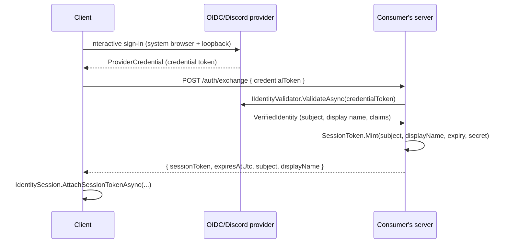

# Using KhaozEngine - the consumer contract

This is the authoritative guide to what KhaozEngine does and **how it must be used** by the games that depend
on it. The engine is **MonoGame-free**: Silk.NET windowing/input, Veldrid behind `KhaozEngine.Gpu` for the GPU,
Silk.NET.OpenAL for audio, `System.Numerics` math throughout. Read the [Hard rules](#hard-rules) first; the rest
is reference.

---

## Mental model: one data flow

A game subclasses `GameApp` (2D) or `GameApp3D` (3D). The base owns the window and the per-frame loop; the game
fills in seams.

```
hardware ──► AppWindow (the only Silk.NET/GLFW toucher) ──► InputState (immutable per-frame snapshot)
                                                                  │
                              GameApp.Run() drives, each frame, in order:
                                  Clock.Update(dt) → Viewport.Update(w,h) → OnResize? →
                                  Pointer.Update(Input, Viewport) → OnResume? → OnUpdate(dt) →
                                  OnRenderWorld(frame)  [3D pass]  →  Batch.Begin(Viewport) → OnDraw2D → End
                                                                  │
                 ┌────────────────────────────────────────────────┼─────────────────────────────┐
                 ▼                              ▼                                                 ▼
        SceneManager (scene stack)      Gui (GuiSurface / ScreenStack)                   your game logic
        routes input top-to-bottom      read Pointer / InputManager                      reads InputState / Pointer
```

Renderers compose into the same window: `Render2DSurface` (the 2D batch) and, for 3D, `Render3DSurface` + a
`Scene3D` drawn behind the 2D HUD.

---

## Hard rules

These are not style preferences. Breaking them re-introduces the exact bugs this library was built to remove.

1. **Only `AppWindow` touches the Silk.NET/GLFW input.** No game code reads Silk input devices directly. Each
   frame the window produces an immutable `InputState`; games read it through `GameApp.Input` /
   `InputManager` / `Pointer`. If you need a new piece of raw state, add it to `InputState` and populate it in
   `AppWindow` - never reach around the seam.
2. **Drive input through the loop, not by hand.** `GameApp.Run()` already calls `Pointer.Update(Input, Viewport)`
   once per frame before `OnUpdate`. If you use an `InputManager` directly (e.g. for menu nav), call
   `Update(input, viewport)` once per frame, before you query it.
3. **Hit-test with the bounds helpers, never with raw position + button.** Use `IsTapIn`, `IsPressingIn`,
   `IsHoveringIn`, `IsDraggingIn`, etc. `IsTapIn` enforces the press-origin invariant; a hand-rolled
   `IsPointerDown && rect.Contains(pos)` does not, and it leaks clicks.
4. **An overlay above a still-updating layer must reserve its footprint** with `BlockInputRegion(rect)` every
   frame, and the layer beneath must guard its actions with `IsInputBlocked(point)`. This is half of the
   click-through fix; the other half is `IsTapIn`.
5. **Pass the design viewport to `Pointer.Update` / `InputManager.Update`** so hit-testing lines up with what's
   drawn. `GameApp` does this for you; if you build your own loop, do it yourself.
6. **`System.Numerics` only** - `Vector2/3/4`, `Matrix4x4`. No XNA / MonoGame types anywhere. (An RGBA color
   is `KhaozEngine.Primitives.Color`, not a bare `Vector4`. GPU-layout structs still use `Vector4`.) To dim
   or brighten a color for a tint, use `color.ScaleRgb(factor)`: it scales RGB and keeps alpha. `color *
   factor` scales alpha too, which under the 2D batch's straight-alpha blend turns a dim into translucency
   (content beneath bleeds through) or, at low factors, invisibility - use it only when you mean to fade.
7. **Don't fork the packages.** Need an API that isn't there? Add it to KhaozEngine, ship a headless test, bump
   the version, and consume the new version. Pinned versions are how games stay green during each other's
   migrations.

---

## Game head build settings (CETCompat)

Referencing any KhaozEngine umbrella (`Game2D`/`Game3D`/`Server`, or `Foundation` directly) makes your game
head inherit two build-property defaults from `KhaozEngine.Foundation`:

```xml
<CETCompat>false</CETCompat>                            <!-- inherited; you don't write this -->
<IncludeNativeLibrariesForSelfExtract>false</IncludeNativeLibrariesForSelfExtract>  <!-- inherited -->
```

.NET 9+ marks the x64 apphost CET / shadow-stack compatible by default. On Windows 10 builds with only partial
CET support (e.g. 20H2) that hard-aborts at boot: *"Your Windows doesn't fully support CET."* `CETCompat` is an
apphost (game-head) MSBuild property, and the engine ships libraries, not an apphost, so it cannot be set from
engine code; Foundation ships it as a `buildTransitive` props default instead, which every head inherits whether
Foundation is a direct reference or pulled in through `Game2D`/`Game3D`. A `normal`-importance build message
announces it (visible at `-v normal` and in IDE build output; the default minimal `dotnet build` stays quiet).

**This is the standard for all KhaozEngine games: leave it inherited.** CET is a hardware ROP mitigation over the
small native surface; KhaozEngine games are overwhelmingly managed (memory-safe), and DEP/ASLR plus the signed
auto-updater remain, so disabling it buys broad old-Windows compatibility for a narrow, reversible tradeoff. To
opt back in for a specific head, set `<CETCompat>true</CETCompat>` in that head's `Directory.Build.props` or
`.csproj` (your value wins, and the inherited default plus its build message step aside).

### Windows: ship the head as `WinExe` (no console window)

Build every desktop **game head** as a Windows-subsystem exe:

```xml
<OutputType>WinExe</OutputType>   <!-- in the Desktop head's .csproj -->
```

A console-subsystem exe (`<OutputType>Exe</OutputType>`) opens a console window behind the game on Windows.
`WinExe` suppresses it. Unlike `CETCompat` this is **not** inherited from `Foundation` and must be set per head,
because `OutputType` is project-specific: a **headless server** head and the CLI tools (`SnapshotTool`,
`ke-updater`, ...) stay `Exe`. `WinExe` is a no-op off Windows (it builds a normal executable), so the same head
still builds and runs on macOS/Linux and in CI.

The catch a WinExe normally brings is that a Windows-subsystem process has **no console**, so `Console.Write*`
vanishes when a developer launches the game from a terminal (`dotnet run`, cmd, PowerShell). The engine removes
that catch: `GameApp` calls `AppWindow.TryAttachParentConsole()` as the very first thing it does, attaching the
process to the launching terminal's console (if there is one) and rewiring `Console.Out`/`Console.Error` to it, so
terminal launches keep full engine + game stdout/stderr. It is a no-op - silently - for a normal Explorer/Start
launch (no parent console), off Windows, for a console-subsystem exe, and when output is redirected (a pipe, a
`> out.txt`, or a CI/test-runner capture is respected and left untouched); it never throws. A bare `AppWindow`
host (no `GameApp`) gets the same attach from the `AppWindow` constructor. **Opt out** by setting
`GameAppOptions.SuppressParentConsoleAttach = true` (default is off, i.e. the attach is on).

**Crash visibility with no console.** A fatal *startup* crash on a WinExe launched from Explorer (no window yet,
no console) would otherwise be silent. `GameApp` installs a last-chance net in exactly that case (a Windows GUI
launch that ended up with no console) that writes the unhandled exception to a file under
`%LOCALAPPDATA%\KhaozEngine\crash\`. This is the floor; the recommended richer path is still to wire
`KhaozEngine.Diagnostics.CrashHandler.Install()` with a `FileSink` (see the Diagnostics / logging section below),
which routes every fatal to your game's `game.log` regardless of console. `KhaozEngine.Showcase` is the reference
desktop head and ships as `WinExe`.

### Publishing (self-contained, single-file)

Publish each game **self-contained** for its RID (`dotnet publish -c Release -r <rid> --self-contained`): the
game ships its own pinned .NET runtime plus the native libs (GLFW, Veldrid's backend, OpenAL) so a runtime or
native-lib CVE is patched by re-publishing, not by waiting on an engine package bump. See
[SECURITY-BASELINE.md](SECURITY-BASELINE.md).

If you also single-file publish (`PublishSingleFile=true`), the native libs **must stay loose** next to the
exe. KhaozEngine reaches GLFW/Veldrid/OpenAL through native libraries the runtime locates by probing the apphost
directory. .NET's default for single-file is `IncludeNativeLibrariesForSelfExtract=true`, which packs them into
the self-extracting exe where Silk.NET's loader can't find them, so the game dies at boot with *"Couldn't find a
suitable window platform (GlfwPlatform - not applicable)"*. Foundation therefore defaults
`IncludeNativeLibrariesForSelfExtract=false` (inherited, overridable the same way as `CETCompat`); leave it
inherited. The default is a no-op unless you set `PublishSingleFile=true`.

**New game head checklist:** set `<OutputType>WinExe</OutputType>` on the Desktop head (no stray console window;
the engine attaches the parent console for terminal launches). `CETCompat` and
`IncludeNativeLibrariesForSelfExtract` are the engine-imposed build-property defaults. Pin your umbrella package
version, publish self-contained for your RID, and leave both defaults inherited unless you have a specific reason
to re-enable either.

---

## Wiring a game (`KhaozEngine.Game` + `KhaozEngine.Game.Render3D`)

`GameApp` is the abstract 2D game-loop facade. It owns the `AppWindow`, `GameClock`, an `IDesignViewport`, the
`Pointer`, a `Render2DSurface` (`Surface2D`) and its `SpriteBatch` (`Batch`). You configure it with a
`GameAppOptions` and override the seams you need.

```csharp
using System.Numerics;
using KhaozEngine.Game;
using KhaozEngine.Render2D;
using KhaozEngine.Windowing;

public sealed class MyGame : GameApp
{
    public MyGame() : base(GameAppOptions.For("My Game", 1280, 720)) { }

    protected override void OnLoad()              { /* load textures/fonts via Surface2D */ }
    protected override void OnUpdate(float dt)
    {
        if (Input.WasPressed(Key.Escape)) Quit();
        if (Pointer.IsTapIn(new Rect(300, 200, 200, 40))) { /* button hit, click-through-safe */ }
    }
    protected override void OnDraw2D(SpriteBatch batch) { /* batch.Draw(...) / font.DrawString(...) */ }
    protected override void OnResize(int w, int h)      { }
}

// Program.cs
using var game = new MyGame();
game.Run();
```

`GameAppOptions` (a struct): `Title`, `Width`/`Height`, `DesignWidth`/`DesignHeight`, `ScaleMode`, `ClearColor`,
`ResumeGapThresholdSeconds` (see the resume hook below), `PresentMode` + `FrameCapHz` + `WindowMode` (see below), and optional
`WindowFactory` / `ViewportFactory` (e.g. `AppWindow.Scaled` for a display-fitted window, or an `AdaptiveViewport`
for responsive layout), `AppUserModelId` (Windows taskbar identity), and `SuppressParentConsoleAttach` (opt out of
the WinExe parent-console attach - see [Game head build settings](#game-head-build-settings-cetcompat)). Use
`GameAppOptions.For(title, w, h)` for the common case.

**Present mode + frame cap.** `GameAppOptions.PresentMode` (`Vsync` default / `Immediate`) selects the swapchain's
vertical-blank sync; `GameAppOptions.FrameCapHz` (0 = uncapped) paces the loop to a target Hz with a monotonic-clock
`FrameLimiter`, independent of vsync. Pin `FrameCapHz` to an integer multiple of a fixed simulation/network tick
(e.g. 60 or 120 for a 30 Hz tick) so presentation stays phase-aligned with the tick - the cheapest way to remove any
residual render:tick beat, and the deterministic cap where vsync does not throttle (the Veldrid Metal path can
free-run well above the display refresh). `FrameCapHz` also applies to a custom `WindowFactory` window; `PresentMode`
is set at swapchain creation, so a custom factory must forward it (or pass it to `new AppWindow(...)` / `AppWindow.Scaled(...)`).
`GameAppOptions.WindowMode` (default `Windowed`) sets the initial window mode (also applied on a custom factory window).

**Runtime display settings (since 9.24.0).** Present mode, frame cap, window mode, and resolution are all changeable
live mid-session - safe to call from a settings screen at any time, with no crash and no leaked swapchain. The whole
surface is `GameApp.Display` (an `IDisplaySettings`), or use the individual `GameApp.PresentMode` / `FrameCapHz` /
`WindowMode` pass-throughs:

```csharp
app.PresentMode = PresentMode.Immediate;             // flip vsync live (reconfigures the swapchain in place)
app.FrameCapHz  = 120;                                // change the software cap; takes effect next frame
app.WindowMode  = WindowMode.BorderlessFullscreen;    // Windowed / BorderlessFullscreen / ExclusiveFullscreen
app.Display.Resize(1600, 900);                        // windowed size in logical points; the swapchain follows

// Or apply a whole snapshot at once (window mode -> resolution -> placement -> frame cap -> present mode):
DisplaySettings s = app.Display.CurrentDisplay with { PresentMode = PresentMode.Vsync, FrameCapHz = 60 };
app.Display.ApplyDisplay(s);
```

`PresentMode` reconfigures the live swapchain's `SyncToVerticalBlank` in place (no recreate). `WindowMode` /
`Resize` drive the window and the swapchain follows the new framebuffer via the resize hook, so the HiDPI
framebuffer semantics are unchanged (the backbuffer always tracks the physical drawable). **Mac/Metal caveat:**
setting vsync engages `CAMetalLayer.displaySyncEnabled`, but the Veldrid Metal present still does not throttle the
CPU from vsync alone, so `FrameCapHz` remains the required deterministic cap on macOS - `GameApp`/`AppWindow` emit a
one-time warning (`Console.Error`) if you select `PresentMode.Vsync` with `FrameCapHz == 0` on Metal. Branch on
`GameApp.Backend` to set a default cap per platform. The window-mode policy is the pure `WindowModePlanner.Compute`
and the Metal-warning rule is the pure `DisplaySettings.RequiresFrameCapWarning` - both headless-unit-tested.

**Runtime window placement (since 9.26.0).** `IDisplaySettings` also exposes the window position + monitor, so a
consumer can persist and restore the full placement (which monitor + position + size) across launches. Position
accessors mirror the size convention (`WindowX` / `WindowY` getters + `MoveTo`, matching `WindowWidth` /
`WindowHeight` + `Resize`):

```csharp
app.Display.MoveTo(200, 150);                     // window top-left in virtual-desktop coordinates
int mi = app.Display.CurrentMonitorIndex;         // monitor holding the window (-1 if unknown)
foreach (MonitorInfo m in app.Display.Monitors)   // drive a monitor dropdown (index / name / bounds)
    Console.WriteLine($"{m.Index}: {m.Name} {m.Width}x{m.Height}");
app.Display.MoveToMonitor(1);                      // centre on / cover monitor 1

// Persist on exit: CurrentDisplay carries position (X/Y) alongside size + mode + present.
DisplaySettings saved = app.Display.CurrentDisplay;   // serialize saved to settings.json

// Restore on boot: ApplyDisplay clamps a stale position on-screen before moving, so a saved
// position whose monitor is now gone (unplugged / different layout) self-corrects.
app.Display.ApplyDisplay(saved);
// (or call app.Display.EnsureVisible() after any restore to re-clamp explicitly.)
```

A hand-built `DisplaySettings` without a position (`X`/`Y` default to `DisplaySettings.PositionUnspecified`) leaves
the window where it is. All placement math is pure and headless-tested in `WindowPlacement` (`MonitorIndexFor` /
`CenterOn` / `ClampVisible`) with the `MonitorInfo` record; only `AppWindow` touches the Silk monitor statics.

**Networked-movement presentation (NetWorld).** `WorldClient` renders remotes on a fixed interpolation delay
(`WorldClientConfig.InterpolationDelayTicks`, default 2) - a timestamped snapshot buffer lerped by true timestamps,
so remotes glide with no holds or catch-up snaps at any render:tick ratio - and the local predicted avatar is
C1-continuous across reconciliation, including across velocity transitions (10.7.0 removed the decel-to-stop shake
where a backward-dipping authority basis dragged the render back). The reconciliation render offset is
critically-damped on BOTH the planar and the vertical axes (vertical since 10.33.0), so the surface-swim buoyancy
spring's continuous stream of small vertical corrections eases with inertia instead of jerking the camera bob.
For debugging movement smoothness set `WorldClientConfig.PresentationTraceEnabled`
and dump `WorldClient.PresentationTrace.WriteCsv(path)` (render time, delay, seconds-since-snapshot, per-remote hold
flag, snapshot arrivals, local reconcile-error, rendered positions).

**Runtime window/taskbar icon.** Set `WindowIconPath` to a PNG (the simple case) or `WindowIcons` to an explicit
list of decoded `ImageRgba` (16/32/48 px so GLFW picks per DPI; `WindowIcons` wins over `WindowIconPath`). `GameApp`
applies it during construction while the window is still hidden, then shows the window, so on Windows the taskbar
button is created with the icon already set. This sets the title-bar + taskbar icon at runtime. On Windows those are
two different slots: the title bar + Alt-Tab come from `WM_SETICON` (what `glfwSetWindowIcon` sets), while the
**taskbar button** reads the window *class* icon - which GLFW leaves at its generic default (a .NET
`<ApplicationIcon>` is not the `GLFW_ICON` resource GLFW looks for). `SetIcon` closes that gap by also copying the
icon onto the class icon (via `Platform.WindowsWindowIcon`), which is what actually fixes the taskbar button. The
Windows `.exe` icon shown when the app is not running is a separate per-game `<ApplicationIcon>` in the desktop
csproj, independent of this API. Under the hood `GameApp` decodes the PNG via `Render2D.ImageRgba` and hands
already-decoded `WindowIcon`s to `AppWindow.SetIcon(...)`, which a non-`GameApp` host can also call directly (then
call `AppWindow.Show()` once the icon is set); the `KhaozEngine.Windowing` package itself stays decode-free (no
Render2D dependency).

**Windows taskbar identity (AppUserModelID).** On Windows 10/11 the taskbar groups and pins a running app's button
by the process's explicit AppUserModelID; a .NET apphost that never sets one gets an unstable process-derived
identity. Set `GameAppOptions.AppUserModelId` (e.g. `"APKiwi.Nullwake"`, a dotted `CompanyName.ProductName`) and
`GameApp` sets it (via `AppWindow.TrySetProcessAppUserModelId`, which forwards to `Platform.WindowsAppId`) before
creating the window, stabilising grouping/pinning. This is taskbar *identity*, not the button's icon - the icon is
fixed by the class-icon sync above; set both. A non-`GameApp` host calls `AppWindow.TrySetProcessAppUserModelId("...")`
itself before constructing the window. Null (the default) keeps the current behaviour; a no-op that never throws off
Windows.

**macOS Dock icon.** GLFW cannot set the Cocoa Dock icon, so `SetIcon` is a no-op on macOS, and an app launched via
`dotnet run` has no `.app` bundle `.icns` - so without help it shows the generic document icon in the Dock and
Cmd-Tab. `GameApp` fixes this automatically: when `WindowIconPath` is set, on macOS it also feeds that PNG to
`AppWindow.SetMacDockIcon(pngBytes)`, which sets the Dock icon at runtime via
`Platform.ApplicationIcon.TrySetMacDockIcon` (`NSApplication.setApplicationIconImage:`). A `WindowIcons`-only config
(no PNG path) leaves the Dock icon untouched, since `NSImage` decodes from the PNG. A non-`GameApp` host can call
`AppWindow.SetMacDockIcon(...)` directly. It returns `false` (never throws) off macOS or on empty input. A packaged
`.app` bundle with its own `.icns` still owns the Dock icon the normal way; this is for the unbundled dev/run case.

`GameApp` seams: `OnLoad()`, `OnUpdate(float dt)`, `OnRenderWorld(Frame)` (the 3D pass; empty in 2D),
`OnDraw2D(SpriteBatch)`, `OnResize(int, int)`, `OnResume(TimeSpan)` (see below), `OnDispose()`. Properties you
read: `Window`, `Clock`, `Viewport`, `Pointer`, `Input` (the frame's `InputState`), `Surface2D`, `Batch`,
`FrameWidth`/`FrameHeight`/`Dt`, `ClearColor`. Call `Quit()` to exit.

**Resume after OS sleep/suspend (`OnResume`).** The frame `dt` is clamped to 0.1s (a spiral-of-death guard) and
comes from a `Stopwatch`-style timer that does not reliably advance across an OS sleep/S3/hibernate, so a game
that leaves the process running while the machine suspends gets no signal that hours of real time just passed.
`GameClock` also samples a UTC wall clock each frame and reports `RealWallGapSeconds` (the wall gap to the
previous frame, clamped to `>= 0`; `LastRealTimestamp` is the sample). When that gap exceeds
`GameAppOptions.ResumeGapThresholdSeconds` (default 30s; 0 or negative disables), `GameApp` calls
`OnResume(TimeSpan wallGap)` once, before `OnUpdate` on that frame and never on the first frame. Override it to run
offline/AFK catch-up (e.g. a one-shot `TimeSkip.Advance`), re-sync timers, or pause. This is a separate signal
from the sim delta: the 0.1s clamp and `Dt` are unchanged.

### Scenes (`SceneManager` / `GameScene`)

For multi-screen games, push `GameScene`s onto a `SceneManager` (full-frame scene stack, distinct from the
2D-only `Gui.ScreenStack`). `Push`/`Pop`/`Replace`/`SwitchTo`/`Clear`; a scene overrides `OnEnter`/`OnExit`,
`OnUpdate(dt)`, `OnDraw2D(batch)`, `OnResize`. Set `DrawBelow` / `UpdateBelow` for an overlay scene (e.g. a pause
menu over a still-rendered match). Feed the manager `Input`/`Pointer`/`Viewport`/`FrameWidth`/`FrameHeight` each
frame, then `Update(dt)` and `Draw2D(batch)`.

### 3D (`GameApp3D`, `IGameScene3D`, `SceneManager.Draw3D`)

`GameApp3D : GameApp` adds a `Render3DSurface` (`Surface3D`) and a `Scene3D` (`Scene`), and a new seam
`OnDraw3D(Scene3D scene)` (it overrides `OnRenderWorld` to run the 3D pass behind the 2D HUD). A scene that draws
3D implements `IGameScene3D` (`void OnDraw3D(Scene3D scene)`), and the app's `OnDraw3D` calls the
`SceneManager.Draw3D(scene)` extension to render the visible scene set.

```csharp
public sealed class MyGame3D : GameApp3D
{
    public MyGame3D() : base(GameAppOptions.For("My 3D Game", 1280, 720)) { }
    protected override void OnDraw3D(Scene3D scene) { _scenes.Draw3D(scene); }   // 3D world
    protected override void OnDraw2D(SpriteBatch batch) { /* HUD over the 3D */ }
}
```

---

## Input (`KhaozEngine.Windowing`)

### InputState - the immutable snapshot

`AppWindow` produces one `InputState` per frame (delivered as `Frame.Input`, surfaced as `GameApp.Input`). All
engine-native, `System.Numerics`:

```csharp
public sealed class InputState   // immutable per-frame snapshot; InputState.Empty is a blank one
{
    // read-only properties; the constructor takes them in this order:
    IReadOnlySet<Key> KeysDown, KeysPressed, KeysReleased;
    IReadOnlySet<MouseButton> MouseDown, MousePressed;
    Vector2 MousePosition, MouseDelta;  float ScrollDelta;  int Width, Height;
    IReadOnlyList<GamepadState> Gamepads, Touches;  // ctor args optional, default empty
    bool WindowFocused;                             // optional trailing ctor arg, default true (Empty = false)
    IReadOnlySet<Key> KeysRepeated;                 // optional trailing ctor arg, default empty
}

bool IsDown(Key) / WasPressed(Key) / WasReleased(Key);
bool WasRepeated(Key) / WasTyped(Key);   // OS auto-repeat tick / press-or-repeat
bool IsDown(MouseButton) / WasPressed(MouseButton);
GamepadState Gamepad(int i = 0);  GamepadState PrimaryGamepad { get; }
```

`Key` and `MouseButton` are engine enums; `GamepadState` exposes `ButtonsDown/Pressed/Released`,
`LeftStick`/`RightStick` (+ `LeftStickDeadzoned(...)`), triggers, and `IsDown/WasPressed/WasReleased`.

`WasRepeated(Key)` is `true` on a frame the key fired an OS auto-repeat tick (held past the user's OS repeat delay,
then recurring at the OS repeat rate); `AppWindow` fills `KeysRepeated` from GLFW's `REPEAT` key action. `WasPressed`
stays the press edge only (auto-repeat excluded), so existing callers are unchanged; `WasTyped(Key)` is the union
(`WasPressed || WasRepeated`) - the "a character was typed this frame" signal hold-to-repeat text entry wants.
`TextEntry`/`TextInput` use it, so a held Backspace or character key repeats with no game code.

`WindowFocused` is `true` while the window owning this snapshot is the frontmost (OS-focused) window. The render
loop keeps running and the cursor stays live while the window is in the background, so gate input that should stop
when unfocused on it (e.g. `if (Input.WindowFocused) { /* world clicks, scroll-zoom, hotkeys */ }`). The Gui hover
and capture gates already honour it for free (below), so the common "don't trigger UI hover while in the
background" case needs no game code. Defaults to `true` (windows open focused); `InputState.Empty` is `false`.

### InputManager + Pointer - the higher-level read

`Pointer` (the unified pointer) and `InputManager` (pointer + keyboard/gamepad/menu-nav) derive per-frame state
from an `InputState`. `GameApp` owns a `Pointer` and updates it for you; construct an `InputManager` yourself if
you want edge detection or menu navigation.

```csharp
var im = new InputManager();
im.Update(input, viewport);   // once per frame, BEFORE you query
```

**Unified pointer:** `PointerPosition`, `PressOrigin`, `PointerDelta`, `IsPointerDown`, `IsPointerJustPressed`,
`IsPointerJustReleased` (+ middle/right variants).

**Bounds helpers (use these):**
- `IsTapIn(Rect)` - true on release **only if press-origin and release are both inside the rect**. The
  click-through invariant.
- `IsTapFromTo(originRect, releaseRect)` - press in one rect, release in another (tap-scrim-to-dismiss).
- `IsPressingIn(Rect)` - held, press began inside, still inside ("pressed" visual).
- `IsHoveringIn(Rect)` - inside and not pressed (desktop hover). Also false while the window is unfocused (a
  background window reports no hover; `Pointer.WindowFocused` carries the bit). The press-origin / tap queries
  above are deliberately NOT focus-gated, so the click-through invariant is unchanged.
- `IsPointerIn(Rect)`, `IsReleasedOutside(Rect)`, `IsDraggingIn(Rect)`, `GetDragDelta(Rect)`.

**Gesture consumption (cross-layer click-through):** `IsTapIn` is purely geometric, so a release that swaps the
layout mid-gesture (push an overlay, open a popup) would let a widget that appears under the press-origin act on a
gesture that began before it existed. Call `ConsumeGesture()` to spend the current press/release: `IsTapIn`/
`IsTapFromTo` then report false until the next fresh press (`IsConsumed` exposes the flag; drag/hover/press
queries are left intact, so a slider grab survives). `SceneManager` already calls this on every push/pop, so a
scene transition can't double-fire a tap on a freshly-drawn widget; call it yourself if you change the
interactive layout mid-gesture without a scene transition.

**Region blocking (the other half of click-through):** `BlockInputRegion(Rect)` from the higher overlay each
frame; `IsInputBlocked(Vector2)` from the layer beneath before acting. Cleared at the start of every `Update`.

**Scroll:** `ScrollDelta`, `IsMouseWheelScrolledUp/Down`.

**Keyboard / gamepad / menu navigation:** `IsKeyDown`, `IsKeyJustPressed`, `IsNewKeyPress(key, PlayerIndex?, out
who)`, `IsNewButtonPress(button, PlayerIndex?, out who)`, `IsMenuUp/Down(PlayerIndex?)`, `IsMenuSelect/Cancel
(PlayerIndex?, out who)`, `IsSelectNext/Previous(PlayerIndex?)`, `IsPauseGame(PlayerIndex?, Rect?)`. Pass `null`
for the player to accept "any connected controller".

**Feeding the text-entry core:** `State` returns this frame's `InputState` snapshot (the value last passed to
`Update`), so a retained, custom-rendered widget that holds an `InputManager` can drive the headless
`TextEntry.Apply(text, input, maxLength, filter, allowPaste)` editing core - the full printable map, hold-to-repeat,
and Ctrl/Cmd+V clipboard paste - without reaching for the raw window input. There is an `InputManager` overload of
`Apply` that reads `State` for you, so the call is one line; pass `allowPaste: false` to suppress paste. Paste
appends `Clipboard.TryGetClipboardText()` through the same `filter` + `maxLength` path as typed chars (so a digits
filter strips letters out of pasted text too), firing on the V press edge only.

### Action maps + rebinding (`KhaozEngine.Windowing.Actions`)

Stop hardcoding key/button checks. A game declares NAMED actions, binds defaults, reads action state, lets players
rebind at runtime, and persists bindings through its own settings store. It is snapshot-driven and pure (state in,
values out), so it is fully headless-testable and never touches Silk.NET.

**Localization boundary:** an action id (`"gameplay.jump"`) is an opaque engine IDENTIFIER (the persistence key,
greppable, stable across releases), never a player-facing display string. Turn an id or a captured `InputSource`
into a localized label on the GAME side via your `StringId` catalog. The engine layer never localizes.

Three action kinds: `Button` (down/pressed/released), `Axis1D` (a float, e.g. throttle), `Axis2D` (a vector, e.g.
move/look). Sources (`InputSource`) are extensible-by-design: a key, a mouse button, a gamepad button, a gamepad
trigger, a WHOLE gamepad stick (`WholeStick`, the 2D form for move/look), a single stick component (`StickAxis`
with `X`/`Y`, a 1D axis), a two-key 1D axis, or a four-key WASD 2D composite. Sticks/triggers take `invert`/`scale`
modifiers. For a whole stick, `invertY` flips ONLY the Y axis (the look-invert convention); a component `StickAxis`
read in a 2D action is projected onto its own axis (an X source contributes only X, a Y source only Y).

```csharp
using KhaozEngine.Windowing.Actions;

// 1. declare actions + default bindings (multiple bindings per action = "any of these")
var map = new ActionMap(PlayerIndex.One);
map.AddAction(InputAction.Button("jump"), InputSource.FromKey(Key.Space), InputSource.FromGamepadButton(GamepadButton.A));
map.AddAction(InputAction.Axis2D("move"),  InputSource.WasdDefault, InputSource.WholeStick(GamepadStick.Left));
map.AddAction(InputAction.Axis2D("look"),  InputSource.WholeStick(GamepadStick.Right, invertY: true)); // Y-only look invert

// 2. load persisted overrides (string the game read from its settings store; null on first run)
//    then wrap in the turn-key controller with a save sink that writes back to the game's store.
string? persisted = settings.LoadInputBindings();               // your ISettingsStorage, game-side
var input = new ActionMapController(map, persisted, save: json => settings.SaveInputBindings(json));

// 3. evaluate per frame, read by id
input.Update(frame.Input);                                      // once per frame, before OnUpdate
if (input.WasPressed("jump")) Jump();
Vector2 move = input.GetAxis2D("move");                         // WASD diagonal is unit length (see below)

// 4. rebind at runtime; the controller auto-saves through the sink on capture
var op = input.BeginRebind("jump", slot: 0);                    // Escape cancels by default
// ...keep calling input.Update(frame.Input) each frame; when op.Status == Captured the new source is applied + saved
```

**Combining semantics (documented + tested):**
- **Button** bindings OR together: down if any is down; pressed = down-now/up-last-frame (never double-fires when
  two bindings overlap); released is the symmetric edge. Edge detection is against the previous snapshot, the same
  way `InputManager` does it.
- **Axis1D** bindings SUM then clamp to `[-1, 1]` (a stick at 0.3 plus a key at 1 saturates to 1).
- **Axis2D** per-component SUM, then normalize: a WASD **diagonal is normalized to unit length** (so diagonal
  movement is not `~1.414` faster than cardinal); a whole-stick (`WholeStick`) source keeps its analog magnitude
  (only clamped down if over-unit); a component `StickAxis` source is PROJECTED onto its own axis (X-only or Y-only),
  so an X source and a Y source can be bound together to compose a whole stick; the combined vector is clamped to
  length 1. `invertY` on a whole stick flips Y only.

**Rebind capture** (`RebindOperation`, or via `controller.BeginRebind`): fed successive snapshots, it captures the
first eligible source on its PRESS edge (a key held from before the rebind is ignored until re-pressed), captures a
gamepad stick/trigger only at full tilt, and honours an exclusion list (default: `Key.Escape` cancels). Pure and
headless.

**Serialization** (`ActionMapSerializer`): `Serialize(map)` -> a versioned JSON string; `Load(map, json)` applies
persisted overrides onto a map that already declares its actions with defaults. Only per-action binding OVERRIDES
are stored (keyed by action id), so renaming/removing an action in code just ignores the stale entry. Degradation is
**per binding**, not per file: a source whose `kind` is a name this build does not recognize (a future kind) drops
individually while every other binding in the file survives; if that leaves an action with zero valid bindings the
action keeps its code default (never unbound). Only a top-level JSON *syntax* error discards the whole file (defaults
stand). `Load`/`Apply` return an `ApplyResult` (implicitly an `int` overridden-action count) exposing
`AppliedCount`, `DroppedBindings`, and `FromFutureVersion` - the last is set when the file's `version` is newer than
`CurrentVersion`, which is still applied through the same tolerant path so a game can warn the player that some newer
bindings may have been dropped. Call `map.Update` exactly once per frame (edge detection is frame-vs-frame; a double
Update can swallow a press/release edge).

**Dependency note:** this lives in `KhaozEngine.Windowing` and deals in plain strings only. The engine deliberately
has NO `Windowing -> Persistence` dependency, so YOU hand the serialized string to your `ISettingsStorage` (the
`ActionMapController` save sink is where that wiring goes). Per-player maps read that player's gamepad
(`input.Gamepad((int)PlayerIndex)`); keyboard/mouse are global (one keyboard).

### Gamepad rumble (`KhaozEngine.Windowing.Rumble`)

Rumble is the engine's one gamepad OUTPUT seam and it mirrors the input rule: input flows IN through the immutable
`InputState` snapshot, rumble flows OUT through `IRumble`. ONLY `AppWindow` touches the Silk.NET vibration motors;
games reach rumble the same way they reach input, off `GameApp.Rumble` (or `AppWindow.Rumble` on the raw loop). A
headless `NoopRumble` backs servers and tests.

Two layers, both per `PlayerIndex` and per motor (low-frequency = heavy/left motor, high-frequency = light/right,
each in `[0,1]`):

- `SetRumble(player, low, high)` - a SUSTAINED level you own; it holds until you change it (set both to 0 to stop).
- `Pulse(player, intensity, duration, highFrequencyScale = 1, shape = Linear)` - a fire-and-forget envelope that
  decays to zero over `duration` and auto-stops. `RumbleDecay` is `Constant` (square), `Linear` (default), or
  `EaseOut` (a sharp hit that falls off fast early).

The frame loop calls `Tick(dt)` for you (only if the game touched `Rumble` at all), so pulses decay and auto-stop
without any per-frame code. **Stacking policy (documented + tested): the effective level per motor is the MAX of the
sustained level and every live pulse** - MAX not sum, so overlapping effects never clip past 1 and a weaker effect
ending never drops a stronger one still going. `StopAll()` / `Stop(player)` cut everything immediately; the window
also stops all motors on dispose.

```csharp
protected override void OnUpdate(float dt)
{
    if (WasHit)                                  // one-shot hit feedback
        Rumble.Pulse(PlayerIndex.One, 0.8f, TimeSpan.FromMilliseconds(250), shape: RumbleDecay.EaseOut);

    Rumble.SetRumble(PlayerIndex.One, engineLoad, 0f); // sustained low-motor engine rumble
    // no Tick() call needed: GameApp ticks rumble each frame.
}
```

The pure envelope + stacking logic is `RumbleMixer` (device-free, headless-tested against a recording `IRumbleOutput`
sink). `RumbleDriver` is the concrete `IRumble` = mixer + an `IRumbleOutput`; `AppWindow` supplies the Silk sink,
tests/servers supply `NoopRumbleOutput`.

**On-device caveat (be honest):** the seam is compile-verified and headless-tested, but whether a pulse is FELT is
not verifiable in CI or on the dev machine. It needs a physical-controller smoke test. **The current GLFW input
backend enumerates ZERO vibration motors (GLFW has no haptics API), so all rumble is a graceful no-op there today.**
The wiring is correct: a future SDL-backed window would light up through this exact seam with no game-code change.
Because a motor-less pad no-ops silently, a game can call rumble unconditionally.

**Localization note:** rumble deals in `PlayerIndex` + numeric intensities only, no player-facing text, so nothing
here localizes.

### Rect, viewport, clock

- `Rect(X, Y, Width, Height)` is the engine's rectangle (`Right`/`Bottom`/`Contains(Vector2)`).
- `IDesignViewport` (impls: `DesignViewport` letterbox/fill/stretch, `AdaptiveViewport` responsive) maps between
  design space and screen pixels (`DesignToScreen`/`ScreenToDesign`, `GetClipProjection`). `GameApp` owns one
  and passes it into `Pointer.Update`, so design-space coordinates and hit-tests line up. Rects: `DesignBounds`
  (the design rect), `ContentBounds` (the on-screen content rect, excludes bars), and `WindowBounds` (10.38.0:
  the whole window in design space = design rect + letterbox bars). Fill `WindowBounds`, not `Width`/`Height`,
  for a full-window scrim or opaque `Screen` background so the letterbox bars are covered instead of showing the
  screen below (it reduces to `DesignBounds` when unletterboxed).
- `GameClock`: `TimeScale`, `Pause()`/`Resume()`, `RealDeltaSeconds`/`ScaledDeltaSeconds`,
  `RealWallGapSeconds`/`LastRealTimestamp` (the suspend-robust wall-clock gap that drives `GameApp.OnResume`),
  `Paused`/`Resumed` events. `GameApp.Clock` is updated for you each frame.

---

## Gui (`KhaozEngine.Gui`)

Two styles, both built on Windowing + Render2D. Player-facing text sinks take a `LocalizedText`, not a raw
`string` (see "Compile-time localization enforcement" below); `Strings.*` in the snippets are `StringId`
constants.

**Immediate-mode `GuiSurface`** - the common case for HUDs and simple menus. `Begin(batch?, pointer)` then call
widgets each frame; `Button(...)` returns `bool` (true the frame it's clicked). Widgets are click-through-safe by
construction (they hit-test via the `Pointer`).

```csharp
var gui = new GuiSurface(whitePixel);            // a 1x1 white Texture2D
gui.Begin(batch, pointer);
gui.Panel(new Rect(40, 40, 240, 120), bgColor);
gui.Label(font, new Rect(40, 40, 240, 24), Strings.Pause, textColor, GuiAlign.Center);
if (gui.Button(font, new Rect(60, 90, 200, 36), Strings.Resume)) Resume();
```

`GuiSurface` also exposes hover state (`IsHovering`/`HoverEntered`/`HoveredRect`) and a `Slider`. The
`PointerCaptured` gate lets a game suppress world clicks when the pointer is over UI. While the window is
unfocused, hover (`IsHovering`/`HoverEntered`) and both capture gates (`PointerCaptured`/`HoverCaptured`) report
false automatically (via `Pointer.WindowFocused`), so a background window fires no UI hover SFX or highlights
without any game code.

**Scaling Gui text.** The text sinks (`GuiSurface.Label`/`Button`/`StatChip`, and the retained `Label.Scale`)
take an optional trailing `float scale = 1f` that forwards to the scale-capable `SpriteBatch.DrawString`, so a
game can draw one shared font at many sizes (pixel-parity HUDs) without baking a font per size. The measured text
scales with it, so alignment and vertical centring stay correct; the widget rect and the button's press-origin
hit-test are unchanged (only the label scales). Every parameter defaults to `1f`, so unscaled callers are byte-identical.

```csharp
gui.Label(font, hudRect, Strings.Score, textColor, GuiAlign.Left, scale: 2f);   // one font, drawn 2x
if (gui.Button(font, btnRect, Strings.Resume, style, scale: 1.5f)) Resume();     // label 1.5x, rect unchanged
```

**Retained `ScreenStack`** - a routed stack of `Screen`s (top-to-bottom input, bottom-to-top draw, transitions),
for menu-heavy games. `Add`/`Remove`, `Update(dt, input[, viewport])`, `Draw(batch)`. A `Screen` reads input via
`Manager.Pointer` (pointer/hit-test) and `Manager.InputManager` (menu nav + keyboard/gamepad; its pointer IS
`Manager.Pointer`, so both share one click-through gate), and returns whether it consumed (to block screens
below); set a screen non-pass-through for a modal.

**Theming: `GuiTheme` + `GuiStyle` (crisp default, 10.11.0)** - the default widget look is crisp: a neutral-dark
palette with a blue accent, subtle 3px corners, 1px hairline borders, no bloom. `GuiTheme` is the central semantic
palette every retained widget reads at construction. Rebrand the whole UI in one line at startup (before building
widgets):

```csharp
// Global reskin: keep the crisp shape, change the accent to teal.
GuiTheme.Default = GuiTheme.Default with { Accent = new Vector4(0.14f, 0.60f, 0.55f, 1f) };
// ...or keep the pre-10.11.0 flat blue-grey look wholesale:
GuiTheme.Default = GuiTheme.Legacy;
```

`GuiStyle` carries the button palette + modern-affordance knobs, with presets you pass per widget:
`GuiStyle.Default` (crisp, == `Primary`), `Secondary` (muted), `Danger` (red), `Active` (bright-accent selected),
`Modern` (rounded + glow + shadow), and `Legacy` (the exact old flat button). Per-widget colour fields still
override the theme (`toggle.OnColor = ...`). The Showcase "Gui" room shows the crisp look and the semantic button
variants.

**Texture skinning: `GuiStyle.Skin` + `GuiSkin` (family-wide, 10.82.0)** - `GuiStyle` has an optional `Skin` (a
`GuiSkin`, default `null` = today's flat GuiDraw primitives, byte-for-byte). Set it and EVERY widget that fills
through `GuiDraw.FillStyled` - Panel, Button, ProgressBar, TextInput/NumberField, ScrollablePanel, Dropdown,
PopupPanel, SlotGrid, TreeView, ... - renders a nine-slice sprite frame instead of the flat fill, so a whole HUD can
wear fantasy-skinned chrome. `GuiSkin` rides the same `Texture2D` + source-UV mechanism as `IconAtlas`: a nine-slice
frame from a whole texture (`GuiSkin.NineSlice(tex, inset)` or per-edge `NineSlice(tex, l, t, r, b, center)`) or one
cell of a shared atlas (`GuiSkin.FromAtlas(tex, source, srcPxW, srcPxH, l, t, r, b, center)`). Insets are in SOURCE
pixels; the four corners keep their source-pixel size (never scaled) while the edges + centre `Stretch` (default) or
`Tile` (`GuiSkinCenter`). The resolved state colour multiplies OVER the skin as a tint, so set the style's `Fill` to
white for the skin's native colours and `Hover`/`Press` as tints (per-state skins are a future extension). A skinned
frame owns the silhouette, so the procedural `CornerRadius`/border is skipped, but `ShadowSize` still draws its drop
shadow. `null` skin = zero change for existing UIs. The Showcase "Gui" room's Widgets screen shows a skinned
button/panel/bar beside the flat ones.

```csharp
// Bake or load a nine-slice frame, then skin any widget. Fill=white shows the sprite's native colours;
// hover/press tint over it.
GuiSkin frame = GuiSkin.NineSlice(frameTexture, inset: 12f);
var skinned = new GuiStyle { Skin = frame, Fill = Vector4.One, Hover = new Vector4(0.85f, 0.9f, 1f, 1f),
    Press = new Vector4(0.6f, 0.65f, 0.8f, 1f), Text = Vector4.One };
var panel = new Panel(bounds) { Style = skinned, Color = Vector4.One };   // Color is the tint
var button = new Button(bounds, label, font) { Style = skinned };
```

**`FocusNavigator`** - keyboard/gamepad menu focus: `SetCount`, `Focus`, `MoveNext`/`MovePrevious`, `Wrap`, and
`Update(InputManager, PlayerIndex?)` which advances focus from menu-nav edges.

**Keyboard/gamepad on `Toggle`/`Slider`/`Dropdown` (opt-in, additive, 10.9.0)** - each widget has an
`Update(InputManager, bool focused, PlayerIndex? = null)` overload that adds keyboard/gamepad control on top of the
pointer path, but only while `focused` (drive that flag from a `FocusNavigator`). This is what lets a settings row
be fully navigable without wrapping each control in a `MenuEntry`. The pointer-only `Update(Pointer)` overloads are
unchanged, so existing screens keep working; adopt by switching the row's `Update` call. Pure pointer-independent
primitives (headless-testable, matching `Slider.Nudge`) sit under each overload for custom bindings:

- `Toggle`: menu-select (Enter/Space/A/Start) flips; select-next/previous (Left/Right/D-pad) force off/on. Primitives `Flip()` / `Set(bool)`.
- `Slider`: select-next/previous nudge `Value` by `NudgeStep` (default 0.1). Primitive `Nudge(float)`.
- `Dropdown`: closed -> menu-select opens, select-next/previous cycle the selection in place; open -> menu-up/down move `HighlightedIndex`, menu-select commits it, menu-cancel (Escape/B/Back) closes without changing. `Wrap` (default true) wraps at the ends; `FocusColor` fills the highlighted row (the pointer path leaves `HighlightedIndex` at -1, so its overlay is byte-identical). Primitives `Open`/`Close`/`HighlightNext`/`HighlightPrevious`/`CommitHighlight`/`StepSelection`.

```csharp
// A keyboard/gamepad-navigable settings column inside a Screen. In the retained path the InputManager comes
// from the stack (Manager.InputManager); the immediate-mode / Run-loop path holds its own InputManager.
var im = Manager.InputManager;                   // ScreenStack owns + updates it each frame (10.10.0)
nav.SetCount(3);
nav.Update(im);                                  // Up/Down moves focus between rows
volume.Update(im, focused: nav.Focused == 0);    // Left/Right nudges the slider when its row is focused
fullscreen.Update(im, focused: nav.Focused == 1); // Enter flips the toggle; Left/Right force off/on
quality.Update(im, focused: nav.Focused == 2);   // Enter opens the dropdown; Up/Down + Enter pick an option
// Pointer still works on every row regardless of focus (each overload runs the pointer path first).
```

`KhaozEngine.Showcase`'s Settings screen (`RoomGui.cs`) is the runnable reference: pick the "Gui" room, open Settings, and drive the volume slider + fullscreen toggle with the keyboard/gamepad (Up/Down between rows, Left/Right to adjust, Enter to flip, Esc to back out) or the pointer.

**Overlay chrome on the core widgets (opt-in, 9.21.0)** - `ScrollablePanel`, `Dropdown`, and `Tooltip` carry
opt-in "panel overlay" behaviours for bottom-sheet-style UI. Every knob defaults to a no-op, so a widget you
already use is unchanged until you set one.

```csharp
// A bottom-docked, slide-up list panel with a draggable header and a tap-to-close scrim.
panel.Bounds        = new Rect(0, topBarBottom, viewW, navTop - topBarBottom);  // the full-open, docked rect
panel.HeaderHeight  = 38f;                     // reserve a title band; content scrolls below it
panel.SlideFromBottom = true;
panel.TransitionAlpha = screen.TransitionAlpha; // 0 hidden below the dock edge .. 1 fully shown
panel.Resizable = true; panel.MinHeight = 140f; panel.MaxHeight = navTop - topBarBottom;
panel.Scrim = new Rect(0, topBarBottom, viewW, navTop - topBarBottom);

panel.Update(pointer, input);
if (panel.ScrimDismissed) Close();             // tap outside the panel

panel.DrawScrim(batch, white);
panel.DrawBackground(batch, white);
panel.DrawHeader(batch, white, titleFont, "Inventory");
panel.BeginClip(batch);
for (int i = 0; i < panel.ItemCount; i++) DrawRow(panel.ItemBounds(i), i);  // clipped to ContentBounds
panel.EndClip(batch);

// A dropdown that lives inside the clipped panel: trigger in-clip, list in a later overlay pass.
dropdown.ShowChevron = true;                   // caret reflects open/closed
dropdown.Opacity = panel.TransitionAlpha;      // fade with the slide
dropdown.Draw(batch, white, font);             // inside BeginClip/EndClip
// ... after EndClip, in an overlay pass:
dropdown.DrawOverlay(batch, white, font, pointer);

// A tooltip that works on both desktop and touch without a compile-time platform branch.
tip.Dismiss = isTouch ? TooltipDismiss.TapOutside : TooltipDismiss.CallerDriven;
tip.ShowTitleSeparator = true;
tip.MaxWidthFraction = 0.4f;                       // cap at 40% of the viewport: long body lines wrap + grow down
                                                   // (or an absolute tip.MaxWidth = 360f, smaller cap wins)
tip.Show(Strings.CopperOre, LocalizedText.Raw("x128"), bodyLines, anchor); // left name (localized), right count (raw)
tip.Update(pointer);                               // auto-dismisses on tap-outside in TapOutside mode
tip.Draw(batch, white);
```

**HUD widgets: `SlotGrid` + `ProgressBar` (10.78.0)** - two additive widgets for inventory / status HUDs. `SlotGrid`
lays out `Count` uniform square slots wrapping at `Columns` (`Bounds`.X/Y is the origin; the footprint is `ContentSize`
/ `ContentBounds`, derived from `SlotSize` / `Spacing`). It hit-tests each slot through the press-origin invariant and
exposes `HoveredSlot` / `PressedSlot` (-1 = none); a valid tap fires `OnSlotClicked` and `Update` returns the tapped
index. The widget is item-agnostic: empty slots draw a themed frame, and the caller paints icons / counts through the
`DrawSlotContent(index, rect, batch)` hook and optional per-slot `KeybindLabels` (raw input-token glyphs).
`ProgressBar` is a thin fill bar: `Fraction` clamps 0..1, the accent `FillColor` sits inside the border frame, and an
optional centered `OverlayText` (`LocalizedText`) labels it. `FillDirection` picks the edge the fill grows FROM -
`LeftToRight` (default), `RightToLeft`, `BottomToTop`, `TopToBottom` (the last two are vertical bars). `SegmentCount`
> 1 (default 0/1 = one continuous fill) splits it into equal segments separated by `SegmentSpacing`, painted per
`SegmentFillMode`: `Continuous` clips the proportional fill into each segment (tick-separated xp / cast bars),
`Discrete` lights a whole segment only once fully covered (combo points / ability charges). Segmentation composes
with every `FillDirection`. Both widgets expose pure-geometry helpers for headless tests (`SlotRect(i)` /
`SlotAt(point)`, `FillRect` / `InnerBounds` / `SegmentRects()` / `FilledSegmentCount`) and carry the shared `Opacity`
fade.

```csharp
// A 10-slot hotbar (one row of 10) with keybind glyphs; icons are painted by the caller.
var hotbar = new SlotGrid(new Rect(hudX, hudY, 0, 0), count: 10, columns: 10)
{
    SlotSize = 48f, Spacing = 6f,
    KeybindLabels = new[] { "1", "2", "3", "4", "5", "6", "7", "8", "9", "0" },
    DrawSlotContent = (i, rect, b) => DrawItemIcon(b, rect, _items[i]),   // widget stays item-agnostic
    OnSlotClicked = i => UseSlot(i),
};
hotbar.Update(pointer);
hotbar.Draw(batch, white, keybindFont);

// A thin XP bar with a localized "Level {0}" overlay.
var xp = new ProgressBar(new Rect(hudX, hudY - 16, 240, 8), fraction: xpFrac)
{
    OverlayText = LocalizedText.Of(Strings.Level, playerLevel),
};
xp.Draw(batch, white, smallFont);

// A segmented cast bar (tick separators) and a vertical resource bar filling bottom-up.
var cast = new ProgressBar(new Rect(hudX, hudY, 240, 10), castFrac)
{ SegmentCount = 6, SegmentSpacing = 3f };                       // Continuous is the default
var pips = new ProgressBar(new Rect(hudX, hudY, 240, 12), comboFrac)
{ SegmentCount = 5, SegmentFillMode = SegmentFillMode.Discrete };   // combo points light as whole pips
var mana = new ProgressBar(new Rect(hudX, hudY, 12, 120), manaFrac)
{ FillDirection = FillDirection.BottomToTop };                   // vertical, grows upward
```

---

## Number + duration formatting (`NumberFormatter` / `TimeFormatter`)

Two pure display formatters in `KhaozEngine.Primitives` (zero dependency; usable from a renderer, a headless
server, or a balance-sim tool). They produce **value tokens** - digits, suffixes, unit letters - which sit below
the localization layer: format the value here, then compose the result into a localized string (`"{0}"` slot).

`NumberFormatter` renders large numbers in one of three `NumberNotation` modes: `Simple` (short suffixes
`1.23K` / `45.6M` ... up to `1e33` `Dc`, then scientific), `Scientific`, and `Engineering` (exponent a multiple
of 3). A settable process-wide `Notation` is the default a game binds to its "number format" setting once, so
the parameterless overloads pick it up everywhere; pass a `NumberNotation` to override per call. NaN renders
`"0"`, infinity `"Inf"`; output is culture-invariant.

```csharp
NumberFormatter.Notation = NumberNotation.Simple;   // once, from the user setting
NumberFormatter.Format(1_500_000);       // "1.50M"
NumberFormatter.FormatInt(1234);         // "1K"   (0 decimals below 1000)
NumberFormatter.Format(1234, NumberNotation.Scientific);   // "1.23E+003" (explicit override)
```

`TimeFormatter.Format(seconds, style)` renders a duration in two `DurationStyle` shapes: `Clock` (the ticking
colon clock `1:02:34`, rounds up to the next whole second - for timers/countdowns) and `Coarse` (the two-unit
summary `2h 15m`, with a `coarseUnits` knob - for stats and "played for" lines). Non-finite renders `"---"`,
non-positive `"0s"`.

```csharp
TimeFormatter.Format(3754);                          // "1:02:34"   (Clock, default)
TimeFormatter.Format(8100, DurationStyle.Coarse);    // "2h 15m"
TimeFormatter.Format(300, DurationStyle.Coarse, 1);  // "5m"        (one unit)
```

---

## Compile-time localization enforcement (`StringId` / `LocalizedText`)

The Gui text sinks accept a `LocalizedText` (from `KhaozEngine.App`), not a raw `string`. The only implicit
conversion into `LocalizedText` is from `StringId`, so **a bare string literal at a sink is a compile error** -
you either localize it (a `StringId`) or opt out explicitly (`LocalizedText.Raw`). The `KhaozEngine.Localization.Analyzers`
analyzer (already in the `Game2D`/`Game3D` umbrellas) enforces the rest. Adopting it on a bump:

1. **Author a `.resx` + `StringId` constants.** One satellite `.resx` per culture (the base file is the default
   language), and a constants class of keys (a `.resx` -> `StringId` source generator is on the roadmap):

   ```csharp
   internal static class Strings
   {
       public static readonly StringId Pause  = new("Menu.Pause");
       public static readonly StringId Resume = new("Menu.Resume");
       public static readonly StringId Score  = new("Hud.Score");   // "Score: {0}"
   }
   ```

2. **Wire the catalog once at startup** so every `LocalizedText` resolves against it. `LocalizationContext.WireResx`
   is the one-liner (no per-game bridge class needed - it builds the `ResourceStringCatalog`, installs it as the
   ambient catalog, and returns it):

   ```csharp
   LocalizationContext.WireResx("MyGame.Strings", typeof(MyGameMarker).Assembly);
   // or over a ResourceManager you already have: LocalizationContext.WireResx(rm);
   ```

   Culture is read live at resolve time, so a runtime `LocalizationManager.SetCulture(...)` takes effect on the
   next draw. (Own the culture separately - a settings/language controller drives `SetCulture`; this only wires
   the catalog.)

3. **Pass a `StringId` (or `LocalizedText.Of` with format args) at the sinks:**

   ```csharp
   gui.Button(font, rect, Strings.Resume);                 // StringId -> LocalizedText implicitly
   label.Content = LocalizedText.Of(Strings.Score, score); // format args -> catalog.Format
   ```

   `LocalizedText` re-resolves on every draw, so `LocalizationManager.SetCulture(...)` at runtime updates the UI
   on the next frame with nothing to invalidate.

4. **Use `LocalizedText.Raw("...")` for genuinely non-localizable text** (proper names, numbers, debug), and mark
   the enclosing scope `[LocalizationExempt]` (or put it in `[Conditional("DEBUG")]` / `#if DEBUG` code) so the
   analyzer stays silent. The `Raw` token is greppable, so every escape is auditable.

5. **Raise the analyzer to error when ready.** It ships as warnings; a repo enforces the contract in
   `.editorconfig`:

   ```ini
   dotnet_diagnostic.KELOC001.severity = error   # raw string at a player-facing Gui sink
   dotnet_diagnostic.KELOC002.severity = error   # LocalizedText.Raw outside exempt/debug code
   dotnet_diagnostic.KELOC003.severity = error   # raw string literal drawn via SpriteBatch.DrawString
   ```

The migration is warning-not-break: the old `string` Gui overloads remain `[Obsolete]`, so a game builds (with
warnings) before any text is migrated. `KhaozEngine.Showcase` is the worked example (`ShowcaseStrings.resx` +
`ShowcaseStrings` constants + `LocalizationContext` wiring).

### The low-level `SpriteBatch.DrawString` sink (`KELOC003`)

A game that draws its UI straight through the low-level 2D text primitive
`SpriteBatch.DrawString(font, "text", ...)` instead of Gui widgets is caught the same way. `DrawString` keeps its
`string` parameter (it is far too hot a primitive to retype to `LocalizedText`, and resolving a catalog at draw
time is not its job), so `KELOC003` is a Roslyn diagnostic rather than a compile error. **v1 flags only a bare,
non-interpolated, non-verbatim string literal** passed as the text argument. Interpolated text
(`$"Score {n}"`), variables, numbers, format tokens (`"{0}"`), and single-character glyphs are all left alone, so
`DrawString`'s constant use for numbers, names, and debug output never becomes a false positive. Fix a flagged
literal one of three ways:

```csharp
// 1. Localize it - resolve the key through the ambient catalog.
batch.DrawString(font, ((LocalizedText)Strings.Title).Resolve(), pos, color);   // or catalog.Get(Strings.Title.Key)

// 2. Raw escape hatch - genuinely non-localizable text (names, numbers, versions). Greppable, then governed by KELOC002.
batch.DrawString(font, LocalizedText.Raw("v1.2.3").Resolve(), pos, color);

// 3. Exempt the scope - a debug overlay or demo caption. Mark the method/type, same as the Gui escape hatch.
[LocalizationExempt] void DrawDebugHud(SpriteBatch batch) { batch.DrawString(font, "frame time", pos, color); }
```

`KELOC003` ships as a **warning** (default severity), so it never breaks a build on day one; raise it to error in
`.editorconfig` (`dotnet_diagnostic.KELOC003.severity = error`) once a game has cleaned its `DrawString` literals.
The analyzer covers only the engine primitive `KhaozEngine.Render2D.SpriteBatch.DrawString`; a game's own
`SpriteBatch`-based text helpers (a `DrawHintText(...)` wrapper, say) are its own to guard.

`PopupPanel` follows the same contract. Its title / footer-button text are `LocalizedText` (`TitleContent` /
`DismissContent` / `PrimaryActionContent`), and its `PopupRow` content rows are built with resolve-at-build
factories that snapshot the resolved string now (like `TooltipLine.Of`), so rebuild the rows to reflect a
runtime locale switch:

```csharp
var popup = new PopupPanel
{
    Viewport = viewport,
    TitleContent = Strings.ConfirmTitle,   // StringId -> LocalizedText
    DismissContent = Strings.Cancel,
    PrimaryActionContent = Strings.Start,
    ShowPrimaryAction = true,
};
popup.SetRows(new[]
{
    PopupRow.Header(Strings.Summary),                                   // localized header
    PopupRow.Stat(Strings.PlayerName, LocalizedText.Raw(name), color),  // label localized, typed name raw
});
```

The former `Title` / `DismissText` / `PrimaryActionText` string members and the `PopupRow.Header(string)` /
`Stat(string, ...)` factories remain as `[Obsolete]` shims (the string factories are `[LocalizationStringSink]`,
so the analyzer flags a raw literal passed to them).

Content that overflows the auto-sized panel scrolls: call `popup.Update(pointer, frame.Input.ScrollDelta)` (the
wheel overload) to enable wheel + drag-to-scroll (scissor-clipped; `ScrollOffset` reads back, `ScrollWheelSpeed`
tunes wheel speed). Set `WrapLongLabels = true` to wrap a stat row whose value is empty across the content width,
`PopupRow.Stat(label, value, valueColor, iconColor)` for a colour swatch before the label, and `Opacity` (0..1) to
fade the whole popup with a host screen transition. `Toggle` / `Slider` / `TextInput` carry the same `Opacity` knob;
`TextInput` adds `SetText(value)`, public `Focus()` / `Unfocus()`, and a `LocalizedText` `PlaceholderContent`.

**Tab bar / segmented control (`TabBar`, 10.25.0)** - a horizontal switcher for a panel with sub-views (a
Goals/Tree split, settings sub-pages, inventory categories). Construct it with the localized labels, assign
`Bounds` (the tab strip rect) each frame from your layout, then `Update(pointer)` / `Draw(batch, white)`:

```csharp
var tabs = new TabBar(new[] { (LocalizedText)Str.TabGoals, Str.TabTree }, font);
// per frame, after laying out the panel:
tabs.Bounds = new Rect(panel.X, panel.Y, panel.Width, 32f);
tabs.Update(pointer);                    // reserves Bounds on the pointer (click-through gate)
if (tabs.ChangedThisFrame) SwapBody(tabs.ActiveIndex);   // react only on a real change
tabs.Draw(batch, white);                 // active tab: GuiStyle.Active; others: GuiStyle.Secondary
```

The tabs are evenly split across `Bounds` (`TabRect(i)` is the pure per-tab layout, headless-testable); exactly
one is active. A valid press-origin tap on a non-active tab makes it active, sets `ChangedThisFrame` for that one
frame, and makes `Update` return true; a tap on the already-active tab or outside the bar changes nothing.
`ActiveIndex` is settable to restore or persist the selection without raising the change signal. The strip draws
as a flat segmented control: per-tab fills carry the hover/press/active state (cached in `Update`, drawn from the
cache) and a single shared border grid (one outer frame + one divider per interior seam, the active tab
accent-outlined on top) keeps every seam a crisp single 1px line, uniform even in a design pass that does no
device-pixel snapping (10.32.1). Override `ActiveStyle` / `InactiveStyle` to
re-theme, and `Opacity` (0..1) fades the whole bar with a host transition. Labels are `LocalizedText`, so use a
`StringId` for player-facing copy (`LocalizedText.Raw(...)` only for debug/non-localizable tokens).

## In-game patch notes (`PatchNotesLoader` / `PatchNotesView` / `PatchNotesScreen`, 10.45.0)

Renders a game's player-facing `docs/PLAY_CHANGELOG.md` (the shared changelog style, `docs/CHANGELOG-STYLE.md`)
as an in-game panel: `---`-separated dated builds grouped under New/Major/Minor/Rebalance/Bug, with
backtick-wrapped upgrade/entity/item names rendered as accented code spans.

```csharp
// At startup (or lazily, the first time the panel is shown):
PatchNotesDocument doc = PatchNotesLoader.Load();   // disk PLAY_CHANGELOG.md next to the app, else embedded, else Empty

// Push it as a modal screen from a menu button:
var screen = new PatchNotesScreen(doc, font, whitePixel, viewport);   // theme defaults to PatchNotesTheme.Default
screens.Add(screen);
```

`PatchNotesLoader.Load()` looks for `PLAY_CHANGELOG.md` on disk next to the running app first (so a shipped
build always shows the exact file that was packaged with it), falls back to an embedded manifest resource of the
same name in the entry assembly (`Load(Assembly, baseDirectory?)` for an explicit assembly/directory), and
returns `PatchNotesDocument.Empty` if neither is found - it never throws, so a missing or malformed changelog
degrades to an empty panel rather than a crash. `PatchNotesParser.Parse(text)` is the pure markdown-to-document
step if you want to load the text yourself (e.g. from a different source).

`PatchNotesView` is the collapsible, scrollable presenter: each build starts collapsed behind a header (tap to
expand/collapse via `Toggle(buildIndex)` / `IsExpanded(buildIndex)`), wheel/drag scrolls the whole panel
(scissor-clipped), and `CloseRequested` latches true the frame the close button is tapped or Escape is pressed.
`PatchNotesScreen` is the drop-in `Screen` wrapper for `ScreenStack` games: always modal (blocks the screen
below), `SettingsScreen`-style 0.18s in/out transitions, and it exits itself the frame `CloseRequested` latches -
so a menu just pushes it and never has to poll for close. Use `PatchNotesView` directly for a `GuiSurface`
Run-loop game with no `ScreenStack`.

`PatchNotesTheme` (a settable `Theme` on the view, `PatchNotesTheme.Default` the crisp built-in palette) supplies
panel/header fills, body/muted text, the code-span accent, and `CategoryColor(PatchNoteCategory)` per-category
badge colors (Rebalance is a warm amber, distinct from the Bug red). `PatchNotesStrings` supplies the chrome text
(title, close, empty-state, the six category labels) as `StringId`s; a built-in English `IStringCatalog`
fallback means the panel renders correctly even before a game wires its own localization catalog.

---

## Render2D (`KhaozEngine.Render2D`)

2D rendering on the custom stack. `Render2DSurface(window)` owns the `SpriteBatch` and the loaders;
`GameApp.Surface2D`/`Batch` give you one already wired.

```csharp
Texture2D logo = Surface2D.LoadTexture("logo.png");                 // PNG via StbImageSharp
SpriteFont font = Surface2D.LoadDefaultFont(32f);                    // engine's embedded font (no system font, no path)

batch.Begin(Viewport, SamplerMode.Point);        // design-viewport space, crisp pixels; or Begin(camera) / Begin()
batch.Draw(logo, new Vector2(100, 100), Color.White);
batch.DrawString(font, "Hello", new Vector2(100, 60), Color.White);  // a bare player-facing literal is flagged by KELOC003 - localize it
batch.End();
```

### Fonts: no system font, no hard-coded path

The engine never depends on a system font and you should never hard-code one (e.g. the macOS-only
`/System/Library/Fonts/Supplemental/Arial.ttf`, which throws `DirectoryNotFoundException` on Windows/Linux).
`Render2DSurface`/`Render2DContext` give you three ways to bake a `SpriteFont`, none of which need a system path:

```csharp
// 1. The engine's embedded default face (Roboto, Apache-2.0) - shipped transitively, nothing to bundle.
SpriteFont ui = Surface2D.LoadDefaultFont(32f);

// 2. Raw TTF bytes you loaded yourself (your own bundled asset, a pak, a download...).
byte[] ttf = File.ReadAllBytes(Path.Combine(AppContext.BaseDirectory, "assets", "fonts", "title.ttf"));
SpriteFont title = Surface2D.LoadFont(ttf, 48f);

// 3. A FontManager key (the SFX-style register/resolve shape). The reserved "default" key is pre-registered
//    to the embedded face; register your own keys from the content dir or from bytes, then bake by key.
var fonts = new FontManager();                       // content dir defaults to {BaseDirectory}/assets/fonts
fonts.RegisterFont("title");                         // probes assets/fonts/title.ttf (then .otf); key == path, no ext
fonts.RegisterFont(FontManager.DefaultKey, ttf);     // override the default with your own face if you like
SpriteFont byKey = Surface2D.LoadFont(fonts, "title", 48f);
```

`LoadFont(string path, ...)` still exists for an explicit absolute path, but games should prefer the byte /
default / `FontManager` overloads so nothing breaks across platforms. `oversample > 1` (2-3) keeps text crisp
when a design-viewport upscales; layout/metrics are reported at the logical size regardless. The same overloads
exist on `Render2DContext` (the `Render2DSnapshot` headless callback).

- `Begin` overloads: `Begin(Camera2D, SamplerMode)` (world space), `Begin(IDesignViewport, SamplerMode)`
  (design space), `Begin(SamplerMode)` (raw screen). `SamplerMode` is `Linear` (default) or `Point`.
- Model transform: each `Begin` also has a `Matrix4x4 transform` overload (`Begin(Matrix4x4)`,
  `Begin(Camera2D, Matrix4x4)`, `Begin(IDesignViewport, Matrix4x4)`) applied to every draw before projection, so
  a composed group (panel + icon + text) tilts/scales/translates as one. `DrawString` has no rotation of its
  own, so the model transform is how text tilts with its card. A `SetScissor` during a transformed pass clips by
  the un-rotated (design) bounds, not the rotated quad (the GPU scissor is axis-aligned).
- `Camera2D`: `Position`/`Zoom`/`Rotation`, `WorldToScreen`/`ScreenToWorld`, `CenterOn`, `PanByScreenDelta`,
  `Focus(rect, ...)`, `ClampPosition(...)`. The camera-feel layer (follow, look-ahead, blends, room cameras,
  parallax) lives alongside it in Render2D; screen shake is in `KhaozEngine.Particles`.
- Scissor clipping: `SetScissor(Rect)` / `ClearScissor()` (composes with the design viewport).
- `ImageRgba` (CPU, no GPU): `ImageRgba.Load(path)` / `Decode(bytes)` / `Surface2D.LoadImageRgba(path)` give a
  tightly-packed RGBA8 image with `AlphaAt` / `IsOpaqueAt(threshold)` for opaque-pixel collision masks. Pass
  `img.Pixels` to `Surface2D.CreateTexture` to also draw it without re-decoding.
- Offscreen capture (headless / tooling): `Surface2D.CaptureToTexture(...)` and `CaptureToRgba(...)`.
- Blend mode: `batch.BlendMode = BlendMode.Additive` switches subsequent draws to additive compositing (glows,
  sparks, beams); it can change mid-batch (per quad) and painter's order is preserved across modes. Each `Begin`
  resets it to `BlendMode.Alpha` (the default, source-over).
- `PrimitiveRenderer` (owns a 1x1 white pixel): filled/outlined rects, lines, circles/rings, filled circles,
  vertical gradients, progress bars, and filled sectors/arc-bands. For a partial ring, `DrawArc(center, radius,
  thickness, startAngleRadians, sweepAngleRadians, color)` strokes a general arc outline, and
  `DrawRadialProgress(center, radius, thickness, fraction, color)` strokes `clamp(fraction,0,1)` of a ring from
  12 o'clock clockwise (0 nothing, 1 a full ring) - a countdown/cooldown dial. Angles are radians, +Y down so a
  positive sweep goes clockwise; segment count scales with the swept fraction so small arcs stay smooth.

### 2D VFX (`KhaozEngine.Render2D.Vfx`)

Glowing sprites, animated energy beams, and rich pooled particles - all additive, no shipped asset. The
convenience entry point is `VfxRenderer`, which bakes the textures it needs at construction:

```csharp
using var vfx = new VfxRenderer(Surface2D);          // bakes a glow, a ring, and a 1x1 white pixel

// Pooled, zero-alloc, deterministic (seeded XorRng) screen-space particles.
var sparks = new Particle2DSystem(capacity: 256, seed: 1);
var cfg = new Particle2DEmitterConfig {
    MinLife = 0.2f, MaxLife = 0.5f, MinSpeed = 60f, MaxSpeed = 140f,
    Emission = Particle2DEmission.Radial, StartSize = 4f, EndSize = 0f,
    Acceleration = new Vector2(0, 300f),             // gravity
    Drag = 1.5f, RotationJitter = 3.14f, MinAngularVelocity = -6f, MaxAngularVelocity = 6f,
    StartColor = new Color(1f, 0.9f, 0.5f, 1f), EndColor = new Color(1f, 0.3f, 0f, 0f),
    Blend = BlendMode.Additive,
};
sparks.Emit(cfg, hitPoint, count: 24);               // burst; call each frame for a continuous stream
// ... each frame:
sparks.Update(dt);
batch.Begin();
sparks.Draw(batch, vfx.GlowTexture);                 // or vfx.WhitePixel for solid squares
vfx.DrawGlow(batch, hitPoint, radius: 20f, new Color(1f, 0.8f, 0.4f, 1f));   // halo / impact flare
vfx.DrawBeam(batch, muzzle, target, BeamParams.Default with { Caps = BeamCap.Round }, timeSeconds);  // capsule ends
vfx.DrawAttentionBeacon(batch, pickup, AttentionBeaconParams.Default, realTimeSeconds);  // sonar rings + glints
batch.End();
```

- `Particle2DSystem`: ring-buffer pool; per particle = velocity, acceleration (gravity), drag, sway, rotation +
  angular velocity, size/colour lerp over life, per-particle blend. `Emit(in cfg, origin, count)` (+ tint
  overload), `Update(dt)`, `Clear()`, `ActiveParticles()` (snapshots for tests), `Draw(batch, texture)` (per-
  particle blend) or `Draw(batch, texture, BlendMode)` (forced). Deterministic per seed.
- **Ambient fields** (persistent dust / embers / snow): `EmitField(in cfg, Rect region, count)` (+ `tint` /
  `exitMargin` overloads) fills a bounds region with particles that RESPAWN at a fresh random in-region position
  when they die or drift past the region (+ `exitMargin` px), so the field holds a stable population with no
  emission pop - the same `Update(dt)` drives it. The initial fill randomizes lives so the field starts already
  populated and mid-envelope. `SetFieldTint(fieldId, tint)` recolours a live field instantly (follow a depth /
  biome palette); size `Capacity` to the field's `count` so it owns its pool. This replaces a hand-rolled dust
  pool: a persistent field can no longer only be built game-side.
- `Particle2DEmitterConfig` is an immutable `record struct` - keep presets in content and derive with `with`. Its
  `FadeInDuration` / `FadeOutDuration` give a trapezoid alpha envelope (fade in, hold, fade out - what an ambient
  field needs so motes appear/disappear softly), and `SizeJitter` adds per-particle +/- size spread. All three
  default to 0 (off), so a burst config is unchanged.
- `EnergyBeam.Draw(batch, white, glow, a, b, in BeamParams, timeSeconds)`: additive A->B beam (glow band + core,
  flowing dashes, pulse, jitter, endpoint flares); time-driven and stateless. `VfxRenderer.DrawBeam` wraps it
  with the owned textures. `BeamParams.Caps = BeamCap.Round` rounds both ends into a capsule: a soft disc cap of
  radius half each band's pulse-adjusted width at every endpoint (glow cap under, core cap over), independent of
  `FlareRadius` and sampled from the `glow` texture (square ends if `glow` is null). Default `BeamCap.None` keeps
  the original square ends.
- `AttentionBeacon.Draw(batch, ring, glow, center, in AttentionBeaconParams, timeSeconds)`: an additive "look at
  me" pulse (pickups, quest markers, objectives), expanding sonar-ping rings plus a configurable number of
  twinkling glints; time-driven and stateless like `EnergyBeam`, so feed an unscaled real-time accumulator and it
  animates regardless of game time-scale. `VfxRenderer.DrawAttentionBeacon(batch, center, in p, timeSeconds)`
  wraps it with the owned ring (rings) and glow (glints) textures. Tunables on `AttentionBeaconParams`:
  `RingCount`/`RingPeriod`/`InnerRadius`/`MaxRadius`/`RingThickness` (relative band thickness, 1 = texture-native),
  `GlintCount`/`GlintRadius`/`GlintSize`/`TwinkleRate`/`GlintStyle` (`Disc` or `Star`), plus `Color` and
  `Intensity`. `RingCount = 0` and `GlintCount = 0` draw nothing; a null `ring`/`glow` skips that sub-effect.
- `VfxTextures`: `BakeGlowPixels`/`BakeRingPixels` (pure RGBA8, headless) and `BakeGlow`/`BakeRing`/`White`
  (upload to a `Render2DSurface` / `Render2DContext`).
- Screen shake is **not** here - use `KhaozEngine.Particles.ScreenShake` (trauma-based, camera-independent: `Add` /
  `Update(dt)` / `Offset` / `Angle`); compose `Offset`/`Angle` onto your own camera.

---

## DPI-aware / crisp UI (the point-space path)

2D UI authored in a fixed design canvas is `Fit`-scaled to the device framebuffer. On a HiDPI display or a
non-integer window scale that scale is a fractional magnification, so an oversample-1 glyph atlas gets
bilinear-magnified (soft text) and a 1-design-px border straddles a fractional device-pixel phase (uneven,
half-lit edges). The fix is to draw the UI in **logical points at native DPI** instead of stretching a design
canvas, then snap to whole device pixels. The game world stays letterboxed in its `DesignViewport`; only the UI
layer is decoupled.

**`UiViewport` (`KhaozEngine.Windowing`)** is a point-space `IDesignViewport` where 1 logical point = `DpiScale`
device pixels, with no letterbox. Its `Width`/`Height` track the logical window, so the UI reflows on resize
rather than scaling. Drive it once per frame with `uiViewport.Update(frame)`.

**`DpiFont` (`KhaozEngine.Render2D`)** authors at a logical `pixelHeight`, and each frame you call
`font.For(frame.DpiScale)` to get a `SpriteFont` baked for the current DPI, drawn 1:1 in the point-space pass. It
re-bakes the atlas only when the DPI scale changes. Create one via `surface.LoadDpiFont(...)` /
`surface.LoadDefaultDpiFont(...)`.

**Device-pixel snapping.** Inside a point-space `Begin`, `SpriteBatch.SnapRect` / `SnapLength` and the
`DeviceScale` / `DeviceOffset` accessors snap coordinates to whole device pixels (they are inert outside a
point-space pass). The pure math is `ViewportMath.SnapToDevicePixel` / `SnapRectToDevice` / `SnapLengthToDevice`.
Gui widgets and `GuiDraw` snap their rect + border thickness automatically in a point-space pass, and text glyph
origins snap too, so the crisp result needs no per-widget code.

**With `KhaozEngine.Game`.** Override `GameApp.OnDrawUi(SpriteBatch)`, a second pass that runs after `OnDraw2D`
with the batch already in `Begin(Ui)`. Draw crisp UI there with `DpiFont.For(Ui.DpiScale)` and hit-test with
`UiPointer`. `OnDraw2D` stays the design-space game field, so the world layer is unchanged. Scenes get the same
split: `GameScene.OnDrawUi` plus `Manager.UiViewport` / `Manager.UiPointer`.

```csharp
// in a GameApp subclass
DpiFont _title = null!;   // Surface2D.LoadDefaultDpiFont(40f) in OnLoad

protected override void OnDrawUi(SpriteBatch batch)
{
    SpriteFont f = _title.For(Ui.DpiScale);
    batch.DrawString(f, "Menu", new Vector2(40, 40), color);   // crisp at any DPI
}
```

Keep the `DesignViewport` for the letterboxed game world; only the UI layer opts into point space. Design-space
rendering is byte-identical: snapping is active only inside the point-space viewport, so existing 2D passes are
unaffected.

---

## Render3D (`KhaozEngine.Render3D`)

Stylized 3D. `Render3DSurface(window)` owns a `Scene3D`; `GameApp3D.Surface3D`/`Scene` give you one. The GPU
backend (Veldrid) never appears in the API.

```csharp
var scene = Surface3D.Scene;
MeshHandle board = scene.LoadMesh(MeshPrimitives.Plane(...));        // glTF via GltfLoader, or procedural
TextureHandle tex = scene.LoadTexture("dirt.png");
MeshHandle tower = scene.LoadMesh(GltfLoader.Load("tower.glb"), tex);

scene.Camera.Azimuth = MathF.PI/4f;  scene.Camera.OrthoSize = 2.7f;       // ortho iso camera
// or auto-fit a bounds: scene.Camera.Frame(center, size, margin: 1.1f);
Vector3 ground = scene.Camera.ScreenToGround(pointer.Position, w, h, 0f); // picking

// per frame, inside OnDraw3D:
scene.Begin();
scene.Draw(board, Matrix4x4.Identity);
scene.Draw(tower, transform, tint, Material.Shiny);
scene.AddLight(muzzlePos, new Color(1f, 0.6f, 0.2f, 1f), radius: 6f, intensity: 3f); // point light
scene.DrawBillboard(pos, size, color, BillboardBlend.Additive);
scene.DebugCircle(center, up, radius, color);                        // immediate-mode debug overlay
```

- `Scene3D`: `LoadMesh`/`LoadTexture`/`UnloadMesh`/`UnloadTexture`, `Begin()`, `Draw(handle, transform[, tint[, material]])`,
  billboards, and a debug-draw overlay (`DebugLine/Ray/Box/Grid/Axes/Circle`). `LoadTexture` builds and generates a
  full mip chain for each texture (from 9.2.0), so model/prop surfaces stay smooth at distance instead of aliasing
  into "pixely" sparkle as the camera moves. `Post` is the
  `PixelPostProcess` (pixelation / quantize / dither / cel bands / palette for the chunky retro look; the smooth
  look is the default).
- Rigid glTF honours node world transforms: `GltfLoader.Load` / `LoadWithMaterial` walk the scene
  graph and bake each mesh node's world matrix into the loaded vertices (POSITION by the world matrix, NORMAL +
  TANGENT.xyz by the normal matrix, correct under non-uniform scale), matching the already-node-aware skinned
  path. So a Blender export or a multi-piece / instanced kit that positions geometry via nodes loads correctly
  with no manual baking; a mesh instanced by several nodes loads one placed copy per node. The kit-ingest
  `transform_apply` step (Blender) is therefore no longer required for placement, only harmless if kept; an
  identity-node or pre-baked asset is byte-identical to before. (`PropLoader.LoadProp` additionally renormalizes
  to the manifest height, so props were already placement-robust; this matters most for `GltfLoader.Load` used
  directly.)
- PBR-lite materials: the rigid lit model pass takes an optional tangent-space NORMAL map and a
  ROUGHNESS map alongside the albedo. Load each map with `LoadTexture`, then bind them with `Scene3D.SurfaceMaps`:
  `scene.LoadMesh(mesh, new Scene3D.SurfaceMaps(albedo, normal, roughness))` - any handle may be `default` to fall
  back to its 1x1 default (white albedo / flat normal / zero roughness). Normal mapping needs per-vertex tangents,
  so it applies to glTF meshes (`GltfLoader.Load` reads the `TANGENT` accessor, or computes one from the UVs) and
  `MeshAssembler` output; `MeshPrimitives` carry no tangent, so a normal map is inert on a primitive (it stays lit
  by its geometric normal). Roughness uses the glTF metallic-roughness `.g` convention (0 = smooth/glossy,
  1 = matte; metallic is ignored) and modulates the Blinn-Phong specular. Meshes with no maps render exactly as
  before. Skinned meshes take normal/roughness too: bind via
  `scene.LoadSkinnedMesh(mesh, new Scene3D.SurfaceMaps(albedo, normal, roughness))`; `GltfLoader.LoadSkinned` and
  `SkinnedMeshBuilder.BuildTube` compute tangents, and the tangent rides the per-frame skin deform so the TBN
  tracks the pose. The pure `SurfaceShading` helper mirrors the shader math (handy for headless tests / tooling).
- Auto-read glTF material textures (opt-in): instead of exporting PNGs and binding them by hand, let
  the loader read the material's textures straight off the glb. `GltfLoader.LoadWithMaterial(path)` returns
  `(GltfMesh Mesh, GltfMaterialMaps Maps)` and `LoadSkinnedWithMaterial(path)` the skinned equivalent; the mesh is
  identical to `Load`/`LoadSkinned`, and `GltfMaterialMaps` carries the decoded baseColor / normal /
  metallicRoughness textures as raw RGBA8 `DecodedImage?` (the loader has no GPU device, so it decodes only -
  metallicRoughness passes through unchanged since the shader reads roughness from `.g`, normal stays
  tangent-space RGB). Upload them with `scene.LoadSurfaceMaps(maps)` → `SurfaceMaps`, or skip a step with the
  one-call overloads `scene.LoadMesh(mesh, maps)` / `scene.LoadSkinnedMesh(mesh, maps)` (both taking a
  `GltfMaterialMaps`). Embedded GLB images and external image files are both read; a material with no textures - or
  a missing/undecodable image - yields an all-absent bundle (`maps.IsEmpty`) and falls back to the renderer
  defaults, never a throw. The default explicit-`SurfaceMaps` path is unchanged, so this is purely a convenience
  on top.
- Smooth / realistic look: a realistic material is still quantized + outlined by the FULLSCREEN post passes
  (palette, edge outline, cel bands), so call `scene.Post.UseSmoothPreset()` to turn those off
  (cel bands / quantize / dither / outline / starfield / pixelated) in one call for a smooth look. Lighting and
  colours are left untouched; flip individual `Post` toggles back on as needed.
- Translucent filled overlay (alpha-blended flat shapes, drawn under the debug lines): `DebugFilledQuad`
  (ground tiles / rects), `DebugFilledCircle` (discs / ranges), and `DebugFilledFan(center, rim, color, closed)`
  for an arbitrary, already-ordered boundary polygon - fan an outline out from a centre point to
  fill a star-shaped area (e.g. a turret's line-of-sight footprint) that a quad or disc can't express. Wind the
  rim CCW about the desired facing normal (`Vector3.UnitY` for a ground fan); `closed: true` (the default) seals
  the loop with a wrap triangle, `false` leaves an open arc.
- Dynamic point lights: `scene.AddLight(worldPos, color, radius, intensity)` queues a per-frame
  effect light (muzzle flashes, explosions, thrusters) that adds diffuse + cheap specular to the lit mesh pass,
  on top of the global key+fill+ambient term, with a smooth falloff to zero at `radius`. Cleared each `Begin()`
  like the draw queue. Only the first `Scene3D.MaxPointLights` (16) queued in a frame are uploaded - the host
  picks the N nearest to the action so a dense scene stays within the GPU budget. Zero lights renders
  byte-identical to the key+fill path. Presentation only: never feed a light back into simulation/collision.
- 3D beams: `scene.DrawBeam(a, b, width, color, BeamStyle?)` queues a camera-facing, additive,
  depth-interleaved glowing beam between two world points (lasers, thrusters, tethers): a bright core in a soft
  halo. It draws INTO the model pass with the depth test on (no write), like the textured billboard, so geometry
  occludes it. `color` tints the core; `BeamStyle` (default `BeamStyle.Default`) splits core/glow colour and adds
  `CoreFraction`, `GlowSoftness`, end `Taper`, and time-driven `PulseSpeed`/`PulseAmount` + `ScrollSpeed`.
  Animation reads `scene.EffectTimeSeconds`, a per-frame clock you set in your draw callback (it is NOT cleared by
  `Begin`); leave it at 0 for a static beam. A degenerate beam (`a` ~= `b` or `width <= 0`) is a no-op.

  ```csharp
  scene.EffectTimeSeconds = totalSeconds;                 // once per frame (host clock)
  var style = BeamStyle.Default with { Taper = 0.15f, PulseSpeed = 8f, PulseAmount = 0.2f, ScrollSpeed = 1.5f };
  scene.DrawBeam(muzzle, hit, 0.4f, new Color(1f, 0.3f, 0.9f, 1f), style);
  ```

  Recommended combo for an impactful beam: pair `DrawBeam` with an `AddLight` at each endpoint (so the beam lights
  nearby geometry) and a `ParticleSystem` spark burst at the impact point:

  ```csharp
  scene.DrawBeam(muzzle, hit, 0.4f, beamColor, style);
  scene.AddLight(muzzle, beamColor, radius: 4f, intensity: 2f);
  scene.AddLight(hit,    beamColor, radius: 5f, intensity: 3f);   // brighter flash at the impact
  // sparks at the impact: loop your particle system's Active span and DrawBillboard each (Additive)
  ```

### Motion trails (weapon swings, thruster streaks, tracers)

`scene.DrawTrail(samples, TrailStyle)` queues an immediate-mode tapered ribbon traced through an ordered list of
recent world-space samples (oldest-first, tail -> head). Unlike a beam (a straight two-point strip), a trail follows
a moving point over many samples with per-sample width and alpha, so it fades and narrows down the tail. It draws
INTO the model pass with the depth test on (no write), right after the beams, so geometry occludes it. Each
`TrailSample` is `(Vector3 Position, float HalfWidth, float Alpha)` with an optional `Facing`: leave it zero for a
camera-facing ribbon (always presents its width, like a beam); set it (e.g. the blade's flat normal) to twist the
ribbon onto a fixed plane so it reads as the sweep even edge-on. `TrailStyle` (`TrailStyle.Default with { ... }`)
carries the tint (its alpha multiplies each sample's alpha), `Blend` (`TrailBlend.Additive` for glow/energy - the
default - or `Alpha` for a physical smear), and `SoftEdge` (across-width feather). Fewer than 2 samples is a no-op.

Do the timed-sample bookkeeping with the pure `TrailSampler` (`KhaozEngine.Primitives`): feed it the emitter's world
position each frame, read back the live tail. It bounds the tail by a max age and a max count and evicts the oldest
automatically; `Prune(now)` decays the tail on frames you are not emitting (after the swing ends).

```csharp
// once, per swinging character:
var trail = new TrailSampler(maxAgeSeconds: 0.3f, maxCount: 24);

// during the swing, each frame:
trail.Add(swordTipWorldPos, totalSeconds);           // sword tip from your socket matrix chain
// when not swinging: trail.Prune(totalSeconds);      // let the tail fade out

// build the draw samples from the live tail (taper + fade toward the oldest):
var live = trail.Samples;                             // oldest-first
Span<TrailSample> strip = stackalloc TrailSample[live.Length];
for (int i = 0; i < live.Length; i++)
{
    float head = (float)i / System.Math.Max(1, live.Length - 1);   // 0 tail -> 1 head
    strip[i] = new TrailSample(live[i].Position, halfWidth: 0.02f + 0.06f * head, alpha: head);
}
scene.DrawTrail(strip, TrailStyle.Default with { Color = new Color(0.8f, 0.9f, 1f, 1f) });
```

### Transparency ordering

Overlapping alpha-blended billboards and overlay meshes composite correctly regardless of submission order:
since 10.18.2 the renderer sorts each batch back-to-front by view-space depth before upload, so a near sprite
queued before a far one behind it no longer blends wrong. Additive effects (beams, additive billboards, additive
trails) are unaffected and order-independent, so they skip the sort. There is nothing to configure. Alpha trails
self-composite correctly within one strip (its samples are tail -> head ordered), but separate overlapping alpha
trails are not depth-sorted against each other - keep alpha trails for cases where that rarely matters.

- Transparent compositing: set `Post.TransparentBackground = true` (default on for `Render3DPreview`) to emit the
  background as alpha 0 so a captured `Texture2D` overlays a 2D scene; the stylized post chain preserves the
  per-pixel alpha (geometry opaque, cleared background clear). Leave `Starfield` off when transparent.
- Internal render-target sizing: `Post.RenderScale`. The default `FixedInternal` renders into a
  fixed `Post.RenderWidth` x `RenderHeight` target (1600x900) and blit-scales it to the window - the retro path
  (small fixed target + `Pixelated`), but on a window bigger than that target the smooth blit UPscales and
  softens. Set `Post.RenderScale = RenderScale.MatchViewport` to size the target to the actual framebuffer each
  frame instead (1:1, no upscale blur on large / Retina windows; capped at `Post.MaxRenderWidth` x
  `MaxRenderHeight`, default 3840x2160, aspect preserved). Leave it `FixedInternal` for the chunky/`Pixelated`
  look.
- Supersampling (SSAA): `Post.Supersample` (default `1`, MatchViewport only). Renders the internal 3D target at
  framebuffer x this factor per axis and downsamples in the final blit, so it anti-aliases BOTH geometry edges
  and shaded texture interiors (unlike MSAA). `2` = 2x per axis (4x pixels), the same effective AA a 2x/Retina
  display gives for free - use it to remove the motion "shimmer/vibration" high-frequency terrain or thin foliage
  throws on a standard-DPI display. Still clamped to `MaxRenderWidth`/`MaxRenderHeight`. The downscale is a correct
  mip-filtered (trilinear) box at ANY factor - the internal target carries a mip chain the final blit samples at
  LOD ~= log2(factor) - so `3` and `4` anti-alias properly, not just `2`. Cost scales ~factor^2 in fragment shading
  (`3` = 9x the pixels), so keep it off by default and measure on the target GPU before going above `2`.
- Anti-aliasing options (the AA dropdown): `Post.Quality.AntiAliasing` picks one technique -
  `AntiAliasing.Off` (default), `.Fxaa` (cheap one-pass edge smoother), `.Msaa(2|4|8)` (hardware multisample,
  geometry edges only), or `.Ssaa(factor)` (supersample the whole image, the strongest, also kills shaded-interior
  shimmer). Build a menu from `AppWindow.Capabilities.MaxMsaaSampleCount` and validate a choice with
  `aa.ResolveFor(caps)` (clamps an unsupported MSAA level down, or falls back to FXAA; never throws). `Ssaa(f)` is
  the high-level equivalent of `RenderScale.MatchViewport` + `Supersample = f`; the raw fields remain and, with AA
  `Off`, still govern (so existing scenes are unchanged). The `Pixelated` retro path forces AA off. Costs: SSAA is
  ~factor^2 fragment shading, MSAA adds a per-frame resolve, FXAA one pass - keep AA off by default and measure.
  `Post.Quality` (a `RenderQuality`) is where the quality knobs live (AA, shadows, and future anisotropy/TAA), so a
  game's options menu binds to it.
- Shadows (the shadow dropdown): `Post.Quality.Shadows` (a `ShadowSettings`) picks the shadow tier via
  `Shadows.Mode`:
  - `ShadowMode.Off` (**default**): no shadows, no cost, existing scenes byte-stable.
  - `ShadowMode.Blob`: a soft dark elliptical ground blob under each caster - cheap grounding for low-end hardware
    (one extra depth-reconstructed ground-decal draw per caster, no shadow map, no second geometry pass). The scene
    layer submits one `ShadowBlob` per caster it wants grounded with `scene.AddShadowBlob(new ShadowBlob(position,
    groundY, radius, strength, heightAboveGround))` (per frame, cleared each `Begin`, like the ground-decal queue).
    Radius follows the caster's footprint; strength fades with `heightAboveGround` so a jumping caster's blob shrinks
    and lightens, vanishing at `Shadows.BlobFadeHeight` (default `4`; set `<= 0` for a constant-strength blob). Tune
    `BlobOpacity`, `BlobColor`, `BlobEdgeSoftness`, and the ground Y-band (`BlobGroundYTolerance`/`BlobGroundMaxStep`).
    Blobs are ground-receiver-only: they draw after the terrain/prop RECEIVER geometry but before the skinned
    character pass, so a caster's own body opaquely occludes its own blob (the Y-band never repaints a character's
    legs/shins), while terrain and rigid props still receive it. So `BlobGroundMaxStep` is free to follow terrain
    slopes without also painting up a caster - no need to clamp it to hide leg-repaint. Which entities cast is the
    game's call - typically each character casts (submit its footprint each frame) and props opt in by size. With
    `Off` the queue is ignored, so submitting blobs unconditionally is safe.
  - `ShadowMode.ShadowMap`: the semi-realistic key-light directional shadow map with PCF (the "A"-tier target).
    A depth-only pass renders the instanced casters into an orthographic light-space depth map fitted around the
    camera focus (texel-snapped each frame to kill shimmer under camera pan), which the model AND terrain fragments
    sample with 3x3 PCF + slope-scaled bias to shadow the KEY light's diffuse+spec only (fill + ambient untouched, so
    a shadow reads as shade, not blackness). Casters shadow the ground and each other. **Terrain receives but does
    not cast** (model-only casting - terrain self-shadowing is negligible on the flat MMO ground). No per-frame API
    to opt in: every drawn mesh casts automatically; the tier is on when `Shadows.Mode == ShadowMap` and the device
    reports `GpuCapabilities.SupportsShadowMaps` (every current backend does). On a device that cannot render+sample
    the depth target, `Shadows.ResolveFor(caps)` **degrades `ShadowMap` down to `Blob`** (never a crash), reporting
    `ShadowResolution.Degraded`/`Reason`. Validate a menu choice with `Shadows.ResolveFor(AppWindow.Capabilities)` and
    read `.Effective` for the tier that will actually run - the same `ResolveFor`-clamps-a-request pattern as AA.
    - Knobs (all on `ShadowSettings`): `ShadowMapResolution` (default `2048`; a **construction-time** knob - set it
      before creating the `Scene3D`, since the map is bound into every material set - drop to 1024/512 on low-end);
      `ShadowFocusRadius` (default `16`, world units the map covers per axis - smaller packs texels onto the near
      action for crisper shadows at less coverage); `ShadowGroundHeight` (world Y the focus is fitted onto, default
      `0`); `ShadowStrength` (0..1 shadow darkness, default `0.85`).
    - **Bias tuning** (`ShadowConstantBias` default `0.004`, `ShadowSlopeBias` default `0.006`): the two biases
      defeat self-shadow acne. Too small => **acne** (a lit surface stipples itself with shadow); too large =>
      **peter-panning** (the shadow detaches from the caster's feet). The slope bias adds extra offset on
      steeply-lit surfaces. If you see acne, raise the constant bias first, then the slope bias; if shadows float off
      their casters, lower them. A tighter `ShadowFocusRadius` (bigger texels per world unit) tolerates less bias.
- Edge outline: `Post.Outline` (off by default, opt-in per consumer) draws a depth/normal toon outline. `OutlineColor`,
  `OutlineDepthThreshold` (depth-discontinuity sensitivity), and `OutlineNormalThreshold` (interior-crease
  sensitivity from the geometric normal) tune it. The outline is perspective-correct: under a
  perspective camera (`FollowCamera3D`) the depth test is linearized to view-space distance and distance-relative,
  so a given threshold is stable on zoom and distance instead of popping (the orthographic `IsoCamera3D` path is
  unchanged). The normal term carries silhouettes + creases; keep the depth threshold conservative on near-grazing
  ground planes (a grazing plane has genuinely high per-pixel depth change, so a low depth threshold lights it up).
  `Post.OutlineDistanceFade` (default off, perspective only) fades the outline out between `OutlineFadeStart` and
  `OutlineFadeEnd` view-space units so far terrain/foliage stops aliasing into mush.
- **Frustum culling** (`Scene3D.FrustumCulling`, **on by default**): the visible mesh pass skips any queued instance
  whose world-space bounding sphere lies entirely outside the camera frustum, so nothing off-screen is rasterized
  (a win for the streamed overworld: distant terrain chunks and scattered props behind/beside the camera cost
  nothing). It is **pixel-neutral by construction** - only geometry the camera cannot see is dropped - so existing
  renders are byte-identical. Set `scene.FrustumCulling = false` to force everything drawn (for profiling or to
  prove the parity). Mesh-local bounds (`MeshBounds`) are computed once at `LoadMesh` from the vertex positions, so
  the cull never rescans vertices and allocates nothing per frame. Terrain chunks (which draw at identity with
  world-space vertices) are culled with the tighter positive-vertex AABB test; props/models use the world-sphere
  test (correct under arbitrary scale/rotation). **The shadow depth pass is never camera-culled**: an off-screen
  caster still writes the light-space shadow map, so its shadow lands on-screen wherever the key light throws it.
  Read the per-frame win from `Scene3D.DrawnInstances` / `Scene3D.CulledInstances` (last rendered frame; `CulledInstances`
  is always `0` when culling is off). The plane math is public and pure: `FrustumPlanes.Extract(camera.ViewProjection)`
  then `IntersectsAabb`/`IntersectsSphere` (use the CPU-authored `ViewProjection`, not a GPU-clip-corrected matrix).
- **Sky** (`Post.Sky`, a `SkySettings`, **default off**): an opt-in procedural sky drawn as a background pass behind
  all geometry - a vertical horizon-to-zenith gradient plus an optional sun disc + halo. Default `Sky.Enabled = false`,
  so the background stays the clear colour + starfield and existing scenes are byte-stable; set `Post.Sky.Enabled = true`
  to turn it on. It renders only where no mesh drew (a far-plane pass with a read-only depth test), never touches the
  MRT normal/depth the outline pass reads, and costs nothing when off (the pass is skipped). The cohesive-look pairing
  for the semi-realistic outdoor preset: turn it on with `Post.UseSmoothPreset()` and `Shadows.Mode = ShadowMode.ShadowMap`.
  - Gradient: `Sky.HorizonColor` (bottom of the sky) and `Sky.ZenithColor` (top); the gradient is vertical in screen
    space, so it reads correctly under BOTH the orthographic `IsoCamera3D` (where all view rays are parallel) and the
    perspective `FollowCamera3D`.
  - Sun: `Sky.SunEnabled` (default `true`; `false` = plain overcast gradient), `Sky.SunColor`, `Sky.SunRadius`
    (screen-space, NDC-y units - the vertical half-screen is `1.0`), `Sky.HaloStrength` (0 = disc only) and
    `Sky.HaloFalloff` (halo width). **The sun direction defaults to the key light** (`Post.LightDirection`): the disc
    sits where the light comes from, so the sky and the scene lighting agree and the sun lands on the opposite screen
    axis from the shadows automatically. Override with `Sky.SunDirectionOverride` (a world direction TO the sun) to
    point it elsewhere. The sun is drawn only when it is above the view horizon (behind/under the camera it is
    suppressed), so a downward-looking iso view shows it near the top of the sky.
- **Bloom** (`Post.Bloom`, a `BloomSettings`, **default off**): an opt-in threshold + separable-blur LDR bloom pass
  so beams, emissive materials, and bright billboards read as a glow instead of flat. Default `Bloom.Enabled = false`,
  so the post chain runs no extra passes and existing scenes are byte-stable; set `Post.Bloom.Enabled = true` to
  turn it on.
  - Mechanism: a bright-pass thresholds the lit colour (a soft smoothstep knee, not a hard cutoff) into a
    HALF-resolution target, blurs it separably (horizontal pass then vertical pass, gaussian-weighted), then adds
    the blurred result back onto the full-resolution image. The half-res pair is allocated lazily - only while
    `Bloom.Enabled` - so bloom off costs zero extra GPU memory, and it is re-derived from the CURRENT internal
    target size on every resize, so it works under both `RenderScale.FixedInternal` and `.MatchViewport`.
  - Knobs: `Bloom.Threshold` (0..1 luma, default `0.7` - the cutoff above which a pixel starts contributing),
    `Bloom.Knee` (default `0.15` - the smoothstep ramp half-width around `Threshold`; `0` = a hard threshold),
    `Bloom.Intensity` (default `0.6` - the additive strength of the blurred glow), and `Bloom.Radius` (default `4`
    taps per side - the gaussian blur's reach; `0` = a sharp unblurred glow matching the thresholded shape exactly).
    Lower `Threshold` for a softer/more-pervasive glow, raise it so only the brightest highlights bloom; raise
    `Radius` for a wider, softer halo at a roughly linear extra cost.
  - Pass order: bloom runs AFTER palette quantize and the edge outline (so the glow composites on top of - and is
    never itself posterized or drawn with a dark outline - the stylized colour), and BEFORE FXAA (so FXAA's
    edge-smoothing also polishes the bloom composite, not just the pre-bloom image). It never touches the MRT
    normal/depth the outline pass reads (bloom only ever reads/writes colour targets), and it respects
    `TransparentBackground` (the composite preserves the source alpha unchanged, so bloom never resurrects an
    alpha-0 background pixel into an opaque one).
  - **LDR, not HDR**: the internal render target is `R8G8B8A8UNorm` (there is no HDR pipeline, and none planned),
    so the bright-pass thresholds the already-tonemapped-to-[0,1] lit colour rather than an over-1.0 linear value.
    This still reads as a convincing glow on beams/emissive materials (`Material.Glowing`)/bright billboards - the
    motivating cases - but it will not bloom a surface that is merely well-lit white; tune `Threshold` down if a
    scene needs a softer cutoff. The pure math (`BloomMath`: the knee curve, gaussian weight generation, half-res
    sizing) is headless-tested and mirrors the GLSL bright-pass/blur shaders exactly.
- **Water** (`Scene3D.DrawWater(in WaterPlane)` + `Post.Water`, a `WaterSettings`, **default off/no-op**): an opt-in
  animated water surface - a flat, alpha-blended plane with procedural normal perturbation, a fresnel-style blend
  between a deep tint and a sky-derived horizon tint, a key-light specular sun glint, and depth-sampled shore fade.
  **No reflections/probes** (roadmap gap #9 is separate and not attempted here) - this is an LDR stylized surface,
  not a physically accurate one.
  - **Request** (per-frame, WHERE to draw): call `scene.DrawWater(new WaterPlane(centerX, surfaceY, centerZ,
    halfExtentX, halfExtentZ))` once per body of water each frame (several lakes/ponds queue one `WaterPlane` each).
    No call this frame means the water pass never runs - existing scenes stay byte-stable, matching the `Sky`/`Bloom`
    opt-in convention. Cleared every `Begin()` like the decal/shadow-blob queues.
  - **Settings** (`Post.Water`, scene-wide look, lives alongside `Post.Sky` for the same reason - both are
    scene-appearance bags reached off `Post`): `DeepColor`/`HorizonColor` (the fresnel-blended tint; `HorizonColor`
    defaults close to `Sky.HorizonColor` so an enabled sky + enabled water read as one cohesive scene without
    hand-matching colours), `WaveScale`/`WaveSpeed` (the two scrolling normal-perturbation octaves), `NormalStrength`
    (0 = flat mirror), `ShoreFadeDistance` (world units the alpha softens over near the shore), `GlintStrength`/
    `GlintExponent` (the sun highlight), and `Opacity`.
  - **Mechanism**: drawn AFTER the sky and the ground decals, BEFORE the MRT resolve, as its own small pass (like
    `SkyRenderer`/`GroundDecalRenderer`) into the lit colour + read-only scene depth. Depth test ON (`Less`, so
    terrain/props above the surface occlude it - the "rock poking out of the lake" case) but depth WRITE OFF (so it
    never touches the resolved normal/linear-depth the outline pass reads - a shore-line water edge is desirable, a
    corrupted outline pass for everything drawn near the water is not). Compositing order is FIXED, not sorted:
    water draws over the sky and over ground decals (a decal on a submerged surface is tinted by the water above
    it, which is the intended look), depth-interleaves with meshes, textured billboards, and beams via the shared
    depth test, and always sits UNDER the post chain and the post-pass overlay stream (coloured alpha billboards,
    debug lines, fills), which draw onto the final image after post with depth disabled. Water is not part of the
    sorted transparent batches. Time is driven by the same
    `Scene3D.EffectTimeSeconds` clock the beam pulse/scroll uses, so freezing it (`EffectTimeSeconds = 0`) gives a
    fully deterministic frame for tests/goldens despite the animated per-pixel wave math.
  - **Shore fade**: samples the resolved scene linear depth (the same `gl_FragCoord` + raw-inverse-view-projection
    reconstruction the ground-decal pass uses) to recover the ground height under each water pixel, then softens
    alpha to 0 as the ground approaches the surface height over `ShoreFadeDistance` world units - so the waterline
    reads as a soft transition instead of a hard clip. A flat, deep lakebed reads fully opaque in open water; a
    shallow shelf near the shore fades progressively.
  - The pure math (`WaterMath`, internal: scrolling-normal perturbation, Schlick fresnel, Blinn-Phong glint,
    shore-fade curve, grid tessellation sizing) is headless-tested and mirrors the GLSL `WaterFrag`/`WaterVert`
    exactly.
- `IsoCamera3D`: `Azimuth`/`Elevation`/`Target`/`OrthoSize`/`Zoom`, `Frame(target, azimuth, size)`,
  `ScreenToRay`, `ScreenToGround`, and the `View`/`Projection`/`ViewProjection` matrices.
- `IsoCameraController`: input-agnostic gestures driving an `IsoCamera3D` (pure `System.Numerics`, headless-testable;
  the game wires its own input policy - which button does what). Cursor-anchored `Zoom(wheelDelta, cursorPx, vw, vh)`
  and the grab-pan (`BeginPan`/`UpdatePan(cursorPx, vw, vh)`/`EndPan`, optional `PanMin`/`PanMax` target clamp). Orbit
  gesture: `BeginOrbit(cursorPx)` / `UpdateOrbit(cursorPx)` / `EndOrbit()` swings `Azimuth` by the
  horizontal drag (`OrbitYawSpeed` rad/px) and tilts `Elevation` by the vertical drag (`OrbitPitchSpeed` rad/px,
  dragging up raises elevation), clamped to `[MinElevation, MaxElevation]` (defaults ~15 deg .. ~88 deg, kept off both
  the ground plane and the degenerate top so the view never goes flat/under the board). Orbit keeps `Target` fixed, so
  the camera swings around the board centre for free. Wire each gesture to whatever button the game prefers.

---

## Skinned / deformable meshes (runtime bone control)

Render3D supports GPU bone-palette skinning for organic, code-driven deformation (tentacles,
limbs, cables, soft-body) without authored animation tracks. One skinned draw replaces many
rigid-segment draws.

```csharp
// Procedural: a tube weighted to a bone chain.
SkinnedGltfMesh tube = SkinnedMeshBuilder.BuildTube(radius: 0.4f, length: 5f,
    ringSegments: 12, radialSegments: 8, boneCount: 8, axis: Axis.Z);
SkinnedMeshHandle h = scene.LoadSkinnedMesh(tube, albedoTex);

// PBR-lite on a skinned mesh: bind normal + roughness alongside the albedo.
// SkinnedMeshHandle h = scene.LoadSkinnedMesh(tube, new Scene3D.SurfaceMaps(albedoTex, normalTex, roughTex));

// Or load an authored rig (reads JOINTS_0/WEIGHTS_0 + inverse-bind + TANGENT; embedded images ignored):
// SkinnedMeshHandle h = scene.LoadSkinnedMesh(GltfLoader.LoadSkinned("creature.glb"), albedoTex);

// Each frame: supply one joint world transform per bone (model space). Passing tube.RestPose
// gives no deformation. A chain of points can be turned into frames with PolylineFrames.Build.
scene.Begin();
scene.DrawSkinned(h, boneMatrices, model: Matrix4x4.Identity, tint: Color.White);
```

**Turn-key: `SkinnedLimb`.** Wiring `BuildTube` + the chain solver + `PolylineFrames`
+ `DrawSkinned` by hand every frame is the manual path above. `SkinnedLimb` bundles all of it into one
stateful component so a tentacle / cable / tail stands up in two calls (construct, then per-frame
`Update` + `Draw`), with reusable scratch buffers so the motion path allocates nothing per frame:

```csharp
// Construct once: builds the tube and uploads it (optionally with a texture / SurfaceMaps).
var limb = new SkinnedLimb(scene, radius: 0.4f, length: 5f, ringSegments: 12, radialSegments: 8,
    boneCount: 8, ChainConfig.Writhe, Axis.Z);            // + a TextureHandle / SurfaceMaps overload

// Each frame: writhe only, or writhe + FABRIK reach toward a target.
limb.Update(root, forward: Vector3.UnitZ, up: Vector3.UnitY, clockSeconds: t);
// limb.Update(root, forward, up, t, target: grabPoint, reachWeight: solver.SlamWeight);
scene.Begin();
limb.Draw(scene, model: Matrix4x4.Identity, tint: Color.White);   // + a Material overload
// limb.Config = ChainConfig.Calm;  // retune the writhe at runtime (mutable)
// limb.Dispose();                  // frees the tube's GPU buffers when the limb is retired
```

`limb.Bones` (`ReadOnlySpan<Matrix4x4>`) and `limb.Spine` expose the current pose for game reads
(copy if you keep it past the next `Update`). The whole solve->frames->bones step is headless-testable
with no GPU via `SkinnedLimb.CreateHeadless(boneCount, config, axis)` (a limb with no GPU mesh; its
`Draw` is a no-op). Reach for the manual `BuildTube` + `ProceduralChainSolver` + `PolylineFrames` calls
only when you need to deviate from this orchestration.

The bone matrices are joint **world** transforms (model space); the engine composes them with the
mesh's inverse-bind. Skinning rewrites position and normal only, so the lit colour path
(`albedo = vColor * vTint * texRgb`), tint, and texture semantics are unchanged.

**Bones are independent joints (no implicit hierarchy).** The engine does NOT chain bones
parent-to-child for you: each entry in `boneMatrices` is that bone's full world transform, applied
directly. To bend a tentacle/limb smoothly you supply already-composed world transforms that encode
the chain (each joint inheriting its ancestors' rotation), exactly what `PolylineFrames.Build`
produces from a point chain, or what a consumer's per-segment layout (e.g. an accumulated
base-to-tip transform walk) computes. Rotating a single bone "in place" does not bend the rest of
the mesh - that is by design, since the caller owns the kinematics.

**Limits.** One skinned mesh has at most 128 bones (the per-draw bone window); a mesh with more
throws on `DrawSkinned`. Many skinned meshes per frame are fine: each skinned `DrawSkinned` is its
own draw call (they are not GPU-instanced), so a creature with several tentacles costs one draw per
tentacle, still far below the dozens of rigid-segment draws it replaces.

**Determinism: presentation only.** Bone matrices and `DrawSkinned` must never feed simulation,
RNG, or netcode. Skinning is a render-time visual; drive bones from already-computed gameplay
state, not the reverse.

---

## Animated characters (glTF clip playback + locomotion blend)

### Turnkey: `CharacterAvatar` (one `Update`/`Draw`)

For a LOCAL third-person player, `CharacterAvatar` (`KhaozEngine.Game.Render3D`) is the one object to build. It
composes `CharacterController3D` (movement + smooth stair climbing + collision) + `AnimatedCharacter` (clip brain) +
`CharacterFacing` (facing) + the skinned draw, so you do NOT hand-wire the facing, the speed-derive, the animation
feed, and the feet-draw matrix (that manual wiring is spelled out under *Under the hood* below, for when you need the
pieces on their own):

```csharp
var controller = new CharacterController3D { CapsuleHalfHeight = 0.9f, CapsuleRadius = 0.4f };
controller.SetXZ(spawnX, spawnZ);
// TryLoadGltf does the rig load (skinned-ingest, map clip names to states, scale to the capsule); null on failure.
CharacterAvatar? avatar = CharacterAvatar.TryLoadGltf(scene, "player.glb", controller,
    onFailure: reason => Console.WriteLine($"rig load failed ({reason}); using a greybox"));

// Per frame - Update mirrors CharacterController3D.Update, then faces the intended dir + animates:
avatar?.Update(input, dt, cameraYaw, terrain.GroundHeight, terrain.GroundNormal, physics);
avatar?.Draw(scene);   // draws the skinned mesh at the capsule's feet with the right facing + scale
```

It faces the player's INTENDED move direction (`CharacterFacing`, input steered by camera yaw), never the
collision-slid velocity, so a wall/prop the capsule scrapes cannot spin the model; it feeds the animator the REAL
collision-clamped horizontal speed plus the controller's grounded / vertical-velocity / swim state; and
`TryLoadGltf` returns `null` (never throws) on a missing/unreadable/skeleton-less/clip-less asset so you can keep a
greybox capsule fallback. Tune facing turn speed with `avatar.MaxTurnRate`. The composed pieces stay usable alone -
`CharacterController3D` for a movement-only game, `ReplicatedCharacterAnimators` (below) for remote players, the
static `CharacterFacing` for the facing math - the bundle is the convenient default, never a requirement.
Client-cosmetic: pose and facing never feed sim or netcode.

**Point the follow camera at `avatar.RenderPosition`, not `avatar.Position`.** Discrete stair steps snap the physics
height a whole riser per tick (most visible descending), which bumps the model and the camera. The avatar eases its
DRAW height toward the physics height at a bounded rate (`RenderHeightSmoothRate`, default 6 m/s) and exposes the
result as `RenderPosition` (physics X/Z + smoothed height), so both the model and a camera targeting it glide up and
down stairs. Grounded height only (a jump/fall stays crisp), horizontal is never smoothed (no input lag). Use the
crisp `Position` for gameplay, streaming, and queries.

```csharp
avatar?.Draw(scene);
camera.Target = avatar?.RenderPosition ?? fallbackTargetPosition;   // glides on stairs
```

### Under the hood (the pieces `CharacterAvatar` composes)

The skinned path above poses a mesh from bone matrices you supply. To play *authored glTF animation
clips* (idle/walk/run/jump, plus swim/tread in water) and crossfade them off a character's movement, ingest the rig
through the skinned loader (which now also reads the joint hierarchy) and read its clips:

```csharp
// Skinned-ingest a rigged + animated glb (rig + animation channels preserved; NOT the flatten-prop path).
var (mesh, maps) = GltfLoader.LoadSkinnedWithMaterial("player.glb");
SkinnedMeshHandle handle = scene.LoadSkinnedMesh(mesh, maps);
Skeleton skeleton = mesh.Skeleton!;                       // the joint hierarchy LoadSkinned now attaches

// Read every clip and map the ones you want to locomotion states (clip names are whatever your asset uses).
var byName = new Dictionary<string, AnimationClip>();
foreach (AnimationClip c in GltfLoader.LoadAnimations("player.glb")) byName[c.Name] = c;
var clips = new Dictionary<LocomotionState, AnimationClip>
{
    [LocomotionState.Idle] = byName["Idle"],
    [LocomotionState.Walk] = byName["Walk"],
    [LocomotionState.Run]  = byName["Run"],
    [LocomotionState.Jump] = byName["Jump"],
    [LocomotionState.Fall] = byName["Fall"],
    [LocomotionState.SwimIdle] = byName["SwimIdle"],   // tread water (optional - degrades to Idle if unbaked)
    [LocomotionState.Swim]     = byName["Swim"],        // forward stroke (optional - degrades to Idle if unbaked)
};

// AnimatedCharacter (KhaozEngine.Game / Game.Render3D) wraps the skeleton + clips + player + state machine.
var character = new AnimatedCharacter(skeleton, clips, new LocomotionThresholds(0.1f, 9f), crossfade: 0.15f);
```

Each frame, feed it the movement state your controller already computes, then draw with its pose
(the bone palette `DrawSkinned` consumes - it is joint-WORLD, the loader-attached skeleton composes it):

```csharp
// horizontalSpeed e.g. from the XZ position delta over dt; Grounded / VerticalVelocity from the controller.
character.Update(horizontalSpeed, controller.Grounded, controller.VerticalVelocity, dt);
scene.DrawSkinned(handle, character.Pose, model, Color.White);   // model places + faces + scales the character
```

`AnimatedCharacter` picks the clip via `LocomotionStateMachine.Evaluate` (speed picks idle/walk/run;
while airborne the air state wins - rising = `Jump`, otherwise `Fall`; while the **swim flag** is set the
water state wins over both - forward `Swim` above `LocomotionThresholds.SwimForwardThreshold`, else the tread `SwimIdle`)
and crossfades between clips (per-joint TRS blend, composed once). A movement state with no clip in the map
falls back to `Idle` (then to the first clip), so a partial clip set never throws - a consumer that has not
yet baked the water clips degrades to `Idle` while swimming rather than crashing.

**The swim flag comes from movement, never a water query here.** Pass it into
`character.Update(horizontalSpeed, grounded, verticalVelocity, swimming, dt)`. It is the movement-medium swim
decision (`MoveState.Swimming`, replicated via `MovementState.Swimming` - see the surface-swim section), so the
animation state stays perfectly in step with the simulation and never re-derives water depth of its own. The
pre-swim `Update(horizontalSpeed, grounded, verticalVelocity, dt)` overload still exists (swimming defaults
false) and is byte-identical to the old behaviour, so a land-only game is unchanged. Swim/tread transitions
commit immediately (like air states, exempt from the ground-state debounce) because the enter/exit is already
hysteresis-debounced in the movement sim.

**Clip-name contract.** The two water clips a consumer bakes are named `Swim` (forward stroke) and `SwimIdle`
(tread), matching the `LocomotionState.Swim` / `LocomotionState.SwimIdle` enum names - the same name-based
mapping the ground/air clips use. To speed-sync the forward stroke (feet/hands stop gliding) pass the Swim
clip's authored move speed as `swimClipSpeed` to `LocomotionSpeedSync.Enable` (or `CharacterAnimatorTuning.SwimClipSpeed`);
the tread always plays at 1x.

**Local AND remote players.** Drive one `AnimatedCharacter` per visible character: the local player from
its own movement, each remote player from its *replicated* position / `VerticalVelocity` / `Grounded`
(derive horizontal speed from the replicated position delta if no velocity is replicated). It is purely
client-cosmetic - the clip is chosen from already-known state, so there are **no netcode changes** and the
server stays authoritative on position only.

**Driving one per networked player** (`ReplicatedCharacterAnimators`). Rather than wiring a brain
per entity by hand, hand the set a factory (or a shared skeleton + clip map) and feed it one position sample
per visible entity each frame. It creates a brain on a new id, drops one whose id is gone (no leak on
disconnect), derives planar speed / vertical velocity / facing from the position displacement averaged over a
short window (the one signal every netcode surfaces for every entity), and returns draw-ready transforms +
bone palettes:

```csharp
// One brain per entity, off the shared (immutable) skeleton + clip map (applies the tuning's thresholds/crossfade).
var animators = new ReplicatedCharacterAnimators(skeleton, clips, CharacterAnimatorTuning.Default);
// ...or full control per brain: new ReplicatedCharacterAnimators(() => new AnimatedCharacter(skeleton, clips), tuning);

// Each frame: map the netcode's render states to engine-neutral samples (keeps Game.Render3D off NetWorld).
// Feed the EXACT grounded + vertical velocity + swimming flag for EVERY entity (EntityRenderState carries them
// for remotes too - local from prediction, remote from the replicated MovementState). Horizontal speed + facing
// are still derived from the position stream. Do NOT derive air state for remotes from position: a remote's
// vertical motion is mostly terrain-following, so the faster it moves over a slope the more a position delta reads
// "falling". Swim is exact-only: a swimmer glides horizontally like a walker, so position cannot tell them apart.
var samples = new List<CharacterSample>();
foreach (EntityRenderState e in client.Snapshot())
{
    // Anchor the sample at the FEET (capsule centre minus its half-height on Y) so the model's feet sit on the
    // ground rather than its waist - EntityRenderState.Position is the capsule centre. Use your own capsule half-height.
    var feet = new Vector3(e.Position.X, e.Position.Y - capsuleHalfHeight, e.Position.Z);
    samples.Add(e.IsLocal
        // Local player: also pass the EXACT planar speed so idle/walk/run is driven off the clean commanded
        // speed, not finite-differenced from the render position (no walk<->idle flicker on a decel-to-stop).
        // Pass e.ClimbRate so the stair glide drives off the sim's exported climb signal, and e.StepCumulativeY LAST so
        // the discrete-step mesh smoother eases an isolated doorstep/curb the glide renders raw (local-only; 0 on remotes).
        ? new CharacterSample(e.Id.Value, feet, isLocal: true, e.Grounded, e.VerticalVelocity, client.LocalHorizontalSpeed, e.Swimming, e.ClimbRate, e.StepCumulativeY)
        : new CharacterSample(e.Id.Value, feet, e.IsLocal, e.Grounded, e.VerticalVelocity, e.Swimming, e.ClimbRate));
}
animators.Update(samples, dt);

// Draw: World already places + faces + scales the avatar (Scale + FacingYawOffset live on the tuning).
foreach (CharacterPose p in animators.Live)
    scene.DrawSkinned(handle, p.Pose, p.World, p.IsLocal ? Color.White : Color.LightGray);
```

The set is render-free and headless-testable (owns no GPU handle, never calls `Scene3D`). Facing assumes the
asset's rest pose looks down +Z; set `CharacterAnimatorTuning.FacingYawOffset` if yours does not. A
`CharacterPose.Pose` is the brain's own buffer reused each frame - draw it this frame, do not retain it.

The bridge smooths the drawn FEET HEIGHT on stairs so a climb reads as a glide, not a per-riser bob. A paced
stair-climb produces a deliberate per-riser vertical sawtooth (a ~120-140 mm render-Y bob at 4-9 Hz on a 0.30/0.40
staircase). The glide is SIGNAL-DRIVEN: it engages iff the sample carries a non-zero `CharacterSample.ClimbRate` (the
signed step-climb rate the SIMULATION exports - `MoveState.ClimbRate`, surfaced on `EntityRenderState.ClimbRate`; the
bridge no longer ESTIMATES climb state from position deltas). When climbing it feeds that exact rate forward
(`SmoothedY += ClimbRate * dt`, lag-free) and critically damps toward the true feet-Y at
`CharacterAnimatorTuning.SlopeGlideRate` (rad/s, default 5) to settle onto real treads. The exported ascent rate is the
sim's SMOOTHED ACHIEVED rise (not the commanded rate), so the drawn feet track the true feet with ~0 sustained hover,
and when an ascent signal cuts to 0 at a crest the bridge eases the last sub-perceptual residual onto the top tread (no
one-frame snap) while a mid-stair STOP, a fall, or a descent between-riser tick still hard-cut. A fall, jump, teleport, prop
platform, or elevator is never stamped with a climb rate (`ClimbRate == 0`), so it takes the raw branch BY CONSTRUCTION
- render-Y is the true feet-Y, nothing to carry past the floor at touchdown (a ballistic fall can never bury a landing
character below the floor). The smoothed height is baked into `CharacterPose.World` and exposed as
`CharacterPose.RenderPosition` - **point a follow camera at `p.RenderPosition`** (not the raw predicted position) so the
camera glides with the model (both the glide and the isolated-step offset ride `RenderPosition`, so the camera eases with
the MESH, not the raw feet - intentional for third person). It is byte-identity on FLAT ground (`ClimbRate == 0`, so `RenderPosition == the sample
position`), and renders raw on a jump, fall, swim, or a LARGE gap over `CharacterAnimatorTuning.SlopeGlideSnapDistance`,
so those stay crisp. On by default; `SlopeGlideRate <= 0` disables it (render-Y is then the raw feet-Y). Feed the sim's
`ClimbRate` through your sample loop (see `e.ClimbRate` above); a position-only sample reads 0 (no glide).

An ISOLATED step (a building doorstep, a curb, the first riser of a run before the continuous signal engages, or an
isolated step-down) is NOT a continuous run, so the sim leaves `ClimbRate == 0` and the glide above renders it RAW - the
sim commits the whole rise/drop in one or a few paced ticks and the drawn feet POP it (a mini-teleport). A dedicated
UE-style MESH-smoothing layer eases those: the sim exports each committed isolated-step impulse (`MoveState.StepDeltaY`,
signed), the local client accumulates it into `ClientPrediction.StepCumulativeY` EXACTLY ONCE per predicted tick (never
re-counted on a reconciliation replay), and the bridge DIFFS that (surfaced on `EntityRenderState.StepCumulativeY` ->
`CharacterSample.StepCumulativeY`) to DETECT each step, FREEZES the mesh at its previous drawn height, and decays that
freeze offset (subtracted from the drawn feet) exponentially to zero at `CharacterAnimatorTuning.StepSmoothingRate` (1/s,
default 30 - a ~0.2 m doorstep eases sub-perceptually in ~120 ms). So the mesh starts at the pre-step height and eases
up/down to the true feet. It FREEZES rather than adding the raw impulse because the sim commits the step at a tick
boundary while the sample feet-Y is the inter-tick-INTERPOLATED render position (only part way through the step just
after the commit); adding the full impulse there would overshoot past the pre-step - the freeze absorbs that phase
mismatch so the mesh never overshoots. It composes with the continuous
glide by construction: the sim stamps EITHER a `ClimbRate` OR a `StepDeltaY` per tick (never both), so a continuous run
leaves the offset untouched (it just decays) and a run's first-riser offset decays out as the glide takes over. It is
LOCAL-only (the impulse rides no wire; a remote's single step is softened by its 2-tick position interpolation, so
`StepCumulativeY` is 0 for remotes), a teleport / `SnapRenderHeight` / a gap over `SlopeGlideSnapDistance` zeroes it, and
`StepSmoothingRate <= 0` disables it (isolated steps render raw). Feed `e.StepCumulativeY` as the last argument of the
local player's `CharacterSample` (see `e.ClimbRate` above); remotes and position-only samples read 0.

A teleport whose vertical gap exceeds `SlopeGlideSnapDistance` (1.5 m) hard-cuts automatically, but a SHORT teleport
under that gap is height-identical to a stair riser - no height heuristic can tell the two apart. For crisp cuts on
those, call **`animators.SnapRenderHeight(id)`** on a teleport-epoch advance: the netcode already raises the signal, so
wire the local player to `WorldClient.LocalTeleportEpoch` (or the `LocalTeleported` event) and remotes to
`WorldClient.RemoteTeleports` (the remote ids that teleported this `Poll`), then warp the follow camera the same frame.
Wired, every teleport is an exact hard cut at any gap; unwired, only gaps over the snap distance cut.

The derived velocity is averaged over a short sliding window (`CharacterAnimatorTuning.VelocityWindowSeconds`,
default 1/30 s = one tick) rather than a single frame's delta. That matters because the position you feed
PLATEAUS between server ticks - `ClientPrediction.RenderedState` clamps the inter-tick fraction at 1, so once
the interpolation saturates the rendered position is constant until the next `Predict`. Whenever render fps >
tick rate that produces zero-delta frames; a single-frame derivation would read speed 0 on them and strobe the
locomotion state Idle&lt;-&gt;moving every frame (restarting the clip and freezing the animation while the avatar
glides). The window holds the last good velocity across the plateau; set it to one tick of your source. A
genuine stop still resolves to Idle within one window; `&lt;= 0` reverts to per-frame derivation.

For the LOCAL player you do not have to derive horizontal speed from the position stream at all: read
`WorldClient.LocalHorizontalSpeed`, the predicted planar speed straight off the prediction tick.
It is immune to reconciliation snaps and does not wobble under lag, so it is the clean drive for a local speed
HUD / footstep audio / locomotion blend. Feed it to the bridge via the exact-speed `CharacterSample` constructor
(the sixth `planarSpeed` argument, as above): the local avatar's idle/walk/run state and clip-speed sync then run
off that clean speed instead of the finite-differenced render position, so the animation does not strobe
walk&lt;-&gt;idle when the player decelerates to a stop (where the render, even after the 10.7.0 smoothing fix,
settles with a tiny residual sag). Facing takes its DIRECTION from the derived heading (the exact speed is
magnitude-only) but gates on the exact speed too (since 10.7.1), so at a real stop the model holds its yaw through
that residual sag instead of spinning to chase the settling delta. Remotes still derive from the (windowed) position
stream above.

**Explicit server-authoritative facing.** By default facing is derived from the position delta, so a STATIONARY
character can never turn in place (below `MinPlanarSpeedForFacing` the yaw holds). When the server owns an entity's
facing every tick, even at rest (a server-owned NPC tracking a target at melee range, a turret, a ranged attacker, a
mount, or a player standing still and turning), replicate that yaw and put it on the sample. It runs through the same
`YawSmoothing` LerpAngle as the derived path (so the turn rate and the `+/-pi` wrap are shared), turns the character in
place while stationary, and WINS over the derived heading while moving (server authority beats derivation).
`FacingYawOffset` still composes for an asset not authored facing +Z.

```csharp
// Position-streamed entity (a turret): the position drives locomotion, the yaw is authoritative.
samples.Add(new CharacterSample(e.Id.Value, feet, facingYaw: replicatedYaw));

// Attach facing to ANY existing sample shape - facing is orthogonal to the movement/speed/swim data:
samples.Add(new CharacterSample(e.Id.Value, feet, e.IsLocal, e.Grounded, e.VerticalVelocity, e.Swimming)
    .WithFacingYaw(replicatedYaw));   // e.g. a server-owned NPC that also carries exact grounded/vertical/swim
```

`CharacterSample.FacingYaw` is a nullable `float?` (world radians about +Y, 0 faces +Z); every existing constructor
leaves it null, so a consumer that never supplies it derives facing exactly as before.

Even windowed, the derived speed ripples a little - the prediction/reconcile render stream is not perfectly
smooth, and a remote's replicated position arrives as a ~30 Hz staircase - enough to occasionally cross a band
threshold and, since `AnimationPlayer.Play` restarts a clip on every state change, reset the walk/run cycle to
frame 0 every few seconds (worst while sprinting, where the ripple straddles the walk/run split). So
`AnimatedCharacter` DEBOUNCES ground-state transitions: a new idle/walk/run takes effect only after it has held
for `stateDebounceSeconds` (ctor param / `CharacterAnimatorTuning.StateDebounceSeconds`, default
`AnimatedCharacter.DefaultStateDebounceSeconds` = 0.08 s), so a one-tick excursion is ignored; air states
(jump/fall) and water states (swim/tread) are exempt and switch instantly so a real jump or a water entry never
lags. Pass 0 to switch immediately.

**Speed-synced playback (stop foot sliding)** (`LocomotionSpeedSync`). A locomotion clip plays at its authored
rate regardless of how fast the character actually moves, so any character whose world speed differs from the
speed the clip was authored to move at slides its feet ("gliding"). Opt in: tell the brain the m/s each MOVE
clip (Walk, Run, and the forward `Swim` stroke) was authored to move at, and it advances that clip in proportion
to the actual `horizontalSpeed` instead. Idle, the tread `SwimIdle`, and the air states (Jump/Fall) always play
at 1x. **Default OFF** - every existing consumer is byte-identical until it opts in.

```csharp
// Per AnimatedCharacter: pass the authored ground speeds of the Walk/Run clips + enable.
var character = new AnimatedCharacter(skeleton, clips, new LocomotionThresholds(0.1f, 9f), crossfade: 0.15f,
    speedSync: LocomotionSpeedSync.Enable(walkClipSpeed: 1.4f, runClipSpeed: 4.0f));

// Or set it ONCE per model on the tuning that ReplicatedCharacterAnimators builds brains from:
var tuning = CharacterAnimatorTuning.Default;
tuning.SyncLocomotionToSpeed = true;   // opt-in flag
tuning.WalkClipSpeed = 1.4f;           // m/s the Walk clip moves at
tuning.RunClipSpeed  = 4.0f;           // m/s the Run clip moves at
var animators = new ReplicatedCharacterAnimators(skeleton, clips, tuning);
```

The clip advances at `clamp(horizontalSpeed / referenceSpeedForState, MinMultiplier, MaxMultiplier)` (default
clamp `[0.25, 3.0]`, tunable via `LocomotionSpeedSync.Enable`'s `minMultiplier`/`maxMultiplier` or the tuning's
`MinLocomotionRate`/`MaxLocomotionRate`), so a near-stationary or teleporting entity never freezes or
fast-forwards the cycle. A reference speed left at 0 plays that state at 1x. **Crossfades are unaffected**: a
blend still takes its authored `crossfade` seconds (the crossfade timer runs at wall-clock `dt`); only the clip
playheads scale, so the feet track speed even mid-blend.

**Lower-level pieces** (if you are not using `AnimatedCharacter`): `AnimationSampler.SampleToBonePalette(clip,
skeleton, time)` is a one-shot pose; `AnimationPlayer` holds a playhead, loops, and crossfades
(`Play(clip, crossfade)` then `Update(dt)` then `GetBonePalette(buffer)`). `AnimationPlayer.Update(dt,
speedMultiplier)` scales the playhead advance (for the speed-sync above) while keeping the crossfade timer on
wall-clock `dt`; the 1-arg `Update(dt)` is exactly `Update(dt, 1f)`. `JointPose` is the TRS unit clips
interpolate; `InterpolationMode` is LINEAR or STEP (CUBICSPLINE is read as its value keys).

### Layered / masked animation (attack while running)

`LayeredAnimator` composites N `AnimationLayer`s into one final skeleton pose: a base locomotion layer below,
masked `Override` / `Additive` action layers above. Each layer is a clip with its own looping playhead, a blend
weight, an optional `BoneMask`, and a `LayerMode`. It produces the same joint-WORLD bone palette
`AnimationPlayer` does, so it drops into the same `Scene3D.DrawSkinned` path.

A `BoneMask` gates a layer per node: `BoneMask.Subtree(skeleton, spineRootNode, weight)` marks that bone and all
its descendants (the torso + arms + head) at `weight`, everything else 0 - the upper-body-action shape.
`BoneMask.Full` / `.Empty` are the constants; a name overload
`BoneMask.Subtree(skeleton, "spine", boneNames, weight)` resolves the root by bone name.

    var anim = new LayeredAnimator(skeleton);
    // Base: full-body locomotion (drive its clip/playhead however you like - e.g. from your own state machine).
    AnimationLayer baseLayer = anim.AddLayer(runClip, LayerMode.Override);   // full weight, no mask
    // Action: an attack on the upper body only, over whatever the base is doing.
    var upperBody = BoneMask.Subtree(skeleton, spineRootNode, 1f);
    AnimationLayer attack = anim.AddLayer(attackClip, LayerMode.Override, mask: upperBody);

    // Each frame:
    anim.Update(dt);                    // advances every layer's playhead (each at its own Speed)
    attack.Weight = fadeInOut;          // ramp 0..1 to fade the action in and out (no pose pop at 0)
    anim.GetBonePalette(pose);          // composite -> reused Matrix4x4[] buffer, allocation-free
    scene.DrawSkinned(mesh, pose, world, tint);

`Override` lerps a masked node from the base toward the layer pose by `weight x mask(node)`; `Additive` applies
the clip's delta from its **first frame** (the reference), scaled by `weight x mask`, so a recoil/lean clip stacks
on top of whatever plays beneath. Rotation blending matches the crossfade (shortest-arc `Quaternion.Slerp` then
re-normalize); additive rotation deltas compose multiplicatively in the joint's LOCAL frame
(`delta = sample * inverse(reference)`, applied as `base * delta`, the Unity/Unreal/glTF-additive convention: an
additive clip is authored as a per-joint delta in the joint's own local space, so an aim offset or attack bends
the joint relative to its current local pose rather than swinging it around the parent axis). **Byte-stable:** zero layers is the rest pose and a single full-weight, unmasked `Override`
layer is bit-identical to the single-clip path, so a character that never adds a layer renders exactly as before.
Steady-state `Update`/`GetBonePalette` allocate nothing.

### Combat one-shot actions (turn-key attack while running)

For the common case - "play an attack on the upper body once, over whatever locomotion is doing, then get out
of the way" - use the one-shot action API instead of managing layer weights by hand. It sits on both
`LayeredAnimator` and `AnimatedCharacter` (which drives the locomotion base for you):

    // AnimatedCharacter already runs the locomotion state machine as the BASE layer. Just fire an action:
    var upperBody = BoneMask.Subtree(character.Skeleton, spineRootNode, 1f);
    ActionHandle atk = character.PlayAction(attackClip, upperBody, fadeIn: 0.1f, fadeOut: 0.15f, speed: 1f);
    // ...character.Update(speed, grounded, vVel, dt) each frame drives loco AND steps the action...
    if (interrupted) character.CancelAction(atk);   // clean early fade-out (no pose pop), then auto-retire

`PlayAction` fades the clip in over `fadeIn`, plays it once, fades it out over `fadeOut` **overlapping the clip
tail** (the fade-out ends exactly as the clip finishes), then retires the action and frees its layer slot. Slots
are pooled and reused, so firing action after action allocates nothing in steady state (the pool grows when no
idle slot exists, so an action is never rejected). `fadeIn` / `fadeOut` are wall-clock seconds independent of
`speed`: `speed` sets the play duration (`clip.Duration / speed`) but the fades still ride real time. If two live
actions mask the SAME bone, they composite by layer stack order (higher slot index wins), which after slot reuse
is slot-acquisition order, not play order, so do not rely on play-order precedence for overlapping masks. `Cancel`
fades an in-flight action out early from its current weight (continuity, no pop). While no action is in flight the
character produces a pose **byte-identical** to plain `AnimatedCharacter` (the locomotion crossfade goes straight
to `DrawSkinned`, the action compositor is bypassed), so adopting actions never changes existing locomotion
rendering. `HasActiveActions` tells you whether any action is live.

**Held (persistent) masked poses.** Pass `hold: true` to `PlayAction` to hold an action indefinitely instead of
playing it once: after the fade-in it stays at full weight and loops its clip, so it acts as a persistent masked
pose over locomotion, e.g. a drawn-weapon arm idle held on the upper body while the legs keep walking/running. It
ends only when you `Cancel` / `CancelAction` it (which fades from the current weight, no pop). One-shot actions
layer over a hold: play the hold FIRST (so it sits on a lower slot), then fire one-shot swings normally, each
composites over the held pose during the swing and falls back to it as it retires. Because a held action keeps
`HasActiveActions` true, the compositor stays engaged for as long as the pose is held.

The same API is on `LayeredAnimator` directly if you drive your own base: call `SetBaseLocals(...)` each frame
with your base local poses (e.g. `AnimationPlayer.GetLocalPoses` for a locomotion crossfade), then
`PlayAction` / `Cancel` / `Update(dt)` and `GetBonePalette`.

**Replicating actions across the network.** `AnimatedCharacter` (and the compositor under it) holds no
ownership/authority state, so `PlayAction` is callable on a LOCAL or a REMOTE character's brain alike. To show a
remote's attack: the game receives the action TRIGGER as a game message (an id + which action + when), looks up
that remote's brain via `ReplicatedCharacterAnimators.BrainFor(id)`, and calls `PlayAction` on it - exactly as it
would for the local player. Replicating the trigger itself is a game-message concern (a small `ActionId` + a
tick, sent through your own reliable channel); the engine does not replicate it. Client-cosmetic: the action pose
never feeds back into simulation, RNG, or netcode.

**Out of scope.** Animation events (attack hitframes, footstep sounds), root motion, IK (foot placement), and
full blend trees beyond the locomotion state machine are not provided - drive those from your own gameplay layer.
(Layered / masked override + additive blending IS now provided - see above.)

**Determinism: presentation only.** As with raw skinning, the sampled pose / bone palette is render-time
visual - never feed it back into simulation, RNG, or netcode.

---

## Attack telegraphs / danger zones

`KhaozEngine.Telegraphs` (2D) + `KhaozEngine.Telegraphs.Render3D` (ground plane) draw animated
danger-zone indicators. Presentation only: feed shape + position + a 0..1 progress + a TelegraphStyle
from your own sim each frame; the engine holds no telegraph state (safe under lockstep, never in the
determinism hash).

3D (ground plane), `using KhaozEngine.Telegraphs;`:

    float progress = 1f - emitter.TelegraphSeconds / window;   // 0 at telegraph start, 1 at impact
    scene.GroundCircle(emitter.Target, emitter.Radius, progress, TelegraphStyle.Fire);
    scene.GroundRing(emitter.Target, 0f, emitter.ShockwaveRadius, progress, TelegraphStyle.Generic);

2D:

    tg.Begin(spriteBatch, primitiveRenderer);
    tg.Circle(center, radius, progress, TelegraphStyle.Generic);
    tg.End();

Shapes: Circle, Ring, Beam, Cone, Arc. Styles: Generic / Fire / Poison presets, or a TelegraphStyle
(fill/outline color, edge thickness, opacity, FillMode, TelegraphAnim flags
[OutlinePulse | FillSweep | ColorRamp | ImpactFlash], blend). The 3D path paints onto the ground/terrain
via the depth buffer and is occluded by meshes. (EdgeThickness is authored in 2D pixels; the 3D ground
path derives its own world-space edge from the decal size.)

---

## Terrain (`KhaozEngine.Terrain` / `KhaozEngine.Terrain.Render3D`)

The overworld ground is an **analytic field**, not a baked heightmap. `TerrainField.SampleHeight(x, z)` is the
single source of truth for ground height; it depends only on `(x, z, seed)` (never on which neighbour chunks
are loaded), so the authoritative server and the visual client evaluate the same math and streamed chunks line
up. Plain `float` (NOT `DeterministicFp`): the tiny cross-platform float drift is invisible and the replication
layer corrects it. The leaf (`KhaozEngine.Terrain`) is render-free and lives in the `Foundation` umbrella, so a
headless server references it without pulling in `Render3D`.

Build a field (server and client both do this), `using KhaozEngine.Terrain;`:

    var field = new TerrainField(TerrainPresets.Clearing());   // gentle meadow -> mountains + a lake basin
    float h = field.SampleHeight(x, z);                        // ground height (Y up)
    Vector3 n = field.SampleNormal(x, z);                      // finite-difference normal, for lighting/slope
    BiomeId b = field.SampleBiome(x, z);

`TerrainConfig` composes the field: `BiomeBand[]` (designed regions smoothstep-blended along Z, each with a
base height + hill amplitude + `BiomeId`), the base-noise knobs, and an ordered `ITerrainFeature[]` folded in
order: `LakeFeature` (carves a basin), `RidgeFeature` (a gaussian wall pierced by a pass), `FlattenFeature`
(levels a hub). Write your own `ITerrainFeature` (`float Apply(float x, float z, float h)`) for new shapes.

The sim keeps entities on the ground with `TerrainCollision` (render-free, in the leaf):

    var col = new TerrainCollision(field);
    float ground = col.GroundHeight(x, z);                 // = field.SampleHeight
    bool ok = col.IsWalkable(x, z, maxSlopeRadians);       // false on terrain steeper than the budget

**Terrain as physics geometry (opt-in unified path).** The analytic `TerrainCollision` delegate above stays
the default and is untouched. A game that wants terrain, props, and buildings to resolve through ONE physics
world can instead register each streamed chunk's surface as a static triangle mesh and drive the controller
off a `PhysicsGroundProbe` (a downward raycast against that world). Turn it on with the `collideTerrain`
flag on `Scene3DChunkSink` (requires a `physics` world), then swap the ground delegates:

    // Register each chunk's surface as a static Bepu mesh on load, remove on unload (churn-safe: the mesh
    // BufferPool buffer is disposed on RemoveStatic, so thousands of streaming cycles keep the pool flat).
    var sink = new Scene3DChunkSink(scene, field, layers, chunkSize,
                                    physics: world, collideTerrain: true);

    // Drive CharacterMovement.Step off the physics world instead of the analytic TerrainCollision delegates:
    var probe = new PhysicsGroundProbe(world) { ProbeHeight = 1000f, ProbeRange = 2000f };
    state = CharacterMovement.Step(state, cmd, dt, probe.HeightDelegate, tuning,
                                   groundNormal: probe.NormalDelegate, world: world);

`TerrainChunkCollision.Build(chunk)` does the surface extraction (skirts dropped, winding flipped so the top
face is collidable) if you want the shape directly. A Bepu mesh is one-sided and not recentered, so terrain
must present its top face up (the helper handles this) and is registered at `Pose.Identity`.

**Server-authoritative AI agents move with the player's collision (`CharacterMovement.StepTowards`, 10.64.0).**
A non-player, server-simulated agent (an enemy NPC) needs the SAME collision the player gets - swept
collide-and-slide + `StepHeight` step-up against the `IPhysicsWorld`, the terrain support floor, the slope gate,
and the play-area clamp - but it steers by an actual **world heading** (toward its target), not a camera yaw.
Drive it with `StepTowards`, which takes a world-space XZ direction whose length scales speed in `[0,1]`:

    // In the authoritative server tick, once per agent. enemyTuning carries this creature's capsule
    // radius/half-height and walk/run speed, so different creatures move at different sizes/speeds.
    Vector2 toTarget = new(target.X - agent.Position.X, target.Z - agent.Position.Z);
    if (toTarget.LengthSquared() > 1e-6f) toTarget = Vector2.Normalize(toTarget);   // unit = full speed
    agent = CharacterMovement.StepTowards(agent, toTarget, run: chasing, dt,
                                          probe.HeightDelegate, enemyTuning,
                                          groundNormal: probe.NormalDelegate, world: world,
                                          clampXz: bounds.Clamp);

Internally the camera-relative player `Step` and the world-space `StepTowards` resolve their input to the same
shape (a unit direction + a speed fraction) and share one collision core, so an agent walks into a wall, mounts a
stair, is denied a too-steep slope, and is held inside the bounds **exactly** as a player would - parity by
construction. There is no jump bit (NPCs do not jump in v1) and no client-prediction path (AI is server-only).
Shrink `toTarget` below unit length for a slower saunter (e.g. a patrol), or pass a longer vector (clamped to full
speed).

On the client, `KhaozEngine.Terrain.Render3D` (in the `Game3D` umbrella) meshes finite chunks off the field,
`using KhaozEngine.Terrain;`:

    int lod = TerrainLod.PickLod(distanceToCamera);        // 0 dense (near) .. 2 coarse (far)
    var region = new TerrainChunkRegion { OriginX = cx, OriginZ = cz, Size = TerrainChunkRegion.DefaultSize };
    TerrainChunkMesh chunk = TerrainChunkBuilder.Build(field, region, lod);
    var handle = scene.LoadTerrainChunk(chunk);            // cache this; rebuild cadence is streaming's job
    scene.DrawTerrainChunk(handle);                        // each frame

Each chunk is a Render3D `GltfMesh` with ~0.3 m edge skirts to hide cracks where a dense chunk meets a coarse
neighbour, a `TerrainChunkBounds` AABB for frustum culling, and per-vertex splat weights (grass/dirt/rock/sand/snow
in `ModelVertex.Color`). With a `SplatMaterialHandle` supplied the weights drive the PBR splat pipeline (five
tileable PBR layers, triplanar); without one the weights are blended into a height/slope vertex-colour ramp
(the fallback). *Which* chunks exist and *when* they rebuild is the **World streaming** sub-project below
(`TerrainStreamer`). See "Textured terrain (PBR splat)" below for the material API. For water, see
`Scene3D.DrawWater` and `PixelPostProcessSettings.Water` in the Render3D section above.

---

## Third-person follow camera + character controller (`FollowCamera3D` / `CharacterController3D`)

For a walkable 3D world, pair `FollowCamera3D` (`KhaozEngine.Render3D`) with `CharacterController3D`
(`KhaozEngine.Game.Render3D`). The camera is a perspective sibling of `IsoCamera3D`: it orbits behind a `Target`
at a clamped `Pitch`/`Distance` and always looks at the target (same Y-up convention, same `Eye`/`Forward`/
`ScreenToGround`; it implements `IIsoCamera3D`). Drive it from the input snapshot with `FollowCameraController`
(hold the orbit button - right mouse by default, matching the fly camera and leaving left-drag free for
gameplay - and drag to swing yaw/pitch, scroll to zoom; set `FollowCameraController.OrbitButton` to change it).
To render through it, set
`Scene3D.CameraOverride` (null = the built-in iso `Camera`) and feed the override its aspect ratio each frame:

```csharp
var camera = new FollowCamera3D { Target = character.Position, Distance = 9f };
camera.GroundHeight = terrain.GroundHeight;   // keep the eye above the ground in a dip (optional, terrain-agnostic)
var camController = new FollowCameraController(camera);
scene.CameraOverride = camera;   // a sibling camera drives the render path; null = built-in iso Camera

// each frame:
character.Update(input, dt, camera.Yaw, terrain.GroundHeight);   // WASD camera-relative; Space jumps; gravity + landing
camera.Target = character.Position;
camera.AspectRatio = (float)frameWidth / frameHeight;
camController.Update(input, dt);
```

`CharacterController3D` is terrain-agnostic: it takes ground height (and optionally ground normal) as delegates,
so any height source works. Pair it with `TerrainCollision.GroundHeight` for analytic terrain. WASD is
camera-relative on XZ (normalized diagonals, left/right shift to run); `Position` is the capsule centre.

**Jump + gravity (vertical physics).** `Update` reads `Space` (edge-triggered) as a jump and runs the vertical
movement step: while airborne the character falls under `Gravity` (clamped to `MaxFallSpeed`) until it lands back
on the ground; a jump launches at `JumpSpeed` only when grounded (or within `CoyoteTime` of leaving the ground),
and a jump pressed just before landing fires on contact (`JumpBuffer`). `character.Grounded` and
`character.VerticalVelocity` are exposed (e.g. for jump/land animation or SFX). The feel is tunable via public
fields - `Gravity` (25), `JumpSpeed` (9.79796, apex ~1.92 m), `MaxFallSpeed` (50), `CoyoteTime` (0.1), `JumpBuffer`
(0.1), `AirControl` (1, horizontal control while airborne), `GroundedEpsilon` (0.3, the slope skin so a downhill
run does not flicker grounded/airborne) - matching `MoveTuning`. Run off a cliff or the bounded-clearing rim and
you fall.

**Smooth stair climbing.** A step-up (curb or stair riser under `StepHeight`) is mounted without a jump, but it no
longer snaps a whole riser up in one tick - the per-tick vertical rise onto step/prop support is paced to
`MaxStepClimbSpeed` (m/s, default 3.5 on both `CharacterController3D` and `MoveTuning`), so a dungeon stair run
ascends at a steady walking pace instead of shooting up. A single low curb (rise within one tick's budget) still
mounts in one tick, terrain slopes and jumps are untouched, and `MaxStepClimbSpeed <= 0` restores the instant
snap. As of 10.66.0 the first-riser mount is geometry-robust: it validates the capped advance against the
underfoot support fan instead of a fixed clearance constant, so a slow walk into a deep single riser no longer
stalls vibrating at the bottom step. As of 10.67.0 that fan also rejects an embedded zero-distance hit (the
support must sit genuinely below the feet), so a solid building or doorway riser mounts too, not just a
one-sided tread gap.

Speeds, capsule half-height, max slope, the vertical-feel fields above, the camera distance/pitch limits,
orbit/zoom sensitivity, per-axis drag inversion (`FollowCameraController.InvertX` / `InvertY`, for an "invert axis"
setting), and the camera ground-clamp (`FollowCamera3D.GroundHeight` / `GroundClearance`) are public fields
(feel-tuned later). See the 3D World room (`Room3D`) in `KhaozEngine.Showcase` for the full wiring (Space to jump). It now drives an animated
character off this controller's movement state (see "Animated characters" above) rather than a static capsule.

**Optional target damping (off by default).** Set `FollowCamera3D.EnableTargetDamping = true` (rate
`TargetDampingRate`, default 10/s) to have the camera follow a smoothed `EffectiveTarget` that eases toward
`Target` each frame instead of snapping 1:1 - belt-and-suspenders against residual avatar jitter on a remote
server. `FollowCameraController.Update(input, dt)` drives it (so pass the real frame `dt`); with damping off the
camera reads `Target` directly and is unchanged. Read `EffectiveTarget` for the smoothed look-at point.

**Optional occlusion spring-arm (off by default).** Set `FollowCamera3D.Occlusion` to an `IPhysicsWorld` and the
camera sweeps a sphere probe (radius `OcclusionRadius`, default 0.25) from the target along the boom toward the
geometric eye and pulls the eye in to the first static hit, so the eye never clips through a wall or a ceiling
between the target and the desired eye (the roofed-dungeon case). `OcclusionSkin` (default 0.05) keeps the
pulled-in eye just off the surface, and `MinOcclusionDistance` (default 0.2) floors how far in the boom is ever
pulled so the eye can never collapse onto the target. The sweep hits statics only, and it runs before the
`GroundHeight` clamp, so a ground dip still lifts the already pulled-in eye. Null (the default) leaves the eye
purely geometric, so existing cameras are unchanged.

---

## Prop scatter + asset pipeline (`AssetManifest` / `PropScatter` / `Scene3D.DrawProps`)

Forest (or rock, or bush) the terrain in three parts: an **asset pipeline** that normalizes kit glTF, a
**render-free scatter** that decides where props go, and an **instanced render helper** that draws the
in-range ones.

**1. Asset pipeline (`KhaozEngine.Render3D`).** A prop kit ships a JSON manifest plus its glTF files:

```json
{ "props": [ { "id": "pine_a", "file": "pine_a.glb", "heightMeters": 12, "source": "Quaternius", "license": "CC0" } ] }
```

`AssetManifest.Load(path)` parses it (relative `file` resolves against the manifest directory; it is also the
provenance record). `PropLoader.LoadProp(entry)` loads the glTF via `GltfLoader`, scales the mesh uniformly to
the declared `heightMeters`, drops the origin to the base (feet on the ground), and re-centres X/Z on the
origin. Validation throws loudly on an implausible declared-vs-actual size (the 1.8 m human-scale guard): a
height outside `PropValidation.MinHeightMeters..MaxHeightMeters`, or an implied raw-to-declared scale outside
`MinScale..MaxScale` (the asset is in the wrong units). `using KhaozEngine.Render3D;`:

```csharp
var manifest = AssetManifest.Load(Path.Combine(AppContext.BaseDirectory, "assets/props/props.manifest.json"));
var meshes = new Dictionary<string, MeshHandle>();
foreach (AssetEntry e in manifest.Props)
    meshes[e.Id] = scene.LoadMesh(PropLoader.LoadProp(e));   // one uploaded mesh per id
```

> **Decompress kit glTF offline.** The loader reads **plain glTF 2.0 only** - it has no meshopt decoder, and
> chokes on required extensions (`EXT_meshopt_compression`, `KHR_mesh_quantization`, `EXT_texture_webp`). Bake
> kit assets to plain glTF as an ingest step with [`gltf-transform`](https://gltf-transform.dev), e.g.
> `npx --yes @gltf-transform/cli@latest cp <in>.glb <out>.glb` (drops meshopt), plus `dequantize` and a
> texture-flatten where the kit uses quantization / webp. The committed `KhaozEngine.Showcase` kit was baked this
> way (see its `assets/props/CREDITS.md`); multi-material props are flattened to per-material flat base colours
> so the single-mesh loader colours them correctly.
>
> **Textures-ON bake (multi-texture-per-primitive).** To keep real textures instead of flattening, bake to plain
> glTF but KEEP the per-material textures: `dequantize` (float POSITION/NORMAL, drops `KHR_mesh_quantization`),
> re-encode webp textures to PNG (`gltf-transform` `webp`/`png` or an image step, drops `EXT_texture_webp`), and
> do NOT flatten baseColor to a factor. The result is plain glTF 2.0 the loader accepts with its textures intact,
> loaded through `PropLoader.LoadPropParts` (one textured `GltfMeshPart` per material) rather than the flat
> single-mesh `LoadProp`. See "Textured props" below.

**2. Scatter (`KhaozEngine.Terrain`, render-free leaf).** `PropScatter.Generate(field, config, area)` returns
deterministic `PropPlacement[]` via the same coordinate hash as the terrain (`TerrainNoise.Hash2`): a jittered
grid, per-biome density + weighted kind mix, exclusions (below `WaterLevel`, inside a clearing radius, above a
height cap), and per-instance scale/yaw/variant. `Y` is `field.SampleHeight`. A placement depends only on
`(cell, seed)`, so `Generate` over an area equals the union over its tiles - **streaming-ready** (generate per
cell as the world streams). `ScatterConfig` is data-driven; `ScatterConfig.ForestRing()` is the greybox-parity
default. `using KhaozEngine.Terrain;`:

```csharp
var placements = PropScatter.Generate(field, ScatterConfig.ForestRing(), new RectArea(-58, -58, 58, 16));
```

**3. Instanced draw (`KhaozEngine.Terrain.Render3D`).** Each frame, `Scene3D.DrawProps` queues the existing
instancing path for placements within a **horizontal** draw radius of a focus point (the player) and
distance-culls the rest, so an N-tree forest batches into a handful of draws (one per kit mesh):

```csharp
scene.DrawProps(placements, meshes, focus: character.Position, drawRadius: 90f);   // each frame
```

`PropRenderer.Queue(SceneInstances, ...)` is the same logic against a raw instance queue (headless-testable).
See the 3D World room (`Room3D`) in `KhaozEngine.Showcase` for the full wiring. Textured prop materials have
landed (single-material via `LoadPropWithMaterial`, multi-material via `LoadPropParts` - see "Textured props"
below); Mesh-LOD/impostors and animated props are later sub-projects. Terrain PBR splat textures are covered in
"Textured terrain" below.

### GLB requirements for the flat kit path

`PropLoader` renders kit props as **flat-coloured single meshes**, so a `.glb` has to match what that path
accepts or the loader rejects it. The rules:

- **Plain glTF 2.0 only.** No draco, no meshopt (`EXT_meshopt_compression`), no quantization
  (`KHR_mesh_quantization`), no `EXT_texture_webp`. Decompress/re-export as an ingest step (see "Decompress
  kit glTF offline" above) before continuing.
- **Indexed triangles carrying `POSITION` + `NORMAL`.**
- **A single flat material** - one `pbrMetallicRoughness.baseColorFactor`, no textures.

**The metallic gotcha that always bites.** A Blender-default glTF export sets the material
`metallicFactor = 1.0` (fully metallic). A mesh exported with no PBR setup then renders **dark / near-black**
in the flat-lit prop path. Fix: set `metallicFactor: 0` and match the kit greys (e.g. the showcase rock kit is
`baseColorFactor [0.331, 0.331, 0.331, 1]`, `metallicFactor 0`, `doubleSided true`).

Inspect a `.glb` header + JSON (extensions, material, vertex count) with no dependency:

```bash
python3 - "my_prop.glb" <<'PY'
import sys, struct, json
d = open(sys.argv[1], 'rb').read(); off = 12
clen, _ = struct.unpack('<I4s', d[off:off+8]); off += 8
j = json.loads(d[off:off+clen])
print("ext:", j.get('extensionsRequired'), j.get('extensionsUsed'))
for m in j.get('materials', []):
    p = m.get('pbrMetallicRoughness', {})
    print("mat:", m.get('name'), "base:", p.get('baseColorFactor'), "metallic:", p.get('metallicFactor'))
for me in j.get('meshes', []):
    for pr in me['primitives']:
        a = j['accessors'][pr['attributes']['POSITION']]
        print("verts:", a['count'], "attrs:", list(pr['attributes']), "min/max:", a.get('min'), a.get('max'))
PY
```

To **recolour in place** without touching the geometry: parse the GLB into its header + chunks, set
`materials[*].pbrMetallicRoughness.baseColorFactor` / `metallicFactor` in the JSON chunk, re-pad the JSON chunk
to a 4-byte boundary with spaces, then rewrite the chunk length + total length. The `POSITION` accessor
`min`/`max` printed above give the raw model size in metres, handy for picking `heightMeters`.

---

## Procedural dungeons (`KhaozEngine.Dungeon`)

A deterministic, render-free procedural dungeon generator: `DungeonGenerator.Generate(config, seed)` grows a
multi-level room graph (rooms, corridors, stairs) on a 3D tile grid, committing every connection with its edge
atomically so the result is completable by construction, then re-proves that via the always-on
`DungeonSolver.Verify` before returning. Same config and seed always produce the same layout
(`DungeonLayout.LayoutHash`). `using KhaozEngine.Dungeon;`:

```csharp
var config = new DungeonConfig { RoomCountTarget = 12, MaxFloors = 2, LockCount = 1 };
DungeonLayout layout = DungeonGenerator.Generate(config, seed: 2026UL);   // throws if DungeonSolver.Verify fails
```

A `DungeonLayout` is just a tile raster plus a room graph, no kit content or world position. Two sinks turn it
into content, both resolving the abstract `DungeonPiece` vocabulary (Floor/Wall/DoorFrame/StairUp/StairDown/Ceiling)
through a `DungeonKitMap` (`DungeonKitMap.Greybox()` for a placeholder kit, or `Map(piece, kitId)` your own) and
a world placement through a `DungeonPlotTransform` (origin, base Y, yaw):

```csharp
var kit = DungeonKitMap.Greybox();
var plot = new DungeonPlotTransform(originX: 120f, originZ: 0f, baseY: 0f, yawRadians: 0f);

// 1. Bake into a MapDoc zone document (KhaozEngine.MapDoc), same load/save path as hand-authored content:
var target = new MapDocument { Id = "dungeon-01", DisplayName = "dungeon-01" };
DungeonMapDocEmitter.Emit(layout, kit, plot, target);   // always appends, never clears the target
MapDocumentFile.Save(target, "dungeon-01.map.json");

// 2. Or stamp straight into runtime content (no MapDoc in between):
DungeonStampResult stamp = DungeonStamp.Build(layout, kit, plot);
// stamp.Props: one DungeonPropInstance (KitId, X, Y, Z, Yaw, Scale) per piece - load through your prop pipeline
// stamp.Statics: merged (PhysicsShape, Pose) pairs (one BoxShape per wall/floor/ceiling run, a run of solid box
// steps per stair) - register each with physicsWorld.AddStatic(shape, pose)
```

Dungeons are open-top by default. Set `config.CeilingMode = DungeonCeilingMode.Roofed` (optionally
`CeilingHeightMeters`, default the floor height) for turnkey roofed interiors: both sinks then roof every
walkable cell - and each stair shaft's `StairVoid` headroom cutout - at that cell's `floorY + ceiling height`,
except where a walkable cell or another `StairVoid` sits directly above (its slab is the roof). The stair shaft
is capped at the UPPER floor's ceiling height (the `StairVoid`s sit on the upper floor above the treads), so it
is roofed overhead, not open to the sky, while the treads stay clear at head height for the climb. It is pure
sink-time geometry - the layout structure and `LayoutHash` are unchanged, so `Open` output is byte-for-byte
identical to before.

Corridors are 1-tile single-file by default. Set `CorridorMinWidth`/`CorridorMaxWidth` above 1 to carve grand
multi-tile halls (growth and loop corridors both widen into a straight rectangular tube with multi-cell door
openings, capped to the narrower room edge). Set `HallChancePercent` above 0 (with `HallMinLengthTiles`/
`HallMaxLengthTiles`) to grow a share of rooms as elongated `DungeonRoomType.Hall` grand connectors whose long
axis runs along the corridor that reached them. Both draw from the `rooms` RNG only when their range is open,
so a default config (1/1 widths, 0% halls) consumes no extra randomness and reproduces existing seeds exactly.

Both sinks share the same cell-to-piece mapping internally, so a bake and a stamp of the same
(layout, kit, plot) place identical props - see `KhaozEngine.Showcase`'s "Dungeon (walk)" room for a
wiring example (generate once, stamp, load the committed greybox kit through `AssetManifest`/`PropLoader`, spawn
the player at the layout's `Entrance` marker). The demo wires rendering and the walk camera only, it does not
register the physics statics.

`DungeonJson.SaveConfig`/`LoadConfig` and `SaveLayout`/`LoadLayout` round-trip both types to JSON, matching
what the `ke-dungeon` CLI reads and writes. The JSON matches the embedded schema (`DungeonSchema.GetJson()`,
a `oneOf` over the config and layout shapes), which the package's tests validate against and which is
available for editor/AI tooling. The load path itself enforces its own semantic checks, throwing
`DungeonJsonException` naming the offending field. A hand-authored or generated config looks like:

```jsonc
{
  "roomCountTarget": 12,
  "roomMinTiles": 3,
  "roomMaxTiles": 8,
  "maxFloors": 2,
  "plotWidthTiles": 64,
  "plotDepthTiles": 64,
  "criticalPathTarget": 6,
  "loopEdgeBudget": 2,
  "lockCount": 1,
  "bossRoom": true,
  "spawnMarkersPerRoomMax": 3,
  "lootMarkersPerRoomMax": 1,
  "corridorMinWidth": 1,
  "corridorMaxWidth": 1,
  "hallChancePercent": 0,
  "hallMinLengthTiles": 10,
  "hallMaxLengthTiles": 16
}
```

The `ke-dungeon` dev CLI (`tools/KeDungeon`) wraps the whole flow - `generate`, `preview` (one debug PNG per
floor), `verify` (re-runs `DungeonSolver.Verify`), and `bake` (into a `MapDoc` document, accumulating on repeat
runs):

```bash
dotnet run --project tools/KeDungeon -- generate --seed 2026 --config dungeon.config.json --out layout.json
dotnet run --project tools/KeDungeon -- preview --layout layout.json --out-dir preview/
dotnet run --project tools/KeDungeon -- verify --layout layout.json
dotnet run --project tools/KeDungeon -- bake --layout layout.json --map zone.map.json \
    --origin-x 120 --origin-z 0 --base-y 0 --yaw 0
```

Exit codes: 0 success, 1 a failed `verify`, 2 an unknown verb or a missing/invalid option, 3 malformed input
JSON. See the `KhaozEngine.Dungeon` package README for the full kit contract and determinism/completability
guarantees.

---

## Bounded zones (`RimFeature` + `WorldBounds` + the slope gate)

A designed zone (a start town/lake ringed by impassable mountains with one road out) wants a border that is both
**diegetic** (you see why you can't pass) and **enforced** (the authoritative server won't let you). Three pieces
compose it:

**1. `RimFeature` (the visual wall, `KhaozEngine.Terrain`).** An `ITerrainFeature` that raises terrain into an
enclosing wall around a bounded region: unchanged inside `InnerRadius`, a smoothstep ramp up to `WallHeight` by
`OuterRadius` (and held there beyond - a plateau, so you cannot see/walk past it), modulated by a coordinate-hash
jagged crest (`Ruggedness`) so it reads as mountains not a berm. `RimPass`es cut corridors through the wall on a
heading (the road out). `using KhaozEngine.Terrain;` (+ `System.Numerics` for `Vector2`):

```csharp
var rim = new RimFeature(
    center: Vector2.Zero, innerRadius: 38f, outerRadius: 56f, wallHeight: 30f,
    ruggedness: 0.3f, seed: 5,
    passes: new[] { new RimPass(angleRadians: MathF.PI / 2f /* +Z */, halfWidth: 10f, falloff: 6f) });
// add it to a TerrainConfig.Features list, or just use the ready-made preset:
var field = new TerrainField(TerrainPresets.BoundedClearing());   // meadow ringed by a rim, one +Z pass, a lake
```

**2. The slope gate (so the wall can't be climbed).** `CharacterMovement.Step` already rejects a step onto ground
steeper than `MoveTuning.MaxSlopeRadians` (default 45 deg) - but only when a `groundNormal` delegate is supplied.
Pass `TerrainCollision.GroundNormal` as that delegate everywhere movement runs, so the steep rim blocks and the
gentle pass corridor stays walkable. Local controller:

```csharp
var terrain = new TerrainCollision(field);
character.Update(input, dt, camera.Yaw, terrain.GroundHeight, terrain.GroundNormal);   // groundNormal = the slope gate
```

**3. `WorldBounds` (the authoritative hard stop, `KhaozEngine.NetWorld`).** A play-area shape the server clamps
movement to every tick, so the rim can't be glitched past. `WorldBounds.Clamp(x, z)` returns the nearest in-bounds
point - a no-op inside (idempotent) and a projection onto the boundary outside, which produces **clamp-and-slide**
(the tangential part of a blocked move survives, so movement stays smooth). Two shapes ship: `CircleBounds` and
`RectBounds`. Wire it (nullable - null = today's unbounded behaviour) into the movement step; pass the same bounds
to the client so prediction clamps identically and reconciliation stays clean at the wall:

```csharp
WorldBounds bounds = new CircleBounds(center: Vector2.Zero, radius: 56f);
var server = new WorldServer(transport, cfg, terrain.GroundHeight, MoveTuning.Default,
                             groundNormal: terrain.GroundNormal, bounds: bounds);          // authoritative
var client = new WorldClient(transport, terrain.GroundHeight, MoveTuning.Default,
                             groundNormal: terrain.GroundNormal, bounds: bounds);          // predicts identically
// ShardedWorldServer takes the same (groundNormal, bounds) params - the clamp is authoritative across the cell grid.
```

`RimFeature` makes the edge *look* enclosed; the slope gate stops you walking up it; `WorldBounds` *guarantees* it.
A `RimPass` corresponds to an opening in the play area (or the bounds is simply larger than the walled region until
gate/zone-transition content exists - those are later). The 3D World room in `KhaozEngine.Showcase` uses this bounded preset:
held inside by the mountains, out through the +Z pass. The circular rim is the MVP; a
rect/polygon rim and gravity/jump are named follow-ups (prop/building collision shipped, see below).

### Movement medium + wading (`MovementMedium`, `KhaozEngine.Locomotion`)

The movement step takes an **optional fluid-medium provider** `(x, z, feetY) -> MovementMedium` alongside the
ground delegate. It reports whether a world sample is in water and the water surface height, so wading slows the
character by submersion depth.

**The provider is a PURE, DETERMINISTIC function the GAME supplies on BOTH heads - the authoritative server AND
the client's prediction replay - exactly like the `groundHeight` delegate. The engine never computes water
itself, it only asks.** If the two heads disagree (a non-pure provider, or a provider wired on only one head)
prediction desyncs and the avatar rubber-bands, the same failure mode a mismatched ground delegate causes. A
**null provider means dry land everywhere and is bit-identical to the pre-medium behaviour.**

`MovementMedium` is `{ float WaterSurfaceY; bool InWater; float WadeSpeedScale }`. When a sample is `InWater`,
horizontal speed is scaled by a **depth wade ramp**: full speed at ankle depth (`MoveTuning.WadeStartDepthFraction`,
default 0.15) lerping down to a floor (`MoveTuning.WadeMinSpeedScale`, default 0.45) at chest depth
(`MoveTuning.WadeEndDepthFraction`, default 0.65), where submersion depth is `WaterSurfaceY - feetY` expressed as a
fraction of body height (`2 * CapsuleHalfHeight`). The medium's own `WadeSpeedScale` composes as a further per-sample
multiplier (a swamp zone dial, default 1). Supply the SAME provider on both heads:

```csharp
// The game's pure world read: a flat lake at Y=0 inside a radius (both heads build the identical delegate).
Func<float, float, float, MovementMedium> water = (x, z, feetY) =>
{
    bool inLake = (x - lakeX) * (x - lakeX) + (z - lakeZ) * (z - lakeZ) <= lakeR * lakeR && feetY < lakeSurfaceY;
    return inLake ? new MovementMedium(lakeSurfaceY, inWater: true) : MovementMedium.Dry;
};

var server = new WorldServer(transport, cfg, terrain.GroundHeight, MoveTuning.Default, medium: water);   // authoritative
var client = new WorldClient(transport, terrain.GroundHeight, MoveTuning.Default, medium: water);         // predicts identically
// ShardedWorldServer takes the same medium param; CharacterController3D.Update takes it for local (non-networked) wading.
```

`CharacterMovement.WadeSpeedScale(x, z, feetY, tuning, medium)` exposes the same scale directly for callers that
predict or echo the wade factor (the depth ramp times the sample's own `WadeSpeedScale`, floored at 0 and **uncapped
above** so a current/aid zone scale > 1 lifts the result past 1).

#### Surface swim

Past the wade band the same medium seam drives **surface swim v1**. When submersion (still `WaterSurfaceY - feetY`
as a fraction of body height) reaches `MoveTuning.SwimEnterDepthFraction` (default 0.65, chest - exactly where the
wade ramp bottoms out, so swim begins where wading ends) the vertical `CharacterMovement.Step` flips the character
into swimming. It stays swimming until submersion falls below the LOWER `MoveTuning.SwimExitDepthFraction`
(default 0.55) or it leaves the water: the enter/exit gap is a **hysteresis band** so a character standing at the
chest line does not flicker between wade and swim (the swim flag is carried tick-to-tick on `MoveState.Swimming`).

While swimming:

- **gravity and ground-snap are suspended**; instead the capsule **settles to a buoyancy waterline** so
  `MoveTuning.SwimSurfaceSubmersionFraction` of the body (default 0.6) sits submerged, via an exact analytic
  **critically-damped** approach at `MoveTuning.SwimBuoyancyStiffness` (default 8) - unconditionally stable for any dt
  (no oscillation, at most a single bounded settle dip under adverse entry velocity). The terrain floor still holds
  (no sinking through a shallow lakebed).
- horizontal travel is `MoveTuning.SwimSpeed` (default 2.5 m/s, run has no effect), the medium's `WadeSpeedScale`
  still composing on top (a swamp/current zone drags a swim).
- **jump is a hop-out, near-shore only**: a jump pressed while swimming fires the ordinary jump launch and drops
  swim ONLY when the feet are shallow enough that submersion is within `SwimExitDepthFraction` (the "near-shore
  shallows"); in deeper water the jump bit is ignored (you cannot leap out of open water).

The swim flag replicates through `MovementState.Swimming` (the vertical-axis built-in), so the local owner
reconciles it and remotes read it (the animation source). This added a byte to a built-in codec, a breaking wire
change: `MoveProtocol.WireProtocolVersion` advanced to **3** (was 2 for the 10.0.0 NetId widening). A wire-skewed
peer is rejected at connect by the always-on `WireGenerationAuthenticator`, exactly as the NetId widening was - no
consumer action. `CharacterMovement.ResolveSwimming(wasSwimming, medium, feetY, tuning)` exposes the pure
enter/exit decision for callers that predict or echo it. A **null provider never engages swim** and is bit-identical
to a land character.

**Animation.** The swim flag drives the locomotion state machine (see the skinned-character section): while set,
`AnimatedCharacter` plays the forward `Swim` clip (speed-blended above `LocomotionThresholds.SwimForwardThreshold`) or the
tread `SwimIdle` clip below it, threaded from `MoveState.Swimming` / the replicated `MovementState.Swimming` -
never a water query of the animator's own. Remotes ride the same replicated bit via `EntityRenderState.Swimming`
-> `CharacterSample.Swimming`. Consumers bake two clips named `Swim` and `SwimIdle`; a rig without them degrades
to `Idle` while swimming. Ruinborne's avatar is being rebaked with these two clips from the CC0 Quaternius
Universal Animation Library and maps them on adoption.

---

## 3D physics (`KhaozEngine.Physics` / `KhaozEngine.Physics.Bepu`)

The physics layer is split into a dependency-free seam (`KhaozEngine.Physics`, in `Foundation`) and an opt-in
backend (`KhaozEngine.Physics.Bepu`, NOT in any umbrella, added explicitly like `WorldStore.Sqlite`). This is the
same opt-in-backend pattern the `WorldStore.*` durable backends use.

**Seam (`KhaozEngine.Physics`)** - what every caller sees:
- `IPhysicsWorld` static bodies + queries: `AddStatic(PhysicsShape shape, Pose pose, PhysicsMaterial? material = null) -> StaticHandle`,
  `RemoveStatic(StaticHandle handle)`, `Step(float dt)`,
  `Raycast(Vector3 origin, Vector3 direction, float maxDistance, out RayHit hit, QueryFilter filter = default) -> bool`,
  `SweepCapsule(CapsuleShape capsule, Pose pose, Vector3 direction, float maxDistance, out SweepHit hit, QueryFilter filter = default) -> bool`,
  `ComputePenetration(CapsuleShape capsule, Pose pose, out Vector3 mtv) -> bool` (mtv = minimum translation vector, push-out direction * depth).
- `IPhysicsWorld` dynamic bodies (fall under gravity, collide, stepped by `Step`):
  `AddDynamic(PhysicsShape shape, Pose pose, DynamicBodyDescription body, PhysicsMaterial? material = null) -> DynamicBodyHandle`,
  `RemoveDynamic(DynamicBodyHandle handle)` (safe mid-flight), `GetDynamicPose(handle) -> Pose`,
  `GetDynamicVelocity(handle, out linear, out angular)`, `SetDynamicVelocity(handle, linear, angular)` (wakes the body),
  `IsAwake(handle) -> bool` (a body that has come to rest sleeps and reports false until disturbed).
- Concrete shape classes (all extend `PhysicsShape`): `SphereShape(radius)`, `CapsuleShape(radius, length)`,
  `BoxShape(halfExtents)`, `CylinderShape(radius, length)`, `ConvexHullShape(points)`,
  `TriangleMeshShape(vertices, indices)`, `CompoundShape(children)`. A dynamic body accepts any of these EXCEPT a
  triangle mesh (a mesh has no closed volume, so no mass/inertia); use a convex primitive, hull, or compound of
  convex leaves. Base-aligned shapes (cylinder/hull) rest base-on-ground exactly as statics do (centroid-safe).
- `DynamicBodyDescription(float mass)` / `DynamicBodyDescription.WithMass(mass)`, with optional
  `LinearVelocity`, `AngularVelocity`, `SleepThreshold` (negative = backend default, 0 = never sleep). Mass &lt;= 0
  is an infinite-mass (kinematic) body: gravity and impacts do not move it, but its velocity does.
- `Pose(Vector3 position, Quaternion orientation)` / `Pose.At(Vector3 position)` (identity orientation).
- `PhysicsMaterial(float Friction, float Restitution)`. `PhysicsMaterial.Default` = full friction, no bounce.
  A dynamic body's `Restitution` (0..1) drives an approximate, deterministic game-feel bounce that decays
  geometrically with restitution. It is NOT a true coefficient of restitution (a bounded post-solve reflection
  that can over-restitute by up to the contact recovery velocity, with no analytically pinned apex) - dial it
  for feel, not to predict an exact rebound height.
- `QueryFilter(QueryMobility Mobility = All, uint Layers = 0)` - which bodies a raycast/sweep may hit.
  `QueryMobility` is `All` (default), `Statics`, or `Dynamics`. `QueryFilter.All` / default matches every body;
  `QueryFilter.StaticsOnly` / `QueryFilter.DynamicsOnly` restrict by mobility (the Bepu backend applies the gate,
  so e.g. a downward ground probe passing `StaticsOnly` ignores a dynamic crate under the character). The layer
  mask (`0` = all layers) is reserved.
- `IPhysicsWorld` joint constraints (connect two dynamic bodies, or one dynamic body to a fixed world anchor):
  `AddConstraint(in ConstraintDescription description) -> ConstraintHandle`, `RemoveConstraint(ConstraintHandle handle)`
  (safe mid-step; a double-remove or a handle whose body was already removed is a no-op). Removing a constrained
  BODY tears its constraints down automatically, so a joint handle can go stale without an explicit remove.
- `ConstraintDescription` is a discriminated struct (`ConstraintKind` = `BallSocket` / `Hinge` / `Slider` /
  `Distance` / `Weld` + body-local anchors/axes). Build it with the factories and refine with `WithAngularLimit` /
  `WithSpring`:
  - `ConstraintDescription.BallSocketJoint(a, b, anchorA, anchorB)` - point-to-point pin, free rotation.
  - `ConstraintDescription.HingeJoint(a, b, anchorA, anchorB, axisA, axisB)` - revolute about the shared axis;
    `.WithAngularLimit(minRad, maxRad)` clamps the swing (measured from the add-time relative orientation).
  - `ConstraintDescription.SliderJoint(a, b, anchorA, anchorB, axis, minOffset, maxOffset)` - prismatic along one
    axis, all rotation locked, travel clamped.
  - `ConstraintDescription.DistanceJoint(a, b, anchorA, anchorB, minDistance, maxDistance)` - rope (min 0, max =
    length) or rigid rod (min == max).
  - `ConstraintDescription.WeldJoint(a, b, anchorA)` - glue two bodies at their current relative pose.
  - `.WithSpring(stiffnessHz, dampingRatio)` overrides the default spring (30 Hz, critically damped); a
    frictionless hinge/slider with no motor conserves energy and keeps moving (damped settling comes from a
    powered drive below).
- **Motors and servos** (powered joints): layer a drive onto a joint description. A MOTOR chases a target
  velocity (an ever-spinning door-opener, a conveyor); a SERVO chases a target position/angle/length and holds
  there (a door that stops at 90 degrees, a lift that parks, a winch that reels to a length):
  - `.WithHingeMotor(targetAngularVelocity, maxTorque = 0)` - spin a hinge at rad/s (an angular limit clamps it).
  - `.WithHingeServo(targetAngle, maxSpeed = 0, maxTorque = 0)` - drive a hinge to a radian angle and hold.
  - `.WithSliderMotor(targetVelocity, maxForce = 0)` - drive a slider at m/s (travel limits clamp it).
  - `.WithSliderServo(targetOffset, maxSpeed = 0, maxForce = 0)` - drive a slider to a metre offset and hold
    (against gravity); the target clamps to the travel limits.
  - `.WithWinch(targetLength, maxSpeed = 0, maxForce = 0)` - drive a distance joint to a length and hold;
    shrinking the target over frames reels a hanging body up. Keep the joint's `maxDistance` at or above the
    longest length you command (the passive band still applies).
  A `0` cap means the backend default (`DefaultMotorMaxForce` = 2000 N or N-m, `DefaultServoMaxSpeed` = 2 rad/s or
  m/s). Units: motor targets are velocities (rad/s or m/s); servo targets are angles (rad), offsets (m) or lengths
  (m). The motor-target sign is right-handed about the hinge axis with end A as the reference. An add-time servo
  target outside the joint's limits is clamped to them, while a per-frame retarget is not re-clamped and simply
  drives against the physical limit, which holds. A motor drives into a limit and the limit clamps it (a capped
  motor eases into the end-stop, an uncapped one can overshoot the compliant stop by ~0.3 rad).
- `SetConstraintTarget(ConstraintHandle handle, float target)` - update a powered joint's live target every frame,
  allocation-free (it re-describes only the servo/motor via the solver, leaving springs, limits and anchors
  untouched). Throws `ArgumentException` on a stale handle or a joint with no motor. A drive whose kind does not
  match the joint (a hinge servo on a slider) throws at `AddConstraint`.
- **Kinematic-interaction boundary (this batch):** a servo-driven platform MOVES, but a character standing on it
  does NOT inherit its velocity - character-carrying is not solved here. A game can fake it (add the platform's
  per-frame delta to the rider's position while grounded on it) or wait for the follow-up.
- `ConstraintAttachment.OnBody(DynamicBodyHandle)` (a dynamic end) or `ConstraintAttachment.AtWorld(Pose)` /
  `AtWorld(Vector3)` (a fixed world anchor; the backend pins an infinite-mass, shapeless kinematic body there, so
  the anchor point is not a collidable and is never hit by a raycast or sweep - a character walks through a
  world-anchored hinge/rope pivot cleanly). At least one end must be a dynamic body - both-anchor throws
  `ArgumentException`, as does a stale body handle.
- `StaticHandle`, `DynamicBodyHandle`, `ConstraintHandle`, `RayHit(Distance, Point, Normal, Body)`, `SweepHit(Distance, Point, Normal, Body)`.

**Backend (`KhaozEngine.Physics.Bepu`)** - add this package to your game head / server:

```xml
<PackageReference Include="KhaozEngine.Physics.Bepu" Version="10.31.0" />
```

```csharp
using KhaozEngine.Physics;
using KhaozEngine.Physics.Bepu;

// Create a single-threaded deterministic Simulation. Default ctor uses Earth gravity (0, -9.81, 0);
// pass Vector3.Zero for the static-only, non-falling behaviour:
IPhysicsWorld physics = new BepuPhysicsWorld();               // Earth gravity
// IPhysicsWorld physics = new BepuPhysicsWorld(Vector3.Zero); // static-only, no fall

// Add a static mesh (triangle mesh for a building, convex hull for a rock).
// Shapes come from PropCollisionLoader (baked by ke-propbake) or built inline:
StaticHandle rockHandle = physics.AddStatic(
    new ConvexHullShape(rockPoints),
    Pose.At(new Vector3(10f, 0f, 5f)),
    PhysicsMaterial.Default);

// Add a dynamic body: a 10 kg crate dropped in, bouncy (restitution 0.4):
DynamicBodyHandle crate = physics.AddDynamic(
    new BoxShape(new Vector3(0.5f, 0.5f, 0.5f)),
    Pose.At(new Vector3(10f, 8f, 5f)),
    DynamicBodyDescription.WithMass(10f),
    new PhysicsMaterial(1f, 0.4f));

// Step the simulation each tick (usually driven by FixedTickHost in the server loop). Deterministic
// under a fixed dt: two identical worlds stepped identically stay bit-identical.
physics.Step(dt);

// Read the settled pose (server samples this after Step to replicate the body to clients):
Pose cratePose = physics.GetDynamicPose(crate);
if (!physics.IsAwake(crate)) { /* body has come to rest; can stop replicating */ }

// Raycast for line-of-sight / AI queries:
if (physics.Raycast(eye, forward, maxDistance: 50f, out RayHit hit))
    Console.WriteLine($"hit at {hit.Point}, normal {hit.Normal}");

// Remove bodies when a chunk unloads (safe at any time, including mid-flight):
physics.RemoveDynamic(crate);
physics.RemoveStatic(rockHandle);
```

**Joints (`AddConstraint`)** - connect bodies with the core joint set. Anchors and axes are body-local; a fixed
world anchor is `ConstraintAttachment.AtWorld`.

```csharp
using KhaozEngine.Physics;

// A DOOR: a slab hinged to the world frame at its left edge, swinging about Y, limited to a quarter turn.
DynamicBodyHandle door = physics.AddDynamic(
    new BoxShape(new Vector3(0.5f, 1f, 0.05f)),   // half-width 0.5, half-height 1, thin
    Pose.At(new Vector3(0.5f, 2f, 0f)),           // hinge edge at x=0, slab centre at x=0.5
    DynamicBodyDescription.WithMass(20f));
physics.AddConstraint(ConstraintDescription.HingeJoint(
        ConstraintAttachment.OnBody(door),
        ConstraintAttachment.AtWorld(new Vector3(0f, 2f, 0f)),  // world pivot at the hinge edge
        anchorA: new Vector3(-0.5f, 0f, 0f),                    // the slab's left edge, body-local
        anchorB: Vector3.Zero,
        axisA: Vector3.UnitY, axisB: Vector3.UnitY)             // swing about vertical
    .WithAngularLimit(0f, MathF.PI / 2f));                      // closed .. 90 deg open

// A ROPE: a weight hung from a fixed point, free to fall until the rope goes taut at 3 m.
DynamicBodyHandle weight = physics.AddDynamic(
    new SphereShape(0.2f),
    Pose.At(new Vector3(0f, 9.5f, 0f)),
    DynamicBodyDescription.WithMass(5f));
physics.AddConstraint(ConstraintDescription.DistanceJoint(
    ConstraintAttachment.AtWorld(new Vector3(0f, 10f, 0f)),
    ConstraintAttachment.OnBody(weight),
    anchorA: Vector3.Zero, anchorB: Vector3.Zero,
    minDistance: 0f, maxDistance: 3f));

physics.Step(dt);  // the door swings and settles against its limit under gravity; the weight hangs at rope length

// Removing the door body also removes its hinge; removing a joint alone is by its handle.
physics.RemoveDynamic(door);
```

**Motors and servos (`WithHingeServo` etc. + `SetConstraintTarget`)** - power a joint to drive and hold. A servo
chases a target and holds it (a door that stops open, a lift that parks, a winch at a length); a motor chases a
target velocity (a spinner). Update the live target per frame with `SetConstraintTarget` (allocation-free).

```csharp
using KhaozEngine.Physics;

// A POWERED DOOR: the door hinge from above, now with an angle servo that swings it to 90 degrees and holds.
ConstraintHandle doorHinge = physics.AddConstraint(ConstraintDescription.HingeJoint(
        ConstraintAttachment.OnBody(door),
        ConstraintAttachment.AtWorld(new Vector3(0f, 2f, 0f)),
        anchorA: new Vector3(-0.5f, 0f, 0f), anchorB: Vector3.Zero,
        axisA: Vector3.UnitY, axisB: Vector3.UnitY)
    .WithAngularLimit(0f, MathF.PI / 2f)
    .WithHingeServo(MathF.PI / 2f, maxSpeed: 2f));   // open to 90 deg and hold
// Later, close it by retargeting (no re-add, allocation-free):
physics.SetConstraintTarget(doorHinge, 0f);          // swing shut and hold

// A PATROL PLATFORM: a lift on a vertical slider, driven to a floor offset and held against gravity. Flip the
// target between two offsets to patrol. NOTE: a character standing on it does NOT ride along this batch (no
// character-carrying); the platform moves, the rider must be fixed up by the game or wait for the follow-up.
DynamicBodyHandle platform = physics.AddDynamic(
    new BoxShape(new Vector3(1f, 0.1f, 1f)), Pose.At(new Vector3(5f, 0f, 0f)),
    DynamicBodyDescription.WithMass(50f));
ConstraintHandle lift = physics.AddConstraint(ConstraintDescription.SliderJoint(
        ConstraintAttachment.AtWorld(new Vector3(5f, 0f, 0f)),
        ConstraintAttachment.OnBody(platform),
        anchorA: Vector3.Zero, anchorB: Vector3.Zero, axis: Vector3.UnitY,
        minOffset: 0f, maxOffset: 4f)
    .WithSliderServo(4f, maxSpeed: 1.5f, maxForce: 1000f));   // rise to the top floor and hold
physics.SetConstraintTarget(lift, 0f);               // send it back down

// A WINCH: a load hung on a distance servo, reeled up by shrinking the target length each frame.
DynamicBodyHandle load = physics.AddDynamic(
    new SphereShape(0.3f), Pose.At(new Vector3(0f, 6f, 0f)),
    DynamicBodyDescription.WithMass(8f));
ConstraintHandle winch = physics.AddConstraint(ConstraintDescription.DistanceJoint(
        ConstraintAttachment.AtWorld(new Vector3(0f, 10f, 0f)),
        ConstraintAttachment.OnBody(load),
        anchorA: Vector3.Zero, anchorB: Vector3.Zero, minDistance: 0f, maxDistance: 4f)
    .WithWinch(4f, maxSpeed: 2f, maxForce: 400f));
// Each frame while reeling: shrink the target; the load rises at up to maxSpeed.
float length = 4f;
// in your tick: length = MathF.Max(1f, length - 2f * dt); physics.SetConstraintTarget(winch, length);
```

**Wiring into character movement** - pass the physics world as `IPhysicsWorld?` wherever the movement step runs.
The step moves the capsule freely to its desired position, then depenetrates it against all static bodies in
full 3D (`ComputePenetration` push-out, up to 6 iterations), plus a downward sweep probe for vertical support
from prop tops. Terrain height stays analytic; null = terrain-only.

```csharp
using KhaozEngine.Locomotion;
using KhaozEngine.Physics;
using KhaozEngine.Physics.Bepu;

IPhysicsWorld physics = new BepuPhysicsWorld();
// ... add statics from the streamer ...

// Local single-player controller (CharacterController3D takes IPhysicsWorld? as a ctor param):
var character = new CharacterController3D(terrain.GroundHeight, MoveTuning.Default,
                                          groundNormal: terrain.GroundNormal, physics: physics);
character.Update(input, dt, cameraYaw);

// Authoritative server (WorldServer / ShardedWorldServer - IPhysicsWorld? replaces WorldColliders?/WorldSurfaces?):
var server = new WorldServer(transport, config, terrain.GroundHeight, MoveTuning.Default,
                             terrain.GroundNormal, bounds: null, physics: physics);
var sharded = new ShardedWorldServer(transport, shardConfig, terrain.GroundHeight, MoveTuning.Default,
                                     terrain.GroundNormal, bounds: null, physics: physics);

// Prediction client (same physics world, so client predicts around props instead of rubber-banding):
var client = new WorldClient(transport, terrain.GroundHeight, MoveTuning.Default,
                             groundNormal: terrain.GroundNormal, physics: physics);
```

**Wiring into the chunk streamer** - `Scene3DChunkSink` accepts an `IPhysicsWorld?` and calls `AddStatic`/
`RemoveStatic` for each prop in `Load`/`Unload`. Collision shapes come from `PropCollisionLoader`,
which reads the `CollisionShape` baked by `ke-propbake` alongside the `.surf` heightmap:

```csharp
using KhaozEngine.Render3D;
using KhaozEngine.Physics;

AssetManifest manifest = AssetManifest.Load(manifestPath);
// Load baked 3D collision shapes (ke-propbake stamps CollisionShape on each walkable-solid entry):
IReadOnlyDictionary<string, PhysicsShape> collisionShapes = PropCollisionLoader.LoadAll(manifest);

var sink = new Scene3DChunkSink(
    scene, field, manifest, scatterConfig, streamConfig,
    collisionShapes: collisionShapes,     // pass the baked shapes
    physics: physics);                    // the physics world to add/remove statics in

// The streamer drives the sink - props appear in / leave the physics world as chunks load / unload.
```

**Headless server: load baked collision without Render3D.** `PropCollisionLoader.LoadAll` lives in
`KhaozEngine.Render3D` because `AssetManifest` does, and Render3D pulls `Gpu` + `Windowing` (Silk.NET/GLFW). An
authoritative server must not carry those. The render-free KECL `.coll` reader and manifest-free loaders are in
the dependency-free `KhaozEngine.Physics` package as `PropCollisionFormat`, so a server referencing only
`KhaozEngine.Physics` (+ the opt-in `KhaozEngine.Physics.Bepu` backend - both reachable from the `Server`
umbrella) builds the exact same `BepuPhysicsWorld` the client predicts against. The shapes are byte-identical, so
`ComputePenetration` / `SweepCapsule` match and client prediction reconciles.

```csharp
using KhaozEngine.Physics;
using KhaozEngine.Physics.Bepu;

// A flat kit of baked shapes shipped to the server as <id>.coll files (no manifest needed):
IReadOnlyDictionary<string, PhysicsShape> shapes = PropCollisionFormat.LoadDirectory(kitDir);
// ...or explicit (id, path) pairs if the layout differs:
//   PropCollisionFormat.Load(new[] { ("rock_01", "/data/rock_01.coll"), ("oak", "/data/oak.coll") });

IPhysicsWorld physics = new BepuPhysicsWorld();
foreach ((string id, Pose pose) in placements)        // the server's deterministic prop placements
    physics.AddStatic(shapes[id], pose);
physics.Step(dt);                                     // now authoritative against the same shapes the client uses
```

The client still loads via `PropCollisionLoader.LoadAll(manifest)` (Render3D); both decode through
`PropCollisionFormat`, so the bytes - and therefore the queries - are identical. The shape-producing
`PropCollisionBake.Bake(GltfMesh)` (and `ke-propbake`) stay in Render3D: baking is an offline/client concern,
only loading goes headless.

**NativeAOT note:** `BepuPhysicsWorld` requires an `rd.xml` shim for `Dynamic=Required All` on `BepuPhysics`
when publishing under NativeAOT (iOS/AOT reach). Desktop and headless server targets are fine without it.

---

## Baking prop collision (`ke-propbake`)

`ke-propbake` is the offline bake step - run it as the last kit-ingest step (re-ingest = re-bake). For every
prop it writes a render-free `.coll` collision shape (trees get a leaning convex hull of the lower trunk,
other solids get a hull/mesh from their geometry) and stamps the manifest:

```bash
# Bakes a .coll collision shape for EVERY prop (trees get a leaning trunk-hull) and stamps the manifest.
dotnet ke-propbake path/to/props.manifest.json
```

Those `.coll` shapes are what `PropCollisionLoader` (client) and `PropCollisionFormat` (headless server) load
into the `IPhysicsWorld` - see "3D physics" above. The swept capsule-vs-mesh resolver makes a prop both solid
and standable: vertical support comes from a downward sweep probe onto prop tops, so you walk and jump onto a
prop's real top contour directly off its collision mesh (a domed rock is mountable up its flank and standable
across its top). Out of scope: overhangs / interiors / caves, dynamic/moving props, player-vs-player.

`ke-propbake` also writes a `.surf` top-down height map per walkable solid, read only by the legacy
`WorldSurfaces` path below. The `IPhysicsWorld` path does not use it.

---

## Static world collision (`WorldColliders` / `WorldSurfaces`) - legacy

Before the physics layer, props and buildings were made solid with an XZ capsule-vs-static-collider push-out
(plus a height-aware `.surf` walkable surface for standing and jumping onto prop tops), wired into the shared
movement step. The 3D path now uses `IPhysicsWorld` (above), and the `CharacterMovement.Step` / `WorldServer` /
`WorldClient` / `ShardedWorldServer` / `PlayerMoveSimulator` / `PlayerMovementSystem` ctors no longer take a
collider/surface set. The queryable types (`WorldColliders` / `PropColliders` / `WorldCollider`, `WorldSurfaces`
/ `PropSurfaces`, derived from the prop scatter via `PropFootprint` / `PropSurfaceLoader`) still exist for 2D
games and lockstep sims that query them directly - see the `KhaozEngine.Collision` README. This path will be
removed once no consumer needs it.

---

## Social / Discord presence (`KhaozEngine.Social` / `KhaozEngine.Social.Discord`)

`KhaozEngine.Social` is the provider-neutral seam (in `Foundation`): `ISocialProvider` +
`SocialPresenceController`. `KhaozEngine.Social.Discord` is the opt-in Discord backend (add it
explicitly on the client head, like `Physics.Bepu`); a headless server or a game without it uses the
silent `NullSocialProvider`, so the same game code runs everywhere.

```csharp
using KhaozEngine.Social;
using KhaozEngine.Social.Discord;

// Desktop head: real Discord presence.
var provider = new DiscordSocialProvider(new DiscordSocialOptions { ApplicationId = "<discord-app-id>" });
var social = new SocialPresenceController(provider);
social.Initialize();

// Menu / gameplay set high-level presence; the controller dedupes + throttles:
social.SetPresence(new RichPresence { Details = "In Menu", State = "Idle" });
social.SetElapsedPresence(new RichPresence { Details = "In Game", State = "Boss Rush" }, runElapsed);

// One-click "Join Game" from a friend's profile (needs a JoinSecret on the presence):
social.JoinRequested += secret => myNetcode.JoinFromSecret(secret);

// Pump once per frame; dispose at shutdown.
social.Update();
```

A game keeps only its Discord Application id, its presence copy, and its mode->`RichPresence` mapping.
Everything else (connection, throttling, error handling, self-disable on failure) is engine-owned. The
Discord backend talks to the local Discord client over its IPC socket (Windows named pipe, unix domain
socket) with zero native libraries; if Discord is not running the provider stays disconnected and every
call is a silent no-op. The native Discord Social SDK (friends/lobbies/voice) is out of scope and would
be a separate opt-in backend behind the same `ISocialProvider`.

---

## World streaming (`TerrainStreamer` / `Scene3DChunkSink`)

`TerrainStreamer` (`KhaozEngine.Terrain.Render3D`) makes the world effectively endless: it keeps a ring of
terrain chunks (and their props) loaded around the player and unloads the ones left behind, so you can walk
any direction forever. It is pure bookkeeping (no GPU, no field), so the real mesh/prop/draw work lives behind
an `IChunkSink`; the package ships a production sink (`Scene3DChunkSink`) and the streamer is headless-tested
with a fake one. `using KhaozEngine.Terrain;`:

```csharp
var field = new TerrainField(TerrainPresets.Clearing());
var sink  = new Scene3DChunkSink(scene, field, ScatterConfig.ForestRing(), propMeshes,
                                 chunkSize: TerrainChunkRegion.DefaultSize, propDrawRadius: 90f);
var streamer = new TerrainStreamer(StreamerConfig.Default, sink);

// each frame:
streamer.Update(playerPos, dt);   // load ring / unload (hysteresis) / re-LOD, amortized to MaxLoadsPerFrame
// in your 3D draw pass:
sink.Draw(playerPos);             // draws every loaded chunk + its in-range props
```

`Update(playerPos, dt)` each frame: (1) **loads** chunks inside `LoadRadius` (Euclidean chunk-distance) that
are not yet loaded, (2) **unloads** chunks past `UnloadRadius` immediately, (3) **re-LODs** loaded chunks whose
`TerrainLod.PickLod(distance-to-chunk-center)` tier changed (the chunk is rebuilt at the new resolution), and
(4) **amortizes**: at most `MaxLoadsPerFrame` load/re-LOD ops per update (nearest first), so a build burst never
hitches. `UnloadRadius > LoadRadius` is a **hysteresis band** that stops churn when the player oscillates across
a chunk boundary. `StreamerConfig.Default` is LoadRadius 4 (~240 m view) / UnloadRadius 6 / MaxLoadsPerFrame 3 /
60 m chunks. At load time (a loading moment, not a frame) pump `Update` until `streamer.Loaded.Count` stops
growing to prime the full first ring before the first frame.

`ChunkGrid` maps a `ChunkCoord(int X, int Z)` to and from world space for a chunk size (`CoordOf`/`CenterOf`/
`RegionOf`/`AreaOf`); `AreaOf` is half-open so adjacent chunks tile `PropScatter` exactly once. Because
`TerrainField.SampleHeight` and `PropScatter.Generate` are per-area deterministic, streaming is orthogonal to
replication: the **networked client streams locally with the same code** (nothing about the world is sent over
the wire). For a custom mesh/prop pipeline, implement `IChunkSink` yourself and pass it to `TerrainStreamer`.
Threaded/background chunk build (an `IJobScheduler` build) and multi-cell server sharding are later sub-projects.

**Teardown / rebuild.** Both `Scene3DChunkSink` and `TerrainStreamer` are `IDisposable`. Steady-state
walking already frees each chunk as it leaves the ring, but if you tear streaming down and rebuild it while the
**same `Scene3D` survives** (level change, world reload, a teleport that recreates the streamer), the
currently-loaded ring of chunk meshes would otherwise leak until whole-scene `Scene3D.Dispose`. Flush it first:

```csharp
// rebuild streaming, REUSING the same sink + scene (e.g. teleport to a new region):
streamer.UnloadAll();                         // frees every loaded chunk through the sink; sink stays alive
streamer = new TerrainStreamer(StreamerConfig.Default, sink);

// OR full teardown of the ring AND the sink's owned GPU resources:
streamer.Dispose();                           // = UnloadAll() then disposes the sink if it is IDisposable
```

The splat material handed to `Scene3DChunkSink` is **caller-owned by default**: it is shared across chunks and is
never freed per-chunk, so you must `scene.UnloadSplatMaterial(handle)` it yourself (or reuse it for the rebuilt
sink). Pass `ownsMaterial: true` to the ctor to hand it to the sink, whose `Dispose` then frees it too.

---

## Textured terrain (PBR splat)

Terrain chunks can render five tileable PBR layers (grass/dirt/rock/sand/snow) blended per-fragment by the splat
weights baked into each vertex, with world-space triplanar tiling, normal maps, mips, and 16x anisotropic
filtering plus a `+1` mip LOD bias (D3D11/Vulkan) that tames distance shimmer from a high-frequency tiling albedo.
Without a material supplied the chunk falls back to the height/slope vertex-colour ramp (byte-identical).

**1. Load the material.** `TerrainMaterialPresets.Procedural()` returns a ready-made `TerrainLayeredMaterial`
built from five `TerrainMaterialLayer`s (one per biome layer). Each layer carries an albedo image, a normal map,
a tiling scale, and a roughness scalar. Call `LoadTerrainMaterial` on the `Scene3D`-backed extension to upload
all layers to the GPU as texture arrays. To trade grazing sharpness for less distance "fuzz" from a high-frequency
albedo, set `material.Sampler = new TerrainSamplerConfig(GpuSamplerFilter.MinLinearMagLinearMipLinear, maximumAnisotropy: 1, mipLodBias: 3)`
(or a lower anisotropy) before loading; leave it null for the tuned default (anisotropic 16x + a +1 bias):

```csharp
using KhaozEngine.Terrain;

// scene is your Scene3D (from GameApp3D.Scene or Render3DSurface.Scene).
TerrainLayeredMaterial mat = TerrainMaterialPresets.Procedural();   // placeholder 1x1 solid-colour layers
Scene3D.SplatMaterialHandle splatHandle = scene.LoadTerrainMaterial(mat);
```

Supply real PBR textures by constructing `TerrainLayeredMaterial` directly with `TerrainMaterialLayer` instances
whose `Albedo`/`Normal` fields are `SplatLayerImage`s loaded from PNG bytes.

**2. Pass the handle to the streamer.** `Scene3DChunkSink` accepts an optional `SplatMaterialHandle`; when set,
every chunk it loads uses the textured splat pipeline instead of the ramp:

```csharp
var sink = new Scene3DChunkSink(scene, field, ScatterConfig.ForestRing(), propMeshes,
                                chunkSize: TerrainChunkRegion.DefaultSize, propDrawRadius: 90f,
                                material: splatHandle);   // optional; omit for the ramp fallback
                                                          // (add ownsMaterial: true to have sink.Dispose() free it)
var streamer = new TerrainStreamer(StreamerConfig.Default, sink);
```

Or load a single chunk directly with the textured overload:

```csharp
int lod = TerrainLod.PickLod(distanceToCamera);
var region = new TerrainChunkRegion { OriginX = cx, OriginZ = cz, Size = TerrainChunkRegion.DefaultSize };
TerrainChunkMesh chunk = TerrainChunkBuilder.Build(field, region, lod);
var handle = scene.LoadTerrainChunk(chunk, splatHandle);   // textured overload
scene.DrawTerrainChunk(handle);
```

**3. Unload when done.** Call `scene.UnloadSplatMaterial(splatHandle)` to free the GPU texture arrays (the
two `texture2DArray`s - albedo + normal - are shared by all chunks using this material). The material may be
reloaded; each `LoadTerrainMaterial` call allocates a fresh set of arrays.

**Out of scope.** Runtime layer blending tweaks, streaming of different materials per biome region, and
per-chunk material overrides are not provided - swap the handle on `Scene3DChunkSink` and rebuild the ring
(`streamer.UnloadAll()` then a fresh sink with the new handle) to change the look at stream time.

---

## Textured props

Props (trees, rocks, buildings) can carry the same albedo/normal/roughness surface detail as terrain, instead
of rendering with a single flat base-colour. A prop with no textures still renders exactly as before, so this
is opt-in and backward compatible.

**Real glTF textures.** Set `"textured": true` on the prop's manifest entry, then load it with
`PropLoader.LoadPropWithMaterial` instead of `PropLoader.LoadProp`. It reads the glTF's first textured
material's baseColor/normal/metallicRoughness textures alongside the normalized mesh, and upload both together
with `Scene3D.LoadMesh(GltfMesh, GltfMaterialMaps)`:

```csharp
AssetEntry entry = manifest.Find("mossy_rock");   // manifest entry has "textured": true
(GltfMesh mesh, GltfMaterialMaps maps) = PropLoader.LoadPropWithMaterial(entry);
MeshHandle handle = scene.LoadMesh(mesh, maps);
```

If the glTF turns out to have no textures, `maps.IsEmpty` is true and the mesh renders with its flat
per-material base colour, same as `LoadProp` - no throw, no special-casing needed at the call site.

**Multi-texture-per-primitive props.** `LoadPropWithMaterial` flattens the whole prop into one mesh and reads a
single material, so it can only texture a one-material prop. A prop whose parts are separate materials (a tree
with a bark material + a leaf material, a signpost with a wood post + a painted sign) needs each part textured
independently. `PropLoader.LoadPropParts(entry)` returns one `GltfMeshPart` (`{ GltfMesh Mesh, GltfMaterialMaps
Maps }`) per source material - splitting the primitives by material via `GltfLoader.LoadPartsWithMaterials` -
and normalizes every part by ONE shared transform over the whole prop's combined bounds, so the parts stay
aligned exactly as authored. Upload the parts as one `Scene3D.PropHandle` and draw them as a unit:

```csharp
AssetEntry entry = manifest.Find("signpost");      // "textured": true, two materials in the glb
Scene3D.PropHandle prop = scene.LoadProp(PropLoader.LoadPropParts(entry));
scene.Draw(prop, worldA);                           // each part instances at this transform
scene.Draw(prop, worldB);                           // a second draw batches as instances
// ... scene.UnloadProp(prop) when done.
```

Each part is a normal textured mesh through the same instanced draw path, so distinct textures land on distinct
sub-ranges and multiple draws of the same prop batch as GPU instances. A single-material asset yields one part
(geometry matching `LoadProp`), so `LoadPropParts` is a safe superset of the single-texture path. The 3D World
room in `KhaozEngine.Showcase` places a two-material signpost (wood post + checker sign) near spawn as a live
demo.

**Asset-free procedural placeholder.** For samples, tests, or prototyping without shipping binary textures,
`PropMaterialPresets.Procedural()` generates a deterministic mossy-stone albedo + normal in memory (mirrors
`TerrainMaterialPresets.Procedural`). Primitive meshes (e.g. `MeshPrimitives.Box`) have UVs but no tangents, so
run them through `MeshOps.WithTangents` first to give normal maps something to map against. Tile the UVs with
`MeshOps.ScaleUv` so the material repeats and reads crisp rather than as one stretched (blurry) copy:

```csharp
MeshHandle prop = scene.LoadMesh(
    MeshOps.WithTangents(MeshOps.ScaleUv(MeshPrimitives.Box(1.5f), 3f)),
    PropMaterialPresets.Procedural());
```

The 3D World room in `KhaozEngine.Showcase` places one of these procedural textured blocks near spawn as a live demo.

---

## Ground-cover scatter and understory companions

`Scene3DChunkSink` now accepts N `PropLayer`s, so a scene can have sparse tall trees at a long draw radius
alongside dense short-radius ground cover, with a companion layer that rings each tree base with foliage.
Foliage ids carry no collider - this is render-only; the server, client prediction, and collision are untouched.

```csharp
using KhaozEngine.Terrain;
using KhaozEngine.Terrain.Render3D;

// Three layers: trees (scatter), ferns (scatter, short radius), fern ring around each tree (companion).
var layers = new PropLayer[]
{
    PropLayer.ScatterLayer(TreeScatterConfig(),  treeMeshes,  drawRadius: 90f),   // layer 0: trees
    PropLayer.ScatterLayer(FernScatterConfig(),  fernMeshes,  drawRadius: 40f),   // layer 1: ferns
    PropLayer.CompanionLayer(hostLayerIndex: 0,              // companions of layer 0 (trees)
        new CompanionConfig
        {
            HostKinds  = new[] { "oak", "pine" },              // which tree ids get companions
            CountMin   = 4,                                     // foliage instances per host (inclusive range)
            CountMax   = 6,
            RadiusMin  = 0.6f,
            RadiusMax  = 1.2f,
            Kinds      = new[] { new PropKind("fern_small", 1f) },
        },
        fernMeshes, drawRadius: 8f),
};

var sink     = new Scene3DChunkSink(scene, field, layers,
                                    chunkSize: TerrainChunkRegion.DefaultSize);
var streamer = new TerrainStreamer(StreamerConfig.Default, sink);
```

The single-layer ctor (`new Scene3DChunkSink(scene, field, ScatterConfig, meshes, chunkSize, propDrawRadius)`)
is unchanged and byte-identical to the single-layer behaviour.

`PropScatter.GenerateCompanions(field, hosts, config)` is the underlying primitive if you want companions
outside the streamer: it returns a `IReadOnlyList<PropPlacement>` that is tiling-invariant (companions over a host set
equal the union over any chunk tiling), with `Y` resampled from the field and `MaxHeight` filtering out
off-mountain placements.

---

## Map documents (`KhaozEngine.MapDoc`)

Everything above (terrain config, scatter layers, companion layers, authored placements) is normally wired
up in code. `KhaozEngine.MapDoc` (GPU-free, `Foundation` umbrella) is the alternative: one JSON file per
zone (for example `assets/maps/valley.map.json`, human-diffable, git-committed) capturing terrain, scatter
and companion layers, exclusion and scatter-override shapes, authored placements, NPC spawns, player
spawns, and tagged regions. `MapDocumentFile` loads/saves/validates it, and `MapRuntime` turns a loaded
document into the exact objects the sections above already consume, so a game swaps hand-wired
`TerrainConfig`/`ScatterConfig` construction for a document load without touching anything downstream:

```csharp
var doc = MapDocumentFile.Load("assets/maps/valley.map.json");
var registry = MapDocRegistry.CreateDefault();
var field = MapRuntime.BuildField(doc, registry);
var trees = MapRuntime.BuildScatterConfig(doc, "trees");
var placements = MapRuntime.BuildPlacements(doc, field);
// Both heads run exactly this, so client and server agree by construction.
```

`MapRuntime.BuildScatterConfigs(doc)` builds every scatter layer keyed by name in one call, and
`BuildCompanionConfig(doc, name)` builds a companion layer (the host placements still come from
`BuildScatterConfig` + `PropScatter.Generate` for the named `HostLayer`).

**Exclusions and overrides.** A document's `exclusions` and `scatterOverrides` sections feed straight into
the `ScatterConfig.Exclusions`/`.Overrides` covered above: each entry's `layers` list is null (every layer)
or names the layers it scopes to, and `MapRuntime` filters them per scatter layer when it builds that
layer's `ScatterConfig`. The document format has no clearing-radius concept - `MapRuntime` always zeroes
`ScatterConfig.ClearingRadius` for document-built layers, so a document expresses a clearing as an
exclusion shape instead.

**Ground-snap.** A `placements` entry with no `y` ground-snaps deterministically: `MapRuntime.BuildPlacements`
samples `field.SampleHeight(x, z)` for it, off the same field every other consumer of the document builds,
so client and server (and re-loading the same document later) land on the same Y without either side
carrying an explicit height.

**Custom terrain features.** The built-in features (`lake`/`flatten`/`ridge`/`rim`) resolve through a
`MapDocRegistry`. Register a game-specific one instead of touching the engine:

```csharp
var registry = MapDocRegistry.CreateDefault();
registry.RegisterFeature("crater", typeof(CraterFeatureDoc), f => ((CraterFeatureDoc)f).Build());
var doc = MapDocumentFile.Load(path, new MapDocumentLoadOptions { Registry = registry });
```

`CraterFeatureDoc : MapFeature` returns `"crater"` from `Type` and exposes a `Build()` producing the game's
`ITerrainFeature`. A document referencing an unregistered feature type fails validation instead of
silently dropping it.

**Format migrations.** `MapDocumentLoadOptions.RegisterMigration(fromVersion, step)` registers a pure
`JsonObject -> JsonObject` transform run before deserialization when an old document's `formatVersion` is
behind `MapDocumentFile.CurrentFormatVersion`. Migrations must form a contiguous chain up to the current
version or the load fails.

**Boot fails loud.** Map documents are dev-authored content, not runtime state: a read error, invalid
JSON, a bad or unmigratable `formatVersion`, or any `MapDocumentValidator` failure (a duplicate id, an
unknown scatter layer reference, the reserved `terrainOverrides` section present) throws
`MapDocumentException`, so a game does not boot on a bad document, the opposite of how the engine
quarantines a corrupt runtime cell blob and carries on. See the `KhaozEngine.MapDoc` package README for
the full section list and a complete example document.

---

## Editor building blocks (`NumberField` / `TreeView` / `PropertyGrid` / `FlyCamera3D` / `RayMath` / `TerrainRaycast`)

The primitives an in-engine editor viewport is built from: three inspector widgets (`KhaozEngine.Gui`), a
free-fly camera (`KhaozEngine.Render3D`), and ray-based picking (`KhaozEngine.Primitives` +
`KhaozEngine.Terrain`). Every game gets them, not just an eventual `MapEditor` (see
`docs/MAP-EDITOR-DESIGN.md` for the program this building-block set feeds).

**Inspector widgets.** `PropertyGrid` is a vertical stack of `PropertyRow`s split label/editor at
`LabelFraction`, scrolling and scissor-clipped like `ScrollablePanel`. Add typed rows over plain get/set
delegates, no reflection:

```csharp
var grid = new PropertyGrid(inspectorRect);
grid.Rows.Add(new FloatRow(Strings.PosX, () => selected.Position.X,
    v => selected.Position = selected.Position with { X = v }));
grid.Rows.Add(new BoolRow(Strings.Visible, () => selected.Visible, v => selected.Visible = v));
grid.Rows.Add(new ReadOnlyRow(Strings.ObjectId, () => selected.Id.ToString()));
grid.Update(input, dt);   // each row polls its getter, unless the user is mid-edit/scrub on that row
grid.Draw(batch, white, font);
```

`FloatRow` edits through a `NumberField` (drag to scrub `Value` by `DragScale` per pixel, tap under 3 draw
units of travel to type instead, Enter commits clamped and rounded, Escape cancels, typing also accepts
numpad/keypad keys the same as the top-row keys, digits/dot/minus, shift-independent), `BoolRow` through a
`Toggle`, `TextRow` through a `TextInput`, `ChoiceRow` through a `Dropdown` over a fixed set of option
strings (get/set delegates over the selected option, like `TextRow`), and `ReadOnlyRow` just polls and
displays a string. A `ChoiceRow` polls the getter only while its list is closed, so an in-progress pick is
never stomped. The grid draws in two passes (every row's label+editor, then a late overlay pass), so a
`ChoiceRow`'s open list draws ABOVE the rows below the selector instead of being overpainted by them; the list
still draws inside the grid's own scissor, so it clips at the grid bounds (a host wanting it to spill past the
grid calls `Dropdown.DrawOverlay` itself after the grid's `Draw`). A row's label and a `ReadOnlyRow`'s display string truncate to their column via `GuiDraw.TruncateWithEllipsis`
(longest fitting prefix plus three ASCII dots) instead of running under the neighbouring cell or getting
hard-cut by the scissor mid-glyph. `NumberField` and `TreeView` also stand alone outside a grid, e.g. an
outline panel beside the inspector:

```csharp
var tree = new TreeView(outlineRect);
tree.Roots.Add(sceneRoot);                 // TreeNode: label + children + a caller-owned Tag
tree.OnSelected = node => Select((SceneObject)node.Tag!);
tree.Update(input);
tree.Draw(batch, white, font);
```

A tap in a row's caret zone toggles a parent's `Expanded` flag, a tap elsewhere in the row selects it
(`VisibleRows()` is the public depth-first walk both hit-testing and drawing share). A held press that
clears `DragThreshold` (default 6 pixels) becomes a same-parent drag-and-drop reorder instead of a tap.
Releasing over a valid slot in the dragged row's own sibling list fires `OnReordered(node, oldIndex,
newIndex)` and draws an insertion-line indicator at the target boundary while dragging. Escape aborts the
gesture with no drop, and a cross-parent or off-tree release is rejected. The widget only reports the
move: it never mutates `Roots` or `TreeNode.Children` itself, so the host applies the reorder and rebuilds
the tree. `TreeView` node labels and `PropertyRow` labels are `LocalizedText` like every other Gui sink.
`NumberField` is label-free (it renders only the numeric value, so it has no text sink to localize).

**Free-fly editor camera.** `FlyCamera3D` implements `IIsoCamera3D` (a world `Position` plus `Yaw`/`Pitch`, no
orbit target) so it drops into `Scene3D.CameraOverride` exactly like `FollowCamera3D` above, and carries the
same `ScreenToRay`/`ScreenToGround`/`WorldToScreen` picking methods. `FlyCameraController` drives it off the
raw `InputState` snapshot:

```csharp
var camera = new FlyCamera3D { Position = new Vector3(0f, 20f, -10f) };
var flyController = new FlyCameraController(camera);
scene.CameraOverride = camera;

// each frame:
camera.AspectRatio = (float)frameWidth / frameHeight;
flyController.Update(input, dt);      // hold right mouse to look, WASD to fly, E/Q up/down, wheel = speed
```

Hold `LookButton` (default right mouse) to mouselook, drag right looks right and drag up looks up
(`InvertX`/`InvertY` flip either axis). WASD flies along the view direction (true flight, following pitch, not
ground-locked), E/Q rise/sink on world +Y, `Key.LeftShift` sprints (`SprintMultiplier`), and the wheel scales
`MoveSpeed` (clamped `MinMoveSpeed`..`MaxMoveSpeed`). No smoothing, dt-scaled direct integration, and no input
statics touched (the snapshot is handed in), matching every other controller in the engine.

**Picking.** Cast a screen-space ray with the camera's `ScreenToRay(pixel, viewportWidth, viewportHeight)`
(every concrete camera carries it: `IsoCamera3D`, `FollowCamera3D`, `FlyCamera3D`), then test it against
whatever the editor needs to pick:

```csharp
Ray ray = camera.ScreenToRay(mousePixel, viewportWidth, viewportHeight);
Vector3 dir = Vector3.Normalize(ray.Direction);   // so step and tNear read as world units

// Ground / terrain: march-then-bisect against the analytic field, endpoint-inclusive up to maxDistance.
if (TerrainRaycast.Raycast(field, ray.Origin, dir, 200f, out Vector3 groundHit))
    PlaceAt(groundHit);

// A prop's world AABB: allocation-free slab test, tNear the entry distance (0 when the origin starts inside).
if (RayMath.IntersectAabb(ray.Origin, dir, propMin, propMax, out float tNear))
    Select(prop, hitPoint: ray.Origin + dir * tNear);
```

`TerrainRaycast.Raycast` (`KhaozEngine.Terrain`, render-free) marches `step` in units of the direction's
length (t units, so normalize the direction to march in world units) until the ray
crosses `TerrainField.SampleHeight`, then bisects 24 times for a converged hit. A ray starting below the
surface returns the origin. `RayMath.IntersectAabb` (`KhaozEngine.Primitives`, the zero-dependency leaf) is
the box test any other spatial query can reuse. Neither depends on a renderer or a window, so both are
headless-testable off a constructed `Ray`/`TerrainField`/box, the same standard as the rest of the engine.

---

## Map editor (`KhaozEngine.MapEditor`)

An opt-in, turn-key `MapEditorScene` over a `MapDoc` document: a streamed viewport (reusing
`TerrainStreamer`/`Scene3DChunkSink`, so the preview is pixel-identical to the game), a fly camera, the
select/place/draw/bake tools from the editor building blocks above, and undo/redo, wrapped in Gui chrome
(toolbar tab bar, tree outline, property-grid inspector, kit palette, status strip). Not bundled in any
umbrella (the `Server.Admin` precedent), so add it explicitly to a game head that wants to edit its zone
documents.

**Wiring.** Fill `MapEditorOptions` and push the scene directly onto your `SceneManager`, the same way
every other room/scene gets pushed:

```csharp
var options = new MapEditorOptions
{
    DocumentPath = Path.Combine(AppContext.BaseDirectory, "assets", "maps", "valley.map.json"),
    ManifestPaths = new List<string> { propsManifestPath, buildingsManifestPath },
    SpawnArchetypes = new List<string> { "wolf", "boar" },   // fills the spawn-tool dropdown
    RequestQuit = () => app.Quit(),   // only needed when the editor is pushed as the app's only scene
};
sceneManager.Push(new MapEditorScene().Init(scene, whiteTexture, dpiFont, options));
```

Push it directly rather than wrapping it in your own `GameScene`. `GameScene.Manager` is set only by
`SceneManager.Push` (an internal setter), so a hand-built wrapper that forwards lifecycle calls to a
`new MapEditorScene()` it never pushes leaves that inner scene's `Manager` permanently null (its first
`Manager!.Input` read throws). Shift+Escape opens a save-aware exit dialog rather than popping the scene
directly (Keys and Exit dialog below), so no wrapper is needed to leave the editor either. If your game
wants extra room-level behavior beyond the built-in keys, put a factory function next to your room list
that builds the options and returns the ready-to-push scene, and handle the extra key in whatever outer
code owns the `Push`/`Pop` call. See `KhaozEngine.Showcase/RoomMapEditor.cs` for a worked example.

**Quit seam.** Leaving the editor (through the exit dialog) goes through `MapEditorOptions.RequestQuit`:
when the editor is the bottom scene on the `SceneManager` stack (nothing to pop back to) and a quit action
is wired, that runs (typically a `GameApp3D` subclass calling its own protected `GameApp.Quit()`, since a
scene never touches window APIs directly), otherwise the scene just pops, returning to whatever sits
beneath it. Null is fine when the editor is always pushed above `MapEditorLandingScene` (below), since
Close then pops back to the menu instead of needing to quit the app. A head that pushes the editor as its
only scene should set `RequestQuit`, or Close leaves an empty stack (a blank screen).

**Landing scene.** `MapEditorLandingScene` is a turn-key entry menu (title, New Map, Open Recent, Quit) a
head pushes as the BOTTOM scene on its `SceneManager`, with `MapEditorLandingOptions` wiring `CreateMap`
(name to new document path), `OpenEditor` (path to a built `MapEditorScene`), `Recent`
(`IRecentFilesStore`), and its own `RequestQuit`:

```csharp
var landingOptions = new MapEditorLandingOptions
{
    Title = LocalizedText.Raw("My Game Editor"),
    CreateMap = name => CreateMapDocument(name),
    OpenEditor = path => BuildMapEditorScene(path),
    Recent = new EditorRecentFiles("MyStudio", "MyGame"),
    RequestQuit = () => app.Quit(),
};
sceneManager.Push(new MapEditorLandingScene().Init(whiteTexture, dpiFont, landingOptions));
```

Creating or opening a map pushes the head-built `MapEditorScene` on top and leaves the landing scene at the
stack bottom, so the editor's exit dialog Close/Save-and-Close pops back to the menu instead of quitting the
app. `EditorRecentFiles` is the canonical `IRecentFilesStore`, riding the engine's `GameStorage`/
`ISettingsStorage` seam under its own `editor-recents.json` file (capped at 10 entries, most-recent-first,
ordinal-deduplicated). A head that owns the `(publisher, appName)` overload should call `Flush()` itself
during its own shutdown to drain the coalesced write. A `--map <path>` launch flag (or similar) can still
push `MapEditorScene` directly ABOVE the landing scene instead of going through New Map/Open Recent, so
Close still returns to the menu. See the `KhaozEngine.MapEditor` README's "Landing scene and recent files"
section for the full mechanics.

**Tool modes** (`EditorToolController.Mode`, also the toolbar tab bar): `Select` (pick a placement or spawn
by ray - on a terrain-only hit, falls back to an overlay pick over features/exclusions/regions, feature beats
exclusion beats region, nearest-shape-center tiebreak within a category - then drag the transform gizmo,
whose handle set depends on what's selected: a placement gets the full transform (translate XZ, translate Y,
yaw ring, uniform scale), a spawn only the ground-plane translate (a marker plus visible XZ drag arrows, no
other handles), a rotatable terrain feature adds a yaw ring to translate XZ + uniform scale (a ridge, whose
ring rotates its stored direction, or a rim with at least one pass, whose ring offsets every pass angle
together), and every other feature or a disc/rect shape (exclusion or region) stays translate XZ + uniform
scale with no ring at all (a lake, a flatten, a passless rim, and disc/rect shapes carry no orientation to
show, and none of these draw the placement gizmo's unusable +Y arrow either). Pressing and holding on the
selected object's own body, away from every handle, drags it in XZ through that same translate path once the
pointer clears a small screen-space threshold, so a plain tap still only selects while a press-and-move
drags. `PlacePlacement` and `PlaceSpawn` both place on the press (ground-snapping the palette-selected
`PlaceKind` or `SpawnArchetype` and selecting the new element immediately), then keep tracking the ground
point under the pointer for as long as it stays held, sealing the whole press-hold-release gesture into one
undo step on release (undoing it removes the placement or spawn outright, not just its last nudge), while a
plain click with no hold behaves exactly as before. `DrawExclusion` / `DrawRegion` (drag a disc, shift-drag a
rect), `EditFeature`
(click-places a default-parameterized feature of the list-selected `PlaceFeatureType` at the terrain hit),
`BakeRegion` (drag a rect, freezes `BakeLayer`'s procedural scatter into authored placements plus a covering
exclusion). Four tools are one shot (`DrawExclusion`, `DrawRegion`, `BakeRegion`, `EditFeature`): a completed
gesture (the release, or the click that places a feature) drops back to `Select` automatically, while an
abandoned or sub-threshold gesture keeps the tool armed. The toolbar tab bar mirrors the live controller mode
every frame, so it re-highlights the `Select` tab on its own when a one-shot tool returns (or Escape
cancels), without a second tap. `EditorToolController.ModeHint` gives a one-line description of the active
tool (folding in `PlaceKind` / `SpawnArchetype` / `PlaceFeatureType`) that the scene renders at the head of
the status strip.

**Kit palette.** The bottom-left panel is tool-scoped, hosting at most one of three pickers. `PlacePlacement`
shows every manifest kit id in a filter box over a collapsible `TreeView`, categorized by
`AssetEntry.Category` when the manifest declares one, else the declaring manifest's own file-name stem
(`ViewportWorld.KindCategories`, first-manifest-wins on a duplicate id across manifests). `PlaceSpawn` swaps
the same region to a flat, filtered spawn-archetype list instead, no categories. `EditFeature` swaps it again
to a flat, unfiltered list of the registry's feature types (`MapDocRegistry.FeatureTypes`, in registration
order). Tapping a leaf sets `PlaceFeatureType`, the type the next click places. Every other tool (`Select`,
the draw tools, `BakeRegion`) shows no panel at all, and the outline reflows to take the whole left column.
Typing in a filter box narrows leaves case-insensitively, and clearing it restores each category's
remembered expand/collapse state. The spawn-archetype list carries one pinned leaf above every archetype,
"player spawn": selecting it arms `PlacingPlayerSpawn` so the next click places a player start instead of an
NPC spawn (see Player spawns below).

**Player spawns.** A player spawn (`MapPlayerSpawn`) is a stable-id, position-plus-yaw start marker with no
archetype: unlike an NPC spawn, which game code interprets by `ArchetypeId`, which start a game actually uses
at runtime is entirely game code's concern, so the editor only authors the marker. It draws as a green marker
disc (enabled) or the same grey a disabled NPC spawn uses (disabled), picks and drags exactly like an NPC
spawn (the same pick box, the same `GizmoAffordance.Marker` translate-XZ gizmo, no rotate/scale), and lives in
its own "Player Spawns" outline category. Placing one through the pinned palette leaf above auto-names it
`player-N` and executes `AddPlayerSpawnCommand`, which absorbs an immediately-following move into the same
undo step (place-then-drag-into-position is one undo). The inspector groups Identity (inline-rename Name,
`RenamePlayerSpawnCommand`), Transform (X/Z through `MovePlayerSpawnCommand`, Yaw in raw radians through
`SetPlayerSpawnYawCommand`, both undoable and merge-coalescing a scrub), and State (Enabled through
`SetPlayerSpawnEnabledCommand`, plus the standard Visible row). Player spawn ids are unique only within the
`playerSpawns` section, so an NPC spawn and a player spawn may share the same id string with no collision.

**Selection sync.** Picking an object in the viewport (or any other selection change: an outline tap, a
select-on-add) highlights and scrolls to the matching row in the outline tree, via `TreeView.FindByTag`
(matching on the outline's kind/id tag) and `TreeView.ScrollTo`. It runs on every selection change and again
after every outline rebuild, since a rebuild replaces every `TreeNode` wholesale and would otherwise orphan
the previous highlight, which is what fixes the highlight dropping on every document edit. The highlight also
stays glued to a row mid-rename, resolving against the pending new key instead of the stale selection id for
the rest of that keystroke's frame.

**Overlays.** Exclusions, regions, and terrain-feature markers are otherwise-invisible authoring shapes, so
with `MapEditorOptions.ShowOverlays` (default true) the viewport draws them as translucent ground fills
(exclusions red, regions blue, an amber marker disc per feature center), the selected one brightened. They
go through the `Scene3D` debug-fill pass, which runs depth-disabled after post, so the overlays composite
always-on-top of the terrain for authoring visibility rather than depth-testing against it. Set
`ShowOverlays` false to hide them. `MapEditorOptions.StatusBottomOffset` (default 0) reserves that many
points at the window bottom for a host that draws its own bottom chrome (the Showcase's F7-F10 display
readout), shifting the status strip and editor body up so the editor never stacks on the host's pixels.

**Shape and feature editing.** The exclusion and region inspectors edit the shape directly instead of
showing a read-only summary: a `ChoiceRow` picks the kind (`disc` / `rect`) and one `FloatRow` per parameter
(disc gets CenterX/CenterZ/Radius, rect gets MinX/MinZ/MaxX/MaxZ) scrubs it, each edit merging into one undo step
like any other scrub. Switching the kind converts the shape center-preservingly (a disc becomes the square
of side `2r` around its center, a rect becomes the disc centered on the rect with half its longer extent as
radius) and swaps the row set to match. A polygon shape stays read-only v1: kind + point count, no
conversion in or out. Dragging the gizmo on a selected feature/exclusion/region moves its center (translate
XZ) and resizes its primary radius (scale: a lake or flatten's `Radius`, a rim's `InnerRadius`/`OuterRadius`
together, a ridge's `Width`) through the same commands, coalescing the same way. See the
`KhaozEngine.MapEditor` README's "Shape and feature editing" section for the full mechanics.

**Feature apply order.** Terrain features fold in list order (`MapRuntime.BuildField` runs each feature's
height modifier on the height the prior feature produced), so where two features cover the same ground the
LAST one in the list wins the overlap. Ctrl+Up / Ctrl+Down (`MapEditorScene.ReorderSelectedFeature`) move
the selected feature through `ReorderFeatureCommand`, clamped at the list ends, and it triggers the same
streamed-world rebuild as any other terrain-feature edit (`AffectsWorld` true). Dragging a feature row in
the outline tree does the same move: the `TreeView` drag-and-drop gesture fires `ReorderFeatureCommand`
through the scene's `OnReordered` handler and the selection follows the dropped row, same as the keyboard
path. Exclusion rows in the outline are also drag-reorderable, through `ReorderExclusionCommand`, though
exclusion order is cosmetic only (exclusions combine as a set union, so it never changes what scatter is
masked). The feature inspector's read-only "Apply order N of M (last wins overlap)" row tracks the
feature's live fold position. See the `KhaozEngine.MapEditor` README's "Feature apply order" section for
the undo/redo selection-following caveat.

**Water.** `ViewportWorld.Draw` submits one `Scene3D.DrawWater` plane every frame, sized to the document
bounds and derived live from `Terrain.WaterLevel`, so a level edit shows up immediately, ahead of the
scatter rebuild it also triggers. The terrain root in the outline tree opens an inspector with all seven
terrain scalars editable (WaterLevel, Seed, BiomeBlend, GentleFrequency, GentleAmplitude, DetailFrequency,
DetailOctaves), each routed through the widened `EditTerrainCommand` (nullable per-field, only-set-fields
apply, per-field merge coalesces a scrub), plus a read-only Biomes count. Biome bands are edited from the
`Biomes` outline category, not the terrain inspector, see Procedural setup below.

**Procedural setup.** The outline gains three more categories: `Biomes` (a sibling of `Terrain`), `Scatter
Layers`, and `Companion Layers`, each ending in a `[+ add ...]` action node that appends a default element
and selects it. Biome bands (index-keyed, no reorder) get a Biome `ChoiceRow`, nullable Start/End edges (a
`FloatRow` paired with an "<edge> open" `BoolRow`, mirroring the exclusion All-layers null gate), and
BaseHeight/HillAmplitude scalars. Scatter layers (name-keyed, inline-renamable) get their scalars plus a
per-rule editor: a Biome choice, a Density scalar, and a comma-separated `"id:weight"` Kinds text row per
rule, with add/remove rows. Companion layers (name-keyed) get a HostLayer chooser over the document's live
scatter-layer names, their own scalars, and HostKinds/Kinds text rows. Renaming a scatter layer cascades the
new name into every companion HostLayer and explicit exclusion/override layer filter that names it
(`RenameScatterLayerCommand`). Removing one that is still referenced is rejected before it mutates anything,
surfaced in the status strip. Companion-layer rename and remove need no cascade or reject, since nothing else
references a companion layer by name.

**Behavior change: empty `HostKinds` now means "match every host", not "match none".** A companion layer's
`HostKinds` used to spawn nothing when left empty. It now matches every host placement in the layer instead
(see the `KhaozEngine.Terrain` README's `PropScatter.GenerateCompanions` for the full semantics). This is
behavior-visible: a document that relied on an empty `HostKinds` staying inert now grows companions on every
host in that layer, so re-check any existing companion layer left with an empty `HostKinds` before adopting
this version. Alongside it, changing the `HostLayer` chooser now also clears a `HostKinds` that would
otherwise have zero intersection with the new host's placeable kit ids, in the SAME undo step, leaving a
"host kinds cleared to match all hosts" note in the status strip, and the inspector shows a read-only warning
row under `HostKinds` whenever a non-empty value matches none of the current host's kit ids ("HostKinds match
no kind in the host layer"), live-tracked through edits, host swaps, and undo/redo. See the
`KhaozEngine.MapEditor` README's "Procedural setup editing" section for the full mechanics.

**Visibility.** `EditorVisibility` is editor-session view state, not the document: it gates six
`VisibilityGroup`s (placements, spawns, water, exclusions, regions, feature markers), named scatter layers,
and individual elements, and toggling any of it never dirties the document or lands an undo step. With
nothing selected the inspector is the Layers panel (`MapEditorScene.BuildLayersInspector`): a `BoolRow` per
group, then one per scatter layer in the open document (toggling a scatter layer also rebuilds the streamed
world so its props actually drop out). Every element inspector also gets a per-element "Visible" `BoolRow`.
A hidden element is neither drawn nor pickable from the viewport, but stays selectable from the outline tree
(which reads straight off the document), so hiding something is always reversible. See the
`KhaozEngine.MapEditor` README's "Visibility" section for the full mechanics.

**Keys.** Ctrl+Z undo, Ctrl+Shift+Z or Ctrl+Y redo, Ctrl+S save, Ctrl+D duplicates the current selection
(see Duplicate below), Delete removes the current selection, R snaps the selected placement to the ground
(undoable, a no-op when already grounded or nothing placement-shaped is selected), Ctrl+Up / Ctrl+Down
reorder the selected terrain feature (see Feature apply order above, dragging a feature or exclusion row in
the outline tree reorders it the same way), bare 1..9 recalls a camera bookmark and Shift+1..9 stores one
(see Camera bookmarks below), Escape cancels an in-flight gizmo/draw gesture and returns to `Select`. Every
Ctrl chord above also accepts Cmd (Super) in its place (`InputState.IsCommandDown` treats the two as one
modifier), so the same keys work unmodified on a Mac (Cmd+S and Cmd+D also suppress the fly camera for that
one frame, since both carry a WASD letter). All of the chords, plus the bare R hotkey and the bookmark
digits, are suppressed while an inspector field, the kit-palette filter, or the spawn filter holds keyboard
focus (`MapEditorScene.AnyEditorFocused`), so typing a name or a filter query never leaks into a document
command. Escape carries extra nuance under that gate: a `NumberField` mid-edit cancels only its own typed
value on Escape, and the suppressed tool-cancel fires on the following press once the field releases focus,
while a focused text or choice row (or either filter) has no Escape handling of its own, so Escape is simply
inert there until a pointer action moves focus elsewhere. Shift+Escape is never gated: it opens the exit
dialog (see Exit dialog below) from inside a focused field just as it does anywhere else, and while that
dialog is open every other chord, tool pick, and camera step is suppressed until it is dismissed.

**Exit dialog.** Shift+Escape opens a modal `PopupPanel`-based dialog (`MapEditorScene`'s own, using the
Gui `PopupPanel.FooterButtons` seam) instead of popping the scene directly. A dirty document offers **Save
and Close** (the default action, Enter) / **Save** / **Discard** / **Cancel**, and a clean document offers
just **Close** / **Cancel** (Close is the Enter default). **Save** saves in place and dismisses the dialog,
staying in the editor, only on success, leaving a failure's error in the status strip with the dialog still
open and the work intact. **Save and Close** does the same save, then leaves the editor (through
`MapEditorOptions.RequestQuit`, above) only if that save succeeded, so a save failure never quits. **Discard**
/ **Close** leave without saving. Esc or Cancel dismisses with nothing changed. See the `KhaozEngine.MapEditor`
README's "Exit dialog" section for the full mechanics.

**Duplicate.** Ctrl+D (Cmd+D on a Mac) clones the current selection across all nine selectable kinds
(placement, spawn, player spawn, feature, exclusion, region, biome band, scatter layer, companion layer)
through `EditorToolController.DuplicateSelection()`: a deep clone with a fresh unique identity, added
through that kind's own Add command as one undo step, then selected. A kind that carries a position offsets
its clone by +2/+2 world units on X/Z. A named feature, exclusion, scatter layer, or companion layer gets a
uniquified `<name>-copy` name, an unnamed one or a biome band clones as-is. Terrain (the document singleton)
and a custom feature type the geometry helper cannot offset both no-op with a status-strip note instead of a
mutation. `ke-mapedit`'s `element_duplicate` verb (below) reuses this exact clone logic, so a GUI-driven and
an MCP-driven duplicate can never drift apart. See the `KhaozEngine.MapEditor` README's "Duplicate" section
for the full mechanics.

**Camera bookmarks.** Shift+1..9 stores the fly camera's pose (position, yaw, pitch) into that numbered
slot, and a bare 1..9 recalls it. Session-only (nothing persists across a close/reopen this round), with the
status strip confirming every store/recall or reporting an empty never-stored slot. Camera bookmarks are
interactive viewport state, so they have no MCP equivalent: `ke-mapedit`'s render verbs are stateless,
one-shot calls with nothing to store a camera pose between.

**Save semantics.** Ctrl+S (`MapEditorScene.SaveDocument`) validates through the same load-time
`MapDocumentFile.Save` validator before writing, so an invalid document is never written to disk. A
validation failure lands as a message in the status strip instead of throwing. A successful save also
calls `EditorDocument.MarkSaved()`, clearing the dirty flag (the status strip's leading `*`) and sealing
the current gesture, so a later same-gesture edit can never merge into the just-saved command and hide
itself from `IsDirty`.

**Renaming.** The placement, spawn, player spawn, and region inspectors lead with an inline-editable Name
row. Committing a new value renames the element through `RenamePlacementCommand`, `RenameSpawnCommand`,
`RenamePlayerSpawnCommand`, or `RenameRegionCommand`, rejecting a blank, unchanged, or colliding target, and
the selection follows the renamed key once the row loses focus. Terrain features and exclusions carry an
optional `Name` too (empty means unnamed), but stay selected by list index rather than by name, so their
Name row allows a blank target
and never moves the selection on a rename. An unnamed feature's outline label falls back to `"[i] type"`,
an unnamed exclusion's to `"exclusion[i]"`, and an exclusion's label always carries a trailing targeting
hint from its `Layers` (`" (all)"` for a null filter, `" (trees, groundcover)"` style for an explicit one).
The exclusion inspector also gets layer-targeting rows below its Name row: an "All layers" `BoolRow` bound
to `Layers == null` (masks every layer, including future ones) plus one `BoolRow` per document scatter
layer while an explicit list is in effect. Checking All on collapses the list to null, checking it off
materializes the full explicit list, and manually re-checking every layer by hand does NOT auto-collapse
back to null, only the All toggle itself produces the null "applies to everything" filter.

**Look and feel.** Every inspector row now carries a hover tooltip (`PropertyRow.Description`), drawn by a
lazily-built `Tooltip` anchored to the hovered row's label rect, escaping the grid's own scissor the same way
`PatchNotesView` does. Every inspector is grouped into named `HeaderRow` sections instead of one flat row
list: Terrain (Water, Noise, World), a biome band (Range, Shape), a scatter layer (Identity, Placement,
Scale, Rules), a companion layer (Identity, Host, Output, Shape), an exclusion or region (Identity, Shape,
Targeting), and a placement, spawn, or player spawn (Identity, Transform, State). The exclusion/region/feature
shape editor's disc/rect selector row is labeled "Kind" (distinct from the "Shape" group header it sits
under). The whole editor now runs `GuiStyle.Modern`: `PropertyGrid.EditorStyle` and every outline/palette
`TreeView.Style` pick up its rounded corners and selection highlight, and the toolbar/outline/inspector/
status-strip panels draw through `SpriteBatch.DrawRounded` against a lifted dark palette. The inspector
column is also wider: `OutlinePanelWidth` (260, unchanged) and `InspectorPanelWidth` (340, up from the old
shared 260) now split independently, giving the grouped companion/scatter-layer rows room to breathe.

See the `KhaozEngine.MapEditor` package README for the command stack and gesture sealing, world-rebuild
semantics (including the one-frame `EditFeature` inspector lag), the feature apply-order and visibility
mechanics, the procedural setup editing mechanics, and the bake-region and rename mechanics in full.

---

## ke-mapedit (`KhaozEngine.MapEdit.Tool`)

The `ke-mapedit` dotnet tool is an MCP (Model Context Protocol) server over stdio: it opens, queries,
mutates, validates, renders, and saves `KhaozEngine.MapDoc` documents, so an AI client edits a zone the
same way `KhaozEngine.MapEditor`'s GUI does. Same document model, two frontends, so a git diff of the
`.map.json` is the human review loop for either one.

**Session model.** One document open at a time (`MapEditSession`): the current `MapDocument`, its path,
the manifest paths it was opened with, a dirty flag, and a cached `TerrainField` invalidated by any
world-affecting mutation (terrain features, terrain globals, exclusions, bake). `map_open` (or
`map_create`) replaces whatever was open, with no dirty guard, since the git diff is the safety net and
`map_summary` reports the dirty flag. Every mutation validates before it lands
(`MapDocumentValidator`, then a schema check on save) and reverts with the validation errors folded
into the thrown message on failure, so the in-session document is never left invalid.

**Features and shapes cross the wire as JSON.** Terrain features (`featureJson`) and
exclusion/region/override shapes (`shapeJson`) are registry-open or polymorphic unions, so they cross
the MCP boundary as raw JSON strings parsed with the open document's own serializer options rather than
typed parameters. A lake feature: `{"type": "lake", "centerX": 34, "centerZ": -14, "radius": 22,
"depth": 6}`. A disc shape: `{"type": "disc", "centerX": 0, "centerZ": 0, "radius": 26}`.

**Verb surface (64 tools).**

| Group | Verbs |
|---|---|
| Document | `map_open`, `map_create`, `map_save`, `map_validate`, `map_summary` |
| Query | `ground_height`, `is_walkable`, `placements_in_rect`, `scatter_preview_in_rect`, `find_flat_area`, `procedural_info` |
| Placements | `placement_add`, `placement_move`, `placement_rotate`, `placement_scale`, `placement_rename`, `placement_remove` |
| Spawns | `spawn_add`, `spawn_move`, `spawn_set_enabled`, `spawn_rename`, `spawn_remove` |
| Player spawns | `player_spawn_add`, `player_spawn_move`, `player_spawn_set_yaw`, `player_spawn_set_enabled`, `player_spawn_rename`, `player_spawn_remove` |
| Terrain | `terrain_edit`, `feature_add`, `feature_edit`, `feature_remove`, `feature_reorder`, `feature_rename`, `biome_band_add`, `biome_band_edit`, `biome_band_remove` |
| Scatter | `exclusion_add`, `exclusion_edit`, `exclusion_remove`, `exclusion_rename`, `exclusion_set_layers`, `scatter_override_add`, `scatter_override_edit`, `scatter_override_remove`, `bake_region`, `scatter_layer_add`, `scatter_layer_edit`, `scatter_layer_remove`, `scatter_layer_rename`, `scatter_rule_add`, `scatter_rule_edit`, `scatter_rule_remove`, `companion_layer_add`, `companion_layer_edit`, `companion_layer_remove`, `companion_layer_rename` |
| Regions | `region_add`, `region_edit_shape`, `region_rename`, `region_remove` |
| Duplicate | `element_duplicate` |
| Renders | `render_topdown`, `render_view` |

A player spawn (`player_spawn_add(x, z, yaw?, enabled?, id?, tags?)`) is a stable-id, position-plus-yaw
start marker with no archetype (which spawn a game uses at runtime is game code's own concern), a null `id`
auto-generates `player-N`, and `player_spawn_set_yaw` is its own verb so yaw and XZ position stay
independently undoable, mirroring the GUI's `SetPlayerSpawnYawCommand`/`MovePlayerSpawnCommand` split.
`map_summary` reports `PlayerSpawnCount`/`PlayerSpawnIds`, and `placements_in_rect` carries a `PlayerSpawns`
entry list alongside `Placements`/`Spawns`.

Biome bands and scatter/companion layers are closed-shape types, so they cross the wire as typed flat
parameters (not json), with `kinds`/`hostKinds` as `"id"` / `"id:weight"` string lists.
`scatter_layer_rename` cascades through every companion HostLayer and explicit layer filter that names
it, and its result detail reports how many references were cascaded. Scatter layer rules (per-biome
density and kinds) are editable through the `scatter_rule_add`/`scatter_rule_edit`/`scatter_rule_remove`
triad, index-addressed against the named layer's rule list. `procedural_info` reads the full
terrain/band/layer setup back at full field fidelity, including rules however they were set, and its
`CompanionLayerInfo` gains a computed `HostKindsMatchHost` bool (true when `HostKinds` is empty, which
matches every host, or when a populated `HostKinds` intersects the host layer's kit ids, false only for the
silent no-op mismatch case). `companion_layer_add`/`companion_layer_edit` detect that same mismatch on the
layer they just wrote and append ", host kinds match no kind in the host layer" to the result's detail when
it applies, mirroring the GUI editor's read-only warning row.

`element_duplicate(kind, id?, index?)` duplicates one document element, mirroring the GUI's own Ctrl+D
duplicate (see Duplicate above) exactly: same `+2/+2` world-unit offset, same `<name>-copy` uniquifying for
a named feature or exclusion, same generated-name scheme for a fresh placement/spawn/player-spawn/region id,
reusing the GUI's own clone helpers so the two can never drift apart. `kind` is one of `placement`, `spawn`,
`player_spawn`, `region`, `scatter_layer`, `companion_layer` (id-addressed via `id`) or `feature`,
`exclusion`, `biome_band` (index-addressed via `index`), exactly one of the two per call. Terrain has no
duplicate verb, since it is a document singleton. An unknown kind, a wrong-addressed or unresolved ref, or a
feature type the clone cannot offset all throw a precise error rather than silently no-opping. The GUI's
camera bookmarks (Shift+1..9/1..9 fly-camera pose store/recall) have no MCP verb and no equivalent here:
they are interactive viewport state, and `ke-mapedit`'s render verbs are stateless one-shot calls with
nothing to persist a camera pose between requests.

`render_topdown` and `render_view` are the only two that need a GPU (`Render3DSnapshot.Capture`, the
engine's one public headless render entry), and return a PNG `ImageContentBlock` directly, no files
written. Every other verb runs headless on a machine with no display. `map_open`/`map_create` take
optional asset manifest paths so a render resolves placement kinds the same way the game does, without
them a render is terrain-only.

**Wiring into Claude Code.** Register the tool as an MCP server, repo-local for development:

```bash
claude mcp add ke-mapedit -- dotnet run --project /path/to/KhaozEngine.MapEdit.Tool -c Debug
```

Or against the packaged tool, once installed (`dotnet tool install --global
KhaozEngine.MapEdit.Tool`):

```bash
claude mcp add ke-mapedit -- ke-mapedit
```

Equivalent `.mcp.json` entry (repo-local form):

```json
{
  "mcpServers": {
    "ke-mapedit": {
      "command": "dotnet",
      "args": ["run", "--project", "/path/to/KhaozEngine.MapEdit.Tool", "-c", "Debug"]
    }
  }
}
```

Full verb-by-verb reference, the manifest-path and error-mapping details, and the document format:
the [`KhaozEngine.MapEdit.Tool` README](../KhaozEngine.MapEdit.Tool/README.md) and the
[`KhaozEngine.MapDoc` README](../KhaozEngine.MapDoc/README.md).

---

## Networked overworld (`KhaozEngine.Locomotion` + `KhaozEngine.NetWorld`)

The movement math lives in one render-free place so local feel and networked feel are the same code.
`KhaozEngine.Locomotion` (leaf, `Foundation` umbrella) is `CharacterMovement.Step` (camera-relative move from a
`MoveCommand` (WASD axis + run + camera yaw + jump) over a timestep, normalized diagonals, ground-clamped via a
height delegate + optional slope gate) and one `MoveTuning`. It has two overloads: the horizontal-only
`Step(Vector3,...) -> Vector3` (Y clamped to the ground each tick), and the vertical-physics
`Step(in MoveState,...) -> MoveState` that adds gravity, jump (coyote-time + jump-buffer), and air control over the
carried `MoveState` (position + vertical velocity + grounded + feel timers). The local `CharacterController3D`
wraps the vertical step; the authoritative server and client prediction run the same `Step`, so the vertical axis
reconciles identically.

**3D collision (swept resolver).** When an `IPhysicsWorld` is supplied, the vertical-physics step resolves
against static props via a **substepped swept collide-and-slide** (`SweepCapsule`): the capsule is advanced in
substeps no larger than a fraction of its radius, so a fast jump / sprint / terminal fall cannot tunnel through a
thin one-sided wall, and the capsule can never be trapped inside a closed building mesh. Walkable contacts (slope
at or below the gate) are followed so the character walks across prop tops and mounts domed surfaces; steep contacts
block and redirect tangentially. A **step-up probe** wires `MoveTuning.StepHeight`: a stair tread or curb below
`StepHeight` (default 0.4 m) is auto-mounted without a jump. Depenetration is retained as a residual settle pass.
Pass `world: null` for terrain-only (byte-identical). Client `WorldClient` and server `WorldServer` /
`ShardedWorldServer` both accept the same optional `IPhysicsWorld?`, so prediction and authority resolve against
the same baked shapes.

```csharp
using KhaozEngine.Locomotion;
// Horizontal-only (top-down / no air):
Vector3 next = CharacterMovement.Step(pos, new MoveCommand(move, run, cameraYaw), dt, terrain.GroundHeight, MoveTuning.Default);

// Vertical physics (gravity + jump + swept 3D collision):
MoveState s = CharacterMovement.Step(s, new MoveCommand(move, run, cameraYaw, jump), dt, terrain.GroundHeight, MoveTuning.Default,
                                     groundNormal: terrain.GroundNormal, world: physicsWorld);
// s.Position, s.VerticalVelocity, s.Grounded
```

`KhaozEngine.NetWorld` (`Server` umbrella; deps Locomotion/Netcode/Replication/Ecs, render-free) wires that
core to the shipped authoritative netcode for a **single authoritative `World`** (multi-cell `Sharding` folds
in with streaming later):

- **`WorldServer`** (headless): a `NetServer` session spawns one player entity per connection, drains that
  client's queued `MoveCommand` each tick via `RemoteCommandQueue`, runs `PlayerMoveSimulator`
  (`ITickSimulator` over `CharacterMovement.Step`, ground-clamped), and serves each client its area of interest
  (over an `InterestGrid`) framed with the receiver's net id + last-acked move seq. By default (since 9.18.0) it
  serves per-client AoI **deltas** - only what changed inside that client's interest since its acknowledged
  baseline (see "Area-of-interest deltas" below) - and a full `SnapshotWriter.WriteFiltered` snapshot for a client
  that hasn't opted in. Drive it on a `FixedTickHost` like `MmoServerSample`. The terrain is injected as a plain
  ground delegate, so NetWorld has no terrain dependency.

```csharp
using KhaozEngine.NetWorld;
var server = new WorldServer(transport, new WorldServerConfig { TickSeconds = 1f/30f, InterestRadius = 200f },
                            terrain.GroundHeight, MoveTuning.Default);
// loop: server.Poll(); clock.Advance(elapsed, _ => server.Tick(1f/30f));
```

- **`WorldClient`** (render-free): wraps `NetClient` + `ClientReplicationView` + `ClientPrediction`. `Poll()`
  ingests AoI snapshots, applies remote entities, and reconciles the local avatar against the authoritative
  basis; `SendInput(cmd)` predicts one tick forward and transmits it (a no-op returning `-1`
  unless `ConnectionState == Connected`, so a per-frame loop builds no stale-input backlog during a reconnect
  outage); `RequestSelfRescue()` asks the
  server to teleport the local player to a server-decided safe spot (an "unstuck" - see below); `Snapshot()` returns
  `IReadOnlyList<EntityRenderState>` (`{ NetId Id; Vector3 Position; bool IsLocal; string? DisplayName; bool
  Grounded; float VerticalVelocity; bool Swimming; }`) for the renderer - the local player is the predicted
  position, remotes the replicated one (smoothly interpolated between snapshots by default - see `InterpolateRemotes`
  below). `Grounded` + `VerticalVelocity` + `Swimming` are the EXACT movement state (local: predicted; remote:
  replicated `MovementState`), surfaced for every entity so an animator bridge reads jump/fall/swim for remotes
  instead of finite-differencing their terrain-following position (swim in particular is impossible to derive from
  position - a swimmer glides horizontally like a walker). Optional trailing ctor params
  `WorldBounds? bounds`, `IPhysicsWorld? physics` (mirroring `WorldServer`) feed the
  internal prediction simulator, so the client predicts around the **same** static
  props/buildings and play-area bound the server is authoritative over (null = terrain only). The local avatar's
  rendered position is smoothed in 3D - the inter-tick interpolation and the reconciliation glide both carry the
  vertical axis, so a jump/fall eases instead of stair-stepping or popping, and a snapshot landing mid inter-tick
  no longer jolts the avatar (the source of the moving/jumping jitter on a remote server). Remotes are smoothed too:
  with `WorldClientConfig.InterpolateRemotes` (default `true`), `AdvancePresentation` interpolates each remote's
  replicated position between its last two snapshots, so a remote glides instead of teleporting one ~tick-rate
  snapshot-step per ingest - at the cost of ~one tick (~33 ms) of remote render latency (it renders ~one snapshot in
  the past, never extrapolating). Set `InterpolateRemotes = false` to read the raw latest position instead. Call
  `AdvancePresentation(dt)` once per render frame to drive both the local smoothing and the remote interpolation.
  Read-only local-avatar shorthands: `LocalRenderState` / `LocalGrounded` / `LocalVerticalVelocity`, plus
  `LocalHorizontalSpeed` - the predicted planar speed in m/s straight off
  `ClientPrediction.PredictedHorizontalSpeed`, computed per prediction tick and immune to reconciliation snaps,
  so it stays steady under lag. Use it to drive a speed HUD, footstep audio, or a locomotion blend instead of
  differencing `LocalRenderState.Position`, which carries the decaying reconciliation render offset and wobbles
  during a steady run.

```csharp
var client = new WorldClient(transport, terrain.GroundHeight, MoveTuning.Default, new WorldClientConfig { TickSeconds = 1f/30f });
// per fixed tick: client.SendInput(new MoveCommand(move, run, camera.Yaw));
// per frame:      client.Poll(); client.AdvancePresentation(dt);
foreach (EntityRenderState e in client.Snapshot())
    scene.Draw(capsule, Matrix4x4.CreateTranslation(e.Position - up * halfHeight), e.IsLocal ? localTint : remoteTint);
```

Client and server must build the **same** terrain field (`TerrainPresets.Clearing()`) and use the same
`MoveTuning` so prediction matches authority. Props are **not** replicated - each client scatters them
deterministically from the seed, so only players consume bandwidth. Demo: the **Networked walk** room in
`KhaozEngine.Showcase` runs an authoritative `WorldServer` + a local `WorldClient` + scripted bot clients all
in-process over loopback UDP, so you see replicated players without launching a separate server.

### Player display names / nameplates

A player can carry a replicated **display name** (a cosmetic label like "Daniel", kept distinct from the account
id / verified token subject). Set it server-side - from a `PlayerJoined` handler against your DB, or carry it on the
connect token and let the server auto-apply it:

```csharp
// (a) DB-sourced: set it when the player joins.
server.PlayerJoined += (slot, accountId) => server.SetPlayerDisplayName(slot, LookupName(accountId));

// (b) Token-sourced: mint a v2 SignedToken with a name claim; HmacTokenAuthenticator + the server auto-apply it.
string token = SignedToken.Mint(accountId, "Daniel", DateTimeOffset.UtcNow.AddHours(8), secret);
// client: new WorldClient(transport, ground, tuning, cfg, token: Encoding.UTF8.GetBytes(token));
```

It rides every AoI snapshot (UTF-8, capped at `MoveProtocol.MaxDisplayNameBytes` = 64 bytes) and surfaces on the
client as `EntityRenderState.DisplayName` (`null` when the entity has none). Draw it above the avatar by projecting
the head with the camera and using the `WorldLabel` helper, in your 2D pass after the 3D scene:

```csharp
batch.Begin();
foreach (EntityRenderState e in client.Snapshot())
    if (e.DisplayName is { } name)
        WorldLabel.Draw(batch, font, camera, e.Position, new Vector3(0, headHeight, 0), name, Color.White, fbW, fbH);
batch.End();
```

`WorldLabel.Draw` projects via the new `IIsoCamera3D.WorldToScreen(world, w, h, out pixel)` (the forward inverse of
`ScreenToRay`; `false` when the point is behind the camera) and draws centered `SpriteFont` text. If you want to
place labels yourself, call `WorldToScreen` directly. Labels are screen-space and drawn on top - they are **not**
depth-tested, so a name is not hidden when its owner stands behind terrain or a prop (occluded nameplates are out
of scope).

For a distance cap, pass `maxDistance` (in metres). By default the ring is measured from the camera eye; for a
third-person camera that orbits offset from the player, pass `cullFrom: localPlayerPos` so labels cull on
player-to-target distance and don't pop in/out as the camera rotates around a stationary scene:

```csharp
WorldLabel.Draw(batch, font, camera, e.Position, headOffset, name, Color.White, fbW, fbH,
    maxDistance: 90f, cullFrom: localPlayerPos);
```

The cull predicate is also exposed render-free as `WorldLabel.ShouldCull(worldPos, cullFrom, maxDistance)` if you
want to filter the label set before drawing.

#### The nameplate widget (name + bars plate)

`WorldLabel` draws text only. For the MMO-style plate - a rounded panel holding the name and one or more bars
(health/resource) - use **`NameplateRenderer`** (also in `KhaozEngine.Render3D`). It is data-driven: a `Nameplate`
carries the title and a `Bars` list, so a game can ship one bar now and add more later without a rewrite. Build a
plate per entity and draw it in the same 2D pass, after the 3D scene:

```csharp
var white = /* a 1x1 white Texture2D, as DiagnosticsOverlay uses */;
batch.Begin();
foreach (EntityRenderState e in client.Snapshot())
    if (e.DisplayName is { } name)
    {
        var plate = new Nameplate
        {
            Title = name,
            TitleColor = Color.White,
            Bars = new[] { new NameplateBar(e.Health / e.MaxHealth, green, darkTrack) },
        };
        NameplateRenderer.Draw(batch, font, white, camera, e.Position, new Vector3(0, headHeight, 0),
            plate, NameplateStyle.Default, fbW, fbH, maxDistance: 90f, cullFrom: localPlayerPos);
    }
batch.End();
```

`NameplateRenderer.Draw` projects `worldPos + offset` via `IIsoCamera3D.WorldToScreen` exactly like `WorldLabel`,
centres the panel horizontally on the head pixel and bottom-anchors it there (the plate floats above the head). It
returns `false` on the same cull paths (empty plate, behind camera, off-screen, beyond `maxDistance` - the distance
predicate is the shared `NameplateRenderer.ShouldCull`, identical to `WorldLabel.ShouldCull`). Like `WorldLabel` it
is screen-space, not depth-tested. `NameplateBar.Fraction` is clamped to 0..1 at draw; the draw path allocates no
per-frame heap (bar rects are computed in the loop).

`NameplateStyle` is the look, split from the data. `NameplateStyle.Default` is the unified opaque-plate preset
(dark rounded panel, subtle border, one-bar geometry). Tweak it with a `with` expression, or reach the panel-less
"classic pill" look (just a name with a drop shadow, no panel) by dropping the fill alpha and adding a shadow:

```csharp
var pill = NameplateStyle.Default with
{
    PanelFill = NameplateStyle.Default.PanelFill.WithAlpha(0f),   // no panel
    TitleShadow = Color.Black,                                    // readability without a plate
};
```

Set `MaxWidth` (>0) to cap the panel width; the title is ellipsized (ASCII "...") to fit. The panel size math is
exposed render-free as `NameplateLayout.Measure(font, plate, style)` if you want to place or batch plates yourself.

### Sharded authoritative server (many players / a large world)

For scale, swap `WorldServer` for **`ShardedWorldServer`**: the *same* movement stack run across a
`KhaozEngine.Sharding` `ShardHost` grid of authoritative cells, so the world holds many players / a huge area
without one giant `World`. The **`WorldClient` and `MoveProtocol` are identical** - a client cannot tell it is
talking to a sharded server (a player's `NetId` is stable across cell handoffs, so its replication view +
prediction continue without a respawn; there is no cell concept on the client).

```csharp
using KhaozEngine.NetWorld;
var field = new TerrainField(TerrainPresets.Clearing());
var terrain = new TerrainCollision(field);
var config = new ShardedWorldServerConfig
{
    CellSize = 60f,          // align to the terrain / streaming chunk grid (one chunk per cell here)
    OverlapMargin = 24f,     // border ghost band; MUST be >= InterestRadius
    InterestRadius = 24f,
};
var server = new ShardedWorldServer(transport, config, terrain.GroundHeight, MoveTuning.Default);
server.Scheduler = new ThreadPoolJobScheduler();   // optional: tick cells across cores (deterministic)

// Persistence is identical to the single-World server (player-keyed, cell-agnostic):
var persistence = new WorldPersistence(server, store);

while (running)   // per fixed tick:
{
    server.Poll();                       // join/leave + client input
    server.Tick(config.TickSeconds);     // route input to owning cell -> per-cell movement -> handoff -> ghost sync -> serve home-cell AoI
    persistence.Update(config.TickSeconds);
}
```

Each tick routes every client's `MoveCommand` to the cell that **owns** its player, steps each cell's
`PlayerMovementSystem` (the shared `CharacterMovement.Step`, ground-clamped) via `ShardHost.Tick`, transfers
authority for boundary crossers exactly-once, refreshes border ghosts, then serves each client its single
home-cell area-of-interest (owned + ghosts). Walking across a boundary hands off with no hitch; two players in
adjacent cells see each other via ghosting. `WorldServer` stays the single-`World` option for a modest player
count; both share `WorldPersistence` via `IWorldPersistenceHost`. `MmoServerSample` is the reference dedicated
server built on the multi-cell `ShardedWorldServer` (cellSize 60).

### Server-side anti-cheat / input-hardening

The authoritative movement model already prevents teleport, speedhack, noclip, wall-climb, token forgery, and
replay (the client sends only an 18-byte `MoveCommand`; the server re-simulates). Three additional hardening
layers ship on both `WorldServer` and `ShardedWorldServer`, all **additive and opt-in** (the wire format is
unchanged; defaults are off):

1. **NaN/Inf rejection (always on, no config).** `MoveProtocol.TryDecodeMove` rejects a move axis or camera yaw
   that is NaN or infinite as a malformed packet, so a poisoned value can never reach the sim (a NaN would slip
   past `CircleBounds.Clamp` - every NaN comparison is false - and replicate to every client in range).
   `CharacterMovement.Step` carries a defense-in-depth finite guard (it holds the last good position rather than
   ever returning a non-finite one).
2. **Per-connection message rate limiting** via `AntiCheatConfig.MaxMessagesPerSecond` (+ `MessageBurst`,
   `DisconnectOnRateLimit`). Over-budget messages are dropped; backed by the deterministic `Netcode.RateLimiter`.
3. **An anomaly signal hook** - `OnSuspiciousActivity` - the engine signals, the game decides policy.

```csharp
var config = new WorldServerConfig
{
    AntiCheat = new AntiCheatConfig
    {
        MaxMessagesPerSecond = 90f,     // ~3x the 30 Hz tick; 0 (default) = unlimited
        MessageBurst = 30f,             // allow a short burst
        MaxCorrectionDistance = 0.25f,  // per-tick "intended move denied" distance that counts as a correction
        CorrectionStreak = 30,          // consecutive corrected ticks before the signal fires; 0/default off
    },
};
var server = new WorldServer(transport, config, terrain.GroundHeight, MoveTuning.Default, bounds: bounds);

server.OnSuspiciousActivity += a =>
{
    // a.Slot, a.Reason (MalformedPacket | RateLimited | MovementCorrection), a.Magnitude (correction distance)
    log.Warn($"suspicious: slot {a.Slot} {a.Reason} ({a.Magnitude:0.00})");
    if (a.Reason == SuspiciousReason.MovementCorrection) server.Disconnect(a.Slot);   // your policy: log / kick / ban
};
```

`MovementCorrection` fires when the authoritative sim has to deny a player's *intended* move (the slope gate,
static collision, or play-area bound pulls them back) by more than `MaxCorrectionDistance` for `CorrectionStreak`
consecutive ticks - a cheat hammering a wall trips it; a legitimate player brushing one does not. It is a
server-side proxy: the authoritative model carries no client position to reconcile against, so the engine measures
how far it had to correct the client's intent (via `CharacterMovement.IntendedHorizontalTarget`). Per-IP
connection-attempt limiting is out of scope: the `INetTransport` seam exposes no remote address.

---

## ECS (`KhaozEngine.Ecs`)

Independent of input/rendering. A struct-based archetype ECS: components are **structs** implementing
`IComponent`. `World` exposes `Spawn()` / `Despawn(e)` (with an `EntityCommandBuffer` via `World.Commands` for
deferred structural changes), component access `Add/Set/Has/TryGet/Remove<T>` plus `ref T Get<T>` (by-ref, no
boxing), iteration via `Query()` and `ForEach<T1..T8>(RefAction<…>)` (plus opt-in data-parallel `ParallelForEach`,
see "Parallel `ForEach` + access declarations" below), parent/child hierarchy
(`SetParent`/`DespawnTree`), per-`World` resources (`SetResource/GetResource<T>`), and systems grouped + ordered
(`AddSystem(ISystem, group)`, `SetGroupOrder`, `Update(float dt)`). `CachedQuery` reuses a query across ticks to
avoid per-tick allocation; `DeterministicRng` (xorshift128+/splitmix64, `CreateDerived(name)` for per-stream
sub-RNGs) gives platform-stable RNG for lockstep sims; `WorldSerializer` round-trips a world as JSON (uses
`KhaozEngine.Serialization.JsonDefaults.IncludeFields`). (`DeterministicRng` lives in
`KhaozEngine.Primitives`, and the ECS uses it for lockstep RNG.)

**Zero-field "tag" components.** A component struct with no fields is stored with no column (presence on the
entity is its whole state). `Get<T>` still throws for a tag (there is no column to ref into), but `TryGet<T>`
copies out `default` for a present tag instead of throwing, so `if (world.TryGet(e, out MyTag _))` is the normal
way to test for one. Tag detection on the generic `Add/Set/Has/TryGet<T>` path is reflection-free (it derives
tag-ness from struct layout, not `Type.GetFields`), so registering a new component type never touches
reflection and stays NativeAOT-safe.

**NativeAOT world save/load.** Register the component set through the generic seam so `WorldSerializer` can rebuild
each component column without reflection: `WorldSerializer.Create().Add<Position>().Add<Health>().Build(options)`. Each
`Add<T>()` records a reflection-free `() => new Column<T>()` factory keyed by `Type` (used by the load path in place of
`Type.MakeGenericType`), and `options` should be JSON options whose `TypeInfoResolver` is a source-generated
`JsonSerializerContext` covering the component structs (the save envelope itself is source-generated by the engine).
The non-generic `Type[]` constructor and `FromAssemblyOf<T>` stay reflection-based and are JIT-only - under NativeAOT
they throw an actionable error rather than pulling reflection. See
[NativeAOT (server tick path)](#nativeaot-server-tick-path).

### `[ComponentId]` and save-format stability (policy)

`WorldSerializer` keys each component in a save by `[ComponentId("...")]` if present, else by `Type.FullName`.
The `FullName` default means renaming or moving a component struct silently breaks every existing save.
`[ComponentId]` pins a stable key so the type can be renamed/moved freely. The dup-key guard rejects two
types resolving to the same key, and `WorldSerializer.RegisterMigration(fromVersion, upgrade)` rewrites older
save documents up to `CurrentFormatVersion` before deserialize.

Rules:

- **New component types SHOULD carry a stable `[ComponentId("...")]` from creation.** It costs nothing up
  front (no saves exist yet) and buys free renames forever. Pick a short, stable string that is not the type
  name (so the key survives a rename), unique within the world's component set.
- **Adding `[ComponentId]` to an already-shipped component is a save-format break, not a free win.** Old saves
  stored that component under its `Type.FullName`; the annotated build looks it up under the new id and the old
  entries vanish. So only annotate a shipped component *together with* a paired migration: bump
  `CurrentFormatVersion` and `RegisterMigration` a hook that renames the old `Type.FullName` key to the new id
  in older documents. Never annotate a shipped component without that migration.
- Practically: annotate freely while a component has no shipped saves; for shipped ones, defer the
  `[ComponentId]` until a rename is actually needed, then land it with its migration in the same change.

---

## Audio (`KhaozEngine.Audio`)

`AudioSystem` over a cross-platform OpenAL (Silk.NET.OpenAL) backend, no MonoGame. Streaming music (WAV/OGG/MP3,
one track via `PlayMode`, `CurrentTrack`/`TrackChanged`), SFX one-shots, and 3D positional audio
(`PlaySfx`/`PlaySfx3D`/`SetListener`, a 16-voice pool, per-channel volume). `LoadContent(directory)` +
`Update()` per frame.

**Music crossfade.** Switching tracks can fade the old one out and the new one in instead of a hard cut. Set
`MusicCrossfadeDuration` (seconds, default `0` = hard cut, today's behavior) to make every track change
(`PlayTrack`, `PlayRandomTrack`, end-of-track auto-advance) crossfade, or call `CrossfadeTo(name, duration)` /
`CrossfadeTo(index, duration)` for a one-off fade of a specific length. To drive the fade you must pump the
new `Update(float dt)` overload each frame (the old no-arg `Update()` still works and is exactly `Update(0f)`;
with no fade in flight the two are identical). The crossfade is single-stream: the `IMusicBackend` seam models
one active track (one source, one decoder), so the old track fades out over the first half of the duration, the
stream switches, then the new track fades in over the second half. The fade factor **multiplies** the
settings-derived `master * music` volume rather than replacing it, so changing `MusicVolume` mid-fade still
takes effect. Retargeting mid-fade (a second `CrossfadeTo`/track change before the first completed) restarts
the fade toward the newest track, which always wins. Duration `0` stays a synchronous hard cut identical to the
pre-crossfade behavior.

```csharp
audio.MusicCrossfadeDuration = 1.5f;   // every track change now crossfades over 1.5s
audio.PlayTrack("boss_theme");          // fades combat music out, boss theme in
// or, one-off:
audio.CrossfadeTo("victory", 0.8f);
// each frame:
audio.Update(dt);                       // dt in seconds; drives the fade (no-arg Update() = Update(0f))
```

`IsSfxLoaded(name)` reports whether a name resolved to a loaded buffer, and the `PlaySfx`/`PlaySfx3D`
overloads taking an `IReadOnlyList<string>` of candidate keys play the first loaded one in priority order
(returning whether any played). The engine stays convention-agnostic: the game builds the candidate list
(e.g. a per-entity variant then a shared fallback like `towers/railgun/fire` -> `towers/default/fire`);
the engine just plays the first that loaded. An all-unloaded list warns once and is a no-op; null/empty is a
silent no-op.

**SFX buses.** Group sounds (UI, ambience, combat, and any game-defined others) under one volume without the
game tracking individual voices. `DefineBus(id)` registers a bus (opaque identifier, not player-facing text),
`SetBusVolume(id, v)` and `GetBusVolume(id)` read/write its 0-1 multiplier, and every `PlaySfx` / `PlaySfx3D`
overload takes an optional `bus`. Effective voice gain = `master * sfx * bus * clamp01(volume)`. A play with no
bus (or an unknown bus id) uses the implicit default bus at 1.0, so bus-less plays stay byte-for-byte the
pre-bus `master * sfx * volume`. An unknown bus on a play never throws: it falls back to the default bus with a
one-time debug note (call `DefineBus` first). A newly defined bus starts at 1.0, and re-defining a bus preserves
its current volume. Music is unaffected: it stays on its own `master * music` (+ crossfade factor) path, so
there is no "music bus" here.

Note (a documented limitation): a bus volume change applies to sounds played AFTER the change, not to voices
already playing on that bus. The `ISfxBackend` seam is fire-and-forget (`Play` returns no voice handle and
exposes no per-voice gain setter), so a live per-voice re-gain would need a breaking seam change and is out of
scope. SFX one-shots are short, so lowering a bus is heard on the next sound rather than mid-tail. (A future
seam that returns a voice handle + per-voice gain setter is the upgrade path for live re-gain.)

Bus volumes are game settings, like `MasterVolume` / `SfxVolume`: the game persists them however it persists
its other audio settings (no built-in bus serialization).

```csharp
audio.DefineBus("ui");
audio.DefineBus("ambience");
audio.SetBusVolume("ambience", 0.4f);        // duck ambience to 40%

audio.PlaySfx("click", bus: "ui");            // master * sfx * 1.0  * volume
audio.PlaySfx3D("wind", pos, bus: "ambience"); // master * sfx * 0.4 * volume
audio.PlaySfx("beep");                         // no bus => default bus (1.0), unchanged from before
```

**Authoring SFX assets (`ke-sfxbake`).** The `KhaozEngine.Sfx.Tool` dotnet tool bulk-generates and bakes a
game's sound effects from a `sfx.manifest.jsonc` (prompt -> ElevenLabs sound-effects API -> ffmpeg/oggenc ->
your asset tree). It defaults to the formats this `AudioSystem` wants: mono OGG Vorbis (mono because OpenAL only
spatializes mono sources - a stereo buffer plays flat and skips `PlaySfx3D` positioning), and forces `wav`
output to the 16-bit PCM 44.1 kHz that `WavDecoder` accepts. It is idempotent (a `.sfxmeta` hash sidecar per
output, skip-unchanged + `--force`) and has a `--dry-run` plan-with-credit-estimate. See the README "Dev tools"
section. The tool only produces the audio files; loading and playing them is the normal `AudioSystem` flow
above. Each game owns its manifest and its play-key wiring.

---

## Diagnostics / logging (`KhaozEngine.Diagnostics`)

One logging service for every game. **`SessionLog.Configure` is the one-call bootstrap** - run it once per process
entry point and you get the whole standard shape (per-launch log file, console sink, ambient `Log`, crash capture,
a self-identifying startup line):

```csharp
var paths = new KhaozEngine.App.AppDataPaths("APKiwi", "MyGame");   // publisher-rooted, in KhaozEngine.App
SessionLog.Configure(paths.GetFilePath("logs"), "MyGame", buildVersion: BuildConfig.DisplayVersion);
// server head: SessionLog.Configure(Path.Combine(AppContext.BaseDirectory, "logs"), "MyGame.Server");
```

That prunes old `session-*.log` files down to `MaxRetainedSessions` (default 10), opens one fresh timestamped
`session-{yyyyMMdd-HHmmss}.log` under the directory you own, adds a `ConsoleSink`, adopts the pair as the ambient
`Log`, installs `CrashHandler`, logs one identity line (your build version + the engine version), and returns the
path. Use the `SessionLogOptions` overload to tune the label, retained count, category, or whether to add the
console sink. It is the richer per-launch-file shape (it keeps a tester's crash history, not just the previous
run). Under the hood it is exactly the manual wiring below - reach for that only when you need a non-standard sink
set (e.g. the older single-file `game.log` -> `game.prev.log` rotation, which is just `FileSink` with a
`PreviousPath`):

```csharp
var options = new LoggerOptions { MinimumLevel = LogLevel.Info, DefaultCategory = "Boot" };
options.Sinks.Add(new FileSink(new FileSinkOptions { Path = paths.LogFilePath, PreviousPath = paths.PreviousLogFilePath }));
options.Sinks.Add(new ConsoleSink());
Log.Configure(options);
CrashHandler.Install();
```

`SessionLog` composes cleanly with the no-console `StartupCrashLog` net `GameApp` installs automatically on a
Windows GUI launch (see the `WinExe` subsection): that net only catches a startup crash *before* any logging is
configured and writes a bare file under `%LocalAppData%\KhaozEngine\crash`, so the two write to different
destinations and never double-handle a crash. `SessionLog`'s `CrashHandler` is the richer, category-tagged record.

Rules for consumers:

- Configure `Log` once per process; call `Log.Shutdown()` on exit.
- Pick a **category**, then log under it (pass an exception as the optional second argument):
  - A single class's logging → `Log.For<T>()` (category = the type name).
  - A feature/subsystem spanning several classes, or a game-side module with no single owning type → 
    `Log.Get("ModuleName")` with a stable PascalCase name.
  - `Log.Info/Warn/Error(...)` (no category) is the catch-all under `DefaultCategory` - fine for one-off
    boot/shutdown lines, not for a subsystem you'll grep later.
- **Never bake a category-like prefix into the message text.** The formatter renders `[Category] message`, so
  `Log.Info("[CloudSave] uploaded")` double-tags. Put the tag in the category: `Log.Get("CloudSave").Info("uploaded")`.
- The game owns its paths via `KhaozEngine.App.AppDataPaths`; the logging core is path-agnostic.
- Add a game-specific target by implementing `ILogSink` and `Log.Manager.AddSink(...)`. Don't fork the logger.
- Logging never throws and never blocks the loop (async writer; `Flush`/`Shutdown` drain it; `CrashHandler`
  flushes on a crash). `MinimumLevel` is runtime-settable.

---

## Diagnostics overlay + telemetry recording (`DiagnosticsOverlay` / `FrameStats` / `TelemetryRecorder` / `WorldClient.NetStats`)

A reusable in-game telemetry HUD for every game: an F1-toggled corner panel that shows whatever rows the
game hands it, a frame-time meter, a client network-stats snapshot, and a crash-safe session recorder. The
widget is content-agnostic - **the game assembles the rows each frame**, so the metric catalog stays
game-owned; the engine ships populators for the common Performance / Network sections.

The four pieces (`FrameStats`, `TelemetryRecorder`, `ClientNetStats` are in `KhaozEngine.Diagnostics`;
`DiagnosticsOverlay` + `DiagnosticsOverlayTheme` in `KhaozEngine.Gui`; `WorldClient.NetStats` in
`KhaozEngine.NetWorld`). All reachable from a `Game3D` + `NetWorld` consumer.

**OnLoad** - build the meter, recorder, and overlay once:

```csharp
_frameStats = new FrameStats();                                   // KhaozEngine.Diagnostics
_recorder   = new TelemetryRecorder();                            // KhaozEngine.Diagnostics
_overlay    = new DiagnosticsOverlay(new DiagnosticsOverlayTheme  // KhaozEngine.Gui
{
    Corner = OverlayCorner.TopLeft,        // anchor; TopRight/BottomLeft/BottomRight also available
    Scale = 0.5f,                          // text scale
    // ToggleKey defaults to Key.F1; set TriggerButton for an optional gamepad toggle.
});
_overlay.Visible = overlayOnByDefault;     // e.g. true for an alpha build, false on release (F1 still works)
```

**OnUpdate(dt)** - sample, assemble sections, drive the toggle:

```csharp
_frameStats.Sample(dt);

// Reuse a buffer to stay allocation-light; the engine populators cover the common cases.
_sections.Clear();
_sections.Add(DiagnosticsOverlay.PerformanceSection(_frameStats));
_sections.Add(DiagnosticsOverlay.NetworkSection(_client?.NetStats ?? default));  // default => "not connected"
_sections.Add(new OverlaySection("World", _worldRows));   // custom rows are always available
_overlay.SetSections(_sections);
_overlay.Update(Input, dt);                // reads the toggle key, advances the fade, returns Visible
```

**Throttled rebuild (built-in).** Rebuilding sections every frame is wasteful, and per-frame values strobe
unreadably, so register a provider once instead of hand-rolling a timer around `SetSections`. `Update` then
polls it on the interval (immediately on the first `Update`, then every interval seconds; interval `0` = every
frame; a null provider detaches). Use one path or the other - the provider overwrites a manual `SetSections`:

```csharp
// OnLoad, once:
_overlay.SetSectionsProvider(() =>              // polled on the interval, not every frame
{
    _sections.Clear();
    _sections.Add(DiagnosticsOverlay.PerformanceSection(_frameStats));
    return _sections;
}, refreshInterval: 0.5f);

// OnUpdate: just sample + Update; the overlay rebuilds the sections itself on the 0.5s interval.
_frameStats.Sample(dt);
_overlay.Update(Input, dt);
```

**OnDraw2D(batch)** - draw it over the scene (under any modal screen):

```csharp
_overlay.Draw(batch, font, white, viewport);   // no-op when hidden / faded out / empty
```

`WorldClient.NetStats` is a read-only `ClientNetStats` snapshot (RTT, packet loss, in/out byte rates, AoI
snapshot rate, and the prediction-reconciliation correction magnitude - last + rolling average; `Connected`
tracks `Joined`). RTT / loss / bytes come from the transport (the LiteNetLib UDP binding fills them; the
in-memory loopback reports zeros); the snapshot rate and correction come from `WorldClient` itself. The byte
and snapshot rates refresh once per ~1s window as you pump `WorldClient.AdvancePresentation(dt)` each frame.
Reading `NetStats` never mutates state. No `WorldClient` ctor or method signature changed to add it.

**Recording.** `TelemetryRecorder` streams **raw numeric channels** (not the overlay's formatted strings) to
a JSON Lines file, so the output is chartable. It flushes after every line, so a crash leaves a valid partial
file. The arm/confirm UX is the game's to build; the recorder is just the mechanism:

```csharp
_recorder.Start(path);                                   // opens <path>, creating parent dirs
// each frame while recording, from the same source data behind the rows:
_recorder.Sample(elapsedSeconds, new[]
{
    new TelemetryChannel("fps", _frameStats.Fps),
    new TelemetryChannel("rttMs", stats.RttMs),
    new TelemetryChannel("correctionM", stats.LastCorrectionMeters),
});
_recorder.Stop();                                        // flush + close (also via Dispose())
```

Each line is one object: `{"t":12.34,"fps":59.7,"rttMs":48,"correctionM":0.02}`. Non-finite values serialize
as JSON `null` so every line stays parseable.

`DiagnosticsOverlay.Update`, `FrameStats`, and `TelemetryRecorder` are headless-testable (no GPU); only `Draw`
needs a `SpriteBatch`. Like `UpdateOverlayView`, the widget never reads raw input - it consumes the immutable
`InputState` snapshot.

---

## Per-pass frame timing (`Scene3D.EnableTiming` / `PassTimings`)

Attributes a rendered frame's CPU cost to `Scene3D`'s passes (shadow depth, model/terrain, transparents/decals,
post chain), so perf work on a graphics feature is measurable instead of only showing up as a whole-frame FPS
dip. Off by default (`Scene3D.EnableTiming = false`): the brackets around each pass are then a single `bool`
check with no `Stopwatch` call and no allocation, so an untimed scene costs nothing extra and every existing
golden stays byte-stable.

**What this measures, and what it does NOT measure (read this before trusting the numbers).** Each bracket times
CPU wall-clock spent *recording* (encoding) that pass's graphics-API calls into the command list - it is NOT
true GPU execution time. The GPU pipeline runs asynchronously behind the command list Veldrid records into, so
a cheap-to-encode pass can still be GPU-expensive (or vice versa); this meter cannot see that. The engine's
pinned GPU abstraction, **Veldrid 4.9.0, exposes no timestamp-query API at all** (no `QueryPool`, no per-command-list
timestamp write/resolve - confirmed by inspecting its full public surface), so true per-pass GPU timestamps are
out of scope until a future Veldrid upgrade adds one. A whole-frame GPU-time number (Tier 2) was considered and
rejected: the only device-level synchronization Veldrid exposes is `IGpuDevice.WaitForIdle()` (a full CPU/GPU
stall) and a non-blocking `Fence.Signaled` poll that is unwired in `KhaozEngine.Gpu` today - inserting a
`WaitForIdle()` every frame to time it would destroy the CPU/GPU pipelining that gives good frame pacing (a
"Heisenberg timer" that changes the very thing it measures), and the fence-poll alternative only yields a noisy
lower bound, not an honest whole-frame GPU duration, so it was not shipped either. Present/blit (swapping the
finished frame to the screen) is not covered by these brackets: that happens in `KhaozEngine.Windowing.AppWindow.Run`,
outside anything `Scene3D` records into.

`Scene3D` (`KhaozEngine.Render3D`) has no dependency on `KhaozEngine.Diagnostics`, so it exposes the raw
per-pass milliseconds itself (`Scene3D.PassTimingsMs`, a `Scene3DPassTimingsMs` with `ShadowDepthMs` /
`ModelMs` / `TransparentsMs` / `PostMs`) rather than owning a `PassTimings` meter directly - the same shape as
the existing `DrawnInstances`/`CulledInstances` per-frame stats. Feed those numbers into a
`KhaozEngine.Diagnostics.PassTimings` (a rolling avg/min/max ring buffer per pass name, same shape as
`FrameStats` but keyed by pass) each frame to get the same avg/min/max presentation `FrameStats` gives you:

```csharp
scene.EnableTiming = true;                                   // KhaozEngine.Render3D; off costs nothing
_passTimings = new PassTimings();                             // KhaozEngine.Diagnostics

// once per frame, after Render3DSurface.Render(frame):
var t = scene.PassTimingsMs;
_passTimings.Sample("shadow", t.ShadowDepthMs);
_passTimings.Sample("model", t.ModelMs);
_passTimings.Sample("transparents", t.TransparentsMs);
_passTimings.Sample("post", t.PostMs);

_sections.Add(DiagnosticsOverlay.PassTimingsSection(_passTimings));   // KhaozEngine.Gui, same panel as Performance/Network
```

`PassTimingsSection` lists one row per pass name in first-sampled order, each showing that pass's rolling
avg/min/max milliseconds. `ShadowDepthMs` legitimately stays 0 whenever the shadow tier isn't
`ShadowMode.ShadowMap` (see `docs/RENDER-PIPELINE.md`) - the pass does not run, so `PassTimings.Sample` (which
ignores non-positive values) never records it and the row is simply absent. `PassTimings` and
`DiagnosticsOverlay.PassTimingsSection` are headless-testable (pure, fed synthetic milliseconds); proving
`Scene3D.PassTimingsMs` actually gets populated needs a live device (`KE_GPU_TESTS=1`), like the other
Scene3D render-path GPU tests.

---

## Collision-shape debug overlay (`CollisionShapeOverlay` / `OverlayLegend`)

A toggleable translucent, color-coded proxy drawn over each collision static in the live scene, plus a legend
panel naming the colors. Built from two pieces: `CollisionShapeOverlay` (`KhaozEngine.Render3D.Debug`) builds
and draws the proxy meshes, and `OverlayLegend` (`KhaozEngine.Gui`) draws the swatch/label panel. Both are
headless-testable except their `Draw` calls. The 3D World room (`Room3D`) in `KhaozEngine.Showcase` wires this behind an F2 toggle - read
`KhaozEngine.Showcase/Room3D.cs` for the full example.

**The general primitive underneath it: `Scene3D.DrawOverlayMesh(MeshHandle mesh, Matrix4x4 world)`.** Queues a
translucent, unlit, depth-tested-but-not-depth-writing, alpha-blended draw of an already-loaded mesh, colored
by the mesh's per-vertex color. It never writes depth, so it never hides the scene, only sits over it. Nearer
scene geometry still occludes it. Drawn after the meshes/beams and before the pixel post. This is a reusable
overlay pass, not collision-specific: `CollisionShapeOverlay` is the first consumer, and a future nav-mesh or
area-of-interest-bounds overlay is a new type over the same `DrawOverlayMesh` call, not a new render path.

**Build the static list.** The game collects the shapes it wants outlined as a flat
`IReadOnlyList<CollisionStatic>` (`readonly record struct CollisionStatic(PhysicsShape Shape, Pose Pose)`) -
typically the same `PhysicsShape`/`Pose` pairs already registered with `IPhysicsWorld`, or a hand-placed debug
fixture:

```csharp
var statics = new List<CollisionStatic> { new(buildingProxyShape, buildingProxyPose) };
```

**OnLoad** - build the overlay once against the scene:

```csharp
_overlay = new CollisionShapeOverlay();      // KhaozEngine.Render3D.Debug
_overlay.Build(scene, statics);              // uploads one proxy mesh per static; call again if the set changes
_legend = new OverlayLegend();               // KhaozEngine.Gui
_legend.SetEntries(BuildLegendEntries(_overlay));
```

`CollisionShapeMesh.Build(PhysicsShape, CollisionOverlayPalette) -> GltfMesh` is the headless core `Build` uses
internally to turn a shape into a colored local-space mesh (box/sphere/capsule/cylinder/triangle mesh directly,
`ConvexHullShape` via `ConvexHull3D.Triangulate(IReadOnlyList<Vector3>) -> (Vector3[] Vertices, int[] Indices)`,
a dependency-free 3D convex-hull triangulator). `CompoundShape` recurses into its children so a compound
contributes one proxy per child. You will not normally call these directly - `CollisionShapeOverlay.Build`
does it for you - but they are public because a game may want a one-off proxy mesh outside the overlay flow.

**OnUpdate(dt)** - drive the toggle:

```csharp
if (Input.WasPressed(Key.F2)) _overlay.Enabled = !_overlay.Enabled;
```

**OnDraw3D** / **OnDraw2D(batch)** - draw the proxies with the scene, the legend over the HUD:

```csharp
_overlay.Draw(scene);                                              // no-op unless Enabled; in the 3D pass
_legend.Draw(batch, font, white, Viewport.DesignBounds);            // in the 2D pass; anchors to Theme.Corner; no-op when empty
```

**Placing the legend beside another panel (side by side, not overlapping).** By default the legend anchors to
its `Theme.Corner` (top-left), which is the same corner a `DiagnosticsOverlay` uses - so drawn together they
overlap. To sit the legend *directly right of* the diagnostics panel, style it to match with
`OverlayLegendTheme.FromDiagnostics(diagTheme)` and draw it at the diagnostics panel's right edge via its
`Bounds`, using the explicit-position `Draw(..., Vector2 topLeft)` overload:

```csharp
_legend = new OverlayLegend(OverlayLegendTheme.FromDiagnostics(_diagTheme));  // shares the diag panel's look
...
_diagnostics.Draw(batch, font, white, Viewport.DesignBounds);      // top-left panel
if (_overlay.Enabled)
{
    // right of the diag panel while it is up (Bounds is empty when it is hidden), else top-left.
    Vector2 at = _diagnostics.Bounds.Width > 0f
        ? new Vector2(_diagnostics.Bounds.Right + 8f, _diagnostics.Bounds.Y)
        : new Vector2(Viewport.DesignBounds.X + 12f, Viewport.DesignBounds.Y + 12f);
    _legend.Draw(batch, font, white, at);
}
```

**Palette.** `CollisionOverlayPalette` gives each `CollisionShapeKind` (`Box`/`Sphere`/`Capsule`/`Cylinder`/
`ConvexHull`/`TriangleMesh`) a translucent color and a display name: `For(kind)` reads the color, the `this
[kind]` indexer lets a game override it before calling `Build`, `NameFor(kind)` is the display label, and the
static `KindOf(PhysicsShape) -> CollisionShapeKind` classifies a shape. Assign `_overlay.Palette` before
`Build` to customize. A palette change after `Build` has no effect until the next rebuild.

**Legend.** `OverlayLegend` is domain-agnostic, it just draws whatever `LegendEntry` (`readonly record struct
LegendEntry(Color Swatch, string Label)`) rows it is given, so it is reusable by any future overlay, not just
collision shapes. Build the rows from the overlay's `PresentKinds` (the distinct kinds actually present in the
last-built static set, compound children counted individually) so the legend never lists a color that is not
on screen:

```csharp
static IReadOnlyList<LegendEntry> BuildLegendEntries(CollisionShapeOverlay overlay)
{
    var entries = new List<LegendEntry>();
    foreach (var kind in overlay.PresentKinds)
        entries.Add(new LegendEntry(overlay.Palette.For(kind), overlay.Palette.NameFor(kind)));
    return entries;
}
```

`OverlayLegend.Measure(SpriteFont) -> Rect` returns the panel's size at the origin (empty when there are no
entries, so a caller can skip drawing without touching the font) if you need to lay out other UI around it, and
`OverlayLegend.Bounds` is the panel rect of the last `Draw`. The look + layout are injected via
`OverlayLegendTheme` (fill, border, label colour, thickness, padding, swatch size/gap, row spacing, text scale,
and a `Corner`/`Margin` anchor): `OverlayLegendTheme.Default` is the neutral grey palette it shipped with, and
`OverlayLegendTheme.FromDiagnostics(DiagnosticsOverlayTheme)` derives a matching palette (see the side-by-side
snippet above).

Render-only: the overlay reads existing `PhysicsShape`/`Pose` data and draws it. Nothing here feeds back into
simulation, determinism, or `.coll` bakes.

---

## Install / update stamp (`KhaozEngine.App.AppInstallStamp`)

A local record of when the **current app version** first ran on this machine and when it last changed - the
thing an About screen surfaces as "Installed" / "Updated". It is distinct from the build's release date, which
stays a per-game build property read via `BuildMetadata`.

The core is a pure, storage-free resolver. `utcNow` is injected (no hidden `DateTime.UtcNow`), so it is
deterministic and snapshot/headless replay stays stable:

```csharp
public sealed record AppInstallStamp(string Version, DateTime FirstInstalledAtUtc, DateTime UpdatedAtUtc);
public readonly record struct AppInstallStampResult(AppInstallStamp Stamp, bool Changed);

AppInstallStampResult AppInstallStamp.Resolve(AppInstallStamp? previous, string currentVersion, DateTime utcNow);
```

- **First run** (`previous` is null): both dates are set to `utcNow`; `Changed` is true.
- **Same version**: returns `previous` untouched (same reference); `Changed` is false.
- **Different version** (upgrade *or* downgrade): `FirstInstalledAtUtc` is preserved, `Version` + `UpdatedAtUtc`
  are bumped; `Changed` is true. Versions are compared for ordinal inequality only - no semver ordering - so a
  downgrade is treated exactly like an upgrade. (A null `currentVersion` throws.)

**Recommended pattern.** Don't invent a separate file: store the stamp on the game's existing settings/save DTO,
resolve once at boot, and persist only if it changed.

```csharp
public sealed class GameSettings
{
    public AppInstallStamp? Install { get; set; }
    // ... the rest of the game's settings
}
```

With `KhaozEngine.Persistence` (how games like Hardpoint persist), the `StampInstall` extension wires the
resolver to a `SettingsManager<T>` - it resolves against the live settings and saves only when changed:

```csharp
string version = BuildMetadata.Read("Version", "0.0.0", typeof(MyGame).Assembly);
AppInstallStampResult stamp = settingsManager.StampInstall(
    read:  s => s.Install,
    write: (s, v) => s.Install = v,
    currentVersion: version,
    utcNow: DateTime.UtcNow);   // inject a fixed instant in tests / deterministic capture
```

Then the About screen reads `settings.Install` and renders `UpdatedAtUtc.ToLocalTime()`. Without Persistence,
call `AppInstallStamp.Resolve(...)` directly over whatever the game already persists.

---

## Clean self-restart (`KhaozEngine.App.AppRelaunch`)

Some changes only a fresh boot can pick up: signing out wipes the local save and the app must reboot into a
clean session, a restored cloud save must be loaded from scratch, or a setting only takes effect at startup.
`AppRelaunch` forces that restart cleanly: it starts a fresh instance of the running executable, then asks the
current one to shut down through its **normal** cooperative exit path. It never calls `Environment.Exit`, so the
save/dispose hooks that run when the window closes still run.

The successor is started **before** the current app exits, carrying a predecessor-wait handshake so the fresh
boot blocks until the old process is fully gone. That ordering is the point: when the current app writes its save
during shutdown, the new instance must not read or overwrite that file mid-write. The successor waits on the old
pid, so it never races the file handle.

Two halves. The outgoing restart (wire `RequestShutdown` to your cooperative exit - `AppWindow.Close` or
`GameApp.Quit`):

```csharp
using KhaozEngine.App;

// e.g. from a sign-out handler, after the local save has been wiped:
RelaunchResult result = AppRelaunch.Restart(new RelaunchRequest
{
    RequestShutdown = Quit,   // GameApp.Quit / window.Close - runs save+dispose as the loop unwinds
    // Optional: Arguments (override the successor's args), ExecutablePath, WorkingDirectory.
    // WaitForPredecessorExit defaults to true (append the handshake).
});
// result: Started, or - without shutting the current app down - ExecutableUnresolved / StartFailed.
```

And the incoming boot, at the very top of `Main`, before anything opens the save:

```csharp
static int Main(string[] args)
{
    // No-op on a normal launch; when relaunched, blocks until the predecessor exits (default cap 15s).
    PredecessorWait boot = AppRelaunch.AwaitPredecessor(args);
    // boot.Arguments has the engine handshake token stripped - forward it into your own parsing.
    // boot.PredecessorExited is false only if the wait timed out with the old process still alive.
    using var app = new MyGame(boot.Arguments);
    app.Run();
    return 0;
}
```

`Restart` requests shutdown only when the successor actually started, so `ExecutableUnresolved` (no
`Environment.ProcessPath` and no override) or `StartFailed` (the OS refused the launch) leave the current session
running rather than strand the player. `AwaitPredecessor` is a fast no-op without a handshake, so call it
unconditionally. Process operations go through `KhaozEngine.Platform.IProcessControl`, so the flow is
headless-testable with a fake - pass an `IProcessControl` to either method. This is the generalized form of the
desktop auto-updater's parent-pid-wait relaunch (`KhaozEngine.Updates`); the updater keeps its own tuned
environment (antivirus/image-race retry, elevation, relocation), so the two share the pattern, not the code.

---

## Foundation packages (brief)

The renderer-free foundation, one line each (all pure .NET / `System.Numerics`, GPU-free):

- **`KhaozEngine.Primitives`**: the zero-dependency leaf: `Color` (`FromHex`/`ToHex`, `* float`, `Lerp`),
  `DeterministicRng`, `XorRng`, `MathUtil`, `ViewportMath`, `Easing`. The bottom of the dependency graph.
- **`KhaozEngine.App`**: app identity / data paths: `AppDataPaths` (publisher-rooted: `<base>/APKiwiOrg/<game>/`),
  `BuildMetadata`, `ServiceLocator`, and `AppInstallStamp` (local first-ran/updated stamp; see "Install / update
  stamp" below).
- **`KhaozEngine.Persistence`**: crash-safe saves: `AtomicJsonWriter`, `PersistenceQueue` (coalesced async
  writes), `SettingsManager<T>` + `FileSettingsStorage`, `SaveEncoder` (Base64 + HMAC), the `GameStorage`
  facade (paths + queue + settings + encoder), the `SettingsManager<T>.StampInstall(...)` convenience, and
  versioned schema migration via `MigrationChain<T>` (see "Versioned save migrations" below).
- **`KhaozEngine.Content`**: config loading + JSON-schema validation: `ConfigLoader` (disk-then-embedded),
  `JsonSchemaValidator`, build-time schema enforcement via the bundled `Content.Validator` tool.
- **`KhaozEngine.Serialization`**: shared `System.Text.Json` baselines. **JSONC (JSON with `//` / `/* */`
  comments and trailing commas) is the engine standard for hand-authored config, manifests, settings, and
  saves**: the `Jsonc` class is the single read policy every engine JSON load routes through (`Jsonc.Deserialize`
  / `DeserializeFile` / `ParseDocument` / `ParseNode`, or the raw `Jsonc.Options` / `DocumentOptions` /
  `NodeOptions`). `JsonDefaults.TolerantRead` is the same instance under its old name. JSONC is read-time only -
  `System.Text.Json` cannot emit comments, so generated files (settings/saves) are written as plain indented JSON
  via `JsonDefaults.IndentedWrite`, and signed/wire formats (the `Updates` manifest, AOT apply-config) stay
  strict JSON by design. Consumed by Content/Persistence/Ecs.
- **`KhaozEngine.App`** also carries `LocalizationManager` (discover cultures + set the thread culture; absorbed from the retired `KhaozEngine.Localization` in 9.0.0) and, from 9.14.0, `IStringCatalog`/`ResourceStringCatalog` for resolving UI strings by key against the current UI culture over a `ResourceManager`. `Get(key)` returns the key itself when absent (never throws); `Format`/`TryGet` build on it; `LocalizationManager.Catalog` hands out a catalog over the same resources the manager was built with.
- **`KhaozEngine.Platform`**: `Clipboard` (cross-platform text + image, best-effort, never throws). Text get/set
  uses the GLFW provider `AppWindow` registers at startup (the working Windows/Linux/macOS path), so a windowed
  game gets a working text clipboard for free; a windowless/headless tool registers none and has text only on
  macOS (via `NSPasteboard`).
- **`KhaozEngine.Primitives`** also carries `ObjectPool<T>` (O(1) rent/return, swap-removal compaction; absorbed from the retired `KhaozEngine.Pooling` in 9.0.0).
- **`KhaozEngine.Collision`**: deterministic `CircleCollision` + `SpatialHashGrid` (bit-identical for lockstep).
- **`KhaozEngine.Determinism`**: `DeterministicFpScope` - forces a canonical CPU floating-point environment
  for fixed-tick / lockstep sims (see "Deterministic floating point" below).
- **`KhaozEngine.Progression`**: `WallClockRewardSchedule` - a pure `readonly struct` for "every N of
  real-world time a reward becomes available and stays available until claimed" (daily-login style), immune
  to game `TimeScale` and offline caps (see "Wall-clock periodic rewards" below).
- **`KhaozEngine.Objectives`**: game-agnostic objective / goal tracking (`ObjectiveTracker`) for achievements /
  challenges / quests / dailies - signals -> counters -> declarative conditions -> completion event. `Report` /
  `Observe` opaque metric keys, `Persistent` + `Session` scopes, `AtLeast` / `Reached` / `AtMost` conditions,
  idempotent `ObjectiveCompleted`, key-indexed re-eval, `Capture` / `Restore` snapshot. Deterministic and
  presentation-free (see "Objective / goal tracking" below).
- **`KhaozEngine.Commerce`**: server-authoritative currency wallet (`IWalletStore`, `Wallet`, entitlement
  redemption, `PeriodicGrant` built on `Progression`). Not in any umbrella; add explicitly. SQL backends are
  the opt-in `Commerce.Sqlite`/`Commerce.SqlServer` siblings (see "Commerce / wallet" below).
- **`KhaozEngine.Updates`**: delta auto-update pipeline (SHA256 manifests + diffing, resumable staged downloads,
  cross-platform staged-apply). Feeds either a dynamic API or a server-less static blob (no backend - the
  client reads the full `LatestVersionInfo` straight from `latest-{platform}.json`); both have a ready-to-fill
  publish template. See the package README "Publish + feed layout".
- **`KhaozEngine.Netcode` / `.Abstractions` / `.LiteNetLib`**: transport-free netcode primitives
  (`UnitAxisQuantizer`, `ClientPrediction`, `RemoteCommandQueue`, `BoundedEventQueue<T>`), the zero-dependency
  channel-split contract (`IChannelSplittable<TSelf>` + `NetChannelReliability`), and the LiteNetLib transport
  binding. `BoundedEventQueue<T>` is the defensive hard cap (drop-oldest, keep-newest, `DroppedCount` observable)
  the `NetServer` session inbox and the LiteNetLib transport inboxes use so a stalled or flooded host can't grow
  undrained events without bound; tune it with the optional `maxQueuedEvents` ctor arg (default 10,000) and watch
  `DroppedEventCount`, which stays 0 for a host that drains each poll as contracted.

---

## Wall-clock periodic rewards (`KhaozEngine.Progression`)

`WallClockRewardSchedule` (a pure `readonly struct`) answers "is a periodic reward available now?" against
**real wall-clock** time - the model for a daily-login reward, an every-6-hours bonus, and the like. It
tracks `DateTimeOffset.UtcNow`, never a sim clock, so it is completely immune to game `TimeScale` and to
offline / time-skip catch-up caps (a "1 per 24h" reward advances by real elapsed time whether the app was
running or closed). It is **non-stacking** (at most one available at a time, no matter how long the player
was away), **clock-step safe** (a backward wall-clock step or a far-future timestamp can't brick or spam
it), and **persistence-agnostic** - the game stores the plain `NextAvailableUtc` instant in its own save
and reconstructs the struct on load.

The engine owns the *scheduling* only; the presentation (a tappable node, its position, rendering) and the
payload (which reward to grant) stay in the game.

```csharp
using KhaozEngine.Progression;

// First run: seed a "1 per 24h real-world" reward. The initialDelay overload is the first-run knob -
// TimeSpan.Zero for an immediate welcome, `interval` for a full period, or a random 0..interval offset so
// the first reward does not always land on the interval boundary (RNG stays in your hands).
var interval = TimeSpan.FromHours(24);
var offset   = TimeSpan.FromSeconds(rng.NextDouble() * interval.TotalSeconds);
var schedule = WallClockRewardSchedule.Start(interval, DateTimeOffset.UtcNow, initialDelay: offset);
gameState.NextRewardUtc = schedule.NextAvailableUtc;   // persist the instant in your own save

// Later (each frame, or when the reward screen opens) - reconstruct from the saved instant + config:
var schedule = new WallClockRewardSchedule { Interval = interval, NextAvailableUtc = gameState.NextRewardUtc };
var now = DateTimeOffset.UtcNow;
if (schedule.IsAvailable(now))
    ShowTappableReward();                              // presentation is the game's job
else
    ShowCountdown(schedule.TimeUntilAvailable(now));   // zero once available, never negative

// When the player collects:
schedule = schedule.Claim(now);                        // non-stacking: next is due one interval after `now`
gameState.NextRewardUtc = schedule.NextAvailableUtc;
GrantReward();                                         // the payload is the game's job
```

For several independent rewards, keep one `WallClockRewardSchedule` per reward id, each with its own
interval. Because the current instant is a plain parameter (no ambient clock), it is trivially unit-testable
with fixed `DateTimeOffset` values.

---

## Objective / goal tracking (`KhaozEngine.Objectives`)

One reusable framework for achievements, challenges, quests, and dailies. The plumbing (tracking, evaluation,
completion, persistence) is identical across games; only the goal content and rewards differ. Do NOT raise a
bespoke event per goal and pattern-match on it - idle / action games emit progress thousands of times a minute
and that does not generalize. Instead: **signals -> counters -> declarative conditions -> completion event.**

The framework never names a domain concept. It knows opaque metric-key strings, numeric targets, and
`MetricScope`s. "depth" / "ore" / "enemies" are your game's words, passed as strings.

```csharp
using KhaozEngine.Objectives;

var objectives = new ObjectiveTracker();
objectives.ObjectiveCompleted += c => Award(c.ObjectiveId, c.Metadata);   // subscribe FIRST

// 1. Register declarative definitions from your own data pipeline (the framework owns no JSON).
objectives.Register(ObjectiveDefinition.Create("copper.master",
    ObjectiveCondition.AtLeast("bars.copper", 500, MetricScope.Persistent)));       // lifetime accumulator

objectives.Register(new ObjectiveDefinition("deep.no.upgrades",
    conditions: new[]
    {
        ObjectiveCondition.Reached("depth.max", 100, MetricScope.Session),          // peak this run
        ObjectiveCondition.AtMost("upgrades.bought", 0, MetricScope.Session),       // ...with no upgrades
    },
    metadata: "tier:hard"));                                                         // echoed back on completion

// 2. Restore the save (after Register). 3. Report / Observe at event sites.
objectives.Restore(savedSnapshot);
objectives.Report("bars.copper", 3);      // accumulator (Sum): feeds AtLeast / AtMost
objectives.Observe("depth.max", 120);     // peak (Max): feeds Reached

// 4. Clear the Session scope at YOUR run boundary (Nullwake calls this in Wake()).
objectives.ResetScope(MetricScope.Session);

// 5. Introspect for a progress log - no bookkeeping of your own.
foreach (var p in objectives.GetAllProgress())
    foreach (var cond in p.Conditions)
        DrawBar(cond.Current, cond.Target, cond.IsSatisfied);

// Save: Capture a plain snapshot and fold it into your own save (you own transport).
var snapshot = objectives.Capture();   // deterministic order; serialize with System.Text.Json etc.
```

Each metric key holds a `Sum` (fed by `Report`) and a `Max` (fed by `Observe`) per scope, so one key can back
both an accumulator goal and a peak goal. Objectives are indexed by the keys their conditions watch, so a
report re-evaluates only the objectives touching the changed key - never a full scan (the perf contract for
thousands of reports/sec against hundreds of objectives). Completion is idempotent: an objective completes
once, stays completed, never re-fires, and survives Capture / Restore. It is deterministic (pure counters +
predicates, no RNG / wall-clock) and single-threaded - route all calls from the sim thread; completion handlers
run synchronously inside the triggering call.

**What stays game-side (the seam):** rewards / points / trees (read the opaque `ObjectiveCompletion.Metadata`
you attached), save transport (serialize the `ObjectivesSnapshot`), and display text (reference a localized
`Name` / `Description` by `StringId`, never a raw literal). Out of scope in v1: temporal / sequential
conditions ("X then Y within 10s") and any reward / currency / tree logic.

---

## Commerce / wallet (`KhaozEngine.Commerce`)

Server-authoritative currency: a durable `IWalletStore` (atomic idempotent credit/debit + an immutable
ledger) behind `Wallet`, a source-agnostic entitlement pipeline for redeeming purchases, and `PeriodicGrant`
for a server-clock daily reward built on `Progression`'s `WallClockRewardSchedule`. Everything is keyed by a
verified `AccountId` the consumer supplies (the wallet does not authenticate); run it on the server, never
trust a client-reported balance.

```csharp
using KhaozEngine.Commerce;

// A store: InMemoryWalletStore for tests/dev, or a durable backend
// (KhaozEngine.Commerce.Sqlite's SqliteWalletStore / KhaozEngine.Commerce.SqlServer's SqlServerWalletStore).
InMemoryWalletStore store = new();

var catalog = new InMemoryProductCatalog(new[]
{
    new ProductDefinition(ProductId: "shards_100", Currency: new CurrencyId("shard"), AmountPerUnit: 100),
});
var wallet = new Wallet(store, catalog);
var account = new AccountId("player:1234");

// Redeem a purchase already verified by your IEntitlementValidator (webhook signature, store receipt, ...).
var entitlement = new VerifiedEntitlement(account, ProductId: "shards_100", SourceTxnId: "txn_abc123", Quantity: 1);
CreditResult redeemed = await wallet.RedeemAsync(entitlement);
// redeemed.Replayed is true if this SourceTxnId was already credited - safe to call again on a retry.

// A daily grant, routed through the same wallet and store (InMemoryWalletStore also implements IGrantScheduleStore).
var daily = new PeriodicGrant(wallet, store, TimeSpan.FromHours(24),
    rewardId: "daily_login", currency: new CurrencyId("shard"), amount: 50);
PeriodicGrantResult claim = await daily.TryClaimAsync(account, DateTimeOffset.UtcNow);
if (claim.Granted)
    ShowReward(claim.NewBalance);
else
    ShowCountdown(claim.TimeUntilNext);

long balance = await wallet.BalanceAsync(account, new CurrencyId("shard"));
```

`Wallet.SpendAsync` debits (fails with `Insufficient`, no throw, if the balance is too low); `GrantAsync` is
a raw server-authorized credit for anything outside the periodic/purchase paths. See
[SECURITY-BASELINE.md](SECURITY-BASELINE.md) for why the server, not the client, must own the balance.

---

## Identity / sign-in (`KhaozEngine.Identity`)

`KhaozEngine.Identity` is the pluggable player-identity seam (in `Foundation`): client-side provider
sign-in (`IIdentityProvider`), server-side credential verification (`IIdentityValidator`), a persisted
sign-in session (`ITokenCache` + `FileTokenCache`), and a stateless HMAC session token (`SessionToken`).
It is transport-agnostic - no HTTP, no ASP.NET - so the core package stays headless-testable. The provider
backends (`KhaozEngine.Identity.Oidc` for generic OIDC, `KhaozEngine.Identity.Discord` for Discord OAuth2)
and the HTTP exchange with a server are opt-in, wired by the consumer.

### The exchange model

A provider credential (an id_token, a Discord access_token, ...) is not itself a verified identity: only
the server can call the provider's validator and mint a session token. The shape every consumer wires:



### Client: `IdentitySession`

`IdentitySession` drives launch-state restore, interactive sign-in, and the exchange handshake:

```csharp
using KhaozEngine.Identity;
using KhaozEngine.Identity.Oidc; // or KhaozEngine.Identity.Discord

IIdentityProvider provider = new OidcClientProvider(oidcOptions, new SystemBrowserLauncher(),
    port => new HttpLoopbackListener(port));
AppDataPaths paths = new(publisher: "MyStudio", appName: "MyGame");
ITokenCache cache = new FileTokenCache(paths.GetFilePath("session.dat"));
IdentitySession session = new(provider, cache, new IdentitySessionOptions());

// On launch: restore whatever is cached and compute the state machine's verdict.
IdentityState state = await session.RestoreAsync(ct);
// RequiresSignIn -> show the sign-in screen. OfflineGrace -> play offline, session token has expired
// but the last successful sign-in is still within IdentitySessionOptions.OfflineGraceWindow.
// SignedIn -> a valid session token is held; go straight to gameplay.

if (state.Status == IdentityStatus.RequiresSignIn)
{
    state = await session.SignInAsync(ct); // opens the browser, captures the loopback redirect
    // state.Credential is set but state.Subject is still null: the exchange below establishes it.
    // state.Status is IdentityStatus.OfflineGrace right here, not a bug: it flips to SignedIn only
    // once AttachSessionTokenAsync below completes the server exchange.
    ProviderCredential credential = state.Credential!.Value;

    // POST credential.CredentialToken to the consumer's own /auth/exchange endpoint (below),
    // then complete sign-in with the server's verified subject + minted session token.
    ExchangeResponse exchange = await PostToAuthExchangeAsync(credential.CredentialToken, ct);
    state = await session.AttachSessionTokenAsync(
        exchange.Subject, exchange.DisplayName, exchange.SessionToken, exchange.ExpiresAtUtc, ct);
}
```

### Server: validate + mint

The consumer owns the `/auth/exchange` HTTP endpoint (no ASP.NET dependency ships in `KhaozEngine.Identity`
itself); it calls the matching `IIdentityValidator` and mints the session token:

```csharp
using KhaozEngine.Identity;
using KhaozEngine.Identity.Oidc; // or KhaozEngine.Identity.Discord

IIdentityValidator validator = new OidcTokenValidator(oidcOptions);
VerifiedIdentity? verified = await validator.ValidateAsync(credentialTokenFromClient, ct);
if (verified is not VerifiedIdentity identity)
    return Results.Unauthorized();

DateTimeOffset expiry = DateTimeOffset.UtcNow.AddHours(12);
string sessionToken = SessionToken.Mint(identity.Subject, identity.DisplayName, expiry, sessionSecret);
return Results.Ok(new { sessionToken, expiresAtUtc = expiry, identity.Subject, identity.DisplayName });
```

`sessionSecret` is the consumer's own signing key (see [SECURITY-BASELINE.md](SECURITY-BASELINE.md) for
where it should live); every subsequent authenticated request calls `SessionToken.TryVerify` with the same
secret. `SessionToken` is a fixed-time-compared HMAC-SHA256, so it never round-trips to the provider once
minted.

### Offline grace

`IdentitySession.RestoreAsync` implements a small state machine off the cached session's
`LastAuthenticatedUtc` and the session token's expiry: no cached session -> `RequiresSignIn`; an
unexpired session token -> `SignedIn`; an expired token still within `IdentitySessionOptions
.OfflineGraceWindow` (default 14 days) of the last successful authentication -> `OfflineGrace` (play
continues offline); beyond the window -> `RequiresSignIn`. A game reads `IdentityState.Status` once at
launch and again after any sign-in/exchange step; it never needs to poll the network to decide what to show.

### Choosing a provider backend

- **`KhaozEngine.Identity.Oidc`** - any standards-compliant OIDC provider (Auth0, Okta, Azure AD, ...).
  `OidcClientProvider` drives the authorization-code + PKCE flow via the system browser and a local
  loopback listener; `OidcTokenValidator` verifies the id_token against the issuer's discovery document +
  JWKS. Add `Microsoft.IdentityModel.Protocols.OpenIdConnect` / `Microsoft.IdentityModel.JsonWebTokens`
  weight only if you use this backend.
- **`KhaozEngine.Identity.Discord`** - Discord's OAuth2 flow against its fixed authorize/token endpoints
  (no discovery document). `DiscordClientProvider` is the `IIdentityProvider`; `DiscordTokenValidator`
  verifies the access token by calling Discord's `/users/@me` userinfo endpoint. Opaque-token OAuth2, not
  OIDC, so this backend has no `Microsoft.IdentityModel` dependency.

Both backends are opt-in siblings (not in any umbrella); add the one your game's sign-in provider needs.
See each package's README for the full API and [DEPENDENCY-SEAMS.md](DEPENDENCY-SEAMS.md) for the seam
edges.

---

## Versioned save migrations (`MigrationChain<T>`)

`SettingsManager<T>` and `GameStorage` take an optional `MigrationChain<T>` that upgrades an old on-disk
schema to the current one on load, before the `sanitizeOnLoad` clamp pass. Register one stepper per version
instead of branching inside a single sanitize callback:

```csharp
// Type carries an int version field; implement ISchemaVersioned for the zero-config factory.
public sealed class CampaignSaveData : ISchemaVersioned
{
    public int SchemaVersion { get; set; } = 3;   // default = current, so a fresh save no-ops
    // ... fields ...
}

var migrations = MigrationChain.For<CampaignSaveData>()      // or For<T>(getVersion, setVersion) for a plain POCO
    .Step(1, d => { /* v1 -> v2 data change */ return d; })
    .Step(2, d => { /* v2 -> v3 data change */ return d; })
    .Build(currentVersion: 3);

// Settings file:
var mgr = storage.CreateSettingsManager<CampaignSaveData>(sanitizeOnLoad: Clamp, migrations: migrations);
// Or a raw save file:
var save = storage.Load<CampaignSaveData>("campaign.json", migrations);
```

Each `Step` does only the data transform; the chain stamps the version after each step. `Build` throws on a
gap, a duplicate `fromVersion`, or a step at/beyond `currentVersion` (caught at startup). `Migrate` never
throws on a bad save: a save at/above current is left untouched, one older than the oldest step is logged and
returned as-is, and a throwing step halts the chain with the partially-migrated value. The opt-in
`For<T>()` factory is reference-type only; use the `For<T>(getVersion, setVersion)` delegate overload for any
other type.

## Deterministic floating point (`KhaozEngine.Determinism`)

A fixed-tick host sim that must be bit-reproducible (replays, lockstep multiplayer, a determinism
tripwire) has a hidden input most code forgets: the CPU's per-thread floating-point control register
(ARM64 `FPCR`, x86 `MXCSR`). Its rounding mode and flush-to-zero / denormals-are-zero flags are NOT
guaranteed to match across threads, machines, or even process runs, and a native library on the
thread can change them behind your back. Different flags give different low bits, and over thousands
of ticks that compounds into a visibly different result. (This was a real SpaceGame bug: the same
seed + same input gave two different final states across runs on one machine.)

`DeterministicFpScope` pins that register to the IEEE default - round-to-nearest-even, FTZ/DAZ off,
FP traps masked - for the duration of a tick or a sim thread, and restores the prior state after.
It is allocation-free and cheap enough to wrap every tick.

```csharp
using KhaozEngine.Determinism;

// Per tick (or wrap the whole fixed-step run):
using (DeterministicFpScope.Enter())
{
    sim.Tick(dt);
}

// Or set once on a dedicated sim thread, restore on teardown:
var prior = DeterministicFp.SetCanonical();
try   { RunSimLoop(); }
finally { DeterministicFp.Restore(prior); }
```

It is implemented over the platform C library's `<fenv.h>` (no native build asset; pure-managed
P/Invoke), and works on arm64 and x64 (macOS / Linux / Windows). On an unsupported platform
`IsSupported` is `false` and the scope is a safe no-op (it never corrupts FP state) - assert
`DeterministicFp.IsSupported` in a debug build if your game requires the guarantee.

**What it does NOT fix.** The scope controls the FP *register* only. It does not remove
non-determinism that comes from JIT *codegen* differences:

- **Fused multiply-add.** `MathF.FusedMultiplyAdd(a, b, c)` (and any op the JIT contracts into one)
  rounds once; `a * b + c` rounds twice. They give different bits. For sim math that must be
  reproducible, pick one form explicitly and use it everywhere - do not mix.
- **Auto-vectorization / reduction order.** A horizontal sum over a `System.Numerics.Vector<T>` can
  add lanes in a different order than a scalar loop, which changes rounding. Keep state that must be
  bit-identical on a fixed, scalar accumulation order.

Rule of thumb: integers and `DeterministicRng` are already bit-stable; for the float math in a
deterministic tick, wrap it in `DeterministicFpScope`, keep operation order fixed, and avoid fused
or vectorized forms for the values you hash or send over the wire.

---

## Testing your game headlessly

Because input is injected, you can test logic and hit-testing without a window: construct `InputState` snapshots
frame-by-frame and feed `InputManager.Update`. `dt` is a plain `float` in seconds - there is no `GameTime`.

```csharp
var im = new InputManager();
im.Update(MouseAt(20, 20, down: true));    // press
im.Update(MouseAt(20, 20, down: false));   // release → IsTapIn(rect over 20,20) fires
Assert.True(im.IsTapIn(new Rect(0, 0, 40, 40)));
```

New behaviour added to the library ships with a headless test in `KhaozEngine.Tests`. This is the standard, not
a nicety - it's the reason the raw read sits behind the `AppWindow`/`InputState` seam. See the test project for
the `InputState` builder patterns.

### Localization coverage (`KhaozEngine.Localization.TestKit`)

If your game ships satellite `.resx` translations, guard them with one assert instead of a hand-rolled reflection
test. Add the test-only `KhaozEngine.Localization.TestKit` package to your **test project** (it is in no umbrella)
and point `LocalizationCoverage.AssertComplete` at your keys class, your `ResourceManager`, and the cultures you
ship:

```csharp
using KhaozEngine.Localization.TestKit;

[Fact]
public void EveryKey_IsTranslatedInEveryShippedCulture()
    => LocalizationCoverage.AssertComplete(
        typeof(MyGameStrings),                             // public const string OR StringId key fields
        new ResourceManager("MyGame.Strings", typeof(MyGameMarker).Assembly),
        "es-ES", "fr-FR");                                 // the satellite cultures you ship
```

It reflects the keys (every `public const string` value plus every `public static readonly StringId`'s `.Key`),
then asserts each key resolves in the neutral resx **and** in each satellite with parent fallback OFF (a missing
translation fails rather than silently reading the neutral language), plus placeholder-index integrity between each
neutral template and its translation. A gap throws `LocalizationCoverageException` listing every miss. Pass no
cultures to check only the neutral resx. `LocalizationCoverage.Keys(typeof(MyGameStrings))` is exposed if you would
rather drive a `[Theory]` off the same key source.

No keys class? If your keys live directly in the neutral resx (referenced through the MSBuild-generated designer
properties, e.g. `Resources.KeyName`), pass just the `ResourceManager`: the neutral resx's own string entries
become the key universe, with identical checking semantics.

```csharp
[Fact]
public void EveryResxKey_IsTranslatedInEveryShippedCulture()
    => LocalizationCoverage.AssertComplete(Resources.ResourceManager, "es-ES", "fr-FR");
```

An unloadable neutral set or one with no string entries throws too, so this can never pass vacuously.
`LocalizationCoverage.NeutralKeys(rm)` exposes that enumeration (ordinally sorted) for a `[Theory]`, and a third
overload `AssertComplete(IEnumerable<string> keys, rm, cultures...)` takes an explicit universe, e.g.
`NeutralKeys(rm)` filtered to exclude intentionally untranslated keys.

---

## Device-free shader validation (`KhaozEngine.Gpu.ShaderValidation`)

A custom GLSL shader that has a syntax error or miscompiles on one backend normally only blows up at first run on
a real device of that backend. `ShaderValidation.ValidatePair` catches it on the CPU, with no `GraphicsDevice`, so
it runs in the fast GPU-free test lane on every push: it compiles a GLSL 450 vertex/fragment pair to SPIR-V and
cross-compiles the pair to every backend target (HLSL, MSL, GLSL, ESSL). A compile failure throws
`ShaderValidationException` naming the label and the failing stage/target.

```csharp
[Fact]
public void MyShaderCompilesEverywhere()
    => ShaderValidation.ValidatePair(MyShaders.WaterVert, MyShaders.WaterFrag, "Water");
```

This is exactly what the engine's own `ShaderSourceValidationTests` do for every embedded production shader.
Validate your game's custom shaders the same way in a plain `[Fact]` (no `[GpuFact]`, no device) and a broken
shader fails CI instead of surfacing only when a player on that backend loads the scene.

---

## Headless snapshots / screenshots (`KhaozEngine.Snapshot`)

For an art/UI screenshot tool, you only want to write the *scenes* - not the capture/encode/write/log boilerplate
around each one. `SnapshotRunner` wraps the existing headless capture helpers (`Render2DSnapshot.Capture` /
`Render3DSnapshot.Capture`) with: capture → PNG-encode → write `<outDir>/<name>.png` → log the path, plus a final
`done -> <dir> (N shots)` summary. Deterministic (no timestamps), window-free; the underlying capture still needs
a GPU device, so a snapshot tool runs on a dev box / GPU CI, not the headless unit-test lane.

```csharp
var runner = new SnapshotRunner("/tmp/shots");        // creates the dir; logger defaults to Console.WriteLine

// 2D: you build your own GuiSurface/theme/scene inside the callback (the Render2DSnapshot context).
runner.Shot2D("menu", 1280, 720, clear: new Color(0.08f, 0.09f, 0.12f, 1f), ctx =>
{
    ctx.Batch.Begin();
    /* draw your UI/sprites here */
    ctx.Batch.End();
});

// 3D: setup runs once (load meshes, frame the camera), drawFrame runs per frame.
runner.Shot3D("boss", 1280, 720,
    setup:     scene => { var h = scene.LoadMesh(MeshPrimitives.Box(1f)); scene.Camera.Frame(Vector3.Zero, new Vector3(3,3,3)); /* ... */ },
    drawFrame: scene => scene.Draw(h, Matrix4x4.Identity, Color.White));

runner.Done();                                          // prints "done -> /tmp/shots (2 shots)"
```

The per-shot boilerplate this replaces (x14 in Hardpoint's tool):

```csharp
// before                                            // after
byte[] rgba = Render3DSnapshot.Capture(W, H, setup, drawFrame);
string path = Path.Combine(outDir, name + ".png");   runner.Shot3D(name, W, H, setup, drawFrame);
PngWriter.Save(path, rgba, W, H);                     // (capture + encode + write + log, one call)
Console.WriteLine(path);
```

- **`SnapshotHost`** makes a tool's `Program.cs` one line: `static int Main(string[] a) => SnapshotHost.Main(a, Register);`
  resolves `outDir` from `args[0]` (a deterministic temp default - `SnapshotHost.DefaultOutDir` - otherwise), runs
  your `register` delegate against a fresh runner, prints the summary, returns exit code 0.
- **`SnapshotRunner.Save(name, rgba, w, h)`** is the shared sink (encode + write + log + bump `Count`) if you
  captured a buffer some other way. `OutDir` and `Count` are exposed.
- **PNG encoder**: `KhaozEngine.Imaging.PngWriter.Save(path, rgba, w, h)` / `.Encode(...)` is a dependency-free,
  BCL-only RGBA8 PNG writer (no ImageSharp). `KhaozEngine.Render2D.Png` is a back-compat shim that forwards to it.

**Golden-grid regression: `KhaozEngine.Imaging.GoldenGrid`.** The reusable core behind the engine's golden-image
tests (`GoldenCompare` in the test project delegates to it) and the `SnapshotTool diff`/`score` commands: BCL-only,
no files/backends/xUnit, so a game can golden-test its own scenes the same way. A "grid" is a `float[]`, row-major,
3 floats/cell (R,G,B in 0..1). Defaults `DefaultGridW` 32, `DefaultGridH` 18, `DefaultTolerance` 0.06 match the
committed engine goldens, and `Serialize` is byte-identical to those committed `.txt` files.

```csharp
float[] got  = GoldenGrid.Downsample(capture, 480, 320);            // average RGB per cell (alpha ignored)
float[] want = GoldenGrid.Deserialize(File.ReadAllText(goldenTxt)); // parse a committed golden grid
GoldenGridComparison cmp = GoldenGrid.Compare(got, want);          // tolerance defaults to 0.06
if (!cmp.Passed)                                                    // Offenders sorted worst-first
    foreach (var o in cmp.Offenders) { /* o.Cell, o.Channel, o.Got, o.Want, o.Diff */ }
File.WriteAllText(goldenTxt, GoldenGrid.Serialize(got));            // re-bake in the committed format
byte[] heat = GoldenGrid.DiffHeatMap(got, want, 480, 320);         // per-cell heat map for evidence PNGs
```

- `Downsample(rgba, w, h, gridW=32, gridH=18)` -> `float[]`; `Compare(got, want, tolerance=0.06)` ->
  `GoldenGridComparison` (`Passed`, `WorstDiff`, `Offenders` of `GoldenGridOffender`).
- `Serialize(grid, gridW=32, gridH=18)` / `Deserialize(text)` - the `# KhaozEngine golden grid WxH ...` header plus
  one `r g b` line per cell at four decimals.
- `GridToImage(grid, w, h, ...)` paints a grid as flat blocks; `DiffHeatMap(got, want, w, h, ...)` paints black to
  red at 2x tolerance with over-tolerance cells bordered (the evidence painters the test harness and diff tool use).

**Packaging / which package to reference.** The 2D core (`KhaozEngine.Snapshot`) deliberately does **not** depend
on Render3D, so a Game2D-only game (SpaceGame, Nullwake) can use `Shot2D` without dragging in the 3D renderer. The
`Shot3D` method is an extension in **`KhaozEngine.Snapshot.Render3D`** (which adds the Render3D dependency). These
are tooling packages and are **not** in the `Game2D`/`Game3D` umbrellas, so a snapshot tool project adds the ref(s)
it needs directly: `KhaozEngine.Snapshot` for 2D, plus `KhaozEngine.Snapshot.Render3D` for 3D. A runnable example
lives in `SnapshotTool` (`dotnet run --project SnapshotTool -- /tmp/ke-snapshot-demo`), the canonical shape every
game's `tools/SnapshotTool` mirrors (same `SnapshotHost.Main(args, Register)` entry point and `SnapshotTool` name).

**Comparing renders from the command line: `SnapshotTool diff` / `score`.** Two GPU-free subcommands built on
`GoldenGrid`, so an agent or dev can compare renders without touching xUnit. Both exit `0` within tolerance, `1`
over tolerance, `2` on a usage or IO error (bad args, missing file, dimension mismatch), and print the worst diff,
the offender count, and the top 8 cells in the same style as a golden-test failure. Any other first argument is the
original render form, unchanged.

```bash
# Compare two rendered PNGs (default grid 32x18, tolerance 0.06); --out writes a per-cell heat map PNG.
dotnet run --project SnapshotTool -- diff a.png b.png --tolerance 0.06 --grid 32x18 --out heat.png

# Score a rendered PNG against a committed golden grid txt (dimensions read from its header).
dotnet run --project SnapshotTool -- score render.png KhaozEngine.Tests/Gpu/goldens/scene3d.metal.txt
```

`diff` requires equal dimensions and downsamples both to the grid; `score` deserializes the golden, reads its
`WxH` header, and downsamples the image to match. The command layer (`SnapshotTool.DiffCommands.Diff`/`Score`,
argument-array to exit-code with an injectable log sink) is headless-testable without spawning the process.

---

## Multiplayer: transport seam + fixed-tick host (`KhaozEngine.Netcode` / `KhaozEngine.Simulation`)

Phase 0 of the authoritative-multiplayer stack. Two pieces a game wires together; both are
headless and deterministic.

**`INetTransport`** is the byte-transport seam - the only thing above it that knows about the wire. You drive
it by pumping then draining:

```csharp
transport.Poll();                               // pump the underlying transport
while (transport.TryDequeueEvent(out NetEvent ev))
{
    switch (ev.Type)
    {
        case NetEventType.Connected:    /* ev.Connection joined */          break;
        case NetEventType.Disconnected: /* ev.Connection left */            break;
        case NetEventType.Data:         Handle(ev.Connection, ev.Data, ev.Reliability); break;
    }
}
transport.Send(target, payload, NetChannelReliability.UnreliableSequenced);
```

Implementations:

- **`LoopbackTransport`** (in `KhaozEngine.Netcode`) - a deterministic, socket-free, thread-free in-memory
  pair for headless tests and single-process local play. `var (server, client) = LoopbackTransport.CreatePair();`
  A `Send` on one surfaces as a `Data` event on the other after that other endpoint `Poll`s; both see the peer
  as connection id 1. This is what netcode tests run on - no real sockets needed.
- **`LiteNetLibServerTransport(port)` / `LiteNetLibClientTransport(host, port)`** (in
  `KhaozEngine.Netcode.LiteNetLib`) - reliable-UDP over LiteNetLib, reusing `ChannelSplitter.ToDeliveryMethod`
  for the reliability mapping. A peer is surfaced as `NetConnectionId` = `peer.Id + 1`.

**`FixedTickHost`** (in `KhaozEngine.Simulation`) decouples the simulation rate from the render/frame rate: feed
it variable elapsed time, it calls your tick callback a whole number of times at a fixed `dt`. Deterministic
(same elapsed-time sequence -> same tick count), with a spiral-of-death guard.

```csharp
var host = new FixedTickHost(tickSeconds: 1f / 30f);   // 30 Hz authoritative tick
// each network pump / frame:
host.Advance(elapsedSeconds, tickIndex =>
{
    var cmd = commandQueue.Dequeue(slot, out _);       // RemoteCommandQueue
    state = simulator.Step(state, cmd, host.TickSeconds);  // ITickSimulator
});
```

This is the server-side spine: drain per-connection commands once per fixed tick and step the sim, with no
window or GPU. When a connection drops, call `commandQueue.Forget(slot)` before that slot is recycled to a new
connection: the queue rejects any seq at or below a slot's high-water mark (anti-replay), and a recycled slot
whose mark is stale would reject the new player's seq-0-onward input and freeze them. (`WorldServer` and
`ShardedWorldServer` do this for you.)

### Worker-pool seam (`IJobScheduler`) + parallel cell ticks

**`IJobScheduler`** (in `KhaozEngine.Simulation`) is the engine's one worker-pool abstraction: `For(int count,
Action<int> body)` runs `count` independent jobs and blocks until all finish. Two implementations ship:
`SingleThreadedJobScheduler` (the default everywhere - runs jobs inline in index order, deterministic and
allocation-free) and `ThreadPoolJobScheduler` (fans them across the BCL thread pool via `Parallel.For`, optional
`maxDegreeOfParallelism`).

A `ShardHost`'s cells are disjoint `World`s, so its `Tick` is embarrassingly parallel. Opt in by assigning a
scheduler; everything else is unchanged, and the parallel result is identical to the single-threaded one:

```csharp
var host = new ShardHost(cellSize: 256f, tickSeconds: 1f / 30f, registry);
host.Scheduler = new ThreadPoolJobScheduler();   // tick cells across cores (default is inline single-threaded)

host.Tick(elapsedSeconds);   // per-cell sim steps now fan across the pool; SyncGhosts/ProcessHandoffs stay sequential
```

Opt-in and default-off: a lockstep / single-player sim simply never sets a scheduler and its single-threaded
determinism is untouched. The cross-cell passes (`SyncGhosts`, `ProcessHandoffs`) mutate neighbouring cells via the
`ICellLink`, so they are not cell-independent and deliberately stay single-threaded. Measure on the headless
`KhaozEngine.Benchmarks` server-tick benchmark (`dotnet run --project KhaozEngine.Benchmarks -c Release`): on a
12-core box it shows ~10x at 1024 cells, and ~1x for a single hot cell (one cell can't be split by the cell axis -
that is the entities axis, parallel `ForEach`, below).

### Parallel `ForEach` + access declarations (`World.ParallelForEach`, `AccessSet`)

The cell axis above can't speed up a single hot cell holding most of the entities. The **entities axis** can:
`World.ParallelForEach<...>` mirrors `ForEach<...>` but partitions each matched archetype's rows across the same
`IJobScheduler`, so one hot system over many entities uses every core. Archetype rows are independent memory, so a
**per-row-pure** action (it touches only the `ref` components handed in for the current entity) is race-free and
order-independent - the result is bit-identical to the sequential `ForEach` no matter how the rows partition. It is
opt-in: the scheduler is a trailing optional arg defaulting to inline, so omitting it is exactly `ForEach`.

```csharp
// Hot integrate over a single big world - fanned across cores. Bit-identical to the ForEach version.
world.ParallelForEach<Position, Velocity>((Entity _, ref Position p, ref Velocity v) =>
{
    p.X += v.X * dt;   // per-row-pure: only THIS entity's components, no cross-entity reads, no structural changes
    p.Y += v.Y * dt;
}, new ThreadPoolJobScheduler());
```

**The per-row-pure contract is enforced (debug guard).** While a parallel section runs, any reentrant world call
from a worker action - a structural change (`Spawn`/`Despawn`/`Set`/`Add`/`Remove`), a component read/write through
the world (`Get`/`TryGet`), or a nested `ForEach`/`ParallelForEach` - throws `ParallelAccessViolationException`,
because it breaks per-row-purity. The guard is on by default (`World.ParallelHazardChecks`, one bool check per world
call); a shipping server may set it `false` for a proven-pure hot loop.

**Need structural changes from a parallel action?** Use the buffered overload: each worker chunk gets its own
`EntityCommandBuffer`, and the buffers replay in row order after the section - thread-safe and deterministic, identical
to a sequential `ForEach` recording into one buffer.

```csharp
world.ParallelForEach<Health>((Entity e, ref Health h, EntityCommandBuffer cmd) =>
{
    if (h.Value <= 0) cmd.Despawn(e);   // recorded now, applied deterministically at the join (never inline)
}, new ThreadPoolJobScheduler());
```

`World.ParallelForEach` (the buffered overload above) rents each worker chunk's `EntityCommandBuffer` from an
internal pool and returns it after playback, so a steady-state buffered pass allocates no buffers. The
lower-level `Query.ParallelForEach(action, scheduler, sink)` overload (you supply your own
`List<EntityCommandBuffer>` sink) is pool-neutral: it hands you freshly allocated, caller-owned buffers instead,
so external sink use never drains the World's internal pool.

**`AccessSet` - the read/write declaration model.** `Access.Read<T>()` / `Access.Write<T>()` build an immutable
declaration of which components a unit of work reads vs writes; `a.ConflictsWith(b)` is true iff one writes a type the
other touches (write-write or read-write; two readers never conflict). `ParallelForEach`'s own safety is the runtime
guard above, but `AccessSet` is the explicit vocabulary a future system scheduler reuses to decide which systems may
run concurrently.

```csharp
AccessSet move = Access.Write<Position>().Read<Velocity>();
AccessSet ai   = Access.Write<Brain>().Read<Position>();
bool canOverlap = !move.ConflictsWith(ai);   // false: ai reads Position, move writes it
```

Benchmark the entities axis on `KhaozEngine.Benchmarks` (the "entities axis" sweep): a fork/join has a fixed cost, so
trivial per-row work is overhead-bound (parallel < 1x) while a realistic hot system scales toward ~P× - the sweep
prints the crossover so the win is only claimed where it's real.

### Sessions (`NetServer` / `NetClient`)

Above the raw transport, the session layer turns connections into authenticated, slotted players. The server
runs a Hello/Welcome/Reject handshake, authenticates via an `IConnectionAuthenticator`, assigns a player slot, and
raises events. The authenticator decides accept/reject **and**, on accept, returns the **verified subject** the
connection is bound to (the stable account/player identity) - that subject rides the `Joined` event as
`ev.Subject`:

```csharp
bool TryAuthenticate(ReadOnlySpan<byte> token, out string subject, out string rejectReason);
```

Ship `AllowAllAuthenticator` for dev (it accepts everyone and uses the connect token, decoded UTF-8, as the
subject; empty token -> empty subject). For an exposed server, gate on a signed bearer token instead:

```csharp
// Issuer (your account service) mints a short-lived token bound to the player's account id:
byte[] secret = LoadSharedSecret();                                  // same secret on issuer + game server
string token = SignedToken.Mint("acct-42", DateTimeOffset.UtcNow.AddHours(1), secret);
// ...hand `token` to the client; it presents it as its connect token (the NetClient `token` arg).

// Game server verifies it (zero-dependency HMAC-SHA256, expiry-checked, fixed-time compare):
var auth = new HmacTokenAuthenticator(secret, () => DateTimeOffset.UtcNow);
var server = new NetServer(serverTransport, maxPlayers: 64, auth);
server.Poll();
while (server.TryDequeueEvent(out ServerSessionEvent ev))
{
    if (ev.Kind == ServerSessionEventKind.Joined)      Bind(ev.Slot, ev.Subject);   // subject = verified "acct-42"
    else if (ev.Kind == ServerSessionEventKind.Left)   commandQueues.Remove(ev.Slot);
    else /* Data */                                     HandleCommand(ev.Slot, ev.Data, ev.Reliability);
}
server.SendTo(slot, snapshotBytes, NetChannelReliability.UnreliableSequenced);

var client = new NetClient(clientTransport, token);
client.Poll();
while (client.TryDequeueEvent(out ClientSessionEvent ce)) { /* Joined(ce.Slot) / Rejected / Data / Disconnected */ }
```

`SignedToken` is `v1.<subject>.<expUnix>.<base64url-HMACSHA256>` (the subject may not contain `.`); a re-issued
token for the same account carries the same subject, so persistence keyed on the subject survives token rotation.
`WorldServer`/`ShardedWorldServer` take the authenticator as an optional last constructor argument (default
`AllowAllAuthenticator`) and use `ev.Subject` as the persisted `accountId`, falling back to `guest:{slot}` when it
is empty.

Slots are the same small-int key `RemoteCommandQueue` uses, so commands and replication line up.

### Entity replication (`KhaozEngine.Replication`)

Replicate the authoritative ECS `World` to clients. Register each replicated component once (server and client
must agree on type ids), then snapshot on the server and apply on the client:

```csharp
var registry = new ReplicationRegistry();
registry.Register<Position>(1,
    write: (p, bw) => { bw.Write(p.X); bw.Write(p.Y); },
    read:  br => new Position { X = br.ReadSingle(), Y = br.ReadSingle() },
    lerp:  (a, b, t) => Position.Lerp(a, b, t));     // optional -> interpolatable

// Server: entities carrying a NetId are replicated.
byte[] full = SnapshotWriter.Write(serverWorld, registry);

// Client:
var view = new ClientReplicationView(registry);
view.Apply(clientWorld, full);                        // spawn new, despawn gone, update existing
view.Interpolate(clientWorld, renderAlpha);           // smooth interpolatable components between snapshots
```

For bandwidth, use the delta path: `ServerReplicator` keeps per-client acked whole-world baselines and sends only
what changed; the client applies deltas and acks the seq it received. `ClientReplicationView.ApplyDelta` is
self-healing - a delta whose baseline is at or before `LastAppliedSeq` is a valid idempotent rebuild (the server
builds from the last ACKED baseline, which lags under ack latency/loss), so a dropped delta/ack needs no full
resync. Like every client-serving path it honours `ReplicationChannels` (see below): `Capture` snapshots only
`Replicate` components, and `WriteFor(slot, ownerNetId)` scopes an `OwnerOnly` component to the client whose player
net id is `ownerNetId` (pass the receiving client's own player net id, or omit it for an unowned serve):

```csharp
var replicator = new ServerReplicator(registry);
int seq = replicator.Capture(serverWorld);            // once per tick (captures the Replicate channel)
byte[] delta = replicator.WriteFor(slot, ownerNetId); // only changes since this client's baseline; OwnerOnly scoped to it
// ...client: view.ApplyDelta(clientWorld, delta); then send view.LastAppliedSeq back ->
replicator.Acknowledge(slot, ackedSeq);
```

`ServerReplicator` is the whole-world variant (every client sees every entity). Add per-client area-of-interest
scoping with `AoiDeltaReplicator` below when the world is too big to send whole.

### Area of interest (`InterestGrid`, `AoiDeltaReplicator`)

Send each client only nearby entities. Rebuild the grid each tick from positions and query per client viewpoint.
For the full-snapshot path, write an interest-filtered snapshot; the existing `Apply` spawns entities that entered
the client's view and despawns those that left:

```csharp
grid.Clear();
serverWorld.ForEach<NetId, Position>((e, ref NetId id, ref Position p) => grid.Insert(id.Value, p.X, p.Y));
HashSet<int> interest = grid.Query(viewX, viewY, viewRadius);
byte[] snap = SnapshotWriter.WriteFiltered(serverWorld, registry, interest);
```

For the bandwidth win, fuse the two with **`AoiDeltaReplicator`** - a per-client, `NetId`-keyed, AoI-scoped
baseline+delta encoder (entered->full, stayed+changed->component delta, left->despawn, unchanged->nothing). It is
what `WorldServer` / `ShardedWorldServer` / `MmoServer` serve on the live path by default (via the `DeltaCapable`
handshake); to drive it directly:

```csharp
var aoi = new AoiDeltaReplicator(registry);
aoi.BeginTick();                                      // once per tick, before the per-client pass
byte[] delta = aoi.WriteFor(slot, serverWorld, interest);   // only in-AoI changes since this client's baseline
// ...client: view.ApplyDelta(clientWorld, delta); then send view.LastAppliedSeq back ->
aoi.Acknowledge(slot, ackedSeq);                      // aoi.Forget(slot) on disconnect
```

The wire is byte-identical to `ServerReplicator.WriteFor` (a full snapshot is the `baseline -1` delta), and the
baseline is keyed by `NetId`, so a seamless cell handoff reads as a component delta, never a despawn+respawn.

**Shared per-tick capture (perf).** `WriteFor` builds its whole-world Replicate-channel capture once per `world`
per tick, the first time any client's `WriteFor` runs after `BeginTick`, then every later `WriteFor` on the same
world in that tick reuses it. A sharded server serving several clients from the same home cell therefore scans
that cell once, not once per client. The caveat: the capture is a snapshot taken at that first `WriteFor` call,
so a world mutation applied between it and a later `WriteFor` in the same tick is not seen by that later call.
Do all world mutation (movement, handoffs, ghost sync, admin drains) before the per-client serve pass and call
`WriteFor` only after, the order `ShardedWorldServer.Tick` already follows.

### Server-owned NPCs / consumer components (`ShardedWorldServer.SpawnEntity`, `WorldClient.TryGetComponent`)

Replicate a server-spawned NPC / enemy the client can tell apart from a player, and read your own components off
any entity. Register the component ONCE, above the reserved floor, and build both ends from the same registry:

```csharp
struct NpcKind : IComponent { public int Kind; }

// The SAME call on server and client. Consumer ids start at MoveProtocol.FirstConsumerTypeId (16); the movement
// built-ins keep 1..3. Extension components are length-prefixed on the wire, so a client that never registered
// NpcKind simply skips it (no disconnect) - client and server can deploy independently.
ReplicationRegistry Registry() => MoveProtocol.CreateRegistry(r => r.Register<NpcKind>(
    MoveProtocol.FirstConsumerTypeId,
    write: (n, bw) => bw.Write(n.Kind),
    read:  br => new NpcKind { Kind = br.ReadInt32() }));

var server = new ShardedWorldServer(transport, cfg, groundHeight, tuning, registry: Registry());
var client = new WorldClient(clientTransport, groundHeight, tuning, registry: Registry());

// Spawn a server-owned NPC (non-colliding NetId, placed + persisted in its owning cell) and tag it.
int npcId = server.SpawnEntity(x: 120f, z: 40f, (world, e) => world.Set(e, new NpcKind { Kind = 2 }));

// Drive it each tick BEFORE the snapshot pass, so its move reaches clients the same tick.
server.OnBeforeTick += dt =>
{
    if (server.Host.TryGetOwner(npcId, out CellSim cell, out Entity e))
        cell.World.Set(e, new ReplicatedPosition { Value = BrainStep(cell.World, e, dt) });
};

// Client render loop: pick a model per entity.
foreach (EntityRenderState s in client.Snapshot())
{
    if (client.TryGetComponent(s.Id.Value, out NpcKind kind)) DrawNpc(s, kind.Kind);
    else                                                      DrawPlayer(s);   // a player carries no NpcKind
}
```

`WorldServer` exposes the same `SpawnEntity` / `OnBeforeTick` for a single-world (non-sharded) server, and
`WorldClient.TryGetComponent<T>` returns `false` against an older server that never sends `T` (no handshake, no
disconnect). `MmoServerSample` wires the whole seam with a `Creature` kind component.

The `TryGetOwner(npcId)`-per-NPC-per-tick pattern above is O(1) (since 9.31.0): `ShardHost.TryGetOwner` /
`CellSim.TryGetOwned` resolve the owning cell/entity off a maintained netId -> (cell, entity) index, not a linear
scan, so the per-tick cost stays flat as the NPC population and world grow. If you spawn owned entities directly on
the host rather than through `SpawnEntity`, use `ShardHost.SpawnOwned(x, y, netId, out cell)` (or call
`CellSim.RegisterOwned(netId, entity)` after assigning the `NetId`) so they are eagerly indexed - an unregistered
raw spawn still resolves through a one-time scan fallback, just not for free.

#### Replicated dynamic physics props (`DynamicBodyState` + `DynamicBodyReplication`)

A server-authoritative dynamic rigid body (a crate, a barrel, a physics prop stepped by `KhaozEngine.Physics`)
replicates to clients that **interpolate** it exactly like a remote player - the server owns the sim, the client never
predicts it. Two built-in components carry it: `ReplicatedPosition` (position, drives area-of-interest) and
`DynamicBodyState` (the interpolated **orientation quaternion** + linear/angular velocity, built-in type id
`MoveProtocol.DynamicBodyTypeId`). The orientation **slerps** on the client's fixed-delay buffer - the same machinery
that glides a remote player - so a tumbling crate rotates smoothly between the ~tick-rate snapshots. Sample it with
`DynamicBodyReplication`:

```csharp
var physics = new BepuPhysicsWorld();                          // the server's authoritative physics world
// ... add static ground / terrain, then a dynamic body:
DynamicBodyHandle crate = physics.AddDynamic(
    new BoxShape(new Vector3(0.5f, 0.5f, 0.5f)), Pose.At(new Vector3(0, 8, 0)),
    DynamicBodyDescription.WithMass(10f));

long netId = server.SpawnEntity(0f, 0f);                       // a server-owned entity to replicate the body under
var bodies = new DynamicBodyReplication(server.World, physics);
bodies.Track(netId, crate, /* the entity SpawnEntity created */ ResolveEntity(server, netId));

// Step the physics world, then sample - from OnBeforeTick, so the fresh pose lands in the same tick's snapshot.
server.OnBeforeTick += dt => { physics.Step(dt); bodies.Sample(); };

// Client render: read the interpolated pose. Position is on EntityRenderState; orientation via TryGetComponent.
foreach (EntityRenderState s in client.Snapshot())
    if (client.TryGetComponent(s.Id.Value, out DynamicBodyState body))
        DrawProp(s.Position, body.Orientation);                // interpolated: position glides, orientation slerps
```

`Sample()` writes only **awake** bodies (`IsAwake`): a body Bepu has put to sleep stops generating snapshot churn (like
a still remote player), and its last-written pose IS the rest pose, so the client's interpolation converges to it and
holds. A body woken later (a collision, `SetDynamicVelocity`) resumes sampling. To remove a prop, `Untrack(netId, out
handle)` + `physics.RemoveDynamic(handle)` + despawn the entity server-side; the despawn reaches clients as a normal AoI
removal. The client does **not** need a physics world of its own for replicated bodies (it only interpolates the sampled
pose), so terrain collision on the client is unnecessary for a replicated prop to look correct.

#### Per-registration channels: server-only and owner-only components (`ReplicationChannels`, since 9.28.0)

One registered component's bytes feed four consumers - client area-of-interest serving, border ghosting, cell handoff,
and cell persistence. By default all four see every registered component (`Replicate | Persist | Migrate`), which
means persisted == replicated == migrated and there is no owner-only visibility. Pass a `ReplicationChannels` flag to
`Register<T>` to split them:

```csharp
// A mob's server-only aggro table: kept across a cell handoff and a restart, but NEVER sent to a client.
r.Register<Aggro>(MoveProtocol.FirstConsumerTypeId + 1,
    write: (a, bw) => bw.Write(a.Threat), read: br => new Aggro { Threat = br.ReadInt32() },
    channels: ReplicationChannels.Persist | ReplicationChannels.Migrate);   // no Replicate

// A player's private HP: replicated ONLY to that player's own client (never to another observer in AoI),
// and still persisted + migrated like any owned state.
r.Register<PrivateStats>(MoveProtocol.FirstConsumerTypeId + 2,
    write: (s, bw) => bw.Write(s.Health), read: br => new PrivateStats { Health = br.ReadInt32() },
    channels: ReplicationChannels.Default | ReplicationChannels.OwnerOnly);
```

`WorldServer` / `ShardedWorldServer` / `MmoServer` thread the serving channel and the receiving client's own player
net id automatically, so `OwnerOnly` "just works" (an observer's snapshot and delta both lack another player's
owner-only component, including across a cell handoff). The flags gate the **server (write) side** only - build the
client with the same registry to decode the bytes, but its channel flags are ignored (the read side decodes whatever
is on the wire). Rules enforced at registration: a built-in id (`< FirstConsumerTypeId`) must keep `Default` (its
unframed encoding is the core protocol), and `OwnerOnly` requires `Replicate` - either throws. A registry using only
`Default` writes byte-identically to before channels existed. `MmoServerSample` demonstrates both shapes (`AggroCounter`
+ `PrivateStats`). Every client-serving encoder honours these channels, including the whole-world
`ServerReplicator` (`Capture` takes the `Replicate` channel, `WriteFor(slot, ownerNetId)` scopes `OwnerOnly`).

> **Footgun - `Persist` without `Migrate`.** The four channels are independent, so `Persist` alone (no `Migrate`) is a
> valid but usually-wrong combination: the component is written to the cell's persist blob (survives a **server
> restart**) but is NOT captured on cell handoff, so the moment its entity crosses a cell boundary on a seamless
> sharded world the component silently vanishes - it neither follows the entity nor is re-loaded. Durable state an
> entity carries around (a player's inventory, a mob's aggro table) wants BOTH `Persist | Migrate` (the `Default`
> already has both). Reach for `Persist` without `Migrate` only for state that is genuinely bound to the cell rather
> than to the entity.

#### Cell-blob schema evolution + restore hardening (since 9.33.0)

Changing a component's byte layout or channels changes what future saves write into a cell's persist blob. Since
9.33.0 the cell blob has a real migration path plus a hardened restore, so a layout change no longer forces a choice
between wiping the world (bump `SchemaVersion` so old blobs are skipped) and corrupting it (do not bump), a corrupt
key no longer crash-loops the server, and a registry regression no longer silently strips data at rest.

```csharp
var cfg = new CellPersistenceConfig { SchemaVersion = 2 };
// Bring a v1 blob to v2. Migrations operate on the raw snapshot BODY (post header); walk it with the
// SnapshotBlobReader/Writer helpers rather than hand-parsing. Extension frames (id >= FirstExtensionTypeId) are
// length-prefixed and self-describing; a built-in (unframed) frame needs the old-layout length you supply.
cfg.RegisterMigration(1, body =>
{
    var reader = new SnapshotBlobReader(body);        // extension-only blob: no built-in resolver needed
    var writer = new SnapshotBlobWriter();
    foreach (SnapshotBlobEntity e in reader.Entities)
    {
        var comps = new List<SnapshotBlobComponent>();
        foreach (SnapshotBlobComponent c in e.Components)
            comps.Add(c.TypeId == MyOldComponentId ? Upgrade(c) : c);   // rewrite one, pass the rest through
        writer.AddEntity(e.NetId, comps);
    }
    return writer.ToArray();
});

var persistence = new CellPersistence(shardedServer, store, cfg);
persistence.Issue += issue => log.Info(issue.ToString());   // migrated / skipped / quarantined / retained
```

- **Migrations** run in order on load when the stored version is older than `SchemaVersion`, before restore. The
  chain is validated when the `CellPersistence` is constructed (contiguous, no gaps, no step at/beyond
  `SchemaVersion`), the same rules `KhaozEngine.Persistence.MigrationChain` enforces. Engine-owned built-in layout
  changes ship engine-provided migrations; consumer extension changes ship consumer migrations. A migrated cell is
  rewritten once with the current header so a later boot does not re-migrate.
- **Quarantine, not crash.** A blob that fails to decode (bad header, corrupt frame, a migration threw, or a blob
  older than the earliest migration / newer than this build) is copied to `quarantine:cell:{x}:{y}` and the cell
  starts fresh. Nothing is destroyed and the server keeps ticking, so a poisoned key can be recovered out of band
  instead of blocking every boot.
- **Retain-and-rewrite.** An extension frame whose id the current registry does not know is retained and
  re-persisted verbatim, so a temporary registry regression (a rollback, a build missing a registration) no longer
  permanently strips those components. Under the full registry the component reappears intact. (A retained frame does
  not follow a cell handoff during a regression, since there is no live component to migrate; retention protects the
  restart load/save cycle.)
- **`CellPersistence.Issue`** surfaces every case (`Migrated`, `SkippedTooOld`, `SkippedTooNew`, `QuarantinedCorrupt`,
  `RetainedUnknownExtensions`) on the server thread, so ops can see schema evolution and corruption that used to be
  silent. A current-`SchemaVersion` blob still restores byte-identically (no migration, no round trip through the
  reader/writer), so a save with no migrations registered behaves exactly as before.

### Durable state (`KhaozEngine.WorldStore` + backends)

Persist authoritative character/world records through `IWorldStore` (async, keyed `byte[]`, DB-shaped). Use
`InMemoryWorldStore` for tests/dev; for real durability pick a backend package (each pulls its own ADO.NET
provider; the dep-free `KhaozEngine.WorldStore` core stays clean). The `KhaozEngine.Server` umbrella carries
**only** the dep-free core - add the backend `<PackageReference>` you want explicitly, so a
server using one backend or none never pulls the other's provider:

- **`KhaozEngine.WorldStore.Sqlite`** - `SqliteWorldStore` over `Microsoft.Data.Sqlite`. Embedded, zero-infra;
  the dev/test + single-node backend (and what keeps persistence headless-testable).
- **`KhaozEngine.WorldStore.SqlServer`** - `SqlServerWorldStore` over `Microsoft.Data.SqlClient`. The production
  backend (Azure SQL).

Both bootstrap one `world_store(key, data, updated_at)` table on construction, upsert via dialect SQL (SQLite
`ON CONFLICT`, SQL Server `MERGE WITH (HOLDLOCK)`), raw parameterized async ADO.NET, no EF/ORM. The same
contract, so dev and prod differ only in which line you construct:

```csharp
using KhaozEngine.WorldStore.Sqlite;
IWorldStore store = new SqliteWorldStore("Data Source=world.db");   // dev/test + single-node
await store.SaveAsync($"player:{accountId}", bytes);
byte[]? loaded = await store.LoadAsync($"player:{accountId}");
```

### Persisting players so the world survives a restart (`WorldPersistence`)

`KhaozEngine.NetWorld.WorldPersistence` wires an `IWorldStore` into the `WorldServer` lifecycle so the
authoritative world survives a restart. It is backend-agnostic (only `IWorldStore` + `KhaozEngine.Serialization`):
**load-on-join** (spawn at the saved position, or the default if absent), **save-on-leave**, and a **periodic
snapshot** of players whose state changed since their last save. Players are keyed `player:{accountId}`, where
the `accountId` is the **verified subject** the `IConnectionAuthenticator` bound the connection to (with
`AllowAllAuthenticator` that is the connect token decoded UTF-8; with `HmacTokenAuthenticator` it is the
`SignedToken` subject, stable across token re-issue), or `guest:{slot}` when the subject is empty. The
record is a forward-tolerant JSON `PlayerRecord` (adding fields later never breaks an old save).

```csharp
using KhaozEngine.NetWorld;
using KhaozEngine.WorldStore.Sqlite;

var server = new WorldServer(transport, config, groundHeight, MoveTuning.Default);
using var store = new SqliteWorldStore("Data Source=world.db");
var persistence = new WorldPersistence(server, store,
    new WorldPersistenceConfig { SaveIntervalSeconds = 10f });

// per server frame:
server.Poll();
server.Tick(dt);
persistence.Update(dt);     // applies any load-on-join state (on this thread) + runs the periodic snapshot
// on shutdown (e.g. Ctrl+C):
await persistence.FlushAsync();
```

The client must present a **stable** account token for reconnect/restart to restore the same player. With the
dev `AllowAllAuthenticator` the token *is* the account id; with `HmacTokenAuthenticator` the client presents a
minted `SignedToken` whose subject is the account id (`SignedToken.Mint(accountId, expiry, secret)`), and the
server keys on that verified subject either way:

```csharp
var client = new WorldClient(transport, groundHeight, MoveTuning.Default,
    token: System.Text.Encoding.UTF8.GetBytes(accountId));   // dev: raw id; prod: SignedToken.Mint(...) bytes
```

**Azure SQL (Ruinborne).** For production, swap the backend - same `IWorldStore`, so `WorldPersistence` is
unchanged:

```csharp
using KhaozEngine.WorldStore.SqlServer;
using var store = new SqlServerWorldStore(
    "Server=tcp:<srv>.database.windows.net,1433;Database=<db>;Authentication=Active Directory Default;Encrypt=True;");
```

#### Durable per-player game state (XP / inventory / quests)

`WorldPersistence` persists position out of the box. To attach the game's own durable per-player state, set two
hooks on `WorldPersistenceConfig` - the engine folds an **opaque blob** into the same `PlayerRecord` and rides it
on the SAME dirty-tracking, interval save, flush-on-drain and load-on-join thread-marshalling as position. The
engine never deserializes the blob; the game owns its format.

- **`CaptureGameState`** runs on the server thread at every save point (save-on-leave and the periodic dirty
  pass). It is handed a `PlayerPersistenceContext` (`Slot` + `AccountId`), so it can read the live per-player
  object by `Slot`, and returns the serialized bytes (or null / empty for "no game state" - position only).
  **Returning null / empty is destructive: it means "no game state", not "keep the existing blob".** After a save
  has written bytes, returning null / empty marks the record dirty and **erases** the stored blob. Never return it
  just because the live object isn't loaded yet - return the last-known bytes, or the player's progression is wiped.
- **`ApplyGameState`** runs on the server thread as the load-on-join position is applied (inside `Update` /
  `FlushAsync`, never a background continuation). It gets the same context plus a `ReadOnlySpan<byte>` of exactly
  what capture returned; copy it (`blob.ToArray()`) to keep it. It is never called for a player with no saved blob.

Both live in the one `player:{accountId}` record, so position and the game blob save atomically and a change to
*either* re-saves. Because the record is account-keyed, the blob is **unaffected by cell handoff** (unlike
registered components, which migrate cell-to-cell with the entity).

**Load-on-join guards the account against a clobbering save.** On a genuinely-async store (Azure SQL / Ruinborne),
a load-on-join runs in the background while the tick loop keeps going. Until the loaded record is applied on the
server thread, `WorldPersistence` guards that account: the periodic dirty pass and save-on-leave both skip it, so a
save firing mid-load can't overwrite the stored record (position **and** the game blob) with the default-spawn state
the player is still holding and erase progression. The guard clears when the record applies, or immediately if there
was no saved record (a new player). One edge remains: on an async store, store operations for the same account are
not ordered across a rapid leave/rejoin that overlaps an in-flight load-on-join, so a rejoin can briefly apply
pre-leave state, which the next periodic save reconciles. Use a stable account id; serialize your own per-account
store operations if a session needs strict ordering. Subscribe to **`WorldPersistence.OnStoreError`** to log/alert
when a background load or save faults (a store outage); the failed save's state stays dirty and retries on the next pass.

```csharp
var persistence = new WorldPersistence(server, store, new WorldPersistenceConfig
{
    // save: hand the engine the game's opaque bytes for this player (server thread)
    CaptureGameState = (in PlayerPersistenceContext ctx) => game.SerializePlayer(ctx.Slot),

    // load-on-join: re-attach them (server thread), migrating if the schema evolved
    ApplyGameState = (in PlayerPersistenceContext ctx, ReadOnlySpan<byte> blob) =>
    {
        PlayerSave save = JsonSerializer.Deserialize<PlayerSave>(blob) ?? new PlayerSave();
        save = playerSaveMigrations.Migrate(save);   // game-side, see below
        game.AttachPlayer(ctx.Slot, ctx.AccountId, save);
    },
});
```

**Schema migration is game-side.** Since the engine keeps the blob opaque, evolve the game's player schema inside
the apply hook with a `KhaozEngine.Persistence.MigrationChain` (the same one used for local saves/settings). Build
it once and reuse it across loads; a bumped schema then never corrupts an old save:

```csharp
MigrationChain<PlayerSave> playerSaveMigrations = MigrationChain
    .For<PlayerSave>(s => s.Version, (s, v) => s.Version = v)
    .Step(1, s => { s.Level = 1 + s.Xp / 100; return s; })   // v1 -> v2: derive Level from Xp
    .Build(2);
```

Out of scope here (later sub-projects): accounts/auth, and migration of the engine's own `PlayerRecord` position
schema (which stays forward-tolerant rather than chained - the game blob is where a chained migration lives).

### Per-cell world persistence (`CellPersistence`)

`KhaozEngine.NetWorld.CellPersistence` wires an `IWorldStore` into a `ShardHost`-based server (through
`ICellPersistenceHost`, which `ShardedWorldServer` implements) so a cell's authoritative non-player entities
survive a restart, next to `WorldPersistence` handling players. It is keyed by cell coordinate rather than
account: **lazy load-on-cell-create** (a cell's saved state loads the first time that coordinate is
instantiated), a **periodic dirty save** of cells changed since their last save, and a **NetId high-water
record** so restored entities never collide with a freshly spawned one after a restart. Players are excluded
(they persist separately, player-keyed, through `WorldPersistence`), and so are ghosts and migrating entities -
only a cell's owned, non-player state is saved.

```csharp
using KhaozEngine.NetWorld;
using KhaozEngine.WorldStore.Sqlite;

var server = new ShardedWorldServer(transport, config, terrain.GroundHeight, MoveTuning.Default);
using var store = new SqliteWorldStore("Data Source=world.db");
var cellPersistence = new CellPersistence(server, store,
    new CellPersistenceConfig { SaveIntervalSeconds = 30f });

// at boot, before the first tick:
await cellPersistence.LoadMetaAsync();   // resumes the NetId allocator above the saved high-water mark
await cellPersistence.PreloadAsync();    // instantiates every saved cell so its load path runs; a 9.x (32-bit) cell blob is migrated forward to 64-bit here

// per fixed tick:
server.Poll();
server.Tick(config.TickSeconds);
cellPersistence.Update(config.TickSeconds);   // applies completed cell loads + runs the periodic dirty save

// on shutdown:
await cellPersistence.FlushAsync();   // quiesces in-flight loads/saves, then a final dirty + meta save
```

A game supplies the `ICellPersistenceHost` its server implements: `ShardedWorldServer` already does, so most
consumers wire `CellPersistence` straight onto it. A custom `ShardHost`-based server implements the same seam
over `CellSim.SnapshotOwned`/`RestoreOwned` and `ShardHost.CellCreated`/`EnsureCell` (see
[`KhaozEngine.Sharding`](../KhaozEngine.Sharding)). Cell records are keyed `cell:{x}:{y}`, distinct from the
`player:{accountId}` keyspace `WorldPersistence` uses, so the two coexist on the same `IWorldStore` without
collision.

Subscribe to **`CellPersistence.OnStoreError`** (`event Action<Exception>`, mirrors `WorldPersistence.OnStoreError`)
to log/alert on a faulted background cell save, meta write, or quarantine write. The driver prunes the faulted task
each `Update` (so a store outage can't grow the pending list unbounded or make the boot sequence
`LoadMeta -> Preload -> Flush` / the shutdown `FlushAsync` throw), leaves a faulted cell save dirty so the next pass
retries it, and drops a faulted quarantine write (the cell already started fresh).

### Reconnect + server notices (`KhaozEngine.NetWorld`)

**Auto-reconnect client.** Use the factory ctor so `WorldClient` owns the transport lifecycle and reconnects automatically on drop:

```csharp
using var client = new WorldClient(
    connect: () => new LiteNetLibClientTransport("127.0.0.1", 9000),
    groundHeight: terrain.SampleHeight,
    tuning: MoveTuning.Default,
    token: myAccountTokenBytes);     // stable identity - used on every reconnect attempt

client.ConnectionStateChanged += state =>
{
    if (state == WorldConnectionState.Reconnecting)
        ShowReconnectingUI(client.ReconnectAttempt, client.SecondsUntilNextRetry);
    else if (state == WorldConnectionState.Connected)
        HideReconnectingUI();
    else if (state == WorldConnectionState.Disconnected)
        ShowDisconnectedUI(client.DisconnectReason, client.DisconnectReasonDetail);
};
```

Pass real frame dt to `Poll` so the timeout and reconnect timers advance:

```csharp
// per frame:
client.Poll(dt);          // dt = 0 pumps the net only (no timeout/reconnect); pass real frame seconds normally
client.AdvancePresentation(dt);
EntityRenderState[] snapshot = client.Snapshot();
```

`ConnectionState` (a `WorldConnectionState`) is one of: `Connecting` (initial handshake), `Connected` (in-session), `Reconnecting` (between drop and re-join), `Disconnected` (terminal - bad token or explicit give-up). `DisconnectReason` values: `None`, `RejectedToken`, `Unreachable`, `ServerShutdown`, `Timeout`, `IncompatibleVersion` (the client is out of date - see "Version skew resilience" below). The single-transport ctor `WorldClient(INetTransport, ...)` is unchanged (no reconnect, `IDisposable` is a no-op).

**Version skew resilience.** Two opt-in backstops so a client running an older build than the server never hard-crashes on a snapshot it cannot decode (and ideally never connects on a stale build at all). They compose with the existing token/auth flow.

1. *Update before connecting (`KhaozEngine.Updates`).* Run the composed startup gate ONCE, before opening the transport, so an out-of-date client self-heals:

```csharp
UpdateGateResult gate = await updates.EnsureUpToDateAsync(
    progress: new Progress<UpdateGateProgress>(p => ShowUpdateScreen(p.Phase, p.BytesDownloaded, p.TotalBytes)),
    checkTimeout: TimeSpan.FromSeconds(10));   // bounded: a down feed won't stall startup

switch (gate.Outcome)
{
    case UpdateGateOutcome.UpToDate:        break;                 // proceed to connect
    case UpdateGateOutcome.Updating:        return;                // applying + relaunching; process is exiting
    case UpdateGateOutcome.FeedUnreachable: break;                 // feed down/slow: proceed, handshake is the backstop
    case UpdateGateOutcome.Failed:          break;                 // couldn't update: proceed, handshake is the backstop
}
```

If a newer signed build exists the gate downloads, verifies, applies, and relaunches into it (the process exits - it does not return). A down/slow feed or a failed apply is non-fatal: the caller continues on the current build and relies on the handshake below.

2. *Connect-time version handshake (`KhaozEngine.NetWorld`).* The backstop for when the gate could not run (feed down, dev build, server upgraded mid-session). The client declares its protocol/build version and the server rejects an incompatible one cleanly, before any snapshot is sent:

```csharp
// client: declare your GAME version, an inner layer over the always-on engine wire gate (null = wire gate only)
var client = new WorldClient(transport, terrain.SampleHeight, MoveTuning.Default,
    new WorldClientConfig { ProtocolVersion = MyGame.ProtocolVersion }, token: myAccountTokenBytes);

// server: gate on a consumer rule BEFORE the real auth check (compose with any IConnectionAuthenticator)
var server = new WorldServer(transport, config, terrain.SampleHeight, MoveTuning.Default,
    authenticator: new VersionCheckingAuthenticator(
        serverVersion: MyGame.ProtocolVersion,
        isCompatible: v => v == MyGame.ProtocolVersion,    // or a min-version / range rule
        inner: new HmacTokenAuthenticator(secret, () => DateTimeOffset.UtcNow)));
```

A mismatch surfaces on the client as `DisconnectReason.IncompatibleVersion` with the server's required version in `DisconnectReasonDetail`; the client never proceeds to receive snapshots. A version-less client (one that did not set `ProtocolVersion`, e.g. an old build) presents version `""`, so the rule can reject it too. On a compatible version the inner token is delegated to the inner authenticator unchanged.

3. *Graceful decode (last resort).* Even if both above are bypassed, an undecodable snapshot (an unregistered BUILT-IN component type id from a newer core protocol) becomes a clean `DisconnectReason.IncompatibleVersion` disconnect plus a `SnapshotDecodeFailed` event - never an unhandled exception in your frame loop. (An unregistered consumer *extension* id, at/above `ReplicationRegistry.FirstExtensionTypeId`, is skipped instead, so a newer server's added component never disconnects an older client - see the server-owned NPCs section above.)

**Engine wire generation (enforced automatically since 10.2.0).** 10.0.0 widened `NetId` to 64-bit on the wire (the snapshot/delta id field and the frame header, `[localNetId:long][ackSeq:int]`, grown 8 -> 12 bytes) with NO dual-format wire, so a 10.0.0 peer and a pre-10.0.0 peer MUST reject each other at connect rather than misparse a 64-bit frame as 32-bit. As of 10.2.0 the engine does this for you, independent of your `ProtocolVersion`: `WorldClient` always folds `MoveProtocol.WireProtocolVersion` (= 2, the pre-10.0.0 line was 1) into its Hello even with no `ProtocolVersion`, and `WorldServer` / `ShardedWorldServer` always install a `WireGenerationAuthenticator` that rejects a wire-generation mismatch, or a peer that presents none (a pre-10.2.0 / 9.x client), cleanly as `DisconnectReason.IncompatibleVersion`. You no longer fold `;wire{N}` into your `ProtocolVersion` (the pre-10.2.0 advice is obsolete): the `ProtocolVersion` gate above is now purely your GAME version, checked on top of the automatic wire gate. Both skew directions produce the clean disconnect. Consequences are unchanged from 10.0.0: adopt client and server together across a wire bump (the break is not one-sided), and a server that has written 64-bit cell blobs cannot be downgraded (an old build treats a v2 blob as `SkippedTooNew` and quarantines it). A bare `NetClient` driven straight into a `WorldServer` / `ShardedWorldServer`, bypassing `WorldClient`, must present the wire layer itself via `ProtocolHandshake.BuildClientToken(MoveProtocol.WireProtocolVersion, consumerVersion, innerToken)`.

```csharp
client.SnapshotDecodeFailed += err => ShowOutOfDateUI(err);   // "client out of date, please update"
```

**Server notices.** Broadcast a typed notice to every connected client:

```csharp
// on the server (WorldServer or ShardedWorldServer):
server.BroadcastNotice(new ServerNotice(
    ServerNoticeKind.Maintenance,
    message: "Server restarting in 60 seconds",
    secondsUntil: 60f));

// on the client:
client.NoticeReceived += notice =>
    ShowNotice(notice.Kind, notice.Message, notice.SecondsUntil);
// or poll the latest:
if (client.LastNotice is { } n) ShowBanner(n.Message);
```

`ServerNoticeKind` values: `Custom`, `Maintenance`, `Shutdown`.

**Graceful drain (server shutdown).** Call `BeginDrain`, tick until complete, flush persistence, then dispose:

```csharp
// signal all clients (broadcasts the notice, starts the tick-driven countdown):
server.BeginDrain(new ServerNotice(ServerNoticeKind.Shutdown, "Server shutting down", secondsUntil: 5f),
    graceSeconds: 5f);

// in the server loop (or a short spin after the loop):
while (!server.IsDrainComplete)
{
    server.Poll();
    server.Tick(dt);
    persistence.Update(dt);
}
await persistence.FlushAsync();
// dispose server / transport
```

`IsDraining` is true once `BeginDrain` has been called; `IsDrainComplete` flips when the grace period has elapsed and all clients have been disconnected. The drain is tick-driven (no wall-clock sleep); the host controls how fast ticks run.

### Server administration (`ServerAdmin` / `IBanStore` / `IEnumerableWorldStore` / `KhaozEngine.Server.Admin`)

A generic, opt-in admin surface for a live server. Nothing changes for a server that does not use it.

**Live commands.** Both `WorldServer` and `ShardedWorldServer` implement `IAdminControllable`:
`ListOnline()` returns the connected players (slot, account id, display name, position, grounded, vertical velocity,
net id) from a snapshot published once per tick; `Teleport(PlayerRef, Vector3)`, `Kick(PlayerRef, reason)`, and
`Broadcast(text)` are queued and applied on the host thread between ticks, so you can call them safely from another
thread (an HTTP handler). Target a player by `PlayerRef.Slot(n)` or `PlayerRef.Account("...")`.

**Bans.** `IBanStore` is consulted at connect (alongside the authenticator): a banned account is rejected before it
spawns. `InMemoryBanStore` is the default; `WorldStoreBanStore` persists over any `IWorldStore` keyspace
(`ban:{accountId}`) and caches in memory so the connect check stays synchronous (call `LoadAsync()` once at startup
to hydrate from the store). Pass it as the trailing `banStore:` ctor arg on either server. Bans key on the verified
account id; guests are not bannable.

**Account enumeration.** Stores opt into `IEnumerableWorldStore` (`InMemoryWorldStore`, `SqliteWorldStore`,
`SqlServerWorldStore` all do): `EnumerateAsync(keyPrefix?)` streams `WorldStoreEntry { Key, UpdatedAt, Size? }`.
Feature-detect with `store is IEnumerableWorldStore`.

**Facade.** `ServerAdmin(IAdminControllable server, IBanStore? bans = null, IEnumerableWorldStore? accounts = null)`
composes the three: `BanAsync` persists then kicks if the account is online; `ListAccountsAsync(prefix)` materializes
the enumeration; unwired capabilities throw `NotSupportedException` (feature-detect via `BansSupported` /
`AccountsSupported`).

**HTTPS endpoint (`KhaozEngine.Server.Admin`).** An opt-in package (the only one that pulls ASP.NET Core, via a
`FrameworkReference`; not in the `Server` umbrella - add it explicitly). It hosts a minimal Kestrel REST API over a
`ServerAdmin`, TLS + a single bearer token:

```csharp
var admin = new ServerAdmin(worldServer, new WorldStoreBanStore(store), store);
var endpoint = new AdminHttpServer(admin, new AdminEndpointOptions
{
    Port = 9443,
    BearerToken = "<long-random-secret>",
    Certificate = AdminTlsCertificate.CreateSelfSigned("my-game-admin"),   // pin its thumbprint in your console
});
await endpoint.StartAsync();
// ... run the server loop ...
await endpoint.StopAsync();
```

Routes (all under `/admin`, all require `Authorization: Bearer <token>`): `GET /online`, `POST /teleport`,
`POST /kick`, `POST /broadcast`, `GET /accounts?prefix=`, `GET /bans`, `POST /ban`, `POST /unban`. Mutations return
202; capabilities not wired return 501. Bind defaults to loopback. There are no changes to the game client wire
protocol.

### Client self-rescue / unstuck

Let a normal game client ask the authoritative server to teleport **itself** to a server-decided safe spot (a
"return to spawn" / "unstuck", e.g. a `T` key). The server is authoritative, so a client-side position overwrite
would reconcile away within ~1 RTT - the move has to happen on the server. Opt-in, off by default, additive (no
wire-protocol break).

```csharp
// Server: hand the feature a destination provider (null = off). A fixed point is just _ => point.
var config = new WorldServerConfig            // same knobs on ShardedWorldServerConfig
{
    TickSeconds = 1f / 30f,
    SelfRescueDestination = _ => new Vector3(spawn.X, collision.GroundHeight(spawn.X, spawn.Z) + 0.9f, spawn.Z),
    SelfRescueCooldownSeconds = 5f,           // per-player; spam inside the window is dropped
};

// Client: fire-and-forget. Returns false (sends nothing) if not connected.
if (Input.WasPressed(Key.T)) client.RequestSelfRescue();
```

The client never names the destination (that would be a teleport-anywhere cheat); the **server** computes it from
the `PlayerRef`. The request reuses the admin `Teleport` apply path (position set, vertical velocity zeroed), so it
reconciles to the client exactly like an admin teleport. Both `WorldServer` and `ShardedWorldServer` handle it
identically (the sharded one teleports across cells). Under the hood it rides a short control frame on the existing
client->server channel (`MoveProtocol.ClientControlKind`), distinct by length from a move, so a server that predates
the feature just ignores it.

### Teleport (hard cut) + screen transitions

A teleport is two problems. (1) The **avatar + camera must cut, not glide**, even when the destination is near.
Client reconciliation decides cut-vs-glide by distance, so a short in-session hop would smooth. The server carries a
monotonic **teleport epoch** on the authoritative movement state and bumps it only at teleport sites (join/reconnect
placement, admin `Teleport`, self-rescue) via `SetPlayerState(..., teleport: true)`. `ClientPrediction.Reconcile`
force-cuts on an epoch advance regardless of distance, and `WorldClient` surfaces one uniform signal:

```csharp
// Push: react the frame a local teleport lands (join, reconnect, or an in-session server teleport).
client.LocalTeleported += () =>
{
    camera.Warp(client.LocalRenderState.Position);   // FollowCamera3D: cut the follow camera, no ease (the whole login-fly fix)
    transition?.Begin();                             // optionally mask the swap (below)
};
// Poll alternative (robust to multiple teleports between frames, needs no clearing):
if (client.LocalTeleportEpoch != _lastSeen) { _lastSeen = client.LocalTeleportEpoch; /* warp + transition */ }
```

`FollowCamera3D.Warp(target)` forces the smoothed target so `EffectiveTarget == target` that frame with zero
trailing (normal damping resumes next frame); `SnapToTarget()` collapses in-flight damping onto the current `Target`.
This is the whole fix for the follow camera "flying" from spawn to a persisted position on login/reconnect.

(2) The swap + destination pop-in should be **masked**. `ITransition` is a phased
`cover -> swap -> optional streaming hold -> reveal` state machine (pure timing) with a `Swapped` callback (do the
`Warp` + reposition under cover), a `Completed` event, and a per-`Update` "ready" predicate that releases the hold as
soon as the destination has streamed in (bounded by a timeout so it never hangs). Three built-ins:

```csharp
// Screen-space effects: assign one to the scene and drive it each frame.
scene.ScreenTransition = new HardBlink();          // instant reveal-only blink to black (self-rescue: a snappy hard cut)
// scene.ScreenTransition = new CameraDissolve();  // crossfade the frozen origin frame to the live view (login: far/unstreamed)
t.Swapped += () => { camera.Warp(dest); /* reposition */ };
t.Begin();
// per frame:
t.Update(dt, destinationReady: streamer.ChunkReadyAt(dest));   // ready releases the streaming hold early

// World-space effect: the avatar MATERIALIZES IN at the destination (assumes an already-streamed destination, never holds).
var cd = new CharDissolve();
scene.DrawSkinned(mesh, bones, model, tint, material, dissolve: cd.Cover, edgeWidth: cd.EdgeWidth, edgeColor: cd.EdgeColor);

// On session teardown (disconnect / screen swap) clear the overlay so a mid-transition tear-down does not leave it stuck.
scene.ClearScreenTransition();   // detaches the overlay + drops the frozen-frame state; also cd.Reset() a reused effect
```

`HardBlink`/`CameraDissolve` implement `IScreenTransition` and render as a fullscreen pass over the final image. A
teleport is a **server-authoritative hard cut**, so the effects are pure cosmetics on top of an already-correct cut:
`HardBlink` defaults to an instant, reveal-only cover (fully opaque on the cut frame, no fade-IN toward the jump), and
`CameraDissolve` freezes the PREVIOUS frame (the origin view, captured before the cut) and crossfades it to the live
view. `CharDissolve` covers instantly and materializes the avatar IN at the destination (there is no origin
dissolve-out - the avatar has already cut there); it renders through a dedicated skinned pipeline variant, and a
`dissolve` of 0 draws exactly like the plain overload, so it is safe to call unconditionally. For the crossfade to show
the origin, warp the camera onto the post-teleport state BEFORE rendering the frame (warp-first, in the `Swapped` /
`LocalTeleported` handler). **Remote** players that teleport cut for observers automatically (the client flushes their
interpolation on the replicated teleport-epoch advance - no consumer code). All of it is byte-identical when no
transition is active, and a consumer can author its own `ITransition`.

### Game messages (attack / interact / chat / inventory)

The movement protocol is not the only thing a game needs on the wire. `WorldClient` + both servers carry a generic,
game-defined **game message** channel alongside movement, so combat / interaction / chat / inventory work is not
forced into a side channel. Payloads are **opaque bytes** - the engine frames, demuxes, rate-limits and size-caps
them but never deserializes them, so the game owns the payload format (since 9.27.0).

```csharp
// --- Client -> server ---
// kind is your game's discriminator; payload is whatever you serialized (opaque to the engine).
client.SendGameMessage(kind: 1 /*Attack*/, payload, NetChannelReliability.ReliableOrdered);

// Both WorldServer and ShardedWorldServer raise this on the host thread during Poll:
server.OnGameMessage += (slot, kind, payload) =>
{
    // payload is a ReadOnlySpan<byte> valid only for this call - copy it to keep the bytes.
    if (kind == 1) ApplyAttack(slot, payload);
};

// --- Server -> client ---
server.SendGameMessageTo(slot, kind: 9 /*DamageDealt*/, payload, NetChannelReliability.ReliableOrdered);
server.BroadcastGameMessage(kind: 7 /*ChatLine*/, payload, NetChannelReliability.ReliableOrdered);

client.GameMessageReceived += (kind, payload) => { /* opaque bytes; deserialize per kind */ };
```

- **Reliability.** `ReliableOrdered` gives ordered exactly-once delivery at the transport, so a command needs no
  seq of its own; `UnreliableSequenced` is a lossy latest-wins state ping.
- **Hostile-input hardening (client -> server), to the move path's bar.** The per-connection `AntiCheat` rate
  limiter runs in front of game messages (they share the move flood budget), and a payload over
  `WorldServerConfig.MaxGameMessageBytes` / `ShardedWorldServerConfig.MaxGameMessageBytes` (default 1024) is dropped
  and flagged `SuspiciousReason.OversizedMessage` on `OnSuspiciousActivity` - never thrown.
- **Version skew.** Server -> client is version-skew-safe downstream: an older client ignores the new frame kind.
  Client -> old server is NOT protected by the framing: a server that predates the feature flags a SHORT
  game-message frame (< 18 bytes) as malformed but MISPARSES one whose total length is >= 18 (a payload of >= 13
  bytes) as a spurious finite move. The `WorldClientConfig.ProtocolVersion` handshake is the real protection - a
  game-aware client must not send a game message until the handshake confirms the peer understands it; gate adoption
  on it. On the CURRENT server the wire rides the existing `0xC5` marker family and can never alias a move (see
  `MoveProtocol`).

The reference `MmoServerSample` demonstrates it end to end with a chat line (`MmoProtocol.EncodeChat` ->
`MmoServer.ChatReceived`, run `MmoServerSample --chat-demo`).

#### Reconnect input backlog

A client that holds the movement key through a long auto-reconnect outage used to freeze/vibrate on rejoin: input
sent while disconnected inflated the prediction sequence and the server replayed the stale backlog one move per
tick. Two engine-side guards, both on by default, fix it with no protocol-version break:

- `WorldClient.SendInput` is a no-op (returns `-1`, predicts/sends nothing) unless `ConnectionState == Connected`,
  so a per-frame send loop accrues no backlog during the outage. No game-side guard needed.
- `WorldServerConfig.MaxInputBacklog` / `ShardedWorldServerConfig.MaxInputBacklog` (default 8 ticks; 0 disables)
  caps how far behind live the server falls: when a player's queued moves exceed it the server skips the stale ones
  and applies the most recent (movement is latest-wins), so a flush/lag-burst can't drive minutes of old input.

### World cell grid (`KhaozEngine.Sharding`)

Partition a seamless world into a uniform grid of authoritative **cells** and run them in one process. A
`ShardHost` owns the `CellCoord -> CellSim` map, creates cells on demand, routes a world position (and the
entities spawned there) to the cell that contains it, and ticks every cell at one shared fixed rate. Each
`CellSim` bundles an ECS `World` + a `FixedTickHost` + a `ServerReplicator` + an `InterestGrid`:

```csharp
var registry = new ReplicationRegistry();
// register replicated components ...
var host = new ShardHost(cellSize: 256f, tickSeconds: 1f / 30f, registry);

// Spawn an owned entity into the cell that owns a position (the cell is created on first touch). SpawnOwned
// assigns the NetId and registers it in the O(1) ownership index in one step:
Entity e = host.SpawnOwned(worldX, worldY, nextId++, out CellSim cell);
cell.World.Set(e, new Position { X = worldX, Y = worldY });

// One host tick advances every cell's fixed-tick sim (cells step their ECS systems per tick):
host.Tick(elapsedSeconds);

// Resolve the owner of a NetId in O(1) (cell + owned entity), e.g. to route input or drive an NPC each tick:
if (host.TryGetOwner(netId, out CellSim owner, out Entity owned)) { /* owner.World.Set(owned, ...) */ }

// Per cell, capture/query when you choose (snapshot rate is decoupled from tick rate):
foreach (CellSim c in host.Cells)
    c.Replicator.Capture(c.World);
```

`CellCoord.FromWorld(x, y, cellSize)` floors a position into its cell (same math as `InterestGrid`).
`TryGetOwner` / `CellSim.TryGetOwned` resolve ownership off a maintained netId -> (cell, entity) index (O(1),
since 9.31.0). Spawn through `SpawnOwned` (or call `cell.RegisterOwned(netId, e)` after assigning a `NetId` on a
raw `SpawnAt`) so the entity is eagerly indexed.

**Border ghosting (Phase 3B).** Give the host an `overlapMargin` and a `CellPositionAccessor`, then call
`SyncGhosts()`: owned entities within the margin of a cell edge are mirrored into the neighbor across that edge
(corners mirror into the two edge neighbors plus the diagonal) as read-only **ghosts**, so a cell's systems can
see across borders for collision / visibility / targeting. Mirroring runs over the `ICellLink` seam (in-process
`InProcessCellLink` shipped; a network link is infra) using the Replication codecs:

```csharp
// positionAccessor reads the game's own position component:
static bool PosOf(World w, Entity e, out float x, out float y)
{
    if (w.TryGet(e, out Position p)) { x = p.X; y = p.Y; return true; }
    x = y = 0f; return false;
}
var host = new ShardHost(cellSize: 256f, tickSeconds: 1f / 30f, registry,
    interestCellSize: 256f, overlapMargin: 32f, positionAccessor: PosOf);

host.SyncGhosts();   // mirror border entities to existing neighbor cells

// In a neighbor, mirrored entities carry a Ghost component (with the owner CellCoord):
host.TryGetCell(new CellCoord(1, 0), out CellSim east);
if (east.TryGetGhost(netId, out Entity ghost)) { /* read ghost.Get<Position>(), do not mutate */ }
```

Ghosts are tagged with `Ghost { Source }` and are read-only - the owner cell stays the sole simulator, so game
systems must exclude `Ghost`-tagged entities from authoritative mutation. `SyncGhosts` only mirrors to cells that
already exist (it never creates a neighbor), re-mirrors each sync (a moved owner updates its ghost; one that
leaves the border is despawned), and assumes globally-unique `NetId`s across cells.

**Authority handoff (Phase 3C).** When an owned entity's position crosses into another cell, `ProcessHandoffs()`
transfers authority with **exactly-once** semantics (never two owners, never zero):

```csharp
host.ProcessHandoffs();   // after Tick(); typically Tick -> ProcessHandoffs -> SyncGhosts each host step

// who owns it now (and the owned entity):
if (host.TryGetOwner(netId, out CellSim owner, out Entity owned)) { /* ... */ }
int owners = host.OwnerCount(netId);   // == 1 for a live entity at every call boundary
```

The owner captures the entity's full registered component set, sends a `Migrate` over `ICellLink`, and freezes it
(`Migrating`, not simulated, not counted as an owner); the destination adopts it as a new owned entity (despawning
any prior ghost of it) and acks; the owner releases it. The entity keeps its `NetId` across the move, and the
destination cell is created if needed. The in-process link completes the whole handshake within the call (so the
exactly-once invariant holds at every call boundary); a networked link would keep the entity `Migrating` on the
source until the ack arrives - never double-simulated, never permanently lost. Game systems must treat
`Migrating` entities as frozen, like `Ghost`s.

**Client home-cell serving (Phase 3D).** Each client is served its entire area-of-interest from a single **home
cell** - the cell that owns its player. Because of the invariant **overlap margin >= interest radius**, that cell
already holds (as border ghosts) everything within the player's interest, so no client-side multi-cell
aggregation is needed:

```csharp
host.BindClient(slot, playerNetId);                // bind a session slot to its player entity
// each serve cycle (after Tick -> ProcessHandoffs -> SyncGhosts):
byte[] aoi = host.SnapshotForClient(slot, interestRadius: 32f);   // owned + ghosts within interest, from the home cell
// ship `aoi` over your NetServer session; the client applies it with ClientReplicationView
host.TryGetHomeCell(slot, out CellSim home);       // the cell currently serving this client
```

`SnapshotForClient` throws if `interestRadius > OverlapMargin` (the home-cell guarantee would break) or if the
player is not currently owned. When the player crosses a boundary, `ProcessHandoffs` moves ownership and the home
cell **re-binds automatically** (it is derived from the current owner); the new home cell already held the
player's surroundings as ghosts, so the client's view is continuous across the crossing (nothing in-interest
disappears then reappears).

**Serve-epoch interest sharing (perf).** `HomeInterest` / `SnapshotForClient` take an optional trailing
`serveEpoch`. Passed a value, the home cell's `InterestGrid` rebuild is shared across every call at that epoch,
so a tick serving several clients from the same home cell reindexes it once instead of once per client. Omit it
(the default, `null`) for the unconditional per-call rebuild that direct callers and tests rely on, since a call
made right after a world mutation must see a fresh grid. `ShardedWorldServer.Tick` bumps a fresh epoch once per
tick and passes it to both the delta (`HomeInterest`) and snapshot (`SnapshotForClient`) serve paths.

**Reference dedicated server (Phase 3E).** `MmoServerSample` wires the whole stack into a runnable headless
server: a multi-cell `ShardHost` driven over the `NetServer` session layer (any `INetTransport` - LiteNetLib in
production, `LoopbackTransport` in tests), per-client home-cell AoI serving, `RemoteCommandQueue` input, and
`IWorldStore` persistence, all on a `FixedTickHost`. Its `MmoServer` class is transport-injected: `Poll()` ingests
join/leave + client input, `Tick(dt)` steps one authoritative frame (apply input -> `ProcessHandoffs` ->
`SyncGhosts` -> serve each client). `dotnet run --project MmoServerSample` boots it on a UDP socket; a thin client
connects and walks across cell boundaries. The `ICellLink` seam is finalized with the in-process impl shipped and
a documented network-impl contract (route by target `CellCoord`, kind-scoped FIFO `Drain`, reliable delivery) for
an infra implementation to drop in.

### NativeAOT (server tick path)

The server-side surface publishes clean under `PublishAot`, gated by `KhaozEngine.Server.AotProbe`: a small dev-only
probe project (not packed, not in any umbrella) that drives a real `ShardHost` + `AoiDeltaReplicator`/`ServerReplicator`
tick loop, then a `WorldSerializer` world save/load round-trip and the NetWorld durable-record round-trips
(`PlayerRecord`/`WorldMetaRecord`/`WorldStoreBanStore`), checks each against a JIT run, then publishes and runs the same
program as a native binary. It covers three subsystems:

- **Per-tick tick path** - `KhaozEngine.Sharding` (`ShardHost`/`CellSim`), `KhaozEngine.Replication` (the capture/delta
  encode/apply path), and `KhaozEngine.Ecs` (the generic component/query API). Reflection-free by construction
  (`ReplicationRegistry.Register<T>` and the ECS generic API close over `T` statically).
- **ECS world JSON save/load.** `WorldSerializer.Save`/`Load` register the component set through the generic seam
  (`WorldSerializer.Create().Add<T>()`), which records a reflection-free column factory keyed by `Type` (replacing the
  old `Type.MakeGenericType` + `Activator.CreateInstance`), and serialize through a source-generated envelope context
  plus `JsonTypeInfo`-based component codecs. Pass JSON options backed by a source-generated
  `JsonSerializerContext` for the component structs. The non-generic `Type[]` constructor and `FromAssemblyOf<T>` stay
  reflection-based (JIT-only): they throw an actionable error under NativeAOT instead of silently pulling reflection.
- **NetWorld persistence DTOs.** `PlayerRecord`, `WorldMetaRecord`, and `WorldStoreBanStore.BanDto` round-trip through a
  source-generated `NetWorldJsonContext` (metadata mode, so the encoding is byte-for-byte identical to the old
  reflection output - a null `byte[]` still encodes as `null`, not `""`). This is the durable-storage blob format, not
  the client wire.

Run it yourself with `dotnet publish KhaozEngine.Server.AotProbe/KhaozEngine.Server.AotProbe.csproj -c Release -r <rid>`
and execute the published binary; it prints one `AOT PROBE:` line and returns exit 0 on success.

---

## Versioning & change process

- **One shared version** across the whole engine: `<KhaozEngineVersion>` in `Directory.Build.props`. Every
  packable project sets `<Version>$(KhaozEngineVersion)</Version>`; bumping it releases all packages together.
  `scripts/check-doc-versions.sh` (run in CI) enforces that the engine-version declarations in `ROADMAP.md`
  and the `README.md` `<PackageReference>` example match.
- SemVer: additive = minor, fixes = patch, breaking = major. Local file-feed for inner-loop dev; GitHub Packages
  on `v*` tags.
- To change the library: edit, add a headless test, `dotnet pack -c Release -o ./local-feed`, consume locally;
  when stable, bump the version + add a `CHANGELOG.md` entry + tag for a published release. Each game adopts on
  its own schedule by bumping its pinned version (or its umbrella metapackage version).
